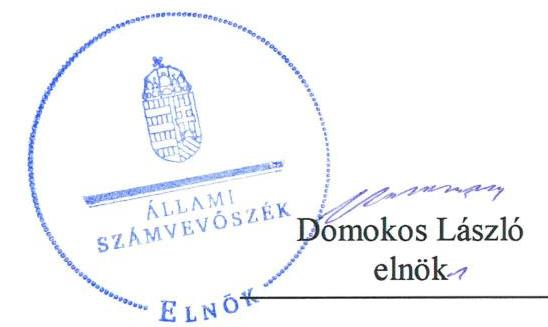
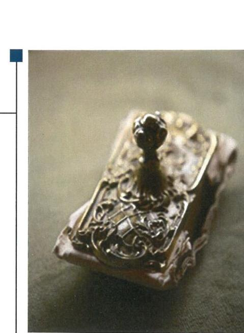
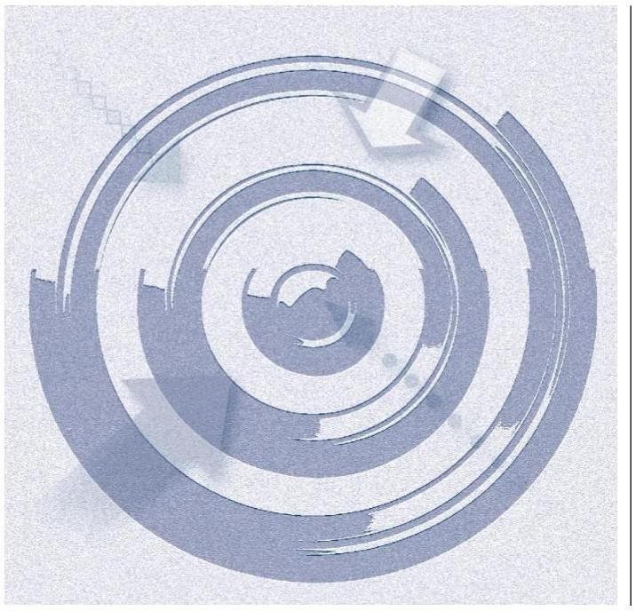
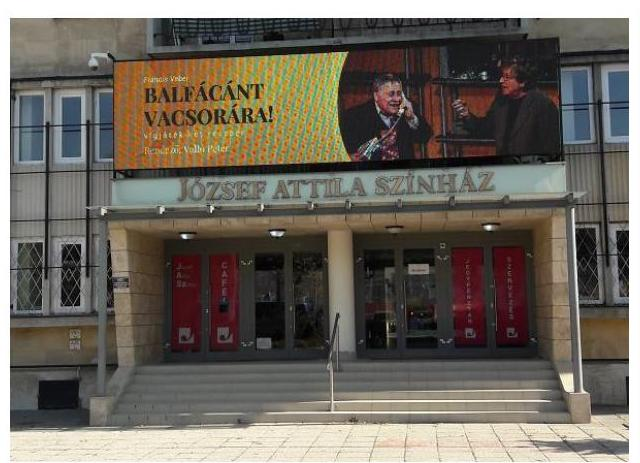
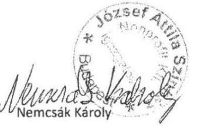
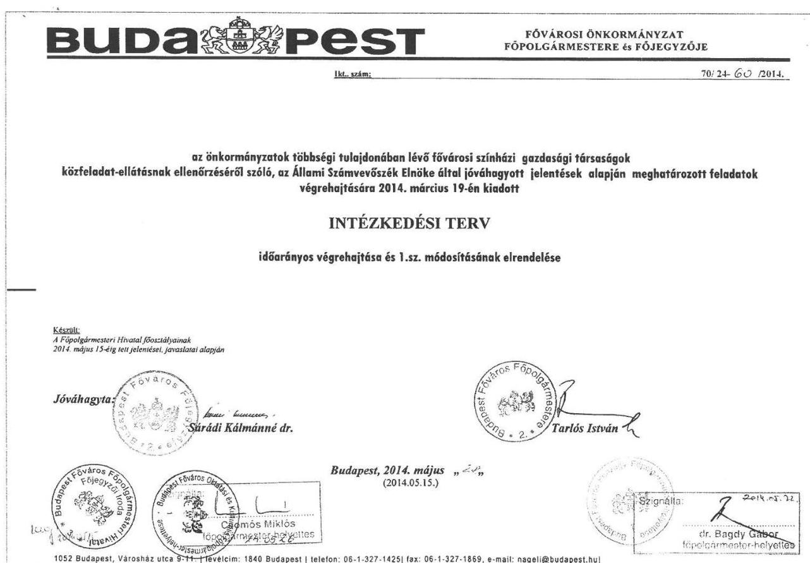

# Jelentés 

## Utóellenőrzések

Az önkormányzatok többségi tulajdonában lévő gazdasági társaságok közfeladatellátásának ellenőrzése - József Attila Színház Nonprofit Kft.
2019.

---

# Jelentés 

## Utóellenőrzések

Az önkormányzatok többségi tulajdonában lévő gazdasági társaságok közfeladatellátásának ellenőrzése - József Attila Színház Nonprofit Kft.
2019. 03. hó 26. nap

---

|  J | AZ ELLENŐRZÉST FELÜGYELTE:  |
| --- | --- |
|   | DR. NAGY IMRE felügyeleti vezető  |
|   | AZ ELLENŐRZÉST VEZETTE ÉS A VÉGREHAJTÁSÁÉRT FELELŐS:  |
|   | MOLNÁR ZSUZSANNA ellenőrzésvezető  |
|   | A PROGRAM ÖSSZEÁLLÍTÁSÁÉRT FELELŐS:  |
|   | TÓTPÁL SZABOLCS osztályvezető  |
|   | A TÉMÁHOZ KAPCSOLÓDÓ KORÁBBI SZÁMVEVŐSZÉKI JELENTÉSEK:  |
|   | - címe: Jelentés az önkormányzatok többségi tulajdonában lévő gazdasági társaságok közfeladat-ellátásának ellenőrzéséről - József Attila Színház Nonprofit Kft.  |
|  J | sorszáma: 14047  |
|   | IKTATÓSZÁM: EL-0270-027/2019  |
|   | TÉMASZÁM: 2460  |
|   | ELLENŐRZÉS-AZONOSÍTÓ SZÁM: V080454  |

---

# TARTALOMJEGYZÉK 

■ ÖSSZEGZÉS ..... 5
■ AZ ELLENŐRZÉS CÉLJA ..... 6
■ AZ ELLENŐRZÉS TERÜLETE ..... 7
■ AZ ELLENŐRZÉS HÁTTERE, INDOKOLTSÁGA ..... 8
■ A JELENTÉS LÉNYEGES KÉRDÉSKÖRE ..... 9
■ AZ ELLENŐRZÉS HATÓKÖRE ÉS MÓDSZEREI ..... 10
■ MEGÁLLAPÍTÁSOK ..... 12
■ MELLÉKLETEK ..... 13
I. sz. melléklet: Budapest Főváros Önkormányzata és a József Attila Színház Nonprofit Kft. intézkedési tervének végrehajtása ..... 13
II. sz. melléklet: József Attila Színház Nonprofit Kft. és Budapest Főváros Önkormányzata intézkedési terve ..... 17
■ FÜGGELÉK: ÉSZREVÉTELEK ..... 27
■ RÖVIDÍTÉSEK JEGYZÉKE ..... 31

---

.

---

# ÖSSZEGZÉS 

A József Attila Színház Nonprofit Kft. által végre nem hajtott feladatok következtében a pénz-ügyi- és vagyongazdálkodás területén fennmaradt hiányosságok miatt a vagyonvesztés kockázata nőtt. A Budapest Főváros Önkormányzata által végrehajtott feladatok csökkentették a Társaság szabályozatlanságában rejlő kockázatokat. Ugyanakkor a tulajdonosi joggyakorló az általa vállalt feladatok végrehajtásának elmaradása miatt nem járult hozzá a Társaság vagyongazdálkodásában fennálló kockázatok csökkentéséhez.

## Az ellenőrzés társadalmi indokoltsága

Az Állami Számvevőszék stratégiájában célul tűzte ki a számvevőszéki munka hasznosulásának javítását. Ezzel összhangban ellenőrzi, hogy az ellenőrzött szervezet megvalósította-e a korábbi ellenőrzései által feltárt hibák, hiányosságok és szabálytalanságok megszüntetése céljából elkészített intézkedési tervében foglaltakat. A rendszeres utóellenőrzések hozzájárulnak a szükséges intézkedések tényleges végrehajtásához, ezáltal a közpénzügyek rendezettségének javulásához.

## Főbb megállapítások, következtetések

A József Attila Színház Nonprofit Kft. intézkedési tervében meghatározott négy feladatból kettőt határidőben végrehajtott, kettőt nem hajtott végre. Budapest Főváros Önkormányzata intézkedési tervében meghatározott öt feladatból két feladatot határidőben végrehajtottak, egy feladat részben került végrehajtásra, két feladatot nem hajtottak végre.

A József Attila Színház Nonprofit Kft. pénzügyi és vagyongazdálkodási területének szabályozottsága - a jogszabályi előírásoknak nem megfelelő leltározási szabályzat és pénzkezelési szabályzat miatt - továbbra sem felelt meg a jogszabályi előírásoknak, ami magában hordozza a vagyonvesztés kockázatát.

Budapest Főváros Önkormányzata - mint tulajdonosi joggyakorló - által végrehajtott vagyonrendelet módosítás valamint a fenntartói megállapodások felülvizsgálata és módosítása a szabályozottság területén csökkentették a kockázatokat. Az intézkedési tervben a jogszabályi kötelezettséget meghaladóan vállalt - a leltárkészítési és leltározási mintaszabályzat kidolgozásának - feladatát nem hajtották végre, ezáltal nem járultak hozzá a József Attila Színház Nonprofit Kft. vagyongazdálkodásában rejlő kockázatok csökkentéséhez.

---

# AZ ELLENŐRZÉS CÉLJA 

Az ellenőrzés célja annak értékelése volt, hogy a számvevőszéki jelentésben ${ }^{1}$ foglalt megállapításokkal összhangban készített intézkedési tervben meghatározott feladatokat az ellenőrzött szervezet végrehajtotta-e.

---

# AZ ELLENŐRZÉS TERÜLETE 

## József Attila Színház Nonprofit Kft.

A József Attila Színház 1956. óta önálló színház. Az Önkormányzat² kizárólagos tulajdonában lévő Színház ${ }^{3}$ 2009. óta működik nonprofit gazdasági formában és 2002. július 1-je óta közhasznú társaság. Alapításkori törzstőkéje 3,0 millió Ft volt. Főtevékenysége - mint közhasznú tevékenység - előadó-művészeti tevékenység, emellett üzletszerű gazdasági tevékenységet is folytat.

A Színház képviseletét az ügyvezető látja el. A jelenlegi ügyvezető 2011. augusztus 1. óta tölti be tisztségét.

A Színház 2017-ben 817,0 millió Ft bevételre tett szert, az összes ráfordítás 816,3 millió Ft volt. 2017-ben 265,6 millió Ft önkormányzati, illetve 176,5 millió Ft TAO támogatással ${ }^{4}$ gazdálkodtak. A 2017. évi eszközvagyon 452,2 millió Ft, az adózott eredmény 0,7 millió Ft volt.

A Színház tulajdonosi joggyakorlója Budapest Főváros Önkormányzata. A főpolgármester és a főjegyző 2010. óta látja el feladatát.

Az ÁSZ ${ }^{5}$ az önkormányzatok többségi tulajdonában lévő gazdasági társaságok közfeladat-ellátásának ellenőrzéséről készített 14047. számú számvevőszéki jelentését 2014. április 8-án tette közzé. Az ellenőrzés a 2008. január 1. és 2013. szeptember 27. közötti időszakra terjedt ki.

Az számvevőszéki jelentés a főjegyző ${ }^{6}$ - mint a főpolgármesteri hivatal ${ }^{7}$ vezetője - számára kettő, a Színház igazgatójának négy megállapítást fogalmazott meg.

Az Önkormányzat az ÁSZ Elnökének 2014. május 28-án küldte meg - a fővárosi színházak ellenőrzésének eredményeként nyilvánosságra hozott számvevőszéki jelentésekhez kapcsolódó intézkedési tervét, melyben négy pontban határozták meg a feladatokat. A Színház intézkedési terve az ügyvezető igazgató számára négy intézkedési kötelezettséggel járó feladatot tartalmazott.

---

# AZ ELLENŐRZÉS HÁTTERE, INDOKOLTSÁGA 

Az ÁSZ tv. ${ }^{8}$ 33. § (1) bekezdése értelmében a számvevőszéki jelentések megállapításaihoz és javaslataihoz kapcsolódóan az ellenőrzött szervezet vezetője intézkedési tervet köteles összeállítani, és az Állami Számvevőszék részére megküldeni.

Az intézkedési tervben foglaltak megvalósítását - az ÁSZ törvény 33. § (7) bekezdésében foglaltak alapján - az Állami Számvevőszék utóellenőrzés keretében ellenőrizheti. Az utóellenőrzések keretében - az intézkedések értékelése során - az Állami Számvevőszék figyelembe veszi az ellenőrzött szervezetek működési feltételeiben, valamint a jogszabályi előírásokban bekövetkezett változásokat.

Az utóellenőrzés során az ÁSZ értékeli, hogy az érintett számvevőszéki jelentésben foglalt megállapításokkal és javaslatokkal összhangban, az ellenőrzött szervezet által készített intézkedési tervben meghatározott feladatokat a feladatra kijelöltek végrehajtották-e.

Az intézkedések végrehajtásával az adott terület szabályszerű működése vonatkozásában a kockázatok csökkenhetnek, azonban hosszabb távon az intézkedési tervben foglaltak végrehajtásával önmagában nem szűnnek meg, csak akkor, ha beépülnek az ellenőrzött szervezet működésébe, azokat folyamatosan karban tartják, figyelembe véve, illetve kezelve a változásokat. Emellett az intézkedések végrehajtásáig újabb kockázatok merülhetnek fel a szabályszerű működés vonatkozásában, amelyek kezelése szintén kiemelten fontos az ellenőrzött szervezet számára.

Az ellenőrzött szervezet vezetője által készített intézkedési tervekben foglalt feladatok hiányos, illetve késedelmes végrehajtása, vagy annak elmaradása a szabályszerűség és a felelős vezetői magatartás vonatkozásában kockázatot hordoz, ami azt mutatja, hogy az ellenőrzések során feltárt hibák, hiányosságok és szabálytalanságok kezelése nem kapott kellő hangsúlyt. Az utóellenőrzés során is fennálló szabálytalanságok esetén a közpénz, közvagyon veszélyeztetettségi kockázat valószínűsített hatásának értékelése további intézkedéseket vonhat maga után.

Az ellenőrzött szervezet szintjén az utóellenőrzés feltárja, hogy a szervezet az intézkedések végrehajtásával hasznosította-e a korábbi ellenőrzési jelentésben a hiányosságok megszüntetése, illetve a kockázatok kezelése érdekében megfogalmazott javaslatokat, illetve az intézkedések végrehajtása elmaradásának következtében továbbra is fennálló szabálytalanság esetén értékeli a közpénzek, közvagyon veszélyeztetettségét.

Az ÁSZ szintjén az utóellenőrzés visszacsatolást ad az ellenőrzési jelentések hasznosulásáról, az intézkedések elmaradásának, vagy részleges megvalósulásának a közpénzek, közvagyon veszélyeztetettségére gyakorolt valószínűsített hatásának értékelése további intézkedéseket vonhat maga után.

---

# A JELENTÉS LÉNYEGES KÉRDÉSKÖRE 

Az ellenőrzött szervezetek az intézkedési tervben foglaltakat az előírt határidőben végrehajtották-e?

---

# AZ ELLENŐRZÉS HATÓKÖRE ÉS MÓDSZEREI 

## Az ellenőrzés típusa

Megfelelőségi ellenőrzés.

## Az ellenőrzött időszak

Az utóellenőrzés alapját képező számvevőszéki jelentés közzétételének napjától az ellenőrzésről szóló kiértesítő levél keltének napjáig tartó időszak. 2014. április 8-tól 2018. augusztus 6-ig.

## Az ellenőrzés tárgya

A számvevőszéki jelentésben foglalt megállapításokkal összhangban - a Színház és az Önkormányzat által - készített intézkedési tervben foglaltak végrehajtásának ellenőrzése.

## Az ellenőrzött szervezet

József Attila Színház Nonprofit Kft. és Budapest Főváros Önkormányzata.

## Az ellenőrzés jogalapja

Az ellenőrzés jogszabályi alapját az ÁSZ tv. 33. § (7) bekezdése képezi.

## Az ellenőrzés módszerei

Az ellenőrzést az ellenőrzött időszakban hatályos jogszabályok, az ellenőrzés szakmai szabályai, a jelen ellenőrzésre irányadó ÁSZ módszertanok, az ellenőrzési programban foglalt értékelési szempontok szerint végeztük.

Az ellenőrzés ideje alatt az ellenőrzöttekkel történő kapcsolattartást az ÁSZ SZMSZ ${ }^{9}$ - ének vonatkozó előírásai alapján biztosítottuk.

Az utóellenőrzés megállapításait az ÁSZ rendelkezésére álló, valamint az ÁSZ adatbekérése szerint, az ellenőrzöttek által rendelkezésre bocsátott dokumentumok alapozták meg.

Az ellenőrzési bizonyítékként felhasználható adatforrások közé tartoztak egyrészt az ellenőrzési program részletes szempontjainál felsorolt adatforrások, másrészt minden - az ellenőrzés folyamán feltárt, az ellenőrzés szempontjából információt tartalmazó dokumentum.

---

Az intézkedési tervekben előírt feladatokat azok végrehajthatósága, illetve végrehajtása szempontjából az alábbiak szerint értékeltük:
$\longrightarrow$ „határidőben végrehajtott" a feladat, ha a teljesítés dokumentáltan, az intézkedési tervben előírt határidőben és tartalommal megtörtént;
$\longrightarrow$ „határidőn túl végrehajtott" a feladat, ha annak teljesítése az intézkedési tervben meghatározott módon, de az előírt határidőn túl történt meg;
$\longrightarrow$ „részben végrehajtott" a feladat, ha annak végrehajtása nem teljes körűen az intézkedési tervben előírt módon történt meg;
$\longrightarrow$ „nem végrehajtott" a feladat, ha a végrehajtás nem történt meg, dokumentumokkal nem igazolt annak teljesítése;
$\longrightarrow$ „okafogyottá vált" a feladat, ha végrehajtására - meghatározott esemény bekövetkezése, továbbá külső körülmény, a működést érintő feltétel változása miatt - már nincs szükség, illetve lehetőség, és egyértelműen megállapítható, hogy az intézkedést szükségessé tevő körülmény a jövőben nem fordulhat elő;
$\longrightarrow$ „nem időszerű" az a feladat, amelynek ellenőrzési időszakon belüli végrehajtására azért nem került (kerülhetett) sor, mert az intézkedés alapjául szolgáló esemény nem következett be, de annak jövőbeni előfordulása lehetséges, a végrehajtása nem volt esedékes, vagy a végrehajtás határideje még nem járt le.
Az ellenőrzés lefolytatásához az ellenőrzöttek a tanúsítványok elektronikus kitöltésével, valamint az ÁSZ által kért dokumentumok elektronikus megküldésével szolgáltattak adatokat, amelyek valódiságát és teljes körűségét az ellenőrzött szervezetek vezetői által tett teljességi és hitelességi nyilatkozatok igazolják. Az így rendelkezésre bocsátott adatok, információk kontrollja az ellenőrzés keretében megtörtént.

---

# MEGÁLLAPÍTÁSOK 

## Az ellenőrzött szervezetek az intézkedési tervben foglaltakat az előírt határidőben végrehajtották-e?

Összegző megállapítás

A Színház az intézkedési tervben vállalt négy feladatból kettőt határidőben végrehajtott, kettőt nem hajtott végre. Az Önkormányzat két feladatot határidőben végrehajtott, egyet részben hajtott végre, két feladat nem került végrehajtásra. A pénzügyi- és vagyongazdálkodás területén fennálló kockázatokat csökkentő feladatok végrehajtása elmaradt.

A Színház az általa készített intézkedési tervben meghatározott négy feladatból kettőt határidőben végrehajtott, kettőt nem hajtott végre. Az Önkormányzat intézkedési tervében meghatározott öt feladatból két feladatot határidőben végrehajtott, egyet részben hajtott végre, kettő nem került végrehajtásra.

A feladatokat, határidőket, megjelölt felelősöket és a feladatok végrehajtását az I. sz. melléklet mutatja be.

A főjegyző gondoskodott a külső ellenőrzések javaslatai alapján készült intézkedési tervekben meghatározott feladatok végrehajtásának Bkr. ${ }^{10}$ szerinti nyilvántartásáról.

A SZÍNHÁZ szabályozottságát gyengítette, ezáltal növelte a vagyonvesztés kockázatát, hogy a leltározási szabályzatot ${ }^{11}$ nem a Számv. tv. előírásai szerint módosították (3.) és hogy elmaradt a pénzkezelési szabályzatnak a Számv. tv.-ben ${ }^{12}$ foglaltak szerinti, felelősségi szabályokkal történő kiegészítése. (4.)

AZ ÖNKORMÁNYZAT által vállalt feladat nem végrehajtása következtében a vagyongazdálkodás területén fennálló kockázatok nőttek azzal, hogy - az intézkedési tervben a jogszabályi kötelezettséget meghaladóan vállaltak ellenére - nem tettek javaslatot a színházak leltározási szabályzatának mintájára és hogy nem készült javaslat a leltározási szabályzatban foglaltak végrehajtásának ellenőrzési rendjére. (8)

A szabályozottságot javította, hogy a jogszabályi előírások szerint módosították a Színházzal kötött fenntartói megállapodást és vagyonrendeletet $^{13}$. (6.)

---

# MELLÉKLETEK

- I. SZ. MELLÉKLET: BUDAPEST FŐVÁROS ÖNKORMÁNYZATA ÉS A JÓZSEF ATTILA SZÍNHÁZ NONPROFIT KFT. INTÉZKEDÉSI TERVÉNEK VÉGREHAJTÁSA

|  1. | Intézkedési terv alapján elvégzendő feladat | Az intézkedési tervben meghatározott határidő | Az intézkedési tervben meghatározott felelős | Az intézkedési tervben meghatározott feladat végrehajtása  |
| --- | --- | --- | --- | --- |
|   | 1. | 2.
József Attila Színház Nonprofit Kft. Határidőben végrehajtott feladatok |  |   |
|  1. | Az Eszközök és források értékelési szabályzatát a bemutató után felmerült díszlet- és jelmezkiadások elszámolásának szabályozásával ki kell egészíteni. | 2014. június 30. | gazdasági igazgató | A 2014. január 1-jén hatályba lépett Eszközök és Források Értékelési szabályzatot ${ }_{1}$ a vállalt határidőre kiegészítették a színházi bemutató után felmerült kiadások elszámolásának szabályozásával.  |
|  2. | A Fővárosi Önkormányzattal egyeztetve a színház adott időszakot követő vezetője (Ménes László) ügyészségi bejelentést tett a gazdasági visszaélések miatt. A vizsgálat azóta is zajlik, A Színház a Főváros vezetését folyamatosan tájékoztatja.
Az új működési formához igazodó SZMSZ-t a Fővárosi Önkormányzat 2013-ban elfogadta, a Színház szabályozásának teljes körű átdolgozása megtörtént. További intézkedést nem igényel. | - | - | A Színház szervezeti működési szabályozásának átdolgozása - a 2013. április 15-én elkészített új működési formához igazodó SZMSZ-szel - megtörtént, amelyet a közgyűlés az 1718/2013. (IX. 26.) számú határozatával elfogadott.  |
|   |  | Nem végrehajtott feladatok |  |   |
|  3. | A leltározási szabályzatban előírt leltározási gyakoriság módosítása a Számviteli törvénynek megfelelően. | 2014. június 30. | gazdasági igazgató | A Színház leltározási szabályzataiban ${ }_{1,2}$ előírt leltározási gyakoriságot nem a Számv. tv. előírásai szerint módosították. A leltározási szabályzatokban ${ }_{1,2}$ - a Számv. tv. 69. § (3) bekezdésében foglaltak ellenére - a kellék raktár és jelmez raktár továbbra is öt évenkénti leltározását írták elő.  |
|  4. | A Pénzkezelési szabályzatot ki kell egészíteni a Számviteli törvény 14. § (8) bekezdésében foglalt előírásoknak megfelelően. | 2014. június 30. | gazdasági igazgató | A pénzkezelési szabályzatot nem egészítették ki - a Számv. tv. 14. § (8) bekezdésében foglaltak ellenére - a felelősségi szabályokkal, így a Színház pénzkezelési szabályzata továbbra sem felel meg a Számv. tv. előírásának.  |

---

|  1. | 2. | 3. | 4.  |
| --- | --- | --- | --- |
|  Budapest Főváros Önkormányzata |  |  |   |
|  Határidőben végrehajtott feladatok |  |  |   |
|  5. | Gondoskodni kell arról, hogy | 2014. IV. negyedév | Belső Ellenőrzési  |
|   | b) a 2015. évi Belső Ellenőrzési Munkaterv tartalmazza valamennyi ÁSZ vizsgálattal érintett színházi társaság esetében az ÁSZ javaslatai végrehajtásának ellenőrzési feladatait. |  |   |
|  6. | "Az ÁSZ javaslatában foglaltakra tekintettel a hatályos jogszabályi előírások figyelembe vételével át kell tekinteni a hatályos Vagyonrendelet előírásait, a színházakkal megkötött haszonbérleti szerződéseket, illetve fenntartói megállapodásokat, a színházak leltárkészítési és leltározási szabályzatait, és javaslatot kell tenni a Vagyonrendelet indokolt módosítására, valamint a színházak leltárkészítés és leltározási szabályzataiban foglaltak végrehajtásának ellenőrzési rendjére. Ennek részeként: |  |   |
|   | c) közgyűlési elfogadásra javaslatot kell tenni a Vagyonrendelet módosítására, és amennyiben indokolt a haszonbérleti szerződések és a fenntartói megállapodások módosítására." |  |   |
|  7. | "Az ÁSZ javaslatában foglaltakra tekintettel a hatályos jogszabályi előírások figyelembe vételével át kell tekinteni a hatályos Vagyonrendelet előírásait, a színházakkal megkötött haszonbérleti szerződéseket, illetve fenntartói megállapodásokat, a színházak leltárkészítési és leltározási szabályzatait, és javaslatot kell tenni a Vagyonrendelet indokolt módosítására, valamint a színházak leltárkészítés és leltározási szabályzataiban foglaltak végrehajtásának ellenőrzési rendjére. Ennek részeként: | 2014. I. 11. 2014. 1. 2015. 2. 2015. 2. 2015. 2. 2015. 2. 2015. 2. 2015. 2. 2015. 2. 2015. 2. 2015. 2. 2015. 2. 2015. 2. 2015. 2. 2015. 2. 2015. 2. 2015. 2. 2015. 2. 2015. 2. 2015. 2. 2015. 2. 2015. 2. 2015. 2. 2015. 2. 2015. 2. 2015. 2. 2015. 2. 2015. 2. 2015. 2. 2015. 2. 2015. 2. 2015. 2. 2015. 2. 2015. 2. 2015. 2. 2015. 2. 2015. 2. 2015. 2. 2015. 2. 2015. 2. 2015. 2. 2015. 2. 2015. 2. 2015. 2. 2015. 2. 2015. 2. 2015. 2. 2015. 2. 2015. 2. 2015. 2. 2015. 2. 2015. 2. 2015. 2. 2015. 2. 2015. 2. 2015. 2. 2015. 2. 2015. 2. 2015. 2.
 2015. 2. 2015. 2. 2015. 2. 2015. 2. 2015. 2. 2015. 2. 2015. 2. 2015. 2. 2015. 2. 2015. 2. 2015. 2. 2015. 2. 2015. 2. 2015. 2. 2015. 2. 2015. 2. 2015. 2. 2015. 2. 2015. 2. 2015. 2. 2015. 2. 2015. 2. 2015. 2. 2015. 2. 2015. 2. 2015. 2. 2015. 2. 2015. 2. 2015. 2. 2015. 2. 2015. 2. 2015. 2. 2015. 2. 2015. 2. 2015. 2. 2015. 2. 2015. 2. 2015. 2. 2015. 2. 2015. 2. 2015. 2. 2015. 2. 2015. 2. 2015. 2. 2015. 2. 2015. 2. 2015. 2. 2015. 2. 2015. 2. 2015. 2. 2015. 2. 2015. 2. 2015. 2. 2015. 2. 2015. 2. 2015. 2. 2015. 2. 2015. 2. 2015. 2. 2015. 2. 2015. 2. 2015. 2. 2015. 2. 2015. 2. 2015. 2. 2015. 2. 2015. 2. 2015. 2. 2015. 2. 2015. 2. 2015. 2. 2015. 2. 2015. 2. 2015. 2. 2015. 2. 2015. 2. 2015. 2. 2015. 2. 2015. 2. 2015. 2. 2015. 2. 2015. 2. 2015. 2. 2015. 2. 2015. 2. 2015. 2. 2015. 2. 2015. 2. 2015. 2. 2015. 2. 2015. 2. 2015. 2. 2015. 2. 2015. 2. 2015. 2. 2015. 2. 2015. 2. 2015. 2. 2015. 2. 2015. 2. 2015. 2.
 2015. 2. 2015. 2. 2015. 2. 2015. 2. 2015. 2. 2015. 2. 2015. 2. 2015. 2. 2015. 2. 2015. 2. 2015. 2. 2015. 2. 2015. 2. 2015. 2. 2015. 2. 2015. 2. 2015. 2. 2015. 2. 2015. 2. 2015. 2. 2015. 2. 2015. 2. 2015. 2. 2015. 2. 2015. 2. 2015. 2. 2015. 2. 2015. 2. 2015. 2. 2015. 2. 2015. 2. 2015. 2. 2015. 2. 2015. 2. 2015. 2. 2015. 2. 2015. 2. 2015. 2. 2015. 2. 2015. 2. 2015. 2. 2015. 2. 2015. 2. 2015. 2. 2015. 2. 2015. 2. 2015. 2. 2015. 2. 2015. 2. 2015. 2. 2015. 2. 2015. 2. 2015. 2. 2015. 2. 2015. 2. 2015. 2. 2015. 2. 2015. 2. 2015. 2. 2015. 2. 2015. 2. 2015. 2. 2015. 2. 2015. 2. 2015. 2. 2015. 2. 2015. 2. 2015. 2. 2015. 2. 2015. 2. 2015. 2. 2015. 2. 2015. 2. 2015. 2. 2015. 2. 2015. 2. 2015. 2. 2015. 2. 2015. 2. 2015. 2. 2015. 2. 2015. 2. 2015. 2. 2015. 2. 2015. 2. 2015. 2. 2015. 2. 2015. 2. 2015. 2. 2015. 2. 2015. 2. 2015. 2. 2015. 2. 2015. 2. 2015. 2. 2015. 2. 2015. 2. 2015. 2. 2015. 2.
 2015. 2. 2015. 2. 2015. 2. 2015. 2. 2015. 2. 2015. 2. 2015. 2. 2015. 2. 2015. 2. 2015. 2. 2015. 2. 2015. 2. 2015. 2. 2015. 2. 2015. 2. 2015. 2. 2015. 2. 2015. 2. 2015. 2. 2015. 2. 2015. 2. 2015. 2. 2015. 2. 2015. 2. 2015. 2. 2015. 2. 2015. 2. 2015. 2. 2015. 2. 2015. 2. 2015. 2. 2015. 2. 2015. 2. 2015. 2. 2015. 2. 2015. 2. 2015. 2. 2015. 2. 2015. 2. 2015. 2. 2015. 2. 2015. 2. 2015. 2. 2015. 2. 2015. 2. 2015. 2. 2015. 2. 2015. 2. 2015. 2. 2015. 2. 2015. 2. 2015. 2. 2015. 2. 2015. 2. 2015. 2. 2015. 2. 2015. 2. 2015. 2. 2015. 2. 2015. 2. 2015. 2. 2015. 2. 2015. 2. 2015. 2. 2015. 2. 2015. 2. 2015. 2. 2015. 2. 2015. 2. 2015. 2. 2015. 2. 2015. 2. 2015. 2. 2015. 2. 2015. 2. 2015. 2. 2015. 2. 2015. 2. 2015. 2. 2015. 2. 2015. 2. 2015. 2. 2015. 2. 2015. 2. 2015. 2. 2015. 2. 2015. 2. 2015. 2. 2015. 2. 2015. 2. 2015. 2. 2015. 2. 2015. 2. 2015. 2. 2015. 2. 2015. 2. 2015. 2. 2015. 2. 2015. 2. 2015. 2. 2015. 2.
 2015. 2. 2015. 2. 2015. 2. 2015. 2. 2015. 2. 2015. 2. 2015. 2. 2015. 2. 2015. 2. 2015. 2. 2015. 2. 2015. 2. 2015. 2. 2015. 2. 2015. 2. 2015. 2. 2015. 2. 2015. 2. 2015. 2. 2015. 2. 2015. 2. 2015. 2. 2015. 2. 2015. 2. 2015. 2. 2015. 2. 2015. 2. 2015. 2. 2015. 2. 2015. 2. 2015. 2. 2015. 2. 2015. 2. 2015. 2. 2015. 2. 2015. 2. 2015. 2. 2015. 2. 2015. 2. 2015. 2. 2015. 2. 2015. 2. 2015. 2. 2015. 2. 2015. 2. 2015. 2. 2015. 2. 2015. 2. 2015. 2. 2015. 2. 2015. 2. 2015. 2. 2015. 2. 2015. 2. 2015. 2. 2015. 2. 2015. 2. 2015. 2. 2015. 2. 2015. 2. 2015. 2. 2015. 2. 2015. 2. 2015. 2. 2015. 2. 2015. 2. 2015. 2. 2015. 2. 2015. 2. 2015. 2. 2015. 2. 2015. 2. 2015. 2. 2015. 2. 2015. 2. 2015. 2. 2015. 2. 2015. 2. 2015. 2. 2015. 2. 2015. 2. 2015. 2. 2015. 2. 2015. 2. 2015. 2. 2015. 2. 2015. 2. 2015. 2. 2015. 2. 2015. 2. 2015. 2. 2015. 2. 2015. 2. 2015. 2. 2015. 2. 2015. 2. 2015. 2. 2015. 2. 2015. 2.
 2015. 2. 2015. 2. 2015. 2. 2015. 2. 2015. 2. 2015. 2. 2015. 2. 2015. 2. 2015. 2. 2015. 2. 2015. 2. 2015. 2. 2015. 2. 2015. 2. 2015. 2. 2015. 2. 2015. 2. 2015. 2. 2015. 2. 2015. 2. 2015. 2. 2015. 2. 2015. 2. 2015. 2. 2015. 2. 2015. 2. 2015. 2. 2015. 2. 2015. 2. 2015. 2. 2015. 2. 2015. 2. 2015. 2. 2015. 2. 2015. 2. 2015. 2. 2015. 2. 2015. 2. 2015. 2. 2015. 2. 2015. 2. 2015. 2. 2015. 2. 2015. 2. 2015. 2. 2015. 2. 2015. 2. 2015. 2. 2015. 2. 2015. 2. 2015. 2. 2015. 2. 2015. 2. 2015. 2. 2015. 2. 2015. 2. 2015. 2. 2015. 2. 2015. 2. 2015. 2. 2015. 2. 2015. 2. 2015. 2. 2015. 2. 2015. 2. 2015. 2. 2015. 2. 2015. 2. 2015. 2. 2015. 2. 2015. 2. 2015. 2. 2015. 2. 2015. 2. 2015. 2. 2015. 2. 2015. 2. 2015. 2. 2015. 2. 2015. 2. 2015. 2. 2015. 2. 2015. 2. 2015. 2. 2015. 2. 2015. 2. 2015. 2. 2015. 2. 2015. 2. 2015. 2. 2015. 2. 2015. 2. 2015. 2. 2015. 2. 2015. 2. 2015. 2. 2015. 2. 2015. 2. 2015. 2.
 2015. 2. 2015. 2. 2015. 2. 2015. 2. 2015. 2. 2015. 2. 2015. 2. 2015. 2. 2015. 2. 2015. 2. 2015. 2. 2015. 2. 2015. 2. 2015. 2. 2015. 2. 2015. 2. 2015. 2. 2015. 2. 2015. 2. 2015. 2. 2015. 2. 2015. 2. 2015. 2. 2015. 2. 2015. 2. 2015. 2. 2015. 2. 2015. 2. 2015. 2. 2015. 2. 2015. 2. 2015. 2. 2015. 2. 2015. 2. 2015. 2. 2015. 2. 2015. 2. 2015. 2. 2015. 2. 2015. 2. 2015. 2. 2015. 2. 2015. 2. 2015. 2. 2015. 2. 2015. 2. 2015. 2. 2015. 2. 2015. 2. 2015. 2. 2015. 2. 2015. 2. 2015. 2. 2015. 2. 2015. 2. 2015. 2. 2015. 2. 2015. 2. 2015. 2. 2015. 2. 2015. 2. 2015. 2. 2015. 2. 2015. 2. 2015. 2. 2015. 2. 2015. 2. 2015. 2. 2015. 2. 2015. 2. 2015. 2. 2015. 2. 2015. 2. 2015. 2. 2015. 2. 2015. 2. 2015. 2. 2015. 2. 2015. 2. 2015. 2. 2015. 2. 2015. 2. 2015. 2. 2015. 2. 2015. 2. 2015. 2. 2015. 2. 2015. 2. 2015. 2. 2015. 2. 2015. 2. 2015. 2. 2015. 2. 2015. 2. 2015. 2. 2015. 2. 2015. 2. 2015. 2. 2015. 2.
 2015. 2. 2015. 2. 2015. 2. 2015. 2. 2015. 2. 2015. 2. 2015. 2. 2015. 2. 2015. 2. 2015. 2. 2015. 2. 2015. 2. 2015. 2. 2015. 2. 2015. 2. 2015. 2. 2015. 2. 2015. 2. 2015. 2. 2015. 2. 2015. 2. 2015. 2. 2015. 2. 2015. 2. 2015. 2. 2015. 2. 2015. 2. 2015. 2. 2015. 2. 2015. 2. 2015. 2. 2015. 2. 2015. 2. 2015. 2. 2015. 2. 2015. 2. 2015. 2. 2015. 2. 2015. 2. 2015. 2. 2015. 2. 2015. 2. 2015. 2. 2015. 2. 2015. 2. 2015. 2. 2015. 2. 2015. 2. 2015. 2. 2015. 2. 2015. 2. 2015. 2. 2015. 2. 2015. 2. 2015. 2. 2015. 2. 2015. 2. 2015. 2. 2015. 2. 2015. 2. 2015. 2. 2015. 2. 2015. 2. 2015. 2. 2015. 2. 2015. 2. 2015. 2. 2015. 2. 2015. 2. 2015. 2. 2015. 2. 2015. 2. 2015. 2. 2015. 2. 2015. 2. 2015. 2. 2015. 2. 2015. 2. 2015. 2. 2015. 2. 2015. 2. 2015. 2. 2015. 2. 2015. 2. 2015. 2. 2015. 2. 2015. 2. 2015. 2. 2015. 2. 2015. 2. 2015. 2. 2015. 2. 2015. 2. 2015. 2. 2015. 2. 2015. 2. 2015. 2. 2015. 2. 2015. 2.
 2015. 2. 2015. 2. 2015. 2. 2015. 2. 2015. 2. 2015. 2. 2015. 2. 2015. 2. 2015. 2. 2015. 2. 2015. 2. 2015. 2. 2015. 2. 2015. 2. 2015. 2. 2015. 2. 2015. 2. 2015. 2. 2015. 2. 2015. 2. 2015. 2. 2015. 2. 2015. 2. 2015. 2. 2015. 2. 2015. 2. 2015. 2. 2015. 2. 2015. 2. 2015. 2. 2015. 2. 2015. 2. 2015. 2. 2015. 2. 2015. 2. 2015. 2. 2015. 2. 2015. 2. 2015. 2. 2015. 2. 2015. 2. 2015. 2. 2015. 2. 2015. 2. 2015. 2. 2015. 2. 2015. 2. 2015. 2. 2015. 2. 2015. 2. 2015. 2. 2015. 2. 2015. 2. 2015. 2. 2015. 2. 2015. 2. 2015. 2. 2015. 2. 2015. 2. 2015. 2. 2015. 2. 2015. 2. 2015. 2. 2015. 2. 2015. 2. 2015. 2. 2015. 2. 2015. 2. 2015. 2. 2015. 2. 2015. 2. 2015. 2. 2015. 2. 2015. 2. 2015. 2. 2015. 2. 2015. 2. 2015. 2. 2015. 2. 2015. 2. 2015. 2. 2015. 2. 2015. 2. 2015. 2. 2015. 2. 2015. 2. 2015. 2. 2015. 2. 2015. 2. 2015. 2. 2015. 2. 2015. 2. 2015. 2. 2015. 2. 2015. 2. 2015. 2. 2015. 2. 2015. 2. 2015. 2.
 2015. 2. 2015. 2. 2015. 2. 2015. 2. 2015. 2. 2015. 2. 2015. 2. 2015. 2. 2015. 2. 2015. 2. 2015. 2. 2015. 2. 2015. 2. 2015. 2. 2015. 2. 2015. 2. 2015. 2. 2015. 2. 2015. 2. 2015. 2. 2015. 2. 2015. 2. 2015. 2. 2015. 2. 2015. 2. 2015. 2. 2015. 2. 2015. 2. 2015. 2. 2015. 2. 2015. 2. 2015. 2. 2015. 2. 2015. 2. 2015. 2. 2015. 2. 2015. 2. 2015. 2. 2015. 2. 2015. 2. 2015. 2. 2015. 2. 2015. 2. 2015. 2. 2015. 2. 2015. 2. 2015. 2. 2015. 2. 2015. 2. 2015. 2. 2015. 2. 2015. 2. 2015. 2. 2015. 2. 2015. 2. 2015. 2. 2015. 2. 2015. 2. 2015. 2. 2015. 2. 2015. 2. 2015. 2. 2015. 2. 2015. 2. 2015. 2. 2015. 2. 2015. 2. 2015. 2. 2015. 2. 2015. 2. 2015. 2. 2015. 2. 2015. 2. 2015. 2. 2015. 2. 2015. 2. 2015. 2. 2015. 2. 2015. 2. 2015. 2. 2015. 2. 2015. 2. 2015. 2. 2015. 2. 2015. 2. 2015. 2. 2015. 2. 2015. 2. 2015. 2. 2015. 2. 2015. 2. 2015. 2. 2015. 2. 2015. 2. 2015. 2. 2015. 2. 2015. 2. 2015. 2. 2015. 2. 2015. 2. 2015. 2.
 2015. 2. 2015. 2. 2015. 2. 2015. 2. 2015. 2. 2015. 2. 2015. 2. 2015. 2. 2015. 2. 2015. 2. 2015. 2. 2015. 2. 2015. 2. 2015. 2. 2015. 2. 2015. 2. 2015. 2. 2015. 2. 2015. 2. 2015. 2. 2015. 2. 2015. 2. 2015. 2. 2015. 2. 2015. 2. 2015. 2. 2015. 2. 2015. 2. 2015. 2. 2015. 2. 2015. 2. 2015. 2. 2015. 2. 2015. 2. 2015. 2. 2015. 2. 2015. 2. 2015. 2. 2015. 2. 2015. 2. 2015. 2. 2015. 2. 2015. 2. 2015. 2. 2015. 2. 2015. 2. 2015. 2. 2015. 2. 2015. 2. 2015. 2. 2015. 2. 2015. 2. 2015. 2. 2015. 2. 2015. 2. 2015. 2. 2015. 2. 2015. 2. 2015. 2. 2015. 2. 2015. 2. 2015. 2. 2015. 2. 2015. 2. 2015. 2. 2015. 2. 2015. 2. 2015. 2. 2015. 2. 2015. 2. 2015. 2. 2015. 2. 2015. 2. 2015. 2. 2015. 2. 2015. 2. 2015. 2. 2015. 2. 2015. 2. 2015. 2. 2015. 2. 2015. 2. 2015. 2. 2015. 2. 2015. 2. 2015. 2. 2015. 2. 2015. 2. 2015. 2. 2015. 2. 2015. 2. 2015. 2. 2015. 2. 2015. 2. 2015. 2. 2015. 2. 2015. 2. 2015. 2. 2015. 2.
 2015. 2. 2015. 2. 2015. 2. 2015. 2. 2015. 2. 2015. 2. 2015. 2. 2015. 2. 2015. 2. 2015. 2. 2015. 2. 2015. 2. 2015. 2. 2015. 2. 2015. 2. 2015. 2. 2015. 2. 2015. 2. 2015. 2. 2015. 2. 2015. 2. 2015. 2. 2015. 2. 2015. 2. 2015. 2. 2015. 2. 2015. 2. 2015. 2. 2015. 2. 2015. 2. 2015. 2. 2015. 2. 2015. 2. 2015. 2. 2015. 2. 2015. 2. 2015. 2. 2015. 2. 2015. 2. 2015. 2. 2015. 2. 2015. 2. 2015. 2. 2015. 2. 2015. 2. 2015. 2. 2015. 2. 2015. 2. 2015. 2. 2015. 2. 2015. 2. 2015. 2. 2015. 2. 2015. 2. 2015. 2. 2015. 2. 2015. 2. 2015. 2. 2015. 2. 2015. 2. 2015. 2. 2015. 2. 2015. 2. 2015. 2. 2015. 2. 2015. 2. 2015. 2. 2015. 2. 2015. 2. 2015. 2. 2015. 2. 2015. 2. 2015. 2. 2015. 2. 2015. 2. 2015. 2. 2015. 2. 2015. 2. 2015. 2. 2015. 2. 2015. 2. 2015. 2. 2015. 2. 2015. 2. 2015. 2. 2015. 2. 2015. 2. 2015. 2. 2015. 2. 2015. 2. 2015. 2. 2015. 2. 2015. 2. 2015. 2. 2015. 2. 2015. 2. 2015. 2. 2015. 2. 2015. 2. 2015. 2. 2015. 2.
 2015. 2. 2015. 2. 2015. 2. 2015. 2. 2015. 2. 2015. 2. 2015. 2. 2015. 2. 2015. 2. 2015. 2. 2015. 2. 2015. 2. 2015. 2. 2015. 2. 2015. 2. 2015. 2. 2015. 2. 2015. 2. 2015. 2. 2015. 2. 2015. 2. 2015. 2. 2015. 2. 2015. 2. 2015. 2. 2015. 2. 2015. 2. 2015. 2. 2015. 2. 2015. 2. 2015. 2. 2015. 2. 2015. 2. 2015. 2. 2015. 2. 2015. 2. 2015. 2. 2015. 2. 2015. 2. 2015. 2. 2015. 2. 2015. 2. 2015. 2. 2015. 2. 2015. 2. 2015. 2. 2015. 2. 2015. 2. 2015. 2. 2015. 2. 2015. 2. 2015. 2. 2015. 2. 2015. 2. 2015. 2. 2015. 2. 2015. 2. 2015. 2. 2015. 2. 2015. 2. 2015. 2. 2015. 2. 2015. 2. 2015. 2. 2015. 2. 2015. 2. 2015. 2. 2015. 2. 2015. 2. 2015. 2. 2015. 2. 2015. 2. 2015. 2. 2015. 2. 2015. 2. 2015. 2. 2015. 2. 2015. 2. 2015. 2. 2015. 2. 2015. 2. 2015. 2. 2015. 2. 2015. 2. 2015. 2. 2015. 2. 2015. 2. 2015. 2. 2015. 2. 2015. 2. 2015. 2. 2015. 2. 2015. 2. 2015. 2. 2015. 2. 2015. 2. 2015. 2. 2015. 2. 2015. 2.
 2015. 2. 2015. 2. 2015. 2. 2015. 2. 2015. 2. 2015. 2. 2015. 2. 2015. 2. 2015. 2. 2015. 2. 2015. 2. 2015. 2. 2015. 2. 2015. 2. 2015. 2. 2015. 2. 2015. 2. 2015. 2. 2015. 2. 2015. 2. 2015. 2. 2015. 2. 2015. 2. 2015. 2. 2015. 2. 2015. 2. 2015. 2. 2015. 2. 2015. 2. 2015. 2. 2015. 2. 2015. 2. 2015. 2. 2015. 2. 2015. 2. 2015. 2. 2015. 2. 2015. 2. 2015. 2. 2015. 2. 2015. 2. 2015. 2. 2015. 2. 2015. 2. 2015. 2. 2015. 2. 2015. 2. 2015. 2. 2015. 2. 2015. 2. 2015. 2. 2015. 2. 2015. 2. 2015. 2. 2015. 2. 2015. 2. 2015. 2. 2015. 2. 2015. 2. 2015. 2. 2015. 2. 2015. 2. 2015. 2. 2015. 2. 2015. 2. 2015. 2. 2015. 2. 2015. 2. 2015. 2. 2015. 2. 2015. 2. 2015. 2. 2015. 2. 2015. 2. 2015. 2. 2015. 2. 2015. 2. 2015. 2. 2015. 2. 2015. 2. 2015. 2. 2015. 2. 2015. 2. 2015. 2. 2015. 2. 2015. 2. 2015. 2. 2015. 2. 2015. 2. 2015. 2. 2015. 2. 2015. 2. 2015. 2. 2015. 2. 2015. 2. 2015. 2. 2015. 2. 2015. 2. 2015. 2.
 2015. 2. 2015. 2. 2015. 2. 2015. 2. 2015. 2. 2015. 2. 2015. 2. 2015. 2. 2015. 2. 2015. 2. 2015. 2. 2015. 2. 2015. 2. 2015. 2. 2015. 2. 2015. 2. 2015. 2. 2015. 2. 2015. 2. 2015. 2. 2015. 2. 2015. 2. 2015. 2. 2015. 2. 2015. 2. 2015. 2. 2015. 2. 2015. 2. 2015. 2. 2015. 2. 2015. 2. 2015. 2. 2015. 2. 2015. 2. 2015. 2. 2015. 2. 2015. 2. 2015. 2. 2015. 2. 2015. 2. 2015. 2. 2015. 2. 2015. 2. 2015. 2. 2015. 2. 2015. 2. 2015. 2. 2015. 2. 2015. 2. 2015. 2. 2015. 2. 2015. 2. 2015. 2. 2015. 2. 2015. 2. 2015. 2. 2015. 2. 2015. 2. 2015. 2. 2015. 2. 2015. 2. 2015. 

---

|  1. | 2. | 3. | 4.  |
| --- | --- | --- | --- |
|  |   |   |   |

|  8. | „Az ÁSZ javaslatában foglaltakra tekintettel a hatályos jogszabályi előírások figyelembe vételével át kell tekinteni a hatályos Vagyonrendelet előírásait, a színházakkal megkötött haszonbérleti szerződéseket, illetve fenntartói megállapodások a színházak leltárkészítési és leltározási szabályzatait, és javaslatot kell tenni a Vagyonrendelet indokolt módosítására, valamint a színházak leltárkészítés és leltározási szabályzataiban foglaltak végrehajtásának ellenőrzési rendjére. Ennek részeként: a) javaslatot kell tenni a Leltárkészítés és leltározás szabályzatának mintájára; | 2014. június 15. | Pénzügyi Főosztály vezetője | A leltározás szabályzatának mintájára és a leltározási szabályzatban foglaltak végrehajtásának ellenőrzési rendjére – az intézkedési tervben meghatározottak ellenére – nem készült javaslat.  |
| --- | --- | --- | --- |
|  9. | A Polgári Törvénykönyvről szóló 2013. évi V. törvény szabályozásaira tekintettel: a) felül kell vizsgálni a Főváros által alapított színházi társaságok alapító okiratait, valamint a Fővárosi Önkormányzat vonatkozó rendeleti szabályozását oly módon, hogy az egyértelműen szabályozza: a társasági SZMSZ-ek jóváhagyásának, illetve a társasági FB-ok ügyrendje jóváhagyásának, valamint az FB-k beszámolási kötelezettségének rendjét, a Főpolgármester, illetve a Fővárosi Közgyűlés ez irányú feladatait, és javaslatot kell tenni a szükséges módosításokra. | módosítási javaslat elkészítésére: 2014. augusztus 31. közgyűlési előterjesztés benyújtására: városvezetői döntés szerint | Kulturális, Sport, Köznevelési, Egészségügyi és Szociál-politikai Főosztály vezetője  |

---

|  |   |   |   |   |
| --- | --- | --- | --- | --- |
|  1. | 2. | 3. | 4. |   |
|  b) | határidők és felelősök megjelölésével ütemezett javaslatot kell tenni az a) pontban megfogalmazott feladatra is figyelemmel a Fővárosi Önkormányzat által alapított valamennyi gazdasági társaság alapítói okiratának felülvizsgálatára, a szükséges módosítások elfogadására. | 2014. augusztus 31. | Vagyongazdálkodási Főosztály vezetője |   |

---

# II. SZ. MELLÉKLET: JÓZSEF ATTILA SZÍNHÁZ NONPROFIT KFT. ÉS BUDAPEST FŐVÁROS ÖNKORMÁNYZATA INTÉZKEDÉSI TERVE 

## JÓZSEF ATTILA SZÍNHÁZ

## ÁLLAMI SZÁMVEVŐSZÉK

1051 Budapest
Apáczai Csere János u. 10.

Tárgy: Intézkedési terv

Iktatószámuk: V-0192-099/2014.
Témaszám: 1159
Vizsgálat-azonosító szám: V06530210

Tisztelt Állami Számvevőszék!

Az önkormányzatok többségi tulajdonában lévő gazdasági társaságok közfeladat-ellátásának ellenőrzésével kapcsolatban a József Attila Színház Nonprofit Kft-nél végzett ellenőrzésről 2014. április 7-én készült jelentés megállapításaival kapcsolatban társaságunk a következő intézkedési tervet készítette:
1. A leltározási szabályzat nem felelt meg a Számviteli tv. 2012. január 1-vel hatályos 69.§.(3) bekezdés előírásainak, mert az ingatlanok, gépek, berendezések esetében a törvényi előírás szerinti legalább 3 éves gyakorisággal szemben 5 évenkénti mennyiségi felvétellel történő leltározási kötelezettséget írt elő.
3. Intézkedés: A leltározási szabályzatban előírt leltározási gyakoriság módosítása a Számviteli törvénynek megfelelően.

Felelős: gazdasági igazgató
Határidő: 2014. június 30.
2. A Pénzkezelési szabályzat nem tartalmazta a pénzügyi jogkörök gyakorlására feljogosított munkakörök megnevezését, valamint a felelős személyek nevét és aláírásmintáit.
4. Intézkedés: A Pénzkezelési szabályzatot ki kell egészíteni a Számviteli törvény 14.§ (8) bekezdésében foglalt előírásoknak megfelelően.

Felelős: gazdasági igazgató
Határidő: 2014. június 30.

---

3. Az Eszközök és Források értékelési szabályzata szerint a bemutatóig felmerült díszlet és jelmezkiadásokat - az egy évnél hosszabb használati idejű díszletek és jelmezek esetében - értéktől függetlenül a tárgyi eszközök között kell elszámolni. A szabályzat nem tartalmazott előírást a bemutató után felmerült kiadások elszámolására. A gyakorlatban ezeket a költségeket - értéktől függetlenül - azonnal költségként, az 5-ös számlaosztályban számolják el.
4. Intézkedés: Az Eszközök és Források értékelési szabályzatát a bemutató után felmerült díszlet- és jelmezkiadások elszámolásának szabályozásával ki kell egészíteni.

# Felelős: gazdasági igazgató 

Határidő: 2014. június 30.
4. A 2008. és 2010. évek között a Színház kiadásai minden évben meghaladták a pénzügyileg realizált bevételeit. Ennek következtében a Színháznak folyamatosan finanszírozási problémái voltak. A likviditás biztosítására a 2008. évben az Alapító Okiratban előírt tulajdonosi és FB-hozzájárulás nélkül 45,0 millió Ft finanszírozási hitelt vett fel. Az Önkormányzat belső ellenőrzése 2010. évben szabályszerűségi ellenőrzést végzett a Színháznál. A jelentésben a 2008-2010. évekre vonatkozóan megállapította, hogy a szervezeti és gazdálkodási szabályozottság elavult, a gazdálkodási jogkörök gyakorlását nem szabályozták és a kontrolitevékenység nem volt kielégítő.
2.

Intézkedés:
A Fővárosi Önkormányzattal egyeztetve a Színház adott időszakot követő vezetője (Méhes László igazgató) ügyészségi bejelentést tett a gazdasági visszaélések miatt. A vizsgálat azóta is zajlik, a Színház a Fővárosi Önkormányzat vezetését folyamatosan tájékoztatja.

Az új működési formához igazodó SZMSZ-t
 a Fővárosi Önkormányzat 2013-ban elfogadta, a Színház szabályozásának teljes körű átdolgozása megtörtént.

További intézkedést nem igényel.

Budapest, 2014. április 28.

ügyvezető igazgató

---

# BUDAGEPOST

## FŐVÁROSI ÖNKORMÁNYZAT FŐPOLGÁRMESTERE & FŐJEGYZŐJE

**Tel. 01-21-2014**

---

az önkormányzatok többségi tulajdonában lévő fővárosi színházi gazdasági társaságok körfeladat-ellátásának ellenőrzéséről szóló, az Állami Számvevőszék Elnöke által jóváhagyott jelentések alapján meghatározott feladatok végrehajtására 2014. március 19-én kiadott

### INTÉZKEDÉSI TERV

időerényes végrehajtása és 1. sz. módosításának elrendelése

---

**Kontakt:**
Fővágámézet/TV-utal/fővágámézet
2014. május 19-én, 19-én
jámdát, járadási alapjából

---

**Jóváhagyott Jóváhagyott Jóváhagyott Jóváhagyott Jóváhagyott Jóváhagyott Jóváhagyott Jóváhagyott Jóváhagyott Jóváhagyott Jóváhagyott Jóváhagyott Jóváhagyott Jóváhagyott Jóváhagyott Jóváhagyott Jóváhagyott Jóváhagyott Jóváhagyott Jóváhagyott Jóváhagyott Jóváhagyott Jóváhagyott Jóváhagyott Jóváhagyott Jóváhagyott Jóváhagyott Jóváhagyott Jóváhagyott Jóváhagyott Jóváhagyott Jóváhagyott Jóváhagyott Jóváhagyott Jóváhagyott Jóváhagyott Jóváhagyott Jóváhagyott Jóváhagyott Jóváhagyott Jóváhagyott Jóváhagyott Jóváhagyott Jóváhagyott Jóváhagyott Jóváhagyott Jóváhagyott Jóváhagyott Jóváhagyott Jóváhagyott Jóváhagyott Jóváhagyott Jóváhagyott Jóváhagyott Jóváhagyott Jóváhagyott Jóváhagyott Jóváhagyott Jóváhagyott Jóváhagyott Jóváhagyott Jóváhagyott Jóváhagyott Jóváhagyott Jóváhagyott Jóváhagyott Jóváhagyott Jóváhagyott Jóváhagyott Jóváhagyott Jóváhagyott Jóváhagyott Jóváhagyott Jóváhagyott Jóváhagyott Jóváhagyott Jóváhagyott Jóváhagyott Jóváhagyott Jóváhagyott Jóváhagyott Jóváhagyott Jóváhagyott Jóváhagyott Jóváhagyott Jóváhagyott Jóváhagyott Jóváhagyott Jóváhagyott Jóváhagyott Jóváhagyott Jóváhagyott Jóváhagyott Jóváhagyott Jóváhagyott Jóváhagyott Jóváhagyott Jóváhagyott Jóváhagyott Jóváhagyott Jóváhagyott Jóváhagyott Jóváhagyott Jóváhagyott Jóváhagyott Jóváhagyott Jóváhagyott Jóváhagyott Jóváhagyott Jóváhagyott Jóváhagyott Jóváhagyott Jóváhagyott Jóváhagyott Jóváhagyott Jóváhagyott Jóváhagyott Jóváhagyott Jóváhagyott Jóváhagyott Jóváhagyott Jóváhagyott Jóváhagyott Jóváhagyott Jóváhagyott Jóváhagyott Jóváhagyott Jóváhagyott Jóváhagyott Jóváhagyott Jóváhagyott Jóváhagyott Jóváhagyott Jóváhagyott Jóváhagyott Jóváhagyott Jóváhagyott Jóváhagyott Jóváhagyott Jóváhagyott Jóváhagyott Jóváhagyott Jóváhagyott Jóváhagyott Jóváhagyott Jóváhagyott Jóváhagyott Jóváhagyott Jóváhagyott Jóváhagyott Jóváhagyott Jóváhagyott Jóváhagyott Jóváhagyott Jóváhagyott Jóváhagyott Jóváhagyott Jóváhagyott Jóváhagyott Jóváhagyott Jóváhagyott Jóváhagyott Jóváhagyott Jóváhagyott Jóváhagyott Jóváhagyott Jóváhagyott Jóváhagyott Jóváhagyott Jóváhagyott Jóváhagyott Jóváhagyott Jóváhagyott Jóváhagyott Jóváhagyott Jóváhagyott Jóváhagyott Jóváhagyott Jóváhagyott Jóváhagyott Jóváhagyott Jóváhagyott Jóváhagyott Jóváhagyott Jóváhagyott Jóváhagyott Jóváhagyott Jóváhagyott Jóváhagyott Jóváhagyott Jóváhagyott Jóváhagyott Jóváhagyott Jóváhagyott Jóváhagyott Jóváhagyott Jóváhagyott Jóváhagyott Jóváhagyott Jóváhagyott Jóváhagyott Jóváhagyott Jóváhagyott Jóváhagyott Jóváhagyott Jóváhagyott Jóváhagyott Jóváhagyott Jóváhagyott Jóváhagyott Jóváhagyott Jóváhagyott Jóváhagyott Jóváhagyott Jóváhagyott Jóváhagyott Jóváhagyott Jóváhagyott Jóváhagyott Jóváhagyott Jóváhagyott Jóváhagyott Jóváhagyott Jóváhagyott Jóváhagyott Jóváhagyott Jóváhagyott Jóváhagyott Jóváhagyott Jóváhagyott Jóváhagyott Jóváhagyott Jóváhagyott Jóváhagyott Jóváhagyott Jóváhagyott Jóváhagyott Jóváhagyott Jóváhagyott Jóváhagyott Jóváhagyott Jóváhagyott Jóváhagyott Jóváhagyott Jóváhagyott Jóváhagyott Jóváhagyott Jóváhagyott Jóváhagyott Jóváhagyott Jóváhagyott Jóváhagyott Jóváhagyott Jóváhagyott Jóváhagyott Jóváhagyott Jóváhagyott Jóváhagyott Jóváhagyott Jóváhagyott Jóváhagyott Jóváhagyott Jóváhagyott Jóváhagyott Jóváhagyott Jóváhagyott Jóváhagyott Jóváhagyott Jóváhagyott Jóváhagyott Jóváhagyott Jóváhagyott Jóváhagyott Jóváhagyott Jóváhagyott Jóváhagyott Jóváhagyott Jóváhagyott Jóváhagyott Jóváhagyott Jóváhagyott Jóváhagyott Jóváhagyott Jóváhagyott Jóváhagyott Jóváhagyott Jóváhagyott Jóváhagyott Jóváhagyott Jóváhagyott Jóváhagyott Jóváhagyott Jóváhagyott Jóváhagyott Jóváhagyott Jóváhagyott Jóváhagyott Jóváhagyott Jóváhagyott Jóváhagyott Jóváhagyott Jóváhagyott Jóváhagyott Jóváhagyott Jóváhagyott Jóváhagyott Jóváhagyott Jóváhagyott Jóváhagyott Jóváhagyott Jóváhagyott Jóváhagyott Jóváhagyott Jóváhagyott Jóváhagyott Jóváhagyott Jóváhagyott Jóváhagyott Jóváhagyott Jóváhagyott Jóváhagyott Jóváhagyott Jóváhagyott Jóváhagyott Jóváhagyott Jóváhagyott Jóváhagyott Jóváhagyott Jóváhagyott Jóváhagyott Jóváhagyott Jóváhagyott Jóváhagyott Jóváhagyott Jóváhagyott Jóváhagyott Jóváhagyott Jóváhagyott Jóváhagyott Jóváhagyott Jóváhagyott Jóváhagyott Jóváhagyott Jóváhagyott Jóváhagyott Jóváhagyott Jóváhagyott Jóváhagyott Jóváhagyott Jóváhagyott Jóváhagyott Jóváhagyott Jóváhagyott Jóváhagyott Jóváhagyott Jóváhagyott Jóváhagyott Jóváhagyott Jóváhagyott Jóváhagyott Jóváhagyott Jóváhagyott Jóváhagyott Jóváhagyott Jóváhagyott Jóváhagyott Jóváhagyott Jóváhagyott Jóváhagyott Jóváhagyott Jóváhagyott Jóváhagyott Jóváhagyott Jóváhagyott Jóváhagyott Jóváhagyott Jóváhagyott Jóváhagyott Jóváhagyott Jóváhagyott Jóváhagyott Jóváhagyott Jóváhagyott Jóváhagyott Jóváhagyott Jóváhagyott Jóváhagyott Jóváhagyott Jóváhagyott Jóváhagyott Jóváhagyott Jóváhagyott Jóváhagyott Jóváhagyott Jóváhagyott Jóváhagyott Jóváhagyott Jóváhagyott Jóváhagyott Jóváhagyott Jóváhagyott Jóváhagyott Jóváhagyott Jóváhagyott Jóváhagyott Jóváhagyott Jóváhagyott Jóváhagyott Jóváhagyott Jóváhagyott Jóváhagyott Jóváhagyott Jóváhagyott Jóváhagyott Jóváhagyott Jóváhagyott Jóváhagyott Jóváhagyott Jóváhagyott Jóváhagyott Jóváhagyott Jóváhagyott Jóváhagyott Jóváhagyott Jóváhagyott Jóváhagyott Jóváhagyott Jóváhagyott Jóváhagyott Jóváhagyott Jóváhagyott Jóváhagyott Jóváhagyott Jóváhagyott Jóváhagyott Jóváhagyott Jóváhagyott Jóváhagyott Jóváhagyott Jóváhagyott Jóváhagyott Jóváhagyott Jóváhagyott Jóváhagyott Jóváhagyott Jóváhagyott Jóváhagyott Jóváhagyott Jóváhagyott Jóváhagyott Jóváhagyott Jóváhagyott Jóváhagyott Jóváhagyott Jóváhagyott Jóváhagyott Jóváhagyott Jóváhagyott Jóváhagyott Jóváhagyott Jóváhagyott Jóváhagyott Jóváhagyott Jóváhagyott Jóváhagyott Jóváhagyott Jóváhagyott Jóváhagyott Jóváhagyott Jóváhagyott Jóváhagyott Jóváhagyott Jóváhagyott Jóváhagyott Jóváhagyott Jóváhagyott Jóváhagyott Jóváhagyott Jóváhagyott Jóváhagyott Jóváhagyott Jóváhagyott Jóváhagyott Jóváhagyott Jóváhagyott Jóváhagyott Jóváhagyott Jóváhagyott Jóváhagyott Jóváhagyott Jóváhagyott Jóváhagyott Jóváhagyott Jóváhagyott Jóváhagyott Jóváhagyott Jóváhagyott Jóváhagyott Jóváhagyott Jóváhagyott Jóváhagyott Jóváhagyott Jóváhagyott Jóváhagyott Jóváhagyott Jóváhagyott
 Jóváhagyott Jóváhagyott Jóváhagyott Jóváhagyott Jóváhagyott Jóváhagyott Jóváhagyott Jóváhagyott Jóváhagyott Jóváhagyott Jóváhagyott Jóváhagyott Jóváhagyott Jóváhagyott Jóváhagyott Jóváhagyott Jóváhagyott Jóváhagyott Jóváhagyott Jóváhagyott Jóváhagyott Jóváhagyott Jóváhagyott Jóváhagyott Jóváhagyott Jóváhagyott Jóváhagyott Jóváhagyott Jóváhagyott Jóváhagyott Jóváhagyott Jóváhagyott Jóváhagyott Jóváhagyott Jóváhagyott Jóváhagyott Jóváhagyott Jóváhagyott Jóváhagyott Jóváhagyott Jóváhagyott Jóváhagyott Jóváhagyott Jóváhagyott Jóváhagyott Jóváhagyott Jóváhagyott Jóváhagyott Jóváhagyott Jóváhagyott Jóváhagyott Jóváhagyott Jóváhagyott Jóváhagyott Jóváhagyott Jóváhagyott Jóváhagyott Jóváhagyott Jóváhagyott Jóváhagyott Jóváhagyott Jóváhagyott Jóváhagyott Jóváhagyott Jóváhagyott Jóváhagyott Jóváhagyott Jóváhagyott Jóváhagyott Jóváhagyott Jóváhagyott Jóváhagyott Jóváhagyott Jóváhagyott Jóváhagyott Jóváhagyott Jóváhagyott Jóváhagyott Jóváhagyott Jóváhagyott Jóváhagyott Jóváhagyott Jóváhagyott Jóváhagyott Jóváhagyott Jóváhagyott Jóváhagyott Jóváhagyott Jóváhagyott Jóváhagyott Jóváhagyott Jóváhagyott Jóváhagyott Jóváhagyott Jóváhagyott Jóváhagyott Jóváhagyott Jóváhagyott Jóváhagyott Jóváhagyott Jóváhagyott Jóváhagyott Jóváhagyott Jóváhagyott Jóváhagyott Jóváhagyott Jóváhagyott Jóváhagyott Jóváhagyott Jóváhagyott Jóváhagyott Jóváhagyott Jóváhagyott Jóváhagyott Jóváhagyott Jóváhagyott Jóváhagyott Jóváhagyott Jóváhagyott Jóváhagyott Jóváhagyott Jóváhagyott Jóváhagyott Jóváhagyott Jóváhagyott Jóváhagyott Jóváhagyott Jóváhagyott Jóváhagyott Jóváhagyott Jóváhagyott Jóváhagyott Jóváhagyott Jóváhagyott Jóváhagyott Jóváhagyott Jóváhagyott Jóváhagyott Jóváhagyott Jóváhagyott Jóváhagyott Jóváhagyott Jóváhagyott Jóváhagyott Jóváhagyott Jóváhagyott Jóváhagyott Jóváhagyott Jóváhagyott Jóváhagyott Jóváhagyott Jóváhagyott Jóváhagyott Jóváhagyott Jóváhagyott Jóváhagyott Jóváhagyott Jóváhagyott Jóváhagyott Jóváhagyott Jóváhagyott Jóváhagyott Jóváhagyott Jóváhagyott Jóváhagyott Jóváhagyott Jóváhagyott Jóváhagyott Jóváhagyott Jóváhagyott Jóváhagyott Jóváhagyott Jóváhagyott Jóváhagyott Jóváhagyott Jóváhagyott Jóváhagyott Jóváhagyott Jóváhagyott Jóváhagyott Jóváhagyott Jóváhagyott Jóváhagyott Jóváhagyott Jóváhagyott Jóváhagyott Jóváhagyott Jóváhagyott Jóváhagyott Jóváhagyott Jóváhagyott Jóváhagyott Jóváhagyott Jóváhagyott Jóváhagyott Jóváhagyott Jóváhagyott Jóváhagyott Jóváhagyott Jóváhagyott
 Jóváhagyott Jóváhagyott Jóváhagyott Jóváhagyott Jóváhagyott Jóváhagyott Jóváhagyott Jóváhagyott Jóváhagyott Jóváhagyott Jóváhagyott Jóváhagyott Jóváhagyott Jóváhagyott Jóváhagyott Jóváhagyott Jóváhagyott Jóváhagyott Jóváhagyott Jóváhagyott Jóváhagyott Jóváhagyott Jóváhagyott Jóváhagyott Jóváhagyott Jóváhagyott Jóváhagyott Jóváhagyott Jóváhagyott Jóváhagyott Jóváhagyott Jóváhagyott Jóváhagyott Jóváhagyott Jóváhagyott Jóváhagyott Jóváhagyott Jóváhagyott Jóváhagyott Jóváhagyott Jóváhagyott Jóváhagyott Jóváhagyott Jóváhagyott Jóváhagyott Jóváhagyott Jóváhagyott Jóváhagyott Jóváhagyott Jóváhagyott Jóváhagyott Jóváhagyott Jóváhagyott Jóváhagyott Jóváhagyott Jóváhagyott Jóváhagyott Jóváhagyott Jóváhagyott Jóváhagyott Jóváhagyott Jóváhagyott Jóváhagyott Jóváhagyott Jóváhagyott Jóváhagyott Jóváhagyott Jóváhagyott Jóváhagyott Jóváhagyott Jóváhagyott Jóváhagyott Jóváhagyott Jóváhagyott Jóváhagyott Jóváhagyott Jóváhagyott Jóváhagyott Jóváhagyott Jóváhagyott Jóváhagyott Jóváhagyott Jóváhagyott Jóváhagyott Jóváhagyott Jóváhagyott Jóváhagyott Jóváhagyott Jóváhagyott Jóváhagyott Jóváhagyott Jóváhagyott Jóváhagyott Jóváhagyott Jóváhagyott Jóváhagyott Jóváhagyott Jóváhagyott Jóváhagyott Jóváhagyott Jóváhagyott Jóváhagyott Jóváhagyott Jóváhagyott Jóváhagyott Jóváhagyott Jóváhagyott Jóváhagyott Jóváhagyott Jóváhagyott Jóváhagyott Jóváhagyott Jóváhagyott Jóváhagyott Jóváhagyott Jóváhagyott Jóváhagyott Jóváhagyott Jóváhagyott Jóváhagyott Jóváhagyott Jóváhagyott Jóváhagyott Jóváhagyott Jóváhagyott Jóváhagyott Jóváhagyott Jóváhagyott Jóváhagyott Jóváhagyott Jóváhagyott Jóváhagyott Jóváhagyott Jóváhagyott Jóváhagyott Jóváhagyott Jóváhagyott Jóváhagyott Jóváhagyott Jóváhagyott Jóváhagyott Jóváhagyott Jóváhagyott Jóváhagyott Jóváhagyott Jóváhagyott Jóváhagyott Jóváhagyott Jóváhagyott Jóváhagyott Jóváhagyott Jóváhagyott Jóváhagyott Jóváhagyott Jóváhagyott Jóváhagyott Jóváhagyott Jóváhagyott Jóváhagyott Jóváhagyott Jóváhagyott Jóváhagyott Jóváhagyott Jóváhagyott Jóváhagyott Jóváhagyott Jóváhagyott Jóváhagyott Jóváhagyott Jóváhagyott Jóváhagyott Jóváhagyott Jóváhagyott Jóváhagyott Jóváhagyott Jóváhagyott Jóváhagyott Jóváhagyott Jóváhagyott Jóváhagyott Jóváhagyott Jóváhagyott Jóváhagyott Jóváhagyott Jóváhagyott Jóváhagyott Jóváhagyott Jóváhagyott Jóváhagyott Jóváhagyott Jóváhagyott Jóváhagyott Jóváhagyott Jóváhagyott Jóváhagyott Jóváhagyott Jóváhagyott Jóváhagyott Jóváhagyott Jóváhagyott
 Jóváhagyott Jóváhagyott Jóváhagyott Jóváhagyott Jóváhagyott Jóváhagyott Jóváhagyott Jóváhagyott Jóváhagyott Jóváhagyott Jóváhagyott Jóváhagyott Jóváhagyott Jóváhagyott Jóváhagyott Jóváhagyott Jóváhagyott Jóváhagyott Jóváhagyott Jóváhagyott Jóváhagyott Jóváhagyott Jóváhagyott Jóváhagyott Jóváhagyott Jóváhagyott Jóváhagyott Jóváhagyott Jóváhagyott Jóváhagyott Jóváhagyott Jóváhagyott Jóváhagyott Jóváhagyott Jóváhagyott Jóváhagyott Jóváhagyott Jóváhagyott Jóváhagyott Jóváhagyott Jóváhagyott Jóváhagyott Jóváhagyott Jóváhagyott Jóváhagyott Jóváhagyott Jóváhagyott Jóváhagyott Jóváhagyott Jóváhagyott Jóváhagyott Jóváhagyott Jóváhagyott Jóváhagyott Jóváhagyott Jóváhagyott Jóváhagyott Jóváhagyott Jóváhagyott Jóváhagyott Jóváhagyott Jóváhagyott Jóváhagyott Jóváhagyott Jóváhagyott Jóváhagyott Jóváhagyott Jóváhagyott Jóváhagyott Jóváhagyott Jóváhagyott Jóváhagyott Jóváhagyott Jóváhagyott Jóváhagyott Jóváhagyott Jóváhagyott Jóváhagyott Jóváhagyott Jóváhagyott Jóváhagyott Jóváhagyott Jóváhagyott Jóváhagyott Jóváhagyott Jóváhagyott Jóváhagyott Jóváhagyott Jóváhagyott Jóváhagyott Jóváhagyott Jóváhagyott Jóváhagyott Jóváhagyott Jóváhagyott Jóváhagyott Jóváhagyott Jóváhagyott Jóváhagyott Jóváhagyott Jóváhagyott Jóváhagyott Jóváhagyott Jóváhagyott Jóváhagyott Jóváhagyott Jóváhagyott Jóváhagyott Jóváhagyott Jóváhagyott Jóváhagyott Jóváhagyott Jóváhagyott Jóváhagyott Jóváhagyott Jóváhagyott Jóváhagyott Jóváhagyott Jóváhagyott Jóváhagyott Jóváhagyott Jóváhagyott Jóváhagyott Jóváhagyott Jóváhagyott Jóváhagyott Jóváhagyott Jóváhagyott Jóváhagyott Jóváhagyott Jóváhagyott Jóváhagyott Jóváhagyott Jóváhagyott Jóváhagyott Jóváhagyott Jóváhagyott Jóváhagyott Jóváhagyott Jóváhagyott Jóváhagyott Jóváhagyott Jóváhagyott Jóváhagyott Jóváhagyott Jóváhagyott Jóváhagyott Jóváhagyott Jóváhagyott Jóváhagyott Jóváhagyott Jóváhagyott Jóváhagyott Jóváhagyott Jóváhagyott Jóváhagyott Jóváhagyott Jóváhagyott Jóváhagyott Jóváhagyott Jóváhagyott Jóváhagyott Jóváhagyott Jóváhagyott Jóváhagyott Jóváhagyott Jóváhagyott Jóváhagyott Jóváhagyott Jóváhagyott Jóváhagyott Jóváhagyott Jóváhagyott Jóváhagyott Jóváhagyott Jóváhagyott Jóváhagyott Jóváhagyott Jóváhagyott Jóváhagyott Jóváhagyott Jóváhagyott Jóváhagyott Jóváhagyott Jóváhagyott Jóváhagyott Jóváhagyott Jóváhagyott Jóváhagyott Jóváhagyott Jóváhagyott Jóváhagyott Jóváhagyott Jóváhagyott Jóváhagyott Jóváhagyott Jóváhagyott Jóváhagyott Jóváhagyott Jóváhagyott
 Jóváhagyott Jóváhagyott Jóváhagyott Jóváhagyott Jóváhagyott Jóváhagyott Jóváhagyott Jóváhagyott Jóváhagyott Jóváhagyott Jóváhagyott Jóváhagyott Jóváhagyott Jóváhagyott Jóváhagyott Jóváhagyott Jóváhagyott Jóváhagyott Jóváhagyott Jóváhagyott Jóváhagyott Jóváhagyott Jóváhagyott Jóváhagyott Jóváhagyott Jóváhagyott Jóváhagyott Jóváhagyott Jóváhagyott Jóváhagyott Jóváhagyott Jóváhagyott Jóváhagyott Jóváhagyott Jóváhagyott Jóváhagyott Jóváhagyott Jóváhagyott Jóváhagyott Jóváhagyott Jóváhagyott Jóváhagyott Jóváhagyott Jóváhagyott Jóváhagyott Jóváhagyott Jóváhagyott Jóváhagyott Jóváhagyott Jóváhagyott Jóváhagyott Jóváhagyott Jóváhagyott Jóváhagyott Jóváhagyott Jóváhagyott Jóváhagyott Jóváhagyott Jóváhagyott Jóváhagyott Jóváhagyott Jóváhagyott Jóváhagyott Jóváhagyott Jóváhagyott Jóváhagyott Jóváhagyott Jóváhagyott Jóváhagyott Jóváhagyott Jóváhagyott Jóváhagyott Jóváhagyott Jóváhagyott Jóváhagyott Jóváhagyott Jóváhagyott Jóváhagyott Jóváhagyott Jóváhagyott Jóváhagyott Jóváhagyott Jóváhagyott Jóváhagyott Jóváhagyott Jóváhagyott Jóváhagyott Jóváhagyott Jóváhagyott Jóváhagyott Jóváhagyott Jóváhagyott Jóváhagyott Jóváhagyott Jóváhagyott Jóváhagyott Jóváhagyott Jóváhagyott Jóváhagyott Jóváhagyott Jóváhagyott Jóváhagyott Jóváhagyott Jóváhagyott Jóváhagyott Jóváhagyott Jóváhagyott Jóváhagyott Jóváhagyott Jóváhagyott Jóváhagyott Jóváhagyott Jóváhagyott Jóváhagyott Jóváhagyott Jóváhagyott Jóváhagyott Jóváhagyott Jóváhagyott Jóváhagyott Jóváhagyott Jóváhagyott Jóváhagyott Jóváhagyott Jóváhagyott Jóváhagyott Jóváhagyott Jóváhagyott Jóváhagyott Jóváhagyott Jóváhagyott Jóváhagyott Jóváhagyott Jóváhagyott Jóváhagyott Jóváhagyott Jóváhagyott Jóváhagyott Jóváhagyott Jóváhagyott Jóváhagyott Jóváhagyott Jóváhagyott Jóváhagyott Jóváhagyott Jóváhagyott Jóváhagyott Jóváhagyott Jóváhagyott Jóváhagyott Jóváhagyott Jóváhagyott Jóváhagyott Jóváhagyott Jóváhagyott Jóváhagyott Jóváhagyott Jóváhagyott Jóváhagyott Jóváhagyott Jóváhagyott Jóváhagyott Jóváhagyott Jóváhagyott Jóváhagyott Jóváhagyott Jóváhagyott Jóváhagyott Jóváhagyott Jóváhagyott Jóváhagyott Jóváhagyott Jóváhagyott Jóváhagyott Jóváhagyott Jóváhagyott Jóváhagyott Jóváhagyott Jóváhagyott Jóváhagyott Jóváhagyott Jóváhagyott Jóváhagyott Jóváhagyott Jóváhagyott Jóváhagyott Jóváhagyott Jóváhagyott Jóváhagyott Jóváhagyott Jóváhagyott Jóváhagyott Jóváhagyott Jóváhagyott Jóváhagyott Jóváhagyott Jóváhagyott Jóváhagyott Jóváhagyott Jóváhagyott
 Jóváhagyott Jóváhagyott Jóváhagyott Jóváhagyott Jóváhagyott Jóváhagyott Jóváhagyott Jóváhagyott Jóváhagyott Jóváhagyott Jóváhagyott Jóváhagyott Jóváhagyott Jóváhagyott Jóváhagyott Jóváhagyott Jóváhagyott Jóváhagyott Jóváhagyott Jóváhagyott Jóváhagyott Jóváhagyott Jóváhagyott Jóváhagyott Jóváhagyott Jóváhagyott Jóváhagyott Jóváhagyott Jóváhagyott Jóváhagyott Jóváhagyott Jóváhagyott Jóváhagyott Jóváhagyott Jóváhagyott Jóváhagyott Jóváhagyott Jóváhagyott Jóváhagyott Jóváhagyott Jóváhagyott Jóváhagyott Jóváhagyott Jóváhagyott Jóváhagyott Jóváhagyott Jóváhagyott Jóváhagyott Jóváhagyott Jóváhagyott Jóváhagyott Jóváhagyott Jóváhagyott Jóváhagyott Jóváhagyott Jóváhagyott Jóváhagyott Jóváhagyott Jóváhagyott Jóváhagyott Jóváhagyott Jóváhagyott Jóváhagyott Jóváhagyott Jóváhagyott Jóváhagyott Jóváhagyott Jóváhagyott Jóváhagyott Jóváhagyott Jóváhagyott Jóváhagyott Jóváhagyott Jóváhagyott Jóváhagyott Jóváhagyott Jóváhagyott Jóváhagyott Jóváhagyott Jóváhagyott Jóváhagyott Jóváhagyott Jóváhagyott Jóváhagyott Jóváhagyott Jóváhagyott Jóváhagyott Jóváhagyott Jóváhagyott Jóváhagyott Jóváhagyott Jóváhagyott Jóváhagyott Jóváhagyott Jóváhagyott Jóváhagyott Jóváhagyott Jóváhagyott Jóváhagyott Jóváhagyog Jóváhagyog Jóváhagyog Jóváhagyog Jóváhagyog Jóváhagyog Jóváhagyog Jóváhagyog Jóváhagyog Jóváhagyog Jóváhagyog Jóváhagyog Jóváhagyog Jóváhagyog Jóváhagyog Jóváhagyog Jóváhagyog Jóváhagyog Jóváhagyog Jóváhagyog Jóváhagyog Jóváhagyog Jóváhagyog Jóváhagyog Jóváhagyog Jóváhagyog Jóváhagyog Jóváhagyog Jóváhagyog Jóváhagyog Jóváhagyog Jóváhagyog Jóváhagyog Jóváhagyog Jóváhagyog Jóváhagyog Jóváhagyog Jóváhagyog Jóváhagyog Jóváhagyog Jóváhagyog Jóváhagyog Jóváhagyog Jóváhagyog Jóváhagyog Jóváhagyog Jóváhagyog Jóváhagyog Jóváhagyog Jóváhagyog Jóváhagyog Jóváhagyog Jóváhagyog Jóváhagyog Jóváhagyog Jóváhagyog Jóváhagyog Jóváhagyog Jóváhagyog Jóváhagyog Jóváhagyog Jóváhagyog Jóváhagyog Jóváhagyog Jóváhagyog Jóváhagyog Jóváhagyog Jóváhagyog Jóváhagyog Jóváhagyog Jóváhagyog Jóváhagyog Jóváhagyog Jóváhagyog Jóváhagyog Jóváhagyog Jóváhagyog Jóváhagyog Jóváhagyog Jóváhagyog Jóváhagyog Jóváhagyog Jóváhagyog Jóváhagyog Jóváhagyog Jóváhagyog Jóváhagyog Jóváhagyog Jóváhagyog Jóváhagyog Jóváhagyog Jóváhagyog Jóváhagyog Jóváhagyog Jóváhagyog Jóváhagyog Jóváhagyog Jóváhagyog Jóváhagyog Jóváhagyog Jóváhagyog Jóváhagyog Jóváhagyog Jóváhagyog Jóváhagyog Jóváhagyog Jóváhagyog Jóváhagyog Jóváhagyog Jóváhagyog Jóváhagyog Jóváhagyog Jóváhagyog Jóváhagyog Jóváhagyog Jóváhagyog Jóváhagyog Jóváhagyog Jóváhagyog Jóváhagyog Jóváhagyog Jóváhagyog Jóváhagyog Jóváhagyog Jóváhagyog Jóváhagyog Jóváhagyog Jóváhagyog Jóváhagyog Jóváhagyog Jóváhagyog Jóváhagyog Jóváhagyog Jóváhagyog Jóváhagyog Jóváhagyog Jóváhagyog Jóváhagyog Jóváhagyog Jóváhagyog Jóváhagyog Jóváhagyog Jóváhagyog Jóváhagyog Jóváhagyog Jóváhagyog Jóváhagyog Jóváhagyog Jóváhagyog Jóváhagyog Jóváhagyog Jóváhagyog Jóváhagyog Jóváhagyog Jóváhagyog Jóváhagyog Jóváhagyog Jóváhagyog Jóváhagyog Jóváhagyog Jóváhagyog Jóváhagyog Jóváhagyog Jóváhagyog Jóváhagyog Jóváhagyog Jóváhagyog Jóváhagyog Jóváhagyog Jóváhagyog Jóváhagyog Jóváhagyog Jóváhagyog Jóváhagyog Jóváhagyog Jóváhagyog Jóváhagyog Jóváhagyog Jóváhagyog Jóváhagyog Jóváhagyog Jóváhagyog Jóváhagyog Jóváhagyog Jóváhagyog Jóváhagyog Jóváhagyog Jóváhagyog Jóváhagyog Jóváhagyog Jóváhagyog Jóváhagyog Jóváhagyog Jóváhagyog Jóváhagyog Jóváhagyog Jóváhagyog Jóváhagyog Jóváhagyog Jóváhagyog Jóváhagyog Jóváhagyog Jóváhagyog Jóváhagyog Jóváhagyog Jóváhagyog Jóváhagyog Jóváhagyog Jóváhagyog Jóváhagyog Jóváhagyog Jóváhagyog Jóváhagyog Jóváhagyog Jóváhagyog Jóváhagyog Jóváhagyog Jóváhagyog Jóváhagyog Jóváhagyog Jóváhagyog Jóváhagyog Jóváhagyog Jóváhagyog Jóváhagyog Jóváhagyog Jóváhagyog Jóváhagyog Jóváhagyog Jóváhagyog Jóváhagyog Jóváhagyog Jóváhagyog Jóváhagyog Jóváhagyog Jóváhagyog Jóváhagyog Jóváhagyog Jóváhagyog Jóváhagyog Jóváhagyog Jóváhagyog Jóváhagyog Jóváhagyog Jóváhagyog Jóváhagyog Jóváhagyog Jóváhagyog Jóváhagyog Jóváhagyog Jóváhagyog Jóváhagyog Jóváhagyog Jóváhagyog Jóváhagyog Jóváhagyog Jóváhagyog Jóváhagyog Jóváhagyog Jóváhagyog Jóváhagyog Jóváhagyog Jóváhagyog Jóváhagyog Jóváhagyog Jóváhagyog Jóváhagyog Jóváhagyog Jóváhagyog Jóváhagyog Jóváhagyog Jóváhagyog Jóváhagyog Jóváhagyog Jóváhagyog Jóváhagyog Jóváhagyog Jóváhagyog Jóváhagyog Jóváhagyog Jóváhagyog Jóváhagyog Jóváhagyog Jóváhagyog Jóváhagyog Jóváhagyog Jóváhagyog Jóváhagyog Jóváhagyog Jóváhagyog Jóváhagyog Jóváhagyog Jóváhagyog Jóváhagyog Jóváhagyog Jóváhagyog Jóváhagyog Jóváhagyog Jóváhagyog Jóváhagyog Jóváhagyog Jóváhagyog Jóváhagyog Jóváhagyog Jóváhagyog Jóváhagyog Jóváhagyog Jóváhagyog Jóváhagyog Jóváhagyog Jóváhagyog Jóváhagyog Jóváhagyog Jóváhagyog Jóváhagyog Jóváhagyog Jóváhagyog Jóváhagyog Jóváhagyog Jóváhagyog Jóváhagyog Jóváhagyog Jóváhagyog Jóváhagyog Jóváhagyog Jóváhagyog Jóváhagyog Jóváhagyog Jóváhagyog Jóváhagyog Jóváhagyog Jóváhagyog Jóváhagyog Jóváhagyog Jóváhagyog Jóváhagyog Jóváhagyog Jóváhagyog Jóváhppy Jóhagyog Jóváppy Jóhagyog Jóváppy Jóhagyog Jó

---

Mellékletek

Az Intézkedési Terv 2014. március 19-i kiadását követően további - alábbiakban felsorolt - fővárosi színházi jelentések kerültek nyilvánosságra. E jelentésekben megfogalmazott javaslatok, valamint a kiadott Intézkedési Terv végrehajtása érdekében tett intézkedések és a Főpolgármesteri Hivatal érintett belső szervezeti egységei által megfogalmazott javaslatok indokolttá teszik az Intézkedési Terv módosítását.

Jelen Intézkedési Terv 1.sz. módosításának időpontjára az alábbi fővárosi színházi jelentések kerültek nyilvánosságra:

|  1. | a. *Elembál Estiválószobágyát* ÉR. | 9:01:00 - 02:00:00  |
| --- | --- | --- |
|  2. | a. *Almozi Árítlá Estiválószobágyát* ÉR. | 9:01:00 - 02:00:00  |
|  3. | a. *Főpontiák/Generálisztári Kézmény* *Sosyralt ÉR. és jogeltelje* | 9:01:00 - 02:00:00  |

Jelen Intézkedési Terv módosítására a fentiekben jelzett, nyilvánosságra hozott végleges jelentések alapján került összeállításra.

B.) AZ INTÉZKEDÉSI TERV VÉGREHAJTÁSÁRA VONATKOZÓ FELADATAI

|  Feladat | 1.sz. módosítás  |
| --- | --- |
|  Esetében szembezetben a 2014. március 19-én járulhagyott Intézkedési tervét | A feladat időszerű végrehajtása és végrehajtási határidejének módosítása)  |
|  *intéz.av.- ha.* |   |

JAVASLAT:

Vizsgálja ma ki a feltárt hiányosságokat, szabálytalanságokat és amennyiben szükséges, tegye meg a munkajogi felelősségre vonást

INTÉZKEDÉSI:

a.) Az ÁSZ javaslatára tekintettel vizsgálati programot kell összeállítani, illetve vizsgálatot kell lefolytatni az ÁSZ vizsgálati jelentésben foglaltak és a mégittes dokumentációk áttékintése, illetve munkajogi módosítás céljával.

b.) Az a.) pont szerinti vizsgálat eredményeként vezetői összefoglalót kell készíteni arról, hogy milyen jogszabályi (tchaiaimazást/ak) alapján kezdeményezőnek munkajogi intézkedés kiemelkedően kézhasznú sosgyófi kft. esetében. A vizsgálatnak ki kell terjedni a Főpolgármester

2

---

# Mellékletek

## Jószef A. Színhásra nem vonatkozik

- **Munkajog**: jogosultságának levezetésére is.
- **A vezetői összefoglaló eredményeket**: amennyiben jogszabályi feltételek adódnak, úgy konkrét javaslatot kell tenni a fővéren jelentős zsebályozásának, eljárási rendjének, szabályozó intézkedéseinek indokolt felülvizsgálatára, módosítására.

## Matériel:

- **A vizsgálati program elkészítésére**: 2014. június 15.
- **A szegedélyes szorgálat**: jelentés elkészítésére: 2014. szeptember 15.
- **2014. cégben**: 15.
- **A b.b. 10000 vezetői összefoglaló elfogadását követő 30 napon belül.

## Felújítás:

- **Beful Ellenőrzési Osztály vezetője**:
  - **Beful Ellenőrzési Osztály vezetője**: a Humán Menedzsment Főosztály vezetőjének bevonásával.
  - **Humán Menedzsment Főosztály vezetője**:

## L. JAVASLAT:

Készítse elő a Közgyűlés elé való terjesztés érdekében a Vagyonrendelet, módosítását, hogy az tartalmazza az Ábsc., 57.§ (42-54zz., 22.§ (2) bekezdésében előírásának megfelelően az üzemeltetésre, kezdetére átadott eszközök leltárszási szabályait.

## INTÉZKÉSÉS:

Az ÁSZ javaslatában foglaltakra tekintettel a hatályos jogszabályi előírások figyelembe vételével át kell tekinteni a hatályos Vagyonrendelet előírásait, a színházakkal megkötött bacsontérbeli szerződéseket, illetve fenntartói megállapodásokat, a színházak leltárkezelésére és leltárszási szabályzatra, és javaslatot kell tenni a Vagyonrendelet indokolt módosítására, a színházakkal megkötött szerződések szükséges módosítására, valamint a színházak leltárkezelésére és leltárszási szabályzatra. A feladat végrehajtása során a nevezett végrehajtási határidő lejártát megelőzően az érintettek részvételével egyeztető megbeszélésre került sor. A feladat részleteinek áttelítettek során, megállapodás említett arról, hogy valamennyi színház leltárszási szabályzatot átekint a Pénzügyi Főosztály, s ennek valamint a "nagy" Madách Színház, illetve "tíz" Radostó Színház leltárszási szabályzata ismeretében minta leltárszási szabályzatot készít. E mintaosztályzatot véleményezésre, észrecésélezése megkapja valamennyi színház, illetve a hivatal érintett szervezet egyeleg vezetői. Az észrevételek ismeretében kerül sor a minta leltárszási szabályzat véglegesítésére.

A Pénzügyi Főosztály a vagyonrendelet módosításához javaslatot készített, amelynek egyszerűsítettek és a nevezett módosztályzat elkészítése - a feladat összetartozásra, időigényére.

---

# Mellékletek

## 8.
a.) Javaslatot kell tenni a Lebiekészítés és leltárintás szabályzatának mintájára.

## 9.
b.) Az a.) pontban foglaltakra figyelemmel feláll kell vizsgálni és szükség szerint javaslatot kell tenni a színházakkal költíti baccsobérleti szerződések, illetve fenntartói megállapodások módosítására.

## 10.
a.) közgyűlési elfogadásra javaslatot kell tenni a Vagyonrendelet, módosítására, és amennyiben indokolt a baccsobérleti szerződések és fenntartói megállapodások módosítására.

## Határidő:
- a.) 2014. március 25.
- b.) 2014. április 15.
- c.) 2014. április 15.

## Felelős:
- a.) Pénzügyi Főosztály vezetője
- b.) Kulturális, sport, Köznevelési, Egészségügyi és Szociálpolitikai Főosztály vezetője
- c.) Vagyongazdálkodási Főosztály vezetője

Az egyes részfelelősszám a felelősszám megjelölt szervezeti egységes vezetőinek közreműködésével, kölcsönös egyszerűsévek kell megvalósítani.

## 2.) ÁVLMSAT!

**Intézkedjen a Budapest Bábszínház közfeladatának ellátásában érintett ingatlanok – Budapest, VI., Andrássy út 69. és Budapest, VI., Nagymező utca 8. fajt. 7.sz. – jogi, tulajdonosi helyzetének rendezéséről**

## József A. Színházs nem ostankozik.

**Arra tekintettel, hogy**

- **9. a** Budapest, VI., Andrássy út 69. ingatlan mértében a Budapest Bábszínház Nonprofit Kft. igazgatója a 2014. február 27-én érkezésre levélősen arról ad tájékoztatást, hogy a Magyar

**Tekintettel (nem veszélyeztetve az elvégzendő leltárintási feladatokat) – indokolja a végrehajtási határidők aláírások szerinti módosítását**

## Módosított határidő:
- a.) 2014. június 15.
- b.) 2014. augusztus 21.
- c.) vérnevezettű ötönös szerint

**Az Intézkedési Tervben megfogalmazott határidőn belül a felelős főosztály elkészítette a munkacsoport összetételére, a munkacsoport egyes részfeledetelen, a végrehajtásban érintett felelősszám megjelölésével észettűfotott programot. A program tartalmazza azt is, hogy a**

---

# Mellékletek

## Képzőművészeti Egyetem a Fővárosi Közigazgatási és Munkaügyi Bizottsághoz 2013. október 17-i bekezdvevő jogorvoslati kérelmei nyújtott be.

- a Budapest, V1., Nagymező utca 8. fajt, 7. sz. aláírás, "valhat talajdonjogi kérelmének rendezése összesen feladat végrehajtása" (gényf).

## Indokolt, hogy az érintett ingatlanok tulajdon/használati jogának rendezésére a Főpolgármesteri Hivatal érintett belső szervezeti egyrégió mellett a Budapest Bábszínház bevonásával munkacsoport kerüljön följlődésre. A munkacsoportnak városvezetői szinten jóváhagyott program szerint kell ellátni feladatai, amelynek időtartam (változásokért) végrehajtásáról részes beszerezési kell készítenni, illetve indokolt esetben városvezetői döntést meglédene.

## Határidő:

- a munkacsoport összetételére, a munkacsoport egyes részfeledetére, a végrehajtásban érintett felcímők megjelölésével összeállított program összeállítására és városvezetői jóváhagyásra benyújtásra: 2014. március 31.
- a további feladatai a városvezetői döntései jóváhagyott program szerint:

  - **Feltölt:** Kulturális, Sport, Köznevelési, Egészségügyi és Szociálpolitikai Főosztály vezetője
  - **Közreműködő feltölts szervezett egyrégió:**
    - a Vagyongazdálkodási-, a Jogi-, és a Főszógyi Főosztályok vezetői

## Magyár Képzőművészeti Egyetem a Fővárosi Közigazgatási és Munkaügyi Bizottsághoz 2013. október 17-i bekezdvevő jogorvoslati kérelmei nyújtott be. A programban megfogalmazottak alapján az intézkedési Tervben megjelölt feladataik, határidők és felelőssék kiegészítése szükséges.

## Módosítás:

### Határidő és részfeledet ho, "szórést"

(az első 0. bekezdés jelölése a., "a változik a második 0. bekezdés jelölése c.)-re változik)

### 3.) Jóvalójt:

Készítse elő a Színház SZMSZ-ét és az FB ügyrendjét annak érdekében, hogy a Főpolgármester azt a jóváhagyás céljából a képviselő-testület elé tudja terjeszteni.

### Értékelési tervet módosító új javaslat

- amely a József Attila Színház Nonprofit Kft. és jogelődje tekintetében nyilvánosságra hozott jelentésben került megfogalmazásra.

## Készítesse el a Színház SZMSZ-ét és az FB ügyrendjét annak érdekében, hogy a Főpolgármester azt a jóváhagyás céljából a képviselő-testület elé tudja terjeszteni.

## Értékelési tervet módosító új javaslat

- amely a József Attila Színház Nonprofit Kft. és jogelődje tekintetében nyilvánosságra hozott jelentésben került megfogalmazásra.

---

# Mellékletek

9.

A Polgári Törvénykönyvről szóló 2013. évi V. törvény szabályozására tekintettel

a.) felül kell vizsgálni a főváros által alapított színbári társaságok alapító okiratát, valamint a Fővárosi Önkormányzat vonatkozó rendeleti szabályozását oly módon, hogy az egyértelműen szabályozza:

- a társaság SZMSZ-ének jóváhagyásának, illetve
- a társaság FB-ek ügyrendje jóváhagyásának, valamint az FB-k beszámolási kötelezettségének

módját, a Főpolgármester, illetve a Fővárosi Közgyűlés ez irányú feladatait, és javaslatot kell tenni a szükséges módosításokra.

b.) határidők és felelősök megjelölésével ütemezett javaslatot kell tenni az a.) pontban megfogalmazott feladatra is figyelemmel a Fővárosi Önkormányzat által alapított valamennyi gazdasági társaság alapítói okiratának felülvizsgálatára, a szükséges módosítások elfogadására.

**Határidő:**

a.) - módosítási javaslat elkészítésére: 2014. augusztus 31.,

b.) - közgyűlési előterjesztés benyújtására: városvezetői döntés szerint

b.) 2014. augusztus 31.

**Felelős:**

a.) Kulturális, Sport, Köznevelési, Egészségügyi és Szociálpolitikai Főosztály vezetője

b.) Vagyongazdálkodási Főosztály vezetője

**Közreműködői felelős szervezeti egység:** a Jogi Főosztály

6

---

# C) A SZÍNHÁZI GAZDASÁGI TÁRSASÁGOK ESETÉRE MEGFORALMAZOTT JAVASLATOK VÉGREHAJTÁSÁNAK ELLENŐRZÉSE

József A. Színházra nem vonatkozik.
1.) Gondoskodni kell arról, hogy
a.) a 2014. év: Belső Ellenőrzési Munkatervben szereplő, kulturális társaságokén irányuló és az ÁSZ vizsgálattal érintett társaságok vizsgálata során kerüljön sor az ÁSZ jelen vizsgálati jelentésében az érintett színházi igazgatók részére megfogalmazott feladatok végrehajtásának ellenőrzésére.
b.) a 2015. év: Belső Ellenőrzési Munkaterv tartalmazza valamennyi ÁSZ vizsgálattal érintett színházi társaság esetében az ÁSZ javaslatai végrehajtásának ellenőrzési feladatait.
Határidő: 2014. IV. negyedév
Felelős: Belső Ellenőrzési Osztály vezetője

---

.

---

# FÜGGELÉK: ÉSZREVÉTELEK

A jelentéstervezetet a Számvevőszék 15 napos észrevételezésre megküldte az ellenőrzött szervezetek vezetőinek az ÁSZ tv. 29. §* (1) bekezdése előírásának megfelelően.

A József Attila Színház Nonprofit Kft. ügyvezetője a jelentéstervezet megállapításaira nem tett észrevételt, Budapest Főváros Önkormányzata főpolgármestere a jelentéstervezet megállapításaira írásban észrevételt tett.
Az ÁSZ tv. 29. § (3) bekezdésével összhangban az ÁSZ a Függelékben feltünteti az ellenőrzés megállapításaival kapcsolatban tett, figyelembe nem vett észrevételeket, és megindokolja, hogy azokat miért nem fogadta el.

[^0]
[^0]:    * 29. § (1) Az Állami Számvevőszék az ellenőrzési megállapításait megküldi az ellenőrzött szervezet vezetőjének vagy az általa megbízott személynek, és annak, akinek személyes felelősségét állapította meg.
    (2) Az ellenőrzött szervezet vezetője és a felelősként megjelölt személy az ellenőrzés megállapításaira tizenöt napon belül írásban észrevételt tehet.
    (3) Az Állami Számvevőszék az észrevételre a beérkezésétől számított harminc napon belül írásban válaszol. A figyelembe nem vett észrevételeket köteles a jelentésben feltüntetni, és megindokolni, hogy azokat miért nem fogadta el.

---

Budapest Főváros Önkormányzata főpolgármesterének 2019. február 13-án írt (az Állami Számvevőszékhez 2019. február 14-én érkezett) levelében a jelentéstervezet megállapításaival kapcsolatban tett, figyelembe nem vett észrevételei és azok indokolása.

# 1.) A jelentéstervezet haszonbérleti szerződéssel kapcsolatos megállapítására tett észrevétel (Jelentéstervezet 1. sz. mellékletének 7. sora)

A főpolgármester észrevételében jelezte, hogy a Színházzal kötött haszonbérleti szerződések felülvizsgálata megtörtént, a felülvizsgálati jegyzőkönyvet az észrevétel mellékleteként megküldte.

Az utóellenőrzés megállapította, hogy a Színházzal kötött haszonbérleti szerződés felülvizsgálata nem történt meg. Az ÁSZ az intézkedési tervben foglaltak végrehajtásának ellenőrzését a 2014. április 8. és 2018. augusztus 6. közötti időszakra végezte el. Az észrevétel mellékleteként megküldött Színházra vonatkozó felülvizsgálati jegyzőkönyv 2019. február 1-jén, az ellenőrzési időszakot követően készült. Az ellenőrzési időszakot követően megtett intézkedésről adott tájékoztatás az ellenőrzési időszakra vonatkozóan megtett megállapításainkat nem befolyásolja, ezért az észrevételt nem fogadjuk el, a jelentéstervezet módosítása nem indokolt.

## 2.) A jelentéstervezet eszközök és források leltárkészítési és leltározási minta-szabályzattal kapcsolatos megállapításra tett észrevétel (Jelentéstervezet 1. sz. mellékletének 8. sora)

A főpolgármester tájékoztatást adott arról, hogy a módosított fenntartói megállapodásokban, a hatályos vagyonrendeletben foglaltaknak megfelelően a gazdasági társaságok a fenntartó tulajdonát képező és a használatában lévő ingó és ingatlan vagyonra vonatkozóan minden év december 31-i fordulónappal leltárt készítenek, amelyet megküldenek Budapest Főváros Főpolgármesteri Hivatala részére. Ezzel biztosított a Fővárosi Önkormányzat tulajdonát képező eszközök vagyonvédelme, továbbá a mérlegtételek és a vagyonkimutatás leltárral alátámasztottak. Az észrevétel továbbá a leltárkészítési és leltározási minta-szabályzat elkészítésére, valamint a minta-szabályzat alapján a gazdasági társaságok saját leltárkészítési és leltározási szabályzatának felülvizsgálatára vonatkozóan tartalmazott tervezett intézkedéseket.

Az utóellenőrzés tárgya az intézkedési tervben foglaltak végrehajtásának ellenőrzése volt. Az intézkedési tervben a leltározás elkészítésére vonatkozó feladat nem szerepelt, ezért a számvevőszéki jelentéstervezet sem tartalmaz ezzel kapcsolatos megállapítást.

Az utóellenőrzés megállapította, hogy a leltározás szabályzatának mintájára és a leltározási szabályzatban foglaltak végrehajtásának ellenőrzési rendjére nem készült javaslat. Az ellenőrzés megállapítását a főpolgármester az észrevételében nem vitatta. Az ellenőrzés megállapításával kapcsolatban tervezett intézkedésekről adott tájékoztatás az ellenőrzési időszakra vonatkozóan megtett megállapításainkat nem befolyásolja, az észrevétel alapján a jelentéstervezet módosítása nem indokolt.

## 3.) A jelentéstervezet alapító okiratok felülvizsgálatával kapcsolatos megállapításra tett észrevétel (Jelentéstervezet 1. sz. mellékletének 9. sora)

A főpolgármester tájékoztatást adott arról, hogy a Színház alapító okiratának módosítása, az SZMSZ és az FB ügyrend jóváhagyása a 65/2013. (II.22.) Főv. Kgy. számú jóváhagyó határozattal megtörtént. A Színház SZMSZ-ét 2013 szeptemberében fogadta el a Fővárosi Közgyűlés a 1718/2013 (09.26.) Főv. Kgy. határozatával. A Színház FB ügyrendjét a Fővárosi Közgyűlés 2015 májusában a 743/2015. (05.27.) Főv. Kgy határozatával fogadta el. A Színház 164/2016. (II.17.) Főv. Kgy. határozattal elfogadott alapító okirat módosítása során az alapító okirat 9.20. pontjába beépítésre került az FB tevékenységéről szóló éves beszámolási kötelezettség is.

A főpolgármester észrevételében jelezte továbbá, hogy a vagyonrendelet felülvizsgálata nem volt indokolt, mivel a Fővárosi Közgyűlés a tulajdonosi jogait a Budapest Főváros Önkormányzata vagyonáról, a vagyonelemek feletti tulajdonosi jogok gyakorlásáról szóló 22/2012. (III.14.) Főv. Kgy. rendeletben (Vr.) foglaltak szerint gyakorolja. Álláspontja szerint a Vr. a jelenleginél részletesebben nem is kell szabályozza, hogy a Fővárosi Közgyűlésnek milyen jogkörei vannak alapító okiratok, SZMSZ-ek vagy FB ügyrendek elfogadásának illetve jóváhagyásának rendje vonatkozásában, mivel a vagyonrendelet csak a tulajdonosi joggyakorlás vonatkozó hatáskör gyakorlását tartalmazza általános

---

jelleggel, az pedig hogy az egyes társaságok szintjén a Ptk-ban szabályozott eseteken kívül mi tartozik az alapító kizárólagos döntési hatáskörébe az alapító okiratnak kell tartalmaznia. Észrevétel kitért arra is, hogy a Fővárosi Önkormányzat gazdasági társaságainak számát és azok működési és feladatköri különbözőségét tekintve egyes szabályozást a vagyonrendeletben nem is lehetne megvalósítani.

Az észrevételben hivatkozott társasági alapító okirat módosítására, az SZMSZ és az FB ügyrend jóváhagyása vonatkozó 65/2013. (II.22.) Főv. Kgy. számú jóváhagyó határozat, valamint a társasági SZMSZ jóváhagyására vonatkozó 1718/2013 (09.26.) Főv. Kgy. határozat az ellenőrzött időszakot - 2014. április 8. - 2018. augusztus 6. - megelőzően keletkezett dokumentum, így azok az ellenőrzés keretében nem értékelhetőek. Az Önkormányzat az intézkedési tervben foglalt feladatok végrehajtását ezek ismeretében vállalta. Az előbbiekre tekintettel az észrevételt nem fogadjuk el, a jelentéstervezet módosítása nem indokolt.

Az ÁSZ, az intézkedési tervben vállalt feladatokkal összefüggésben azt ellenőrizte, hogy az Önkormányzat a vonatkozó szabályozását felülvizsgálta-e oly módon, hogy az a felügyelőbizottsági ügyrendek jóváhagyásának kötelezettségét egyértelműen szabályozza. A megállapítást, miszerint a vonatkozó szabályozás felülvizsgálata a felügyelőbizottsági ügyrendek jóváhagyási kötelezettségének tekintetében nem történt meg, az észrevételben jelzett Színházra vonatkozó felügyelő bizottsági ügyrend 743/2015. (05.27.) Főv. Kgy határozatával történő elfogadása nem befolyásolja, így annak módosítása és az észrevétel elfogadása nem indokolt.

A jelentéstervezet megállapítása az alapító okirattal kapcsolatosan arra vonatkozott, hogy az Önkormányzat a Társaság alapító okiratát nem vizsgálta felül, továbbá a társasági alapító okiratok felülvizsgálatára nem készült ütemezett javaslat. Az alapító okirat felülvizsgálatára vonatkozó ellenőrzési dokumentumot az Önkormányzat nem bocsátott az ellenőrzés rendelkezésére, amelyet a 2017. október 20-án kelt Teljességi és hitelességi nyilatkozatban foglaltak is alátámasztanak. Az előbbiekre tekintettel az észrevételt nem fogadjuk el, a jelentéstervezet módosítása nem indokolt.

Az utóellenőrzés tárgya az intézkedési tervben foglaltak végrehajtásának ellenőrzése volt. Az intézkedési tervben az Önkormányzat feladatként vállalta, hogy felülvizsgálja „... az Önkormányzat rendeleti szabályozását oly módon, hogy az egyértelműen szabályozza a társasági SZMSZ-ek jóváhagyásának, illetve a társasági felügyelőbizottságok ügyrendje jóváhagyásának, valamint a felügyelőbizottságok beszámolási kötelezettségének rendjét ...". Az ellenőrzés megállapítása alapján a felülvizsgálat nem történt meg, ennek tényét az észrevételben foglaltak sem vitatták. A felülvizsgálat indokolatlanságával kapcsolatos álláspontot az észrevételben kifejtettek nem támasztják alá. A felülvizsgálat eredménye eldöntheti, hogy vagyonrendelet módosítása indokolt-e, a felülvizsgálat indokoltságát azonban az előbbiek nem befolyásolják. Mindezekre tekintettel az észrevételt nem fogadjuk el, a jelentéstervezet módosítása nem indokolt.

---

.

---

# RÖVIDÍTÉSEK JEGYZÉKE

${ }^{1}$ számvevőszéki jelentés
${ }^{2}$ Önkormányzat
${ }^{3}$ Színház
${ }^{4}$ TAO támogatás
${ }^{5}$ ÁSZ
${ }^{6}$ főjegyző
${ }^{7}$ főpolgármesteri hivatal
${ }^{8}$ ÁSZ tv.
${ }^{9}$ ÁSZ SZMSZ
${ }^{10}$ Bkr.
${ }^{11}$ leltározási szabályzat ${ }_{1,2}$
${ }^{12}$ Számv. tv.
${ }^{13}$ vagyonredelet ${ }_{2}$
${ }^{14}$ főpolgármester
${ }^{15}$ közgyűlés
${ }^{16}$ Áhsz.
${ }^{17}$ alapító okirat
${ }^{18}$ vagyonrendeleti szabályozás

Az önkormányzatok többségi tulajdonában lévő gazdasági társaságok közfeladatellátásának ellenőrzéséről - József Attila Színház Nonprofit Kft.
Budapest Főváros Önkormányzata
József Attila Színház Nonprofit Kft.
Társasági adókötelezettség alá eső vállalkozások társasági adójából származó támogatás
Állami Számvevőszék
Budapest Főváros Főjegyzője
Budapest Főváros Önkormányzata - Főpolgármesteri Hivatala
az Állami Számvevőszékről szóló 2011. évi LXVI. törvény
(hatályos: 2011. július 1-jétől)
az Állami Számvevőszék elnökének 4/2017. (XII.29.) ÁSZ utasítása az Állami Számvevőszék Szervezeti és Működési Szabályzatáról (hatályos: 2018. január 1-jétől)
a 370/2011. (XII. 31.) Korm. rendelet a költségvetési szervek belső kontrollrendszeréről és belső ellenőrzéséről (hatályos: 2012. január 1-jétől)
1: József Attila Színház Nonprofit Kft. - Eszközök és Források Leltározási és Leltárkészítési Szabályzata (hatályos: 2015. január 1-jétől)
2: József Attila Színház Nonprofit Kft. - Eszközök és Források Leltározási és Leltárkészítési Szabályzata (hatályos: 2017. január 1-jétől)
2000. C törvény a számvitelről (hatályos: 2001. január 1-jével)

22/2012. (III. 14.) Főv. Kgy. rendelet Budapest Főváros Önkormányzata vagyonáról, a vagyonelemek feletti tulajdonosi jogok gyakorlásáról (hatályos: 2012. március 15-től)
Budapest Fővárosi Önkormányzat Főpolgármestere
Fővárosi Közgyűlés
4/2013. (II. 11.) Kormányrendelet - az államháztartás számviteléről (hatályos: 2014. január 1-jétől)
József Attila Színház Nonprofit Kft. Alapító Okirat - változásokkal egységes szerkezetben - (hatályos: 2016. február 17-től)
22/2012. (III. 14.) Főv. Kgy. rendelet Budapest Főváros Önkormányzata vagyonáról, a vagyonelemek feletti tulajdonosi jogok gyakorlásáról (hatályos: 2012. március 15-től)

---

# ÁLLAMI SZÁMVEVŐSZÉK

1052 Budapest, Apáczai Csere János utca 10.
Levélcím: 1364 Budapest 4. Pf. 54
Telefon: +36 14849100 Telefax: +36 14849200
www.asz.hu
