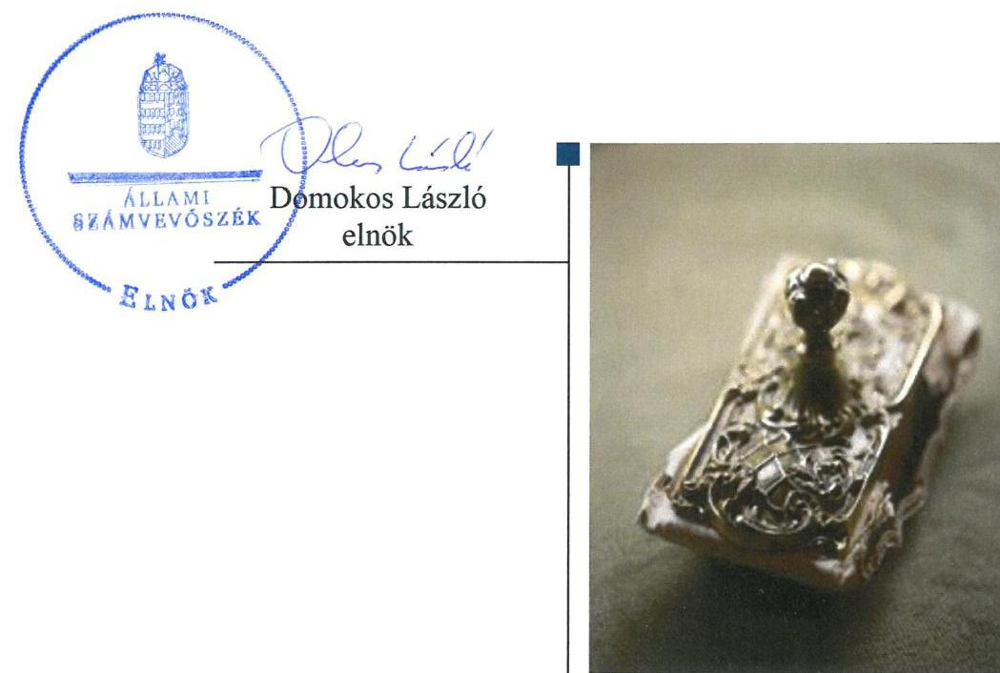

# Jelentés 

## Központi költségvetési szervek ellenőrzése

Integritás- és belső kontroll, Vagyongazdálkodás Színház- és Filmművészeti Egyetem 2019.

19054
www.asz.hu

---

# Jelenetés 

## Központi költségvetési szervek ellenőrzése

Integritás- és belső kontroll, Vagyongazdálkodás -
Színház- és Filmművészeti Egyetem
2019. 05. hó 02. nap

---

|  J | AZ ELLENŐRZÉST FELÜGYELTE:  |
| --- | --- |
|   | DR. NAGY IMRE felügyeleti vezető  |
|   | AZ ELLENŐRZÉST VEZETTE ÉS A VÉGREHAJTÁSÁÉRT FELELŐS:  |
|   | DR KOVÁCS DIÁNA ellenőrzésvezető  |
|   | A PROGRAM ÖSSZEÁLLÍTÁSÁÉRT FELELŐS:  |
|   | TÖTPÁL SZABOLCS osztályvezető  |
|   | A TÉMÁHOZ KAPCSOLÓDÓ KORÁBBI SZÁMVEVŐSZÉKI JELENTÉSEK:  |
|   | - címe: Jelentés a Színház és Filmművészeti Egyetem ellenőrzéséről - Az állami felsőoktatási intézmények gazdálkodásának, működésének ellenőrzése  |
|   | - sorszáma: 15043  |
|   | - címe: Utóellenőrzések - Az állami felsőoktatási intézmények gazdálkodásának, működésének ellenőrzéséről készült jelentések utóellenőrzése - Színház- és Filmművészeti Egyetem  |
|   | - sorszáma: 18045  |
|   | IKTATÓSZÁM: EL-1524-001/2019  |
|   | TÉMASZÁM: 2479  |
|   | ELLENŐRZÉS-AZONOSÍTÓ SZÁM: V082301  |

---

# TARTALOMJEGYZÉK 

■ ÖSSZEGZÉS ..... 5
■ AZ ELLENŐRZÉS CÉLJA ..... 7
■ AZ ELLENŐRZÉS TERÜLETE ..... 8
■ AZ ELLENŐRZÉS HÁTTERE, INDOKOLTSÁGA ..... 9
■ A JELENTÉS LÉNYEGES KÉRDÉSKÖREI ..... 10
■ AZ ELLENŐRZÉS HATÓKÖRE ÉS MÓDSZEREI ..... 11
■ MEGÁLLAPÍTÁSOK ..... 13
■ JAVASLATOK ..... 16
■ MELLÉKLETEK ..... 19
I. sz. melléklet: Értelmező szótár ..... 19
■ FÜGGELÉKEK ..... 23
I. sz. függelék a jelentéshez ..... 23
II. sz. függelék: Észrevételek ..... 24
■ RÖVIDÍTÉSEK JEGYZÉKE ..... 25

---

.

---

# ÖSSZEGZÉS 

A Színház- és Filmművészeti Egyetem belső kontrollrendszere nem biztositotta a közpénzekkel való átlátható, szabályszerű, gazdaságos, hatékony és eredményes gazdálkodás feltételeit. A korrupciós veszélyeztetettség elleni védelmet biztositó integritás kontrollrendszer kiépítése nem történt meg. Az állami vagyon védelme nem volt biztositott, az állami vagyon kimutatása nem volt átlátható.

## Az ellenőrzés társadalmi indokoltsága

Az Állami Számvevőszék ellenőrzi a költségvetési szervek gazdálkodását, működését, hogy megállapításaival támogassa az ellenőrzött szervezetek szabályszerű gazdálkodását, javaslataival elősegítse az Alaptörvényben ${ }^{1}$ megfogalmazott alapvetések érvényesülését a mindennapi életben a szervezetek szintjén. A központi költségvetés rendszerében zajló folyamatok holisztikus elemzései, a kockázatok folyamatos figyelemmel kísérésének módszerével, az így kiválasztott szervezetek célzott, hatékony ellenőrzéseivel az Állami Számvevőszék betölti a legfőbb gazdasági ellenőrző szerv küldetését. Az ellenőrzések megállapításaival és egy adott időszak ellenőrzési eredményeinek elemzésével az Állami Számvevőszék ráirányíthatja a jogalkotók figyelmét a központi alrendszerben vagy annak egy ágazatában esetlegesen felmerülő pénzügyi, szabályozási feszültségekre. Az elvégzett ellenőrzések során az Állami Számvevőszék „jó gyakorlatokat" is azonosíthat, melyeket tanácsadó funkciója keretében szélesebb körben is megismertethet az érintettekkel, ezáltal is hozzájárulva a költségvetési rendszer szabályozott, átlátható, kiegyensúlyozott és fenntartható múködéséhez.

## Főbb megállapítások, következtetések, javaslatok

A Színház- és Filmművészeti Egyetem belső kontrollrendszerének kialakítása és működtetése nem volt szabályszerű. A Színház- és Filmművészeti Egyetem nem szabályszerű kontrollkörnyezetben múködött, a múködési és a szervezeti kereteinek kialakítása nem volt szabályszerű. A Színház- és Filmművészeti Egyetem számviteli politikája és az annak keretében elkészítendő eszközök és források leltárkészítési és leltározási szabályzatának tartalma nem felelt meg a jogszabályi előírásoknak. A gazdálkodási és pénzügyi szabályozás keretében a leltározás szabályozásának hiányosságai miatt nem voltak biztosítottak a vagyonnal való elszámoltathatóság, átláthatóság követelményei. Az integrált kockázatkezelési rendszert nem alakította ki a Színház- és Filmművészeti Egyetem. A kockázatok azonosítása és kezelése nem történt meg. A kontrolltevékenység gyakorlása során a kötelezettségvállalás és a teljesítésigazolás nem szabályszerű végrehajtása veszélyeztette az elszámolás átláthatóságát. Az információs és kommunikációs folyamatok múködtetése nem volt szabályszerű az Egyetemnél. A Színház- és Filmművészeti Egyetem a belső ellenőrzést szabályszerűen működtette.

A Színház- és Filmművészeti Egyetem nem építette ki az integritás kontrollrendszerét, ezáltal a korrupciós védelmet nem biztosította.

A Színház- és Filmművészeti Egyetem a mérleg alátámasztására leltárt nem készített, ezáltal nem volt biztosított az állami vagyon védelme, nyilvántartásának átláthatósága. Az Egyetem megsértette a Számv. tv. 15. § (3) bekezdésében meghatározott mérleg valódiság elvét. A beszámoló nem nyújtott megbízható és valós képet az Egyetem múködéséről.

Az Állami Számvevőszék a Színház- és Filmművészeti Egyetem kancellárjának 11 javaslatot fogalmazott meg, amelyek a megfelelő kontrollkörnyezet kialakítására, a leltárkészítési és leltározási szabályzat módosítására, az integrált kockázatkezelési rendszer működtetésére, a kötelezettségvállalás és teljesítésigazolás jogszabályi előírások szerinti gyakorlásáról, a bizonylat-készítési kötelezettség teljesítésére, az információs és kommunikációs rendszer múködtetésére, az Info tv.-ben meghatározott közzétételi kötelezettség teljesítésére, az eszközök üzembe helyezésének dokumentálására, a szerződő felek Ávr. szerinti átlátható szervezetnek minősülő nyilatkozatára, a követelések év végi

---

értékelésének elvégzésére, valamint a leltározás teljes körű elvégzésére, a beszámoló leltárral történő alátámasztására irányultak.

---

# AZ ELLENŐRZÉS CÉLJA 

AZ ELLENŐRZÉS CÉLJA annak megállapítása volt, hogy a Színház- és Filmművészeti Egyetem² ${ }^{2}$ belső kontrollrendszere biztosította-e az átlátható, szabályszerű, gazdaságos, hatékony és eredményes gazdálkodás feltételeit. Az ellenőrzés keretében értékeltük, hogy az Egyetemnél kiépítették és erősítették-e a korrupciós kockázatok kezelését szolgáló integritási kontrollokat, továbbá megteremtették-e a teljesítményellenőrzés feltételeit.

Az ellenőrzés célja volt továbbá annak értékelése, hogy az államháztartás központi alrendszerébe tartozó Egyetem gazdálkodása elszámoltatható-e és megfelelt-e annak az Alaptörvényben meghatározott alapvetésnek, hogy Magyarország a kiegyensúlyozott, átlátható és fenntartható költségvetési gazdálkodás elvét érvényesíti. Érvényesült-e a nemzeti vagyon kezelésének és védelmének célja, azaz az Egyetem vagyona a közérdeket szolgálja, a közös szükségletek kielégítése és a természeti erőforrások megóvása, valamint a jövő nemzedékek szükségleteinek figyelembevétele mellett.

---

# AZ ELLENŐRZÉS TERÜLETE 

## Színház- és Filmművészeti Egyetem

Az Egyetem feletti alapítói jogok gyakorlója az Országgyűlés, fenntartója és irányító szerve az Emberi Erőforrások Minisztériuma. Az Egyetem közfeladata az Nftv. ${ }^{3}$ alapján az oktatás, a tudományos kutatás, a művészeti alkotótevékenység folytatása.

Az Egyetem önálló jogi személy, amely mint állami felsőoktatási intézmény a költségvetési gazdálkodás rendje szerint működik, illetékessége, müködési területe az Nftv.-ben foglaltak szerint Magyarország területe, a felvehető maximális hallgatólétszám 548 fő.

Az Egyetem élén a Rektor ${ }^{4}$ áll, aki 2014 óta tölti be tisztségét.

A Rektor az Nftv. szerint az Egyetem első számú felelős vezetője és képviselője, aki az Egyetem alaptevékenységnek megfelelő működéséért felelős. A Kancellár ${ }^{5}$ felelős a gazdálkodási intézkedések és javaslatok előkészítéséért, végzi az Egyetem működtetését. A Kancellár személyében az ellenőrzött időszakban nem történt változás.

A 2017. évi éves költségvetési beszámoló adatai alapján a teljesített összes bevétel 1915,6 M Ft, a teljesített összes kiadás 1385,4 M Ft, összes maradványa 530,2 M Ft. Átlagos statisztikai állományi létszáma 2017-ben 119 fő közalkalmazott volt.

---

# AZ ELLENŐRZÉS HÁTTERE, INDOKOLTSÁGA 

Az államháztartás központi alrendszerébe tartozó szervezet vagyona a nemzeti vagyon része, és az Alaptörvény is rögzíti, hogy a vagyonnal való gazdálkodás célja a közérdek szolgálata. Az ÁSZ ${ }^{\circledR}$ ellenőrzi az éves költségvetési törvény végrehajtását, az ellenőrzés során feltárt kockázatok és a terület folyamatos kockázatelemzésével beazonosított kockázatok kezelése érdekében ráépülő ellenőrzésekkel ellenőrzi a költségvetési szervek gazdálkodását, múködését, hogy az ellenőrzések megállapításaival támogassa az ellenőrzött szervezetek szabályszerű gazdálkodását, javaslataival elősegítse az Alaptörvényben megfogalmazott alapvetések érvényesülését a mindennapi életben a szervezetek szintjén.

A belső kontrollrendszer kialakítása és múködtetése nélkül nem valósítható meg a közpénzek, a közvagyon átlátható, szabályos, gazdaságos, hatékony és eredményes felhasználása. A belső kontrollrendszer azt a célt szolgálja, hogy a költségvetési szervek múködésük és gazdálkodásuk során a tevékenységeket szabályszerűen hajtsák végre, teljesítsék elszámolási kötelezettségeiket és megvédjék az erőforrásokat a veszteségektől, a károktól és a nem rendeltetésszerű használattól. A belső kontrollrendszer magában foglalja mindazon elveket, eljárásokat és belső szabályzatokat, melyek biztosítják, hogy a költségvetési szerv valamennyi tevékenysége és célja összhangban legyen a szabályszerűséggel, szabályozottsággal, valamint a gazdaságosság, hatékonyság és eredményesség követelményeivel, az eszközökkel és forrásokkal való gazdálkodásban ne kerüljön sor pazarlásra, visszaélésre, rendeltetésellenes felhasználásra. Megfelelő, pontos és naprakész információk álljanak rendelkezésre a költségvetési szerv múködésével kapcsolatosan, és a belső kontrollrendszer harmonizációjára, öszszehangolására vonatkozó jogszabályok végrehajtásra kerüljenek. Az integritás kontrollok kiépítése, erősítése a szervezet korrupciós kockázatainak kezelését szolgálja. A teljesítménykövetelmények meghatározása és múködtetése megalapozhatja a központi költségvetési szervnél a teljesítményellenőrzés lefolytatását.

---

# A JELENTÉS LÉNYEGES KÉRDÉSKÖREI 

1.     - Az Egyetem belső kontrollrendszerének kialakítása és müködtetése szabályszerű volt-e, az biztositotta-e a közpénzfelhasználás és az állami vagyonnal való gazdálkodás szabályosságát?
2.     - Az Egyetemnél kiépítették és erősítették-e az integritás kontrollrendszerét?
3.     - Az Egyetemnél alakítottak-e ki a teljesítmény mérésére alkalmas követelményeket?
4.     - Biztositott volt-e az állami vagyon védelme, az állami vagyon kimutatását átlátható, valóságnak megfelelő módon, szabályszerűen végezték-e?

---

# AZ ELLENŐRZÉS HATÓKÖRE ÉS MÓDSZEREI 

## Az ellenőrzés típusa

Megfelelőségi ellenőrzés.

## Az ellenőrzött időszak

A 2017. év, illetve a 2018. június 30-ig terjedő időszak.

## Az ellenőrzés tárgya

Az Egyetem belső kontrollrendszerének kialakítása és működtetése, valamint az integritás kontrollok kiépítettsége, a teljesítményellenőrzés feltételei.

Az Egyetem vagyongazdálkodási feltételeinek kialakítása, annak szabályszerűsége, az elszámoltathatóság biztosítása a szabályozás szintjén. Az Egyetemnél hozott vagyonváltozást eredményező döntések, a vagyonban bekövetkezett változások végrehajtásának, nyilvántartásba vételének, elszámolásának szabályszerűsége. Az állami vagyon kimutatásának szabályszerűsége, ennek keretében az állami vagyonnal történő rendelkezés, a vagyonmozgások, a vagyon nyilvántartásba vétele, értékelése és a mérleg alátámasztás szabályszerűsége.

## Az ellenőrzött szervezet

Színház- és Filmművészeti Egyetem

## Az ellenőrzés jogalapja

Az ellenőrzés jogszabályi alapját az ÁSZ tv. ${ }^{7}$ 1. § (3) bekezdése, 5. § (2)-(3) bekezdései, (4) bekezdés a) pontja és (6) bekezdése, valamint az Áht. ${ }^{8} 61 . \S$ (2) bekezdésében foglalt előírások adták.

## Az ellenőrzés módszerei

Az ÁSZ az ellenőrzést az ellenőrzési program szempontjai, az ellenőrzött időszakban hatályos jogszabályok, az ellenőrzés szakmai szabályai, a jelen ellenőrzésre irányadó ÁSZ módszertanok figyelembevételével hajtotta végre.

---

Az ellenőrzési kérdések megválaszolásához szükséges bizonyítékok megszerzése az ellenőrzött által rendelkezésre bocsátott dokumentumokra, adatokra alapozva megfigyelés, szemle (szemrevételezés), kérdésfeltevés (információkérés), mintavételezés, valamint elemző eljárás útján történt. Az ellenőrzési bizonyítékként felhasználható adatforrások közé tartoztak az ellenőrzési program részletes szempontjainál felsorolt adatforrások, valamint minden egyéb - az ellenőrzés folyamán feltárt, az ellenőrzés szempontjából információt tartalmazó - dokumentum.

Az ellenőrzés lefolytatásához az ellenőrzött szervezet tanúsítványok kitöltésével, valamint az ÁSZ által kért dokumentumok megküldésével szolgáltatott adatokat, amelyek valódiságát és teljes körűségét az ellenőrzött szervezet vezetője által tett teljességi és hitelességi nyilatkozat igazolta. A rendelkezésre bocsátott adatok, információk kontrollja az ellenőrzés keretében történt.

Az Egyetem belső kontrollrendszere egyes pilléreinek kialakítására és működtetésére vonatkozó értékelés:
$\longrightarrow$ „szabályszerü", amennyiben az értékelt területen az elért „igen" válaszok százalékban kifejezett, egész számra kerekített aránya legalább $85 \%$,
$\longrightarrow$ „nem szabályszerű", ha nem éri el a 85\%-ot,
Az Egyetem belső kontrollrendszerének összesített értékelése az egyes részterületek esetében kapott megfelelőségi arányok számtani átlaga alapján történt és megegyezik a pillérenként (kontrollterületenként) alkalmazott százalékos értékelésekkel, a következő eltérésekkel: a kontrollrendszer egésze esetében a „szabályszerű" értékelésnek a százalékos értéken felül további feltétele, hogy egyik kontrollterület sem kaphat „nem szabályszerű" értékelést.

A 2017. évi a beruházások, felújítások végrehajtásának, valamint a feladatellátást szolgáló állami vagyontárgyak felhasználásának és év végi értékelésének szabályszerűségét véletlen mintavétellel kiválasztott tételek alapján ellenőriztük.

A 2017. évi kiadások (külső személyi juttatások, dologi és felhalmozási kiadások) teljesítéséhez kapcsolódó pénzgazdálkodási belső kontrollok működésének szabályszerűsége esetében az ellenőrzés azokra a legnagyobb értékű tételekre - a lényeges sokaságra - terjedt ki, melyek összértéke elérte a teljes sokaság összértékének 50\%-át. A lényeges sokaságból véletlen mintavételi eljárással kiválasztott tételek kerültek ellenőrzésre. „Szabályszerűnek" értékeltük az ellenőrzött területet, amennyiben 95\%-os bizonyossággal az ellenőrzött sokaságban az átlagos hibaarány legfeljebb 10\%-os, "nem szabályszerűnek", amennyiben 10\%-nál magasabb arányt képviselt.

Az ellenőrzés ideje alatt az ellenőrzött szervezettel történő kapcsolattartás az ÁSZ SZMSZ9-ének vonatkozó előírásai alapján volt biztosított.

---

# 1. Az Egyetem belső kontrollrendszerének kialakítása és müködtetése szabályszerű volt-e, az biztosította-e a közpénzfelhasználás és az állami vagyonnal való gazdálkodás szabályosságát? 

Összegző megállapítás

### 1.1. számú megállapítás

Az Egyetem belső kontrollrendszerének kialakítása és müködtetése nem volt szabályszerű, az nem biztosította a közpénzfelhasználás szabályosságát.

Az Egyetem nem szabályszerű kontrollkörnyezetben müködött.
ALAPÍTÓ OKIRAT ${ }_{1-2}{ }^{10}$-tal, SZMSZ ${ }_{1-2}{ }^{11}$-szel, a szervezeti egységeinek részletes múködési szabályait meghatározó Ügyrenddel ${ }^{12}$ az Egyetem az Áht. és az Ávr. ${ }^{13}$ előírásai szerint rendelkezett.

A Kancellár a Bkr. ${ }^{14}$ 6. § (3) bekezdésében foglaltak ellenére nem készítette el az Egyetem múködési folyamatait leíró ellenőrzési nyomvonalát.

A Kancellár a Bkr. 6. § (1) bekezdés c) pontjában foglaltakkal ellentétben nem gondoskodott olyan kontrollkörnyezet kialakításáról, amelyben meghatározottak, ismertek és elfogadottak az etikai elvárások a szervezet minden szintjén.

SZÁMVITELI POLITIKA ${ }^{15}$ keretében elkészített Leltározási szabályzat ${ }^{16}$ 5.1. pontjának ingatlanokra vonatkozó tartalma nem felelt meg a Számv. tv. 69. § (3) bekezdésében foglaltaknak, mert ötévenkénti leltárkészítési kötelezettséget írt elő.
1.2. számú megállapítás

A Kancellár nem alakította ki és nem müködtette az integrált kockázatkezelési rendszert.

## A SZERVEZETI INTEGRITÁST SÉRTŐ ESEMÉNYEK KEZELÉSÉNEK eljárásrendjét, valamint az integrált kockázatkezelés eljárásrendjét a Bkr. 6. § (4) bekezdésében foglaltak ellenére a Kancellár nem szabályozta.

A Bkr. 7. § (4) bekezdésének előírásának ellenére a Kancellár az integrált kockázatkezelési rendszer koordinálásért felelős személyt nem jelölte ki.

A Kancellár a Bkr. 7. § (1) bekezdésében foglaltakkal ellentétben nem múködtette az integrált kockázatkezelési rendszert az Egyetem minden tevékenységére kiterjedően. Az alaptevékenységhez kapcsolódó szakmai tevékenység ellátása során felmerülő kockázatok azonosítása és kezelése nem történt meg.
1.3. számú megállapítás

A kontrolltevékenységek gyakorlása nem szabályszerűen történt.
A KÖTELEZETTSÉGVÁLLALÁS ÉS A TELJESÍTÉSIGAZOLÁS gyakorlása nem a jogszabályi előírások szerint történt. Az

---

Ávr. 52. § (1) bekezdés a) pontjában foglaltak ellenére a kötelezettségvállalásra, továbbá az Ávr. 57. § (4) bekezdésében foglaltakat megsértve a teljesítésigazolásra jogosulatlanul, írásbeli felhatalmazás hiányában került sor.

Az Egyetem a 2017. évben teljesített külső személyi juttatások, dologi és felhalmozási kiadásai felhasználását, valamint a beruházással, felújítással kapcsolatos beszerzéseit a Számv. tv. 165. § (1) bekezdésében foglaltak ellenére nem támasztotta alá bizonylattal. A következtetéseket az I. sz. Függelék tartalmazza.
1.4. számú megállapítás Az információs és kommunikációs folyamatok múködtetése nem volt szabályszerű.
A Kancellár a Bkr. 9. § (1) bekezdésében foglaltak ellenére nem tett eleget az információs és kommunikációs rendszer múködtetésére vonatkozó előírásoknak.

A Kancellár az Info tv. 37. § (1) bekezdését megsértve nem tette közzé az 1. melléklet III/1. pontjában meghatározott, 2017. évi költségvetési beszámolót.
1.5. számú megállapítás Az Egyetem szabályszerűen múködtette a monitoring rendszerét.
A Kancellár az Áht. szerint gondoskodott a belső ellenőrzés kialakításáról, belső ellenőrzés múködtetése szabályszerűen történt.

A Kancellár a Bkr. szerint eleget tett az Egyetem belső kontrollrendszerének minőségét értékelő nyilatkozattételi kötelezettségének.

# 2. Az Egyetemnél kiépítették és erősítették-e az integritás kontrollrendszerét? 

Összegző megállapítás Az Egyetemnél nem építették ki az integritás kontrollrendszerét.

Az Egyetem integritás elvű működését nem támogatta a jogszabályok által kötelezően előírt kontrollok kiépítettsége. A kockázatelemzés hiányában az integritás elvű működést támogató kontrollok nem az Egyetemre jellemző kockázatokkal arányosan kerültek kialakításra.

## 3. Az Egyetemnél alakítottak-e ki a teljesítmény mérésére alkalmas követelményeket?

Összegző megállapítás Az Egyetemnél nem alakítottak ki teljesítmény mérésére alkalmas követelményeket.

Az Egyetem célok elérését szolgáló feladatok, folyamatok, tevékenységek mérését szolgáló indikátorokat, mérőszámokat, feladat-és teljesítménymutatókat nem képzett, a teljesítmény mérésének lehetőségét nem biztosította.

---

# 4. Biztosított volt-e az állami vagyon védelme, az állami vagyon kimutatását átlátható, valóságnak megfelelő módon, szabályszerűen végezték-e? 

## Összegző megállapítás

Az Egyetem az állami vagyon védelmét nem biztosította, annak kimutatása nem volt átlátható.

Az Egyetem 2017. évi gazdálkodása során nem volt szabályszerű a beruházások, felújítások végrehajtása.

- A Számv. tv. ${ }^{17}$ 52. § (2) bekezdésében előírtakat megsértve az Egyetem nem dokumentálta az eszközök üzembe helyezését.
- Az Egyetem nem rendelkezett az Ávr. 50. § (1a) bekezdésében foglaltak ellenére a megkötött visszterhes szerződések, megrendelések esetén a szerződő fél nyilatkozatával arról, hogy az átlátható szervezetnek minősül.
Az Egyetem nem végezte el a követelések év végi értékelését, így nem tartotta be a Számv. tv. 46. § (3) bekezdésében előírt szabályokat.

Az Egyetem nem készítette el a 2017. évi mérleg tételeit alátámasztó leltárát, nem tartotta be az Áhsz. ${ }^{18}$ 22. § (1) bekezdésében, valamint a Számv. tv. 69. § (1) bekezdésében előírtakat. Az Egyetem az ellenőrzött időszakban a Számv. tv. 69. § (2) bekezdésében meghatározott főkönyvi könyvelés és az analitikus nyilvántartások adatai közötti egyeztetéses leltározást nem végezte el. A következtetéseket az I. sz. Függelék tartalmazza.

---

# JAVASLATOK 

Az ÁSZ tv. 33. § (1) bekezdésében foglaltak értelmében az ellenőrzött szervezet vezetője köteles a jelentésben foglalt megállapításokhoz kapcsolódó intézkedési tervet összeállítani és azt a jelentés kézhezvételétől számított 30 napon belül az ÁSZ részére megküldeni. Amennyiben az ellenőrzött szervezet vezetője nem küldi meg határidőben az intézkedési tervet, vagy továbbra sem elfogadható intézkedési tervet küld, az Állami Számvevőszék elnöke az ÁSZ tv. 33. § (3) bekezdése a) és b) pontjaiban foglaltakat érvényesítheti.

## Színház- és Filmművészeti Egyetem kancellárjának

1. Intézkedjen a Bkr.-ben foglaltaknak megfelelő kontrollkörnyezet kialakításáról.
(1.1. sz. megállapítás 2. és 3. bekezdései, az 1.2. sz megállapítás 1. bekezdése alapján)
2. Gondoskodjon a leltárkészítési és leltározási szabályzat módosításáról, hogy a jogszabályi előírásoknak megfeleljen.
(1.1. sz. megállapítás 4. bekezdése alapján)
3. Intézkedjen a Bkr.-ben elöirtak szerint az integrált kockázatkezelési rendszer müködtetéséről és az integrált kockázatkezelési rendszer koordinálásáért felelős személy kijelöléséről.
(1.2. sz. megállapítás 2. és 3. bekezdései alapján)
4. Gondoskodjon a kötelezettségvállalás és a teljesítésigazolás jogszabályi előírások szerinti gyakorlásáról.
(1.3. sz. megállapítás 1. bekezdése alapján)
5. Gondoskodjon arról, hogy minden gazdasági müveletről, eseményről, amely az eszközök, illetve az eszközök forrásainak állományát vagy összetételét megváltoztatja, bizonylat kerüljön kiállításra.
(1.3. sz. megállapítás 2. bekezdése alapján)
6. Tegyen eleget az információs és kommunikációs rendszer müködtetésére vonatkozó jogszabályi előírásoknak.
(1.4. sz. megállapítás 1. bekezdése alapján)

---

7. Intézkedjen az Info tv.-ben meghatározott közzétételi kötelezettség teljesitéséről.
(1.4. sz. megállapítás 2. bekezdése alapján)
8. Intézkedjen, hogy az eszközök üzembe helyezésének dokumentálására a jogszabályi előirásoknak megfelelően kerüljön sor.
(4. sz. megállapítás 1. bekezdés 2. mondata alapján)
9. Intézkedjen, hogy az Ávr.-ben elöirtak szerint az Egyetem által jogi személlyel, jogi személyiséggel nem rendelkező szervezettel kötött visszterhes szerződés tartalmazza a szervezet nyilatkozatát arról, hogy átlátható szervezetnek minősül.
(4. sz. megállapítás 1. bekezdés 3. mondata alapján)
10. Gondoskodjon a követelések év végi értékelésének elvégzéséről a jogszabályi előirásoknak megfelelően.
(4. sz. megállapítás 2. bekezdése alapján)
11. Gondoskodjon a jogszabály szerinti leltározás elvégzéséről, a beszámoló leltárral történő alátámasztásáról.
(4. sz. megállapítás 3. bekezdése alapján)

---

.

---

# MELLÉKLETEK 

- I. SZ. MELLÉKLET: ÉRTELMEZŐ SZÓTÁR
állami vagyon
állami vagyonnak minősül:
a) az állam tulajdonában lévő dolog, valamint a dolog módjára hasznosítható természeti erő,
b) az a) pont hatálya alá nem tartozó mindazon vagyon, amely vonatkozásában törvény az állam kizárólagos tulajdonjogát nevesíti,
c) az állam tulajdonában lévő tagsági jogviszonyt megtestesítő értékpapír, illetve az államot megillető egyéb társasági részesedés,
d) az államot megillető olyan immateriális, vagyoni értékkel rendelkező jogosultság, amelyet jogszabály vagyoni értékű jogként nevesít. (Forrás: Vtv. ${ }^{19}$ 1. § (2) bekezdése)
állami vagyon használója Az a természetes vagy jogi személy, jogi személyiséggel nem rendelkező szervezet, aki, vagy amely törvény vagy szerződés alapján, bármely jogcímen (bérlet, haszonbérlet, használat stb.) állami vagyont birtokol, használ, szedi annak hasznait, hasznosít, ide nem értve a haszonélvezőt, a vagyonkezelőt és a tulajdonosi jogok gyakorlóját". (Forrás: Vtvr. 1. § (7) bekezdés a) pontja)
állami vagyon hasznosítása Az állami vagyont az MNV Zrt. maga kezeli, vagy szerződés - így különösen bérlet, haszonbérlet, megbízás - alapján központi költségvetési szervnek, természetes vagy jogi személynek, vagy jogi személyiséggel nem rendelkező gazdálkodó szervezetnek hasznosításra átengedi.
(Forrás: Vtv. 23. § (1) bekezdése, hatályos 2012. január 1-jétől)
Az állami vagyonnal a tulajdonosi joggyakorló maga gazdálkodik, vagy szerződés - így különösen bérlet, haszonbérlet, megbízás - alapján hasznosításra átengedi, illetőleg vagyonkezelésbe, haszonélvezetbe adja. (Forrás: Vtv. 23. § (1) bekezdése, hatályos 2013. június 28-ától)
állami vagyon hasznosítására kötött szerződések elsődleges célja az állami vagyon hatékony működtetése, állagának védelme, értékének megőrzése, illetve gyarapítása, az állami és közfeladatok ellátásának elősegítése. (Forrás: Vtv. 23. § (2) bekezdése)
állami vagyon kezelője /vagyonkezelő

ÁSZ Integritás Projekt

Az állami vagyont az MNV Zrt. maga kezeli, vagy szerződés - így különösen bérlet, haszonbérlet, megbízás - alapján központi költségvetési szervnek, természetes vagy jogi személynek, vagy jogi személyiséggel nem rendelkező gazdálkodó szervezetnek hasznosításra átengedi." Az állami vagyonra vonatkozóan az MNV Zrt. kizárólag az Nvtv.-ben meghatározott személyekkel köthet vagyonkezelési szerződést. (Forrás: Vtv. 27. § (1) bekezdése, hatályos 2012. január 1-jétől)
Az Állami Számvevőszék 2009-ben indította el a „Korrupciós kockázatok feltérképezése - Integritás alapú közigazgatási kultúra terjesztése" című, európai uniós forrásból megvalósított kiemelt projektjét (Integritás Projekt). Az Integritás Projekt célja, hogy felmérje a közszféra intézményei korrupciós kockázatoknak való kitettségét, illetőleg az azok mérséklésére hivatott kontrollok szintjét. Az Állami Számvevőszék a projekt révén az integritás szemlélet minél szélesebb körrel történő megismertetését, gyakorlatba ültetését kívánja elérni. Az integritás követelményeinek megfelelő szervezeti múködést előnyben részesítő közigazgatási kultúra elterjesztését és a korrupció elleni fellépést az ÁSZ önmagára nézve is stratégiai jelentőségű célként fogalmazta meg. A projekt a felmérésben résztvevő intézmények számára helyzetükről

---

egyfajta „tükörképet" mutat be, ami alapot teremt a jövőbeni pozitív irányú elmozduláshoz. (Forrás: a http://integritas.asz.hu honlapon közzétett, a 2013. évi Integritás felmérés eredményeiről készült összefoglaló tanulmány)
belső ellenőrzés
belső kontrollrendszer
belső kontrollrendszer területei
felújítás
hasznosítás
információs és kommunikációs rendszer
integritás
kockázat
kockázatkezelési rendszer
integrált kockázatkezelési rendszer
egyfajta „tükörképet" mutat be, ami alapot teremt a jövőbeni pozitív irányú elmozduláshoz. (Forrás: a http://integritas.asz.hu honlapon közzétett, a 2013. évi Integritás felmérés eredményeiről készült összefoglaló tanulmány)
Független, tárgyilagos bizonyosságot adó és tanácsadó tevékenység, amelynek célja, hogy az ellenőrzött szervezet működését fejlessze és eredményességét növelje, az ellenőrzött szervezet céljai elérése érdekében rendszerszemléletű megközelítéssel és módszeresen értékeli, illetve fejleszti az ellenőrzött szervezet irányítási és belső kontrollrendszerének hatékonyságát. (Forrás: Bkr. 2. § b) pontja)
A belső kontrollrendszer a kockázatok kezelése és tárgyilagos bizonyosság megszerzése érdekében kialakított folyamatrendszer, amely azt a célt szolgálja, hogy a múködés és gazdálkodás során a tevékenységeket szabályszerűen, gazdaságosan, hatékonyan, eredményesen hajtsák végre, az elszámolási kötelezettségeket teljesítsék, megvédjék az erőforrásokat a veszteségektől, károktól és nem rendeltetésszerű használattól. (Forrás: Áht. 69. § (1) bekezdése)
A kontrollkörnyezet, a kockázatkezelési rendszer, a kontrolltevékenységek, az információs és kommunikációs rendszer, valamint a nyomon követési (monitoring) rendszer. (Forrás: Bkr. 3. §-a)
Az elhasználódott tárgyi eszköz eredeti állaga (kapacitása, pontossága) helyreállítását szolgáló időszakonként visszatérő olyan tevékenység, melynek során az eszköz élettartama megnövekszik, minősége, használata jelentősen javul, így a pótlólagos ráfordításból a jövőben gazdasági előnyök származnak. (Forrás: Számv. tv. 3. § (4) bekezdés 8. pontja)
A nemzeti vagyon birtoklásának, használatának, hasznok szedése jogának bármely a tulajdonjog átruházását nem eredményező - jogcímen történő átengedése, ide nem értve a vagyonkezelésbe adást, valamint a haszonélvezeti jog alapítását. (Forrás: Nvtv. 3. § (1) bekezdés 4. pontja)
A költségvetési szerv vezetője által kialakított és működtetett olyan rendszer, mely biztosítja, hogy a megfelelő információk a megfelelő időben eljutnak az illetékes szervezethez, szervezeti egységhez, illetve személyhez. (Forrás: Bkr. 9. § (1) bekezdés)
Az integritás - egyik gyakran használt jelentése szerint - az elvek, értékek, cselekvések, módszerek, intézkedések konzisztenciáját jelenti, vagyis olyan magatartásmódot, amely meghatározott értékeknek megfelel. Integritás-irányítási rendszer bevezetése a szervezetben a szervezethez rendelt közfeladatok integritás szempontú ellátását, az érték alapú múködéssel (integritással) összefüggő szervezeti követelmények következetes érvényesítését jelenti. (Forrás: Nemzetgazdasági Minisztérium: Államháztartási Belső Kontroll Standardok és Gyakorlati Útmutató 1.6. Etikai értékek és integritás 46. oldal, 2017. szeptember)
A kockázat annak a valószínűségét jelenti, hogy egy vagy több esemény vagy intézkedés nem kívánt módon befolyásolja a rendszer múködését, céljainak megvalósulását. (Forrás: Javaslatok a korrupciós kockázatok kezelésére - Kockázatkezelési és ellenőrzési módszertan 35. oldal, ÁSZ)
Olyan irányítási eszközök és módszerek összessége, melynek elemei a szervezeti célok elérését veszélyeztető tényezők (kockázatok) azonosítása, elemzése, csoportosítása, nyomon követése, valamint szükség esetén a kockázati kitettség mérséklése.(Forrás: Bkr. 2. § m) pontja)
Olyan folyamatalapú kockázatkezelési rendszer, amely a szervezet minden tevékenységére kiterjed, egységes módszertan és eljárások alkalmazásával, a szervezet célkitűzéseinek és értékeinek figyelembevételével biztosítja a szervezet kockázatainak teljes körű azonosítását, azok meghatározott kritériumok szerinti értékelését, valamint a kockázatok kezelésére vonatkozó intézkedési terv elkészítését és az abban foglaltak nyomon követését. (Forrás: Bkr. 2. § m) pontja, 2016. október 1-jétől)

---

kontrollkörnyezet

kontrolltevékenységek
kommunikáció
közfeladat
monitoring
monitoring-rendszer
vagyongazdálkodás

A költségvetési szerv vezetője által kialakított olyan elvek, eljárások, belső szabályzatok összessége, amelyben világos a szervezeti struktúra, a folyamatok átláthatók, egyértelműek a felelősségi, hatásköri viszonyok és feladatok, meghatározottak, ismertek és elfogadottak az etikai elvárások a szervezet minden szintjén, átlátható a humán-erőforrás-kezelés. (Forrás: Bkr. 6. § (1) bekezdés)
A költségvetési szerv vezetője által a szervezeten belül kialakított (kontroll) tevékenységek, melyek biztosítják a kockázatok kezelését, hozzájárulnak a szervezet céljainak eléréséhez és erősítik a szervezet integritását. (Forrás: Bkr. 8. § (1) bekezdés)
Az a tevékenység, melynek során információ továbbítása valósul meg. A kommunikációs folyamat résztvevői között tájékoztatás történik, mely során tényeket, ezek magyarázatát közlik.
Jogszabályban meghatározott állami vagy önkormányzati feladat, amit az arra kötelezett közérdekből, a jogszabályban meghatározott követelményeknek és feltételeknek megfelelve végez, ideértve a lakosság közszolgáltatásokkal való ellátását, továbbá az állam nemzetközi szerződésekben vállalt kötelezettségeiből adódó közérdekű feladatokat, valamint e feladatok ellátásakor szükséges infrastruktúra biztosítását is. (Forrás: Nvtv. 3. § (1) bekezdés 7. pontja)
A monitoring általánosságban a különböző szintű szervezeti célok megvalósításának folyamatát kíséri figyelemmel, melynek során a releváns eseményekről és tevékenységekről (együtt: folyamatokról) rendszeres jelleggel, strukturált, döntéstámogató információkhoz jutnak a szervezet vezetői. (Forrás: NGM Útmutató a költségvetési szervek monitoring rendszeréhez 2011. november)
A költségvetési szerv vezetője köteles kialakítani a szervezet tevékenységének a célok megvalósításának nyomon követését biztosító rendszert, amely az operatív tevékenységek keretében megvalósuló folyamatos és eseti nyomon követésből, valamint az operatív tevékenységektől függetlenül múködő belső ellenőrzésből állhat. (Forrás: Bkr. 10. §)
A nemzeti vagyongazdálkodás feladata a nemzeti vagyon rendeltetésének megfelelő, az állam, az önkormányzat mindenkori teherbíró képességéhez igazodó, elsődlegesen a közfeladatok ellátásához és a mindenkori társadalmi szükségletek kielégítéséhez szükséges, egységes elveken alapuló, átlátható, hatékony és költségtakarékos múködtetése, értékének megőrzése, állagának védelme, értéknövelő használata, hasznosítása, gyarapítása, továbbá az állam vagy a helyi önkormányzat feladatának ellátása szempontjából feleslegessé váló vagyontárgyak elidegenítése. (Forrás: Nvtv. 7. § (2) bekezdése)

---

.

---

# FÜGGELÉKEK 

- I. SZ. FÜGGELÉK A JELENTÉSHEZ

Az Állami Számvevőszék az ellenőrzések során feltárt tényekhez kapcsolódó további körülmények tisztázására eszközrendszerrel nem rendelkezik. Amennyiben az ellenőrzésen túlmutatóan indokoltnak látszik az ellenőrzés során feltárt körülmények további vizsgálata, az Állami Számvevőszék törvényi felhatalmazás alapján az ellenőrzés által feltárt körülményeket továbbítja a hatáskörrel rendelkező szervnek a szükséges intézkedések megtétele, eljárások lefolytatása érdekében.
Az ellenőrzési program végrehajtásakor, a mintatételek ellenőrzésekor az Állami Számvevőszék feltárta, hogy az Egyetem a dologi kiadásait 1.198.000,- Ft, a külső személyi juttatás kiadásait 1.053.000,- Ft, míg a beruházással, felújítással kapcsolatos kiadásait 5.939.120,Ft értékben nem támasztotta alá számviteli bizonylattal, megsértve ezzel a Számv. tv. 165. § (1) bekezdésében foglaltakat. Így az Egyetem összesen 8.190.120,- Ft értékben nem igazolta, hogy a hivatkozott kiadások az Egyetem feladatellátását szolgálták, illetve hogy a kifizetésekre a jogszabályi előírásoknak megfelelően került sor.
Az Egyetem nem készítette el a 2017. évi mérleg tételeit alátámasztó leltárát, megsértve az Áhsz. 22. § (1) bekezdésében, valamint a Számv. tv. 69. § (1) bekezdésében előírtakat, továbbá a Számv. tv. 15. § (3) bekezdésében meghatározott mérleg valódiság elvét.
A bizonylat nélküli kifizetések, illetve a leltározás elmaradása miatt az Egyetem nem elszámoltatható, müködése nem átlátható, és nem zárható ki, hogy az ellenőrzött szervezetnél vagyoni hátrány keletkezett.
A feltárt szabálytalanságok miatt a beszámoló valódisága és megbízhatósága nem igazolt, a nemzeti vagyon védelme nem biztositott, továbbá visszaélések történhettek. A fenti szabálytalanságok miatt indokolt az illetékes nyomozóhatóság értesítése az ÁSZ ellenőrzése során feltárt tényekről, a szükséges intézkedések megtétele érdekében.

---

A jelentéstervezetet a Számvevőszék 15 napos észrevételezésre megküldte az ellenőrzött szervezet vezetőinek az ÁSZ tv. 29. §* (1) bekezdése előírásának megfelelően.

A Színház és Filmművészeti Egyetem rektora és kancellárja a jelentéstervezet megállapításaira az ÁSZ tv. 29. § (2) bekezdése értelmében biztositott 15 napon belül észrevételt nem tettek.

[^0]
[^0]:    * 29. § (1) Az Állami Számvevőszék az ellenőrzési megállapításait megküldi az ellenőrzött szervezet vezetőjének vagy az általa megbízott személynek, és annak, akinek személyes felelősségét állapította meg.
    (2) Az ellenőrzött szervezet vezetője és a felelősként megjelölt személy az ellenőrzés megállapításaira tizenöt napon belül írásban észrevételt tehet.
    (3) Az Állami Számvevőszék az észrevételre a beérkezésétől számított harminc napon belül írásban válaszol. A figyelembe nem vett észrevételeket köteles a jelentésben feltüntetni, és megindokolni, hogy azokat miért nem fogadta el.

---

# RÖVIDÍTÉSEK JEGYZÉKE 

${ }^{1}$ Alaptörvény
${ }^{2}$ Egyetem
${ }^{3} \mathrm{Nftv}$.
${ }^{4}$ Rektor
${ }^{5}$ Kancellár
${ }^{6}$ ÁSZ
${ }^{7}$ ÁSZ tv.
${ }^{8}$ Áht.
${ }^{9}$ ÁSZ SZMSZ
${ }^{10}$ Alapító okirat ${ }_{1-2}$
${ }^{11} \mathrm{SZMSZ}_{1-2}$
${ }^{12}$ Ügyrend
${ }^{13}$ Ávr.
${ }^{14} \mathrm{Bkr}$.
${ }^{15}$ Számviteli politika
${ }^{16}$ Leltározási szabályzat
${ }^{17}$ Számv. tv.
${ }^{18}$ Áhsz.
${ }^{19} \mathrm{Vtv}$.

Magyarország Alaptörvénye (2011. április 25.)
Színház- és Filmművészeti Egyetem
a nemzeti felsőoktatásról szóló 2011. évi CCIV. törvény (hatályos: 2012. január 1-jétől)
a Színház- és Filmművészeti Egyetem Rektora
a Színház- és Filmművészeti Egyetem kancellárja
Állami Számvevőszék
az Állami Számvevőszékről szóló 2011. évi LXVI. törvény (hatályos: 2011. július 1-jétől)
az államháztartásról szóló 2011. évi CXCV. törvény (hatályos: 2012. január 1-jétől)
az Állami Számvevőszék Szervezeti és Működési Szabályzata
Színház- és Filmművészeti Egyetem Alapító okirata
(hatályos: 2015. december 31-től, Módosítás: 2017. július 10-től, hatályos 2017. augusztus 1-től)
Színház- és Filmművészeti Egyetem Szervezeti és Működési Szabályzata (hatályos: 2016. márciustól, 2017. október 3-tól)
Színház- és Filmművészeti Egyetem Gazdasági Szolgáltatások osztályának ügyrendje (hatályos: 2016. március 30-tól)
az államháztartásról szóló törvény végrehajtásáról szóló 368/2011. (XII. 31.) Korm. rendelet (hatályos: 2012. január 1-jétől)
a költségvetési szervek belső kontrollrendszeréről és belső ellenőrzéséről szóló 370/2011. (XII.31.) Korm. rendelet (hatályos: 2012. január 1-jétől)
Színház- és Filmművészeti Egyetem Számviteli politikája (hatályos: 2016. január 1-től)
Színház- és Filmművészeti Egyetem Leltározási szabályzata (hatályos: 2016. március 30-tól)
a számvitelről szóló 2000. évi C. törvény (hatályos: 2001. január 1-jétől)
az államháztartás számviteléről szóló 4/2013. (I.11.) Korm.rendelet (hatályos: 2014. január 1-jétől)
az állami vagyonról szóló 2007. évi CVI. törvény (hatályos: 2007. szeptember 25-től)

---

# ÁLLAMI SZÁMVEVŐSZÉK 

1052 Budapest, Apáczai Csere János utca 10.
Levélcím: 1364 Budapest 4. Pf. 54
Telefon: +36 14849100 Telefax: +36 14849200
www.asz.hu