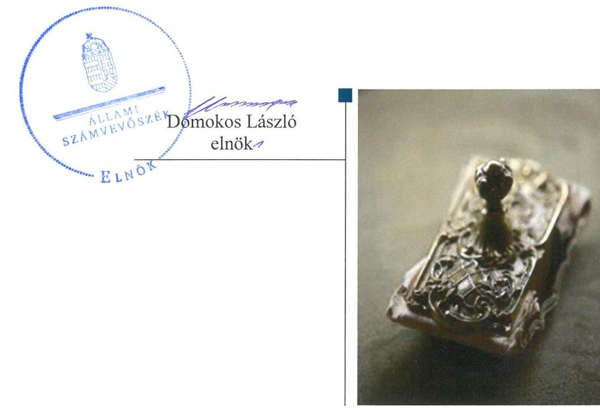

# Jelentés 

## Nem állami humánszolgáltatók ellenőrzése

A humánszolgáltatást nyújtó államháztartáson kívüli köznevelési és szociális intézmények, szolgáltatók fenntartói központi költségvetésből kapott támogatásai felhasználásának ellenőrzése - Tiszántúli Református Egyházkerület 2019.

---

# Jelentés 

## Nem állami humánszolgáltatók ellenőrzése

A humánszolgáltatást nyújtó államháztartáson kívüli köznevelési és szociális intézmények, szolgáltatók fenntartói központi költségvetésből kapott támogatásai felhasználásának ellenőrzése - Tiszántúli Református Egyházkerület
2019. 04. hó 04. nap

---

# AZ ELLENŐRZÉST FELÜGYELTE:

## MAKKAI MÁRIA felügyeleti vezető

## AZ ELLENŐRZÉST VEZETTE ÉS A VÉGREHAJTÁSÁÉRT FELELŐS:

### DR. PELLEI TAMÁS ellenőrzésvezető

## A PROGRAM ÖSSZEÁLLÍTÁSÁÉRT FELELŐS:

### TÓTPÁL SZABOLCS osztályvezető

IKTATÓSZÁM: EL-1517-001/2019.

TÉMASZÁM: 2448

ELLENŐRZÉS-AZONOSÍTÓ SZÁM: V079432

Jelentéseink az Országgyűlés számítógépes hálózatán és az Interneten a www.asz.hu címen is olvashatóak.

---

# TARTALOMJEGYZÉK 

■ ÖSSZEGZÉS ..... 5
■ AZ ELLENŐRZÉS CÉLJA ..... 6
■ AZ ELLENŐRZÉS TERÜLETE ..... 7
■ AZ ELLENŐRZÉS HÁTTERE, INDOKOLTSÁGA ..... 8
■ A JELENTÉS LÉNYEGES KÉRDÉSKÖREI ..... 9
■ AZ ELLENŐRZÉS HATÓKÖRE ÉS MÓDSZEREI ..... 10
■ MEGÁLLAPÍTÁSOK ..... 12
■ MELLÉKLETEK ..... 15
I. sz. melléklet: Értelmező szótár ..... 15
■ FÜGGELÉK: ÉSZREVÉTELEK ..... 17
■ RÖVIDÍTÉSEK JEGYZÉKE ..... 19

---

.

---

# ÖSSZEGZÉS 

A Tiszántúli Református Egyházkerület a köznevelési és a szociális humánszolgáltatási közfeladat ellátásához kialakította a központi költségvetési támogatások átlátható és elszámoltatható igénybevételének és felhasználásának feltételeit. A központi költségvetési támogatásokat a jogszabályi előírásokat betartva szabályszerűen továbbadta intézményei részére.

## Az ellenőrzés társadalmi indokoltsága

Az Állami Számvevőszék stratégiájában hangsúlyos szerepet szán annak, hogy szilárd szakmai alapon álló, értékteremtő ellenőrzéseivel előmozdítsa a közpénzügyek átláthatóságát, rendezettségét és javaslataival a közpénzek és a közvagyon szabályos, gazdaságos, hatékony és eredményes felhasználását segítse. Az államháztartáson kívülre nyújtott költségvetési támogatások ellenőrzésével az Állami Számvevőszék hozzájárul ahhoz, hogy a közpénzeket a nem állami humán fenntartók átlátható módon használják fel a közfeladatok ellátására kötött szerződésekben vállalt kötelezettségek teljesítése érdekében.

A fentieket figyelembe véve, valamint a kapott költségvetési támogatások nagyságára tekintettel került sor a Tiszántúli Református Egyházkerület ellenőrzésére a 2014-2017. évek vonatkozásában.

## Főbb megállapítások, következtetések

A Tiszántúli Református Egyházkerület megteremtette a köznevelési és a szociális humánszolgáltatási közfeladat ellátás szervezeti feltételeit, a szakmai feladatellátás és a gazdálkodási kereteit kialakította, biztosította a költségvetési támogatások igénybevételének, felhasználásának átláthatóságát és elszámoltathatóságát.

Meghatározta a humánszolgáltatási közfeladatot ellátó intézményei alapfeladatait, biztosította az intézmények működésének feltételeit. A Tiszántúli Református Egyházkerület a köznevelési és szociális humánszolgáltatási közfeladathoz rendelt költségvetési támogatást szabályszerűen kezelte, elkülönítetten tartotta nyilván és a jogszabályi előírásoknak megfelelően használta fel intézményei működtetésére.

A Tiszántúli Református Egyházkerület ellenőrzési, értékelési és külső ellenőrzésekkel kapcsolatos intézkedési kötelezettségeinek szabályszerűen eleget tett. A köznevelési és szociális intézményei működtetéséhez felhasznált közpénzekre vonatkozó gazdálkodásával a nyilvánosság előtt elszámolt.

---

# AZ ELLENŐRZÉS CÉLJA 

AZ ELLENŐRZÉS CÉLJA annak értékelése volt, hogy a Tiszántúli Református Egyházkerület, mint köznevelési és szociális intézmények egyházi fenntartója központi költségvetésből kapott támogatásainak felhasználása szabályszerű volt-e, a támogatások igénylése, évközi módosítása és év végi elszámolása megfelelt-e a jogszabályi előírásoknak.

---

# AZ ELLENŐRZÉS TERÜLETE 

## Tiszántúli Református Egyházkerület

A Tiszántúli Református Egyházkerület 1557-ben jött létre, Kelet-Magyarországon helyezkedik el, központja Debrecenben található. Az Ehtv. ${ }^{1}$ és a belső egyházi alkotmány ${ }^{2}$ alapján a Magyarországi Református Egyházon belül működő önálló jogi személy, elnökségét a püspök, a főgondnok, a lelkészi főjegyző és a világi főjegyző alkotja. A jelenlegi elnökség tagjai 2015. január 01-jétől töltik be tisztségüket.

A Fenntartó ${ }^{3}$ a Magyar Köztársaság Kormánya és a Magyar Református Egyház között 1998. december 08-án kötött 1057/1999. (V. 26.) Korm. határozatban ${ }^{4}$ között - megállapodás alapján végzett köznevelési, közoktatási tevékenységet, valamint látott el szociális humánszolgáltatási közfeladatot. A megállapodás 2017. október 04-én megújításra került, annak közzététele a 1821/2017. (XI.9.) Korm. határozatban ${ }^{5}$ történt meg.

A Fenntartó Hajdú-Bihar, Jász-Nagykun-Szolnok és Békés megyékben 2014. szeptember 1-jéig kilenc, ezt követően nyolc köznevelési intézmény és két szociális humánszolgáltató intézmény fenntartásával és működtetésével vett részt az önkormányzati és állami közfeladat-ellátásban. A köznevelési intézmények fenntartásával három intézményében óvodai nevelést, négy intézményében általános iskolai oktatást, két intézményben gimnáziumi oktatást, egy intézményében alapfokú művészeti oktatást, továbbá a diákok részére 270 férőhellyel kollégiumi ellátás igénybevételére is lehetőséget biztosított a 2017. év végén. Szociális intézményei pszichiátriai, szenvedélybetegek, valamint fogyatékos személyek közösségi ellátását, támogatását végezték.

A Fenntartó által a köznevelési feladatokhoz igényelt és a Kincstár ${ }^{6}$ által elszámolásként elfogadott költségvetési támogatás összege a 2014. évben 1.356,6 millió Ft, a 2015. évben 1.413,3 millió Ft, a 2016. évben 1.534,1 millió Ft, valamint a 2017. évben 1.681,2 millió Ft volt. A szociális humánszolgáltatási feladatok ellátásához a 2014. évben 27,5 millió Ft, a 2015. évben 28,9 millió Ft, a 2016. évben 30,9 millió Ft, a 2017. évben 40,2 millió Ft költségvetési támogatást folyósított a Kincstár a Fenntartó részére.

A közfeladat ellátásával kapcsolatos szakmai irányítószervi feladatokat az ellenőrzött időszakban az EMMI${ }^{7}$ látta el, a törvényességi ellenőrzési feladatokat pedig a területileg illetékes kormányhivatalok végezték.

---

# AZ ELLENŐRZÉS HÁTTERE, INDOKOLTSÁGA 

A köznevelési és szociális feladatokat ellátó nem állami intézményfenntartók részére közfeladataik ellátására évente jelentős összegű pénzügyi támogatást biztosítottak a mindenkori költségvetési törvények a bennük megfogalmazott feltételek mellett.

A köznevelési és szociális feladatokra felhasználható állami támogatások előirányzata 2014 - 2017. években 1049 Mrd Ft volt. A 2013. évben jelentős változások következtek be a normatív finanszírozás rendszerében. Az Országgyűlés elfogadta a nemzeti köznevelésről szóló 2011. évi CXC. törvényt, amely jelentősen átalakította a korábbi finanszírozási rendszert 2013 szeptemberétől. Módosították a szociális igazgatásról és szociális ellátásokról szóló 1993. évi III. törvényt is, amely - többek között - 2012. január 1-jei hatállyal megfogalmazta a finanszírozási rendszerbe történő befogadással összefüggő szabályokat. Mindkét területen új feladatfinanszírozási forma (átlagbéralapú támogatás) jelent meg, amely az államháztartáson kívüli intézményfenntartókra is vonatkozik. Az ellenőrzés a finanszírozási rendszerben bekövetkezett változásokra, azok közfeladat ellátásra gyakorolt hatására fókuszált a költségvetési támogatásokat felhasználó államháztartáson kívüli szervezetek körében. Az ellenőrzés indokoltságát az is alátámasztotta, hogy az ÁSZ ${ }^{6}$ még nem ellenőrizte átfogóan e területet.

Az ÁSZ stratégiájában foglaltak alapján is indokolt az ellenőrzés, amely a társadalom számára jelzi, hogy a közpénz államháztartáson kívüli felhasználása sem maradhat ellenőrizetlenül. Az államháztartáson kívülre nyújtott költségvetési támogatások ellenőrzésével az ÁSZ hozzájárul ahhoz, hogy a közpénzeket a nem állami fenntartók átlátható módon használják fel a közfeladatok ellátására kötött szerződésekben vállalt kötelezettségek teljesítése érdekében. Az ÁSZ az ellenőrzés javaslataival hozzájárulhat az említett rendszerek szabályszerű támogatás-felhasználásához, javíthatja a társadalmi-gazdasági döntések megalapozottságát, amely a „jól irányított állam" feltétele.

---

# A JELENTÉS LÉNYEGES KÉRDÉSKÖREI 

1. A köznevelési és szociális humánszolgáltatási közfeladatot ellátó Fenntartó szabályszerű működési - és gazdálkodási környezet kialakításával megteremtette-e a költségvetési támogatások átlátható, elszámoltatható igénybevételének, felhasználásának feltételeit?
2. A Fenntartó az átvállalt köznevelési és szociális humánszolgáltatási közfeladathoz biztosított költségvetési támogatásokat szabályszerűen fordította-e humánszolgáltató intézményei működtetésére?
3. A Fenntartó a köznevelési és szociális humánszolgáltató intézményei működtetéséhez felhasznált közpénzekre vonatkozó gazdálkodásával a nyilvánosság előtt elszámolt-e, ennek megalapozása érdekében ellenőrzési, értékelési és külső ellenőrzésekkel kapcsolatos intézkedési feladatait szabályszerűen látta-e el?

---

# AZ ELLENŐRZÉS HATÓKÖRE ÉS MÓDSZEREI 

## Az ellenőrzés típusa

Megfelelőségi ellenőrzés.

## Az ellenőrzött időszak

2014. január 1-je és 2017. december 31-e közötti időszak.

## Az ellenőrzés tárgya

Az ellenőrzés a köznevelési és szociális humánszolgáltatási közfeladatokat ellátó államháztartáson kívüli fenntartók, humánszolgáltatási közfeladatai ellátásához a költségvetési törvényekben biztosított központi költségvetési támogatások igénylése, évközi módosítása és év végi elszámolása fenntartói feladatainak ellátása, illetve e központi költségvetésből kapott támogatásaik humánszolgáltatási közfeladatokra való fenntartó általi felhasználása szabályszerűségének értékelésére terjed ki.

Az ellenőrzés kiterjed minden olyan körülményre és adatra, amely az ÁSZ jogszabályban meghatározott feladatainak teljesítéséhez, valamint a program végrehajtása folyamán felmerült újabb összefüggések feltárásához szükséges.

## Az ellenőrzött szervezet

Tiszántúli Református Egyházkerület

## Az ellenőrzés jogalapja

Az ellenőrzés jogszabályi alapját az ÁSZ tv. 1. § (3) bekezdése, 5. § (3) bekezdés, valamint az 5. § (11) c) pontjában foglalt előírások adták.

## Az ellenőrzés módszerei

Az ellenőrzést az ellenőrzési program kérdései, az adott időszakban hatályos jogszabályok, az ellenőrzés szakmai szabályok és módszertanok, valamint a nemzetközi standardok figyelembevételével végezte az ÁSZ.

Az ellenőrzés ideje alatt az ÁSZ a Fenntartóval történő kapcsolattartást az ÁSZ SZMSZ ${ }^{8}$-ének vonatkozó előírásai alapján biztosította.

---

Az ellenőrzési kérdések megválaszolásához szükséges bizonyítékok megszerzése az ellenőrzött által rendelkezésre bocsátott dokumentumokra, adatokra alapozva történt.

Az ellenőrzési bizonyítékként felhasznált adatforrások közé tartoztak egyrészt a szakmai program részletes szempontjainál felsorolt adatforrások, másrészt minden - az ellenőrzés folyamán feltárt, az ellenőrzés szempontjából információt tartalmazó - dokumentum.

Az ellenőrzés lefolytatásához a Fenntartó a kitöltött tanúsítványok, valamint az ÁSZ által kért dokumentumok átadásával szolgáltatott adatokat, információkat. Az így rendelkezésre bocsátott adatok, információk és a tanúsítványok adatai valódiságának kontrollja az ellenőrzés keretében történt.

A köznevelési és a szociális humánszolgáltatások központi költségvetési támogatásai igénylésével, módosításával, elszámolásával kapcsolatos, államháztartáson kívüli fenntartó jogszabályokban előírt feladatai betartását, továbbá a központi költségvetési támogatások szabályszerű kezelését, nyilvántartását ellenőrizte az ÁSZ a Fenntartónál, az ott rendelkezésre álló határozatok, nyilvántartások, beszámolók és egyéb dokumentumok alapján.

Az ellenőrzés nem terjedt ki a köznevelési feladatok és a szociális humánszolgáltatások ellátásához kapcsolódó központi költségvetési támogatás igénylése, módosítása, elszámolása valódiságának, megalapozottságának, helyességének - sem a fenntartónál, sem a székhely intézményeinél való - értékelésére. Továbbá nem terjedt ki az ellenőrzés e források, intézmények általi szabályszerű felhasználásának értékelésére.

---

# MEGÁLLAPÍTÁSOK 

## 1. A köznevelési és szociális humánszolgáltatási közfeladatot ellátó Fenntartó szabályszerű működési - és gazdálkodási környezet kialakításával megteremtette-e a költségvetési támogatások átlátható, elszámoltatható igénybevételének, felhasználásának feltételeit?

Összegző megállapítás

A költségvetési támogatások átlátható, elszámoltatható igénybevételének és felhasználásának feltételeit a Fenntartó megteremtette.

A Fenntartó a köznevelési és szociális humánszolgáltatási közfeladatok ellátásának szervezeti kereteit, irányítási rendszerét, illetve annak működését meghatározta.

A Fenntartó a Számv. tv. ${ }^{10}$ előírásának megfelelően rendelkezett Számviteli politikával ${ }_{1-4}{ }^{11}$ és a Számv tv. előírásai szerint kialakította a gazdálkodásához kapcsolódó belső szabályzatokat, továbbá belső szabályozásaiban rögzítette a felelősségi körök meghatározásával az engedélyezési, jóváhagyási és kontroll eljárásokat.

Az Nkt. vhr. ${ }^{12}$ és az Atr. ${ }^{13}$ előírásainak megfelelően a Fenntartó rendelkezett a közfeladatokhoz rendelt központi költségvetési támogatások kezelésére vonatkozóan alapfeladatonként elkülönített és naprakész analitikus és főkönyvi nyilvántartással, amelyből megállapítható volt a támogatások intézményeknek történő átadásának napja és a továbbítás célja.

## 2. A Fenntartó az átvállalt köznevelési és szociális humánszolgáltatási közfeladathoz biztosított költségvetési támogatásokat szabályszerűen fordította-e humánszolgáltató intézményei működtetésére?

Összegző megállapítás

A Fenntartó biztosította köznevelési és szociális humánszolgáltató intézményei működésének feltételeit, a költségvetési támogatásokat a jogszabályi előírásoknak megfelelően használta fel intézményei működtetésére.

A Fenntartó az Ehtv. és az Nkt. ${ }^{14}$ előírásai alapján a köznevelési intézményei alapítói okiratait kiadta. Az alapítói okiratok tartalmazták az intézmények alapfeladatait, feladat-ellátási hely megnevezését, a feladat ellátásához szükséges vagyon feletti rendelkezési jogot, a feladatellátást szolgáló vagyont, valamint a gazdálkodással összefüggő jogosítványokat.

---

Az Nkt. előírásának megfelelően a köznevelési intézmények szervezeti
 és működési szabályzatait, pedagógiai programjait és a házirendjeit az ellenőrzött időszakban a Fenntartó jóváhagyta.

A Fenntartó az Nkt. és a Szoc. tv. ${ }^{15}$ előírásainak megfelelően biztosította az intézményei működésének tárgyi feltételeit, meghatározta az intézményi alapfeladatokat, kialakította intézmények szervezeti feltételeit és szakmai feladat-ellátási kereteit. Gondoskodott az intézmények szervezeti és működési szabályzatának elkészítéséről, azok nyilvántartásba vételéről és rendelkezett intézményei alapfeladat ellátásához szükséges személyi és tárgyi feltételek meglétét igazoló működési engedélyekkel.

A Fenntartó a jogszabályi előírásokkal összhangban meghatározta a köznevelési és szociális humánszolgáltató feladatot ellátó intézményei beszámoló készítési kötelezettségét.

A Fenntartó a köznevelési és szociális humánszolgáltatási közfeladathoz rendelt költségvetési támogatások felhasználását - a jogszabályok előírásának megfelelően - alapfeladatonkénti bontásban elkülönítetten, naprakészen tartotta nyilván, a költségvetési támogatások teljes összegét - a támogatások beérkezését követően azonnal - az intézmények rendelkezésére bocsátotta, ezáltal biztosította működésük pénzügyi feltételeit.

# 3. A Fenntartó a köznevelési és szociális humánszolgáltató intézményei működtetéséhez felhasznált közpénzekre vonatkozó gazdálkodásával a nyilvánosság előtt elszámolt-e, ennek megalapozása érdekében ellenőrzési, értékelési és külső ellenőrzésekkel kapcsolatos intézkedési feladatait szabályszerűen látta-e el? 

Összegző megállapítás

### 3.1. számú megállapítás

A Fenntartó ellenőrzési, értékelési és a külső ellenőrzésekkel kapcsolatos intézkedési feladatait szabályszerűen látta el, az intézményei működtetéséhez felhasznált közpénzekre vonatkozó gazdálkodásával a nyilvánosság előtt elszámolt.

A Fenntartó ellenőrzési, értékelési és a külső ellenőrzésekkel kapcsolatos intézkedési feladatait szabályszerűen ellátta.

A Fenntartó az Nkt.-ban foglaltaknak megfelelően a 2014-2017. évekre vonatkozóan ellenőrizte a köznevelési intézményei gazdálkodását, működésének törvényességét, hatékonyságát, értékelte a nevelési-oktatási intézmények pedagógiai-szakmai munkájának eredményességét.

A Szoc. tv-ben előírtak szerint a Fenntartó ellenőrizte szociális intézményei működésének törvényességét. A jogszabályi előírások alapján meghatározta az intézményi térítési díjakat.

A köznevelési intézmények és a szociális humánszolgáltató feladatokat ellátó intézmények törvényességi, valamint szakmai ellenőrzéseivel kapcsolatban megállapított intézkedési kötelezettségének a Fenntartó eleget tett.

---

# 3.2. számú megállapítás 

A Fenntartó a köznevelési és szociális humánszolgáltató intézményei működtetéséhez felhasznált közpénzekre vonatkozó gazdálkodásával a nyilvánosság előtt elszámolt.

A Fenntartó az ellenőrzött időszakban az intézményei működtetéséhez felhasznált közpénzekre vonatkozó gazdálkodásával a nyilvánosság előtt a belső egyházi jogszabályok, az Ehtv. és az Eszámv. ${ }^{16}$ előírásainak megfelelően elszámolt.

A Fenntartó az Info. ${ }^{17}$ tv. 7. § (2)-(3) bekezdésében foglalt előírások ellenére 2014. december 31-éig az adatok biztonságának, védelmének érvényre juttatásához szükséges eljárási szabályokat nem alakította ki, továbbá a közérdekű adatok közzétételére vonatkozó kötelezettség teljesítésének részletes szabályait az Info. tv. 35. § (3) bekezdésében előírtak ellenére szabályzatban nem határozta meg.

A Fenntartó 2015. január 1-jétől az Info tv.-ben előírtak megfelelően az Adatkezelési és Adatvédelmi Szabályzatban, illetve az Informatikai Szabályzatban alakította ki az adatok biztonságának, védelmének érvényre juttatásához szükséges eljárási szabályokat, valamint meghatározta a közérdekű adatok közzétételére vonatkozó kötelezettség teljesítésének részletes szabályait.

---

# MELLÉKLETEK 

- I. SZ. MELLÉKLET: ÉRTELMEZŐ SZÓTÁR
költségvetési támogatás
köznevelési közfeladat
köznevelési intézmény
nem állami, nem önkormányzati (államháztartáson kívüli) intézmény fenntartó
a társadalombiztosítás pénzügyi alapjai kivételével az államháztartás központi alrendszeréből ellenérték nélkül, pénzben nyújtott támogatások (Áht. 1. § 14. pont)
A költségvetési törvényben (2016. évi XC. törvény 40. §) megállapított támogatás többek között: Átlagbéralapú támogatást állapít meg a nevelési-oktatási, valamint pedagógiai szakszolgálati intézményt fenntartó nemzetiségi önkormányzat, az egyházi és magán köznevelési intézmény fenntartója részére az általuk fenntartott nevelési-oktatási intézményben, továbbá pedagógiai szakszolgálati intézményben pedagógus és - a (3) bekezdés kivételével - a nevelő-oktató munkát közvetlenül segítő munkakörben foglalkoztatottak után a 7. melléklet I. pontjában meghatározott jogosultak után, az őket ott megillető mértékek szerint. Működési támogatást állapít meg a nemzetiségi önkormányzat vagy az egyházi jogi személy által fenntartott nevelési-oktatási intézményekben ellátott, továbbá a pedagógiai szakszolgálati intézményekben gyógypedagógiai tanácsadásban, korai fejlesztésben, oktatásban és gondozásban, valamint a fejlesztő nevelésben részt vevő gyermekekre, tanulókra tekintettel a nemzetiségi önkormányzat és a bevett egyház részére a 7. melléklet II. pontja szerint.
A köznevelési intézmény alapító okiratában foglalt feladat: óvodai nevelés, nemzetiséghez tartozók óvodai nevelése, általános iskolai nevelés-oktatás, nemzetiséghez tartozók általános iskolai nevelése-oktatása, kollégiumi ellátás, nemzetiségi kollégiumi ellátás, gimnáziumi nevelés-oktatás, szakközépiskolai nevelés-oktatás, szakiskolai nevelés-oktatás, nemzetiség gimnáziumi nevelés-oktatása, nemzetiség szakközépiskolai nevelés-oktatása, nemzetiség szakiskolai nevelés-oktatása, Köznevelési Hídprogramok keretében folyó nevelés-oktatás, felnőttoktatás, alapfokú művészetoktatás, fejlesztő nevelés, fejlesztő nevelés-oktatás, pedagógiai szakszolgálati feladat, a többi gyermekkel, tanulóval együtt nevelhető, oktatható sajátos nevelési igényű gyermekek, tanulók óvodai nevelése és iskolai nevelése-oktatása, azoknak a sajátos nevelési igényű gyermekeknek, tanulóknak az óvodai, iskolai, kollégiumi ellátása, akik a többi gyermekkel, tanulóval nem foglalkoztathatók együtt, a gyermekgyógyüdülőkben, egészségügyi intézményekben, rehabilitációs intézményekben tartós gyógykezelés alatt álló gyermekek tankötelezettségének teljesítéséhez szükséges oktatás, pedagógiai-szakmai szolgáltatás.
A nevelési- oktatási intézmény, pedagógiai szakszolgálati intézmény, pedagógiai-szakmai szolgáltatást nyújtó intézmény.
A köznevelési közfeladatokat/humánszolgáltatásokat ellátó intézményt fenntartó egyházi jogi személy, társadalmi szervezet, alapítvány, közalapítvány, civil szervezet, országos nemzetiségi önkormányzat, nonprofit gazdasági társaság, gazdasági társaság és a humánszolgáltatást alaptevékenységként végző, Szja tv. hatálya alá tartozó egyéni vállalkozó. (2017. évi Kvtv. 40. § bekezdés).

---

.

---

# FÜGGELÉK: ÉSZREVÉTELEK 

A jelentéstervezetet a Számvevőszék 15 napos észrevételezésre megküldte az ellenőrzött szervezet vezetőjének az ÁSZ tv. 29. §* (1) bekezdése előírásának megfelelően.

A Tiszántúli Református Egyházkerület püspöke a jelentéstervezetre az ÁSZ tv. 29. § (2) bekezdésében foglalt határidőn belül nemleges észrevételt tett.

[^0]
[^0]:    * 29. § (1) Az Állami Számvevőszék az ellenőrzési megállapításait megküldi az ellenőrzött szervezet vezetőjének vagy az általa megbízott személynek, és annak, akinek személyes felelősségét állapította meg.
    (2) Az ellenőrzött szervezet vezetője és a felelősként megjelölt személy az ellenőrzés megállapításaira tizenöt napon belül írásban észrevételt tehet.
    (3) Az Állami Számvevőszék az észrevételre a beérkezésétől számított harminc napon belül írásban válaszol. A figyelembe nem vett észrevételeket köteles a jelentésben feltüntetni, és megindokolni, hogy azokat miért nem fogadta el.

---

.

---

# RÖVIDÍTÉSEK JEGYZÉKE 

${ }^{1}$ Ehtv.
${ }^{2}$ belső egyházi alkotmány
${ }^{3}$ Fenntartó
${ }^{4}$ 1057/1999. (V. 26.) Korm. határozat
${ }^{5}$ 1821/2017. (XI.9.) Korm. határozat
${ }^{6}$ Kincstár
${ }^{7}$ EMMI
${ }^{8}$ ÁSZ
${ }^{9}$ ÁSZ SZMSZ
${ }^{10}$ Számv. tv.
${ }^{11}$ Számviteli politika $1-4$
${ }^{12}$ Nkt.vhr.
${ }^{13}$ Atr.
${ }^{14}$ Nkt.
${ }^{15}$ Szoc. tv.
${ }^{16}$ Eszámv.
${ }^{17}$ Info. tv.

A lelkiismereti és vallásszabadság jogáról, valamint az egyházak, vallásfelekezetek és vallási közösségek jogállásáról szóló 2011. évi CCVI. törvény (hatályos: 2012. január 1-jétől)
A Magyarországi Református Egyház Alkotmányáról és Kormányzatáról szóló 1994. évi II. törvény (A Magyar Református Egyház belső törvénye, hatályos: 1995. január 01-jétől)
Tiszántúli Református Egyházkerület
A Magyar Köztársaság Kormánya és a Magyarországi Református Egyház között 1998. december 08-án létrejött Megállapodás közzétételéről szóló 1057/1999. (V.26.) Korm. határozat (hatálytalan: 2017. november 09-től)

Magyarország Kormánya és a Magyarországi Református Egyház közötti Megállapodás megújításáról és az azzal összefüggő feladatokról szóló 1821/2017. (XI. 9.) Korm. határozat (hatályos: 2017. november 09-től)
Magyar Államkincstár
Emberi Erőforrások Minisztériuma
Állami Számvevőszék
Az Állami Számvevőszék szervezeti és működési szabályzata
A számvitelről szóló 2000. évi C. törvény (hatályos: 2001. január 1-jétől)
Számviteli politika 1-4
A nemzeti köznevelésről szóló törvény végrehajtásáról szóló 229/2012. (VIII. 28.) Korm. rendelet (hatályos: 2012. szeptember 1-jétől)
Az egyházi és nem állami fenntartású szociális, gyermekjóléti és gyermekvédelmi szolgáltatók, intézmények és hálózatok állami támogatásáról szóló 489/2013. (XII.18.) Korm. rendelet (hatályos: 2014. január 1-jétől)
A nemzeti köznevelésről szóló 2011. évi CXC. törvény (hatályos: 2012. szeptember 1-jétől)
A szociális igazgatásról és szociális ellátásokról szóló 1993. évi III. törvény (hatályos: 1993. február 26-ától)
Az egyházi jogi személyek beszámolókészítési és könyvvezetési kötelezettségének sajátosságairól szóló 296/2013. (VII. 29.) Korm. rendelet (hatályos: 2014. január 01-jétől)
Az információs és önrendelkezési jogról és az információ szabadságról szóló 2011. évi CXII. törvény (hatályos: 2011. július 27-étől)

---

ÁLLAMI SZÁMVEVŐSZÉK
1052 Budapest, Apáczai Csere János utca 10.
Levélcím: 1364 Budapest 4. Pf. 54
Telefon: +36 14849100 Telefax: +36 14849200
www.asz.hu
