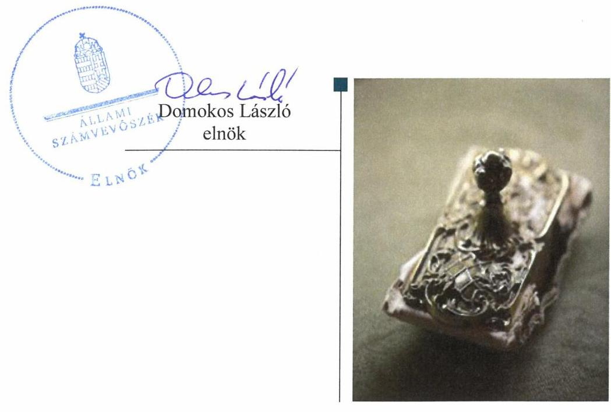
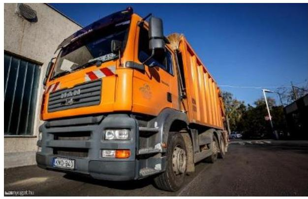

# Jelenetés 

## Nemzeti tulajdonú gazdasági társaságok ellenőrzése

STKH Sopron és Térsége Környezetvédelmi és Hulladékgazdálkodási Nonprofit Korlátolt Felelősségű Társaság

19056
www.asz.hu

---

# Jelentés 

## Nemzeti tulajdonú gazdasági társaságok ellenőrzése

STKH Sopron és Térsége Környezetvédelmi és Hulladékgazdálkodási Nonprofit Korlátolt Felelősségű Társaság
2019. 10. hó 29. nap

---

# AZ ELLENŐRZÉST FELÜGYELTE:

DR. HORVÁTH MARGIT felügyeleti vezető

DR. NAGY IMRE felügyeleti vezető

## AZ ELLENŐRZÉST VEZETTE ÉS A VÉGREHAJTÁSÁÉRT FELELŐS:

SALI SÁNDORNÉ ellenőrzésvezető

A PROGRAM ÖSSZEÁLLÍTÁSÁÉRT FELELŐS:

TÓTPÁL SZABOLCS osztályvezető

IKTATÓSZÁM: EL-1702-001/2019

TÉMASZÁM: 19

TÉMASZÁM: 19

Jelentéseink az Országgyűlés számítógépes hálózatán és az Interneta a www.asz.hu címen is olvashatóak.

---

# TARTALOMJEGYZÉK 

■ ÖSSZEGZÉS ..... 5
■ AZ ELLENŐRZÉS CÉLJA ..... 6
■ AZ ELLENŐRZÉS TERÜLETE ..... 7
■ AZ ELLENŐRZÉS HÁTTERE, INDOKOLTSÁGA ..... 9
■ A JELENTÉS LÉNYEGES KÉRDÉSKÖREI ..... 10
■ AZ ELLENŐRZÉS HATÓKÖRE ÉS MÓDSZEREI ..... 11
■ MEGÁLLAPÍTÁSOK ..... 13
■ JAVASLATOK ..... 15
■ MELLÉKLETEK ..... 17
I. sz. melléklet: Értelmező szótár ..... 17
■ FÜGGELÉK: ÉSZREVÉTELEK ..... 19
■ RÖVIDÍTÉSEK JEGYZÉKE ..... 21

---

.

---

# ÖSSZEGZÉS 

Az STKH Sopron és Térsége Környezetvédelmi és Hulladékgazdálkodási Nonprofit Korlátolt Felelősségű Társaság felett tulajdonosi jogokat gyakorló Sopron Megyei Jogú Város Önkormányzata tulajdonosi joggyakorlása szabályszerű volt. A Társaság vagyongazdálkodása nem volt szabályszerű, mert a számviteli beszámolóinak mérlegét nem támasztotta alá leltárral, így az elszámoltathatóságot nem biztositotta.

## Az ellenőrzés társadalmi indokoltsága

Az Állami Számvevőszék stratégiájában megfogalmazta, hogy az államháztartáson kívül működő feladatellátó rendszerek ellenőrzéseivel hozzájárul ahhoz, hogy a közpénzeket, illetve az ingyenesen juttatott közvagyont az államháztartáson kívül működő szervezetek is átlátható, rendezett módon használják fel.

Az állam és a helyi önkormányzatok tulajdona nemzeti vagyon. A nemzeti vagyon megőrzése, megóvása érdekében kiemelten fontos a nemzeti tulajdonú gazdasági társaságok ellenőrzése.

A nemzeti tulajdonú gazdasági társaságok gazdálkodása jellemzően a közérdeklődés és a média figyelmének középpontjában áll, amihez hozzájárul a gazdálkodásuk körébe tartozó vagyon nagysága illetve az általuk ellátott közszolgáltatások minősége és hatékonysága is.

Az Állami Számvevőszék céljaival és a társadalmi igénnyel összhangban, a gazdasági társaságok kiemelt fontosságú szerepe miatt került sor a Sopron Megyei Jogú Város Önkormányzata többségi tulajdonában álló STKH Sopron és Térsége Környezetvédelmi és Hulladékgazdálkodási Nonprofit Korlátolt Felelősségű Társaság vagyongazdálkodásának, illetve az Önkormányzat tulajdonosi joggyakorlásának ellenőrzésére.

## Főbb megállapítások, következtetések, javaslatok

Az STKH Sopron és Térsége Környezetvédelmi és Hulladékgazdálkodási Nonprofit Korlátolt Felelősségű Társaság felett tulajdonosi jogokat gyakorló Sopron Megyei Jogú Város Önkormányzata a tulajdonosi joggyakorlása szabályszerű volt, az előírásnak megfelelően jelölte ki az FB tagjait és a könyvvizsgálót, valamint az FB és a könyvvizsgáló írásbeli jelentéseinek birtokában döntött a Társaság éves beszámolóinak elfogadásáról.

A Társaság vagyongazdálkodása nem volt szabályszerű, mert a számviteli beszámolók mérlegtételeit nem támasztotta alá leltárral, illetve nem győződött meg a mérlegbe került tételek valódiságáról, így a Társaság elszámoltathatósága, a nemzeti vagyon megőrzése nem volt biztosított.

Az Állami Számvevőszék a jelentésben foglalt megállapítások alapján Sopron Megyei Jogú Város Önkormányzata polgármesterének 1 javaslatot, az STKH Sopron és Térsége Környezetvédelmi és Hulladékgazdálkodási Nonprofit Korlátolt Felelősségű Társaság ügyvezetőjének pedig 2 javaslatot fogalmazott meg. A javaslatokat megalapozó megállapításokra az érintetteknek 30 napon belül intézkedési tervet kell készíteniük.

---

# AZ ELLENŐRZÉS CÉLJA 

AZ ELLENŐRZÉS CÉLJA annak megállapítása, hogy a tulajdonosi joggyakorló a gazdasági társasága feletti tulajdonosi joggyakorlás kereteit kialakította-e, tulajdonosi jogait megfelelően gyakorolta-e és kötelezettségeit teljesítette-e. Az ellenőrzés célja továbbá annak megállapítása, hogy a gazdasági társaság biztosította-e a vagyon védelmét a nyilvántartások szabályszerű vezetése, és a mérleg tételeinek leltárral történő alátámasztása útján.

---

# **AZ ELLENŐRZÉS TERÜLETE**

## **STKH Sopron és Térsége Környezetvédelmi és Hulladékgazdálkodási Nonprofit Kft. és a tulajdonosi jogokat gyakorló Sopron Megyei Jogú Város Önkormányzata**

Az STKH Sopron és Térsége Környezetvédelmi és Hulladékgazdálkodási Nonprofit Kft. tevékenységét 1994. évben kezdte meg. A Társaság^{1} Sopron Megyei Jogú Város Önkormányzatának kizárólagos tulajdona lett 2015. január 1-jétől, majd 2016. december 22-én az Önkormányzat^{2} döntött a Társaság 100,0 ezer Ft névértékű tulajdonrészének értékesítéséről a Nyugat-dunántúli Regionális Hulladékgazdálkodási Társulásnak. Ezzel az Önkormányzat tulajdonrésze 99,3%-ra változott, ezt követően a Társaság legfőbb döntéshozó szerve a taggyűlés lett.

A Társaság feletti tulajdonosi jogokat az Önkormányzat Közgyűlése gyakorolta. A Társaság alapításkori jegyzett tőkéje 137,6 M Ft volt, mely az ellenőrzött időszak végéig nem változott.

A Társaság főtevékenysége hulladékgyűjtés, ártalmatlanítás, melyet közszolgáltatás keretében végzett. A közfeladat ellátása mellett gépjármű javítási, bérbeadási és kereskedelmi tevékenységet is végzett. A Társaság a Sopron Térségi Hulladékgazdálkodási Társulással kötött Közszolgáltatási Szerződés^{3} alapján Győr-Moson-Sopron megye és Vas megye területén a 2015-2016. években 39 településen, 2017. évben a hulladékgazdálkodási integráció következtében 256 településen végzett kommunális és szelektív hulladékgyűjtést, hulladékszállítást, hulladékkezelést.

A Társaság tőkehelyzetének alakulását az 1. táblázat mutatja be:

1. táblázat

|  A TÁRSASÁG TŐKEHELYZETÉNEK ÉS EREDMÉNYÉNEK ALAKULÁSA A 2015-2017. ÉVEKBEN (M FT) |  |  |   |
| --- | --- | --- | --- |
|  Megnevezés | 2015. év | 2016. év | 2017. év  |
|  Saját tőke összege | 34,6 | 228,0 | 252,7  |
|  Ebből: Értékelési tartalék | 0,0 | 214,7 | 213,7  |
|  Jegyzett tőke összege | 137,6 | 137,6 | 137,6  |
|  Saját tőke/jegyzett tőke aránya (%) | 25,1 | 165,7 | 183,6  |
|  Mérleg szerinti/adózott eredmény | -22,4 | -21,3 | 25,7  |

*Forrás: Társaság 2015-2017. évi beszámolói*

A Társaság a Számv. tv.^{4} előírása alapján az ellenőrzött időszakban könyvvizsgálatra kötelezett volt.

A Társaság vagyonkezelésbe vett nemzeti vagyonnal nem rendelkezett, a közszolgáltatási feladatait saját eszközeivel, valamint a Közszolgáltatási szerződés, továbbá üzemeltetési és bérleti szerződések keretében rendelkezésére bocsátott eszközökkel látta el.

---

A Társaság a Közszolgáltatási szerződés alapján üzemeltetett a Sopron Térségi Hulladékgazdálkodási Társulás tulajdonában lévő, a feladatellátáshoz kapcsolódó tárgyi eszközöket. Bérleti szerződés alapján, bérleti díj ellenében használta az Önkormányzat tulajdonában lévő két szemétlerakó telepet, továbbá 2017. március 31-től a Nyugat-dunántúli Regionális Hulladékgazdálkodási Önkormányzati Társulással kötött Üzemeltetési Szerződés alapján, bérleti díj ellenében üzemeltette Szombathely területén a szelektív hulladékkezelési telephelyet.

A Társaság más gazdasági társaságban tulajdoni részesedéssel nem rendelkezett és nem tartozott a kormányzati szektorba.

Az Ügyvezető ${ }^{5}$ személye az ellenőrzött időszakban nem változott, tevékenységét 2014. május 28 -tól látta el.

---

# AZ ELLENŐRZÉS HÁTTERE, INDOKOLTSÁGA 

AZ ÁLLAM ÉS A HELYI ÖNKORMÁNYZATOK TULAJDONA NEMZETI VAGYON, az Alaptörvény 38. cikke alapján. A nemzeti vagyon megőrzése, megóvása érdekében kiemelten fontos ezen nemzeti tulajdonú gazdasági társaságok ellenőrzése. Gazdálkodásuk jellemzően a közérdeklődés és a médiafigyelmének középpontjában áll, amihez hozzájárul a gazdálkodásuk körébe tartozó vagyon nagysága illetve az általuk ellátott közszolgáltatások minősége és hatékonysága is.

Ellenőrzéseink feltárhatják, hogy a tulajdonosi felügyelet hozzájárult-e a szabályszerű gazdálkodáshoz és feladatellátáshoz. Az ellenőrzés eredményeként meghatározhatóvá válnak a gazdasági társaság vagyongazdálkodást érintő kockázatai, ezzel lehetővé téve a kockázatok csökkentését. A megállapítások alapján megfogalmazott számvevőszéki javaslatok hasznosítása elősegítheti a meglévő hibák megszüntetését. A jó gyakorlatok bemutatásával az ÁSZ hozzájárulhat a követendő megoldások megismertetéséhez, terjesztéséhez.

---

# A JELENTÉS LÉNYEGES KÉRDÉSKÖREI 

1.     - A tulajdonosi jogok gyakorlása szabályszerű volt-e?
2.     - A Társaság vagyongazdálkodása megfelelt-e az előírásoknak?

---

# AZ ELLENŐRZÉS HATÓKÖRE ÉS MÓDSZEREI 

## Az ellenőrzés típusa

Megfelelőségi ellenőrzés.

## Az ellenőrzött időszak

A Társaság vagyongazdálkodása vonatkozásában az ellenőrzött időszak 2015 - 2017. évek, a 2017. évi beszámoló jóváhagyása tekintetében 2018. június elsejéig tartó időszak. A Társaság feletti tulajdonosi joggyakorlás vonatkozásában az ellenőrzött időszak 2017. január 1-től - 2018. szeptember 26-ig, az ellenőrzés megkezdésének napjáig terjedt ki az éves beszámolók elfogadása és a tulajdonosi ellenőrzése kivételével, amelyeknél az ellenőrzött időszak 2015. január 1-től az ellenőrzés megkezdésének napjáig 2018. szeptember 26-ig - tartott.

## Az ellenőrzés tárgya

Az STKH Sopron és Térsége Környezetvédelmi és Hulladékgazdálkodási Nonprofit Kft. feletti tulajdonosi joggyakorlás kialakítása és múködtetése.

Az STKH Sopron és Térsége Környezetvédelmi és Hulladékgazdálkodási Nonprofit Kft. vagyongazdálkodása keretében a társaság használatában, kezelésében lévő nemzeti vagyon, illetve a saját vagyona tekintetében a vagyonnyilvántartások vezetése, leltára.

## Az ellenőrzött szervezet

STKH Sopron és Térsége Környezetvédelmi és Hulladékgazdálkodási Nonprofit Kft., valamint a Sopron Megyei Jogú Város Önkormányzata, mint a Társaság feletti tulajdonosi joggyakorló.

## Az ellenőrzés jogalapja

Az ellenőrzés jogalapját az ÁSZ tv. 1. § (3) bekezdése és 5. § (3)-(5) bekezdése képezi.

---

# Az ellenőrzés módszerei 

Az ellenőrzést az ellenőrzési program ellenőrzési kérdései, az ellenőrzött időszakban hatályos jogszabályok, az ellenőrzés szakmai szabályok és módszertanok alapján, a nemzetközi standardok figyelembe vételével végeztük.

Az ellenőrzés ideje alatt az ellenőrzött szervezettel történő kapcsolattartást az ÁSZ Szervezeti és Múködési Szabályzatának vonatkozó előírásai alapján biztosítottuk.
2017. január 1-től 2018. szeptember 26-ig, az ellenőrzés megkezdésének napjáig tartó időszakra ellenőriztük a tulajdonosi joggyakorlás kereteinek kialakítását, a tulajdonosi joggyakorló tevékenységét a felügyelő bizottság és a független könyvvizsgáló múködéséhez kapcsolódóan, valamint azt, hogy a tulajdonosi joggyakorló - amennyiben a gazdasági társaság feladatellátásához és vagyonkezeléséhez kapcsolódóan határozott meg követelményeket, elvárásokat - a nemzeti vagyon értékének megőrzése érdekében monitorozta-e azok teljesülését. A teljes ellenőrzött időszakra,2017. január 1-től 2018. szeptember 26-ig - ellenőriztük a tulajdonosi joggyakorló részvételét az éves beszámoló elfogadására vonatkozó döntéshozatalban.

A gazdasági társaság vagyonhoz kapcsolódó nyilvántartásai vezetésének megfelelősége, a nemzeti vagyon értéke megőrzésének, gyarapításának, hasznosításának szabályszerűsége 2015. és 2017. évek, a mérleg tételeinek leltárral való alátámasztottsága a 2015., 2016. és a 2017. évek tekintetében került ellenőrzésre. A 2016. évi mérleg tételeinek leltárral való alátámasztottsága vonatkozásában helyszíni adatbetekintésre került sor. A teljes ellenőrzött időszakot érintően, - 2015-2017. évek, a 2017. évi beszámoló jóváhagyása tekintetében 2018. június elsejéig tartó időszakra - történt meg a lényeges dokumentumok értékelése.

A vagyonnyilvántartások és a leltár szabályszerűsége esetében az ellenőrzés azokra a legnagyobb értékű tételekre - a lényeges sokaságra - terjedt ki, melyek összértéke eléri a teljes sokaság összértékének 50\%-át. A lényeges sokaságot tételesen ellenőriztük.

---

# 1. A tulajdonosi jogok gyakorlása szabályszerű volt-e? 

Összegző megállapítás

Sopron Megyei Jogú Város Önkormányzata Társaság feletti tulajdonosi joggyakorlása szabályszerű volt.

A TULAJDONOSI JOGGYAKORLÁS KERETEIT a tulajdonosi joggyakorló ${ }^{6}$ a vagyongazdálkodási rendeletben ${ }^{7}$, és a társasági Alapító okiratban ${ }^{8}$, illetve Társasági szerződés ${ }_{1-2}{ }^{9}$-ben - a Mótv. ${ }^{10}$, az Nvtv. ${ }^{11}$ és a Ptk. ${ }^{12}$ előírásaival összhangban - alakította ki.

A vagyongazdálkodási rendeletben a Ptk. előírásai alapján határozták meg a Közgyűlés ${ }^{13}$ döntési jogköreit, továbbá a nem kizárólagos tulajdonú gazdasági társaságok esetében rendelkeztek a képviselet módjáról. Az Alapító okiratban és a Társasági szerződés ${ }_{1-2}$-ben a Ptk., valamint a Taktv. ${ }^{14}$ előírásaival összhangban három tagból álló $\mathrm{FB}^{15}$ létrehozásáról, továbbá a Számv. tv. előírásai alapján könyvvizsgálatról rendelkeztek. A tulajdonosi joggyakorló a Taktv. előírásainak megfelelően megalkotta a Javadalmazási szabályzatot ${ }^{16}$.

A TULAJDONOSI JOGOK GYAKORLÁSA során a Ptk. előírásainak megfelelően jelölték ki az FB tagjait és a könyvvizsgálót, valamint az FB és a könyvvizsgáló írásbeli jelentéseinek birtokában döntöttek a Társaság éves számviteli beszámolóinak elfogadásáról.

A tulajdonosi joggyakorló a Társaság tevékenységének nyomon követését a Társaság éves beszámolóinak, - a tulajdonosi joggyakorló által előírt tartalommal elkészített - üzleti terveinek elfogadása, valamint az FB ellenőrzései útján biztosította. Továbbá az Áht. ${ }^{17}$-ban foglalt lehetőséggel élve, az Önkormányzat belső ellenőrzését kiterjesztették a többségi tulajdonú gazdasági társaságokra. A belső ellenőrzési terv a Társaságra egy ellenőrzést tartalmazott, az ellenőrzött időszak végéig a Társaság ellenőrzésére nem került sor.

A 2015. és 2016. évi veszteség rendezése az eredménytartalék terhére történt, a 2017. évben elért pozitív eredményt eredménytartalékba helyezték. A veszteség következtében 2015. év végére a Társaság saját tőkéje a jegyzett tőke $25,1 \%$-ára csökkent, ezért a Ptk. előírása alapján a tulajdonosi joggyakorlónak intézkedési kötelezettsége keletkezett. A Társaság a 2016. évben a Számv. tv. előírásával összhangban az immateriális javak, tárgyi eszközök piaci értékelését végrehajtotta, ezzel összefüggésben elszámolt értékhelyesbítés hatására a tőkehelyzet rendeződött.

---

# 2. A Társaság vagyongazdálkodása megfelelt-e az előírásoknak? 

## Összegző megállapítás

A Társaság vagyongazdálkodása a mérlegtételek leltárral való alátámasztásának hiányában nem volt szabályszerű.

A Társaság rendelkezett a Számv. tv. előírása szerinti Leltárkészítési és leltározási szabályzattal ${ }^{18}$. A vagyon nyilvántartásba vétele megfelelt a jogszabályi előírásoknak. A Társaság a tárgyi eszközök üzembe helyezését bizonylattal alátámasztotta, az eszközök besorolása, bekerülési értékének meghatározása, és az értékcsökkenés elszámolása a Számv. tv. előírásaival összhangban volt. Ugyanakkor a Társaság a Számv. tv. 92. § (1) bekezdése ellenére, a 2015. évi beszámolója kiegészítő mellékletében elmulasztotta feltüntetni az immateriális javak bruttó értékének növekedését, továbbá a 2017. évi beszámolója kiegészítő mellékletében nem mutatta be a tárgyi eszközök és az immateriális javak tárgyévi bruttó növekedési tételeit sem.

A Társaság Közszolgáltatási, bérleti és üzemeltetési szerződések alapján használta az idegen tulajdonú eszközöket a hulladékgazdálkodási közfeladat ellátása érdekében, az eszközöket tovább nem hasznosította.

A VAGYONGAZDÁLKODÁS a 2015., 2016. és a 2017. években nem volt szabályszerű. A Társaság a beszámolók mérlegét a 2015., 2016. és a 2017. évre a Számv. tv. 69. § (1) bekezdése, valamint a Leltárkészítési és leltározási szabályzat 5-11. pontjaiban foglaltak ellenére a mérleg fordulónapján meglévő eszközöket és forrásokat mennyiségben és értékben tartalmazó leltárral nem támasztotta alá. A mérleg tételeit alátámasztó leltár hiányában a 2015., 2016. és a 2017. évi éves beszámolókban a Számv. tv. 15. § (3) bekezdésében foglalt előírás ellenére nem érvényesült a valódiság elve, emiatt a Társaság elszámoltathatósága, a nemzeti vagyon megőrzése nem volt biztosított.

---

# JAVASLATOK 

Az ÁSZ tv. 33. § (1) bekezdésében foglaltak értelmében az ellenőrzött szervezet vezetője köteles a jelentésben foglalt megállapításokhoz kapcsolódó intézkedési tervet összeállítani és azt a jelentés kézhezvételétől számított 30 napon belül az ÁSZ részére megküldeni. Amennyiben az ellenőrzött szervezet vezetője nem küldi meg határidőben az intézkedési tervet, vagy továbbra sem elfogadható intézkedési tervet küld, az Állami Számvevőszék elnöke az ÁSZ tv. 33. § (3) bekezdése a) és b) pontjaiban foglaltakat érvényesítheti.

Javaslataink célja az STKH Sopron és Térsége Környezetvédelmi és Hulladékgazdálkodási Nonprofit Korlátolt Felelősségű Társaság gazdálkodása szabályszerűségének és gyakorlatának javítása annak érdekében, hogy a szabályozási környezet és az alkalmazott gyakorlat megfelelően tudja támogatni az átlátható működést.

## Az STKH Sopron és Térsége Környezetvédelmi és Hulladékgazdálkodási Nonprofit Korlátolt Felelősségű Társaság ügyvezetőjének

1. Intézkedjen az éves beszámolók mérlegtételeinek leltárral történő alátámasztásáról a Számv. tv. és a Leltározási szabályzat előírásainak megfelelően.
(2. sz. megállapítás 3. bekezdése alapján)
2. Intézkedjen annak érdekében, hogy a Társaság éves beszámolója kiegészítő mellékletében feltüntetésre kerüljenek a tárgyi eszközök és az immateriális javak bruttó értékének növekedési tételei a Számv. tv. előírásai szerint.
(2. megállapítás 1. bekezdés utolsó mondata)

---

Javaslatunk célja a tulajdonosi joggyakorló Sopron Megyei Jogú Város Önkormányzata szabályszerű müködésének elősegítése, továbbá a tulajdonosi joggyakorlás kontrolljainak erősítése.

# Sopron Megyei Jogú Város Önkormányzata polgármesterének 

1. Kezdeményezze a Társaságnál a leltárral kapcsolatban feltárt szabálytalanságok tekintetében a felelősség tisztázását és szükség szerint intézkedjen a felelősség érvényesitéséről
(2. sz. megállapítás 3. bekezdése alapján)

---

# MELLÉKLETEK 

- I. SZ. MELLÉKLET: ÉRTELMEZŐ SZÓTÁR
gazdasági társaság
közszolgáltatás
közfeladat
nemzeti vagyon
nonprofit gazdasági társaság
tulajdonosi jogok gyakor-
lója

A Ptk. 3:88. § (1) bekezdése szerint „a gazdasági társaságok üzletszerű közös gazdasági tevékenység folytatására, a tagok vagyoni hozzájárulásával létrehozott, jogi személyiséggel rendelkező vállalkozások, amelyekben a tagok a nyereségből közösen részesednek, és a veszteséget közösen viselik".
Az Ebktv. 19 3. § d) pontja a következőképpen határozza meg a közszolgáltatást: „szerződéskötési kötelezettség alapján a lakosság alapvető szükségleteinek ellátására irányuló szolgáltatás, így különösen a villamos energia-, gáz-, hő-, víz-, szennyvíz- és hulladékkezelési, köztisztasági, postai és távközlési szolgáltatás, továbbá a menetrend alapján közlekedő járművekkel végzett közforgalmú személyszállítás".
Az Áht. 3/A. § (1) bekezdése alapján közfeladat a jogszabályban meghatározott állami vagy önkormányzati feladat.
Nvtv. 1. § (2) bekezdése szerint nemzeti vagyonba tartozik többek között:
„az állam vagy a helyi önkormányzat kizárólagos tulajdonában álló dolgok,
az a) pont hatálya alá nem tartozó, állam vagy a helyi önkormányzat tulajdonában lévő dolog,
az állam vagy a helyi önkormányzat tulajdonában lévő pénzügyi eszközök, továbbá az államot vagy a helyi önkormányzatot megillető társasági részesedések,
az államot vagy a helyi önkormányzatot megillető bármely vagyoni értékkel rendelkező jogosultság, amelyet jogszabály vagyoni értékű jogként nevesít."
Civil tv. 9/F. § (2) bekezdése szerint „az a gazdasági társaság minősül nonprofit gazdasági társaságnak és cégnevében az a gazdasági társaság tüntetheti fel a nonprofit jelleget, amelynek létesítő okirata tartalmazza, hogy a gazdasági társaság tevékenységéből származó nyereség a tagok között nem osztható fel, hanem az a gazdasági társaság vagyonát gyarapítja." (hatályos 2014. március 15-től)
Aki a nemzeti vagyon felett az államot vagy a helyi önkormányzatot megillető tulajdonosi jogok és kötelezettségek összességének gyakorlására jogosult.
Forrás: Nvtv. 3. § (1) 17. pontja

---

.

---

# FÜGGELÉK: ÉSZREVÉTELEK 

A jelentéstervezetet a Számvevőszék 15 napos észrevételezésre megküldte az ellenőrzött szervezetek vezetőinek az ÁSZ tv. 29. §* (1) bekezdése előírásának megfelelően.
Sopron Megyei Jogú Város Önkormányzatának polgármestere, valamint az STKH Sopron és Térsége Környezetvédelmi és Hulladékgazdálkodási Nonprofit Korlátolt Felelősségü Társaság ügyvezetője a jelentéstervezet megállapításaira írásban észrevételt tett.
Az ÁSZ tv. 29. § (3) bekezdésével összhangban az ÁSZ a Függelékben feltünteti az ellenőrzés megállapításaival kapcsolatban tett, figyelembe nem vett észrevételeket, és megindokolja, hogy azokat miért nem fogadta el.

A „Nemzeti tulajdonú gazdasági társaságok ellenőrzése - STKH Sopron és Térsége Környezetvédelmi és Hulladékgazdálkodási Nonprofit Korlátolt Felelősségü Társaság" címmel készített számvevőszéki jelentéstervezet megállapításaival kapcsolatban Sopron Megyei Jogú Város Önkormányzata polgármestere által tett, figyelembe nem vett észrevételei és azok indokolása.

A jelentéstervezet 2. számú megállapításának 3. bekezdését és a Társaság ügyvezetőjének címzett 1. számú javaslatot érintő észrevétel:

Polgármester úr észrevételében jelezte, hogy az STKH Sopron és Térsége Környezetvédelmi és Hulladékgazdálkodási Nonprofit Korlátolt Felelősségű Társaság (továbbiakban: Társaság) részéről a 2015. és a 2017. évi leltározási dokumentáció hiányosan került feltöltésre a vizsgálati tárhelyre. A Társaság a 2016. évre vonatkozó dokumentumokat a helyszíni ellenőrzés során átadta. Az észrevétel mellékleteként megküldésre került a NAV 2019. április 16-án kelt jogkövetési vizsgálatának jegyzőkönyve, amely az ÁSZ által vizsgált időszak közül a 2017. évi leltár meglétére és a beszámoló alátámasztottságának vizsgálatára is kiterjedt.

Az Állami Számvevőszék (továbbiakban: ÁSZ) az ellenőrzési megállapításait az adatszolgáltatás során a részére törvényi határidőben rendelkezésre bocsátott dokumentumokra alapozva fogalmazza meg. A Társaság teljességi és hitelességi nyilatkozata szerint az ÁSZ részére átadott dokumentumok, adatok megbízhatóak, és a bekért adatokra, dokumentumokra vonatkozóan teljes körű információt tartalmaznak. A Társaság az adatszolgáltatás során a 2015. és 2017. évi beszámoló mérlegének valamennyi tételét alátámasztó leltárt nem bocsátott az ÁSZ ellenőrzés rendelkezésére. Mindezeket az észrevételben foglaltak is megerősítik. Az észrevételhez mellékelt Nemzeti Adó- és Vámhivatal

[^0]
[^0]:    * 29. § (1) Az Állami Számvevőszék az ellenőrzési megállapításait megküldi az ellenőrzött szervezet vezetőjének vagy az általa megbízott személynek, és annak, akinek személyes felelősségét állapította meg.
    (2) Az ellenőrzött szervezet vezetője és a felelősként megjelölt személy az ellenőrzés megállapításaira tizenöt napon belül írásban észrevételt tehet.
    (3) Az Állami Számvevőszék az észrevételre a beérkezésétől számított harminc napon belül írásban válaszol. A figyelembe nem vett észrevételeket köteles a jelentésben feltüntetni, és megindokolni, hogy azokat miért nem fogadta el.

---

vizsgálati jegyzőkönyve a 2017. és a 2018. évi beszámoló leltárral való alátámasztottságához kapcsolódik, azonban a leltárral kapcsolatosan kizárólag a 2016. évet érintően volt lehetőségük további észrevételt tenni.

Az előbbiekre tekintettel a 2017. beszámoló leltárral való megalapozottságára tett észrevételét és a megküldött dokumentumokat nem értékeltük, a jelentéstervezet módosítása sem a 2015-2016. évi, sem a 2017. évi leltározásra vonatkozó megállapítás tekintetében nem indokolt.

A „Nemzeti tulajdonú gazdasági társaságok ellenőrzése - STKH Sopron és Térsége Környezetvédelmi és Hulladékgazdálkodási Nonprofit Korlátolt Felelősségű Társaság" címmel készített számvevőszéki jelentéstervezet megállapításaival kapcsolatban a Társaság ügyvezetője által tett, figyelembe nem vett észrevételei és azok indokolása.

# A jelentéstervezet 2. számú megállapításának 3. bekezdését és a Társaság ügyvezetőjének címzett 1. számú javaslatot érintő észrevétel: 

Ügyvezető úr levelében azt a tájékoztatást adta, hogy szabályzataikat áttekintették és a leltározási szabályzat 1. számú mellékletében a tárgyi eszközök leltározásának gyakorisága és módja 2019. március 4. napjával módosításra került. Észrevételében jelezte, hogy a 2015, 2016. és 2017. évi leltározási dokumentáció hiányosan került feltöltésre a vizsgálati tárhelyre, amelyet jeleztek az ÁSZ részére. A 2016. évre vonatkozó dokumentumokat a helyszíni ellenőrzés során átadták. Az észrevétel mellékleteként megküldte a NAV 2019. április 16-án kelt jogkövetési vizsgálatának jegyzőkönyvét, amely az ÁSZ által vizsgált időszak közül a 2017. évi leltár meglétére és a beszámoló alátámasztottságának vizsgálatára is kiterjedt.

Az ÁSZ az ellenőrzési megállapításait az adatszolgáltatás során a részére törvényi határidőben rendelkezésre bocsátott dokumentumokra alapozva fogalmazza meg. A teljességi és hitelességi nyilatkozatuk szerint az ÁSZ részére átadott dokumentumok, adatok megbízhatóak, és a bekért adatokra, dokumentumokra vonatkozóan teljes körű információt tartalmaznak. A Társaság az adatszolgáltatás során a 2015. és 2017. évi beszámoló mérlegének valamennyi tételét alátámasztó leltárt nem bocsátott az ÁSZ ellenőrzés rendelkezésére. Mindezeket az észrevételben foglaltak is megerősítik. Az észrevételhez mellékelt Nemzeti Adó- és Vámhivatal vizsgálati jegyzőkönyve a 2017. és a 2018. évi beszámoló leltárral való alátámasztottságához kapcsolódik, azonban a leltárral kapcsolatosan kizárólag a 2016. évet érintően volt lehetőségük további észrevételt tenni.

A leltározási szabályzat kiegészítésére vonatkozó tájékoztatása, a tervezett intézkedéseik a jelentéstervezet ellenőrzött időszakra megfogalmazott megállapításait nem befolyásolják, így azok módosítása nem indokolt. Az előbbiekre tekintettel a 2017. beszámoló leltárral való megalapozottságára tett észrevételét és a megküldött dokumentumokat nem értékeltük, a jelentéstervezet módosítása sem a 2015-2016. évi, sem a 2017. évi leltározásra vonatkozó megállapítás tekintetében nem indokolt.

---

# RÖVIDÍTÉSEK JEGYZÉKE 

${ }^{1}$ Társaság
${ }^{2}$ Önkormányzat
${ }^{3}$ Közszolgáltatási szerződés
${ }^{4}$ Számv. tv.
${ }^{5}$ Ügyvezető
${ }^{6}$ tulajdonosi joggyakorló
${ }^{7}$ Vagyongazdálkodási rendelet
${ }^{8}$ Alapító okirat
${ }^{9}$ Társasági szerződés1-2
${ }^{10}$ Mötv.
${ }^{11}$ Nvtv.
${ }^{12}$ Ptk.
${ }^{13}$ Közgyűlés
${ }^{14}$ Taktv.
${ }^{15} \mathrm{FB}$
${ }^{16}$ Javadalmazási szabályzat
${ }^{17}$ Áht.
${ }^{18}$ Leltárkészítési és leltározási szabályzat
${ }^{19}$ Ebktv.

STKH Sopron és Térsége Környezetvédelmi és Hulladékgazdálkodási Nonprofit Kft. Sopron Megyei Jogú Város Önkormányzata
Sopron Térségi Hulladékgazdálkodási Önkormányzati Társulás és az STKH Sopron és Térsége Környezetvédelmi és Hulladékgazdálkodási Nonprofit Kft. között 2014. június 30-án létrejött, 2016. június 30-án módosított Közszolgáltatási Szerződés 2000. évi C. törvény a Számvitelről

STKH Sopron és Térsége Környezetvédelmi és Hulladékgazdálkodási Nonprofit Kft. úgyvezetője
Az STKH Sopron és Térsége Környezetvédelmi és Hulladékgazdálkodási Nonprofit Kft. feletti tulajdonosi jogokat gyakorló Sopron Megyei Jogú Város Önkormányzat Közgyűlése
Sopron Megyei Jogú Város Önkormányzat Közgyűlésének 3/2013. (III. 4.) önkormányzati rendelete Sopron Megyei Jogú Város Önkormányzata vagyonáról, a vagyon feletti tulajdonosi jogok gyakorlásának és a vagyon kezelésének szabályozásáról. (a módosításokkal egységes szerkezetű, 2015. október 1-től hatályos rendelet)
STKH Sopron és Térsége Környezetvédelmi és Hulladékgazdálkodási Nonprofit Kft. módosításokkal egységes szerkezetbe foglalt Alapító okirata. (Hatályos 2016. február 25-től 2017. február 7-ig)
Alapító okirat2: A Zöld Bicske Nonprofit Kft. 2018. június 25-től hatályos, egységes szerkezetbe foglalt Alapító okirata
Társasági szerződés1: STKH Sopron és Térsége Környezetvédelmi és Hulladékgazdálkodási Nonprofit Kft. Társasági szerződése (Hatályos 2017. február 8-tól 2017. október 30-ig)
Társasági szerződés2: STKH Sopron és Térsége Környezetvédelmi és Hulladékgazdálkodási Nonprofit Kft. Társasági szerződése (Hatályos 2017. október 31-től)
2011. évi CLXXXIX. törvény Magyarország helyi önkormányzatairól
2011. évi CXCVI. törvény a nemzeti vagyonról
2013. évi V. törvény a Polgári Törvénykönyvről
Sopron Megyei Jogú Város Önkormányzat Közgyűlése
2009. évi CXXII. törvény a köztulajdonban álló gazdasági társaságok takarékosabb müködéséről
STKH Sopron és Térsége Környezetvédelmi és Hulladékgazdálkodási Nonprofit Kft. felügyelő-bizottsága
A 290/2015. (XII. 17.) Kgy. határozat mellékleteként hatályba léptetett, STKH Sopron és Térsége Környezetvédelmi és Hulladékgazdálkodási Nonprofit Kft. Szabályzata a Társaság vezető tisztségviselők, felügyelő bizottsági tagok és vezető állású munkavállalók javadalmazásának elveiről, a 2015. december 17-i módosításokkal egységes szerkezetben
2011. évi CXCV. törvény az államháztartásról (hatályos 2012. január 1-jétől)

STKH Sopron és Térsége Környezetvédelmi és Hulladékgazdálkodási Nonprofit Kft. Leltárkészítési és leltározási szabályzata, hatályos 2015. január 1-től
2003. évi CXXV. törvény az egyenlő bánásmódról és az esélyegyenlőség előmozdításáról

---

# ÁLLAMI SZÁMVEVŐSZÉK 

1052 Budapest, Apáczai Csere János utca 10.
Levélcím: 1364 Budapest 4. Pf. 54
Telefon: +36 14849100 Telefax: +36 14849200
www.asz.hu