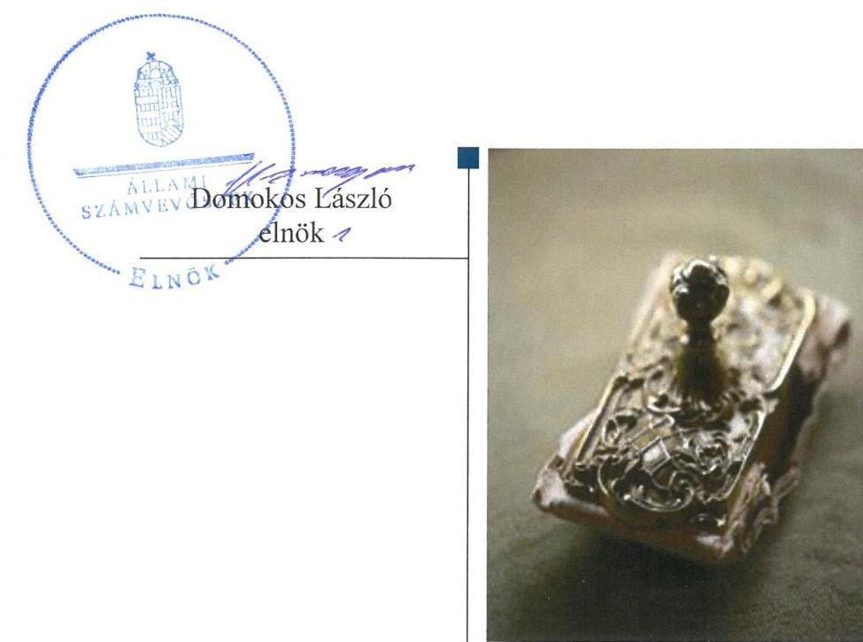

# Jelentés

## Önkormányzatok ellenőrzése-Integritás- és belső kontrollrendszer

Gellénháza Község Önkormányzata 2019.

19057 www.asz.hu

---

# Jelentés

## Önkormányzatok ellenőrzése-Integritás- és belső kontrollrendszer

Gellénháza Község Önkormányzata 2019. 04. hó 19. nap

---

# AZ ELLENŐRZÉST FELÜGYELTE:

DR. NAGY IMRE felügyeleti vezető

# AZ ELLENŐRZÉST VEZETTE ÉS A VÉGREHAJTÁSÁÉRT FELELŐS:

DR. DOMOKOS MAGDOLNA ellenőrzésvezető

# A PROGRAM ÖSSZEÁLLÍTÁSÁÉRT FELELŐS:

TÓTPÁL SZABOLCS osztályvezető

---

IKTATÓSZÁM: EL-1542-001/2019.

TÉMASZÁM: 2485

ELLENŐRZÉS-AZONOSÍTÓ SZÁM: V082925

---

Jelentéseink az Országgyűlés számítógépes hálózatán és az Interneten a www.asz.hu címen is olvashatóak.

---

# TARTALOMJEGYZÉK

■ ÖSSZEGZÉS ..... 5
■ AZ ELLENŐRZÉS CÉLJA ..... 6
■ AZ ELLENŐRZÉS TERÜLETE ..... 7
■ AZ ELLENŐRZÉS HÁTTERE, INDOKOLTSÁGA ..... 8
■ A JELENTÉS LÉNYEGES KÉRDÉSKÖREI ..... 9
■ AZ ELLENŐRZÉS HATÓKÖRE ÉS MÓDSZEREI ..... 10
■ MEGÁLLAPÍTÁSOK ..... 12
■ JAVASLATOK ..... 14
■ MELLÉKLETEK ..... 15
I. sz. melléklet: Értelmező szótár ..... 15
■ FÜGGELÉKEK ..... 17
I. sz. függelék a Jelentéshez ..... 17
II. sz. függelék: Észrevételek ..... 18
■ RÖVIDÍTÉSEK JEGYZÉKE ..... 19

---

.

---

# ÖSSZEGZÉS

Gellénháza Község Önkormányzatánál nem volt biztosított az átláthatóság, elszámoltathatóság, a közpénzfelhasználás szabályossága és a nemzeti vagyonnal történő felelős gazdálkodás. A korrupció megelőzésére szolgáló integritási kontrollok kiépítése nem történt meg.

## Az ellenőrzés társadalmi indokoltsága

Az Állami Számvevőszék alapvető feladata a közpénzekkel, az állami és önkormányzati vagyonnal való gazdálkodás ellenőrzése. Az Alaptörvény szerint az önkormányzatok kötelezettsége a kiegyensúlyozott, átlátható és fenntartható költségvetési gazdálkodás elvének érvényesítése, a nemzeti vagyonnal való rendeltetésszerű és felelős módon való gazdálkodás biztosítása. Az Állami Számvevőszék stratégiájában megfogalmazott célkitűzése az integritás alapú, átlátható és elszámoltatható közpénzfelhasználás elősegítése. Ennek megvalósítása érdekében az Állami Számvevőszék prioritásként kezeli a közpénzzel gazdálkodó szervezetek esetében a belső kontrollrendszer működésének ellenőrzését.

Az Állami Számvevőszék Gellénháza Község Önkormányzatát korábban nem ellenőrizte.

## Főbb megállapítások, következtetések, javaslatok

Gellénháza Község Önkormányzatának gazdálkodási feladatait ellátó Gellénházi Közös Önkormányzati Hivatal a jogszabályi előírások ellenére nem rendelkezett a feladatellátás részletes belső rendjét és módját rögzítő szervezeti és működési szabályzattal, így az átlátható, elszámoltatható működés alapvető feltételei hiányoztak.

Gellénháza Község Önkormányzata nem rendelkezett számviteli politikával, az eszközök és a források leltárkészítési és leltározási szabályzatával, az eszközök és források értékelési szabályzatával és pénzkezelési szabályzattal. Gellénháza Község Önkormányzatánál nem vezették a jogszabály szerinti naprakész nyilvántartást a gazdálkodási jogkörök gyakorlására jogosult személyekről és aláírás-mintájukról. E szabálytalanságok által a gazdálkodási jogkörök jogszabály szerinti gyakorlásának feltételei, a szabályszerű közpénzfelhasználás, a nemzeti vagyonnal való rendeltetésszerű és felelős módon történő gazdálkodás feltételei nem voltak biztosítottak.

Gellénháza Község Önkormányzatánál a korrupció megelőzésére szolgáló integritási kontrollok kiépítése nem történt meg, nem volt biztosított az integritás alapú közpénzfelhasználás lehetősége, továbbá nem volt biztosított az államháztartás pénzeszközeivel és a nemzeti vagyonnal történő gazdaságos, hatékony és eredményes gazdálkodás mérésének lehetősége.

Az Állami Számvevőszék a Gellénházi Közös Hivatal jegyzője részére a Közös Hivatal szervezeti és működési szabályzatának elkészítése, a Közös Hivatal és az Önkormányzat számviteli politikájának, eszközök és a források leltárkészítési és leltározási szabályzatának, eszközök és források értékelési szabályzatának, pénzkezelési szabályzatának elkészítése, valamint a gazdálkodási jogkörök nyilvántartásának szabályszerű, naprakész vezetése tárgyában fogalmazott meg javaslatot, melyre az érintettnek 30 napon belül intézkedési tervet kell készítenie.

---

# AZ ELLENŐRZÉS CÉLJA

Az ellenőrzés célja annak megállapítása volt, hogy Gellénháza Község Önkormányzatának belső kontrollrendszere biztosította-e a közpénzekkel és a nemzeti vagyonnal történő elszámoltatható, átlátható, szabályszerű, gazdaságos, hatékony és eredményes gazdálkodás feltételeit. Az ellenőrzés keretében értékeljük továbbá, hogy az önkormányzatnál kiépítették és erősítették-e a korrupciós kockázatok kezelését szolgáló integritás kontrollokat és azt, hogy megteremtették-e a teljesítményellenőrzés feltételeit.

---

# AZ ELLENŐRZÉS TERÜLETE

## Gellénháza Község Önkormányzata

A Zala megyei Gellénháza lakossága 2017. január 1-jén 1550 fő volt a Központi Statisztikai Hivatal Magyarország közigazgatási helynévkönyve adatai alapján.

Az önkormányzat hét tagú képviselő-testületének munkáját három állandó bizottság segítette. Az Önkormányzat fenntartásában a Gellénházi Óvoda, valamint a Gellénházi Önkormányzat Konyha működött.

Társulási megállapodás alapján a Gellénházi Közös Önkormányzati Hivatal végezte az önkormányzati feladatokat Csonkahegyhát, Dobronhegy, Gombosszeg, Iborfia, Lickóvadamos, Milejszeg, Nagylengyel, Németfalu, Ormándlak, Petrikeresztúr és Pálfiszeg Községek vonatkozásában.

Az ellenőrzött időszakhoz képest az ellenőrzés végrehajtásakor más polgármester és jegyző látta el a feladatokat.

Gellénháza Község Önkormányzata a 2017. évi zárszámadási rendelete ${ }^{1}$ szerint több, mint 520 millió Ft költségvetési bevételt ért el, valamint mintegy 300 millió Ft költségvetési kiadást teljesített. A mérleg szerinti eszköz vagyonának értéke 2017. december 31-én több, mint 1,2 milliárd Ft volt.

---

# AZ ELLENŐRZÉS HÁTTERE, INDOKOLTSÁGA

A demokratikus társadalmakban alapvető igény, hogy a közpénzeket, a közvagyont használók tevékenységükről elszámoljanak, ahhoz egyértelmű és érvényesíthető felelősségi szabályok társuljanak. Ennek a jogos igénynek az érvényesítéséhez meg kell teremteni azokat a folyamatokat, rendszereket, amelyek nélkülözhetetlenek az elszámoltatáshoz. Az elszámoltatás eredményes működtetéséhez szükség van a megfelelő információs, kontroll-, értékelési és beszámolási rendszerek kialakítására. A belső kontrollok kiépítettsége hozzájárul az integritási szemlélet kialakításához és érvényesüléséhez. A belső kontrollrendszer kialakítása és működtetése nélkül nem valósítható meg a közpénzek, a közvagyon szabályos, gazdaságos, hatékony és eredményes felhasználása.

A BELSŐ KONTROLLRENDSZER azt a célt szolgálja, hogy az államháztartás szervei működésük és gazdálkodásuk során a tevékenységeket szabályszerűen, gazdaságosan, hatékonyan, eredményesen hajtsák végre, teljesítsék elszámolási kötelezettségeiket, és megvédjék az erőforrásokat a veszteségektől, a károktól, a nem rendeltetésszerű használattól. A belső kontrollrendszer magában foglalja mindazon szabályokat, eljárásokat, gyakorlati módszereket és szervezeti struktúrákat, kockázatkezelési technikákat, kontrolltevékenységeket, amelyek segítséget nyújtanak a szervezetnek céljai eléréséhez.

A megfelelő belső kontrollrendszer jelentősen csökkenti a hibák és szabálytalanságok kockázatát. Az ÁSZ célja, hogy javuljon az ellenőrzött önkormányzatok belső kontrollrendszerének szabályozottsága, működésének megfelelősége, szabályszerűsége, hozzájárulva ezzel az egyensúlyi helyzet fenntarthatóságának biztosításához, biztosítva az önkormányzatnál a közpénzfelhasználás szabályosságát, a közpénzekkel és a nemzeti vagyonnal történő szabályszerű, gazdaságos, hatékony és eredményes gazdálkodást.

AZ ELLENŐRZÉS VÁRHATÓ HASZNOSULÁSA négy szinten valósul meg. A törvényalkotás számára összegzett tapasztalatok állnak rendelkezésre a belső kontrollrendszer önkormányzati területen való kialakításáról, működtetéséről és hatásairól. Az ellenőrzés az ellenőrzött számára visszajelzést ad a belső kontrollrendszer kialakításában és működésében lévő hiányosságokról, javaslataival hozzájárul azok kiküszöböléséhez. Az ellenőrzés megállapításait és javaslatait más szervezetek is hasznosíthatják a rendezett gazdálkodási keretek kialakításához, a ,,jó gyakorlat" elterjesztésével azok az önkormányzatok is átvehetik a pozitív példákat, ahol nem végez ellenőrzést az ÁSZ.

Az ÁSZ ellenőrzései jelzik a társadalom számára, hogy közpénz nem maradhat ellenőrizetlenül, tevékenysége hozzájárul az értékteremtő rend kialakításához és megőrzéséhez.

---

# A JELENTÉS LÉNYEGES KÉRDÉSKÖREI

1. Az önkormányzat belső kontrollrendszerének kialakítása és működtetése szabályszerű volt-e, az biztosította-e az önkormányzatnál a közpénzfelhasználás szabályosságát, a nemzeti vagyonnal történő felelős gazdálkodást?
2. Az önkormányzat kiépítette és erősítette-e az integritás kontrollrendszerét?
3. Az önkormányzatnál alakítottak-e ki a teljesítmény mérésére alkalmas követelményeket?

---

# AZ ELLENŐRZÉS HATÓKÖRE ÉS MÓDSZEREI

## Az ellenőrzés típusa

Megfelelőségi ellenőrzés.

## Az ellenőrzött időszak

2017. év, illetve az éves költségvetési beszámoló Áht. ${ }^{2}$ által megállapított jóváhagyásáig (2018. május 31-éig) tartó időszak.

## Az ellenőrzés tárgya

Gellénháza Község Önkormányzata és a gazdálkodási feladatokat ellátó Gellénházi Közös Önkormányzati Hivatal belső kontrollrendszerének kialakítása és működtetése, valamint az integritás kontrollok kiépítettsége, a teljesítményellenőrzés feltételei.

## Az ellenőrzött szervezet

Gellénháza Község Önkormányzata, valamint a Gellénházi Közös Önkormányzati Hivatal.

## Az ellenőrzés jogalapja

Az ellenőrzés jogszabályi alapját az ÁSZ tv³. 1. § (3) bekezdés, 5. § (2) és (6) bekezdései, valamint az Áht. 61. § (2) bekezdésének előírásai képezik.

## Az ellenőrzés módszerei

Az ÁSZ az ellenőrzést az ellenőrzési program szempontjai, az ellenőrzött időszakban hatályos jogszabályok, az ellenőrzés szakmai szabályai, a jelen ellenőrzésre irányadó ÁSZ módszertanok figyelembevételével hajtotta végre.

Az ellenőrzés ideje alatt az ellenőrzött szervezettel történő kapcsolattartást az ÁSZ SZMSZ4-ének vonatkozó előírásai alapján biztosította az ÁSZ.

Az ellenőrzési kérdések megválaszolásához szükséges bizonyítékok megszerzése az ellenőrzött által rendelkezésre bocsátott dokumentumokra, adatokra alapozva megfigyelés, szemle (szemrevételezés), valamint elemző eljárás útján történt.

---

Az ellenőrzési bizonyítékként felhasználható adatforrások közé tartoznak az ellenőrzési program részletes szempontjainál felsorolt adatforrások, valamint minden egyéb - az ellenőrzés folyamán feltárt, az ellenőrzés szempontjából információt tartalmazó - dokumentum.

Az önkormányzat belső kontrollrendszerének összesített értékelése az egyes részterületek esetében kapott megfelelőségi arányok számtani átlaga alapján történik és megegyezik a pillérenként (kontroll-területenként) alkalmazott százalékos értékelésekkel, a következő eltérésekkel: a kontrollrendszer egésze esetében a „szabályszerű" értékelésnek a százalékos értéken felül további feltétele, hogy egyik kontrollterület sem kaphat „nem szabályszerű" értékelést.

Amennyiben az önkormányzat működését és gazdálkodását alapvetően meghatározó dokumentum hiánya miatt, valamely lényeges kérdéskörre vonatkozóan az ÁSZ megállapítást tett, további ellenőrzési tevékenységek az adott kérdéskörrel és az azzal szoros logikai kapcsolatban lévő kérdéskörökkel - ráépülő jelleggel - nem kerültek végrehajtásra.

---

# MEGÁLLAPÍTÁSOK

## 1. Az önkormányzat belső kontrollrendszerének kialakítása és működtetése szabályszerű volt-e, az biztosította-e az önkormányzatnál a közpénzfelhasználás szabályosságát, a nemzeti vagyonnal történő felelős gazdálkodást?

Összegző megállapítás

Az Önkormányzatnál a belső kontrollrendszer kialakításához szükséges jogszabály szerinti, kötelező, alapvető elemek nem voltak biztosítottak, ezáltal a belső kontrollrendszerének kialakítása és működtetése nem volt szabályszerű, az nem biztosította a közpénzfelhasználás szabályosságát, a nemzeti vagyonnal történő felelős gazdálkodást.

AZ ÖNKORMÁNYZAT NEM SZABÁLYSZERŰ KONTROLLKÖRNYEZETBEN működött. A jegyző az Áht. 10. § (5) bekezdése ellenére a Közös Hivatal szervezetét, feladatai ellátásának részletes belső rendjét és módját szervezeti és működési szabályzatban nem állapította meg.

A jegyző a Számv.tv ${ }^{5}$ 14. § (3)-(4) bekezdése, valamint (5) bekezdés a)-b) és d) pontja, továbbá az Áhsz. 50.§ (1) bekezdése ellenére nem gondoskodott az Önkormányzatra és a Közös Hivatalra kiterjedően a számviteli politika kialakításáról, valamint ennek keretében az eszközök és a források leltárkészítési és leltározási szabályzata, az eszközök és források értékelési szabályzata és a pénzkezelési szabályzat elkészítéséről.

A KONTROLLTEVÉKENYSÉGEK KIALAKÍTÁSA NEM VOLT SZABÁLYSZERŰ, mert a jegyző az Ávr. ${ }^{6}$ 60. § (3) bekezdését megsértve a kötelezettségvállalásra, pénzügyi ellenjegyzésre, teljesítés igazolására, érvényesítésre, utalványozásra jogosult személyekről és aláírás-mintájukról naprakész nyilvántartást nem vezetett. Ezáltal a kötelezettségvállalás, teljesítés igazolás jogszabály szerinti gyakorlásának feltételei nem voltak biztosítottak.

A MONITORING RENDSZER MŰKÖDTETÉSE NEM VOLT SZABÁLYSZERŰ, mert a jegyző a Bkr. ${ }^{7}$ 11. § (1) bekezdésének előírása ellenére a belső kontrollrendszer működéséről szóló nyilatkozatot 2017. évre vonatkozóan nem tette meg.

---

# 2. Az önkormányzat kiépítette és erősítette-e az integritás kontrollrendszerét?

## Összegző megállapítás

Az Önkormányzatnál a jogszabályok által előírt kontrollok kiépítése nem történt meg.

Az Önkormányzatnál a kötelezően előírt, integritást támogató kontrollok kiépítése nem történt meg. Az Önkormányzat nem végzett kockázatelemzést, ezáltal nem azonosította az integritást veszélyeztető kockázatokat, továbbá nem határozta meg az integritás erősítésére és a korrupció visszaszorítására szolgáló értékeket.

## 3. Az önkormányzatnál alakítottak-e ki a teljesítmény mérésére alkalmas követelményeket?

Összegző megállapítás Az Önkormányzatnál nem alakítottak ki a teljesítmény mérésére alkalmas követelményeket.

A szervezeti célok elérését szolgáló feladatok, folyamatok, tevékenységek mérését szolgáló indikátorokat, mérőszámokat, feladat- és teljesítménymutatókat nem képeztek, ezáltal az Önkormányzat a teljesítmény mérésének feltételeit, az államháztartás pénzeszközeivel és a nemzeti vagyonnal történő gazdaságos, hatékony és eredményes gazdálkodás mérésének lehetőségét nem biztosította.

---

#
 JAVASLATOK 

Az ÁSZ tv. 33. § (1) bekezdésében foglaltak értelmében az ellenőrzött szervezet vezetője köteles a jelentésben foglalt megállapításokhoz kapcsolódó intézkedési tervet összeállítani és azt a jelentés kézhezvételétől számított 30 napon belül az ÁSZ részére megküldeni. Amennyiben az ellenőrzött szervezet vezetője nem küldi meg határidőben az intézkedési tervet, vagy továbbra sem elfogadható intézkedési tervet küld, az Állami Számvevőszék elnöke az ÁSZ tv. 33. § (3) bekezdése a) és b) pontjaiban foglaltakat érvényesítheti.

## Gellénházi Közös Önkormányzati Hivatal jegyzőjének

1. Intézkedjen a Közös Hivatal szervezeti és működési szabályzatának elkészítéséről a jogszabályi előírás szerint.
(1. sz. megállapítás 1. bekezdés 2. mondata alapján)
2. Intézkedjen az Önkormányzat és a Közös Hivatal számviteli politikája, továbbá az eszközök és a források leltárkészítési és leltározási szabályzata, az eszközök és források értékelési szabályzata és a pénzkezelési szabályzat elkészítéséről a jogszabályi előírás szerint.
(1. sz. megállapítás 2. bekezdése alapján)
3. Intézkedjen a kötelezettségvállalásra, pénzügyi ellenjegyzésre, teljesítés igazolásra, érvényesítésre, utalványozásra jogosult személyekről és aláírás-mintájukról jogszabályban előírt naprakész nyilvántartás vezetéséről.
(1. sz. megállapítás 3. bekezdés 1. mondata alapján)

---

# MELLÉKLETEK 

- I. SZ. MELLÉKLET: ÉRTELMEZŐ SZÓTÁR
belső ellenőrzés
belső kontrollrendszer
belső kontrollrendszer területei
információs és kommunikációs rendszer
integrált kockázatkezelési rendszer
integritás
irányító szerv/felügyeleti szerv
kockázat
kontrollkörnyezet
kontrolltevékenységek

Független, tárgyilagos bizonyosságot adó és tanácsadó tevékenység, amelynek célja, hogy az ellenőrzött szervezet működését fejlessze és eredményességét növelje, az ellenőrzött szervezet céljai elérése érdekében rendszerszemléletű megközelítéssel és módszeresen értékeli, illetve fejleszti az ellenőrzött szervezet irányítási és belső kontrollrendszerének hatékonyságát (Forrás: Bkr. 2. § b) pontja)
A belső kontrollrendszer a kockázatok kezelése és tárgyilagos bizonyosság megszerzése érdekében kialakított folyamatrendszer, amely azt a célt szolgálja, hogy a működés és gazdálkodás során a tevékenységeket szabályszerűen, gazdaságosan, hatékonyan, eredményesen hajtsák végre, az elszámolási kötelezettségeket teljesítsék, megvédjék az erőforrásokat a veszteségektől, károktól és nem rendeltetésszerű használattól (Forrás: Áht. 69. § (1) bekezdése)
A kontrollkörnyezet, az integrált kockázatkezelési rendszer, a kontrolltevékenységek, az információs és kommunikációs rendszer, valamint a nyomon követési (monitoring) rendszer. (Forrás: Bkr. 3. §-a)
A költségvetési szerv vezetője által kialakított és működtetett olyan rendszer, mely biztosítja, hogy a megfelelő információk a megfelelő időben eljutnak az illetékes szervezethez, szervezeti egységhez, illetve személyhez. (Forrás: Bkr. 9. § (1) bekezdés)

Olyan folyamatalapú kockázatkezelési rendszer, amely a szervezet minden tevékenységére kiterjed, egységes módszertan és eljárások alkalmazásával, a szervezet célkitűzéseinek és értékeinek figyelembevételével biztosítja a szervezet kockázatainak teljes körű azonosítását, azok meghatározott kritériumok szerinti értékelését, valamint a kockázatok kezelésére vonatkozó intézkedési terv elkészítését és az abban foglaltak nyomon követését. (Forrás: Bkr. 2. § m) pontja, 2016. október 1-jétől)

Az integritás az elvek, értékek, cselekvések, módszerek, intézkedések konzisztenciáját jelenti, vagyis olyan magatartásmódot, amely meghatározott értékeknek megfelel. (Forrás: Nemzetgazdasági Minisztérium: Magyarországi államháztartási belső kontroll standardok Útmutató 1.6.1. pontja, 2012. december)
A költségvetési szerv tekintetében az Áht-ban meghatározott irányítási hatáskört gyakorló szerv. (Forrás: Áht. 1. § 9. pontja)
A kockázat annak a valószínűségét jelenti, hogy egy vagy több esemény vagy intézkedés nem kívánt módon befolyásolja a rendszer működését, céljainak megvalósulását. (Forrás: Javaslatok a korrupciós kockázatok kezelésére Kockázatkezelési és ellenőrzési módszertan 35. oldal, ÁSZ)
A költségvetési szerv vezetője által kialakított olyan elvek, eljárások, belső szabályzatok összessége, amelyben világos a szervezeti struktúra, egyértelműek a felelősségi, hatásköri viszonyok és feladatok, meghatározottak az etikai elvárások a szervezet minden szintjén, átlátható a humánerőforrás-kezelés (Forrás: Bkr. 6. § (1) bekezdés)
A költségvetési szerv vezetője által a szervezeten belül kialakított (kontroll) tevékenységek, melyek biztosítják a kockázatok kezelését, hozzájárulnak a szervezet céljainak eléréséhez (Forrás: Bkr. 8. § (1) bekezdés)

---

| kommunikáció | Az a tevékenység, melynek során információ továbbítása valósul meg. A kommunikációs folyamat résztvevői között tájékoztatás történik, mely során tényeket, ezek magyarázatát közlik. |
| :--: | :--: |
| közös önkormányzati hivatal | A települési képviselő-testület más települési képviselő-testülettel társult képviselő-testületet alakíthat, amely esetén a képviselő-testületek részben vagy egészben egyesítik a költségvetésüket, közös önkormányzati hivatalt tartanak fenn, és intézményeiket közösen működtetik. (Forrás: Mötv. 56. § (1)-(2) bekezdései) |
| monitoring | A monitoring általánosságban a különböző szintű szervezeti célok megvalósításának folyamatát kíséri figyelemmel, melynek során a releváns eseményekről és tevékenységekről (együtt: folyamatokról) rendszeres jelleggel, strukturált, döntéstámogató információkhoz jutnak a szervezet vezetői. (Forrás: NGM Útmutató a költségvetési szervek monitoring rendszeréhez 2011. november) |
| monitoring rendszer | A költségvetési szerv vezetője köteles kialakítani a szervezet tevékenységének a célok megvalósításának nyomon követését biztosító rendszert, amely az operatív tevékenységek keretében megvalósuló folyamatos és eseti nyomon követésből, valamint az operatív tevékenységektől függetlenül működő belső ellenőrzésből állhat. (Forrás: Bkr. 10. §) |
| önkormányzati hivatal | A polgármesteri hivatal, a főpolgármesteri hivatal, a megyei önkormányzati hivatal és a közös önkormányzati hivatal. (Forrás: Áht. 1. § 18. pont) |
| társulás | A helyi önkormányzatok képviselő-testületei megállapodhatnak abban, hogy egy vagy több önkormányzati feladat- és hatáskör, valamint a polgármester és a jegyző államigazgatási feladat- és hatáskörének hatékonyabb, célszerűbb ellátására jogi személyiséggel rendelkező társulást hoznak létre. (Forrás: Mötv. 87. §) |

---

# FÜGGELÉKEK 

- I. SZ. FÜGGELÉK A JELENTÉSHEZ

Az Állami Számvevőszék az ellenőrzések során feltárt tényekhez kapcsolódó további körülmények tisztázására eszközrendszerrel nem rendelkezik. Amennyiben az ellenőrzésen túlmutatóan indokoltnak látszik az ellenőrzés során feltárt körülmények további vizsgálata, az Állami Számvevőszék törvényi felhatalmazás alapján az ellenőrzés által feltárt körülményeket továbbítja a hatáskörrel rendelkező szervnek a szükséges intézkedések megtétele, eljárások lefolytatása érdekében.
A jegyző az Áht. 10. § (5) bekezdése ellenére a Közös Hivatal szervezetét, feladatai ellátásának részletes belső rendjét és módját szervezeti és működési szabályzatban nem állapította meg. A jegyző a Számv.tv ${ }^{8}$ 14. § (3)-(4) bekezdése, valamint (5) bekezdés a)-b) és d) pontja, továbbá az Áhsz. 50.§ (1) bekezdése ellenére nem gondoskodott az Önkormányzatra és a Közös Hivatalra kiterjedően a számviteli politika kialakításáról, valamint ennek keretében az eszközök és a források leltárkészítési és leltározási szabályzata, az eszközök és források értékelési szabályzata és a pénzkezelési szabályzat elkészítéséről. E hiányosságok által az átlátható, elszámoltatható működés alapvető feltételei hiányoztak. A feltárt szabálytalanság miatt indokolt az önkormányzat törvényességi felügyeletét ellátó illetékes Kormányhivatal megkeresése.
A jegyző nem gondoskodott az Ávr. 60. § (3) bekezdésében foglaltak ellenére naprakész nyilvántartás vezetéséről a gazdálkodási jogkörök gyakorlására jogosult személyekről és aláírás-mintájukról. E szabálytalanság miatt nem igazolt, hogy a kiadások az önkormányzat feladatellátásának körében keletkeztek és a kötelezettségvállalásokban foglaltaknak megfelelő teljesítések történtek, ezáltal nem zárható ki, hogy az Önkormányzatnál vagyoni hátrány keletkezett. A feltárt szabálytalanság miatt indokolt az illetékes nyomozóhatóság tájékoztatása további intézkedés megtétele érdekében.
Az Ávr. 60. § (3) bekezdésében előírt naprakész nyilvántartás vezetésének hiányában, továbbá a Számv.tv. 14. § (3) bekezdésében és az Áhsz. 50. § (1) bekezdésében előírt számviteli politika hiányában nem igazolt, hogy az Önkormányzat beszámolója megbízható, valós összképet mutat. Az Áht. 68/B. § (1) bekezdés c) pontja szerint a kincstár ellenőrzési jogköre kiterjed az önkormányzat által elkészített éves költségvetési beszámoló megbízható, valós összképének vizsgálatára, ezért indokolt a Magyar Államkincstár tájékoztatása további intézkedés megtétele érdekében.
A Mötv. ${ }^{9}$ 83. §-a alapján a Közös Hivatal jegyzője látta el a jegyzői feladatokat valamennyi érintett településen, ezért a feltárt szabálytalanság kockázatot jelent Csonkahegyhát, Dobronhegy, Gombosszeg, Iborfia, Lickóvadamos, Milejszeg, Nagylengyel, Németfalu, Ormándlak, Petrikeresztúr és Pálfiszeg községek működésére, valamint nyilvántartási és beszámoló készítési gyakorlatára, gazdálkodási feladatainak ellátására is.

---

A jelentéstervezetet a Számvevőszék 15 napos észrevételezésre megküldte az ellenőrzött szervezetek vezetőinek az ÁSZ tv. 29. § (1) bekezdése előírása szerint.

Gellénháza Község Önkormányzata polgármestere és a Gellénházi Közös Önkormányzati Hivatal jegyzője a jelentéstervezet megállapításaira nem tettek észrevételt.

[^0]
[^0]:    * 29. § (1) Az Állami Számvevőszék az ellenőrzési megállapításait megküldi az ellenőrzött szervezet vezetőjének vagy az általa megbízott személynek, és annak, akinek személyes felelősségét állapította meg.
    (2) Az ellenőrzött szervezet vezetője és a felelősként megjelölt személy az ellenőrzés megállapításaira tizenöt napon belül írásban észrevételt tehet.
    (3) Az Állami Számvevőszék az észrevételre a beérkezésétől számított harminc napon belül írásban válaszol. A figyelembe nem vett észrevételeket köteles a jelentésben feltüntetni, és megindokolni, hogy azokat miért nem fogadta el.

---

# RÖVIDÍTÉSEK JEGYZÉKE 

${ }^{1}$ 2017. évi zárszámadási rendelet
${ }^{2}$ Áht.
${ }^{3}$ ÁSZ tv.
${ }^{4}$ ÁSZ SZMSZ
${ }^{5}$ Számv. tv
${ }^{6}$ Ávr.
${ }^{7}$ Bkr.
${ }^{8}$ Számv. tv
${ }^{9}$ Mötv.

Gellénháza Község Önkormányzat Képviselő-testületének önkormányzati rendelete az önkormányzat 2017. évi költségvetési zárszámadásáról
2011. évi CXCV. törvény az államháztartásról
2011. évi LXV. törvény az Állami Számvevőszékről

Az Állami Számvevőszék elnökének 2/2018. (XII.28.) ÁSZ utasítása az Állami Számvevőszék Szervezeti és Működési Szabályzatáról
2000. évi C. törvény a számvitelről

368/2011. (XII. 31.) Korm. rendelet az államháztartásról szóló törvény végrehajtásáról
370/2011. (XII. 31.) Korm. rendelet a költségvetési szervek belső kontrollrendszeréről és belső ellenőrzéséről
2000. évi C. törvény a számvitelről
2011. évi CLXXXIX. törvény - Magyarország helyi önkormányzatairól

---

ÁLLAMI SZÁMVEVŐSZÉK
1052 Budapest, Apáczai Csere János utca 10.
Levélcím: 1364 Budapest 4. Pf. 54
Telefon: +36 14849100 Telefax: +36 14849200
www.asz.hu
