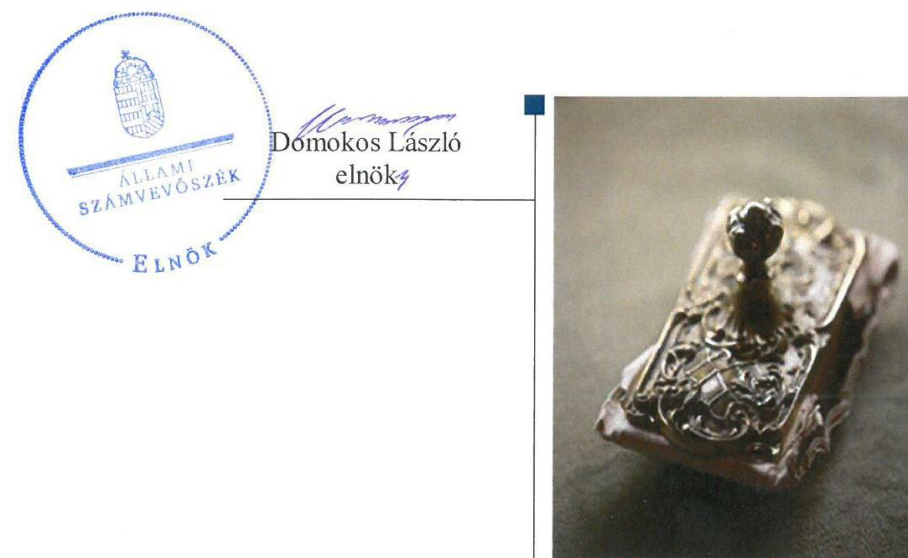
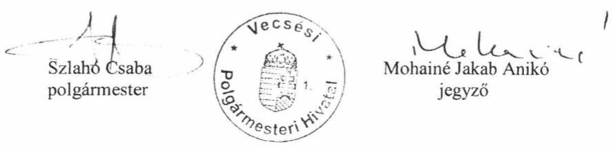
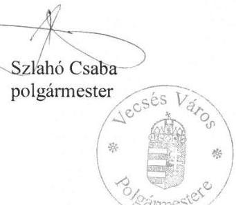
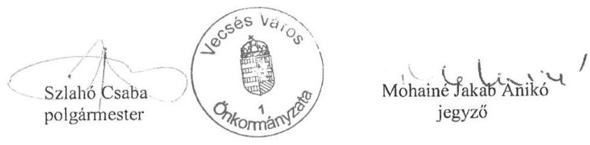
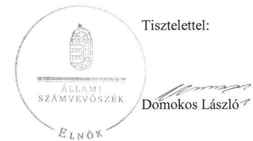
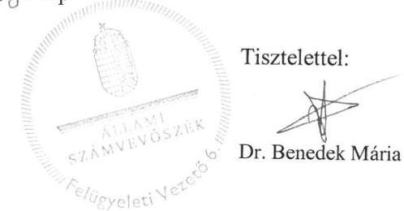

# Jelentés 

## Utóellenőrzések

Az önkormányzatok belső
kontrollrendszere kialakításának és
működtetésének ellenőrzése -
Vecsés Város Önkormányzata
2019. 04. hó 15. nap

---

# AZ ELLENŐRZÉST FELÜGYELTE: 

DR. BENEDEK MÁRIA felügyeleti vezető

## AZ ELLENŐRZÉST VEZETTE ÉS A VÉGREHAJTÁSÁÉRT FELELŐS:

MARTUS BETTINA ellenőrzésvezető

## A PROGRAM ÖSSZEÁLLÍTÁSÁÉRT FELELŐS:

TÓTPÁL SZABOCS osztályvezető

## A TÉMÁHOZ KAPCSOLÓDÓ KORÁBBI SZÁMVEVŐSZÉKI JELENTÉSEK:

- címe: Önkormányzatok belső kontrollrendszere

Az önkormányzatok belső kontrollrendszere kialakításának és működtetésének ellenőrzése - Vecsés 2016.

- sorszáma: 16232

IKTATÓSZÁM: EL-0778-032/2019

TÉMASZÁM: 6

ELLENŐRZÉS-AZONOSÍTÓ SZÁM: V080439

---

# TARTALOMJEGYZÉK 

■ ÖSSZEGZÉS ..... 5
■ AZ ELLENŐRZÉS CÉLJA ..... 6
■ AZ ELLENŐRZÉS TERÜLETE ..... 7
■ AZ ELLENŐRZÉS HÁTTERE, INDOKOLTSÁGA ..... 8
■ A JELENTÉS LÉNYEGES KÉRDÉSKÖRE ..... 9
■ AZ ELLENŐRZÉS HATÓKÖRE ÉS MÓDSZEREI ..... 10
■ MEGÁLLAPÍTÁSOK ..... 12
■ MELLÉKLETEK ..... 15
I. sz. melléklet: vecsés város önkormányzata intézkedési terve végrehajtásának értékelése ..... 15
II. sz. melléklet: Vecsés Város Önkormányzatának intézkedési terve ..... 22
■ FÜGGELÉKEK ..... 29
I. sz. függelék a Jelentéshez ..... 29
II. sz. függelék: Észrevételek ..... 30
■ RÖVIDÍTÉSEK JEGYZÉKE ..... 45

---

.

---

# ÖSSZEGZÉS 

Az Állami Számvevőszék Vecsés Város Önkormányzata belső kontrollrendszere kialakításának és működtetésének utóellenőrzése során megállapította, hogy az intézkedési tervben meghatározott feladatok többségét végrehajtotta, azonban a lényeges hiányosságok megszüntetésére nem intézkedett. Az integrált kockázatkezelési rendszer működtetésének hiánya, valamint a mérlegben kimutatott részesedések értékelésének és a részvények leltárának a hiánya veszélyeztette az integritás alapú működést, az önkormányzati vagyonnal történő átlátható és felelős gazdálkodást.

## Az ellenőrzés társadalmi indokoltsága

Az Állami Számvevőszék stratégiájában célul tűzte ki a számvevőszéki munka hasznosulásának javítását. Ezzel összhangban ellenőrzi, hogy az ellenőrzött szervezet megvalósította-e a korábbi ellenőrzései által feltárt hibák, hiányosságok és szabálytalanságok megszüntetése céljából elkészített intézkedési tervében foglaltakat. A rendszeres utóellenőrzések hozzájárulnak a szükséges intézkedések tényleges végrehajtásához, ezáltal a közpénzügyek rendezettségének javulásához.

## Főbb megállapítások, következtetések

Vecsés Város Önkormányzata az intézkedési tervben meghatározott 26 feladatból 14-et határidőben, kettőt határidőn túl, ötöt részben, öt feladatot nem hajtott végre.

A belső kontroll szerinti elszámoltathatóság területén Vecsés Város Önkormányzatának jegyzője nem intézkedett a személyes adatok kezeléséhez való hozzájárulásra irányuló kérelmek kezeléséről. Az integritás szemlélethez kapcsolódó kockázatok továbbra is fennállnak, mivel Vecsés Város Önkormányzatának polgármestere és jegyzője nem gondoskodott a bizottságok nem képviselő tagjai vagyonnyilatkozat-tételi kötelezettségének előírásáról. A vagyongazdálkodás területén nem biztosította a felelős és átlátható gazdálkodás feltételeit, mivel a mérlegben kimutatott részesedések értékelése nem történt meg és a részvények vonatkozásában a mérleg alátámasztását szolgáló leltárt nem állítottak össze.

Vecsés Város Önkormányzatának jegyzője az intézkedési tervben meghatározott feladatok végrehajtásáról a jogszabályban előírt nyilvántartást vezette.

---

# AZ ELLENŐRZÉS CÉLJA 

Az ellenőrzés célja annak értékelése volt, hogy a számvevőszéki jelentésben ${ }^{1}$ foglalt intézkedést igénylő megállapításokkal összhangban készített intézkedési tervben meghatározott feladatokat az ellenőrzött szervezet vég-rehajtotta-e.

---

# AZ ELLENŐRZÉS TERÜLETE 

## Vecsés Város Önkormányzata

Vecsés város a Közép-Magyarországi régióban, Pest megyében található. Állandó lakosainak száma a Központi Statisztikai Hi-vatal Magyarország közigazgatási helynévkönyve alapján 2017. január 1-jén 20775 fő volt.

A polgármester ${ }^{2}$ a 2006. évi önkormányzati választás óta tölti be tisztségét, a jegyző ${ }^{3} 2009$. július 1-jétől látja el feladatait. A 11 fővel működő Képviselő-testület ${ }^{4}$ munkáját hat állandó bizottság ${ }^{5}$ támogatta.

Vecsés Város Önkormányzata a 7/2018. (V.31.) önkormányzati rendeletével elfogadott 2017. évi zárszámadása alapján 5531,0 millió Ft költségvetési bevételt és 4940,1 millió Ft költségvetési kiadást teljesített. Mérlegfőösszege 2017. december 31-én 16639,4 millió Ft, követelése 332,4 millió Ft, a költségvetési évben esedékes kötelezettsége 696,7 millió Ft, melyből a költségvetési évben esedékes kötelezettség 17,2 millió Ft volt ${ }^{6}$.

Az ÁSZ ${ }^{7}$ 2016. évben ellenőrizte Vecsés Város Önkormányzata belső kontrollrendszere kialakítását és működtetését a 2014. január 1. és 2015. április 30. közötti időszakra, valamint a 2011. január 1-jétől 2015. április 30-ig terjedő időszakra az egyes befektetési döntéseinek, a döntések végrehajtásának és elszámolásának a szabályszerűségét. Az ellenőrzés célja annak megállapítása volt, hogy az önkormányzat belső kontrollrendszerének kialakítása, továbbá egyes elemeinek működtetése biztosította-e az önkormányzatnál a közpénzfelhasználás szabályosságát, támogatta-e az integritás szemlélet érvényesülését. Az ÁSZ továbbá ellenőrizte, hogy az önkormányzat egyes befektetési döntései és azok végrehajtása, elszámolása megfelelt-e a vonatkozó jogszabályoknak és belső szabályozásoknak, a kialakított kontrollrendszer támogatta-e a befektetési tevékenység szabályszerűségét. Az ellenőrzésről készült 16232 számú jelentést az ÁSZ 2016. december 13-án hozta nyilvánosságra.

---

# AZ ELLENŐRZÉS HÁTTERE, INDOKOLTSÁGA 

Az ÁSZ tv. ${ }^{8}$ 33. § (1) bekezdése értelmében a számvevőszéki jelentések megállapításaihoz és javaslataihoz kapcsolódóan az ellenőrzött szervezet vezetője intézkedési tervet köteles összeállítani, és az Állami Számvevőszék részére megküldeni.

Az ÁSZ által befogadott intézkedési tervben foglaltak megvalósítását az ÁSZ tv. 33. § (7) bekezdésében foglaltak alapján - az Állami Számvevőszék utóellenőrzés keretében ellenőrizheti. Az utóellenőrzések keretében - az intézkedések értékelése során - az Állami Számvevőszék figyelembe veszi az ellenőrzött szervezetek működési feltételeiben, valamint a jogszabályi előírásokban bekövetkezett változásokat.

Az utóellenőrzés során az ÁSZ értékeli, hogy az érintett számvevőszéki jelentésben foglalt megállapításokkal és javaslatokkal összhangban, az ellenőrzött szervezet által készített intézkedési tervben meghatározott feladatokat a feladatra kijelöltek végrehajtották-e.

Az intézkedések végrehajtásával az adott terület szabályszerű működése vonatkozásában a kockázatok csökkenhetnek, azonban hosszabb távon az intézkedési tervben foglaltak végrehajtásával önmagában nem szűnnek meg, csak akkor, ha beépülnek az ellenőrzött szervezet működésébe, azokat folyamatosan karban tartják, figyelembe véve, illetve kezelve a változásokat. Emellett az intézkedések végrehajtásáig újabb kockázatok merülhetnek fel a szabályszerű működés vonatkozásában, amelyek kezelése szintén kiemelten fontos az ellenőrzött szervezet számára.

Az ellenőrzött szervezet vezetője által készített intézkedési tervekben foglalt feladatok hiányos, illetve késedelmes végrehajtása, vagy annak elmaradása a szabályszerűség és a felelős vezetői magatartás vonatkozásában kockázatot hordoz, ami azt mutatja, hogy az ellenőrzések során feltárt hibák, hiányosságok és szabálytalanságok kezelése nem kapott kellő hangsúlyt. Az utóellenőrzés során is fennálló szabálytalanságok esetén a közpénz, közvagyon veszélyeztetettségi kockázat valószínűsített hatásának értékelése további intézkedéseket vonhat maga után.

Az ellenőrzött szervezet szintjén az utóellenőrzés feltárja, hogy a szervezet az intézkedések végrehajtásával hasznosította-e a korábbi ellenőrzési jelentésben a hiányosságok megszüntetése, illetve a kockázatok kezelése érdekében megfogalmazott javaslatokat, illetve az intézkedések végrehajtása elmaradásának következtében továbbra is fennálló szabálytalanság esetén értékeli a közpénzek, közvagyon veszélyeztetettségét.

Az ÁSZ szintjén az utóellenőrzés visszacsatolást ad az ellenőrzési jelentések hasznosulásáról, az intézkedések elmaradásának, vagy részleges megvalósulásának a közpénzek, közvagyon veszélyeztetettségére gyakorolt valószínűsített hatásának értékelése, további intézkedéseket vonhat maga után.

---

# A JELENTÉS LÉNYEGES KÉRDÉSKÖRE 

Az önkormányzat az intézkedési tervben foglaltakat az előírt határidőben végrehajtotta-e?

---

# AZ ELLENŐRZÉS HATÓKÖRE ÉS MÓDSZEREI 

## Az ellenőrzés típusa

Megfelelőségi ellenőrzés.

## Az ellenőrzött időszak

Az utóellenőrzés alapját képező ÁSZ jelentés közzétételének napjától 2016. december 13-tól az utóellenőrzésről szóló kiértesítő levél keltének napjáig 2018. július 3-ig tartó időszak volt.

## Az ellenőrzés tárgya

A számvevőszéki jelentésben foglalt megállapításokkal összhangban - az önkormányzat által - készített intézkedési tervben foglaltak végrehajtásának ellenőrzése volt.

## Az ellenőrzött szervezet

Vecsés Város Önkormányzata

## Az ellenőrzés jogalapja

Az ellenőrzés jogszabályi alapját az ÁSZ tv. 33. § (7) bekezdésének előírása képezte.

## Az ellenőrzés módszerei

Az ÁSZ az ellenőrzést az ellenőrzött időszakban hatályos jogszabályok, az ellenőrzés szakmai szabályai, a jelen ellenőrzésre irányadó ÁSZ módszertanok, az ellenőrzési programban foglalt értékelési szempontok szerint végezte.

Az ÁSZ az ellenőrzés ideje alatt az önkormányzattal történő kapcsolattartást az ÁSZ SZMSZ ${ }^{\text {® }}$-ének vonatkozó előírásai alapján biztosította.

Az utóellenőrzés megállapításait az ÁSZ rendelkezésére álló dokumentumok, valamint az ÁSZ adatbekérése szerint, az önkormányzat által rendelkezésre bocsátott dokumentumok alapozták meg.

Az ellenőrzési bizonyítékként felhasználható adatforrások közé tartoztak egyrészt az ellenőrzési program részletes szempontjainál felsorolt

---

adatforrások, másrészt minden - az ellenőrzés folyamán feltárt, az ellenőrzés szempontjából információt tartalmazó - dokumentum.

Az intézkedési tervben előírt feladatokat azok végrehajthatósága, illetve végrehajtása szempontjából az alábbiak szerint értékelte az ÁSZ:
$\longrightarrow$ „határidőben végrehajtott" a feladat, ha a teljesítés dokumentáltan, az intézkedési tervben előírt határidőben és tartalommal megtörtént;
$\longrightarrow$ „határidőn túl végrehajtott" a feladat, ha annak teljesítése az intézkedési tervben meghatározott módon, de az abban előírt határidőn túl történt meg;
$\longrightarrow$ „részben végrehajtott" a feladat, ha annak végrehajtása nem teljes körűen az intézkedési tervben előírt módon történt meg;
$\longrightarrow$ „nem végrehajtott" a feladat, ha a végrehajtás nem történt meg, dokumentumokkal nem igazolt annak teljesítése;
$\longrightarrow$ „okafogyottá vált" a feladat, ha végrehajtására - meghatározott esemény bekövetkezése, továbbá külső körülmény, a működést érintő feltétel változása miatt - már nincs szükség, illetve lehetőség, és egyértelműen megállapítható, hogy az intézkedést szükségessé tevő körülmény a jövőben nem fordulhat elő;
$\longrightarrow$ „nem időszerű" az a feladat, amelynek ellenőrzési időszakon belüli végrehajtására azért nem került (kerülhetett) sor, mert az intézkedés alapjául szolgáló esemény nem következett be, de annak jövőbeni előfordulása lehetséges, a végrehajtása nem volt esedékes, vagy a végrehajtás határideje még nem járt le.
Az ellenőrzés lefolytatásához az önkormányzat a tanúsítványok elektronikus kitöltésével, valamint az ÁSZ által kért dokumentumok elektronikus megküldésével szolgáltatott adatokat, amelyek valódiságát és teljes körűségét az ellenőrzött szervezet vezetője által tett teljességi és hitelességi nyilatkozat igazolta. Az így rendelkezésre bocsátott adatok, információk kontrollja az ellenőrzés keretében megtörtént.

A Vecsés Város Önkormányzata által megküldött intézkedési tervben meghatározott ÁSZ által beazonosított feladatok a II. számú mellékletben kerültek bemutatásra.

---

# MEGÁLLAPÍTÁSOK 

## Az önkormányzat az intézkedési tervben foglaltakat az előírt határidőben végrehajtotta-e?

Összegző megállapítás

Az Önkormányzat ${ }^{10}$ az intézkedési tervben meghatározott 26 feladatból 14-et határidőben, kettőt határidőn túl, ötöt részben, ötöt nem hajtott végre. Az intézkedési tervben meghatározott feladatok végrehajtásáról a jogszabályban előírt nyilvántartást vezette.

Az ÁSZ a számvevőszéki jelentésében a polgármester részére négy, a jegyző részére nyolc javaslatot fogalmazott meg. A polgármester által előterjesztett és a Képviselő-testület által az 58/2017. (III.23.) határozattal jóváhagyott intézkedési tervben a hiányosságok, a szabálytalanságok megszüntetésére a polgármester részére négy, a jegyző részére 22 feladat került meghatározásra.

Az intézkedési tervben meghatározott feladatokat, határidőket, megjelölt felelősöket és a feladatok végrehajtását az I. sz. melléklet mutatja be.

Az Önkormányzat jegyzője az intézkedési tervben meghatározott feladatok végrehajtásáról Bkr. ${ }^{11}$ 14. § (1) bekezdésének előírása szerinti nyilvántartást vezette.

Az Önkormányzat intézkedési tervében meghatározott feladatok végrehajtásának értékelési kategóriák szerinti megoszlását az 1. ábra szemlélteti.

1. ábra

## A feladatok végrehajtásának értékelési kategóriák szerinti megoszlása

Határidőn túl végrehajtott
5 db
$19 \%$
$12 \%$
5 db
$15 \%$
5 db
$15 \%$

Határidőben végrehajtott
14 db
$54 \%$
Részben végrehajtott

---

A SZABÁLYOZOTTSÁG érdekében a polgármester előterjesztette és a jegyző elkészítette a Polgármesteri Hivatal ${ }^{12}$ Szervezeti és Működési Szabályzatát az intézkedési tervben vállaltaknak megfelelően. A Gazdálkodási szabályzat ${ }^{13}$ felülvizsgálata és aktualizálása megtörtént, a hivatali SZMSZ-ben nevesített munkakörökhöz tartozó feladat és hatásköröket, valamint a hatáskörök gyakorlásának módját és felelősségi szabályokat rögzítették, a munkaköri leírásokat kiegészítették (P1., J5.)

# A SZABÁLYSZERŰ PÉNZÜGYI GAZDÁLKODÁS 

ÉS A PÉNZÜGYI ELSZÁMOLTATHATÓSÁG érdekében az Önkormányzat intézkedéseket tett.
 A polgármester és a jegyző kijelölték a teljesítés igazolására jogosultakat. A teljesítés igazolására jogosultak oktatáson vettek részt, melyről az osztályvezető gondoskodott (J7.).

## A BELSŐ KONTROLL SZERINTI ELSZÁMOLTATHATÓSÁG érdekében a belső ellenőr a belső ellenőrzési jelentésekben tett megállapításokról, javaslatokról, intézkedési tervekről és végrehajtásának nyomon követéséről intézkedett (J11.). Az aljegyző az Iratkezelési szabályzatot ${ }^{14}$ módosította, ugyanakkor a jegyző a személyes adatok kezeléséhez való hozzájárulást tartalmazó kérelmek kezeléséről belső szabályzatban nem rendelkezett (J10), amely további kockázatot jelent a belső kontroll szerinti elszámoltathatóságban.

AZ INTEGRITÁS területén a korrupcióval kapcsolatos kockázatok nőttek. A jegyző az integrált kockázatkezelési rendszert a jogszabályi előírások ellenére nem működtette (J6.). A polgármester és a jegyző nem gondoskodott a Képviselő-testületi SZMSZ ${ }^{15}$ módosításáról a bizottságok nem képviselő tagjai vagyonnyilatkozat-tételi kötelezettsége előírásával (P3, J16), így a szervezeten belüli átláthatóság nem javult, az integritás alapú működés alapvető követelménye nem biztosított.

A VAGYONGAZDÁLKODÁS területén a kockázatok továbbra is fennállnak. A jegyző a Vecsési Polgármesteri Hivatal gazdálkodási feladataival kapcsolatos Ügyrendjét az egyes befektetési tevékenységekre kiterjedően elkészítette (J3), az osztályvezető a Számlarendet ${ }^{16}$ és a Számviteli politikát ${ }^{17}$ aktualizálta (J2.), ugyanakkor az osztályvezető a mérlegben kimutatott részesedések jogszabályi előírásokkal összhangban történő értékeléséről nem intézkedett, továbbá a könyvviteli mérleg alátámasztására alkalmas leltár szabályszerű elkészítéséről nem gondoskodott (J20, J21), ami kockázatot jelent a vagyonnal való felelős gazdálkodás terén.

---

.

---

# MELLÉKLETEK

- I. SZ. MELLÉKLET: VECSÉS VÁROS ÖNKORMÁNYZATA INTÉZKEDÉSI TERVE VÉGREHAJTÁSÁNAK ÉRTÉKELÉSE

|  1
2
3
4 | Az intézkedési tervben meghatározott feladat | Az intézkedési tervben meghatározott határidő | Az intézkedési tervben meghatározott feladat felelőse | A feladat végrehajtása  |
| --- | --- | --- | --- | --- |
|  P1. ${ }^{18}$ | Készüljön előterjesztés a Polgármesteri Hivatal Szervezeti és Működési Szabályzatának módosítására, hogy tartalmazza a gazdasági szervezet megnevezését és feladatait, az SZMSZ-ben nevesített munkakörökhöz tartozó feladat- és hatásköröket, valamint a hatáskörök gyakorlásának módját és az ezekhez kapcsolódó felelősségi szabályokat. | a Képviselő-testület 2017. április havi rendes ülése | Szlahó Csaba polgármester, Mohainé Jakab Anikó jegyző | A polgármester előterjesztette a 2017. április 26-i képviselő-testületi ülésre a jegyző által elkészített Polgármesteri Hivatal Szervezeti és Működési Szabályzatának módosítását, amely tartalmazta a gazdasági szervezet megnevezését és feladatait, valamint a hivatali SZMSZ ${ }^{19}$-ben nevesített munkakörökhöz tartozó feladat- és hatásköröket, továbbá a hatáskörök gyakorlásának módját és az ezekhez kapcsolódó felelősségi szabályokat. A képviselő-testület a Polgármesteri Hivatal Szervezeti és Működési Szabályzatát a 84/2017. (IV.26.) határozattal hagyta jóvá.  |
|  J14. ${ }^{20}$ | Készüljön előterjesztés a Polgármesteri Hivatal Szervezeti és Működési Szabályzatának módosítására, hogy tartalmazza a gazdasági szervezet megnevezését és feladatait, az SZMSZ-ben nevesített munkakörökhöz tartozó feladat- és hatásköröket, valamint a hatáskörök gyakorlásának módját és az ezekhez kapcsolódó felelősségi szabályokat. | a Képviselő-testület 2017. április havi rendes ülése | Mohainé Jakab Anikó jegyző | A jegyző elkészítette és kezdeményezte a 2017. április 26-i képviselő-testületi ülésre a Polgármesteri Hivatal Szervezeti és Működési Szabályzata módosításának előterjesztését, amely tartalmazta a gazdasági szervezet megnevezését és feladatait, valamint a hivatali SZMSZ-ben nevesített munkakörökhöz tartozó feladat- és hatásköröket, továbbá a hatáskörök gyakorlásának módját és az ezekhez kapcsolódó felelősségi szabályokat.  |
|  P2. | Készüljön előterjesztés a köztisztviselőkre vonatkozó etikai szabályzatról annak figyelembe vételével, hogy a közszolgálati tisztviselőkről szóló 231. § (1) bekezdése alapján a Polgármesteri Hivatal dolgozóira vonatkozó hivatásetikai alapelvek részletes tartalmát, valamint az etikai eljárás szabályait a Képviselő-testület állapítja meg. | a Képviselő-testület 2017. április havi rendes ülése | Szlahó Csaba polgármester, Mohainé Jakab Anikó jegyző | A polgármester előterjesztette a 2017. április 26-i képviselő-testületi ülésre a jegyző által elkészített köztisztviselőkre vonatkozó Etikai kódexet ${ }^{21}$, amely a Kttv. ${ }^{22}$ 231. § (1) bekezdése alapján tartalmazta a Polgármesteri Hivatal dolgozóira vonatkozó hivatásetikai alapelvek részletes tartalmát, valamint a Képviselő-testület által megállapított etikai eljárás szabályait. A képviselő-testület az Etikai Kódexet a 83/2017. (IV.26.) határozattal hagyta jóvá.  |
|  J15. | Készüljön előterjesztés a köztisztviselőkre vonatkozó etikai szabályzatról annak figyelembe vételével, hogy a közszolgálati tisztviselőkről szóló 231. § | a Képviselő-testület 2017. április havi rendes ülése | Mohainé Jakab Anikó jegyző | A jegyző elkészítette és kezdeményezte a 2017. április 26-i képviselő-testületi ülésre a Kttv. 231. § (1) bekezdése alapján a köztisztviselőkre vonatkozó etikai szabályzat előterjesztését, amely tartalmazta a Polgármesteri Hivatal dolgozóira vonatkozó hivatásetikai alapelvek részletes tartalmát, valamint a Képviselő-testület által megállapított etikai eljárás szabályait.  |

---

|  2015. 2016. | Az intézkedési tervben meghatározott feladat | Az intézkedési tervben meghatározott határidő | Az intézkedési tervben meghatározott feladat feladása | A feladat végrehajtása  |
| --- | --- | --- | --- | --- |
|   | (1) bekezdése alapján a Polgármesteri Hivatal dolgozóira vonatkozó hivatásetikai alapelvek részletes tartalmát, valamint az etikai eljárás szabályait a Képviselő-testület állapítja meg. |  |  |  |
|  P4. | A részmegállapításokat áttekintettük, munkajogi felelősség tisztázására irányuló eljárás megindítását nem tartjuk szükségesnek. A feltárt hiányosságokat javítjuk az Állami Számvevőszék által megfogalmazott javaslatok alapján. | - | - | A polgármester az intézkedési tervben rögzítette, hogy a részmegállapításokat áttekintették, munkajogi felelősség tisztázására irányuló eljárás megindítását nem tartják szükségesnek. A feltárt hiányosságokat javítják az Állami Számvevőszék által megfogalmazott javaslatok alapján.  |
|  J22. | A részmegállapításokat áttekintettük, munkajogi felelősség tisztázására irányuló eljárás megindítását nem tartjuk szükségesnek. A feltárt hiányosságokat javítjuk az Állami Számvevőszék által megfogalmazott javaslatok alapján. | - | - | A jegyző az intézkedési tervben rögzítette, hogy a részmegállapításokat áttekintették, munkajogi felelősség tisztázására irányuló eljárás megindítását nem tartják szükségesnek. A feltárt hiányosságokat javítják az Állami Számvevőszék által megfogalmazott javaslatok alapján.  |
|  J2. | A 2017. évi számlarend és számviteli politika az Áhsz. 51. § (3) bekezdésében foglaltak figyelembevételével készüljön el. | 2017. március 31. | Tóth Erika osztályvezető | Az osztályvezető a 2017. évi Számlarendet 2017. március 1-jén az Áhsz. 51. § (3) bekezdésében foglaltak figyelembevételével elkészítette.  |
|  J3. | A 2017. évi gazdálkodási feladatok ügyrendje az Ávr. 13. § (5) bekezdésében foglaltak figyelembevételével készüljön el, úgy hogy az kiterjedjen az egyes befektetési tevékenységekre vonatkozóan is. | 2017. március 31. | Tóth Erika osztályvezető | Az osztályvezető a Polgármesteri Hivatal gazdálkodási feladataival kapcsolatos Ügyrendjét 2017. március 1-jén az Ávr. 13. § (5) bekezdésében foglaltak figyelembevételével elkészítette, amely kiterjed az egyes befektetési tevékenységekre is.  |
|  J5. | A Pénzügyi, számviteli területen foglalkoztatott köztisztviselők munkaköri leírásában elő kell írni a munkakör betöltésével kapcsolatos követelményeket is. | 2017. április 30. | Mohainé Jakab Anikó jegyző, Kovács Ágnes osztályvezető | Az osztályvezető által előkészített pénzügyi, számviteli területen foglalkoztatott köztisztviselők munkaköri leírásaiban a jegyző 2017. április 4-ig a munkakör betöltésével kapcsolatos követelményeket (végzettség, szakképzettség, szakképesítés, tapasztalat, képességek) előírta.  |
|  J7. | A teljesítésigazolást végző személyek kijelölése és oktatása a feladat ellátásáról. | 2017. március 31. | Felelős kijelölésre: Szlahó Csaba polgármester, Mohainé Jakab Anikó jegyző Felelős oktatásra: Orbánné Forgó Erika osztályvezető | A polgármester és a jegyző 2017. március 24-én Vecsés Város Önkormányzata Jegyzőjének és Polgármesterének közös 1./2017. számú utasításában írásban kijelölte a teljesítés igazolására jogosultakat. Az osztályvezető a teljesítés igazolást végző személyek oktatását 2017. március 24-én végrehajtotta.  |

---

|  1. | Az intézkedési tervben meghatározott feladat | Az intézkedési tervben meghatározott határidő | Az intézkedési tervben meghatározott feladat feladása | A feladat végrehajtása  |
| --- | --- | --- | --- | --- |
|  J11. | A belső ellenőrzési jelentésekben tett megállapítások, javaslatok, a vonatkozó intézkedési tervek és azok végrehajtásának nyomon követése a Bkr. 47. § (1) bekezdésében foglaltaknak megfelelően történjen. | 2017. április 30. és folyamatos | Elekes Mária belső ellenőr | A belső ellenőr a Bkr. 47. § (1) bekezdésében előírtaknak megfelelően éves bontásban nyilvántartást vezetett a belső ellenőrzési jelentésekben tett megállapításokról, javaslatokról, a vonatkozó intézkedési tervekről és azok végrehajtásának nyomon követéséről. A nyomon követés folyamatosságát a belső ellenőr naprakész nyilvántartással biztosította.  |
|  J13. | Biztosítani kell a Bkr. 8. § (2) bekezdésének megfelelően a folyamatba épített előzetes, utólagos és vezetői ellenőrzést a forgatási célú értékpapír vásárlásokkal és befektetésekkel kapcsolatos döntések célszerűségi, gazdaságossági, hatékonysági és eredményességi szempontú megalapozottsága vonatkozásában. | 2017. április 30. és folyamatos | Mohainé Jakab Anikó jegyző, Tóth Erika osztályvezető | Az osztályvezető 2017. február 1-jén, a jegyző 2017. február 2-án biztosította a Bkr. 8. § (2) bekezdés előírásainak megfelelően a folyamatba épített előzetes, utólagos és vezetői ellenőrzést a forgatási célú értékpapír vásárlásokkal és befektetésekkel kapcsolatos döntések célszerűségi, gazdaságossági, hatékonysági és eredményességi szempontú megalapozottsága vonatkozásában.  |
|  J17. | A forgatási célú hitelviszonyt megtestesítő kamatozó értékpapírok bekerülési értékét a Számv. tv. 50. § (3) bekezdésében, valamint az Áhsz. 1. § (1) bekezdés 7. pontjában foglaltaknak megfelelően kell meghatározni. | 2017. március 31. és folyamatos | Tóth Erika osztályvezető | Az osztályvezető 2017. március 31-ig meghatározta a forgatási célú hitelviszonyt megtestesítő kamatozó értékpapírok bekerülési értékét értékpapírjainak analitikus nyilvántartásaiban a Számv. tv. ${ }^{25}$ 50. § (3) bekezdésében, valamint az Áhsz. 1. § (1) bekezdés 7. pontjában foglaltaknak megfelelően. Az osztályvezető a folyamatosságot az analitikus nyilvántartások naprakész vezetésével biztosította.  |
|  J18. | A tartós részesedésekről és a forgatási célú hitelviszonyt megtestesítő értékpapírokról vezetett részletező (analitikus) nyilvántartásokat az Áhsz. 39. § (3) bekezdésében és az Áhsz. 14. számú melléklet VIII.2. pont b)-d) és f) pontjában előírtaknak megfelelően kell vezetni. | 2017. március 31. és folyamatos | Tóth Erika osztályvezető | Az osztályvezető 2017. március 31-ig a tartós részesedésekről és a forgatási célú hitelviszonyt megtestesítő értékpapírokról vezetett részletező (analitikus) nyilvántartásokat az Áhsz. 39. § (3) bekezdésében és az Áhsz. 14. számú melléklet VIII.2. pont b)-d) és f) pontjában előírtaknak megfelelően vezette. Az osztályvezető a folyamatosságot az analitikus nyilvántartásokat naprakész vezetésével biztosította.  |
|  Határidőn túl végrehajtott feladatok |  |  |  |   |
|  J1. | Gazdálkodási szabályzat felülvizsgálata és esetleges módosítása annak érdekében, hogy a kötelezettségvállalás pénzügyi ellenjegyzésére és érvényesítésre jogosultak kijelölése a vonatkozó jogszabálynak megfelelően történjen. | 2017. március 31. | Tóth Erika osztályvezető | Az osztályvezető a Gazdálkodási szabályzatot 2017. március
 1-jén felülvizsgálta és módosította annak érdekében, hogy a kötelezettségvállalás pénzügyi ellenjegyzésre és érvényesítésre jogosultak kijelölése a vonatkozó jogszabályoknak megfelelően történjen, azonban a módosított Gazdálkodási szabályzat a Polgármesteri Hivatal Szervezeti és Működési Szabályzat 2017. május 1-jei hatályba lépésével érvényesült a vonatkozó jogszabályoknak megfelelően, mivel a Polgármesteri Hivatal Szervezeti  |

---

|   | Az intézkedési tervben meghatározott feladat | Az intézkedési tervben meghatározott határidő | Az intézkedési tervben meghatározott feladat feladása | A feladat végrehajtása  |
| --- | --- | --- | --- | --- |
|  J4. | A 2017. évi ellenőrzési nyomvonal elkészítésénél figyelembe kell venni a hivatal valamennyi működési folyamatát a Bkr. 6. § (3) bek. szerint. | 2017. március 31. | Tóth Erika osztályvezető | és működési Szabályzatában ekkortól került megjelölésre a gazdasági szervezet.  |
|   |  |  |  | Az osztályvezető a 2017. március 31-ei határidőn túl, 2017. szeptember 30-án készítette el a 2017. évi ellenőrzési nyomvonalat, amely figyelembe veszi a hivatal valamennyi működési folyamatát a Bkr. 6. § (3) bekezdés előírása szerint.  |
|   |  | Részben végrehajtott feladatok |  |   |
|  J6. | Az integrált kockázatkezelési rendszert a Bkr. 3. § b) és a 7. § (1)-(2) bek. előírtaknak megfelelően kell kialakítani és működtetni. | 2017. április 30. és folyamatos | Mohainé Jakab Anikó jegyző | Végrehajtott feladatrész:  |
|   |  |  |  | A jegyző a Bkr. 3. § b) pontjában előírtaknak megfelelően 2017. április 30. helyett 2017. június 20-án kialakította az integrált kockázatkezelési rendszerét Vecsési Polgármesteri Hivatal Integrált Kockázatkezelési Szabályzatában, amely 2017. június 21-én lépett hatályba. Az intézkedési tervben előírt "folyamatosságot" 2017. december 20-án teljesítette, amikor a Vecsési Polgármesteri Hivatal Integrált Kockázatkezelési Szabályzata 2018. január 2-án hatályát vesztette és 2018. január 2-i hatálylyal új Integrált Kockázatkezelési Szabályzat lépett hatályba.  |
|   |  |  |  | Nem végrehajtott feladatrész:  |
|   |  |  |  | A jegyző a Bkr. 3. § b) pontja, a 7. § (1) és (2) bekezdésében előírtak ellenére a belső kontrollrendszer keretében – a szervezet minden szintjén érvényesülő – megfelelő integrált kockázatkezelési rendszert nem működtette.  |
|  J9. | Az elvégzett belső ellenőrzésekről készült nyilvántartásokat a Bkr. 50. §-ban meghatározottaknak megfelelően kell vezetni. | 2017. április 30. és folyamatos | Elekes Mária belső ellenőr | Végrehajtott feladatrész:  |
|   |  |  |  | A belső ellenőr által elvégzett belső ellenőrzésekről készült nyilvántartás tartalmazta a Bkr. 50. § (1) és (2) bekezdésének b)-f) pontjaiban előírtakat.  |
|   |  |  |  | Nem végrehajtott feladatrész:  |
|   |  |  |  | A belső ellenőr az elvégzett belső ellenőrzésekről készült nyilvántartásokat nem a Bkr. 50. § (2) bekezdés g) pontjában előírtak szerint vezette, mert a nyilvántartások nem tartalmazták az intézkedési terv készítésének szükségességét.  |

---

|  10 | Az intézkedési tervben meghatározott feladat | Az intézkedési tervben meghatározott határidő | Az intézkedési tervben meghatározott feladat feladása | A feladat végrehajtása  |
| --- | --- | --- | --- | --- |
|  J10. | Az Iratkezelési Szabályzatot ki kell egészíteni a küldemények munkahelyről történő kivitelével, munkahelyen kívüli tanulmányozásával, feldolgozásával, tárolásával kapcsolatos előírásokkal, valamint a személyes adatok kezeléséhez való hozzájárulást tartalmazó kérelmek kezelésére vonatkozó előírásokkal. | 2017. április 30. | Halápiné Borbás Ágnes aljegyző | Végrehajtott feladatrész:
Az aljegyző 2017. április 18-án Vecsés Város Önkormányzata és a Vecsési Polgármesteri Hivatal Egyedi Iratkezelési Szabályzatát kiegészítette a küldemények munkahelyről történő kivitelével, munkahelyen kívüli tanulmányozásával, feldolgozásával, tárolásával kapcsolatos előírásokkal.
Nem végrehajtott feladatrész:
A jegyző a Vecsési Polgármesteri Hivatal Egyedi Iratkezelési Szabályzatát nem egészítette ki az Ikr. ${ }^{26}$ 38. §-ában foglalt előírások ellenére a személyes adatok kezeléséhez való hozzájárulást tartalmazó kérelmek kezelésére vonatkozó előírásokkal.  |
|  J12. | A külső ellenőrzési jelentések javaslatai alapján a Bkr. 13. § (2) bekezdésében foglaltaknak megfelelően intézkedési tervet kell készíteni. | folyamatos | Mohainé Jakab Anikó jegyző | Végrehajtott feladatrész:
A jegyző a 2017. január-június, valamint a 2018. január-március hónapokban az önkormányzatnál és intézményeinél végzett külső ellenőrzések javaslatai alapján az intézkedési terveket a Bkr. 13. § (2) bekezdésében foglaltakkal összhangban elkészítette.
Nem végrehajtott feladatrész:
A jegyző a 2017. július-december hónapokban végzett külső ellenőrzések javaslatai alapján a Bkr. 13. § (2) bekezdésében foglaltak ellenére az intézkedési tervek elkészítéséről nem gondoskodott, amelyekre Vecsés Város Önkormányzatának a külső ellenőrzések alapján tett intézkedésekkel kapcsolatos adatokról a 2017. július-december hónapok közötti időszakban c. beszámolójában a külső ellenőrzések megállapításai alapján kötelezett volt.  |
|  J19. | A forgatási célú hitelviszonyt megtestesítő kamatozó értékpapírok (államkötvények) eladási és vételi árában felhalmozott kamat, árfolyamnyereség, illetve árfolyamveszteség a Számv. tv. 50. § (3) bekezdésében és az Áhsz. 15. számú mellékletében előírtaknak megfelelően elkülönítetten kerüljön kimutatásra. | 2017. március 31. és folyamatos | Tóth Erika osztályvezető | Végrehajtott feladatrész:
Az osztályvezető 2017. március 31.-ig és azt követően folyamatosan vezetett nyilvántartásokban kimutatta a Számv. tv. 50. § (3) bekezdésében foglaltakkal összhangban a forgatási célú hitelviszonyt megtestesítő kamatozó értékpapírok (államkötvények) eladási és vételi árában felhalmozott kamat összegét.
Nem végrehajtott feladatrész:  |

---

|  Az intézkedési tervben meghatározott feladat | Az intézkedési tervben meghatározott határidő | Az intézkedési tervben meghatározott feladat feladása | A feladat végrehajtása  |
| --- | --- | --- | --- |
|   |  |  | Az osztályvezető a forgatási célú hitelviszonyt megtestesítő kamatozó értékpapírok (államkötvények) eladási és vételi árában felhalmozott kamat, árfolyamnyereség, illetve árfolyamveszteség értékét az Áhsz. 40. § (1) bekezdés előírása és az Áhsz. 15. mellékletében előírtak ellenére az analitikus nyilvántartásokban nem elkülönítetten mutatta ki.  |
|  Nem végrehajtott feladatok |  |  |   |
|  P3. | Készüljön előterjesztés a Képviselő-testület Szervezeti és Működési Szabályzatáról szóló 12/2014. (XI.21.) önkormányzati rendeletének módosításáról annak érdekében, hogy az tartalmazza az egyes vagyonnyilatkozat-tételi kötelezettségekről szóló 2007. évi CLII. törvény 3. § (3) bekezdésének e) pontja alapján a bizottságok nem képviselő tagjai vagyonnyilatkozat-tételi kötelezettségének előírásait. | a Képviselő-testület 2017. április havi rendes ülése | Szlahó Csaba polgármester
Mohainé Jakab Anikó jegyző  |
|  J16. | Készüljön előterjesztés a Képviselő-testület Szervezeti és Működési Szabályzatáról szóló 12/2014. (XI. 21.) önkormányzati rendeletének módosításáról annak érdekében, hogy az tartalmazza az egyes vagyonnyilatkozat-tételi kötelezettségekről szóló 2007. évi CLII. törvény 3. § (3) bekezdésének e) pontja alapján a bizottságok nem képviselő tagjai vagyonnyilatkozat-tételi kötelezettségének előírásait. | a Képviselő-testület 2017. április havi rendes ülése | Szlahó Csaba polgármester
Mohainé Jakab Anikó jegyző  |
|  J8. | Az értékpapír vásárlása, eladásra, betétlekötésre vonatkozó szerződések adatait az önkormányzat honlapján a http://kozzetetel.dokumentumtar.hu/vecsesph/ helyen közzé kell tenni. | 2017. április 30. és folyamatos | Tóth Erika osztályvezető  |
|  J20. | A mérlegben kimutatott részesedéseket (OTP Bank NyRt és Forrás NyRt részvények) az éves költségvetési | 2017. március 10. | Tóth Erika osztályvezető  |

---

|  Az intézkedési tervben meghatározott feladat | Az intézkedési tervben meghatározott határidő | Az intézkedési tervben meghatározott feladat felelőse | A feladat végrehajtása  |
| --- | --- | --- | --- |
|  tési beszámolóban a Számv. tv. 54. § (1) és (3) bekezdésében és az 57. § (2)-(3) bekezdéseiben előírtaknak megfelelően kell értékelni. |  |  |   |
|  J21. | A könyvviteli mérleg alátámasztását szolgáló leltárakat a részvények esetében a Számv. tv. 58. § (1) bekezdés b), c) megfelelően kell elkészíteni. | 2017. március 10. | Tóth Erika osztályvezető  |

---

# KIVONAT 

Vecsés Város Önkormányzat Képviselő-testülete 2017. március 23-án megtartott ülésének jegyzőkönyvéből

Tárgy: Javaslat Vecsés Város Önkormányzat belső kontrollrendszere kialakításának és működtetésének ellenőrzéséről szóló Állami Számvevőszéki jelentésről készült, 9/2017. (I.24.) határozattal elfogadott Intézkedési terv módosítására

## 58/2017. (III.23.) határozat

1. Vecsés Város Önkormányzat Képviselő-testülete úgy dönt, jóváhagyja az Önkormányzat belső kontrollrendszere kialakításának és működtetésének ellenőrzéséről szóló Állami Számvevőszéki jelentésről készült, 9/2017. (I.24.) határozattal elfogadott intézkedési terv kijavítását, kiegészítését, mely egységes szerkezetbe foglalva a határozat mellékletét képezi.
2. A Képviselő-testület felkéri a polgármestert, gondoskodjon az intézkedési terv elküldéséről az Állami Számvevőszék Elnökének.
3. A Képviselő-testület felkéri a polgármestert, gondoskodjon az intézkedési tervben megfogalmazott feladatok határidőben történő végrehajtásáról és a jelentés megküldéséről az Állami Számvevőszék Elnökének.

Határidő: a módosított intézkedési terv megküldésére: 2017.03.30. az intézkedési terv végrehajtására: 2017.04.30., illetve folyamatos;
a jelentés megküldésére: 2017.05.31.
Felelős: Szlahó Csaba polgármester
(10 igen szavazat, egyhangú)

Szlahó Csaba sk. polgármester

A kivonat hiteles:
2017. március 23.

Mohainé Jakab Anikó sk. jegyző

Kapják:

---

# Vecsés Város Polgármestere 

2220 Vecsés, Szent István tér I.
I: 0629 352-000 : 0629 352-009 e-mail: polgarmester@vecses.hu

## INTÉZKEDÉSI TERV

az Állami Számvevőszék Vecsés Város Önkormányzat belső kontrollrendszere kialakításának és működtetésének ellenőrzéséről készült számvevőszéki jelentésben megfogalmazott javaslatok végrehajtására

## Állami Számvevőszék javaslatai a polgármesternek:

Javaslat: Intézkedjen a jogszabályi előírásnak megfelelő hivatali SZMSZ-tervezet Képviselőtestület elé terjesztéséről

Intézkedési terv: Készüljön előterjesztés a Polgármesteri Hivatal Szervezeti és Működési Szabályzatának módosítására, hogy tartalmazza a gazdasági szervezet megnevezését és feladatait, az SZMSZ-ben nevesített munkakörökhöz tartozó feladat- és hatásköröket, valamint a hatáskörök gyakorlásának módját és az ezekhez kapcsolódó felelősségi szabályokat.

Határidő: a Képviselő-testület 2017. április havi rendes ülése
Felelős: Szlahó Csaba polgármester
Mohainé Jakab Anikó jegyző

Javaslat: Intézkedjen a köztisztviselőkre vonatkozó hivatásetikai alapelvek részletes tartalmáról, valamint az etikai eljárás szabályairól szóló előterjesztés Képviselő-testület elé terjesztéséről.

Intézkedési terv: Készüljön előterjesztés a köztisztviselőkre vonatkozó etikai szabályzatról annak figyelembe vételével, hogy a közszolgálati tisztviselőkről szóló 231. § (1) bekezdése alapján a Polgármesteri Hivatal dolgozóira vonatkozó hivatásetikai alapelvek részletes tartalmát, valamint az etikai eljárás szabályait a Képviselő-testület állapítja meg.

Határidő: a Képviselő-testület 2017. április havi rendes ülése
Felelős: Szlahó Csaba polgármester
Mohainé Jakab Anikó jegyző

Javaslat: Intézkedjen olyan Képviselő-testületi szervezeti és működési szabályzat-tervezet Képviselő-testület elé terjesztéséről, amely tartalmazza az önkormányzati bizottságok nem képviselő tagjainak vagyonnyilatkozat-tételi kötelezettségét.

Intézkedési terv: Készüljön előterjesztés a Képviselő-testület Szervezeti és Működési Szabályzatáról szóló 12/2014. (XI.21.) önkormányzati rendeletének módosításáról annak érdekében, hogy az tartalmazza az egyes vagyonnyilatkozat-tételi kötelezettségekről szóló

---

2007. évi CLII. törvény 3. § (3) bekezdésének e) pontja alapján a bizottságok nem képviselő tagjai vagyonnyilatkozat-tételi kötelezettségének előírásait.

Határidő: a Képviselő-testület 2017. április havi rendes ülése
Felelős: Szlahó Csaba polgármester
Mohainé

 Jakab Anikó jegyző

Javaslat: Intézkedjen az Állami Számvevőszék ellenőrzése során feltárt hiányosságok tekintetében a munkajogi felelősség tisztázására irányuló eljárás megindításáról és ennek eredménye ismeretében tegye meg a szükséges intézkedéseket.

Intézkedési terv: A részmegállapításokat áttekintettük, munkajogi felelősség tisztázására irányuló eljárás megindítását nem tartjuk szükségesnek. A feltárt hiányosságokat javítjuk az Állami Számvevőszék által megfogalmazott javaslatok alapján.

# Állami Számvevőszék javaslatai a jegyzőnek: 

Javaslat: Intézkedjen a belső kontrollrendszer egyes elemei jogszabályi előírásoknak megfelelő kialakítására és működtetésére, valamint a befektetésekkel kapcsolatos döntések előkészítése és végrehajtása, illetve a gazdálkodási jogkörök gyakorlása során a jogszabályi előírások és belső szabályozás betartására.

## Intézkedési terv:

- Gazdálkodási szabályzat felülvizsgálata és esetleges módosítása annak érdekében, hogy a kötelezettségvállalás pénzügyi ellenjegyzésére és érvényesítésre jogosultak kijelölése a vonatkozó jogszabálynak megfelelően történjen.

Határidő: 2017. március 31.
Felelős: Tóth Erika osztályvezető

- A 2017. évi számlarend és számviteli politika az Áhsz. 51. § (3) bekezdésében foglaltak figyelembevételével készüljön el

Határidő: 2017. március 31.
Felelős: Tóth Erika osztályvezető

- A 2017. évi gazdálkodási feladatok ügyrendje az Ávr. 13. § (5) bekezdésében foglaltak figyelembevételével készüljön el, úgy hogy az kiterjedjen az egyes befektetési tevékenységekre vonatkozóan is.

Határidő: 2017. március 31.
Felelős: Tóth Erika osztályvezető

- A 2017. évi ellenőrzési nyomvonal elkészítésénél figyelembe kell venni a hivatal valamennyi működési folyamatát a Bkr. 6. § (3) bek. szerint.

---

Határidő: 2017. március 31.
Felelős: Tóth Erika osztályvezető
A Pénzügyi, számviteli területen foglalkoztatott köztisztviselők munkaköri leírásában elő kell írni a munkakör betöltésével kapcsolatos követelményeket is.

Határidő: 2017. április 30.
Felelős: Mohainé Jakab Anikó jegyző, Kovács Ágnes osztályvezető
Az integrált kockázatkezelési rendszert a Bkr. 3. § b) és a 7. § (1)-(2) bek. előírtaknak megfelelően kell kialakítani és működtetni.

Határidő: 2017. április 30., és folyamatos
Felelős: Mohainé Jakab Anikó jegyző
A teljesítésigazolást végző személyek kijelölése és oktatása a feladat ellátásáról.
Határidő: 2017. március 31.
Felelős kijelölésre: Szlahó Csaba polgármester
Mohainé Jakab Anikó jegyző
Felelős oktatásra: Orbánné Forgó Erika osztályvezető
Az értékpapír vásárlása, eladásra, betétlekötésre vonatkozó szerződések adatait az önkormányzat honlapján a http://kozzetetel.dokumentumtar.hu/vecsesph/ helyen közzé kell tenni.

Határidő: 2017. április 30. és folyamatos
Felelős: Tóth Erika osztályvezető
Az elvégzett belső ellenőrzésekről készült nyilvántartásokat a Bkr. 50. §-ban meghatározottaknak megfelelően kell vezetni.

Határidő: 2017. április 30. és folyamatos
Felelős: Elekes Mária belső ellenőr
Az Iratkezelési Szabályzatot ki kell egészíteni a küldemények munkahelyről történő kivitelével, munkahelyen kívüli tanulmányozásával, feldolgozásával, tárolásával kapcsolatos előírásokkal, valamint a személyes adatok kezeléséhez való hozzájárulást tartalmazó kérelmek kezelésére vonatkozó előírásokkal.

Határidő: 2017. április 30.
Felelős: Halápiné Borbás Ágnes aljegyző
A belső ellenőrzési jelentésekben tett megállapítások, javaslatok, a vonatkozó intézkedési tervek és azok végrehajtásának nyomon követése a Bkr. 47. § (1) bekezdésében foglaltaknak megfelelően történjen.

Határidő: 2017. április 30. és folyamatos
Felelős: Elekes Mária belső ellenőr

---

A külső ellenőrzési jelentések javaslatai alapján a Bkr. 13. § (2) bekezdésében foglaltaknak megfelelően intézkedési tervet kell készíteni.

Határidő: folyamatos
Felelős: Mohainé Jakab Anikó jegyző

- Biztosítani kell a Bkr. 8. § (2) bekezdésének megfelelően a folyamatba épített előzetes, utólagos és vezetői ellenőrzést a forgatási célú értékpapír vásárlásokkal és befektetésekkel kapcsolatos döntések célszerűségi, gazdaságossági, hatékonysági és eredményességi szempontú megalapozottsága vonatkozásában.

Határidő: 2017. április 30. és folyamatos
Felelős: Mohainé Jakab Anikó jegyző, Tóth Erika osztályvezető

Javaslat: Intézkedjen jogszabályi előírásoknak megfelelő hivatali SZMSZ-tervezetet tartalmazó előterjesztés előkészítéséről.

Intézkedési terv: Készüljön előterjesztés a Polgármesteri Hivatal Szervezeti és Működési Szabályzatának módosítására, hogy tartalmazza a gazdasági szervezet megnevezését és feladatait, az SZMSZ-ben nevesített munkakörökhöz tartozó feladat- és hatásköröket, valamint a hatáskörök gyakorlásának módját és az ezekhez kapcsolódó felelősségi szabályokat.

Határidő: a Képviselő-testület 2017. április havi rendes ülése
Felelős: Mohainé Jakab Anikó jegyző

Javaslat: Intézkedjen a köztisztviselőkre vonatkozó hivatásetikai alapelvek részletes tartalmáról, valamint az etikai eljárás szabályairól szóló előterjesztés előkészítéséről.

Intézkedési terv: Készüljön előterjesztés a köztisztviselőkre vonatkozó etikai szabályzatról annak figyelembe vételével, hogy a közszolgálati tisztviselőkről szóló 231. § (1) bekezdése alapján a Polgármesteri Hivatal dolgozóira vonatkozó hivatásetikai alapelvek részletes tartalmát, valamint az etikai eljárás szabályait a Képviselő-testület állapítja meg.

Határidő: a Képviselő-testület 2017. április havi rendes ülése
Felelős: Mohainé Jakab Anikó jegyző

Javaslat: Intézkedjen olyan képviselő-testületi szervezeti és működési szabályzat-tervezet elkészítéséről, amely tartalmazza az önkormányzati bizottságok nem képviselő tagjainak vagyonnyilatkozat-tételi kötelezettségét.

Intézkedési terv: Készüljön előterjesztés a Képviselő-testület Szervezeti és Működési Szabályzatáról szóló 12/2014. (XI.21.) önkormányzati rendeletének módosításáról annak érdekében, hogy az tartalmazza az egyes vagyonnyilatkozat-tételi kötelezettségekről szóló 2007. évi CLII. törvény 3. § (3) bekezdésének e) pontja alapján a bizottságok nem képviselő tagjai vagyonnyilatkozat-tételi kötelezettségének előírásait.

---

Határidő: a Képviselő-testület 2017. április havi rendes ülése
Felelős: Szlahó Csaba polgármester
Mohainé Jakab Anikó jegyző

Javaslat: Intézkedjen a befektetésekkel kapcsolatos gazdasági események jogszabályi előírásoknak megfelelő rögzítéséről és elszámolásáról a számviteli (főkönyvi és részletező) nyilvántartásokban.

Intézkedési terv:

- A forgatási célú hitelviszonyt megtestesítő kamatozó értékpapírok bekerülési értékét a Számv. tv. 50. § (3) bekezdésében, valamint az Áhsz. 1. § (1) bekezdés 7. pontjában foglaltaknak megfelelően kell meghatározni.

Határidő: 2017. március 31. és folyamatos
Felelős: Tóth Erika osztályvezető

- A tartós részesedésekről és a forgatási célú hitelviszonyt megtestesítő értékpapírokról vezetett részletező (analitikus) nyilvántartásokat az Áhsz. 39. § (3) bekezdésében és az Áhsz. 14. számú melléklet VIII. 2. pont b)-d) és f) pontjában előírtaknak megfelelően kell vezetni.

Határidő: 2017. március 31. és folyamatos
Felelős: Tóth Erika osztályvezető

- A forgatási célú hitelviszonyt megtestesítő kamatozó értékpapírok (államkötvények) eladási és vételi árában felhalmozott kamat, árfolyamnyereség, illetve árfolyamveszteség a Számv. tv. 50. § (3) bekezdésében és az Áhsz. 15. számú mellékletében előírtaknak megfelelően elkülönítetten kerüljön kimutatásra.

Határidő: 2017. március 31. és folyamatos
Felelős: Tóth Erika osztályvezető

Javaslat: Intézkedjen az éves költségvetési beszámoló mérlegében kimutatott részesedések jogszabályi előírásoknak megfelelő értékeléséről.

Intézkedési terv: A mérlegben kimutatott részesedéseket (OTP Bank NyRt és Forrás NyRt részvények) az éves költségvetési beszámolóban a Számv. tv. 54. § (1) és (3) bekezdésében és az 57. § (2)-(3) bekezdéseiben előírtaknak megfelelően kell értékelni.

Határidő: 2017. március 10.
Felelős: Tóth Erika osztályvezető
Javaslat: Intézkedjen az éves költségvetési beszámoló mérlegében kimutatott részesedések jogszabályi előírásoknak megfelelő leltárazásáról.

---

Intézkedési terv: A könyvviteli mérleg alátámasztását szolgáló leltárakat a részvények 32.1 esetében a Számv. tv. 58. § (1) bekezdés b), c) megfelelően kell elkészíteni.

Határidő: 2017. március 10.
Felelős: Tóth Erika osztályvezető

Javaslat: Intézkedjen az Állami Számvevőszék ellenőrzése során feltárt hiányosságok és/vagy szabálytalanságok tekintetében a munkajogi felelősség tisztázására irányuló eljárás megindításáról, és ennek eredménye ismeretében tegye meg a szükséges intézkedéseket.

Intézkedési terv: A részmegállapításokat áttekintettük, munkajogi felelősség tisztázására irányuló eljárás megindítását nem tartjuk szükségesnek. A feltárt hiányosságokat javítjuk az Állami Számvevőszék által megfogalmazott javaslatok alapján.

Vecsés, 2017. január 19.

---

# FÜGGELÉKEK 

- I. SZ. FÜGGELÉK A JELENTÉSHEZ

Az Állami Számvevőszék az Országgyűlés legfőbb pénzügyi és gazdasági ellenőrző szerve. Az ellenőrzések során feltárt tényekhez, megállapításokhoz kapcsolódó további körülmények tisztázására eszközrendszerrel nem rendelkezik. Amennyiben az ellenőrzésen túlmutatóan indokoltnak látszik az ellenőrzés során feltárt körülmények további vizsgálata, az Állami Számvevőszék törvényi felhatalmazás alapján megállapításait és az ellenőrzés által feltárt körülményeket továbbítja a hatáskörrel rendelkező szervnek a szükséges intézkedések megtétele, eljárások lefolytatása érdekében.

Az ellenőrzés megállapítása szerint a jegyző a Vnytv. 3. § (3) bekezdésének e) pontjában előírtak ellenére nem készítette elő a Képviselő-testületi SZMSZ módosítását annak érdekében, hogy az tartalmazza a bizottságok nem képviselő tagjai vagyonnyilatkozat-tételi kötelezettségének előírásait.
A szabálytalanság miatt, a bizottságok nem képviselő tagjai vagyonnyilatkozat-tételi kötelezettségének előírása hiányában az integritás alapú működés alapvető követelménye nem biztosított, ezért az Önkormányzat törvényességi felügyeletét ellátó illetékes Kormányhivatal megkeresése indokolt.

Az osztályvezető a mérlegben kimutatott részesedéseket (OTP Bank NyRt. és Forrás NyRt. részvények) az éves költségvetési beszámolóban a Számv. tv. 54. § (1) és (3) bekezdésében, valamint 57. § (2)-(3) bekezdésében előírtak ellenére nem értékelte.
Az osztályvezető a könyvviteli mérleg alátámasztását szolgáló leltárakat a részvények esetében nem a Számv. tv. 58. § (1) bekezdés b), c) pontjában előírtaknak megfelelően készítette el, mert a leltár nem tartalmazta a piaci értékelésbe bevont, illetve a visszaírással érintett eszközök esetében az egyedi eszköznek a Számv. tv. szerint elszámolt értékcsökkenéssel, értékvesztéssel csökkentett, visszaírással növelt bekerülési értékét (könyv szerinti nettó értékét), valamint az egyedi eszköz mérlegkészítéskori piaci értéke és könyv szerinti nettó értéke különbözetét.
A fenti szabálytalanságok miatt, a mérlegben kimutatott részesedések értékelésének és a részvények leltárának hiánya miatt nem igazolt, hogy az Önkormányzat beszámolója megbízható, valós képet mutat.
Az Áht. ${ }^{29}$ 68/B. § (1) c pontjában előírtak szerint a Magyar Államkincstár ellenőrzési jogköre a helyi önkormányzatok éves költségvetési beszámoló megbízható, valós összképének vizsgálatára terjed ki, így a Magyar Államkincstár megkeresése indokolt.

---

A jelentéstervezetet a Számvevőszék 15 napos észrevételezésre megküldte az ellenőrzött szervezetek vezetőinek az ÁSZ tv. 29. §* (1) bekezdése előírásának megfelelően.

Vecsés Város Önkormányzata polgármestere a jelentéstervezet megállapításaira írásban észrevételt tett.
Az ÁSZ tv. 29. § (3) bekezdésével összhangban az ÁSZ a Függelékben feltünteti az ellenőrzés megállapításaival kapcsolatban tett, figyelembe nem vett észrevételeket, és megindokolja, hogy azokat miért nem fogadta el.

[^0]
[^0]:    * 29. § (1) Az Állami Számvevőszék az ellenőrzési megállapításait megküldi az ellenőrzött szervezet vezetőjének vagy az általa megbízott személynek, és annak, akinek személyes felelősségét állapította meg.
    (2) Az ellenőrzött szervezet vezetője és a felelősként megjelölt személy az ellenőrzés megállapításaira tizenöt napon belül írásban észrevételt tehet.
    (3) Az Állami Számvevőszék az észrevételre a beérkezésétől számított harminc napon belül írásban válaszol. A figyelembe nem vett észrevételeket köteles a jelentésben feltüntetni, és megindokolni, hogy azokat miért nem fogadta el.

---

# Vecsés Város Polgármestere 

2220 Vecsés, Szent István tér 1.
Ccertop
ISO 9001
20629 352-000 =: 0629 352-009 e-mail: polgarmester@vecses.hu

Szám: VEC/945-2/2019.

Állami Számvevőszék

Domokos László elnök úr részére

Budapest 4.
Pf. 54
1364

Tárgy: Észrevétel
Hiv, szám: EL-0778-25/2019.

## Állami Számvevőszék

## Domokos László elnök úr részére

## Budapest 4.

Pf. 54
1364

## Tisztelt Elnök Úr!

Mellékleten megküldjük észrevételeinket az EL-0778-025/2019 iktatószámú, az Állami Számvevőszék „Utóellenőrzések - Az önkormányzatok belső kontrollrendszere kialakításának és működtetésének utóellenőrzése - Vecsés Város Önkormányzata" című ellenőrzéséről készült számvevőszéki jelentésben megfogalmazott értékelésre.

Vecsés, 2019. március 1.

Tisztelettel:

Melléklet: Észrevétel

---

# Vecsés Város Polgármestere

2220 Vecsés, Szent István tér 1.
I: 06 29 352-000
e: 06 29 352-009
e-mail: polgarmester@vecses.hu

## ÉSZREVÉTEL

az EL-0778-025/2019 iktatószámú, az Állami Számvevőszék „Utóellenőrzések – Az önkormányzatok belső kontrollrendszere kialakításának és működtetésének utóellenőrzése - Vecsés Város Önkormányzata” című utóellenőrzéséről készült számvevőszéki jelentésben megfogalmazott értékelésre

### 1. A Polgármesternek és a Jegyzőnek tett javaslatok közül az utóellenőrzés szerint nem végrehajtott feladatok:

#### P3; J16

**Intézkedési terv:** Készüljön előterjesztés a Képviselő-testület Szervezeti és Működési Szabályzatáról szóló 12/2014. (XI.21.) önkormányzati rendeletének módosításáról annak érdekében, hogy az tartalmazza az egyes vagyonnyilatkozat-tételi kötelezettségekről szóló 2007. évi CLII. törvény 3. § (3) bekezdésének e) pontja alapján a bizottságok nem képviselő tagjai vagyonnyilatkozat-tételi kötelezettségének előírásait.

**Határidő:** a Képviselő-testület 2017. április havi rendes ülése

**Felelős:**
- Szlahó Csaba polgármester
- Mohainé Jakab Anikó jegyző

**Végrehajtás időpontja:** 2017.04.26.

**Intézkedés:** A Képviselő-testület az 5/2017. (IV.26.) önkormányzati rendeletével módosította a Képviselő-testület Szervezeti és Működési

 Szabályzatát.

Az EL-0778-025/2019 iktatószámú utóellenőrzés 1. sz. melléklet 18. oldalán tett megállapítással nem értek egyet, az alábbi indok alapján:

A Képviselő-testület Szervezeti és Működési Szabályzatának módosításáról szóló 5/2017. (IV. 26.) önkormányzati rendelet 1. §-a szerint a 12/2014. (X. 21.) önkormányzati rendelet 2. sz. melléklet a) pontja helyébe az alábbi rendelkezés lépett:
„a) nyilvántartja és ellenőrzi a polgármester, a képviselők és a bizottságok nem képviselő tagjainak vagyonnyilatkozatát.”

Ezzel teljesítettük az intézkedési tervben előírt feladatot, és a bizottságok nem képviselő tagjai 2017. júniusában már teljesítették is vagyonnyilatkozattételi kötelezettségüket.

---

Intézkedési terv: Az értékpapír vásárlásra, eladásra, betétlekötésre vonatkozó szerződések adatait az Önkormányzat honlapján közzé kell tenni.

Határidő: 2017. április 30. és folyamatos
Felelős: Tóth Erika osztályvezető
Végrehajtás időpontja: $\quad 2017.04.30$. és folyamatos
Intézkedés: Az Önkormányzat honlapján közzétettük az értékpapír vásárlásra, eladásra, betétlekötésre vonatkozó szerződések adatait.

Az EL-0778-025/2019 iktatószámú utóellenőrzés 1. sz. melléklet 18. oldalán tett megállapítással nem értek egyet, az alábbi indok alapján:

Az intézkedési tervnek megfelelően eleget tettünk a közzétételi kötelezettségnek: http://kozzeteletdokumentumtar.hu/vecsesph/dokumentumok/vecsesph szerzodesek 6457 helyen.

Ezzel teljesítettük az intézkedési tervben előírt feladatot.

J20
Intézkedési terv: A mérlegben kimutatott részesedéseket (OTP Bank NyRt és Forrás NyRt részvények) az éves költségvetési beszámolóban a Számv. tv. 54. § (1) és (3) bekezdésében és az 57. § (2)-(3) bekezdéseiben előírtaknak megfelelően kell értékelni.

Határidő: 2017. március 10.
Felelős: Tóth Erika osztályvezető
Végrehajtás időpontja: $\quad 2017.03.10$.
Intézkedés: A mérlegben kimutatott részesedéseket az éves költségvetési beszámolóban a jogszabálynak megfelelően értékeltük.

Az EL-0778-025/2019 iktatószámú utóellenőrzés 1. sz. melléklet 19. oldalán tett megállapítással nem értek egyet, az alábbi indok alapján:

A Pénzügyi osztályvezető a 2016. évi mérlegben kimutatott részesedéseket (OTP Bank NyRt és Forrás NyRt részvények) az éves költségvetési beszámolóban a Számv. tv. 54. § (1) és (3) bekezdésében és az 57. § (2)-(3) bekezdéseiben előírtaknak megfelelően értékelte. Mellékelem a részvények analitikus nyilvántartását, mely egyben a leltár.

Ezzel teljesítettük az intézkedési tervben előírt feladatot.

---

Intézkedési terv: A könyvviteli mérleg alátámasztását szolgáló leltárakat a részvények esetében a Számv. tv. 58. § (1) bekezdés b), c) pontnak megfelelően kell elkészíteni.

Határidő: 2017. március 10.
Felelős: Tóth Erika osztályvezető
Végrehajtás időpontja: $\quad 2017.03.10$.
Intézkedés: A könyvviteli mérleg alátámasztását szolgáló leltárok a részvények esetében a jogszabálynak megfelelően készültek.

Az EL-0778-025/2019 iktatószámú utóellenőrzés 1. sz. melléklet 19. oldalán tett megállapítással nem értek egyet, az alábbi indok alapján:

Az Észrevételhez mellékeljük a részvények analitikus nyilvántartását, mely egyben a leltár.

Ezzel teljesítettük az intézkedési tervben előírt feladatot.
2. A Jegyzönek tett javaslatok közül az utóellenőrzés szerint részben végrehajtott feladatok:

J6
Intézkedési terv: Az integrált kockázatkezelési rendszert a Bkr. 3. § b) és a 7. § (1)-(2) bek. előírtaknak megfelelően kell kialakítani és működtetni.

Határidő: 2017. április 30., és folyamatos
Felelős: Mohainé Jakab Anikó jegyző
Végrehajtás időpontja: $\quad 2017.06.20$. és folyamatos
Intézkedés: Kialakítottuk és működtettük/működtetjük az integrált kockázatkezelési rendszert.

Az EL-0778-025/2019 iktatószámú utóellenőrzés 1. sz. melléklet 16. oldalán tett megállapítással nem értek egyet, az alábbi indok alapján:

A jegyző 2017. június 21-től működtette az integrált kockázatkezelési rendszert. 2017. június 20-án elkészítette a Vecsési Polgármesteri Hivatal Integrált Kockázatkezelési szabályzatát, mely alapján a szervezeti egységek felmérték, hogy a saját területükön mi jelenthet kockázatot, mi a kiváltó oka a kockázatnak, mely célra van hatással, mekkora a várható hatás mértéke, a bekövetkezés valószínűsége, illetve a kockázat értéke, a beazonosított és értékelt kockázatok alapján meg lettek határozva a szükséges intézkedések.

Ezzel teljesítettük az intézkedési tervben előírt feladatot.

---

Intézkedési terv: Az elvégzett belső ellenőrzésekről készült nyilvántartásokat a Bkr. 50. §-ban meghatározottaknak megfelelően kell vezetni.

Határidő: 2017. április 30. és folyamatos
Felelős: Elekes Mária belső ellenőr
Végrehajtás időpontja: $\quad 2017.04.30$. és folyamatos
Intézkedés: A jogszabályoknak megfelelően készül a belső ellenőrzésekről a nyilvántartás.
Az EL-0778-025/2019 iktatószámú utóellenőrzés 1. sz. melléklet 17. oldalán tett megállapítással nem értek egyet, az alábbi indok alapján:

A Bkr. 50. § szerint:
„(2) A nyilvántartás tartalmazza:
a) az ellenőrzés azonosítóját;
g) az intézkedési terv készítésének szükségességét.

A belső ellenőr által vezetett, belső ellenőrzésekről készített nyilvántartás 1. oszlopában egyértelműen az ellenőrzések azonosítója szerepel, mely egyben a végzett ellenőrzések sorszáma. A nyilvántartás utolsó oszlopa az intézkedési tervek szükségességét tartalmazza az egyes ellenőrzésekre vonatkozóan.

Ezzel teljesítettük az intézkedési tervben előírt feladatot.

J10
Intézkedési terv: Az Iratkezelési Szabályzatot ki kell egészíteni a küldemények munkahelyről történő kivitelével, munkahelyen kívüli tanulmányozásával, feldolgozásával, tárolásával kapcsolatos előírásokkal, valamint a személyes adatok kezeléséhez való hozzájárulást tartalmazó kérelmek kezelésére vonatkozó előírásokkal.

Határidő: 2017. április 30.
Felelős: Halápiné Borbás Ágnes aljegyző
Végrehajtás időpontja: $\quad 2017.04.30$.
Intézkedés: Az Iratkezelési Szabályzat az Intézkedési tervben foglaltak szerint módosításra került.

Az EL-0778-025/2019 iktatószámú utóellenőrzés 1. sz. melléklet 17. oldalán tett megállapítással nem értek egyet, az alábbi indok alapján:

A közfeladatot ellátó szervek iratkezelésének általános követelményeiről szóló 335/2005. (XII. 29.) Kormányrendelet (továbbiakban Ikr.) 37-38. §-a szabályozza azt, hogy a küldemény munkahelyről történő kivitelét, munkahelyen kívüli tanulmányozását, feldolgozását, tárolását,

---

Intézkedési terv: Az elvégzett belső ellenőrzésekről készült nyilvántartásokat a Bkr. 50. §-ban meghatározottaknak megfelelően kell vezetni.

Határidő: 2017. április 30. és folyamatos
Felelős: Elekes Mária belső ellenőr
Végrehajtás időpontja: $\quad 2017.04.30$. és folyamatos
Intézkedés: A jogszabályoknak megfelelően készül a belső ellenőrzésekről a nyilvántartás.
Az EL-0778-025/2019 iktatószámú utóellenőrzés 1. sz. melléklet 17. oldalán tett megállapítással nem értek egyet, az alábbi indok alapján:

A Bkr. 50. § szerint:
„ (2) A nyilvántartás tartalmazza:
a) az ellenőrzés azonosítóját;
g) az intézkedési terv készítésének szükségességét.

A belső ellenőr által vezetett, belső ellenőrzésekről készített nyilvántartás 1. oszlopában egyértelműen az ellenőrzések azonosítója szerepel, mely egyben a végzett ellenőrzések sorszáma. A nyilvántartás utolsó oszlopa az intézkedési tervek szükségességét tartalmazza az egyes ellenőrzésekre vonatkozóan.

# Ezzel teljesítettük az intézkedési tervben előírt feladatot. 

J10
Intézkedési terv: Az Iratkezelési Szabályzatot ki kell egészíteni a küldemények munkahelyről történő kivitelével, munkahelyen kívüli tanulmányozásával, feldolgozásával, tárolásával kapcsolatos előírásokkal, valamint a személyes adatok kezeléséhez való hozzájárulást tartalmazó kérelmek kezelésére vonatkozó előírásokkal.

Határidő: 2017. április 30.
Felelős: Halápiné Borbás Ágnes aljegyző
Végrehajtás időpontja: $\quad 2017.04.30$.
Intézkedés: Az Iratkezelési Szabályzat az Intézkedési tervben foglaltak szerint módosításra került.

Az EL-0778-025/2019 iktatószámú utóellenőrzés 1. sz. melléklet 17. oldalán tett megállapítással nem értek egyet, az alábbi indok alapján:

A közfeladatot ellátó szervek iratkezelésének általános követelményeiről szóló 335/2005. (XII. 29.) Kormányrendelet (továbbiakban Ikr.) 37-38. §-a szabályozza azt, hogy a küldemény munkahelyről történő kivitelét, munkahelyen kívüli tanulmányozását, feldolgozását, tárolását,

---

Intézkedési terv: A forgatási célú hitelviszonyt megtestesítő kamatozó értékpapírok (államkötvények) eladási és vételi árában felhalmozott kamat, árfolyamnyereség, illetve árfolyamveszteség a Számv. tv. 50. § (3) bekezdésében és az Áhsz. 15. számú mellékletében előírtaknak megfelelően elkülönítetten kerüljön kimutatásra.

Határidő: 2017. március 31. és folyamatos
Felelős: Tóth Erika osztályvezető
Végrehajtás időpontja: 2017.03.31. és folyamatos
Intézkedés: A forgatási célú hitelviszonyt megtestesítő kamatozó értékpapírok eladási és vételi árában felhalmozott kamat, árfolyamnyereség, ill. árfolyamveszteség a jogszabálynak megfelelően kerül kimutatásra.

Az EL-0778-025/2019 iktatószámú utóellenőrzés 1. sz. melléklet 18. oldalán tett megállapítással nem értek egyet, az alábbi indok alapján:

A Pénzügyi osztályvezető elkészítette a forgatási célú hitelviszonyt megtestesítő kamatozó értékpapírok (államkötvények) analitikus nyilvántartását, melyben elkülönítetten szerepel az államkötvények eladási és vételi árában felhalmozott kamat. A nyilvántartást mellékeljük.

Ezzel teljesítettük az intézkedési tervben előírt feladatot.

Vecsés, 2019. február 28.

---

ELNÖK

# Szlahó Csaba úr 

polgármester
Vecsés Város Önkormányzata

## Vecsés

## Tisztelt Polgármester Úr!

Köszönettel megkaptam az Állami Számvevőszékhez 2019. március 04. napján érkezett VEC/945-2/2019. számú, az "Utóellenőrzések - Az önkormányzatok belső kontrollrendszere kialakításának és működtetésének ellenőrzése - Vecsés Város Önkormányzata" címú számvevőszéki jelentéstervezetben foglalt megállapításokra tett észrevételét.
Tájékoztatom Polgármester urat, hogy a figyelembe nem vett észrevételeket - az Állami Számvevőszékről szóló 2011. évi LXVI. törvény 29. § (3) bekezdése alapján - az Állami Számvevőszék a jelentésben szerepelteti azok elutasítása indokolásának feltüntetésével együtt.
Az Állami Számvevőszék észrevételre vonatkozó álláspontjáról a felügyeleti vezető által készített részletes tájékoztatást csatoltan megküldöm.

Budapest, 2019. 23. hó 4. nap

Melléklet: Tájékoztatás a figyelembe nem vett észrevételekről, azok elutasításának indokairól

---

# Tájékoztatás 

Vecsés Város Polgármesterének a VEC/945-2/2019. számú, az Állami Számvevőszékhez 2019. március 04. napján érkezett levelében az „Utóellenőrzések - Az önkormányzatok belső kontrollrendszere kialakításának és működtetésének utóellenőrzése - Vecsés Város Önkormányzata" címú számvevőszéki jelentéstervezetben foglalt megállapításokkal kapcsolatban megküldött észrevételekről és az észrevételek kezeléséről:

1. A jelentéstervezet 1. számú melléklete P3 és J16 sorszámú pontjaihoz tett észrevétel:
Polgármester úr tájékoztat, hogy a Képviselő-testület az 5/2017. (IV.26.) önkormányzati rendeletével módosította a Képviselő-testület Szervezeti és Működési Szabályzatát. Az észrevétel alapján az ellenőrzött által az adatszolgáltatásra biztosított határidőben az ÁSZ rendelkezésére bocsátott dokumentumok felülvizsgálata során az ÁSZ megállapította, hogy polgármester úr a Képviselő-testület Szervezeti és Működési Szabályzatáról szóló 12/2014. (XI.21.) önkormányzati rendelet módosításáról 2017. április 19-én előterjesztést készített, melyet a Képviselő-testület 2017. április 26-i testületi ülésére előterjesztett. Az 5/2017. (IV. 26.) önkormányzati rendelet a Képviselő-testület Szervezeti és Működési Szabályzatáról szóló 12/2014. (XI.21.) önkormányzati rendelet 2. számú melléklet a) pontját módosította, amelyben a Pénzügyi Bizottság vagyonnyilatkozat nyilvántartási és ellenőrzési feladatait rögzíti. Ettől eltérően az intézkedési tervben meghatározott feladat a bizottságok nem képviselő tagjai vagyonnyilatkozat-tételi kötelezettségének előírása a Képviselő-testület Szervezeti és Működési Szabályzatában. A Vnytv. 4. § d) pontjában előírtak - „A vagyonnyilatkozat-tételi kötelezettséget a 3. § (3) bekezdés e) pontjában meghatározott személyek esetében az őket ilyen minőségükben alkalmazó szervezet szervezeti és működési szabályzatában fel kell tüntetni. ... vagyonnyilatkozat-tételre kötelezett 3. § (3) bekezdés e) pontjában előírtak alapján: az a közszolgálatban nem álló személy, aki önállóan vagy testület tagjaként - javaslattételre, döntésre, illetve ellenőrzésre jogosult. "- ellenére a Képviselő-testület Szervezeti és Működési Szabályzat módosítása továbbra sem tartalmazta a bizottságok nem önkormányzati képviselő tagjainak vagyonnyilatkozat-tételi kötelezettségét.
Fentiek figyelembevételével a számvevőszéki jelentéstervezetben szereplő megállapítás módosítása nem indokolt, az ÁSZ fenntartja a jelentéstervezetben az intézkedési tervben meghatározott feladat (P3. és J16) végrehajtásáról tett tárgyi megállapításait.

---

2. A jelentéstervezet 1. számú melléklete J8 sorszámú pontjához tett észrevétel: Polgármester úr jelzi, hogy az Önkormányzat honlapján közzétették az értékpapír vásárlásra, eladásra, betétlekötésre vonatkozó szerződések adatait. Az észrevétel alapján az ellenőrzött által az adatszolgáltatásra biztosított határidőben az ÁSZ rendelkezésére bocsátott dokumentumok felülvizsgálata során az ÁSZ megállapította, hogy az EL-0778-002/2018 iktatószámú adatbekérő levél 2. sz. melléklet 2. pontja szerinti, „az ÁSZ ellenőrzési megállapításaihoz kapcsolódó intézkedési tervben meghatározott feladatok végrehajtását alátámasztó, valamint azok teljesülésének eredményét bemutató dokumentum/ok"-at (például: képernyőkép, közzététel archiválások) a vállalt intézkedés teljesítéséről polgármester úr az ÁSZ részére nem küldött. Fentiek figyelembevételével a számvevőszéki jelentéstervezetben szereplő megállapítás módosítása nem indokolt, az ÁSZ fenntartja a jelentéstervezetben az intézkedési tervben meghatározott feladat (J8) végrehajtásáról tett tárgyi megállapítását.
3. A jelentéstervezet 1. számú melléklete J20 sorszámú pontjához tett észrevétel:

Polgármester úr tájékoztat, hogy a mérlegben kimutatott részesedéseket az éves költségvetési beszámolóban a jogszabálynak megfelelően értékelték. Az észrevétel alapján az ellenőrzött által az adatszolgáltatásra biztosított határidőben az ÁSZ rendelkezésére bocsátott dokumentumok felülvizsgálata során az ÁSZ megállapította, hogy a mérlegben
 kimutatott részesedések Számv. tv. 57. § (1) bekezdésében előírt értékelését, az értékvesztés Számv. tv. 54. § (1) bekezdésében foglaltaknak megfelelő elszámolását, valamint az értékvesztés Számv. tv. 54. § (3) bekezdés és 57. § (2) bekezdés alapján történő visszaírását, továbbá az értékhelyesbítés Számv. tv. 57. § (3) bekezdésében előírtakkal összhangban történő megállapítását részletező/alátámasztó dokumentumokat az Önkormányzat nem bocsátott az ÁSZ rendelkezésére. A megküldött „Forrás részvény analitika, leltár”, az „OTP részvény analitika, leltár”, továbbá a „Részesedés évenként részletező analitika” és a „Részesedések 20171231 részletezve évenkénti részletező analitika” dokumentumokban az elszámolt értékvesztés, értékhelyesbítés összegét szerepeltették, azonban azok megállapítását alátámasztó dokumentumokat nem csatolt az ÁSZ ellenőrzés rendelkezésére.
Fentiek figyelembe vételével a számvevőszéki jelentéstervezetben szereplő megállapítás módosítása nem indokolt, az ÁSZ fenntartja a jelentéstervezetben az intézkedési tervben meghatározott feladat (J20) végrehajtásáról tett tárgyi megállapítását.
4. A jelentéstervezet 1. számú melléklete J21 sorszámú pontjához tett észrevétel:

Polgármester úr jelzi, hogy a könyvviteli mérleg alátámasztását szolgáló leltárak a részvények esetében a jogszabálynak megfelelően készültek. Észrevételéhez mellékelte a részvények analitikus nyilvántartását, mely egyben a leltár. Az észrevétel alapján az ellenőrzött által az adatszolgáltatásra biztosított határidőben az ÁSZ rendelkezésére bocsátott dokumentumok felülvizsgálata során az ÁSZ megállapította, hogy az Önkormányzat által megküldött analitikus nyilvántartások nem feleltek meg a leltár tartalmi követelményeinek, mivel azok a Számv. tv. 58. § (1) bekezdés

---

b), c) pontjában előírtak ellenére nem tartalmazták a költségvetési szerv megnevezését, a bizonylat sorszámát, a leltározás módját, a leltározás megkezdésének és befejezésének időpontját.
Fentiek figyelembe vételével a számvevőszéki jelentéstervezetben szereplő megállapítás módosítása nem indokolt, az ÁSZ fenntartja a jelentéstervezetben az intézkedési tervben meghatározott feladat (J21) végrehajtásáról tett tárgyi megállapítását.
5. A jelentéstervezet 1. számú melléklete J6 sorszámú pontjához tett észrevétel:

Polgármester úr tájékoztat, hogy kialakították és működtették/működtetik az integrált kockázatkezelési rendszert. Az észrevétel alapján az ellenőrzött által az adatszolgáltatásra biztosított határidőben az ÁSZ rendelkezésére bocsátott dokumentumok felülvizsgálata során az ÁSZ megállapította, hogy a jegyző a Bkr. 7. § (1) bekezdéseiben előírt, az integrált kockázatkezelési rendszert működtetésére vonatkozó kötelezettségének teljesítését dokumentumokkal nem igazolta. Az Önkormányzat által megküldött, 2017. június 21-ei hatállyal kiadott „Kockázatkezelési szabályzat” az integrált kockázatkezelési rendszer kialakítását bizonyító dokumentum, azonban az integrált kockázatkezelési rendszer működtetését alátámasztó dokumentumokat, mint pl. a „Kockázatkezelési szabályzat” 1. számú mellékletében előírt kockázatelemzést, valamint 2. számú mellékletében meghatározott, a kockázatok és intézkedések nyilvántartása dokumentumokat az Önkormányzat nem bocsátott az ÁSZ ellenőrzés rendelkezésére.
Fentiek figyelembe vételével a számvevőszéki jelentéstervezetben szereplő megállapítás módosítása nem indokolt, az ÁSZ fenntartja a jelentéstervezetben az intézkedési tervben meghatározott feladat (J6) végrehajtásáról tett tárgyi megállapítását.
6. A jelentéstervezet 1. számú melléklete J9 sorszámú pontjához tett észrevétel:

Polgármester úr jelzi, hogy a jogszabályoknak megfelelően készül a belső ellenőrzésekről a nyilvántartás, melynek 1. oszlopában egyértelműen az ellenőrzések azonosítója szerepel, mely egyben a végzett ellenőrzések sorszáma. A nyilvántartás utolsó oszlopa az intézkedési tervek szükségességét tartalmazza az egyes ellenőrzésekre vonatkozóan. Az észrevétel alapján az ellenőrzött által az adatszolgáltatásra biztosított határidőben az ÁSZ rendelkezésére bocsátott dokumentumok felülvizsgálata során az ÁSZ figyelembe veszi, hogy az észrevételben jelzett, a belső ellenőrzésekről készített nyilvántartás „Megnevezés” oszlopában szereplő sorszám egyben az ellenőrzések azonosítója. Az ÁSZ az észrevételt a Bkr. 50. § (2) bekezdés a) pontja vonatkozásában elfogadja, és a részben végrehajtott feladatok nem végrehajtott feladatrészéből törli a Bkr. 50.§ (2) bekezdés a) pontját, valamint „az ellenőrzés azonosítóját, továbbá” szövegrészt. Az elvégzett belső ellenőrzésekről vezetett, Bkr. 50. § (2) bekezdés g) pontja szerinti nyilvántartás az intézkedési terv készítésének szükségességét nem megfelelően tartalmazza, mivel a nyilvántartás „Intézkedési terv” oszlopa konkrétan nem tartalmazza, hogy az adott ellenőrzések esetében szükséges volt-e az intézkedési terv készítése, ezért az ide vonatkozó észrevételt nem tekinti figyelembe vehető észrevételnek.

---

Előzőekben leírtak figyelembe vételével a számvevőszéki jelentéstervezetben szereplő megállapítás módosítása a Bkr. 50. § (2) bekezdés g) pontja vonatkozásában nem indokolt, az ÁSZ fenntartja a jelentéstervezetben az intézkedési tervben meghatározott feladat (J9) végrehajtásáról tett tárgyi megállapítását.
7. A jelentéstervezet 1. számú melléklete J10 sorszámú pontjához tett észrevétel: Polgármester úr tájékoztat, hogy az Iratkezelési Szabályzat az Intézkedési tervben foglaltak szerint módosításra került, továbbá a személyes adatok kezeléséhez való hozzájárulást tartalmazó, illetve a közérdekű adatok megismerésére irányuló kérelmek kezeléséről a polgármester és a jegyző közös rendelkezései szabályozzák. Az észrevétel alapján az ellenőrzött által az adatszolgáltatásra biztosított határidőben az ÁSZ rendelkezésére bocsátott dokumentumok felülvizsgálata során az ÁSZ megállapította, hogy az észrevételben hivatkozott polgármester és a jegyző közös rendelkezéseket/szabályzatokat az Önkormányzat az ÁSZ részére az adatszolgáltatásra biztosított határidőben nem küldte meg.
Fentiek figyelembe vételével a számvevőszéki jelentéstervezetben szereplő megállapítás módosítása nem indokolt, az ÁSZ fenntartja a jelentéstervezetben az intézkedési tervben meghatározott feladat (J10) végrehajtásáról tett tárgyi megállapítását.
8. A jelentéstervezet 1. számú melléklete J12 sorszámú pontjához tett észrevétel: Polgármester úr jelzi, hogy a külső ellenőrzési jelentések javaslatai alapján a jogszabály szerint intézkedési terv készült. A jegyző a 2017. július-december hónapokban végzett külső ellenőrzési jelentések javaslatai alapján a Bkr. 13. § (2) bekezdésében foglaltaknak megfelelően elkészítendő intézkedési tervek esetében a javaslattal érintett szervek vezetőin keresztül gondoskodott. Az észrevétel alapján az ellenőrzött által az adatszolgáltatásra biztosított határidőben az ÁSZ rendelkezésére bocsátott dokumentumok felülvizsgálata során az ÁSZ megállapította, hogy az Önkormányzatnál és intézményeinél végzett külső ellenőrzések javaslatai alapján az intézkedési terveket a Bkr. 13. § (2) bekezdésében foglaltakkal összhangban a 2017. január-június, valamint a 2018. január-március hónapokban elkészítette és megküldte az ÁSZ részére, azonban a 2017. július-december hónapokban végzett külső ellenőrzési jelentések javaslatai alapján a Bkr. 13. § (2) bekezdésében foglaltaknak megfelelően elkészítendő intézkedési terveket az ÁSZ részére nem küldte meg.
Fentiek figyelembe vételével a számvevőszéki jelentéstervezetben szereplő megállapítás módosítása nem indokolt, az ÁSZ fenntartja a jelentéstervezetben az intézkedési tervben meghatározott feladat (J12) végrehajtásáról tett tárgyi megállapítását.
9. A jelentéstervezet 1. számú melléklete J19 sorszámú pontjához tett észrevétel:

Polgármester úr tájékoztat, hogy a forgatási célú hitelviszonyt megtestesítő kamatozó értékpapírok eladási és vételi árában felhalmozott kamat, árfolyamnyereség, ill. árfolyamveszteség a jogszabálynak megfelelően kerül kimutatásra. A Pénzügyi osztályvezető elkészítette a forgatási célú hitelviszonyt megtestesítő kamatozó értékpapírok (államkötvények) analitikus nyilvántartását. Az észrevétel alapján az ellenőrzött által az adatszolgáltatásra biztosított határidőben az ÁSZ rendelkezésére bocsátott

---

dokumentumok felülvizsgálata során az ÁSZ megállapította, hogy az Önkormányzat a forgatási célú hitelviszonyt megtestesítő kamatozó értékpapírok (államkötvények) eladási és vételi árában felhalmozott kamat, árfolyamnyereség, illetve árfolyamveszteség Számv. tv. 50. § (3) bekezdésében és az Áhsz. 15. mellékletében előírt, megfelelő rovatokon történő kimutatását alátámasztó dokumentumokat az ÁSZ részére nem küldte meg. Fentiek figyelembe vételével a számvevőszéki jelentéstervezetben szereplő megállapítás módosítása nem indokolt, az ÁSZ fenntartja a jelentéstervezetben az intézkedési tervben meghatározott feladat (J19) végrehajtásáról tett tárgyi megállapítását.

Budapest, 2019. 03. hó 24. nap

Tisztelettel:

---

.

---

# RÖVIDÍTÉSEK JEGYZÉKE 

${ }^{1}$ számvevőszéki jelentés
${ }^{2}$ polgármester
${ }^{3}$ jegyző
${ }^{4}$ Képviselő-testület
${ }^{5}$ bizottság
${ }^{6}$ az adatok forrása
${ }^{7}$ ÁSZ
${ }^{8}$ ÁSZ tv.
${ }^{9}$ ÁSZ SZMSZ
${ }^{10}$ Önkormányzat
${ }^{11}$ Bkr.
${ }^{12}$ Polgármesteri Hivatal
${ }^{13}$ Gazdálkodási szabályzat
${ }^{14}$ Iratkezelési szabályzat
${ }^{15}$ Képviselő-testületi SZMSZ
${ }^{16}$ Számlarend
${ }^{17}$ Számviteli politika
${ }^{18}$ P1., ..., P4.
${ }^{19}$ hivatali SZMSZ
${ }^{20}$ J1., ..., J22.
${ }^{21}$ Etikai Kódex
${ }^{22}$ Kttv.
${ }^{23}$ Áhsz.
${ }^{24}$ Ávr.
${ }^{25}$ Számv. tv.
${ }^{26}$ Ikr. tv.
${ }^{27}$ Vny. tv.
${ }^{28}$ Info tv.
${ }^{29}$ Áht.
az ÁSZ 16232. számú jelentése
Vecsés Város Önkormányzatának polgármestere
Vecsés Város Önkormányzatának jegyzője
Vecsés Város Önkormányzatának Képviselő-testülete
Gazdasági Bizottság, Oktatási Bizottság, Környezetvédelmi Bizottság, Pénzügyi Bizottság, Szociális Bizottság, Sport Bizottság
http://njt.hu/njtonkorm.php?njtcp=eh9eg8ed1dr8eo5dt2ee1em0cj3by2cf9cf2cf1cf0ca3i https://www.vecses.hu/uploads/files/zarszamadasok/zarszamadas_2017.pdf Állami Számvevőszék
2011. évi LXVI. törvény az Állami Számvevőszékről
az Állami Számvevőszék Szervezeti és Működési Szabályzata
Vecsés Város Önkormányzata
a költségvetési szervek belső kontrollrendszeréről és belső ellenőrzéséről szóló 370/2011. (XII. 31.) Korm. rendelet

Vecsés Város Önkormányzata Polgármesteri Hivatala
Vecsés Város Önkormányzata és a Vecsési Polgármesteri Hivatal együttes szabályzata a Gazdálkodási szabályzatról (hatályos: 2017. március 1.-jétől)
Vecsés Város Önkormányzata és a Vecsési Polgármesteri Hivatal Egyedi Iratkezelési szabályzata (hatályos: 2017. május 1-jétől)
Vecsés Város Önkormányzata 12/2014. (XI. 21.) rendelete a Képviselő-testület Szervezeti és Működési Szabályzatáról (hatályos 2014. november 22-től)
Vecsés Város Önkormányzata és a Vecsési Polgármesteri Hivatal együttes szabályzata a Számlarendről (hatályos: 2017. március 1-jétől)
Vecsés Város Önkormányzata és a Vecsési Polgármesteri Hivatal együttes szabályzata a Számviteli Politikáról (hatályos: 2017. március 1-jétől)
Vecsés Város Önkormányzatának 58/2017. (III.23.) kt. határozattal jóváhagyott intézkedési tervének Polgármestere 1.-4. számú intézkedése
Vecsési Polgármesteri Hivatal Szervezeti és Működési Szabályzata (hatályos: 2017. május 1-jétől)
Vecsés Város Önkormányzatának 58/2017. (III.23.) kt. határozattal jóváhagyott intézkedési tervének Jegyzője 1.-22. számú intézkedése
Vecsés Város Önkormányzata és a Vecsési Polgármesteri Hivatal köztisztviselőivel szemben támasztott hivatásetikai alapelvekről és az etikai eljárás szabályainak meghatározásáról
2011. évi CXCIX. törvény a közszolgálati tisztviselőkről
4/2013. (I.11.) Kormányrendelet az államháztartás számviteléről
368/2011. (XII.31.) Kormányrendelet az államháztartásról szóló törvény végrehajtásáról 2000. évi C. törvény a számvitelről

335/2005. (XII.29.) Kormányrendelet a közfeladatot ellátó szervek iratkezelésének általános követelményeiről
2007. évi CLII. törvény egyes vagyonnyilatkozat-tételi kötelezettségekről
az információs önrendelkezési jogról és az információszabadságról szóló 2011. évi CXII. törvény
2011. évi CXCV. törvény az államháztartásról

---

# ÁLLAMI SZÁMVEVŐSZÉK 

1052 Budapest, Apáczai Csere János utca 10.
Levélcím: 1364 Budapest 4. Pf. 54
Telefon: +36 14849100 Telefax: +36 14849200
www.asz.hu
