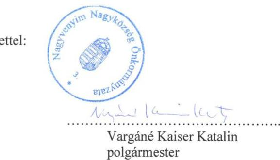
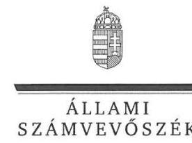
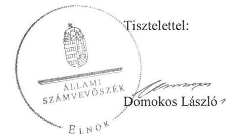

# Jelenetés 

## Önkormányzatok ellenőrzése

Integritás- és belső kontrollrendszer, Befektetési tevékenységek ellenőrzése Nagyvenyim Nagyközség Önkormányzata 2019.

---

# Jelentés 

## Önkormányzatok ellenőrzése

Integritás- és belső kontrollrendszer, Befektetési tevékenységek ellenőrzése Nagyvenyim Nagyközség Önkormányzata 2019. 05. hó 28. nap

---

# AZ ELLENŐRZÉST FELÜGYELTE:

- PETŐ KRISZTINA felügyeleti vezető
- AZ ELLENŐRZÉST VEZETTE ÉS A VÉGREHAJTÁSÁÉRT FELELŐS:
  - KISS ISTVÁN GYÖRGY ellenőrzésvezető
  - A PROGRAM ÖSSZEÁLLÍTÁSÁÉRT FELELŐS:
    - TÓTPÁL SZABOLCS osztályvezető

**IKTATÓSZÁM:** EL-1543-001/2019

**TÉMASZÁM:** 2485

**ELLENŐRZÉS-AZONOSÍTÓ SZÁM:** V082903

Jelentéseink az Országgyűlés számítógépes hálózatán és az Interneta a www.asz.hu címen is olvashatóak.

---

# TARTALOMJEGYZÉK 

■ ÖSSZEGZÉS ..... 5
■ AZ ELLENŐRZÉS CÉLJA ..... 6
■ AZ ELLENŐRZÉS TERÜLETE ..... 7
■ AZ ELLENŐRZÉS HÁTTERE, INDOKOLTSÁGA ..... 8
■ A JELENTÉS LÉNYEGES KÉRDÉSKÖREI ..... 10
■ AZ ELLENŐRZÉS HATÓKÖRE ÉS MÓDSZEREI ..... 11
■ MEGÁLLAPÍTÁSOK ..... 13
■ JAVASLATOK ..... 17
■ MELLÉKLETEK ..... 19
I. sz. melléklet: Értelmező szótár ..... 19
■ FÜGGELÉKEK ..... 21
I. sz. függelék a Jelentéshez ..... 21
II. sz. függelék: Észrevételek ..... 22
■ RÖVIDÍTÉSEK JEGYZÉKE ..... 31

---

.

---

# ÖSSZEGZÉS 

Nagyvenyim Nagyközség Önkormányzatnál a belső kontrollrendszer kialakítása és müködtetése nem volt szabályszerű, nem biztosította az átlátható, elszámoltatható és ellenőrizhető közpénzfelhasználást a 2013-2017. közötti években, így az Önkormányzat befektetési tevékenységét sem támogatta. Az integritási kontrollok müködtetése nem volt megfelelő a 2017. évben.

## Az ellenőrzés társadalmi indokoltsága

Az Állami Számvevőszék a stratégiai céljával összhangban - az Állami Számvevőszékről szóló 2011. évi LXVI. törvény felhatalmazása alapján - végzi a közpénzekkel, az állami és önkormányzati vagyonnal való felelős gazdálkodás, valamint a helyi önkormányzatok számviteli rendje betartásának és belső kontrollrendszere múködésének ellenőrzését.

Magyarország Alaptörvénye az önkormányzatoktól is elvárja a kiegyensúlyozott, átlátható és fenntartható költségvetési gazdálkodás elvének érvényesítését, továbbá a nemzeti vagyonnal való rendeltetésszerű és felelős módon való gazdálkodást. Az Állami Számvevőszék stratégiájában megfogalmazta, hogy támogatja az integritás alapú, átlátható és elszámoltatható közpénzfelhasználás megteremtését. Mindezekre tekintettel, a közpénzzel gazdálkodó szervezetek esetében a belső kontrollrendszer megfelelő múködése ellenőrzését prioritásként kezeli az Állami Számvevőszék.

## Főbb megállapítások, következtetések, javaslatok

Nagyvenyim Nagyközség Önkormányzata belső kontrollrendszerének kialakítása és múködtetése a 2013-2016 években nem volt szabályszerű, mert a kontrollkörnyezetet nem a jogszabályi előírásokkal összhangban alakították ki, az információs és kommunikációs rendszert nem múködtették szabályszerűen. A jegyző nem biztosította a kockázatkezelési, majd az integrált kockázatkezelési rendszer múködtetését, ezáltal nem járult hozzá a szervezet tevékenysége során felmerült kockázatok csökkentéséhez. A kontrollkörnyezet kialakítása a 2017. évben szabályszerű lett, azonban a belső kontrollrendszer kialakítása és múködtetése nem volt szabályszerű.

A jegyző nem szabályszerűen látta el az Önkormányzat közzétételi és adatszolgáltatási kötelezettségeit, így nem biztosította a gazdálkodás átláthatóságát.

A belső ellenőrzés múködése szabályszerű volt, azonban az ellenőrzések a befektetési tevékenységek végzésére nem terjedtek ki, így a belső ellenőrzés nem támogatta a befektetési tevékenység szabályszerű végzését.

A jegyző nem a jogszabályok előírásai szerint készítette el az önkormányzat befektetéseivel kapcsolatos döntéshozatalt. Az értékpapír befektetések és a befektetési célú ingatlan nyilvántartása, elszámolása nem volt szabályszerű az ellenőrzött időszakban. A mérleget nem támasztotta alá leltárral, így sérült a számviteli törvény valódiság szerinti elve.

Az Önkormányzatnál kiépítették az integritási kontrollokat, de a múködtetése nem támogatta a szervezet integritás elvű múködését 2017-ben. A kockázatelemzés hiányában az integritás elvű múködést támogató célszerű kontrollok nem kerültek kialakításra. A szervezet hosszú távú céljai között nem fogalmazta meg az integritás erősítését.

Az Önkormányzatnál nem alakítottak ki teljesítmény mérésére alkalmas mutatószámrendszert, emiatt nem volt mérhető a múködés gazdaságossága, hatékonysága és eredményessége.

Az Állami Számvevőszék a Nagyvenyim Nagyközség polgármesterének 1 javaslatot, míg a Nagyvenyimi Polgármesteri Hivatal jegyzőjének 8 javaslatot fogalmazott meg.

---

# AZ ELLENŐRZÉS CÉLJA 

AZ ELLENŐRZÉS CÉLJA annak megállapítása, hogy az önkormányzat belső kontrollrendszere biztosí-totta-e a közpénzekkel és a nemzeti vagyonnal történő elszámoltatható, átlátható, szabályszerű, gazdaságos, hatékony és eredményes gazdálkodás feltételeit. Az ellenőrzés keretében értékeljük továbbá, hogy az önkormányzatnál kiépítették és erősítették-e a korrupciós kockázatok kezelését szolgáló integritás kontrollokat és azt, hogy megte-remtették-e a teljesítményellenőrzés feltételeit.

Az ellenőrzés további célja annak értékelése volt, hogy a jogszabályi előírásoknak megfelelően alakították-e ki a belső kontrollrendszert, a kontrollkörnyezet biztosította-e a befektetési tevékenységek szabályszerű végzését. Az Állami Számvevőszék értékelte továbbá, hogy az egyes befektetési tevékenységekkel kapcsolatos döntéshozatal és a döntések végrehajtása, valamint az egyes befektetések számviteli elszámolása, nyilvántartása szabályszerű volt-e, és a belső és külső ellenőrzések támogatták-e az egyes befektetési tevékenységek szabályszerű végzését.

---

# AZ ELLENŐRZÉS TERÜLETE 

## Nagyvenyim Nagyközség Önkormányzata

Nagyvenyim nagyközség a Közép-Dunántúli régióban, Fejér megyében, a Mezőföldön helyezkedik el. Állandó lakosainak száma a Központi Statisztikai Hivatal Magyarország közigazgatási helynévkönyve alapján 2013. január 1-jén 4096 fő, míg 2017. január 1-jén 4051 fő volt.

Az Önkormányzat ${ }^{1}$ hét tagból álló képviselő-testülete ${ }^{2}$ három állandó bizottság támogatásával látta el feladatát.

A polgármester ${ }^{3}$ a 2014. évi önkormányzati választásokon történt választása óta tölti be tisztségét. A hivatalban lévő jegyző ${ }^{4}$ 2017. május 1-jével került kinevezésre.

Az Önkormányzat képviselő-testülete önálló polgármesteri Hivatalt ${ }^{5}$ hozott létre, amely 2013. április 26-án került bejegyzésre. Nagyvenyim Nagyközség Önkormányzata irányítása alá a Hivatal, a Művelődési Ház és Könyvtár, továbbá a Nagyvenyimi Nefelejcs Óvoda tartozott.

A Hivatal saját elkülönített gazdasági szervezettel nem rendelkezett, feladatait 2017. évben 11 fő foglalkoztatottal látta el. Az Önkormányzat belső ellenőrzési tevékenységét pályáztatás útján kiválasztott külső vállalkozó végezte.

Az Önkormányzat a 2013. évi költségvetési beszámolóban foglaltak szerint 378,5 millió Ft bevétel elérése mellett 307,9 millió Ft kiadást teljesített, míg 2017. évben 981,8 millió Ft bevétel elérése mellett 610,6 millió Ft kiadást teljesített.

Az Önkormányzat ellenőrzött időszakban szabad pénzeszközeit értékpapírokba és befektetési célú ingatlanba fektette be, kulturális javakkal, lekötött betétekkel és egyéb értéktárgyakkal az ellenőrzött időszakban nem rendelkezett.

---

# AZ ELLENŐRZÉS HÁTTERE, INDOKOLTSÁGA 

Az ÁSZ ${ }^{6}$ az Ász tv.-ben ${ }^{7}$ kapott felhatalmazással élve ellenőrzi az önkormányzatok gazdálkodását, működését, hogy az ellenőrzések megállapításaival támogassa az ellenőrzött önkormányzatok szabályszerű gazdálkodását, javaslataival elősegítse az Alaptörvényben megfogalmazott alapvetések érvényesülését a mindennapi életben az önkormányzatok szintjén. Az önkormányzati rendszerben zajló folyamatok holisztikus elemzései, a kockázatok folyamatos figyelemmel kísérésének módszerével, az így kiválasztott önkormányzatok célzott, hatékony ellenőrzéseivel az ÁSZ betölti a legfőbb gazdasági ellenőrző szerv küldetését. Az egyes ellenőrzések megállapításaival és egy időszak ellenőrzési eredményeinek elemzésével az ÁSZ ráirányíthatja a jogalkotók figyelmét az önkormányzati alrendszerben esetlegesen felmerülő pénzügyi, szabályozási feszültségekre. Az elvégzett nagyszámú ellenőrzés során az ÁSZ „jó gyakorlatokat" is azonosíthat, melyeket tanácsadó funkciója keretében szélesebb körben is megismertethet az érintettekkel, ezáltal is hozzájárulva az önkormányzati alrendszer szabályozott, átlátható, kiegyensúlyozott és fenntartható működéséhez.

A belső kontrollrendszer kialakítása és működtetése nélkül nem valósítható meg a közpénzek, a közvagyon átlátható, szabályos, gazdaságos, hatékony és eredményes felhasználása. A belső kontrollrendszer azt a célt szolgálja, hogy a költségvetési szervek működésük és gazdálkodásuk során a tevékenységeket szabályszerűen hajtsák végre, teljesítsék elszámolási kötelezettségeiket és megvédjék az erőforrásokat a veszteségektől, a károktól és a nem rendeltetésszerű használattól. A belső kontrollrendszer magában foglalja mindazon elveket, eljárásokat és belső szabályzatokat, melyek biztosítják, hogy a költségvetési szerv valamennyi tevékenysége és célja összhangban legyen a szabályszerűséggel, szabályozottsággal, valamint a gazdaságosság, hatékonyság és eredményesség követelményeivel, az eszközökkel és forrásokkal való gazdálkodásban ne kerüljön sor pazarlásra, visszaélésre, rendeltetésellenes felhasználásra. Megfelelő, pontos és naprakész információk álljanak rendelkezésre a költségvetési szerv működésével kapcsolatosan, és a belső kontrollrendszer harmonizációjára, öszszehangolására vonatkozó jogszabályok végrehajtásra kerüljenek. Az integritás kontrollok kiépítése, erősítése a szervezet korrupciós kockázatainak kezelését szolgálja. A teljesítménykövetelmények meghatározása és működtetése megalapozhatja az önkormányzatoknál a teljesítményellenőrzés lefolytatását.

Az önkormányzat befektetési tevékenységét a szerződéskötés (és a kapcsolódó döntés-előkészítés, döntéshozatal) kivételével a 2013. január 1. és 2017. december 31. közötti időszak vonatkozásában ellenőrizte az ÁSZ. A szerződéskötést az önkormányzat 2017. december 31-én meglévő értékpapírjai és egyéb befektetései vonatkozásában kellett értékelni a befektetési döntés előkészítése és a döntéshozatala tekintetében, abban az esetben is, ha az 2013. január 1-je előtt történt. Amennyiben a szerződéskötés, illetve a döntések előkészítése a 2013. évet megelőzően történt, akkor értelemszerűen a mindenkor hatályos jogszabályok előírásai alapján

---

kellett az értékelést elvégezni. Az Önkormányzat befektetéseiről beküldött, az ellenőrzött időszakra vonatkozó dokumentumok tételesen kerültek ellenőrzésre.

---

# A JELENTÉS LÉNYEGES KÉRDÉSKÖREI 

1.     - Az Önkormányzat belső kontrollrendszerének kialakítása és müködtetése szabályszerű volt-e, a befektetési tevékenységek szabályszerű végzését a kiépített kontrollrendszer biztositotta-e a 2013-2017. években?
2.     - Az Önkormányzatnál alakítottak-e ki a teljesítmény mérésére alkalmas követelményeket?
3.     - Az Önkormányzatnál a befektetésekkel kapcsolatos döntéshozatal, a befektetések számviteli elszámolása, nyilvántartása szabályszerű volt-e 2013-2017. években?

---

# AZ ELLENŐRZÉS HATÓKÖRE ÉS MÓDSZEREI 

## Az ellenőrzés típusa

Megfelelőségi ellenőrzés.

## Az ellenőrzött időszak

Az integritás és belső kontrollrendszer ellenőrzött időszaka a 2017. év, illetve az éves költségvetési beszámoló Áht. ${ }^{8}$ által megállapított jóváhagyásáig, 2018. május 31-éig tartó időszak volt.

Az egyes befektetési tevékenységek ellenőrzése tekintetében az ellenőrzött időszak 2013. január 1. - 2017. december 31. közötti időszak volt. Ezentúl a 2013. január 1. előtti időszak is, amennyiben a 2017. december 31-én meglévő befektetésekkel kapcsolatos döntéshozatalra a 2013. január 1. előtti időszakban került sor.

## Az ellenőrzés tárgya

Az önkormányzat és a gazdálkodási feladatokat ellátó hivatala belső kontrollrendszerének kialakítása és múködtetése, valamint az integritás kontrollok kiépítettsége, a teljesítményellenőrzés feltételei.

A 2017. december 31-én meglévő értékpapírokban megtestesülő befektetések, lekötött betétek.

## Az ellenőrzött szervezet

Nagyvenyim Nagyközség Önkormányzata

## Az ellenőrzés jogalapja

Az ellenőrzés jogszabályi alapját az Ász tv. 1. § (3) bekezdés, 5. § (2) és (6) bekezdései, valamint az Áht. 61. § (2) bekezdésének előírásai képezik.

## Az ellenőrzés módszerei

Az ÁSZ az ellenőrzést az ellenőrzési program szempontjai, az ellenőrzött időszakban hatályos jogszabályok, az ellenőrzés szakmai szabályai, a jelen ellenőrzésre irányadó ÁSZ módszertanok figyelembevételével hajtotta végre. Az ellenőrzési kérdések megválaszolásához szükséges bizonyítékok

---

megszerzése az ellenőrzött által rendelkezésre bocsátott dokumentumokra, adatokra alapozva megfigyelés, szemle (szemrevételezés), kérdésfeltevés (információkérés), mintavételezés, valamint elemző eljárás útján történt. Az ellenőrzési bizonyítékként felhasználható adatforrások közé tartoznak az ellenőrzési program részletes szempontjainál felsorolt adatforrások, valamint minden egyéb - az ellenőrzés folyamán feltárt, az ellenőrzés szempontjából információt tartalmazó - dokumentum.

Az ellenőrzés lefolytatásához az ellenőrzött szervezet tanúsítványok kitöltésével, valamint az ÁSZ által kért dokumentumok megküldésével szolgáltatott adatokat, amelyek valódiságát és teljes körűségét az ellenőrzött szervezet vezetője által tett teljességi és hitelességi nyilatkozat igazolja. A rendelkezésre bocsátott adatok, információk kontrollja az ellenőrzés keretében megtörtént.

Az önkormányzat belső kontrollrendszere egyes pilléreinek kialakítására és működtetésére vonatkozó értékelés:
$\longrightarrow$ „szabályszerü", amennyiben az értékelt területen az elért „igen" válaszok százalékban kifejezett, egész számra kerekített aránya legalább $85 \%$,
$\longrightarrow$ „nem szabályszerű", ha nem éri el a $85 \%$-ot.
Az önkormányzat belső kontrollrendszerének összesített értékelése az egyes részterületek esetében kapott megfelelőségi arányok számtani átlaga alapján történik és megegyezik a pillérenként (kontrollterületenként) alkalmazott százalékos értékelésekkel, a következő eltérésekkel: a kontrollrendszer egésze esetében a „szabályszerű" értékelésnek a százalékos értéken felül további feltétele, hogy egyik kontrollterület sem kaphat „nem szabályszerű" értékelést.

A 2017. évi kiadások teljesítéséhez kapcsolódó pénzgazdálkodási belső kontrollok működésének szabályszerűsége esetében az ellenőrzés azokra a legnagyobb értékű tételekre - lényeges sokaságra - terjedt ki, amelyek összértéke eléri a teljes sokaság 50\%-át. A lényeges sokaságból véletlen mintavételi eljárással kiválasztott tételek kerültek ellenőrzésre. „Szabályszerűnek" értékeltünk egy ellenőrzött területet, amennyiben 95\%-os bizonyossággal az ellenőrzött sokaságban az átlagos hibaarány legfeljebb 10\%, „nem szabályszerűnek", amennyiben 10\%-nál magasabb arányt képviselt.

Az önkormányzatok befektetési tevékenységét a szerződéskötés (és a kapcsolódó döntés-előkészítés, döntéshozatal) kivételével a 2013. január 1. és 2017. december 31. közötti időszak vonatkozásában értékeltük. A szerződéskötést az önkormányzat 2017. december 31-én meglévő értékpapírjai és egyéb befektetései vonatkozásában kell értékelni a befektetési döntés előkészítése és a döntéshozatala tekintetében, abban az esetben is, ha az 2013. január 1. előtt történt. Amennyiben a szerződéskötés, illetve a döntések előkészítése a 2013. évet megelőzően történt, akkor értelemszerűen a mindenkor hatályos jogszabályok előírásai alapján kell az értékelést elvégezni.

Az ellenőrzés ideje alatt az ellenőrzött szervezettel történő kapcsolattartást az ÁSZ SZMSZ-ének ${ }^{9}$ vonatkozó előírásai alapján biztosítottuk.

---

# 1. Az Önkormányzat belső kontrollrendszerének kialakítása és müködtetése szabályszerű volt-e, a befektetési tevékenységek szabályszerű végzését a kiépített kontrollrendszer biztosí-totta-e a 2013-2017. években? 

Összegző megállapítás

1.1. számú megállapítás

A belső kontrollrendszer kialakítása és müködtetése nem volt szabályszerű a 2013-2017. években, az nem biztosította a befektetési tevékenységek szabályszerű végzését.

A kontrollkörnyezet kialakítása 2013-2016. években nem volt szabályszerű, de 2017. évre biztosították a szabályszerű kontrollkörnyezet kialakítását.

A polgármester és a jegyző nem jelölte ki a 2015. január 1-jétől hatályos számlarendben ${ }^{10}$ az értékpapírok főkönyvi számla számjelét és megnevezését, a számla tartalmát, a főkönyvi számla és az analitikus nyilvántartás kapcsolatát, megsértve ezzel a Számv. tv. 161. § (2) bekezdés a)-c) pontjában foglaltakat.

A jegyző nem gondoskodott az ellenőrzési nyomvonal elkészítéséről 2013. január 1-jétől 2016. december 31-ig tartó időszakban, amely ellentétes a Bkr. ${ }^{11} 6 . \S$ (3) bekezdésében foglaltakkal.

A jegyző a Bkr. 3. § a) pontjában foglaltak ellenére, 2013. január 1. és 2014. február 28. közötti időszakban nem alakította ki a szervezet kockázatkezelési rendszerét.

A jegyző nem gondoskodott arról, hogy a 2014. március 1-jétől 2016. december 31-ig tartó időszakban olyan rendszereket alakítson ki, amelyek biztosítják, hogy a megfelelő információk a megfelelő időben eljussanak az illetékes szervezethez, szervezeti egységhez, illetve személyhez, amely ellentétes a Bkr. 9. § (1) bekezdésben foglaltakkal.

A képviselő-testület megalkotta az Mötv.-ben ${ }^{12}$ és az Áht.-ben foglaltak szerint szabályszerűen az Önkormányzati SZMSZ ${ }_{1,2,3}{ }^{13}$-t. A Htv. ben ${ }^{14}$ rögzített feladatkörében eljárva az Mötv. szabályozásával összhangban fejlesztési elképzeléseit a Gazdasági programban ${ }^{15}$ rögzítette. Az önkormányzati vagyonnal történő gazdálkodás szabályait a képviselő-testület az Önkormányzat Vagyonrendeletében ${ }^{16}$ állapította meg.

A Hivatal az Áht. előírásai szerint rendelkezett az alaptevékenységeit meghatározó szabályszerű Alapító Okirattal ${ }^{17}$, és a Hivatal szervezetét, feladatai ellátásának részletes belső rendjét és módját megállapító, az Ávr. ${ }^{18}$ szabályozásával összhangban lévő szabályszerű Hivatali SZMSZ ${ }_{1,2,3}$-mal ${ }^{19}$.

Az Önkormányzat rendelkezett az ellenőrzött időszakban hatályos Számv. tv. ${ }^{20}$ szerinti Számviteli politikával ${ }_{1,2,3}{ }^{21}$ és az annak keretében elkészített Eszközök és források leltárkészítési és leltározási szabályzat ${ }_{1,2,3}$ -

---

mal $^{22}$, Eszközök és források értékelési szabályzat ${ }_{1,2,3}$-mal $^{23}$, , valamint Pénzkezelési szabályzat ${ }_{1,2,3}$-mal $^{24}$. Az Önkormányzat 2017. évben rendelkezett Önköltségszámítás rendjére vonatkozó szabályzattal ${ }^{25}$.

A gazdálkodási jogkörgyakorlók nyilvántartását az Ávr. szerint vezették.
A 2013. január 1-je és 2016. december 31. közötti időszakban hatályos, a kötelezettségvállalásra, pénzügyi ellenjegyzésre, teljesítés igazolására, érvényesítésre, utalványozásra jogosult személyekről és aláírás-mintájukról a Gazdálkodási Szabályzat ${ }_{1,2,3}{ }^{26}$ keretében szabályszerűen vezettek nyilvántartást az Ávr. rendelkezései szerint.

A belső kontrollrendszer minőségének értékelését a jegyző nem a Bkr. 11. § (2a) bekezdésben előírt határidőben küldte meg a polgármester részére 2017. évben.
1.2. számú megállapítás

# A jegyző nem múködtette a kockázatkezelési rendszert, majd 2016. október 1-jétől az integrált kockázatkezelési rendszert. 

A Bkr. 7. § (1)-(2) bekezdésében foglaltak ellenére kockázatkezelési rendszert, majd 2016. október 1-jétől az integrált kockázatkezelési rendszert a jegyző nem múködtette.

## 1.3. számú megállapítás

## A kontrolltevékenységek múködtetése szabályszerű volt 2017-ben.

A kötelezettségvállalás és a teljesítésigazolás szabályszerű volt 2017. évben.

## A jegyző az információs és kommunikációs rendszert nem múködtette szabályszerűen az ellenőrzött időszakban.

Az Önkormányzat nem rendelkezett adatvédelmi és adatbiztonsági szabályzattal 2013. január 1. és 2016. december 31. közötti időszakban, megsértve ezzel az Info. tv. ${ }^{27}$ 24. § (3) bekezdésében foglaltakat.

Az Önkormányzat 2017. évben nem tette közzé a Közszolgálati adatvédelmi szabályzatát ${ }^{28}$, valamint az Informatikai biztonsági szabályzatát ${ }^{29}$, megsértve ezzel az Info. tv. 37. § (1) bekezdésében és az 1. melléklet II/1. pontjában rögzített közzétételi kötelezettséget. Az Önkormányzat és a Hivatal éves költségvetési beszámolója az Info. tv. 1. melléklet III/1. pontját megsértve nem került közzétételre.

A jegyző 2017. évben nem teljesítette az elemi költségvetésre, az éves költségvetési beszámolóra vonatkozó adatszolgáltatást az Áht. 108. § (1) bekezdés a) pontjában foglaltak ellenére az államháztartás információs rendszerébe.

A jegyző az Ávr. 169. § (3) bekezdésében foglaltak ellenére időközi költségvetési jelentéseit, valamint az Ávr. 170. § (2) bekezdésében előírt időközi mérlegjelentéseit nem töltötte fel a Kincstár ${ }^{30}$ által működtetett elektronikus adatszolgáltató rendszerbe 2017-ben.

A jegyző az Ávr. 5. mellékletének 28. pontjában előírt naptári éven túli futamidejű adósságot keletkeztető ügyleteire vonatkozó adatszolgáltatást nem teljesítette 2017. évben.

---

1.5. számú megállapítás

Az Önkormányzat tevékenységének és céljainak nyomon követési rendszerének múködtetése nem volt szabályszerű, azonban a belső ellenőrzés múködése szabályszerű volt.

A jegyző a Bkr. 10. §-ában foglaltak ellenére nem gondoskodott a szervezet tevékenységének, a célok megvalósításának folyamatos és eseti nyomon követéséről.

A Bkr. szerint a belső ellenőrzési stratégiai és éves tervet az Önkormányzat képviselő-testülete szabályszerűn, az előírt határidőben jóváhagyta. A belső ellenőrzés javaslatainak végrehajtása érdekében az intézkedési tervek a Bkr. által előírt módon elkészítésre és végrehajtásra kerültek.

A belső ellenőrzés az ellenőrzött időszakban az Önkormányzat befektetési tevékenységét nem ellenőrizte, így nem támogatta a befektetések szabályszerű végzését.

Az Önkormányzatnál kiépítették az integritási kontrollokat, de a múködtetése nem támogatta a szervezet integritás elvű múködését. Az Önkormányzat nem rendelkezett hosszú távú célokkal, az integritás erősítése pedig a célok között nem került rögzítésre. Az Önkormányzatnál lehetőség van az integritás-tudatos múködés fejlesztésére a kockázatelemzés, álláspályázati dokumentumok hitelességének vizsgálata és külső szakértők foglalkoztatásának szabályozása területén.

# 2. Az Önkormányzatnál alakítottak-e ki a teljesítmény mérésére alkalmas követelményeket? 

## Összegző megállapítás

Az Önkormányzatnál nem alakítottak ki teljesítmény mérésére alkalmas mutatószámrendszert 2017. évben.

A jegyző nem alakított ki olyan mutatószámrendszert, amely lehetővé tette volna annak a mérését vagy megállapítását, hogy a múködés és gazdálkodás során a tevékenységeket szabályszerűen, gazdaságosan, hatékonyan és eredményesen hajtották-e végre.

## 3. Az Önkormányzatnál a befektetésekkel kapcsolatos döntéshozatal, a befektetések számviteli elszámolása, nyilvántartása szabályszerű volt-e 2013-2017. években?

Összegző megállapítás

Az Önkormányzatnál befektetésekkel kapcsolatos döntéshozatala, a befektetések nyilvántartása és számviteli elszámolása nem volt szabályszerű a 2013-2017. években.

A befektetésekkel kapcsolatos döntéshozatal nem volt szabályszerű. A jegyző a célszerűségi, gazdaságossági, hatékonysági és eredményességi szempontból nem alapozta meg a befektetési döntéseket, amely ellentétes a Bkr. 8. § (2) bekezdés b) pontjában foglaltakkal, mert:
— az ingatlanvásárlást megelőzően nem gondoskodott az Önkormányzat Vagyonrendeletének 15. § (1) bekezdése alapján az ingatlan forgalmi értékének becsléséről. (Részleteket lásd a függelékben.)

---

$\longrightarrow$ az ingatlanvásárlást megelőzően a képviselő-testületi előterjesztés nem tartalmazott gazdaságossági, hatékonysági és eredményességi szempontokat, nem vizsgálta az ingatlan későbbi fenntartási, üzemeltetési költségét.
Az Önkormányzatnál az egyes befektetések számviteli nyilvántartása nem volt szabályszerű a 2013-2017. években, mert:
$\longrightarrow$ Az Önkormányzatnál a mérlegben szereplő befektetéseket az ellenőrzött években leltárral nem támasztották alá, megsértve ezzel a Számv. tv. 69. § (1) bekezdésében előírtakat. (Részleteket lásd a függelékben.)
$\longrightarrow$ Az Önkormányzat értékpapír analitikus nyilvántartása nem volt szabályszerű, mert a jegyző nem vezette az Áhsz. ${ }^{31} 45$. § (3) bekezdésében és a 14. melléklet VIII. 1. rész a)-j) pontjaiban foglaltakat tartalmazó részletező nyilvántartást.
$\longrightarrow$ Az Önkormányzat által befektetési céllal vásárolt ingatlan analitikus nyilvántartása nem volt szabályszerű, mert a jegyző nem vezette az Áhsz. 39. § (3) bekezdésében és a 14. melléklet VII. 1. rész (b,d,f,h,i,m,n,p,q) pontjaiban foglaltakat tartalmazó részletező nyilvántartást.

---

# JAVASLATOK 

Az ÁSZ tv. 33. § (1) bekezdésében foglaltak értelmében az ellenőrzött szervezet vezetője köteles a jelentésben foglalt megállapításokhoz kapcsolódó intézkedési tervet összeállítani és azt a jelentés kézhezvételétől számított 30 napon belül az ÁSZ részére megküldeni. Amennyiben az ellenőrzött szervezet vezetője nem küldi meg határidőben az intézkedési tervet, vagy továbbra sem elfogadható intézkedési tervet küld, az Állami Számvevőszék elnöke az ÁSZ tv. 33. § (3) bekezdése a) és b) pontjaiban foglaltakat érvényesítheti.

## Nagyvenyim Nagyközség Önkormányzata polgármesterének

1. Intézkedjen a jogszabály szerinti számlarend elkészítéséről.
(1.1. sz. megállapítás 1. bekezdése alapján)

## Nagyvenyimi Polgármesteri Hivatal jegyzőjének

1. Intézkedjen a jogszabály szerinti számlarend elkészítéséről.
(1.1. sz. megállapítás 1. bekezdése alapján)
2. Intézkedjen az integrált kockázatkezelési rendszer müködtetése során a költségvetési szerv tevékenységében rejlő és a szervezeti célokkal öszszefüggő kockázatok felméréséről és megállapításáról, valamint az egyes kockázatokkal kapcsolatban szükséges intézkedések és azok teljesítésének folyamatos nyomon követése módjának meghatározásáról.
(1.2. sz. megállapítás 1. bekezdése alapján)
3. Intézkedjen a jogszabályi előirások szerinti közzétételi kötelezettség teljesitéséről.
(1.4. sz. megállapítás 2. bekezdése alapján)
4. Intézkedjen a jogszabályban elöirt adatszolgáltatási kötelezettség teljesitéséről.
(1.4. sz. megállapítás 3-5. bekezdése alapján)
5. Intézkedjen a szervezet tevékenységének, a célok megvalósitásának folyamatos és eseti nyomon követése érdekében.
(1.5. sz. megállapítás 1. bekezdése alapján)

---

6. Biztosítsa a befektetésekkel kapcsolatos döntések célszerüségi, gazdaságossági, hatékonysági és eredményességi szempontú megalapozottságát.
(3. sz. megállapítás 1. bekezdése és 1. bekezdésének 1-2. francia bekezdései alapján)
7. Intézkedjen a mérleg tételeinek alátámasztásához leltár összeállításáról.
(3. sz. megállapítás 2. bekezdésének 1. francia bekezdése alapján)
8. Intézkedjen az értékpapírok és tárgyi eszközök nyilvántartásának jogszabály szerinti vezetéséről.
(3. sz. megállapítás 2. bekezdésének 2-3. francia bekezdése alapján)

---

# MELLÉKLETEK 

- I. SZ. MELLÉKLET: ÉRTELMEZŐ SZÓTÁR
belső ellenőrzés
belső kontrollrendszer
helyi önkormányzat
információs és kommunikációs rendszer
integritás

Független, tárgyilagos bizonyosságot adó és tanácsadó tevékenység, amelynek célja, hogy az ellenőrzött szervezet müködését fejlessze és eredményességét növelje, az ellenőrzött szervezet céljai elérése érdekében rendszerszemléletű megközelítéssel és módszeresen értékeli, illetve fejleszti az ellenőrzött szervezet irányítási és belső kontrollrendszerének hatékonyságát. (Forrás: Bkr. 2. § b) pontja)
A belső kontrollrendszer a kockázatok kezelése és tárgyilagos bizonyosság megszerzése érdekében kialakított folyamatrendszer, amely azt a célt szolgálja, hogy a müködés és gazdálkodás során a tevékenységeket szabályszerűen, gazdaságosan, hatékonyan, eredményesen hajtsák végre, az elszámolási kötelezettségeket teljesítsék, megvédjék az erőforrásokat a veszteségektől, károktól és nem rendeltetésszerű használattól. (Forrás: Áht. 69. § (1) bekezdése) A belső kontrollrendszer elemei kontrollkörnyezet, a kockázatkezelési rendszer, a kontrolltevékenységek, az információs és kommunikációs rendszer, valamint a nyomon követési (monitoring) rendszer. (Forrás: Bkr. 3. §-a)

A helyi önkormányzat jogi személy. Az önkormányzati feladatok ellátását a képviselő-testület és szervei biztosítják. A képviselőtestület szervei: a polgármester, a főpolgármester, a megyei közgyűlés elnöke, a képviselő-testület bizottságai, a rész-önkormányzat testülete, a polgármesteri hivatal, a megyei önkormányzati hivatal, a közös önkormányzati hivatal, a jegyző, továbbá a társulás. A képviselő-testület a feladatkörébe tartozó közszolgáltatások ellátására - jogszabályban meghatározottak szerint - költségvetési szervet, a Polgári perrendtartásról szóló 1952. évi III. törvény szerinti gazdálkodó szervezetet (a továbbiakban: gazdálkodó szervezet), non-profit szervezetet és egyéb szervezetet (a továbbiakban együtt: intézmény) alapít-hat, továbbá szerződést köthet természetes és jogi személlyel vagy jogi személyiséggel nem rendelkező szervezettel. A helyi önkormányzat éves költségvetési beszámolója magába foglalja a helyi önkormányzat - nem költségvetési szerveihez tartozó - feladataihoz kapcsolódó bevételeket és kiadásokat. A helyi önkormányzat összevont (konszolidált) költségvetési beszámolóját a helyi önkormányzatra és költségvetési szerveire vonatkozóan külön-külön beérkezett éves költségvetési beszámolók alapján a Kincstár készíti el és küldi meg az önkormányzatnak. (Forrás: Mötv. 41. § (1), (2), (6) bekezdései; Áhsz. 2. § (1) bekezdése, 6. § (1) bekezdés a) és f) pontja, 30. §-a, 37. § (1) és (6) bekezdése)

A költségvetési szerv vezetője által kialakított és müködtetett olyan rendszer, mely biztosítja, hogy a megfelelő információk a megfelelő időben eljutnak az illetékes szervezethez, szervezeti egységhez, illetve személyhez. (Forrás: Bkr. 9. § (1) bekezdés)
Az integritás elvek, értékek, cselekvések, módszerek, intézkedések konzisztenciáját jelenti: olyan magatartásmódot, amely meghatározott értékeknek felel meg. Az integritás a közszféra esetében a társadalom által elvárt nyilvánossági, átláthatósági, illetve jogi/etikai normáknak történő megfelelést je-

---

kockázatkezelési rendszer
kontrollkörnyezet
kontrolltevékenységek
költségvetési szerv vezetője
lenti. (Forrás: a http://integritas.asz.hu honlapon közzétett „A 2012. évi integritás felmérés eredményeinek összefoglalója" című dokumentum 3. oldal 1. bekezdés)

Olyan irányítási eszközök és módszerek összessége, melynek elemei a szervezeti célok elérését veszélyeztető tényezők (kockázatok) azonosítása, elemzése, csoportosítása, nyomon követése, valamint szükség esetén a kockázati kitettség mérséklése. (Forrás: Bkr. 2. § m) pontja)
A költségvetési szerv vezetője által kialakított olyan elvek, eljárások, belső szabályzatok összessége, amelyben világos a szervezeti struktúra, egyértelműek a felelősségi, hatásköri viszonyok és feladatok, meghatározottak az etikai elvárások a szervezet minden szintjén, átlátható a humánerőforrás-kezelés. (Forrás: Bkr. 6. § (1) bekezdés)
A költségvetési szerv vezetője által a szervezeten belül kialakított (kontroll) tevékenységek, melyek biztosítják a kockázatok kezelését, hozzájárulnak a szervezet céljainak eléréséhez. (Forrás: Bkr. 8. § (1) bekezdés)
Helyi önkormányzat esetében a jegyző, főjegyző, társulás esetén a társulási megállapodásban meghatározott önkormányzat jegyzője. (Forrás: Bkr. 2. § n) pont nb) alpont)

---

# FÜGGELÉKEK 

- I. SZ. FÜGGELÉK A JELENTÉSHEZ

Az Állami Számvevőszék az ellenőrzések során feltárt tényekhez kapcsolódó további körülmények tisztázására eszközrendszerrel nem rendelkezik. Amennyiben az ellenőrzésen túlmutatóan indokoltnak látszik az ellenőrzés során feltárt körülmények további vizsgálata, az Állami Számvevőszék törvényi felhatalmazás alapján az ellenőrzés által feltárt körülményeket továbbítja a hatáskörrel rendelkező szervnek a szükséges intézkedések megtétele, eljárások lefolytatása érdekében.
Az ellenőrzés feltárta, hogy Nagyvenyim Nagyközség Önkormányzat Képviselő-testülete döntött a Nagyvenyim 063/4/A hrsz-ú ingatlan megvásárlásáról. A képviselő-testületi döntés előkészítése során a jegyző nem gondoskodott az Önkormányzat Vagyonrendeletének 15. § (2) bekezdés a) pontjában meghatározott ingatlan forgalmi értékbecslés beszerzéséről. A jegyző - az Mötv. 81. § (3) bekezdés e) pontjában rögzített kötelezettségét megszegve - elmulasztotta jelezni a képviselő-testületnek és a polgármesternek, hogy döntésük - a megvásárolni kívánt ingatlan értékbecslésének hiányában - jogszabálysértő, mert az Önkormányzat Vagyonrendeletének rendelkezésébe ütközik.
Az értékbecslés hiányában a vételi ár összegének megalapozottsága nem igazolt, ezért felvetődik, hogy az Önkormányzatot vagyoni hátrány érte. Az eset összes körülménye csak nyomozati eszközökkel deríthető fel, amely tekintetében az illetékes ügyészség jogosult eljárni.
Az Önkormányzat jegyzője a Számv. tv. 69. § (1) bekezdésében, valamint az Áhsz. 22. § (1) bekezdésében foglalt előírások ellenére a 2013-2017-es években a költségvetési beszámolók elkészítéséhez nem állított össze leltárakat, amelyek tételesen, ellenőrizhető módon tartalmazták a mérlegben szereplő eszközöket és forrásokat. Ezzel sérült a Számv. tv. 15. § (3) bekezdésben rögzített valódiság elve. Leltár hiányában nem igazolt, hogy az érintett évek költségvetési beszámolói megbízható, valós összképet mutatnak.
Az Áht. 68/B. § (1) bekezdés c) pontja szerint a Magyar Államkincstár ellenőrzési jogköre kiterjed az Önkormányzat által elkészített éves költségvetési beszámoló megbizható, valós összképének vizsgálatára, így a Magyar Államkincstár illetékes igazgatósága jogosult eljárni a jogsértő magatartás tekintetében.

---

A jelentéstervezetet a Számvevőszék 15 napos észrevételezésre megküldte az ellenőrzött szervezet vezetőjének az ÁSZ tv. 29. §* (1) bekezdése előírásának megfelelően.

Nagyvenyim Nagyközség Önkormányzatának polgármestere a jelentéstervezet megállapításaira írásban észrevételt tett.
Az ÁSZ tv. 29. § (3) bekezdésével összhangban az ÁSZ a Függelékben feltünteti az ellenőrzés megállapításaival kapcsolatban tett, figyelembe nem vett észrevételeket, és megindokolja, hogy azokat miért nem fogadta el.

[^0]
[^0]:    * 29. § (1) Az Állami Számvevőszék az ellenőrzési megállapításait megküldi az ellenőrzött szervezet vezetőjének vagy az általa megbízott személynek, és annak, akinek személyes felelősségét állapította meg.
    (2) Az ellenőrzött szervezet vezetője és a felelősként megjelölt személy az ellenőrzés megállapításaira tizenöt napon belül írásban észrevételt tehet.
    (3) Az Állami Számvevőszék az észrevételre a beérkezésétől számított harminc napon belül írásban válaszol. A figyelembe nem vett észrevételeket köteles a jelentésben feltüntetni, és megindokolni, hogy azokat miért nem fogadta el.

---

# Nagyvenyim Nagyközség Önkormányzata 

2421.Nagyvenyim, Fő u. 43. T: 25/507-460; F.: 25/506-217; E-mail: polghivn@vnet.hu

Iktatószám: PH/1666-2/2019
Tárgy: Észrevétel jegyzőkönyvre
Hiv. szám: EL-0750-037/2019.
Melléklet: 18 db képernyőmentés
17 db adatszolgáltatás

## Állami Számvevőszék   1052 Budapest

Apáczai Csere János utca 10.
Tisztelt Domokos László Elnök Úr!
2019. március 13. napon átvételre került az „Önkormányzatok ellenőrzése - Integritás- és belső kontrollrendszer, Befektetési tevékenységek ellenőrzése - Nagyvenyim Nagyközség Önkormányzata" címú EL-0750-037/2019. iktatószámú számvevőszéki jelentéstervezet.

Az Állami Számvevőszékről szóló 2011. évi LXVI. törvény 29. § (2) bekezdése alapján az alábbi észrevételt kívánom tenni az EL-0750-037/2019. iktatószámú jelentéstervezet 1.4. számú megállapításaira:

## Megállapítás:

A jegyző 2017. évben nem teljesítette az elemi költségvetésre, az éves költségvetési beszámolóra vonatkozó adatszolgáltatást az Áht. 108. § (1) bekezdés a) pontjában foglaltak ellenére az államháztartás információs rendszerébe.

## Észrevétel:

Nagyvenyim Nagyközség Önkormányzata, Nagyvenyimi Polgármesteri Hivatal és az Önkormányzat költségvetési szervei 2017 évben teljesítette az elemi költségvetésre, az éves költségvetési beszámolóra vonatkozó adatszolgáltatást az Áht. 108. § (1) bekezdés a) pontjában foglaltak szerint az államháztartás információs rendszerébe. Az adatszolgáltatás teljesítéséről a Magyar Államkincstár Fejér Megyei Igazgatósága nem adott ki részünkre igazolást, ezért a KGR rendszer képernyőmentéseit csatolom jelen észrevételhez. A képernyőmentések Nagyvenyim Nagyközség Önkormányzatának adatszolgáltatásait tartalmazza, mely adatszolgáltatás akkor tekinthető teljesítettnek a KGR rendszer hierarchikus szabályai szerint, ha az általa irányított szervek (Nagyvenyimi Polgármesteri Hivatal, Önkormányzat költségvetési szervei) adatszolgáltatásai „jóváhagyott" státuszban vannak, ezáltal azok is teljesítettnek minősülnek. A képernyőmentések tartalmazzák az adatszolgáltatások státusztörténetét, melyből egyértelműen látszódik, hogy az Önkormányzat az adatszolgáltatásokat határidőben teljesítette, továbbá a Magyar Államkincstár jóváhagyása, pénzügyileg jóváhagyása megtörtént.
/Az észrevétel igazolásaként csatolt mellékletek sorszáma: 1-2/

---

# Megállapítás: 

A jegyző az Ávr. 169. § (3) bekezdésében foglaltak ellenére időközi költségvetési jelentéseit, valamint az Ávr. 170. § (2) bekezdésében előírt időközi mérlegjelentéseit nem töltötte fel a Kincstár által működtetett elektronikus adatszolgáltató rendszerbe 2017-ben.

## Észrevétel:

Nagyvenyim Nagyközség Önkormányzata, Nagyvenyimi Polgármesteri Hivatal és az Önkormányzat költségvetési szervei 2017 évben feltöltötte a Kincstár által működtetett elektronikus adatszolgáltató rendszerbe 2017-ben az Ávr. 169. § (3) bekezdésében foglaltak szerinti időközi költségvetési jelentéseit, valamint az Ávr. 170. § (2) bekezdésében előírt időközi mérlegjelentéseit. Az adatszolgáltatás teljesítéséről a Magyar Államkincstár Fejér Megyei Igazgatósága nem adott ki részünkre igazolást, ezért a KGR rendszer képernyőmentéseit csatolom jelen észrevételhez. A képernyőmentések Nagyvenyim Nagyközség Önkormányzatának adatszolgáltatásait tartalmazza, mely adatszolgáltatás akkor tekinthető teljesítettnek a KGR rendszer hierarchikus szabályai szerint, ha az általa irányított szervek (Nagyvenyimi Polgármesteri Hivatal, Önkormányzat költségvetési szervei) adatszolgáltatásai „jóváhagyott" státuszban vannak, ezáltal azok is teljesítettnek minősülnek. A képernyőmentések tartalmazzák az adatszolgáltatások státusztörténetét, melyből egyértelműen látszódik, hogy az Önkormányzat az adatszolgáltatásokat határidőben teljesítette, továbbá a Magyar Államkincstár jóváhagyása, pénzügyileg jóváhagyása megtörtént.
/Az észrevétel igazolásaként csatolt mellékletek sorszáma: 3-16/

## Megállapítás:

A jegyző az Ávr. 5. mellékletének 28. pontjában előírt naptári éven túli futamidejű adósságot keletkeztető ügyleteire vonatkozó adatszolgáltatást nem teljesítette 2017. évben.

## Észrevétel:

Nagyvenyim Nagyközség Önkormányzata 2017 évben teljesítette az Ávr. 5. mellékletének 28. pontjában előírt naptári éven túli futamidejű adósságot keletkeztető ügyleteire vonatkozó adatszolgáltatást. Az adatszolgáltatás teljesítéséről a Magyar Államkincstár Fejér Megyei Igazgatósága nem adott ki részünkre igazolást, ezért a KGR rendszer képernyőmentéseit csatolom jelen észrevételhez. Az adatszolgáltatást a negyedik negyedévi és éves mérlegjelentés benyújtási határidejével megegyezően Nagyvenyim Nagyközség Önkormányzata a KGR rendszeren keresztül a megfelelő mérlegjelentések 1G (A Gst. 3. § (1) bekezdése szerinti, naptári éven túli futamidejű adósságot keletkeztető ügyletek) ürlapjának „üres űrlap" megjelölésével teljesítette, mivel Nagyvenyim Nagyközség Önkormányzata nem rendelkezett 2017. december 31. napon a Gst. 3. § (1) bekezdése szerinti, naptári éven túli futamidejű adósságot keletkeztető ügylettel. Az adatszolgáltatások határidőben történő beadását igazolja a 15. és 16. számú melléklet.
/Az észrevétel igazolásaként csatolt mellékletek sorszáma: 17-18/
Megjegyezni kívánom, hogy az „Az önkormányzatok egyes befektetési tevékenységeinek ellenörzése" című kiegészítő modul kapcsán EL-1034-001/2018. iktatószámú levelükkel megküldött dokumentumok jegyzéke nem tartalmazta a megállapításokban szereplő adatszolgáltatások teljesítésének igazolására vonatkozó dokumentumok rendelkezésre bocsátására

---

való felhívást, így a teljességi és hitelességi nyilatkozatnak sem kellett, hogy része legyen. Az észrevételek igazolására szolgáló dokumentumok, jelen levél mellékleteként csatolásra kerültek.

Ugyanakkor rögzíteni kívánom azt is, hogy az észrevételek igazolására szolgáló dokumentumok becsatolásra kerültek az „Önkormányzatok ellenörzése - Integritás és belső kontroll modul" címủ ellenőrzéssel kapcsolatban érkezett, EL-0750-005/2018 iktatószámú adatbekérő levél 3.1.42. pontjához. A 3.1.42. pont az alábbi dokumentumok csatolását irányozta elő számunkra:
„az adatszolgáltatási kötelezettség teljesítésének dokumentumai (költségvetési rendelet, elemi költségvetés, éves költségvetési beszámoló megküldésének, javításának dokumentumai, negyedéves adatszolgáltatási kötelezettségek dokumentumai költségvetési jelentések, időközi mérlegjelentések, adósságot keletkeztető ügyletek).

Az „Önkormányzatok ellenörzése - Integritás és belső kontroll modul" címủ ellenőrzéshez 2018. július 12-én felcsatolt dokumentum elnevezése: „3.1.42_Adatszolgáltatási kötelezettség teljesítése_Nagyvenyim Nagyközség Önkormányzata.pdf".
/Az észrevétel igazolásaként csatolt mellékletek sorszáma: 19-35/
Tekintettel arra, hogy az EL-1034-001/2018. iktatószámú levelük dokumentum jegyzéke nem tartalmazott a jelentéstervezetben hiányolt dokumentumok felcsatolására felhívást, nem tettünk olyan nyilatkozatot, amelyben hivatkoztunk volna a folyamatban lévő ellenőrzéshez történt dokumentumok megküldésére.

Kérem a fenti észrevételek figyelembe vételét a végleges jelentés kiadásakor.

Nagyvenyim, 2019. március 27.
Tisztelettel:

---

ELNÖK

# Vargáné Kaiser Katalin úrhölgy 

polgármester

Nagyvenyim Nagyközség Önkormányzata

## Nagyvenyim

## Tisztelt Polgármester Úrhölgy!

Az „Önkormányzatok ellenörzése - Integritás- és belső kontrollrendszer, Befektetési tevékenységek ellenörzése - Nagyvenyim Nagyközség Önkormányzata" címmel készített számvevöszéki jelentéstervezetre tett észrevételét megkaptam.
Az Állami Számvevőszék észrevételekre vonatkozó álláspontjáról a felügyeleti vezető által készített részletes tájékoztatást csatoltan megküldöm.
Tájékoztatom Polgármester úrhölgyet, hogy a számvevőszéki jelentésben - az Állami Számvevőszékről szóló 2011. évi LXVI. törvény 29. § (3) bekezdése alapján - a figyelembe nem vett észrevételeket szerepeltetjük az elutasítás indokának feltüntetésével.

Budapest, 2019. ơ hó / nap

Melléklet: Tájékoztatás az észrevételek kezeléséről

---

# Tájékoztatás az észrevételek kezeléséről 

Az „Önkormányzatok ellenörzése - Integritás- és belső kontrollrendszer, Befektetési tevékenységek ellenörzése - Nagyvenyim Nagyközség Önkormányzata" címủ jelentéstervezetre (továbbiakban: jelentéstervezet) levélben megküldött észrevételeit áttekintettem. Az észrevételek kezeléséről az alábbi tájékoztatást adom.

## 1) Az 1.4. számú megállapítás 3. bekezdésére tett észrevétel.

Polgármester úrhölgy észrevételében jelezte, hogy Nagyvenyim Nagyközség Önkormányzata (továbbiakban: Önkormányzat), valamint a polgármesteri hivatal és az Önkormányzat költségvetési szervei a 2017. évben teljesítették az elemi költségvetésre és az éves beszámolóra vonatkozó, az államháztartásról szóló 2011. évi CXCV. törvény (Áht.) 108. § (1) bekezdés a) pontja szerinti adatszolgáltatást az államháztartás információs rendszerébe. Polgármester úrhölgy az észrevételéhez az adatszolgáltatás teljesítésének alátámasztására a Költségvetés Gazdálkodási Rendszerbe (KGR) történő elektronikus feltöltést igazoló dokumentumokat csatolt.
Az észrevételt nem fogadtuk el. Az Állami Számvevőszék (továbbiakban: ÁSZ) az ellenőrzési megállapításait az adatszolgáltatás során a részére törvényi határidőben rendelkezésre bocsátott dokumentumokra alapozva fogalmazza meg. A 2018. július 12-én kelt teljességi és hitelességi nyilatkozat szerint az ÁSZ részére átadott dokumentumok, adatok megbízhatóak, és a bekért adatokra, dokumentumokra vonatkozóan teljes körű információt tartalmaznak. A hivatkozott nyilatkozat 81-83. pontjai és az ellenőrzési dokumentumok alapján az Önkormányzat nem bocsátott az ellenőrzés rendelkezésére olyan dokumentumokat, amelyek az államháztartás információs rendszerébe történő adatszolgáltatási kötelezettség teljesítését alátámasztották volna. Az észrevételhez mellékletként csatolt, az adatszolgáltatáson kívül megküldött, utólag rendelkezésre bocsátott dokumentumokat az ÁSZ nem értékeli, ezért a jelentéstervezet módosítása nem indokolt.

## 2) Az 1.4. számú megállapítás 4. bekezdésére tett észrevétel.

Polgármester úrhölgy észrevételében jelezte, hogy az Önkormányzat, valamint a polgármesteri hivatal és az Önkormányzat költségvetési szervei a 2017. évben teljesítették az idöközi költségvetési jelentésekre és az idöközi mérlegjelentésekre vonatkozó, az államháztartásról szóló törvény végrehajtásáról szóló 368/2011. (XII. 31.) Korm. rendelet (továbbiakban: Ávr.) 169. § (3) bekezdésében és az Ávr. 170. § (2) bekezdésében előírt

---

adatszolgáltatást az államháztartás információs rendszerébe. Észrevételéhez a KGR informatikai rendszerbe történő elektronikus feltöltést igazoló dokumentumokat csatolt.
Az észrevételt nem fogadtuk el. Polgármester úrhölgy 2018. július 12-én kelt teljességi és hitelességi nyilatkozata szerint az ÁSZ részére átadott dokumentumok, adatok megbízhatóak, és a bekért adatokra, dokumentumokra vonatkozóan teljes körű információt tartalmaznak. A hivatkozott nyilatkozat 81-83. pontjai és az ellenőrzési dokumentumok alapján az Önkormányzat nem bocsátott az ellenőrzés rendelkezésére olyan dokumentumokat, amelyek az államháztartás információs rendszerébe történő adatszolgáltatási kötelezettség teljesítését alátámasztották volna. Az észrevételhez mellékletként csatolt, az időközi költségvetési jelentések és az időközi mérlegjelentések KGR rendszerbe történő elektronikus feltöltését igazoló dokumentumokat az Önkormányzat utólag bocsátotta rendelkezésre, ezért azokat az ÁSZ nem értékeli. A jelentéstervezet módosítása nem indokolt.

# 3) Az 1.4. számú megállapítás 5. bekezdésére tett észrevétel. 

Polgármester úrhölgy észrevételében jelezte, hogy az Önkormányzat a 2017. évben teljesítette az Ávr. 5. melléklet 28. pontjában előírt, a Magyarország gazdasági stabilitásáról szóló 2011. évi CXCIV. törvény szerinti, naptári éven túli futamidejü adósságot keletkeztető ügyletekre vonatkozó adatszolgáltatást az államháztartás információs rendszerébe. Polgármester úrhölgy észrevételéhez az adatszolgáltatás teljesítésének alátámasztásához a KGR rendszerbe történő elektronikus feltöltését igazoló dokumentumokat csatolt.
Az észrevételt nem fogadtuk el. Polgármester úrhölgy 2018. július 12-én kelt teljességi és hitelességi nyilatkozata szerint az ÁSZ részére átadott dokumentumok, adatok megbízhatóak, és a bekért adatokra, dokumentumokra vonatkozóan teljes körű információt tartalmaznak. A hivatkozott nyilatkozat 81-83. pontjai és az ellenőrzési dokumentumok alapján az Önkormányzat nem bocsátott az ellenőrzés rendelkezésére olyan dokumentumokat, amelyek az államháztartás információs rendszerébe történő, a naptári éven túli futamidejű adósságot keletkeztető ügyletekre vonatkozó adatszolgáltatást alátámasztották volna. Az észrevételhez mellékletként csatolt, adatszolgáltatáson kívül megküldött, utólag rendelkezésre bocsátott dokumentumokat az ÁSZ nem értékeli, ezért a jelentéstervezet módosítása nem indokolt.
Polgármester úrhölgy észrevételében jelezte továbbá, hogy „Az önkormányzatok egyes befektetési tevékenységeinek ellenörzése" című kiegészítő modul kapcsán az adatbekérő levélben megküldött dokumentumjegyzék nem tartalmazott az adatszolgáltatások teljesítését igazoló dokumentumok megküldésére vonatkozó felhívást. Ezúton tájékoztatom, hogy a jelentéstervezetnek az észrevételben is hivatkozott megállapításai nem a befektetési kiegészítő modul ellenőrzési programjához kapcsolódó adatbekérés dokumentumain, hanem az „Önkormányzatok ellenörzése - Integritás- és belső kontroll modul" című ellenőrzéshez kapcsolódó adatbekérés során bekért dokumentumokon alapult.

---

Észrevételében jelezte, hogy az adatszolgáltatás során felcsatolt, ,,3.1.42_Adatszolgáltatási kötelezettség teljesitése_Nagyvenyim Nagyközség Önkormányzata.pdj" nevủ fájl tartalmazza az adatszolgáltatás során bekért, az adatszolgáltatási kötelezettség teljesítését igazoló dokumentumokat. A hivatkozott dokumentum ismételt felülvizsgálatát követően - jelen levél 1-3. pontjaiban leírtakkal összhangban - megállapítást nyert, hogy nem bocsátottak az ellenőrzés rendelkezésére olyan dokumentumokat, amelyek az adatszolgáltatási kötelezettség teljesítését alátámasztották volna. Észrevétele alapján a jelentéstervezet módosítása nem indokolt.

Budapest, 2019. 04. hó 24. nap

Pető Krisztina
felügyeleti vezető

---

.

---

# RÖVIDÍTÉSEK JEGYZÉKE 

${ }^{1}$ Önkormányzat
${ }^{2}$ képviselő-testület
${ }^{3}$ polgármester
${ }^{4}$ jegyző
${ }^{5}$ Hivatal
${ }^{6}$ ÁSZ
${ }^{7}$ Ász tv.
${ }^{8}$ Áht.
${ }^{9}$ ÁSZ SZMSZ
${ }^{10}$ számlarend
${ }^{11}$ Bkr.
${ }^{12}$ Mötv.
${ }^{13}$ Önkormányzati SZMSZ ${ }_{1}$

Önkormányzati SZMSZ ${ }_{2}$

Önkormányzati SZMSZ ${ }_{3}$
${ }^{14}$ Áht.
${ }^{15}$ Gazdasági program
${ }^{16}$ Önkormányzat Vagyonrendelet
${ }^{17}$ Hivatal Alapító Okirat
${ }^{18}$ Ávr.
${ }^{19}$ Hivatali SZMSZ ${ }_{1}$

Hivatali SZMSZ ${ }_{2}$

Hivatali SZMSZ ${ }_{3}$
${ }^{20}$ Számv. tv.

Nagyvenyim Nagyközség Önkormányzata
Nagyvenyim Nagyközség Önkormányzatának képviselő-testülete
Nagyvenyim Nagyközség polgármestere
Nagyvenyimi Polgármesteri Hivatal jegyzője
Nagyvenyimi Polgármesteri Hivatal
Állami Számvevőszék
2011. évi LXVI. törvény az Állami Számvevőszékről (hatályos 2011. június 24-től)
2011. évi CXCV. törvény az államháztartásról (hatályos 2012. január 1-jétől)

Állami Számvevőszék Szervezeti és Működési Szabályzata
Nagyvenyimi Polgármesteri Hivatal Számlarend (hatálya alá tartozik Nagyvenyim Nagyközség Önkormányzata, Nefelejcs Napköziotthonos Óvoda, Művelődési Ház és Könyvtár, Nagyvenyim Roma Nemzetiségi Önkormányzat, hatályos 2015. január 1-jétől)
370/2011. (XII.31.) Korm. rendelet a költségvetési szervek belső kontrollrendszeréről és belső ellenőrzéséről
2011. évi CLXXXIX. törvény Magyarország helyi önkormányzatairól

Nagyvenyim Község Önkormányzati Képviselő-testületének 11/2011. (IX. 30.) Önkormányzati Rendelete a Szervezeti Müködési Szabályzatáról (hatályos 2011. szeptember 30-tól)
Nagyvenyim Nagyközség Önkormányzata Képviselő-testületének 19/2014. (XI.28.) önkormányzati rendelete Nagyvenyim Nagyközség Önkormányzati Képviselő-testületének Szervezeti és Müködési Szabályzatáról szóló 3/2014. (II.11.) önkormányzati rendelet módosításáról (hatályos 2016. november 28-tól 2017. október 27-ig)
SZMSZ a 16/2017. (X.27.) önkormányzati rendelet Nagyvenyim Nagyközség Önkormányzati képviselő-testületének Szervezeti és Müködési Szabályzatáról (hatályos: 2017. október 28-tól)
1991. évi XX. törvény a helyi önkormányzatok és szerveik, a köztársasági megbízottak, valamint egyes centrális alárendeltségű szervek feladat- és hatásköreiről
Nagyvenyim Nagyközség Gazdasági program 2015-2019.
Nagyvenyim Község Önkormányzati Képviselő-testületének 16/2012. (XI. 30.) önkormányzati rendelete az önkormányzat vagyonáról és a vagyongazdálkodás szabályairól
Nagyvenyimi Polgármesteri Hivatal 2016. március 29-én kelt, módosításokkal egységes szerkezetbe foglalt alapító okirata (hatályos 2016. április 18-ától) 368/2011. (XII. 31.) Korm. rendelet az államháztartásról szóló törvény végrehajtásáról
Nagyvenyimi Község Polgármesteri Hivatalának Szervezeti és Müködési Szabályzata (hatályos 2011. november 10-től)
Nagyvenyimi Község Polgármesteri Hivatalának Szervezeti és Müködési Szabályzata (hatályos 2013. április 10-től)
Nagyvenyimi Polgármesteri Hivatal Szervezeti és Müködési Szabályzata (hatályos 2014. március 1-jétől)
2000. évi C. törvény a számvitelről (hatályos 2000. január 1-jétől)

---

${ }^{21}$ Számviteli politika $_{1}$

Számviteli politika 2

Számviteli politika 3
${ }^{22}$ Eszközök és források leltárkészítési és leltározási szabályzat ${ }_{1}$
Eszközök és források leltárkészítési és leltározási szabályzat ${ }_{2}$

Eszközök és források leltárkészítési és leltározási szabályzat ${ }_{3}$
${ }^{23}$ Eszközök és források értékelési szabályzat ${ }_{1}$
Nagyvenyim Község Önkormányzat és intézményei Számvitelei politika (hatályos 2012. május 1-jétől)
Nagyvenyimi Polgármesteri Hivatal Számviteli Politikája, amelynek hatálya kiterjed Nagyvenyim Nagyközség Önkormányzatára, a Művelődési Ház és Könyvtárra és a Nagyvenyimi Nefelejcs Óvodára (hatályos 2015. január 1-jétől)
Nagyvenyimi Polgármesteri Hivatal Számviteli Politikája, amelynek hatálya kiterjed Nagyvenyim Nagyközség Önkormányzatára, a Művelődési Ház és Könyvtárra és a Nagyvenyimi Nefelejcs Óvodára (hatályos 2017. január 1-jétől)
Nagyvenyim Község Önkormányzat és intézményei Leltárkészítési és Leltározási Szabályzat (hatályos 2012. május 1-jétől)
Nagyvenyimi Polgármesteri Hivatal Leltárkészítési és leltározási szabályzata, amelynek hatálya kiterjed Nagyvenyim Nagyközség Önkormányzatára, a Múvelődési Ház és Könyvtárra és a Nagyvenyimi Nefelejcs Óvodára (hatályos 2015. május 1-jétől)
Nagyvenyimi Polgármesteri Hivatal Leltárkészítési és leltározási szabályzata, amelynek hatálya kiterjed Nagyvenyim Nagyközség Önkormányzatára, a Múvelődési Ház és Könyvtárra és a Nagyvenyimi Nefelejcs Óvodára (hatályos 2017. január 1-jétől)
Eszközök és források értékelési szabályzat ${ }_{2}$ Nagyvenyimi Polgármesteri Hivatal Eszközök és források értékelési szabályzata, amelynek hatálya kiterjed Nagyvenyim Nagyközség Önkormányzatára, a Múvelődési Ház és Könyvtárra és a Nagyvenyimi Nefelejcs Óvodára (hatályos 2015. május 1-jétől)
Eszközök és források értékelési szabályzat ${ }_{3}$ Nagyvenyimi Polgármesteri Hivatal Eszközök és források értékelési szabályzata, amelynek hatálya kiterjed Nagyvenyim Nagyközség Önkormányzatára, a Múvelődési Ház és Könyvtárra és a Nagyvenyimi Nefelejcs Óvodára (hatályos 2017. január 1-jétől)
${ }^{24}$ Pénzkezelési szabályzat ${ }_{1}$
Pénzkezelési szabályzat ${ }_{2}$

Pénzkezelési szabályzat ${ }_{3}$
${ }^{25}$ Önköltségszámítás rendjére vonatkozó szabályzat
${ }^{26}$ Gazdálkodási Szabályzat ${ }_{1}$
Gazdálkodási Szabályzat ${ }_{2}$
Gazdálkodási Szabályzat ${ }_{3}$
${ }^{27}$ Info. tv.
${ }^{28}$ Közszolgálati adatvédelmi szabályzat

Nagyvenyimi Polgármesteri Hivatal Észközök és források értékelési szabályzata, amelynek hatálya kiterjed Nagyvenyim Nagyközség Önkormányzatára, a Múvelődési Ház és Könyvtárra és a Nagyvenyimi Nefelejcs Óvodára (hatályos 2015. május 1-jétől)
Nagyvenyimi Polgármesteri Hivatal Észközök és források értékelési szabályzata, amelynek hatálya kiterjed Nagyvenyim Nagyközség Önkormányzatára, a Múvelődési Ház és Könyvtárra és a Nagyvenyimi Nefelejcs Óvodára (hatályos 2017. január 1-jétől)
Nagyvenyim Község Önkormányzat és intézményei Pénzkezelési Szabályzat Értékelési Szabályzat (hatályos 2012. május 1-jétől)
Nagyvenyimi Polgármesteri Hivatal Pénzkezelési Szabályzat, amelynek hatálya kiterjed Nagyvenyim Nagyközség Önkormányzatára, a Múvelődési Ház és Könyvtárra és a Nagyvenyimi Nefelejcs Óvodára (hatályos 2015. május 1-jétől)
Nagyvenyimi Polgármesteri Hivatal Pénzkezelési szabályzata, amelynek hatálya kiterjed Nagyvenyim Nagyközség Önkormányzatára, a Múvelődési Ház és Könyvtárra és a Nagyvenyimi Nefelejcs Óvodára (hatályos 2017. január 1-jétől)
Nagyvenyimi Polgármesteri Hivatal Önköltségszámítási szabályzata, amelynek hatálya kiterjed Nagyvenyim Nagyközség Önkormányzatára, a Múvelődési Ház és Könyvtárra és a Nagyvenyimi Nefelejcs Óvodára (hatályos 2017. január 1-jétől)
Nagyvenyim Község Önkormányzat és intézményei Gazdálkodási Szabályzata (hatályos 2012. május 1-jétől)
Nagyvenyimi Polgármesteri Hivatal Gazdálkodási Szabályzata (hatályos 2015. január 1-jétől)
Nagyvenyimi Polgármesteri Hivatal Gazdálkodási Szabályzata (hatályos 2017. január 1-jétől)
2011. év CXII. törvény az információs önrendelkezési jogról és az információszabadságról
Szabályzat a közérdekú adatok megismerésére irányuló kérelmek intézésének, továbbá a kötelezően közzéteendő adatok nyilvánosságra hozatalának rendjéről (hatályos 2014. március 1-jétől)

---

${ }^{29}$ Informatikai biztonsági szabályzat
${ }^{30}$ Kincstár
${ }^{31}$ Áhsz.

Nagyvenyimi Polgármesteri Hivatal Informatikai Biztonsági Szabályzata (hatályos 2014. október 30-ától)
Magyar Államkincstár
4/2013. (I. 11.) Korm. rendelet az államháztartás számviteléről

---

ÁLLAMI SZÁMVEVŐSZÉK
1052 Budapest, Apáczai Csere János utca 10.
Levélcím: 1364 Budapest 4. Pf. 54
Telefon: +36 14849100 Telefax: +36 14849200
www.asz.hu