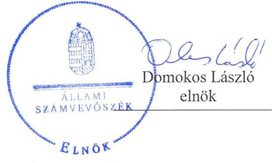
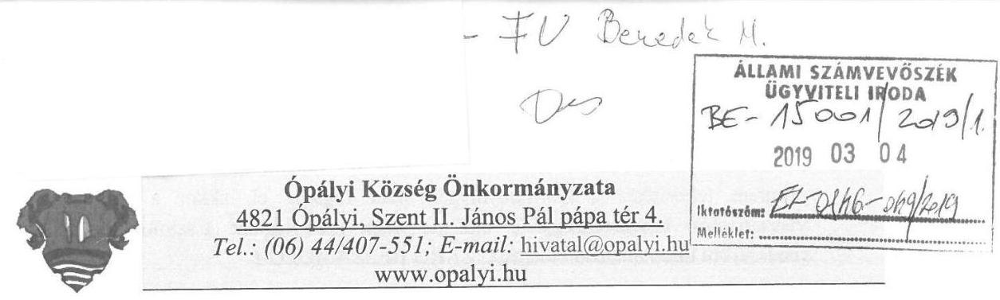
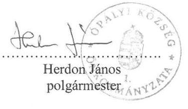
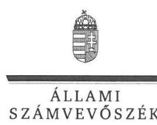
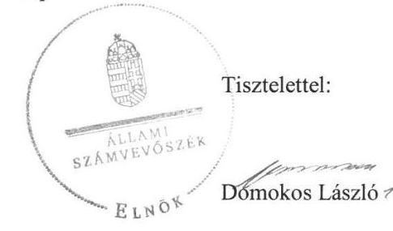

ÁLLAMI
SZÁMVEVŐSZÉK

# Jelentés 

## Önkormányzatok ellenőrzése Integritás és belső kontrollrendszer

Ópályi Község Önkormányzata 2019.

---

# Jelentés 

## Önkormányzatok ellenőrzése Integritás és belső kontrollrendszer

Ópályi Község Önkormányzata
2019. 05. hó 29. nap

---

# AZ ELLENŐRZÉST FELÜGYELTE:

DR. BENEDEK MÁRIA felügyeleti vezető

## AZ ELLENŐRZÉST VEZETTE ÉS A VÉGREHAJTÁSÁÉRT FELELŐS:

KUSZINGER ANDREA ellenőrzésvezető

## A PROGRAM ÖSSZEÁLLÍTÁSÁÉRT FELELŐS:

TÓTPÁL SZABOLCS osztályvezető

IKTATÓSZÁM: EL-0846-052/2019

TÉMASZÁM: 16.

ELLENŐRZÉS-AZONOSÍTÓ SZÁM: V082924

Jelentéseink az Országgyűlés számítógépes hálózatán és az Interneten a www.asz.hu címen is olvashatóak.

---

# TARTALOMJEGYZÉK 

■ ÖSSZEGZÉS ..... 5
■ AZ ELLENŐRZÉS CÉLJA ..... 6
■ AZ ELLENŐRZÉS TERÜLETE ..... 7
■ AZ ELLENŐRZÉS HÁTTERE, INDOKOLTSÁGA ..... 8
■ A JELENTÉS LÉNYEGES KÉRDÉSKÖREI ..... 9
■ AZ ELLENŐRZÉS HATÓKÖRE ÉS MÓDSZEREI ..... 10
■ MEGÁLLAPÍTÁSOK ..... 12
■ JAVASLATOK ..... 16
■ MELLÉKLETEK ..... 21
I. sz. melléklet: Értelmező szótár ..... 21
■ FÜGGELÉKEK ..... 23
I. sz. függelék a Jelentéshez ..... 23
II. sz. függelék: Észrevételek ..... 24
■ RÖVIDÍTÉSEK JEGYZÉKE ..... 33

---

.

---

# ÖSSZEGZÉS 

Ópályi Község Önkormányzata belső kontrollrendszerének működtetése nem volt szabályszerű, ezáltal a közpénzekkel, a nemzeti vagyonnal való elszámoltatható, felelős gazdálkodás nem volt biztosított. Az integritás kontrollrendszert nem működtette, így nem biztosította az integritás-tudatos működést.

## Az ellenőrzés társadalmi indokoltsága

Az önkormányzatok vagyona a nemzeti vagyon része, és az Alaptörvény is rögzíti, hogy a vagyonnal való gazdálkodás célja a közérdek szolgálata, ezért az önkormányzatok felé elvárás a kiegyensúlyozott, átlátható és fenntartható költségvetési gazdálkodás elvének érvényesítése, továbbá a nemzeti vagyonnal való rendeltetésszerű és felelős módon való gazdálkodás. Az Állami Számvevőszék törvényben kapott felhatalmazással élve ellenőrzi az önkormányzatok gazdálkodását, működését, hogy az ellenőrzések megállapításaival támogassa az ellenőrzött önkormányzatok szabályszerű gazdálkodását, javaslataival elősegítse az Alaptörvényben megfogalmazott alapvetések érvényesülését a mindennapi életben az önkormányzatok szintjén. Az Állami Számvevőszék stratégiájában megfogalmazottak szerint támogatja az integritás alapú, átlátható és elszámoltatható közpénzfelhasználás megteremtését. Mindezekre tekintettel, a közpénzzel gazdálkodó szervezetek esetében a belső kontrollrendszer megfelelő kialakítása és működtetése ellenőrzését prioritásként kezeli az Állami Számvevőszék.

Az Állami Számvevőszék Ópályi Község Önkormányzatát korábban nem ellenőrizte.

## Főbb megállapítások, következtetések, javaslatok

Ópályi Község Önkormányzata belső kontrollrendszerének működtetése nem volt szabályszerű. A jegyző által készített szervezeti és működési szabályzat nem tartalmazta a szervezeti ábrát, a képviselő-testület nem fogadta el a gazdasági programot. A hivatásetikai alapelvek részletes tartalmát a képviselő-testület nem állapította meg, a jegyző integrált kockázatkezelési szabályzatot nem készített, illetve a szervezeti integritást sértő események eljárásrendjét nem szabályozta, így nem biztosította a szabályszerű működés követelményeinek érvényesülését. A jegyző a teljesítménymérés feltételeit nem alakította ki, ezáltal nem biztosította a szabályszerű, hatékony, gazdaságos és eredményes közpénzfelhasználást.

A jegyző a gazdálkodás részletes rendjét szabályozta, azonban a gazdálkodási jogkörök gyakorlása nem volt szabályszerű. A pénzügyi-számviteli szabályozás nem volt szabályszerű, mivel a polgármester Ópályi Község Önkormányzata számlarendjének elkészítéséről nem gondoskodott és a jegyző a számviteli politikát nem a jogszabályi előírások szerinti tartalommal készítette el, ezáltal nem biztosította az elszámoltathatóságot.

A jegyző az államháztartás információs rendszerébe történő adatszolgáltatási kötelezettségének nem tett eleget, ezáltal nem biztosította a közpénzekkel történő átlátható gazdálkodást.

A jegyző a belső ellenőrzést nem szabályszerűen működtette, a szervezeti célok megvalósításának nyomon követését nem biztosította. Az éves ellenőrzési tervet nem hagyta jóvá, valamint a belső ellenőrzésekről nem vezetett nyilvántartást. A belső kontrollrendszer működtetése során feltárt hiányosságok és szabálytalanságok nem biztosították a közpénzekkel, a nemzeti vagyonnal való elszámoltatható, felelős gazdálkodást.

A jegyző az integritás kontrollrendszert nem működtette, mivel a követendő értékek között nem fogalmazta meg az integritás erősítését és a kockázatok kezelésének szükségességét, illetve kockázatelemzést nem végzett, így az integritás tudatos működést nem biztosította.

Az Állami Számvevőszék az ellenőrzés megállapításai alapján Ópályi Község Önkormányzata polgármesterének hat javaslatot, jegyzőjének tizenhét javaslatot fogalmazott meg.

---

# AZ ELLENŐRZÉS CÉLJA 

Az ellenőrzés célja annak megállapítása volt, hogy az önkormányzat belső kontrollrendszere biztosította-e a közpénzekkel és a nemzeti vagyonnal történő elszámoltatható, átlátható, szabályszerű, gazdaságos, hatékony és eredményes gazdálkodás feltételeit. Az ellenőrzés értékelte továbbá, hogy az önkormányzatnál kiépítették és erősítették-e a korrupciós kockázatok kezelését szolgáló integritás kontrollokat és azt, hogy megteremtették-e a teljesítményellenőrzés feltételeit.

---

# AZ ELLENŐRZÉS TERÜLETE 

## Ópályi Község Önkormányzata

Ópályi község az Észak-Alföldi régióban, Szabolcs-Szatmár-Bereg megyében a Mátészalkai járásban fekszik. Állandó lakosainak száma a $\mathrm{KSH}^{1}$ Magyarország közigazgatási helynévkönyve alapján 2018. január 1-én 3084 fő volt.

A polgármester² 2017. március 5-től tölti be tisztségét, a jegyző ${ }^{3}$ 2017. november 16-tól látja el feladatait. 2017-ben a polgármester személyében változás nem történt, a jegyző személye négy alkalommal, 2017. február 13-án, 2017. május 2-án, 2017. szeptember 21-én és 2017. november 16-án változott. A 2017. évben Ópályi Község Önkormányzata Képviselőtestülete ${ }^{4}$ hét főből állt, munkáját két bizottság, a Pénzügyi Bizottság és a Humán Bizottság támogatta.

A 2017. évben Ópályi Község Önkormányzatánál a gazdálkodási feladatokat Ópályi Polgármesteri Hivatal látta el.
2016. december 6-án a 2014-ben megválasztott képviselő-testület a 174/2016 (12.06.) számú határozatával döntött megbízatásának lejárta előtti feloszlatásáról, az időközi önkormányzati választásokra 2017. március 5-én került sor. Az új képviselő-testület alakuló ülését 2017. március 13-án tartotta meg.

Ópályi Község Önkormányzata 2017. évi konszolidált éves beszámolójában foglaltak szerint 1131,8 millió Ft költségvetési bevételt ért el, és 874,2 millió Ft költségvetési kiadást teljesített. 2017. december 31-én a könyvviteli mérleg szerinti befektetett eszközvagyon értéke 1430,7 millió Ft, a követelések értéke 9,4 millió Ft, a kötelezettségek értéke 21,4 millió Ft, amelyből jelentős volt a 4,0 millió Ft éven belüli és a 16,4 millió Ft éven túli kötelezettségek állománya.

Ópályi Község Önkormányzata a 2017. évben a polgármesteri hivatalon kívül két intézménnyel látta el feladatát.

---

# AZ ELLENŐRZÉS HÁTTERE, INDOKOLTSÁGA 

Az ÁSZ ${ }^{5}$ - az ÁSZ tv. ${ }^{6}$ felhatalmazásával élve - ellenőrzi az önkormányzatok gazdálkodását, működését, hogy az ellenőrzések megállapításaival támogassa az ellenőrzött önkormányzatok szabályszerű gazdálkodását, javaslataival elősegítse az Alaptörvényben megfogalmazott alapvetések érvényesülését a mindennapi életben az önkormányzatok szintjén. Az önkormányzati rendszerben zajló folyamatok holisztikus elemzései, a kockázatok folyamatos figyelemmel kísérésének módszerével, az így kiválasztott önkormányzatok célzott, hatékony ellenőrzéseivel az ÁSZ betölti a legfőbb gazdasági ellenőrző szerv küldetését. Az egyes ellenőrzések megállapításaival és egy időszak ellenőrzési eredményeinek elemzésével az Állami Számvevőszék ráirányíthatja a jogalkotók figyelmét az önkormányzati alrendszerben esetlegesen felmerülő pénzügyi, szabályozási feszültségekre.

Az elvégzett nagyszámú ellenőrzés során az ÁSZ „jó gyakorlatokat" is azonosíthat, melyeket tanácsadó funkciója keretében szélesebb körben is megismertethet az érintettekkel, ezáltal is hozzájárulva az önkormányzati alrendszer szabályozott, átlátható, kiegyensúlyozott és fenntartható működéséhez.

A belső kontrollrendszer kialakítása és működtetése nélkül nem valósítható meg a közpénzek, a közvagyon átlátható, szabályos, gazdaságos, hatékony és eredményes felhasználása. A belső kontrollrendszer azt a célt szolgálja, hogy a költségvetési szervek működésük és gazdálkodásuk során a tevékenységeket szabályszerűen hajtsák végre, teljesítsék elszámolási kötelezettségeiket és megvédjék az erőforrásokat a veszteségektől, a károktól és a nem rendeltetésszerű használattól. A belső kontrollrendszer magában foglalja mindazon elveket, eljárásokat és belső szabályzatokat, melyek biztosítják, hogy a költségvetési szerv valamennyi tevékenysége és célja összhangban legyen a szabályszerűséggel, szabályozottsággal, valamint a gazdaságosság, hatékonyság és eredményesség követelményeivel, az eszközökkel és forrásokkal való gazdálkodásban ne kerüljön sor pazarlásra, visszaélésre, rendeltetésellenes felhasználásra. Megfelelő, pontos és naprakész információk álljanak rendelkezésre a költségvetési szerv működésével kapcsolatosan, és a belső kontrollrendszer harmonizációjára, összehangolására vonatkozó jogszabályok végrehajtásra kerüljenek. Az integritás kontrollok kiépítése, erősítése a szervezet korrupciós kockázatainak kezelését szolgálja. A teljesítménykövetelmények meghatározása és működtetése megalapozhatja az önkormányzatoknál a teljesítményellenőrzés lefolytatását.

---

# A JELENTÉS LÉNYEGES KÉRDÉSKÖREI 

1. Az önkormányzat belső kontrollrendszerének működtetése szabályszerű volt-e?
2. Az önkormányzat kiépítette és erősítette-e az integritás kontrollrendszerét?
3. Az önkormányzatnál alakítottak-e ki a teljesítmény mérésére alkalmas követelményeket?

---

# AZ ELLENŐRZÉS HATÓKÖRE ÉS MÓDSZEREI 

## Az ellenőrzés típusa

Megfelelőségi ellenőrzés.

## Az ellenőrzött időszak

Az ellenőrzött időszak a 2017. év, illetve az éves költségvetési beszámoló Áht. ${ }^{7}$ által megállapított jóváhagyásáig (2018. május 31-éig) tartó időszak volt.

## Az ellenőrzés tárgya

Az önkormányzat és a gazdálkodási feladatokat ellátó hivatala belső kontrollrendszerének kialakítása és működtetése, valamint az integritás kontrollok kiépítettsége, a teljesítményellenőrzés feltételeinek ellenőrzése volt.

## Az ellenőrzött szervezet

Ópályi Község Önkormányzata

## Az ellenőrzés jogalapja

Az ellenőrzés jogszabályi alapját az ÁSZ tv . 1. § (3) bekezdés, 5. § (2) és (6) bekezdései, valamint az Áht . 61. § (2) bekezdésének előírásai képezik.

## Az ellenőrzés módszerei

Az ÁSZ az ellenőrzést az ellenőrzési program szempontjai, az ellenőrzött időszakban hatályos jogszabályok, az ellenőrzés szakmai szabályai, a jelen ellenőrzésre irányadó ÁSZ módszertanok figyelembevételével hajtotta végre.

Az ellenőrzési kérdések megválaszolásához szükséges bizonyítékok megszerzése az ellenőrzött által rendelkezésre bocsátott dokumentumokra, adatokra alapozva megfigyelés, szemle (szemrevételezés), kérdésfeltevés (információkérés), mintavételezés, valamint elemző eljárás útján történt. Az ellenőrzési bizonyítékként felhasználható adatforrások közé

---

tartoztak egyrészt az ellenőrzési program részletes szempontjainál felsorolt adatforrások, másrészt minden - az ellenőrzés folyamán feltárt, az ellenőrzés szempontjából információt tartalmazó - dokumentum.

Az ellenőrzés lefolytatásához az ellenőrzött szervezet tanúsítványok kitöltésével, valamint az ÁSZ által kért dokumentumok megküldésével szolgáltatott adatokat, amelyek valódiságát és teljes körűségét az ellenőrzött szervezet vezetője által tett teljességi és hitelességi nyilatkozat igazolta. A rendelkezésre bocsátott adatok, információk kontrollja az ellenőrzés keretében megtörtént.

Az önkormányzat belső kontrollrendszere egyes pilléreinek kialakítására és működtetésére vonatkozó értékelés „szabályszerű", amennyiben az értékelt területen az elért „igen" válaszok százalékban kifejezett, egész számra kerekített aránya legalább 85 %, „nem szabályszerű", ha nem éri el a 85 %-ot.

Az önkormányzat belső kontrollrendszerének összesített értékelése az egyes részterületek esetében kapott megfelelőségi arányok számtani átlaga alapján történik és megegyezik a pillérenként (kontrollterületenként) alkalmazott százalékos értékelésekkel, a következő eltérésekkel: a kontrollrendszer egésze esetében a „szabályszerű" értékelésnek a százalékos értéken felül további feltétele, hogy egyik kontrollterület sem kaphat „nem szabályszerű" értékelést.

A mintavétel módszere lényeges sokaságon alapuló véletlen mintavétel. A 2017. évi kiadások teljesítéséhez kapcsolódó pénzgazdálkodási belső kontrollok működésének szabályszerűsége esetében az ellenőrzés azokra a legnagyobb értékű tételekre - a lényeges sokaságra - terjedt ki, melyek összértéke elérte a teljes sokaság összértékének 50%-át.

Az ÁSZ az ellenőrzés ideje alatt az ellenőrzött szervezettel történő kapcsolattartást az ÁSZ SZMSZ ${ }^{8}$-ének vonatkozó előírásai alapján biztosította.

---

# 1. Az önkormányzat belső kontrollrendszerének működtetése szabályszerű volt-e? 

## Összegző megállapítás

Az Önkormányzat ${ }^{9}$ belső kontrollrendszerének működtetése nem volt szabályszerű.

A kontrollkörnyezet kialakítása nem volt szabályszerű.
Az Önkormányzat Képviselő-testülete megalkotta az Önkormányzati SZMSZ ${ }^{10}$-t. A Hivatal ${ }^{11}$ rendelkezett alapító okirattal ${ }^{12}$, illetve Hivatali SZMSZ ${ }^{13}$-vel. Az Önkormányzat rendelkezett értékelési szabályzattal ${ }^{14}$, leltározási szabályzattal ${ }^{15}$ és pénzkezelési szabályzattal ${ }^{16}$, valamint önköltségszámítási szabályzattal ${ }^{17}$.

A kontrollkörnyezet kialakításával kapcsolatosan feltárt szabálytalanságokat az 1. táblázat mutatja be.

## A KONTROLLKÖRNYEZET KIALAKÍTÁSÁVAL KAPCSOLATOSAN FELTÁRT SZABÁLYTALANSÁGOK

| Sorszám | Részmegállapítás | Megjegyzés |
| :--: | :--: | :--: |
| 1. | A jegyző által készített Hivatali SZMSZ az Ávr.
 ${ }^{18}$ 13. § (1) bekezdés e) és g) pontjában foglaltak ellenére nem tartalmazta a szervezeti ábrát, valamint a nevesített munkakörök közül a hivatalsegéd feladat- és hatáskörét, a hatáskörök gyakorlásának módját és az ezekhez kapcsolódó felelősségi szabályokat. | A helyettesítés rendjét a Hivatali SZMSZ tartalmazta. |
| 2. | Az Önkormányzat képviselő-testülete a Kttv. ${ }^{19}$ 231. § (1) bekezdésben foglaltak ellenére a hivatásetikai alapelvek részletes tartalmát, valamint az etikai eljárás szabályait nem állapította meg. |  |
| 3. | A jegyző a Bkr. 3. § b) pontjában foglaltak ellenére nem alakított ki a belső kontrollrendszer keretében - a szervezet minden szintjén érvényesülő - megfelelő integrált kockázatkezelési rendszert. |  |
| 4. | A jegyző a Bkr. ${ }^{20}$ 6. § (4) bekezdésében előírtak ellenére a szervezeti integritást sértő események kezelésének eljárásrendjét ${ }^{21}$ nem szabályozta az Önkormányzatnál. |  |
| 5. | Az Önkormányzat képviselő-testülete az Mötv. ${ }^{22}$ 116. § (5) bekezdésében előírtak ellenére alakuló ülését követő hat hónapon belül nem fogadta el a gazdasági programot ${ }^{23}$. | Az Önkormányzat Képviselő-testülete az alakuló ülését követő hat hónapon túl sem fogadta el a gazdasági programot. |
| 6. | A polgármester a Kttv. 75. § (1) bekezdés d) pontjában foglaltak és az Mötv. 67. § (1) bekezdés f) pontjában foglalt munkáltatói jogkörgyakorlása ellenére a jegyző feladatait és a munkakör betöltésével kapcsolatos körülményeket munkaköri leírásban nem rögzítette a 2017. november 16-tól hivatalban lévő jegyző tekintetében. |  |
| 7. | A jegyző a Vnytv. ${ }^{24}$ 4. § a) pontjában előírtak ellenére a Hivatali SZMSZ-ben nem tüntette fel a vagyonnyilatkozat-tételi kötelezettséggel járó munkaköröket. |  |
| 8. | A jegyző az Ávr. 13. § (2) bekezdés g) pontjában foglaltak ellenére belső szabályzatban nem rendezte a vezetékes- és mobiltelefonok használatát. |  |
| 9. | A jegyző a Számv. tv. ${ }^{25}$ 14. § (4) bekezdésben foglaltak ellenére a számviteli politikában ${ }^{26}$ írásban nem rögzítette azokat a gazdálkodóra jellemző szabályokat, elő- |  |

---

| Sorszám | Részmegállapítás | Megjegyzés |
| :--: | :--: | :--: |
|  | írásokat, módszereket, amelyekkel meghatározza, hogy mit tekint a számviteli elszámolás, az értékelés szempontjából lényegesnek, nem lényegesnek, illetve az alkalmazott gyakorlatot milyen okok miatt kell megváltoztatni. |  |
| 10. | A polgármester a Számv. tv. 161. § (4) bekezdésben foglaltak ellenére nem gondoskodott az Önkormányzat számlarendjének összeállításáról. |  |
| 11. | A jegyző által elkészített Hivatalra hatályos számlarend ${ }^{27}$ a Számv. tv. 161. § (2) bekezdés d) pontjában előírtak ellenére nem tartalmazta a számlarendben foglaltakat alátámasztó bizonylati rendet. |  |
| 12. | A jegyző az Ltv. ${ }^{28}$ 10. § (1) bekezdés c) pontjában foglaltak szerinti egyedi iratkezelési szabályzatot nem adott ki. |  |

Az integrált kockázatkezelési rendszer működtetése nem volt szabályszerű.
Az integrált kockázatkezelési rendszer működtetésével kapcsolatosan feltárt szabálytalanságot a 2. táblázat mutatja be.
2. táblázat

# AZ INTEGRÁLT KOCKÁZATKEZELÉSI RENDSZER MŰKÖDTETÉSÉVEL KAPCSOLATOSAN FELTÁRT SZABÁLYTALANSÁG 

Sorszám Részmegállapítás
Megjegyzés

1. A jegyző a Bkr. 7. § (1) bekezdésében foglaltak ellenére nem működtetett integrált kockázatkezelési rendszert.

Forrás: ÁSZ

A kontrolltevékenységek működtetése nem volt szabályszerű.
Az Önkormányzat rendelkezett gazdálkodási szabályzattal ${ }^{29}$.
A kontrolltevékenységek működtetésével kapcsolatos szabálytalanságokat a 3. táblázat mutatja be.
3. táblázat

## A KONTROLLTEVÉKENYSÉGEK MŰKÖDTETÉSÉVEL KAPCSOLATOS SZABÁLYTALANSÁGOK

Sorszám Részmegállapítás
Megjegyzés

1. A polgármester az Áht. 37. § (1) bekezdésében foglaltak ellenére írásban nem vállalt kötelezettséget, ezáltal a polgármester a Számv. tv. 165. § (1) bekezdésében foglaltak ellenére nem állított ki a könyvviteli elszámolást közvetlenül alátámasztó számviteli bizonylatokat.
2. A jegyző a Számv. tv. 165. § (2) bekezdésében foglaltak ellenére a számviteli (könyvviteli) nyilvántartásokba szabályszerűen kiállított bizonylatok nélkül jegyzett be adatokat.
3. A polgármester a teljesítésigazolás során az Ávr. 57. § (1) bekezdésében foglaltak ellenére az Önkormányzat kiadási előirányzatainak terhére vállalt kötelezettségek vonatkozásában ellenőrizhető okmányok alapján nem ellenőrizte és nem igazolta a kiadások teljesítésének jogosságát, összegszerűségét, annak teljesítését.

Forrás: ÁSZ

Az információs és kommunikációs rendszer működtetése nem volt szabályszerű. A jegyző elkészítette az adatvédelmi szabályzatot ${ }^{30}$. Az Önkormányzat rendelkezett a közérdekű adatok megismerésére vonatkozó szabályzattal ${ }^{31}$.

Az információs és kommunikációs rendszer működtetése során feltárt szabálytalanságokat a 4. táblázat mutatja be.

---

# AZ INFORMÁCIÓS ÉS KOMMUNIKÁCIÓS RENDSZER MŰKÖDTETÉSE SORÁN FELTÁRT SZABÁLYTALANSÁGOK 

| Sorszám | Részmegállapítás | Megjegyzés |
| :--: | :--: | :--: |
| 1. | A jegyző a Bkr. 9. § (1)-(2) bekezdése ellenére nem működtetett olyan rendszereket, amelyek biztosítják, hogy a megfelelő információk a megfelelő időben eljussanak az illetékes szervezethez, szervezeti egységhez, illetve személyhez, valamint a beszámolási rendszerek hatékony, megbízható, pontos és összehasonlítható működése érdekében nem határozta meg világosan a beszámolási szinteket, határidőket és módokat. |  |
| 2. | A jegyző az Info. tv. ${ }^{32}$ 37. § (1) bekezdésében hivatkozott 1. melléklete szerinti általános közzétételi lista II/1.,3.,8.,9.,11., 13. valamint a III/2. pontjaiban meghatározott adatokat nem tette közzé. | A jegyző az Info tv. 37. § (1) bekezdésében hivatkozott 1. melléklete szerinti általános közzétételi lista II/13. pontja esetében a közérdekű adatok megismerésére irányuló igények teljesítésének rendjét, az illetékes szervezeti egység nevét, elérhetőségét nem tette közzé. |
| 3. | A jegyző az Áht. 108. § (1) bekezdés a) pontjában előírtak ellenére az elemi költségvetésről és az éves költségvetési beszámolóról az államháztartás információs rendszere keretében adatszolgáltatást nem teljesített a Kincstár ${ }^{33}$ számára. |  |
| 4. | A jegyző az Ávr. 169.§ (3) bekezdésben előírtak ellenére az időközi költségvetési jelentést nem töltötte fel a Kincstár által működtetett elektronikus adatszolgáltató rendszerbe. |  |
| 5. | A jegyző az Ávr. 170. § (2) bekezdésében foglaltak ellenére az időközi mérlegjelentést nem töltötte fel a Kincstár által működtetett elektronikus adatszolgáltató rendszerbe. |  |

A belső ellenőrzés működtetése nem volt szabályszerű. A jegyző a Bkr. 1. melléklete szerinti nyilatkozatban értékelte az Önkormányzat belső kontrollrendszerének minőségét. Az ÁSZ ellenőrzés megállapításai nem támasztották alá a nyilatkozatban foglaltakat.

A monitoring és a belső ellenőrzés működtetésével kapcsolatban feltárt szabálytalanságokat az 5. táblázat szemlélteti.
5. táblázat

## A MONITORING ÉS A BELSŐ ELLENŐRZÉS MŰKÖDTETÉSÉVEL KAPCSOLATBAN FELTÁRT SZABÁLYTALANSÁGOK

Sorszám : : Részmegállapítás
Megjegyzés

1. A belső ellenőrzési vezető a Bkr. 29. § (1) bekezdésben foglaltak ellenére nem kockázatelemzés alapján készítette el az éves ellenőrzési tervet, amelyet a jegyző nem hagyott jóvá.
2. A belső ellenőrzési vezető a Bkr. 47. § (1) bekezdésében foglaltak ellenére éves bontásban nem vezetett nyilvántartást, amellyel a belső ellenőrzési jelentésekben tett megállapításokat, javaslatokat, vonatkozó intézkedési terveket, és azok végrehajtását nyomon követi.
3. A jegyző a Bkr. 3. § e) pontjában foglaltak ellenére a belső kontrollrendszer keretében - a szervezet minden szintjén érvényesülő - megfelelő nyomon követési rendszert (monitoring) nem működtetett.

---

# 2. Az önkormányzat kiépítette és erősítette-e az integritás kontrollrendszerét? 

## Összegző megállapítás

Az Önkormányzat az integritás kontrollrendszert nem működtette.

A jogszabályok által kötelezően előírt szabályzatok nem a jogszabályi előírások szerinti tartalommal készültek, amely nem támogatta a szervezet integritás elvű működését. Az integritás szemlélet érvényesülését gátolta, hogy az Önkormányzat a hosszú távú célok meghatározásakor az integritás erősítését és a kockázatok kezelésének szükségességét nem rögzítette. Az Önkormányzat kockázatelemzést nem végzett, valamint nem működtetett az integritást erősítő, jogszabály által elő nem írt kontrollokat.

## 3. Az önkormányzatnál alakítottak-e ki a teljesítmény mérésére alkalmas követelményeket?

Összegző megállapítás
Az Önkormányzatnál nem alakítottak ki a teljesítmény mérésére alkalmas követelményeket.

A szervezeti célok elérését szolgáló feladatok, folyamatok, tevékenységek mérését szolgáló indikátorokat, mérőszámokat, feladat- és teljesítménymutatókat az Önkormányzat nem képzett, így nem biztosította a teljesítménymérés lehetőségét.

---

# JAVASLATOK 

Az ÁSZ tv. 33. § (1) bekezdésében foglaltak értelmében az ellenőrzött szervezet vezetője köteles a jelentésben foglalt megállapításokhoz kapcsolódó intézkedési tervet összeállítani és azt a jelentés kézhezvételétől számított 30 napon belül az ÁSZ részére megküldeni. Amennyiben az ellenőrzött szervezet vezetője nem küldi meg határidőben az intézkedési tervet, vagy továbbra sem elfogadható intézkedési tervet küld, az Állami Számvevőszék elnöke az ÁSZ tv. 33. § (3) bekezdése a) és b) pontjaiban foglaltakat érvényesítheti.

## a polgármesternek:

1. Intézkedjen arról, hogy a Kttv. előírásainak megfelelően a Képviselőtestület a Hivatal köztisztviselőire irányadó hivatásetikai alapelvek részletes tartalmát, valamint az etikai eljárás szabályait állapítsa meg.
(1. táblázat 2. sz. megállapítás alapján)
2. Intézkedjen a Mötv.-ben előírtak alapján a Kttv.-ben foglaltaknak megfelelően a jegyző feladatainak és a munkakör betöltésével kapcsolatos követelményeknek munkaköri leírásban történő rögzítéséről.
(1. táblázat 6. sz. megállapítás alapján)
3. Intézkedjen a Számv. tv.-ben előírtak alapján az Önkormányzat számlarendjének összeállításáról.
(1. táblázat 10. sz. megállapítás alapján)
4. Az Áht. előírásának megfelelően kötelezettséget csak pénzügyi ellenjegyzés után, a pénzügyi teljesítés esedékességét megelőzően írásban vállaljon, továbbá a Számv. tv. előírásainak megfelelően minden gazdasági műveletről, eseményről, amely az eszközök, illetve az eszközök forrásainak állományát vagy összetételét megváltoztatja, bizonylatot állítson ki (készítsen).
(3. táblázat 1. sz. megállapítás alapján)
5. A teljesítésigazolás során az Ávr.-ben előírtaknak megfelelően az Önkormányzat kiadási előirányzatai terhére vállalt kötelezettségek vonatkozásában ellenőrizhető okmányok alapján ellenőrizze és igazolja a kiadások teljesítésének jogosságát, összegszerűségét, annak teljesítését.
(3. táblázat 3. sz. megállapítás alapján)

---

6. Intézkedjen az Állami Számvevőszék ellenőrzése során feltárt hiányosságok és/vagy szabálytalanságok tekintetében a munkajogi felelősség tisztázására irányuló eljárás megindításáról, és ennek eredménye ismeretében tegye meg a szükséges intézkedéseket.
(1. táblázat 1., 3-4., 7-9., 11-12., 2. táblázat 1., 3. táblázat 2. második megállapítás, 4. táblázat 1-5., 5. táblázat 3. sz. megállapítás alapján)

# a jegyzőnek 

1. Intézkedjen arról, hogy a szervezeti és működési szabályzat tartalmazza az Ávr.-ben előírt szervezeti ábrát, a nevesített munkakörök közül a hivatalsegéd feladat- és hatáskörét, a hatáskörök gyakorlásának módját, és az ezekhez kapcsolódó felelősségi szabályokat.
(1. táblázat 1. sz. megállapítás alapján)
2. Alakítsa ki a Bkr. előírásainak megfelelően a belső kontrollrendszer keretében a szervezet minden szintjén érvényesülő integrált kockázatkezelési rendszert, és intézkedjen annak működtetéséről.
(1. táblázat 3. sz. megállapítás alapján, 2. táblázat 1. sz. megállapítás alapján)
3. Szabályozza a Bkr. előírásainak megfelelően a szervezeti integritást sértő események kezelésének eljárásrendjét.
(1. táblázat 4. sz. megállapítás alapján)
4. Intézkedjen a Vnytv.-ben előírtak szerint a vagyonnyilatkozat-tételi kötelezettséggel járó munkakörök Hivatali SZMSZ-ben való feltüntetéséről.
(1. táblázat 7. sz. megállapítás alapján)
5. Rendezze az Ávr.-ben foglaltak szerint belső szabályzatban a vezetékes- és mobiltelefonok használatát.
(1. táblázat 8. sz. megállapítás alapján)

---

6. Intézkedjen arról, hogy a Számv. tv. előírásának megfelelően a számviteli politika keretében írásban rögzítésre kerüljenek azok a gazdálkodóra jellemző szabályok, előírások, módszerek, amelyekkel meghatározzák, hogy mit tekintenek a számviteli elszámolás, az értékelés szempontjából lényegesnek, nem lényegesnek, továbbá az
 alkalmazott gyakorlatot milyen okok miatt kell megváltoztatni.
(1. táblázat 9. sz. megállapítás alapján)
7. Intézkedjen arról, hogy a Számv. tv. előírásának megfelelően a Hivatal számlarendje tartalmazza a számlarendben foglaltakat alátámasztó bizonylati rendet.
(1. táblázat 11. sz. megállapítás alapján)
8. Intézkedjen egyedi iratkezelési szabályzat Ltv. előírásának megfelelően a Magyar Nemzeti Levéltárral és a megyei kormányhivatallal egyetértésben történő kiadásáról.
(1. táblázat 12. sz. megállapítás alapján)
9. Intézkedjen arról, hogy a Számv. tv. előírásainak megfelelően az adatokat a számviteli (könyvviteli) nyilvántartásokba csak szabályszerűen kiállított bizonylat alapján jegyezzék be.
(3. táblázat 2. sz. megállapítás alapján)
10. Intézkedjen a Bkr. előírásának megfelelően olyan rendszerek kialakításáról és működtetéséről, melyek biztosítják, hogy a megfelelő információk a megfelelő időben eljussanak az illetékes szervezethez, szervezeti egységhez, illetve személyhez, továbbá az információs rendszerek keretében a beszámolási rendszerek működtetéséről úgy, hogy azok hatékonyak, megbízhatóak, pontosak és összehasonlíthatóak legyenek, a beszámolási szintek, határidők és módok világosan meg legyenek határozva.
(4. táblázat 1. sz. megállapítás alapján)
11. Intézkedjen az Info. tv. előírásának megfelelően az 1. melléklet szerinti általános közzétételi listában meghatározott adatok közül a II./1., 3., 8., 9., 11., 13., valamint a III./2. pontokban meghatározott adatok közzétételéről.
(4. táblázat 2. sz. megállapítás alapján)

---

12. Intézkedjen az Áht.-ban előírtaknak megfelelően az elemi költségvetésről és az éves költségvetési beszámolóról az államháztartás információs rendszere keretében történő adatszolgáltatás teljesítéséről a Kincstár számára.
(4. táblázat 3. sz. megállapítás alapján)
13. Intézkedjen az időközi költségvetési jelentésnek az Ávr. előírása szerinti határidőben a Kincstár által működtetett elektronikus adatszolgáltató rendszerbe történő feltöltéséről.
(4. táblázat 4. sz. megállapítás alapján)
14. Intézkedjen az időközi mérlegjelentésnek az Ávr. előírása szerinti határidőben a Kincstár által működtetett elektronikus adatszolgáltató rendszerbe történő feltöltéséről.
(4. táblázat 5. sz. megállapítás alapján)
15. Gondoskodjon arról, hogy a belső ellenőrzési vezető a Bkr. előírásának megfelelően kockázatelemzés alapján készítse el az éves ellenőrzési tervet, amelyet a költségvetési szerv vezetőjeként hagyjon jóvá.
(5. táblázat 1. sz. megállapítás alapján)
16. Intézkedjen arról, hogy a Bkr. előírásának megfelelően a belső ellenőrzési vezető éves bontásban nyilvántartást vezessen, amellyel a belső ellenőrzési jelentésekben tett megállapításokat, javaslatokat, a vonatkozó intézkedési terveket és azok végrehajtását nyomon követi.
(5. táblázat 2. sz. megállapítás alapján)
17. Intézkedjen arról, hogy a Bkr. előírása szerint a belső kontrollrendszer esetében a szervezet minden szintjén érvényesülő megfelelő nyomon követési (monitoring) rendszert működtesse.
(5. táblázat 3. sz. megállapítás alapján)

---

.

---

# MELLÉKLETEK 

- I. SZ. MELLÉKLET: ÉRTELMEZŐ SZÓTÁR
belső ellenőrzés
belső kontrollrendszer
belső kontrollrendszer területei
információs és kommunikációs rendszer
integrált kockázatkezelési rendszer
integritás
kockázat
kontrollkörnyezet
kontrolltevékenységek
kommunikáció
önkormányzati hivatal

Független, tárgyilagos bizonyosságot adó és tanácsadó tevékenység, amelynek célja, hogy az ellenőrzött szervezet működését fejlessze és eredményességét növelje, az ellenőrzött szervezet céljai elérése érdekében rendszerszemléletű megközelítéssel és módszeresen értékeli, illetve fejleszti az ellenőrzött szervezet irányítási és belső kontrollrendszerének hatékonyságát. (Forrás: Bkr. 2. § b) pontja)
A belső kontrollrendszer a kockázatok kezelése és tárgyilagos bizonyosság megszerzése érdekében kialakított folyamatrendszer, amely azt a célt szolgálja, hogy a működés és gazdálkodás során a tevékenységeket szabályszerűen, gazdaságosan, hatékonyan, eredményesen hajtsák végre, az elszámolási kötelezettségeket teljesítsék, megvédjék az erőforrásokat a veszteségektől, károktól és nem rendeltetésszerű használattól. (Forrás: Áht. 69. § (1) bekezdése)
A kontrollkörnyezet, az integrált kockázatkezelési rendszer, a kontrolltevékenységek, az információs és kommunikációs rendszer, valamint a nyomon követési (monitoring) rendszer. (Forrás: Bkr. 3. §-a)
A költségvetési szerv vezetője által kialakított és működtetett olyan rendszer, mely biztosítja, hogy a megfelelő információk a megfelelő időben eljutnak az illetékes szervezethez, szervezeti egységhez, illetve személyhez. (Forrás: Bkr. 9. § (1) bekezdés)
Olyan folyamatalapú kockázatkezelési rendszer, amely a szervezet minden tevékenységére kiterjed, egységes módszertan és eljárások alkalmazásával, a szervezet célkitűzéseinek és értékeinek figyelembevételével biztosítja a szervezet kockázatainak teljes körű azonosítását, azok meghatározott kritériumok szerinti értékelését, valamint a kockázatok kezelésére vonatkozó intézkedési terv elkészítését és az abban foglaltak nyomon követését. (Forrás: Bkr. 2. § m) pontja, 2016. október 1-jétől)
Az integritás az elvek, értékek, cselekvések, módszerek, intézkedések konzisztenciáját jelenti, vagyis olyan magatartásmódot, amely meghatározott értékeknek megfelel. (Forrás: Nemzetgazdasági Minisztérium: Magyarországi államháztartási belső kontroll standardok Útmutató 1.6.1. pontja, 2012. december)
A kockázat annak a valószínűségét jelenti, hogy egy vagy több esemény vagy intézkedés nem kívánt módon befolyásolja a rendszer működését, céljainak megvalósulását. (Forrás: Javaslatok a korrupciós kockázatok kezelésére - Kockázatkezelési és ellenőrzési módszertan 35. oldal, ÁSZ)
A költségvetési szerv vezetője által kialakított olyan elvek, eljárások, belső szabályzatok összessége, amelyben világos a szervezeti struktúra, a folyamatok átláthatók, egyértelműek a felelősségi, hatásköri viszonyok és feladatok, meghatározottak, ismertek és elfogadottak az etikai elvárások a szervezet minden szintjén, átlátható a humánerőforrás-kezelés, biztosított a szervezeti célok és értékek irányában való elkötelezettség fejlesztése és elősegítése. (Forrás: Bkr. 6. § (1) bekezdés)
A költségvetési szerv vezetője által a szervezeten belül kialakított (kontroll) tevékenységek, melyek biztosítják a kockázatok kezelését, hozzájárulnak a szervezet céljainak eléréséhez és erősítik a szervezet integritását. (Forrás: Bkr. 8. § (1) bekezdés)
Az a tevékenység, melynek során információ továbbítása valósul meg. A kommunikációs folyamat résztvevői között tájékoztatás történik, mely során tényeket, ezek magyarázatát közlik.
A polgármesteri hivatal, a főpolgármesteri hivatal, a megyei önkormányzati hivatal és a közös önkormányzati hivatal. (Forrás: Áht. 1. § 18. pont)

---

társulás

A helyi önkormányzatok képviselő-testületei megállapodhatnak abban, hogy egy vagy több önkormányzati feladat- és hatáskör, valamint a polgármester és a jegyző államigazgatási feladat- és hatáskörének hatékonyabb, célszerűbb ellátására jogi személyiséggel rendelkező társulást hoznak létre. (Forrás: Mötv. 87. §)

---

# FÜGGELÉKEK 

- I. SZ. FÜGGELÉK A JELENTÉSHEZ

Az Állami Számvevőszék az ellenőrzések során feltárt tényekhez kapcsolódó további körülmények tisztázására eszközrendszerrel nem rendelkezik. Amennyiben az ellenőrzésen túlmutatóan indokoltnak látszik az ellenőrzés során feltárt körülmények további vizsgálata, az Állami Számvevőszék törvényi felhatalmazás alapján az ellenőrzés által feltárt körülményeket továbbítja a hatáskörrel rendelkező szervnek a szükséges intézkedések megtétele, eljárások lefolytatása érdekében.
Az ellenőrzés megállapította, hogy egy 0,8 millió Ft összegű, kavics, cement beszerzéssel kapcsolatos kifizetés esetében az Áht. 37. § (1) bekezdésében foglaltak ellenére írásbeli kötelezettségvállalás nem történt, így ellenőrizhető okmány hiányában a kiadás teljesítésének jogossága, összegszerűsége nem igazolt, az Ávr. 57.§ (1) bekezdésében foglalt előírás ellenére. Egy 2,8 millió Ft összegű kifizetés kapcsán az ellenőrzés feltárta, hogy a főkönyvi nyilvántartásban kimutatott kiadás (informatikai beszerzés) nem egyezik a kötelezettségvállalás tárgyával (iskolaépület energetikai felújítása), tehát a Számv. tv. 165. § (2) bekezdésében foglaltak ellenére a számviteli nyilvántartásba szabályszerűen kiállított bizonylat nélkül jegyeztek be adatot.
A feltárt szabálytalanságok miatt nem igazolt, hogy a hivatkozott kiadások az Önkormányzat feladatellátását szolgálták, illetve, hogy a kiadásokhoz valós teljesítések kapcsolódnak. Nem zárható ki, hogy az Önkormányzatnál a szabálytalan kifizetések eredményeként vagyoni hátrány keletkezett, ezért indokolt az illetékes ügyészség értesítése.

---

A jelentéstervezetet a Számvevőszék 15 napos észrevételezésre megküldte az ellenőrzött szervezetek vezetőinek az ÁSZ tv. 29. § (1) bekezdése előírásának megfelelően.

Ópályi Község Önkormányzata polgármestere a jelentéstervezet megállapításaira írásban észrevételt tett.
Az ÁSZ tv. 29. § (3) bekezdésével összhangban az ÁSZ a Függelékben feltünteti az ellenőrzés megállapításaival kapcsolatban tett, figyelembe nem vett észrevételeket, és megindokolja, hogy azokat miért nem fogadta el.

[^0]
[^0]:    * 29. § (1) Az Állami Számvevőszék az ellenőrzési megállapításait megküldi az ellenőrzött szervezet vezetőjének vagy az általa megbízott személynek, és annak, akinek személyes felelősségét állapította meg.
    (2) Az ellenőrzött szervezet vezetője és a felelősként megjelölt személy az ellenőrzés megállapításaira tizenöt napon belül írásban észrevételt tehet.
    (3) Az Állami Számvevőszék az észrevételre a beérkezésétől számított harminc napon belül írásban válaszol. A figyelembe nem vett észrevételeket köteles a jelentésben feltüntetni, és megindokolni, hogy azokat miért nem fogadta el.

---

Száma: Opa/1870-2/2019.
Tárgy: észrevétel
EL-0846-045/2019. iktató számú
V082924 azonosítószámú
Számvevőszéki jelentéstervezetre

# Állami Számvevőszék 

Budapest, Apácai Csere János utca 10.

## Domokos László

## Elnök Úr részére

## Tisztelt Elnök Úr!

Ópályi Község Önkormányzatánál „Önkormányzatok ellenőrzése - Integritás és belső kontrollrendszer" címmel folytatott ellenőrzésről készített jelentéstervezetre az alábbi észrevételt kívánom tenni:

- I. számú függelékben megfogalmazott
- „0,8 millió Ft összegű, kavics, cement beszerzéssel kapcsolatos kifizetés esetében az Áht. 37. § (1) bekezdésében foglaltak ellenére írásbeli kötelezettségvállalás nem történt, így ellenőrizhető okmány hiányában a kiadás teljesítésének jogossága, összegszerűsége nem igazolt, az Ávr. 57. § (1) bekezdésében foglalt előírás ellenére."

A KET9-SZ-1256968 számú számlán látható a „Hatósági szerződés száma: 112651/2017." feljegyzés, ami azt igazolja, hogy a beszerzett kavics és cement számla a Szabolcs-Szatmár-Bereg Megyei Kormányhivatal, Mátészalkai Járási Hivatal részére lett benyújtva, a közfoglalkoztatási programhoz tartozó SZ-07M/01/011265-1/2017. számú Hatósági szerződés az ellenőrzéshez be lett csatolva, igaz a beszerzéshez egyedi szerződés nem készült. A Hatósági szerződés 2. oldalán a „b" pontban a jóváhagyott „beruházási és dologi költségek" 4.372.303 Ft támogatás van meghatározva, ami tartalmazza a kavics és cement beszerzés fedezetét.
Jelen észrevételemhez csatolom a programhoz tartozó 4.372.303 Ft összes közvetlen költségekről a táblázatot, a „Közfoglalkoztatási STARTMUNKA MINTA/ mintaprogramra épülő program tervező adatlapot"-ot, és a „MUNKATERV"-et, mellyel a Hatósági szerződésben leírtak részletei, a beszerzés a közfoglalkoztatási program megvalósításához tartozik.

---

A Kormányhivatal a program befejezése után minden esetben kéri a beszámolót, hogy a beszerzett anyagokból a tervezettek alapján mit valósítottunk meg, amennyiben a program teljesítését a Kormányhivatal nem fogadja el, akkor a támogatásról visszafizetési kötelezettséget ír elő, de ilyen nem történt. Csatolom a „KTK" rendszerből használatával előállított ZÁRÓ BESZÁMOLÓ-t.

Az észrevételem alapján nem fogadom el azt a megállapítást, hogy ,,nem igazolt, hogy a hivatkozott kiadások az Önkormányzat feladatellátását szolgálták, illetve, hogy a kiadásokhoz valós teljesítések kapcsolódnak". Az önkormányzat a kavics, cement beszerzéssel a közfoglalkoztatási program megvalósítását teljesítette, a számlára fel lett rögzítve a Hatósági szerződés számának része. A számlához tartozó EPER rendszerrel készített „Utalvány"-on a teljesítés igazolóként Herdon János aláírása szerepel.

- „Egy 2,8 millió Ft összegű kifizetés kapcsán az ellenőrzés feltárta, hogy a főkönyvi nyilvántartásban kimutatott kiadás (informatikai beszerzés) nem egyezik a kötelezettségvállalás tárgyával (iskolaépület energetikai felújítása), tehát a Számv. tv. 165. § (2) bekezdésében foglaltak ellenére a számviteli nyilvántartásba szabályszerűen kiállított bizonylat nélkül jegyeztek be adatot."

Az MB5SA0915322 számú számlát az LVK-PROJEKT KFT. bocsátotta ki az önkormányzat részére, a számlázott feladat „PROJEKT TERV Dokumentum elkészítése szerződés szerint TOP-3.2.1-15-SB1-2016-00059 jelű projekttel kapcsolatban". Az ellenőrzéshez csatoltuk a Projekt Megbízási Szerződést is. A számviteli nyilvántartásba a kötelezettség felrögzítése a szerződés és a számla tartalma alapján történt. Az „UTALVÁNY"-on a Kontír azonosító „Ingatlan felújítás", a Megjegyzés „Iskola Energetikai pályázat projekt terv", mely azonos meghatározás a számla és a szerződésben meghatározottal, azonban hibás rovatra került rögzítve, mely elírást tény, hogy nem ismertük fel 2017. évben, amikor még javítani lehetett volna.
A kifizetett érték a 2017. évben nem lett aktiválva, mivel a beruházás ezen része, befejezetlen beruházásként a 152 főkönyvi számlacsoporton szerepel.

 a nyilvántartásban, ezért a megvalósított érték aktiválásakor helyes megjelöléssel történik majd. Az észrevételhez csatolom az EPER főkönyvi rendszerből kinyomtatott képernyőképeket.

Az észrevételem alapján nem fogadom el azt a megállapítást, hogy ,,a számviteli nyilvántartásba szabályszerűen kiállított bizonylat nélkül jegyeztek be adatot", ,,nem igazolt, hogy a hivatkozott kiadások az Önkormányzat feladatellátását szolgálták, illetve, hogy a kiadásokhoz valós teljesítések kapcsolódnak". A szerződés még 2016. évben került megkötésre, a számviteli nyilvántartásban szerepel a számla sorszáma, így az a megállapítás, hogy bizonylat nélkül került kötelezettségvállalás rögzítésre nem fogadom el.

---

- A 4. táblázat 3. 4. 5. pontjában az alábbiak lettek megfogalmazva: ,,a jogszabályban előírtak ellenére
- az elemi költségvetésről és az éves költségvetési beszámolóról az államháztartás információs rendszere keretében adatszolgáltatást nem teljesítette a Kincstár felé;
- az időközi költségvetési jelentést nem töltötte fel a Kincstár által működtetett elektronikus adatszolgáltató rendszerébe;
- az időközi mérlegjelentést nem töltötte fel a Kincstár által működtetett elektronikus adatszolgáltató rendszerébe".

A leírtak értelmezése alapján az Önkormányzat a vizsgált időszakban semmilyen kötelezettségét nem teljesítette. Az EL-0846-038/2018. számú Adatbekérési projekt 2 dokumentum jegyzékének 5) pontjában kérték a „Vezetői utasítás a vezetői információs rendszerben teljesítendő beszámoltatás/adatszolgáltatás rendjéről". Ehhez dokumentumot nem csatoltunk, mivel ilyen utasítás nem készült, azonban az adatszolgáltatásokat utasítás nélkül is folyamatosan teljesítjük. A megállapítás módosítását kérem, mivel az

- elemi költségvetést 2017. évre 2017.03.17-én, 2018. évre 2018.03.14-én az előírt határidőre megtörtént,
- az éves költségvetési beszámoló 2017. évre 2018.04.04-én szankció kiszabása nélkül a 2018. 04.29-i verzióváltást követően megtörtént,
- időközi költségvetési és mérlegjelentés jelentés 2017. évben 9 hó, illetve III. negyedév 4 napos késedelemmel, a többi időszak minden esetben határidőre megtörtént, 2018. évben a vizsgált időszak végéig 03 havi információs jelentés és I. negyedévi mérlegjelentés, valamint a 04 havi információs jelentés az előírt határidőre valóban nem történt meg. Az önkormányzat 2018.01.01-től alkalmazza az ASP rendszert, ami fennakadásokat jelentett az év indulásakor, de ha késedelmesen is a 2018. évre vonatkozó valamennyi adatszolgáltatást eddig teljesítette az önkormányzat.

Az észrevételek alapján kérem a megállapításokat és a megfogalmazott javaslatokat módosítani szíveskedjen.

Ópályi, 2018. február 27.

---

ELNÖK

Ikt.szám: EL-0846-050/2019

# Herdon János úr 

polgármester
Ópályi Község Önkormányzata

## Ópályi

## Tisztelt Polgármester Úr!

Köszönettel megkaptam az Állami Számvevőszékhez 2019. március 04. napján érkezett Opa/1870-2/2019. számú, az "Önkormányzatok ellenőrzése - Integritás és belső kontrollrendszer - Opályi Község Önkormányzata" című számvevőszéki jelentéstervezetben foglalt megállapításokra tett észrevételét.
Tájékoztatom Polgármester urat, hogy a figyelembe nem vett észrevételeket - az Állami Számvevőszékről szóló 2011. évi LXVI. törvény 29. § (3) bekezdése alapján - az Állami Számvevőszék a jelentésben szerepelteti azok elutasítása indoklásának feltüntetésével együtt.
Az Állami Számvevőszék észrevételre vonatkozó álláspontjáról a felügyeleti vezető által készített részletes tájékoztatást csatoltan megküldöm.

Budapest, 2019. 03 hó 18 nap

Melléklet: Tájékoztatás a figyelembe nem vett észrevételekről, azok elutasításának indokairól

---

# Tájékoztatás 

Ópályi Község Polgármesterének az Opa/1870-2/2019. számú, az Állami Számvevőszékhez 2019. március 04. napján érkezett levelében az „Önkormányzatok ellenőrzése - Integritás és belső kontrollrendszer - Ópályi Község Önkormányzata" című számvevőszéki jelentéstervezetben foglalt megállapításokkal kapcsolatban tett, figyelembe nem vett észrevételekről és azok indokairól:

1. A jelentéstervezet 1. számú Függelék második bekezdés első, valamint a harmadik bekezdés első mondatához tett észrevétel:
Polgármester úr jelzi, hogy „A KET9-SZ-1256968 számú számlán látható a „Hatósági szerződés száma: 11265-1/2017." feljegyzés, ami azt igazolja, hogy a beszerzett kavics és cement számla a Szabolcs-Szatmár-Bereg Megyei Kormányhivatal, Mátészalkai Járási Hivatal részére lett benyújtva, a közfoglalkoztatási programhoz tartozó SZ-07M/01/011265-1/2017. számú Hatósági szerződés az ellenőrzéshez be lett csatolva, igaz a beszerzéshez egyedi szerződés nem készült. A Hatósági szerződés 2. oldalán a „b" pontban a jóváhagyott „beruházási és dologi költségek" 4.372.303 Ft támogatás van meghatározva, ami tartalmazza a kavics és cement beszerzés fedezetét."
Az észrevétel alapján az ellenőrzött által az adatszolgáltatásra biztosított határidőben az ÁSZ rendelkezésére bocsátott dokumentumok (, 1.sorszám.pdf file"-ban lévő KET9-SZ-1256968 számú kavics, cement számla; a 2017. június 26-án kiállított Utalvány; az N 0027/17 sorszámú 2017. június 27-i pénzforgalmi bankszámlakivonat) felülvizsgálata során az ÁSZ megállapította, hogy az Áht. 37. § (1) bekezdésében foglaltak ellenére az EL-0846-004/2018 iktatószámú adatbekérő levél 2. sz. melléklet 4. pontja szerinti (...a mintatételeket alátámasztó dokumentumok mind a helyi önkormányzatra, mind annak gazdálkodási feladatait ellátó önkormányzati hivatalra vonatkozóan...) írásbeli kötelezettségvállalásról szóló alátámasztó dokumentumot polgármester úr az ÁSZ részére nem küldött, így a tárgyi beszerzésre vonatkozó, ellenőrizhető okmány hiányában a kiadás teljesítésének jogossága, összegszerűsége nem igazolt az Ávr. 57.§ (1) bekezdésében foglalt előírás ellenére.
Fentiek alapján a feltárt szabálytalanság miatt nem igazolt, hogy a hivatkozott kiadás az Önkormányzat feladatellátását szolgálta, illetve, hogy a kiadáshoz valós teljesítés kapcsolódik.

---

Fentiek figyelembevételével a számvevőszéki jelentéstervezetben szereplő megállapítás módosítása nem indokolt, az ÁSZ fenntartja a jelentéstervezet 1. számú Függelék második bekezdés első, valamint a harmadik bekezdés első mondatában foglalt megállapítását.
2. A jelentéstervezet 1. számú Függelék második bekezdés második, valamint a harmadik bekezdés első mondatához tett észrevétel:
Polgármester úr tájékoztat, hogy ,,az MB5SA0915322 számú számlát az LVKPROJEKT KFT. bocsátotta ki az önkormányzat részére, a számlázott feladat „PROJEKT TERV Dokumentum elkészítése szerződés szerint TOP-3.2.1-15-SB1-2016-00059 jelű projekttel kapcsolatban". Az ellenőrzéshez csatoltuk a Projekt Megbízási Szerződést is. A számviteli nyilvántartásba a kötelezettség felrögzítése a szerződés és a számla tartalma alapján történt. Az „UTALVÁNY"-on a Kontir azonosító „Ingatlan felújítás", a Megjegyzés „Iskola Energetikai pályázat projekt terv", mely azonos meghatározás a számla és a szerződésben meghatározottal, azonban hibás rovatra került rögzítve, mely elírás tény, hogy nem ismertük fel 2017. évben, amikor még javítani lehetett volna."
Az észrevétel alapján az ellenőrzött által az adatszolgáltatásra biztosított határidőben az ÁSZ rendelkezésére bocsátott dokumentumok felülvizsgálata során az ÁSZ megállapította, hogy a „14.sorszám_utalvány.pdf." file néven szereplő Utalványon a „K71 Ingatlanok felújítása rovatszám" helyett a „K72 Informatikai eszközök felújítása", a „fokonyvi karton felhalmozási kiadások felújítások önk...xlsx" file néven szereplő Főkönyvi kartonon, továbbá a „14.sorszám_beruházási karton.pdf" file néven szereplő Beruházások egyedi nyilvántartó lapján a „05713 Ingatlanok felújítása teljesítése" főkönyvi szám helyett a „05723 Informatikai eszközök felújítása teljesítése" főkönyvi szám szerepel. Így megállapítható, hogy a főkönyvi nyilvántartásban, az Utalványon, valamint a Beruházások egyedi nyilvántartó lapján kimutatott kiadás (informatikai beszerzés) nem egyezik a kötelezettségvállalás tárgyával (iskolaépület energetikai felújítása).
Mindezek alapján a könyvviteli (főkönyvi) nyilvántartásba nem szabályszerűen kiállított bizonylat alapján jegyzett be adatot az Önkormányzat, ugyanis a fentiekben ismertetett, kiállított bizonylatok (Utalvány, Főkönyvi karton és Beruházások egyedi nyilvántartó lapja) a tárgyi gazdasági műveletre vonatkozóan a könyvvitelben rögzítendő adatokat nem a valóságnak megfelelően tartalmazza, tehát a Számv. tv. 165. § (2) bekezdésében foglaltak ellenére a számviteli nyilvántartásba szabályszerűen kiállított bizonylat nélkül jegyeztek be adatot.
Fentiek alapján a feltárt szabálytalanság miatt nem igazolt, hogy a hivatkozott kiadás az Önkormányzat feladatellátását szolgálta, illetve, hogy a kiadáshoz valós teljesítés kapcsolódik.

Fentiek figyelembe vételével a számvevőszéki jelentéstervezetben szereplő megállapítás módosítása nem indokolt, az ÁSZ fenntartja a jelentéstervezet 1. számú Függelék második bekezdés második mondatában, valamint a harmadik bekezdés első mondatában foglalt megállapítását.

---

3. A jelentéstervezet 4. táblázat 3-5. sorszámú részmegállapításaihoz tett észrevétel: Polgármester úr jelzi, hogy ,,az EL-0846-038/2018. számú Adatbekérési projekt 2 dokumentum jegyzékének 5) pontjában kérték a „Vezetői utasítás a vezetői információs rendszerben teljesítendő beszámoltatás/adatszolgáltatás rendjéről". Ehhez dokumentumot nem csatoltunk, mivel ilyen utasítás nem készült, azonban az adatszolgáltatásokat utasítás nélkül is folyamatosan teljesítjük."
Az észrevétel alapján az ellenőrzött által az adatszolgáltatásra biztosított határidőben az ÁSZ rendelkezésére bocsátott dokumentumok felülvizsgálata során az ÁSZ megállapította, hogy az EL-0846-004/2018 iktatószámú adatbekérő levél 2. sz. melléklet 1. pont 44. alpontjában meghatározott, az éves költségvetési beszámolóról, az Ávr. 169.§ (3) bekezdésben előírt időközi költségvetési jelentésről, valamint Ávr. 170. § (2) bekezdésében meghatározott időközi mérlegjelentésről szóló adatszolgáltatási, adatfeltöltési kötelezettség Kincstár felé történő teljesítésének igazolásáról az Önkormányzat dokumentumokat nem küldött az ÁSZ részére.
Fentiek figyelembevételével a számvevőszéki jelentéstervezetben szereplő megállapítás módosítása nem indokolt, az ÁSZ fenntartja a jelentéstervezetben a 4. táblázat 3-5. sorszámú részmegállapításaiban tett tárgyi megállapításait.

Budapest, 2019. 06 hó 18 nap

Tisztelettel:

---

.

---

# RÖVIDÍTÉSEK JEGYZÉKE 

${ }^{1} \mathrm{KSH}$
${ }^{2}$ polgármester
${ }^{3}$ jegyző
${ }^{4}$ képviselő-testület
${ }^{5}$ ÁSZ
${ }^{6}$ ÁSZ tv.
${ }^{7}$ Áht.
${ }^{8}$ ÁSZ SZMSZ
${ }^{9}$ Önkormányzat
${ }^{10}$ Önkormányzati SZMSZ
${ }^{11}$ Hivatal
${ }^{12}$ alapító okirat
${ }^{13}$ Hivatali SZMSZ
${ }^{14}$ értékelési szabályzat
${ }^{15}$ leltározási szabályzat
${ }^{16}$ pénzkezelési szabályzat
${ }^{17}$ önköltség-számítási szabályzat
${ }^{18}$ Ávr.
${ }^{19} \mathrm{Kttv}$.
${ }^{20} \mathrm{Bkr}$.
${ }^{21}$ integritást sértő események eljárásrendje
${ }^{22}$ Mötv.
${ }^{23}$ gazdasági program
${ }^{24}$ Vnytv.
${ }^{25}$ Számv. tv.
${ }^{26}$ számviteli politika
${ }^{27}$ számlarend
${ }^{28} \mathrm{Ltv}$.
${ }^{29}$ gazdálkodási szabályzat

Központi Statisztikai Hivatal
Ópályi Község Önkormányzata polgármestere
Ópályi Polgármesteri Hivatal jegyzője
Ópályi Község Önkormányzata Képviselő-testülete
Állami Számvevőszék
az Állami Számvevőszékről szóló 2011. évi LXVI. törvény
2011. évi CXCV. törvény az államháztartásról

Az Állami Számvevőszék Szervezeti és Működési Szabályzata
Ópályi Község Önkormányzata
Ópályi Község Önkormányzat képviselő-testületének 3/2016. (II.17.) számú önkormányzati rendelete a Képviselő-testület Szervezeti és Működési Szabályzatáról 2017. április 8-ától hatályos módosításokkal (hatályos: 2016. február 17-től)
Ópályi Polgármesteri Hivatal
Ópályi Polgármesteri Hivatal alapító okirata
Ópályi Polgármesteri Hivatal Szervezeti és Működési Szabályzata (hatályos: 2014. augusztus 1-jétől)
Ópályi Község Önkormányzata Eszközök és Források értékelési szabályzat (hatályos: 2016. április 1-jétől)
Ópályi Község Önkormányzata Leltározási és leltárkészítési szabályzat (hatályos: 2016. április 1-jétől)

Ópályi Község Önkormányzata Pénzkezelési szabályzat (hatályos: 2016. április 1-jétől)
Önköltség-számítási szabályzat Ópályi Polgármesteri Hivatal (hatályos: 2016. április 1-jétől)
368/2011. (XII. 31.) Korm. rendelet az államháztartásról szóló törvény végrehajtásáról
2011. évi CXCIX. törvény a közszolgálati tisztviselőkről
370/2011. (XII. 31.) Korm. rendelet a költségvetési szervek belső kontrollrendszeréről és belső ellenőrzéséről
Integritást sértő események eljárásrendje Ópályi Polgármesteri Hivatal (hatályos: 2016. június 1-jétől)
2011. évi CLXXXIX. törvény Magyarország helyi önkormányzatairól

Ópályi Község Önkormányzata Gazdasági programja (kiadva: 2011. május 18.)
2007. évi CLII. törvény egyes vagyonnyilatkozat-tételi kötelezettségről
2000. évi C. törvény a számvitelről

Ópályi Község Önkormányzata Számviteli politika (hatályos: 2016. április 1-jétől)
Ópályi Község Önkormányzata Számlarend (hatályos: 2016. április 1-jétől)
1995. évi LXVI. törvény a közokiratokról, a közlevéltárakról és a magánlevéltári anyag védelméről
Ópályi Község Önkormányzata Gazdálkodási szabályzat a kötelezettségvállalás, pénzügyi ellenjegyzés, teljesítés igazolás, érvényesítés, utalványozás és adatszolgáltatás rendjéről (hatályos: 2016. április 1-jétől)

---

${ }^{30}$ adatvédelmi szabályzat
${ }^{31}$ közérdekű adatok megismerése
${ }^{32}$ Info tv.
${ }^{33}$ Kincstár

Ópályi Község Polgármesteri Hivatala Adatvédelmi és Informatikai Biztonsági Szabályzata (hatályos: 2016. április 1-jétől)
Ópályi Község Önkormányzata a közérdekű adatok megismerésére irányuló kérelmek intézésének és a kötelezően közzéteendő adatok nyilvánosságra hozatalának szabályzata (hatályos: 2016. április 1-jétől)
2011. évi CXII. törvény az információ önrendelkezési jogról és az információszabadságról
Magyar Államkincstár

---

ÁLLAMI SZÁMVEVŐSZÉK
1052 Budapest, Apáczai Csere János utca 10.
Levélcím: 1364 Budapest 4. Pf. 54
Telefon: +36 14849100 Telefax: +36 14849200
www.asz.hu
