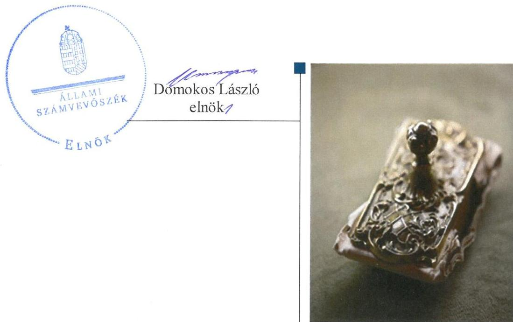
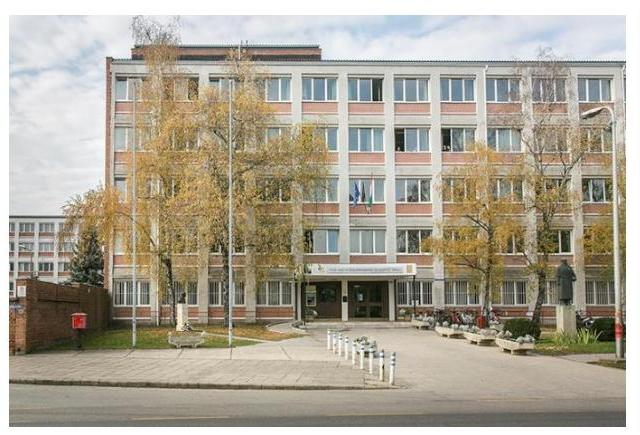
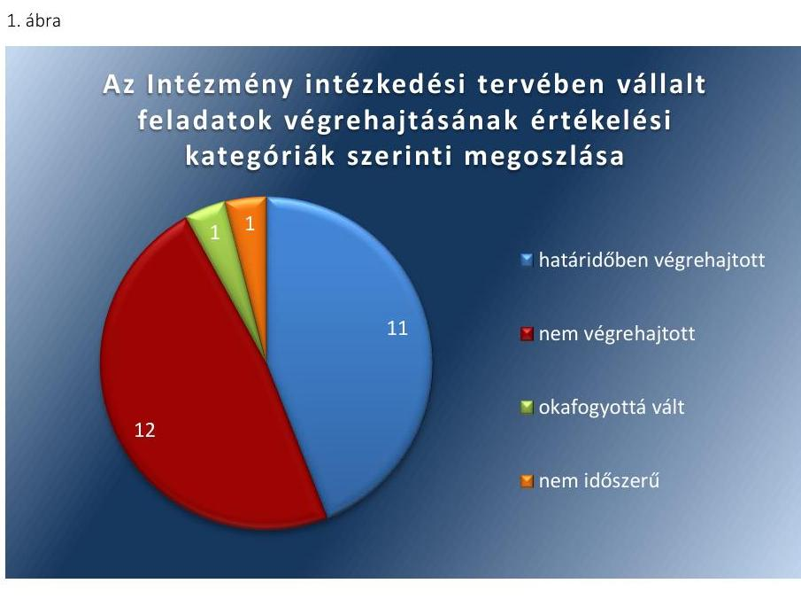
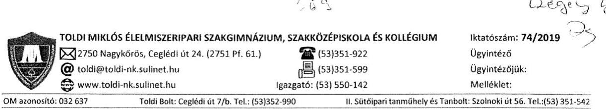
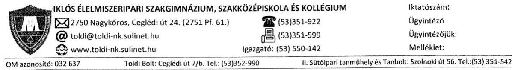
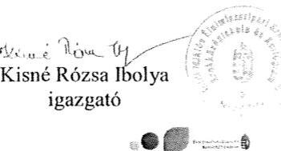
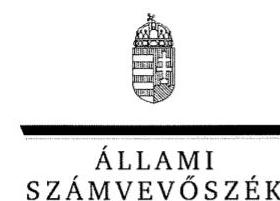
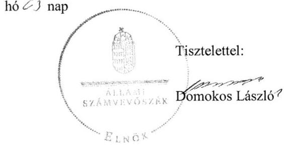

# Jelentés 

## Utóellenőrzések

A központi alrendszer egyes
intézményei pénzügyi és
vagyongazdálkodás ellenőrzése - Toldi
Miklós Élelmiszeripari Szakgimnázium,
Szakközépiskola és Kollégium
2019. 04. hó 18. nap

---

|  AZ ELLENŐRZÉST FELÜGYELTE: | |
| --- | --- |
|  CZÉGÉNY GYULA felügyeleti vezető | |
|  AZ ELLENŐRZÉST VEZETTE ÉS A VÉGREHAJTÁSÁÉRT FELELŐS: | |
|  SALAMIN VIKTOR ellenőrzésvezető | |
|  A PROGRAM ÖSSZEÁLLÍTÁSÁÉRT FELELŐS: | |
|  TÓTPÁL SZABOLCS osztályvezető | |
|  A TÉMÁHOZ KAPCSOLÓDÓ KORÁBBI SZÁMVEVŐSZÉKI JELENTÉSEK: | |
|  - címe: | |
|  Jelentés – A központi alrendszer egyes intézményei pénzügyi és vagyongazdálkodásának ellenőrzése ellenőrzéséről – Toldi Miklós Élelmiszeripari Szakképző Iskola és Kollégium | |
|  - sorszáma: 17121 | |
|  IKTATÓSZÁM: EL-1544-001/2019 | |
|  TÉMASZÁM: 2460 | |
|  ELLENŐRZÉS-AZONOSÍTÓ SZÁM: V080461 | |

---

# TARTALOMJEGYZÉK 

■ ÖSSZEGZÉS ..... 5
■ AZ ELLENŐRZÉS CÉLJA ..... 6
■ AZ ELLENŐRZÉS TERÜLETE ..... 7
■ AZ ELLENŐRZÉS HÁTTERE, INDOKOLTSÁGA ..... 8
■ A JELENTÉS LÉNYEGES KÉRDÉSKÖRE ..... 9
■ AZ ELLENŐRZÉS HATÓKÖRE ÉS MÓDSZEREI ..... 10
■ MEGÁLLAPÍTÁSOK ..... 12
■ MELLÉKLETEK ..... 15
I. sz. melléklet: Toldi Miklós Élelmiszeripari Szakgimnázium, Szakközépiskola és Kollégium intézkedési terve végrehajtásának értékelése ..... 15
■ FÜGGELÉKEK ..... 19
I. sz. függelék a Jelentéshez ..... 19
II. sz. függelék: Észrevételek ..... 20
■ RÖVIDÍTÉSEK JEGYZÉKE ..... 29

---

.

---

# ÖSSZEGZÉS 

A Toldi Miklós Élelmiszeripari Szakképző Iskola és Kollégium a külső ellenőrzésekhez kapcsolódó beszámolási kötelezettségének nem tett eleget, ezzel nem járult hozzá az irányító szerv belső kontrollrendszerének hatékony működéséhez, a közpénzekkel és a nemzeti vagyonnal történő szabályszerű gazdálkodáshoz. Az Állami Számvevőszék a Toldi Miklós Élelmiszeripari Szakképző Iskola és Kollégium utóellenőrzése során megállapította, hogy az intézkedési tervben vállalt feladatok végrehajtásának eredményeképpen a szabályozás, a belső kontroll és az integritás területén a kockázatok csökkentek, de továbbra is fennállnak. A vagyongazdálkodás és a pénzügyi gazdálkodás területén tapasztalt szabálytalanságok miatt az elszámoltathatóság, a nemzeti vagyonnal való felelős gazdálkodás nem volt biztosított.

## Az ellenőrzés társadalmi indokoltsága

Az Állami Számvevőszék stratégiájában célul tűzte ki a számvevőszéki munka hasznosulásának javítását. Ezzel összhangban ellenőrzi, hogy az ellenőrzött szervezetek megvalósították-e a korábbi ellenőrzései által feltárt hibák, hiányosságok és szabálytalanságok megszüntetése céljából elkészített intézkedési tervekben foglaltakat. A rendszeres utóellenőrzések hozzájárulnak a szükséges intézkedések tényleges végrehajtásához, ezáltal a közpénzügyek rendezettségének javulásához.

## Főbb megállapítások, következtetések

A Toldi Miklós Élelmiszeripari Szakképző Iskola és Kollégium vezette a külső ellenőrzésekről szóló nyilvántartást, az erről szóló beszámolót azonban a jogszabályi előírás ellenére nem küldte meg az irányító szerv részére. Ezzel az irányító szerv ellenőrzésének, a költségvetési szervek belső kontrollrendszere működésének feltételeit nem biztosította, nem járult hozzá a közpénzekkel és a nemzeti vagyonnal történő szabályszerű gazdálkodáshoz.

Az Állami Számvevőszék részére megküldött intézkedési tervben meghatározott huszonöt feladatból a Toldi Miklós Élelmiszeripari Szakképző Iskola és Kollégium tizenegyet határidőben végrehajtott, míg tizenkettőt nem hajtott végre, egy feladat okafogyottá vált, egy feladat végrehajtása az ellenőrzött időszakban nem volt időszerű.

A Toldi Miklós Élelmiszeripari Szakképző Iskola és Kollégium vagyongazdálkodása és pénzügyi gazdálkodása területén azonosított szabálytalanságok miatt az elszámoltathatóság nem volt biztosított. A leltározás szabályozásában és gyakorlatában tapasztalt szabálytalanságok miatt a beszámoló mérlegtételeinek alátámasztottsága nem volt biztosított, ez veszélyeztette az elszámoltathatóságot és az átláthatóságot.

A szabályozottság, a belső kontroll, a pénzügyi gazdálkodás és az integritás területén tett intézkedések a fennálló kockázatokat csökkentették, azok azonban az intézkedési tervben foglaltak teljes körű végrehajtása hiányában továbbra is fennállnak. A Toldi Miklós Élelmiszeripari Szakképző Iskola és Kollégium a pénzügyi gazdálkodás javítása érdekében megújította önköltségszámítási szabályzatát, a maradványkimutatás megbontásáról ugyanakkor nem gondoskodott. A szabályozottság területén azonosított kockázatokat a számviteli politika, a számlarend és az adatvédelmi szabályzat módosításai csökkentették, azok azonban a Szervezeti és Működési Szabályzat, a gazdasági szervezet Ügyrendje, valamint az Iratkezelési szabályzat hiányosságai miatt továbbra is fennállnak. A belső kontrollrendszer működése a belső ellenőrzés és a kockázatkezelési rendszer működtetésének hiányában nem volt megfelelő. Integritási kockázatot jelent, hogy az etikai kódex előírásai nem terjednek ki a szervezet minden szintjére.

---

# AZ ELLENŐRZÉS CÉLJA 

Az ellenőrzés célja annak értékelése volt, hogy a számvevőszéki jelentésben ${ }^{1}$ foglalt javaslatot megalapozó megállapításokkal összhangban készített intézkedési tervben meghatározott feladatokat az ellenőrzött szervezet vég-rehajtotta-e.

---

# AZ ELLENŐRZÉS TERÜLETE 

## Toldi Miklós Élelmiszeripari Szakgimnázium, Szakközépiskola és Kollégium

A nagykőrösi Toldi Miklós Élelmiszeripari Szakgimnázium, Szakközépiskola és Kollégium az Nktv. ${ }^{2}$ alapján létrejött köznevelési intézmény, amelynek feladata szakmai középfokú oktatás nyújtása. Az Intézmény ${ }^{3}$ 2013. augusztus 1-jétől önállóan működő és gazdálkodó költségvetési szerv volt országos működési körrel, közfeladata szakmai középfokú oktatás. Az Intézmény élelmiszeripari, gépészeti, mezőgazdasági, környezetvédelemvízgazdálkodási, informatikai, kereskedelem-marketing, üzleti adminisztráció, illetve vendéglátás-turisztikai szakmacsoportban nyújtott szakközépiskolai és szakiskolai képzést. Az alapítói, fenntartói és irányítói jogokat 2010-től a Vidékfejlesztési Minisztérium, 2014-től a Földművelésügyi Minisztérium, il-letve 2018-tól az Agrárminisztérium gyakorolta. Az igazgató személye sem az alapellenőrzéssel, sem az utóellenőrzéssel érintett időszakban nem változott, a gazdasági vezető személyét érintően történtek változások.

Az ÁSZ ${ }^{4}$ a 2017. évben ellenőrizte az Intézmény pénzügyi és vagyongazdálkodását a 2013. augusztus 1. és 2015. december 31. közötti időszakra vonatkozóan. Az ellenőrzés célja annak értékelése volt, hogy az ellenőrzött intézményre vonatkozó irányító szervi feladatellátás a jogszabályi előírások betartásával történt-e; az intézménynél a belső kontroll-rendszer kialakítása és működtetése szabályszerű volt-e; kialakították-e az erőforrásokkal való szabályszerű, gazdaságos, hatékony és eredményes gazdálkodás követelményeit; szabályszerű volt-e a beszámolási és adatszolgáltatási kötelezettségek teljesítése; az intézmény pénzügyi és vagyongazdálkodása megfelelt-e a jogszabályi előírásoknak és belső szabályzatainak. Az ellenőrzésről készült 17121. számú jelentést az ÁSZ 2017. július 27-én hozta nyilvánosságra.

Az utóellenőrzés a számvevőszéki jelentésben megfogalmazott intézkedést igénylő megállapításokra és javaslatokra készített intézkedési terv5-ben foglalt feladatok végrehajtásának ellenőrzésére, értékelésére irányult.

---

# AZ ELLENŐRZÉS HÁTTERE, INDOKOLTSÁGA 

Az ÁSZ tv. ${ }^{6}$ 33. § (1) bekezdése értelmében a számvevőszéki jelentések intézkedést igénylő megállapításaihoz és javaslataihoz kapcsolódóan az ellenőrzött szervezetek vezetője intézkedési tervet köteles összeállítani, és az Állami Számvevőszék részére megküldeni.

Az ÁSZ által befogadott intézkedési tervben foglaltak megvalósítását - az ÁSZ tv. 33. § (7) bekezdésében foglaltak alapján - az Állami Számvevőszék utóellenőrzés keretében ellenőrizheti. Az utóellenőrzések keretében - az intézkedések értékelése során - az Állami Számvevőszék figyelembe veszi az ellenőrzött szervezetek működési feltételeiben, valamint a jogszabályi előírásokban bekövetkezett változásokat.

Az utóellenőrzés során az ÁSZ értékeli, hogy az érintett számvevőszéki jelentésben foglalt megállapításokkal és javaslatokkal összhangban, az ellenőrzött szervezet által készített intézkedési tervben meghatározott feladatokat a feladatra kijelöltek végrehajtották-e.

Az intézkedések végrehajtásával az adott terület szabályszerű működése vonatkozásában a kockázatok csökkenhetnek, azonban hosszabb távon az intézkedési tervben foglaltak végrehajtásával önmagában nem szűnnek meg, csak akkor, ha beépülnek az ellenőrzött szervezet működésébe, azokat folyamatosan karbantartják, figyelembe véve, illetve kezelve a változásokat. Emellett az intézkedések végrehajtásáig újabb kockázatok merülhetnek fel a szabályszerű működés vonatkozásában, amelyek kezelése szintén kiemelten fontos az ellenőrzött szervezet számára.

Az ellenőrzött szervezet vezetője által készített intézkedési tervekben foglalt feladatok hiányos, illetve késedelmes végrehajtása, vagy annak elmaradása a szabályszerűség és a felelős vezetői magatartás vonatkozásában kockázatot hordoz, ami azt mutatja, hogy az ellenőrzések során feltárt hibák, hiányosságok és szabálytalanságok kezelése nem kapott kellő hangsúlyt. Az utóellenőrzés során is fennálló szabálytalanságok esetén a közpénz, közvagyon veszélyeztetettségi kockázat valószínűsített hatásának értékelése további intézkedéseket vonhat maga után.

Az ellenőrzött szervezet szintjén az utóellenőrzés feltárja, hogy a szervezet az intézkedések végrehajtásával hasznosította-e a korábbi ellenőrzési jelentésben a hiányosságok megszüntetése, illetve a kockázatok kezelése érdekében megfogalmazott javaslatokat, illetve az intézkedések végrehajtása elmaradásának következtében továbbra is fennálló szabálytalanság esetén értékeli a közpénzek, közvagyon veszélyeztetettségét.

Az ÁSZ szintjén az utóellenőrzés visszacsatolást ad az ellenőrzési jelentések hasznosulásáról, az intézkedések elmaradásának, vagy részleges megvalósulásának a közpénzek, közvagyon veszélyeztetettségére gyakorolt valószínűsített hatásának értékelése, további intézkedéseket vonhat maga után.

---

# A JELENTÉS LÉNYEGES KÉRDÉSKÖRE 

Az ellenőrzött szervezet az intézkedési tervben foglaltakat az előírt határidőben végrehajtotta-e?

---

# AZ ELLENŐRZÉS HATÓKÖRE ÉS MÓDSZEREI 

## Az ellenőrzés típusa

Megfelelőségi ellenőrzés.

## Az ellenőrzött időszak

Az utóellenőrzés alapját képező számvevőszéki jelentés közzétételének napjától az ellenőrzésről szóló kiértesítő levél keltének napjáig, azaz 2017. július 27-tól 2018. október 5-ig tartó időszak.

## Az ellenőrzés tárgya

A számvevőszéki jelentésben foglalt megállapításokkal és javaslatokkal összhangban az Intézmény által készített Intézkedési tervben foglaltak végrehajtásának ellenőrzése.

## Az ellenőrzött szervezet

Toldi Miklós Élelmiszeripari Szakgimnázium, Szakközépiskola és Kollégium

## Az ellenőrzés jogalapja

Az ellenőrzés jogszabályi alapját az ÁSZ tv. 33. § (7) bekezdésének előírásai képezték.

## Az ellenőrzés módszerei

Az ellenőrzést az ellenőrzött időszakban hatályos jogszabályok, az ellenőrzés szakmai szabályai, a jelen ellenőrzésre irányadó ÁSZ módszertanok, az ellenőrzési programban foglalt értékelési szempontok szerint végeztük.

Az ellenőrzés ideje alatt az ellenőrzött szervezettel történő kapcsolattartást az ÁSZ SZMSZ²-ének vonatkozó előírásai alapján biztosítottuk.

Az utóellenőrzés megállapításait az ÁSZ rendelkezésére álló, valamint az ÁSZ adatbekérése szerint az ellenőrzött szervezet által rendelkezésre bocsátott dokumentumok alapozták meg.

Az ellenőrzési bizonyítékként felhasználható adatforrások közé tartoztak egyrészt az ellenőrzési program részletes szempontjainál felsorolt adatforrások, másrészt minden - az ellenőrzés folyamán feltárt, az ellenőrzés szempontjából információt tartalmazó - dokumentum.

---

Az intézkedési tervben előírt feladatokat azok végrehajthatósága, illetve végrehajtása szempontjából az alábbiak szerint értékeltük:
$\longrightarrow$ „határidőben végrehajtott" a feladat, ha a teljesítés dokumentáltan, az intézkedési tervben előírt határidőben és tartalommal megtörtént;
$\longrightarrow$ „határidőn túl végrehajtott" a feladat, ha annak teljesítése az intézkedési tervben meghatározott módon, de az előírt határidőn túl történt meg;
$\longrightarrow$ „részben végrehajtott" a feladat, ha végrehajtása teljes körűen az intézkedési tervben előírt módon nem történt meg;
$\longrightarrow$ „nem végrehajtott" a feladat, ha a végrehajtás nem történt meg, vagy amennyiben a teljesítést nem dokumentálták;
$\longrightarrow$ „okafogyottá vált" a feladat, ha végrehajtására - meghatározott esemény bekövetkezése, továbbá külső körülmény, a működést érintő feltétel változása miatt - már nincs szükség, illetve lehetőség, és egyértelműen megállapítható, hogy az intézkedést szükségessé tevő körülmény a jövőben nem fordulhat elő;
$\longrightarrow$ „nem időszerű" az a feladat, amelynek ellenőrzési időszakon belüli végrehajtására azért nem került (kerülhetett) sor, mert az intézkedés alapjául szolgáló esemény nem következett be, de annak jövőbeni előfordulása lehetséges, a végrehajtása nem volt esedékes, vagy a végrehajtás határideje még nem járt le.
Az ellenőrzés lefolytatásához az ellenőrzött szervezet a tanúsítványok elektronikus kitöltésével, valamint az ÁSZ által kért dokumentumok elektronikus megküldésével szolgáltatott adatokat, amelyek valódiságát és teljes körűségét az ellenőrzött szervezet vezetője által tett teljességi és hitelességi nyilatkozat igazolja. Az így rendelkezésre bocsátott adatok, információk kontrollja az ellenőrzés keretében megtörtént.

---

# MEGÁLLAPÍTÁSOK 

## Az ellenőrzött szervezet az intézkedési tervben foglaltakat az előírt határidőben végrehajtotta-e?

Összegző megállapítás

Az Intézmény vezetője a külső ellenőrzésekről nem számolt be az irányító
 szerv vezetőjének. Az Intézmény az intézkedési tervben szereplő huszonöt feladatból tizenkettőt nem hajtott végre.
1.1. számú megállapítás

Az Intézmény vezetője a külső ellenőrzésekről szóló nyilvántartást vezette, arról azonban a jogszabályi előírás ellenére nem számolt be az irányító szerv vezetőjének.

Az Intézmény intézkedési tervében meghatározott feladatok végrehajtásáról a Bkr. ${ }^{8}$ 14. § (1) bekezdésében előírt nyilvántartást a Bkr. 47. § (2) bekezdése szerinti tartalommal vezette.

Az Intézmény a Bkr. 14. § (2) bekezdésében rögzített kötelezettségének nem tett eleget, a tárgyévet követő január 31-ig nem számolt be a fejezetet irányító szerv vezetőjének és a fejezetet irányító szerv belső ellenőrzési vezetőjének.
1.2. számú megállapítás

Az Intézmény az intézkedési tervben szereplő huszonöt feladatból tizenegyet határidőben végrehajtott, tizenkettőt nem hajtott végre, egy feladat okafogyottá vált, egy feladat végrehajtása pedig az ellenőrzési időszakban nem volt időszerű.

Az ÁSZ a 17121. számú jelentésében az Intézmény igazgatója számára tizenegy javaslatot fogalmazott meg. A hiányosságok és szabálytalanságok megszüntetésére az Intézmény által készített intézkedési tervben meghatározott huszonöt - ÁSZ által beazonosított, önmagában értékelhető - feladatot, a végrehajtás határidejét, a felelősöket és a feladatok végrehajtásának értékelését az I. számú melléklet mutatja be.

Az Intézmény intézkedési tervében meghatározott feladatok végrehajtásának értékelési kategóriák szerinti megoszlását az 1. ábra szemlélteti.

---

Forrás: ÁSZ
A VAGYONGAZDÁLKODÁSSAL kapcsolatban feltárt kockázatok a vagyongazdálkodás szabályozottságának javítása érdekében tett intézkedések $(9,10)$ ellenére továbbra is fennállnak. Az Intézmény a beszámoló elkészítéséhez, a mérleg teljes körű alátámasztására alkalmas, a Számv. tv.-ben előírt leltárt nem készítette el, így nem biztosította az elszámoltathatóságot és az átláthatóságot (20). Az Intézmény nem gondoskodott leltározási szabályzata aktualizálásáról, valamint arról, hogy az eszközök és források értékelése megfeleljen az értékelési elveknek és eljárásoknak $(21,22)$. Nem gondoskodott továbbá a bérbeadások kapcsán a szükséges átláthatósági nyilatkozatok beszerzéséről (23).

A PÉNZÜGYI GAZDÁLKODÁS területén továbbra is kockázatot jelent, hogy az Intézmény az ellenőrzött időszakban nem készített maradvány kimutatást alap és vállalkozási tevékenység megbontásban (19).

Az Intézmény ugyanakkor megújította Önköltségszámítási szabályzatát, ezzel gondoskodott arról, hogy a bevételszerző tevékenységek nyereségessége megállapítható legyen (8).

A SZABÁLYOZOTTSÁG területén a végrehajtott intézkedések $(2,3,6)$ ellenére a kockázatok továbbra is fennállnak.

Az Intézmény módosított SZMSZ ${ }^{9}$-e a külső kapcsolattartás módjáról rendelkezik, de a belső kapcsolattartás módját, szabályait továbbra sem tartalmazza (13).

Az Intézmény 2018. január 1-jén életbe léptette új Számviteli politikáját, melyben gondoskodott az általános költségek, valamint általános kiadások tevékenységekre történő felosztásának szabályozásáról (1), az általános bevételek felosztásának rendjét azonban továbbra sem szabályozták (15). Nem szabályozták továbbá a helyettesítés rendjét az Intézmény gazdasági szervezetének ügyrendjében (12). Szabályszerű kiadás hiányában az Intézmény továbbra sem rendelkezett iratkezelési szabályzattal (17).

---

A BELSŐ KONTROLLRENDSZER jogszabályi előírásoknak megfelelő működtetése továbbra is kockázatot hordoz. A belső ellenőrzés rendszerét és a kockázatkezelési rendszer kereteit az Intézmény kialakította $(4,5,7)$, azok működtetéséről azonban nem gondoskodott $(16,18)$.

INTEGRITÁSI KOCKÁZATOT hordoz, hogy az Intézmény - a jogszabályi előírás ellenére - etikai kódexét nem terjesztette ki a szervezet minden szintjére (14). Az Intézmény az intézkedési tervben vállaltaknak megfelelően lefolytatta az alapellenőrzés egyes megállapításai kapcsán a felelősség megállapítását célzó eljárást (11).

---

# MELLÉKLETEK

- I. SZ. MELLÉKLET: TOLDI MIKLÓS ÉLELMISZERIPARI SZAKGIMNÁZIUM, SZAKKÖZÉPISKOLA ÉS KOLLÉGIUM INTÉZKEDÉSI TERVE VÉGREHAJTÁSÁNAK ÉRTÉKELÉSE

|  1. | Az intézkedési tervben rögzített feladat | Az intézkedési tervben meghatározott határidő | Az intézkedési tervben meghatározott felelős | A feladat végrehajtása  |
| --- | --- | --- | --- | --- |
|   | 1. | 2. | 3. | 4.  |
|   | Határidőben végrehajtott feladatok |  |  |   |
|  1. | Intézkedem, hogy a számviteli politikában rögzítésre kerüljön az Áhsz. ${ }^{10}$ 50. § (7) bekezdése szerinti általános költségek, valamint általános kiadások és bevételek tevékenységekre történő felosztásának módja, és a felosztáshoz alkalmazott mutatók és vetítési alapok. | 2017.12.31. | gazdasági vezető, igazgató | A hatályos számviteli politikában rögzítették az általános költségek, valamint általános kiadások tevékenységekre történő felosztásának módját és a felosztáshoz alkalmazott mutatókat és vetítési alapokat.  |
|  2. | Intézkedem, hogy a Számviteli törvény 161. § (2) bekezdése szerint a számlarend tartalmazza: a számla értéke növekedésének, csökkenésének jogcímeit, a számlát érintő gazdasági eseményeket, azok más számlákkal való kapcsolatát. | 2017.12.31. | gazdasági vezető | Az Intézmény életbe léptette új Számlarendjét, melyben szabályozta a Számv. tv. ${ }^{11}$ 161. § (2) bekezdésében előírtakat.  |
|  3. | Továbbá gondoskodom arról, hogy az Áhsz 51 §. (3) bekezdése szerint a számlarendben szabályozásra kerüljön a részletező nyilvántartások vezetésének módja, azoknak a kapcsolódó könyvviteli és nyilvántartási számlákkal való egyeztetése, annak dokumentálása, valamint a részletező nyilvántartások és az egyes rovatrend rovataihoz kapcsolódóan vezetett nyilvántartási számlák adataiból a pénzügyi könyvvezetéshez készült összesítő bizonylatok (feladások) elkészítésének rendje, az összesítő bizonylat tartalmi és formai követelményei. | 2017.12.31. | gazdasági vezető | Az Áhsz. 51. § (3) bekezdésében előírtakat az Intézmény a Számviteli politikában szabályozta.  |
|  4. | (...) gondoskodom a Bkr 7. § (2) bekezdés szerinti feladatok elvégzéséről. Gondoskodom e tevékenység során, hogy felmérésre és megállapításra kerüljenek az intézmény tevékenységében rejlő szervezeti célokkal összefüggő kockázatok, valamint meghatározásra kerüljenek az egyes kockázatokkal kapcsolatban szükséges intézkedések, továbbá meghatározásra kerüljön azok teljesítésének folyamatos nyomon követésének módja.
A kockázatkezelési kötelezettségek működtetése során figyelembe vesszük az ágazati útmutatókat. | 2017.12.31. | igazgató | Az Intézmény felmérte a tevékenységében rejlő és szervezeti céljaival összefüggő kockázatokat, meghatározta az egyes kockázatokkal kapcsolatban szükséges intézkedéseket, valamint azok teljesítése folyamatos nyomon követésének módját.  |
|  5. | Az intézmény vezetőjeként gondoskodom integrált kockázatkezelési rendszer koordinálására, szervezeti felelős kijelöléséről. | 2017.12.31. | igazgató | Az intézmény vezetője határidőn túl, 2018. január 1-jén gondoskodott az integrált kockázatkezelési rendszer koordinátorának kijelöléséről.  |

---

|  5 | Az intézkedési tervben rögzített feladat | Az intézkedési tervben meghatározott határidő | Az intézkedési tervben meghatározott felelős | A feladat végrehajtása  |
| --- | --- | --- | --- | --- |
|  6. | Intézkedem az adatvédelmi és adatbiztonsági szabályzat módosításáról annak érdekében, hogy összhangban legyen a hatályos jogszabályi előírásokkal. | 2017.12.31. | gazdasági vezető | Az Intézmény Adatvédelmi szabályzatát módosította, összhangba hozta a hatályos jogszabályi előírásokkal, azt 2017. szeptember 1-jén hatályba léptette.  |
|  7. | Belső ellenőrzés kialakításáról az ellenőrzött időszakot követő évtől (az ellenőrzéstől függetlenül) az intézmény már folyamatosan gondoskodott. | folyamatos | igazgató | Az Intézmény a belső ellenőrzést kialakította, a belső ellenőrzési terveket elkészítette, a belső ellenőri feladatokra szerződést kötött.  |
|  8. | Intézkedem az önköltségszámítási szabályzatunk felülvizsgálatáról, és arról, hogy minden bevételszerző tevékenység kapcsán az önköltségszámítás elkészüljön, és abból egyértelműen megállapítható legyen, származik-e nyereség az adott tevékenységből. | - | gazdasági vezető | Az Intézmény 2018. január 1-jei hatállyal új Önköltségszámítási szabályzatot adott ki, valamint ennek mellékleteként minden bevételszerző tevékenység kapcsán készített egy előkalkulációt, melyből annak nyereségessége megállapítható.  |
|  9. | A vagyonkezelői szerződés létrejöttét már 2013 óta folyamatosan szorgalmazzuk. Az MNV Zrt. által kért információkat rendszeresen és pontosan, a határidőket betartva szolgáltattuk. A vagyonkezelői szerződés megkötése az intézményen kívül álló okok miatt nem valósult meg, miközben folyamatosan mindent megtettünk a vagyonkezelői szerződés létrejötte és a használt vagyon megóvása érdekében. Kezdeményeztem a Földművelésügyi Minisztériumnál valamint az MNV Zrt-nél a feladatellátáshoz szükséges vagyon használata jogcímének szerződésben történő rendezését, így az FM és az MNV Zrt. közötti hosszas egyeztetést követően 2017.07.20-án a vagyonkezelői szerződés aláírásra került. A vagyonkezelői jog 2017.07.28-án bejegyzésre került. Az intézmény 2017.07.28-ától rendelkezik érvényes és hatályos vagyonkezelői szerződéssel. | 2017.08.31. | igazgató | A Vagyonkezelői szerződés határidőben aláírásra került, a vagyonkezelői jog bejegyzéséről szóló földhivatali határozat 2017. augusztus 10-én kelt.  |
|  10. | Az intézmény költségvetésében előírt saját bevétel előteremtése érdekében az általa vagyonkezelésbe vett ingatlanokat bérbeadás útján értékesíti. A bérbeadás tényét minden alkalommal a bérleti időszakot megelőzően szerződésben rögzítik a felek. A megvalósulásról teljesítésigazolás készül, mely a szerződésben foglalt összegről szóló számla kiállításának alapja. Az ÁFA tekintetében az intézmény az általános szabályok szerint jár el. A bérleti szerződések formanyomtatványok kitöltése útján köttetnek. A bérleti díj kiszámítására vonatkozó szabályokat az önköltség számítási szabályzat tartalmazza, a megállapított, kalkulált bérleti díjak az önköltségszámítási szabályzat mellékletét képezik, minden év januárjában felülvizsgálandók. | 2017.12.31. | gazdasági vezető | Az Intézmény belső szabályzatban rendezte a bérbeadás szabályait, mely a bérleti szerződések formanyomtatványát is tartalmazza. A 2018. január 1-jétől hatályos önköltségszámítási szabályzat alapján a bérleti díjak előkalkulációit elkészítették.  |

---

|  1. | Az intézkedési tervben rögzített feladat | Az intézkedési tervben meghatározott határidő | Az intézkedési tervben meghatározott felelős | A feladat végrehajtása  |
| --- | --- | --- | --- | --- |
|  2. | 1. | 2. | 3. | 4.  |
|  11. | Az integritást sértő események kezelésének eljárásrendje alapján lefolytatták a felelősség megállapítását célzó eljárást.
Megállapításunk szerint a hiányosságok és szabálytalanságok tekintetében felelősnek tekinthető az akkori gazdasági vezető jelenleg már nem dolgozik az intézményben, így felelősségre vonása intézményi keretek között nem megoldható. | 2017.10.31. | igazgató | A felelősség megállapítását célzó eljárást határidőben lefolytatták, annak eredményéről csatolták a jegyzőkönyvet.  |
|  Nem végrehajtott feladatok |  |  |  |   |
|  12. | Intézkedem, hogy az Avr. ${ }^{12}$ 13. § (5) bekezdése szerint a gazdasági szervezet ügyrendje tartalmazza a helyettesítés rendjét, | 2017.12.31. | gazdasági vezető | A Gazdasági szervezet ügyrendje (hatályos: 2017. szeptember 1-jétől) nem szabályozza a helyettesítés rendjét.  |
|  13. | (Intézkedem, hogy az Avr. 13. § (5) bekezdése szerint a gazdasági szervezet ügyrendje tartalmazza...)
továbbá a gazdasági szervezeten belüli belső és azon kívüli külső kapcsolattartásának módját, szabályait. | 2017.12.31. | gazdasági vezető | Az Intézmény hatályos SZMSZ-e (hatályos 2017. augusztus 31-től), illetve a Gazdasági szervezet ügyrendje (hatályos: 2017. szeptember 1-jétől) nem tartalmazza a gazdasági szervezeten belüli belső kapcsolattartásának módját, szabályait.  |
|  14. | Gondoskodom arról, hogy az intézmény etikai kódexe tartalmazza a Bkr. 6. § (1) c) pontjában meghatározottak szerint, a szervezet minden szintjére kiterjedő etikai elvárásokat. | 2017.12.31. | gazdasági vezető | Az etikai kódex továbbra sem tartalmazza a szervezet minden szintjére kiterjedő etikai elvárásokat.  |
|  15. | Intézkedem, hogy a számviteli politikában rögzítésre kerüljön

 az Áhsz. 50. § (7) bekezdése szerinti általános költségek, valamint általános kiadások és bevételek tevékenységekre történő felosztásának módja, és a felosztáshoz alkalmazott mutatók és vetítési alapok. | 2017.12.31. | gazdasági vezető, igazgató | Az általános bevételek felosztásának rendjét nem szabályozták.  |
|  16. | Intézkedem a Bkr. 7 § (1) bekezdése szerinti kockázatkezelési rendszer működtetéséről, (...) | 2017.12.31. | igazgató | Az Intézmény a kockázatkezelési rendszer működtetéséről nem gondoskodott.  |
|  17. | Az intézmény iratkezelési szabályzata elavult, több éven keresztül nem lett frissítve, ezért intézkedem az iratkezelési szabályzat aktualizálásáról, szabályszerű kiadásáról. | 2017.12.31. | gazdasági vezető | Az új, aktualizált iratkezelési szabályzatot előkészítették, azonban a kiadásához továbbra sem kérték az illetékes levéltár egyetértését.  |
|  18. | Intézkedtem az Áht. ${ }^{13}$ előírásainak megfelelően a belső ellenőrzés folyamatos és jogszabálynak megfelelő működtetéséről. | folyamatos | igazgató | Az Intézmény a belső ellenőrzés folyamatos és jogszabályoknak megfelelő működtetéséről nem gondoskodott.  |
|  19. | (Intézkedem...)
továbbá az Áhsz 8. § (3) bekezdése szerinti maradvány kimutatás elkészítéséről alap és vállalkozási tevékenység megbontásban. | Maradvány kimutatás 2017. évre vonatkozóan 2018.02.28. | gazdasági vezető | Az Intézmény a maradvány kimutatás elkészítéséről alap és vállalkozási tevékenység megbontásban nem gondoskodott.  |

---

|  20. |  | Az intézkedési
tervben rögzített
feladat | Az intézkedési
tervben
meghatározott
határidő | Az intézkedési
tervben
meghatározott
felelős | A feladat végrehajtása  |
| --- | --- | --- | --- | --- | --- |
|   | 1. |  | 2. | 3. | 4.  |
|  20. | Gondoskodom arról, hogy a beszámoló és a mérleg alátámasztásához olyan leltár készüljön, mely tételesen, ellenőrizhető módon tartalmazza a meglévő eszközöket és forrásokat mennyiségben és értékben. |  | 2017.12.31. | gazdasági vezető | Az Intézmény nem gondoskodott olyan leltár elkészítéséről, amely tételesen, ellenőrizhető módon tartalmazta volna a meglévő eszközöket és forrásokat mennyiségben és értékben.  |
|  21. | Gondoskodom arról, hogy az eszközök és források értékelése megfeleljen az előírt értékelési elveknek és az azokhoz kapcsolódó értékelési eljárásoknak. |  | 2017.12.31. | gazdasági vezető | Az Intézmény nem gondoskodott arról, hogy az eszközök és források értékelése megfeleljen az előírt értékelési elveknek és az azokhoz kapcsolódó értékelési eljárásoknak.  |
|  22. | Az intézmény vezetőjeként leltározási utasítást adok ki, s elrendelem a leltározáshoz használt dokumentumok teljes körű felülvizsgálatát. A leltározás lebonyolításával és ütemezésével a gazdasági vezetőt bízom meg. A tételes leltár elkészítéséért az általa kijelölt 3 tagú bizottság felelős. A leltározási szabályzatot aktualizáljuk, mely tartalmazza az eljárásrendet és mellékletként tartalmazza a leltározáshoz használt valamennyi dokumentumot. |  | 2017.12.31. | gazdasági vezető | Az Intézmény a leltározási szabályzatot nem aktualizálta, továbbá nem gondoskodott olyan leltár elkészítéséről, amely tételesen, ellenőrizhető módon tartalmazta volna a meglévő eszközöket és forrásokat mennyiségben és értékben.  |
|  23. | Intézkedem a bérbeadások kapcsán a szerződő felek átláthatóságának vizsgálatáról, a szükséges nyilatkozatok beszerzéséről. |  | 2017.12.31. | gazdasági vezető,
igazgató | Az Intézmény a bérbeadások kapcsán a szerződő felek átláthatóságának vizsgálatáról, a szükséges nyilatkozatok beszerzéséről nem gondoskodott.  |
|   |  |  |  |  | 2018.01.01-től folyamatosan  |
|  24. | Intézkedem, az Áhsz 44. § (1) bekezdése értelmében amennyiben a végzett tevékenység (ÁHT II. fejezet 7. § (2) bekezdés b, pontja szerint vállalkozási tevékenység: amely haszonszerzés céljából, államháztartáson kívüli forrásból, nem kötelezően végzett termelő-szolgáltató-, értékesítő tevékenység) valóban indokolja, alap és vállalkozási tevékenység szétválasztásáról. |  | A könyvelésben
alap és vállalkozási
tevékenység megjelenítése:
2018.01.01-től folyamatosan | gazdasági vezető | Az Áhsz. 44. § (1) bekezdéséből 2017. január 1-jei hatállyal törölték a teljesítések nyilvántartási számláinak alap és vállalkozási tevékenységre történő megbontására vonatkozó előírást.  |
|   |  |  |  |  | 2015. október 31-től az alapító okirat már nem írja elő az SZMSZ érvényességéhez a fenntartói egyetértést.  |
|  25. | Az akkor hatályos alapító okirat valóban tartalmazta, hogy az intézmény SZMSZét a fenntartó hagyja jóvá, ezt a fenntartó akkor nem tette meg. Ennek utólagos pótlására már nincs lehetőség, a fenntartó jelenlegi nyilatkozata alapján tévesen került bele, jogszabály ezt nem tette szükségessé. |  |  |  | Az ellenőrzött időszakban egy alkalommal került sor új SZMSZ kiadására, ehhez azonban a fenntartó egyetértésére nem volt szükség, mivel az nem rótt rá többletfeladatot.  |
|   | Ezért - és más okból is - azóta az alapító okirat módosítása megtörtént, s a 2015. október 31-től hatályos alapító okiratunkban foglaltak már nem tartalmazzák, hogy a dokumentum a fenntartó egyetértésével válik érvényessé. További intézkedést ezzel kapcsolatban nem tudunk tenni. |  |  |  |   |

---

# FÜGGELÉKEK 

- I. SZ. FÜGGELÉK A JELENTÉSHEZ

Az Állami Számvevőszék az ellenőrzések során feltárt tényekhez kapcsolódó további körülmények tisztázására eszközrendszerrel nem rendelkezik. Amennyiben az ellenőrzésen túlmutatóan indokoltnak látszik az ellenőrzés során feltárt körülmények további vizsgálata, az Állami Számvevőszék törvényi felhatalmazás alapján az ellenőrzés által feltárt körülményeket továbbítja a hatáskörrel rendelkező szervnek a szükséges intézkedések megtétele, eljárások lefolytatása érdekében.

Az Állami Számvevőszék az ellenőrzött szervezetnél 2017. évben lefolytatott alapellenőrzés során 2013-2015. évek vonatkozásában megállapította, hogy ,, A leltár egyik évben sem volt alkalmas a beszámoló alátámasztására. "
Az ellenőrzött szervezet által intézkedési tervben vállalt feladatok végrehajtását az ÁSZ utóellenőrzés keretében ellenőrizte, és megállapította, hogy az ellenőrzött szervezet a 2017. évre vonatkozóan - leltárdokumentumok hiányában - nem igazolta a mérleg tételeinek alátámasztását.
A Számvitelről szóló 2000. évi C. törvény 15. §. (3) bekezdésében foglalt valódiság elve szerint a könyvvitelben rögzített és a beszámolóban szereplő tételeknek a valóságban is megtalálhatóknak, bizonyíthatóknak, kívülállók által is megállapíthatóknak kell lenniük, továbbá a 69. § (1) bekezdésben foglaltak alapján a könyvek üzleti év végi zárásához, a beszámoló elkészítéséhez, a mérleg tételeinek alátámasztásához olyan leltárt kell összeállítani és megőrizni, amely tételesen, ellenőrizhető módon tartalmazza a mérleg fordulónapján meglévő eszközöket és forrásokat mennyiségben és értékben.
Fentiek alapján az Intézmény 2017. évi beszámolójának megbízhatósága nem biztosított. A leltár hiánya miatt sérült a Számviteli tv. 15. § (3) bekezdésében rögzített valódiság elve. Leltár hiányában a mérleg nem alátámasztott, az Intézmény átláthatósága és elszámoltathatósága, a nemzeti vagyon megőrzése nem biztosított. A feltárt hiányosság okán indokolt az illetékes adóhatóság értesítése.

---

A jelentéstervezetet a Számvevőszék 15 napos észrevételezésre megküldte az ellenőrzött szervezet vezetőjének az ÁSZ tv. 29. § (1) bekezdése előírásának megfelelően.

Az ellenőrzött szervezet vezetője élt az ÁSZ tv. 29. § (2) bekezdésében foglalt észrevételezési jogával, a jelentéstervezetre észrevételt tett.

[^0]
[^0]:    * 29. § (1) Az Állami Számvevőszék az ellenőrzési megállapításait megküldi az ellenőrzött szervezet vezetőjének vagy az általa megbízott személynek, és annak, akinek személyes felelősségét állapította meg.
    (2) Az ellenőrzött szervezet vezetője és a felelősként megjelölt személy az ellenőrzés megállapításaira tizenöt napon belül írásban észrevételt tehet.
    (3) Az Állami Számvevőszék az észrevételre a beérkezésétől számított harminc napon belül írásban válaszol. A figyelembe nem vett észrevételeket köteles a jelentésben feltüntetni, és megindokolni, hogy azokat miért nem fogadta el.

---

Állami Számvevőszék
Budapest,
Apáczai Csere János u. 10. 1364

Tárgy: jelentéstervezet észrevételezése
Tisztelt Állami Számvevőszék!
Az Állami Számvevőszék EL-1087-020/2019 iktató számmal megküldte intézményünknek az „Utóellenőrzések - A központi alrendszer egyes intézményei pénzügyi és vagyongazdálkodás ellenőrzése - Toldi Miklós Elelmiszeripari Szakgimnázium, Szakközépiskola és Kollégiumnál" lefolytatott ellenőrzésről készített számvevőszéki jelentéstervezetet.
Az Ász tv 29. § (2) bekezdése alapján az ellenőrzés megállapításaira tizenöt napon belül észrevételt kívánok tenni.

1. 1. számú megállapítás észrevétele:

Az intézmény a fenntartó agrárminisztérium kérésének megfelelően (lásd 1. számú melléklet) 2018. február 20-ig készítette és küldte meg a 2017. évre vonatkozó külső ellenőrzések nyilvántartását. A fenntartóval kialakított gyakorlat szerint az adatszolgáltatás a bekérő levél alapján történik.

1. 2. számú megállapítás

Az intézmény intézkedési terve végrehajtásának értékelésében szereplő nem végrehajtott feladatok észrevételezése:
14. pont:

Az intézmény 2017. szeptember 1-től hatályos Pedagógus etikai kódexének hatálya kiterjed az intézmény összes alkalmazottjára. Az erre vonatkozó utalás a 3. oldalán található.
A kódex érvényességi köre az alábbiak szerint került meghatározásra:
„Az iskolában dolgozó egyéb alkalmazottak (iskolatitkárok, portás, stb.) példájukkal ugyancsak hatással vannak tanítványainkra. A nevelési célokat tekintve ők is az oktatást végző tanárok munkatársai, ezért kompetenciájuk mértékéig az etikai kódex hatálya alá tartoznak."

Az intézmény etikai kódexe tartalmazza a szervezet minden szintjére kiterjedő etikai elvárásokat.
16. pont:

Az intézmény vezetője gondoskodott az integrált kockázatkezelési rendszer működtetéséről a Bkr. 7 § 1. bek. alapján. Az intézmény felmérte a tevékenységben rejlő és a szervezeti céljaival összefüggő kockázatokat, meghatározta az egyes kockázatokkal kapcsolatban szükséges intézkedéseket, valamint azok teljesítése folyamatos nyomon követésének módját.
Az intézmény vezetője 2018. január 1.-én gondoskodott az integrált kockázatkezelési rendszer koordinátorának kijelöléséről. A folyamatgazdák kijelölése megtörtént, akik folyamatosan együttműködnek a belső kontroll koordinátorral. Nem értelmezhető számunkra az Állami

---

Számvevőszék azon megállapítása, hogy az intézmény vezetője a kockázatkezelési rendszer működtetéséről nem gondoskodott.
18. pont:

Az intézmény gondoskodott a belső ellenőrzés folyamatos és jogszabályoknak megfelelő működtetéséről.
Az intézmény független belső ellenőrrel szerződést kötött, a belső ellenőr éves terveket készített, a tervek alapján elkészültek a jelentések. Az éves összefoglaló jelentések pedig a fenntartó agrárminisztériumnak megküldésre kerültek (lásd 2. számú melléklet).
19. pont:

Intézkedési tervünk 7. pontjában 2018.01.01-től vállaltuk a könyvelésben az alap és vállalkozási tevékenység megbontását, viszont a vállalkozási tevékenység maradványának kimutatásának elkészítését tévesen 2019.02.28.-helyett 2018.02.28-ban határoztuk meg. 2018.02.28-ig elkészült az intézmény maradvány kimutatása, mely tartalmazza az alap és vállalkozási tevékenység maradványát is. (lásd: 3. számú melléklet)
20. pont:

Az intézmény az intézkedési tervének 9. pontjához beküldte a 2016. évi leltározás teljeskörű dokumentumait. Az intézkedési tervben, a feladat teljesítésére meghatározott határidő 2017.12.31, ezért értelemszerűen az eddig teljesített feladatot, tehát csak a 2016. évi leltározási dokumentumokat töltöttük fel a felületre. A 2017. évi beszámoló alátámasztására készült leltár határideje: 2018.02.28. A 2017. évi beszámoló alátámasztására alkalmas leltárral az intézmény rendelkezett. Az intézmény az Állami Számvevőszék által kijelölt ellenőrzött időszakot tévesen értelmezte, ezért nem került feltöltésre a dokumentum, amiért ezúton is elnézést kérünk.
Papíralapon levelünk mellékleteként csatoljuk a leltározási dokumentumokat és kérjük a Tisztelt Számvevőszéket, hogy tekintsenek el az illetékes adóhatóság értesítésétől, mivel az intézmény rendelkezett a 2017. évi beszámoló alátámasztására alkalmas leltárral. (lásd: 4. számú melléklet)

Melléklet:

1. számú melléklet: 2017 évre vonatkozó külső ellenőrzések nyilvántartásának fenntartói bekérő levele, valamint a
 nyilvántartás megküldését igazoló dokumentum.
2. számú melléklet: 2016, 2017, 2018 évre vonatkozó belső ellenőrzési összefoglaló jelentések, valamint a megküldését igazoló dokumentumok
3. számú melléklet: 2018 évi beszámoló 7-es űrlap, maradványkimutatás
4. 2017 évi beszámoló alátámasztásra alkalmas leltár dokumentációja.

Kelt: Nagykörös, 2019. március 7.
Tisztelettel:

Katakosy, An E.
Kataticsné Végh Esényi Erika gazdasági vezető

---

ELNÖK

Ikt.szám: EL-1087-024/2019

# Kisné Rózsa Ibolya 

igazgató
Toldi Miklós Élelmiszeripari Szakgimnázium, Szakközépiskola és Kollégium

## Nagykörös

## Tisztelt Igazgató Asszony!

Köszönettel megkaptam az Állami Számvevőszékhez 2019. március 13. napján érkezett "Utóellenőrzések - A központi alrendszer egyes intézményei pénzügyi és vagyongazdálkodás ellenőrzése - Toldi Miklós Élelmiszeripari Szakgimnázium, Szakközépiskola és Kollégium" című számvevőszéki jelentéstervezetre tett észrevételeit.

Tájékoztatom Igazgató Asszonyt, hogy a figyelembe nem vett észrevételeket - az Állami Számvevőszékről szóló 2011. évi LXVI. törvény 29. § (3) bekezdése alapján - az Állami Számvevőszék a jelentésben szerepelteti azok elutasítása indoklásának feltüntetésével együtt.

Az Állami Számvevőszék észrevételekre vonatkozó álláspontjáról a felügyeleti vezető által készített részletes tájékoztatást csatoltan megküldöm.

Budapest, 2019.

Melléklet: Tájékoztatás a figyelembe nem vett észrevételekről, azok elutasításának indokairól

---

# Tájékoztatás 

a figyelembe nem vett észrevételekről, azok indokairól

1. Észrevétel: az ÁSZ jelentéstervezet 1. 1. számú megállapításához:

Megállapítás: „Az Intézmény vezetője a külső ellenőrzésekről szóló nyilvántartást vezette, arról azonban a jogszabályi előírás ellenére nem számolt be az irányító szerv vezetőjének."

Észrevétel: „Az intézmény a fenntartó agrárminisztérium kérésének megfelelően (lásd 1. számú melléklet) 2018. február 20-ig készítette és küldte meg a 2017. évre vonatkozó külső ellenőrzések nyilvántartását, a fenntartóval kialakított gyakorlat szerint az adatszolgáltatás a bekérő levél alapján történik."

Válasz: Az ÁSZ az észrevételt nem veszi figyelembe.
Indoklás: Az észrevétel nem megalapozott. Az Intézmény által az adatszolgáltatásra rendelkezésre álló időszakban megküldött dokumentumok igazolják, hogy az Intézmény vezetője a külső ellenőrzésekről a tárgyévet követő január 31-ig nem számolt be a fejezetet irányító szerv vezetőjének, erre tekintettel az Intézmény a Bkr. 14. § (2) bekezdésében rögzített kötelezettségének nem tett eleget.

Fentiek figyelembevételével az ÁSZ fenntartja a jelentéstervezetben szereplő 1.1. számú tárgyi megállapítását.
2. Észrevétel: az ÁSZ jelentéstervezet 1.2. számú megállapításához kapcsolódó I. sz. melléklet 14. pontjában meghatározott feladat végrehajtására vonatkozóan:

Megállapítás: „Az etikai kódex továbbra sem tartalmazza a szervezet minden szintjére kiterjedő etikai elvárásokat."

Észrevétel: „Az intézmény 2017. szeptember 1-től hatályos Pedagógus etikai kódexének hatálya kiterjed az intézmény összes alkalmazottjára. Az erre vonatkozó utalás a 3. oldalán található.
A kódex érvényességi köre az alábbiak szerint került meghatározásra:
„Az iskolában dolgozó egyéb alkalmazottak (iskolatitkárok, portás, stb.) példájukkal ugyancsak hatással vannak tanítványainkra. A nevelési célokat tekintve ők is az oktatást végző

---

tanárok munkatársai, ezért kompetenciájuk mértékéig az etikai kódex hatálya alá tartoznak."
Az intézmény etikai kódexe tartalmazza a szervezet minden szintjére kiterjedő etikai elvárásokat."

Válasz: Az ÁSZ az észrevételt nem veszi figyelembe.
Indoklás: Az észrevétel nem megalapozott. Az Intézmény által rendelkezésre bocsátott dokumentumok alapján megállapítható, hogy a „Pedagógus etikai kódex" kizárólag a pedagógusokra fogalmazza meg az etikai normákat, az iskolában dolgozó egyéb alkalmazottakra nem. Erre tekintettel az etikai kódex továbbra sem tartalmazza a Bkr. 6. § (1) bekezdés c) pontja szerint a szervezet minden szintjére kiterjedő etikai elvárásokat.

Fentiek alapján az ÁSZ fenntartja a jelentéstervezet 1.2. számú megállapításához kapcsolódó 1. sz. melléklet 14. pontjában meghatározott feladat végrehajtására vonatkozóan tett tárgyi megállapítását.
3. Észrevétel: az ÁSZ jelentéstervezet 1.2. számú megállapításához kapcsolódó I. sz. melléklet 16. pontjában meghatározott feladat végrehajtására vonatkozóan:

Megállapítás: „Az Intézmény a kockázatkezelési rendszer működtetéséről nem gondoskodott."

Észrevétel: „Az intézmény vezetője gondoskodott az integrált kockázatkezelési rendszer működtetéséről a Bkr. 7 § 1 bek. alapján. Az intézmény felmérte a tevékenységben rejlő és a szervezeti céljaival összefüggő kockázatokat, meghatározta az egyes kockázatokkal kapcsolatban szükséges intézkedéseket, valamint azok teljesítése folyamatos nyomon követésének módját. Az intézmény vezetője 2018. január 1.-én gondoskodott az integrált kockázatkezelési rendszer koordinátorának kijelöléséről. A folyamatgazdák kijelölése megtörtént, akik folyamatosan együttműködnek a belső kontroll koordinátorral. Nem értelmezhető számunkra az Állami Számvevőszék azon megállapítása, hogy az intézmény vezetője a kockázatkezelési rendszer működtetéséről nem gondoskodott."

Válasz: Az ÁSZ az észrevételt nem veszi figyelembe.
Indoklás: Az észrevétel nem megalapozott. Az Intézmény által rendelkezésre bocsátott dokumentumok alapján megállapítható, hogy az Intézmény vezetője a kockázatkezelési rendszer működtetéséről az intézkedési tervben vállalt határidőig - 2017. december 31-ig - nem gondoskodott.
Fentiek alapján az ÁSZ fenntartja a jelentéstervezet 1.2. számú megállapításához kapcsolódó 1. sz. melléklet 16. pontjában meghatározott feladat végrehajtására vonatkozóan tett tárgyi megállapítását.

---

4. Észrevétel: az ÁSZ jelentéstervezet 1.2. számú megállapításához kapcsolódó I. sz. melléklet 18. pontjában meghatározott feladat végrehajtására vonatkozóan:

Megállapítás: ,,Az Intézmény a belső ellenőrzés folyamatos és jogszabályoknak megfelelő működtetéséről nem gondoskodott."

Észrevétel: ,,Az intézmény gondoskodott a belső ellenőrzés folyamatos és jogszabályoknak megfelelő működtetéséről. Az intézmény független belső ellenőrrel szerződést kötött, a belső ellenőr éves terveket készített, a tervek alapján elkészültek a jelentések. Az éves összefoglaló jelentések pedig a fenntartó agrárminisztériumnak megküldésre kerültek (lásd 2. számú melléklet)."

Válasz: Az ÁSZ az észrevételt nem veszi figyelembe.
Indoklás: Az észrevétel nem megalapozott. Az ÁSZ az ellenőrzési megállapításait az Intézmény által az adatszolgáltatásra rendelkezésre álló időszakban megküldött dokumentumokra alapozva fogalmazza meg. Az Intézmény vezetőjének 2018. október 09-én kelt módosított teljességi és hitelességi nyilatkozata szerint az ÁSZ részére átadott dokumentumok, adatok megbízhatóak és a bekért adatokra, dokumentumokra vonatkozóan teljes körű információt tartalmaznak. Továbbá, az Intézmény vezetője a nyilatkozatában az átadott dokumentumok, adatok hitelességéért, valódiságáért, hiánytalanságáért és hatályosságáért teljes felelősséget vállalt. Erre tekintettel az adatszolgáltatás határideje leteltét követően megküldött dokumentumokat az ÁSZ nem értékeli.

Fentiek alapján az ÁSZ fenntartja a jelentéstervezet 1.2. számú megállapításához kapcsolódó I. sz. melléklet 18. pontjában meghatározott feladat végrehajtására vonatkozóan tett tárgyi megállapítását.
5. Észrevétel: az ÁSZ jelentéstervezet 1.2. számú megállapításához kapcsolódó I. sz. melléklet 19. pontjában meghatározott feladat végrehajtására vonatkozóan:

Megállapítás: ,,Az Intézmény a maradvány kimutatás elkészítéséről alap és vállalkozási tevékenység megbontásban nem gondoskodott".

Észrevétel: ,, Intézkedési tervünk 7-es pontjában 2018.01.01-től vállaltuk a könyvelésben az alap és vállalkozási tevékenység megbontását, viszont a vállalkozási tevékenység maradványának kimutatásának elkészítését tévesen 2019.02.28.-helyett 2018.02.28-ban határoztuk meg. 2019.02.28.-ig elkészült az intézmény maradvány kimutatása, mely tartalmazza az alap és vállalkozási tevékenység maradványát is. (lásd: 3. számú melléklet)"

Válasz: Az ÁSZ az észrevételt nem veszi figyelembe.

---

Indoklás: Az észrevétel nem megalapozott. Az Intézmény vezetője az intézkedési tervben a 2017. évre vonatkozó maradvány kimutatás elkészítését vállalta 2018. február 28-i határidővel. Az Áhsz. 6. § (2) bekezdésének ab) pontja értelmében a maradvány kimutatás az éves költségvetési beszámoló része. Az Intézmény által rendelkezésre bocsátott dokumentumok alapján megállapítható, hogy az Intézmény nem tett eleget az éves költségvetési beszámoló részeként a maradvány kimutatás elkészítési kötelezettségének az Áhsz. 8. § (3) bekezdése szerinti formában és tartalommal.

Fentiek alapján az ÁSZ fenntartja a jelentéstervezet 1.2. számú megállapításához kapcsolódó I. sz. melléklet 19. pontjában meghatározott feladat végrehajtására vonatkozóan tett tárgyi megállapítását.
6. Észrevétel: az ÁSZ jelentéstervezet 1.2. számú megállapításához kapcsolódó I. sz. melléklet 20. pontjában meghatározott feladat végrehajtására vonatkozóan:

Megállapítás: ,,Az Intézmény nem gondoskodott olyan leltár elkészítéséről, amely tételesen, ellenőrizhető módon tartalmazta volna a meglévő eszközöket és forrásokat mennyiségben és értékben."

Észrevétel: ,,Az intézmény az intézkedési tervének 9. pontjához beküldte a 2016. évi leltározás teljes körű dokumentumait. Az intézkedési tervben, a feladat teljesítésére meghatározott határidő 2017.12.31, ezért értelemszerűen az eddig teljesített feladatot, tehát csak a 2016. évi leltározási dokumentumokat töltöttük fel a felületre. A 2017. évi beszámoló alátámasztására készült leltár határideje: 2018.02.28. A 2017. évi beszámoló alátámasztására alkalmas leltárral az intézmény rendelkezett. Az intézmény az Állami Számvevőszék által kijelölt ellenőrzött időszakot tévesen értelmezte, ezért nem került feltöltésre a dokumentum, amiért ezúton is elnézést kérünk. Papíralapon levelünk mellékleteként csatoljuk a leltározási dokumentumokat és kérjük a Tisztelt Számvevőszéket, hogy tekintsenek el az illetékes adóhatóság értesítésétől, mivel az intézmény rendelkezett a 2017. évi beszámoló alátámasztására alkalmas leltárral. (lásd: 4. számú melléklet)"

Válasz: Az ÁSZ az észrevételt nem veszi figyelembe.
Indoklás: Az észrevétel nem megalapozott. Az ÁSZ az ellenőrzési megállapításait az Intézmény által az adatszolgáltatásra rendelkezésre álló időszakban megküldött dokumentumokra alapozva fogalmazza meg. Az Intézmény vezetőjének 2018. október 09-én kelt módosított teljességi és hitelességi nyilatkozata szerint az ÁSZ részére átadott dokumentumok, adatok megbízhatóak és a bekért adatokra, dokumentumokra vonatkozóan teljes körű információt tartalmaznak. Továbbá, az Intézmény vezetője a nyilatkozatában az átadott dokumentumok, adatok hitelességéért, valódiságáért, hiánytalanságáért és hatályosságáért teljes felelősséget vállalt. Erre tekintettel az adatszolgáltatás határideje leteltét követően megküldött dokumentumokat az ÁSZ nem értékeli.

---

Fentiek alapján az ÁSZ fenntartja a jelentéstervezet 1.2. számú megállapításához kapcsolódó I. sz. melléklet 20. pontjában meghatározott feladat végrehajtására vonatkozóan tett tárgyi megállapítását.

Budapest, 2019. április " 03 ".
Tisztelettel:
Czégény Gyula

---

# RÖVIDÍTÉSEK JEGYZÉKE 

${ }^{1}$ számvevőszéki jelentés
${ }^{2}$ Nktv.
${ }^{3}$ Intézmény
${ }^{4}$ ÁSZ
${ }^{5}$ intézkedési terv
${ }^{6}$ ÁSZ tv.
${ }^{7}$ ÁSZ SZMSZ
${ }^{8}$ Bkr.
${ }^{9}$ SZMSZ
${ }^{10}$ Áhsz.
${ }^{11}$ Számv. tv.
${ }^{12}$ Ávr.
${ }^{13}$ Áht.

Az Állami Számvevőszék 17121. számú, 2017. július 27-én közzétett, „A központi alrendszer egyes intézményei pénzügyi és vagyongazdálkodásának ellenőrzése Toldi Miklós Élelmiszeripari Szakképző Iskola és Kollégium" című ellenőrzési jelentése
2011. évi CXC. törvény a nemzeti köznevelésről
Toldi Miklós Élelmiszeripari Szakgimnázium, Szakközépiskola és Kollégium Állami Számvevőszék
Toldi Miklós Élelmiszeripari Szakgimnázium, Szakközépiskola és Kollégium intézkedési terve (iktatószám: V-1253-112/2016.)
2011. évi LXVI. törvény az Állami Számvevőszékről

Az Állami Számvevőszék Szervezeti és Működési Szabályzata
A költségvetési szervek belső kontrollrendszeréről és belső ellenőrzéséről szóló 370/2011. (XII. 31.) Korm. rendelet (hatályos: 2012. január 1-jétől)
Toldi Miklós Élelmiszeripari Szakgimnázium, Szakközépiskola és Kollégium Szervezeti és Működési Szabályzata (hatályos 2017. augusztus 31-től)
Az államháztartás számviteléről szóló 4/2013. (I. 11.) Korm. rendelet
A számvitelről szóló 2000. évi C. törvény
az államháztartásról szóló törvény végrehajtásáról szóló 368/2011. (XII.31.) Korm. rendelet
Az államháztartásról szóló 2011. évi CXCV. törvény

---

# ÁLLAMI SZÁMVEVŐSZÉK 

1052 Budapest, Apáczai Csere János utca 10.
Levélcím: 1364 Budapest 4. Pf. 54
Telefon: +36 14849100 Telefax: +36 14849200
www.asz.hu
