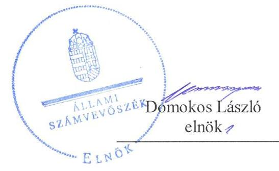
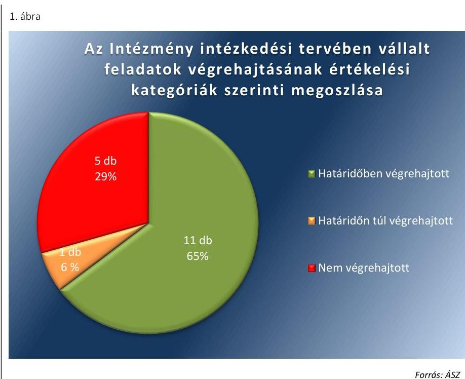
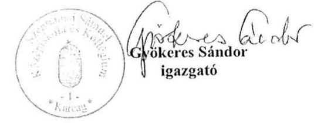
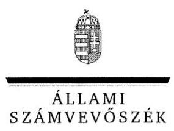
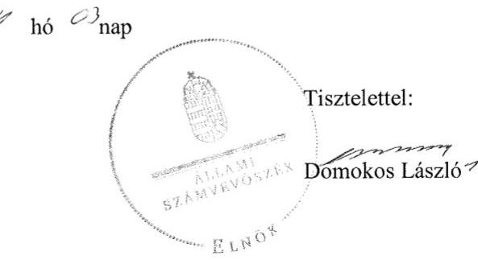

# Jelentés 

## Utóellenőrzések

A központi alrendszer egyes intézményei pénzügyi és vagyongazdálkodás ellenőrzése - Szentannai Sámuel Középiskola és Kollégium
2019. 04. hó 18. nap

---

# Jelentés 

## Utóellenőrzések

A központi alrendszer egyes intézményei pénzügyi és vagyongazdálkodás ellenőrzése - Szentannai Sámuel Középiskola és Kollégium
2019. 04. hó 18. nap

---

# AZ ELLENŐRZÉST FELÜGYELTE: 

CZÉGÉNY GYULA felügyeleti vezető

## AZ ELLENŐRZÉST VEZETTE ÉS A VÉGREHAJTÁSÁÉRT FELELŐS:

SALAMIN VIKTOR ellenőrzésvezető

## A PROGRAM ÖSSZEÁLLÍTÁSÁÉRT FELELŐS:

TÓTPÁL SZABOLCS osztályvezető

## A TÉMÁHOZ KAPCSOLÓDÓ KORÁBBI SZÁMVEVŐSZÉKI JELENTÉSEK:

- címe: Jelentés - A központi alrendszer egyes intézményei pénzügyi és vagyongazdálkodásának ellenőrzése ellenőrzéséről - Szentannai Sámuel Középiskola és Kollégium, Karcag
- sorszáma: 17192

IKTATÓSZÁM: EL-1545-001/2019.
TÉMASZÁM: 2460
ELLENŐRZÉS-AZONOSÍTÓ SZÁM: V080462

---

# TARTALOMJEGYZÉK 

■ ÖSSZEGZÉS ..... 5
■ AZ ELLENŐRZÉS CÉLJA ..... 6
■ AZ ELLENŐRZÉS TERÜLETE ..... 7
■ AZ ELLENŐRZÉS HÁTTERE, INDOKOLTSÁGA ..... 8
■ A JELENTÉS LÉNYEGES KÉRDÉSKÖRE ..... 9
■ AZ ELLENŐRZÉS HATÓKÖRE ÉS MÓDSZEREI ..... 10
■ MEGÁLLAPÍTÁSOK ..... 12
■ MELLÉKLETEK ..... 15
I. sz. melléklet: Szentannai Sámuel Középiskola és Kollégium, Karcag intézkedési terve végrehajtásának értékelése ..... 15
■ FÜGGELÉK: ÉSZREVÉTELEK ..... 19
■ RÖVIDÍTÉSEK JEGYZÉKE ..... 27

---

.

---

# ÖSSZEGZÉS 

A Szentannai Sámuel Középiskola és Kollégium a külső ellenőrzésekhez kapcsolódó beszámolási kötelezettségének nem tett eleget, ezzel nem járult hozzá az irányító szerv belső kontrollrendszerének hatékony működéséhez, a közpénzekkel és a nemzeti vagyonnal történő szabályszerű gazdálkodáshoz. Az Állami Számvevőszék a Szentannai Sámuel Középiskola és Kollégium utóellenőrzése során megállapította, hogy az intézkedési tervben vállalt feladatok végrehajtásának eredményeképpen a pénzügyi gazdálkodás területén a kockázatok csökkentek, a végre nem hajtott intézkedések miatt azonban a belső kontroll, a szabályozottság és az integritás területén változatlanul magasak.

## Az ellenőrzés társadalmi indokoltsága

Az Állami Számvevőszék stratégiájában célul tűzte ki a számvevőszéki munka hasznosulásának javítását. Ezzel összhangban ellenőrzi, hogy az ellenőrzött szervezetek megvalósították-e a korábbi ellenőrzései által feltárt hibák, hiányosságok és szabálytalanságok megszüntetése céljából elkészített intézkedési tervekben foglaltakat. A rendszeres utóellenőrzések hozzájárulnak a szükséges intézkedések tényleges végrehajtásához, ezáltal a közpénzügyek rendezettségének javulásához.

## Főbb megállapítások, következtetések

A Szentannai Sámuel Középiskola és Kollégium vezette a külső ellenőrzésekről szóló nyilvántartást, az erről szóló beszámolót azonban a jogszabályi előírás ellenére nem küldte meg az irányító szerv részére. Ezzel az irányító szerv ellenőrzésének, a költségvetési szervek belső kontrollrendszere működésének feltételeit nem biztosította, nem járult hozzá a közpénzekkel és a nemzeti vagyonnal történő szabályszerű gazdálkodáshoz.

Az Állami Számvevőszék részére megküldött intézkedési tervben meghatározott tizenhét feladatból a Szentannai Sámuel Középiskola és Kollégium tizenegyet határidőben, egyet határidőn túl végrehajtott, ötöt nem hajtott végre.

A Szentannai Sámuel Középiskola és Kollégium a szabályozottság javítása érdekében több szabályzat módosításáról gondoskodott, a Szervezeti és Működési Szabályzat, az Értékelési szabályzat, valamint az Iratkezelési szabályzat módosításának elmaradása miatt a szabályozottság területén a kockázatok továbbra is fennállnak.

A belső kontrollrendszerrel kapcsolatos kockázatok az integrált kockázatkezelési rendszer kialakításának hiánya miatt továbbra is fennállnak. A pénzügyi gazdálkodás szabályszerűsége érdekében tett intézkedés a korábban tapasztalt kockázatok csökkenéséhez vezetett.

Az integritás területén tapasztalt kockázatokat az Intézmény minden szintjén érvényesülő etikai szabályok rögzítése csökkentette, a kötelezően közzéteendő adatok teljeskörűségének hiányában azonban az Intézmény működésének átláthatósága nem volt biztosított.

A Szentannai Sámuel Középiskola és Kollégium vezette az intézkedési tervben meghatározott feladatok végrehajtásáról a jogszabály által előírt nyilvántartást.

---

# AZ ELLENŐRZÉS CÉLJA 

Az ellenőrzés célja annak értékelése volt, hogy a számvevőszéki jelentésben ${ }^{1}$ foglalt javaslatot megalapozó megállapításokkal összhangban készített intézkedési tervben meghatározott feladatokat az ellenőrzött szervezet vég-rehajtotta-e.

---

# **AZ ELLENŐRZÉS TERÜLETE**

## **Szentannai Sámuel Középiskola és Kollégium**

A karcagi Szentannai Sámuel Középiskola és Kollégium köznevelési intézmény, közfeladata szakmai középfokú oktatás nyújtása volt. A köznevelési intézményben folyó szakképzést mezőgazdaság, élelmiszeripar, környezetvédelem, rendészet, honvédelem és közszolgálat szakmacsoportokban végezték. Az Intézmény² a szakképzés mellett szakközépiskolai nevelést-oktatást, illetve szak-gimnáziumi ágazati képzést folytatott. Az alapítói, fenntartói és irányítói jogokat 2010-től a Vidékfejlesztési Minisztérium, 2014-től a Földművelésügyi Minisztérium, illetve 2018-tól az Agrárminisztérium gyakorolta.

Az intézmény az ellenőrzött időszakban gazdasági szervezetként rendelkező, önállóan működő és gazdálkodó központi költségvetési szerv volt, országos működési körrel.

Az ÁSZ³ a 2017. évben ellenőrizte az Intézmény pénzügyi és vagyongazdálkodását a 2012. január 1. és 2015. december 31. közötti időszakra vonatkozóan. Az ellenőrzés célja annak értékelése volt, hogy az ellenőrzött intézményre vonatkozó irányító szervi feladatellátás a jogszabályi előírások betartásával történt-e; az intézménynél a belső kontrollrendszer kialakítása és működtetése szabályszerű volt-e; kialakították-e az erőforrásokkal való szabályszerű, gazdaságos, hatékony és eredményes gazdálkodás követelményeit; szabályszerű volt-e a beszámolási és adatszolgáltatási kötelezettségek teljesítése; az intézmény pénzügyi és vagyongazdálkodása megfelelte-e a jogszabályi előírásoknak és belső szabályzatainak. Az erről készített 17192. számú számvevőszéki jelentését az ÁSZ 2017. szeptember 14-én hozta nyilvánosságra.

Az utóellenőrzés a számvevőszéki jelentésben megfogalmazott intézkedést igénylő megállapításokra és javaslatokra készített intézkedési terv⁴-ben foglalt feladatok végrehajtásának ellenőrzésére, értékelésére irányult.

---

# AZ ELLENŐRZÉS HÁTTERE, INDOKOLTSÁGA 

Az ÁSZ tv. ${ }^{5}$ 33. § (1) bekezdése értelmében a számvevőszéki jelentések intézkedést igénylő megállapításaihoz és javaslataihoz kapcsolódóan az ellenőrzött szervezetek vezetője intézkedési tervet köteles összeállítani, és az Állami Számvevőszék részére megküldeni.

Az ÁSZ által befogadott intézkedési tervben foglaltak megvalósítását - az ÁSZ tv. 33. § (7) bekezdésében foglaltak alapján - az Állami Számvevőszék utóellenőrzés keretében ellenőrizheti. Az utóellenőrzések keretében - az intézkedések értékelése során - az Állami Számvevőszék figyelembe veszi az ellenőrzött szervezetek működési feltételeiben, valamint a jogszabályi előírásokban bekövetkezett változásokat.

Az utóellenőrzés során az ÁSZ értékeli, hogy az érintett számvevőszéki jelentésben foglalt megállapításokkal és javaslatokkal összhangban, az ellenőrzött szervezet által készített intézkedési tervben meghatározott feladatokat a feladatra kijelöltek végrehajtották-e.

Az intézkedések végrehajtásával az adott terület szabályszerű működése vonatkozásában a kockázatok csökkenhetnek, azonban hosszabb távon az intézkedési tervben foglaltak végrehajtásával önmagában nem szűnnek meg, csak akkor, ha beépülnek az ellenőrzött szervezet működésébe, azokat folyamatosan karbantartják, figyelembe véve, illetve kezelve a változásokat. Emellett az intézkedések végrehajtásáig újabb kockázatok merülhetnek fel a szabályszerű működés vonatkozásában, amelyek kezelése szintén kiemelten fontos az ellenőrzött szervezet számára.

Az ellenőrzött szervezet vezetője által készített intézkedési tervekben foglalt feladatok hiányos, illetve késedelmes végrehajtása, vagy annak elmaradása a szabályszerűség és a felelős vezetői magatartás vonatkozásában kockázatot hordoz, ami azt mutatja, hogy az ellenőrzések során feltárt hibák, hiányosságok és szabálytalanságok kezelése nem kapott kellő hangsúlyt. Az utóellenőrzés során is fennálló szabálytalanságok esetén a közpénz, közvagyon veszélyeztetettségi kockázat valószínűsített hatásának értékelése további intézkedéseket vonhat maga után.

Az ellenőrzött szervezet szintjén az utóellenőrzés feltárja, hogy a szervezet az intézkedések végrehajtásával hasznosította-e a korábbi ellenőrzési jelentésben a hiányosságok megszüntetése, illetve a kockázatok kezelése érdekében megfogalmazott javaslatokat, illetve az intézkedések végrehajtása elmaradásának következtében továbbra is fennálló szabálytalanság esetén értékeli a közpénzek, közvagyon veszélyeztetettségét.

Az ÁSZ szintjén az utóellenőrzés visszacsatolást ad az ellenőrzési jelentések hasznosulásáról, az intézkedések elmaradásának, vagy részleges megvalósulásának a közpénzek, közvagyon veszélyeztetettségére gyakorolt valószínűsített hatásának értékelése, további intézkedéseket vonhat maga után.

---

# A JELENTÉS LÉNYEGES KÉRDÉSKÖRE 

Az ellenőrzött szervezet az intézkedési tervben foglaltakat az előírt határidőben végrehajtotta-e?

---

# AZ ELLENŐRZÉS HATÓKÖRE ÉS MÓDSZEREI 

## Az ellenőrzés típusa

Megfelelőségi ellenőrzés

## Az ellenőrzött időszak

Az utóellenőrzés alapját képező számvevőszéki jelentés közzétételének napjától az ellenőrzésről szóló kiértesítő levél keltének napjáig, azaz 2017. szeptember 14-től 2018. október 5-ig tartó időszak.

## Az ellenőrzés tárgya

A számvevőszéki jelentésben foglalt megállapításokkal és javaslatokkal összhangban az Intézmény által készített Intézkedési tervben foglaltak végrehajtásának ellenőrzése.

## Az ellenőrzött szervezet

Szentannai Sámuel Középiskola és Kollégium

## Az ellenőrzés jogalapja

Az ellenőrzés jogszabályi alapját az ÁSZ tv. 33. § (7) bekezdésének előírásai képezték.

## Az ellenőrzés módszerei

Az ellenőrzést az ellenőrzött időszakban hatályos jogszabályok, az ellenőrzés szakmai szabályai, a jelen ellenőrzésre irányadó ÁSZ módszertanok, az ellenőrzési programban foglalt értékelési szempontok szerint végeztük.

Az ellenőrzés ideje alatt az ellenőrzött szervezettel történő kapcsolattartást az ÁSZ SZMSZ ${ }^{\text {I}}$-ének vonatkozó előírásai alapján biztosítottuk.

Az utóellenőrzés megállapításait az ÁSZ rendelkezésére álló, valamint az ÁSZ adatbekérése szerint az ellenőrzött szervezet által rendelkezésre bocsátott dokumentumok alapozták meg.

Az ellenőrzési bizonyítékként felhasználható adatforrások közé tartoztak egyrészt az ellenőrzési program részletes szempontjainál felsorolt adatforrások, másrészt minden - az ellenőrzés folyamán feltárt, az ellenőrzés szempontjából információt tartalmazó - dokumentum.

---

Az intézkedési tervben előírt feladatokat azok végrehajthatósága, illetve végrehajtása szempontjából az alábbiak szerint értékeltük:
$\longrightarrow$ „határidőben végrehajtott" a feladat, ha a teljesítés dokumentáltan, az intézkedési tervben előírt határidőben és tartalommal megtörtént;
$\longrightarrow$ „határidőn túl végrehajtott" a feladat, ha annak teljesítése az intézkedési tervben meghatározott módon, de az előírt határidőn túl történt meg;
$\longrightarrow$ „részben végrehajtott" a feladat, ha végrehajtása teljes körűen az intézkedési tervben előírt módon nem történt meg;
$\longrightarrow$ „nem végrehajtott" a feladat, ha a végrehajtás nem történt meg, vagy amennyiben a teljesítést nem dokumentálták;
$\longrightarrow$ „okafogyottá vált" a feladat, ha végrehajtására - meghatározott esemény bekövetkezése, továbbá külső körülmény, a működést érintő feltétel változása miatt - már nincs szükség, illetve lehetőség, és egyértelműen megállapítható, hogy az intézkedést szükségessé tevő körülmény a jövőben nem fordulhat elő;
$\longrightarrow$ „nem időszerű" az a feladat, amelynek ellenőrzési időszakon belüli végrehajtására azért nem került (kerülhetett) sor, mert az intézkedés alapjául szolgáló esemény nem következett be, de annak jövőbeni előfordulása lehetséges, a végrehajtása nem volt esedékes, vagy a végrehajtás határideje még nem járt le.
Az ellenőrzés lefolytatásához az ellenőrzött szervezet a tanúsítványok elektronikus kitöltésével, valamint az ÁSZ által kért dokumentumok elektronikus megküldésével szolgáltatott adatokat, amelyek valódiságát és teljes körűségét az ellenőrzött szervezet vezetője által tett teljességi és hitelességi nyilatkozat igazolja. Az így rendelkezésre bocsátott adatok, információk kontrollja az ellenőrzés keretében megtörtént.

---

# MEGÁLLAPÍTÁSOK 

## Az ellenőrzött szervezet az intézkedési tervben foglaltakat az előírt határidőben végrehajtotta-e?

Összegző megállapítás

Az Intézmény vezetője a külső ellenőrzésekről nem számolt be az irányító szerv vezetőjének. Az Intézmény az intézkedési tervében szereplő tizenhét feladatból tizenkettőt hajtott végre.
1.1. számú megállapítás

Az Intézmény vezetője a külső ellenőrzésekről szóló nyilvántartást vezette, arról azonban a jogszabályi előírás ellenére nem számolt be az irányító szerv vezetőjének.

Az Intézmény intézkedési tervében meghatározott feladatok végrehajtásáról a Bkr. ${ }^{7}$ 14. § (1) bekezdésében előírt nyilvántartást a Bkr. 47. § (2) bekezdése szerinti tartalommal vezette.

Az Intézmény a Bkr. 14. § (2) bekezdésében rögzített kötelezettségének nem tett eleget, a tárgyévet követő január 31-ig nem számolt be a fejezetet irányító szerv vezetőjének és a fejezetet irányító szerv belső ellenőrzési vezetőjének.

Az Intézmény az intézkedési tervében szereplő tizenhét feladatból tizenegyet határidőben, egyet határidőn túl hajtott végre, öt feladat végrehajtása elmaradt.

Az ÁSZ a 17192. számú jelentésében az Intézmény igazgatója számára tíz javaslatot fogalmazott meg. A hiányosságok és szabálytalanságok megszüntetésére az Intézmény által készített intézkedési tervben meghatározott tizenhét - ÁSZ által beazonosított, önmagában értékelhető - feladatot, a végrehajtás határidejét, a felelősöket és a feladatok végrehajtásának értékelését az I. számú melléklet mutatja be.

Az Intézmény intézkedési tervében meghatározott feladatok végrehajtásának értékelése
 kategóriák szerinti megoszlását az 1. ábra szemlélteti.

---

A SZABÁLYOZOTTSÁG javítása érdekében az Intézmény gondoskodott a munkakörök átadása rendjének elkészítéséről, a Számviteli politika, a Gazdálkodási szabályzat, az Intézmény Gazdasági szervezete ügyrendje, a Pénzkezelési szabályzat, az Önköltségszámítási szabályzat, a Bizonylati rend szükséges módosításáról, kiegészítéséről, valamint az Intézmény SZMSZ ${ }^{8}$-ének elfogadás előtti véleményeztetéséről (1,3,4,5,6,7,8,12). A szabályozottság területén a kockázatok az intézkedések hatására csökkentek, azonban az Intézmény SZMSZ-ének, az Értékelési szabályzatnak, valamint az Iratkezelési szabályzat módosításának elmaradása miatt továbbra is fennállnak (13,14,16).

A BELSŐ KONTROLLRENDSZER javítása érdekében az Intézmény gondoskodott a belső ellenőrzésekről szóló, jogszabályban előírt nyilvántartás vezetéséről, valamint a korábban tapasztalt hiányosságok kivizsgálásáról (9,11). Az integrált kockázatkezelési rendszer kialakításáról azonban nem gondoskodott a Bkr. 7. § (1) bekezdésének előírása ellenére (15).

# A PÉNZÜGYI GAZDÁLKODÁS SZABÁLYSZERŰSÉGÉNEK javítása érdekében az Intézmény gondoskodott a vállalkozási és alaptevékenységhez kapcsolódó bevételek elkülönítéséről (10). 

AZ INTEGRITÁS TERÜLETÉN tapasztalt kockázatok csökkentése érdekében az Intézmény gondoskodott az etikai elvárások szabályozásáról az Intézmény minden szintjén (2). Az Info tv. ${ }^{9}$-ben rögzített adatok teljes körű közzétételéről ugyanakkor az Intézmény nem gondoskodott, így nem biztosította az átláthatóságot (17).

---

.

---

# MELLÉKLETEK

■ I. SZ. MELLÉKLET: SZENTANNAI SÁMUEL KÖZÉPISKOLA ÉS KOLLÉGIUM, KARCAG INTÉZKEDÉSI TERVE VÉGREHAJTÁSÁNAK ÉRTÉKELÉSE

|  Sorszám | Az intézkedési tervben rögzített feladat | Az intézkedési tervben meghatározott határidő | Az intézkedési tervben meghatározott felelős | A feladat végrehajtása  |
| --- | --- | --- | --- | --- |
|   | 1. | 2. | 3. | 4.  |
|  1. | A munkakörök átadásának rendjét el kell készíteni. | 2018. január 31. | igazgató, gazdasági igazgató | Az Intézmény 2017. december 31-én kiadott eljárásrendjében szabályozta a Szentannai Sámuel Középiskola és Kollégium vonatkozásában a munkakörökkel kapcsolatos feladat-, hatás- és jogkörök átadás-átvételével kapcsolatos rendet és feladatokat.  |
|  2. | Az intézmény szervezetének minden szintjén szabályozni kell az etikai elvárásokat. | 2018. január 31. | igazgató, gazdasági igazgató | 2017. december 27-én kiadásra került az Intézmény Etikai Kódex-e, mely szabályozta a Szentannai Sámuel Középiskola és Kollégium alkalmazottai által követendő normákat.  |
|  3. | Az iskola gazdálkodási szabályzatát ki kell egészíteni az ellenőrzési, adatszolgáltatási és beszámolási feladatok teljesítésével kapcsolatos előírásokkal, feltételekkel. | 2017. december 31. | igazgató, gazdasági igazgató | Az Intézmény 2017. december 31-én kiadott Gazdálkodási szabályzata meghatározta az érintett intézmények adatszolgáltatási és beszámolási kötelezettségével kapcsolatos feladatokat, valamint az ellenőrzéssel kapcsolatos előírásokat.  |
|  4. | A gazdasági szervezet ügyrendjét ki kell egészíteni a szervezet belső és külső kapcsolattartására vonatkozó szabályozással. | 2017. december 31. | igazgató, gazdasági igazgató | Az Intézmény Gazdasági szervezetének 2017. december 31-én kiadott és 2018. január 1-től hatályos Gazdálkodási ügyrendje tartalmazta a szervezet belső és külső kapcsolattartásra vonatkozó szabályozást.  |
|  5. | Az iskola pénzkezelési szabályzatát ki kell egészíteni a 100 ezer Ft alatti, előzetes írásbeli kötelezettségvállalást nem igénylő kifizetések esetében követendő eljárásrenddel. | 2017. december 31. | igazgató, gazdasági igazgató | A 2017. december 31-én kiadott Pénzkezelési szabályzat a 3.4.5. pontban szabályozta az előzetes írásbeli kötelezettségvállalást nem igénylő kifizetések esetén követendő eljárásrendet.  |
|  6. | Az intézményi Számviteli politikát módosítani, aktualizálni szükséges. | 2017. november 30. | igazgató, gazdasági igazgató | A 2017. november 30-án kiadott Számviteli politikája IV. rész („A gazdasági intézményhálózat könyvvezetése" c. fejezet) 2.1. és 2.2. pontjaiban szabályozta a kivételes nagyságú vagy előfordulású bevételek, valamint költségek és ráfordítások meghatározását.  |
|  7. | Az intézményi Önköltség számítási szabályzatot módosítani, aktualizálni szükséges. | 2017. november 30. | igazgató, gazdasági igazgató | A szabályzat módosítása határidőben megtörtént, alkalmas a rendszeresen végzett termékértékesítés, ill. szolgáltatásnyújtás esetében az önköltség meghatározására.  |

---

|  Az intézkedési tervben rögzített feladat | Az intézkedési tervben meghatározott határidő | Az intézkedési tervben meghatározott felelős | A feladat végrehajtása  |
| --- | --- | --- | --- |
|  1. | 2. | 3. | 4.  |
|  Az intézményi Bizonylati rendet módosítani, aktualizálni szükséges. | 2017. november 30. | igazgató, gazdasági igazgató | A bizonylatok megőrzési idejét a törvényi rendelkezéseknek megfelelően határozták meg. A szabályzat így megfelel a törvényi előírásoknak, aktualizálása megtörtént.  |
|  A belső ellenőrzés nyilvántartása elérhető a revisionSOFT Belső Ellenőrzést Támogató Rendszerében. Erről minden negyedévben ki kell nyomtatni és irattározni az aktuális állapotot. | Folyamatos. | igazgató, rendszergazda, iskolatitkár. | A Bkr. 50. § (1) bekezdés előírása alapján vezették a belső ellenőrzésekről szóló nyilvántartást. A folyamatos nyilvántartás az ellenőrzött időszakban negyedéves bontásban állt rendelkezésre.  |
|  Az intézmény minden bevételszerző tevékenységére el kell végezni az önköltségszámítást. Amennyiben a bevétel meghaladja az önköltséget, vagyis haszonszerzési céllal történt a könyvelésben, a beszámolóban illetve a pénzmaradvány kimutatásban külön kell kezelni. | Folyamatos. Legkésőbb 2017. december 31. | igazgató, gazdasági igazgató, gazdasági csoportvezető. | Az önköltségszámítást elvégezték, a vállalkozási tevékenységet a 2018. évi könyvelésben elkülönítették.  |
|  Ki kell vizsgálni, hogy a szabálytalanságok miért merültek föl. Okozott-e hátrányt, kárt az intézménynek. Megállapítható-e a személyi felelősség. Ha igen, az elkövető felelősségre vonható-e. | 2017. december 31. | igazgató, belső ellenőrzési vezető | Az Intézmény kivizsgálta a megállapított szabálytalanság körülményeit, erről jegyzőkönyv készült 2017. december 21-én a karcagi Szentannai Sámuel Középiskola és Kollégium Igazgatóhelyettesi Irodájában. A jegyzőkönyvben megállapították, hogy az ellenőrzéssel érintett időszakban kinevezett gazdasági vezető már nem dolgozik az Intézménynél. A jegyzőkönyv szerint a szabálytalanságok kapcsán anyagi kár nem érte az Intézményt.  |
|  Határidőn túl végrehajtott feladat |  |  |   |
|  Az aktuális intézményi SZMSZ-t elfogadása előtt véleményeztetni kell az érintett szervezetekkel. | 2017. december 31. | igazgató | Az Intézmény SZMSZ-e elfogadására a Diákönkormányzat, a Szülői Szervezet, valamint az Intézményi Tanács véleményezése mellett került sor. Az Intézmény SZMSZ-e tartalmáról az Intézmény a fenntartó Földművelésügyi Minisztériummal is egyeztetett, mely során az FM Agrárszakképzési főosztályvezetője az SZMSZ megfelelőségéről írt levelében küldött tájékoztatást az Intézmény igazgatója számára. A tervezet véleményeztetése után a nevelőtestület az Intézmény SZMSZ-ét 2018. április 23-án fogadta el.  |

---

|  1. | Az intézkedési tervben rögzített feladat | Az intézkedési tervben meghatározott határidő | Az intézkedési tervben meghatározott felelős | A feladat végrehajtása  |
| --- | --- | --- | --- | --- |
|   | 1. | 2. | 3. | 4.  |
|   |  | Nem végrehajtott feladatok |  |   |
|  13. | Az aktuális intézményi SZMSZ-t át kell nézni, hogy megfelel-e a törvényi előírásoknak. Amennyiben nem, az SZMSZ-t módosítani szükséges. | 2017. december 31. | igazgató | Az Intézmény SZMSZ-e az Ávr. ${ }^{10}$ 13. § (1) c) pontja értelmében nem tartalmazta a rendszeresen ellátott vállalkozási tevékenységek megjelölését, jóllehet az Intézmény több ilyen jellegű tevékenységet is végez. Az Intézmény SZMSZ-e az Ávr. 13. § (1) e) pontja értelmében nem tartalmazta a gazdasági szervezet feladatait, különös tekintettel arra, hogy a fenntartó az Áht. 10. § (4a) pontja alapján 2015. szeptember 1-jével öt további intézmény gazdasági szervezeti feladatainak ellátására is az ellenőrzött Intézményt jelölte ki. Az Intézmény SZMSZ-e ezen túlmenően nem határozta meg azon ügyköröket, amelyek során a szervezeti egységek vezetői a költségvetési szerv képviselőjeként járhatnak el (Ávr. 13. § (1) f) pont).  |
|  14. | Az intézményi Értékelési szabályzatot módosítani, aktualizálni szükséges. | 2017. november 30. | igazgató, gazdasági igazgató | A szabályzat módosítása megtörtént, azonban a beépített rendelkezés nem megfelelő, mivel nem rendelkezik a kis összegű követelések meghatározásának elveiről, az ezzel kapcsolatos dokumentálás szabályairól.  |
|  15. | Az intézmény belső kontroll rendszerén belül szabályozni, és működtetni kell a kockázatkezelést. | 2018. december 31. | igazgató | Az Intézmény integrált kockázatkezelési rendszer működtetéséről nem gondoskodott a Bkr. 7. § (1) bekezdése előírása ellenére.  |
|  16. | Módosítani kell az iratkezelési szabályzatot a törvényi előírásoknak megfelelően. | 2017. december 31. | igazgató | Az igazgató által kiadott (módosítást tartalmazó) iratkezelési szabályzat nem felelt meg az Utv. ${ }^{11}$ előírásának, mert kiadásához nem állt rendelkezésre az illetékes közlevéltár egyetértő nyilatkozata.  |
|  17. | Az Info tv.-ben meghatározott adatokat az intézmény honlapján elérhetővé kell tenni. | 2017. október 31. | igazgató, rendszergazda. | Az Intézmény nem tett eleget az Info tv. 37. § (1) bekezdésében, illetve az Info tv. 1. mellékletében foglalt megőrzési kötelezettségének a korábbi évek költségvetéseinek, költségvetési beszámolóinak közzétételével kapcsolatban, figyelemmel arra, hogy az Intézmény honlapja nem tartalmazta azokat. Az Info tv. 1. melléklet 3.2. pontjában foglalt előírással szemben nem frissítették negyedévente a 3.2. pont létszámára és személyi juttatásra vonatkozó összesített adatait. Az intézmény honlapján archívumot nem alakítottak ki, annak ellenére, hogy a nyilvánosan közzéteendő adatok megőrzési idejét az Info tv. 1. melléklete több esetben (pl.: 3.2. pont) az adat archívumban tartásával írja elő.  |

Forrás: ÁSZ által készített táblázat

---

.

---

# FÜGGELÉK: ÉSZREVÉTELEK 

A jelentéstervezetet a Számvevőszék 15 napos észrevételezésre megküldte az ellenőrzött szervezet vezetőjének az ÁSZ tv. 29. § (1) bekezdése előírásának megfelelően.

Az ellenőrzött szervezet vezetője élt az ÁSZ tv. 29. § (2) bekezdésében foglalt észrevételezési jogával, a jelentéstervezetre észrevételt tett.

[^0]
[^0]:    * 29. § (1) Az Állami Számvevőszék az ellenőrzési megállapításait megküldi az ellenőrzött szervezet vezetőjének vagy az általa megbízott személynek, és annak, akinek személyes felelősségét állapította meg.
    (2) Az ellenőrzött szervezet vezetője és a felelősként megjelölt személy az ellenőrzés megállapításaira tizenöt napon belül írásban észrevételt tehet.
    (3) Az Állami Számvevőszék az észrevételre a beérkezésétől számított harminc napon belül írásban válaszol. A figyelembe nem vett észrevételeket köteles a jelentésben feltüntetni, és megindokolni, hogy azokat miért nem fogadta el.

---

# 568 

Szentannai Sámuel Középiskola és Kollégium
Karcag, Szentannai Sámuel utca 18. 5300 Pf. 53. 5301
Tel./fax: 59/312-744, 312-451
E-mail: sztannak@externet.hu
OM-azonosító: 036005
Adószám: 15794361-2-16

Tárgy: Utóellenőrzés észrevétel
Ikatószám: S-111/9-22/2019
Hivatkozás: EL-1088-017/2019

## ÁLLAMI SZÁMVEVŐSZÉK

Budapest
Apáczai Csere János utca 10.
1052

Fenti hivatkozási számú „Utóellenőrzések - A központi alrendszer egyes intézményei pénzügyi és vagyongazdálkodás ellenőrzése - Szentannai Sámuel Középiskola és Kollégium" címû ellenőrzéshez az alábbi észrevételt teszem.

Az intézkedési terv 14. pontja szerint az értékelési szabályzat nem rendelkezik a kis összegű követelések meghatározásának elveiről, az ezzel kapcsolatos dokumentálás szabályairól.
 Az Eszközök és Források Értékelési Szabályzat III. 4. Követelések fejezetben rendelkezünk követeléstípusonként a kis összegű követelések év végi meghatározásának elveiről és a dokumentálásának szabályairól.

Az intézkedési terv 15. pontja „Az intézmény belső kontroll rendszerén belül szabályozni és működtetni kell a kockázatkezelést" feladat végrehajtásának határideje 2018. december 31. Az utóellenőrzés megkezdésekor a határidő még nem járt le, így a feladat nem „nem végrehajtott feladat", hanem „nem időszerű".

Az intézkedési terv 17. pontja „Az info törvényben meghatározott adatokat az intézmény honlapján elérhetővé kell tenni." A feladat végrehajtásánál szerepel, hogy „az intézmény nem tett eleget az info tv. 37. §. (1) bekezdésében, illetve az info tv. 1. mellékletében foglalt megőrzési kötelezettségének a korábbi évek költségvetésének, költségvetési beszámolóinak

---

közzétételével kapcsolatban, figyelemmel arra, hogy az intézmény honlapja nem tartalmazta azokat."
Az intézmény honlapján elérhető a 2017. és 2018. évi költségvetés, valamint a 2017. évi költségvetési beszámoló.

Karcag, 2019. március 7.

Tisztelettel:

---

ELNÖK

Ikt.szám: EL-1088-020/2019

# Gyökeres Sándor 

igazgató
Szentannai Sámuel Középiskola és Kollégium

## Karcag

## Tisztelt Igazgató Úr!

Köszönettel megkaptam az Állami Számvevőszékhez 2019. március 13. napján érkezett "Utóellenőrzések - A központi alrendszer egyes intézményei pénzügyi és vagyongazdálkodás ellenőrzése - Szentannai Sámuel Középiskola és Kollégium" című számvevőszéki jelentéstervezetre tett észrevételeit.

Tájékoztatom Igazgató Urat, hogy a figyelembe nem vett észrevételeket - az Állami Számvevőszékről szóló 2011. évi LXVI. törvény 29. § (3) bekezdése alapján - az Állami Számvevőszék a jelentésben szerepelteti azok elutasítása indoklásának feltüntetésével együtt.

Az Állami Számvevőszék észrevételekre vonatkozó álláspontjáról a felügyeleti vezető által készített részletes tájékoztatást csatoltan megküldöm.
Budapest, 2019.

Melléklet: Tájékoztatás a figyelembe nem vett észrevételekről, azok elutasításának indokairól

---

# Tájékoztatás 

a figyelembe nem vett észrevételekről, azok indokairól

1. Észrevétel: az ÁSZ jelentéstervezet 1.2. számú megállapításához kapcsolódó I. sz. melléklet 14. pontjában meghatározott feladat végrehajtására vonatkozóan:

Megállapítás: ,,A szabályzat módosítása megtörtént, azonban a beépített rendelkezés nem megfelelő, mivel nem rendelkezik a kis összegű követelések meghatározásának elveiről, az ezzel kapcsolatos dokumentálás szabályairól."

Észrevétel: ,,Az intézkedési terv 14. pontja szerint az értékelési szabályzat nem rendelkezik a kis összegű követelések meghatározásának elveiről, az ezzel kapcsolatos dokumentálás szabályairól. Az Eszközök és Források Értékelési Szabályzat III. 4. Követelések fejezetben rendelkezünk követeléstípusonként a kis összegű követelések év végi meghatározásának elveiről és a dokumentálásának szabályairól. "

Válasz: Az ÁSZ az észrevételt nem veszi figyelembe.
Indoklás: Az észrevétel nem megalapozott, figyelemmel arra, hogy az észrevételben hivatkozott Eszközök és Források Értékelési Szabályzat III. 4. pontjában az ellenőrzött szervezet a kis összegű követelések év végi meghatározásának elveiről és dokumentálásának szabályairól ténylegesen nem rendelkezett, azt érdemben nem részletezte, továbbá nem határozta meg azt sem, hogy érdemben mit ért alatta.

Fentiek alapján az ÁSZ fenntartja a jelentéstervezet 1.2. számú megállapításához kapcsolódó I. sz. melléklet 14. pontjában meghatározott feladat végrehajtására vonatkozóan tett tárgyi megállapítását.
2. Észrevétel: az ÁSZ jelentéstervezet 1.2. számú megállapításához kapcsolódó I. sz. melléklet 15. pontjában meghatározott feladat végrehajtására vonatkozóan:

Megállapítás: ,,Az intézmény integrált kockázatkezelési rendszer működtetéséről nem gondoskodott a Bkr. 7. § (1) bekezdése előírása ellenére."

Észrevétel: ,,Az intézkedési terv 15. pontja ,,Az intézmény belső kontroll rendszerén belül szabályozni és működtetni kell a kockázatkezelést" feladat végrehajtásának határideje 2018.

---

december 31. Az utóellenőrzés megkezdésekor a határidő még nem járt le, így a feladat nem "nem végrehajtott feladat", hanem ,,nem időszerű"."

Válasz: Az ÁSZ az észrevételt nem veszi figyelembe.
Indoklás: Az észrevétel nem megalapozott: A belső kontrollrendszeren belüli kockázatok szabályozása és működtetése időben elnyúló folyamat. Tekintettel arra, hogy az intézkedési tervben vállalt feladat határideje 2018. december 31. napja volt, az utóellenőrzés megkezdésekor (2018. október) a folyamatnak már legalább részlegesen működnie kellett volna. Fentiekre figyelemmel az utóellenőrzés megkezdésének időpontja és az intézkedésben vállalt időpont közötti időtartam alatt a vállalt feladat maradéktalan megvalósulása nem végrehajtottnak minősül.

Fentiek alapján az ÁSZ fenntartja a jelentéstervezet 1.2. számú megállapításához kapcsolódó I. sz. melléklet 15. pontjában meghatározott feladat végrehajtására vonatkozóan tett tárgyi megállapítását.
3. Észrevétel: az ÁSZ jelentéstervezet 1.2. számú megállapításához kapcsolódó I. sz. melléklet 17. pontjában meghatározott feladat végrehajtására vonatkozóan:

Megállapítás: ,,Az Intézmény nem tett eleget az Info tv. 37. § (1) bekezdésében, illetve az Info tv. 1. mellékletében foglalt megőrzési kötelezettségének a korábbi évek költségvetéseinek, költségvetési beszámolóinak közzétételével kapcsolatban, figyelemmel arra, hogy az Intézmény honlapja nem tartalmazta azokat. Az Info tv. 1. melléklet 3.2. pontjában foglalt előírással szemben nem frissítették negyedévente a 3.2. pont létszámára és személyi juttatásra vonatkozó összesített adatait. Az intézmény honlapján archivumot nem alakítottak ki, annak ellenére, hogy a nyilvánosan közzéteendő adatok megőrzési idejét az Info tv. 1. melléklete több esetben (pl.: 3.2. pont) az adat archivumban tartásával írja elő."

Észrevétel: ,,Az intézkedési terv 17. pontja ,,Az info törvényben meghatározott adatokat az intézmény honlapján elérhetővé kell tenni." A feladat végrehajtásánál szerepel, hogy ,,az intézmény nem tett eleget az info tv. 37. § (1) bekezdésében, illetve az info tv. 1. mellékletében foglalt megőrzési kötelezettségének a korábbi évek költségvetésének, költségvetési beszámolóinak közzétételével kapcsolatban, figyelemmel arra, hogy az intézmény honlapja nem tartalmazta azokat."
Az intézmény honlapján elérhető a 2017. és 2018. évi költségvetés, valamint a 2017. évi költségvetési beszámoló. "

Válasz: Az ÁSZ az észrevételt nem veszi figyelembe.

---

Indoklás: Az észrevétel nem megalapozott, figyelemmel arra, hogy az Info. tv. 1. melléklete 10 év megőrzési időt ír elő, így irreleváns az a megállapítás szempontjából, hogy az ellenőrzött szervezet honlapján elérhető a 2017. és 2018. évi költségvetés, valamint a 2017. évi költségvetési beszámoló.

Fentiek alapján az ÁSZ fenntartja a jelentéstervezet 1.2. számú megállapításához kapcsolódó I. sz. melléklet 17. pontjában meghatározott feladat végrehajtására vonatkozóan tett tárgyi megállapítását.

Budapest, 2019. április ${ }^{n}03^{n}$.

Tisztelettel:
Czégény Gyula

---

.

---

# RÖVIDÍTÉSEK JEGYZÉKE 

${ }^{1}$ számvevőszéki jelentés

${ }^{2}$ Intézmény
${ }^{3}$ ÁSZ
${ }^{4}$ intézkedési terv
${ }^{5}$ ÁSZ tv.
${ }^{6}$ ÁSZ SZMSZ
${ }^{7}$ Bkr.
${ }^{8}$ Intézmény SZMSZ-e
${ }^{9}$ Info tv.
${ }^{10}$ Ávr.
${ }^{11}$ Ltv.

Az Állami Számvevőszék 17192. számú, 2017. szeptember 14-én közzétett, „A központi alrendszer egyes intézményei pénzügyi és vagyongazdálkodásának ellenőrzése - Szentannai Sámuel Középiskola és Kollégium" című ellenőrzési jelentése
Szentannai Sámuel Középiskola és Kollégium
Állami Számvevőszék
Szentannai Sámuel Középiskola és Kollégium intézkedési terve (iktatószám: V-1251-120/2016.)
2011. évi LXVI. törvény az Állami Számvevőszékről
az Állami Számvevőszék Szervezeti és Működési Szabályzata
A költségvetési szervek belső kontrollrendszeréről és belső ellenőrzéséről szóló 370/2011. (XII. 31.) Korm. rendelet (hatályos: 2012. január 1-jétől)
Szentannai Sámuel Középiskola és Kollégium többször módosított Szervezeti és Működési Szabályzata
2011. évi CXII. törvény az információs önrendelkezési jogról és az információszabadságról
368/2011. (XII. 31.) Korm. rendelet az államháztartásról szóló törvény végrehajtásáról (hatályos 2012. január 1-től)
1995. évi LXVI. törvény a köziratokról, a közlevéltárakról és a magánlevéltári anyag védelméről

---

# ÁLLAMI SZÁMVEVŐSZÉK 

1052 Budapest, Apáczai Csere János utca 10.
Levélcím: 1364 Budapest 4. Pf. 54
Telefon: +36 14849100 Telefax: +36 14849200
www.asz.hu
