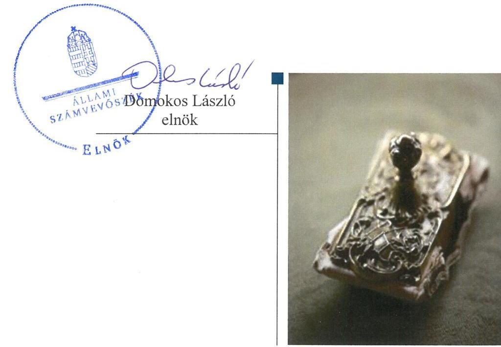

# Jelentés

## Nemzeti tulajdonú gazdasági társaságok ellenőrzése

Fény Utcai Piac Beruházó, Szervező és Üzemeltető Korlátolt Felelősségű Társaság

2019.

19063 www.asz.hu

---

# Jelentés 

## Nemzeti tulajdonú gazdasági társaságok ellenőrzése

Fény Utcai Piac Beruházó, Szervező és Üzemeltető Korlátolt Felelősségű Társaság
2019. 05. hó 24. nap

---

# AZ ELLENŐRZÉST FELÜGYELTE:

DR. HORVÁTH MARGIT felügyeleti vezető

## AZ ELLENŐRZÉST VEZETTE ÉS A VÉGREHAJTÁSÁÉRT FELELŐS:

- SIPOSNÉ DÓCZI KLÁRA ellenőrzésvezető
- A PROGRAM ÖSSZEÁLLÍTÁSÁÉRT FELELŐS:
  - TÓTPÁL SZABOLCS osztályvezető

IKTATÓSZÁM: EL-0869-074/2019

TÉMASZÁM: 2478

ELLENŐRZÉS-AZONOSÍTÓ SZÁM: V082213

Jelentéseink az Országgyűlés számítógépes hálózatán és az Interneta a www.asz.hu címen is olvashatóak.

---

# TARTALOMJEGYZÉK 

■ ÖSSZEGZÉS ..... 5
■ AZ ELLENŐRZÉS CÉLJA ..... 6
■ AZ ELLENŐRZÉS TERÜLETE ..... 7
■ AZ ELLENŐRZÉS HÁTTERE, INDOKOLTSÁGA ..... 8
■ A JELENTÉS LÉNYEGES KÉRDÉSKÖREI ..... 9
■ AZ ELLENŐRZÉS HATÓKÖRE ÉS MÓDSZEREI ..... 10
■ MEGÁLLAPÍTÁSOK ..... 12
■ MELLÉKLETEK ..... 15
I. sz. melléklet: Értelmező szótár ..... 15
■ FÜGGELÉK: ÉSZREVÉTELEK ..... 17
■ RÖVIDÍTÉSEK JEGYZÉKE ..... 19

---

.

---

# ÖSSZEGZÉS 

Budapest Főváros II. Kerületi Önkormányzat tulajdonosi joggyakorlása szabályszerű volt. A Fény Utcai Piac Beruházó, Szervező és Üzemeltető Korlátolt Felelősségű Társaság vagyongazdálkodása szabályszerű volt, ezzel biztosította a nemzeti vagyon védelmét, megőrzését.

## Az ellenőrzés társadalmi indokoltsága

Az Állami Számvevőszék kiemelt célja, hogy ellenőrzéseivel hozzájáruljon ahhoz, hogy a közpénzeket, illetve az ingyenesen juttatott közvagyont az államháztartáson kívül múködő szervezetek is átlátható, rendezett módon használják fel.

Az állam és a helyi önkormányzatok tulajdona nemzeti vagyon, melynek megőrzése érdekében kiemelten fontos a nemzeti tulajdonú gazdasági társaságok ellenőrzése. Ellenőrzésüket további társadalmi elvárás is indokolja. Részben a gazdálkodásuk körébe tartozó vagyon nagysága, részben az általuk ellátott közszolgáltatások, sajátos feladatellátások, mivel tevékenységükön keresztül a lakosság széles köre kerül kapcsolatba a társaságokkal.

Az Állami Számvevőszék céljaival és a társadalmi igénnyel összhangban, a gazdasági társaságok kiemelt fontosságú szerepe miatt került sor a Fény Utcai Piac Beruházó, Szervező és Üzemeltető Korlátolt Felelősségű Társaság vagyongazdálkodásának, illetve a Budapest Főváros II. Kerületi Önkormányzat tulajdonosi joggyakorlásának ellenőrzésére.

## Főbb megállapítások, következtetések

Budapest Főváros II. Kerületi Önkormányzat a tulajdonosi joggyakorlás kereteit a törvényi előírásoknak megfelelően alakította ki, a tulajdonosi jogait a jogszabályi és a belső előírásoknak megfelelően gyakorolta.

A Fény Utcai Piac Beruházó, Szervező és Üzemeltető Korlátolt Felelősségű Társaság az eszközöket és a forrásokat a jogszabályi és a belső előírások szerinti leltározással vette számba, a számviteli beszámolók mérlegtételeit szabályszerű leltárakkal támasztotta alá. A Társaság a vagyonának nyilvántartásait a kapcsolódó törvénynek és saját szabályzatainak megfelelően vezette, a nemzeti vagyon hasznosítása során az előírásokat betartva járt el.

---

# AZ ELLENŐRZÉS CÉLJA 

AZ ELLENŐRZÉS CÉLJA annak megállapítása volt, hogy a tulajdonosi joggyakorló a gazdasági társaságai feletti tulajdonosi joggyakorlás kereteit kialakította-e, tulajdonosi jogait megfelelően gyakorolta-e és kötelezettségeit teljesítette-e. Az ellenőrzés célja volt továbbá annak megállapítása, hogy a gazdasági társaság biztosította-e a vagyon védelmét a nyilvántartások szabályszerű vezetése és a mérleg tételeinek leltárral történő alátámasztása útján, valamint szabályszerűen gondoskodott-e a társaság használatában, kezelésében lévő nemzeti vagyon értékének megőrzéséről, gyarapításáról, hasznosításáról.

---

# **AZ ELLENŐRZÉS TERÜLETE**

## **Fény Utcai Piac Beruházó, Szervező és Üzemeltető Korlátolt Felelősségű Társaság és a tulajdonosi jogokat gyakorló Budapest Főváros II. Kerületi Önkormányzat**

A Fény Utcai Piac Beruházó, Szervező és Üzemeltető Korlátolt Felelősségű Társaságot a Budapest Főváros II. Kerületi Önkormányzat 1996. december 30-án alapította 30 M Ft^{1} pénzbeli hozzájárulással. Az ellenőrzött időszakban a Társaság^{2} 100%-ban az Önkormányzat^{3} tulajdonában állt, jegyzett tőkéje 587 M Ft volt, ami 287 M Ft pénzbeli hozzájárulásból és 300 M Ft apportból tevődött össze. A Társaság feletti tulajdonosi joggyakorlás körében az Alapító részéről hatáskör átruházásra nem került sor.

A Társaság fő tevékenysége ingatlanok bérbeadása, üzemeltetése volt. A Társaság közfeladat ellátás keretében önkormányzati tulajdonú helyiségekkel való gazdálkodást – ingatlan üzemeltetést, bérbeadást – folytatott a Vagyonhasznosítási szerződés^{4} szerint. Az önkormányzati tulajdonú ingatlanok bérbeadásának a feltételeit a 34/2004 (X.13) önkormányzati rendelet határozta meg. A Társaság tulajdonában álltak a Fény Utcai Piacon lévő üzletterületek, raktárak, őstermelői terület, valamint a mélygarázs, melyeket vállalkozási tevékenység keretében bérbeadással hasznosított.

A Társaság egyes pénzügyi adatait az 1. táblázat mutatja be.

Az ellenőrzött időszakban a Társaság a közel azonos árbevétel melletti eredményes gazdálkodás során a saját tőkéjét 64 M Ft-tal növelte. Az ellenőrzött időszakban a Társaság 80 M Ft osztalékot fizetett az Önkormányzatnak. A Társaság eszközeinek értéke 43 M Ft-tal növekedett az ellenőrzött időszakban.

A Társaság más gazdasági társaságban nem rendelkezett tulajdonnal, az ellenőrzött időszakban nem tartozott a kormányzati szektorba sorolt társaságok közé, nem rendelkezett vagyonkezelt vagyonnal.

A Társaság Ügyvezetője^{5} 1998. augusztus 24-től tölti be beosztását. A Felügyelőbizottság^{6} öt tagú, négy fő 2014. december 1-től, egy tag 2015. május 29-től látja el feladatát. A Társaság Könyvvizsgálója^{7} 1996. december 30-óta változatlan.

A Polgármester^{8} személyében az ellenőrzött időszakban nem volt változás.

1. táblázat

|  A TÁRSASÁG EGYES PÉNZÜGYI ADATAI (M FT) |  |  |   |
| --- | --- | --- | --- |
|   | 2015. | 2016. | 2017.  |
|  árbevétel | 486 | 498 | 489  |
|  eredmény | 59 | 74 | 30  |
|  összes eszköz | 1204 | 1261 | 1247  |
|  saját tőke | 1063 | 1137 | 1127  |

*Forrás: A Társaság egyszerűsített éves beszámolói 2015-2017*

---

# AZ ELLENŐRZÉS HÁTTERE, INDOKOLTSÁGA 

Az Alaptörvény 38. cikke alapján az állam és a helyi önkormányzatok tulajdona nemzeti vagyon. A nemzeti vagyon megőrzése, megóvása érdekében kiemelten fontos ezen nemzeti tulajdonú gazdasági társaságok ellenőrzése. Gazdálkodásuk jellemzően a közérdeklődés és a médiafigyelmének középpontjában áll, amihez hozzájárul a gazdálkodásuk körébe tartozó - a nemzeti vagyon részét képező - vagyon nagysága, illetve az általuk ellátott közszolgáltatások minősége és hatékonysága.

Ellenőrzéseink feltárhatják, hogy a tulajdonosi felügyelet hozzájárult-e a szabályszerű gazdálkodáshoz és feladatellátáshoz.

Az ellenőrzés eredményeként meghatározhatóvá válnak a szervezet vagyongazdálkodást érintő kockázatai, ezzel lehetővé téve a kockázatok csökkentését.

A megállapítások alapján megfogalmazott számvevő-széki javaslatok hasznosítása elősegítheti a meglévő hibák megszüntetését. A jó gyakorlatok bemutatásával az ÁSZ hozzájárulhat a követendő megoldások megismertetéséhez, terjesztéséhez.

---

# A JELENTÉS LÉNYEGES KÉRDÉSKÖREI 

1. A tulajdonosi jogok gyakorlása szabályszerű volt-e?
2. A gazdasági társaság vagyongazdálkodási tevékenysége szabályszerű volt-e?

---

# AZ ELLENŐRZÉS HATÓKÖRE ÉS MÓDSZEREI 

## Az ellenőrzés típusa

Megfelelőségi ellenőrzés.

## Az ellenőrzött időszak

A tulajdonosi joggyakorlás tekintetében az ellenőrzött időszak 2017. január 1-től az ellenőrzés megkezdésének napjáig - 2018. október 5-ig - terjedt ki az éves beszámoló elfogadása kivételével, amelynél az ellenőrzött időszak 2015. január 1-től az ellenőrzés megkezdésének napjáig tartott.

A gazdasági társaság vagyongazdálkodása vonatkozásában az ellenőrzött időszak a 2015 - 2017 évek, a 2017. évi beszámoló jóváhagyása tekintetében a 2018. június elsejéig tartó időszak.

## Az ellenőrzés tárgya

Az önkormányzat tulajdonosi joggyakorlása, a többségi tulajdonában lévő gazdasági társaság feletti tulajdonosi joggyakorlás kialakítása és múködtetése. A Társaság vagyongazdálkodása keretében a társaság használatában lévő nemzeti vagyon, illetve a saját vagyon tekintetébe a vagyonnyilvántartások vezetése, leltára.

## Az ellenőrzött szervezet

Budapest Főváros II. Kerületi Önkormányzat és a
Fény Utcai Piac Beruházó, Szervező és Üzemeltető Korlátolt Felelősségű Társaság

## Az ellenőrzés jogalapja

Az ellenőrzés jogalapját az ÁSZ tv. ${ }^{9}$ 1. § (3) bekezdése, 5. § (4) bekezdése képezi.

## Az ellenőrzés módszerei

Az ellenőrzést az ellenőrzési program ellenőrzési kérdései, az ellenőrzött időszakban hatályos jogszabályok, az ellenőrzés szakmai szabályok és módszertanok alapján, a nemzetközi standardok figyelembe vételével végeztük.

---

Az ellenőrzés ideje alatt az ellenőrzött szervezettel történő kapcsolattartást az ÁSZ Szervezeti és Működési Szabályzatának vonatkozó előírásai alapján biztosítottuk.

Az ellenőrzési kérdések megválaszolásához szükséges bizonyítékok megszerzése a következő ellenőrzési eljárások alkalmazásával történt: megfigyelés, információkérés, összehasonlítás, elemző eljárás. Az ellenőrzési bizonyítékként felhasználható adatforrások közé tartoztak az ellenőrzési programban felsorolt adatforrások, továbbá minden - az ellenőrzés folyamán - feltárt, az ellenőrzés szempontjából információkat tartalmazó dokumentum.

Az ellenőrzést a kérdésekre adott válaszok kiértékelésével, valamint a megjelölt adatforrások, a tanúsítványok felhasználásával, továbbá az adott időszakban hatályos jogszabályok figyelembe vételével folytattuk le.

A 2017. január 1-től az ellenőrzés megkezdésének napjáig ellenőriztük a tulajdonosi joggyakorlás kereteinek kialakítását, a tulajdonosi joggyakorló tevékenységét a felügyelőbizottság és a független könyvvizsgáló múködéséhez kapcsolódóan, valamint azt, hogy a tulajdonosi joggyakorló amennyiben a gazdasági társaság feladatellátásához kapcsolódóan határozott meg követelményeket, elvárásokat - a nemzeti vagyon értékének megőrzése érdekében monitorozta-e azok teljesülését. A 2015. január 1től az ellenőrzés megkezdésének napjáig ellenőriztük a tulajdonosi joggyakorló részvételét az éves beszámoló elfogadására vonatkozó döntéshozatalban.

A gazdasági társaság vagyonhoz kapcsolódó nyilvántartásai vezetésének megfelelősége, a mérleg tételeinek leltárral való alátámasztottsága, valamint a nemzeti vagyon értéke megőrzésének, gyarapításának, hasznosításának szabályszerűsége 2015. és 2017. évek tekintetében került ellenőrzésre. A teljes ellenőrzött időszakot érintően történt meg a lényeges dokumentumok értékelése.

A vagyonnyilvántartások és a leltár szabályszerűségét mintavétellel ellenőriztük. Az ellenőrzés azokra a legnagyobb értékű tételekre - lényeges sokaságra - terjedt ki, melyek összértéke elérte a teljes sokaság összértékének 50\%-át. A 2015. és a 2017. évben a lényeges sokaságot tételesen ellenőriztük.

---

# 1. A tulajdonosi jogok gyakorlása szabályszerű volt-e? 

## Összegző megállapítás

A tulajdonosi joggyakorlás szabályszerű volt.

A TULAJDONOSI JOGGYAKORLÁS KERETEIT az Önkormányzat Képviselő-testülete ${ }^{10}$, mint a Társaság alapítója és annak taggyúlési hatáskörben eljáró legfőbb szerve a jogszabályi és a belső előírásoknak megfelelően - az Mötv. ${ }^{11}$ és a Ptk. ${ }^{12}$ vonatkozó előírásai valamint az önkormányzati SZMSZ ${ }_{1-3}{ }^{13}$ és a Vagyonrendelet ${ }^{14}$ szerint - a Társaság Alapító Okirat ${ }_{1-2}{ }^{15}$-ban határozta meg. A közfeladat ellátásának feltételeit a Vagyonhasznosítási szerződés tartalmazta az önkormányzati SZMSZ ${ }_{1-3}$ és a Vagyonrendelet előírásainak megfelelően, a gazdálkodással és múködéssel kapcsolatos tulajdonosi követelmények a Társaság Alapító Okiratában ${ }_{1-2}$ kerültek meghatározásra.

Az Alapító ${ }^{16}$ a Taktv. ${ }^{17}$-ben foglalt előírások szerint Szabályzatban ${ }^{18}$ rendelkezett a vezető tisztségviselők, a felügyelőbizottsági tagok, valamint az Mt. ${ }^{19}$ 208. § hatálya alá tartozó munkavállalók javadalmazásának, valamint jogviszonyuk megszűnése esetére biztosított juttatások módjának, mértékének elveiről, annak rendszeréről.

A Felügyelőbizottság rendelkezett az Alapító által a Ptk. szerint elfogadott Ügyrenddel. ${ }^{20}$

A TULAJDONOSI JOGOKAT az Alapító a Ptk., a Számv. tv. ${ }^{21}$ és a Taktv. vonatkozó előírásainak, és az SZMSZ ${ }_{1-3}$, a Vagyonrendelet, valamint az Alapító Okirat ${ }_{1-2}$ szabályozásának eleget téve gyakorolta.

Az Alapító a Ptk. és a Taktv. előírásainak megfelelően jelölte ki a felügyelőbizottság tagjait, valamint döntött a könyvvizsgáló megbízatásának meghosszabbításáról.

Az Alapító a Felügyelőbizottság jelentését és a Könyvvizsgáló írásos véleményét figyelembe véve, a Ptk, és a Számv. tv., valamint az Alapító Okirat ${ }_{1-2}$ előírásai szerinti határozatokban döntött a Társaság egyszerűsített éves beszámolóinak elfogadásáról és az osztalékfizetésekről.

Az Alapító nem élt az Áht. ${ }^{22}$-ban számára biztosított lehetőséggel, az ellenőrzött időszakban a Társaságnál ellenőrzést nem végzett. A Felügyelőbizottság az Ügyrendjének megfelelően rendszeresen megtárgyalta és elfogadta a Társaság múködését bemutató éves üzleti terveket valamint a tervek teljesítésről szóló beszámolókat.

---

# 2. A gazdasági társaság vagyongazdálkodási tevékenysége szabályszerű volt-e? 

## Összegző megállapítás

A Társaság vagyongazdálkodása szabályszerű volt.
A Társaság rendelkezett a Számv. tv. előírásainak megfelelő Leltárkészítési és leltározási szabályzattal ${ }^{23}$. A szabályzat tartalmazta a leltározásra és leltárkészítésre vonatkozó általános szabályokat, számviteli előírásokat.

A Társaság a Számv. tv. előírásainak megfelelően az ellenőrzött időszak minden évében a Leltárkészítési és leltározási szabályzata szerinti leltározás során elkészített leltárakkal támasztotta alá az egyszerűsített éves beszámolójának mérlegtételeit, és biztosította az üzleti év mérleg-fordulónapjára vonatkozóan a főkönyvi könyvelés és az analitikus nyilvántartások adatai közötti egyeztetést. A 2015. és 2017. évi számviteli beszámolókat alátámasztó leltárak a Számv. tv. szabályozása szerint tételesen és ellenőrizhető módon tartalmazták a Társaságnak a mérleg fordulónapján fennálló eszközeit és forrásait mennyiségben és értékben.

A Társaság a vagyonhoz kapcsolódó nyilvántartásait a Számv. tv. vonatkozó előírásainak és a Társaság Értékelési szabályzatába ${ }^{24}$ foglaltaknak megfelelően vezette.

A Társaság vagyongazdálkodása a vagyonnyilvántartások és a leltárak tekintetében szabályszerű volt.

A Társaság a Vagyonhasznosítási szerződésben meghatározott nemzeti vagyon átlátható szervezetek részére bérbeadás útján történt továbbhasznosítása során betartotta az Nvtv. ${ }^{25}$, a Vagyonrendelet és a Vagyonhasznosítási szerződés előírásait.

---

.

---

# MELLÉKLETEK 

- I. SZ. MELLÉKLET: ÉRTELMEZŐ SZÓTÁR
gazdasági társaság
közfeladat
nemzeti vagyon
tulajdonosi jogok gyakorlója
nemzeti vagyon hasznosítása
nemzeti vagyon használója

A gazdasági társaságok üzletszerű közös gazdasági tevékenység folytatására, a tagok vagyoni hozzájárulásával létrehozott, jogi személyiséggel rendelkező vállalkozások, amelyekben a tagok a nyereségből közösen részesednek, és a veszteséget közösen viselik. Forrás: Ptk. 3:88. § (1) bekezdése
Az Áht. 3/A. § (1) bekezdése alapján közfeladat a jogszabályban meghatározott állami vagy önkormányzati feladat.
Nvtv. 1. § (2) bekezdése szerint nemzeti vagyonba tartozik többek között: „az állam vagy a helyi önkormányzat kizárólagos tulajdonában álló dolgok, az a) pont hatálya alá nem tartozó, állam vagy a helyi önkormányzat tulajdonában lévő dolog,
az állam vagy a helyi önkormányzat tulajdonában lévő pénzügyi eszközök, továbbá az államot vagy a helyi önkormányzatot megillető társasági részesedések, az államot vagy a helyi önkormányzatot megillető bármely vagyoni értékkel rendelkező jogosultság, amelyet jogszabály vagyoni értékű jogként nevesít."
Aki a nemzeti vagyon felett az államot vagy a helyi önkormányzatot megillető tulajdonosi jogok és kötelezettségek összességének gyakorlására jogosult. Forrás: Nvtv. 3. § (1) 17. pontja

A tulajdonosi joggyakorló vagy a nemzeti vagyon használója által a nemzeti vagyon birtoklásának, használatának, hasznok szedése jogának bármely - a tulajdonjog átruházását nem eredményező - jogcímen történő átengedése, ide nem értve a vagyonkezelésbe adást, valamint a haszonélvezeti jog alapítását. Forrás: Nvtv. 3. § (1) bekezdés 4. pont
Azon természetes személy, jogi személy vagy jogi személyiséggel nem rendelkező szervezet, aki vagy amely állami vagyon tekintetében törvény vagy szerződés alapján, a helyi önkormányzat vagyona tekintetében törvény, a helyi önkormányzat rendelete vagy szerződés alapján bármely jogcímen nemzeti vagyont birtokol, használ, szedi annak hasznait, kivéve a tulajdonosi joggyakorló. Forrás: Nvtv. 3. § (1) bekezdés 11. pont

---

.

---

# FÜGGELÉK: ÉSZREVÉTELEK 

A jelentéstervezetet a Számvevőszék 15 napos észrevételezésre megküldte az ellenőrzött szervezet vezetőjének az ÁSZ tv. 29. §* (1) bekezdése előírásának megfelelően.
Az ellenőrzött szervezetek vezetői nem tettek észrevételt a Számvevőszék 15 napos észrevételezésre megküldött

jelentéstervezetével kapcsolatban.

[^0]
[^0]:    * 29. § (1) Az Állami Számvevőszék az ellenőrzési megállapításait megküldi az ellenőrzött szervezet vezetőjének vagy az általa megbízott személynek, és annak, akinek személyes felelősségét állapította meg.
    (2) Az ellenőrzött szervezet vezetője és a felelősként megjelölt személy az ellenőrzés megállapításaira tizenöt napon belül írásban észrevételt tehet.
    (3) Az Állami Számvevőszék az észrevételre a beérkezésétől számított harminc napon belül írásban válaszol. A figyelembe nem vett észrevételeket köteles a jelentésben feltüntetni, és megindokolni, hogy azokat miért nem fogadta el.

---

.

---

# RÖVIDÍTÉSEK JEGYZÉKE 

${ }^{1} \mathrm{M} \mathrm{Ft}$
${ }^{2}$ Társaság
${ }^{3}$ Önkormányzat
${ }^{4}$ Vagyonhasznosítási szerződés
${ }^{5}$ Ügyvezető
${ }^{6}$ Felügyelőbizottság
${ }^{7}$ Könyvvizsgáló
${ }^{8}$ Polgármester
${ }^{9}$ ÁSZ tv.
${ }^{10}$ Képviselő-testület
${ }^{11}$ Mötv.
${ }^{12}$ Ptk.
${ }^{13} \mathrm{SZMSZ}_{1-3}$
${ }^{14}$ Vagyonrendelet
${ }^{15}$ Alapító Okirat ${ }_{1-2}$
${ }^{16}$ Alapító
${ }^{17}$ Taktv.
${ }^{18}$ Szabályzat
${ }^{19} \mathrm{Mt}$.
${ }^{20}$ Ügyrend
${ }^{21}$ Számv. tv.
${ }^{22}$ Áht.
millió forint
Fény Utcai Piac Beruházó, Szervező és Üzemeltető Korlátolt Felelősségű Társaság Budapest Főváros II. Kerületi Önkormányzat
a Budapest Főváros II. Kerületi Önkormányzat és Fény Utcai Piac Beruházó, Szervező és Üzemeltető Kft. között létrejött szerződés, nyilvántartási száma: OB1143/2013.
A Fény Utcai Piac Beruházó, Szervező és Üzemeltető Korlátolt Felelősségű Társaság ügyvezetője
Fény Utcai Piac Beruházó, Szervező és Üzemeltető Korlátolt Felelősségű Társaság felügyelőbizottsága
Fény Utcai Piac Beruházó, Szervező és Üzemeltető Korlátolt Felelősségű Társaság független könyvvizsgálója
Budapest Főváros II. Kerületi Önkormányzat polgármestere
2011. évi LXVI. törvény az Állami Számvevőszékről (hatályos: 2011. július 1-től)

Budapest Főváros II. Kerületi Önkormányzat Képviselő-testülete
2011. évi CLXXXIX. törvény Magyarország helyi önkormányzatairól (hatályos: 2012. január 1-től)

2013. évi V. törvény a Polgári Törvénykönyvről szóló (hatályos: 2014. március 15 -től)

1. Budapest Főváros II. Kerületi Önkormányzat Szervezeti és Működési Szabályzata, hatályos: 2015. január 1. - 2017. április 28. között
2. Budapest Főváros II. Kerületi Önkormányzat Szervezeti és Müködési Szabályzata, hatályos: 2017. április 29. - 2017. szeptember 30. között
3. Budapest Főváros II. Kerületi Önkormányzat Szervezeti és Müködési Szabályzata, hatályos: 2017. október 1. -2018. augusztus 24. között

Budapest Főváros II. Kerületi Önkormányzat 34/2004.(X.13.) önkormányzati rendelete az Önkormányzat vagyonáról és a vagyontárgyak feletti tulajdonosi jog gyakorlásáról, továbbá az önkormányzat tulajdonában lévő lakások és helyiségek elidegenítésének szabályairól, bérbeadásának feltételeiről, egységes szerkezet

1. Fény Utcai Piac Beruházó, Szervező és Üzemeltető Korlátolt Felelősségű Társaság Alapító Okirata, kelt: 2016. április 28.
2. Fény Utcai Piac Beruházó, Szervező és Üzemeltető Korlátolt Felelősségű Társaság Alapító Okirata, kelt: 2018. június 8.
Budapest Főváros II. Kerületi Önkormányzat Képviselő-testülete
2009. évi CXXII. törvény a köztulajdonban álló gazdasági társaságok takarékosabb müködéséről (hatályos: 2009. december 4-től)
Fény Utcai Piac Beruházó, Szervező és Üzemeltető Korlátolt Felelősségű Társaság Javadalmazási szabályzata (hatályos: 2013. február 28-tól)
2012. évi I. törvény a munka törvénykönyvéről (hatályos: 2012. július 1-jétől)

Fény Utcai Piac Beruházó, Szervező és Üzemeltető Korlátolt Felelősségű Társaság felügyelőbizottságának ügyrendje, melyet az Alapító 97/2010 (III.25.) sz. határozatával fogadott el
2000. évi C. törvény a számvitelről (hatályos: 2001. január 1-től)
2011. évi CXCV. törvény az államháztartásról (hatályos: 2011.december 31-től)

---

${ }^{23}$ Leltárkészítési és leltározási szabályzat
${ }^{24}$ Értékelési szabályzat
${ }^{25} \mathrm{Nvtv}$. A Fény Utcai Piac Beruházó, Szervező és Üzemeltető Korlátolt Felelősségű Társaság Leltárkészítési és leltározási szabályzata (hatályos 2013.01.01-től)
A Fény Utcai Piac Beruházó, Szervező és Üzemeltető Korlátolt Felelősségű Társaság Értékelési szabályzata 2001. évi egységes szerkezet és a 2004-2015.évig történt módosításai
2011. évi CXCVI. törvény a nemzeti vagyonról (hatályos: 2011. december 31-től)

---

# ÁLLAMI SZÁMVEVŐSZÉK 

1052 Budapest, Apáczai Csere János utca 10.
Levélcím: 1364 Budapest 4. Pf. 54
Telefon: +36 14849100 Telefax: +36 14849200
www.asz.hu