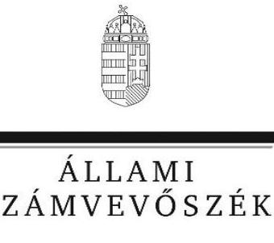

# Jelentés

## Nemzeti tulajdonú gazdasági társaságok ellenőrzése

Zöld Bicske Nonprofit Korlátolt Felelősségű Társaság

2019.

19065 www.asz.hu

---

# Jelentés 

## Nemzeti tulajdonú gazdasági társaságok ellenőrzése

Zöld Bicske Nonprofit Korlátolt Felelősségű Társaság 2019. 07. hó 15. nap

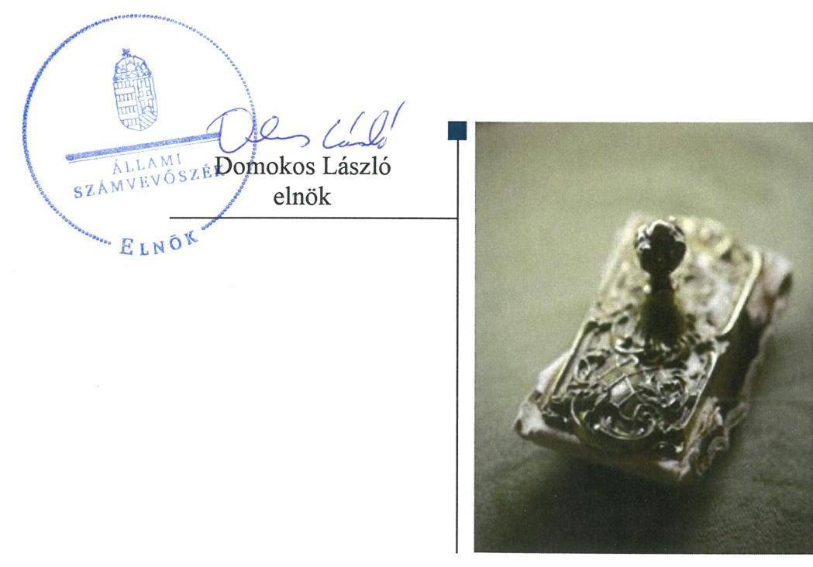

---

# AZ ELLENŐRZÉST FELÜGYELTE:

- **HORVÁTH MARGIT** felügyeleti vezető
- **AZ ELLENŐRZÉST VEZETTE ÉS A VÉGREHAJTÁSÁÉRT FELELŐS:**
  - **SALI SÁNDORNÉ** ellenőrzésvezető
  - **A PROGRAM ÖSSZEÁLLÍTÁSÁÉRT FELELŐS:**
    - **TÓTPÁL SZABOLCS** osztályvezető

**IKTATÓSZÁM:** EL-0853-105/2019

**TÉMASZÁM:** 19

**ELLENŐRZÉS-AZONOSÍTÓ SZÁM:** V-082202

Jelentéseink az Országgyűlés számítógépes hálózatán és az Interneten a www.asz.hu címen is olvashatóak.

---

# TARTALOMJEGYZÉK 

■ ÖSSZEGZÉS ..... 5
■ AZ ELLENŐRZÉS CÉLJA ..... 6
■ AZ ELLENŐRZÉS TERÜLETE ..... 7
■ AZ ELLENŐRZÉS HÁTTERE, INDOKOLTSÁGA ..... 8
■ A JELENTÉS LÉNYEGES KÉRDÉSKÖREI ..... 9
■ AZ ELLENŐRZÉS HATÓKÖRE ÉS MÓDSZEREI ..... 10
■ MEGÁLLAPÍTÁSOK ..... 12
■ JAVASLATOK ..... 14
■ MELLÉKLETEK ..... 15
I. sz. melléklet: Értelmező szótár ..... 15
■ FÜGGELÉKEK ..... 17
I. sz. függelék a jelentéshez ..... 17
II. sz. függelék: Észrevételek ..... 18
■ RÖVIDÍTÉSEK JEGYZÉKE ..... 31

---

.

---

# ÖSSZEGZÉS 

A Zöld Bicske Nonprofit Korlátolt Felelősségű Társaság felett tulajdonosi jogokat gyakorló Bicske Város Önkormányzat a tulajdonosi joggyakorlás kereteit nem a jogszabályi előírásoknak megfelelően alakította ki, a tulajdonosi jogok gyakorlása nem volt szabályszerű. A Társaság vagyongazdálkodása nem volt szabályszerű, a mérleg leltári alátámasztásának hiányában az elszámoltathatóságot nem biztosította.

## Az ellenőrzés társadalmi indokoltsága

Az Állami Számvevőszék stratégiájában megfogalmazta, hogy az államháztartáson kívül működő feladatellátó rendszerek ellenőrzéseivel hozzájárul ahhoz, hogy a közpénzeket, illetve az ingyenesen juttatott közvagyont az államháztartáson kívül működő szervezetek is átlátható, rendezett módon használják fel.

Az állam és a helyi önkormányzatok tulajdona nemzeti vagyon. A nemzeti vagyon megőrzése, megóvása érdekében kiemelten fontos a nemzeti tulajdonú gazdasági társaságok ellenőrzése.

A nemzeti tulajdonú gazdasági társaságok gazdálkodása jellemzően a közérdeklődés és a média figyelmének középpontjában áll, amihez hozzájárul a gazdálkodásuk körébe tartozó vagyon nagysága illetve az általuk ellátott közszolgáltatások minősége és hatékonysága is.

Az Állami Számvevőszék céljaival és a társadalmi igénnyel összhangban, a gazdasági társaságok kiemelt fontosságú szerepe miatt került sor a Bicske Város Önkormányzat kizárólagos tulajdonában álló Zöld Bicske Nonprofit Korlátolt Felelősségű Társaság vagyongazdálkodásának, illetve az Önkormányzat tulajdonosi joggyakorlásának ellenőrzésére.

## Főbb megállapítások, következtetések, javaslatok

A Zöld Bicske Nonprofit Korlátolt Felelősségű Társaság felett tulajdonosi jogokat gyakorló Bicske Város Önkormányzatának tulajdonosi joggyakorlása nem volt szabályszerű, mivel jogszabályi kötelezettsége ellenére a javadalmazás elveiről, annak rendszeréről szabályzatot nem alkotott.

A Zöld Bicske Nonprofit Korlátolt Felelősségű Társaság vagyongazdálkodása nem volt szabályszerű, mert a számviteli beszámoló mérlegét - az eszközöket és forrásokat mennyiségben és értékben tartalmazó - leltárral nem támasztotta alá, illetve nem győződött meg a mérlegbe került tételek valódiságáról. A Társaság a vagyonnal való gazdálkodás során a nemzeti vagyon megőrzését, elszámoltathatóságát nem biztosította.

Az Állami Számvevőszék a jelentésben foglalt megállapítások alapján Bicske Város Önkormányzat polgármesterének 2 javaslatot, a Zöld Bicske Nonprofit Korlátolt Felelősségű Társaság ügyvezetőjének pedig 2 javaslatot fogalmazott meg. A javaslatokat megalapozó megállapításokra az érintetteknek 30 napon belül intézkedési tervet kell készíteniük.

---

# AZ ELLENŐRZÉS CÉLJA 

AZ ELLENŐRZÉS CÉLJA annak megállapítása, hogy a tulajdonosi joggyakorló a gazdasági társasága feletti tulajdonosi joggyakorlás kereteit kialakította-e, tulajdonosi jogait megfelelően gyakorolta-e és kötelezettségeit teljesítette-e. Az ellenőrzés célja továbbá annak megállapítása, hogy a gazdasági társaság biztosította-e a vagyon védelmét a nyilvántartások szabályszerű vezetése, és a mérleg tételeinek leltárral történő alátámasztása útján.

---

# AZ ELLENŐRZÉS TERÜLETE 

## Zöld Bicske Nonprofit Kft. és a tulajdonosi jogokat gyakorló Bicske Város Önkormányzat

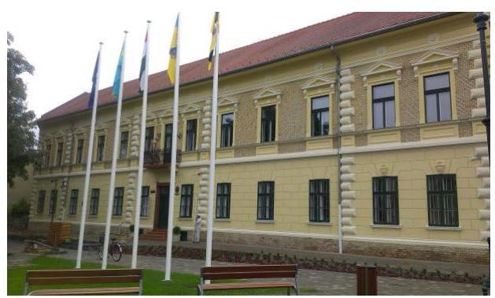

A Zöld Bicske Nonprofit Kft. 2007-ben alakult Saubermacher Bicske Kft. néven, majd a 2014. évtől Zöld Bicske Nonprofit Kft. néven működött tovább. Az Önkormányzat 2013. december 19-étől a Társaság kizárólagos tulajdonosává vált. A Társaság feletti tulajdonosi jogokat az Önkormányzat Képviselő-testülete gyakorolta.

A Társaság alapításkori - 18,0 M Ft készpénzből és 36,0 M Ft apportból álló - 54,0 M Ft törzstőkéje az ellenőrzött időszak végéig nem változott.

A Társaság közszolgáltatást végzett, fő tevékenysége nem veszélyes hulladék gyűjtése, kezelése volt. A közfeladat ellátása mellett bérbeadási és kereskedelmi tevékenységet is végzett. A Társaság Közszolgáltatási Szerződés keretében Bicske város és környékén a 2017. évben 18 településen végzett kommunális és szelektív hulladékkezelést. A Társaság tevékenységére ágazati jogszabályként a hulladékról szóló 2012. évi CLXXXV. tv. vonatkozott.

A Társaság az ellenőrzött időszakban a 2015. évben 78,3 M Ft veszteséget, a 2016. évben 73,3 M Ft veszteséget, míg 2017-ben 50,6 M Ft nyereséget ért el.

A Társaság a Számv. tv. előírása alapján az ellenőrzött időszakban könyvvizsgálatra kötelezett volt.

A Társaság a feladatait saját eszközeivel látta el, saját vagyonával gazdálkodott. Vagyonkezelésbe vett eszközzel, valamint üzemeltetési, bérleti, koncessziós szerződéssel, illetve egyéb szerződéssel nem rendelkezett. A Társaságnak más gazdasági társaságban tulajdoni részesedése nem volt és nem tartozott a kormányzati szektorba.

Az Ügyvezető személye az ellenőrzött időszak alatt nem változott, tevékenységét 2014. július 30-ától látta el.

---

# AZ ELLENŐRZÉS HÁTTERE, INDOKOLTSÁGA 

AZ ÁLLAM ÉS A HELYI ÖNKORMÁNYZATOK TULAJDONA NEMZETI VAGYON, az Alaptörvény 38. cikke alapján. A nemzeti vagyon megőrzése, megóvása érdekében kiemelten fontos ezen nemzeti tulajdonú gazdasági társaságok ellenőrzése. Gazdálkodásuk jellemzően a közérdeklődés és a médiafigyelmének középpontjában áll, amihez hozzájárul a gazdálkodásuk körébe tartozó vagyon nagysága illetve az általuk ellátott közszolgáltatások minősége és hatékonysága is.

Ellenőrzéseink feltárhatják, hogy a tulajdonosi felügyelet hozzájárult-e a szabályszerű gazdálkodáshoz és feladatellátáshoz. Az ellenőrzés eredményeként meghatározhatóvá válnak a gazdasági társaság vagyongazdálkodást érintő kockázatai, ezzel lehetővé téve a kockázatok csökkentését. A megállapítások alapján megfogalmazott számvevőszéki javaslatok hasznosítása elősegítheti a meglévő hibák megszüntetését. A jó gyakorlatok bemutatásával az ÁSZ hozzájárulhat a követendő megoldások megismertetéséhez, terjesztéséhez.

---

# A JELENTÉS LÉNYEGES KÉRDÉSKÖREI 

1. A tulajdonosi jogok gyakorlása szabályszerű volt-e?
2. A Társaság vagyongazdálkodása megfelelt-e az előírásoknak?

---

# AZ ELLENŐRZÉS HATÓKÖRE ÉS MÓDSZEREI 

## Az ellenőrzés típusa

Megfelelőségi ellenőrzés.

## Az ellenőrzött időszak

A Társaság vagyongazdálkodása vonatkozásában az ellenőrzött időszak 2015. - 2017. évek, a 2017. évi beszámoló jóváhagyása tekintetében 2018. június elsejéig tartó időszak. A Társaság feletti tulajdonosi joggyakorlás vonatkozásában az ellenőrzött időszak 2017. január 1-től az ellenőrzés megkezdésének napjáig terjedt ki az éves beszámolók elfogadása és a tulajdonosi ellenőrzése kivételével, amelyeknél az ellenőrzött időszak 2015. január 1-jétől az ellenőrzés megkezdésének napjáig - 2018. szeptember 26-áig - tartott.

## Az ellenőrzés tárgya

A Zöld Bicske Nonprofit Kft. feletti tulajdonosi joggyakorlás kialakítása és működtetése.

A Zöld Bicske Nonprofit Kft. vagyongazdálkodása keretében a társaság használatában, kezelésében lévő nemzeti vagyon, illetve a saját vagyona tekintetében a vagyonnyilvántartások vezetése, leltára.

## Az ellenőrzött szervezet

Zöld Bicske Nonprofit Korlátolt Felelősségű Társaság, valamint Bicske Város Önkormányzat, mint a Társaság feletti tulajdonosi joggyakorló.

## Az ellenőrzés jogalapja

Az ellenőrzés jogalapját az ÁSZ tv. 1. § (3) bekezdése és 5. § (3)-(5) bekezdése képezi.

## Az ellenőrzés módszerei

Az ellenőrzést az ellenőrzési program ellenőrzési kérdései, az ellenőrzött időszakban hatályos jogszabályok, az ellenőrzés szakmai szabályok és módszertanok alapján, a nemzetközi standardok figyelembe vételével végeztük.

---

Az ellenőrzés ideje alatt az ellenőrzött szervezettel történő kapcsolattartást az ÁSZ Szervezeti és Működési Szabályzatának vonatkozó előírásai alapján biztosítottuk.
2017. január 1-jétől 2018. szeptember 26-áig, az ellenőrzés megkezdésének napjáig tartó időszakra ellenőriztük a tulajdonosi joggyakorlás kereteinek kialakítását, a tulajdonosi joggyakorló tevékenységét a felügyelő bizottság és a független könyvvizsgáló működéséhez kapcsolódóan, valamint azt, hogy a tulajdonosi joggyakorló - amennyiben a gazdasági társaság feladatellátásához és vagyonkezeléséhez kapcsolódóan határozott meg követelményeket, elvárásokat - a nemzeti vagyon értékének megőrzése érdekében monitorozta-e azok teljesülését. A teljes ellenőrzött időszakra ellenőriztük a tulajdonosi joggyakorló részvételét az éves beszámoló elfogadására vonatkozó döntéshozatalban.

A gazdasági társaság vagyonhoz kapcsolódó nyilvántartásai vezetésének megfelelősége, a nemzeti vagyon értéke megőrzésének, gyarapításának, hasznosításának szabályszerűsége 2015. és 2017. évek, a mérleg tételeinek leltárral való alátámasztottsága a 2015., 2016. és a 2017. évek tekintetében került ellenőrzésre. A 2016. évi mérleg tételeinek leltárral való alátámasztottsága vonatkozásában helyszíni adatbetekintésre került sor. A teljes ellenőrzött időszakot érintően történt meg a lényeges dokumentumok értékelése.

A vagyonnyilvántartások és a leltár szabályszerűsége esetében az ellenőrzés azokra a legnagyobb értékű tételekre - a lényeges sokaságra - terjedt ki, melyek összértéke eléri a teljes sokaság összértékének 50%-át. A lényeges sokaságot tételesen ellenőriztük.

---

# 1. A tulajdonosi jogok gyakorlása szabályszerű volt-e? 

## Összegző megállapítás

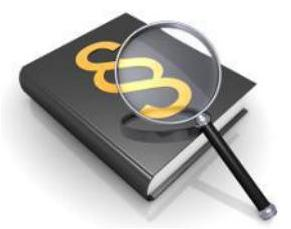

Bicske Város Önkormányzatának a Társaság feletti tulajdonosi joggyakorlása nem volt szabályszerű.

A TULAJDONOSI JOGGYAKORLÁS KERETEIT az Alapító a vagyongazdálkodási rendeletben és a társasági Alapító okiratban - az Mt., az Nvtv. és a Ptk. előírásaival összhangban - kialakította, azonban nem alkotta meg a javadalmazás rendszeréről szóló szabályzatot. Az Alapító a Taktv. 5. § (3) bekezdése ellenére a Társaság vezető tisztségviselői, felügyelőbizottsági tagjai, valamint az Mt. 208. § hatálya alá eső munkavállalók javadalmazásáról, valamint a jogviszony megszűnése esetére biztosított juttatások módjának, mértékének elveiről, annak rendszeréről szabályzatot nem alkotott.

A TULAJDONOSI JOGOK GYAKORLÁSA során az Alapító a Ptk. előírásainak megfelelően jelölte ki az FB tagjait és a könyvvizsgálót, valamint az FB és a könyvvizsgáló írásbeli jelentéseinek birtokában elfogadta a Társaság éves számviteli beszámolóit.

Az Alapító az Áht. 70. § (1) bekezdés d) pontjában foglalt lehetőséggel nem élt, az Önkormányzat belső ellenőrzése a Társaságnál ellenőrzést nem végzett. A Társaság tevékenységének nyomon követését az Alapító a Társaság éves beszámolói elfogadása, valamint az FB ellenőrzései útján biztosította. Az ügyvezető az Alapító okirat 14. pontja, a Közszolgáltatási Szerződés 1.1 és az 1.2 pontjai, valamint a 276/2016. (XI.28.) Képviselő-testületi határozat alapján az éves beszámolókon felül az FB felé negyedévente beszámolt a hulladékgazdálkodási rendszer aktuális helyzetéről, valamint a Társaság vagyoni-, pénzügyi helyzetéről, továbbá az FB évente több alkalommal beszámoltatta az ügyvezetőt.

A 2015. és 2016. évi veszteség rendezése - Alapítói döntéssel - az eredménytartalék terhére megtörtént. Az ellenőrzött időszakban tőkepótlás tekintetében intézkedési kötelezettség nem keletkezett.

## 2. A Társaság vagyongazdálkodása megfelelt-e az előírásoknak?

## Összegző megállapítás

A Társaság vagyongazdálkodása a mérlegtételek leltárral való alátámasztásának hiányában nem volt szabályszerű.

A Társaság rendelkezett a Számv. tv. előírásának megfelelő Leltárkészítési és leltározási szabályzattal. A vagyon nyilvántartása megfelelt a jogszabályi és a belső szabályozásban foglalt előírásoknak. A Társaság a tárgyi eszközök üzembe helyezését bizonylattal alátámasztotta, az eszközök besorolása, bekerülési értékének meghatározása, és az értékcsökkenés elszámolása a Számv. tv. és a belső szabályozások előírásainak megfelelően történt.

---

A VAGYONGAZDÁLKODÁS a 2015., 2016. és a 2017. években nem volt szabályszerű. A Társaság az éves beszámolók mérlegét a 2015., 2016. és a 2017. évre a Számv. tv. 69. § (1) bekezdése ellenére a mérleg fordulónapján meglévő eszközöket és forrásokat mennyiségben és értékben tartalmazó, a Leltárkészítési és leltározási szabályzat szerinti leltárral nem támasztotta alá.

 A tárgyi eszközök vonatkozásában a Társaság folyamatos mennyiségi nyilvántartást vezetett, azonban a Számv. tv. 69. § (3) bekezdésben, valamint a Leltárkészítési és leltározási szabályzatban előírtak ellenére a legalább háromévenkénti mennyiségi felvételezéssel történő leltározást nem végezte el.

A mérleg tételeit alátámasztó leltár hiányában a 2015., 2016. és a 2017. évi éves beszámolókban a Számv. tv. 15. § (3) bekezdésében foglalt előírás ellenére nem érvényesült a valódiság elve, emiatt a Társaság elszámoltathatósága, a nemzeti vagyon megőrzése nem volt biztosított.

---

# JAVASLATOK 

Az ÁSZ tv. 33. § (1) bekezdésében foglaltak értelmében az ellenőrzött szervezet vezetője köteles a jelentésben foglalt megállapításokhoz kapcsolódó intézkedési tervet összeállítani és azt a jelentés kézhezvételétől számított 30 napon belül az ÁSZ részére megküldeni. Amennyiben az ellenőrzött szervezet vezetője nem küldi meg határidőben az intézkedési tervet, vagy továbbra sem elfogadható intézkedési tervet küld, az Állami Számvevőszék elnöke az ÁSZ tv. 33. § (3) bekezdése a) és b) pontjaiban foglaltakat érvényesítheti.

## Zöld Bicske Nonprofit Korlátolt Felelősségű Társaság ügyvezetőjének

1. Intézkedjen az éves beszámoló mérlegtételeinek a Számv. tv.-ben és a Leltárkészítési és leltározási Szabályzatban előírtaknak megfelelő leltárral történő alátámasztásáról, egyúttal a Számv. tv.-ben előírt valódiság számviteli alapelv éves beszámolóban történő érvényesítéséről.
(2. sz. megállapítás 2. bekezdés 2. mondata és 3. bekezdése alapján)
2. Intézkedjen a tárgyi eszközök mennyiségi leltározásának a Számv. tv.-ben és a Leltárkészítési és leltározási Szabályzatban előírtaknak megfelelő gyakorisággal történő végrehajtásáról.
(2. sz. megállapítás 2. bekezdés 3. mondata alapján)

## Bicske Város Önkormányzat polgármesterének

1. Intézkedjen annak érdekében, hogy az Alapító a Társaság vezető tisztségviselői, a felügyelő bizottsági tagok, az Mt. 208. §-ának hatálya alá eső munkavállalók javadalmazása, valamint a jogviszony megszünése esetére biztosított juttatások módjának, mértékének elveire, annak rendszerére vonatkozó szabályzatot a Taktv.-ben előírtaknak megfelelően megalkossa.
(1. sz. megállapítás 1. bekezdése alapján)
2. Kezdeményezze a Társaságnál a leltárral és a leltározással kapcsolatban feltárt szabálytalanságok tekintetében a felelősség tisztázását és szükség szerint intézkedjen a felelősség érvényesítéséről.
(2. sz. megállapítás 2-3. bekezdései alapján)

---

# MELLÉKLETEK 

- I. SZ. MELLÉKLET: ÉRTELMEZŐ SZÓTÁR
gazdasági társaság
közszolgáltatás
közfeladat
nemzeti vagyon
nonprofit gazdasági társaság
tulajdonosi jogok gyakorlója
jelentős összegű hiba

A Ptk. 3:88. § (1) bekezdése szerint „a gazdasági társaságok üzletszerű közös gazdasági tevékenység folytatására, a tagok vagyoni hozzájárulásával létrehozott, jogi személyiséggel rendelkező vállalkozások, amelyekben a tagok a nyereségből közösen részesednek, és a veszteséget közösen viselik".
Az Ebktv. 15. § d) pontja a következőképpen határozza meg a közszolgáltatást: „szerződéskötési kötelezettség alapján a lakosság alapvető szükségleteinek ellátására irányuló szolgáltatás, így különösen a villamos energia-, gáz-, hő-, víz-, szennyvíz- és hulladékkezelési, köztisztasági, postai és távközlési szolgáltatás, továbbá a menetrend alapján közlekedő járművekkel végzett közforgalmú személyszállítás".
Az Áht. 3/A. § (1) bekezdése alapján közfeladat a jogszabályban meghatározott állami vagy önkormányzati feladat.
Nvtv. 1. § (2) bekezdése szerint nemzeti vagyonba tartozik többek között:
„az állam vagy a helyi önkormányzat kizárólagos tulajdonában álló dolgok,
az a) pont hatálya alá nem tartozó, állam vagy a helyi önkormányzat tulajdonában lévő dolog,
az állam vagy a helyi önkormányzat tulajdonában lévő pénzügyi eszközök, továbbá az államot vagy a helyi önkormányzatot megillető társasági részesedések,
az államot vagy a helyi önkormányzatot megillető bármely vagyoni értékkel rendelkező jogosultság, amelyet jogszabály vagyoni értékű jogként nevesít."
Civil tv. 9/F. § (2) bekezdése szerint „az a gazdasági társaság minősül nonprofit gazdasági társaságnak és cégnevében az a gazdasági társaság tüntetheti fel a nonprofit jelleget, amelynek létesítő okirata tartalmazza, hogy a gazdasági társaság tevékenységéből származó nyereség a tagok között nem osztható fel, hanem az a gazdasági társaság vagyonát gyarapítja." (hatályos 2014. március 15-től)
Aki a nemzeti vagyon felett az államot vagy a helyi önkormányzatot megillető tulajdonosi jogok és kötelezettségek összességének gyakorlására jogosult.
Forrás: Nvtv. 3. § (1) 17. pontja
Ha a hiba feltárásának évében, a különböző ellenőrzések során, egy adott üzleti évet érintően (évenként külön-külön) feltárt hibák és hibahatások - eredményt, saját tőkét növelő-csökkentő - értékének együttes (előjeltől független) összege meghaladja a számviteli politikában meghatározott értékhatárt. Minden esetben jelentős összegű a hiba, ha a hiba feltárásának évében az ellenőrzések során - ugyanazon évet érintően megállapított hibák, hibahatások eredményt, saját tőkét növelő-csökkentő értékének együttes (előjeltől független) összege meghaladja az ellenőrzött üzleti év mérlegfőösszegének 2 százalékát, illetve ha a mérlegfőösszeg 2 százaléka nem haladja meg az 1 millió forintot, akkor az 1 millió forintot.
Forrás: a Számv. tv. 3. § (3) bekezdés 3. pontja

---

.

---

# FÜGGELÉKEK 

- I. SZ. FÜGGELÉK A JELENTÉSHEZ

Az ÁSZ az ellenőrzések során feltárt tényekhez kapcsolódó további körülmények tisztázására eszközrendszerrel nem rendelkezik. Amennyiben az ellenőrzésen túlmutatóan indokoltnak látszik az ellenőrzés során feltárt körülmények további vizsgálata, az Állami Számvevőszék törvényi felhatalmazás alapján az ellenőrzés által feltárt körülményeket továbbítja a hatáskörrel rendelkező szervnek a szükséges intézkedések megtétele, eljárások lefolytatása érdekében.

1. A Társaság legfőbb szerve hatásköreit gyakorló Bicske Város Önkormányzat Képviselő-testülete a Taktv. 5. § (3) bekezdése ellenére a Társaság vezető tisztségviselői, felügyelőbizottsági tagjai, valamint az Mt. 208. § hatálya alá eső munkavállalók javadalmazásáról, valamint a jogviszony megszünése esetére biztosított juttatások módjának, mértékének elveiről, annak rendszeréről szabályzatot nem alkotott.
Tekintettel arra, hogy a Taktv. 5. § (3) bekezdése szerint a javadalmazási szabályzatot a cégiratok közé letétbe kell helyezni, a jelenlegi törvénysértő állapot megszüntetése érdekében indokolt a Cégbíróság értesítése.
2. A Zöld Bicske Nonprofit Kft. az ellenőrzött időszakban a beszámoló mérlegét a Számv. tv. 69. § (1) bekezdése ellenére az eszközöket és forrásokat mennyiségben és értékben tartalmazó leltárral nem támasztotta alá. A mérleg tételeit alátámasztó leltár hiányában a 2015., 2016. és a 2017. évi éves beszámolókban a Számv. tv. 15. § (3) bekezdésében foglalt előírás ellenére nem érvényesült a valódiság elve és nem igazolt, hogy a Társaság beszámolója a valós, hű képet mutatta. Emiatt a Társaság elszámoltathatósága, a nemzeti vagyon megőrzése nem volt biztosított.
A Társaság éves beszámolói nem feleltek meg a leltárral történő alátámasztásának hiánya miatt a törvényi előírásnak. A Nemzeti Adó és Vámhivatal ellenőrzi a vállalkozások beszámolóit a Számv. tv. 170. § (3) bekezdésben foglaltak alapján, ezért értesítése indokolt.
3. A leltárak hiánya ellenére a könyvvizsgáló a 2015., 2016. és a 2017. évi éves beszámolót korlátozás nélküli hitelesítő záradékkal látta el. Felmerül a Magyar Könyvvizsgálói Kamaráról, a könyvvizsgálói tevékenységről, valamint a könyvvizsgálói közfelügyeletről szóló, 2007. évi LXXV. törvény 4. § (5) bekezdés h) pontja, valamint a 174.§ (1) bekezdés c) pontja alapján a könyvvizsgáló felelőssége.

---

A jelentéstervezetet a Számvevőszék 15 napos észrevételezésre megküldte az ellenőrzött szervezetek vezetőinek az ÁSZ tv. 29. § (1) bekezdése előírásának megfelelően.

Az ellenőrzött szervezetek vezetői az ellenőrzés megállapításaira írásban észrevételt tettek. Az Állami Számvevőszék az észrevételekre írásban válaszolt. Az észrevételek, a figyelembe nem vett észrevételek és azok indokai a következők voltak:

[^0]
[^0]:    * 29. § (1) Az Állami Számvevőszék az ellenőrzési megállapításait megküldi az ellenőrzött szervezet vezetőjének vagy az általa megbízott személynek, és annak, akinek személyes felelősségét állapította meg.
    (2) Az ellenőrzött szervezet vezetője és a felelősként megjelölt személy az ellenőrzés megállapításaira tizenöt napon belül írásban észrevételt tehet.
    (3) Az Állami Számvevőszék az észrevételre a beérkezésétől számított harminc napon belül írásban válaszol. A figyelembe nem vett észrevételeket köteles a jelentésben feltüntetni, és megindokolni, hogy azokat miért nem fogadta el.

---

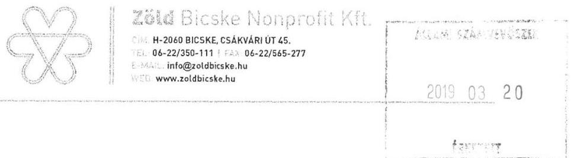

Állami Számvevőszék
Domokos László elnök

Tisztelt Elnök Úr!

Mellékelten küldöm a 2019. február 27-én kelt, EL-0853-065/2019 iktatószámú levelével elküldött jelentéstervezettel kapcsolatos észrevételeimet.

Bicske, 2019. március 14.
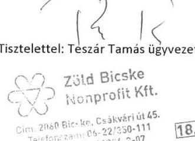

---

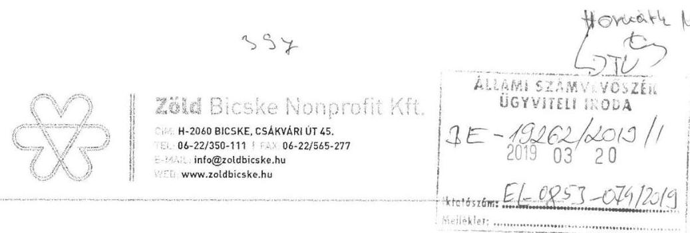

Domokos László elnök

Tárgy: Észrevétel

Tisztelt Elnök Úr!
2019. február 27-én kelt, EL-0853-065/2019 iktatószámú levelével elküldött jelentéstervezetére az alábbi észrevételt teszem.

A jelentéstervezet 13. oldalán olvasható Összegző megállapítás / A vagyongazdálkodás két bekezdésében foglaltakkal kapcsolatban észrevételezem, hogy 2014. december végén egy, a társaságunktól teljesen független, erre szakosodott cég mennyiségi felvétellel és a tételek értékelésével teljes körű leltározást végzett, mind a tárgyi eszközök, mind az eszközök és források egyéb tételei vonatkozásában. A leltározás során a tárgyi eszközöket egyedi vonalkódokkal láttuk el. Számviteli politikánk háromévenkénti mennyiségi felvételezéssel történő leltározást ír elő, így 2015. évre a tárgyi eszközök leltárazásának hiányára vonatkozóan nem tehető a társaságra terhelő megállapítás.

A tárgyi eszközök 2014. évi mennyiségi felvételezéssel történő leltározása után legközelebb 2017-ben kellett volna leltároznunk. Ez valóban nem történt meg teljeskörűen, melynek oka az, hogy 2016. végén ismét leltároztunk, ezért legközelebb csak 2019. végén esedékes a tárgyi eszközök mennyiségi felvételezéssel történő leltározása. Ennek megfelelően a tárgyi eszközök leltárazásának hiányára vonatkozóan 2017-re sem tehető a társaságra terhelő megállapítás.

A Számviteli politika szerinti leltározási kötelezettség az alábbiak szerint kötelező:
Immateriális javakat, a tárgyi eszközöket (összességében a befektetett eszközöket)

- évente egyeztetéssel
- három évente mennyiségi felvétellel,

A készleteket

- évente mennyiségi felvétellel,

Egyéb eszközöket és a forrásokat

- évente egyeztetéssel szükséges leltározni.

A 2014. évi teljes leltárt követően 2015-ben és 2017-ben a befektetett eszközök egyeztetéssel történő leltározása és értékelése, a készletek mennyiségi felvétele, az egyéb eszközök (követelések, pénzeszközök) és források (kötelezettségek) egyeztetéssel történő leltározása is megtörtént.

Bicske, 2019. március 14.
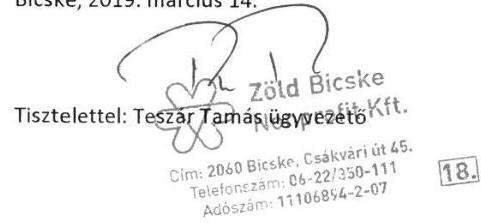

---

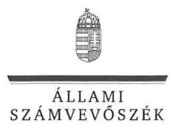

ELNÖK

Ikt.szám: EL-0853-086/2019.

Teszár Tamás úr
ügyvezető
Zöld Bicske Nonprofit Korlátolt Felelősségű Társaság

Bicske

# Tisztelt Ügyvezető Úr! 

Köszönettel vettem a „Nemzeti tulajdonú gazdasági társaságok ellenőrzése - Zöld Bicske Nonprofit Korlátolt Felelősségű Társaság" címmel készített számvevőszéki jelentéstervezetre a 2019. március 14-én kelt levelében megküldött észrevételét.
Tájékoztatom Ügyvezető urat, hogy az ellenőrzés keretében a 2019. április 4-i helyszíni adatbekérés során rendelkezésünkre bocsátott kiegészítő dokumentumokat feldolgozzuk, értékeljük. Amennyiben szükséges a jelentéstervezet módosítása, azt észrevételezés céljából megküldjük az ellenőrzöttek részére.

Budapest, 2019. 09. 77.
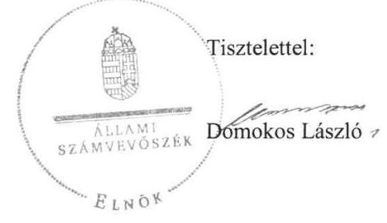

---

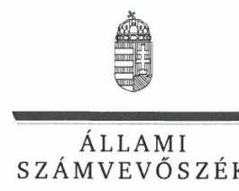

ELNÖK

Ikt.szám: EL-0853-098/2019.

# Teszár Tamás úr 

ügyvezető
Zöld Bicske Nonprofit Korlátolt Felelősségű Társaság

## Bicske

## Tisztelt Ügyvezető Úr!

Észrevételét a „Nemzeti tulajdonú gazdasági társaságok ellenőrzése - Zöld Bicske Nonprofit Korlátolt Felelősségű Társaság" címmel készített számvevőszéki jelentéstervezetre a 2019. március 14-én kelt levelében küldte meg az Állami Számvevőszék részére.
Az észrevételre hivatkozással EL-0853-086/2019. iktatószámú, 2019. április 11-én kelt levelemben tájékoztattam Ügyvezető urat a 2019. április 4-i helyszíni adatbekérés során rendelkezésünkre bocsátott kiegészítő dokumentumok feldolgozásáról, értékeléséről, továbbá arról, hogy ennek kapcsán a jelentéstervezet módosítása válhat szükségessé.
A kiegészítő dokumentumok feldolgozása és értékelése a jelentéstervezet módosítását tette szükségessé, a módosított jelentéstervezetet ezt követően - EL-0853-091/2019. iktatószámú, 2019. május 15-én kelt kísérőlevéllel - 15 napos észrevételezésre ismételten megküldtük Ügyvezető úr részére. Az ismételten kiküldött jelentéstervezetre a rendelkezésre álló időtartamon belül észrevétel nem érkezett a Társaságtól.
Előbbiek alapján, jelen levelem melléklete az Állami Számvevőszék, 2019. március 14-én kelt levélben megküldött észrevételre vonatkozó álláspontját tartalmazza - a felügyeleti vezető által készített - részletes tájékoztatás formájában.
Tájékoztatom Ügyvezető urat, hogy az Állami Számvevőszék a figyelembe nem vett észrevételeket az Állami Számvevőszékről szóló 2011. évi LXVI. törvény 29. § (3) bekezdésében előírtak
 szerint köteles a jelentésében feltüntetni és megindokolni, hogy azokat miért nem fogadta el.

Budapest, 2019.
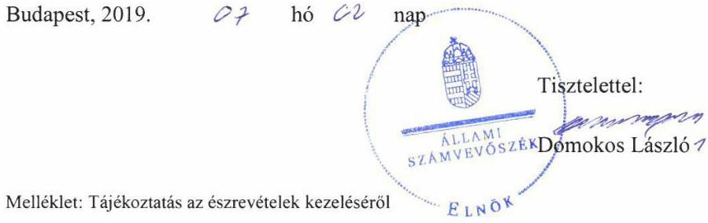

Melléklet: Tájékoztatás az észrevételek kezeléséről

---

# Tájékoztatás az észrevételek kezeléséről 

Megköszönöm Ügyvezető úrnak a „Nemzeti tulajdonú gazdasági társaságok ellenőrzése - Zöld Bicske Nonprofit Korlátolt Felelősségű Társaság" címmel készített jelentéstervezetre tett észrevételét. Az észrevétel kezeléséről az alábbi tájékoztatást adom.

## Ügyvezető úr az alábbi észrevételt tette:

„A jelentéstervezet 13. oldalán olvasható Összegző megállapítás / A vagyongazdálkodás két bekezdésében foglaltakkal kapcsolatban észrevételezem, hogy 2014. december végén egy, a társaságunktól teljesen független, erre szakosodott cég mennyiségi felvétellel és a tételek értékelésével teljes körű leltározást végzett, mind a tárgyi eszközök, mind az eszközök és források egyéb tételei vonatkozásában. A leltározás során a tárgyi eszközöket egyedi vonalkódokkal láttuk el.
Számviteli politikánk háromévenkénti mennyiségi felvételezéssel történő leltározást ír elő, így 2015. évre a tárgyi eszközök leltárazásának hiányára vonatkozóan nem tehető a társaságra terhelő megállapítás.
A tárgyi eszközök 2014. évi mennyiségi felvételezéssel történő leltározása után legközelebb 2017-ben kellett volna leltároznunk. Ez valóban nem történt meg teljes körűen, melynek oka az, hogy 2016 végén ismét leltároztunk, ezért legközelebb csak 2019 végén esedékes a tárgyi eszközök mennyiségi felvételezéssel történő leltározása. Ennek megfelelően a tárgyi eszközök leltárazásának hiányára vonatkozóan 2017-re sem tehető a társaságra terhelő megállapítás.
A Számviteli politika szerinti leltározási kötelezettség az alábbiak szerint kötelező:
Immateriális javakat, a tárgyi eszközöket (összességében a befektetett eszközöket)

- $\quad$ évente egyeztetéssel,
- háromévente mennyiségi felvétellel,

A készleteket

- $\quad$ évente mennyiségi felvétellel,

Egyéb eszközöket és a forrásokat

- $\quad$ évente egyeztetéssel szükséges leltározni.

A 2014. évi teljes leltárt követően 2015-ben és 2017-ben a befektetett eszközök egyeztetéssel történő leltározása és értékelése, a készletek mennyiségi felvétele, az egyéb eszközök (követelések, pénzeszközök) és források (kötelezettségek) egyeztetéssel történő leltározása is megtörtént."

Az észrevétel a jelentéstervezet 2. számú megállapítás 2. és 3. bekezdését, valamint a Zöld Bicske Nonprofit Korlátolt Felelősségű Társaság ügyvezetőjének címzett 1. és 2. számú javaslatot érintette.
Ügyvezető úr észrevételében leírtak alapján a jelentéstervezet 2. számú megállapítás 2. és 3. bekezdését, valamint Zöld Bicske Nonprofit Korlátolt Felelősségű Társaság ügyvezetőjének címzett 1. és 2. számú javaslatot nem módosítom az alábbiak miatt.

## Az észrevétel első, második és utolsó részéhez - a leltár és a leltározás végrehajtásához kapcsolódóan:

Az Állami Számvevőszék (ÁSZ) az ellenőrzés során az EL-0853-003/2018. iktatószámú (2018. június 22-én kelt) adatbekérő levél 2. számú melléklet 9. bekezdés 3. pontjában kérte a 2015.,

---

2016. és 2017. évekre vonatkozóan a gazdasági társaság Számviteli törvény szerinti beszámolója mérleg tételeit alátámasztó leltárakat.
Ezt követően az ÁSZ az EL-0853-014/2018. iktatószámú (2018. szeptember 12-én kelt) adatbekérő levél 2. számú melléklet 9. bekezdés 20. pontjában kérte a gazdasági társaságra vonatkozóan a 2015., 2016., 2017. évi leltározáshoz kapcsolódó dokumentumokat, azaz: leltározási ütemterv, leltározási elrendelő, leltáregyeztető, leltárkiértékelés a leltáreltérésekről (amennyiben nem volt leltárkiértékelés nemleges nyilatkozat), leltárhiány esetén a személyi felelősség megállapítását tartalmazó dokumentum, a főkönyvi könyvelés és az analitikus nyilvántartások adatai közötti egyeztetés dokumentumait.
Ügyvezető úr az EL-0853-003/2018. iktatószámú adatbekéréssel összefüggésben az átadott dokumentumok hiánytalanságáról és teljességéről nyilatkozott a 2018. július 5-én kelt teljességi és hitelességi nyilatkozatában. A teljességi és hitelességi nyilatkozat mellékletében felsorolt dokumentumok azonban a leltárak tekintetében nem voltak teljes körűek, mivel a Társaság az ellenőrzés számára nem adta át a 2015. évi leltárt tekintve az eszközök esetében a beruházások, felújítások, késztermékek, követelések áruszállításból és szolgáltatásból (vevők), követelések kapcsolt vállalkozással szemben, egyéb követelések, aktív időbeli elhatárolások; a források esetében a mérleg szerinti eredmény kivételével valamennyi mérlegsor leltárát. Az áruk mérlegsor leltára hiányos volt, az anyagok mérlegsor esetében a munkaruha leltár nem támasztotta alá a főkönyvi kivonatot. A Társaság a 2017. évre vonatkozóan nem adta át a követelések áruszállításból és szolgáltatásból (vevők), az egyéb követelések, a saját tőke mérlegsorai - a jegyzett tőke és az adózott eredmény kivételével - és az egyéb rövid lejáratú kötelezettségek leltárát. A kötelezettségek áruszállításból és szolgáltatásból (szállítók) mérlegsort a leltár nem támasztotta alá.
Ügyvezető úr az EL-0853-014/2018. iktatószámú adatbekéréssel összefüggésben az átadott dokumentumok hiánytalanságáról és teljességéről nyilatkozott a 2018. szeptember 24-én kelt teljességi és hitelességi nyilatkozatában. A teljességi és hitelességi nyilatkozat mellékletében felsorolt dokumentumok azonban az észrevételben hivatkozottak ellenére a tárgyi eszközök 2015., 2016., 2017. évi leltározásához kapcsolódó, az adatbekérő levélben felsorolt dokumentumokat nem tartalmazták.
A 2015. és a 2017. évi leltári dokumentumok, valamint a leltározási dokumentáció hiányossága miatt a jelentéstervezet megállapítása és javaslatai továbbra is helytállóak.

# Az észrevétel harmadik - a számviteli politika leltározásra vonatkozó tartalmához kapcsolódó - részéhez kapcsolódóan: 

A jelentéstervezet a Társaság számviteli politikájának részét képező leltárkészítési és leltározási szabályzat tartalmát megfelelőnek értékelte. Erre tekintettel az észrevétel harmadik részében a számviteli politikában felsorolt leltározási gyakoriságokat illetően a szabályozás és az ellenőrzés megállapítása között eltérés nincs. Erre tekintettel a jelentéstervezet módosítása nem indokolt.

Budapest, 2019. 07 hó 0 nap
Dr. Horváth Margit felügyeleti vezető

---

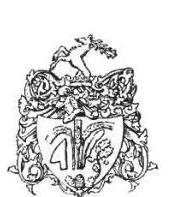

# Bicske Város Önkormányzata 

Iktatószám: Pü-345-3/2019.
Tárgy: Észrevétel a Zöld
Bicske Nonprofit Kft. ellenőrzése kapcsán tett jelentéstervezetre

## ÁLLAMI SZÁMVEVŐSZÉK

## Domokos László

## Elnök Úr részére

## Budapest

1052
Apáczai Csere János utca 10.

## Tisztelt Elnök Úr!

Az EL-0853-066/2019. iktatószámú levelükre, amelyben a Zöld Bicske Nonprofit Korlátolt Felelősségű Társaság (a továbbiakban: Társaság) ellenőrzése során tett megállapításaikat Jelentéstervezet formájában megküldték részemre - mint a Társaság felett tulajdonosi jogokat gyakorló Bicske Város Önkormányzat polgármesterének -, az Állami Számvevőszékről szóló 2011. évi LXVI. tv. 29.§ (2) bekezdése alapján az alábbi észrevételeket teszem:

## I. Megállapítás: „Bicske Város Önkormányzatának a Társaság feletti tulajdonosi joggyakorlása nem volt szabályszerű"

Bicske Város Önkormányzat Képviselő-testülete a 249/2018. (IX. 26.) határozatával elfogadta a többségi önkormányzati tulajdonban lévő társaságok ügyvezetőjének, felügyelő bizottsági tagjainak, valamint a Munka Törvénykönyvéről szóló 2012. évi I. törvény 208. § szerinti vezető állású munkavállalóinak javadalmazásáról, továbbá a jogviszony megszűnése esetére biztosított juttatások módjának, mértékének főbb elveiről szóló javadalmazási szabályzatait. Ezzel egyidejűleg a köztulajdonban álló gazdasági társaságok takarékosabb működéséről szóló 2009. évi CXXII. törvényben foglaltaknak megfelelően a javadalmazási szabályzat a Cégbíróságnál letétbe helyezésre került.
Nevezett képviselő testületi határozatot és a javadalmazási szabályzatot mellékelten megküldöm, amelyeket kérem szíveskedjenek a végleges vizsgálati jelentés elkészítésekor figyelembe venni.

[^0]
[^0]:    2060 Bicske, Hősök tere 4.
    Tel. 06(22)565-464
    bonlap: www.bicske.hu
    e-mail: polgármester@bicske.hu
    hivatali kapu:
    rövidnév: BICSKEONK
    KRID: 341914991

---

II. Megállapítás: „A Társaság vagyongazdálkodása a mérlegtételek leltárral való alátámasztásának hiányában nem volt szabályszerű"
A jelentéstervezet II. megállapításában szereplő tények (a leltárral és a leltározással kapcsolatban feltárt szabálytalanságok) tekintetében kezdeményeztem az ügyvezetőnél a felelősség tisztázását és szükség esetén intézkedni fogok a felelősség érvényesítéséről.

Kérem Elnök Urat az észrevételeim végleges jelentésben történő figyelembevételére.

Bicske, 2019. március 12.
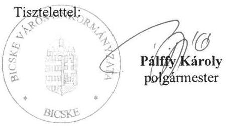

---

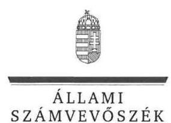

# Pálffy Károly úr 

polgármester

## Bicske Város Önkormányzata

## Bicske

## Tisztelt Polgármester Úr!

Köszönettel vettem a „Nemzeti tulajdonú gazdasági társaságok ellenőrzése - Zöld Bicske Nonprofit Korlátolt Felelősségű Társaság" címmel készített számvevőszéki jelentéstervezetre Pü-345-3/2019. iktatószámú, 2019. március 12-én kelt levelében megküldött észrevételét.
Tájékoztatom Polgármester urat, hogy az ellenőrzés keretében 2019. április 4-én a Zöld Bicske Nonprofit Korlátolt Felelősségű Társaságnál helyszíni adatbekérésre került sor. Az adatbetekintés során rendelkezésünkre bocsátott kiegészítő dokumentumokat feldolgozzuk, értékeljük. Amennyiben szükséges a jelentéstervezet módosítása, azt észrevételezés céljából megküldjük az ellenőrzöttek részére.

Budapest, 2019. 04 hó 7 nap
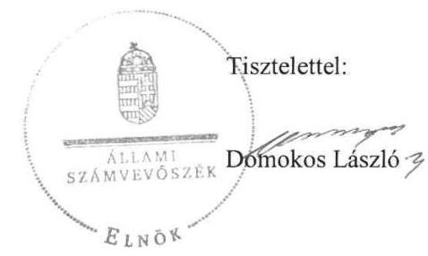

---

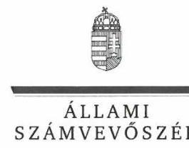

ELNÖK

Ikt.szám: EL-0853-100/2019.

# Pálffy Károly úr 

polgármester

## Bicske Város Önkormányzata

## Bicske

## Tisztelt Polgármester Úr!

Észrevételét a „Nemzeti tulajdonú gazdasági társaságok ellenőrzése - Zöld Bicske Nonprofit Korlátolt Felelősségű Társaság" címmel készített számvevőszéki jelentéstervezetre, Pü-345-3/2019. iktatószámú, 2019. március 12-én kelt levelében küldte meg az Állami Számvevőszék részére.
Az észrevételre hivatkozással EL-0853-088/2019. iktatószámú, 2019. április 11-én kelt levelemben tájékoztattam Polgármester urat a 2019. április 4-i helyszíni adatbekérés során rendelkezésünkre bocsátott kiegészítő dokumentumok feldolgozásáról, értékeléséről, továbbá arról, hogy ennek kapcsán a jelentéstervezet módosítása válhat szükségessé.
A kiegészítő dokumentumok feldolgozása és értékelése a jelentéstervezet módosítását tette szükségessé, a módosított jelentéstervezetet ezt követően - EL-0853-092/2019. iktatószámú, 2019. május 15-én kelt kísérőlevéllel - 15 napos észrevételezésre ismételten megküldtük Polgármester úr részére. Az ismételten kiküldött jelentéstervezetre a rendelkezésre álló időtartamon belül észrevétel nem érkezett az Önkormányzattól.
Előbbiek alapján, jelen levelem melléklete az Állami Számvevőszék, Pü-345-3/2019. iktatószámú, 2019. március 12-én kelt levélben megküldött észrevételre vonatkozó álláspontját tartalmazza - a felügyeleti vezető által készített - részletes tájékoztatás formájában.
Tájékoztatom Polgármester urat, hogy az Állami Számvevőszék a figyelembe nem vett észrevételeket az Állami Számvevőszékről szóló 2011. évi LXVI. törvény 29. § (3) bekezdésében előírtak szerint köteles a jelentésében feltüntetni és megindokolni, hogy azokat miért nem fogadta el.

Budapest, 2019.
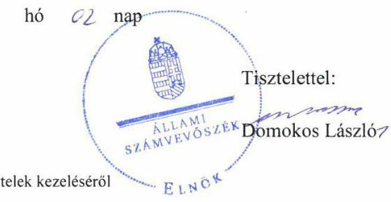

Melléklet: Tájékoztatás az észrevételek kezeléséről

---

# Tájékoztatás az észrevételek kezeléséről 

Megköszönöm Polgármester úrnak a „Nemzeti tulajdonú gazdasági társaságok ellenőrzése - Zöld Bicske Nonprofit Korlátolt Felelősségű Társaság" címmel készített jelentéstervezetre tett észrevételeit. Az észrevételek kezeléséről az alábbi tájékoztatást adom.

## 1. számú észrevétel:

Polgármester úr észrevételében arról tájékoztatott, hogy Bicske Város Önkormányzat (Önkormányzat) Képviselő-testülete a 249/2018. (IX. 26.) határozatával elfogadta a többségi önkormányzati tulajdonban lévő társaságok ügyvezetőjének, felügyelő bizottsági tagjainak, valamint a Munka Törvénykönyvéről szóló 2012. évi I. törvény 208. § szerinti vezető állású munkavállalóinak javadalmazásáról, továbbá a jogviszony megszűnése esetére biztosított juttatások módjának, mértékének főbb elveiről szóló javadalmazási szabályzatait. Ezzel egyidejűleg a köztulajdonban álló gazdasági társaságok takarékosabb működéséről szóló 2009. évi CXXII. törvényben foglaltaknak megfelelően a javadalmazási szabályzat a Cégbíróságnál letétbe helyezésre került.
Polgármester úr a képviselő testületi határozatot és a javadalmazási szabályzatot levele mellékleteként megküldte, mely dokumentumok figyelembevételét kérte a végleges vizsgálati jelentés elkészítésekor.
Az észrevétel a jelentéstervezet 1. sz. megállapítás összegző megállapítását, az 1. sz. megállapítás 1. bekezdését, valamint Bicske Város Önkormányzata polgármesterének címzett 1. számú javaslatot érintette.
Polgármester úr észrevételében leírtak alapján a jelentéstervezet megállapításait, valamint Bicske Város Önkormányzata polgármesterének címzett 1. számú javaslatot nem módosítom az alábbiak miatt:
Az Állami Számvevőszék (ÁSZ) az ellenőrzés során az EL-0853-004/2018. iktatószámú (2018. augusztus 22-én kelt) adatbekérő levél 2. számú melléklet 8. bekezdés 1. pontjában kérte a gazdasági társaságra vonatkozóan a vezető tisztségviselők, felügyelőbizottsági tagok, az Mt. 208. §-ának hatálya alá eső munkavállalók javadalmazása, valamint a jogviszony megszüntetése esetére biztosított juttatások módjának, mértékének elveiről, annak rendszeréről szóló - 2017. január 1-től az ellenőrzés megkezdésének napjáig hatályos - szabályzatot, a szabályzat elfogadását tartalmazó jegyzőkönyveket, jelenléti íveket, határozatot.
Polgármester úr az EL-0853-004/2018. iktatószámú adatbekéréssel összefüggésben az átadott dokumentumok hiánytalanságáról és teljességéről nyilatkozott a 03-3726-2/2018. iktatószámú, 2018. augusztus 31-én kelt levél mellékleteként megküldött teljességi és hitelességi nyilatkozatban. A teljességi és hitelességi nyilatkozat melléklete 2. pontjában felsorolt dokumentumok szerint azonban az ellenőrzés számára javadalmazási szabályzatot nem adott át.
Az észrevételhez mellékletként benyújtott dokumentumokat az
 ellenőrzés jelen szakaszában az ÁSZ nem veszi figyelembe, mivel ellenőrzési dokumentumként az Állami Számvevőszékről szóló 2011. évi LXVI. törvény (ÁSZ tv.) 28. § (2) bekezdésében meghatározott adatszolgáltatási időszakon belül megküldött és a teljességi és hitelességi nyilatkozatban szereplő dokumentumok vehetők figyelembe.

---

Tájékoztatom Polgármester urat, hogy az észrevételhez mellékletként csatolt dokumentumok Bicske Város Önkormányzat Képviselő-testületének 249/2018. (IX. 26.) határozata Bicske Város Önkormányzat kizárólagos, vagy többségi tulajdonában lévő gazdasági társaságok - Zöld Bicske Nonprofit Kft. - javadalmazási szabályzatáról, valamint a vezető tisztségviselő, felügyelőbizottsági tagok javadalmazása, valamint a jogviszony megszünése esetére biztosított juttatások módjának, mértékének főbb elveiről, annak rendszeréről szóló javadalmazási szabályzat tartalmát a jelen felügyeleti vezetői tájékoztatásban nem értékeltem.

# 2. számú észrevétel: 

Polgármester úr észrevételének második részében arról tájékoztatott, hogy a jelentéstervezet 2. számú megállapításában szereplő megállapítások - a leltárral és a leltározással kapcsolatban feltárt szabálytalanságok - tekintetében kezdeményezi az ügyvezetőnél a felelősség tisztázását és szükség esetén intézkedik a felelősség érvényesítéséről.
Polgármester úr által adott tájékoztatás a jelentéstervezet 2. sz. megállapítás összegző megállapításában, a 2. sz. megállapítás 2. bekezdésében tett megállapításokat, valamint Bicske Város Önkormányzata polgármesterének tett 2. számú javaslat tartalmát nem vitatja, a megállapítás és a javaslat továbbra is helytálló, módosításuk nem indokolt.

Felhívom Polgármester úr figyelmét arra, hogy a számvevőszéki jelentés kiadását követően az ÁSZ tv. 33. § (1) bekezdése alapján készítendő intézkedési tervbe a leltári és a leltározási hiányosságok miatti felelősség tisztázásával kapcsolatosan tervezett intézkedések - a konkrét intézkedésekkel, felelőssel, határidővel kiegészítést követően - beilleszthetők.

Budapest, 2019. O7 hó " 0 "nap
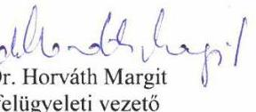

---

# RÖVIDÍTÉSEK JEGYZÉKE 

${ }^{1}$ Önkormányzat
${ }^{2}$ Társaság
${ }^{3}$ Számv. tv.
${ }^{4}$ Ügyvezető
${ }^{5}$ Alapító
${ }^{6}$ Vagyongazdálkodási rendelet
${ }^{7}$ Alapító okirat ${ }_{1-2}$

Bicske Város Önkormányzat
Zöld Bicske Nonprofit Kft.
2000. évi C. törvény a számvitelről

Zöld Bicske Nonprofit Kft. ügyvezetője
Bicske Város Önkormányzat Képviselő-testülete
Bicske Város Önkormányzat Képviselő-testületének 29/2014. (XII. 22.)
önkormányzati rendelete az Önkormányzat vagyonáról és a vagyongazdálkodás alapjairól
Alapító okirat1: Bicske Város Önkormányzat Képviselő-testületének 144/2014. (IV. 30.) számú határozatával elfogadott Zöld Bicske Nonprofit Kft., a 365/2014. (VII. 30.), a 407/2014. (VIII. 29.) és a 132/2015. (V. 27.) számú Képviselő-testületi határozatokkal módosított Alapító okirata (hatályos: 2014. április 30-ától)
Alapító okirat2: A Zöld Bicske Nonprofit Kft. egységes szerkezetbe foglalt Alapító okirata (hatályos: 2018. június 25-től)
2011. évi CLXXXIX. törvény Magyarország helyi önkormányzatairól
2011. évi CXCVI. törvény a nemzeti vagyonról
2013. évi V. törvény a Polgári Törvénykönyvről
2009. évi CXXII. törvény a köztulajdonban álló gazdasági társaságok takarékosabb működéséről
Zöld Bicske Nonprofit Kft. felügyelő-bizottsága
2011. évi CXCV. törvény az államháztartásról

Zöld Bicske Nonprofit Kft. Leltárkészítési és leltározási szabályzata
2003. CXXV. törvény az egyenlő bánásmódról és az esélyegyenlőség előmozdításáról

---

ÁLLAMI SZÁMVEVŐSZÉK
1052 Budapest, Apáczai Csere János utca 10.
Levélcím: 1364 Budapest 4. Pf. 54
Telefon: +36 14849100 Telefax: +36 14849200
www.asz.hu
