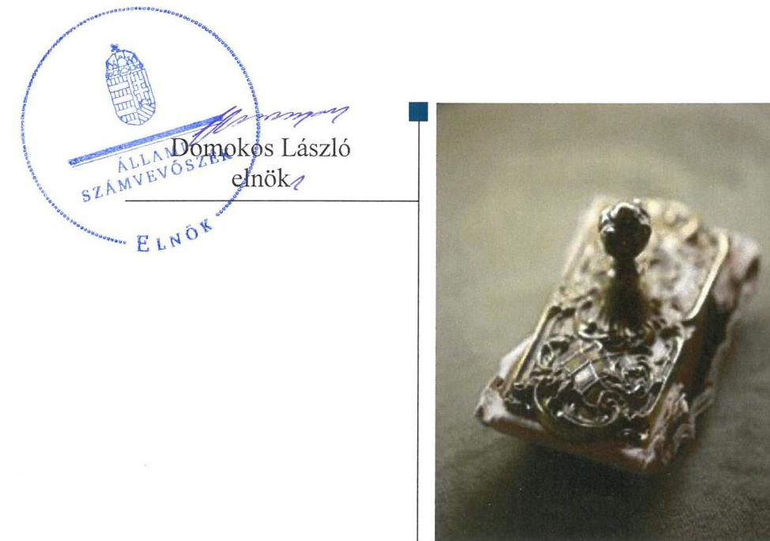
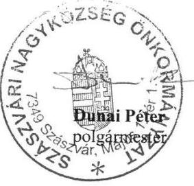
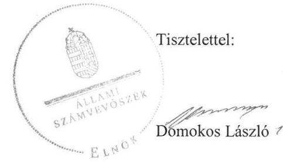
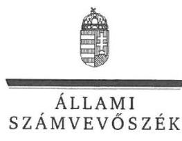
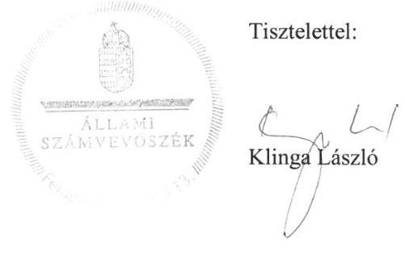
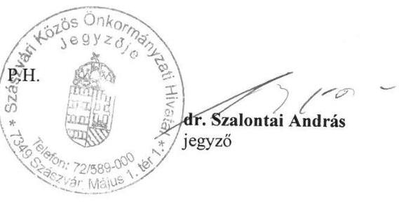
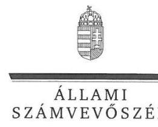
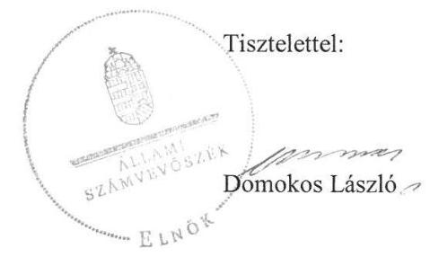
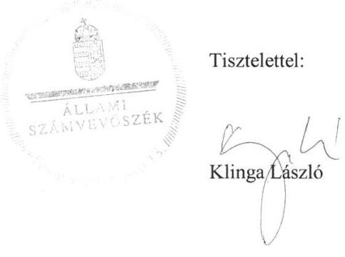

ÁLLAMI
SZÁMVEVŐSZÉK

# Jelentés 

## Önkormányzatok ellenőrzése-Integritás- és belső kontrollrendszer

Szászvár Nagyközség Önkormányzat 2019.

---

# Jelentés 

## Önkormányzatok ellenőrzése Integritás- és belső kontrollrendszer

Szászvár Nagyközség Önkormányzat 2019. 04. hó 29. nap

---

# AZ ELLENŐRZÉST FELÜGYELTE:

- **KLINGA LÁSZLÓ** felügyeleti vezető
- **AZ ELLENŐRZÉST VEZETTE ÉS A VÉGREHAJTÁSÁÉRT FELELŐS:**
  - **DR. TÓTH VIKTÓRIA** ellenőrzésvezető
  - **A PROGRAM ÖSSZEÁLLÍTÁSÁÉRT FELELŐS:**
    - **TÓTPÁL SZABOLCS** osztályvezető

**IKTATÓSZÁM:** EL-1546-001/2019

**TÉMASZÁM:** 16

**ELLENŐRZÉS-AZONOSÍTÓ SZÁM:** V082926

Jelentéseink az Országgyűlés számítógépes hálózatán és az Interneten a www.asz.hu címen is olvashatóak.

---

# TARTALOMJEGYZÉK 

■ ÖSSZEGZÉS ..... 5
■ AZ ELLENŐRZÉS CÉLJA ..... 6
■ AZ ELLENŐRZÉS TERÜLETE ..... 7
■ AZ ELLENŐRZÉS HÁTTERE, INDOKOLTSÁGA ..... 8
■ A JELENTÉS LÉNYEGES KÉRDÉSKÖRE ..... 9
■ AZ ELLENŐRZÉS HATÓKÖRE ÉS MÓDSZEREI ..... 10
■ MEGÁLLAPÍTÁSOK ..... 12
■ JAVASLATOK ..... 13
■ MELLÉKLETEK ..... 15
I. sz. melléklet: Fogalomtár ..... 15
■ FÜGGELÉK: ÉSZREVÉTELEK ..... 17
■ RÖVIDÍTÉSEK JEGYZÉKE ..... 25

---

.

---

# ÖSSZEGZÉS 

Szászvár Nagyközség Önkormányzat belső kontrollrendszerének működtetése nem volt szabályszerű, így az nem biztosította a közpénzekkel és a nemzeti vagyonnal történő elszámoltatható, átlátható és szabályszerű gazdálkodás feltételeit.

## Az ellenőrzés társadalmi indokoltsága

Az Állami Számvevőszék a stratégiai céljával összhangban,- az Állami Számvevőszékről szóló 2011. évi LXVI. törvény felhatalmazása alapján - végzi a közpénzekkel, az állami és önkormányzati vagyonnal való felelős gazdálkodás, valamint a helyi önkormányzatok számviteli rendje betartásának és belső kontrollrendszere működésének ellenőrzését. Magyarország Alaptörvénye az önkormányzatoktól is elvárja a kiegyensúlyozott, átlátható és fenntartható költségvetési gazdálkodás elvének érvényesítését, továbbá a nemzeti vagyonnal való rendeltetésszerű és felelős módon való gazdálkodást. Az Állami Számvevőszék stratégiájában az is megfogalmazódott, hogy támogatja az integritás alapú, átlátható és elszámoltatható közpénzfelhasználás megteremtését. Mindezekre tekintettel, a közpénzzel gazdálkodó szervezetek esetében a belső kontrollrendszer megfelelő működése ellenőrzését prioritásként kezeli az Állami Számvevőszék.

## Főbb megállapítások, következtetések

Szászvár Nagyközség Önkormányzat nem szabályszerű kontrollkörnyezetben működött, mert az Önkormányzat nem rendelkezett az eszközök és források leltárkészítési és leltározási szabályzatával. Kontrolltevékenységeinek gyakorlása nem volt megfelelő, mivel nem rendelkezett jogszabály által előírt kötelezettségvállalásra, pénzügyi ellenjegyzésre, teljesítésigazolásra, érvényesítésre, utalványozásra jogosult személyekről és aláírás mintájukról vezetett nyilvántartással. A pénzgazdálkodás felelős végrehajtása, a számviteli elszámolások szabályszerűsége, illetve a nemzeti vagyonnal történő felelős gazdálkodás nem volt biztosított.

A megállapítások alapján az Állami Számvevőszék az Szászvári Közös Önkormányzati Hivatal jegyzőjének két, Szászvár Nagyközség Önkormányzat polgármesterének egy javaslatot fogalmazott meg. A javaslatokat megalapozó megállapításokra az érintettnek 30 napon belül intézkedési tervet kell készíteni.

---

# AZ ELLENŐRZÉS CÉLJA 

Az ellenőrzés célja annak megállapítása volt, hogy az önkormányzat belső kontrollrendszere biztosította-e a közpénzekkel és a nemzeti vagyonnal történő elszámoltatható, átlátható, szabályszerű, gazdaságos, hatékony és eredményes gazdálkodás feltételeit. Az ellenőrzés célja volt továbbá annak értékelése, hogy az önkormányzatnál kiépítették és erősítették-e a korrupciós kockázatok kezelését szolgáló integritás kontrollokat és azt, hogy megteremtették-e a teljesítményellenőrzés feltételeit.

---

# AZ ELLENŐRZÉS TERÜLETE

## Szászvár Nagyközség Önkormányzat

Szászvár Nagyközség Baranya megye északi részén, a Mecsek-hegység keleti lejtőjén található. Lakónépessége a Központi Statisztikai Hivatal Magyarország közigazgatási helynévkönyve alapján 2017. január 1-jén 2500 fő volt. Szászvár Nagyközség Önkormányzatának hét tagú képviselő-testületének munkáját egy állandó bizottság segítette (Pénzügyi és Ügyrendi Bizottság). A képviselő-testület hivatala a Szászvári Közös Önkormányzati Hivatal. Az Önkormányzat gazdálkodási feladatait a Hivatal látta el.

---

# AZ ELLENŐRZÉS HÁTTERE, INDOKOLTSÁGA 

A demokratikus társadalmakban alapvető igény, hogy a közpénzeket, a közvagyont használók tevékenységükről elszámoljanak, ahhoz egyértelmű és érvényesíthető felelősségi szabályok társuljanak. Ennek a jogos igénynek az érvényesítéséhez meg kell teremteni azokat a folyamatokat, rendszereket, amelyek nélkülözhetetlenek az elszámoltatáshoz. Az elszámoltatás eredményes működtetéséhez szükség van a megfelelő információs, kontroll-, értékelési - és beszámolási rendszerek kialakítására. A belső kontrollok kiépítettsége hozzájárul az integritási szemlélet kialakításához és érvényesüléséhez. A belső kontrollrendszer kialakítása és működtetése nélkül nem valósítható meg a közpénzek, a közvagyon szabályos, gazdaságos, hatékony és eredményes felhasználása.

A BELSŐ KONTROLLRENDSZER azt a célt szolgálja, hogy az államháztartás szervei működésük és gazdálkodásuk során a tevékenységeket szabályszerűen, gazdaságosan, hatékonyan, eredményesen hajtsák végre, teljesítsék elszámolási kötelezettségeiket és megvédjék az erőforrásokat a veszteségektől, a károktól, a nem rendeltetésszerű használattól. A belső kontrollrendszer magában foglalja mindazon szabályokat, eljárásokat, gyakorlati módszereket és szervezeti struktúrákat, kockázatkezelési technikákat, kontrolltevékenységeket, amelyek segítséget nyújtanak a szervezetnek céljai eléréséhez.

A megfelelő belső kontrollrendszer jelentősen csökkenti a hibák és szabálytalanságok kockázatát. Az ÁSZ célja, hogy javuljon az ellenőrzött önkormányzatok belső kontrollrendszerének szabályozottsága, működésének megfelelősége, szabályszerűsége, hozzájárulva ezzel az egyensúlyi helyzet fenntarthatóságának biztosításához, biztosítva az önkormányzatnál a közpénzfelhasználás szabályosságát, a közpénzekkel és a nemzeti vagyonnal történő szabályszerű, gazdaságos, hatékony és eredményes gazdálkodást. Az ÁSZ ellenőrzés tapasztalatai nem csupán a közvetlenül ellenőrzött önkormányzatokat támogathatják, hanem a „jó gyakorlat" elterjesztésével azok az önkormányzatok is átvehetik a pozitív példákat, ahol az ÁSZ ellenőrzést nem végez.

AZ ELLENŐRZÉS VÁRHATÓ HASZNOSULÁSA négy szinten valósul meg. A törvényalkotás számára összegzett tapasztalatok állnak rendelkezésre a belső kontrollrendszer önkormányzati területen való kialakításáról, működtetéséről és hatásairól. Az ellenőrzés az ellenőrzött számára visszajelzést ad a belső kontrollrendszer kialakításában és működésében lévő hiányosságokról, javaslataival hozzájárul azok kiküszöböléséhez. Az ellenőrzés megállapításait és javaslatait más szervezetek is hasznosíthatják a rendezett gazdálkodási keretek kialakításához. A társadalom számára jelzi, hogy közpénz nem maradhat ellenőrizetlenül, az ÁSZ értékteremtő rend kialakításához és megőrzéséhez hozzájáruló tevékenysége pozitív hatással lesz a szervezetről kialakított összkép formálásában.

---

# A JELENTÉS LÉNYEGES KÉRDÉSKÖRE 

Az önkormányzat belső kontrollrendszerének működtetése szabályszerű volt-e?

---

# AZ ELLENŐRZÉS HATÓKÖRE ÉS MÓDSZEREI 

## Az ellenőrzés típusa

Megfelelőségi ellenőrzés.

## Az ellenőrzött időszak

Az ellenőrzött időszak 2017. év, illetve az éves költségvetési beszámoló Áht. által megállapított jóváhagyásáig (2018.május 31-éig) tartó időszak.

## Az ellenőrzés tárgya

Az önkormányzat és a gazdálkodási feladatokat ellátó hivatala belső kontrollrendszerének kialakítása és működtetése, valamint az integritás kontrollok kiépítettsége, a teljesítményellenőrzés feltételei.

## Az ellenőrzött szervezet

Szászvár Nagyközség Önkormányzat

## Az ellenőrzés jogalapja

Az ÁSZ tv. 4. 1. § (3) bekezdésében foglaltak alapján az ÁSZ általános hatáskörrel végzi a közpénzekkel és az állami és önkormányzati vagyonnal való felelős gazdálkodás ellenőrzését. Az ÁSZ tv. 5. § (2) bekezdése alapján az államháztartás gazdálkodásának ellenőrzése keretében az ÁSZ ellenőrzi a helyi önkormányzatok gazdálkodását, valamint az ÁSZ tv. 5. § (6) bekezdése alapján ellenőrzése során értékeli az államháztartás számviteli rendjének betartását és a belső kontrollrendszer működését. Az Áht. 61. § (2) bekezdése alapján az államháztartás külső ellenőrzésével kapcsolatos feladatokat az Állami Számvevőszék látja el.

## Az ellenőrzés módszerei

Az ÁSZ az ellenőrzést az ellenőrzési program ellenőrzési kérdései, az ellenőrzött időszakban hatályos jogszabályok, az ellenőrzés szakmai szabályok és módszertanok figyelembe vételével, valamint a nemzetközi standardokat irányadónak tekintve végezte.

---

Az ellenőrzés ideje alatt az ellenőrzött szervezettel történő kapcsolattartást az ÁSZ Szervezeti és Működési Szabályzatának vonatkozó előírásai alapján biztosítottuk.

Az ellenőrzési kérdések megválaszolásához szükséges bizonyítékok megszerzése az ellenőrzöttek által rendelkezésre bocsátott dokumentumokra, adatokra alapozva elemző eljárással történt. Az ellenőrzési bizonyítékként felhasználható adatforrások közé tartoztak az ellenőrzési programban felsorolt adatforrások.

Amennyiben az önkormányzat működését és gazdálkodását alapvetően meghatározó dokumentum (ellenőrzési program szerinti sarkalatos dokumentum) hiánya miatt, valamely lényeges kérdéskörre vonatkozóan az ÁSZ megállapítást tett, további ellenőrzési tevékenységek az adott kérdéskörrel és az azzal szoros logikai kapcsolatban lévő kérdéskörökkel - ráépülő jelleggel - nem kerültek végrehajtásra.

---

# MEGÁLLAPÍTÁSOK 

## Az önkormányzat belső kontrollrendszerének működtetése szabályszerű volt-e?

Összegző megállapítás Az Önkormányzat belső kontrollrendszerének működtetése nem volt szabályszerű.

Az Önkormányzat nem szabályszerű kontrollkörnyezetben működött. A Számv. tv. 14. § (5) bekezdés a) pontjával ellentétben nem rendelkezett az eszközök és források leltárkészítési és leltározási szabályzatával, azt a jegyző nem készítette el. Kontrolltevékenységeinek gyakorlása nem volt szabályszerű, mivel az Ávr. 60. § (3) bekezdésével ellentétben az Önkormányzat nem rendelkezett a kötelezettségvállalásra, pénzügyi ellenjegyzésre, teljesítésigazolásra, érvényesítésre, utalványozásra jogosult személyekről és aláírás mintájukról vezetett nyilvántartással, a jegyző nem gondoskodott annak elkészítéséről.

---

# JAVASLATOK 

Az ÁSZ tv. 33. § (1) bekezdésében foglaltak értelmében az ellenőrzött szervezet vezetője köteles a jelentésben foglalt megállapításokhoz kapcsolódó intézkedési tervet összeállítani és azt a jelentés kézhezvételétől számított 30 napon belül az ÁSZ részére megküldeni. Amennyiben az ellenőrzött szervezet vezetője nem küldi meg határidőben az intézkedési tervet, vagy továbbra sem elfogadható intézkedési tervet küld, az Állami Számvevőszék elnöke az ÁSZ tv. 33. § (3) bekezdés a) és b) pontjaiban foglaltakat érvényesítheti.

## Szászvári Közös Önkormányzati Hivatal jegyzőjének

1. Az Önkormányzat szabályszerű kontrollkörnyezetének kialakítása érdekében gondoskodjon a Számv. tv. előírásainak megfelelően az eszközök és források leltárkészítési és leltározási szabályzatának elkészítéséről.
(1 sz. megállapítás 2. mondata alapján)
2. Az Önkormányzat kontrolltevékenységek szabályszerű gyakorlása érdekében gondoskodjon az Ávr. előírásai szerinti nyilvántartás vezetéséről a kötelezettségvállalásra, pénzügyi ellenjegyzésre, teljesítésigazolásra, érvényesítésre, utalványozásra jogosult személyekről és aláírás mintájukról.
(1. sz. megállapítás 3. mondata alapján)

## Szászvár Nagyközség Önkormányzat polgármesterének

1. Intézkedjen az Állami Számvevőszék ellenőrzése során feltárt hiányosságok, szabálytalanságok tekintetében a munkajogi felelősség tisztázására irányuló eljárás megindításáról, és ennek eredménye ismeretében tegye meg a szükséges intézkedéseket.
(1. sz. megállapítás alapján)

---

.

---

# MELLÉKLETEK 

- I. SZ. MELLÉKLET: FOGALOMTÁR
belső kontrollrendszer
közös önkormányzati hivatal

A belső kontrollrendszer a kockázatok kezelése és tárgyilagos bizonyosság megszerzése érdekében kialakított folyamatrendszer, amely azt a célt szolgálja, hogy a működés és gazdálkodás során a tevékenységeket szabályszerűen, gazdaságosan, hatékonyan, eredményesen hajtsák végre, az elszámolási kötelezettségeket teljesítsék, megvédjék az erőforrásokat a veszteségektől, károktól és nem rendeltetésszerű használattól. (Forrás: Áht. 69. § (1) bekezdés)
A települési képviselő-testület más települési képviselő-testülettel társult képviselő-testületet alakíthat, amely esetén a képviselő-testületek részben vagy egészben egyesítik a költségvetésüket, közös önkormányzati hivatalt tartanak fenn és intézményeiket közösen működtetik. (Forrás: Mötv. 56. § (1)-(2) bekezdései)

---

.

---

# FÜGGELÉK: ÉSZREVÉTELEK 

A jelentéstervezetet a Számvevőszék 15 napos észrevételezésre megküldte az ellenőrzött szervezet vezetőjének az ÁSZ tv. 29. § (1) bekezdése előírásának megfelelően.

Szászvár Nagyközség Önkormányzat polgármestere és a Szászvári Közös Önkormányzati Hivatal jegyzője az ÁSZ tv. 29. § (2) bekezdésben foglalt észrevételezési jogával élt, a jelentéstervezetre észrevételt tett.
A függelék tartalmazza az ellenőrzöttek észrevételeit, illetve az el nem fogadott észrevételek elutasításának indoklását.

[^0]
[^0]:    * 29. § (1) Az Állami Számvevőszék az ellenőrzési megállapításait megküldi az ellenőrzött szervezet vezetőjének vagy az általa megbízott személynek, és annak, akinek személyes felelősségét állapította meg.
    (2) Az ellenőrzött szervezet vezetője és a felelősként megjelölt személy az ellenőrzés megállapításaira tizenöt napon belül írásban észrevételt tehet.
    (3) Az Állami Számvevőszék az észrevételre a beérkezésétől számított harminc napon belül írásban válaszol. A figyelembe nem vett észrevételeket köteles a jelentésben feltüntetni, és megindokolni, hogy azokat miért nem fogadta el.

---

# Szászvár Nagyközség Önkormányzat 

## Polgármestere

7349 Szászvár, Május 1. tér 1.
Tel: 72/589-000/116, 389-123, fax: 72/389-200.
Email-cím: szaszph@bonet.hu
Szám: 52/858-3/2019.
Tárgy: észrevételek
Hiv. sz.:  EL-0848-027/2018.

## Állami Számvevőszék

dr. Domokos László elnök Úr részére
1364
 Bp. 4. Pf. 54.
ÁLLAMI SZÁMVEVŐSZÉK
BE-19020/20/3/1
Gezett: 2019. MÁRCIUS 12
E. 0848-030/2019.

## Tisztelt elnök Úr!

Hivatkozott szám alatti, nem nyilvános jelentésére az előírt határidőre figyelemmel az alábbi észrevételeket teszem.

A közpénz-felhasználás és a beszerzések, továbbá a vagyonkezelés folyamatosan az előírt bizonylati rendben dokumentált volt, minden kifizetés bizonyíthatóan a közfeladat hatékony ellátását szolgálta. A leltárkészítési, eszköznyilvántartási gyakorlatunk rendezett, tételes nyilvántartáson alapuló volt, a leltárkészítési szabályzat hiányát a majdani intézkedési tervben pótolni vállaljuk, miként a kötelezettségvállalásra, érvényesítésre, ellenjegyzésre és utalványozásra jogosultak nyilvántartását is jegyző úr hasonló tárgyú levelében részletezettek szerint.
T. Számvevőszék 1. számú megállapítására elő kívánom adni, hogy a munkajogi felelősség tisztázására az intézkedéseket megkezdtem.

Tisztelettel kérem a fentiek szíves elfogadását!
Szászvár, 2019. március 7.
P.H.

---

# Dunaí Péter úr 

polgármester
Szászvár Nagyközség Önkormányzat

## Szászvár

## Tisztelt Polgármester Úr!

Az „Önkormányzatok ellenőrzése - Integritás- és belső kontrollrendszer - Szászvár Nagyközség Önkormányzat" címmel készített számvevőszéki jelentéstervezetre tett, SZ/838-3/2019. számú észrevételeit köszönettel megkaptam.
Az Állami Számvevőszék észrevételekre vonatkozó álláspontjáról a felügyeleti vezető által készített részletes tájékoztatást csatoltan megküldöm.
Tájékoztatom Polgármester urat, hogy a számvevőszéki jelentésben - az Állami Számvevőszékről szóló 2011. évi LXVI. törvény 29. § (3) bekezdése alapján - a figyelembe nem vett észrevételeket szerepeltetjük annak indoklásával, hogy azokat az Állami Számvevőszék miért nem fogadta el.

Budapest, 2019. 04. hó 07. nap

Melléklet: Tájékoztatás az észrevételek kezeléséről

---

FELÜGYELETI VEZETŐ

Melléklet
Ikt.szám: EL-0848-032/2019

# Tájékoztatás az észrevételek kezeléséről 

Az „Önkormányzatok ellenőrzése - Integritás- és belső kontrollrendszer - Szászvár Nagyközség Önkormányzat" című jelentéstervezetre 2019. március 7-én kelt, SZ/838-3/2019. számú levelében tett észrevételét áttekintettük, annak kezelésével kapcsolatban a következő tájékoztatást adom:
Megköszönöm Polgármester úrnak a közpénz-felhasználás, beszerzések, és vagyonkezelés dokumentálása, valamint az eszköznyilvántartás és leltárkészítés gyakorlata vonatkozásában adott általános tájékoztatását.
Polgármester úr a jelentéstervezet megállapításaira vonatkozó észrevételében az eszközök és források leltárkészítési és leltározási szabályzatának, valamint a kötelezettségvállalásra, érvényesítésre, ellenjegyzésre és utalványozásra jogosultak nyilvántartásának pótlólagos elkészítéséről adott tájékoztatást. Tájékoztatott továbbá arról, hogy a - polgármester részére tett javaslattal összhangban - az ellenőrzés során feltárt hiányosságok, szabálytalanságok tekintetében a munkajogi felelősség tisztázására az intézkedéseket megkezdte.
Az észrevétel a megállapításainkat nem vitatta, így a jelentéstervezet módosítása nem indokolt.

Budapest, 2019. 04. 07.

---

# Szászvári Közös Önkormányzati Hivatal 

Jegyzőjétől
7349 Szászvár, Május 1. tér 1.
Tel: 72/589-000/116, 389-123, Fax: 72/389-200.
Email-cím: szaszjegyzo@bonet.hu
Szám: 52/558-4/2019.
Tárgy: észrevételek
Hiv. sz.: EL-0848-028/2018.

Állami Számvevőszék
dr. Domokos László elnök Úr részére
1364 Bp. 4. Pf. 54.

## Tisztelt elnök Úr!

Hivatkozott szám alatti, nem nyilvános jelentésére az előírt határidőre figyelemmel az alábbi észrevételeket teszem.

A közpénz-felhasználás és a beszerzések, továbbá a vagyonkezelés folyamatosan az előírt bizonylati rendben dokumentált volt, minden kifizetés bizonyíthatóan a közfeladat hatékony ellátását szolgálta.

A leltárkészítési, eszköznyilvántartási gyakorlatunk rendezett, tételes nyilvántartáson alapuló volt, a leltárkészítési szabályzat hiányát a majdani intézkedési tervtől függetlenül pótolni fogom és normatív határozathozatalra a Képviselő-testület elé terjesztem.

Az Ávr. 60. § (3) szerint a kötelezettségvállalásra, érvényesítésre, ellenjegyzésre és utalványozásra jogosultak külön nyilvántartásának vezetése kapcsán elő kívánom adni, hogy a kijelölt személyek aláírásával is ellátott dokumentumok naprakészen csatolásra kerültek Önök felé, azonban - téves jogértelmezés miatt - ezekről tételes, ekként megnevezett külön nyilvántartó dokumentum pótlólagosan készül el a majdani intézkedési terv szerint.

Tisztelettel kérem a fentiek szíves elfogadását!
Szászvár, 2019. március 7.

---

# Dr. Szalontai András úr 

jegyző
Szászvári Közös Önkormányzati Hivatal

## Szászvár

## Tisztelt Jegyző Úr!

Az „Önkormányzatok ellenőrzése - Integritás- és belső kontrollrendszer - Szászvár Nagyközség Önkormányzat" címmel készített számvevőszéki jelentéstervezetre tett, SZ/838-4/2019. számú észrevételeit köszönettel megkaptam.
Az Állami Számvevőszék észrevételekre vonatkozó álláspontjáról a felügyeleti vezető által készített részletes tájékoztatást csatoltan megküldöm.
Tájékoztatom Jegyző urat, hogy a számvevőszéki jelentésben - az Állami Számvevőszékről szóló 2011. évi LXVI. törvény 29. § (3) bekezdése alapján - a figyelembe nem vett észrevételeket szerepeltetjük annak indoklásával, hogy azokat az Állami Számvevőszék miért nem fogadta el.

Budapest, 2019. 04. hó 01. nap

Melléklet: Tájékoztatás az észrevételek kezeléséről

---

# Tájékoztatás az észrevételek kezeléséről 

Az „Önkormányzatok ellenőrzése - Integritás- és belső kontrollrendszer - Szászvár Nagyközség Önkormányzat" című jelentéstervezetre 2019. március 7-én kelt, SZ/838-4/2019. számú levelében tett észrevételét áttekintettük, annak kezelésével kapcsolatban a következő tájékoztatást adom:
Megköszönöm Jegyző úrnak a közpénz-felhasználás, beszerzések, és vagyonkezelés dokumentálása, valamint az eszköznyilvántartás és leltárkészítés gyakorlata vonatkozásában adott általános tájékoztatását.
Jegyző úr a jelentéstervezet megállapításaira vonatkozó észrevételében az eszközök és források leltárkészítési és leltározási szabályzatának, valamint a kötelezettségvállalásra, érvényesítésre, ellenjegyzésre és utalványozásra jogosultak nyilvántartásának pótlólagos elkészítéséről adott tájékoztatást.
Az észrevétel a megállapításainkat nem vitatta, így a jelentéstervezet módosítása nem indokolt.

Budapest, 2019. 04. 04.

---

.

---

# RÖVIDÍTÉSEK JEGYZÉKE 

${ }^{1}$ Önkormányzat
${ }^{2}$ Hivatal
${ }^{3}$ ÁSZ
${ }^{4}$ ÁSZ tv.
${ }^{5}$ Áht.
${ }^{6}$ Számv. tv.
${ }^{7}$ jegyző
${ }^{8}$ Ávr.

Szászvár Nagyközség Önkormányzat
Szászvári Közös Önkormányzati Hivatal
Állami Számvevőszék
2011. évi LXVI. törvény az Állami Számvevőszékről
2011. évi CXCV. törvény az államháztartásról
2000. évi C. törvény a számvitelről

Szászvári Közös Önkormányzati Hivatal jegyzője
368/2011. (XII. 31.) Korm. rendelet az államháztartásról szóló törvény végrehajtásáról

---

ÁLLAMI SZÁMVEVŐSZÉK
1052 Budapest, Apáczai Csere János utca 10.
Levélcím: 1364 Budapest 4. Pf. 54
Telefon: +36 14849100 Telefax: +36 14849200
www.asz.hu

