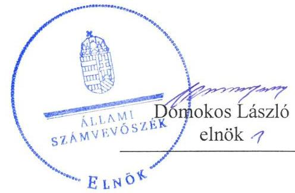
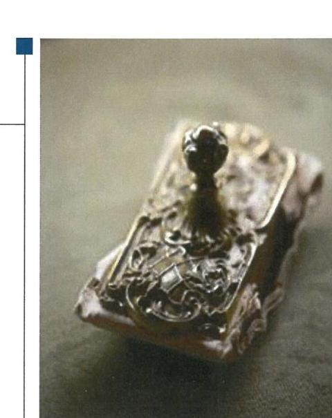
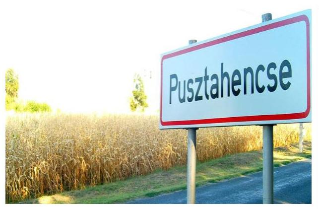
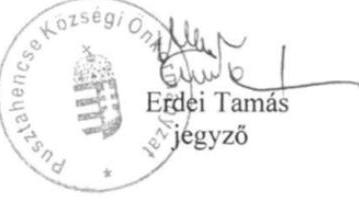
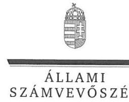
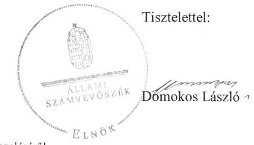
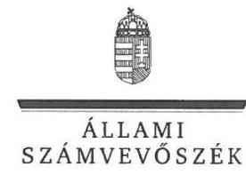
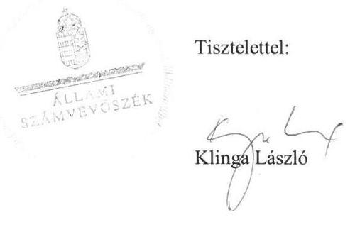

ÁLLAMI
SZÁMVEVŐSZÉK

# Jelentés 

## Önkormányzatok ellenőrzése -   Integritás- és belső kontrollrendszer

Pusztahencse Községi Önkormányzat 2019.

---

# Jelentés 

## Önkormányzatok ellenőrzése Integritás- és belső kontrollrendszer

Pusztahencse Községi Önkormányzat 2019. 04. hó 29. nap

---

# AZ ELLENŐRZÉST FELÜGYELTE:

- **KLINGA LÁSZLÓ** felügyeleti vezető
- **AZ ELLENŐRZÉST VEZETTE ÉS A VÉGREHAJTÁSÁÉRT FELELŐS:**
  - **DR. TÓTH VIKTÓRIA** ellenőrzésvezető
  - **A PROGRAM ÖSSZEÁLLÍTÁSÁÉRT FELELŐS:**
    - **TÓTPÁL SZABOLCS** osztályvezető

**IKTATÓSZÁM:** EL-1547-001/2019

**TÉMASZÁM:** 16

**ELLENŐRZÉS-AZONOSÍTÓ SZÁM:** V082927

Jelentéseink az Országgyűlés számítógépes hálózatán és az Interneten a www.asz.hu címen is olvashatóak.

---

# TARTALOMJEGYZÉK 

■ ÖSSZEGZÉS ..... 5
■ AZ ELLENŐRZÉS CÉLJA ..... 6
■ AZ ELLENŐRZÉS TERÜLETE ..... 7
■ AZ ELLENŐRZÉS HÁTTERE, INDOKOLTSÁGA ..... 8
■ A JELENTÉS LÉNYEGES KÉRDÉSKÖRE ..... 9
■ AZ ELLENŐRZÉS HATÓKÖRE ÉS MÓDSZEREI ..... 10
■ MEGÁLLAPÍTÁSOK ..... 12
■ JAVASLATOK ..... 13
■ MELLÉKLETEK ..... 15
I. sz. melléklet: Fogalomtár ..... 15
■ FÜGGELÉK: ÉSZREVÉTELEK ..... 17
■ RÖVIDÍTÉSEK JEGYZÉKE ..... 21

---

.

---

# ÖSSZEGZÉS 

Pusztahencse Községi Önkormányzat belső kontrollrendszerének működtetése nem volt szabályszerű, így az nem biztosította a közpénzekkel és a nemzeti vagyonnal történő elszámoltatható, átlátható és szabályszerű gazdálkodás feltételeit.

## Az ellenőrzés társadalmi indokoltsága

Az Állami Számvevőszék a stratégiai céljával összhangban,- az Állami Számvevőszékről szóló 2011. évi LXVI. törvény felhatalmazása alapján - végzi a közpénzekkel, az állami és önkormányzati vagyonnal való felelős gazdálkodás, valamint a helyi önkormányzatok számviteli rendje betartásának és belső kontrollrendszere működésének ellenőrzését. Magyarország Alaptörvénye az önkormányzatoktól is elvárja a kiegyensúlyozott, átlátható és fenntartható költségvetési gazdálkodás elvének érvényesítését, továbbá a nemzeti vagyonnal való rendeltetésszerű és felelős módon való gazdálkodást. Az Állami Számvevőszék stratégiájában az is megfogalmazódott, hogy támogatja az integritás alapú, átlátható és elszámoltatható közpénzfelhasználás megteremtését. Mindezekre tekintettel, a közpénzzel gazdálkodó szervezetek esetében a belső kontrollrendszer megfelelő működése ellenőrzését prioritásként kezeli az Állami Számvevőszék.

## Főbb megállapítások, következtetések

Pusztahencse Községi Önkormányzat belső kontrollrendszere minőségének nyomon követése, értékelése nem valósult meg, mivel az Önkormányzat nem rendelkezett jogszabály által előírt vezetői nyilatkozattal a belső kontrollrendszer működéséről.

A megállapítások alapján az Állami Számvevőszék a Pusztahencsei Közös Önkormányzati Hivatal jegyzőjének egy, Pusztahencse Községi Önkormányzat polgármesterének egy javaslatot fogalmazott meg. A javaslatokat megalapozó megállapításokra az érintetteknek 30 napon belül intézkedési tervet kell készíteniük.

---

# AZ ELLENŐRZÉS CÉLJA 

Az ellenőrzés célja annak megállapítása volt, hogy az önkormányzat belső kontrollrendszere biztosította-e a közpénzekkel és a nemzeti vagyonnal történő elszámoltatható, átlátható, szabályszerű, gazdaságos, hatékony és eredményes gazdálkodás feltételeit. Az ellenőrzés célja volt továbbá annak értékelése, hogy az önkormányzatnál kiépítették és erősítették-e a korrupciós kockázatok kezelését szolgáló integritás kontrollokat és azt, hogy megteremtették-e a teljesítményellenőrzés feltételeit.

---

# AZ ELLENŐRZÉS TERÜLETE 

## Pusztahencse Községi Önkormányzat

Pusztahencse Község Tolna megyében Paksi járásban található. Lakónépessége a Központi Statisztikai Hivatal Magyarország közigazgatási helynévkönyve alapján, 2017. január 1-jén 1027 fő volt. Pusztahencse Községi Önkormányzat hét tagú képviselő-testületének munkáját egy állandó bizottság segítette 2017-ben (Ügyrendi Bizottság). Az Önkormányzat ${ }^{1}$ hivatala a Pusztahencsei Közös Önkormányzati Hivatal. Az Önkormányzat gazdálkodási feladatait a Hivatal ${ }^{1}$ látta el.

---

# AZ ELLENŐRZÉS HÁTTERE, INDOKOLTSÁGA 

A demokratikus társadalmakban alapvető igény, hogy a közpénzeket, a közvagyont használók tevékenységükről elszámoljanak, ahhoz egyértelmű és érvényesíthető felelősségi szabályok társuljanak. Ennek a jogos igénynek az érvényesítéséhez meg kell teremteni azokat a folyamatokat, rendszereket, amelyek nélkülözhetetlenek az elszámoltatáshoz. Az elszámoltatás eredményes működtetéséhez szükség van a megfelelő információs, kontroll-, értékelési - és beszámolási rendszerek kialakítására. A belső kontrollok kiépítettsége hozzájárul az integritási szemlélet kialakításához és érvényesüléséhez. A belső kontrollrendszer kialakítása és működtetése nélkül nem valósítható meg a közpénzek, a közvagyon szabályos, gazdaságos, hatékony és eredményes felhasználása.

A BELSŐ KONTROLLRENDSZER azt a célt szolgálja, hogy az államháztartás szervei működésük és gazdálkodásuk során a tevékenységeket szabályszerűen, gazdaságosan, hatékonyan, eredményesen hajtsák végre, teljesítsék elszámolási kötelezettségeiket és megvédjék az erőforrásokat a veszteségektől, a károktól, a nem rendeltetésszerű használattól. A belső kontrollrendszer magában foglalja mindazon szabályokat, eljárásokat, gyakorlati módszereket és szervezeti struktúrákat, kockázatkezelési technikákat, kontrolltevékenységeket, amelyek segítséget nyújtanak a szervezetnek céljai eléréséhez.

A megfelelő belső kontrollrendszer jelentősen csökkenti a hibák és szabálytalanságok kockázatát. Az ÁSZ³ célja, hogy javuljon az ellenőrzött önkormányzatok belső kontrollrendszerének szabályozottsága, működésének megfelelősége, szabályszerűsége, hozzájárulva ezzel az egyensúlyi helyzet fenntarthatóságának biztosításához, biztosítva az önkormányzatnál a közpénzfelhasználás szabályosságát, a közpénzekkel és a nemzeti vagyonnal történő szabályszerű, gazdaságos, hatékony és eredményes gazdálkodást. Az ÁSZ ellenőrzés tapasztalatai nem csupán a közvetlenül ellenőrzött önkormányzatokat támogathatják, hanem a „jó gyakorlat" elterjesztésével azok az önkormányzatok is átvehetik a pozitív példákat, ahol az ÁSZ ellenőrzést nem végez.

AZ ELLENŐRZÉS VÁRHATÓ HASZNOSULÁSA négy szinten valósul meg. A törvényalkotás számára összegzett tapasztalatok állnak rendelkezésre a belső kontrollrendszer önkormányzati területen való kialakításáról, működtetéséről és hatásairól. Az ellenőrzés az ellenőrzött számára visszajelzést ad a belső kontrollrendszer kialakításában és működésében lévő hiányosságokról, javaslataival hozzájárul azok kiküszöböléséhez. Az ellenőrzés megállapításait és javaslatait más szervezetek is hasznosíthatják a rendezett gazdálkodási keretek kialakításához. A társadalom számára jelzi, hogy közpénz nem maradhat ellenőrizetlenül, az ÁSZ értékteremtő rend kialakításához és megőrzéséhez hozzájáruló tevékenysége pozitív hatással lesz a szervezetről kialakított összkép formálásában.

---

# A JELENTÉS LÉNYEGES KÉRDÉSKÖRE 

Az önkormányzat belső kontrollrendszerének működtetése szabályszerű volt-e?

---

# AZ ELLENŐRZÉS HATÓKÖRE ÉS MÓDSZEREI 

## Az ellenőrzés típusa

Megfelelőségi ellenőrzés.

## Az ellenőrzött időszak

Az ellenőrzött időszak 2017. év, illetve az éves költségvetési beszámoló Áht. által megállapított jóváhagyásáig (2018. május 31-éig) tartó időszak.

## Az ellenőrzés tárgya

Az önkormányzat és a gazdálkodási feladatokat ellátó hivatala belső kontrollrendszerének kialakítása és működtetése, valamint az integritás kontrollok kiépítettsége, a teljesítményellenőrzés feltételei.

## Az ellenőrzött szervezet

Pusztahencse Községi Önkormányzat

## Az ellenőrzés jogalapja

Az ÁSZ tv. ${ }^{4}$. 1. § (3) bekezdésében foglaltak alapján az ÁSZ általános hatáskörrel végzi a közpénzekkel és az állami és önkormányzati vagyonnal való felelős gazdálkodás ellenőrzését. Az ÁSZ tv. 5. § (2) bekezdése alapján az államháztartás gazdálkodásának ellenőrzése keretében az ÁSZ ellenőrzi a helyi önkormányzatok gazdálkodását, valamint az ÁSZ tv. 5. § (6) bekezdése alapján ellenőrzése során értékeli az államháztartás számviteli rendjének betartását és a belső kontrollrendszer működését. Az Áht. ${ }^{5}$ 61. § (2) bekezdése alapján az államháztartás külső ellenőrzésével kapcsolatos feladatokat az Állami Számvevőszék látja el.

## Az ellenőrzés módszerei

Az ÁSZ az ellenőrzést az ellenőrzési program ellenőrzési kérdései, az ellenőrzött időszakban hatályos jogszabályok, az ellenőrzés szakmai szabályok és módszertanok figyelembe vételével, valamint a nemzetközi standardokat irányadónak tekintve végezte.

---

Az ellenőrzés ideje alatt az ellenőrzött szervezettel történő kapcsolattartást az ÁSZ Szervezeti és Működési Szabályzatának vonatkozó előírásai alapján biztosítottuk.

Az ellenőrzési kérdések megválaszolásához szükséges bizonyítékok megszerzése az ellenőrzöttek által rendelkezésre bocsátott dokumentumokra, adatokra alapozva elemző eljárással történt. Az ellenőrzési bizonyítékként felhasználható adatforrások közé tartoztak az ellenőrzési programban felsorolt adatforrások.

Amennyiben az önkormányzat működését és gazdálkodását alapvetően meghatározó dokumentum (ellenőrzési program szerinti sarkalatos dokumentum) hiánya miatt, valamely lényeges kérdéskörre vonatkozóan az ÁSZ megállapítást tett, további ellenőrzési tevékenységek az adott kérdéskörrel és az azzal szoros logikai kapcsolatban lévő kérdéskörökkel - ráépülő jelleggel - nem kerültek végrehajtásra.

---

# MEGÁLLAPÍTÁSOK 

## Az önkormányzat belső kontrollrendszerének működtetése szabályszerű volt-e?

Összegző megállapítás Az Önkormányzat belső kontrollrendszerének működtetése nem volt szabályszerű.

Az Önkormányzat belső kontrollrendszere minőségének nyomon követése, értékelése nem valósult meg, mivel az Önkormányzat nem rendelkezett jogszabályban előírt vezetői nyilatkozattal a belső kontrollrendszer működéséről. A jegyző ${ }^{6}$ a Bkr. ${ }^{7}$ 11. § (1) bekezdésében előírtak ellenére a Bkr. 1. melléklet szerinti nyilatkozatban nem értékelte az Önkormányzat belső kontrollrendszerének minőségét.

---

# JAVASLATOK 

Az ÁSZ tv. 33. § (1) bekezdésében foglaltak értelmében az ellenőrzött szervezet vezetője köteles a jelentésben foglalt megállapításokhoz kapcsolódó intézkedési tervet összeállítani és azt a jelentés kézhezvételétől számított 30 napon belül az ÁSZ részére megküldeni. Amennyiben az ellenőrzött szervezet vezetője nem küldi meg határidőben az intézkedési tervet, vagy továbbra sem elfogadható intézkedési tervet küld, az Állami Számvevőszék elnöke az ÁSZ tv. 33. § (3) bekezdése a) és b) pontjaiban foglaltakat érvényesítheti.

## Pusztahencsei Közös Önkormányzati Hivatal jegyzőjének

1. Gondoskodjon arról, hogy az Önkormányzat rendelkezzen a Bkr. előírásainak megfelelően az 1. melléklet szerinti, belső kontrollrendszer minőségét értékelő vezetői nyilatkozattal.
(1 sz. megállapítás 2. mondata alapján)

## Pusztahencse Községi Önkormányzat polgármesterének

1. Intézkedjen az Állami Számvevőszék ellenőrzése során feltárt hiányosságok, szabálytalanságok tekintetében a munkajogi felelősség tisztázására irányuló eljárás megindításáról, és ennek eredménye ismeretében tegye meg a szükséges intézkedéseket.
(1. sz. megállapítás alapján)

---

.

---

# MELLÉKLETEK 

- I. SZ. MELLÉKLET: FOGALOMTÁR
belső kontrollrendszer
közös önkormányzati hivatal

A belső kontrollrendszer a kockázatok kezelése és tárgyilagos bizonyosság megszerzése érdekében kialakított folyamatrendszer, amely azt a célt szolgálja, hogy a működés és gazdálkodás során a tevékenységeket szabályszerűen, gazdaságosan, hatékonyan, eredményesen hajtsák végre, az elszámolási kötelezettségeket teljesítsék, megvédjék az erőforrásokat a veszteségektől, károktól és nem rendeltetésszerű használattól. (Forrás: Áht. 69. § (1) bekezdés)
A települési képviselő-testület más települési képviselő-testülettel társult képviselő-testületet alakíthat, amely esetén a képviselő-testületek részben vagy egészben egyesítik a költségvetésüket, közös önkormányzati hivatalt tartanak fenn és intézményeiket közösen működtetik.

---

.

---

# FÜGGELÉK: ÉSZREVÉTELEK 

A jelentéstervezetet a Számvevőszék 15 napos észrevételezésre megküldte az ellenőrzött szervezet vezetőjének az ÁSZ tv. 29. §* (1) bekezdése előírásának megfelelően.

Pusztahencse Községi Önkormányzat polgármestere nem élt az ÁSZ tv. 29. § (2) bekezdésben foglalt észrevételezési jogával, a jelentéstervezetre nem tett észrevételt.
A függelék tartalmazza a Pusztahencsei Közös Önkormányzati Hivatal jegyzője észrevételeit, illetve az el nem fogadott észrevételek elutasításának indoklását.

[^0]
[^0]:    * 29. § (1) Az Állami Számvevőszék az ellenőrzési megállapításait megküldi az ellenőrzött szervezet vezetőjének vagy az általa megbízott személynek, és annak, akinek személyes felelősségét állapította meg.
    (2) Az ellenőrzött szervezet vezetője és a felelősként megjelölt személy az ellenőrzés megállapításaira tizenöt napon belül írásban észrevételt tehet.
    (3) Az Állami Számvevőszék az észrevételre a beérkezésétől számított harminc napon belül írásban válaszol. A figyelembe nem vett észrevételeket köteles a jelentésben feltüntetni, és megindokolni, hogy azokat miért nem fogadta el.

---

Pusztahencse községi Önkormányzat 7038 Pusztahencse, Pozsonyi u. 59.

Szám: 265/2019.

Állami Számvevőszék

Budapest
Pf. 54.
1364

Tisztelt Címzett!

Mellékelten megküldöm a számvevőszéki jelentéstervezet „14. oldal Javaslatok Pusztahencsei Közös Önkormányzati Hivatal jegyzőjének" című pontjában szereplő Bkr. 1. melléklet szerinti tanúsítványt.

A jelentéstervezet mindössze 2 javaslatot tartalmaz. Erre vonatkozóan kell majd intézkedési tervet készítenünk?

Pusztahencse, 2019. 03. 05.

Tisztelettel:

---

ELNÖK

Ikt.szám: EL-0849-037/2019

# Erdei Tamás úr 

jegyző
Pusztahencsei Közös Önkormányzati Hivatal

## Pusztahencse

## Tisztelt Jegyző Úr!

Az „Önkormányzatok ellenőrzése - Integritás- és belső kontrollrendszer - Pusztahencse Községi Önkormányzat" címmel készített számvevőszéki jelentéstervezetre tett, 265/2019. számú észrevételét köszönettel megkaptam.
Az Állami Számvevőszék észrevételekre vonatkozó álláspontjáról a felügyeleti vezető által készített részletes tájékoztatást csatoltan megküldöm.
Tájékoztatom Jegyző urat, hogy a számvevőszéki jelentésben - az Állami Számvevőszékről szóló 2011. évi LXVI. törvény 29. § (3) bekezdése alapján - a figyelembe nem vett észrevételeket szerepeltetjük annak indoklásával, hogy
 azokat az Állami Számvevőszék miért nem fogadta el.

Budapest, 2019. június 7. nap

Melléklet: Tájékoztatás az észrevételek kezeléséről

---

FELÜGYELETI VEZETŐ

Melléklet
Ikt.szám: EL-0849-037/2019

# Tájékoztatás az észrevételek kezeléséről 

Az „Önkormányzatok ellenőrzése - Integritás- és belső kontrollrendszer - Pusztaheincse Községi Önkormányzat" című jelentéstervezetre 2019. március 5-én kelt, 265/2019. számú levelében tett észrevételét áttekintettük, annak kezelésével kapcsolatban a következő tájékoztatást adom:
Jegyző úr észrevételében az intézkedési terv készítési kötelezettségre vonatkozóan fogalmazott meg kérdést. Az észrevétel mellékleteként megküldte - a jegyzőnek tett javaslathoz kapcsolódóan - a Bkr. 1. számú melléklete szerinti, 2019. február 21-i keltezésű nyilatkozatát. Az észrevétel a megállapításainkat nem vitatta, így a jelentéstervezet módosítása nem indokolt.
Tájékoztatom Jegyző urat, hogy az Állami Számvevőszékről szóló 2011. évi LXVI. törvény 33. § (1) bekezdésében foglaltak értelmében az ellenőrzött szervezet vezetője köteles a jelentésben foglalt megállapításokhoz kapcsolódó intézkedési tervet összeállítani és azt a jelentés kézhezvételétől számított 30 napon belül az Állami Számvevőszék részére megküldeni.

Budapest, 2019. 04. 04.

---

# RÖVIDÍTÉSEK JEGYZÉKE 

${ }^{1}$ Önkormányzat
${ }^{2}$ Hivatal
${ }^{3}$ ÁSZ
${ }^{4}$ ÁSZ tv.
${ }^{5}$ Áht.
${ }^{6}$ jegyző
${ }^{7}$ Bkr.

Pusztahencse Községi Önkormányzat
Pusztahencsei Közös Önkormányzati Hivatal
Állami Számvevőszék
2011. évi LXVI. törvény az Állami Számvevőszékről
2011. évi CXCV. törvény az államháztartásról

Pusztahencse Községi Önkormányzat jegyzője
370/2011. (XII. 31.) Korm. rendelet a költségvetési szervek belső
kontrollrendszeréről és belső ellenőrzéséről

---

ÁLLAMI SZÁMVEVŐSZÉK
1052 Budapest, Apáczai Csere János utca 10.
Levélcím: 1364 Budapest 4. Pf. 54
Telefon: +36 14849100 Telefax: +36 14849200
www.asz.hu
