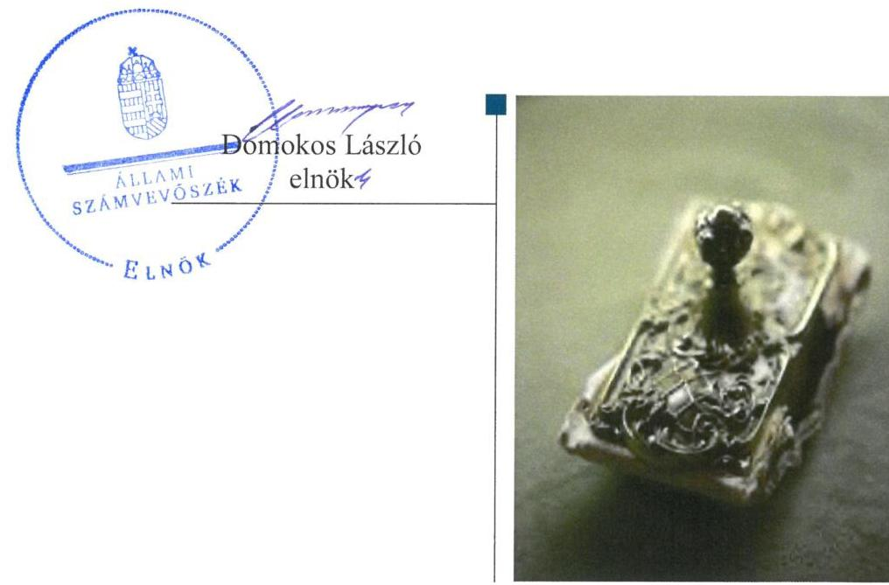
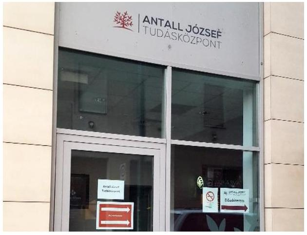
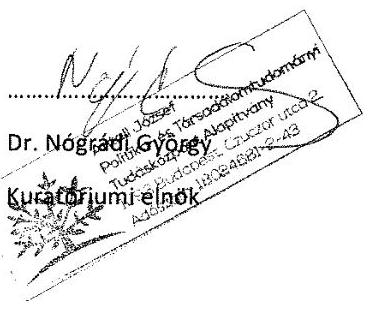
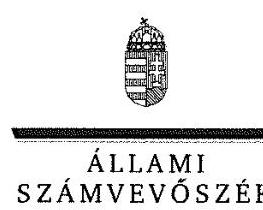
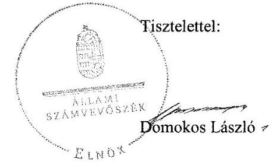

# Jelentés 

## Alapítványok ellenőrzése

Alapítványok gazdálkodásának ellenőrzése - Antall József Politika- és Társadalomtudományi Tudásközpont Alapítvány
2019.

---

# Jelentés 

## Alapítványok ellenőrzése

Alapítványok gazdálkodásának ellenőrzése - Antall József Politika- és Társadalomtudományi Tudásközpont Alapítvány
2019. 04. hó 29. nap

---

# AZ ELLENŐRZÉST FELÜGYELTE:

DR. BENEDEK MÁRIA felügyeleti vezető

## AZ ELLENŐRZÉST VEZETTE ÉS A VÉGREHAJTÁSÁÉRT FELELŐS:

DR. TÓTH VIKTÓRIA ellenőrzésvezető

## A PROGRAM ÖSSZEÁLLÍTÁSÁÉRT FELELŐS:

TÓTPÁL SZABOLCS osztályvezető

IKTATÓSZÁM: EL-0904-035/2019

TÉMASZÁM: 28

ELLENŐRZÉS-AZONOSÍTÓ SZÁM: V081901

Jelentéseink az Országgyűlés számítógépes hálózatán és az Interneta a www.asz.hu címen is olvashatóak.

---

# TARTALOMJEGYZÉK 

■ ÖSSZEGZÉS ..... 5
■ AZ ELLENŐRZÉS CÉLJA ..... 6
■ AZ ELLENŐRZÉS TERÜLETE ..... 7
■ AZ ELLENŐRZÉS HÁTTERE, INDOKOLTSÁGA ..... 8
■ A JELENTÉS LÉNYEGES KÉRDÉSKÖREI ..... 9
■ AZ ELLENŐRZÉS HATÓKÖRE ÉS MÓDSZEREI ..... 10
■ MEGÁLLAPÍTÁSOK ..... 12
■ JAVASLATOK ..... 16
■ MELLÉKLETEK ..... 19
I. sz. melléklet: Értelmező szótár ..... 19
■ FÜGGELÉKEK ..... 21
I. sz. függelék a Jelentéshez ..... 21
II. sz. függelék: Észrevételek ..... 22
■ RÖVIDÍTÉSEK JEGYZÉKE ..... 49

---

.

---

# ÖSSZEGZÉS 

Az Antall József Politika- és Társadalomtudományi Tudásközpont Alapítvány gazdálkodásának szabályozottsága 2017. évben nem volt szabályszerű, éves beszámolási kötelezettségét nem szabályszerűen teljesítette 2017. évben, így nem biztosította az elszámoltathatóságot, a gazdálkodás átláthatóságát. A 2015-2017. években a közpénzből kapott támogatások nyilvántartása nem felelt meg a jogszabályi előírásoknak, ezáltal nem biztosította az átláthatóságot.

## Az ellenőrzés társadalmi indokoltsága

Az alapítványok, mint az alapító által az alapító okiratban meghatározott tartós cél megvalósítására létrehozott jogi személyek tevékenységüket az alapító által juttatott vagyon kezelésével, felhasználásával látják el. Az alapítványok működésükre és szakmai tevékenységük ellátására költségvetési támogatásban vagy ingyenes vagyonjuttatásban részesülhetnek. Az Állami Számvevőszék stratégiájában megfogalmazta, hogy az államháztartáson kívülre nyújtott költségvetési támogatások és ingyenes vagyonjuttatások, valamint az államháztartáson kívül működő közfeladat-ellátó rendszerek ellenőrzéseivel hozzájárul ahhoz, hogy a közpénzeket az államháztartáson kívül működő szervezetek is átlátható, rendezett módon használják fel a közvagyon átlátható, hatékony, költségtakarékos működtetése, értékének megőrzése, állagának védelme, értéknövelő használata, hasznosítása és gyarapítása érdekében.

## Főbb megállapítások, következtetések, javaslatok

Az Antall József Politika- és Társadalomtudományi Tudásközpont Alapítvány a 2017. évi költségvetési tervét nem a beszámoló tartalmi elemeinek megfelelően készítette el. Számviteli politikája nem felelt meg a jogszabályi előírásoknak, számlarenddel nem rendelkezett, ezáltal nem biztosította a közpénzekkel való átlátható gazdálkodás kereteit 2017. évben.

A 2017. évi egyszerűsített éves beszámoló mérlegében az immateriális javakat, tárgyi eszközöket, befektetett pénzügyi eszközöket nem szabályszerűen mutatta ki, mivel jogszabályban előírtak ellenére a mérlegtételeket nem támasztotta alá leltárral, valamint nem rendelkezett a könyvviteli elszámolást közvetlenül és közvetetten alátámasztó számviteli bizonylatokkal.

A 2015-2017. évi egyszerűsített éves beszámolókat és mellékleteit saját honlapján nem tette közzé. Az alapcél szerinti tevékenysége költségei, ráfordításai ellentételezésére kapott támogatásokról jogszabályban előírtak ellenére nem vezetett olyan elkülönített számviteli nyilvántartást, amelynek alapján támogatásonként megállapítható és ellenőrizhető a kapott támogatás felhasználása.

Az államháztartási forrásból kapott támogatások felhasználásáról 2015-2017. években a támogatási szerződésekben előírt formában a támogatónak beszámolt.

Az Állami Számvevőszék az ellenőrzés megállapításai alapján az Antall József Politika- és Társadalomtudományi Tudásközpont Alapítvány Kuratóriuma elnökének 11 javaslatot fogalmazott meg.

---

# AZ ELLENŐRZÉS CÉLJA 

Az ellenőrzés célja annak megállapítása volt, hogy az Antall József Politika- és Társadalomtudományi Tudásközpont Alapítvány gazdálkodása során biztosított volt-e az elszámoltathatóság és átláthatóság, valamint a közpénzből kapott támogatáshoz és az alapítvány által használt nemzeti vagyonhoz kapcsolódó nyilvántartások kialakítása, az előírt beszámolás, a nemzeti vagyon értékének megőrzése megfelelően történt-e.

---

# **AZ ELLENŐRZÉS TERÜLETE**

### **Antall József Politika- és Társadalomtudományi Tudásközpont Alapítvány**

Az Alapítványt^{1} egy magánszemély alapította 2009-ben százezer forint induló vagyonnal. Az Alapítvány közhasznú jogállású, jogi személy.

Az Alapítvány közhasznú tevékenységei a felnőttoktatás (köznevelési tevékenység), valamint erősíti a magyar részvételt az Európai Unió programjaiban és más nemzetközi kutatás-fejlesztési és innovációs együttműködésekben (tudományos tevékenység, kutatás).

Államháztartási forrásból kapott vagyonkezelt vagyona nem volt, államháztartásból ingyenesen juttatott vagyont nem kapott.

Az Alapítvány az ellenőrzött időszakban a költségvetési törvényben nevesített szervezet volt, működéséhez és feladatainak ellátásához a központi költségvetésből támogatásban részesült.

Az Alapítvány államháztartási forrásból 2015-2017. években mindöszszesen 1 843,9 millió Ft támogatást használt fel. Kizárólagos, vagy többségi nemzeti tulajdonú gazdasági társaságtól az ellenőrzött években összesen 19,6 millió Ft támogatást használt fel. Az Alapítvány által államháztartási forrásból, valamint kizárólagos, vagy többségi nemzeti tulajdonú gazdasági társaságtól 2015-2017. években felhasznált támogatásokat az 1. ábra szemlélteti.

1. ábra

#### **AZ ALAPÍTVÁNY ÁLLAMHÁZTARTÁSI FORRÁSBÓL ÉS KIZÁRÓLAGOS, VAGY TÖBBSÉGI NEMZETI TULAJDONÚ GAZDASÁGI TÁRSASÁGTÓL FELHASZNÁLT TÁMOGATÁSAI 2015-2017. ÉVEKBEN (millió Ft)**

|  Forrás | 2015. | 2016. | 2017.  |
| --- | --- | --- | --- |
|  Államháztartási forrásból | 355,1 | 783,5 | 705,3  |
|  Kizárólagos, vagy többségi nemzeti tulajdonú gazdasági társaságtól | 10,0 | 7,6 | 2,0  |
|  Összesen | 365,1 | 791,1 | 707,3  |

*Forrás: 2015-2017. évi egyszerűsített éves beszámolók, Alapítvány adatszolgáltatása*

---

# AZ ELLENŐRZÉS HÁTTERE, INDOKOLTSÁGA 

Az alapítványok, mint az alapító által az alapító okiratban meghatározott tartós cél megvalósítására létrehozott jogi személyek tevékenységüket az alapító által juttatott vagyon kezelésével, felhasználásával látják el.

Társadalmi elvárás a közpénzek értékelvű, rendeltetésszerű felhasználása, a közpénzekből nyújtott támogatások átláthatóságának megteremtése, amelyhez az Állami Számvevőszék az államháztartásból, valamint a kizárólagos vagy többségi nemzeti tulajdonú gazdasági társaságtól kapott támogatás és az államháztartásból kapott vagyonjuttatás nyilvántartási, beszámolási, vagyonérték megőrzési kötelezettsége teljesítésének ellenőrzésével kíván hozzájárulni.

Az ÁSZ² célja, hogy az alapítványok gazdálkodása elszámoltathatóságának értékelésével hozzájáruljon ahhoz, hogy a társadalom objektív képet alkothasson az alapítványok működéséről. Az ÁSZ Stratégiában rögzített célkitűzése, hogy az államháztartáson kívülre nyújtott költségvetési támogatás és vagyonjuttatás ellenőrzésével hozzájáruljon ahhoz, hogy a közpénzeket a civil szervezetek is átlátható módon használják fel.

Az ellenőrzés eredményeinek célzott felhasználói a nyilvánosság/a jogalkotó, továbbá az alapítványok alapítói és szervei. Az ellenőrzés eredményeképp a törvényalkotás számára tapasztalatok állnak rendelkezésre az alapítványok gazdálkodása szabályozásához. Az ellenőrzött szervezetek szintjén gazdálkodásuk vonatkozásában a hiányosságok, szabálytalanságok feltárása, az ennek kapcsán megfogalmazott megállapítások elősegíthetik az alapítványok szabályszerű gazdálkodását. Az ellenőrzés a társadalom számára információt szolgáltat arról, hogy az alapítványok a közpénzek szabályszerű felhasználásának feltételeit kialakították-e, továbbá az ellenőrzés értékteremtő módon járul hozzá az ÁSZ stratégiai céljainak megvalósításához, a nyilvánosság megfelelő tájékoztatásához.

---

# A JELENTÉS LÉNYEGES KÉRDÉSKÖREI 

1. Szabályszerü volt-e az alapítványi gazdálkodás szabályozottsága?
2. Az alapítvány az éves beszámolási és közzétételi kötelezettségét szabályszerüen teljesítette-e?
3. Az államháztartásból és a nemzeti tulajdonú társaságtól kapott támogatás nyilvántartása, az elöírt beszámolás teljesitése megfelelő volt-e?

---

# AZ ELLENŐRZÉS HATÓKÖRE ÉS MÓDSZEREI 

## Az ellenőrzés típusa

Megfelelőségi ellenőrzés

## Az ellenőrzött időszak

2015-2017. évek, amely kiterjedt a 2017. évi egyszerűsített éves beszámoló jóváhagyásának, közzétételének, valamint a támogatások elszámolásának tekintetében 2018. június 1-jéig.

## Az ellenőrzés tárgya

A szabályszerűségi ellenőrzés kiterjedt az alapítvány gazdálkodása elszámoltathatóságának, átláthatóságának biztosítása keretében a szervezeti, költségvetési keretek kialakításának, a gazdálkodás szabályozásának, az éves beszámolási, közzétételi kötelezettség teljesítésének ellenőrzésére. Kiterjedt továbbá a közpénzből kapott támogatással és az államháztartási forrásból kapott vagyonnal kapcsolatos nyilvántartási, beszámolási, vagyonmegőrzési kötelezettség teljesítésének ellenőrzésére.

A helyénvalósági ellenőrzés keretében elvégeztük az alapítvány - kizárólagos és többségi nemzeti tulajdonú gazdasági társaságtól kapott támogatással kapcsolatos - beszámolási kötelezettsége teljesítésének értékelését.

## Az ellenőrzött szervezet

Antall József Politika- és Társadalomtudományi Tudásközpont Alapítvány

## Az ellenőrzés jogalapja

Az ÁSZ tv. ${ }^{3} 1 . \S$ (3) bekezdése, 5. § (3) bekezdése, az Ectv. ${ }^{4}$ 47. §-a.

## Az ellenőrzés módszerei

Az ellenőrzést a program szempontjai, az ellenőrzött időszakban hatályos jogszabályok, a jelen ellenőrzésre irányadó ÁSZ módszertan figyelembe vételével és a nemzetközi standardokat irányadónak tekintve végeztük.

Az ellenőrzés ideje alatt az ellenőrzött szervezettel történő kapcsolattartás az ÁSZ SZMSZ5-ének vonatkozó előírásai alapján történt.

---

Az ellenőrzési kérdések megválaszolásához szükséges bizonyítékok megszerzése az ellenőrzött által rendelkezésre bocsátott dokumentumokra, adatokra alapozva megfigyelés, szemle (szemrevételezés), kérdésfeltevés (információkérés), valamint elemző eljárás útján történt. Az ellenőrzési bizonyítékként felhasználható adatforrások közé tartoztak egyrészt a program részletes szempontjainál felsorolt adatforrások, másrészt minden egyéb - az ellenőrzés folyamán - feltárt, az ellenőrzés szempontjából információt tartalmazó dokumentum.

Az ellenőrzés lefolytatásához az ellenőrzött a tanúsítványok kitöltésével, hitelesítésével és azok, valamint az ÁSZ által kért dokumentumok megküldésével szolgáltatott adatokat.

Az ellenőrzést a gazdálkodás szabályozottsága tekintetében 2017. évre, az éves beszámolási és közzétételi kötelezettség teljesítése, az államháztartásból és a nemzeti tulajdonú társaságtól kapott támogatás nyilvántartása, és az előírt beszámolás teljesítése tekintetében a 2015-2017. évekre folytattuk le.

---

# 1. Szabályszerű volt-e az alapítványi gazdálkodás szabályozottsága?

|  Összegző megállapítás | Az alapítványi gazdálkodás szabályozottsága 2017. évben nem volt szabályszerű.  |
| --- | --- |
|  1.1. számú megállapítás | Az alapítvány gazdálkodása kereteinek kialakítása nem volt szabályszerű.  |
|   | Az Alapítvány gazdálkodása kereteinek kialakításával kapcsolatosan feltárt hiányosságokat az 1. táblázat mutatja.  |

1. táblázat

## AZ ALAPÍTVÁNY GAZDÁLKODÁSA KERETEINEK KIALAKÍTÁSÁVAL KAPCSOLATBAN FELTÁRT HIÁNYOSSÁGOK

|  Sorszám | Részmegállapítás | Megjegyzés  |
| --- | --- | --- |
|  1. | Az Alapítvány a 2017. évi költségvetési tervét nem a 479/2016. (XII. 28.) Korm. rendelet alapján készített beszámoló tartalmi elemeinek megfelelően készítette el az Ecvhr. ${ }^{6}$ 3. § (1) bekezdésében előírtak ellenére. |   |
|  2. | A 2017. évi költségvetését az Ecvhr. 3. § (2) bekezdésében foglaltak ellenére nem úgy tervezte meg, hogy kiadásai és bevételei egyensúlyban legyenek. |   |

Forrás: ÁSZ

Az Alapítvány rendelkezett alapító okirattal, felügyelőbizottságot létrehozott.

### 1.2. számú megállapítás

Az Alapítvány számviteli szabályzatai nem feleltek meg az előírásoknak.

Az Alapítvány gazdálkodására vonatkozó belső szabályozással kapcsolatosan feltárt hiányosságokat a 2. táblázat mutatja. 2. táblázat

## AZ ALAPÍTVÁNY GAZDÁLKODÁSÁRA VONATKOZÓ BELSŐ SZABÁLYOZÁSSAL KAPCSOLATBAN FELTÁRT HIÁNYOSSÁGOK

|  Sorszám | Részmegállapítás | Megjegyzés  |
| --- | --- | --- |
|  1. | Az Alapítvány nem készített számlarendet a Számv. tv. 161. § (1) bekezdésében foglalt előírás ellenére. | A számviteli politika ${ }^{7}$ 8. oldal „Könyvvezetési kötelezettség" cím negyedik bekezdése szerint a könyvvezetés az Alapítványra jellemző sajátosságok szerint kialakított számlarend alapján történik.  |
|  2. | A Számv. tv. 14. § (3) bekezdése szerint a törvényben rögzített alapelvek, értékelési előírások alapján ki kell alakítani és írásba kell foglalni a gazdálkodó adottságainak, körülményeinek leginkább megfelelő - a törvény végrehajtásának módszereit, eszközeit meghatározó - számviteli politikát. A számviteli politika nem tartalmazta az Alapítvány alapcél szerinti (közhasznú) tevékenysége költségei, ráfordításai ellentételezésére kapott támogatásokról az elkülönített számviteli nyilvántartás vezetésének |   |

---

| Sorszám | Részmegállapítás | Megjegyzés |
| :--: | :--: | :--: |
|  | módját a Számv. tv. 14. § (3) és az Ectv. 20. § (4) bekezdéseiben foglalt előírások ellenére. |  |
| 3. | A Számv. tv. 14. § (3) bekezdése szerint a törvényben rögzített alapelvek, értékelési előírások alapján ki kell alakítani és írásba kell foglalni a gazdálkodó adottságainak, körülményeinek leginkább megfelelő - a törvény végrehajtásának módszereit, eszközeit meghatározó - számviteli politikát. A számviteli politika a Számv. tv. 14. § (3) és az Ectv. 27. § (1) bekezdéseiben foglalt előírások ellenére nem tartalmazta, hogy a könyvvezetés során hogyan kell biztosítani az alaptevékenység érdekében felmerült, valamint a vállalkozási tevékenységgel kapcsolatos bevételek és kiadások elkülönített nyilvántartását. |  |

# 2. Az alapítvány az éves beszámolási és közzétételi kötelezettségét szabályszerűen teljesítette-e? 

## Összegző megállapítás

Az Alapítvány éves beszámolási és közzétételi kötelezettségének teljesítése a 2015-2017. években nem volt szabályszerű.
2.1. számú megállapítás

Az alapítvány nem szabályszerűen készítette el a beszámolóit.
Az Alapítvány beszámolási kötelezettségének teljesítésével kapcsolatosan feltárt hiányosságokat a 3. táblázat mutatja.
3. táblázat

## AZ ALAPÍTVÁNY BESZÁMOLÁSI KÖTELEZETTSÉGE TELJESÍTÉSÉVEL KAPCSOLATBAN FELTÁRT HIÁNYOSSÁGOK

Sorszám
1. Az Alapítvány a beszámoló elkészítéséhez, a mérleg tételeinek alátámasztásához nem állított össze leltárt a Számv. tv. 69. § (1) bekezdésében foglalt előírás ellenére, ezért nem volt szabályszerű az Alapítvány 2017. évi beszámolójának mérlegében az immateriális javak, tárgyi eszközök, befektetett pénzügyi eszközök értékének kimutatása.
2. Az Alapítvány a Számv. tv. 165. § (1)-(2) bekezdésében foglalt előírás ellenére nem rendelkezett a könyvviteli elszámolást közvetlenül és közvetetten alátámasztó számviteli bizonylatokkal, ideértve a részletező nyilvántartásokat is, a számviteli (könyvviteli) nyilvántartásokba bizonylatok nélkül jegyeztek be adatokat, ezért nem volt szabályszerű az Alapítvány 2017. évi beszámolójának mérlegében az immateriális javak, tárgyi eszközök, befektetett pénzügyi eszközök értékének kimutatása.
3. Az Ectv. 29. § (7) bekezdésében foglalt előírás ellenére a 2015-2017. évekről készített közhasznúsági mellékletek nem tartalmazták a közhasznú cél szerinti juttatások kimutatását.
4. Az Alapítvány 2017. évben számviteli nyilvántartásait nem úgy vezette, hogy azok alapján az alapcél szerinti (közhasznú) tevékenységének és gazdasági-vállalkozási tevékenységének bevételei, költségei, ráfordításai és eredménye (nyeresége, vesztesége) egymástól elkülönítve megállapíthatók legyenek, az Ectv. 19. §-ában foglalt előírás ellenére.

## Megjegyzés

A leltározási szabályzat 2.1 és 4. pontjai szerint évente teljes körű leltározást kell végezni, évente el kell rendelni a leltározást éves leltár utasítással, amely nem történt meg.

Az Alapítvány a beszámoló adatai alapján 2017. évben végzett vállalkozási tevékenységet.

---

# 2.2. számú megállapítás 

A Kuratórium ${ }^{12}$ az Alapítvány 2015-2017. évekről készített egyszerűsített éves beszámolót az Ectv. szerinti határidőben elfogadta.

Az egyszerűsített éves beszámolót és mellékleteit letétbe helyezték, azonban a saját honlapon nem tették közzé.

A 2015. és 2017. évi egyszerűsített éves beszámolót az Ectv. szerinti határidőben letétbe helyezték.

Az Alapítvány közzétételi kötelezettségének teljesítésével kapcsolatosan feltárt hiányosságokat a 4. táblázat mutatja.
4. táblázat

## AZ ALAPÍTVÁNY KÖZZÉTÉTELI KÖTELEZETTSÉGE TELJESÍTÉSÉVEL KAPCSOLATBAN FELTÁRT HIÁNYOSSÁGOK

Sorszám Részmegállapítás
Megjegyzés

1. A 2016. évi egyszerűsített éves beszámolót az Ectv. 30. § (1) bekezdés előírása ellenére nem helyzeték letétbe a törvény szerinti határidőben.

A letétbe helyezés a törvényben előírt határidőhöz képest 37 nap késedelemmel történt.
2. Az Alapítvány a 2015-2017. évi egyszerűsített éves beszámolókat és mellékleteit saját honlapján nem tette közzé az Ectv. 30. § (1) és (4) bekezdéseiben foglalt előírás ellenére.

Forrás: $A 52$

## 3. Az államháztartásból és a nemzeti tulajdonú társaságtól kapott támogatás nyilvántartása, az előírt beszámolás teljesítése megfelelő volt-e?

Összegző megállapítás

A támogatások nyilvántartása a 2015-2017. években nem volt szabályszerű. Az államháztartási forrásból kapott támogatások felhasználásáról 2015-2017. években a támogatási szerződésekben előírt formában a támogatónak beszámolt.
3.1. számú megállapítás

Az Alapítvány által az államháztartási forrásból és a nemzeti tulajdonú társaságoktól kapott támogatásokkal kapcsolatosan vezetett nyilvántartás nem felelt meg a jogszabályi előírásoknak.

A támogatások nyilvántartásával kapcsolatban feltárt hiányosságokat az 5. táblázat mutatja.
5. táblázat

## A TÁMOGATÁSOK NYILVÁNTARTÁSÁVAL KAPCSOLATBAN FELTÁRT HIÁNYOSSÁGOK

Sorszám Részmegállapítás
Megjegyzés

1. Az Alapítvány az alapcél szerinti (közhasznú) tevékenysége költségei, ráfordításai ellentételezésére kapott támogatásokról az Ectv. 20. § (4) bekezdés előírása ellenére nem vezetett olyan elkülönített számviteli nyilvántartást, amelynek alapján támogatásonként megállapítható és ellenőrizhető a kapott támogatás felhasználása.
2. Az alapítvány könyvvezetése során az alapcél szerinti (közhasznú) tevékenysége költségei, ráfordításai ellentételezésére visszafizetési kötelezettség nélkül kapott támogatásokat, valamint az alapcél szerinti (közhasznú) tevékenységéhez kapott adományokat nem az Ectv. 20. § (2) bekezdésében foglalt előírás szerinti részletezésben mutatta ki.

---

# 3.2. számú megállapítás 

Az Alapítvány az államháztartási forrásból kapott támogatások felhasználásáról a 2015-2017. éveket érintően az előírt formában beszámolt.

Az államháztartási forrásból kapott támogatások felhasználására kötött támogatási szerződések tartalmazták szakmai és pénzügyi beszámoló benyújtásának kötelezettségét a támogatónak. Az Alapítvány az államháztartási forrásból kapott támogatások felhasználásáról az előírt formában beszámolt.
3.3. számú megállapítás

A kizárólagos, vagy többségi nemzeti tulajdonú gazdasági társaság által nyújtott támogatások esetén az Alapítvány a 2015-2017. években nem tett eleget beszámolási kötelezettségének.

A kizárólagos, vagy többségi nemzeti tulajdonú gazdasági társaság által nyújtott támogatások felhasználásáról készített beszámolókkal kapcsolatban feltárt hiányosságokat a 6. táblázat mutatja.
6. táblázat

## A KIZÁRÓLAGOS, VAGY TÖBBSÉGI NEMZETI TULAJDONÚ GAZDASÁGI TÁRSASÁGOK ÁLTAL NYÚJTOTT TÁMOGATÁSOK FELHASZNÁLÁSÁRÓL KÉSZÍTETT BESZÁMOLÓKKAL KAPCSOLATBAN FELTÁRT HIÁNYOSSÁGOK

| Sorszám |  |  |
| :--: | :--: | :--: |
| 1. | A Diákhitel Központ Zrt.-vel 2017. évben kötött támogatási szerződésben a támogató előírt beszámolási kötelezettséget az Alapítvány részére, azonban az Alapítvány a beszámolási kötelezettségének nem tett eleget. Saját honlapján nem tett közzé beszámolót a támogatások cél szerinti felhasználásáról. Ezzel nem biztosította a támogatás-felhasználás nyilvánosságát és átláthatóságát. | Az Alaptörvény ${ }^{13}$ 39. cikk (2) bekezdése szerint a közpénzekkel gazdálkodó szervezet köteles a nyilvánosság előtt elszámolni a közpénzekre vonatkozó gazdálkodásával. |
| 2. | A Fővárosi Vizmüvek Zrt. 2015. évben 1 millió Ft, 2016. évben 500 ezer Ft támogatást nyújtott az Alapítványnak, a támogatási szerződésekben nem írt elő beszámolási kötelezettséget. Az Alapítvány a támogatások rendeltetésszerü felhasználásának igazolására nem számolt be a támogatónak legalább a támogatás teljes felhasználását követően, saját honlapján nem tett közzé beszámolót a támogatások rendeltetésszerü felhasználásáról. Ezzel nem biztosította a támogatás-felhasználás nyilvánosságát és átláthatóságát. | Az Alaptörvény 39. cikk (2) bekezdése szerint a közpénzekkel gazdálkodó szervezet köteles a nyilvánosság előtt elszámolni a közpénzekre vonatkozó gazdálkodásával. |
| 3. | Az Alapítvány a Szerencsejáték Service Nonprofit Kft. által 2015-ben nyújtott 3 millió Ft és 2016-ban nyújtott 5 millió Ft támogatás cél szerinti felhasználását a támogató által előírt írásbeli elszámolás készítésével nem igazolta. Saját honlapján nem tett közzé beszámolót a támogatások cél szerinti felhasználásáról. Ezzel nem biztosította a támogatás-felhasználás nyilvánosságát és átláthatóságát. | Az Alaptörvény 39. cikk (2) bekezdése szerint a közpénzekkel gazdálkodó szervezet köteles a nyilvánosság előtt elszámolni a közpénzekre vonatkozó gazdálkodásával. |

Forrás: ÁSZ
Az Alapítvány a Magyar Nemzeti Bankkal kötött támogatási szerződés szerint benyújtotta beszámolóját a támogatónak.

---

# JAVASLATOK 

Az ÁSZ tv. 33. § (1) bekezdésében foglaltak értelmében az ellenőrzött szervezet vezetője köteles a jelentésben foglalt megállapításokhoz kapcsolódó intézkedési tervet összeállítani és azt a jelentés kézhezvételétől számított 30 napon belül az ÁSZ részére megküldeni. Amennyiben az ellenőrzött szervezet vezetője nem küldi meg határidőben az intézkedési tervet, vagy továbbra sem elfogadható intézkedési tervet küld, az Állami Számvevőszék elnöke az ÁSZ tv. 33. § (3) bekezdése a) és b) pontjaiban foglaltakat érvényesítheti.

## A Kuratórium elnökének

1. Intézkedjen az Ecvhr.-ben elöirtak szerint az Alapítvány éves költségvetési terve - a 479/2016 (XII.28.) Korm. rendelet alapján készített beszámoló tartalmi elemeinek - megfelelő elkészitéséről.
(1. táblázat 1. sz. megállapítás alapján)
2. Intézkedjen arról, hogy az Ecvhr.-ben elöirtaknak megfelelően az éves költségvetését úgy tervezze meg, hogy kiadásai és bevételei egyensúlyban legyenek.
(1. táblázat 2. sz. megállapítás alapján)
3. Intézkedjen a Számv. tv. elöirásának megfelelően számlarend készitéséről.
(2. táblázat 1. sz. megállapítás alapján)
4. Intézkedjen a Számv. tv.-ben foglaltak alapján a gazdálkodó adottságainak, körülményeinek leginkább megfelelő módszerek, eszközök meghatározása keretében,
a) az Alapítvány alapcél szerinti (közhasznú) tevékenysége költségei, ráfordításai ellentételezésére kapott támogatásokról az Ectv.-ben foglalt elöirás szerinti elkülönített számviteli nyilvántartás vezetése módjának;
b) az Alapítvány alapcél szerinti (ezen belül közhasznú) tevékenységéböl, illetve gazdasági-vállalkozási tevékenységéből származó bevételei és költségei, ráfordításai (kiadásai) az Ectv.-ben foglalt elöirás szerinti elkülönített nyilvántartás vezetése módjának
számviteli politikában történő rögzítéséről.
(2. táblázat 2-3. sz. megállapítás alapján)

---

5. Intézkedjen a Számv. tv. előírásának megfelelően a beszámoló készitéséhez, az immateriális javak, tárgyi eszközök, befektetett pénzügyi eszközök mérleg tételeinek alátámasztásához leltár összeállításáról.
(3. táblázat 1. sz. megállapítás alapján)
6. Intézkedjen a Számv. tv. előírásának megfelelően arról, hogy minden gazdasági múveletről, eseményről, amely az eszközök, illetve az eszközök forrásainak állományát vagy összetételét megváltoztatja, bizonylat kerüljön kiállításra, továbbá a gazdasági múveletek (események) folyamatát tükröző összes bizonylat adatait a könyvviteli nyilvántartásokban rögzítsék.
(3. táblázat 2. sz. megállapítás alapján)
7. Intézkedjen az Ectv. előírásának megfelelően arról, hogy a közhasznúsági melléklet tartalmazza a közhasznú cél szerinti juttatások kimutatását.
(3. táblázat 3. sz. megállapítás alapján)
8. Intézkedjen az Ectv. előírásának megfelelően a számviteli nyilvántartások vezetéséről úgy, hogy azok alapján az alapcél (közhasznú) tevékenységének és gazdasági-vállalkozási tevékenységének bevételei, költségei, ráfordításai és eredménye egymástól elkülönítve megállapíthatók legyenek.
(3. táblázat 4. sz. megállapítás alapján)
9. Intézkedjen az Ectv. előírása szerint az Alapítvány - Kuratóriuma által elfogadott - beszámolója saját honlapján való közzétételéről.
(4. táblázat 2. sz. megállapítás alapján)
10. Intézkedjen az Ectv. előírása szerint az Alapítvány alapcél szerinti (közhasznú) tevékenység költségei, ráfordításai ellentételezésére kapott támogatások felhasználásáról olyan elkülönített számviteli nyilvántartás vezetéséről, amely alapján támogatásonként megállapítható és ellenőrizhető a kapott támogatás felhasználása.
(5. táblázat 1. sz. megállapítás alapján)
11. Intézkedjen az Ectv. előírása szerint az Alapítvány alapcél szerinti (közhasznú) tevékenysége költségei, ráfordításai ellentételezésére viszszafizetési kötelezettség nélkül kapott támogatások, valamint az alapcél szerinti (közhasznú) tevékenységéhez kapott adományok Ectv. előírása szerinti részletezésben történő kimutatásáról.
(5. táblázat 2. sz. megállapítás alapján)

---

.

---

# MELLÉKLETEK 

## I. SZ. MELLÉKLET: ÉRTELMEZŐ SZÓTÁR

alapítvány
államháztartás
költségvetési támogatás
gazdasági-vállalkozási tevékenység
közhasznú tevékenység
nemzeti tulajdonú gazdasági társaság
3.3. számú megállapítások dőlt betűs szövege

Az alapítvány az alapító által az alapító okiratban meghatározott tartós cél folyamatos megvalósítására létrehozott jogi személy. Az alapító az alapító okiratban meghatározza az alapítványnak juttatott vagyont és az alapítvány szervezetét. Alapítvány nem alapítható gazdaságivállalkozási tevékenység folytatására. Az alapítvány az alapítványi cél megvalósításával közvetlenül összefüggő gazdasági tevékenység végzésére jogosult. Alapítvány nem lehet korlátlan felelősségű tagja más jogalanynak, nem létesíthet alapítványt és nem csatlakozhat alapítványhoz. (Forrás: Ptk. 3:378§, 3:379. §(I)-(3) bekezdés)
az államháztartás a közfeladatok ellátásának egységes S2ervezeti, tervezési, gazdálkodási, ellenőrzési, finanszírozási, adatszolgáltatási és beszámolási szabályok szerint működő rendszere, amely központi és önkormányzati alrendszerből áll.
Az államháztartás központi alrendszerébe tartozik az állam, a központi költségvetési szerv, a törvény által az államháztartás központi alrendszerébe sorolt köztestület, és ezen köztestület által irányított köztestületi költségvetési szerv.
Az államháztartás önkormányzati alrendszerébe tartozik a helyi önkormányzat, a helyi nemzetiségi önkormányzat és az országos nemzetiségi önkormányzat, a Mötv. és a nemzetiségek jogairól szóló 2011. évi CLXXIX. törvény szerint létrehozott társulás, valamint a területfejlesztésről és a területrendezésről szóló törvény alapján létrejött területfejlesztési önkormányzati társulás, a térségi fejlesztési tanács, és a megnevezett szervezetek által irányított költségvetési szerv. (Forrás: Áht. 2-3. §)
az államháztartás alrendszerei terhére nyújtott pénzbeli vagy nem pénzbeli juttatás, amelyet a támogató nem elsősorban ellenszolgáltatás ellenében, de konkrét program megvalósítása vagy meghatározott időszakban a támogatott szervezet müködtetése érdekében nyújt. Költségvetési támogatás különösen: a pályázat útján, valamint egyedi döntéssel kapott költségvetési támogatás; az Európai Unió strukturális alapjaiból, illetve a Kohéziós Alapból származó, a költségvetésből juttatott támogatás; az Európai Unió költségvetéséből vagy más államtól, nemzetközi szervezettől származó támogatás és a személyi jövedelemadó meghatározott részének az adózó rendelkezése szerint felajánlott összege. (Forrás: Ectv. 2. § 15. pont)
A jövedelem- és vagyonszerzésre irányuló vagy azt eredményező, üzletszerűen végzett gazdasági tevékenység, kivéve az adomány (ajándék) elfogadását, a létesítő okiratban meghatározott cél szerinti tevékenységet (ideértve a közhasznú tevékenységet is), - 2015. november 28-tól - a pénzeszközök betétbe, értékpapírba, társasági részesedésbe történő elhelyezését és az ingatlan megszerzését, használatának átengedését és átruházását. (Forrás: Ectv. 2. § 11. pont)
minden olyan tevékenység, amely a létesítő okiratban megjelölt közfeladat teljesítését közvetlenül vagy közvetve szolgálja, ezzel hozzájárulva a társadalom és az egyén közös szükségleteinek kielégítéséhez. (Forrás: Ectv. 2. § 20. pont)
állami és önkormányzati tulajdonú gazdasági társaság. (Forrás: Nvtv. ${ }^{14}$ 1. § (1) bekezdése)

A 3.3. számú megállapítások esetében dőlt betű jelzi a helyénvalósági értékeléseket.

---

.

---

# FÜGGELÉKEK 

- I. SZ. FÜGGELÉK A JELENTÉSHEZ

A civil szervezetek bírósági nyilvántartásáról és az ezzel összefüggő eljárási szabályokról szóló 2011. évi CLXXXI. törvény 71/C. § (1) bekezdés d) pontja és 71/A. § (4) bekezdése alapján a Fővárosi Törvényszék irányába a következő felhívást tesszük.
A 2015-2017. évekről készített közhasznúsági mellékletek nem tartalmazták a közhasznú cél szerinti juttatások kimutatását az Ectv. 29. § (7) bekezdésével ellenétben. Az Alapítvány az alapcél szerinti (közhasznú) tevékenysége költségei, ráfordításai ellentételezésére kapott támogatásokról az Ectv. 20. § (4) bekezdés ellenére nem vezetett olyan elkülönített számviteli nyilvántartást, amelynek alapján támogatásonként megállapítható és ellenőrizhető a kapott támogatás felhasználása.
Az Alapítvány nem készített számlarendet a Számv. tv. 161. § (1) bekezdésével ellentétben.
Az Alapítvány a beszámoló elkészítéséhez, a mérleg tételeinek alátámasztásához nem állított össze leltárt a Számv. tv. 69. § (1) bekezdés ellenére, ezért nem volt szabályszerű az Alapítvány 2017. évi beszámolójának mérlegében az immateriális javak, tárgyi eszközök, befektetett pénzügyi eszközök értékének kimutatása. Az Alapítvány a Számv. tv. 165. § (1)(2) bekezdése ellenére nem rendelkezett a könyvviteli elszámolást közvetlenül és közvetetten alátámasztó számviteli bizonylatokkal, ideértve a részletező nyilvántartásokat is, a számviteli (könyvviteli) nyilvántartásokba bizonylatok nélkül jegyeztek be adatokat, ezért nem volt szabályszerű az Alapítvány 2017. évi beszámolójának mérlegében az immateriális javak, tárgyi eszközök, befektetett pénzügyi eszközök értékének ki-mutatása. Ez felveti, hogy az Alapítvány nem biztosította a Számv. tv. 15. § (3) bekezdésében előírt valódiság elvét.

---

A jelentéstervezetet a Számvevőszék 15 napos észrevételezésre megküldte az ellenőrzött szervezet vezetőjének az ÁSZ tv. 29. §* (1) bekezdése előírásának megfelelően.

Az Antall József Politika- és Társadalomtudományi Tudásközpont Alapítvány kuratóriumának elnöke a jelentéstervezet megállapításaira írásban észrevételt tett.
Az ÁSZ tv. 29. § (3) bekezdésével összhangban az ÁSZ a Függelékben feltünteti az ellenőrzés megállapításaival kapcsolatban tett, figyelembe nem vett észrevételeket, és megindokolja, hogy azokat miért nem fogadta el.

[^0]
[^0]:    * 29. § (1) Az Állami Számvevőszék az ellenőrzési megállapításait megküldi az ellenőrzött szervezet vezetőjének vagy az általa megbízott személynek, és annak, akinek személyes felelősségét állapította meg.
    (2) Az ellenőrzött szervezet vezetője és a felelősként megjelölt személy az ellenőrzés megállapításaira tizenöt napon belül írásban észrevételt tehet.
    (3) Az Állami Számvevőszék az észrevételre a beérkezésétől számított harminc napon belül írásban válaszol. A figyelembe nem vett észrevételeket köteles a jelentésben feltüntetni, és megindokolni, hogy azokat miért nem fogadta el.

---

Dr. Benedek Mária
felügyeleti vezető részére
Állami Számvevőszék
1052 Budapest
Apáczai Csere János utca 10.

Tisztelt Felügyeleti Vezető Asszony!

Köszönettel megkaptuk a 2019. január 7-én keltezett levelüket az Antall József Tudásközpont ellenőrzéséről készített számvevőszéki jelentéstervezetről, melyben az Önök megállapításaira és a javaslataira a jelen levelünkben az alábbi észrevételeket kívánjuk megtenni.
2018. augusztus 9-én keltezett levelemben az Állami Számvevőszék által előírt 5 napos adatszolgáltatási határidő hosszabbítását kértünk, mivel szabadságolások közepette érkezett be a Tudásközpontba az ellenőrzés megkezdéséhez szükséges anyagok összeállítására és beküldésére vonatkozó felhívás, azonban ezt a kérésünket a Számvevőszék elutasította. Az adatszolgáltatásra vonatkozó határidő hosszabbítási kérelmünk elutasítása nagyban nehezítette munkánkat, mert kis szervezet lévén egy fő látja el a pénzügyi és számviteli feladatokat, és ő ezen időszak alatt szabadságon volt, tárgyévben a külső megbízott könyvelést végző szolgáltató váltására került sor, így az új szervezet sem tudott jelentősen segítségünkre lenni az azonnali adatszolgáltatásban.

Tisztelettel kérjük ennek figyelembevételét, egyúttal pedig lehetőséget kérünk arra, hogy az Önök által észlelt hiányosságokat pótlólag a Számvevőszék rendelkezésére bocsáthassuk, amennyiben erre van mód.

Az EL-0904-028/2018 iktatószámú számvevőszéki jelentéstervezettel kapcsolatban az Állami Számvevőszékről szóló 2011. évi LXVI. tv. 29. § (2) bekezdése alapján az alábbi észrevételeket tesszük:

# 1.1. számú megállapítás: 

„Az Alapítvány a 2017. évi költségvetési tervét nem a 479/2016. (XII. 28.) Korm. rendelet alapján készített beszámoló tartalmi elemeinek megfelelően készítette el."

Az Alapítvány 2017. évi költségvetési terve nem a 2017. évi beszámoló tagolását követve készült, azonban minden beszámolóban feltüntetett költségnem megtalálható abban, tovább részletezve azt, az alaptevékenység (közhasznú tevékenység) érdekében felmerült költségek súlyarányának megfelelően.
1.2. számú megállapítás 2. sz. javaslat:
„A 2017.évi költségvetését az Ecvhr. 3 § (2) bekezdésében foglaltak ellenére nem úgy tervezte meg, hogy kiadásai és bevételei egyensúlyban legyenek."

A tényszámok váratlanul felmerülő, elháríthatatlan okból, forráshiányt előidéző események bekövetkezése okán mutatnak eltérést. A tervezés fázisában a kiadások és bevételek egyensúlyban áltak.
„Intézkedjen arról, hogy az Ecvhr.-ben elöírtaknak megfelelően az éves költségvetését úgy tervezze meg, hogy kiadásai és bevételei egyensúlyban legyenek."

---

A Kuratórium a 2017. évi beszámoló elfogadása során -figyelembe véve annak tényszámait-, a 2018. évi költségvetést úgy tervezte, hogy kiadásai és bevételei egyensúlyban legyenek. A 2019. évi költségvetés már 2018. decemberében elfogadásra került, a költségvetés évközi teljesülését a Kuratórium folyamatosan figyelemmel kíséri, bevételelmaradás esetén azonnali intézkedéseket tesz az egyensúly biztosítása érdekében.

# 1.2.1 számú megállapítás, 3. sz. javaslat: 

„Az Alapítvány nem készített számlarendet a Számviteli törvény 161 § (1) bekezdésében foglalt előírások ellenére."

Az Alapítvány a Számv. tv. 161. § (1) bekezdésében foglalt előírásoknak megfelelő számlarenddel rendelkezik, melyet terjedelme okán önállóan tárol, így a pénzügyes kolléga szabadsága miatt az Alapítvány munkatársai az adatszolgáltatásra rendelkezésre álló határidőn belül nem tudták azt az Állami Számvevőszék rendelkezésére bocsátani. A Megállapításokat összefoglaló jelentés 2. táblázatának „Megjegyzés" oszlopa is tartalmazza a Számlarendre vonatkozó hivatkozást, amely alátámasztja, hogy az Alapítvány valóban rendelkezett a vizsgált időszakban Számlarenddel.

### 1.2.2., 1.2.3 számú megállapítás, 4. sz. javaslat:

„A Számv. tv. 14 § (3) bekezdése szerint a törvényben rögzített alapelvek, értékelési előírások alapján ki kell alakítani és írásba kell foglalni a gazdálkodó adottságainak, körülményeinek leginkább megfelelő -a törvény végrehajtásának módszereit, eszközeit meghatározó- számviteli politikát A számviteli politika nem tartalmazta az Alapítvány alapcél szerinti (közhasznú) tevékenysége költségei, ráfordításai ellentételezésére kapott támogatásokról az elkülönített számviteli nyilvántartás vezetésének módját a Számv. tv. 14 § (3) és az Ectv. 20 § (4) bekezdésében foglalt előírások ellenére. A Számv. tv. 14 § (3) bekezdése szerint a törvényben rögzített alapelvek, értékelési előírások alapján ki kell alakítani és írásba kell foglalni a gazdálkodó adottságainak, körülményeinek leginkább megfelelő -a törvény végrehajtásának módszereit, eszközeit meghatározó- számviteli politikát A számviteli politika a Számv. tv. 14. § (3) és az Ectv. 27 § (1) bekezdésébe foglalt előírások ellenére nem tartalmazta, hogy a könyvvezetés során hogyan kell biztosítani az alaptevékenység érdekében felmerült, valamint a vállalkozási tevékenységgel kapcsolatos bevételek és kiadások elkülönített nyilvántartását."

A Számviteli politika szerves részét képező Számlarendjében rögzített módon 2015 óta szerepel, hogy az Alapítvány a támogatások elkülönített nyilvántartását a különböző támogatások alapján folyamatosan bővített munkaszámok rendszerének alkalmazásával, a gazdasági-vállalkozási tevékenységéből származó bevételei vonatkozásában az elkülönült főkönyvi számok alkalmazásával, a költségei, ráfordításai (kiadásai) tekintetében önálló költséghelyek és a munkaszámok alkalmazásával biztosítja. A javaslat alapján a 2019. évben módosítást terjesztünk a Kuratórium elé, amelyben a Számviteli Politika elnevezésű, alapelveiket bemutató szabályzatban is:

- részletezően szerepelni fognak az Alapítvány alapcél szerinti (közhasznú) tevékenysége költségei, ráfordításai ellentételezésére kapott támogatásokból az Ectv.-ben foglalt előírás szerinti elkülönített számviteli nyilvántartás vezetésének módja;
- rögzítésre kerülnek az Alapítvány alapcél szerinti (közhasznú) tevékenységéből, illetve gazdasági-vállalkozási tevékenységéből származó bevételei és költségei, ráfordításai (kiadásai) az Ectv.-ben foglalt előírás szerint.

### 2.1.1. számú megállapítás

„Az Alapítvány a beszámoló elkészítéséhez, a mérleg tételeinek alátámasztásához nem állított össze leltárt a Számviteli törvény 69. § (1) bekezdésében foglalt előírás ellenére, ezért nem volt szabályszerű az Alapítvány 2017. évi beszámolójának mérlegében az immateriális javak, tárgyi eszközök, befektetett eszközök értékének kimutatása."

---

Az Alapítvány Leltározási szabályzatának megfelelően, a beszámoló mérlegsorait analitikák és leltárak támasztják alá. Ennek megfelelően az éves teljeskörű leltározás mind a tárgyi eszközök, mind a készletek tekintetében megtörtént. A leltározással kapcsolatos dokumentumokat a Pénzügyi Osztály elkülönítetten tárolja, mely dokumentumok a dokumentumok feltöltésére rendelkezésre álló rövid idő miatt a pénzügyes kolléga távollétében sajnálatos módon nem kerültek csatolásra, de az Alapítvány rendelkezik 2017. évi Leltározási utasítással, Megbízó levelekkel, Leltáranalitikákkal és a leltárkiértékelést alátámasztó összefoglaló jegyzőkönyvvel.

# 2.1.2. számú megállapítás, 6. sz. javaslat: 

„Az Alapítvány a Számv. tv. 165. § (1)-(2) bekezdésében foglalt előirás ellenére nem rendelkezett a könyvviteli elszámolást közvetlenül és közvetetten alátámasztó számviteli bizonylatokkal, ideértve a részletező nyilvántartásokat is, a számviteli (könyvviteli) nyilvántartásokba bizonylatok nélkül jegyeztek be adatokat, ezért nem volt szabályszerű az Alapítvány 2017. évi beszámolójának mérlegében az immateriális javak, tárgyi eszközök, befektetett pénzügyi eszközök értékének kimutatása."

A fentiekben bemutatott leltározási dokumentumok részletező nyilvántartásként megalapozzák a könyvelést, így a fenti megállapítás nem helytálló, mint azt az éves beszámolóhoz csatolt könyvvizsgálói jelentés is alátámasztja. Az Alapítvány a NAV által regisztrált Revolution nevű könyvviteli programmal látta el könyvelését 2015-2017. között. A programhoz kapcsolódó tárgyi eszköz modulban megtalálhatóak az immateriális javak és tárgyi eszközök vonatkozásában az analitikus nyilvántartások, (hasonlóan a beérkező számlák, a kimenő számlák, pénzügyi eszközök bizonylati moduljai tekintetében), az eszközök-források állományváltozását, ill. összetételét kimutató analitikák vonatkozásában (pl. bruttó érték, nettó érték változás, értékcsökkenés, változása). Az alapbizonylatok könyvelése után a bekövetkezett változást az analitikus nyilvántartások megfelelően bemutatják. Ennek értelmében bármilyen időpontra, illetve időszakra kimutatható az immateriális javak, tárgyi eszközök, befektetett pénzügyi eszközök értéke.

## 7. sz. javaslat:

„Intézkedjen az Ectv. előirásának megfelelően arról, hogy a közhasznúsági melléklet tartalmazza a közhasznú cél szerinti juttatások kimutatását."

A közhasznúsági mellékletben a jövőben értékhatár nélkül kimutatjuk a közhasznú cél szerinti juttatásokat, a 2015-2017. évi közhasznúsági mellékletek a jelentős értéket elérő közhasznú cél szerinti kimutatásokat tartalmazták.

### 2.1.4. számú megállapítás, 8. sz. javaslat:

„Az Alapítvány 2017. évben a számviteli nyilvántartásait nem úgy vezette, hogy azok alapján az alapcél szerinti (közhasznú) tevékenységének és gazdasági-vállalkozási tevékenységének bevételei, költségei, ráfordításai és eredménye (nyeresége, vesztesége) egymástól elkülönítve megállapíthatóak legyenek, az Ectv. 19 §-ban foglalt előirás ellenére."

Az 1.2.2. számú megállapításra tett észrevételünkhöz kapcsolódóan észrevételezni kívánjuk, hogy a Revolution könyvviteli program lehetőség nyújt arra, hogy egy-egy gazdasági esemény könyvelése költséghelyek és munkaszámok szerint is megvalósuljon. Ezen költséghelyek és munkaszámok kialakításával és alkalmazásával 2017. évben elkülöníthetőek az alapcél szerinti (közhasznú) tevékenység és a gazdasági-vállalkozási tevékenység bevételei, költségei, ráfordításai, melyet munkaszámra, valamint költséghelyre szűrt főkönyvi kivonat és főkönyvi kartonok támasztanak alá. A

---

költséghely és munkaszám szerinti könyvelés megvalósult, így a beszámolóban kimutatott vállalkozási tevékenység elszámolását a főkönyvi kivonatok alátámasztják, kérjük a megállapítás felülvizsgálatát.

# 2.2. számú megállapítás, 9. sz. javaslat: 

„Az Alapítvány a 2015-2017. évi egyszerúsített éves beszámolókat és mellékleteit saját honlapján nem tette közzé az Ectv. 30 §. (1) és (4) bekezdésében foglalt előírás ellenére."

A 2015-2017. évi egyszerúsített éves beszámolókat és mellékleteit a Tudásközpont minden éves beszámoló elfogadását követően honlapján közzé tette, melyek az alábbi útvonalon érhetők el: http://www.ajtk.hu/sajto/. Sajnálatos módon a jelenlegi struktúra nem teszi lehetővé, hogy a beszámoló máshol foglaljon helyet, azonban 2019. első félévében honlapunk strukturális átalakítása során biztosítjuk, hogy a beszámoló, illetve a közhasznúsági jelentés honlapunkon külön, erre a célra kialakított menüpontban legyen megtalálható.

### 3.1.1. számú megállapítás, 10. sz. javaslat:

„Az Alapítvány az alapcél szerinti (közhasznú) tevékenysége költségei, ráfordításai ellentételezésére kapott támogatásokról az Ectv. 20 § (4) bekezdés előírásai ellenére nem vezetett olyan elkülönített számviteli nyilvántartást, amelynek alapján támogatásonként megállapítható és ellenőrizhető a kapott támogatás felhasználása."

Az Alapítvány az alapcél szerinti (közhasznú) tevékenysége költségei, ráfordításai ellentételezésére kapott támogatásokról az Ectv. 20. § (4) bekezdés előírásainak megfelelő elkülönített számviteli nyilvántartást vezet, a költséghely és munkaszám rendszerével összefüggő könyvvezetés alkalmazásával.

### 3.1.2. számú megállapítás, 11. sz. javaslat:

„Az alapítvány könyvvezetése során az alapcél szerinti (közhasznú) tevékenysége költségei, ráfordításai ellentételezésére visszafizetési kötelezettség nélkül kapott támogatások, valamint az alapcél szerinti (közhasznú) tevékenységéhez kapott adományokat nem az Ectv. 20. § (2) bekezdésében foglalt előírás szerinti részletezésben mutatta ki."

A költséghely és munkaszám szerinti könyvvezetés biztosítja az Ectv. 20 § (2) bekezdésében előírt elkülönített számviteli nyilvántartásokat, amely alapján támogatásonként megállapítható és ellenőrizhető a kapott támogatás felhasználása, amely kimutatással a 2017. évi könyvelés vonatkozásában az Alapítvány rendelkezik.

Jelentéstervezet 15. o. 3.3. megállapítás 6. táblázat 1. pont:
„A Diákhitel Központ Zrt.-vel 2017. évben kötött támogatási szerződésben a támogató előírt beszámolási kötelezettséget az Alapítvány részére, azonban az Alapítvány a beszámolási kötelezettségének nem tett eleget. Saját honlapján nem tett közzé beszámolót a támogatások cél szerinti felhasználásáról. Ezzel nem biztosította a támogatás-felhasználás nyilvánosságát és átláthatóságát."

A Diákhitel Központ Zrt.-vel 2017. évben kötött támogatási szerződés alapján az Alapítvány a beszámolási kötelezettségének eleget tett. A beszámolót 2017. május 11-én küldte meg a Támogató felé.

---

Jelentéstervezet 15. o. 3.3. megállapítás 6. táblázat 2. pont:
„A Fővárosi Vizmüvek Zrt. 2015. évben 1 millió Ft, 2016. évben 500 ezer Ft támogatást nyújtott az Alapítványnak, a támogatási szerződésekben nem írt elő beszámolási kötelezettséget. Az Alapítvány a támogatások rendeltetésszerü felhasználásának igazolására nem számolt be a támogatónak legalább a támogatás teljes felhasználását követően, saját honlapján nem tett közzé beszámolót a támogatások rendeltetésszerü felhasználásáról. Ezzel nem biztosította a támogatás-felhasználás nyilvánosságát és átláthatóságát."

A Fővárosi Vizmüvek Zrt. felé a támogatásokkal kapcsolatban az Alapítványnak csak nyilatkozattételi kötelezettsége volt arra vonatkozóan, hogy a kapott támogatást a szerződésben meghatározott célra használta fel, mely nyilatkozattételi kötelezettségének az Alapítvány eleget tett. A 2015. évi támogatással kapcsolatos nyilatkozattételre 2016. január 8-án került sor.

Jelentéstervezet 15. o. 3.3. megállapítás 6. táblázat 3. pont:
„Az Alapítvány a Szerencsejáték Service Nonprofit Kft. által 2015-ben nyújtott 3 millió Ft és 2016-ban nyújtott 5 millió Ft támogatás cél szerinti felhasználását a támogató által elöirt írásbeli elszámolás készítésével nem igazolta. Saját honlapján nem tett közzé beszámolót a támogatások cél szerinti felhasználásáról. Ezzel nem biztosította a támogatás-felhasználás nyilvánosságát és átláthatóságát."

A Szerencsejáték Service Nonprofit Kft. által 2015-ben nyújtott 3 millió Ft és 2016-ban nyújtott 5 millió Ft támogatás cél szerinti felhasználását az Alapítvány pénzügyi beszámoló elkészítésével igazolta. A 2015-ben nyújtott 3 millió Ft-ról 2016. június 22-én lett benyújtva a beszámoló, a 2016. évi 5 millió Ftos támogatásról pedig 2017. május 12-én.

Kérjük észrevételeink szíves elfogadását és a jelentés-tervezet felülvizsgálatát.

Budapest, 2019. január 21.

Tisztelettel,

---

ELNÖK

# Dr. Nógrádi György úr 

Kuratórium elnöke
Antall József Politika- és Társadalomtudományi Tudásközpont Alapítvány

## Budapest

## Tisztelt Elnök Úr!

Köszönettel megkaptam az Állami Számvevőszékhez 2019. január 23. napján érkezett „Alapítványok ellenörzése - Alapitványok gazdálkodásának ellenörzése - Antall József Politika- és Társadalomtudományi Tudásközpont Alapitvány" címủ számvevőszéki jelentéstervezetben foglalt megállapításokra tett 2019. január 21-én kelt észrevételét.

Az Önnel 2019. március 12. napján folytatott személyes egyeztetést követően az észrevételek értékelését az Állami Számvevőszék befejezte. Az észrevételekre vonatkozó álláspontjáról a felügyeleti vezető által készített tájékoztatást csatoltan megküldöm.

Budapest, 2019. 67 hó 17 nap

Melléklet: Tájékoztatás

---

# Tájékoztatás 

a figyelembe nem vett észrevételekröl, azok indokairól

| 1. | Észrevétel: | A kuratórium elnöke által az ÁSZ részére megküldött 2019. január 21-én kelt levél 1. oldal 2-3. bekezdései: ,,2018. augusztus 9-én keltezett levelemben az Állami Számvevőszék által elö̀rt 5 napos adatszolgáltatási határidő hosszabbítását kértünk, mivel szabadságolások közepette érkezett be a Tudásközpontba az ellenörzés megkezdéséhez szükséges anyagok összeállitására és beküldésére vonatkozó felhívás, azonban ezt a kérésünket a Számvevöszék elutasította. Az adatszolgáltatásra vonatkozó határidő hoszszabbitási kérelmünk elutasitása nagyban nehezítette munkánkat, mert kis szervezet lévén egy fö látja el a pénzügyi és számviteli feladatokat, és ő ezen idöszak alatt szabadságon volt, tárgyévben a külső megbizott könyvelést végző szolgáltató váltására került sor, igy az új szervezet sem tudott jelentösen segitségünkre lenni az azonnali adatszolgáltatásban.   Tisztelettel kérjük ennek figyelembevételét, egyúttal pedig lehetőséget kérünk arra, hogy az Önök által észlelt hiányosságokat pótlólag a Számvevőszék rendelkezésére bocsáthassuk, amennyiben erre van mód." |
| :--: | :--: | :--: |
|  | Válasz: | Az ÁSZ a fentiekben leírtakat nem tekinti észrevételnek. |
|  | Indoklás: | Az Alapítvány kuratóriumának elnöke által az ÁSZ részére megküldött 2019. január 21-én kelt levél 1. oldal 2-3. bekezdéseiben leírtakat az ÁSZ nem tekinti észrevételnek, abban a kuratórium elnöke az ellenörzés vonatkozásában az adatszolgáltatás előkészítésével kapcsolatos gondokról, az adatszolgáltatási kötelezettség nem teljesítése okairól ad tájékoztatást. |

---

|  |  | Az észrevétel 1. oldal 5-8. bekezdései az ÁSZ jelentéster-   vezet 12. oldal 1. táblázat 1. sorszámú: „Az Alapítvány a   2017. évi költségvetési tervét nem a 479/2016. (XII. 28.)   Korm. rendelet alapján készitett beszámoló tartalmi eleme-   inek megfelelöen készítette el az Ecvhr. 3. § (1) bekezdésé-   ben elöirtak ellenére."   megállapításra tett észrevétel:   1.1. „, számú megállapítás:   „Az Alapítvány a 2017. évi költségvetési tervét nem a   479/2016. (XII. 28.) Korm. rendelet alapján készitett beszá-   moló tartalmi elemeinek megfelelöen készítette el."   Az Alapítvány 2017. évi költségvetési terve nem a 2017. évi   beszámoló tagolását követve készült, azonban minden be-   számolóban feltüntetett költségnem megtalálható abban, to-   vább részletezve azt, az alaptevékenység (közhaseinú tevékenység) érdekében felmerült költségek súlyarányának megfelelöen." |
| :--: | :--: | :--: |
| 2. | Válasz: | Az ÁSZ az észrevételt nem veszi figyelembe. |
|  | Indoklás: | Az észrevétel nem megalapozott. A 2018. október 11-én az   Alapítvány részére megküldött ellenőrzés megkezdéséről   szóló EL-0904-002 iktatószámú kiértesítő levélben foglal-   tak alapján az Alapítvány tájékoztatást kapott arról, hogy az   ellenőrzés a mellékelt ellenőrzési program szerint kerül le-   folytatásra. A levél mellékletét képező EL-0454-001/2018.   számú ellenőrzési programban foglalt ellenőrzés módszere   szerint az ellenőrzési kérdések megválaszolásához szüksé-   ges bizonyítékok megszerzése az ellenőrzött által rendelke-   zésre bocsátott dokumentumokra, adatokra alapoz. Az ÁSZ   a vonatkozó megállapítását az ellenőrzött szervezet által az   adatszolgáltatásra biztosított határidőben az ÁSZ rendelke-   zésére bocsátott dokumentumok alapján tette meg. Az ellen-   örzés végrehajtása során az ÁSZ a jogszabályok, az ellenő-   zési program, az ellenőrzési szakmai szabályok, módszerek   és az etikai normák szerint járt el, az ellenőrzés eredményei,   az ellenőrzési megállapítások dokumentumokkal alátámasz-   tottak, adatokkal megalapozottak. Az adatszolgáltatásra biz-   tositott határidőben megküldött dokumentumok felülvizsgá-   lata alapján az ÁSZ megállapította, hogy az Ecvhr. 3. § (1)   bekezdésében elöírtak ellenére az Alapítvány a 2017. évi   költségvetési tervét nem a 479/2016. (XII. 28.) Korm. ren-   delet alapján készített beszámoló tartalmi elemeinek megfelelően készítette el. A költségvetési tervében nem különi-   tette el az alap és vállalkozási tevékenység vonatkozásában   tervezett kiadásokat, bevételeket, a bevételeknél külön so-   ron nem szerepelnek az értékesítésből származó bevételek,   pénzügyi műveletek bevételei, rendkívüli bevételek, tagdi-   jak. A tervezett kiadások között nem szerepelnek a pénzügyi |

---

|  |  | műveletek ráfordításai, a személyi jellegü ráfordítások tovább bontásával a vezető tisztségviselők juttatásai.   Fentiek figyelembevételével az ÁSZ fenntartja az Alapítvány 2017. évi költségvetési terve vonatkozásában tett megállapítását. |
| :--: | :--: | :--: |
| 3. | Észrevétel: | Az észrevétel 1. oldal 9-12. és 2. oldal 1 bekezdései az ÁSZ jelentéstervezet 13. oldal 1. táblázat 2. sorszámú megállapításra és a 17. oldal 2. számú javaslatára: „A 2017. évi költségvetését az Ecvhr. 3. § (2) bekezdésében foglaltak ellenére nem úgy tervezte meg, hogy kiadásai és bevételei egyensúlyban legyenek."   2. „Intézkedjen arról, hogy az Ecvhr.-ben elöirtaknak megfelelöen az éves költségvetését úgy tervezze meg, hogy kiadásai és bevételei egyensúlyban legyenek." tett észrevétel:   1.2. számú megállapítás 2. sz. javaslat:   „A 2017. évi költségvetését az Ecvhr. 3 § (2) bekezdésében foglaltak ellenére nem úgy tervezte meg, hogy kiadásai és bevételei egyensúlyban legyenek."   A tényszámok váratlanul felmerülö, elháríthatatlan okból, forráshiányt elöidéző események bekövetkezése okán mutatnak eltérést. A tervezés fázisában a kiadások és bevételek egyensúlyban álltak.   „Intézkedjen arról, hogy az Ecvhr.-ben elöirtaknak megfelelően az éves költségvetését úgy tervezze meg, hogy kiadásai és bevételei egyensúlyban legyenek."   A Kuratórium a 2017. évi beszámoló elfogadása során -figyelembe véve annak tényszámait-, a 2018. évi költségvetést úgy tervezte, hogy kiadásai és bevételei egyensúlyban legyenek. A 2019. évi költségvetés már 2018. decemberében elfogadásra került, a költségvetés évközi teljesülését a Kuratórium folyamatosan figyelemmel kíséri, bevételelmaradás esetén azonnali intézkedéseket tesz az egyensúly biztosítása érdekében." |
|  | Válasz: | Az ÁSZ az észrevételt nem veszi figyelembe. |
|  | Indokolás: | Az észrevétel nem megalapozott. A 2018. október 11-én az Alapítvány részére megküldött ellenőrzés megkezdéséről szóló EL-0904-002 iktatószámú kiértesítő levélben foglaltak alapján az Alapítvány tájékoztatást kapott arról, hogy az ellenőrzés a mellékelt ellenőrzési program szerint kerül lefolytatásra. A levél mellékletét képező EL-0454-001/2018. számú ellenőrzési programban foglalt ellenőrzés módszere szerint az ellenőrzési kérdések megválaszolásához szükséges bizonyítékok megszerzése az ellenőrzött által rendelkezésre bocsátott dokumentumokra, adatokra alapoz. Az ÁSZ a vonatkozó megállapítását az ellenőrzött szervezet által az |

---

|  |  | adatszolgáltatásra biztosított határidőben az ÁSZ rendelkezésére bocsátott dokumentumok alapján tette meg. Az ellenőrzés végrehajtása során az ÁSZ a jogszabályok, az ellenőrzési program, az ellenőrzési szakmai szabályok, módszerek és az etikai normák szerint járt el, az ellenőrzés eredményei, az ellenőrzési megállapítások dokumentumokkal alátámasztottak, adatokkal megalapozottak. Az adatszolgáltatásra biztosított határidőben az ÁSZ részére megküldött 2018. augusztus 9 -én kelt teljességi hitelességi nyilatkozat 27. pontjában foglalt „2018-as költségvetési tervezet" fájl elnevezésű (tartalma szerint a 2017. évi költségvetés) dokumentum felülvizsgálata alapján az ÁSZ megállapította, hogy az Alapítvány a 2017. évi költségvetését az Eevhr. 3. § (2) bekezdésében foglaltak ellenére nem úgy tervezte meg, hogy kiadásai és bevételei egyensúlyban legyenek.   Fentiek figyelembevételével az ÁSZ fenntartja a jelentéstervezetben a 2017. évi költségvetési terv vonatkozásában tett megállapítását. |
| :--: | :--: | :--: |
| 4. | Észrevétel: | Az észrevétel 2. oldal 2-7. bekezdései az ÁSZ jelentéstervezet 12-13. oldal 2. táblázat 1-3. sorszámú megállapításokra, és a 17. oldal 3. és 4. számú javaslatokra: „Az Alapítvány nem készített számlarendet a Számv. tv. 161. § (1) bekezdésében foglalt elöirás ellenére." „A Számv. tv. 14. § (3) bekezdése szerint a törvényben rögzített alapelvek, értékelési elöírások alapján ki kell alakítani és írásba kell foglalni a gazdálkodó adottságainak, körülményeinek leginkább megfelelö - a törvény végrehajtásának módszereit, eszközeit meghatározó - számviteli politikát. A számviteli politika nem tartalmazta az Alapítvány alapcél szerinti (közhasznú) tevékenysége költségei, ráforditásai ellentételezésére kapott támogatásokról az elkülönített számviteli nyilvántartás vezetésének módját a Számv. tv. 14. § (3) és az Ectv. 20. § (4) bekezdéseiben foglalt elöírások ellenére."   „A Számv. tv. 14. § (3) bekezdése szerint a törvényben rögzített alapelvek, értékelési elöírások alapján ki kell alakítani és írásba kell foglalni a gazdálkodó adottságainak, körülményeinek leginkább megfelelö - a törvény végrehajtásának módszereit, eszközeit meghatározó - számviteli politikát. A számviteli politika a Számv. tv. 14. § (3) és az Ectv. 27. § (1) bekezdéseiben foglalt elöírások ellenére nem tartalmazta, hogy a könyvvezetés során hogyan kell biztosítani az alaptevékenység érdekében felmerült, valamint a vállalkozási tevékenységgel kapcsolatos bevételek és kiadások elkülönített nyilvántartását."   „3. Intézkedjen a Számv. tv. elöírásának megfelelően számlarend készitéséröl." |

---

# ,,4. Intézkedjen a Számv. tv.-ben foglaltak alapján a gazdál- 

kodó adottságainak, körülményeinek leginkább megfelelő módszerek, eszközök meghatározása keretében,

- az Alapitvány alapcél szerinti (közhasznú) tevékenysége költségei, ráforditásai ellentételezésére kapott támogatásokról az Ectv.-ben foglalt elöirás szerinti elkülönitett számviteli nyilvántartás vezetése módjának;
- az Alapitvány alapcél szerinti (ezen belül közhasznú) tevékenységéböl, illetve gazdasági-vállalkozási tevékenységéböl származó bevételei és költségei, ráforditásai (kiadásai) az Ectv.-ben foglalt elöirás szerinti elkülönitett nyilvántartás vezetése módjának
számviteli politikában történő rögzitéséröl."
tett észrevétel:
1.2,1 számú megállapitás, 3. sz, javaslat:
„Az Alapitvány nem készitett számlarendet a Számviteli törvény 161 § (1) bekezdésében foglalt elöirások ellenére." Az Alapitvány a Számv. tv. 161. § (1) bekezdésében foglalt elöirásoknak megfelelő számlarenddel rendelkezik, melyet terjedelme okán önállóan tárol, igy a pénzügyes kolléga szabadsága miatt az Alapitvány munkatársai az adatszolgáltatásra rendelkezésre álló határidőn belül nem tudták azt az Állami Számvevőszék rendelkezésére bocsátani. A Megállapításokat összefoglaló jelentés 2. táblázatának „Megjegyzés" oszlopa is tartalmazza a Számlarendre vonatkozó hivatkozást, amely alátámasztja, hogy az Alapitvány valóban rendelkezett a vizsgált időszakban Számlarenddel.
1.2.2., 1.2.3 számú megállapitás, 4. sz. javaslat:
„A Számv. tv. 14 § (3) bekezdése szerint a törvényben rögzitett alapelvek, értékelési elöirások alapján ki kell alakitani és irásba kell foglalni a gazdálkodó adottságainak, körülményeinek leginkább megfelelö -a törvény végrehajtásának módszereit, eszközeit meghatározó- számviteli politikát A számviteli politika nem tartalmazta az Alapitvány alapcél szerinti (közhasznú) tevékenysége költségei, ráforditásai ellentételezésére kapott támogatásokról az elkülönitett számviteli nyilvántartás vezetésének módját a Számv. tv. 14 § (3) és az Ectv. 20 § (4) bekezdésében foglalt elöirások ellenére. A Számv. tv. 14 § (3) bekezdése szerint a törvényben rögzitett alapelvek, értékelési elöirások alapján ki kell alakitani és irásba kell foglalni a gazdálkodó adottságainak, körülményeinek leginkább megfelelö - a törvény végrehajtásának módszereit, eszközeit meghatározó- számviteli politikát A számviteli politika a Számv. tv. 14. § (3) és az Ectv. 27 §(1)

---

|  | bekezdésébe foglalt elöirások ellenére nem tartalmazta, hogy a könyvvezetés során hogyan kell biztosítani az alaptevékenység érdekében felmerült, valamint a vállalkozási tevékenységgel kapcsolatos bevételek és kiadások elkülönített nyilvántartását."   „A Számviteli politika szerves részét képező Számlarendjében rögzített módon 2015 óta szerepel, hogy az Alapitvány a támogatások elkülönített nyilvántartását a különbözö támogatások alapján folyamatosan bővített munkaszámok rendszerének alkalmazásával, a gazdasági-vállalkozási tevékenységéből származó bevételei vonatkozásában az elkülönült fökönyvi számok alkalmazásával, a költségei, ráforditásai (kiadásai) tekintetében önálló költséghelyek és a munkaszámok alkalmazásával biztositja. A javaslat alapján a 2019. évben módosítást terjesztünk a Kuratórium elé, amelyben a Számviteli Politika elnevezésü, alapelveiket bemutató szabályzatban is:   - részletezöen szerepelni fognak az Alapitvány alapcél szerinti (közhasznú) tevékenysége költségei, ráforditásai ellentételezésére kapott támogatásokból az Ectv.-ben foglalt elöirás szerinti elkülönített számviteli nyilvántartás vezetésének módja;   rögzitésre kerülnek az Alapitvány alapcél szerinti (közhasznú) tevékenységéből, illetve gazdasági-vállalkozási tevékenységéből származó bevételei és költségei, ráforditásai (kiadásai) az Ectv.-ben foglalt elöirás szerint." |
| :--: | :--: |
| Válasz: | Az ÁSZ az észrevételt nem veszi figyelembe. |
| Indoklás: | Az észrevétel nem megalapozott. A 2018. október 11 -én az Alapítvány részére megküldött ellenőrzés megkezdéséről szóló EL-0904-002 iktatószámú kiértesítő levélben foglaltak alapján az Alapítvány tájékoztatást kapott arról, hogy az ellenőrzés a mellékelt ellenőrzési program szerint kerül lefolytatásra. A levél mellékletét képező EL-0454-001/2018. számú ellenőrzési programban foglalt ellenőrzés módszere szerint az ellenőrzési kérdések megválaszolásához szükséges bizonyítékok megszerzése az ellenőrzött által rendelkezésre bocsátott dokumentumokra, adatokra alapoz. Az ÁSZ a vonatkozó megállapítását az ellenőrzött szervezet által az adatszolgáltatásra biztosított határidőben az ÁSZ rendelkezésére bocsátott dokumentumok alapján tette meg. Az ellenőrzés végrehajtása során az ÁSZ a jogszabályok, az ellenőrzési program, az ellenőrzési szakmai szabályok, módszerek és az etikai normák szerint járt el, az ellenőrzés eredményei, az ellenőrzési megállapítások dokumentumokkal alátámasztottak, adatokkal megalapozottak. Az észrevétel alapján az ellenőrzött által az adatszolgáltatásra biztosított határidőben beküldött dokumentumok felülvizsgálata során az ÁSZ |

---

|  |  | megállapította, hogy az ÁSZ által az EL-0904-003/2018. iktatószámú adatbekérő levél 2. számú melléklete 1.2. / 2.a. pontjában kért számlarendet az Alapítvány az adatszolgáltatásra biztosított határidőben nem bocsátotta az ÁSZ rendelkezésére, így nem igazolta, hogy rendelkezik a Számv. tv. 161. § (1) bekezdésében foglalt előirás szerinti számlarenddel. Az adatszolgáltatásra biztosított határidőben az ÁSZ rendelkezésére bocsátott 2018. augusztus 1 -ején kelt „Teljességi és hitelességi nyilatkozat" 38-39. sorszámú „Számviteli Politika-2015" és „Számviteli Politika_2017" fájl elnevezésű dokumentumok nem tartalmazták, hogy a könyvvezetés során hogyan kell biztosítani az alaptevékenység érdekében felmerült, valamint a vállalkozási tevékenységgel kapcsolatos bevételek és kiadások elkülönített nyilvántartását, melyet az ellenőrzőtt észrevételében megerősített.   Fentiek figyelembevételével az ÁSZ fenntartja a jelentéstervezetben a számlarend és a számviteli politika vonatkozásában tett megállapítását. |
| :--: | :--: | :--: |
| 5. | Észrevétel: | Az észrevétel 2. oldal 8-9. és 3. oldal 1 bekezdései az ÁSZ jelentéstervezet 13. oldal 3. táblázat 1. sorszámú megállapításra: „Az Alapitvány a beszámoló elkészitéséhez, a mérleg tételeinek alátámasztásához nem állitott össze leltárt a Számv. tv. 69. § (1) bekezdésében foglalt elöirás ellenére, ezért nem volt szabályszerü az Alapitvány 2017. évi beszámolójának mérlegében az immateriális javak, tárgyi eszközök, befektetett pénzügyi eszközök értékének kimutatása." tett észrevétel:   2.1.1. számú megállapítás   „Az Alapitvány a beszámoló elkészitéséhez, a mérleg tételeinek alátámasztásához nem állitott össze leltárt a Számviteli törvény 69. § (1) bekezdésében foglalt elöirás ellenére, ezért nem volt szabályszerü az Alapitvány 2017. évi beszámolójának mérlegében az immateriális javak, tárgyi eszközök, befektetett eszközök értékének kimutatása.   Az Alapitvány Leltározási szabályzatának megfelelően, a beszámoló mérlegsorait analitikák és leltárak támasztják alá. Ennek megfelelően az éves teljeskörü leltározás mind a tárgyi eszközök, mind a készletek tekintetében megtörtént. A leltározással kapcsolatos dokumentumokat a Pénzügyi Osztály elkülönitctten tárolja, mely dokumentumok a dokumentumok feltöltésére rendelkezésre álló rövid idő miatt a pénzügyes kolléga távollétében sajnálatos módon nem kerültek csatolásra, de az Alapitvány rendelkezik 2017. évi Leltározási utasitással, Megbizó levelekkel, Leltáranalitikákkal és a leltárkiértékelést alátámasztó összefoglaló jegyzökönyvvel" |

---

|  | Válasz: | Az ÁSZ az észrevételt nem veszi figyelembe. |
| :--: | :--: | :--: |
|  | Indoklás: | Az észrevétel nem megalapozott. A 2018. október 11 -én az Alapítvány részére megküldött ellenőrzés megkezdéséről szóló EL-0904-002 iktatószámú kiértesítő levélben foglaltak alapján az Alapítvány tájékoztatást kapott arról, hogy az ellenőrzés a mellékelt ellenőrzési program szerint kerül lefolytatásra. A levél mellékletét képező EL-0454-001/2018. számú ellenőrzési programban foglalt ellenőrzés módszere szerint az ellenőrzési kérdések megválaszolásához szükséges bizonyítékok megszerzése az ellenőrzött által rendelkezésre bocsátott dokumentumokra, adatokra alapoz. Az ÁSZ a vonatkozó megállapítását az ellenőrzött szervezet által az adatszolgáltatásra biztosított határidőben az ÁSZ rendelkezésére bocsátott dokumentumok alapján tette meg. Az ellenőrzés végrehajtása során az ÁSZ a jogszabályok, az ellenőrzési program, az ellenőrzési szakmai szabályok, módszerek és az etikai normák szerint járt el, az ellenőrzés eredményei, az ellenőrzési megállapítások dokumentumokkal alátámasztottak, adatokkal megalapozottak. Az észrevétel alapján az ellenőrzött által az adatszolgáltatásra biztosított határidőben beküldött dokumentumok felülvizsgálata során az ÁSZ megállapította, az Alapítvány dokumentummal nem igazolta, hogy a beszámoló elkészítéséhez, a mérleg tételeinek alátámasztásához a Számv. tv. 69. § (1) bekezdésében foglalt előírásnak megfelelően leltárt állított össze, melyet az ellenőrzött észrevételében megerősített.   Fentiek figyelembevételével az ÁSZ fenntartja a jelentéstervezetben a leltár, valamint a 2017. évi beszámoló mérlege vonatkozásában tett megállapítását. |
| 6. | Észrevétel: | Az észrevétel 3. oldal 2-4. bekezdései az ÁSZ jelentéstervezet 13. oldal 3. táblázat 2. sorszámú megállapításra és a 18. oldal 6. számú javaslatra: „Az Alapitvány a Számv. tv. 165. § (1)-(2) bekezdésében foglalt elöírás ellenére nem rendelkezett a könyvviteli elszámolást közvetlenül és közvetetten alátámasztó számviteli bizonylatokkal, ideértve a részletezö nyilvántartásokat is, a számviteli (könyvviteli) nyilvántartásokba bizonylatok nélkül jegyeztek be adatokat, ezért nem volt szabályszerü az Alapitvány 2017. évi beszámolójának mérlegében az immateriális javak, tárgyi eszközök, befektetett pénzügyi eszközök értékének kimutatása." 6. Intézkedjen a Számv. tv. elöírásának megfelelően arról, hogy minden gazdasági müveletről, eseményről, amely az eszközök, illetve az eszközök forrásainak állományát vagy összetételét megváltoztatja, bizonylatot kerüljön kiállitásra, |

---

|  | továbbá a gazdasági müveletek (események) folyamatát tükröző összes bizonylat adatait a könyvviteli nyilvántartásokban rögzitsék." tett észrevétel:   2.1.2. számú megállapítás, 6. sz. javaslat:   „Az Alapitvány a Számv. tv. 165. § (1)-(2) bekezdésében foglalt elöirás ellenére nem rendelkezett a könyvviteli elszámolást közvetlenül és közvetetten alátámasztó számviteli bizonylatokkal, ideértve a részletezö nyilvántartásokat is, a számviteli (könyvviteli) nyilvántartásokba bizonylatok nélkül jegyeztek be adatokat, ezért nem volt szabályszerü az Alapitvány 2017. évi beszámolójának mérlegében az immateriális javak, tárgyi eszközök, befektetett pénzügyi eszközök értékének kimutatása."   A fentiekben bemutatott leltározási dokumentumok részletezö nyilvántartásként megalapozzák a könyvelést, igy a fenti megállapítás nem helytálló, mint azt az éves beszámolóhoz csatolt könyvvizsgálói jelentés is alátámasztja. Az Alapitvány a NAV által regisztrált Revolution nevü könyvviteli programmal látta el könyvelését 2015-2017. között. A programhoz kapcsolódó tárgyi eszköz modulban megtalálhatóak az immateriális javak és tárgyi eszközök vonatkozásában az analitikus nyilvántartások, (hasonlóan a beérkező számlák, a kimenő számlák, pénzügyi eszközök bizonylati moduljai tekintetében], az eszközök-források állományváltozását, ill. összetételét kimutató analitikák vonatkozásában (pl. bruttó érték, nettó érték változás, értékcsökkenés, változása]. Az alapbizonylatok könyvelése után a bekövetkezett változást az analitikus nyilvántartások megfelelően bemutatják. Ennek értelmében bármilyen idöpontra, illetve idöszakra kimutatható az immateriális javak, tárgyi eszközök, befektetett pénzügyi eszközök értéke." |
| :--: | :--: |
| Válasz: | Az ÁSZ az észrevételt nem veszi figyelembe. |
| Indoklás: | Az észrevétel nem megalapozott. A 2018. október 11-én az Alapítvány részére megküldött ellenőrzés megkezdéséről szóló EL-0904-002 iktatószámú kiértesitő levélben foglaltak alapján az Alapítvány tájékoztatást kapott arról, hogy az ellenőrzés a mellékelt ellenőrzési program szerint kerül lefolytatásra. A levél mellékletét képező EL-0454-001/2018. számú ellenőrzési programban foglalt ellenőrzés módszere szerint az ellenőrzési kérdések megválaszolásához szükséges bizonyítékok megszerzése az ellenőrzött által rendelkezésre bocsátott dokumentumokra, adatokra alapoz. Az ÁSZ a vonatkozó megállapítását az ellenőrzött szervezet által az adatszolgáltatásra biztosított határidőben az ÁSZ rendelkezésére bocsátott dokumentumok alapján tette meg. Az ellen- |

---

|  |  | örzés végrehajtása során az ÁSZ a jogszabályok, az ellenörzési program, az ellenőrzési szakmai szabályok, módszerek és az etikai normák szerint járt el, az ellenőrzés eredményei, az ellenőrzési megállapítások dokumentumokkal alátámasztottak, adatokkal megalapozottak. Az észrevétel alapján az ellenőrzött által az adatszolgáltatásra biztosított határidőben beküldött dokumentumok felülvizsgálata során az ÁSZ megállapította, az Alapítvány a számviteli, nyilvántartásokba történő adatok bejegyzését dokumentummal nem igazolta, a Számv. tv. 165. § (1)-(2) bekezdésében foglalt előírás ellenére, a könyvviteli elszámolást közvetlenül és közvetetten alátámasztó számviteli bizonylatokkal, bizonylatokat, analitikát, részletező nyilvántartásokat nem bocsátott az ÁSZ részére. Továbbá a 2017. évi beszámoló mérlegében az immateriális javak, tárgyi eszközök, befektetett pénzügyi eszközök értéke jogszabályi előírás szerinti kimutatását, azok értékének alátámasztását igazoló - jelen „Tájékoztató" 6. pontjában leírtak szerinti - leltárt nem küldött az ÁSZ részére.   Fentiek figyelembevételével az ÁSZ fenntartja a jelentéstervezetben a számviteli bizonylatok, részletező nyilvántartások, a beszámoló mérlegében az immateriális javak, tárgyi eszközök, befektetett pénzügyi eszközök értékének kimutatása vonatkozásában tett megállapítását |
| :--: | :--: | :--: |
| 7. | Észrevétel: | Az észrevétel 3. oldal 5-7. bekezdései az ÁSZ jelentéstervezet 13. oldal 3. táblázat 3. sorszámú megállapításra és 18. oldal 7. számú javaslatra: „Az Ectv. 29. § (7) bekezdésében foglalt elöirás ellenére a 2015-2017. évekröl készitett közhasznúsági mellékletek nem tartalmazták a közhasznú cél szerinti juttatások kimutatását." „7. Intézkedjen az Ectv. elöirásának megfelelöen arról, hogy a közhasznúsági melléklet tartalmazza a közhasznú cél szerinti juttatások kimutatását." tett észrevétel:   7. sz. javaslat:   „Intézkedjen az Ectv. elöirásának megfelelöen arról, hogy a közhasznúsági melléklet tartalmazza a közhasznú cél szerinti juttatások kimutatását."   A közhasznúsági mellékletben a jövőben értékhatár nélkül kimutatjuk a közhasznú cél szerinti juttatásokat, a 20152017. évi közhasznúsági mellékletek a jelentős értéket elérő közhasznú cél szerinti kimutatásokat tartalmazták." |
|  | Válasz: | Az ÁSZ az észrevételt nem veszi figyelembe. |
|  | Indoklás: | Az észrevétel nem megalapozott. A 2018. október 11-én az Alapítvány részére megküldött ellenőrzés megkezdéséről |

---

|  |  | szóló EL-0904-002 iktatószámú kiértesitő levélben foglaltak alapján az Alapítvány tájékoztatást kapott arról, hogy az ellenőrzés a mellékelt ellenőrzési program szerint kerül lefolytatásra. A levél mellékletét képező EL-0454-001/2018. számú ellenőrzési programban foglalt ellenőrzés módszere szerint az ellenőrzési kérdések megválaszolásához szükséges bizonyítékok megszerzése az ellenőrzött által rendelkezésre bocsátott dokumentumokra, adatokra alapoz. Az ÁSZ a vonatkozó megállapítását az ellenőrzött szervezet által az adatszolgáltatásra biztosított határidőben az ÁSZ rendelkezésére bocsátott dokumentumok alapján tette meg. Az ellenőrzés végrehajtása során az ÁSZ a jogszabályok, az ellenőrzési program, az ellenőrzési szakmai szabályok, módszerek és az etikai normák szerint járt el, az ellenőrzés eredményei, az ellenőrzési megállapítások dokumentumokkal alátámasztottak, adatokkal megalapozottak. Az észrevétel alapján az ellenőrzött által az adatszolgáltatásra biztosított határidőben beküldött dokumentumok felülvizsgálata során az ÁSZ megállapította, az Alapítvány dokumentummal azt igazolta, hogy az Ectv. 29. § (7) bekezdésében foglalt előírások ellenére az a közhasznúsági mellékletében nem mutatta be a közhasznú cél szerinti juttatásokat, melyet az Alapítvány észrevételében megerősített.   Fentiek figyelembevételével az ÁSZ fenntartja a jelentéstervezetben a közhasznúsági melléklet vonatkozásában tett megállapítását |
| :--: | :--: | :--: |
| 8. | Észrevétel: | Az észrevétel 3. oldal 8-10. és 4. oldal 1 bekezdései az ÁSZ jelentéstervezet 13. oldal 1. táblázat 4. sorszámú megállapításra és a 18. oldal 8. számú javaslatra: „Az Alapitvány 2017. évben számviteli nyilvántartásait nem úgy vezette, hogy azok alapján az alapcél szerinti (közhasznú) tevékenységének és gazdasági-vállalkozási tevékenységének bevételei, költségei, ráfordításai és eredménye (nyeresége, vesztesége) egymástól elkülönitve megállapithatók legyenek, az Ectv. 19. §-ában foglalt elöirás ellenére." „8. Intézkedjen az Ectv. elöirásának megfelelően a számviteli nyilvántartások vezetéséről úgy, hogy azok alapján az alapcél (közhasznú) tevékenységének és gazdasági-vállalkozási tevékenységének bevételei, költségei, ráforditásai és eredménye egymástól elkülönitve megállapithatók legyenek. "   tett észrevétel:   2.1.4. számú megállapítás, 8. sz. javaslat:   „Az Alapítvány 2017. évben a számviteli nyilvántartásait nem úgy vezette, hogy azok alapján az alapcél szerinti (közhasznú) tevékenységének és gazdasági-vállalkozási tevékenységének bevételei, költségei, ráfordításai és eredménye |

---

|  | (nyeresége, vesztesége) egymástól elkülönitve megállapithatóak legyenek, az Ectv. 19 §-ban foglalt elöirás ellenére." Az 1.2.2. számú megállapításra tett észrevételünkhöz kapcsolódóan észrevételezni kivánjuk, hogy a Revolution könyvviteli program lehetőség nyújt arra, hogy egy-egy gazdasági esemény könyvelése költséghelyek és munkaszámok szerint is megvalósuljon. Ezen költséghelyek és munkaszámok kialakításával és alkalmazásával 2017. évben elkülönihetöek az alapcél szerinti (közhasznú) tevékenység és a gazdasági-vállalkozási tevékenység bevételei, költségei, ráfordításai, melyet munkaszámra, valamint költséghelyre szürt fökönyvi kivonat és fökönyvi kartonok támasztanak alá. A költséghely és munkaszám szerinti könyvelés megvalósult, igy a beszámolóban kimutatott vállalkozási tevékenység elszámolását a fökönyvi kivonatok alátámasztják, kérjük a megállapítás felülvizsgálatát." |
| :--: | :--: |
| Válasz: | Az ÁSZ az észrevételt nem veszi figyelembe. |
| Indoklás: | Az észrevétel nem megalapozott. A 2018. október 11-én az Alapítvány részére megküldött ellenőrzés megkezdéséről szóló EL-0904-002 iktatószámú kiértesítő levélben foglaltak alapján az Alapítvány tájékoztatást kapott arról, hogy az ellenőrzés a mellékelt ellenőrzési program szerint kerül lefolytatásra. A levél mellékletét képező EL-0454-001/2018. számú ellenőrzési programban foglalt ellenőrzés módszere szerint az ellenőrzési kérdések megválaszolásához szükséges bizonyítékok megszerzése az ellenőrzött által rendelkezésre bocsátott dokumentumokra, adatokra alapoz. Az ÁSZ a vonatkozó megállapítását az ellenőrzött szervezet által az adatszolgáltatásra biztosított határidőben az ÁSZ rendelkezésére bocsátott dokumentumok alapján tette meg. Az ellenőrzés végrehajtása során az ÁSZ a jogszabályok, az ellenőrzési program, az ellenőrzési szakmai szabályok, módszerek és az etikai normák szerint járt el, az ellenőrzés eredményei, az ellenőrzési megállapítások dokumentumokkal alátámasztottak, adatokkal megalapozottak. Az észrevétel alapján az ellenőrzött által az adatszolgáltatásra biztosított határidőben beküldött dokumentumok felülvizsgálata során az ÁSZ megállapította, a 2018. augusztus 9-én kelt „Teljességi és hitelességi nyilatkozat" 31. sorszámú „Fökönyvi kivonat 2017" fájl elnevezésủ dokumentum az Alapítvány könyvvezetése vonatkozásában az összesített adatokat mutatja számlaszámonként, amely nem támasztja alá a 2017. évben olyan számviteli nyilvántartást vezetését, mely az alapcél szerinti (közhasznú) tevékenységének és gazdasági-vállalkozási tevékenységének bevételei, költségei, ráfordításai egymástól elkülönítve történő megállapítását lehetővé teszi. Az Alapít- |

---

|  |  | vány az észrevételében hivatkozott költséghely és munkaszám szerinti könyvvezetése vonatkozásában (pl. munkaszámra, vagy költséghelyre szürt kartonok) dokumentumot nem bocsátott az ÁSZ részére, továbbá nem küldte meg a könyvvezetéshez kapcsolódóan az alapítványra jellemző sajátosságok szerint kialakított számlarendet, számlatükröt.   Fentiek figyelembevételével az ÁSZ fenntartja a 2017. évi számviteli nyilvántartások vonatkozásában tett megállapítását |
| :--: | :--: | :--: |
| 9. | Észrevétel: | Az észrevétel 4. oldal 2-4. bekezdései az ÁSZ jelentéstervezet 14. oldal 4. táblázat 2. sorszámú megállapításra: „Az Alapitvány a 2015-2017. évi egyszerüsitett éves beszámolókat és mellékleteit saját honlapján nem tette közzé az Ectv. 30. § (4) bekezdésében foglalt elöirás ellenére." tett észrevétel:   „Az Alapitvány a 2015-2017. évi egyszerüsitett éves beszámolókat és mellékleteit saját honlapján nem tette közzé az Ectv. 30 §. (1) és (4) bekezdésében foglalt elöirás ellenére." A 2015-2017. évi egyszerüsitett éves beszámolókat és mellékleteit a Tudásközpont minden éves beszámoló elfogadását követően honlapján közzé tette, melyek az alábbi útvonalon érhetök el: http://www.ajtk.hu/sajto/. Sajnálatos módon a jelenlegi struktúra nem teszi lehetővé, hogy a beszámoló máshol foglaljon helyet, azonban 2019. elsö félévében honlapunk strukturális átalakítása során biztositjuk, hogy a beszámoló, illetve a közhasznúsági jelentés honlapunkon külön, erre a célra kialakított menüpontban legyen megtalálható." |
|  | Válasz: | Az ÁSZ az észrevételt nem veszi figyelembe. |
|  | Indoklás: | Az észrevétel nem megalapozott. A 2018. október 11-én az Alapítvány részére megküldött ellenőrzés megkezdéséről szóló EL-0904-002 iktatószámú kiértesitő levélben foglaltak alapján az Alapítvány tájékoztatást kapott arról, hogy az ellenőrzés a mellékelt ellenőrzési program szerint kerül lefolytatásra. A levél mellékletét képező EL-0454-001/2018. számú ellenőrzési programban foglalt ellenőrzés módszere szerint az ellenőrzési kérdések megválaszolásához szükséges bizonyítékok megszerzése az ellenőrzött által rendelkezésre bocsátott dokumentumokra, adatokra alapoz. Az ÁSZ a vonatkozó megállapítását az ellenőrzött szervezet által az adatszolgáltatásra biztosított határidőben az ÁSZ rendelkezésére bocsátott dokumentumok alapján tette meg. Az ellenőrzés végrehajtása során az ÁSZ a jogszabályok, az ellenőrzési program, az ellenőrzési szakmai szabályok, módszerek és az etikai normák szerint járt el, az ellenőrzés eredményei, |

---

|  |  | az ellenőrzési megállapítások dokumentumokkal alátámasztottak, adatokkal megalapozottak. Az észrevétel alapján az ellenőrzött által az adatszolgáltatásra biztosított határidőben beküldött dokumentumok felülvizsgálata során az ÁSZ megállapította, hogy az Alapítvány az EL-0904-003/2018. számú adatbekérő levél 2. számú melléklete 1.2. / 13. pontjában elöirtak szerint dokumentummal nem igazolta a 20152017. évi egyszerűsített éves beszámoló és mellékletei saját honlapon történő közzétételét.   Fentiek figyelembevételével az ÁSZ fenntartja a jelentéstervezetben az éves beszámolók közzététele vonatkozásában tett megállapítását. |
| :--: | :--: | :--: |
| 10. | Észrevétel: | Az észrevétel 4. oldal 5-10. és 2. oldal 1 bekezdései az ÁSZ jelentéstervezet 13. oldal 1. táblázat 2. sorszámú megállapításra és a 18. oldal 10-11. javaslatokra: „Az Alapitvány az alapcél szerinti (közhasznú) tevékenysége költségei, ráforditásai ellentételezésére kapott támogatásokról az Ectv. 20. § (4) bekezdés elöirása ellenére nem vezetett olyan elkülönitett számviteli nyilvántartást, amelynek alapján támogatásonként megállapitható és ellenörizhető a kapott támogatás felhasználása" és Az alapitvány könyvvezetése során az alapcél szerinti (közhasznú) tevékenysége költségei, ráfordításai ellentételezésére visszafizetési kötelezettség nélkül kapott támogatásokat, valamint az alapcél szerinti (közhasznú) tevékenységéhez kapott adományokat nem az Ectv. 20. § (2) bekezdésében foglalt elöirás szerinti részletezésben mutatta ki."   „10. Intézkedjen az Ectv. elöirása szerint az Alapitvány alapcél szerinti (közhasznú) tevékenység költségei, ráfordításai ellentételezésére kapott támogatások felhasználásáról olyan elkülönitett számviteli nyilvántartás vezetéséröl, amely alapján támogatásonként megállapitható és ellenörizhető a kapott támogatás felhasználása."   „11. Intézkedjen az Ectv. elöirása szerint az Alapitvány alapcél szerinti (közhasznú) tevékenysége költségei, ráfordításai ellentételezésére visszafizetési kötelezettség nélkül kapott támogatások, valamint az alapcél szerinti (közhasznú) tevékenységéhez kapott adományok Ectv. elöirása szerinti részletezésben történő kimutatásáról."   tett észrevétel:   3.1.1. számú megállapítás, 10. sz. javaslat:   „Az Alapitvány az alapcél szerinti (közhasznú) tevékenysége költségei, ráfordításai ellentételezésére kapott támogatásokról az Ectv. 20 § (4) bekezdés elöirásai ellenére nem vezetett olyan elkülönitett számviteli nyilvántartást, amelynek alapján támogatásonként megállapítható és ellenörizhető a kapott támogatás felhasználása." |

---

|  | Az Alapitvány az alapcél szerinti (közhasznú) tevékenysége költségei, ráforditásai ellentételezésére kapott támogatásokról az Ectv. 20. § (4) bekezdés elöirásainak megfelelő elkülönitett számviteli nyilvántartást vezet, a költséghely és munkaszám rendszerével összefüggö könyvvezetés alkalmazásával.   3.1.2. számú megállapítás, 11. sz. javaslat:   „Az alapitvány könyvvezetése során az alapcél szerinti (köz)hasznú) tevékenysége költségei, ráforditásai ellentételezésére visszafizetési kötelezettség nélkül kapott támogatások, valamint az alapcél szerinti (közhasznú) tevékenységéhez kapott adományokat nem az Ectv. 20. § (2) bekezdésében foglalt elöirás szerinti részletezésben mutatta ki." A költséghely és munkaszám szerinti könyvvezetés biztositja az Ectv. 20 § (2) bekezdésében elöirt elkülönitett számviteli nyilvántartásokat, amely alapján támogatásonként megállapitható és ellenörizhető a kapott támogatás felhasználása, amely kimutatással a 2017. évi könyvelés vonatkozásában az Alapitvány rendelkezik." |
| :--: | :--: |
| Válasz: | Az ÁSZ az észrevételt nem veszi figyelembe. |
| Indoklás: | Az észrevétel nem megalapozott. A 2018. október 11 -én az Alapítvány részére megküldött ellenőrzés megkezdéséről szóló EL-0904-002 iktatószámú kiértesitő levélben foglaltak alapján az Alapítvány tájékoztatást kapott arról, hogy az ellenőrzés a mellékelt ellenőrzési program szerint kerül lefolytatásra. A levél mellékletét képező EL-0454-001/2018. számú ellenőrzési programban foglalt ellenőrzés módszere szerint az ellenőrzési kérdések megválaszolásához szükséges bizonyítékok megszerzése az ellenőrzött által rendelkezésre bocsátott dokumentumokra, adatokra alapoz. Az ÁSZ a vonatkozó megállapítását az ellenőrzött szervezet által az adatszolgáltatásra biztosított határidőben az ÁSZ rendelkezésére bocsátott dokumentumok alapján tette meg. Az ellenőrzés végrehajtása során az ÁSZ a jogszabályok, az ellenőrzési program, az ellenőrzési szakmai szabályok, módszerek és az etikai normák szerint járt el, az ellenőrzés eredményei, az ellenőrzési megállapítások dokumentumokkal alátámasztottak, adatokkal megalapozottak. Az észrevétel alapján az ellenőrzött által az adatszolgáltatásra biztosított határidőben beküldött dokumentumok felülvizsgálata során az ÁSZ megállapította, hogy az Alapítvány az EL-0904-003/2018. számú adatbekérő levél 2. számú melléklete 1.2. / 14.g. pontjában elöírtak alapján dokumentumokkal (analitikus nyilvántartással) nem igazolta a közhasznú tevékenysége költségei, ráfordításai ellentételezésére kapott támogatások, valamint a kapott adományok Ectv. 20. § (2) bekezdésben |

---

|  |  | foglaltak szerinti részletezésben történő kimutatását, továbbá dokumentummal nem igazolta az Ectv. 20. § (4) bekezdésben elöirt elkülönitett nyilvántartás vezetéseit.   Az Alapítvány az észrevételben hivatkozott költséghely és munkaszám szerinti könyvvezetése vonatkozásában (pl. munkaszámra, vagy költséghelyre szürt kartonok) dokumentumot nem bocsátott az ÁSZ rendelkezésére, továbbá nem küldte meg a könyvvezetéshez kapcsolódóan az alapítványra jellemző sajátosságok szerint kialakított számlarendet, számlatükröt. Igy az Ectv. 20. § (2) bekezdésében előirt - az államháztartási forrásból kapott támogatás, Európai Unió költségvetéséből, külföldi állam államháztartásából, nemzetközi szervezettől, valamint más civil szervezettől kapott támogatás, vagy adomány - elkülönített nyilvántartását nem igazolta. Továbbá az észrevételében leirtakkal ellentétben dokumentummal nem igazolta az Ectv. 20. § (4) bekezdésben elöirt olyan elkülönített nyilvántartás vezetését, amelyben foglalt elöírásnak megfelelően támogatásonként megállapítható és ellenőrizhető a kapott támogatás felhasználása.   Fentiek figyelembevételével az ÁSZ fenntartja az elkülönített és a jogszabályi elöírások szerinti részletezettséggel vezetett számviteli nyilvántartások vonatkozásában tett megállapítását. |
| :--: | :--: | :--: |
| 11. | Észrevétel: | Az észrevétel 4. oldal 11-13. és 5. oldal 1-6. bekezdései az ÁSZ jelentéstervezet 15. oldal 6. táblázat 1-3. sorszámú megállapításra: „A Diákhitel Központ Zrt.-vel 2017. évben kötött támogatási szerzödésben a támogató elöirt beszámolási kötelezettséget az Alapítvány részére, azonban az Alapítvány a beszámolási kötelezettségének nem tett eleget. Saját honlapján nem tett közzé beszámolót a támogatások cél szerinti felhasználásáról. Ezzel nem biztositotta a támoga-tás-felhasználás nyilvánosságát és átláthatóságát" „A Fövárosi Vizmüvek Zrt. 2015. évben 1 millió Ft, 2016. évben 500 ezer Ft támogatást nyújtott az Alapítványnak, a támogatási szerződésekben nem irt elö beszámolási kötelezettséget. Az Alapítvány a támogatások rendeltetésszerü felhasználásának igazolására nem számolt be a támogatónak legalább a támogatás teljes felhasználását követően, saját honlapján nem tett közzé beszámolót a támogatások rendeltetésszerü felhasználásáról. Ezzel nem biztositotta a tàmo-gatás-felhasználás nyilvánosságát és átláthatóságát." „Az Alapítvány a Szerencsejáték Service Nonprofit Kft. által 2015-ben nyújtott 3 millió Ft és 2016-ban nyújtott 5 millió Ft támogatás cél szerinti felhasználását a támogató által elöirt írásbeli elszámolás készitésével nem igazolta. Saját |

---

|  | honlapján nem tett közzé beszámolót a támogatások cél szerinti felhasználásáról. Ezzel nem biztosította a támogatásfelhasználás nyilvánosságát és átláthatóságát."   tett észrevétel:   Jelentéstervezet 15. o. 3.3. megállapítás 6. táblázat 1. pont:   „A Diákhitel Központ Zrt.-vel 2017. évben kötött támogatási szerzödésben a támogató elöirt beszámolási kötelezettséget az Alapitvány részére, azonban az Alapitvány a beszámolási kötelezettségének nem tett eleget. Saját honlapján nem tett közzé beszámolót a támogatások cél szerinti felhasználásáról. Ezzel nem biztositotta a támogatás-felhasználás nyilvánosságát és átláthatóságát."   A Diákhitel Központ Zrt.-vel 2017. évben kötött támogatási szerzödés alapján az Alapitvány a beszámolási kötelezettségének eleget tett. A beszámolót 2017. május 11 -én küldte meg a Támogató felé.   Jelentéstervezet 15. o. 3.3. megállapítás 6. táblázat 2. pont:   „A Fövárosi Vizmüvek Zrt. 2015. évben 1 millió Ft, 2016. évben 500 ezer Ft támogatást nyújtott az Alapítványnak, a támogatási szerzödésekben nem irt elö beszámolási kötelezettséget. Az Alapitvány a támogatások rendeltetésszerü felhasználásának igazolására nem számolt be a támogatónak legalább a támogatás teljes felhasználását követően, saját honlapján nem tett közzé beszámolót a támogatások rendeltetésszerü felhasználásáról. Ezzel nem biztositotta a tàmo-gatás-felhasználás nyilvánosságát és átláthatóságát."   A Fövárosi Vizmüvek Zrt. felé a támogatásokkal kapcsolatban az Alapitványnak csak nyilatkozattételi kötelezettsége volt arra vonatkozóan, hogy a kapott támogatást a szerzödésben meghatározott célra használta fel, mely nyilatkozattételi kötelezettségének az Alapitvány eleget tett. A 2015. évi támogatással kapcsolatos nyilatkozattételre 2015. január 8án került sor.   Jelentéstervezet 15. o. 3.3. megállapítás 6. táblázat 3. pont:   „Az Alapitvány a Szerencsejáték Service Nonprofit Kft. által 2015-ben nyújtott 3 millió Ft és 2016-ban nyújtott 5 millió Ft támogatás cél szerinti felhasználását a támogató által elöirt írásbeli elszámolás készitésével nem igazolta. Saját honlapján nem tett közzé beszámolót a támogatások cél szerinti felhasználásáról. Ezzel nem biztositotta a támogatásfelhasználás nyilvánosságát és átláthatóságát."   A Szerencsejáték Service Nonprofit Kft. által 2015-ben nyújtott 3 millió Ft és 2015-ban nyújtott 5 millió Ft támogatás |
| :--: | :--: |

---

|  | cél szerinti felhasználását az Alapitvány pénzügyi beszámoló elkészitésével igazolta. A 2015-ben nyújtott 3 millió Ft-ról 2015. június 22-én lett benyújtva a beszámoló, a 2016. évi 5 millió Ft-os támogatásról pedig 2017. május 12én." |
| :--: | :--: |
| Válasz: | Az ÁSZ az észrevételt nem veszi figyelembe. |
| Indoklás: | Az észrevétel nem megalapozott. A 2018. október 11-én az Alapítvány részére megküldött ellenőrzés megkezdéséről szóló EL-0904-002 iktatószámú kiértesítő levélben foglaltak alapján az Alapítvány tájékoztatást kapott arról, hogy az ellenőrzés a mellékelt ellenőrzési program szerint kerül lefolytatásra. A levél mellékletét képező EL-0454-001/2018. számú ellenőrzési programban foglalt ellenőrzés módszere szerint az ellenőrzési kérdések megválaszolásához szükséges bizonyítékok megszerzése az ellenőrzött által rendelkezésre bocsátott dokumentumokra, adatokra alapoz. Az ÁSZ a vonatkozó megállapítását az ellenőrzött szervezet által az adatszolgáltatásra biztosított határidőben az ÁSZ rendelkezésére bocsátott dokumentumok alapján tette meg. Az ellenőrzés végrehajtása során az ÁSZ a jogszabályok, az ellenőrzési program, az ellenőrzési szakmai szabályok, módszerek és az etikai normák szerint járt el, az ellenőrzés eredményei, az ellenőrzési megállapítások dokumentumokkal alátámasztottak, adatokkal megalapozottak. Az észrevétel alapján az ellenőrzött által az adatszolgáltatásra biztosított határidőben beküldött dokumentumok felülvizsgálata során az ÁSZ megállapította, az Alapítvány az EL-0904-003/2018. számú adatbekérő levél 2. számú melléklete 1.2. / 14.f. pontjában előirtak alapján a tárgybani megállapítások vonatkozásában nem bocsátotta az ÁSZ rendelkezésére az észrevételben hivatkozott dokumentumokat és a „Teljességi és hitelességi nyilatkozat" sem tartalmazza azokat.   A Diákhitel Központ Zrt.-vel kötött támogatási szerződésben előirt beszámolási kötelezettségének az Alapítvány nem tett eleget, a beszámolót nem bocsátotta az ÁSZ részére, a saját honlapon való közzétételt az ÁSZ felé nem igazolta dokumentummal.   Fentiek figyelembevételével az ÁSZ fenntartja a tárgybani megállapítását.   A Fővárosi Vízmúvek Zrt.vel kötött támogatási szerződésben a támogatás felhasználásáról beszámolási kötelezettség nem került előírásra. Nyilatkozattételi kötelezettséget tartalmaz a támogatási szerződés, azonban abban az Alapítványnak az észrevételében hivatkozott „a kapott támogatást a |

---

|  | szerzödésben meghatározott célra használta fel" tárgykör helyett azt kellett igazolni, hogy „a juttatás adóévében az eredménye a juttatás következtében elszámolt bevétel nélkül számítva sem lesz negatív". Az Alapítvány az elöírt nyilatkozattételi kötelezettségének nem tett eleget, a nyilatkozattételt dokumentummal nem igazolta az ÁSZ felé.   Fentiek figyelembevételével az ÁSZ fenntartja a tárgybani megállapítását.   Szerencsejáték Service Nonprofit Kft.-vel kötött támogatási szerződésben elöirt beszámolási kötelezettségének az Alapítvány nem tett eleget, a beszámolót nem bocsátotta az ÁSZ részére, a saját honlapon való közzétételt az ÁSZ felé nem igazolta dokumentummal.   Fentiek figyelembevételével az ÁSZ fenntartja a tárgybani megállapítását. |
| :--: | :--: |

Budapest, 2019. $\quad \mathrm{O} 4 . \quad$ hó $\quad 11 . \quad$ nap
Tisztelettel:
Dr. Benedek Mária

---

.

---

# RÖVIDÍTÉSEK JEGYZÉKE 

${ }^{1}$ Alapítvány
${ }^{2}$ ÁSZ
${ }^{3}$ ÁSZ tv.
4 Ectv.
${ }^{5}$ ÁSZ SZMSZ
${ }^{6}$ Ecvhr.
${ }^{7}$ számviteli politika
${ }^{8}$ Számv. tv.
${ }^{9}$ leltározási szabályzat
${ }^{10}$ eszközök és források értékelési szabályzat
${ }^{11}$ pénzkezelési szabályzat
${ }^{12}$ Kuratórium
${ }^{13}$ Alaptörvény
${ }^{14} \mathrm{Nvtv}$.

Antall József Politika- és Társadalomtudományi Tudásközpont Alapítvány Állami Számvevőszék
2011. évi LXVI. törvény az Állami Számvevőszékről
2011. évi CLXXV. törvény az egyesülési jogról, a közhasznú jogállásról, valamint a civil szervezetek müködéséről és támogatásáról
Állami Számvevőszék Szervezeti és Müködési Szabályzata
350/2011. (XII. 30.) Korm. rendelet a civil szervezetek gazdálkodása, az adománygyűjtés és a közhasznúság egyes kérdéseiről
az Antall József Politika- és Társadalomtudományi Tudásközpont Alapítvány számviteli politikája (hatályos 2017. január 1-jétől)
2000. évi C. törvény a számvitelről
az Antall József Politika- és Társadalomtudományi Tudásközpont Alapítvány leltározási szabályzata (hatályos 2017. január 1-jétől)
az Antall József Politika- és Társadalomtudományi Tudásközpont Alapítvány eszközök és források értékelési szabályzata (hatályos 2012. január 1-jétől)
az Antall József Politika- és Társadalomtudományi Tudásközpont Alapítvány pénzkezelési szabályzata (hatályos 2017. január 1-jétől)
az Antall József Politika- és Társadalomtudományi Tudásközpont Alapítvány ügyvezető szerve
Magyarország Alaptörvénye (2011. április 25.)
2011. évi CXCVI. törvény a nemzeti vagyonról

---

ÁLLAMI SZÁMVEVŐSZÉK
1052 Budapest, Apáczai Csere János utca 10.
Levélcím: 1364 Budapest 4. Pf. 54
Telefon: +36 14849100 Telefax: +36 14849200
www.asz.hu