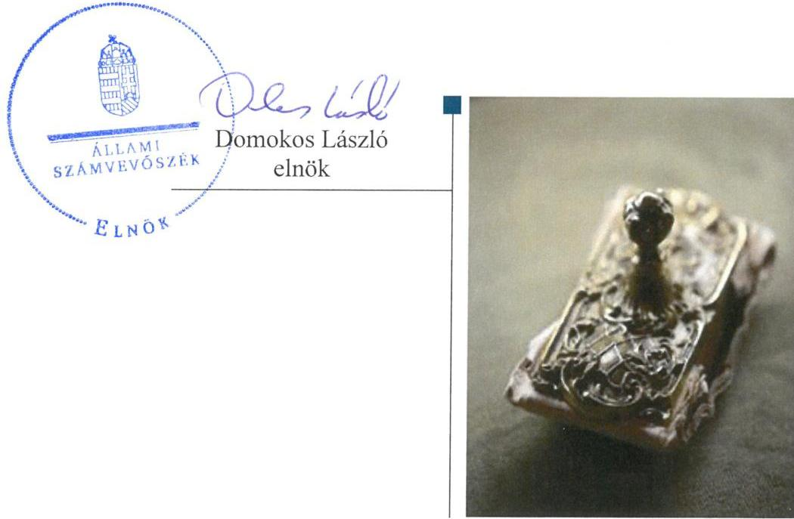
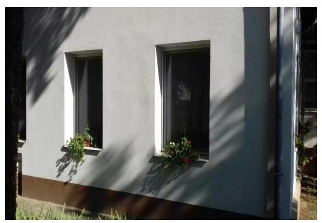

# Jelentés 

## Nem állami humánszolgáltatók ellenőrzése

A humánszolgáltatást nyújtó államháztartáson kívüli köznevelési és szociális intézmények, szolgáltatók fenntartói központi költségvetésből kapott támogatásai felhasználásának ellenőrzése - Magyarországi Metodista Egyház 2019.

19069
www.asz.hu

---

# Jelentés 

## Nem állami humánszolgáltatók ellenőrzése

A humánszolgáltatást nyújtó államháztartáson kívüli köznevelési és szociális intézmények, szolgáltatók fenntartói központi költségvetésből kapott támogatásai felhasználásának ellenőrzése - Magyarországi Metodista Egyház
2019. 05. hó 30. nap

---

# AZ ELLENŐRZÉST FELÜGYELTE:

- DR. NAGY IMRE felügyeleti vezető
- KAKAS SÁNDOR felügyeleti vezető

# AZ ELLENŐRZÉST VEZETTE ÉS A VÉGREHAJTÁSÁÉRT FELELŐS:

- MOLNÁR ZSUZSANNA ellenőrzésvezető
- A PROGRAM ÖSSZEÁLLÍTÁSÁÉRT FELELŐS:
  - TÓTPÁL SZABOLCS osztályvezető

**IKTATÓSZÁM:** EL-1548-001/2019.

**TÉMASZÁM:** 2448

**ELLENŐRZÉS-AZONOSÍTÓ SZÁM:** V079435

Jelentéseink az Országgyűlés számítógépes hálózatán és az Interneten a www.asz.hu címen is olvashatóak.

---

# TARTALOMJEGYZÉK 

■ ÖSSZEGZÉS ..... 5
■ AZ ELLENŐRZÉS CÉLJA ..... 6
■ AZ ELLENŐRZÉS TERÜLETE ..... 7
■ AZ ELLENŐRZÉS HÁTTERE, INDOKOLTSÁGA ..... 8
■ A JELENTÉS LÉNYEGES KÉRDÉSKÖREI ..... 9
■ AZ ELLENŐRZÉS HATÓKÖRE ÉS MÓDSZEREI ..... 10
■ MEGÁLLAPÍTÁSOK ..... 12
■ JAVASLATOK ..... 15
■ MELLÉKLETEK ..... 17
I. sz. melléklet: Értelmező szótár ..... 17
■ FÜGGELÉK: ÉSZREVÉTELEK ..... 19
■ RÖVIDÍTÉSEK JEGYZÉKE ..... 21

---

.

---

# ÖSSZEGZÉS 

A Magyarországi Metodista Egyház közfeladatot ellátó intézményei müködtetésére biztosított közpénzekkel való gazdálkodása 2014-2016. években - az átlátható, elszámoltatható felhasználást biztosító feltételek hiányában - nem volt szabályszerű. 2017-ben a költségvetési támogatásokat szabályszerűen fordította intézményei müködtetésére. A köznevelési közszolgáltatás igénybevételének feltételeit 2017-ben nem határozta meg.

## Az ellenőrzés társadalmi indokoltsága

Az Állami Számvevőszék stratégiájában hangsúlyos szerepet szán annak, hogy szilárd szakmai alapon álló, értékteremtő ellenőrzéseivel előmozdítsa a közpénzügyek átláthatóságát, rendezettségét és javaslataival a közpénzek és a közvagyon szabályos, gazdaságos, hatékony és eredményes felhasználását segítse. Az ÁSZ a stratégiájában célul tűzte ki, hogy az államháztartáson kívülre nyújtott költségvetési támogatások ellenőrzésével hozzájárul ahhoz, hogy a közpénzeket az államháztartáson kívüli szervezetek is átlátható módon használják fel a közfeladatok szerződésben vállalt ellátása érdekében. Tekintettel az elmúlt években mind a köznevelés, mind a szociális területet érintő finanszírozási változásokra, a társadalom fokozott érdeklődéssel figyeli a köznevelési és szociális feladatokra fordított források felhasználását. Fontos a közvéleményt biztosítani arról, hogy a közpénz államháztartáson kívüli felhasználása ezen a területen sem marad ellenőrizetlenül. Az ÁSZ hozzájárul ezzel ahhoz is, hogy a nyilvánosság és a szolgáltatást igénybe vevők megfelelő tájékoztatást kapjanak az államháztartáson kívüli közfeladatot ellátók múködéséről. A Magyarországi Metodista Egyháznál végzett ellenőrzést további társadalmi elvárás is indokolja tevékenységéből adódóan, mivel humánszolgáltatási közfeladat ellátására több mint 1300 millió Ft központi költségvetési támogatásban részesült az ellenőrzött időszakban.

## Főbb megállapítások, következtetések, javaslatok

A 2014-2016. években nem rendelkezett a Magyarországi Metodista Egyház a jogszabályban előírt számviteli politikával, ezáltal nem alakította ki a szabályszerű múködési és gazdálkodási környezetet, nem biztosította a költségvetési támogatások átlátható, elszámoltatható igénybevételének, felhasználásának feltételeit.

2017-ben nem felelt meg a Magyarországi Metodista Egyház belső szabályozása a jogszabályi előírásoknak, mert nem rendelkezett a szabályszerű múködési- és gazdálkodási keretek kialakításához szükséges jogszabályi előírások szerinti számviteli szabályozással. Nem biztosította köznevelési intézménye szabályszerű múködtetésének kereteit, illetve a közszolgáltatás igénybevételének feltételei nem voltak átláthatóak a szolgáltatást igénybevevők számára, mert nem határozta meg 2017-ben a kérhető térítési díj és tandíj megállapítás szabályait és a szociális alapon adható kedvezmények feltételeit. A szociális intézmények múködési kereteinek kialakítása 2017-ben a jogszabályi előírások szerint valósult meg.

2017-ben szabályszerűen fordította intézményei múködtetésére az átvállalt humánszolgáltatási közfeladatok ellátásához biztosított költségvetési támogatásokat.

Ellenőrzési, értékelési feladatait és a külső ellenőrzésekkel kapcsolatos intézkedési feladatait szabályszerűen ellátta az ellenőrzött időszakban.

Az Állami Számvevőszék a jelentésben foglalt megállapítások alapján Magyarországi Metodista Egyház szuperintendensének három javaslatot fogalmazott meg. A javaslatokat megalapozó megállapításokra az érintettnek 30 napon belül intézkedési tervet kell készítenie.

---

# AZ ELLENŐRZÉS CÉLJA 

AZ ELLENŐRZÉS CÉLJA annak értékelése volt, hogy a Magyarországi Metodista Egyház, mint köznevelési és szociális intézmények egyházi fenntartója központi költségvetésből kapott támogatásainak felhasználása szabályszerű volt-e, a támogatások igénylése, évközi módosítása és év végi elszámolása megfelelt-e a jogszabályi előírásoknak.

---

# AZ ELLENŐRZÉS TERÜLETE 

## Magyarországi Metodista Egyház, mint intézményfenntartó

A Magyarországi Metodista Egyház az United Methodist Church (Egyesült Metodista Egyház) nemzetközi közösségének része. Magyarországon 1898. óta müködik, 1947. óta törvényesen elismert vallásfelekezetként. A Fenntartót ${ }^{1}$ a Bíróság ${ }^{2}$ 1990-ben jegyezte be nyilvántartásába, bevett egyházként 2012. óta müködik.

A Fenntartó legfőbb vezető szerve az „Évi Konferencia"3, képviseletét szuperintendens látja el, akinek személye 2016. június 1-től változott.

A Fenntartó az ellenőrzött időszakban vállalkozási tevékenységet nem folytatott.

A Fenntartó egy köznevelési és kettő időseket ellátó bentlakásos szociális intézményt múködtetett. A Forrai Gimnázium és Művészeti Szakgimnázium tevékenységét két budapesti telephelyen végezte, gimnáziumi nevelés-oktatási, szakgimnáziumi nevelés-oktatási és felnőttképzési feladatokat látott el.

A Márta Mária Társasotthon és a Márta Mária Otthon Kaposszekcsőn és Budakeszin biztosított az idős emberek számára ápolást, gondozást nyújtó intézményi ellátást.

Az oktatási intézmény az ellenőrzött időszakban önálló jogi személyként múködött, a szociális feladatokat ellátó intézmények önálló jogi személyiséggel nem rendelkeztek, feladataikat az Egyház szervezetén belül látták el.

A köznevelési és szociális humánszolgáltatási közfeladatok ellátásával kapcsolatos szakmai irányító szerv az EMMI ${ }^{4}$ volt, a Fenntartó törvényességi felügyeletére a területileg illetékes kormányhivatalok és az NRSZH ${ }^{5}$ voltak jogosultak.

A Fenntartó közfeladatok ellátására kapott központi költségvetési támogatása az ellenőrzött időszakban folyamatosan növekedett, 2014. évben 258,3 millió Ft, 2017. évben 444,9 millió Ft támogatásban részesült.

---

# AZ ELLENŐRZÉS HÁTTERE, INDOKOLTSÁGA 

A köznevelési és szociális feladatokat ellátó nem állami intézményfenntartók részére közfeladataik ellátására évente jelentős összegű pénzügyi támogatást biztosítottak a mindenkori költségvetési törvények a bennük megfogalmazott feltételek mellett.

A felhasználható állami támogatások Kvtv. ${ }_{1-4}{ }^{6}$ szerinti előirányzata 2014. - 2017. években együtt 1049 Mrd Ft volt. A 2013. évben jelentős változások következtek be a normatív finanszírozás rendszerében. Az Országgyűlés elfogadta a nemzeti köznevelésről szóló 2011. évi CXC. törvényt, amely jelentősen átalakította a korábbi finanszírozási rendszert 2013 szeptemberétől. Módosították a szociális igazgatásról és szociális ellátásokról szóló 1993. évi III. törvényt is, amely - többek között - 2012. január 1-jei hatállyal megfogalmazta a finanszírozási rendszerbe történő befogadással összefüggő szabályokat. Mindkét területen új feladatfinanszírozási forma (átlagbéralapú támogatás) jelent meg, amely az államháztartáson kívüli intézményfenntartókra is vonatkozik. Az ellenőrzés a finanszírozási rendszerben 2011-2015 között bekövetkezett változásokra, azok közfeladat ellátásra gyakorolt hatására fókuszált a költségvetési támogatásokat felhasználó államháztartáson kívüli szervezetek körében. Az ellenőrzések indokoltságát az is alátámasztja, hogy az ÁSZ ${ }^{7}$ még nem ellenőrizte átfogóan e területet.

Az ÁSZ stratégiájában foglaltak alapján is indokolt volt az ellenőrzés, amely a társadalom számára jelzi, hogy a közpénz államháztartáson kívüli felhasználása sem maradhat ellenőrizetlenül. Az államháztartáson kívülre nyújtott költségvetési támogatások ellenőrzésével az ÁSZ hozzájárul ahhoz, hogy a közpénzeket a nem állami humán fenntartók átlátható módon használják fel a közfeladatok ellátására kötött szerződésekben vállalt kötelezettségek teljesítése érdekében. Az ÁSZ ellenőrzés javaslataival hozzájárulhat az említett rendszerek szabályszerű támogatás felhasználásához, javíthatja a társadalmi-gazdasági döntések megalapozottságát, amely a „jól irányított állam" múködésének feltétele.

---

# A JELENTÉS LÉNYEGES KÉRDÉSKÖREI 

1. A Fenntartó szabályszerű müködési és gazdálkodási környezet kialakításával megteremtette-e a költségvetési támogatások átlátható, elszámoltatható igénybevételének, felhasználásának feltételeit?
2. A Fenntartó a biztositott költségvetési támogatásokat szabályszerűen fordította-e intézményei müködtetésére?
3. A Fenntartó a felhasznált közpénzekre vonatkozó gazdálkodásával a nyilvánosság előtt elszámolt-e, ennek megalapozása érdekében ellenőrzési, értékelési és a külső ellenőrzésekkel kapcsolatos intézkedési feladatait szabályszerűen látta-e el?

---

# AZ ELLENŐRZÉS HATÓKÖRE ÉS MÓDSZEREI 

## Az ellenőrzés típusa

Megfelelőségi ellenőrzés.

## Az ellenőrzött időszak

A 2014. január 1-je és 2017. december 31-e közötti időszak. A helyszíni szemle tekintetében 2018. január 1-jétől az utolsó helyszíni szemle időpontjáig (2018. október 11-ig) tartó időszak.

## Az ellenőrzés tárgya

Az ellenőrzés a köznevelési és szociális humánszolgáltatási közfeladatokat ellátó államháztartáson kívüli Fenntartó humánszolgáltatási közfeladatai ellátásához a költségvetési törvényekben biztosított központi költségvetési támogatások (köznevelési és szociális ágazat átlagbér alapú támogatásai, tankönyvtámogatás, gyermek- és tanulóétkeztetéshez nyújtott támogatás, nem hitéleti célú egyházi kiegészítő támogatás) igénylése, évközi módosítása és év végi elszámolása fenntartói feladatainak ellátása, illetve e központi költségvetésből kapott támogatásaik humánszolgáltatási közfeladatokra való fenntartó általi felhasználása szabályszerűségének értékelésére terjedt ki.

## Az ellenőrzött szervezet

Magyarországi Metodista Egyház, mint intézményfenntartó.

## Az ellenőrzés jogalapja

Az ellenőrzés jogszabályi alapját az ÁSZ tv. ${ }^{8} 1 . \S$ (3) bekezdése, valamint az 5. § (11) bekezdés c) pontjában foglalt előírások adták.

## Az ellenőrzés módszerei

Az ellenőrzést az ellenőrzési program szempontjai, kérdései, az ellenőrzött időszakban hatályos jogszabályok, a nemzetközi standardokat irányadónak tekintve az ellenőrzés szakmai szabályok és módszertanok figyelembevételével végezte az ÁSZ.

---

A közpénzekkel való felelős gazdálkodás segítésére irányuló javaslatok kidolgozásakor a hatályos jogszabályok voltak az irányadóak.

Az ellenőrzés ideje alatt az ÁSZ a Fenntartóval történő kapcsolattartást az ÁSZ SZMSZ ${ }^{6}$ vonatkozó előírásai alapján biztosította.

Az ellenőrzési kérdések megválaszolásához szükséges bizonyítékok megszerzése az ellenőrzöttek által rendelkezésre bocsátott dokumentumokra, adatokra alapozva megfigyelés, szemle (szemrevételezés), kérdésfeltevés (információkérés), valamint elemző eljárással történt.

Az ellenőrzési bizonyítékként felhasznált adatforrások közé tartoztak egyrészt a szakmai program részletes szempontjainál felsorolt adatforrások, másrészt minden - az ellenőrzés folyamán feltárt, az ellenőrzés szempontjából információt tartalmazó - dokumentum.

Az ellenőrzés lefolytatásához a Fenntartó a kitöltött tanúsítványok, valamint az ÁSZ által kért dokumentumok elektronikus úton való megküldésével szolgáltatott adatokat, információkat. Az így rendelkezésre bocsátott adatok, információk és a tanúsítványok adatai valódiságának kontrollja az ellenőrzés keretében történt.

Az ÁSZ a fenntartott intézményeknél helyszíni szemle keretében győződött meg a tényleges feladatellátásról. Helyszíni szemlékre a fenntartott intézmények egyes feladatellátási helyein került sor.

A köznevelési, a szociális humánszolgáltatások központi költségvetési támogatásai igénylésével, módosításával, elszámolásával kapcsolatos, államháztartáson kívüli fenntartó jogszabályokban előírt feladatai betartását, továbbá a központi költségvetési támogatások szabályszerű kezelését, nyilvántartását ellenőrizte az ÁSZ a Fenntartónál határozatok, nyilvántartások, beszámolók és egyéb dokumentumok, valamint a Magyar Államkincstártól - mint adatszolgáltatásra felkért szervtől - megkért határozatok és beszámolók alapján. Az ellenőrzés nem terjedt ki a köznevelési, a szociális humánszolgáltatások központi költségvetési támogatásai igénylése, módosítása, elszámolása valódiságának, megalapozottságának, helyességének - sem a Fenntartónál, sem a székhely intézményeinél való - értékelésére. Továbbá nem terjedt ki az ellenőrzés e források intézmények általi szabályszerű felhasználásának értékelésére.

---

# 1. A Fenntartó szabályszerű múködési és gazdálkodási környezet kialakításával megteremtette-e a költségvetési támogatások átlátható, elszámoltatható igénybevételének, felhasználásának feltételeit? 

Összegző megállapítás

A Fenntartó nem alakította ki - a jogszabályi előírások szerinti számviteli szabályozás hiányában - a szabályszerű múködési és gazdálkodási környezetet, a költségvetési támogatások átlátható, elszámoltatható igénybevételének, felhasználásának feltételeit.

A Fenntartó a 2014-2016. évek közötti időszakban nem teremtette meg a költségvetési támogatások átlátható, elszámoltatható igénybevételének, felhasználásának feltételeit, mert 2014. január 1. napjától - a kettős könyvvezetésre való áttéréssel kapcsolatos változásokat követően - 2016. december 31-ig nem rendelkezett a Számv. tv. ${ }^{10}$ 14. § (3) bekezdésében foglalt előírás szerinti számviteli politikával.

A Fenntartó 2017. évre vonatkozóan sem a jogszabályi előírások szerint készítette el számviteli szabályozását, mert 2017. január 1. napjától hatályos számviteli politikája ${ }^{11}$ nem felelt meg az Számv. tv. 14. § (4) bekezdésében előírtaknak, mivel nem tartalmazta azokat a szabályokat, előírásokat, módszereket, amelyekkel meghatározza, hogy mit tekintenek kivételes nagyságú vagy előfordulású bevételnek, költségnek, ráfordításnak. A Fenntartó 2017. január 1-jétől hatályos számlarendje ${ }^{12}$ a Számv tv. 161. § (2) bekezdés b)-d) pontjaiban foglaltak ellenére nem tartalmazta a számla értéke növekedésének, csökkenésének jogcímeit, a számlát érintő gazdasági eseményeket, azok más számlákkal való kapcsolatát, a főkönyvi számla és az analitikus nyilvántartás kapcsolatát és a számlarendben foglaltakat alátámasztó bizonylati rendet.

A Fenntartó közfeladat ellátását 2017-ben a jogszabályi előírások szerint megszervezte. Rendelkezett az Ehtv.-nek ${ }^{13}$ megfelelő alapszabállyal ${ }^{14}$, oktatási szabályzatában ${ }^{15}$ pedig meghatározta az engedélyezési, jóváhagyási és kontrolleljárásokat. A támogatások nyilvántartásáról, elszámolásáról szóló szabályzatában ${ }^{16}$ rendelkezett a humánszolgáltatási közfeladatok ellátására kapott költségvetési támogatások nyilvántartásáról, illetve a támogatások intézmények közötti elosztásáról és felhasználásáról.

---

# 2. A Fenntartó a biztosított költségvetési támogatásokat szabályszerűen fordította-e intézményei működtetésére? 

Összegző megállapítás

A Fenntartó 2017-ben szabályszerűen fordította a költségvetési támogatásokat intézményei működtetésére. A köznevelési intézmény múködési keretei 2017-ben nem a jogszabályi előírás szerint kerültek meghatározásra, a szociális intézmények múködési kereteit a jogszabályi előírások szerint biztosította a Fenntartó.

2017-ben a köznevelési intézmény múködési kereteit nem biztosította szabályszerűen a Fenntartó, mert nem határozta meg az Nkt. ${ }^{17}$ 83. § (2) bekezdés c) pont előírása ellenére az intézmények által kérhető térítési díj és tandíj megállapításának szabályait, valamint a szociális alapon adható kedvezmények feltételeit. A Fenntartó nem rendelkezett a köznevelési célú támogatások felhasználásának Nkt. vhr.-ben ${ }^{18}$ foglalt előírások szerinti nyilvántartásával, mert - az Nkt. vhr. 37/G. § (1) bekezdésének előírásai ellenére - a Fenntartó a támogatások felhasználását nem alapfeladatonként elkülönítve tartotta nyilván.

A szociális közfeladatot ellátó humánszolgáltató intézmények szervezeti feltételeit, múködési kereteit 2017-ben a jogszabályi előírásoknak megfelelően kialakította a Fenntartó.

A Fenntartó a Kincstár által 2017-ben a köznevelési és szociális feladat ellátására folyósított központi költségvetési támogatások teljes összegét továbbadta intézményeinek. A támogatások átadása a Kvtv. ${ }^{4}$ által meghatározott határidőben teljesült.

## 3. A Fenntartó a felhasznált közpénzekre vonatkozó gazdálkodásával a nyilvánosság előtt elszámolt-e, ennek megalapozása érdekében ellenőrzési, értékelési és a külső ellenőrzésekkel kapcsolatos intézkedési feladatait szabályszerűen látta-e el?

Összegző megállapítás

A Fenntartó ellenőrzési és szakmai értékelési feladatait szabályszerűen látta el, oktatási intézménye munkájával összefüggő értékelését azonban nem hozta honlapján nyilvánosságra. A külső ellenőrzésekhez kapcsolódó intézkedési kötelezettségének eleget tett.

A Fenntartó - az Nkt.-ban foglaltak alapján - 2015. és 2017. években ellenőrizte köznevelési intézménye pedagógiai programját és SZMSZ-ét ${ }_{1-2}{ }^{19}$, 2014-ben és 2015-ben pedig az intézmény házirendjét.

A Fenntartó az Iskolatanács ${ }^{20}$ jelentése alapján értékelte minden évben az intézmény szakmai munkájának eredményességét.

A Fenntartó eleget tett a Kormányhivatal ${ }_{1-3}$ által a köznevelési és szociális intézményeknél az ellenőrzött időszakban végzett ellenőrzésekhez kapcsolódó intézkedési kötelezettségének.

---

A Fenntartó az oktatási intézménye munkájával összefüggő értékelését az Nkt. 85. § (3) bekezdésében foglaltak ellenére nem hozta nyilvánosságra a honlapján.

---

# JAVASLATOK 

Az ÁSZ tv. 33. § (1) bekezdésében foglaltak értelmében az ellenőrzött szervezet vezetője köteles a jelentésben foglalt megállapításokhoz kapcsolódó intézkedési tervet összeállítani és azt a jelentés kézhezvételétől számított 30 napon belül az ÁSZ részére megküldeni. Amennyiben az ellenőrzött szervezet vezetője nem küldi meg határidőben az intézkedési tervet, vagy továbbra sem elfogadható intézkedési tervet küld, az Állami Számvevőszék elnöke az ÁSZ tv. 33. § (3) bekezdése a) és b) pontjaiban foglaltakat érvényesítheti.

## a Magyarországi Metodista Egyház szuperintendensének

1. Intézkedjen arra, hogy a számviteli politika és a számlarend megfeleljen a Számv. tv. előírásainak.
(1. összegző megállapítás 2. bekezdése alapján)
2. Határozza meg a köznevelési intézmények által kérhető térítési díj és tandíj megállapításának szabályait, a szociális alapon adható kedvezmények feltételeit a jogszabályi előirás szerint.
(2. összegző megállapítás 1. bekezdésének 1. mondata alapján)
3. Intézkedjen a köznevelési támogatások felhasználásának jogszabály szerinti nyilvántartásáról.
(2. összegző megállapítás 1. bekezdésének 2. mondata alapján)

---

.

---

# MELLÉKLETEK 

- I. SZ. MELLÉKLET: ÉRTELMEZŐ SZÓTÁR
átlagbéralapú támogatás
egyházi fenntartó
humánszolgáltatás
költségvetési támogatás
köznevelési közfeladat

Az átlagbér alapú támogatás alapja a pedagógus-munkakörben, valamint nevelő-, oktató munkát közvetlenül segítő munkakörben foglalkoztatottak után kifizetett személyi juttatás és járulék. (2013. évi CCXXX. törvény Magyarország 2014. évi központi költségvetéséről 33. § (4) bekezdés)
Az Ehtv. 33. §-a alapján az Ehtv. mellékletében felsorolt egyházak és az általuk meghatározott, az egyház belső egyházi szabálya szerint jogi személyiséggel rendelkező szervezetek - a nyilvántartásba vételük dátumától függetlenül - 2012. január 1-jétől minősülnek egyházi fenntartóknak. Az Ehtv. 14. §-ában meghatározott eljárás folyamán az Országgyűlés által egyháznak elismert szervezet a törvénynek az egyház bejegyzésére vonatkozó módosítása hatálybalépésének napjától minősül egyháznak (Ehtv. 15. §).
Külön törvényben meghatározott szociális, gyermekjóléti, gyermekvédelmi, közoktatási, felsőoktatási, kulturális közfeladatok (2014. évi Kvtv. 34. § (1), (4) bekezdés, 1. számú melléklet XX/20/2. alcím, 19. alcím, 2015. évi Kvtv. 43. § (1), (4) bekezdés, 1. számú melléklet XX/20/2/3. jogcím csoport, 19. alcím, 2016. évi Kvtv. 41. § (1), (4) bekezdés, 1. számú melléklet XX/20/2/3. jogcím csoport, 19. alcím).
a társadalombiztosítás pénzügyi alapjai kivételével az államháztartás központi alrendszeréből ellenérték nélkül, pénzben nyújtott támogatások (Áht. 1. § 14. pont)
A költségvetési törvényekben (2013. évi CCXXX. törvény 33-34. §, 2014. évi C. törvény 42-43. §, 2015. évi C. törvény 40-41. §) megállapított támogatás. Például a 2015. évi C. törvény 40-41. § szerint többek között: Az Országgyűlés a köznevelési feladat ellátására átlagbéralapú támogatást állapít meg. A nevelési-oktatási, valamint pedagógiai szakszolgálati intézményt fenntartó nemzetiségi önkormányzat, az egyházi és magán köznevelési intézmény fenntartója részére az általuk fenntartott nevelési-oktatási intézményben, továbbá pedagógiai szakszolgálati intézményben pedagógus és - a b) pont kivételével - ne-velő-oktató munkát közvetlenül segítő munkakörben foglalkoztatottak után a 7. melléklet I. pontja, valamint az óvoda, egységes óvoda-bölcsőde esetében a 2. melléklet II. pont 1. alpontja szerint és az 5. alpontjában meghatározott jogosultak után, az őket ott megillető mértékek szerint. Müködési támogatást állapít meg a nemzetiségi önkormányzat vagy az egyházi jogi személy által fenntartott nevelési-oktatási intézményekben ellátott, továbbá a pedagógiai szakszolgálati intézményekben gyógypedagógiai tanácsadásban, korai fejlesztésben, oktatásban és gondozásban, valamint a fejlesztő nevelésben részt vevő gyermekekre, tanulókra tekintettel a nemzetiségi önkormányzat és a bevett egyház részére a 7. melléklet II. pontja szerint.
Az Országgyűlés a szociális, gyermekjóléti, gyermekvédelmi közfeladatot ellátó intézményt, szolgáltatást fenntartó egyházi jogi személy, civil szervezet, közalapítvány, országos nemzetiségi önkormányzat, települési vagy területi nemzetiségi önkormányzat, gazdasági társaság, és a humánszolgáltatást alaptevékenységként végző, az Szja tv. hatálya alá tartozó egyéni vállalkozó (a továbbiakban együtt: nem állami szociális fenntartó) részére támogatást állapít meg a következők szerint: a támogatás a nem állami szociális fenntartót a települési önkormányzatok 2. melléklet III. pont 3. alpont c)-k) pontjában és III. pont 5. alpont a) pontjában meghatározott támogatásaival azonos jogcímeken, öszszegben és feltételek mellett illeti meg.
A köznevelési intézmény alapító okiratában foglalt feladat: óvodai nevelés, nemzetiséghez tartozók óvodai nevelése, általános iskolai nevelés-oktatás, nemzetiséghez tartozók általános iskolai nevelése-oktatása, kollégiumi ellátás, nemzetiségi kollégiumi ellátás, gimnáziumi nevelés-oktatás, szakközépiskolai nevelés-oktatás, szakiskolai nevelés-oktatás, nemzetiség gimnáziumi nevelés-oktatása, nemzetiség szakközépiskolai nevelés-oktatása, nemzetiség szakiskolai nevelés-oktatása, köznevelési Hídprogramok keretében

---

folyó nevelés-oktatás, felnőttoktatás, alapfokú művészetoktatás, fejlesztő nevelés, fejlesztő nevelés-oktatás, pedagógiai szakszolgálati feladat, a többi gyermekkel, tanulóval együtt nevelhető, oktatható sajátos nevelési igényű gyermekek, tanulók óvodai nevelése és iskolai nevelése-oktatása, azoknak a sajátos nevelési igényű gyermekeknek, tanulóknak az óvodai, iskolai, kollégiumi ellátása, akik a többi gyermekkel, tanulóval nem foglalkoztathatók együtt, a gyermekgyógyúdülőkben, egészségügyi intézményekben, rehabilitációs intézményekben tartós gyógykezelés alatt álló gyermekek tankötelezettségének teljesítéséhez szükséges oktatás, pedagógiai-szakmai szolgáltatás.
köznevelési intézmény

A nevelési- oktatási intézmény, pedagógiai szakszolgálati intézmény, pedagógiai-szakmai szolgáltatást nyújtó intézmény.

---

# FÜGGELÉK: ÉSZREVÉTELEK 

A jelentéstervezetet a Számvevőszék 15 napos észrevételezésre megküldte az ellenőrzött szervezet vezetőjének az ÁSZ tv. 29. §* (1) bekezdése előírásának megfelelően.

A jelentéstervezetre a Magyarországi Metodista Egyház szuperintendense az ÁSZ tv. 29. § (2) bekezdésében foglalt határidőn belül nemleges észrevételt tett.

[^0]
[^0]:    * 29. § (1) Az Állami Számvevőszék az ellenőrzési megállapításait megküldi az ellenőrzött szervezet vezetőjének vagy az általa megbízott személynek, és annak, akinek személyes felelősségét állapította meg.
    (2) Az ellenőrzött szervezet vezetője és a felelősként megjelölt személy az ellenőrzés megállapításaira tizenöt napon belül írásban észrevételt tehet.
    (3) Az Állami Számvevőszék az észrevételre a beérkezésétől számított harminc napon belül írásban válaszol. A figyelembe nem vett észrevételeket köteles a jelentésben feltüntetni, és megindokolni, hogy azokat miért nem fogadta el.

---

.

---

# RÖVIDÍTÉSEK JEGYZÉKE 

${ }^{1}$ Fenntartó
${ }^{2}$ Bíróság
${ }^{3}$ Évi Konferencia
${ }^{4}$ EMMI
${ }^{5}$ NRSZH
${ }^{6}$ Kvtv.1-4
${ }^{7}$ ÁSZ
${ }^{8}$ ÁSZ tv.
${ }^{9}$ ÁSZ SZMSZ
${ }^{10}$ Számv. tv.
${ }^{11}$ számviteli politika
${ }^{12}$ számlarend
${ }^{13}$ Ehtv.
${ }^{14}$ alapszabály
${ }^{15}$ oktatási szabályzat
${ }^{16}$ a támogatások nyilvántartásáról, elszámolásáról szóló szabályzat
${ }^{17}$ Nkt.
${ }^{18} \mathrm{Nkt}$. vhr.
${ }^{19} \mathrm{SZMSZ}_{1,2}$ (köznevelési intézmények)
${ }^{20}$ Iskolatanács

Magyarországi Metodista Egyház
Fővárosi Bíróság
A Magyarországi Metodista Egyház legfőbb vezető szerve
Emberi Erőforrások Minisztériuma
Nemzeti Rehabilitációs és Szociális Hivatal
1: 2013. évi CCXXX. törvény Magyarország 2014. évi központi költségvetéséről (hatályos: 2014. január 1-jétől)
2: 2014. évi C. törvény Magyarország 2015. évi központi költségvetéséről (hatályos: 2015. január 1-jétől)
3: 2015. évi C. törvény Magyarország 2016. évi központi költségvetéséről (hatályos: 2016. január 1-jétől)
4: 2016. évi XC. törvény - Magyarország 2017. évi központi költségvetéséről (hatályos: 2016. november 1-jétől)
Állami Számvevőszék
2011. évi LXVI. törvény az Állami Számvevőszékről (hatályos: 2011. július 1-jétől)

Az Állami Számvevőszék elnökének 4/2017. (XII.29.) ÁSZ utasítása az Állami Számvevőszék Szervezeti és Múködési Szabályzatáról (hatályos: 2018. január 1-jétől)
2000. évi C. törvény a számvitelről (hatályos:2001. január 1-jétől)

Magyarországi Metodista Egyház Számviteli politikája és Eszközök és Források Értékelési Szabályzata (hatályos: 2017. január 1-jétől)
Magyarországi Metodista Egyház Számlarendje (hatályos: 2017. január 1-jétől)
2011. évi CCVI. törvény a lelkiismereti és vallásszabadság jogáról, valamint az egyházak, vallásfelekezetek és vallási közösségek jogállásáról (hatályos: 2012. január 1-től)
A Magyarországi Metodista Egyház Szervezeti Szabályzata (hatályos: 2009. április 25-től)
A Magyarországi Metodista Egyház szabályzata a fenntartói feladat- és hatáskörök kijelöléséről az oktatási intézményeiben (hatályos: 2013. április 22-től)
A Magyarországi Metodista Egyház köznevelési, szociális intézmények kapcsán állami támogatások nyilvántartásáról, elszámolásáról szóló szabályzat (hatályos: 2016. augusztus 31-től)
2011. évi CXC. törvény a nemzeti köznevelésről (hatályos: 2012. szeptember 1-jétől)
229/2012. (VIII.28.) Korm. rendelet a nemzeti köznevelési törvény végrehajtásáról (hatályos: 2012. szeptember 1-jétől)
1: Forrai Művészeti Szakközépiskola és Gimnázium a Magyarországi Metodista Egyház fenntartásában - Szervezeti és Múködési Szabályzata (hatályos: 2013. szeptember 1-től)
2: Forrai Múvészeti Szakközépiskola és Gimnázium a Magyarországi Metodista Egyház fenntartásában - Szervezeti és Múködési Szabályzata (hatályos: 2017. szeptember 1-től)
Forrai Múvészeti Szakközépiskola és Gimnázium a Magyarországi Metodista Egyház fenntartásában - Iskolatanácsa (Az iskola legfőbb ellenőrző testülete, melynek tagja többek között a Fenntartó is.)

---

ÁLLAMI SZÁMVEVŐSZÉK
1052 Budapest, Apáczai Csere János utca 10.
Levélcím: 1364 Budapest 4. Pf. 54
Telefon: +36 14849100 Telefax: +36 14849200
www.asz.hu