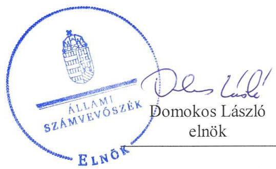
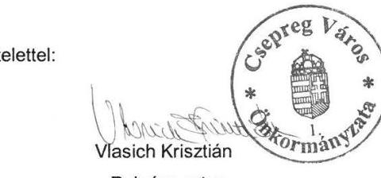
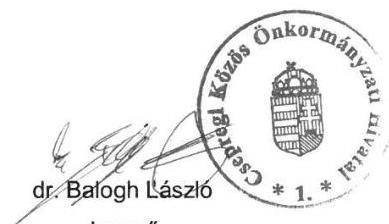
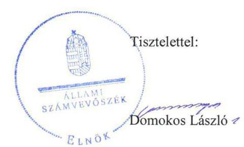

# Jelentés 

## Önkormányzatok ellenőrzése - Integritás és belső kontrollrendszer

Csepreg Város Önkormányzata 2019. 05. hó 19. nap

---

# AZ ELLENŐRZÉST FELÜGYELTE:

DR. NAGY IMRE felügyeleti vezető

# AZ ELLENŐRZÉST VEZETTE ÉS A VÉGREHAJTÁSÁÉRT FELELŐS:

DR. DOMOKOS MAGDOLNA ellenőrzésvezető

# A PROGRAM ÖSSZEÁLLÍTÁSÁÉRT FELELŐS:

TÓTPÁL SZABOLCS osztályvezető

---

IKTATÓSZÁM: EL-1549-001/2019

TÉMASZÁM: 2485

ELLENŐRZÉS-AZONOSÍTÓ SZÁM: V-082916

---

Jelentéseink az Országgyűlés számítógépes hálózatán és az Interneten a www.asz.hu címen is olvashatóak.

---

# TARTALOMJEGYZÉK 

■ ÖSSZEGZÉS ..... 5
■ AZ ELLENŐRZÉS CÉLJA ..... 6
■ AZ ELLENŐRZÉS TERÜLETE ..... 7
■ AZ ELLENŐRZÉS HÁTTERE, INDOKOLTSÁGA ..... 8
■ A JELENTÉS LÉNYEGES KÉRDÉSKÖREI ..... 9
■ AZ ELLENŐRZÉS HATÓKÖRE ÉS MÓDSZEREI ..... 10
■ MEGÁLLAPÍTÁSOK ..... 12
■ JAVASLATOK ..... 14
■ MELLÉKLETEK ..... 15
I. sz. melléklet: Értelmező szótár ..... 15
■ FÜGGELÉKEK ..... 17
I. sz. függelék a Jelentéshez ..... 17
II. sz. függelék: Észrevételek ..... 18
■ RÖVIDÍTÉSEK JEGYZÉKE ..... 35

---

.

---

# ÖSSZEGZÉS 

Csepreg Város Önkormányzatánál nem volt biztosított az átláthatóság, elszámoltathatóság, a közpénzfelhasználás szabályossága és a nemzeti vagyonnal történő felelős gazdálkodás. A korrupció megelőzésére szolgáló integritási kontrollok kiépítése és működtetése nem megfelelően történt meg.

## Az ellenőrzés társadalmi indokoltsága

Az Állami Számvevőszék alapvető feladata a közpénzekkel, az állami és önkormányzati vagyonnal való gazdálkodás ellenőrzése. Az Alaptörvény szerint az önkormányzatok kötelezettsége a kiegyensúlyozott, átlátható és fenntartható költségvetési gazdálkodás elvének érvényesítése, a nemzeti vagyonnal való rendeltetésszerű és felelős módon való gazdálkodás biztosítása. Az Állami Számvevőszék stratégiájában megfogalmazott célkitűzése az integritás alapú, átlátható és elszámoltatható közpénzfelhasználás elősegítése. Ennek megvalósítása érdekében az Állami Számvevőszék prioritásként kezeli a közpénzzel gazdálkodó szervezetek esetében a belső kontrollrendszer működésének ellenőrzését.

Az Állami Számvevőszék Csepreg Város Önkormányzatát korábban nem ellenőrizte.

## Főbb megállapítások, következtetések, javaslatok

Csepreg Város Önkormányzatánál 2017. január 1. és május 31. között nem vezették a jogszabály szerinti naprakész nyilvántartást a gazdálkodási jogkörök gyakorlására jogosult személyekről és aláírás-mintájukról. Ezáltal a gazdálkodási jogkörök jogszabály szerinti gyakorlásának feltételei nem voltak biztosítottak, nem igazolt, hogy a kiadások az önkormányzat feladatellátásának körében keletkeztek és azok teljesítése a jogszabályok szerint történt.

A Csepregi Közös Önkormányzati Hivatal nem rendelkezett a jogszabály szerinti belső kontroll nyilatkozattal, így a jegyző nem biztosította az elszámoltathatóságot az általa vezetett szervezet feladatainak ellátásához kapcsolódóan a jogszabályok szerinti folyamatok működésének minőségéről.

Csepreg Város Önkormányzatánál a korrupció megelőzésére szolgáló integritási kontrollok kiépítése és működtetése nem megfelelően történt meg, így nem volt biztosított az integritás alapú közpénzfelhasználás lehetősége, továbbá nem volt biztosított az államháztartás pénzeszközeivel és a nemzeti vagyonnal történő gazdaságos, hatékony és eredményes gazdálkodás mérésének lehetősége.

Az Állami Számvevőszék Csepreg Város Önkormányzatának polgármestere és a Csepregi Közös Önkormányzati Hivatal jegyzője részére a számlarend, továbbá a Csepregi Közös Önkormányzati Hivatal jegyzője részére az iratkezelési szabályzat kiadásának tárgyában fogalmazott meg javaslatot, melyre az érintettnek 30 napon belül intézkedési tervet kell készítenie.

---

# AZ ELLENŐRZÉS CÉLJA 

Az ellenőrzés célja annak megállapítása volt, hogy Csepreg Város Önkormányzatának belső kontrollrendszere biztosította-e a közpénzekkel és a nemzeti vagyonnal történő elszámoltatható, átlátható, szabályszerű, gazdaságos, hatékony és eredményes gazdálkodás feltételeit. Az ellenőrzés keretében értékeljük továbbá, hogy az önkormányzatnál kiépítették és erősítették-e a korrupciós kockázatok kezelését szolgáló integritás kontrollokat és azt, hogy megteremtették-e a teljesítményellenőrzés feltételeit.

---

# AZ ELLENŐRZÉS TERÜLETE 

## Csepreg Város Önkormányzata

A Vas megyei Csepreg város lakossága 2017. január 1-jén 3296 fő volt a Központi Statisztikai Hivatal Magyarország közigazgatási helynévkönyve adatai alapján.

Az önkormányzat hét tagú képviselő-testületének munkáját két bizottság segítette. A településen Horvát Nemzetiségi Önkormányzat és Roma Nemzetiségi Önkormányzat működött. Önkormányzati fenntartású intézmények az Egészségház, a Petőfi Sándor Művelődési-Sportház és Könyvtár, valamint a Területi Gondozási Központ voltak.

Csepreg Város, Lócs Község, Tormásliget Község, Tömörd Község Önkormányzatának Képviselő-testülete 2013. január 1-jével létrehozta a Csepregi Közös Önkormányzati Hivatalt. Csepreg Város Önkormányzata a saját gazdasági szervezettel rendelkező, csepregi székhelyű Közös Hivatallal $^{1}$ látta el a gazdálkodási feladatait.

A Közös Hivatal vezetője az ellenőrzött időszakban változott, a jegyző $^{2}$ 2017. május 31-ig, a jegyző $^{3}$ 2017. június 01-től látta el feladatait.

Csepreg Város Önkormányzata a 2017. évi zárszámadási rendelete $^{4}$ szerint több, mint 1 Mrd Ft költségvetési bevételt ért el, valamint több, mint 700 millió Ft költségvetési kiadást teljesített. A mérleg szerinti eszköz vagyonának értéke 2017. december 31-én meghaladta a 3 milliárd Ft-ot.

---

# AZ ELLENŐRZÉS HÁTTERE, INDOKOLTSÁGA 

A demokratikus társadalmakban alapvető igény, hogy a közpénzeket, a közvagyont használók tevékenységükről elszámoljanak, ahhoz egyértelmű és érvényesíthető felelősségi szabályok társuljanak. Ennek a jogos igénynek az érvényesítéséhez meg kell teremteni azokat a folyamatokat, rendszereket, amelyek nélkülözhetetlenek az elszámoltatáshoz. Az elszámoltatás eredményes működtetéséhez szükség van a megfelelő információs, kontroll-, értékelési és beszámolási rendszerek kialakítására. A belső kontrollok kiépítettsége hozzájárul az integritási szemlélet kialakításához és érvényesüléséhez. A belső kontrollrendszer kialakítása és működtetése nélkül nem valósítható meg a közpénzek, a közvagyon szabályos, gazdaságos, hatékony és eredményes felhasználása.

A BELSŐ KONTROLLRENDSZER azt a célt szolgálja, hogy az államháztartás szervei működésük és gazdálkodásuk során a tevékenységeket szabályszerűen, gazdaságosan, hatékonyan, eredményesen hajtsák végre, teljesítsék elszámolási kötelezettségeiket, és megvédjék az erőforrásokat a veszteségektől, a károktól, a nem rendeltetésszerű használattól. A belső kontrollrendszer magában foglalja mindazon szabályokat, eljárásokat, gyakorlati módszereket és szervezeti struktúrákat, kockázatkezelési technikákat, kontrolltevékenységeket, amelyek segítséget nyújtanak a szervezetnek céljai eléréséhez.

A megfelelő belső kontrollrendszer jelentősen csökkenti a hibák és szabálytalanságok kockázatát. Az ÁSZ célja, hogy javuljon az ellenőrzött önkormányzatok belső kontrollrendszerének szabályozottsága, működésének megfelelősége, szabályszerűsége, hozzájárulva ezzel az egyensúlyi helyzet fenntarthatóságának biztosításához, biztosítva az önkormányzatnál a közpénzfelhasználás szabályosságát, a közpénzekkel és a nemzeti vagyonnal történő szabályszerű, gazdaságos, hatékony és eredményes gazdálkodást.

AZ ELLENŐRZÉS VÁRHATÓ HASZNOSULÁSA négy szinten valósul meg. A törvényalkotás számára összegzett tapasztalatok állnak rendelkezésre a belső kontrollrendszer önkormányzati területen való kialakításáról, működtetéséről és hatásairól. Az ellenőrzés az ellenőrzött számára visszajelzést ad a belső kontrollrendszer kialakításában és működésében lévő hiányosságokról, javaslataival hozzájárul azok kiküszöböléséhez. Az ellenőrzés megállapításait és javaslatait más szervezetek is hasznosíthatják a rendezett gazdálkodási keretek kialakításához, a ,,jó gyakorlat" elterjesztésével azok az önkormányzatok is átvehetik a pozitív példákat, ahol nem végez ellenőrzést az ÁSZ.

Az ÁSZ ellenőrzései jelzik a társadalom számára, hogy közpénz nem maradhat ellenőrizetlenül, tevékenysége hozzájárul az értékteremtő rend kialakításához és megőrzéséhez.

---

# A JELENTÉS LÉNYEGES KÉRDÉSKÖREI 

1. Az önkormányzat belső kontrollrendszerének kialakítása és működtetése szabályszerű volt-e, az biztosította-e az önkormányzatnál a közpénzfelhasználás szabályosságát, a nemzeti vagyonnal történő felelős gazdálkodást?
2. Az önkormányzat kiépítette és erősítette-e az integritás kontrollrendszerét?
3. Az önkormányzatnál alakítottak-e ki a teljesítmény mérésére alkalmas követelményeket?

---

# AZ ELLENŐRZÉS HATÓKÖRE ÉS MÓDSZEREI 

## Az ellenőrzés típusa

Megfelelőségi ellenőrzés.

## Az ellenőrzött időszak

2017. év, illetve az éves költségvetési beszámoló Áht. $^{5}$ által megállapított jóváhagyásáig (2018. május 31-éig) tartó időszak.

## Az ellenőrzés tárgya

Csepreg Város Önkormányzata és a gazdálkodási feladatokat ellátó Csepregi Közös Önkormányzati Hivatal belső kontrollrendszerének kialakítása és működtetése, valamint az integritás kontrollok kiépítettsége, a teljesítményellenőrzés feltételei.

## Az ellenőrzött szervezet

Csepreg Város Önkormányzata, valamint a Csepregi Közös Önkormányzati Hivatal.

## Az ellenőrzés jogalapja

Az ellenőrzés jogszabályi alapját az ÁSZ tv. 6. § (3) bekezdés, 5. § (2) és (6) bekezdései, valamint az Áht. 61. § (2) bekezdésének előírásai képezik.

## Az ellenőrzés módszerei

Az ÁSZ az ellenőrzést az ellenőrzési program szempontjai, az ellenőrzött időszakban hatályos jogszabályok, az ellenőrzés szakmai szabályai, a jelen ellenőrzésre irányadó ÁSZ módszertanok figyelembevételével hajtotta végre.

Az ellenőrzés ideje alatt az ellenőrzött szervezettel történő kapcsolattartást az ÁSZ SZMSZ $^{7}$ -ének vonatkozó előírásai alapján biztosította az ÁSZ.

Az ellenőrzési kérdések megválaszolásához szükséges bizonyítékok megszerzése az ellenőrzött által rendelkezésre bocsátott dokumentumokra, adatokra alapozva megfigyelés, szemle (szemrevételezés), valamint elemző eljárás útján történt.

---

Az ellenőrzési bizonyítékként felhasználható adatforrások közé tartoznak az ellenőrzési program részletes szempontjainál felsorolt adatforrások, valamint minden egyéb - az ellenőrzés folyamán feltárt, az ellenőrzés szempontjából információt tartalmazó - dokumentum.

Az önkormányzat belső kontrollrendszerének összesített értékelése az egyes részterületek esetében kapott megfelelőségi arányok számtani átlaga alapján történik és megegyezik a pillérenként (kontroll-területenként) alkalmazott százalékos értékelésekkel, a következő eltérésekkel: a kontrollrendszer egésze esetében a „szabályszerű" értékelésnek a százalékos értéken felül további feltétele, hogy egyik kontrollterület sem kaphat „nem szabályszerű" értékelést.

Amennyiben az önkormányzat működését és gazdálkodását alapvetően meghatározó dokumentum hiánya miatt, valamely lényeges kérdéskörre vonatkozóan az ÁSZ megállapítást tett, további ellenőrzési tevékenységek az adott kérdéskörrel és az azzal szoros logikai kapcsolatban lévő kérdéskörökkel - ráépülő jelleggel - nem kerültek végrehajtásra.

---

# MEGÁLLAPÍTÁSOK 

## 1. Az önkormányzat belső kontrollrendszerének kialakítása és működtetése szabályszerű volt-e, az biztosította-e az önkormányzatnál a közpénzfelhasználás szabályosságát, a nemzeti vagyonnal történő felelős gazdálkodást?

Összegző megállapítás

A belső kontrollrendszer működtetésének feltétele, a belső kontrollrendszer kialakítása az Önkormányzatnál nem volt szabályszerű, így az nem biztosította a közpénzfelhasználás szabályosságát, a nemzeti vagyonnal történő felelős gazdálkodást. Az ellenőrzött időszak végére a belső kontrollrendszer minősége javult.

AZ ÖNKORMÁNYZAT NEM SZABÁLYSZERŰ KONTROLLKÖRNYEZETBEN működött. A polgármester a Számv. tv. $^{8}$ 161. § (1) és (4) bekezdése ellenére nem gondoskodott az Önkormányzat számlarendjének összeállításáról, a jegyző$^{1,2}$ az Áhsz. $^{9}$ 51. § (2) bekezdése előírása ellenére nem készítette el a Közös Hivatal számlarendjét.

AZ INTEGRÁLT KOCKÁZATKEZELÉSI RENDSZER KIALAKÍTÁSA NEM VOLT SZABÁLYSZERŰ, mivel a jegyző; a Közös Hivatal tekintetében 2017. január 1-je és 2017. május 31-e között a Bkr. $^{10}$ 6. § (4) bekezdése előírása ellenére nem szabályozta az integrált kockázatkezelés eljárásrendjét, valamint a szervezeti integritást sértő események kezelésének eljárásrendjét.

A KONTROLLTEVÉKENYSÉGEK KIALAKÍTÁSA NEM VOLT SZABÁLYSZERŰ, mert a jegyző $^{1,2}$ 2017. január 1. és május 31. között az Ávr. $^{11}$ 60. § (3) bekezdésében foglaltak ellenére nem gondoskodott az Önkormányzatnál és a Közös Hivatalnál naprakész nyilvántartás vezetéséről a gazdálkodási jogkörök gyakorlására jogosult személyekről és aláírás-mintájukról. Ezáltal a kötelezettségvállalás, teljesítés igazolás jogszabály szerinti gyakorlásának feltételei nem voltak biztosítottak.

AZ INFORMÁCIÓS ÉS KOMMUNIKÁCIÓS FOLYAMATOK KIALAKÍTÁSA NEM VOLT SZABÁLYSZERŰ, mivel a jegyző $^{1,2}$ az Ltv. $^{12}$ 9. § (4) bekezdése és 10. § (1) bekezdésének a) és c) pontja előírása ellenére nem gondoskodott az Önkormányzat, valamint a Közös Hivatal iratkezelési szabályzatának kiadásáról.

---

# A MONITORING RENDSZER MŰKÖDTETÉSE NEM 

VOLT SZABÁLYSZERŰ. A belső kontrollrendszer minőségét értékelő, jogszabály szerinti vezetői nyilatkozatot a jegyző $^{1,2}$ a 8kr. $^{13}$ 11. § (4) bekezdésének előírása ellenére jogosulatlanul a teljes 2017. év vonatkozásában, vezetői időszakán túl terjeszkedve tette meg, a távozó jegyző $^{1}$ 2017. január 1-jétől 2017. május 31-ig eltelt időszakról szóló nyilatkozatát nem mellékelte.

## 2. Az önkormányzat kiépítette és erősítette-e az integritás kontrollrendszerét?

Összegző megállapítás A korrupció megelőzésére szolgáló integritási kontrollok kiépítése és működtetése nem megfelelően történt meg.

Az Önkormányzatnál a jogszabályok által előírt kontrollok kiépítettségének szintje nem támogatta az

 elvárt mértékben a szervezet integritás elvű működését. Az Önkormányzat nem végzett korrupciós kockázati tényezők azonosítására kockázatelemzést, továbbá az integritást erősítő, kötelezően nem előírt kontrollokat nem működtette. Az Önkormányzatnál nem határoztak meg az integritás erősítésére és a korrupció megelőzésére szolgáló értékeket.

## 3. Az önkormányzatnál alakítottak-e ki a teljesítmény mérésére alkalmas követelményeket?

## Összegző megállapítás Az Önkormányzatnál nem alakítottak ki a teljesítmény mérésére alkalmas követelményeket.

A szervezeti célok elérését szolgáló feladatok, folyamatok, tevékenységek mérését szolgáló indikátorokat, mérőszámokat, feladat- és teljesítménymutatókat nem képeztek, ezáltal az Önkormányzat a teljesítmény mérésének feltételeit, az államháztartás pénzeszközeivel és a nemzeti vagyonnal történő gazdaságos, hatékony és eredményes gazdálkodás mérésének lehetőségét nem biztosította.

---

# JAVASLATOK 

Az ÁSZ tv. 33. § (1) bekezdésében foglaltak értelmében az ellenőrzött szervezet vezetője köteles a jelentésben foglalt megállapításokhoz kapcsolódó intézkedési tervet összeállítani és azt a jelentés kézhezvételétől számított 30 napon belül az ÁSZ részére megküldeni. Amennyiben az ellenőrzött szervezet vezetője nem küldi meg határidőben az intézkedési tervet, vagy továbbra sem elfogadható intézkedési tervet küld, az Állami Számvevőszék elnöke az ÁSZ tv. 33. § (3) bekezdése a) és b) pontjaiban foglaltakat érvényesítheti.

## Csepregi Közös Önkormányzati Hivatal jegyzőjének

1. Intézkedjen a Közös Hivatal számlarendjének elkészítéséről
(1. sz. megállapítás 1. bekezdés 2. mondat 2. mondatrésze alapján)
2. Intézkedjen az Önkormányzat, valamint a Közös Hivatal iratkezelési szabályzatának kiadásáról.
(1. sz. megállapítás 4. bekezdése alapján)

## Csepreg Város Önkormányzata polgármesterének

1. Intézkedjen az Önkormányzat számlarendjének összeállításáról.
(1. sz. megállapítás 1. bekezdés 2. mondat 1. mondatrésze alapján)

---

# MELLÉKLETEK 

- I. SZ. MELLÉKLET: ÉRTELMEZŐ SZÓTÁR
belső ellenőrzés
belső kontrollrendszer
belső kontrollrendszer területei
információs és kommunikációs rendszer
integrált kockázatkezelési rendszer
integritás
irányító szerv/felügyeleti szerv
kockázat
kontrollkörnyezet
kontrolltevékenységek

Független, tárgyilagos bizonyosságot adó és tanácsadó tevékenység, amelynek célja, hogy az ellenőrzött szervezet működését fejlessze és eredményességét növelje, az ellenőrzött szervezet céljai elérése érdekében rendszerszemléletű megközelítéssel és módszeresen értékeli, illetve fejleszti az ellenőrzött szervezet irányítási és belső kontrollrendszerének hatékonyságát (Forrás: Bkr. 2. § b) pontja)
A belső kontrollrendszer a kockázatok kezelése és tárgyilagos bizonyosság megszerzése érdekében kialakított folyamatrendszer, amely azt a célt szolgálja, hogy a működés és gazdálkodás során a tevékenységeket szabályszerűen, gazdaságosan, hatékonyan, eredményesen hajtsák végre, az elszámolási kötelezettségeket teljesítsék, megvédjék az erőforrásokat a veszteségektől, károktól és nem rendeltetésszerű használattól (Forrás: Áht. 69. § (1) bekezdése)
A kontrollkörnyezet, az integrált kockázatkezelési rendszer, a kontrolltevékenységek, az információs és kommunikációs rendszer, valamint a nyomon követési (monitoring) rendszer. (Forrás: Bkr. 3. §-a)
A költségvetési szerv vezetője által kialakított és működtetett olyan rendszer, mely biztosítja, hogy a megfelelő információk a megfelelő időben eljutnak az illetékes szervezethez, szervezeti egységhez, illetve személyhez. (Forrás: Bkr. 9. § (1) bekezdés)

Olyan folyamatalapú kockázatkezelési rendszer, amely a szervezet minden tevékenységére kiterjed, egységes módszertan és eljárások alkalmazásával, a szervezet célkitűzéseinek és értékeinek figyelembevételével biztosítja a szervezet kockázatainak teljes körű azonosítását, azok meghatározott kritériumok szerinti értékelését, valamint a kockázatok kezelésére vonatkozó intézkedési terv elkészítését és az abban foglaltak nyomon követését. (Forrás: Bkr. 2. § m) pontja, 2016. október 1-jétől)

Az integritás az elvek, értékek, cselekvések, módszerek, intézkedések konzisztenciáját jelenti, vagyis olyan magatartásmódot, amely meghatározott értékeknek megfelel. (Forrás: Nemzetgazdasági Minisztérium: Magyarországi államháztartási belső kontroll standardok Útmutató 1.6.1. pontja, 2012. december)
A költségvetési szerv tekintetében az Áht-ban meghatározott irányítási hatáskört gyakorló szerv. (Forrás: Áht. 1. § 9. pontja)
A kockázat annak a valószínűségét jelenti, hogy egy vagy több esemény vagy intézkedés nem kívánt módon befolyásolja a rendszer működését, céljainak megvalósulását. (Forrás: Javaslatok a korrupciós kockázatok kezelésére Kockázatkezelési és ellenőrzési módszertan 35. oldal, ÁSZ)
A költségvetési szerv vezetője által kialakított olyan elvek, eljárások, belső szabályzatok összessége, amelyben világos a szervezeti struktúra, egyértelműek a felelősségi, hatásköri viszonyok és feladatok, meghatározottak az etikai elvárások a szervezet minden szintjén, átlátható a humánerőforrás-kezelés (Forrás: Bkr. 6. § (1) bekezdés)
A költségvetési szerv vezetője által a szervezeten belül kialakított (kontroll) tevékenységek, melyek biztosítják a kockázatok kezelését, hozzájárulnak a szervezet céljainak eléréséhez (Forrás: Bkr. 8. § (1) bekezdés)

---

| kommunikáció | Az a tevékenység, melynek során információ továbbítása valósul meg. A kommunikációs folyamat résztvevői között tájékoztatás történik, mely során tényeket, ezek magyarázatát közlik. |
| :--: | :--: |
| közös önkormányzati hivatal | A települési képviselő-testület más települési képviselő-testülettel társult képviselő-testületet alakíthat, amely esetén a képviselő-testületek részben vagy egészben egyesítik a költségvetésüket, közös önkormányzati hivatalt tartanak fenn, és intézményeiket közösen működtetik. (Forrás: Mötv. 56. § (1)-(2) bekezdései) |
| monitoring | A monitoring általánosságban a különböző szintű szervezeti célok megvalósításának folyamatát kíséri figyelemmel, melynek során a releváns eseményekről és tevékenységekről (együtt: folyamatokról) rendszeres jelleggel, strukturált, döntéstámogató információkhoz jutnak a szervezet vezetői. (Forrás: NGM Útmutató a költségvetési szervek monitoring rendszeréhez 2011. november) |
| monitoring rendszer | A költségvetési szerv vezetője köteles kialakítani a szervezet tevékenységének a célok megvalósításának nyomon követését biztosító rendszert, amely az operatív tevékenységek keretében megvalósuló folyamatos és eseti nyomon követésből, valamint az operatív tevékenységektől függetlenül működő belső ellenőrzésből állhat. (Forrás: Bkr. 10. §) |
| önkormányzati hivatal | A polgármesteri hivatal, a főpolgármesteri hivatal, a megyei önkormányzati hivatal és a közös önkormányzati hivatal. (Forrás: Áht. 1. § 18. pont) |
| társulás | A helyi önkormányzatok képviselő-testületei megállapodhatnak abban, hogy egy vagy több önkormányzati feladat- és hatáskör, valamint a polgármester és a jegyző államigazgatási feladat- és hatáskörének hatékonyabb, célszerűbb ellátására jogi személyiséggel rendelkező társulást hoznak létre. (Forrás: Mötv. 87. §) |

---

# FÜGGELÉKEK 

- I. SZ. FÜGGELÉK A JELENTÉSHEZ

Az Állami Számvevőszék az ellenőrzések során feltárt tényekhez kapcsolódó további körülmények tisztázására eszközrendszerrel nem rendelkezik. Amennyiben az ellenőrzésen túlmutatóan indokoltnak látszik az ellenőrzés során feltárt körülmények további vizsgálata, az Állami Számvevőszék törvényi felhatalmazás alapján az ellenőrzés által feltárt körülményeket továbbítja a hatáskörrel rendelkező szervnek a szükséges intézkedések megtétele, eljárások lefolytatása érdekében.
I. Az ellenőrzés feltárta, hogy a jegyző a Bkr. 11. § (4) bekezdésének előírása ellenére vezetői nyilatkozatát jogosulatlanul a teljes 2017. év vonatkozásában, vezetői időszakán túl terjeszkedve tette meg, a távozó jegyző 2017. január 1-jétől 2017. május 31-ig eltelt időszakról szóló nyilatkozatát nem mellékelte, ennek esetleges hiányát nem rögzítette. A Mötv. 132. § alapján az önkormányzat törvényességi felügyeletének ellátása a Kormányhivatal hatáskörébe tartozik, ezért az illetékes Kormányhivatal jogosult eljárni.
II. Az ellenőrzés feltárta, hogy a jegyző 2017. január 1. és 2017. május 31. között nem gondoskodott az Ávr. 60. § (3) bekezdésében foglaltak ellenére naprakész nyilvántartás vezetéséről a gazdálkodási jogkörök gyakorlására jogosult személyekről és aláírásmintájukról. E szabálytalanság miatt nem igazolt, hogy a kiadások az önkormányzat feladatellátásának körében keletkeztek és a kötelezettségvállalásokban foglaltaknak megfelelő teljesítések történtek, ezáltal felvetődik, hogy az Önkormányzatnál vagyoni hátrány keletkezett. Mivel az ügy körülményei teljeskörűen csak nyomozati eszközökkel deríthetőek fel, az illetékes Nyomozóhatóság járhat el.
III. Az ellenőrzés feltárta, hogy a Számv. tv. 161. § (1) bekezdésében és az Áhsz. 51. § (2) bekezdésében előírt számviteli rend hiányában, valamint az Ávr. 60. § (3) bekezdésében előírt naprakész nyilvántartás vezetésének hiányában nem igazolt, hogy az Önkormányzat beszámolója megbízható, valós összképet mutat. Az Áht. 68/B. § (1) bekezdés c) pontja szerint a Magyar Államkincstár ellenőrzési jogkörébe tartozik az önkormányzat által elkészített éves költségvetési beszámoló megbízható, valós összképének vizsgálata, ezért további eljárásra a Magyar Államkincstár jogosult.
A feltárt szabálytalanság kockázatot jelent Lócs, Tormásliget és Tömörd települések, valamint a Csepreg településen működő horvát és roma nemzetiségi önkormányzatok nyilvántartási és beszámolókészítési gyakorlatára, gazdálkodási feladatainak ellátására is.

---

A jelentéstervezetet a Számvevőszék 15 napos észrevételezésre megküldte az ellenőrzött szervezetek vezetőinek az ÁSZ tv. 29. § (1) bekezdése előírása szerint.

Csepreg Város Önkormányzatának polgármestere és a Csepregi Közös Önkormányzati Hivatal jegyzője élt az ÁSZ tv. 29. § (2) bekezdésében foglalt észrevételezési jogával, a törvényes határidőn belül észrevételt tettek.
A függelék tartalmazza az ellenőrzöttek észrevételeit, illetve az el nem fogadott észrevételek elutasításának indoklását.

[^0]
[^0]:    * 29. § (1) Az Állami Számvevőszék az ellenőrzési megállapításait megküldi az ellenőrzött szervezet vezetőjének vagy az általa megbízott személynek, és annak, akinek személyes felelősségét állapította meg.
    (2) Az ellenőrzött szervezet vezetője és a felelősként megjelölt személy az ellenőrzés megállapításaira tizenöt napon belül írásban észrevételt tehet.
    (3) Az Állami Számvevőszék az észrevételre a beérkezésétől számított harminc napon belül írásban válaszol. A figyelembe nem vett észrevételeket köteles a jelentésben feltüntetni, és megindokolni, hogy azokat miért nem fogadta el.

---

Csepreg Város Önkormányzata
9735 Csepreg Széchenyi tér 27.
Tel.: (94) 565-034, Fax: 94/565-152
E-mail: krisztian.vlasich@gmail.com; jegyzo@csepreg.hu

Állami Számvevőszék
Domokos László
Elnök Úrnak

Ikt.sz: 1858-212019
Tárgy: Észrevételek
Hiv. szám: EL-0838-031/2019

# 1052 Budapest 

Apáczai Csere János utca 10.
1364 Budapest 4. Pf. 54

## Tisztelt Elnök Úr!

Hivatkozva EL-0838-031/2019 számon iktatásba vett levelére, melynek kíséretében megküldte az „Önkormányzatok ellenőrzése - Integritás- és belső kontrollrendszer - Csepreg Város Önkormányzata" című jelentéstervezetét, az abban foglaltakra törvényes határidőn belül az alábbi észrevételt kívánjuk tenni:
„Az önkormányzat nem szabályszerű kontrollkörnyezetben működött. A polgármester a Számv. tv. 161. § (1) bekezdése ellenére nem gondoskodott az Önkormányzat számlarendjének összeállításáról, a jegyző az Áhsz. 51. § (2) bekezdése előírása ellenére nem készítette el a Közös Önkormányzati Hivatal számlarendjét."

Észrevétel (Közös Önkormányzati Hivatal számlarendje):

A jelentéstervezet ezen részével - az alábbi megjegyzés mellett - egyetértünk, azt nem kívánjuk vitatni.

A jegyző 2017. július 1. napjával gondoskodott a Közös Önkormányzati Hivatalt érintő számlarend kiadásáról, így azon megállapítás, mely szerint a számlarend elkészítése nem történt meg, álláspontunk szerint csak részben megalapozott, hiszen az ellenőrzött időszak tekintetében a 2017. január 1. - 2017. június 30-ig terjedő időszakra vonatkozóan nem volt számlarend, ezt követően a szabályozási környezet kialakítása megtörtént a jegyző részéről.

Figyelemmel a fentiekre, a Közös Önkormányzati Hivatal számlarendje 2017. július 1. napjával kiadásra került a jegyző által. Álláspontunk alapján jelen ügyben további intézkedés nem indokolt.

---

# Észrevétel (Csepreg Város Önkormányzat számlarendje): 

A jelentéstervezet ezen részével egyetértünk, azt nem kívánjuk vitatni.

Figyelemmel a fentiekre (az elfogadásra kerülő intézkedési terv alapján), a polgármester a 2019. április 26-án tartandó képviselő-testületi ülés elé terjeszti elfogadásra Csepreg Város Önkormányzat számlarendjét.
„Az integrált kockázatkezelési rendszer kialakítása nem volt szabályszerű, mivel a jegyző a Közös Önkormányzati Hivatal tekintetében 2017. január 1-je és 2019. május 31-e között a Bkr. 6. § (4) bekezdése előírása ellenére nem szabályozta az integrált kockázatkezelés eljárásrendjét, valamint a szervezeti integritást sértő események kezelésének eljárásrendjét."

Észrevétel (Az integrált kockázatkezelés eljárásrendje, valamint a szervezeti integritást sértő események kezelésének eljárásrendje):

A jelentéstervezet ezen részével egyetértünk, azt nem kívánjuk vitatni.

Ugyanakkor az integrált kockázatkezelés eljárásrendjét szabályozó, valamint a szervezeti integritást sértő események kezelésének eljárásrendjéről szóló szabályzat 2017. június 1. napjával kiadásra került (hatályba lépett) a jegyző által.
 által. Álláspontunk alapján jelen ügyben további intézkedés nem indokolt.
„A kontrolltevékenységek kialakítása nem volt szabályszerű, mert a jegyző 2017. január 1. és május 31. között az Ávr. 60. § (3) bekezdésében foglaltak ellenére nem gondoskodott az Önkormányzatnál és a Közös Önkormányzati Hivatalnál naprakész nyilvántartás vezetéséről és a gazdálkodási jogkörök gyakorlására jogosult személyekről és aláírási mintájukról. Ezáltal a kötelezettségvállalás, teljesítés igazolás jogszabály szerinti gyakorlásának feltételei nem voltak biztosítottak."

Észrevétel (kontrolltevékenységek):

A jelentéstervezet ezen részével egyetértünk, azt nem kívánjuk vitatni.

A kötelezettségvállalás, teljesítés igazolás jogszabály szerinti gyakorlásának feltételei a teljes ellenőrzött időszakra vonatkozóan az operatív gazdálkodási jogkörök gyakorlásáról szóló szabályzatokban szabályozási szinten biztosítva voltak. A kötelezettségvállalásra, teljesítés igazolásra jogosult személyek nyilvántartása a 2017. június 1. napjával kiadott új szabályzatban elkészítésre és kiadásra került a jegyző által. Álláspontunk alapján jelen ügyben további intézkedés nem indokolt.

---

„Az információs és kommunikációs folyamatok kialakítása nem volt szabályszerű, mivel a jegyző az Ltv. 9. § (4) bekezdése és 10. § (1) bekezdésének a) és c) pontja előírása ellenére nem gondoskodott az Önkormányzat, valamint a Közös Önkormányzati Hivatal iratkezelési szabályzatának kiadásáról."

Észrevétel (Iratkezelési szabályzat):

A jelentéstervezet ezen részével egyetértünk, azt nem kívánjuk vitatni.

Kiegészítésként azonban megjegyezzük, hogy ellenőrzés során az Önkormányzat, valamint a Közös Önkormányzati Hivatal hatályos iratkezelési szabályzata (hatályos: 2018. június 1. napjától) került megküldésre a T. Állami Számvevőszék részére. A megküldött szabályzat záró rendelkezése rendelkezett a korábban hatályos iratkezelési szabályzat hatályon kívül helyezéséről, mely azonban az ellenőrzés során adminisztrációs hiba okán nem került megküldésre/feltöltésre. A nyilatkozatban foglaltak alátámasztása érdekében jelen levelünkhöz csatoljuk a 10027/2006. számú Egyedi Iratkezelési Szabályzatot, melyet a Vas Megyei Levéltár 2007. január 15-én, míg a Nyugat-dunántúli Regionális Közigazgatási Hivatal 2007. január 18-án hagyott jóvá.

A Csepregi Közös Önkormányzati Hivatal jelenleg hatályos iratkezelési szabályzata - melynek hatálya kiterjed Csepreg Város Önkormányzatára is - 2018. június 1. napján kiadásra került a jegyző által. A szabályzatot a Magyar Nemzeti Levéltár 2018. május 23-án, míg a Vas Megyei Kormányhivatal 2018. május 18-án jóváhagyta. Álláspontunk alapján jelen ügyben további intézkedés nem indokolt.
„Az Önkormányzatnál a jogszabályok által előírt kontrollok kiépítésének szintje nem támogatta az elvárt mértékben a szervezet integritás elvű működését. Az Önkormányzat nem végzett korrupciós kockázati tényezők azonosítására kockázatelemzést, továbbá az integritást erősítő, kötelezően nem előírt kontrollokat nem működtette. Az Önkormányzatnál nem határoztak meg az integritás erősítésére és a korrupció megelőzésére szolgáló értékeket."

Észrevétel (korrupciós kockázati tényezők azonosítása):

A jelentéstervezet ezen részét az alábbiak szerint vitatjuk:

A vizsgált időszakra vonatkozóan a 2018. április 3-án kelt integritásjelentésben rögzítésre került, hogy a szervezeti célok megvalósítását akadályozó korrupciós kockázati tényező azonosítására a szervezeten belül nem került sor, így ennek kapcsán korrupciós kockázatok kezelésére szolgáló külön intézkedési terv (korrupció megelőzési intézkedési terv), valamint olyan jelentés, amely a korrupciós kockázatok kezelésére szolgáló intézkedési terv végrehajtását és eredményeit foglalja össze nem készült.

---

Az ezt követő időszakra vonatkozóan - az Állami Számvevőszék megállapításától függetlenül - felülvizsgálatra került a szervezeti integritást sértő események kezelésének eljárásrendjéről szóló szabályzat, mely felülvizsgálat eredményeként kiegészült annak 2. számú függelékével.

A 2. számú függelék tartalmazza a szervezeti tevékenységben rejlő korrupciós veszélyeztetettség kockázatbecslését a korrupciós kockázatok azonosítása érdekében, különös tekintettel az érdekérvényesítőkkel való találkozásra. Álláspontunk alapján jelen ügyben további intézkedés nem indokolt.

Észrevétel (Az önkormányzat az integritást erősítő, kötelezően nem előírt (ún. lágy) kontrollokat nem működtette.);

A jelentéstervezet ezen részét az alábbiak szerint vitatjuk:

A vizsgált időszak tekintetében, az ún. lágy kontrollok vonatkozásában a működéssel összefüggő kockázatok és azok kezelésére szolgáló lágy kontrollok felmérése, értékelése és a további intézkedések meghatározása kapcsán ún. érdekmérlegelési tesztet alkalmaztunk.

Az integritás erősítésére és a korrupció megelőzésére szolgáló, kötelezően nem előírt értékek— érdekmérlegelési teszt alkalmazását követően - nem kerültek meghatározásra. Álláspontunk alapján jelen ügyben további intézkedés nem indokolt.
„A szervezeti célok elérését szolgáló feladatok, folyamatok, tevékenységek mérését szolgáló indikátorokat, mérőszámokat, feladat- és teljesítménymutatókat nem képeztek, ezáltal az Önkormányzat a teljesítmény mérésének feltételeit, az államháztartás pénzeszközeivel és a nemzeti vagyonnal történő gazdaságos, hatékony és eredményes gazdálkodás mérésének lehetőségét nem biztosította."

Észrevétel (A szervezeti célok elérését szolgáló feladatok, folyamatok, tevékenységek mérését szolgáló indikátorokat, mérőszámokat, feladat- és teljesítménymutatók):

A jelentéstervezet ezen részét az alábbiak szerint vitatjuk:

A vizsgált időszak tekintetében, az ún. lágy kontrollok vonatkozásában a működéssel összefüggő kockázatok és azok kezelésére szolgáló lágy kontrollok (Lásd: A szervezeti célok elérését szolgáló feladatok, folyamatok, tevékenységek mérését szolgáló indikátorokat, mérőszámokat, feladat- és teljesítménymutatók) felmérése, értékelése és a további intézkedések meghatározása kapcsán ún. érdekmérlegelési tesztet alkalmaztunk.

A vizsgált időszak vonatkozásában, az érdekmérlegelési teszt alapján - álláspontunk szerint jogszerűen - jutott arra a döntésre az önkormányzat, hogy további, kötelezően nem előírt teljesítmény értékelési rendszert nem kíván meghatározni (lásd. „lágy kontrollok"). Ugyanakkor ezt követően (a

---

vizsgált időszak után), erre vonatkozóan jegyzői utasításba foglalt külön belső szabályzat - szervezeti integritással, az integritáskontrollok alkalmazásával, valamint a belső szabályzatok megismerésével kapcsolatos utasítás - került megalkotásra és elfogadásra.

Álláspontunk alapján jelen ügyben további intézkedés nem indokolt.

# Tisztelt Elnök Úr! 

Önkormányzatunk és a Közös Önkormányzati Hivatal a jelentéstervezetben foglaltakat megismerte és a megállapítások tekintetében a fentiek szerinti nyilatkozatait megtette.

Kérjük észrevételeink szíves megfontolását és elfogadását!

Munkájukhoz a jövőben további sok sikert kívánunk!
Tisztelettel:

Polgármester

Jegyző

Csepreg, 2019. április 4.

---

ELNÖK

Ikt.szám: EL-0838-036/2019.

# Vlasich Krisztián István úr 

polgármester
Csepreg Város Önkormányzata

## Csepreg

## Tisztelt Polgármester Úr!

Az „Önkormányzatok ellenőrzése - Integritás- és belső kontrollrendszer - Csepreg Város Önkormányzata" címmel készített számvevőszéki jelentéstervezetre tett, 1838-2/2019. számú észrevételeit köszönettel megkaptam.
Az Állami Számvevőszék észrevételekre vonatkozó álláspontjáról a felügyeleti vezető által készített részletes tájékoztatást csatoltan megküldöm.
Tájékoztatom Polgármester urat, hogy a számvevőszéki jelentésben - az Állami Számvevőszékről szóló 2011. évi LXVI. törvény 29. § (3) bekezdése alapján - a figyelembe nem vett észrevételeket szerepeltetjük annak indoklásával, hogy azokat miért nem fogadtuk el.

Budapest, 2019. 56. hó 8. nap

Melléklet: Tájékoztatás az észrevételek kezeléséről

---

# Tájékoztatás   az észrevételek kezeléséről 

Az „Önkormányzatok ellenőrzése - Integritás- és belső kontrollrendszer - Csepreg Város Önkormányzata" címû jelentéstervezetre a 1838-2/2019. iktatószámú levélben foglalt észrevételeit áttekintettem. Az észrevételek kezeléséről az alábbi tájékoztatást adom.

## 1. A jelentéstervezet 1. megállapítás 1. bekezdésére vonatkozó észrevétel:

Polgármester úr és Jegyző úr együttesen tett észrevételében arról tájékoztatott, hogy a jelentéstervezet ezen részével egyetért, azt nem vitatja. Megjegyezte, hogy a jegyző 2017. július 1. napjával gondoskodott a Közös Önkormányzati Hivatalt érintő számlarend kiadásáról, így azon megállapítás, mely szerint a számlarend elkészítése nem történt meg, álláspontja szerint csak részben megalapozott, hiszen az ellenőrzött időszak tekintetében a 2017. január 1. 2017. június 30-ig terjedő időszakra nem volt számlarend, ezt követően a szabályozási környezet kialakítása megtörtént a jegyző részéről. Figyelemmel a fentiekre, a Közös Önkormányzati Hivatal számlarendje 2017. július 1. napjával kiadásra került a jegyző által.
Polgármester úr és Jegyző úr együttesen tett észrevételében továbbá jelezte, hogy a polgármester a 2019. április 26-án tartandó képviselő-testületi ülés elé terjeszti elfogadásra Csepreg Város számlarendjét.
Az Állami Számvevőszék az ellenőrzés végrehajtása során az adatbekérésre határidőben megküldött hiteles dokumentumokat értékeli, és az alapján teszi meg az ellenőrzési megállapításait. Polgármester úr és Jegyző úr az észrevételben az Önkormányzat számlarendjének hiányát, valamint a Közös Önkormányzati Hivatal 2017. január 1. - 2017. június 30. közötti számlarendjének hiányát nem vitatta. Az Állami Számvevőszék az EL-0838-004/2019. ikt. számú adatbekérő levél 2. mellékletének 6. pontjában kérte a számlarend megküldését. A 2018.07.06-i teljességi és hitelességi nyilatkozat 6. pontja a Közös Önkormányzati Hivatal 2017. július 1-jétől hatályos számlarendjének megjelölését tartalmazza, azonban a jogosult által aláírt és bélyegzőlenyomattal ellátott hiteles számlarendet nem bocsátottak az ellenőrzés rendelkezésére. Az észrevételben foglaltak szerint az Önkormányzat számlarendje a 2019. április 26-án tartandó képviselő-testületi ülés elé került előterjesztésre, amely az ellenőrzött időszakra vonatkozóan megfogalmazott megállapítást nem befolyásolja. A fentiek alapján az észrevétel elfogadása és a jelentéstervezet módosítása nem indokolt.

---

# 2. A jelentéstervezet 1. megállapítás 2. bekezdésére vonatkozó észrevétel: 

Polgármester úr és Jegyző úr együttesen tett észrevételében jelezte, hogy a jelentéstervezet ezen részével egyetért, azt nem vitatja. Ugyanakkor jelezte, hogy az integrált kockázatkezelés eljárásrendjét szabályozó, valamint a szervezeti integritást sértő események kezelésének eljárásrendjéről szóló szabályzat 2017. június 1. napjával kiadásra került a jegyző által.
Az észrevétel a szabályzat 2017. január 1. és május 31. közötti időszakra vonatkozó hiányát nem vitatta, a 2017. június 1-től terjedő időszakra a szabályzat hiányára vonatkozóan az ÁSZ megállapítást nem tett, amelyre tekintettel az észrevétel elfogadása és a jelentéstervezet módosítása nem indokolt.
3. A jelentéstervezet 1. megállapítás 3. bekezdésére vonatkozó észrevétel:

Polgármester úr és Jegyző úr az észrevételben jelezte, hogy a jelentéstervezet ezen részével egyetért, azt nem vitatja. Ugyanakkor jelezte, hogy a kötelezettségvállalás, teljesítés igazolás jogszabály szerinti gyakorlásának feltételei a teljes ellenőrzött időszakra vonatkozóan az operatív gazdálkodási jogkörök gyakorlásáról szóló szabályzatokban szabályozási szinten biztosítva voltak. A kötelezettségvállalásra, teljesítés igazolásra jogosult személyek nyilvántartása a 2017. június 1. napjával kiadott új szabályzatban elkészítésre és kiadásra került a jegyző által.
Az ellenőrzés megállapította, hogy a kontrolltevékenységek kialakítása nem volt szabályszerű, mert a jegyző 2017. január 1. és május 31. között a 368/2011. (XII. 31.) Korm. rendelet az államháztartásról szóló törvény végrehajtásáról (Ávr.) 60. § (3) bekezdésében foglaltak ellenére nem gondoskodott az Önkormányzatnál és a Közös Hivatalnál naprakész nyilvántartás vezetéséről a gazdálkodási jogkörök gyakorlására jogosult személyekről és aláírásmintájukról. Ezáltal a kötelezettségvállalás, teljesítés igazolás jogszabály szerinti gyakorlásának feltételei nem voltak biztosítottak.
Az Állami Számvevőszék az ellenőrzés végrehajtása során az adatbekérésre határidőben megküldött dokumentumokat értékeli, és az alapján teszi meg az ellenőrzési megállapításait. Az észrevétel a 2017. január 1. és május 31. közötti ellenőrzött időszakban a nyilvántartás hiányát nem vitatja, a 2017. június 1-től terjedő időszakra a szabályzat hiányára vonatkozóan az ÁSZ megállapítást nem tett, amelyre tekintettel az észrevétel elfogadása és a jelentéstervezet módosítása nem indokolt.
4. A jelentéstervezet 1. megállapítás 4. bekezdésére vonatkozó észrevétel:

Polgármester úr és Jegyző úr együttesen tett észrevételében jelezte, hogy a jelentéstervezet ezen részével egyetért, azt nem vitatja. Kiegészítésként jelezte, hogy az ellenőrzés során az Önkormányzat, valamint a Közös Önkormányzati Hivatal hatályos iratkezelési szabályzata (hatályos: 2018. június 1. napjától) került megküldésre az ÁSZ részére. A megküldött szabályzat záró rendelkezése rendelkezett a korábban hatályos iratkezelési szabályzat hatályon kívül helyezéséről, mely azonban az ellenőrzés során adminisztrációs hiba okán nem került megküldésre/feltöltésre. A nyilatkozatban foglaltak alátámasztása érdekében csatolásra került a 10027/2006. számú Egyedi Iratkezelési Szabályzat, melyet a Vas Megyei Levéltár 2007. január 15-én, míg a Nyugat-dunántúli Regionális Közigazgatási Hivatal 2007. január 18-án hagyott jóvá. A Csepregi Közös Önkormányzati Hivatal jelenleg hatályos iratkezelési

---

szabályzata - melynek hatálya kiterjed Csepreg Város Önkormányzatára
 is - 2018. június 1. napján kiadásra került a jegyző által. A szabályzatot a Magyar Nemzeti Levéltár 2018. május 23-án, míg a Vas Megyei Kormányhivatal 2018. május 18-án jóváhagyta.
Az Állami Számvevőszék az ellenőrzés végrehajtása során az adatbekérésre határidőben megküldött dokumentumokat értékeli, és az alapján teszi meg az ellenőrzési megállapításait. Az adatszolgáltatás során rendelkezésre bocsátott dokumentum az ellenőrzési időszakon kívül, 2018. június 1-jétől lépett hatályba, ezért az ellenőrzés során nem volt felhasználható. Az adatszolgáltatáson kívül rendelkezésre bocsátott (észrevételhez mellékelt) dokumentumot az ÁSZ nem értékeli. Az észrevétel az iratkezelési szabályzat rendelkezésre bocsátásának hiányát nem vitatta. A fenti indokok alapján az észrevételt nem fogadjuk el, a jelentéstervezet módosítása nem indokolt.

# 5. A jelentéstervezet 2. megállapítására vonatkozó észrevétel: 

Polgármester úr és Jegyző úr együttesen tett észrevételében jelezte: a vizsgált időszakra vonatkozóan 2018. április 3-án rögzítésre került, hogy a szervezeti célok megvalósítását akadályozó korrupciós kockázati tényező azonosítására a szervezeten belül nem került sor, így ennek kapcsán korrupciós kockázatok kezelésére szolgáló külön intézkedési terv (korrupció megelőzési intézkedési terv), valamint olyan jelentés, amely a korrupciós kockázatok kezelésére szolgáló intézkedési terv végrehajtását és eredményeit foglalja össze, nem készült. Az ezt követő időszakra vonatkozóan - az ÁSZ megállapításától függetlenül - felülvizsgálatra került a szervezeti integritást sértő események kezelésének eljárásrendjéről szóló szabályzat, mely felülvizsgálat eredményeként kiegészült annak 2. számú függelékével. A 2. számú függelék tartalmazza a szervezeti tevékenységben rejlő korrupciós veszélyeztetettség kockázatbecslését a korrupciós kockázatok azonosítása érdekében, különös tekintettel az érdekérvényesítőkkel való találkozásra.
Polgármester úr és Jegyző úr együttesen tett észrevételében továbbá jelezte, hogy a vizsgált időszak tekintetében, az ún. lágy kontrollok vonatkozásában a működéssel összefüggő kockázatok és azok kezelésére szolgáló lágy kontrollok felmérése, értékelése és a további intézkedések meghatározása kapcsán ún. érdekmérlegelési tesztet alkalmaztak. Az integritás erősítésére és a korrupció megelőzésére szolgáló, kötelezően nem előírt értékek - érdekmérlegelési teszt alkalmazását követően - nem kerültek meghatározásra.
Az Állami Számvevőszék az ellenőrzési megállapításait az ellenőrzött időszakra vonatkozóan fogalmazza meg. Az Állami Számvevőszék által az EL-0838-004/2019. ikt. számú adatbekérő levél 2. mellékletének 35. pontjában bekért dokumentumok vonatkozásában a 2018.07.06-i teljességi és hitelességi nyilatkozat 35. pontjában felsorolt integritásjelentés dokumentum a 2017. január 1. és december 31. közötti ellenőrzött időszak vonatkozásában megfogalmazott megállapítás megalapozottságát nem befolyásolja, tekintettel arra, hogy a dokumentum az ellenőrzött időszakot követően született intézkedési terv, illetve a szabályozás felülvizsgálata. Az észrevétel elfogadása és a jelentéstervezet módosítása nem indokolt figyelemmel arra, hogy az ellenőrzött időszakra vonatkozóan a megfogalmazott megállapítást az észrevétel nem befolyásolja. Az észrevételében hivatkozott ún. érdekmérlegelési teszt kitöltéséről adott tájékoztatás a megállapítás megalapozottságát nem érinti.

---

# 6. A jelentéstervezet 3. megállapítására vonatkozó észrevétel: 

Polgármester úr és Jegyző úr együttesen tett észrevételében jelezte, hogy a vizsgált időszak tekintetében, az ún. lágy kontrollok vonatkozásában a működéssel összefüggő kockázatok és azok kezelésére szolgáló lágy kontrollok (lásd: A szervezeti célok elérését szolgáló feladatok, folyamatok, tevékenységek mérését szolgáló indikátorok, mérőszámok, feladat- és teljesítménymutatók) felmérése, értékelése és a további intézkedések meghatározása kapcsán ún. érdekmérlegelési tesztet alkalmaztak. A vizsgált időszak vonatkozásában, az érdekmérlegelési teszt alapján - álláspontjuk szerint jogszerűen - jutott arra a döntésre az önkormányzat, hogy további, kötelezően nem előírt teljesítmény értékelési rendszert nem kíván meghatározni (lásd. „lágy kontrollok"). Ugyanakkor ezt követően (a vizsgált időszak után), erre vonatkozóan jegyzői utasításba foglalt külön belső szabályzat - szervezeti integritással, az integritáskontrollok alkalmazásával, valamint a belső szabályzatok megismerésével kapcsolatos utasítás - került megalkotásra és elfogadásra.
Az ÁSZ az ellenőrzési megállapításait az adatszolgáltatás során a részére törvényi határidőben rendelkezésre bocsátott dokumentumokra alapozva fogalmazza meg. Az Állami Számvevőszék által az EL-0838-004/2019. ikt. számú adatbekérő levél 2. mellékletének 48. pontjában bekért dokumentumok vonatkozásában a 2018.07.06-i teljességi és hitelességi nyilatkozat 48. pontjában felsorolt, rendelkezésre bocsátott dokumentumok alapján az Önkormányzat nem igazolta, hogy a szervezet céljainak elérését szolgáló feladatok, folyamatok, tevékenységek mérésére, a teljesítmény mérésére alkalmas számszerűsíthető követelményeket, a megvalósulást mérő indikátorokat (pl.: mérőszámokat, feladatmutatókat, teljesítménymutatókat, stb.) kialakítottak volna, ezért az észrevétel elfogadása és a jelentéstervezet módosítása nem indokolt. Az észrevételében hivatkozott ún. érdekmérlegelési teszt kitöltéséről adott tájékoztatás a megállapítás megalapozottságát nem érinti.

---

# Dr. Balogh László úr 

jegyző
Csepregi Közös Önkormányzati Hivatal

## Csepreg

## Tisztelt Jegyző Úr!

Az „Önkormányzatok ellenőrzése - Integritás- és belső kontrollrendszer - Csepreg Város Önkormányzata" címmel készített számvevőszéki jelentéstervezetre tett, 1838-2/2019. számú észrevételeit köszönettel megkaptam.
Az Állami Számvevőszék észrevételekre vonatkozó álláspontjáról a felügyeleti vezető által készített részletes tájékoztatást csatoltan megküldöm.
Tájékoztatom Jegyző urat, hogy a számvevőszéki jelentésben - az Állami Számvevőszékről szóló 2011. évi LXVI. törvény 29. § (3) bekezdése alapján - a figyelembe nem vett észrevételeket szerepeltetjük annak indoklásával, hogy azokat miért nem fogadtuk el.

Budapest, 2019. 07 hó 0 nap

Melléklet: Tájékoztatás az észrevételek kezeléséről

---

# Tájékoztatás   az észrevételek kezeléséről 

Az „Önkormányzatok ellenőrzése - Integritás- és belső kontrollrendszer - Csepreg Város Önkormányzata" című jelentéstervezetre a 1838-2/2019. iktatószámú levélben foglalt észrevételeit áttekintettem. Az észrevételek kezeléséről az alábbi tájékoztatást adom.

## 1. A jelentéstervezet 1. megállapítás 1. bekezdésére vonatkozó észrevétel:

Polgármester úr és Jegyző úr együttesen tett észrevételében arról tájékoztatott, hogy a jelentéstervezet ezen részével egyetért, azt nem vitatja. Megjegyezte, hogy a jegyző 2017. július 1. napjával gondoskodott a Közös Önkormányzati Hivatalt érintő számlarend kiadásáról, így azon megállapítás, mely szerint a számlarend elkészítése nem történt meg, álláspontja szerint csak részben megalapozott, hiszen az ellenőrzött időszak tekintetében a 2017. január 1. 2017. június 30-ig terjedő időszakra nem volt számlarend, ezt követően a szabályozási környezet kialakítása megtörtént a jegyző részéről. Figyelemmel a fentiekre, a Közös Önkormányzati Hivatal számlarendje 2017. július 1. napjával kiadásra került a jegyző által.
Polgármester úr és Jegyző úr együttesen tett észrevételében továbbá jelezte, hogy a polgármester a 2019. április 26-án tartandó képviselő-testületi ülés elé terjeszti elfogadásra Csepreg Város számlarendjét.
Az Állami Számvevőszék az ellenőrzés végrehajtása során az adatbekérésre határidőben megküldött hiteles dokumentumokat értékeli, és az alapján teszi meg az ellenőrzési megállapításait. Polgármester úr és Jegyző úr az észrevételben az Önkormányzat számlarendjének hiányát, valamint a Közös Önkormányzati Hivatal 2017. január 1. - 2017. június 30. közötti számlarendjének hiányát nem vitatta. Az Állami Számvevőszék az EL-0838-004/2019. ikt. számú adatbekérő levél 2. mellékletének 6. pontjában kérte a számlarend megküldését. A 2018.07.06-i teljességi és hitelességi nyilatkozat 6. pontja a Közös Önkormányzati Hivatal 2017. július 1-jétől hatályos számlarendjének megjelölését tartalmazza, azonban a jogosult által aláírt és bélyegzőlenyomattal ellátott hiteles számlarendet nem bocsátottak az ellenőrzés rendelkezésére. Az észrevételben foglaltak szerint az Önkormányzat számlarendje a 2019. április 26-án tartandó képviselő-testületi ülés elé került előterjesztésre, amely az ellenőrzött időszakra vonatkozóan megfogalmazott megállapítást nem befolyásolja. A fentiek alapján az észrevétel elfogadása és a jelentéstervezet módosítása nem indokolt.

---

# 2. A jelentéstervezet 1. megállapítás 2. bekezdésére vonatkozó észrevétel: 

Polgármester úr és Jegyző úr együttesen tett észrevételében jelezte, hogy a jelentéstervezet ezen részével egyetért, azt nem vitatja. Ugyanakkor jelezte, hogy az integrált kockázatkezelés eljárásrendjét szabályozó, valamint a szervezeti integritást sértő események kezelésének eljárásrendjéről szóló szabályzat 2017. június 1. napjával kiadásra került a jegyző által.
Az észrevétel a szabályzat 2017. január 1. és május 31. közötti időszakra vonatkozó hiányát nem vitatta, a 2017. június 1-től terjedő időszakra a szabályzat hiányára vonatkozóan az ÁSZ megállapítást nem tett, amelyre tekintettel az észrevétel elfogadása és a jelentéstervezet módosítása nem indokolt.
3. A jelentéstervezet 1. megállapítás 3. bekezdésére vonatkozó észrevétel:

Polgármester úr és Jegyző úr az észrevételben jelezte, hogy a jelentéstervezet ezen részével egyetért, azt nem vitatja. Ugyanakkor jelezte, hogy a kötelezettségvállalás, teljesítés igazolás jogszabály szerinti gyakorlásának feltételei a teljes ellenőrzött időszakra vonatkozóan az operatív gazdálkodási jogkörök gyakorlásáról szóló szabályzatokban szabályozási szinten biztosítva voltak. A kötelezettségvállalásra, teljesítés igazolásra jogosult személyek nyilvántartása a 2017. június 1. napjával kiadott új szabályzatban elkészítésre és kiadásra került a jegyző által.
Az ellenőrzés megállapította, hogy a kontrolltevékenységek kialakítása nem volt szabályszerű, mert a jegyző 2017. január 1. és május 31. között a 368/2011. (XII. 31.) Korm. rendelet az államháztartásról szóló törvény végrehajtásáról (Ávr.) 60. § (3) bekezdésében foglaltak ellenére nem gondoskodott az Önkormányzatnál és a Közös Hivatalnál naprakész nyilvántartás vezetéséről a gazdálkodási jogkörök gyakorlására jogosult személyekről és aláírásmintájukról. Ezáltal a kötelezettségvállalás, teljesítés igazolás jogszabály szerinti gyakorlásának feltételei nem voltak biztosítottak.
Az Állami Számvevőszék az ellenőrzés végrehajtása során az adatbekérésre határidőben megküldött dokumentumokat értékeli, és az alapján teszi meg az ellenőrzési megállapításait. Az észrevétel a 2017. január 1. és május 31. közötti ellenőrzött időszakban a nyilvántartás hiányát nem vitatja, a 2017. június 1-től terjedő időszakra a szabályzat hiányára vonatkozóan az ÁSZ megállapítást nem tett, amelyre tekintettel az észrevétel elfogadása és a jelentéstervezet módosítása nem indokolt.
4. A jelentéstervezet 1. megállapítás 4. bekezdésére vonatkozó észrevétel:

Polgármester úr és Jegyző úr együttesen tett észrevételében jelezte, hogy a jelentéstervezet ezen részével egyetért, azt nem vitatja. Kiegészítésként jelezte, hogy az ellenőrzés során az Önkormányzat, valamint a Közös Önkormányzati Hivatal hatályos iratkezelési szabályzata (hatályos: 2018. június 1. napjától) került megküldésre az ÁSZ részére. A megküldött szabályzat záró rendelkezése rendelkezett a korábban hatályos iratkezelési szabályzat hatályon kívül helyezéséről, mely azonban az ellenőrzés során adminisztrációs hiba okán nem került megküldésre/feltöltésre. A nyilatkozatban foglaltak alátámasztása érdekében csatolásra került a 10027/2006. számú Egyedi Iratkezelési Szabályzat, melyet a Vas Megyei Levéltár 2007. január 15-én, míg a Nyugat-dunántúli Regionális Közigazgatási Hivatal 2007. január 18-án hagyott jóvá. A Csepregi Közös Önkormányzati Hivatal jelenleg hatályos iratkezelési

---

szabályzata - melynek hatálya kiterjed Csepreg Város Önkormányzatára is - 2018. június 1. napján kiadásra került a jegyző által. A szabályzatot a Magyar Nemzeti Levéltár 2018. május 23-án, míg a Vas Megyei Kormányhivatal 2018. május 18-án jóváhagyta.
Az Állami Számvevőszék az ellenőrzés végrehajtása során az adatbekérésre határidőben megküldött dokumentumokat értékeli, és az alapján teszi meg az ellenőrzési megállapításait. Az adatszolgáltatás során rendelkezésre bocsátott dokumentum az ellenőrzési időszakon kívül, 2018. június 1-jétől lépett hatályba, ezért az ellenőrzés során nem volt felhasználható. Az adatszolgáltatáson kívül rendelkezésre bocsátott (észrevételhez mellékelt) dokumentumot az ÁSZ nem értékeli. Az észrevétel az iratkezelési szabályzat rendelkezésre bocsátásának hiányát nem vitatta. A fenti indokok alapján az észrevételt nem fogadjuk el, a jelentéstervezet módosítása nem indokolt.

# 5. A jelentéstervezet 2. megállapítására vonatkozó észrevétel: 

Polgármester úr és Jegyző úr együttesen tett észrevételében jelezte: a vizsgált időszakra vonatkozóan 2018. április 3-án rögzítésre került, hogy a szervezeti célok megvalósítását akadályozó korrupciós kockázati tényező azonosítására a szervezeten
 belül nem került sor, így ennek kapcsán korrupciós kockázatok kezelésére szolgáló külön intézkedési terv (korrupció megelőzési intézkedési terv), valamint olyan jelentés, amely a korrupciós kockázatok kezelésére szolgáló intézkedési terv végrehajtását és eredményeit foglalja össze, nem készült. Az ezt követő időszakra vonatkozóan - az ÁSZ megállapításától függetlenül - felülvizsgálatra került a szervezeti integritást sértő események kezelésének eljárásrendjéről szóló szabályzat, mely felülvizsgálat eredményeként kiegészült annak 2. számú függelékével. A 2. számú függelék tartalmazza a szervezeti tevékenységben rejlő korrupciós veszélyeztetettség kockázatbecslését a korrupciós kockázatok azonosítása érdekében, különös tekintettel az érdekérvényesítőkkel való találkozásra.
Polgármester úr és Jegyző úr együttesen tett észrevételében továbbá jelezte, hogy a vizsgált időszak tekintetében, az ún. lágy kontrollok vonatkozásában a működéssel összefüggő kockázatok és azok kezelésére szolgáló lágy kontrollok felmérése, értékelése és a további intézkedések meghatározása kapcsán ún. érdekmérlegelési tesztet alkalmaztak. Az integritás erősítésére és a korrupció megelőzésére szolgáló, kötelezően nem előírt értékek - érdekmérlegelési teszt alkalmazását követően - nem kerültek meghatározásra.
Az Állami Számvevőszék az ellenőrzési megállapításait az ellenőrzött időszakra vonatkozóan fogalmazza meg. Az Állami Számvevőszék által az EL-0838-004/2019. ikt. számú adatbekérő levél 2. mellékletének 35. pontjában bekért dokumentumok vonatkozásában a 2018.07.06-i teljességi és hitelességi nyilatkozat 35. pontjában felsorolt integritásjelentés dokumentum a 2017. január 1. és december 31. közötti ellenőrzött időszak vonatkozásában megfogalmazott megállapítás megalapozottságát nem befolyásolja, tekintettel arra, hogy a dokumentum az ellenőrzött időszakot követően született intézkedési terv, illetve a szabályozás felülvizsgálata. Az észrevétel elfogadása és a jelentéstervezet módosítása nem indokolt figyelemmel arra, hogy az ellenőrzött időszakra vonatkozóan a megfogalmazott megállapítást az észrevétel nem befolyásolja. Az észrevételében hivatkozott ún. érdekmérlegelési teszt kitöltéséről adott tájékoztatás a megállapítás megalapozottságát nem érinti.

---

# 6. A jelentéstervezet 3. megállapítására vonatkozó észrevétel: 

Polgármester úr és Jegyző úr együttesen tett észrevételében jelezte, hogy a vizsgált időszak tekintetében, az ún. lágy kontrollok vonatkozásában a működéssel összefüggő kockázatok és azok kezelésére szolgáló lágy kontrollok (lásd: A szervezeti célok elérését szolgáló feladatok, folyamatok, tevékenységek mérését szolgáló indikátorok, mérőszámok, feladat- és teljesítménymutatók) felmérése, értékelése és a további intézkedések meghatározása kapcsán ún. érdekmérlegelési tesztet alkalmaztak. A vizsgált időszak vonatkozásában, az érdekmérlegelési teszt alapján - álláspontjuk szerint jogszerűen - jutott arra a döntésre az önkormányzat, hogy további, kötelezően nem előírt teljesítményértékelési rendszert nem kíván meghatározni (lásd. „lágy kontrollok"). Ugyanakkor ezt követően (a vizsgált időszak után), erre vonatkozóan jegyzői utasításba foglalt külön belső szabályzat - szervezeti integritással, az integritáskontrollok alkalmazásával, valamint a belső szabályzatok megismerésével kapcsolatos utasítás - került megalkotásra és elfogadásra.
Az ÁSZ az ellenőrzési megállapításait az adatszolgáltatás során a részére törvényi határidőben rendelkezésre bocsátott dokumentumokra alapozva fogalmazza meg. Az Állami Számvevőszék által az EL-0838-004/2019. ikt. számú adatbekérő levél 2. mellékletének 48. pontjában bekért dokumentumok vonatkozásában a 2018.07.06-i teljességi és hitelességi nyilatkozat 48. pontjában felsorolt, rendelkezésre bocsátott dokumentumok alapján az Önkormányzat nem igazolta, hogy a szervezet céljainak elérését szolgáló feladatok, folyamatok, tevékenységek mérésére, a teljesítmény mérésére alkalmas számszerűsíthető követelményeket, a megvalósulást mérő indikátorokat (pl.: mérőszámokat, feladatmutatókat, teljesítménymutatókat, stb.) kialakítottak volna, ezért az észrevétel elfogadása és a jelentéstervezet módosítása nem indokolt. Az észrevételében hivatkozott ún. érdekmérlegelési teszt kitöltéséről adott tájékoztatás a megállapítás megalapozottságát nem érinti.

Budapest, 2019. 05 hó 03 nap
Dr. Nagy Imre
felügyeleti vezető

---

.

---

# RÖVIDÍTÉSEK JEGYZÉKE 

${ }^{1}$ Közös Hivatal
${ }^{2}$ jegyző ${ }_{1}$
${ }^{3}$ jegyző ${ }_{2}$
${ }^{4}$ 2017. évi zárszámadási rendelet
${ }^{5}$ Áht.
${ }^{6}$ ÁSZ tv.
${ }^{7}$ ÁSZ SZMSZ
${ }^{8}$ Számv. tv.
${ }^{9}$ Áhsz.
${ }^{10}$ Bkr.
${ }^{11}$ Ávr.
${ }^{12}$ Ltv.
${ }^{13}$ Bkr.

Csepregi Közös Önkormányzati Hivatal
Csepregi Közös Önkormányzati Hivatal 2017. május 31-ig hivatalban lévő jegyzője
Csepregi Közös Önkormányzati Hivatal 2017. június 1-től hivatalban lévő jegyzője
Csepreg Város Önkormányzat Képviselő-testületének 9/2018. (V. 28.) önkormányzati rendelete az önkormányzat 2017. évi költségvetési zárszámadásáról
2011. évi CXCV. törvény az államháztartásról
2011. évi LXV. törvény az Állami Számvevőszékről

Az Állami Számvevőszék elnökének 4/2017. (XII.29.) ÁSZ utasítása az Állami Számvevőszék Szervezeti és Működési Szabályzatáról
2000. évi C. törvény a számvitelről
4/2013. (I. 11.) Korm. rendelet az államháztartás számviteléről
370/2011. (XII. 31.) Korm. rendelet a költségvetési szervek belső kontrollrendszeréről és belső ellenőrzéséről
368/2011. (XII. 31.) Korm. rendelet az államháztartásról szóló törvény végrehajtásáról
1995. évi LXVI. törvény a köziratokról, a közlevéltárakról és a magánlevéltári anyag védelméről
370/2011. (XII. 31.) Korm. rendelet a költségvetési szervek belső kontrollrendszeréről és belső ellenőrzéséről

---

ÁLLAMI SZÁMVEVŐSZÉK
1052 Budapest, Apáczai Csere János utca 10.
Levélcím: 1364 Budapest 4. Pf. 54
Telefon: +36 14849100 Telefax: +36 14849200
www.asz.hu
