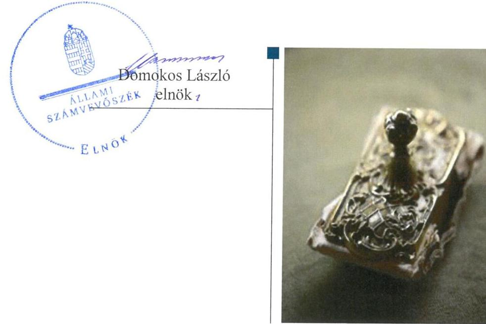
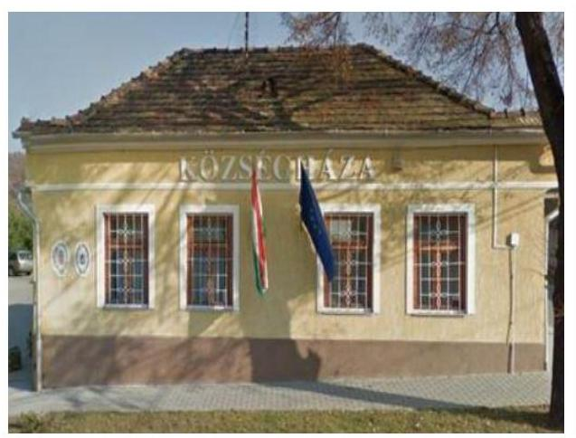
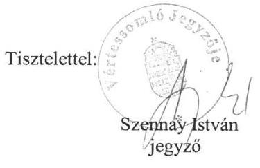
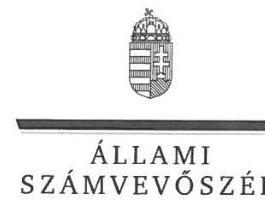
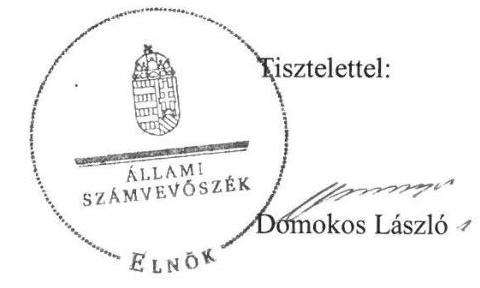

# Jelentés 

## Önkormányzatok ellenőrzése

Integritás- és belső kontrollrendszer Az egyes befektetési tevékenységek ellenőrzése - Vértessomló Község Önkormányzata
2019.

---

# Jelentés 

## Önkormányzatok ellenőrzése

Integritás- és belső kontrollrendszer Az egyes befektetési tevékenységek ellenőrzése - Vértessomló Község Önkormányzata
2019. 34. hó 13. nap

---

# AZ ELLENŐRZÉST FELÜGYELTE:

- VARGA EDIT felügyeleti vezető
- AZ ELLENŐRZÉST VEZETTE ÉS A VÉGREHAJTÁSÁÉRT FELELŐS:
  - BAJNAI ZSUZSANNA ellenőrzésvezető
  - A PROGRAM ÖSSZEÁLLÍTÁSÁÉRT FELELŐS:
    - TÓTPÁL SZABOLCS osztályvezető

**IKTATÓSZÁM:** EL-1551-001/2019.

**TÉMASZÁM:** 2485

**ELLENŐRZÉS-AZONOSÍTÓ SZÁM:** V082905

Jelentéseink az Országgyűlés számítógépes hálózatán és az Interneten a www.asz.hu címen is olvashatóak.

---

# TARTALOMJEGYZÉK 

■ ÖSSZEGZÉS ..... 5
■ AZ ELLENŐRZÉS CÉLJA ..... 6
■ AZ ELLENŐRZÉS TERÜLETE ..... 7
■ AZ ELLENŐRZÉS HÁTTERE, INDOKOLTSÁGA ..... 8
■ A JELENTÉS LÉNYEGES KÉRDÉSKÖRE ..... 9
■ AZ ELLENŐRZÉS HATÓKÖRE ÉS MÓDSZEREI ..... 10
■ MEGÁLLAPÍTÁSOK ..... 12
■ JAVASLATOK ..... 13
■ MELLÉKLETEK ..... 15
I. sz. melléklet: Értelmező szótár ..... 15
■ FÜGGELÉKEK ..... 17
I. sz. függelék a Jelentéshez ..... 17
II. sz. függelék: Észrevételek ..... 18
■ RÖVIDÍTÉSEK JEGYZÉKE ..... 25

---

.

---

# ÖSSZEGZÉS 

Vértessomló Község Önkormányzatának közpénzekkel való gazdálkodása során nem teremtette meg a felelős gazdálkodás feltételeit, így nem biztosította a befektetési tevékenység szabályszerű végzését.

## Az ellenőrzés társadalmi indokoltsága

Az Állami Számvevőszék alapvető feladata a közpénzekkel, az állami és önkormányzati vagyonnal való gazdálkodás ellenőrzése. Az Alaptörvény szerint az önkormányzatok kötelezettsége a kiegyensúlyozott, átlátható és fenntartható költségvetési gazdálkodás elvének érvényesítése. Az Állami Számvevőszék stratégiájában megfogalmazott célkitűzése az integritás alapú, átlátható és elszámoltatható közpénzfelhasználás elősegítése. Az önkormányzatok szabad pénzeszközeinek felhasználása során kiemelten fontos a felelős gazdálkodás érvényesülése, amelynek összhangban kell lennie az önkormányzat vagyongazdálkodási törekvéseivel. Ennek megvalósítása érdekében az Állami Számvevőszék prioritásként kezeli a közpénzzel gazdálkodó szervezetek esetében a belső kontrollrendszer valamint a befektetési tevékenység szabályszerű működésének ellenőrzését.

Vértessomló Község Önkormányzatát az Állami Számvevőszék korábban nem ellenőrizte, 2017. december 31-én 127,6 millió Ft összegben rendelkezett forgatási célú értékpapírral.

## Főbb megállapítások, következtetések, javaslatok

Vértessomló Község Önkormányzata belső kontrollrendszerének kialakítása és működtetése nem volt szabályszerű a 2013-2017. években, így nem biztosította szabályszerű befektetési döntések meghozatalát.

A jogszabályi előírás ellenére Vértessomló Község Önkormányzata és a Vértessomlói Közös Önkormányzati Hivatal nem rendelkezett a feladatokat, a hatásköri és felelősségi viszonyokat meghatározó szervezeti és működési szabályzattal. Így nem volt biztosított az elszámoltatható működés alapvető feltétele, a befektetési tevékenység szabályszerű kialakítása, a szabályos és elszámoltatható közpénzfelhasználás, a nemzeti vagyonnal történő felelős gazdálkodás.

Az Állami Számvevőszék a jelentésben foglalt megállapítások alapján a Vértessomlói Közös Önkormányzati Hivatal jegyzőjének és Vértessomló Község Önkormányzata polgármesterének egy-egy javaslatot fogalmazott meg. A javaslatokat megalapozó megállapításokra az érintettnek 30 napon belül intézkedési tervet kell készíteniük.

---

# AZ ELLENŐRZÉS CÉLJA 

Az ellenőrzés célja annak értékelése volt, hogy a jogszabályi előírásoknak megfelelően alakították-e ki a belső kontrollrendszert, a kontrollkörnyezet biztosította-e a befektetési tevékenységek szabályszerű végzését. Az ellenőrzés keretében az ÁSZ ${ }^{1}$ értékelte továbbá, hogy az egyes befektetési tevékenységekkel kapcsolatos döntéshozatal és a döntések végrehajtása, valamint az egyes befektetések számviteli elszámolása, nyilvántartása szabályszerű volt-e, és a belső és külső ellenőrzések támogatták-e az egyes befektetési tevékenységek szabályszerű végzését.

---

# AZ ELLENŐRZÉS TERÜLETE 

## Vértessomló Község Önkormányzata

Vértessomló Komárom-Esztergom megyében található, állandó lakosainak száma 2017. január 1-jén 1317 fő volt a Központi Statisztikai Hivatal Magyarország közigazgatási helynévkönyve adatai alapján.

Az Önkormányzat ${ }^{2}$ képviselő-testülete ${ }^{3}$ hét tagú volt. A polgármester ${ }^{4}$ a 2014. évi önkormányzati választások óta tölti be tisztségét, a jegyző ${ }^{5}$ 2013. március 1-től látja el feladatát.

Az Önkormányzat egy intézménnyel (óvoda) rendelkezett, gazdálkodási feladatainak ellátásáról a Közös Hivatal ${ }^{6}$ gondoskodott. A Közös Hivatal önálló szervezeti egységekre nem tagolódott. A Közös Hivatalban 2017. év végén hat fő köztisztviselőt foglalkoztattak.

Az Önkormányzat a 2017. évi költségvetési beszámolója szerint 254,2 millió Ft költségvetési bevételt ért el, valamint 115,1 millió Ft költségvetési kiadást teljesített. Vagyonának értéke 2017. december 31-én 1304,7 millió Ft volt, amelyen belül az értékpapírok 127,6 millió Ft-ot tettek ki.

---

# AZ ELLENŐRZÉS HÁTTERE, INDOKOLTSÁGA 

A BELSŐ KONTROLLRENDSZER kialakítása és működtetése nélkül nem valósítható meg a közpénzek, a közvagyon átlátható, szabályos, gazdaságos, hatékony és eredményes felhasználása. A belső kontrollrendszer azt a célt szolgálja, hogy a költségvetési szervek működésük és gazdálkodásuk során a tevékenységeket szabályszerűen hajtsák végre, teljesítsék elszámolási kötelezettségeiket és megvédjék az erőforrásokat a veszteségektől, a károktól és a nem rendeltetésszerű használattól.

A belső kontrollrendszer magában foglalja mindazon elveket, eljárásokat és belső szabályzatokat, melyek biztosítják, hogy a költségvetési szerv valamennyi tevékenysége és célja összhangban legyen a szabályszerűséggel, szabályozottsággal, valamint a gazdaságosság, hatékonyság és eredményesség követelményeivel, az eszközökkel és forrásokkal való gazdálkodásban ne kerüljön sor pazarlásra, visszaélésre, rendeltetésellenes felhasználásra. Megfelelő, pontos és naprakész információk álljanak rendelkezésre a költségvetési szerv működésével kapcsolatosan, és a belső kontrollrendszer harmonizációjára, összehangolására vonatkozó jogszabályok végrehajtásra kerüljenek. Az integritás kontrollok kiépítése, erősítése a szervezet korrupciós kockázatainak kezelését szolgálja. A teljesítménykövetelmények meghatározása és működtetése megalapozhatja az önkormányzatoknál a teljesítményellenőrzés lefolytatását.

## AZ ÖNKORMÁNYZATI VAGYONGAZDÁLKODÁS ker

etében az önkormányzatok átmenetileg szabad pénzeszközeinek befektetését jogszabály nem tiltja, a befektetések jellege nem korlátozott, a pénzpiaci szolgáltatók közül az önkormányzatok a kínált szolgáltatás és annak költségei alapján, szabadon választhatnak, azonban a veszteséges gazdálkodás kockázatai és következményei az önkormányzatokat terhelik. A szabad pénzeszközök felhasználása során kiemelten fontos a felelős gazdálkodás érvényesülése, amely összhangban kell, hogy legyen, az önkormányzati gazdálkodás alapelveivel.

Az ellenőrzéssel feltárásra kerülhetnek azok a kockázatok, amelyek az önkormányzatok gazdálkodásával, ezen belül befektetési tevékenységeivel, kontrollkörnyezetével kapcsolatosak és a befektetési tevékenységek szabályszerű végrehajtását befolyásolják. Az ellenőrzéssel az önkormányzatok befektetési/vagyongazdálkodási döntései értékelhetővé válnak, és megalapozott megállapítás tehető arra vonatkozóan, hogy milyen hatást gyakoroltak az önkormányzat vagyonára a képviselő-testület döntései.

---

# A JELENTÉS LÉNYEGES KÉRDÉSKÖRE 

Az Önkormányzat belső kontrollrendszerének kialakítása és működtetése szabályszerű volt-e, a befektetési tevékenységek szabályszerű végzését a kiépített kontrollrendszer biztosította-e a 2013-2017. években?

---

# AZ ELLENŐRZÉS HATÓKÖRE ÉS MÓDSZEREI 

## Az ellenőrzés típusa

Megfelelőségi ellenőrzés.

## Az ellenőrzött időszak

A belső kontrollrendszer ellenőrzésére vonatkozóan az ellenőrzött időszak a 2017. év illetve az éves költségvetési beszámoló Áht. ${ }^{7}$ által megállapított jóváhagyásáig (2018. május 31-ig) tartó időszak volt, a befektetési tevékenység vonatkozásában a 2013. január 1. - 2017. december 31. közötti időszak, továbbá a 2013. január 1. előtti időszak is, amennyiben a 2017. december 31-én meglévő befektetésekkel kapcsolatos döntéshozatalra a 2013. január 1. előtti időszakban került sor.

## Az ellenőrzés tárgya

Az önkormányzat és a gazdálkodási feladatait ellátó hivatala belső kontrollrendszerének kialakítása és működtetése, valamint az integritási kontrollok kiépítettsége, a teljesítményellenőrzés feltételei.

Az ellenőrzés tárgya továbbá a 2017. december 31-én meglévő, a Számv. tv. ${ }^{8}$ 3. § (6) bekezdés 2. és 3. pontja szerint az értékpapírokban megtestesülő befektetések, lekötött betétek, az üzleti vagyon körébe tartozó ingatlanok, kulturális javak, illetve egyéb értéktárgyak.

## Az ellenőrzött szervezet

Vértessomló Község Önkormányzata és a gazdálkodási feladatait ellátó Vértessomlói Közös Önkormányzati Hivatal

## Az ellenőrzés jogalapja

Az ellenőrzés jogszabályi alapját az ÁSZ tv ${ }^{9}$. 1. § (3) bekezdés, 5. § (2) és (6) bekezdésének előírásai képezik.

## Az ellenőrzés módszerei

Az ÁSZ az ellenőrzést az ellenőrzési program ellenőrzési kérdései, az ellenőrzött időszakban hatályos jogszabályok, az ellenőrzés szakmai szabályok

---

és módszertanok figyelembe vételével, valamint a nemzetközi standardokat irányadónak tekintve végezte.

Az ellenőrzés ideje alatt az ellenőrzött szervezettel történő kapcsolattartást az ÁSZ Szervezeti és Működési Szabályzatának vonatkozó előírásai alapján biztosította.

Az ellenőrzési kérdések megválaszolásához szükséges bizonyítékok megszerzése az ellenőrzöttek által rendelkezésre bocsátott dokumentumokra, adatokra alapozva megfigyelés, kérdésfeltevés (információkérés), valamint elemző eljárással történt. Az ellenőrzési bizonyítékként felhasználható adatforrások közé tartoztak egyrészt az ellenőrzési programban felsorolt adatforrások, másrészt az ellenőrzés szempontjából releváns információt tartalmazó dokumentumok.

Amennyiben az önkormányzat működését és gazdálkodását alapvetően meghatározó dokumentum hiánya miatt, valamely lényeges kérdéskörre vonatkozóan az ÁSZ megállapítást tett, további ellenőrzési tevékenységek az adott kérdéskörrel és az azzal szoros logikai kapcsolatban lévő kérdéskörökkel - ráépülő jelleggel - nem kerültek végrehajtásra.

---

# MEGÁLLAPÍTÁSOK 

## Az Önkormányzat belső kontrollrendszerének kialakítása és működtetése szabályszerű volt-e, a befektetési tevékenységek szabályszerű végzését a kiépített kontrollrendszer biztosította-e a 2013-2017. években?

Összegző megállapítás

A belső kontrollrendszer kialakítása és működtetése nem volt szabályszerű, ezáltal nem volt biztosított a befektetési tevékenységek szabályszerű végzése az ellenőrzött időszakban.

A BELSŐ KONTROLLRENDSZER kialakítása és működtetése nem felelt meg a jogszabályi előírásoknak, mert a képviselő-testület nem határozta meg a Mótv. ${ }^{10}$ 53. § (1) bekezdése ellenére az Önkormányzat működésének részletes szabályait.

A Közös Hivatal nem rendelkezett szervezetét, feladatai ellátásának részletes belső rendjét és módját megállapító szervezeti és működési szabályzattal az Áht. 10. § (5) bekezdésében foglaltak ellenére.

A szervezeti és működési szabályzatok hiányának következményeként nem volt biztosított a befektetési tevékenységek szabályszerű végzése.

---

# JAVASLATOK 

Az ÁSZ tv. 33. § (1) bekezdésében foglaltak értelmében az ellenőrzött szervezet vezetője köteles a jelentésben foglalt megállapításokhoz kapcsolódó intézkedési tervet összeállítani és azt a jelentés kézhezvételétől számított 30 napon belül az ÁSZ részére megküldeni. Amennyiben az ellenőrzött szervezet vezetője nem küldi meg határidőben az intézkedési tervet, vagy továbbra sem elfogadható intézkedési tervet küld, az Állami Számvevőszék elnöke az ÁSZ tv. 33. § (3) bekezdés a) és b) pontjaiban foglaltakat érvényesítheti.

## Vértessomlói Közös Önkormányzati Hivatal jegyzőjének

1. A szabályszerű belső kontrollrendszer kialakítása érdekében gondoskodjon az Önkormányzat és a Közös Hivatal szervezeti és működési szabályzatának elkészítéséről.
(1. sz. megállapítás 1., 2. bekezdése alapján)

## Vértessomló Község Önkormányzata polgármesterének

1. Gondoskodjon az Önkormányzat és a Közös Hivatal szervezeti és működési szabályzatának Képviselő-testület elé terjesztéséről.
(1. sz. megállapítás 1., 2. bekezdése alapján)

---

.

---

# MELLÉKLETEK 

- I. SZ. MELLÉKLET: ÉRTELMEZŐ SZÓTÁR
befektetési szolgáltatási tevékenység
belső kontrollrendszer
helyi önkormányzat
költségvetési szerv vezetője (Bkr. ${ }^{13}$ alkalmazásában)
közös önkormányzati hivatal
üzleti vagyon

A rendszeres gazdasági tevékenység keretében, pénzügyi eszközre vonatkozóan végzett megbízás felvétele és továbbítása, megbízás végrehajtása az ügyfél javára, sajátszámlás kereskedés, portfólió-kezelés, befektetési tanácsadás, pénzügyi eszköz elhelyezése az eszköz (értékpapír vagy egyéb pénzügyi eszköz) vételére vonatkozó kötelezettségvállalással (jegyzési garanciavállalás), pénzügyi eszköz elhelyezése az eszköz (pénzügyi eszköz) vételére vonatkozó kötelezettségvállalás nélkül, és multilaterális kereskedési rendszer működtetése. (Forrás: Bszt. ${ }^{11}$ 5. § (1) bekezdés)
A belső kontrollrendszer a kockázatok kezelése és tárgyilagos bizonyosság megszerzése érdekében kialakított folyamatrendszer, amely azt a célt szolgálja, hogy a működés és gazdálkodás során a tevékenységeket szabályszerűen, gazdaságosan, hatékonyan, eredményesen hajtsák végre, az elszámolási kötelezettségeket teljesítsék, megvédjék az erőforrásokat a veszteségektől, károktól és nem rendeltetésszerű használattól. (Forrás: Áht. 69. § (1) bekezdése)
A helyi önkormányzat jogi személy. Az önkormányzati feladatok ellátását a képviselő-testület és szervei biztosítják. A képviselő-testület szervei: a polgármester, a főpolgármester, a megyei közgyűlés elnöke, a képviselő-testület bizottságai, a részönkormányzat testülete, az önkormányzati hivatal, a megyei önkormányzati hivatal, a közös önkormányzati hivatal, a jegyző,

 továbbá a társulás. A képviselő-testület a feladatkörébe tartozó közszolgáltatások ellátására - jogszabályban meghatározottak szerint - költségvetési szervet, a polgári perrendtartásról szóló törvény szerinti gazdálkodó szervezetet (a továbbiakban: gazdálkodó szervezet), nonprofit szervezetet és egyéb szervezetet (a továbbiakban együtt: intézmény) alapíthat, továbbá szerződést köthet természetes és jogi személlyel vagy jogi személyiséggel nem rendelkező szervezettel. A helyi önkormányzat éves költségvetési beszámolója magában foglalja a helyi önkormányzat - nem költségvetési szerveihez tartozó - feladataihoz kapcsolódó bevételeket és kiadásokat. A helyi önkormányzat összevont (konszolidált) költségvetési beszámolóját a helyi önkormányzatra és költségvetési szerveire vonatkozóan külön-külön beérkezett éves költségvetési beszámolók alapján a Kincstár készíti el és küldi meg az önkormányzatnak. (Forrás: Mötv. 41. § (1), (2), (6) bekezdései; Áhsz. ${ }^{12}$ 2. § (1) bekezdése, 6. § (1) bekezdés a) és f) pontja, 30. §-a, 37. § (1) és (6) bekezdése)
Helyi önkormányzat esetén a jegyző, főjegyző, társulás esetén a társulási megállapodásban meghatározott önkormányzat jegyzője. (Forrás: Bkr. 2. § n) pont nb) alpont)
A települési képviselő-testület más települési képviselő-testülettel társult képviselő-testületet alakíthat, amely esetén a képviselő-testületek részben vagy egészben egyesítik a költségvetésüket, közös önkormányzati hivatalt tartanak fenn, és intézményeiket közösen működtetik. (Forrás: Mötv. 56. § (1)-(2) bekezdései)
A nemzeti vagyon azon része, amely nem tartozik az önkormányzati vagyon esetén a törzsvagyonba. (Forrás: Nvtv. ${ }^{14}$ 3. § (1) bekezdés 18. pontja

---

.

---

# FÜGGELÉKEK 

- I. SZ. FÜGGELÉK A JELENTÉSHEZ

Az Állami Számvevőszék az ellenőrzések során feltárt tényekhez kapcsolódó további körülmények tisztázására eszközrendszerrel nem rendelkezik. Amennyiben az ellenőrzésen túlmutatóan indokoltnak látszik az ellenőrzés során feltárt körülmények további vizsgálata, az Állami Számvevőszék törvényi felhatalmazás alapján az ellenőrzés által feltárt körülményeket továbbítja a hatáskörrel rendelkező szervnek a szükséges intézkedések megtétele, eljárások lefolytatása érdekében.
A számvevőszéki ellenőrzés feltárta, hogy Vértessomló Község Önkormányzata a Mötv. 53. § (1) bekezdésében foglaltak ellenére, a Vértessomlói Közös Önkormányzati Hivatal az Áht. 10. § (5) bekezdésében előírtak ellenére nem rendelkezett a működés és a feladatellátás részletes belső rendjét és módját, a felelősségi viszonyokat rögzítő szervezeti és működési szabályzattal. A feladatokat, felelősségi szabályokat rögzítő szervezeti és működési szabályzatok hiánya miatt az Önkormányzat és a Közös Hivatal átlátható, elszámoltatható működésének alapvető feltételei hiányoztak.
A Közös Hivatal működése során feltárt szabálytalanság hatással lehet Várgesztes település gazdálkodási feladatainak, valamint a Vértessomló és Várgesztes településen működő német nemzetiségi önkormányzatok gazdálkodási feladatainak ellátására is.
A kormányhivatal a Mötv. 132. § (1) bekezdés a) pontja alapján a helyi önkormányzatok törvényességi felügyelete körében az Alaptörvényben meghatározott feladat- és hatáskörökön túl törvényességi felhívással élhet a helyi önkormányzatok jogalkotási, továbbá jogszabályon alapuló döntési és feladat-ellátási kötelezettségének teljesítése érdekében.
A feltárt szabálytalanságok miatt indokolt az önkormányzatok törvényességi felügyeletét ellátó illetékes kormányhivatal megkeresése a jogszabályi előírások szerinti állapot megteremtése érdekében.

---

A jelentéstervezetet a Számvevőszék 15 napos észrevételezésre megküldte az ellenőrzött szervezetek vezetőinek az ÁSZ tv. 29. § (1) bekezdése előírásának megfelelően.

Az ÁSZ a jelentéstervezetet észrevételezésre megküldte Vértessomló Község Önkormányzata polgármestere és a Vértessomlói Közös Önkormányzati Hivatal jegyzője részére.
Vértessomló Község Önkormányzata polgármestere az ÁSZ tv. 29. § (2) bekezdésében foglalt észrevételezési jogával nem élt, a Vértessomlói Közös Önkormányzati Hivatal jegyzője a jelentéstervezet megállapításaira a törvényes határidőn belül észrevételt tett.
A Vértessomlói Közös Önkormányzati Hivatal jegyzőjének észrevételét és az arra adott választ a függelék tartalmazza.

[^0]
[^0]:    * 29. § (1) Az Állami Számvevőszék az ellenőrzési megállapításait megküldi az ellenőrzött szervezet vezetőjének vagy az általa megbízott személynek, és annak, akinek személyes felelősségét állapította meg.
    (2) Az ellenőrzött szervezet vezetője és a felelősként megjelölt személy az ellenőrzés megállapításaira tizenöt napon belül írásban észrevételt tehet.
    (3) Az Állami Számvevőszék az észrevételre a beérkezésétől számított harminc napon belül írásban válaszol. A figyelembe nem vett észrevételeket köteles a jelentésben feltüntetni, és megindokolni, hogy azokat miért nem fogadta el.

---

# Vértessomló Község Önkormányzata 

2823 Vértessomló, Rákóczi F. u. 63.
Tel.: 34/593-440, Fax: 34/593-443
Üisz.: VS/81-8/2019.
Tárgy: EL-1036-022/2019. számú jelentésre vonatkozó észrevételek megküldése

## Domokos László részére

elnök

## Állami Számvevőszék

Budapest
Apáczai Csere János u. 10.
1052

## Tisztelt Domokos László Elnök úr!

„Önkormányzatok ellenőrzése - Integritás- és belső kontrollrendszer - Az egyes befektetési tevékenységek ellenőrzése - Vértessomló Község Önkormányzata" címmel készített számvevőszéki jelentéstervezetének összegző megállapítására az alábbi észrevételeket teszem.

- Vértessomló Község Önkormányzata illetve a Vértessomlói Közös Önkormányzati Hivatal a korábbi években nem volt érintett az ÁSZ elektronikus úton teljesítendő adatbekéréses ellenőrzésében, kizárólag a számvevőszék által helyszínen lefolytatott személyes ellenőrzésekről szereztünk tapasztalatokat.
- Vértessomló Község Önkormányzatánál a lefolytatott ellenőrzés minden szempontból új volt számunkra, így követtünk el hibát az adatszolgáltatás során, az általunk külön CD-n beküldött szervezeti és működési szabályzatokat 1 napos határidő túllépés miatt nem fogadták el. (Ebben az időszakban - nyár közepe - a vértessomlói hivatali létszám fele (2 fő) szabadságon volt.)
Az Állami Számvevőszék tájékoztatása szerint az Ász törvény alapján a késedelmesen megküldött dokumentumokat nincs lehetősége értékelni.
- Az ellenőrzés során később megszereztük a kellő tapasztalatot és ismeretet a rendszer működésével kapcsolatban, amit igazol, hogy a későbbiekben teljeskörűen és hiánytalanul teljesítettük az adatszolgáltatásokat. Az ellenőrzési eljárás lefolytatása során semmiféle visszajelzést nem kaptunk arról, hogy valamit nem megfelelően vagy hiányosan teljesítettünk.
- Vértessomló Község Önkormányzata sem a vizsgált időszakban, sem korábban, sem azóta nem rendelkezett hitelállománnyal, befektetései nincsenek, mindössze OTP befektetési jeggyel rendelkezik, melyet jelentős részben megtakarításokból rakott össze az évtizedek során.

---

- Vértessomló Község Önkormányzata minden esetben a hatályos szabályoknak megfelelően járt el, az ASP rendszer bevezetése óta valamennyi időszakban minden kincstári jelentést és adatszolgáltatást határidőre teljesített valamennyi intézménye és az önkormányzat tekintetében. (Az elmúlt években 1 intézmény esetében volt egyszer 1 napos határidő túllépés.)
Az ellenőrzési rendszer azonban nem vette figyelembe a megküldött adatokat, ezért a jelentésben megfogalmazott megállapításokat tette, függetlenül az önkormányzat tényleges működésétől.
- Vértessomló Község Önkormányzata működése során mindig betartotta a vonatkozó jogszabályokat, gazdálkodása a megalakulása óta takarékos és biztonságos volt, az önkormányzat vagyona az elmúlt évtizedekben folyamatosan gyarapodott, hitelállománya sosem volt.

Tisztelt Elnök úr!

Kérem, az ÁSZ végleges jelentésénél a fenti észrevételeket szíveskedjen figyelembe venni!

Vértessomló, 2019. március 18.

---

ELNÖK

Ikt.szám: EL-1036-040/2019.

# Szennay István úr 

jegyző
Vértessomlói Közös Önkormányzati Hivatal

## Vértessomló

## Tisztelt Jegyző Úr!

Az „Önkormányzatok ellenőrzése - Integritás- és belső kontrollrendszer - Az egyes befektetési tevékenységek ellenőrzése - Vértessomló Község Önkormányzata" címmel készített számvevőszéki jelentéstervezetre tett észrevételét köszönettel megkaptam.
Az Állami Számvevőszék észrevételre vonatkozó álláspontjáról a felügyeleti vezető által készített részletes tájékoztatást csatoltan megküldöm.
Tájékoztatom Jegyző urat, hogy a számvevőszéki jelentésben - az Állami Számvevőszékről szóló 2011. évi LXVI. törvény 29. § (3) bekezdése alapján - a figyelembe nem vett észrevételeket szerepeltetjük, annak indoklásával, hogy azokat az Állami Számvevőszék miért nem fogadta el.

Budapest, 2019. 07. 16.

Melléklet: Tájékoztatás az észrevételek kezeléséről

---

# Tájékoztatás az észrevételek kezeléséről 

Az „Önkormányzatok ellenőrzése - Integritás- és belső kontrollrendszer - Az egyes befektetési tevékenységek ellenőrzése - Vértessomló Község Önkormányzata"című jelentéstervezetre a 2019. március 18-án kelt, VS/81-8/2019. iktatószámú levelében tett észrevételét áttekintettük, annak kezeléséről az alábbi tájékoztatást adom.

## Az 1. és 3. pontban tett észrevétele kapcsán:

Az ellenőrzés lefolytatására vonatkozó általános véleményét köszönettel megkaptuk. Tájékoztatom, hogy az ellenőrzési eljárás lefolytatására az Állami Számvevőszék belső szabályozóiban foglaltaknak megfelelően került sor. Észrevétele a jelentéstervezet megállapításait nem cáfolta, így az észrevételében foglaltak alapján a jelentéstervezet módosítása nem indokolt.

## A 2. pontban tett észrevétele kapcsán:

Az Állami Számvevőszékről szóló 2011. évi LXVI. törvény 28. § (2) bekezdésének megfelelően ,,A közreműködésre felhívott szervezet az Állami Számvevőszék részére - annak kérésére soron kívül, de legkésőbb öt munkanapon belül - az ellenőrzés tervezhetősége, meghatározása, illetve lefolytatása érdekében szükséges adatokat és dokumentumokat rendelkezésre bocsátja, illetve a kapcsolódó tájékoztatást köteles megadni."
A késedelmesen megküldött dokumentumokat az ellenőrzésnek nincs lehetősége értékelni, amelynek rögzítésére észrevételében is sor került.
Mindezek alapján az észrevételt nem fogadjuk el, az Állami Számvevőszék megállapítása helytálló, a jelentéstervezet módosítása nem indokolt.

## A 4. pontban tett észrevétele kapcsán:

A jelentéstervezetben nem került rögzítésre Vértessomló Község Önkormányzata (továbbiakban: Önkormányzat) hitelállományára vonatkozóan megállapítás.
A jelentéstervezet a 2017. december 31-én állományban lévő értékpapírok értékét rögzíti. Megjegyezzük, az észrevételében jelzett, OTP befektetési jegy a számvitelről szóló 2000. évi C. törvény 3. § (6) bekezdés 2. pontjában rögzített hitelviszonyt megtestesítő értékpapír, kimutatására a mérleg B. Forgóeszközök III. Értékpapírok 5. Forgatási célú hitelviszonyt megtestesítő értékpapírok soron kerül sor, amely az EL-1036-008/2018. iktatószámú, 2018. szeptember 28-án kelt kiértesítő levél mellékleteként megküldött ellenőrzési program tárgyát képező befektetésnek számít.
Észrevétele a jelentéstervezet megállapításait nem cáfolta, így az észrevételében foglaltak alapján a jelentéstervezet módosítása nem indokolt.

## Az 5. pontban tett észrevétele kapcsán:

Az Állami Számvevőszékről szóló 2011. évi LXVI. törvény 28. § (2) bekezdésének megfelelően ,,A közreműködésre felhívott szervezet az Állami Számvevőszék részére - annak kérésére soron

---

kívül, de legkésőbb öt munkanapon belül - az ellenőrzés tervezhetősége, meghatározása, illetve lefolytatása érdekében szükséges adatokat és dokumentumokat rendelkezésre bocsátja, illetve a kapcsolódó tájékoztatást köteles megadni."
A késedelmesen megküldött dokumentumokat az ellenőrzésnek nincs lehetősége értékelni.
Mindezek alapján az észrevételt nem fogadjuk el, az Állami Számvevőszék megállapítása helytálló, a jelentéstervezet módosítása nem indokolt.

# A 6. pontban tett észrevétele kapcsán: 

A jelentéstervezetben nem került rögzítésre az Önkormányzat hitelállományára vonatkozóan megállapítás. Észrevétele a jelentéstervezet megállapításait nem cáfolta, így az észrevételében foglaltak alapján a jelentéstervezet módosítása nem indokolt.

Budapest, 2019. 04. 18.

Varga Edit
felügyeleti vezető

---

.

---

# RÖVIDÍTÉSEK JEGYZÉKE 

${ }^{1}$ ÁSZ
${ }^{2}$ Önkormányzat
${ }^{3}$ képviselő-testület
${ }^{4}$ polgármester
${ }^{5}$ jegyző
${ }^{6}$ Közös Hivatal
${ }^{7}$ Áht.
${ }^{8}$ Számv. tv.
${ }^{9}$ ÁSZ tv.
${ }^{10}$ Mötv.
${ }^{11}$ Bszt.
${ }^{12}$ Áhsz.
${ }^{13}$ Bkr.
${ }^{14}$ Nvtv.

Állami Számvevőszék
Vértessomló Község Önkormányzata
Vértessomló Község Önkormányzatának képviselő-testülete
Vértessomló Község Önkormányzata polgármestere
Vértessomlói Közös Önkormányzati Hivatal jegyzője
Vértessomlói Közös Önkormányzati Hivatal
2011. évi CXCV. törvény az államháztartásról (hatályos 2011. december 31-től)
2000. évi C. törvény a számvitelről (hatályos 2001. január 1-jétől)
2011. évi LXV. törvény az Állami Számvevőszékről (hatályos: 2011. július 1-jétől)
2011. évi CLXXXIX. törvény Magyarország helyi önkormányzatairól (hatályos 2012. január 1-jétől)
2007. évi CXXXVIII. törvény a befektetési vállalkozásokról és az árutőzsdei szolgáltatókról, valamint az általuk végezhető tevékenységek szabályairól (hatályos 2007. december 1-jétől)
4/2013. (I. 11.) Korm. rendelet az államháztartás számviteléről (hatályos 2014. január 1-jétől)
370/2011. (XII. 31.) Korm. rendelet a költségvetési szervek belső kontrollrendszeréről és belső ellenőrzéséről (hatályos 2012. január 1-jétől)
2011. évi CXCVI. törvény a nemzeti vagyonról (hatályos 2011. december 31-től)

---

# ÁLLAMI SZÁMVEVŐSZÉK 

1052 Budapest, Apáczai Csere János utca 10.
Levélcím: 1364 Budapest 4. Pf. 54
Telefon: +36 14849100 Telefax: +36 14849200
www.asz.hu
