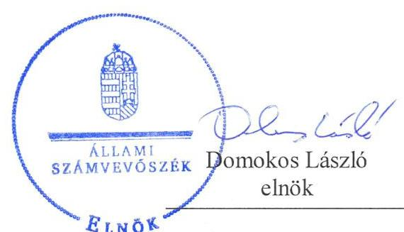
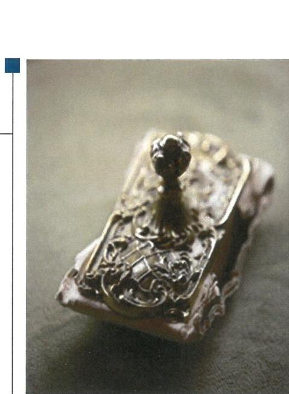
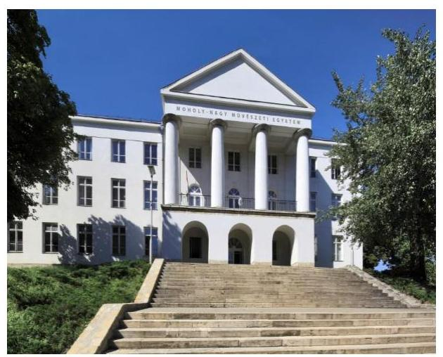

# Jelentés 

## Központi költségvetési szervek ellenőrzése

Integritás- és belső kontroll, Vagyongazdálkodás - Moholy-Nagy Múvészeti Egyetem 2019.

---

# Jelentés 

## Központi költségvetési szervek ellenőrzése

Integritás- és belső kontroll, Vagyongazdálkodás-Moholy-Nagy Művészeti Egyetem
2019. 05. hó 02. nap

---

|  | AZ ELLENŐRZÉST FELÜGYELTE: |
| :--: | :--: |
|  | DR. NAGY IMRE felügyeleti vezető |
|  | AZ ELLENŐRZÉST VEZETTE ÉS A VÉGREHAJTÁSÁÉRT FELELŐS: |
|  | DR. KOVÁCS DIÁNA ellenőrzésvezető |
|  | A PROGRAM ÖSSZEÁLLÍTÁSÁÉRT FELELŐS: |
|  | TÓTPÁL SZABOLCS osztályvezető |
|  | A TÉMÁHOZ KAPCSOLÓDÓ KORÁBBI SZÁMVEVŐSZÉKI JELENTÉSEK: |
| - címe: | Jelentés a Moholy-Nagy Művészeti Egyetem ellenőrzéséről - Az állami felsőoktatási intézmények gazdálkodásának, működésének ellenőrzése |
| - sorszáma: | 15045 |
| - címe: | Az állami felsőoktatási intézmények gazdálkodásának, működésének ellenőrzéséről készült jelentések utóellenőrzése - Moholy-Nagy Müvészeti Egyetem |
| - sorszáma: | 18044 |
| IKTATÓSZÁM: EL-1552-001/2019. |  |
| TÉMASZÁM: 2479 |  |
| ELLENŐRZÉS-AZONOSÍTÓ SZÁM: V082302 |  |

---

# TARTALOMJEGYZÉK 

■ ÖSSZEGZÉS ..... 5
■ AZ ELLENŐRZÉS CÉLJA ..... 6
■ AZ ELLENŐRZÉS TERÜLETE ..... 7
■ AZ ELLENŐRZÉS HÁTTERE, INDOKOLTSÁGA ..... 8
■ A JELENTÉS LÉNYEGES KÉRDÉSKÖREI ..... 9
■ AZ ELLENŐRZÉS HATÓKÖRE ÉS MÓDSZEREI ..... 10
■ MEGÁLLAPÍTÁSOK ..... 12
■ JAVASLATOK ..... 15
■ MELLÉKLETEK ..... 17
I. sz. melléklet: Értelmező szótár ..... 17
■ FÜGGELÉK: ÉSZREVÉTELEK ..... 21
■ RÖVIDÍTÉSEK JEGYZÉKE ..... 25

---

.

---

# ÖSSZEGZÉS 

A Moholy-Nagy Müvészeti Egyetem belső kontrollrendszere nem biztositotta a közpénzekkel való átlátható, szabályszerű, gazdaságos, hatékony és eredményes gazdálkodás feltételeit. Az integritás kontrollrendszer kiépitése hiányosan történt meg. Az állami vagyon védelme nem volt biztositott, az állami vagyon kimutatása nem volt átlátható.

## Az ellenőrzés társadalmi indokoltsága

Az Állami Számvevőszék ${ }^{1}$ ellenőrzi a költségvetési szervek gazdálkodását, működését, hogy megállapításaival támogassa az ellenőrzött szervezetek szabályszerű gazdálkodását, javaslataival elősegítse az Alaptörvényben² megfogalmazott alapvetések érvényesülését a mindennapi életben a szervezetek szintjén. A központi költségvetés rendszerében zajló folyamatok holisztikus elemzései, a kockázatok folyamatos figyelemmel kísérésének módszerével, az így kiválasztott szervezetek célzott, hatékony ellenőrzéseivel az ÁSZ betölti a legfőbb gazdasági ellenőrző szerv küldetését. Az egyes ellenőrzések megállapításaival és egy időszak ellenőrzési eredményeinek elemzésével az ÁSZ ráirányithatja a jogalkotók figyelmét a központi alrendszerben vagy annak egy ágazatában esetlegesen felmerülő pénzügyi, szabályozási feszültségekre. Az elvégzett ellenőrzések során az ÁSZ „jó gyakorlatokat" is azonosíthat, melyeket tanácsadó funkciója keretében szélesebb körben is megismertethet az érintettekkel, ezáltal is hozzájárulva a költségvetési rendszer szabályozott, átlátható, kiegyensúlyozott és fenntartható müködéséhez.

## Főbb megállapítások, következtetések, javaslatok

A Moholy-Nagy Művészeti Egyetem belső kontrollrendszerének kialakítása és működtetése nem volt szabályszerű. Az Egyetem nem szabályszerű kontrollkörnyezetben múködött, a müködési és a szervezeti kereteinek kialakítása nem volt szabályszerű. Rendelkezett a jogszabályi előírásoknak megfelelő, a gazdálkodási folyamatokra vonatkozó szabályozással, így számviteli politikával és az annak keretei között kialakítandó szabályzatokkal. A gazdálkodási és pénzügyi szabályozás alapján a vagyonnal való elszámoltatható, átlátható gazdálkodás feltételei biztosítottak voltak. Az integrált kockázatkezelési rendszert nem alakította ki az Egyetem. Az integrált kockázatkezelési rendszer működtetése nem volt szabályszerű, mert a kockázatkezelés nem terjedt ki az Egyetem minden tevékenységére. A kontrolltevékenység gyakorlása során a teljesítésigazolás nem szabályszerű gyakorlása veszélyeztette az elszámolás átláthatóságát. Az információs és kommunikációs folyamatok működtetése szabályszerű volt. Az Egyetem a monitoring rendszerét és a belső ellenőrzést szabályszerűen működtette.

Az integritás kontrollrendszer keretében a kötelezően előírt kontrollok kiépítettsége támogatja az Egyetem integritását, azonban a nem kötelezően előírt, integritást segítő kontrollok alacsony szinten müködtek.

Az Egyetem a teljesítménymérés követelményeinek keretrendszerét kialakította, de a belső kontrollrendszer és a vagyongazdálkodás müködése során feltárt hiányosságok miatt a teljesítménymérés feltételei nem álltak fenn.

Az Egyetemnél nem volt biztosított az állami vagyon védelme, nyilvántartásának átláthatóságát nem biztosították, mert a mérleg alátámasztására nem készült a jogszabályi előírások szerinti leltár.

Az Állami Számvevőszék a Moholy-Nagy Művészeti Egyetem kancellárjának hét javaslatot fogalmazott meg az SZMSZ jogszabályi előírásoknak megfelelő tartalmával, az ellenőrzési nyomvonal és az integrált kockázatkezelés eljárásrendjének kialakításával, az integrált kockázatkezelési rendszer koordinálásának szervezeti felelősének kijelölésével kapcsolatban, az integrált kockázatkezelési rendszer az Egyetem szakmai tevékenységének ellátása során felmerülő kockázatok azonosítására és kezelésére való kiterjesztésére vonatkozóan, a jogszabályi előírások szerint teljesítésigazolást, valamint leltárkészítést illetően. Az Állami Számvevőszék az Egyetem rektorának egy javaslatot tett az SZMSZ módosításának szenátus elé terjesztésére vonatkozóan.

---

# AZ ELLENŐRZÉS CÉLJA 

AZ ELLENŐRZÉS CÉLJA annak megállapítása volt, hogy a Moholy-Nagy Művészeti Egyetem ${ }^{3}$ belső kontrollrendszere biztosította-e az átlátható, szabályszerű, gazdaságos, hatékony és eredményes gazdálkodás feltételeit. Az ellenőrzés keretében értékeltük, hogy az Egyetemnél kiépítették és erősítették-e a korrupciós kockázatok kezelését szolgáló integritási kontrollokat, továbbá megteremtették-e a teljesítményellenőrzés feltételeit.

Az ellenőrzés célja volt továbbá annak értékelése, hogy az államháztartás központi alrendszerébe tartozó Egyetem gazdálkodása elszámoltatható-e és megfelelt-e annak az Alaptörvényben meghatározott alapvetésnek, hogy Magyarország a kiegyensúlyozott, átlátható és fenntartható költségvetési gazdálkodás elvét érvényesíti. Érvényesült-e a nemzeti vagyon kezelésének és védelmének célja, azaz az Egyetem vagyona a közérdeket szolgálja, a közös szükségletek kielégítése és a természeti erőforrások megóvása, valamint a jövő nemzedékek szükségleteinek figyelembevétele mellett.

---

# AZ ELLENŐRZÉS TERÜLETE 

## Moholy-Nagy Művészeti Egyetem

Az Egyetem feletti alapítói jogok gyakorlója az Országgyúlés, irányító szerve az Emberi Erőforrások Minisztériuma. Közfeladata oktatási, tudományos kutatási és művészeti alkotótevékenység folytatása. Az Egyetem 2007 szeptembere óta nyújt a művészetek és a pedagógusképzés területén többciklusú -alap-, mester- és doktori - képzést.

Az Egyetem szakmailag és gazdaságilag önálló, önkormányzattal rendelkező jogi személy, amely mint állami felsőoktatási intézmény a költségvetési gazdálkodás rendje szerint müködik. Illetékessége, müködési területe Magyarország területe, a felvehető maximális hallgatólétszáma 1059 fő.

Az Egyetem élén a Rektor ${ }^{4}$ áll, aki 2014 óta látja el feladatait. A Rektor az Nftv. ${ }^{5}$ szerint az Egyetem első számú felelős vezetője és képviselője, aki az Egyetem alaptevékenységnek megfelelő múködéséért felelős. A Kancellár ${ }^{6}$ felelős a gazdálkodási intézkedések és javaslatok előkészítéséért, végzi az Egyetem múködtetését. A Kancellár személyében az ellenőrzött időszakban nem történt változás.

A 2017. évi éves költségvetési beszámoló adatai alapján a teljesített összes bevétel 11 170,5 M Ft, a teljesített összes kiadás 8050,0 M Ft, összes maradványa 3120,5 M Ft, ebből az alaptevékenység szabad maradványa 8,4 M Ft volt. Átlagos statisztikai állományi létszáma 2017-ben 184 fő volt.

---

# AZ ELLENŐRZÉS HÁTTERE, INDOKOLTSÁGA 

Az államháztartás központi alrendszerébe tartozó szervezet vagyona a nemzeti vagyon része, és az Alaptörvény is rögzíti, hogy a vagyonnal való gazdálkodás célja a közérdek szolgálata. Az ÁSZ ellenőrzi az éves költségvetési törvény végrehajtását, az ellenőrzés során feltárt kockázatok és a terület folyamatos kockázatelemzésével beazonosított kockázatok kezelése érdekében ráépülő ellenőrzésekkel ellenőrzi a költségvetési szervek gazdálkodását, múködését, hogy az ellenőrzések megállapításaival támogassa az ellenőrzött szervezetek szabályszerű gazdálkodását, javaslataival elősegítse az Alaptörvényben megfogalmazott alapvetések érvényesülését a mindennapi életben a szervezetek szintjén.

A belső kontrollrendszer kialakítása és múködtetése nélkül nem valósítható meg a közpénzek, a közvagyon átlátható, szabályos, gazdaságos, hatékony és eredményes felhasználása. A belső kontrollrendszer azt a célt szolgálja, hogy a költségvetési szervek múködésük és gazdálkodásuk során a tevékenységeket szabályszerűen hajtsák végre, teljesítsék elszámolási kötelezettségeiket és megvédjék az erőforrásokat a veszteségektől, a károktól és a nem rendeltetésszerű használattól. A belső kontrollrendszer magában foglalja mindazon elveket, eljárásokat és belső szabályzatokat, melyek biztosítják, hogy a költségvetési szerv valamennyi tevékenysége és célja összhangban legyen a szabályszerűséggel, szabályozottsággal, valamint a gazdaságosság, hatékonyság és eredményesség követelményeivel, az eszközökkel és forrásokkal való gazdálkodásban ne kerüljön sor pazarlásra, visszaélésre, rendeltetésellenes felhasználásra. Megfelelő, pontos és naprakész információk álljanak rendelkezésre a költségvetési szerv múködésével kapcsolatosan, és a belső kontrollrendszer harmonizációjára, öszszehangolására vonatkozó jogszabályok végrehajtásra kerüljenek. Az integritás kontrollok kiépítése, erősítése a szervezet korrupciós kockázatainak kezelését szolgálja. A teljesítménykövetelmények meghatározása és múködtetése megalapozhatja a központi költségvetési szervnél a teljesítményellenőrzés lefolytatását.

---

# A JELENTÉS LÉNYEGES KÉRDÉSKÖREI 

1. Az Egyetem belső kontrollrendszerének kialakítása és müködtetése szabályszerű volt-e, az biztositotta-e a közpénzfelhasználás és az állami vagyonnal való gazdálkodás szabályosságát?
2. Az Egyetemnél kiépítették és erősítették-e az integritás kontrollrendszerét?
3. Az Egyetemnél alakítottak-e ki a teljesítmény mérésére alkalmas követelményeket?
4. Biztositott volt-e az állami vagyon védelme, az állami vagyon kimutatását átlátható, valóságnak megfelelő módon, szabályszerűen végezték-e?

---

# AZ ELLENŐRZÉS HATÓKÖRE ÉS MÓDSZEREI 

## Az ellenőrzés típusa

Megfelelőségi ellenőrzés.

## Az ellenőrzött időszak

A 2017. év, illetve a 2018. június 30-ig eső időszak.

## Az ellenőrzés tárgya

Az Egyetem belső kontrollrendszerének kialakítása és múködtetése, valamint az integritás kontrollok kiépítettsége, a teljesítményellenőrzés feltételei.

Az Egyetem vagyongazdálkodási feltételeinek kialakítása, annak szabályszerűsége, az elszámoltathatóság biztosítása a szabályozás szintjén. Az Egyetemnél hozott vagyonváltozást eredményező döntések, a vagyonban bekövetkezett változások végrehajtásának, nyilvántartásba vételének, elszámolásának szabályszerűsége. Az állami vagyon kimutatásának szabályszerűsége, ennek keretében az állami vagyonnal történő rendelkezés, a vagyonmozgások, a vagyon nyilvántartásba vétele, értékelése és a mérleg alátámasztás szabályszerűsége.

## Az ellenőrzött szervezet

Moholy-Nagy Művészeti Egyetem

## Az ellenőrzés jogalapja

Az ellenőrzés jogszabályi alapját az ÁSZ tv. ${ }^{7}$ 1. § (3) bekezdése, 5. § (2)(3) bekezdései, (4) bekezdés a) pontja és (6) bekezdése, valamint az Áht. ${ }^{8}$ 61. § (2) bekezdésében foglalt előírások adták.

## Az ellenőrzés módszerei

Az ÁSZ az ellenőrzést az ellenőrzési program szempontjai, az ellenőrzött időszakban hatályos jogszabályok, az ellenőrzés szakmai szabályai, a jelen ellenőrzésre irányadó ÁSZ módszertanok figyelembevételével hajtotta végre.

---

Az ellenőrzési kérdések megválaszolásához szükséges bizonyítékok megszerzése az ellenőrzött által rendelkezésre bocsátott dokumentumokra, adatokra alapozva megfigyelés, szemle (szemrevételezés), kérdésfeltevés (információkérés), mintavételezés, valamint elemző eljárás útján történt. Az ellenőrzési bizonyítékként felhasználható adatforrások közé tartoztak az ellenőrzési program részletes szempontjainál felsorolt adatforrások, valamint minden egyéb - az ellenőrzés folyamán feltárt, az ellenőrzés szempontjából információt tartalmazó - dokumentum.

Az ellenőrzés lefolytatásához az ellenőrzött szervezet tanúsítványok kitöltésével, valamint az ÁSZ által kért dokumentumok megküldésével szolgáltatott adatokat, amelyek valódiságát és teljes körűségét az ellenőrzött szervezet vezetője által tett teljességi és hitelességi nyilatkozat igazolta. A rendelkezésre bocsátott adatok, információk kontrollja az ellenőrzés keretében történt.

Az Egyetem belső kontrollrendszere egyes pilléreinek kialakítására és működtetésére vonatkozó értékelés:
$\longrightarrow$ „szabályszerü", amennyiben az értékelt területen az elért „igen" válaszok százalékban kifejezett, egész számra kerekített aránya legalább $85 \%$,
$\longrightarrow$ „nem szabályszerű", ha nem éri el a $85 \%$-ot,
Az Egyetem belső kontrollrendszerének összesített értékelése az egyes részterületek esetében kapott megfelelőségi arányok számtani átlaga alapján történt és megegyezik a pillérenként (kontrollterületenként) alkalmazott százalékos értékelésekkel, a következő eltérésekkel: a kontrollrendszer egésze esetében a „szabályszerű" értékelésnek a százalékos értéken felül további feltétele, hogy egyik kontrollterület sem kaphat „nem szabályszerű" értékelést.

A kiadások teljesítéséhez kapcsolódó pénzgazdálkodási belső kontrollok működésének szabályszerűsége esetében az ellenőrzés azokra a legnagyobb értékű tételekre - a lényeges sokaságra - terjedt ki, melyek összértéke eléri a teljes sokaság összértékének 50\%-át.

Az ellenőrzés ideje alatt az ellenőrzött szervezettel történő kapcsolattartást az ÁSZ SZMSZ-ének vonatkozó előírásai alapján biztosítottuk.

---

# 1. Az Egyetem belső kontrollrendszerének kialakítása és múködtetése szabályszerű volt-e, az biztosította-e a közpénzfelhasználás és az állami vagyonnal való gazdálkodás szabályosságát? 

## Összegző megállapítás

Az Egyetem belső kontrollrendszerének kialakítása és múködtetése nem volt szabályszerű, az nem biztosította a közpénzfelhasználás szabályosságát.

### 1.1. számú megállapítás

Az Egyetem nem szabályszerű kontrollkörnyezetben múködött.
ALAPÍTÓ OKIRAT ${ }_{1-2}{ }^{9}$-tal, SZMSZ ${ }_{1-2}{ }^{10}$-szel, a szervezeti egységeinek részletes működési szabályait meghatározó Ügyrenddel ${ }^{11}$ az Egyetem az Áht. és az Ávr. ${ }^{12}$ előírásai szerint rendelkezett.

A Rektor az Ávr. 13. § (1) bekezdés g) pontjában előírtak ellenére nem gondoskodott arról, hogy az SZMSZ ${ }_{1-2}$ a helyettesítés rendjét minden nevesített munkakör esetében tartalmazza.

A Kancellár a Bkr. ${ }^{13}$ 6. § (3) bekezdésében foglaltak ellenére nem készítette el az Egyetem múködési folyamatait leíró ellenőrzési nyomvonalát.

SZÁMVITELI POLITIKA ${ }_{1-2}{ }^{14}$-vel az Egyetem szabályszerűen rendelkezett, amelynek részeként elkészítették az Értékelési szabályzatot ${ }^{15}$, a Leltározási szabályzatot ${ }^{16}$, az Önköltség-számítási szabályzatot ${ }^{17}$ és a Pénzkezelési szabályzatot ${ }^{18}$. A hatályos jogszabályok szerint elkészítették a Számlarend ${ }_{1-2}{ }^{19}$-t, valamint a Bizonylati szabályzatot ${ }^{20}$.

### 1.2. számú megállapítás

Az Egyetem nem alakította ki az integrált kockázatkezelési rendszert.

A SZERVEZETI INTEGRITÁST SÉRTŐ ESEMÉNYEK KEZELÉSÉNEK eljárásrendjét, valamint az integrált kockázatkezelés eljárásrendjét a Bkr. 6. § (4) bekezdésében foglaltak ellenére a Kancellár nem szabályozta.

A Bkr. 7. § (4) bekezdésének előírásának ellenére a Kancellár az integrált kockázatkezelési rendszer koordinálására szervezeti felelőst nem jelölte ki.

Az integrált kockázatkezelési rendszert a Kancellár - a jogszabályi előírásoknak nem megfelelő szabályzat alapján - a Bkr. 7. § (1) bekezdésében foglaltakkal ellentétesen múködtette, mert a Bkr. 2. § (m) pontjában foglaltakkal ellentétben a szervezet minden tevékenységére nem terjedt ki a kockázatkezelés. A szakmai tevékenység ellátása során felmerülő kockázatok azonosítása és kezelése nem történt meg.

---

| 1.3. számú megállapítás | A kontrolltevékenységek gyakorlása nem szabályszerűen történt. |
| :--: | :--: |
|  | A Kancellár felelősségi körébe tartozó teljesítésigazolás gyakorlása nem a jogszabályi előírások szerint történt. Az Áht. 38. § (1) bekezdésében és az Ávr. 57. § (3) bekezdésében foglaltak ellenére szabályszerű teljesítésigazolás hiányában került sor számla kifizetésére. |
| 1.4. számú megállapítás | Az információs és kommunikációs folyamatok múködtetése szabályszerű volt. |
|  | Az Egyetem a Bkr. előírásai szerint olyan információs és kommunikációs rendszert alakított ki, amely biztosította, hogy a megfelelő információk a megfelelő időben eljussanak az illetékes szervezethez, szervezeti egységhez.   Az Info tv. előírásai szerint az Egyetem közzétette a hatályos SZMSZ-ét, az Adatvédelmi szabályzatát, a 2016. évi költségvetési beszámolóját, és a 2017. évi gazdálkodási adatait. Az adatszolgáltatási kötelezettségnek határidőben eleget tett az Egyetem. |
| 1.5. számú megállapítás | Az Egyetem szabályszerűen múködtette monitoring rendszerét. |
|  | A Kancellár a gazdálkodási tevékenység tekintetében kialakította a szervezet tevékenységének, a célok megvalósításának nyomon követését biztosító rendszerét. Elkészítették a Minőségfejlesztési Programot és az Intézményfejlesztési Tervet.   A Kancellár eleget tett az Egyetem belső kontrollrendszerének minőségét értékelő nyilatkozattételi kötelezettségének.   A belső ellenőrzés múködtetése szabályszerűen történt. |

# 2. Az Egyetemnél kiépítették és erősítették-e az integritás kontrollrendszerét? 

| Összegző megállapítás | A nem kötelezően előírt kontrollok magasabb szintű múködtetésével az Egyetemnél lehetőség van az integritás-tudatos múködés fejlesztésére. |
| :--: | :--: |
|  | A jogszabályok által előírt kontrollok kiépítettsége támogatta az Egyetem integritását, azonban az Egyetem kockázatelemzése nem terjedt ki a korrupciós kockázatokra. Az Egyetem az egyéb, nem kötelező, de integritást erősítő kontrollokat alacsony szinten múködtette. |

## 3. Az Egyetemnél alakítottak-e ki a teljesítmény mérésére alkalmas követelményeket?

| Összegző megállapítás | Az Egyetemnél kialakítottak teljesítmény mérésére alkalmas   követelmény-keretrendszert. |
| :-- | :-- |
|  | Az Egyetem intézményfejlesztési tervet dolgozott ki, amely a helyzetérté-   kelésen túl meghatározta az Egyetem jövőképét, a stratégiai irányokat és |

---

az akció terveket. A stratégiai irányok és célok keretében meghatározták az intézkedések céljait, a tervezett intézkedéseket, és az indikátorokat.

Az oktatási alaptevékenységhez kapcsolódó fő célkitűzéseken kívül vagyonhoz kapcsolódó gazdálkodási célokat is megfogalmaztak.

# 4. Biztosított volt-e az állami vagyon védelme, az állami vagyon kimutatását átlátható, valóságnak megfelelő módon, szabályszerűen végezték-e? 

Összegző megállapítás Az Egyetem az állami vagyon védelmét nem biztosította, annak kimutatása nem volt átlátható.

A Számv. tv. ${ }^{21}$ 69. § (1) bekezdésében foglaltak ellenére a mérlegadatok valódiságát alátámasztó leltár nem készült.

---

# JAVASLATOK 

Az ÁSZ tv. 33. § (1) bekezdésében foglaltak értelmében az ellenőrzött szervezet vezetője köteles a jelentésben foglalt megállapításokhoz kapcsolódó intézkedési tervet összeállítani és azt a jelentés kézhezvételétől számított 30 napon belül az ÁSZ részére megküldeni. Amennyiben az ellenőrzött szervezet vezetője nem küldi meg határidőben az intézkedési tervet, vagy továbbra sem elfogadható intézkedési tervet küld, az Állami Számvevőszék elnöke az ÁSZ tv. 33. § (3) bekezdése a) és b) pontjaiban foglaltakat érvényesítheti.

## Moholy-Nagy Művészeti Egyetem kancellárjának

1. Intézkedjen, hogy az SZMSZ tartalma a jogszabályi előírásoknak teljes körüen megfeleljen.
(1.1. sz. megállapítás 2. bekezdése alapján)
2. Intézkedjen a jogszabályban elöirtaknak megfelelően az Egyetem müködési folyamatait leíró ellenőrzési nyomvonal elkészitéséről.
(1.1. sz. megállapítás 3. bekezdése alapján)
3. Intézkedjen a jogszabályban elöirtaknak megfelelően a szervezeti integritást sértő események kezelésének, valamint az integrált kockázatkezelés eljárásrendjének szabályozásáról.
(1.2. sz. megállapítás 1. bekezdése alapján)
4. Jelölje ki a jogszabályban elöirtak szerint az integrált kockázatkezelési rendszer koordinálásának szervezeti felelősét.
(1.2. sz. megállapítás 2. bekezdése alapján)
5. Intézkedjen annak érdekében, hogy az integrált kockázatkezelési rendszer az Egyetem szakmai tevékenységének ellátása során felmerülő kockázatok azonosítására és kezelésére is kiterjedjen.
(1.2. sz. megállapítás 3. bekezdése alapján)
6. Intézkedjen arról, hogy számla kifizetésére csak a jogszabályi előírásoknak megfelelő teljesítésigazolás után kerüljön sor.
(1.3. sz. megállapítás alapján)

---

7. | Intézkedjen a jogszabályok szerinti leltár elkészitéséről.
(4. sz. megállapítás 1. bekezdése alapján)

# Moholy-Nagy Művészeti Egyetem rektorának 

1. Gondoskodjon az SZMSZ módosításának szenátus elé terjesztéséről.
(1.1. sz. megállapítás 2. bekezdése alapján)

---

# MELLÉKLETEK 

- I. SZ. MELLÉKLET: ÉRTELMEZŐ SZÓTÁR
állami vagyon
állami vagyonnak minősül:
a) az állam tulajdonában lévő dolog, valamint a dolog módjára hasznosítható természeti erő,
b) az a) pont hatálya alá nem tartozó mindazon vagyon, amely vonatkozásában törvény az állam kizárólagos tulajdonjogát nevesíti,
c) az állam tulajdonában lévő tagsági jogviszonyt megtestesítő értékpapír, illetve az államot megillető egyéb társasági részesedés,
d) az államot megillető olyan immateriális, vagyoni értékkel rendelkező jogosultság, amelyet jogszabály vagyoni értékű jogként nevesít. (Forrás: Vtv. ${ }^{22}$ 1. § (2) bekezdése)
állami vagyon értékesítése
állami vagyon használója
állami vagyon használója
állami vagyon hasznosítása
állami vagyon hasznosítására kötött szerződés
állami vagyon kezelője /vagyonkezelő

Állami vagyonnak a tulajdonosi joggyakorló maga gazdálkodik, vagy szerződés így különösen bérlet, haszonbérlet, megbízás - alapján hasznosításra átengedi, illetőleg vagyonkezelésbe, haszonélvezetbe adja. (Forrás: Vtv. 23. § (1) bekezdése, hatályos 2013. június 28 -ától)
Az állami vagyonnal a tulajdonosi joggyakorló maga gazdálkodik, vagy szerződés így különösen bérlet, haszonbérlet, megbízás - alapján központi költségvetési szervnek, természetes vagy jogi személynek, vagy jogi személyiséggel nem rendelkező gazdálkodó szervezetnek hasznosításra átengedi.
(Forrás: Vtv. 23. § (1) bekezdése, hatályos 2012. január 1-jétől)
Az állami vagyonnal a tulajdonosi joggyakorló maga gazdálkodik, vagy szerződés így különösen bérlet, haszonbérlet, megbízás - alapján hasznosításra átengedi, illetőleg vagyonkezelésbe, haszonélvezetbe adja. (Forrás: Vtv. 23. § (1) bekezdése, hatályos 2013. június 28 -ától)
Az állami vagyon hasznosítására kötött szerződések elsődleges célja az állami vagyon hatékony működtetése, állagának védelme, értékének megőrzése, illetve gyarapítása, az állami és közfeladatok ellátásának elősegítése. (Forrás: Vtv. 23. § (2) bekezdése)
Az állami vagyont az MNV Zrt. maga kezeli, vagy szerződés - így különösen bérlet, haszonbérlet, megbízás - alapján központi költségvetési szervnek, természetes vagy jogi személynek, vagy jogi személyiséggel nem rendelkező gazdálkodó szervezetnek hasznosításra átengedi." Az állami vagyonra vonatkozóan az MNV Zrt. kizárólag az Nvtv. ${ }^{24}$-ben meghatározott személyekkel köthet vagyonkezelési szerződést. (Forrás: Vtv. 27. § (1) bekezdése, hatályos 2012. január 1-jétől)

---

| ÁSZ Integritás Projekt | Az Állami Számvevőszék 2009-ben indította el a „Korrupciós kockázatok feltérképe- |
| :--: | :--: |
|  | zése - Integritás alapú közigazgatási kultúra terjesztése" című, európai uniós forrás- |
|  | ból megvalósított kiemelt projektjét (Integritás Projekt). Az Integritás Projekt célja, hogy felmérje a közszféra intézményei korrupciós kockázatoknak való kitettségét, illetőleg az azok mérséklésére hivatott kontrollok szintjét. Az Állami Számvevőszék a projekt révén az integritás szemlélet minél szélesebb körrel történő megismerteté- |
|  | sét, gyakorlatba ültetését kívánja elérni. Az integritás követelményeinek megfelelő szervezeti müködést előnyben részesítő közigazgatási kultúra elterjesztését és a korrupció elleni fellépést az ÁSZ önmagára nézve is stratégiai jelentőségű célként fogalmazta meg. A projekt a felmérésben résztvevő intézmények számára helyzetükről egyfajta „tükörképet" mutat be, ami alapot teremt a jövőbeni pozitív irányú elmozduláshoz. (Forrás: a http://integritas.asz.hu honlapon közzétett, a 2013. évi Integritás felmérés eredményeiről készült összefoglaló tanulmány) |
| belső ellenőrzés | Független, tárgyilagos bizonyosságot adó és tanácsadó tevékenység, amelynek célja, hogy az ellenőrzött szervezet működését fejlessze és eredményességét növelje, az ellenőrzött szervezet céljai elérése érdekében rendszerszemléletű megközelítéssel és módszeresen értékeli, illetve fejleszti az ellenőrzött szervezet irányítási és belső kontrollrendszerének hatékonyságát. (Forrás: Bkr. 2. § b) pontja) |
| belső kontrollrendszer | A belső kontrollrendszer a kockázatok kezelése és tárgyilagos bizonyosság megszerzése érdekében kialakított folyamatrendszer, amely azt a célt szolgálja, hogy a müködés és gazdálkodás során a tevékenységeket szabályszerűen, gazdaságosan, hatékonyan, eredményesen hajtsák végre, az elszámolási kötelezettségeket teljesítsék, megvédjék az erőforrásokat a veszteségektől, károktól és nem rendeltetésszerű használattól. (Forrás: Áht. 69. § (1) bekezdése) |
| belső kontrollrendszer területei | A kontrollkörnyezet, a kockázatkezelési rendszer, a kontrolltevékenységek, az információs és kommunikációs rendszer, valamint a nyomon követési (monitoring) rendszer. (Forrás: Bkr. 3. §-a) |
| felújítás | Az elhasználódott tárgyi eszköz eredeti állaga (kapacitása, pontossága) helyreállítását szolgáló időszakonként visszatérő olyan tevékenység, melynek során az eszköz élettartama megnövekszik, minősége, használata jelentősen javul, így a pótlólagos ráfordításból a jövőben gazdasági előnyök származnak. (Forrás: Számv. tv. 3. § (4) bekezdés 8. pontja) |
| hasznosítás | A nemzeti vagyon birtoklásának, használatának, hasznok szedése jogának bármely a tulajdonjog átruházását nem eredményező - jogcímen történő átengedése, ide nem értve a vagyonkezelésbe adást, valamint a haszonélvezeti jog alapítását. (Forrás: Nvtv. 3. § (1) bekezdés 4. pontja) |
| információs és kommunikációs rendszer | A költségvetési szerv vezetője által kialakított és működtetett olyan rendszer, mely biztosítja, hogy a megfelelő információk a megfelelő időben eljutnak az illetékes szervezethez, szervezeti egységhez, illetve személyhez. (Forrás: Bkr. 9. § (1) bekezdés) |
| integritás | Az integritás - egyik gyakran használt jelentése szerint - az elvek, értékek, cselekvések, módszerek, intézkedések konzisztenciáját jelenti, vagyis olyan magatartásmódot, amely meghatározott értékeknek megfelel. Integritás-irányítási rendszer bevezetése a szervezetben a szervezethez rendelt közfeladatok integritás szempontú ellátását, az érték alapú működéssel (integritással) összefüggő szervezeti követelmények következetes érvényesítését jelenti. (Forrás: Nemzetgazdasági Minisztérium: Államháztartási Belső Kontroll Standardok és Gyakorlati Útmutató 1.6. Etikai értékek és integritás 46. oldal, 2017. szeptember) |
| irányító szerv | A költségvetési szerv tekintetében az Áht-ban meghatározott irányítási hatáskört gyakorló szerv. (Forrás: Áht. 1. § 9. pontja) |

---

kincstári költségvetés
kockázat
kockázatkezelési rendszer
integrált kockázatkezelési rendszer
kontrollkörnyezet
kontrolltevékenységek
kommunikáció
közfeladat
monitoring
monitoring-rendszer
tulajdonosi joggyakorló

A központi költségvetésről szóló törvény elfogadását követően a fejezetet irányító szerv az államháztartás központi alrendszerébe tartozó költségvetési szerv és a fejezeti kezelésű előirányzat kiemelt előirányzatait, valamint az elkülönített állami pénzalapok és a társadalombiztosítás pénzügyi alapjai jogszabályi előírás szerinti bevételeit és kiadásait kincstári költségvetés kiadásával állapítja meg. (Forrás: Áht. 28. § (2) bekezdés)
A kockázat annak a valószínűségét jelenti, hogy egy vagy több esemény vagy intézkedés nem kívánt módon befolyásolja a rendszer működését, céljainak megvalósulását. (Forrás: Javaslatok a korrupciós kockázatok kezelésére - Kockázatkezelési és ellenőrzési módszertan 35. oldal, ÁSZ)
Olyan irányítási eszközök és módszerek összessége, melynek elemei a szervezeti célok elérését veszélyeztető tényezők (kockázatok) azonosítása, elemzése, csoportosítása, nyomon követése, valamint szükség esetén a kockázati kitettség mérséklése.(Forrás: Bkr. 2. § m) pontja)
Olyan folyamatalapú kockázatkezelési rendszer, amely a szervezet minden tevékenységére kiterjed, egységes módszertan és eljárások alkalmazásával, a szervezet célkitűzéseinek és értékeinek figyelembevételével biztosítja a szervezet kockázatainak teljes körű azonosítását, azok meghatározott kritériumok szerinti értékelését, valamint a kockázatok kezelésére vonatkozó intézkedési terv elkészítését és az abban foglaltak nyomon követését. (Forrás: Bkr. 2. § m) pontja, 2016. október 1-jétől)
A költségvetési szerv vezetője által kialakított olyan elvek, eljárások, belső szabályzatok összessége, amelyben világos a szervezeti struktúra, a folyamatok átláthatók, egyértelműek a felelősségi, hatásköri viszonyok és feladatok, meghatározottak, ismertek és elfogadottak az etikai elvárások a szervezet minden szintjén, átlátható a humánerőforrás-kezelés. (Forrás: Bkr. 6. § (1) bekezdés)
A költségvetési szerv vezetője által a szervezeten belül kialakított (kontroll) tevékenységek, melyek biztosítják a kockázatok kezelését, hozzájárulnak a szervezet céljainak eléréséhez és erősítik a szervezet integritását. (Forrás: Bkr. 8. § (1) bekezdés)
Az a tevékenység, melynek során információ továbbítása valósul meg. A kommunikációs folyamat résztvevői között tájékoztatás történik, mely során tényeket, ezek magyarázatát közlik.
Jogszabályban meghatározott állami vagy önkormányzati feladat, amit az arra kötelezett közérdekből, a jogszabályban meghatározott követelményeknek és feltételeknek megfelelve végez, ideértve a lakosság közszolgáltatásokkal való ellátását, továbbá az állam nemzetközi szerződésekben vállalt kötelezettségeiből adódó közérdekű feladatokat, valamint e feladatok ellátásakor szükséges infrastruktúra biztosítását is. (Forrás: Nvtv. 3. § (1) bekezdés 7. pontja)
A monitoring általánosságban a különböző szintű szervezeti célok megvalósításának folyamatát kíséri figyelemmel, melynek során a releváns eseményekről és tevékenységekről (együtt: folyamatokról) rendszeres jelleggel, strukturált, döntéstámogató információkhoz jutnak a szervezet vezetői. (Forrás: NGM Útmutató a költségvetési szervek monitoring rendszeréhez 2011. november)
A költségvetési szerv vezetője köteles kialakítani a szervezet tevékenységének a célok megvalósításának nyomon követését biztosító rendszert, amely az operatív tevékenységek keretében megvalósuló folyamatos és eseti nyomon követésből, valamint az operatív tevékenységektől függetlenül működő belső ellenőrzésből áll. (Forrás: Bkr. 10. §)
Aki a nemzeti vagyon felett az államot vagy a helyi önkormányzatot megillető tulajdonosi jogok és kötelezettségek összességének gyakorlására jogosult. (Forrás: Nvtv. 3. § (1) bekezdés 17. pontja)

---

vagyongazdálkodás

A nemzeti vagyongazdálkodás feladata a nemzeti vagyon rendeltetésének megfelelő, az állam, az önkormányzat mindenkori teherbíró képességéhez igazodó, elsődlegesen a közfeladatok ellátásához és a mindenkori társadalmi szükségletek kielégítéséhez szükséges, egységes elveken alapuló, átlátható, hatékony és költségtakarékos múködtetése, értékének megőrzése, állagának védelme, értéknóvelő használata, hasznosítása, gyarapítása, továbbá az állam vagy a helyi önkormányzat feladatának ellátása szempontjából feleslegessé váló vagyontárgyak elidegenítése. (Forrás: Nvtv. 7. § (2) bekezdése)

---

# FÜGGELÉK: ÉSZREVÉTELEK 

A jelentéstervezetet a Számvevőszék 15 napos észrevételezésre megküldte az ellenőrzött szervezet vezetőinek az ÁSZ tv. 29. §* (1) bekezdése előírásának megfelelően.

A Moholy-Nagy Müvészeti Egyetem rektora és kancellárja a jelentéstervezet megállapításaira írásban észrevételt tett.
Az elfogadott észrevétel alapján a Számvevőszék módosította a jelentést. A Függelék tartalmazza a rektor és a kancellár figyelembe nem vett észrevételeit és annak indoklását, hogy azokat a Számvevőszék miért nem fogadta el.

[^0]
[^0]:    * 29. § (1) Az Állami Számvevőszék az ellenőrzési megállapításait megküldi az ellenőrzött szervezet vezetőjének vagy az általa megbízott személynek, és annak, akinek személyes felelősségét állapította meg.
    (2) Az ellenőrzött szervezet vezetője és a felelősként megjelölt személy az ellenőrzés megállapításaira tizenöt napon belül írásban észrevételt tehet.
    (3) Az Állami Számvevőszék az észrevételre a beérkezésétől számított harminc napon belül írásban válaszol. A figyelembe nem vett észrevételeket köteles a jelentésben feltüntetni, és megindokolni, hogy azokat miért nem fogadta el.

---

A Moholy-Nagy Művészeti Egyetem rektorának és kancellárjának 2019. március 19-én írt (az Állami Számvevőszékhez 2019. március 19-én érkezett) közös levelében a jelentéstervezet megállapításaival kapcsolatban tett, figyelembe vett, illetve figyelembe nem vett észrevételei és azok indokolása.

# 1.A JELENTÉSTERVEZET ÖSSZEGZŐ RÉSZÉRE VONATKOZÓ ÁTFOGÓ ÉSZREVÉTEL: 

A MOME észrevétele I. pontjában a jelentéstervezet összegzését érintő átfogó észrevételek szerepelnek. A jelentéstervezetben szereplő összegzés a részletes megállapításokon alapul. A jelentéstervezet részletes megállapításaira tett észrevételek alapján - a következő pontokban kifejtett indokolás miatt - a jelentéstervezet módosítása nem indokolt. Erre tekintettel az összegzést érintő észrevételek figyelembe vétele nem indokolt.

## 2. A JELENTÉSTERVEZET 1.1. SZÁMÚ MEGÁLLAPÍTÁS 2. BEKEZDÉSÉRE, VALAMINT AZ 1. SZÁMÚ JAVASLATRA VONATKOZÓ ÉSZREVÉTEL:

A MOME észrevétele szerint mind az ellenőrzött időszakban, mind a jelenleg hatályos szervezeti és működési szabályzat (SZMSZ) tartalmazza a helyettesítés rendjét az államháztartási törvény végrehajtásáról szóló 368/2011. (XII. 31.) Korm. rendelet 13. § (1) bekezdés g) pontjában előírtak szerint.

Az észrevételt részben fogadjuk el, a jelentéstervezet hivatkozott részét az egyértelműség érdekében pontosítjuk. A MOME észrevételében hivatkozott, és az adatbekérés során az ellenőrzésnek átadott, 2016. november 29-én, valamint 2017. augusztus 1-jén hatályba lépett SZMSZ-ek nem feleltek meg a hivatkozott jogszabály előírásának, mivel nem minden nevesített munkakör esetében tartalmazták a helyettesítés rendjét (pl. kommunikációs igazgató, tanulmányi igazgató).

A 2018-ban hatályba lépett SZMSZ-ek az ellenőrzési időszakon túliak, ezért a jelentéstervezetben szereplő megállapítást nem módosítják.

## 3. A JELENTÉSTERVEZET 1.1. SZÁMÚ MEGÁLLAPÍTÁS 3. BEKEZDÉSÉRE, VALAMINT A 2. SZÁMÚ JAVASLATRA VONATKOZÓ ÉSZREVÉTEL:

A MOME észrevétele szerint mind az ellenőrzött időszakban, mind a jelenleg hatályos, a belső kontrollrendszer részét képező ellenőrzési nyomvonalakról szóló kancellári utasítások tartalmazzák az egyetem fő működési folyamatait a költségvetési szervek belső kontrollrendszeréről és belső ellenőrzéséről szóló 370/2011. (XII. 31.) Korm. rendelet 6. § (3) bekezdésében előírtak szerint, amelyeket rendszeresen felülvizsgálnak és aktualizálnak.

Az észrevételt nem fogadjuk el. A MOME észrevételében hivatkozott, és az adatbekérés során az ellenőrzésnek átadott, 9/2015. (XII. 21.) kancellári utasítás a költségvetési szerv teljes tevékenységére nem, kizárólag a gazdálkodási folyamatokra terjedt ki (beszerzés, tervezés, leltározás, beszámolás, személyi juttatások kezelése, beruházás-felújítás, fenntartás, karbantartás, pénzkezelés, selejtezés), továbbá nem tartalmazta a MOME szakmai tevékenységére kiterjedő ellenőrzési nyomvonalat.

A 12/2018. (V. 29.) számú kancellári utasítás a belső kontrollrendszer részét képező ellenőrzési nyomvonalakról az ellenőrzési időszakon túli, ezért a jelentéstervezetben szereplő megállapítást nem módosítja. Mindezekre tekintettel az észrevétel figyelembe vétele nem indokolt.

## 4. A JELENTÉSTERVEZET 1.2. SZÁMÚ MEGÁLLAPÍTÁSÁRA, VALAMINT A 3-5. SZÁMÚ JAVASLATOKRA VONATKOZÓ ÉSZREVÉTEL:

A MOME észrevétele szerint a szervezeti integritást sértő események kezelése, valamint az integrált kockázatkezelés eljárásrendjét a 10/2018. (V. 11.) számú kancellári utasítással, 2018. december 21-étől Integrált Kockázatkezelési Szabályzat néven léptette életbe. Az integrált kockázatkezelési rendszer koordinálását szervezeti felelősként 2018. május 15-étől a belső kontroll koordinátor látja el.

Az észrevételt nem fogadjuk el. A MOME a megállapítást nem vitatja, az észrevételében hivatkozott kancellári utasítás, illetve a hivatkozott szervezeti felelős megbízása az ellenőrzési időszakon túli, ezért a jelentéstervezetben szereplő megállapításokat nem módosítja. Mindezekre tekintettel a jelentéstervezet módosítása nem indokolt.

---

# 5. A JELENTÉSTERVEZET 1.3. SZÁMÚ MEGÁLLAPÍTÁSRA, VALAMINT A 6. SZÁMÚ JAVASLATRA VONATKOZÓ ÉSZREVÉTEL: 

A MOME észrevétele szerint a szabályszerű működés és gazdálkodás biztosítása érdekében jelenleg és a jövőben is különös figyelmet fordítanak arra, hogy kizárólag szabályszerű teljesítésigazolást követően kerülhessen sor számla kifizetésére.

A MOME a megállapítást nem vitatja, az észrevétel alapján a jelentéstervezet módosítása nem indokolt.

## 6. A JELENTÉSTERVEZET 2. SZÁMÚ MEGÁLLAPÍTÁSÁRA VONATKOZÓ ÉSZREVÉTEL:

A MOME észrevétele szerint az integritási kontrollokra vonatkozó megállapítás elismerő, mivel megfogalmazza a jogszabályi megfelelést, és amellett egy nem kötelező kontroll magasabb szintre emelését javasolja. A MOME Integrált Kockázatkezelési Szabályzata - amelyet a 10/2018. (V. 11.) számú kancellári utasítással adtak ki, 2018. december 21étől hatályos - az integritási és korrupciós kockázatok értékelésére is kiterjed.

A MOME a megállapítást nem vitatja, az észrevétel alapján a jelentéstervezet módosítása nem indokolt.

## 7. A JELENTÉSTERVEZET 4. SZÁMÚ MEGÁLLAPÍTÁSÁRA, VALAMINT A 7. SZÁMÚ JAVASLATRA VONATKOZÓ ÉSZREVÉTEL:

A MOME észrevétele szerint a mérlegtételek leltárral történő alátámasztása a megvizsgált időszakban biztosított volt. Az ÁSZ részére továbbított dokumentumok alátámasztják a bennük foglalt gazdasági eseményeket. A dokumentumok hiteles másolatait észrevételükhöz mellékelték. A MOME észrevételében leírta, hogy az államháztartási számvitelről szóló 4/2013. (I. 11.) Korm. rendelet (Áhsz.) 22. § (2) bekezdése alapján kell a vagyonkezelésbe adott eszközökre a működtető, vagyonkezelő által a leltározást végrehajtani, továbbá az Áhsz. 11. § (11) bekezdése szerint a mérlegben kimutatandó befektetett eszközök közé az intézménynél levő vagyonkezelésbe adott eszközök nem tartoznak bele. A számvitelről szóló 2000. évi C. törvény (Számv. tv.) 69. § (3) bekezdésében foglaltak szerint, amennyiben a számviteli alapelveknek megfelelő nyilvántartást vezeti a költségvetési szerv, a kezelt állami vagyon esetén lehetőség van a leltározási szabályzatban meghatározott időszakonként, de legalább 3 évenkénti mennyiségi leltárfelvételre, amely a MOME-n 2018 decemberében megtörtént.

Az észrevételt nem fogadjuk el. A MOME által a vagyongazdálkodás ellenőrzéséhez az EL-0891-001/2018. iktatószámú adatbekérő levélre megküldött dokumentumok nem tartalmaztak olyan, a Számv. tv. 69. § (1) bekezdésében előírtaknak megfelelő leltárt, amely a 2017. évi mérleg tételeit alátámasztotta volna.

Az adatszolgáltatás teljesítéséhez kapcsolódó, 2018. július 10-ei keltű teljességi és hitelességi nyilatkozat 1.2, 3.4.3.10. és 3.13.-3.14. soraiban feltüntetett dokumentum (NGM_all_fog.pdf) egy dátum és bélyegző, aláírás nélküli NGM állásfoglalás az évenkénti leltározásról. Az állásfoglalás - a címével azonosan - az Áhsz. 22. § (3) bekezdése alapján a vagyonkezelői szerződés eltérő rendelkezése hiányában az Áhsz. 22. § (2) bekezdése szerinti eszközök tekintetében a működtető, vagyonkezelő részére évenkénti leltározást határoz meg A vagyonkezelési modulhoz kapcsolódó adatszolgáltatás kiértékelése szerint a MOME semmilyen leltározási dokumentumot nem nyújtott be.

Az ÁSZ tv. 28. § (1) bekezdése alapján az ÁSZ ellenőrzéseinek lefolytatása érdekében az ellenőrzött szervezet közreműködésre köteles. Az ellenőrzött szervezet közreműködési kötelezettsége magában foglalja a (2) bekezdés szerinti kötelezettséget, amely szerint a közreműködésre felhívott szervezet az ÁSZ részére - annak kérésére soron kívül, de legkésőbb öt munkanapon belül - az ellenőrzés lefolytatása érdekében szükséges adatokat és dokumentumokat rendelkezésre bocsátja. A kancellár teljességi és hitelességi nyilatkozatával garantálta az ellenőrzésnek határidőben átadott dokumentumok teljes körűségét és hitelességét, hogy azokat az ÁSZ objektív ellenőrzési bizonyítékként tudja értékelni és figyelembe venni a megbízható és szakszerű megállapítások megtételéhez. Mindezekre tekintettel a MOME észrevételéhez mellékelt dokumentumok ellenőrzési bizonyítékként nem vehetők figyelembe. Az észrevételben jelzett, 2018-ban elvégzett leltározás az ellenőrzés megállapítását nem módosítja.

Fentiekre tekintettel a jelentéstervezet megállapításának módosítása nem indokolt.

---

# 8. A JELENTÉSTERVEZET ADATSZERŰ MEGALAPOZOTTSÁGÁRA VONATKOZÓ ÉSZREVÉTEL: 

A MOME észrevétele szerint a jelentéstervezet megállapításai nem adatszerúen megalapozottak, alátámasztottak, kéri az 1.3. és 4. számú megállapításokhoz a szabálytalannak ítélt számla, valamint a mérlegadatok pontos megjelölését.

Az észrevételt nem fogadjuk el. Az ÁSZ által tett megállapítás a MOME által az ellenőrzés időszakában átadott dokumentumok alapozták meg, az észrevétel alapján a jelentéstervezet módosítása nem indokolt.

## 9. A JELENTÉSTERVEZET JAVASLATAIRA VONATKOZÓ ÉSZREVÉTEL:

A javaslatokat érintő észrevételeket az egyes, azokat alátámasztó megállapításokkal együtt kezeljük. Mivel a MOME észrevételeit nem fogadjuk el, ezért a jelentéstervezetben szereplő megállapítások nem módosulnak, így az azokhoz tartozó javaslatok módosítása sem indokolt.

---

# RÖVIDÍTÉSEK JEGYZÉKE 

${ }^{1}$ ÁSZ
${ }^{2}$ Alaptörvény
${ }^{3}$ Egyetem
${ }^{4}$ Rektor
${ }^{5}$ Nftv.
${ }^{6}$ Kancellár
${ }^{7}$ ÁSZ tv.
${ }^{8}$ Áht.
${ }^{9}$ Alapító okirat ${ }_{1-2}$
${ }^{10} \mathrm{SZMSZ}_{1-2}$
${ }^{11}$ Ügyrend
${ }^{12}$ Ávr.
${ }^{13}$ Bkr.
${ }^{14}$ Számviteli politikai ${ }_{1-2}$
${ }^{15}$ Értékelési szabályzat
${ }^{16}$ Leltározási szabályzat
${ }^{17}$ Önköltségszámítási szabályzat
${ }^{18}$ Pénzkezelési szabályzat
${ }^{19}$ Számlarend ${ }_{1-2}$
${ }^{20}$ Bizonylati szabályzat
${ }^{21}$ Számv. tv.
${ }^{22} \mathrm{Vtv}$.
${ }^{23} \mathrm{Vtvr}$.
${ }^{24} \mathrm{Nvtv}$.

Állami Számvevőszék
Magyarország Alaptörvénye (2011. április 25.)
Moholy-Nagy Művészeti Egyetem
Moholy-Nagy Müvészeti Egyetem rektora
a nemzeti felsőoktatásról szóló 2011. évi CCIV. törvény (hatályos: 2012. január 1-jétől)
Moholy-Nagy Müvészeti Egyetem kancellárja
az Állami Számvevőszékről szóló 2011. évi LXVI. törvény (hatályos: 2011. július 1-jétől)
az államháztartásról szóló 2011. évi CXCV. törvény (hatályos: 2012. január 1-jétől)
Moholy-Nagy Müvészeti Egyetem Alapító okirata (hatályos: 2016. február 16-tól, módosítás: 2017. május 22-től, egységes szerkezetben 2017. június 12-től)
Moholy-Nagy Müvészeti Egyetem Szervezeti és Müködési Szabályzata (hatályos: 2016. november 19-étől, 2017. augusztus 1-jétől)

Moholy-Nagy Müvészeti Egyetem Igazgatási, Szolgáltató és Funkcionális szervezeti egységeinek ügyrendjei (hatályos: 2015. június 4-étől)
az államháztartásról szóló törvény végrehajtásáról szóló 368/2011. (XII. 31.) Korm. rendelet (hatályos: 2013. január 1-jétől)
a költségvetési szervek belső kontrollrendszeréről és belső ellenőrzéséről szóló 370/2011. (XII. 31.) Korm. rendelet (hatályos: 2012. január 1-jétől)
Moholy-Nagy Müvészeti Egyetem Számviteli politikája (hatályos: 2015. december 21-étől, módosítva 2017. november 6-ától)
Moholy-Nagy Müvészeti Egyetem Eszközök és források értékelési szabályzata (hatályos: 2016. január 1-jétől)
Moholy-Nagy Müvészeti Egyetem Leltározási szabályzata (hatályos: 2015. december 21-étől)
Moholy-Nagy Müvészeti Egyetem Önköltségszámítási szabályzata (hatályos: 2015. december 21-étől)

Moholy-Nagy Müvészeti Egyetem Pénzkezelés és értékkezelés rendjéről szóló szabályzat (hatályos: 2015. december 1-jétől)
Moholy-Nagy Müvészeti Egyetem Számlarendje (a számviteli politika ${ }_{1-2}$ 2. számú függelékét képezi, hatályos: 2015. december 21-étől, módosítva 2017. november 6-ától)
Moholy-Nagy Müvészeti Egyetem Analitikus Bizonylati Szabályzat (hatályos: 2016. január 1-jétől)
a számvitelről szóló 2000. évi C. törvény (hatályos: 2001. január 1-jétől)
az állami vagyonról szóló 2007. évi CVI. törvény (hatályos: 2007. szeptember 25_től)
az állami vagyonnal való gazdálkodásról szóló 254/2007. (X. 4.) Korm. rendelet a nemzeti vagyonról szóló 2011. évi CXCVI. törvény (hatályos 2012. január 1-jétől)

---

# ÁLLAMI SZÁMVEVŐSZÉK 

1052 Budapest, Apáczai Csere János utca 10.
Levélcím: 1364 Budapest 4. Pf. 54
Telefon: +36 14849100 Telefax: +36 14849200
www.asz.hu