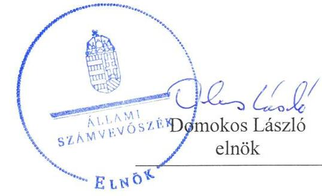
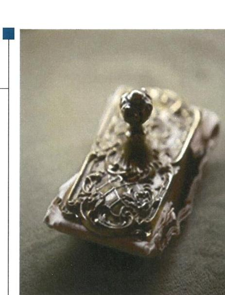
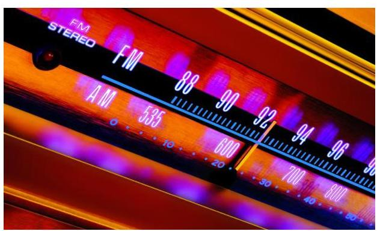

# Jelentés 

## A Nemzeti Média- és Hírközlési Hatóság ellenőrzése

2019.

---

# Jelențtés 

## A Nemzeti Média- és Hírközlési Hatóság ellenőrzése

2019. 05. hó 15. nap

---

# AZ ELLENŐRZÉST FELÜGYELTE: 

DR. NAGY IMRE felügyeleti vezető

## AZ ELLENŐRZÉST VEZETTE ÉS A VÉGREHAJTÁSÁÉRT FELELŐS:

ÓDOR ZOLTÁN TAMÁS ellenőrzésvezető

## A PROGRAM ÖSSZEÁLLÍTÁSÁÉRT FELELŐS:

TÓTPÁL SZABOLCS osztályvezető

## A TÉMÁHOZ KAPCSOLÓDÓ KORÁBBI SZÁMVEVŐSZÉKI JELENTÉSEK:

- címe: Jelentés a közszolgálati média- és hírszolgáltatás új szervezeti, finanszírozási és kontrollrendszere kialakításának és müködésének ellenőrzéséről
- sorszáma: 13192

IKTATÓSZÁM: EL-0573-003/2019.
TÉMASZÁM: 2477
ELLENŐRZÉS-AZONOSÍTÓ SZÁM: V0821

---

# TARTALOMJEGYZÉK 

■ ÖSSZEGZÉS ..... 5
■ AZ ELLENŐRZÉS CÉLJA ..... 6
■ AZ ELLENŐRZÉS TERÜLETE ..... 7
■ AZ ELLENŐRZÉS HÁTTERE, INDOKOLTSÁGA ..... 8
■ A JELENTÉS LÉNYEGES KÉRDÉSKÖREI ..... 9
■ AZ ELLENŐRZÉS HATÓKÖRE ÉS MÓDSZEREI ..... 10
■ MEGÁLLAPÍTÁSOK ..... 12
■ MELLÉKLETEK ..... 15
I. sz. melléklet: Értelmező szótár ..... 15
■ FÜGGELÉK: ÉSZREVÉTELEK ..... 19
■ RÖVIDÍTÉSEK JEGYZÉKE ..... 21

---

.

---

# ÖSSZEGZÉS 

A Nemzeti Média- és Hírközlési Hatóság gazdálkodása jó gyakorlatot mutatott.
Belső kontrollrendszerének kialakítása és müködtetése biztositotta az átlátható és elszámoltatható közpénzfelhasználás feltételeit. A pénzügyi és vagyongazdálkodás szabályszerüsége támogatta az átlátható közpénzfelhasználást és a közvagyon megóvását. Az integritás kontrollrendszert a kockázatokkal arányosan épitették ki, érvényesült az integritás szemlélet.

## Az ellenőrzés társadalmi indokoltsága

A törvényi szabályozás alapján autonómiával rendelkező szervekre vonatkozó működési és gazdálkodási szabályok nagyfokú függetlenséget biztosítanak. Ebbe a körbe tartozik az Nemzeti Média- és Hírközlési Hatóság, az NMHH jogállása szerint önálló szabályozó szerv, amely kizárólag a törvénynek van alárendelve. Az Állami Számvevőszék fontosnak tartja az adott intézmények autonómiáját, ellenőrzésével ráirányítja a figyelmet ezen szervezetek müködésére, gazdálkodására. Az Állami Számvevőszék jelen ellenőrzését indokolta az NMHH által ellátott közfeladat jelentősége, továbbá, hogy a kormányzati szektor elszámolásaiban megjelenő gazdálkodó szervezetek kapcsán kiemelten fontos, hogy azok müködése, gazdálkodása szabályszerű, az általuk szolgáltatott adatok megbízhatóak legyenek.

## Főbb megállapítások, következtetések

A Nemzeti Média- és Hírközlési Hatóságnál kontrollkörnyezet kialakítása szabályszerű volt. Felmérték a tevékenységben, gazdálkodásban rejlő kockázatokat, kialakítottak és müködtettek kockázatkezelési rendszert. A kontrolltevékenységek gyakorlása összhangban volt a vonatkozó jogszabályokkal. A Nemzeti Média- és Hírközlési Hatóság Elnöke szabályszerűen alakította ki a szervezet információs-kommunikációs rendszerét, ezáltal biztosította, hogy a szükséges információk maradéktalanul, időben eljussanak az illetékes szervezethez, szervezeti egységhez, személyhez. A tevékenységének, a célok meg valósításának eseti és folyamatos nyomon követését biztosító rendszert kialakították, az operatív tevékenységektől független belső ellenőrzés tevékenysége szabályszerű volt.

A Nemzeti Média- és Hírközlési Hatóság pénzügyi és vagyongazdálkodása szabályszerű volt. A bevételek beszedése és elszámolása a kiadási előirányzatok felhasználása, pénzgazdálkodási jogkörök gyakorlása jogszabályi előírásoknak szerint történtek. Előirányzat-maradvány megállapítása szabályszerű volt. Éves költségvetési beszámolóinak mérlegtételeit szabályos leltárral támasztotta alá.

Az integritás kontrollrendszert a kockázatokkal arányosan építették ki és működtették.

---

# AZ ELLENŐRZÉS CÉLJA 

AZ ELLENŐRZÉS CÉLJA annak értékelése volt, hogy a Nemzeti Média- és Hírközlési Hatóságnál (NMHH) a belső kontrollrendszer kialakítása és múködtetése, valamint az NMHH pénzügyi és vagyongazdálkodása megfelelt-e a jogszabályi előírásoknak és belső szabályzatainak. Az ellenőrzés keretében értékeltük az NMHH korrupciós kockázatainak kezelését szolgáló integritás kontrollok kiépítettségét és az integritás szemlélet érvényesülését.

---

# **A2 ELLENŐRZÉS TERÜLETE**

## **Nemzeti Média- és Hírközlési Hatóság**

Az NMHH¹-t az Eht.² 9. §-a hozta létre 2010. augusztus 11-i hatállyal autonóm államigazgatási szervként, melynek közvetlen jogelődje az NHH³ volt.

Az NMHH a Ksztv.⁴ 1. § (3) bekezdés a) pont és az Mttv. ⁵ 109. § (1) bekezdés hatályos rendelkezései alapján önálló szabályozó szerv, kizárólag a törvénynek van alárendelve. Az NMHH a költségvetési szervek gazdálkodására vonatkozó jogszabályok megfelelő alkalmazásával gazdálkodik, állami vagyon kezelésére a központi költségvetési szervekre vonatkozó jogszabályi rendelkezések szerint jogosult, feladatai ellátásával összefüggő kiadásokat saját bevételéből és költségvetési hozzájárulásból fedezi.

Az Mttv. 109. § (5) bekezdése alapján az NMHH feladata - különösen - a hírközlési piac zavartalan, eredményes működésének és fejlődésének, a hírközlési tevékenységet végzők és a felhasználók érdekei védelmének, továbbá a tisztességes, hatékony verseny kialakulásának, illetve fenntartásának elősegítése az elektronikus hírközlési ágazatban, valamint a hírközlési tevékenységet végző szervezetek és személyek jogszabályok szerinti magatartásának felügyelete.

Az Mttv. 109. § (3) bekezdése alapján az NMHH önálló hatáskörrel rendelkező szervei az NMHH Elnöke, az NMHH Médiatanácsa és az NMHH Hivatala. Az NMHH Hivatalának élén az NMHH Elnöke által kinevezett főigazgató áll. Az ellenőrzött időszakban az Elnök személye, illetve a főigazgató személye nem változott. A Médiatanács az NMHH egységes költségvetésén belül a 135. § szerinti gazdálkodási autonómiával rendelkezik. Az NMHH ellenőrzése a Médiatanácsra nem terjedt ki.

Az NMHH gazdálkodási adatait az alábbi táblázat mutatja be.

1. táblázat

|  AZ NMHH FŐBB GAZDÁLKODÁSI ADATAI (E FT) |  |  |   |
| --- | --- | --- | --- |
|  Teljesítés (M Ft) | 2015. | 2016. | 2017.  |
|  Költségvetési bevételek | 32 749,4 | 33 372,1 | 36 257,8  |
|  - ebből közhatalmi bevételek | 24 058,8 | 24 754,1 | 27 393,3  |
|  Költségvetési kiadások | 31 987,9 | 29 300,5 | 32 665,1  |

*Forrás: Az NMHH 2015-2017. évi egységes költségvetésének végrehajtásáról szóló törvények*

---

# AZ ELLENŐRZÉS HÁTTERE, INDOKOLTSÁGA 

Az NMHH jogállása szerint önálló szabályozó szerv, amely kizárólag a törvénynek van alárendelve. A 2011. január 1-jétől hatályos a médiaszolgáltatásokról és tömegkommunikációról szóló 2010. évi CLXXXV. törvény (Mttv.) szabályozza az NMHH múködését, gazdálkodását. Az Mttv. szerint az NMHH a költségvetési szervek gazdálkodására vonatkozó jogszabályok megfelelő alkalmazásával gazdálkodik. Emellett az állami vagyon kezelésére a központi költségvetési szervekre irányadó jogszabályi rendelkezések szerint jogosult, múködési kiadásait feladatai ellátásával összefüggő saját bevételéből és költségvetési hozzájárulásból fedezi. Az ellenőrzést indokolja a médiaszolgáltatás kiemelkedő kulturális, társadalmi, gazdasági jelentősége, továbbá az, hogy az NMHH élt-e jogával és megalkotta-e belső szabályozásait. Az ellenőrzés során választ kapunk arra, hogy az NMHH a belső szabályozottsága kialakításával megteremtette-e a szabályszerű és elszámoltatható gazdálkodása alapjait.

---

# A JELENTÉS LÉNYEGES KÉRDÉSKÖREI 

1. Az NMHH-nál a belső kontrollrendszer kialakítása és müködtetése biztositotta-e a közpénzekkel és a nemzeti vagyonnal történő átlátható, szabályszerű gazdálkodást?
2. Az NMHH pénzügyi és vagyongazdálkodása szabályszerű volt-e?
3. Az NMHH-nál érvényesült-e az integritás szemlélet és ennek megfelelően kiépítették-e az integritás kontrollrendszerét?

---

# AZ ELLENŐRZÉS HATÓKÖRE ÉS MÓDSZEREI 

## Az ellenőrzés típusa

Megfelelőségi ellenőrzés.

## Az ellenőrzött időszak

Az ellenőrzött időszak 2015. január 1-jétől 2017. december 31-ig tartott.

## Az ellenőrzés tárgya

Az NMHH belső kontrollrendszerének kialakítása és működtetése. Az NMHH pénzügyi és vagyongazdálkodása. Az NMHH-nál az integritáskontrollok kiépítettsége, az integritás szemlélet érvényesülése.

## Az ellenőrzött szervezet

NMHH, az NMHH Elnöke, valamint az NMHH Hivatala.

## Az ellenőrzés jogalapja

Az ellenőrzés jogszabályi alapját az ÁSZ tv. 1. § (3) bekezdésének és 5. § (3)-(4) bekezdéseinek előírásai képezik.

## Az ellenőrzés módszerei

Az ÁSZ az ellenőrzést a szakmai program szempontjai, az ellenőrzött időszakban hatályos jogszabályok, az ellenőrzés szakmai szabályai, a jelen ellenőrzésre irányadó ÁSZ módszertanok figyelembevételével végezte.

Az ellenőrzés ideje alatt az ellenőrzött szervezettel történő kapcsolattartás az ÁSZ SZMSZ-ének vonatkozó előírásai alapján történt.

Az ellenőrzési kérdések megválaszolásához szükséges bizonyítékok megszerzése az ellenőrzött által rendelkezésre bocsátott dokumentumokra, adatokra alapozva megfigyelés, szemle (szemrevételezés), kérdésfeltevés (információkérés), mintavételezés, valamint elemző eljárás útján történt.

A kiadások és a bevételek ellenőrzésére a 2015-2017 év vonatkozásában került sor. A Kiadások (külső személyi juttatások, felhalmozási kiadások, dologi kiadások) és Bevételek (értékesítésből és bérbeadásból szár-

---

mazó bevételek) esetében az ellenőrzés azokra a legnagyobb értékű tételekre - a lényeges sokaságra - terjedt ki, melyek összértéke eléri a teljes sokaság összértékének 50\%-át.

A 2017. évi bevételek esetében a lényeges sokaság tételesen került ellenőrzésre.

A 2015-2017. évi kiadások és a 2015-2016. évi bevételek elszámolásának szabályszerűségének ellenőrzése a lényeges sokaságból véletlen mintavételi eljárással kiválasztott tételek alapján történt.

A mintavétellel ellenőrzött területek esetében minden egyes tétel vonatkozásában a felhasználás, elszámolás és értékelés szabályszerűségére vonatkozó kérdések lettek feltéve. Szabályszerűnek lett értékelve egy ellenőrzött területet, amennyiben 95\%-os bizonyossággal az ellenőrzött sokaságban az átlagos hibaarány legfeljebb 10\%, nem szabályszerűnek, amennyiben 10\%-nál magasabb arányt képviselt."

Abban az esetben, ha az ellenőrzött sokaság tekintetében a 10\%-os hibaarányhoz való viszony megítélésnek megbízhatósága nem érte el a 95\%ot, annak elérése érdekében az értékelés további szempontokkal kerültek kiegészítésre, a feltárt hibák értékének figyelembe vételével.

Az ellenőrzési bizonyítékként felhasználható adatforrások közé tartoztak egyrészt a szakmai program részletes szempontjainál felsorolt adatforrások, másrészt minden egyéb - az ellenőrzés folyamán feltárt, az ellenőrzés szempontjából információt tartalmazó - dokumentum.

Az ellenőrzés lefolytatásához az ellenőrzött szervezet a tanúsítványok kitöltésével, valamint az ÁSZ által kért dokumentumok megküldésével szolgáltatott adatokat.

Az integritás szemlélet érvényesülésének értékelése az intézmény önbevallás útján kitöltött tanúsítványa keretében, valamint a kapcsolódó dokumentumok alapján történt.

---

# 1. Az NMHH-nál a belső kontrollrendszer kialakítása és múködtetése biztosította-e a közpénzekkel és a nemzeti vagyonnal történő átlátható, szabályszerű gazdálkodást? 

Összegző megállapítás

Az NMHH-nál a belső kontrollrendszer kialakítása és múködtetése biztosította a szabályszerű gazdálkodást.

Az NMHH Áht. ${ }^{6}$ előírásai alapján rendelkezett alapító okirattal valamint az NMHH szervezetének múködésére vonatkozó részletes szabályokat tartalmazó SZMSZ ${ }_{1-7}$-szel ${ }^{7}$.

Az NMHH a Számv. tv. előírásaival összhangban elkészítette Számviteli politika ${ }_{1-4}$-t és annak keretében kötelezően elkészítendő szabályzatokat, Leltár szabályzat ${ }_{1-2}$-ot ${ }^{8}$, Értékelési szabályzat ${ }_{1-3}$-tot ${ }^{9}$ és Pénzkezelési szabály-zat ${ }_{1-2}$-ot ${ }^{10}$.

Az NMHH a gazdálkodás részletes rendjét Kötelezettségvállalási szabályzat ${ }^{11}$-ban, gazdálkodással összefüggő feladatait Gazdasági Ügyrend ${ }^{12}$ ben szabályozta.

Az NMHH Elnöke a Kockázatkezelési szabályzat ${ }_{1-2}{ }^{11}$-ban meghatározta az integrált kockázatkezelési rendszer múködtetésének feltételeit, szabályozta az integrált kockázatkezelés eljárásrendjét.

Az NMHH Elnöke felmérte és megállapította a szervezet tevékenységében rejlő és a szervezeti célokkal összefüggő kockázatokat, meghatározta az egyes kockázatokkal kapcsolatban szükséges intézkedéseket, valamint azok teljesítésének folyamatos nyomon követésének módját.

Az NMHH az Info. tv. ${ }^{14}$ alapján, a Szerződések közzététele szabályzat ${ }^{15}$, az Ügyfél tájékoztatás rendje szabályzat ${ }_{1-2}{ }^{16}$ rendelkezéseivel összhangban szabályozta a kötelezően közzéteendő adatok nyilvánosságra hozatalának, illetve a közérdekú adatok kezelésére és megismerésére irányuló igények teljesítésének rendjét. Az Adatvédelmi szabályzat ${ }_{1-2}{ }^{17}$-ban rögzítette az adatok védelmével, megőrzésével kapcsolatos feladatokat, a felelősségi és jogosultsági szabályokat.

Az NMHH Elnöke kialakította és múködtette a szervezet tevékenységének, a célok megvalósításának folyamatos és eseti nyomon követését biztosító rendszerét és a belső ellenőrzést.

---

# 2. Az NMHH pénzügyi és vagyongazdálkodása szabályszerű volt-e? 

## Összegző megállapítás Az NMHH pénzügyi és vagyongazdálkodása szabályszerű volt.

Az NMHH bevételeinek elszámolása és a kiadási előirányzatainak felhasználása, a gazdálkodási jogkörök gyakorlása szabályszerű volt.

Az NMHH éves költségvetési beszámolói tartalmazták a részletező nyilvántartással alátámasztott szabályos maradvány-kimutatást. Az NMHH tevékenységéről szóló a beszámolók benyújtása az OGY ${ }^{18}$-felé megtörtént az Mttv.-ben rögzített határidőig.

Az NMHH főkönyvi és analitikus nyilvántartásai szabályosan tartalmazták a vagyonkezelésében lévő eszközöket. A mérlegben szereplő eszközök és források év végi értékelését, az immateriális javak, tárgyi eszközök bekerülési értékének meghatározását az Értékelési szabályzat ${ }_{1-3}{ }^{19}$-ban foglaltak szerint elvégezték.

Az éves költségvetési beszámoló elkészítéséhez, Számv. tv., a Leltározási szabályzat ${ }_{1,2}$ alapján a mérleg tételeinek alátámasztásához az előírt leltárt összeállították.

Az NMHH a beruházási és felújítási tevékenysége során betartotta a törvényi és a Beszerzési szabályzatban ${ }_{1-5}{ }^{20}$, és a Gazdálkodási szabályzatban ${ }_{1-3}{ }^{21}$ foglalt előírásokat.

## 3. Az NMHH-nál érvényesült-e az integritás szemlélet és ennek megfelelően kiépítették-e az integritás kontrollrendszerét?

## Összegző megállapítás Az NMHH a kockázatokkal arányosan építette ki az integritás kontrollrendszert.

Az NMHH-nál az integritás szemlélet érvényesült. A rendszeresen végzett kockázatelemzés támogatta a kötelező és célszerű kontrollok kiépítettségét és múködtetését.

---

.

---

# MELLÉKLETEK 

- I. SZ. MELLÉKLET: ÉRTELMEZŐ SZÓTÁR
állami vagyon
állami vagyonnak minősül:
a) az állam tulajdonában lévő dolog, valamint a dolog módjára hasznosítható természeti erő,
b) az a) pont hatálya alá nem tartozó mindazon vagyon, amely vonatkozásában törvény az állam kizárólagos tulajdonjogát nevesíti,
c) az állam tulajdonában lévő tagsági jogviszonyt megtestesítő értékpapír, illetve az államot megillető egyéb társasági részesedés,
d) az államot megillető olyan immateriális, vagyoni értékkel rendelkező jogosultság, amelyet jogszabály vagyoni értékű jogként nevesít,
e) az állam tulajdonában lévő pénzügyi eszközök. (Forrás: Vtv. 1. § (2) bekezdése)
állami vagyon értékesítése
állami vagyon használója
állami vagyon hasznosítása
állami vagyon hasznosítására kötött szerződés
állami vagyon kezelője /vagyonkezelő
belső ellenőrzés
belső kontrollrendszer

Állami vagyonnak minősül:
a) az állam tulajdonában lévő dolog, valamint a dolog módjára hasznosítható természeti erő,
b) az a) pont hatálya alá nem tartozó mindazon vagyon, amely vonatkozásában törvény az állam kizárólagos tulajdonjogát nevesíti,
c) az állam tulajdonában lévő tagsági jogviszonyt megtestesítő értékpapír, illetve az államot megillető egyéb társasági részesedés,
d) az államot megillető olyan immateriális, vagyoni értékkel rendelkező jogosultság, amelyet jogszabály vagyoni értékű jogként nevesít,
e) az állam tulajdonában lévő pénzügyi eszközök. (Forrás: Vtv. 1. § (2) bekezdése)
Állami vagyon tulajdonjogának bármely jogcímen történő, visszterhes átruházása. (Forrás: Vtvr. 1. § (7) bekezdés d) pontja)
Az a természetes vagy jogi személy, jogi személyiséggel nem rendelkező szervezet, aki, vagy amely törvény vagy szerződés alapján, bármely jogcímen (bérlet, haszonbérlet, használat stb.) állami vagyont birtokol, használ, szedi annak hasznait, hasznosít, ide nem értve a haszonélvezőt, a b) pont szerinti vagyonkezelőt és a c) pont szerinti tulajdonosi jogok gyakorlóját". (Forrás: Vtvr. 1. § (7) bekezdés a) pontja)
Az állami vagyonnal a tulajdonosi joggyakorló maga gazdálkodik, vagy szerződés - így különösen bérlet, haszonbérlet, megbízás - alapján hasznosításra átengedi, illetőleg vagyonkezelésbe, haszonélvezetbe adja. (Forrás: Vtv. 23. § (1) bekezdése, hatályos 2013. június 28-ától)
Az állami vagyon hasznosítására kötött szerződések elsődleges célja az állami vagyon hatékony működtetése, állagának védelme, értékének megőrzése, illetve gyarapítása, az állami és közfeladatok ellátásának elősegítése. (Forrás: Vtv. 23. § (2) bekezdése)
Az állami vagyonra vonatkozóan a tulajdonosi joggyakorló kizárólag az Nvtv.-ben meghatározott személyekkel köthet vagyonkezelési szerződést. (Forrás: Vtv. 27. § (1) bekezdése, hatályos 2013. június 28-tól)
Az Nvtv.-ben vagyonkezelőként meghatározott azon személy, amellyel az állami vagyon kezelésére az MNV Zrt., valamint annak jogelődje, vagy az állami vagyon tulajdonosi joggyakorlója vagyonkezelési szerződést kötött, továbbá, akit törvény vagyonkezelőnek kijelöl. (Forrás: Vtvr. 1. § (7) bekezdés b) pontja, hatályos: 2014. március 15 -től)
Független, tárgyilagos bizonyosságot adó és tanácsadó tevékenység, amelynek célja, hogy az ellenőrzött szervezet működését fejlessze és eredményességét növelje, az ellenőrzött szervezet céljai elérése érdekében rendszerszemléletű megközelítéssel és módszeresen értékeli, illetve fejleszti az ellenőrzött szervezet irányítási és belső kontrollrendszerének hatékonyságát. (Forrás: Bkr. 2. § b) pontja)
A belső kontrollrendszer a kockázatok kezelése és tárgyilagos bizonyosság megszerzése érdekében kialakított folyamatrendszer, amely azt a célt szolgálja, hogy a müködés és gazdálkodás során a tevékenységeket szabályszerűen, gazdaságosan, hatékonyan, eredményesen hajtsák végre, az elszámolási kötelezettségeket teljesítsék, megvédjék az erőforrásokat a veszteségektől, károktól és nem rendeltetésszerű használattól. (Forrás: Áht. 69. § (1) bekezdése)

---

belső kontrollrendszer területei
beruházás
felújítás
hasznosítás
információs és kommunikációs rendszer
integritás
integrált kockázatkezelési rendszer
kockázat

A kontrollkörnyezet, a (z integrált) kockázatkezelési rendszer, a kontrolltevékenységek, az információs és kommunikációs rendszer, valamint a nyomon követési (monitoring) rendszer. (Forrás: Bkr. 3. §-a, 2016. október 1-jétől integrált kockázatkezelési rendszer)
A tárgyi eszköz beszerzése, létesítése, saját vállalkozásban történő előállítása, a beszerzett tárgyi eszköz üzembe helyezése, rendeltetésszerű használatbavétele érdekében az üzembe helyezésig, a rendeltetésszerű használatbavételig végzett tevékenység (szállítás, vámkezelés, közvetítés, alapozás, üzembe helyezés, továbbá mindaz a tevékenység, amely a tárgyi eszköz beszerzéséhez hozzákapcsolható, ideértve a tervezést, az előkészítést, a lebonyolítást, a hiteligénybevételt, a biztosítást is); beruházás a meglévő tárgyi eszköz bővítését, rendeltetésének megváltoztatását, átalakítását, élettartamának, teljesítőképességének közvetlen növelését eredményező tevékenység is, az előbbiekben felsorolt, e tevékenységhez hozzákapcsolható egyéb tevékenységekkel együtt. (Forrás: Számv. tv. 3. § (4) bekezdés 7. pontja)
Az elhasználódott tárgyi eszköz eredeti állaga (kapacitása, pontossága) helyreállítását szolgáló, időszakonként visszatérő olyan tevékenység, amely mindenképpen azzal jár, hogy az adott eszköz élettartama megnövekszik, eredeti műszaki állapota, teljesítőképessége megközelítően vagy teljesen visszaáll, az előállított termékek minősége vagy az adott eszköz használata jelentősen javul és így a felújítás pótlólagos ráfordításából a jövőben gazdasági előnyök származnak; felújítás a korszerűsítés is, ha az a korszerű technika alkalmazásával a tárgyi eszköz egyes részeinek az eredetitől eltérő megoldásával vagy kicserélésével a tárgyi eszköz üzembiztonságát, teljesítőképességét, használhatóságát vagy gazdaságosságát növeli; a tárgyi eszközt akkor kell felújítani, amikor a folyamatosan, rendszeresen elvégzett karbantartás mellett a tárgyi eszköz oly mértékben elhasználódott (szerkezeti elemei elöregedtek), amely elhasználódottság már a rendeltetésszerű használatot veszélyezteti; nem felújítás az elmaradt és felhalmozódó karbantartás egyidőben való elvégzése, függetlenül a költségek nagyságától. (Forrás: Számv. tv. 3. § (4) bekezdés 8. pontja)
A tulajdonosi joggyakorló vagy a nemzeti vagyon használója által a nemzeti vagyon birtoklásának, használatának, hasznok szedése jogának bármely - a tulajdonjog átruházását nem eredményező - jogcímen történő átengedése, ide nem értve a vagyonkezelésbe adást, valamint a haszonélvezeti jog alapítását. (Forrás: Nvtv. 3. § (1) bekezdés 4. pontja)
A költségvetési szerv vezetője által kialakított és működtetett olyan rendszer, mely biztosítja, hogy a megfelelő információk a megfelelő időben eljutnak az illetékes szervezethez, szervezeti egységhez, illetve személyhez. (Forrás: Bkr. 9. § (1) bekezdés)
Az integritás az elvek, értékek, cselekvések, módszerek, intézkedések konzisztenciáját jelenti, vagyis olyan magatartásmódot, amely meghatározott értékeknek megfelel. (Forrás: Nemzetgazdasági Minisztérium: Magyarországi államháztartási belső kontroll standardok Útmutató 1.6.1. pontja, 2012. december)
Olyan folyamatalapú kockázatkezelési rendszer, amely a szervezet minden tevékenységére kiterjed, egységes módszertan és eljárások alkalmazásával, a szervezet célkitűzéseinek és értékeinek figyelembevételével biztosítja a szervezet kockázatainak teljes körű azonosítását, azok meghatározott kritériumok szerinti értékelését, valamint a kockázatok kezelésére vonatkozó intézkedési terv elkészítését és az abban foglaltak nyomon követését. (Forrás: Bkr. 2. § m) pontja, 2016. október 1-jétől)
A kockázat annak a valószínűségét jelenti, hogy egy vagy több esemény vagy intézkedés nem kívánt módon befolyásolja a rendszer múködését, céljainak megvalósulását. (Forrás: Javaslatok a korrupciós kockázatok kezelésére - Kockázatkezelési és ellenőrzési módszertan 35. oldal, ÁSZ)

---

kockázatkezelési rendszer

kontrollkörnyezet
kontrolltevékenységek
kommunikáció
közfeladat
monitoring
monitoring-rendszer
tulajdonosi joggyakorló
vagyongazdálkodás

Olyan irányítási eszközök és módszerek összessége, melynek elemei a szervezeti célok elérését veszélyeztető tényezők (kockázatok) azonosítása, elemzése, csoportosítása, nyomon követése, valamint szükség esetén a kockázati kitettség mérséklése.(Forrás: Bkr. 2. § m) pontja)
A költségvetési szerv vezetője által kialakított kontrollkörnyezetben világos a szervezeti struktúra, a folyamatok átláthatóak, egyértelműek a felelősségi, hatásköri viszonyok és feladatok, meghatározottak, ismertek és elfogadottak az etikai elvárások a szervezet minden szintjén, átlátható a humánerőforrás-kezelés, biztosított a szervezeti célok és értékek irányában való elkötelezettség fejlesztése és elősegítése. (Forrás: Bkr. 6. § (1) bekezdés, hatályos: 2016. október 1-jétől)
A költségvetési szerv vezetője által a szervezeten belül kialakított (kontroll) tevékenységek, melyek biztosítják a kockázatok kezelését, hozzájárulnak a szervezet céljainak eléréséhez és erősítik a szervezet integritását. (Forrás: Bkr. 8. § (1) bekezdés, hatályos: 2016. október 1-jétől)
Az a tevékenység, melynek során információ továbbítása valósul meg. A kommunikációs folyamat résztvevői között tájékoztatás történik, mely során tényeket, ezek magyarázatát közlik.
Jogszabályban meghatározott állami vagy önkormányzati feladat, amit az arra kötelezett közérdekből, a jogszabályban meghatározott követelményeknek és feltételeknek megfelelve végez, ideértve a lakosság közszolgáltatásokkal való ellátását, továbbá az állam nemzetközi szerződésekben vállalt kötelezettségeiből adódó közérdekű feladatokat, valamint e feladatok ellátásakor szükséges infrastruktúra biztosítását is. (Forrás: Nvtv. 3. § (1) bekezdés 7. pontja, hatályos: 2014. december 31-ig)
A monitoring általánosságban a különböző szintű szervezeti célok megvalósításának folyamatát kíséri figyelemmel, melynek során a releváns eseményekről és tevékenységekről (együtt: folyamatokról) rendszeres jelleggel, strukturált, döntéstámogató információkhoz jutnak a szervezet vezetői. (Forrás: NGM Útmutató a költségvetési szervek monitoring rendszeréhez 2011. november)
A költségvetési szerv vezetője köteles kialakítani a szervezet tevékenységének a célok megvalósításának nyomon követését biztosító rendszert, amely az operatív tevékenységek keretében megvalósuló folyamatos és eseti nyomon követésből, valamint az operatív tevékenységektől függetlenül múködő belső ellenőrzésből állhat. (Forrás: Bkr. 10. §, hatályos: 2016. október 1-jétől)
Aki a nemzeti vagyon felett az államot vagy a helyi önkormányzatot megillető tulajdonosi jogok és kötelezettségek összességének gyakorlására jogosult. (Forrás: Nvtv. 3. § (1) bekezdés 17. pontja)

A nemzeti vagyongazdálkodás feladata a nemzeti vagyon rendeltetésének megfelelő, az állam, az önkormányzat mindenkori teherbíró képességéhez igazodó, elsődlegesen a közfeladatok ellátásához és a mindenkori társadalmi szükségletek kielégítéséhez szükséges, egységes elveken alapuló, átlátható, hatékony és költségtakarékos múködtetése, értékének megőrzése, állagának védelme, értéknövelő használata, hasznosítása, gyarapítása, továbbá az állam vagy a helyi önkormányzat feladatának ellátása szempontjából feleslegessé váló vagyontárgyak elidegenítése. (Forrás: Nvtv. 7. § (2) bekezdése)

---

.

---

# FÜGGELÉK: ÉSZREVÉTELEK 

A jelentéstervezetet a Számvevőszék 15 napos észrevételezésre megküldte az ellenőrzött szervezet vezetőjének az ÁSZ tv. 29. §* (1) bekezdése előírásának megfelelően.

A jelentéstervezetre a Nemzeti Média-és Hírközlési Hatóság elnöke az ÁSZ tv. 29. § (2) bekezdésében foglalt határidőn belül nemleges észrevételt tett.

A Nemzeti Média-és Hírközlési Hatóság Hivatalának föigazgatója az ÁSZ tv. 29.§ (2) bekezdésben foglalt észrevételezési jogával nem élt, a jelentéstervezetre észrevételt nem tett.

[^0]
[^0]:    * 29. § (1) Az Állami Számvevőszék az ellenőrzési megállapításait megküldi az ellenőrzött szervezet vezetőjének vagy az általa megbízott személynek, és annak, akinek személyes felelősségét állapította meg.
    (2) Az ellenőrzött szervezet vezetője és a felelősként megjelölt személy az ellenőrzés megállapításaira tizenöt napon belül írásban észrevételt tehet.
    (3) Az Állami Számvevőszék az észrevételre a beérkezésétől számított harminc napon belül írásban válaszol. A figyelembe nem vett észrevételeket köteles a jelentésben feltüntetni, és megindokolni, hogy azokat miért nem fogadta el.

---

.

---

# RÖVIDÍTÉSEK JEGYZÉKE 

${ }^{1}$ NMHH
${ }^{2}$ Eht.
${ }^{3} \mathrm{NHH}$
${ }^{4}$ Ksztv.
${ }^{5}$ Mttv.
${ }^{6}$ Áht.
${ }^{7}$ SZMSZ ${ }_{1}$

SZMSZ ${ }_{2}$
SZMSZ ${ }_{3}$
SZMSZ ${ }_{4}$
SZMSZ ${ }_{5}$
SZMSZ ${ }_{6}$
SZMSZ ${ }_{7}$
${ }^{8}$ Leltározási szabályzat ${ }_{1}$
Leltározási szabályzat ${ }_{2}$
${ }^{9}$ Értékelési szabályzat ${ }_{1}$
Értékelési szabályzat ${ }_{2}$
Értékelési szabályzat ${ }_{3}$
${ }^{10}$ Pénzkezelési szabályzat ${ }_{1}$
Pénzkezelési szabályzat ${ }_{2}$
${ }^{11}$ Kötelezettségvállalási szabályzat ${ }_{1}$

Kötelezettségvállalási szabályzat ${ }_{2}$

Kötelezettségvállalási szabályzat ${ }_{3}$

Nemzeti Média- és Hírközlési Hatóság
2003. évi C. törvény az elektronikus hírközlésről (hatályos: 2003.11.27-től)

Nemzeti Hírközlési Hatóság
2010. évi XLIII. törvény a központi államigazgatási szervekről, valamint a Kormány tagjai és az államtitkárok jogállásáról (hatályos: 2010.05.29-től)
2010. évi CLXXXV. törvény a médiaszolgáltatásokról és a tömegkommunikációról (hatályos: 2011.01.01-jétől)
2011. évi CXCV. törvény az államháztartásról

17/2014. számú Elnöki Utasítás a Nemzeti Média- és Hírközlési Hatóság Szervezeti és Múködési Szabályzatáról (hatályos: 2014.10.15. - 2015.02.28.)
6/2015. számú Elnöki Utasítás a Nemzeti Média- és Hírközlési Hatóság Szervezeti és Múködési Szabályzatáról (hatályos: 2015.03.01 - 2015.04.30.)
11/2015. számú Elnöki Utasítás a Nemzeti Média- és Hírközlési Hatóság Szervezeti és Múködési Szabályzatáról (hatályos: 2015.05.01. - 2015.09.30.)
22/2015. számú Elnöki Utasítás a Nemzeti Média- és Hírközlési Hatóság Szervezeti és Múködési Szabályzatáról (hatályos: 2015.10.01. - 2016.02.29.)
8/2016. számú Elnöki Utasítás a Nemzeti Média- és Hírközlési Hatóság Szervezeti és Múködési Szabályzatáról (hatályos: 2016.03.01. - 2016.12.31.)
1/2017. számú Elnöki Utasítás a- Nemzeti Média- és Hírközlési Hatóság Szervezeti és Múködési Szabályzatáról (hatályos: 2017.01.01. - 2017.10.31.)
25/2017. számú Elnöki Utasítás a Nemzeti Média- és Hírközlési Hatóság Szervezeti és Múködési Szabályzatáról (hatályos: 2017.11.01. - 2018.06.30.)
28/2012. számú Elnöki Utasítás a leltározás szabályozásáról (hatályos: 2012.10.10 - 2015.08.09.)
19/2015. számú Elnöki Utasítással kiadott az Eszközök és források leltározási és leltárkészítési szabályzata (hatályos: 2015.08.10-től)
3/2015. számú Elnöki Utasítás a Nemzeti Média- és Hírközlési Hatóság Eszközök és források értékelési szabályzatáról (hatályos: 2015.01.30 - 2016.01.31.)
4/2016. számú Elnöki Utasítás a Nemzeti Média- és Hírközlési Hatóság Eszközök és források értékelési szabályzatáról (hatályos: 2016.02.01 - 2017.01.03.)
3/2017. számú Elnöki Utasítás a Nemzeti Média- és Hírközlési Hatóság Eszközök és források értékelési szabályzatáról (hatályos: 2017.01.04-től)
25/2013. számú Elnöki Utasítás a Nemzeti Média- és Hírközlési Hatóság pénzkezeléséről (hatályos: 2013.10.15 - 2017.01.03.)
2/2017. számú Elnöki Utasítás a Nemzeti Média- és Hírközlési Hatóság pénzkezeléséről (hatályos: 2017.01.04-től)
19/2014. számú Elnöki Utasítás a Nemzeti Média- és Hírközlési Hatóság kiadmányozási, kötelezettségvállalási, érvényesítési, utalványozási, ellenjegyzési jogköreiről, és a teljesítés igazolás rendjéről (hatályos: 2014.12.11. - 2016.05.24.)
13/2016. számú Elnöki Utasítás a Nemzeti Média- és Hírközlési Hatóság kiadmányozási, kötelezettségvállalási, érvényesítési, utalványozási, ellenjegyzési jogköreiről, és a teljesítés igazolás rendjéről (hatályos: 2016.05.24. - 2017.06.29.)
20/2017. számú Elnöki Utasítás a Nemzeti Média- és Hírközlési Hatóság kiadmányozási, kötelezettségvállalási, érvényesítési, utalványozási, ellenjegyzési jogköreiről, és a teljesítés igazolás rendjéről (hatályos: 2017.06.29. - 2016.05.24.)

---

${ }^{12}$ Gazdasági Úgyrend
${ }^{13}$ Kockázatkezelési szabályzat ${ }_{1}$

Kockázatkezelési szabályzat ${ }_{2}$
${ }^{14}$ Info tv.
${ }^{15}$ Szerződések közzététele szabályzat
${ }^{16}$ Ügyfél-tájékoztatás rendje szabályzat ${ }_{1}$

Ügyfél-tájékoztatás rendje szabályzat ${ }_{2}$
${ }^{17}$ Adatvédelmi szabályzat ${ }_{1}$

Adatvédelmi szabályzat ${ }_{2}$
${ }^{18}$ OGY
${ }^{19}$ Értékelési szabályzat ${ }_{1}$

Értékelési szabályzat ${ }_{2}$
Értékelési szabályzat ${ }_{3}$
${ }^{20}$ Beszerzési szabályzat ${ }_{1}$

Beszerzési szabályzat ${ }_{2}$
Beszerzési szabályzat ${ }_{3}$
Beszerzési szabályzat ${ }_{4}$
Beszerzési szabályzat ${ }_{5}$
${ }^{21}$ Gazdálkodási Szabályzat ${ }_{1}$

Gazdálkodási Szabályzat ${ }_{2}$

Gazdálkodási Szabályzat ${ }_{3}$

26/2015. számú Elnöki Utasítás - A Nemzeti Média- és Hírközlési Hatóság Gazdasági ügyrendje a gazdasági szervezet gazdálkodással összefüggő feladataira (hatályos: 2015.12.04-től)
14/2015. számú Elnöki Utasítás a Nemzeti Média- és Hírközlési Hatóság Kockázatkezelési szabályzatának kiadásáról (hatályos: 2015.06.16 - 2017.03.23.)
8/2017. számú Elnöki Utasítás a Nemzeti Média- és Hírközlési Hatóság Kockázatkezelési szabályzatának kiadásáról (hatályos: 2017.03.24-től)
2011. év CXII. törvény az információs önrendelkezési jogról és az információszabadságról (hatályos: 2012.01.01-jétől)
23/2012. számú Elnöki Utasítás az ötmillió forintot elérő vagy azt meghaladó értékű szerződések közzétételével kapcsolatos eljárásrendről (hatályos:2012.09.05-től)
13/2014. számú Elnöki Utasítás a Nemzeti Média- és Hírközlési Hatóság központi ügyfél-tájékoztatási tevékenységéről, az ügyfél-tájékoztatási beadványok kezelésének rendjéről (hatályos: 2014.09.22 - 2017.04.02.)
11/2017. számú Elnöki Utasítás a Nemzeti Média- és Hírközlési Hatóság központi ügyfél-tájékoztatási tevékenységéről, az ügyfél-tájékoztatási beadványok kezelésének rendjéről (hatályos: 2017.04.03-tól)
2/2014. számú Elnöki Utasítás a Nemzeti Média- és Hírközlési Hatóság Adatvédelmi és Adatbiztonsági Szabályzatáról (hatályos: 2014.02.11 - 2016.05.27.)
14/2016. számú Elnöki Utasítás a Nemzeti Média- és Hírközlési Hatóság Adatvédelmi és Adatbiztonsági Szabályzatáról (hatályos: 2016.05.27-től) Országgyűlés
A Nemzeti Média- és Hírközlési Hatóság Eszközök és források értékelési szabályzata; 3/2015. számú Elnöki Utasítás; hatályos: 2015.01.30 - 2016.01.31.
A Nemzeti Média- és Hírközlési Hatóság Eszközök és források értékelési szabályzata; 4/2016. számú Elnöki Utasítás; hatályos: 2016.02.01 - 2017.01.03.
A Nemzeti Média- és Hírközlési Hatóság Eszközök és források értékelési szabályzata; 3/2017. számú Elnöki Utasítás; hatályos: 2017.01.04-től
A Nemzeti Média- és Hírközlési Hatóság Beszerzési Szabályzata; 17/2013. számú Elnöki Utasítás; hatályos: 2013.06.11 - 2015.07.01.
A Nemzeti Média- és Hírközlési Hatóság Beszerzési szabályzata; 17/2015. számú Elnöki Utasítás; hatályos: 2015.07.02 - 2016.02.23.
A Nemzeti Média- és Hírközlési Hatóság Beszerzési szabályzata; 7/2016. számú Elnöki Utasítás; hatályos: 2016.02.24 - 2016.06.21.
A Nemzeti Média- és Hírközlési Hatóság Beszerzési szabályzata; 16/2016. számú Elnöki Utasítás; hatályos: 2016.06.22 - 2016.10.09.
A Nemzeti Média- és Hírközlési Hatóság Beszerzési szabályzata; 27/2016. számú Elnöki Utasítás; hatályos: 2016.10.10-től
A Nemzeti Média- és Hírközlési Hatóság egységes költségvetési tervezési, gazdálkodási, nyilvántartási és beszámolási rendjéről szóló szabályzata; 20/2013. számú Elnöki Utasítás; hatályos: 2013.07.17. - 2017.03.24.
A Nemzeti Média- és Hírközlési Hatóság egységes költségvetési tervezési, gazdálkodási, nyilvántartási és beszámolási rendjéről szóló szabályzata; 9/2015. számú Elnöki Utasítás; hatályos: 2017.03.24. - 2017.11.22.
A Nemzeti Média- és Hírközlési Hatóság egységes költségvetési tervezési, gazdálkodási, nyilvántartási és beszámolási rendjéről szóló szabályzata; 27/2017. számú Elnöki Utasítás; hatályos: 2017.11.22-től

---

ÁLLAMI SZÁMVEVŐSZÉK
1052 Budapest, Apáczai Csere János utca 10.
Levélcím: 1364 Budapest 4. Pf. 54
Telefon: +36 14849100 Telefax: +36 14849200
www.asz.hu