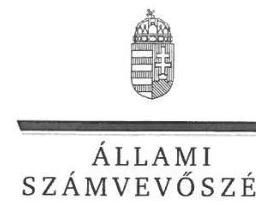
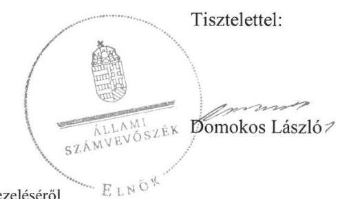
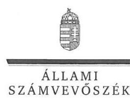
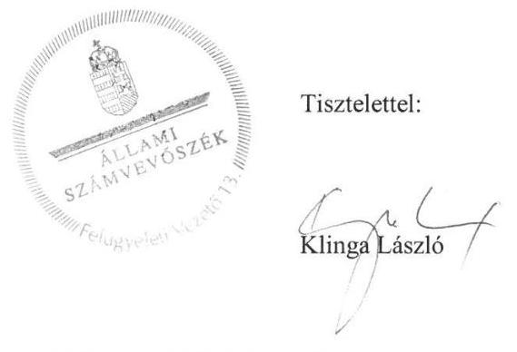
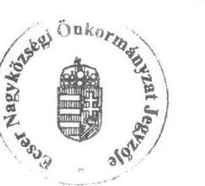
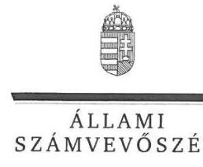
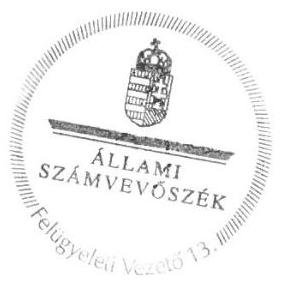

# Jelentés

## Önkormányzatok ellenőrzése Integritás- és belső kontrollrendszer

Ecser Nagyközség Önkormányzata 2019.

19075 www.asz.hu

---

# Jelentés 

## Önkormányzatok ellenőrzése Integritás- és belső kontrollrendszer

Ecser Nagyközség Önkormányzata
2019. 05. hó 25. nap

---

# AZ ELLENŐRZÉST FELÜGYELTE:

- **KLINGA LÁSZLÓ** felügyeleti vezető
- **AZ ELLENŐRZÉST VEZETTE ÉS A VÉGREHAJTÁSÁÉRT FELELŐS:**
  - **DR. TÓTH VIKTÓRIA** ellenőrzésvezető
  - **A PROGRAM ÖSSZEÁLLÍTÁSÁÉRT FELELŐS:**
    - **TÓTPÁL SZABOLCS** osztályvezető

**IKTATÓSZÁM:** EL-1553-001/2019

**TÉMASZÁM:** 16

**ELLENŐRZÉS-AZONOSÍTÓ SZÁM:** V082922

Jelentéseink az Országgyűlés számítógépes hálózatán és az Interneten a www.asz.hu címen is olvashatóak.

---

# TARTALOMJEGYZÉK 

■ ÖSSZEGZÉS ..... 5
■ AZ ELLENŐRZÉS CÉLJA ..... 6
■ AZ ELLENŐRZÉS TERÜLETE ..... 7
■ AZ ELLENŐRZÉS HÁTTERE, INDOKOLTSÁGA ..... 8
■ A JELENTÉS LÉNYEGES KÉRDÉSKÖREI ..... 9
■ AZ ELLENŐRZÉS HATÓKÖRE ÉS MÓDSZEREI ..... 10
■ MEGÁLLAPÍTÁSOK ..... 12
■ JAVASLATOK ..... 14
■ MELLÉKLETEK ..... 17
I. sz. melléklet: Értelmező szótár ..... 17
■ FÜGGELÉK: ÉSZREVÉTELEK ..... 19
■ RÖVIDÍTÉSEK JEGYZÉKE ..... 29

---

.

---

# ÖSSZEGZÉS 

Ecser Nagyközség Önkormányzata belső kontrollrendszerének működtetése nem volt szabályszerű, az nem biztosította a közpénzekkel és a nemzeti vagyonnal történő elszámoltatható, átlátható és szabályszerű gazdálkodás feltételeit. A korrupciós veszélyek ellen védelmet biztosító integritási kontrollokat nem építették ki.

## Az ellenőrzés társadalmi indokoltsága

Az Állami Számvevőszék alapvető feladata a közpénzekkel, az állami és önkormányzati vagyonnal való gazdálkodás ellenőrzése. Az Alaptörvény szerint az önkormányzatok kötelezettsége a kiegyensúlyozott, átlátható és fenntartható költségvetési gazdálkodás elvének érvényesítése, a nemzeti vagyonnal való rendeltetésszerű és felelős módon való gazdálkodás biztosítása. Az Állami Számvevőszék stratégiájában megfogalmazott célkitűzése az integritás alapú, átlátható és elszámoltatható közpénzfelhasználás elősegítése. Ennek megvalósítása érdekében az Állami Számvevőszék prioritásként kezeli a közpénzzel gazdálkodó szervezetek esetében a belső kontrollrendszer működésének ellenőrzését.

Az Állami Számvevőszék Ecser Nagyközség Önkormányzatát korábban nem ellenőrizte.

## Főbb megállapítások, következtetések

Ecser Nagyközség Önkormányzata nem szabályszerű kontrollkörnyezetben működött, mert az eszközök és források értékelési szabályzata nem felelt meg a jogszabályi előírásoknak, és nem alakították ki az integrált kockázatkezelési rendszert. Az integrált kockázatkezelési rendszert nem működtették. Az információs és kommunikációs folyamatok működtetése nem volt szabályszerű, mert nem rendelkeztek 2017. évben felülvizsgált iratkezelési szabályzattal, továbbá a jogszabályban előírt közérdekű adatokat nem tették közzé, ezzel nem biztosították az átlátható működést. A szervezet integritását támogató kontrollok kialakítása nem történt meg, ezáltal az Önkormányzat a korrupciós kockázatok mérséklésére nem tett intézkedéseket. A teljesítmény mérésének feltételeit nem biztosították.

A megállapítások alapján az Állami Számvevőszék az Ecseri Polgármesteri Hivatal jegyzőjének öt, Ecser Nagyközség Önkormányzata polgármesterének egy javaslatot fogalmazott meg. A javaslatokat megalapozó megállapításokra az érintettnek 30 napon belül intézkedési tervet kell készíteni.

---

# AZ ELLENŐRZÉS CÉLJA 

AZ ELLENŐRZÉS CÉLJA annak megállapítása volt, hogy Ecser Nagyközség Önkormányzata belső kontrollrendszere biztosította-e a közpénzekkel és a nemzeti vagyonnal történő elszámoltatható, átlátható, szabályszerű, gazdaságos, hatékony és eredményes gazdálkodás feltételeit. Az ellenőrzés célja volt továbbá annak értékelése, hogy az önkormányzatnál kiépítették és erősítették-e a korrupciós kockázatok kezelését szolgáló integritás kontrollokat, és megteremtették-e a teljesítményellenőrzés feltételeit.

---

# **AZ ELLENŐRZÉS TERÜLETE**

## **Ecser Nagyközség Önkormányzata**

Ecser Nagyközség Pest megyében található település. Lakónépessége a Központi Statisztikai Hivatal Magyarország közigazgatási helynévkönyve alapján 2017. január 1-jén 3846 fő volt.

Az Önkormányzat1 hat tagú Képviselő-testületének2 munkáját három állandó bizottság segítette. Az Önkormányzat gazdálkodási feladatait a Polgármesteri Hivatal3 látta el.

Az Önkormányzat a Polgármesteri Hivatal mellett négy költségvetési szervet tartott fenn, a Cserfa Kuckó Óvodát, az Andrássy utcai Óvodát, a Rábai Miklós Művelődési és Közösségi Ház, Könyvtárat és az Ecseri Önkormányzati Konyhát.

Az ellenőrzött évben a polgármester4 és a jegyző5 személye nem változott.

Az Önkormányzat a 2017. évi költségvetés végrehajtásáról szóló zárszámadás szerint 908,1 millió Ft költségvetési bevételt ért el, valamint 595,4 millió Ft költségvetési kiadást teljesített, vagyonának értéke 2017. december 31-én 4,3 milliárd Ft volt.

---

# AZ ELLENŐRZÉS HÁTTERE, INDOKOLTSÁGA 

A BELSŐ KONTROLLRENDSZER kialakítása és működtetése nélkül nem valósítható meg a közpénzek, a közvagyon átlátható, szabályos, gazdaságos, hatékony és eredményes felhasználása. A belső kontrollrendszer azt a célt szolgálja, hogy a költségvetési szervek működésük és gazdálkodásuk során a tevékenységeket szabályszerűen hajtsák végre, teljesítsék elszámolási kötelezettségeiket és megvédjék az erőforrásokat a veszteségektől, a károktól és a nem rendeltetésszerű használattól.

A belső kontrollrendszer magában foglalja mindazon elveket, eljárásokat és belső szabályzatokat, melyek biztosítják, hogy a költségvetési szerv valamennyi tevékenysége és célja összhangban legyen a szabályszerűséggel, szabályozottsággal, valamint a gazdaságosság, hatékonyság és eredményesség követelményeivel, az eszközökkel és forrásokkal való gazdálkodásban ne kerüljön sor pazarlásra, visszaélésre, rendeltetésellenes felhasználásra. Megfelelő, pontos és naprakész információk álljanak rendelkezésre a költségvetési szerv működésével kapcsolatosan, és a belső kontrollrendszer harmonizációjára, összehangolására vonatkozó jogszabályok végrehajtásra kerüljenek. Az integritás kontrollok kiépítése, erősítése a szervezet korrupciós kockázatainak kezelését szolgálja. A teljesítménykövetelmények meghatározása és működtetése megalapozhatja az önkormányzatoknál a teljesítményellenőrzés lefolytatását.

---

# A JELENTÉS LÉNYEGES KÉRDÉSKÖREI 

1. Az Önkormányzat belső kontrollrendszerének működtetése szabályszerű volt-e?
2. Az önkormányzatnál alakítottak-e ki a teljesítmény mérésére alkalmas követelményeket?

---

# AZ ELLENŐRZÉS HATÓKÖRE ÉS MÓDSZEREI 

## Az ellenőrzés típusa

Megfelelőségi ellenőrzés.

## Az ellenőrzött időszak

Az ellenőrzött időszak 2017. év, illetve az éves költségvetési beszámoló Áht. ${ }^{6}$ által megállapított jóváhagyásáig (2018. május 31-éig) tartó időszak.

## Az ellenőrzés tárgya

Az önkormányzat és a gazdálkodási feladatokat ellátó hivatala belső kontrollrendszerének kialakítása és működtetése, valamint az integritás kontrollok kiépítettsége, a teljesítményellenőrzés feltételei.

## Az ellenőrzött szervezet

Ecser Nagyközség Önkormányzata

## Az ellenőrzés jogalapja

Az ÁSZ tv. ${ }^{7}$ 1. § (3) bekezdésében foglaltak alapján az ÁSZ ${ }^{8}$ általános hatáskörrel végzi a közpénzekkel és az állami és önkormányzati vagyonnal való felelős gazdálkodás ellenőrzését. Az ÁSZ tv. 5. § (2) bekezdése alapján az államháztartás gazdálkodásának ellenőrzése keretében az ÁSZ ellenőrzi a helyi önkormányzatok gazdálkodását, valamint az ÁSZ tv. 5. § (6) bekezdése alapján ellenőrzése során értékeli az államháztartás számviteli rendjének betartását és a belső kontrollrendszer működését.

## Az ellenőrzés módszerei

Az ÁSZ az ellenőrzést az ellenőrzési program szempontjai, az ellenőrzött időszakban hatályos jogszabályok, az ellenőrzés szakmai szabályai, az egyes ellenőrzési típusokhoz kapcsolódó ÁSZ módszertanok figyelembe vételével végezte.

Az ellenőrzés lefolytatásához az ellenőrzött szervezet tanúsítványok kitöltésével, valamint az ÁSZ által kért dokumentumok megküldésével szolgáltatott adatokat, amelyek valódiságát és teljes körűségét az ellenőrzött szervezet vezetője által tett teljességi és hitelességi nyilatkozat igazolja. A

---

rendelkezésre bocsátott adatok, információk kontrollja az ellenőrzés keretében történt.

Az ellenőrzés ideje alatt az ÁSZ az Önkormányzattal a kapcsolattartást az ÁSZ SZMSZ ${ }^{9}$-ének vonatkozó előírásai alapján biztosította.

Az ellenőrzési kérdések megválaszolásához szükséges bizonyítékok megszerzése az Önkormányzat által rendelkezésre bocsátott dokumentumokra, adatokra alapozva megfigyelés, szemle (szemrevételezés), valamint elemző eljárás keretében történt. Az ellenőrzés lefolytatásához az Önkormányzat az ÁSZ által kért dokumentumok elektronikus megküldésével szolgáltatott adatokat.

Az ellenőrzési bizonyítékként felhasználható adatforrások közé tartoztak egyrészt az ellenőrzési program részletes szempontjainál felsorolt adatforrások, másrészt minden - az ellenőrzés folyamán feltárt, az ellenőrzés szempontjából releváns információt tartalmazó - dokumentum.

Az Önkormányzat belső kontrollrendszere jogszabályi előírások szerinti kialakításának, illetve működtetésének szabályszerűségét, az erre irányuló ellenőrzési kérdésekre adott válaszok összesítése alapján pillérenként (kontrollterületenként) és összesítetten is értékeltük. Az Önkormányzat belső kontrollrendszerének összesített értékelése esetében a „szabályszerű" értékelésnek feltétele volt, hogy egyik kontrollterület sem kaphatott „nem szabályszerű" értékelést.

A kiadások teljesítéséhez kapcsolódó pénzgazdálkodási belső kontrollok működésének szabályszerűsége esetében az ellenőrzés azokra a legnagyobb értékű tételekre - a lényeges sokaságra - terjedt ki, melyek összértéke eléri a teljes sokaság összértékének 50\%-át. A 2017. évi kiadások esetében a lényeges sokaságot tételesen ellenőriztük.

A mintavétellel ellenőrzött terület esetében minden egyes tétel vonatkozásában a szabályszerűségre vonatkozó kérdéseket tettünk fel, amelyek eredménye összesítésre került. „Szabályszerűnek" értékeltünk egy ellenőrzött területet, amennyiben 95\%-os bizonyossággal az ellenőrzött sokaságban az átlagos hibaarány legfeljebb 10\%, "nem szabályszerűnek", amennyiben 10\%-nál magasabb arányt képviselt.

---

# 1. Az Önkormányzat belső kontrollrendszerének működtetése szabályszerű volt-e? 

Összegző megállapítás A belső kontrollrendszer működtetése nem volt szabályszerű.

AZ ÖNKORMÁNYZAT NEM SZABÁLYSZERŰ KONTROLLKÖRNYEZETBEN MŰKÖDÖTT. A hivatásetikai alapelvek részletes tartalmát, valamint az etikai eljárás szabályait a Kttv. ${ }^{10}$ 231. § (1) bekezdésében foglaltak ellenére a Képviselő-testület nem állapította meg.

Az eszközök és források értékelési szabályzata ${ }^{11}$ az Áhsz. ${ }^{12}$ 50. § (2) bekezdés b) pontjában foglaltak ellenére nem tartalmazta követeléstípusonként a kis összegű követelések év végi meghatározásának elveit, dokumentálásának szabályait.

A jegyző a Bkr. ${ }^{13}$ 3. § b) pontjában foglaltak ellenére nem alakította ki az integrált kockázatkezelési rendszert.

A szervezeti integritást sértő események kezelésének eljárásrendje ${ }^{14}$ a Bkr. 6. § (4a) bekezdés f) pontja ellenére nem tartalmazta az alkalmazható jogkövetkezményeket.

AZ INTEGRÁLT KOCKÁZATKEZELÉSI RENDSZERT NEM MŰKÖDTETTÉK. A jegyző a Bkr. 7. § (1) bekezdésével ellentétben nem működtette az integrált kockázatkezelési rendszert.

AZ INFORMÁCIÓS ÉS KOMMUNIKÁCIÓS FOLYAMATOK MŰKÖDTETÉSE NEM VOLT SZABÁLYSZERŰ. A jegyző az Info tv. ${ }^{15}$ 37. §-ában és 1. mellékletében (általános közzétételi lista) meghatározott közérdekű adatokat nem tette közzé.

A Hivatal az Áhsz. 32. § (1) bekezdésében előírtak ellenére nem töltötte fel az éves költségvetési beszámoló adatait a Kincstár által működtetett elektronikus adatszolgáltató rendszerbe. Az Ávr. 169. § (3) bekezdése ellenére az időközi költségvetési jelentést, valamint az Ávr. 170. § (2) bekezdése ellenére az időközi mérlegjelentést nem töltötte fel a Kincstár által működtetett elektronikus adatszolgáltató rendszerbe.

Az Önkormányzat nem rendelkezett 2017. évben felülvizsgált iratkezelési szabályzattal az lkr. ${ }^{16}$ 3. § (1) bekezdésével ellentétben, arról a jegyző nem gondoskodott.

A SZERVEZET INTEGRITÁS elvű működését nem támogatta a jogszabályok által kötelezően előírt kontrollok kiépítettsége. A kockázatelemzés hiányában az integritás elvű működést támogató kontrollok nem kerültek kialakításra.

---

# 2. Az önkormányzatnál alakítottak-e ki a teljesítmény mérésére alkalmas követelményeket? 

Összegző megállapítás Az Önkormányzatnál nem biztosították a teljesítmény mérés feltételeit.

A jegyző nem alakította ki a teljesítmény mérésére alkalmas követelményeket.

---

# JAVASLATOK 

Az ÁSZ tv. 33. § (1) bekezdésében foglaltak értelmében az ellenőrzött szervezet vezetője köteles a jelentésben foglalt megállapításokhoz kapcsolódó intézkedési tervet összeállítani és azt a jelentés kézhezvételétől számított 30 napon belül az ÁSZ részére megküldeni. Amennyiben az ellenőrzött szervezet vezetője nem küldi meg határidőben az intézkedési tervet, vagy továbbra sem elfogadható intézkedési tervet küld, az Állami Számvevőszék elnöke az ÁSZ tv. 33. § (3) bekezdés a) és b) pontjaiban foglaltakat érvényesítheti.

## Ecseri Polgármesteri Hivatal jegyzőjének

1. A szabályszerű kontrollkörnyezet kialakítása érdekében intézkedjen, hogy az Áhsz. előírásainak megfelelően követeléstípusonként a kis összegű követelések év végi meghatározásának elvei, dokumentálásának szabályai az eszközök és források értékelési szabályzatában rögzítésre kerüljenek.
(1. sz. megállapítás 2. bekezdése alapján)
2. Az Önkormányzat szabályszerű integrált kockázatkezelési rendszerének kialakítása és működtetése érdekében gondoskodjon:
a) az integrált kockázatkezelési rendszer kialakításáról és működtetéséről;
(1. sz. megállapítás 3. és 5. bekezdése alapján)
b) a szervezeti integritást sértő események kezelése eljárásrendjének alkalmazható jogkövetkezményekkel történő kiegészítéséről.
(1. sz. megállapítás 4. bekezdése alapján)
3. A szabályszerű információs és kommunikációs rendszer működtetése érdekében gondoskodjon:
a) a
 jogszabályban előírt adatszolgáltatási kötelezettség teljesítéséről;
(1. sz. megállapítás 7. bekezdése alapján)
b) az iratkezelési szabályzat felülvizsgálatáról és szükség szerinti módosításáról
(1. sz. megállapítás 8. bekezdése alapján)

---

# Ecser Nagyközség Önkormányzata polgármesterének 

1. Gondoskodjon a hivatásetikai alapelvek részletes tartalmának, valamint az etikai eljárás szabályainak Képviselő-testület elé terjesztéséről.
(1. sz. megállapítás 1. bekezdés 2. mondata alapján)

---

.

---

# MELLÉKLETEK 

- I. SZ. MELLÉKLET: ÉRTELMEZŐ SZÓTÁR
belső ellenőrzés
belső kontrollrendszer
belső kontrollrendszer területei
információs és kommunikációs rendszer
integritás
integrált kockázatkezelési rendszer
kontrollkörnyezet
kontrolltevékenységek
monitoring rendszer

Független, tárgyilagos bizonyosságot adó és tanácsadó tevékenység, amelynek célja, hogy az ellenőrzött szervezet működését fejlessze és eredményességét növelje, az ellenőrzött szervezet céljai elérése érdekében rendszerszemléletű megközelítéssel és módszeresen értékeli, illetve fejleszti az ellenőrzött szervezet irányítási és belső kontrollrendszerének hatékonyságát. (Forrás: Bkr. 2. § b) pontja)
A belső kontrollrendszer a kockázatok kezelése és tárgyilagos bizonyosság megszerzése érdekében kialakított folyamatrendszer, amely azt a célt szolgálja, hogy a működés és gazdálkodás során a tevékenységeket szabályszerűen, gazdaságosan, hatékonyan, eredményesen hajtsák végre, az elszámolási kötelezettségeket teljesítsék, megvédjék az erőforrásokat a veszteségektől, károktól és nem rendeltetésszerű használattól. (Forrás: Áht. 69. § (1) bekezdése)
A kontrollkörnyezet, a (integrált) kockázatkezelési rendszer, a kontrolltevékenységek, az információs és kommunikációs rendszer, valamint a nyomon követési (monitoring) rendszer. (Forrás: Bkr. 3. §-a)
A költségvetési szerv vezetője által kialakított és működtetett olyan rendszer, mely biztosítja, hogy a megfelelő információk a megfelelő időben eljutnak az illetékes szervezethez, szervezeti egységhez, illetve személyhez. (Forrás: Bkr. 9. § (1) bekezdés)
Az integritás az elvek, értékek, cselekvések, módszerek, intézkedések konzisztenciáját jelenti, vagyis olyan magatartásmódot, amely meghatározott értékeknek megfelel. (Forrás: Nemzetgazdasági Minisztérium: Államháztartási Magyarországi államháztartási belső kontroll standardok Útmutató 1.6.1. pontja, 2012. december)
Olyan folyamatalapú kockázatkezelési rendszer, amely a szervezet minden tevékenységére kiterjed, egységes módszertan és eljárások alkalmazásával, a szervezet célkitűzéseinek és értékeinek figyelembevételével biztosítja a szervezet kockázatainak teljes körű azonosítását, azok meghatározott kritériumok szerinti értékelését, valamint a kockázatok kezelésére vonatkozó intézkedési terv elkészítését és az abban foglaltak nyomon követését.(Forrás: Bkr. 2. § m) pontja)
A költségvetési szerv vezetője által kialakított olyan elvek, eljárások, belső szabályzatok összessége, amelyben világos a szervezeti struktúra, a folyamatok átláthatók, egyértelműek a felelősségi, hatásköri viszonyok és feladatok, meghatározottak, ismertek és elfogadottak az etikai elvárások a szervezet minden szintjén, átlátható a humán-erőforrás-kezelés, biztosított a szervezeti célok és értékek irányában való elkötelezettség fejlesztése és elősegítése. (Forrás: Bkr. 6. § (1) bekezdés)
A költségvetési szerv vezetője által a szervezeten belül kialakított (kontroll) tevékenységek, melyek biztosítják a kockázatok kezelését, hozzájárulnak a szervezet céljainak eléréséhez és erősítik a szervezet integritását. (Forrás: Bkr. 8. § (1) bekezdés)
A költségvetési szerv vezetője köteles kialakítani a szervezettevékenységének, a célok megvalósításának nyomon követését biztosító rendszert, amely az operatív tevékenységek keretében megvalósuló folyamatos és eseti nyomon követésből, valamint az operatív tevékenységektől függetlenül működő belső ellenőrzésből állhat. (Forrás: Bkr. 10. §)

---

.

---

# FÜGGELÉK: ÉSZREVÉTELEK 

A jelentéstervezetet a Számvevőszék 15 napos észrevételezésre megküldte az ellenőrzött szervezet vezetőjének az ÁSZ tv. 29. § (1) bekezdése előírásának megfelelően.

Ecser Nagyközség Önkormányzata polgármestere és az Ecseri Polgármesteri Hivatal jegyzője az ÁSZ tv. 29. § (2) bekezdésben foglalt észrevételezési jogával élt, a jelentéstervezetre észrevételt tett.
A függelék mellékletek nélkül tartalmazza az ellenőrzöttek észrevételeit, illetve az el nem fogadott észrevételek elutasításának indoklását.

[^0]
[^0]:    * 29. § (1) Az Állami Számvevőszék az ellenőrzési megállapításait megküldi az ellenőrzött szervezet vezetőjének vagy az általa megbízott személynek, és annak, akinek személyes felelősségét állapította meg.
    (2) Az ellenőrzött szervezet vezetője és a felelősként megjelölt személy az ellenőrzés megállapításaira tizenöt napon belül írásban észrevételt tehet.
    (3) Az Állami Számvevőszék az észrevételre a beérkezésétől számított harminc napon belül írásban válaszol. A figyelembe nem vett észrevételeket köteles a jelentésben feltüntetni, és megindokolni, hogy azokat miért nem fogadta el.

---

# 428 

## ECSER NAGYKÖZSÉGI ÖNKORMÁNYZAT

## POLGÁRMESTERE

2233 Ecser, Széchenyi u. 1. 06-29/335-161 06-29/335-416 2233 Ecser, Pf. 1.
Internet: www.ecser.hu; E-mail: polgarmesterihivatal@ecser.hu

Szám: $2.16 \mathrm{~m}-2.12019$.
Hivatkozási szám: EL-0844-035/2018.

Állami Számvevőszék
Domokos László Elnök Úr részére
Budapest
Apáczai Csere János utca 10.
1052.

## Tisztelt Domokos László Elnök Úr!

Ecser Nagyközség Önkormányzata integritás- és belső kontrollrendszerének ellenőrzésével kapcsolatban készült jelentéstervezetre, valamint az EL-0844-040/2019. számú jegyzőkönyvre az alábbi észrevételt kívánom tenni:

Szeretném kiemelni, hogy a kistelepülések hivatalaiban dolgozó köztisztviselőknek a feladatai teljesen eltérnek a nagy hivatalok munkavállalói feladataitól. Egy-egy csoportban 1-2 fő dolgozik, ennek megfelelően sokkal nagyobb figyelemmel kell végezniük a munkájukat, hiszen nem ugyanazokat a műveleteket kell rutinszerűen elvégezniük, nem csak egy típusú feladat látnak el. Azokat a feladatokat, amelyeket saját erőforrásból nem tudtunk elvégezni, külső segítséggel látunk el. Így a szabályzataink elkészítését is külső szakértő cég megbízásával tudtuk megoldani. Ez a szakértő cég készítette el az Ecser Nagyközségi Önkormányzat belső kontrollrendszerét szabályozó dokumentumot is.

Önkormányzatunk folyamatosan könyvvizsgálót alkalmaz, annak ellenére, hogy nem vagyunk kötelezettek erre. A könyvvizsgálói jelenlét rendszeres, ezzel is a belső kontrollt szerette volna biztosítani, erősíteni a Képviselő-testület.

Az adatszolgáltatási kötelezettségünknek folyamatosan teljesítettük a Magyar Államkincstár felé is, ennek eredményeként az Ecseri Polgármesteri Hivatal 2016. évtől rendszeresen szerepel azon önkormányzatok között, akik jó adatszolgáltató önkormányzatnak minősülnek. A Pénzügyminisztérium (korábban Nemzetgazdasági Minisztérium) el is ismerte ezzel kapcsolatos tevékenységünket.

Fontos megjegyezni, hogy az ellenőrzés során az adatszolgáltatás idején a hivatal átépítése kezdődött, ami a régi épület teljes felújítását és bővítését jelenti. Az adatszolgáltatás hetében kellett az iratokat és a számítógépes rendszert (internet kapcsolatot is) átköltöztetni egy másik épületbe, miközben az adatfeltöltést és az azt megelőző elektronikus archiválást is ekkor kellett végezni. Időközben a feltöltő felület működésében is hiba lépett fel, amit egy nap alatt

---

# ECSER NAGYKÖZSÉGI ÖNKORMÁNYZAT 

## POLGÁRMESTERE

2233 Ecser, Széchenyi u. 1. 06-29/335-161 06-29/335-416 2233 Ecser, Pf. 1.
Internet: www.ecser.hu; E-mail: polgarmesterihivatal@ecser.hu
javítottak, de ezzel a számunkra rendelkezésre álló idő tovább szűkült. Kérem ezen, rajtunk kívülálló okok figyelembe vételét.

Nem értek egyet a jegyzőkönyvben leírt összegző megállapítással. Minden intézményünk, és természetesen a Képviselő-testület is döntései során messzemenőkig figyelembe veszi a közpénzekkel való felelős és takarékos gazdálkodást. Ennek köszönhető az is, hogy azon kevés település közé tartozunk, akiknél nem volt szükség a központi költségvetésből finanszírozott adósságkonszolidációra sem. Szerintem az összegző megállapítás nem jeleníti meg pontosan az Önkormányzat teljesítményét, az értelmezése rosszabb képet mutat a valós helyzetnél. Összehasonlítva az előző évi más Önkormányzatoknál végzett ellenőrzések eredményeivel, jó volt látni, hogy sok esethez képest nálunk lényegesen kevesebb hibát említettek meg. Büszke vagyok kollégáim munkájára, akik a fent felsorolt nehezítő külső körülmények ellenére is, ilyen jól teljesítettek. Természetesen a hibák javításának érdekében mindent megteszünk, ahogyan eddig is mindent megtettünk.

Ecser, 2019. március 19.
Üdvözlettel:

---

ELNÖK

Ikt.szám: EL-0844-045/2019

# Gál Zsolt úr 

polgármester
Ecser Nagyközség Önkormányzata

## Ecser

## Tisztelt Polgármester Úr!

Az „Önkormányzatok ellenőrzése - Integritás- és belső kontrollrendszer - Ecser Nagyközség Önkormányzata" címmel készített számvevőszéki jelentéstervezetre tett észrevételeit tartalmazó, I/1641-2/2019. számú levelét köszönettel megkaptam.
Az Állami Számvevőszék észrevételekre vonatkozó álláspontjáról a felügyeleti vezető által készített részletes tájékoztatást csatoltan megküldöm.
Tájékoztatom Polgármester urat, hogy a számvevőszéki jelentésben - az Állami Számvevőszékről szóló 2011. évi LXVI. törvény 29. § (3) bekezdése alapján - a figyelembe nem vett észrevételeket szerepeltetjük annak indoklásával, hogy azokat az Állami Számvevőszék miért nem fogadta el.

Budapest, 2019. OY hó 11 nap

Melléklet: Tájékoztatás az észrevételek kezeléséről

---

# Tájékoztatás az észrevételek kezeléséről 

Az „Önkormányzatok ellenőrzése - Integritás- és belső kontrollrendszer - Ecser Nagyközség Önkormányzata" címú jelentéstervezetre 2019. március 19-én kelt, 1/1641-2/2019. számú levelében tett észrevételét áttekintettük, annak kezelésével kapcsolatban a következő tájékoztatást adom:

Polgármester úr észrevételében - a hivatali munkavégzésről, a könyvvizsgáló alkalmazásáról, a Magyar Államkincstár felé történő adatszolgáltatás teljesítéséről, valamint a hivatal átépítéséről - adott általános tájékoztatását köszönettel tudomásul vettem.

Polgármester úr a jelentéstervezet 1. számú megállapítás 7. bekezdésére vonatkozó észrevételében elismeri, hogy a megállapításban szereplő dokumentumokat az Állami Számvevőszék számára teljesített adatszolgáltatás - technikai okokból adódóan - nem tartalmazta. Az ellenőrzés a rendelkezésre bocsátott dokumentumok alapján teszi meg megállapításait, ezért észrevételét nem fogadom el, így a jelentéstervezet módosítása nem indokolt.

A jelentéstervezet összegző megállapítására tett általános észrevételét köszönettel vettem. Az Összegzés részben található megállapításokat a lényegi kérdésekre adott válaszok megalapozzák. Mindezek alapján a jelentéstervezet módosítása nem indokolt.

Budapest, 2019.

1052 BUDAPEST, APÁCZAI CSERE JÁNOS UTCA 10. 1364 Budapest 4. Pf. 54 telefon: +36 46501982

---

# Ecser Nagyközségi Önkormányzat Jegyzöje 

2233. Ecser, Széchenyi u.1.

Telefon: 29/335-161 Fax: 29/335-416
E-mail: polgarmesterihivatal@ecser.hu

## Szám: 111553 - 0 /2019.   Ügyintéző: Pokornyiné

Tárgy: Jegyzökönyvre észrevételezés
Hiv.szám: EL-0844/2018.

Állami Számvevőszék
Klinga László felügyeleti vezető úr részére Budapest
Apáczai Csere János utca 10. 1052.

## Tisztelt Klinga László felügyeleti vezető Úr!

Először is szeretném megköszönni Ön és munkatársai az Ecser Nagyközségi Önkormányzattal kapcsolatban végzett munkáját.

Ecser Nagyközség Önkormányzata integritás- és belső kontrollrendszerének ellenőrzésével kapcsolatban készült jelentéstervezetre, valamint az EL-0844-040/2019. számú jegyzőkönyvre az alábbi észrevételt kívánom tenni:

1. Az Ecser Nagyközségi Önkormányzat belső kontrollrendszerét az Önkormányzat szabályzatban állapította meg, melyet külső szakértővel készíttettünk el.
2. A Polgármesteri Hivatal, mint gazdasági szervezettel rendelkező költségvetési szerv, valamennyi intézményre vonatkozóan 2017. évre is eleget tett az adatszolgáltatási kötelezettségének, hiszen az időközi költségvetési jelentéseket, az időközi mérlegjelentéseket, valamint a 2017. évi költségvetési beszámolót határidőre teljesítette a Magyar Államkincstár felé.
A Magyar Államkincstár nem jelezte, hogy náluk hiányozna valamilyen adatszolgáltatásunk.

Ennek alátámasztására mellékelünk egy kimutatást, mely a KGR-K11 programból kinyert státusz történetek alapján készült és tartalmazza az egyes jelentések feladásának és Kincstári jóváhagyásának időpontját.

Az Ecseri Polgármesteri Hivatal 2016. évtől rendszeresen szerepel azon önkormányzatok között, akik jó adatszolgáltató önkormányzatnak minősülnek. A Pénzügyminisztérium (korábban Nemzetgazdasági Minisztérium) egyik évben el is ismerte ezzel kapcsolatos tevékenységünket.

Az önkormányzat rendeletei az ecser.hu internetes portálon is elérhetőek, valamint fel vannak töltve a Nemzeti Jogszabálytárba, amit a Pest megyei Kormányhivatal folyamatosan ellenőriz.

---

3. Ecser Önkormányzata rendelkezik iratkezelési szabályzattal, melyet a Pest megyei Levéltár és a Közép-Magyarországi Regionális Közigazgatási Hivatal jóváhagyott. Az irattári kódok vonatkozásában a 78/2012. (XII. 28.) BM rendeletet alkalmazzuk. Az új iratkezelési szabályzatot elkészítettük. 2017. január elsejétől csatlakoztunk az ASP integrált rendszerhez, és az ASP iktatás szakrendszerének bevezetése 2018. január elsejére tolódott.

Szeretném arról is tájékoztatni, hogy felújítás és bővítés miatt az Ecseri Polgármesteri Hivatal épületéből 2018. július 4-én ki kellett költöznünk. A költözés az internetes és számítógépes rendszer átszerelésével is járt, ami miatt nem állt a technika folyamatosan rendelkezésünkre. A Számvevőszék által meghatározott feltöltési intervallum július 2. és 6. között volt. A költözés miatt a feltöltésre megadott 5 napos időintervallum jelentősen leszűkült.
Több mint 120 fájlt kellett feltölteni, több száz oldalt szkennelni. Egy alkalommal jeleztük az ÁSZ ügyfélszolgálatán, hogy nem látjuk a feltöltési felületet. Új felhasználó létrehozásával tudtunk feltöltést kezdeni. Ahol több alpont volt, a felületen csak első feltöltött anyag látszódott. Kérem, mindezeket
 a külső körülményeket is szíveskedjenek figyelembe venni értékelésük során.

Az ellenőrzés keretén belül vélhetően technikai hibából adódóan a költségvetési rendelet, az éves költségvetési beszámoló, a költségvetési jelentések és az időközi mérlegjelentések nem kerültek feltöltésre a számvevőszéki rendszerbe.

Szeretném felvetni, hogy a költségvetési szervek belső kontrollrendszeréről és belső ellenőrzéséről szóló 370/2011. (XII. 31.) Korm. rendelet nem tesz különbséget az intézmények között, azok nagysága szerint. Az én meglátásom szerint a jelzett szabályokat nem a néhány fő, kis intézményekre szabták.

Biztosíthatom Felügyeleti Vezető Urat, hogy munkatársaink és magam is legjobb tudásunk szerint végezzük munkánkat.

A fentiek figyelembevételével kérem, hogy az összegző megállapításban foglaltakat árnyalni szíveskedjenek.

Ecser, 2019. március 19.

Üdvözlettel:

Barta Zoltán
jegyző

---

ELNÖK

Ikt.szám: EL-0844-042/2019

# Barta Zoltán úr 

jegyző
Ecseri Polgármesteri Hivatal

## Ecser

## Tisztelt Jegyző Úr!

Az „Önkormányzatok ellenőrzése - Integritás- és belső kontrollrendszer - Ecser Nagyközség Önkormányzata" címmel készített számvevőszéki jelentéstervezetre tett észrevételeit tartalmazó, I/1558-3/2019. számú levelét köszönettel megkaptam.
Az Állami Számvevőszék észrevételekre vonatkozó álláspontjáról a felügyeleti vezető által készített részletes tájékoztatást csatoltan megküldöm.
Tájékoztatom Jegyző urat, hogy a számvevőszéki jelentésben - az Állami Számvevőszékről szóló 2011. évi LXVI. törvény 29. § (3) bekezdése alapján - a figyelembe nem vett észrevételeket szerepeltetjük annak indoklásával, hogy azokat az Állami Számvevőszék miért nem fogadta el.

Budapest, 2019. $\quad$ hó $C 7$ nap

Melléklet: Tájékoztatás az észrevételek kezeléséről

---

FELÜGYELETI VEZETŐ

# Tájékoztatás az észrevételek kezeléséről 

Az „Önkormányzatok ellenőrzése - Integritás- és belső kontrollrendszer - Ecser Nagyközség Önkormányzata" címú jelentéstervezetre 2019. március 19-én kelt, I/1558-3/2019. számú levelében tett észrevételét áttekintettük, annak kezelésével kapcsolatban a következő tájékoztatást adom:

1. A jelentéstervezet 1. számú megállapítás 1. és 2. bekezdésére vonatkozó észrevétel:

Jegyző úr észrevételében arról adott tájékoztatást, hogy a belső kontrollrendszer szabályozását külső szakértővel készítette el az Önkormányzat. A szabályozás hiányosságaira tett megállapításainkat nem vitatta, így a jelentéstervezet módosítása nem indokolt.

## 2. A jelentéstervezet 1. számú megállapítás 7. bekezdésére vonatkozó észrevétel:

Jegyző úr észrevételében jelezte, hogy a megállapításban szereplő adatszolgáltatási kötelezettségét az Önkormányzat - az észrevétel mellékletében felsoroltak szerint - teljesítette a Kincstár felé. Ugyanakkor elismeri, hogy - vélhetően technikai hibából adódóan - a megállapításban szereplő dokumentumokat az Állami Számvevőszék számára teljesített adatszolgáltatás nem tartalmazta. Az ellenőrzés a rendelkezésre bocsátott dokumentumok alapján teszi meg megállapításait, ezért észrevételét nem fogadom el, a jelentéstervezet módosítása nem indokolt.

## 3. A jelentéstervezet 1. számú megállapítás 8. bekezdésére vonatkozó észrevétel:

Jegyző úr észrevételében jelezte, hogy „az új iratkezelési szabályzatot elkészítették." A jelentéstervezetben tett, 2017. évben felülvizsgált iratkezelési szabályzat hiányára vonatkozó megállapítást nem vitatta, így a jelentéstervezet módosítása nem indokolt.

---

Az adatszolgáltatás körülményeinek, nehézségeinek bemutatását köszönöm, azokat tudomásul vettem. Tájékoztatom, hogy az ellenőrzési eljárás lefolytatására az Állami Számvevőszék belső szabályozóiban foglaltaknak megfelelően került sor.

Budapest, 2019. 04. 05.

Tisztelettel:

Klinga László

---

# RÖVIDÍTÉSEK JEGYZÉKE 

${ }^{1}$ Önkormányzat
${ }^{2}$ Képviselő-testület
${ }^{3}$ Polgármesteri Hivatal
${ }^{4}$ polgármester
${ }^{5}$ jegyző
${ }^{6}$ Áht.
${ }^{7}$ ÁSZ tv.
${ }^{8}$ ÁSZ
${ }^{9}$ ÁSZ SZMSZ
${ }^{10}$ Kttv.
${ }^{11}$ eszközök és források értékelési szabályzata
${ }^{12}$ Áhsz.
${ }^{13}$ Bkr.
${ }^{14}$ szervezeti integritást sértő események kezelésének eljárásrendje
${ }^{15}$ Info tv.
${ }^{16} \mathrm{Ikr}$.

Ecser Nagyközség Önkormányzata
Ecser Nagyközség Önkormányzata Képviselő-testülete
Ecseri Polgármesteri Hivatal
Ecser Nagyközség Önkormányzatának polgármestere
Ecseri Polgármesteri Hivatal jegyzője
2011. évi CXCV. törvény az államháztartásról
2011. évi LXVI. törvény az Állami Számvevőszékről

Állami Számvevőszék
Állami Számvevőszék Szervezeti és Működési Szabályzata
2011. évi CXCIX. törvény a közszolgálati tisztviselőkről

Ecser Nagyközség Önkormányzata és intézményei eszközök és források értékelési szabályzata
4/2013. (I. 11.) Korm. rendelet az államháztartás számviteléről
370/2011. (XII. 31.) Korm. rendelet a költségvetési szervek belső
kontrollrendszeréről és belső ellenőrzéséről
Ecser Nagyközség Önkormányzata és intézményei integritást sértő események kezelésének eljárásrendje
2011. évi CXII. törvény az információs önrendelkezési jogról és az információszabadságról
335/2005. (XII. 29.) Korm. rendelet a közfeladatot ellátó szervek iratkezelésének általános követelményeiről

---

ÁLLAMI SZÁMVEVŐSZÉK
1052 Budapest, Apáczai Csere János utca 10.
Levélcím: 1364 Budapest 4. Pf. 54
Telefon: +36 14849100 Telefax: +36 14849200
www.asz.hu
