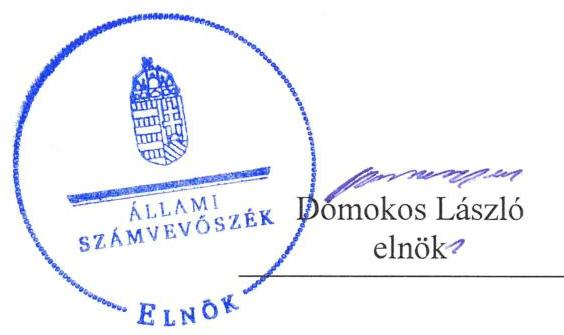
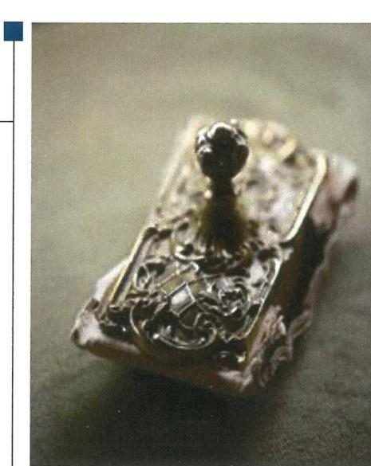

# Jelentés 

## Az állami tulajdonú gazdasági társaságok ellenőrzése

AK Nyomda Korlátolt Felelősségű Társaság 2019. 05. hó 21. nap

---

# AZ ELLENŐRZÉST FELÜGYELTE: 

HORVÁTH MARGIT felügyeleti vezető

## AZ ELLENŐRZÉST VEZETTE ÉS A VÉGREHAJTÁSÁÉRT FELELŐS:

SALI SÁNDORNÉ ellenőrzésvezető

## A PROGRAM ÖSSZEÁLLÍTÁSÁÉRT FELELŐS:

TÓTPÁL SZABOLCS osztályvezető

IKTATÓSZÁM: EL-0819-073/2019

TÉMASZÁM: 2

## ELLENŐRZÉS-AZONOSÍTÓ SZÁM: V-082410

Jelentéseink az Országgyúlés számítógépes hálózatán és az Interneten a www.asz.hu címen is olvashatóak.

---

# TARTALOMJEGYZÉK 

■ ÖSSZEGZÉS ..... 5
■ AZ ELLENŐRZÉS CÉLJA ..... 6
■ AZ ELLENŐRZÉS TERÜLETE ..... 7
■ AZ ELLENŐRZÉS HÁTTERE, INDOKOLTSÁGA ..... 8
■ A JELENTÉS LÉNYEGES KÉRDÉSKÖREI ..... 9
■ AZ ELLENŐRZÉS HATÓKÖRE ÉS MÓDSZEREI ..... 10
■ MEGÁLLAPÍTÁSOK ..... 12
■ JAVASLATOK ..... 14
■ MELLÉKLETEK ..... 17
I. sz. melléklet: Fogalomtár ..... 17
■ FÜGGELÉKEK ..... 19
I. sz. függelék a jelentéshez ..... 19
II. sz. függelék: Észrevételek ..... 20
■ RÖVIDÍTÉSEK JEGYZÉKE ..... 21

---

.

---

# ÖSSZEGZÉS 

Az AK Nyomda Korlátolt Felelősségű Társaság működésének szabályozottsága, gazdálkodása, vagyongazdálkodása nem volt szabályszerű, ezáltal az ügyvezető nem biztosította az elszámoltathatóságot és a vagyon védelmét.

## Az ellenőrzés társadalmi indokoltsága

Az állami tulajdonú gazdálkodó szervezetek a nemzeti vagyon részét képezik. Gazdálkodásuk a közérdeklődés és a média figyelmének középpontjában áll. A közpénzt, közvagyont felhasználó állami tulajdonú gazdálkodó szervezetekkel szemben alapvető társadalmi igény, hogy működésük, gazdálkodásuk szabályszerű, az általuk szolgáltatott adatok minél megbízhatóbbak legyenek. Az Állami Számvevőszék a közvagyon, a közpénzek szabályos, átlátható és elszámoltatható felhasználásának elősegítése érdekében, stratégiájával összhangban végzi az államháztartáson kívül működő szervezetek ellenőrzését.

Az AK Nyomda Korlátolt Felelősségű Társaság megfelelő működése fontos az állami vagyon védelme szempontjából, emiatt került sor a Társaság ellenőrzésére.

## Főbb megállapítások, következtetések, javaslatok

Az AK Nyomda Korlátolt Felelősségű Társaság működésének szabályozottsága nem felelt meg a jogszabályi előírásoknak. A Társaság 2015-ben számviteli politikával, a 2015-2017. években számlarenddel nem rendelkezett. A leltározási szabályzat ellentétes volt a jogszabályban foglaltakkal, mivel a tárgyi eszközök esetében az előírt három év helyett öt évenkénti gyakoriságot írt elő a mennyiségi felvétellel történő leltározásra.

A gazdálkodás keretében a bevételek és ráfordítások elszámolása nem volt szabályszerű. A Társaság az ellenőrzött időszakban számlarenddel nem rendelkezett, ezért a törvényi előírás ellenére a könyvvezetés nem alapozta meg az előírás szerinti beszámoló készítését.

A vagyongazdálkodás nem volt szabályszerű. A tárgyi eszközök esetében a Társaság a rendeltetésszerű használatba vételt hitelt érdemlően nem dokumentálta. A Társaság az ellenőrzött időszakban a törvényi előírás ellenére az egyszerűsített éves beszámoló mérlegét - az eszközöket és forrásokat mennyiségben és értékben tartalmazó - leltárral nem támasztotta alá, továbbá a tárgyi eszközök esetében a leltárba bekerülő adatok valódiságáról mennyiségi felvétellel nem győződött meg. A mérleg tételeit alátámasztó leltárak hiányában az egyszerűsített éves beszámolókban az előírás ellenére nem érvényesült a valódiság elve.

A Társaság nem biztosította a jogszabályban előírt közérdekből nyilvános adatok közzétételét.
A Társaság saját tőkéje 2017-ben az előírt mérték alá csökkent. Az ügyvezető haladéktalanul nem jelezte a tulajdonosi joggyakorló felé a jogszabály előírása ellenére a tőkehelyzet rendezésének szükségességét.

Az Állami Számvevőszék a jelentésben foglalt megállapítások alapján az AK Nyomda Korlátolt Felelősségű Társaság ügyvezetőjének hét javaslatot fogalmazott meg. A javaslatokat megalapozó megállapításokra az érintetteknek 30 napon belül intézkedési tervet kell készíteniük.

---

# AZ ELLENŐRZÉS CÉLJA 

Az ellenőrzés célja annak értékelése volt, hogy a gazdasági társaság szabályozottsága, gazdálkodása és vagyongazdálkodási tevékenysége megfelelt-e a jogszabályi és a tulajdonosi előírásoknak. A vagyonváltozást eredményező döntések esetében a gazdasági társaság szabályszerűen járt-e el.

---

# AZ ELLENŐRZÉS TERÜLETE 

## AK Nyomda Korlátolt Felelősségű Társaság

AZ AK NYOMDA KFT.-t Akadémiai Nyomda Kft. néven a Magyar Tudományos Akadémia és a Pro Cultura Kft. alapította 1996. évben, elnevezése 2014. évben a jelenlegi nevére változott.

A Társaság ${ }^{1}$ 2013. évben 100%-ban állami tulajdonú gazdasági társasággá vált azzal, hogy az MNV Zrt. ${ }^{2}$ megvásárolta az MTA $^{3}$, mint tag 1%-os üzletrészét. A Társaság felett a tulajdonosi jogokat az MNV Zrt. gyakorolta.

A Társaság jegyzett tőkéje - az ellenőrzött időszakban 30,0 M Ft, főtevékenysége könyvgyártás és részfolyamatai, egyéb tevékenységei - többek között - nyomdai előkészítés, könyvkötés, napilapnyomtatás volt.

A Társaság főbb megrendelői között szerepelt az Akadémiai Kiadó Zrt., aki felé számos tankönyv, értelmező szótár, helyesírás szabályai kiadvány gyártását teljesítette.

A Társaság közfeladatot nem látott el, nem tartozott a kormányzati szektorba. Vagyonkezelésbe nem vett vagyont, tevékenysége során saját vagyonát használta, tulajdonosi részesedése más gazdasági társaságban nem volt.

Az önköltségszámítás rendjére vonatkozó belső szabályzat elkészítésére a Számv. tv. ${ }^{4}$ alapján - mint egyszerűsített éves beszámolót készítő - nem volt kötelezett. A Bkr. ${ }^{5}$ alapján belső ellenőrzés működtetésére nem volt kötelezett.

A Társaság jogszabály alapján mentesült a kötelező könyvvizsgálat alól, az MNV Zrt. döntése alapján a 2015-2017. évek tekintetében választott könyvvizsgálója nem volt.

A Társaság ügyvezetőjének ${ }^{6}$ személye az ellenőrzött időszakban nem, azon túl 2018. március 19.-i hatállyal változott. A Társaságnál háromtagú felügyelőbizottságot ${ }^{7}$ hoztak létre. A Társaság 2015-ben és 2017-ben 25 főt foglalkoztatott.

---

# AZ ELLENŐRZÉS HÁTTERE, INDOKOLTSÁGA 

Az Alaptörvény 38. cikke alapján az állam tulajdona a nemzeti vagyon része. A nemzeti vagyon megőrzésének, védelmének és a nemzeti vagyonnal való felelős gazdálkodásnak a követelményeit sarkalatos törvény határozza meg. Az állami tulajdonú gazdasági társaságokra vonatkozó előírások betartásának ellenőrzése kiemelten fontos a vagyon megőrzése, megóvása érdekében. Gazdálkodásuk jellemzően a közérdeklődés és a média figyelmének középpontjában áll, amihez hozzájárul a gazdálkodásuk körébe tartozó - közvetlen vagy közvetett állami tulajdonú, tehát végső soron a nemzeti vagyon részét képező - vagyon nagysága, illetve az általuk ellátott közszolgáltatások/közfeladatok minősége és hatékonysága.

Az ellenőrzés rámutathat az állami tulajdonú gazdasági társaságok gazdálkodási tevékenységével kapcsolatos jó gyakorlatokra és szabálytalanságokra. Felhívhatja a figyelmet a jogszabályi követelmények teljesítéséhez szükséges feltételek hiányosságaira, hozzájárulhat az államháztartáson kívüli, de (közvetlenül vagy közvetve) állami vagyont használó gazdasági társaságok tevékenységének átláthatóságához. Ellenőrzésünk eredményeképpen javaslatainkkal, megállapításainkkal hozzájárulhatunk a nemzeti vagyonnal való gazdálkodás átláthatóságának, elszámoltathatóságának javításához.

---

# A JELENTÉS LÉNYEGES KÉRDÉSKÖREI 

1. A társaság működésének szabályozottsága megfelelt-e az előírásoknak?
2. A társaság gazdálkodása, vagyongazdálkodása, valamint adatszolgáltatási feladatainak ellátása szabályszerű volt-e?

---

# AZ ELLENŐRZÉS HATÓKÖRE ÉS MÓDSZEREI 

## Az ellenőrzés típusa

Megfelelőségi ellenőrzés.

## Az ellenőrzött időszak

Az ellenőrzött időszak a 2015-2017. évek, valamint a 2017. évi beszámoló jóváhagyása és közzététele tekintetében a 2018. június elsejéig tartó időszak.

## Az ellenőrzés tárgya

Az állami tulajdonban lévő gazdasági társaság gazdálkodása, kiemelten vagyongazdálkodási tevékenysége.

## Az ellenőrzött szervezet

AK Nyomda Korlátolt Felelősségű Társaság

## Az ellenőrzés jogalapja

Az ellenőrzés jogalapját az ÁSZ tv. 8. § (3) bekezdése és 5. § (3)-(5) bekezdései képezték.

## Az ellenőrzés módszerei

Az ellenőrzést a nemzetközi standardokat irányadónak tekintve az ellenőrzési program ellenőrzési kérdései, az ellenőrzött időszakban hatályos jogszabályok, az ellenőrzés szakmai szabályok és módszertanok figyelembe vételével végezte el az ÁSZ ${ }^{9}$.

Az ellenőrzés ideje alatt az ellenőrzött szervezettel történő kapcsolattartást az ÁSZ Szervezeti és Működési Szabályzatának vonatkozó előírásai alapján biztosította az ÁSZ.

A gazdasági társaságnál rétegzett mintavétel alkalmazásával ellenőrizte az ÁSZ a ráfordításokat és a bevételeket, ezen belül az anyagjellegű ráfordításokat, az egyéb ráfordításokat, a pénzügyi műveletek ráfordításait és a rendkívüli ráfordításokat, illetve az értékesítés nettó árbevételét, az egyéb

---

bevételeket, a pénzügyi műveletek bevételeit, valamint a rendkívüli bevételeket. Véletlen mintavétel történt továbbá a tárgyi eszközök növekedési tételeiből.

Az ellenőrzési kérdések megválaszolásához szükséges bizonyítékok megszerzése a következő ellenőrzési eljárások alkalmazásával történt: megfigyelés, kérdésfeltevés (információkérés), összehasonlítás, valamint elemző eljárás. Az ellenőrzési bizonyítékként felhasználható adatforrások közé tartoznak egyrészt az ellenőrzési programban felsorolt adatforrások, másrészt adatforrás lehet még minden - az ellenőrzés folyamán - feltárt, az ellenőrzés szempontjából információkat tartalmazó dokumentum.

Az ellenőrzést a kérdésekre adott válaszok kiértékelésével, valamint a megjelölt adatforrások, a csatolt tanúsítványok felhasználásával, továbbá az adott időszakban hatályos jogszabályok figyelembe vételével kellett lefolytatni.

A bevételek és a ráfordítások elszámolásának szabályszerűsége, valamint az értékcsökkenési leírás és a vagyonnyilvántartás szabályszerűsége esetében az ellenőrzés azokra a legnagyobb értékű tételekre - a lényeges sokaságra - terjedt ki, melyek összértéke eléri a teljes sokaság összértékének 50%-át. A bevételek, valamint az értékcsökkenési leírás és a vagyonnyilvántartás esetében a lényeges sokaságot tételesen ellenőriztük. A ráfordítások szabályszerűségét a lényeges sokaságból véletlen mintavételi eljárással kiválasztott tételek alapján ellenőriztük. A mintavétellel ellenőrzött területek esetében minden egyes tétel vonatkozásában a szabályszerűségre vonatkozó kérdéseket tettünk fel. „Szabályszerűnek" értékeltünk egy ellenőrzött területet, amennyiben 95%-os bizonyossággal az ellenőrzött sokaságban az átlagos hibaarány legfeljebb 10%, "nem szabályszerűnek", amennyiben 10%-nál magasabb arányt képviselt. A személyi jellegű kifizetések esetében a vezető tisztségviselők részére teljesített kifizetések tételes ellenőrzésére került sor.

---

# 1. A társaság működésének szabályozottsága megfelelt-e az előírásoknak? 

Összegző megállapítás

A Társaság működésének szabályozottsága nem felelt meg a jogszabályi előírásoknak.

SZÁMVITELI POLITIKÁVAL a Társaság a 2015. január 1. és a 2016. március 29. közötti időszakban a Számv. tv. 14. § (3) bekezdésében foglalt előírás ellenére nem rendelkezett. Az ügyvezető a számviteli politikát ${ }^{10}$ 2016. március 30-án hatályba helyezte, azonban annak aktualizálását elmulasztotta, mivel a szabályozáson nem vezette át a Számv. tv. 86. §-át érintő, 2015. július 4-étől hatályos, rendkívüli tételek megszűnésével összefüggő változást, ezzel nem tett eleget a Számv. tv. 14. § (11) bekezdésében foglaltaknak. A Társaság a 2015-2017. évek tekintetében a Számv. tv. 161. § (1)-(2) bekezdéseiben előírtak ellenére nem rendelkezett számlarenddel. A leltározási szabályzat ${ }^{11}$ a tárgyi eszközök esetében az előírt három év helyett öt évenkénti mennyiségi felvétellel történő leltározást írt elő, amely ellentétes volt a Számv. tv. 69. § (3) bekezdésében foglaltakkal. Az értékelési ${ }^{12}$ és a pénzkezelési ${ }^{13}$ szabályzat tartalma megfelelt a Számv. tv. előírásainak.

## 2. A társaság gazdálkodása, vagyongazdálkodása, valamint adatszolgáltatási feladatainak ellátása szabályszerű volt-e?

## Összegző megállapítás

A Társaság gazdálkodása, vagyongazdálkodása, valamint az adatszolgáltatási feladatainak ellátása nem volt szabályszerű.

A GAZDÁLKODÁS keretében a bevételek és a ráfordítások elszámolása nem volt szabályszerű. A Társaságnál a Számv. tv. 161. § (1) bekezdésében foglaltak ellenére a könyvvezetés - a számlarend hiányában - nem alapozta meg a Számv. tv.-ben előírt beszámoló készítését.

A VAGYONGAZDÁLKODÁS nem volt szabályszerű. A tárgyi eszközök állományba vétele, nyilvántartása nem felelt meg a Számv. tv. 52. (2) bekezdésében, valamint az értékelési szabályzat 2.1.2. pontjában foglalt előírásoknak, mivel a Társaság a rendeltetésszerű használatbavételt, az üzembe helyezést hitelt érdemlően nem dokumentálta.

A Társaság a 2015-2017 években az egyszerűsített éves beszámoló mérlegében a vagyontárgyak állományát - a Számv. tv. 69. § (1) bekezdésének és a leltározási szabályzat 1.1. pontjának előírása ellenére - leltárral nem támasztotta alá, mert a 2015. évben nem volt leltár, a 2016-2017. évi leltárak a tárgyi eszközöknél mennyiségi adatokat nem, csak értékbeni adatokat tartalmaztak. A Társaság a 2015-2017 években nem
 győződött meg

---

továbbá a leltárba bekerülő adatok valódiságáról mennyiségi felvétellel, ezzel nem tartotta be a Számv. tv. 69. § (3) bekezdésének előírását. Mindezek miatt a Számv. tv. 15. § (3) bekezdésében foglalt valódiság elve az ellenőrzött időszakban nem érvényesült.

A Társaság a vagyongazdálkodáshoz kapcsolódó feladat-és hatásköröket, felelősségi viszonyokat az Alapító okiratban ${ }^{14}$ kialakította. Az Alapító ${ }^{15}$ a Társaság fejlesztési elképzeléseit tartalmazó üzleti terveit az Alapító okirat rendelkezései szerint jóváhagyta.

ADATSZOLGÁLTATÁSI KÖTELEZETTSÉGÉNEK a Társaság nem szabályszerűen tett eleget. A Társaság saját tőkéje 2017-ben a jegyzett tőke 50%-a alá csökkent, az arány 13,7% volt. Az ügyvezető a Ptk. 3:189. § (1) bekezdésében előírtak ellenére haladéktalanul nem jelezte az Alapító felé, hogy döntsön a tőkehelyzet rendezéséről.

KÖZZÉTÉTELI KÖTELEZETTSÉGÉNEK a Társaság a Taktv. ${ }^{16}$ 2. § (1) bekezdésében foglaltak ellenére nem tett eleget. Nem tette közzé a vezető tisztségviselők, a felügyelőbizottsági tagok, az Mt. ${ }^{17}$ 208. §-a szerinti vezető állású munkavállalók, valamint az önállóan cégjegyzésre vagy a bankszámla feletti rendelkezésre jogosult munkavállalók nevét, tisztségét vagy munkakörét, munkaviszonyban álló személy esetében a munkavállaló részére a munkaviszonya alapján nyújtott pénzbeli juttatásokat. Nem tette közzé továbbá az FB tagok esetén a megbízási díjat, a megbízási díjon felüli egyéb járandóságokat, a jogviszony megszűnése esetén járó pénzbeli juttatásokat. A Társaság a közérdekből nyilvános adatokat nem tette közzé, ezáltal az átláthatóságot nem biztosította.

---

# JAVASLATOK 

Az ÁSZ tv. 33. § (1) bekezdésében foglaltak értelmében az ellenőrzött szervezet vezetője köteles a jelentésben foglalt megállapításokhoz kapcsolódó intézkedési tervet összeállítani és azt a jelentés kézhezvételétől számított 30 napon belül az ÁSZ részére megküldeni. Amennyiben az ellenőrzött szervezet vezetője nem küldi meg határidőben az intézkedési tervet, vagy továbbra sem elfogadható intézkedési tervet küld, az Állami Számvevőszék elnöke az ÁSZ tv. 33. § (3) bekezdése a) és b) pontjaiban foglaltakat érvényesítheti.
Javaslataink célja az AK Nyomda Korlátolt Felelősségű Társaság gazdálkodása szabályszerűségének és gyakorlatának javítása annak érdekében, hogy a szabályozási környezet és az alkalmazott gyakorlat megfelelően tudja támogatni az átlátható működést.

## Az AK Nyomda Korlátolt Felelősségű Társaság ügyvezetőjének

1. Intézkedjen a számviteli politika aktualizálása érdekében, hogy az megfeleljen a hatályos Számv. tv. előírásainak.
(1. sz. megállapítás 1. bekezdés 2. mondata alapján)
2. Intézkedjen a számlarend elkészítéséről a hatályos Számv. tv. előírásainak megfelelően.
(1. sz. megállapítás 1. bekezdés 3. mondata alapján)
3. Intézkedjen a leltározási szabályzat Számv. tv-nek megfelelő módosításáról a mennyiségi felvétellel történő leltározás vonatkozásában.
(1. sz. megállapítás 1. bekezdés 4. mondata alapján)
4. Intézkedjen a bevételek és a ráfordítások szabályszerű elszámolásáról a Számv. tv. előírásainak megfelelően.
(2. sz. megállapítás 1. bekezdés 1-2. mondata alapján)
5. Intézkedjen a tárgyi eszközök Számv. tv-nek, valamint az értékelési szabályzatnak megfelelő állományba vételéről és nyilvántartásáról.
(2. sz. megállapítás 2. bekezdés 2. mondata alapján)

---

6. Intézkedjen az egyszerűsített éves beszámoló mérlegtételeinek leltárral történő alátámasztásáról a hatályos Számv. tv. előírásainak megfelelően.
(2. sz. megállapítás 3. bekezdés 1-2. mondatai alapján)
7. Intézkedjen a közzétételi kötelezettség teljesítéséről a Taktv. előírásainak megfelelően.
(2. sz. megállapítás 6. bekezdése alapján)

---

.

---

# MELLÉKLETEK 

- I. SZ. MELLÉKLET: FOGALOMTÁR
állami vagyon
a) Az állam tulajdonában lévő dolog, valamint a dolog módjára hasznosítható természeti erő,
b) az a) pont hatálya alá nem tartozó mindazon vagyon, amely vonatkozásában törvény az állam kizárólagos tulajdonjogát nevesíti,
c) az állam tulajdonában lévő tagsági jogviszonyt megtestesítő értékpapír, illetve az államot megillető egyéb társasági részesedés,
d) az államot megillető olyan immateriális, vagyoni értékkel rendelkező jogosultság, amelyet jogszabály vagyoni értékű jogként nevesít,
e) az állam tulajdonában lévő pénzügyi eszközök.

Forrás: Vtv. ${ }^{18}$ 1. § (2) bekezdése
gazdasági társaság
nemzeti vagyon

A gazdasági társaságok üzletszerű közös gazdasági tevékenység folytatására, a tagok vagyoni hozzájárulásával létrehozott, jogi személyiséggel rendelkező vállalkozások, amelyekben a tagok a nyereségből közösen részesednek, és a veszteséget közösen viselik.
Forrás: Ptk. ${ }^{19}$ 3:88. § (1) bekezdése
a) az állam vagy a helyi önkormányzat kizárólagos tulajdonában álló dolgok,
b) az a) pont hatálya alá nem tartozó, állam vagy a helyi önkormányzat tulajdonában lévő dolog,
c) az állam vagy a helyi önkormányzat tulajdonában lévő pénzügyi eszközök, továbbá az államot vagy a helyi önkormányzatot megillető társasági részesedések,
d) az államot vagy a helyi önkormányzatot megillető bármely vagyoni értékkel rendelkező jogosultság, amelyet jogszabály vagyoni értékű jogként nevesít,
e) Magyarország határa által körbezárt terület feletti légtér,
f) az üvegházhatású gázok kibocsátási egységeinek kereskedelméről szóló törvény szerint kibocsátási egység és légiközlekedési kibocsátási egység, valamint az ENSZ Éghajlatváltozási Keretegyezménye és annak Kiotói Jegyzőkönyve végrehajtási keretrendszeréről szóló törvény szerinti kiotói egység,
g) állami vagy helyi önkormányzati fenntartású közgyűjtemény (muzeális intézmény, levéltár, közgyűjteményként működő kép- és hangarchívum, valamint könyvtár) saját gyűjteményében nyilvántartott kulturális javak körébe tartozó dolog, kivéve, ha az állami vagy önkormányzati tulajdon jogszerű létrejötte kétséget kizáró módon nem bizonyítható és a dologra nézve más a tulajdonjogát bizonyítja vagy a kulturális javakra vonatkozó jogszabályokban meghatározott eljárás keretében valószínűsíti (g. pont módosult 2013. december 7-től),
h) a régészeti lelet,
i) a nemzeti adatvagyon körébe tartozó állami nyilvántartások fokozottabb védelméről szóló törvény szerinti nemzeti adatvagyon.
Forrás: Nvtv. ${ }^{20}$ 1. § (2)

---

.

---

# FÜGGELÉKEK 

- I. SZ. FÜGGELÉK A JELENTÉSHEZ

Az Állami Számvevőszék az ellenőrzések során feltárt tényekhez kapcsolódó további körülmények tisztázására eszközrendszerrel nem rendelkezik. Amennyiben az ellenőrzésen túlmutatóan indokoltnak látszik az ellenőrzés során feltárt körülmények további vizsgálata, az Állami Számvevőszék törvényi felhatalmazás alapján és az ellenőrzés által feltárt körülményeket továbbítja a hatáskörrel rendelkező szervnek a szükséges intézkedések megtétele, eljárások lefolytatása érdekében.
Az AK Nyomda Kft. a Számv. tv. 69. § (1) bekezdésében előírtak ellenére a 2015-2017. években az egyszerűsített éves beszámoló mérlegét - az eszközöket és forrásokat mennyiségben és értékben tartalmazó - leltárral nem támasztotta alá, továbbá a Számv. tv. 69. § (3) bekezdésének előírása ellenére a leltárba bekerülő adatok valódiságáról mennyiségi felvétellel nem győződött meg.
A mérleg tételeit alátámasztó leltár hiányában az egyszerűsített éves beszámolókban a Számv. tv. 15. § (3) bekezdésében foglalt előírás ellenére nem érvényesült a valódiság elve és nem igazolt, hogy az AK Nyomda Kft. egyszerűsített éves beszámolói megbízható, valós összképet mutatnak. Emiatt a Társaság elszámoltathatósága, a nemzeti vagyon megőrzése nem volt biztosított.
Az AK Nyomda Kft. az ellenőrzött időszakban számlarenddel nem rendelkezett, ezért a Számv. tv. 161. § (1) bekezdésében foglaltak ellenére könyvvezetése nem alapozta meg a Számv. tv.-ben előírt beszámoló készítését.
A Számv. tv. 170. § (3) bekezdésében foglaltak értelmében a Nemzeti Adó és Vámhivatal ellenőrzi a vállalkozások beszámolóit. Az AK Nyomda Kft. egyszerűsített éves beszámolói a leltárral és a számlarenddel kapcsolatos hiányosságok miatt - nem feleltek meg a törvényi előírásnak, ezért indokolt a Nemzeti Adó és Vámhivatal értesítése.

---

A jelentéstervezetet a Számvevőszék 15 napos észrevételezésre megküldte az ellenőrzött szervezet vezetőjének az ÁSZ tv. 29. §* (1) bekezdése előírásának megfelelően.

Az ellenőrzött szervezet vezetője nem tett észrevételt a Számvevőszék 15 napos észrevételezésre megküldött jelentéstervezetével kapcsolatban.

[^0]
[^0]:    * 29. § (1) Az Állami Számvevőszék az ellenőrzési megállapításait megküldi az ellenőrzött szervezet vezetőjének vagy az általa megbízott személynek, és annak, akinek személyes felelősségét állapította meg.
    (2) Az ellenőrzött szervezet vezetője és a felelősként megjelölt személy az ellenőrzés megállapításaira tizenöt napon belül írásban észrevételt tehet.
    (3) Az Állami Számvevőszék az észrevételre a beérkezésétől számított harminc napon belül írásban válaszol. A figyelembe nem vett észrevételeket köteles a jelentésben feltüntetni, és megindokolni, hogy azokat miért nem fogadta el.

---

# RÖVIDÍTÉSEK JEGYZÉKE 

${ }^{1}$ Társaság
${ }^{2}$ MNV Zrt.
${ }^{3}$ MTA
${ }^{4}$ Számv. tv.
${ }^{5}$ Bkr.
${ }^{6}$ ügyvezető
${ }^{7}$ FB
${ }^{8}$ ÁSZ tv.
${ }^{9}$ ÁSZ
${ }^{10}$ számviteli politika
${ }^{11}$ leltározási szabályzat
${ }^{12}$ értékelési szabályzat
${ }^{13}$ pénzkezelési szabályzat
${ }^{14}$ Alapító okirat
${ }^{15}$ Alapító
${ }^{16}$ Taktv.
${ }^{17}$ Mt.
${ }^{18} \mathrm{Vtv}$.
${ }^{19} \mathrm{Ptk}$.
${ }^{20} \mathrm{Nvtv}$.

AK Nyomda Korlátolt Felelősségű Társaság
Magyar Nemzeti Vagyonkezelő Zártkörűen Működő Részvénytársaság, mint tulajdonosi joggyakorló
Magyar Tudományos Akadémia
a számvitelről szóló 2000. évi C. törvény
a költségvetési szervek belső kontrollrendszeréről és belső ellenőrzéséről szóló 370/2011. (XII. 31.) Korm. rendelet
az AK Nyomda Kft. ügyvezetője
felügyelőbizottság
2011. évi LXVI. törvény az Állami Számvevőszékről (hatályos 2011. július 1-jétől) Állami Számvevőszék
az AK Nyomda Kft. számviteli politikája (hatályos 2016. március 30-ától)
az AK Nyomda Kft. leltározási szabályzata (hatályos 2014. április 2-ától)
az AK Nyomda Kft. értékelési szabályzata (hatályos 2014. április 2-ától)
az AK Nyomda Kft. pénzkezelési szabályzata (hatályos 2014. április 2-ától)
az AK Nyomda Kft. Alapító okirata és módosítása
az MNV Zrt.
2009. évi CXXII. törvény a köztulajdonban álló gazdasági társaságok takarékosabb működéséről (hatályos 2009. december 4-től)
2012. évi I. törvény a munka törvénykönyvéről (hatályos 2012. július 1-től)
az állami vagyonról szóló 2007. évi CVI. törvény
(hatályos 2007. szeptember 25-étől)
a Polgári Törvénykönyvről szóló 2013. évi V. törvény
(hatályos 2014. március 15-étől)
2011. évi CXCVI. törvény a nemzeti vagyonról (hatályos 2011. december 31-től)

---

ÁLLAMI SZÁMVEVŐSZÉK
1052 Budapest, Apáczai Csere János utca 10.
Levélcím: 1364 Budapest 4. Pf. 54
Telefon: +36 14849100 Telefax: +36 14849200
www.asz.hu
