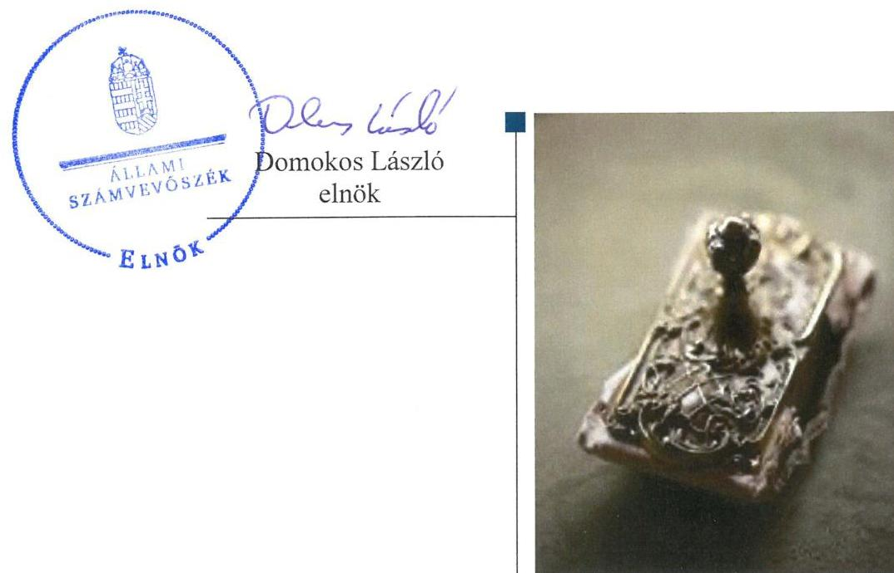
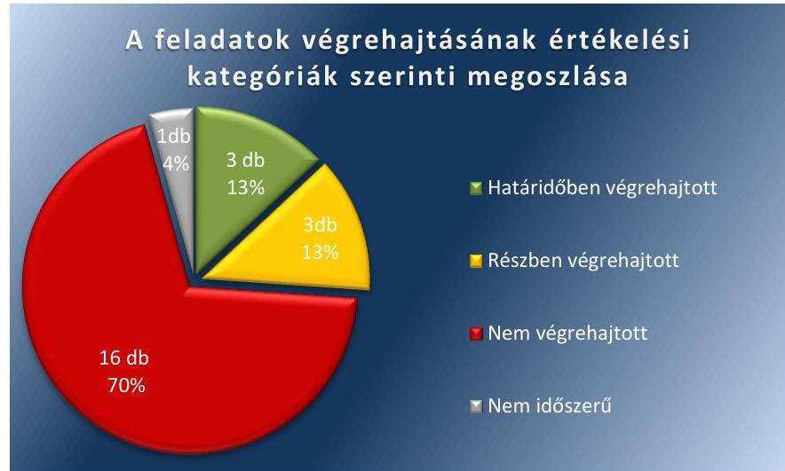
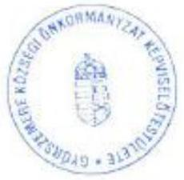
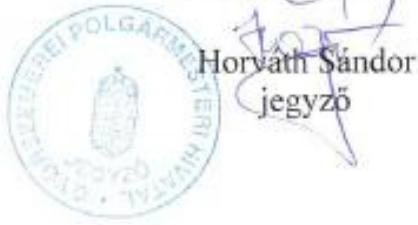
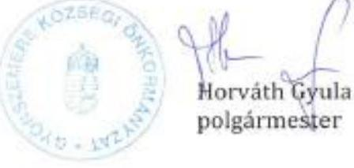
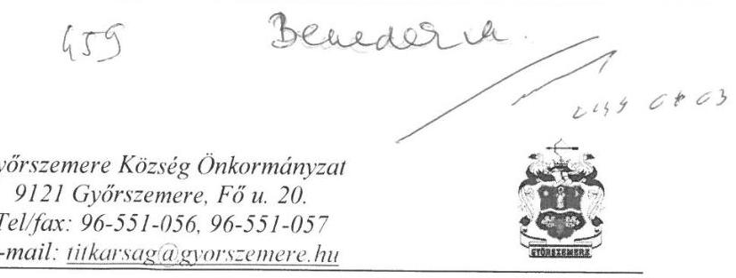
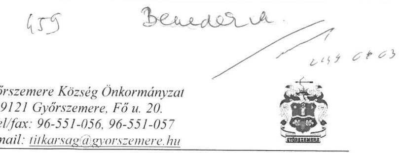
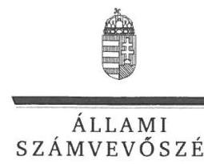
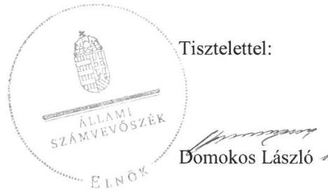
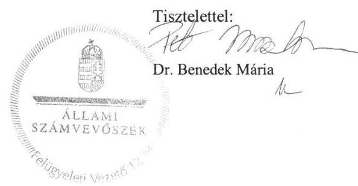

# Jelentés 

## Utóellenőrzések

Az önkormányzatok belső
kontrollrendszere kialakításának és működtetésének ellenőrzése -
Győrszemere Községi Önkormányzat 2019.

---

# Jelentés 

## Utóellenőrzések

Az önkormányzatok belső
kontrollrendszere kialakításának és működtetésének ellenőrzése -
Győrszemere Községi Önkormányzat
2019. 05. hó 34. nap

---

# AZ ELLENŐRZÉST FELÜGYELTE: 

DR. BENEDEK MÁRIA felügyeleti vezető

## AZ ELLENŐRZÉST VEZETTE ÉS A VÉGREHAJTÁSÁÉRT FELELŐS:

PETRÓ KATALIN ellenőrzésvezető

## A PROGRAM ÖSSZEÁLLÍTÁSÁÉRT FELELŐS:

TÓTPÁL SZABOCS osztályvezető

## A TÉMÁHOZ KAPCSOLÓDÓ KORÁBBI SZÁMVEVŐSZÉKI JELENTÉSEK:

- címe: Az önkormányzatok belső kontrollrendszere kialakításának és működtetésének ellenőrzése Győrszemere
- sorszáma: 17011

Jelentéseink az Országgyúlés számítógépes hálózatán és az Interneten a www.asz.hu címen is olvashatóak.

IKTATÓSZÁM: EL-0771-034/2019
TÉMASZÁM: 6/2018
ELLENŐRZÉS-AZONOSÍTÓ SZÁM: V080431

---

# TARTALOMJEGYZÉK 

■ ÖSSZEGZÉS ..... 5
■ AZ ELLENŐRZÉS CÉLJA ..... 6
■ AZ ELLENŐRZÉS TERÜLETE ..... 7
■ AZ ELLENŐRZÉS HÁTTERE, INDOKOLTSÁGA ..... 8
■ A JELENTÉS LÉNYEGES KÉRDÉSKÖRE ..... 9
■ ELLENŐRZÉS HATÓKÖRE ÉS MÓDSZEREI ..... 10
■ MEGÁLLAPÍTÁSOK ..... 12
■ MELLÉKLETEK ..... 15
I. sz. melléklet: Győrszemere Községi Önkormányzat intézkedési terve végrehajtásának értékelése ..... 15
II. sz. melléklet: Győrszemere Községi Önkormányzat intézkedési terve ..... 20
■ FÜGGELÉKEK ..... 27
I. sz. függelék a Jelentéshez ..... 27
II. sz. függelék: Észrevételek ..... 28
■ RÖVIDÍTÉSEK JEGYZÉKE ..... 37

---

.

---

# ÖSSZEGZÉS 

Az Állami Számvevőszék Győrszemere Községi Önkormányzat belső kontrollrendszere kialakításának és működtetésének utóellenőrzése során megállapította, hogy az intézkedési tervben meghatározott feladatok többségét nem hajtotta végre, így a közpénzekkel való felelős gazdálkodást, valamint az integritás alapú működést nem biztosította. A befektetések számviteli elszámolása és nyilvántartása, a befektetésekkel kapcsolatos gazdálkodási jogkörök nem szabályszerű gyakorlása veszélyeztette az önkormányzati vagyonnal történő átlátható, elszámoltatható gazdálkodást.

## Az ellenőrzés társadalmi indokoltsága

Az Állami Számvevőszék stratégiájában célul tűzte ki a számvevőszéki munka hasznosulásának javítását. Ezzel összhangban ellenőrzi, hogy az ellenőrzött szervezet megvalósította-e a korábbi ellenőrzései által feltárt hibák, hiányosságok és szabálytalanságok megszüntetése céljából elkészített intézkedési tervében foglaltakat. A rendszeres utóellenőrzések hozzájárulnak a szükséges intézkedések tényleges végrehajtásához, ezáltal a közpénzügyek rendezettségének javulásához.

## Főbb megállapítások, következtetések

Győrszemere Községi Önkormányzat az Állami Számvevőszék által elfogadott intézkedési tervében meghatározott 23 feladatból hármat határidőben, hármat részben, 16-ot nem hajtott végre és egy nem volt időszerű.

A polgármester és a jegyző intézkedett a számviteli politika módosításáról, a Környezetvédelmi Program, az integrált kockázatkezelési rendszer, a befektetésekre vonatkozóan az ellenőrzési nyomvonal hatályba léptetéséről.

A polgármester és a jegyző nem gondoskodott az önkormányzati SZMSZ-ben a vagyonnyilatkozat tételre kötelezettek körének pontos meghatározásáról, és a jegyző nem tájékoztatta a nem képviselő bizottsági tagokat a vagyonnyilatkozat-tételi kötelezettség fennállásáról és esedékességéről, így az integritás alapú működést nem biztosította.

A jegyző nem intézkedett a befektetésekkel kapcsolatos gazdasági események értékeléséhez, elszámolásához és nyilvántartásához, valamint a gazdálkodási jogkörök szabályszerű gyakorlásához kapcsolódó hiányosságok megszüntetéséről. A leltár hiánya miatt a beszámoló megbízhatósága és a közzétételi kötelezettség elmulasztása nem támogatta a befektetésekkel kapcsolatos vagyongazdálkodás elszámoltathatóságát és átláthatóságát.

Győrszemere Községi Önkormányzat jegyzője az intézkedési tervben meghatározott feladatok végrehajtásáról a jogszabály előírása szerinti nyilvántartást nem vezette, továbbá a külső ellenőrzésekhez kapcsolódó beszámolót a jogszabályi előírás ellenére nem küldte meg az irányító szerv részére.

---

# AZ ELLENŐRZÉS CÉLJA 

Az ellenőrzés célja annak értékelése volt, hogy a számvevőszéki jelentésben ${ }^{1}$ foglalt intézkedést igénylő megállapításokkal összhangban készített intézkedési tervben meghatározott feladatokat az ellenőrzött szervezet végrehajtotta-e.

---

# **AZ ELLENŐRZÉS TERÜLETE**

## **Győrszemere Községi Önkormányzat**

Győrszemere község Nyugat-Dunántúlon Győr-Moson-Sopron megyében található. Állandó lakosainak száma a Központi Statisztikai Hivatal Magyarország közigazgatási helynévkönyve alapján 2017. január 1-jén 3324 fő volt.

Győrszemere Községi Önkormányzat hat tagú Képviselőtestületének munkáját három állandó bizottság támogatta. Győrszemere Községi Önkormányzat a Hivatalon kívül nem rendelkezett intézménnyel, továbbá nem rendelkezett többségi tulajdoni részesedésű gazdasági társasággal.

A polgármester² a 2006. évi önkormányzati választások óta tölti be tisztségét. Az ellenőrzött időszakban a jegyző személye változott. A jegyző³ 2017. január 11-től 2018. április 3-ig, a jegyző⁴ 2018. április 4-től látja el feladatait.

Győrszemere Községi Önkormányzat a 2017. évi költségvetésének végrehajtásáról szóló rendelete⁵ szerint 607,0 millió forint költségvetési bevételt ért el és 479,6 millió forint költségvetési kiadást teljesített. 2017. december 31-én mérlegfőösszege 3952,7 millió forint, a követelések állománya 1517,5 millió forint a kötelezettségek állománya 30,7 millió forint volt.

Az ÁSZ⁶ a 2016. évben ellenőrizte Győrszemere Községi Önkormányzat belső kontrollrendszere kialakítását és működtetését, a 2014. január 1. és 2015. április 30. közötti időszakra, valamint a 2011. január 01-jétől 2015. április 30-ig terjedő időszakra az egyes befektetési döntéseinek, a döntések végrehajtásának és elszámolásának szabályszerűségét. Az ellenőrzés célja annak megállapítása volt, hogy az önkormányzat belső kontrollrendszerének kialakítása, továbbá egyes elemeinek működtetése biztosította-e önkormányzatnál a közpénzfelhasználás szabályosságát, támogatta-e az integritás szemlélet érvényesülését. Az ÁSZ továbbá ellenőrizte, hogy az önkormányzat egyes befektetési döntései és azok végrehajtása, elszámolása megfelel-e a vonatkozó jogszabályoknak és belső szabályozásoknak, a kialakított kontrollrendszer támogatta-e a befektetési tevékenység szabályszerűségét. Az ellenőrzésről készült 17011 számú jelentést az ÁSZ 2017. január 11-én hozta nyilvánosságra.

---

# AZ ELLENŐRZÉS HÁTTERE, INDOKOLTSÁGA 

Az ÁSZ tv. ${ }^{7}$ 33. § (1) bekezdése értelmében a számvevőszéki jelentések megállapításaihoz és javaslataihoz kapcsolódóan az ellenőrzött szervezet vezetője intézkedési tervet köteles összeállítani, és az Állami Számvevőszék részére megküldeni.

Az ÁSZ által befogadott intézkedési tervben foglaltak megvalósítását az ÁSZ tv. 33. § (7) bekezdésében foglaltak alapján - az Állami Számvevőszék utóellenőrzés keretében ellenőrizheti. Az utóellenőrzések keretében - az intézkedések értékelése során - az Állami Számvevőszék figyelembe veszi az ellenőrzött szervezetek működési feltételeiben, valamint a jogszabályi előírásokban bekövetkezett változásokat.

Az utóellenőrzés során az ÁSZ értékeli, hogy az érintett számvevőszéki jelentésben foglalt megállapításokkal és javaslatokkal összhangban, az ellenőrzött szervezet által készített intézkedési tervben meghatározott feladatokat a feladatra kijelöltek végrehajtották-e.
Az intézkedések végrehajtásával az adott terület szabályszerű működése vonatkozásában a kockázatok csökkenhetnek, azonban hosszabb távon az intézkedési tervben foglaltak végrehajtásával önmagában nem szűnnek meg, csak akkor, ha beépülnek az ellenőrzött szervezet működésébe, azokat folyamatosan karban tartják, figyelembe véve, illetve kezelve a változásokat. Emellett az intézkedések végrehajtásáig újabb kockázatok merülhetnek fel a szabályszerű működés vonatkozásában, amelyek kezelése szintén kiemelten fontos az ellenőrzött szervezet számára.

Az ellenőrzött szervezet vezetője által készített intézkedési tervekben foglalt feladatok hiányos, illetve késedelmes végrehajtása, vagy annak elmaradása a szabályszerűség és a felelős vezetői magatartás vonatkozásában kockázatot hordoz, ami azt mutatja, hogy az ellenőrzések során feltárt hibák, hiányosságok és szabálytalanságok kezelése nem kapott kellő hangsúlyt. Az utóellenőrzés során is fennálló szabálytalanságok esetén a közpénz, közvagyon veszélyeztetettségi kockázat valószínűsített hatásának értékelése további intézkedéseket vonhat maga után.

Az ellenőrzött szervezet szintjén az utóellenőrzés feltárja, hogy a szervezet az intézkedések végrehajtásával hasznosította-e a korábbi ellenőrzési jelentésben a hiányosságok megszüntetése, illetve a kockázatok kezelése érdekében megfogalmazott javaslatokat, illetve az intézkedések végrehajtása elmaradásának következtében továbbra is fennálló szabálytalanság esetén értékeli a közpénzek, közvagyon veszélyeztetettségét.

Az ÁSZ szintjén az utóellenőrzés visszacsatolást ad az ellenőrzési jelentések hasznosulásáról, az intézkedések elmaradásának, vagy részleges megvalósulásának a közpénzek, közvagyon veszélyeztetettségére gyakorolt valószínűsített hatásának értékelése, további intézkedéseket vonhat maga után.

---

# A JELENTÉS LÉNYEGES KÉRDÉSKÖRE 

Az önkormányzat az intézkedési tervben foglaltakat az előírt határidőben végrehajtotta-e?

---

# ELLENŐRZÉS HATÓKÖRE ÉS MÓDSZEREI 

## Az ellenőrzés típusa

Megfelelőségi ellenőrzés.

## Az ellenőrzött időszak

Az utóellenőrzés alapját képező ÁSZ jelentés közzétételének napjától az utóellenőrzésről szóló kiértesítő levél keltének napjáig, 2017. január 11-től 2018. július 4-ig tartó időszak volt.

## Az ellenőrzés tárgya

A számvevőszéki jelentésben foglalt megállapításokkal összhangban - az önkormányzat által - készített intézkedési tervben foglaltak végrehajtásának ellenőrzése volt.

## Az ellenőrzött szervezet

Győrszemere Községi Önkormányzat

## Az ellenőrzés jogalapja

Az ellenőrzés jogszabályi alapját az ÁSZ tv. 33. § (7) bekezdésének előírása képezte.

## Az ellenőrzés módszerei

Az ÁSZ az ellenőrzést az ellenőrzött időszakban hatályos jogszabályok, az ellenőrzés szakmai szabályai, a jelen ellenőrzésre irányadó ÁSZ módszertanok, az ellenőrzési programban foglalt értékelési szempontok szerint végezte.

Az ÁSZ az ellenőrzés ideje alatt az önkormányzattal történő kapcsolattartást az ÁSZ SZMSZ ${ }^{\circledR}$-ének vonatkozó előírásai alapján biztosította.

Az utóellenőrzés megállapításait az ÁSZ rendelkezésére álló, valamint az ÁSZ adatbekérése szerint, az önkormányzat által rendelkezésre bocsátott dokumentumok alapozták meg.

Az ellenőrzési bizonyítékként felhasználható adatforrások közé tartoztak egyrészt az ellenőrzési program részletes szempontjainál felsorolt

---

adatforrások, másrészt minden - az ellenőrzés folyamán feltárt, az ellenőrzés szempontjából információt tartalmazó - dokumentum.

Az intézkedési tervekben előírt feladatokat azok végrehajthatósága, illetve végrehajtása szempontjából az alábbiak szerint értékelte az ÁSZ:
$\longrightarrow$ „határidőben végrehajtott" a feladat, ha a teljesítés dokumentáltan, az intézkedési tervben előírt határidőben és tartalommal megtörtént;
$\longrightarrow$ „határidőn túl végrehajtott" a feladat, ha annak teljesítése az intézkedési tervben meghatározott módon, de az előírt határidőn túl történt meg;
$\longrightarrow$ „részben végrehajtott" a feladat, ha végrehajtása teljes körűen az intézkedési tervben előírt módon nem történt meg;
$\longrightarrow$ „nem végrehajtott" a feladat, ha a végrehajtás nem történt meg, vagy amennyiben a teljesítést nem dokumentálták;
$\longrightarrow$ „okafogyottá vált" a feladat, ha végrehajtására - meghatározott esemény bekövetkezése, továbbá külső körülmény, a működést érintő feltétel változása miatt - már nincs szükség, illetve lehetőség, és egyértelműen megállapítható, hogy az intézkedést szükségessé tevő körülmény a jövőben nem fordulhat elő;
$\longrightarrow$ „nem időszerű" az a feladat, amelynek ellenőrzési időszakon belüli végrehajtására azért nem került (kerülhetett) sor, mert az intézkedés alapjául szolgáló esemény nem következett be, de annak jövőbeni előfordulása lehetséges, a végrehajtása nem volt esedékes, vagy a végrehajtás határideje még nem járt le.
Az ellenőrzés lefolytatásához Győrszemere Községi Önkormányzat a tanúsítványok elektronikus kitöltésével, valamint az ÁSZ által kért dokumentumok elektronikus megküldésével szolgáltatott adatokat, amelyek valódiságát és teljes körűségét az ellenőrzött szervezet vezetője által tett teljességi és hitelességi nyilatkozat igazolta. Az így rendelkezésre bocsátott adatok, információk kontrollja az ellenőrzés keretében megtörtént.

Az ellenőrzött szervezet által megküldött intézkedési tervben meghatározott, ÁSZ által beazonosított feladatok a II. számú mellékletben kerültek bemutatásra. A beazonosított, sorszámozott intézkedések részletes értékelését az I. sz. melléklet tartalmazza.

---

# MEGÁLLAPÍTÁSOK 

## Az önkormányzat az intézkedési tervben foglaltakat az előírt határidőben végrehajtotta-e?

Összegző megállapítás

Az Önkormányzat ${ }^{9}$ az intézkedési tervben meghatározott 23 feladatból hármat határidőben, hármat részben, 16 feladatot nem hajtott végre, egy feladat végrehajtása nem volt időszerű. Az intézkedési tervben meghatározott feladatok végrehajtásáról a jogszabályban előírt nyilvántartást nem vezette, továbbá a külső ellenőrzésekhez kapcsolódó beszámolási kötelezettségének nem tett eleget.

Az ÁSZ a számvevőszéki jelentésében a polgármester részére négy, a jegyző részére hét javaslatot fogalmazott meg. Az Önkormányzat Képviselőtestülete a 43/2017. (III. 28.) KT. Határozattal elfogadott intézkedési tervében a hiányosságok, a szabálytalanságok megszüntetésére a polgármester részére négy, a jegyző részére 19 feladatot határozott meg.

Az intézkedési tervben meghatározott feladatokat, határidőket, felelősöket és a feladatok végrehajtását az I. sz. melléklet mutatja be.

Az Önkormányzat jegyzője az intézkedési tervben meghatározott feladatok végrehajtásáról a Bkr. ${ }^{10} 14 . \S$ (1) bekezdésének előírásai szerinti nyilvántartást nem vezette, továbbá a Bkr. 14. § (2) bekezdésében foglaltak ellenére a tárgyévet követő január 31-ig nem számolt be a
 külső ellenőrzések javaslatai alapján készült intézkedési tervek végrehajtásáról a fejezetet irányító szerv vezetőjének.

Az Önkormányzat intézkedési tervében meghatározott feladatok végrehajtásának értékelési kategóriák szerinti megoszlását az 1. ábra szemlélteti.

1. ábra

---

# A SZABÁLYSZERŰ PÉNZÜGYI GAZDÁLKODÁS 

ÉS A PÉNZÜGYI ELSZÁMOLTATHATÓSÁG tekintetében a gazdálkodási jogkörökhöz kapcsolódó szabálytalan működtetés kockázata nagymértékben növekedett, mert a jegyző nem intézkedett, hogy az érvényesítés során a jogszabályban és az önkormányzati SZMSZ ${ }^{11}$-ben foglaltakat, a kötelezettségvállalás és pénzügyi ellenjegyzés során a jogszabályban foglaltakat betartsák (J1d). Ezáltal az Önkormányzatnál nem biztosított a felelős vezetői magatartás és fennáll a közpénzek rendeltetésellenes és pazarló felhasználásának kockázata.

## A SZABÁLYSZERŰ VAGYONGAZDÁLKODÁSSAL

kapcsolatos kockázatok növekedtek, mert a befektetési tevékenységekre vonatkozó intézkedések végre nem hajtása miatt a közvagyon körültekintő, biztonságos befektetése nem volt biztosított.

A jegyző nem intézkedett a befektetésekkel kapcsolatos gazdasági események rögzítéséről és elszámolásáról a számviteli (főkönyvi és részletező) nyilvántartásokban (J3b), az értékpapírok bekerülési értékének megállapításáról és az értékpapírokhoz kapcsolódó főkönyvi számlákhoz a részletező nyilvántartásról (J3b, J3c), valamint az éves költségvetési beszámoló mérlegében kimutatott eszközök (értékpapírok) leltárral történő alátámasztásáról (J4).

AZ INTEGRITÁS alapú működést az Önkormányzat nem biztosította.

A jegyző nem gondoskodott az önkormányzati SZMSZ-ben az önkormányzati bizottságok nem képviselő tagjainak vagyonnyilatkozat-tételre kötelezettek körének pontos meghatározásáról, (P1, J2), valamint nem tájékoztatta a nem képviselő bizottsági tagokat a vagyonnyilatkozat-tételi kötelezettség fennállásáról és esedékességéről (J1c), A jegyző nem intézkedett a 2017. évi költségvetés és a 2016. évi költségvetési beszámoló közzétételéről az önkormányzat honlapján (J1e).

## AZ ÖNKORMÁNYZAT SZABÁLYOZOTTSÁGÁVAL

kapcsolatban az Önkormányzat elkészítette a Környezetvédelmi Programját ${ }^{12}$ (P2, J5). A jegyző a Számv. tv. ${ }^{13}$ előírásaiban bekövetkezett változásoknak megfelelően módosította a számviteli politika keretében a pénzkezelési szabályzatot és a számlarendet, valamint intézkedett az ellenőrzési nyomvonal kiegészítéséről a befektetési tevékenységre vonatkozóan (J1a), továbbá kialakította az integrált kockázatkezelési rendszert a Belső Kontroll Kézikönyvben (J1b).

## A BELSŐ KONTROLL SZERINTI ELSZÁMOLTATHATÓSÁGGAL kapcsolatosan a kockázatok növekedtek a végre nem hajtott intézkedések következtében.

A jegyző nem működtette az integrált kockázatkezelési rendszert (J1b) és nem intézkedett a belső ellenőrzési jelentésekben tett megállapítások, javaslatok, a vonatkozó intézkedési tervek és azok végrehajtása nyomon követését biztosító nyilvántartás vezetéséről (J1g). Nem intézkedett továbbá a feltárt hiányosságok és szabálytalanságok kapcsán a munkajogi felelősség megállapítása érdekében az eljárások lefolytatásáról (J7).

---

.

---

# MELLÉKLETEK

- I. SZ. MELLÉKLET: GYŐRSZEMERE KÖZSÉGI ÖNKORMÁNYZAT INTÉZKEDÉSI TERVE VÉGREHAJTÁSÁNAK ÉRTÉKELÉSE

|  $\begin{aligned} & \text { ㅈ } \ & \text { ㅈ } \ & \text { ㅇ } \end{aligned}$ | Az intézkedési tervben meghatározott feladat | Az intézkedési tervben meghatározott határidő | Az intézkedési tervben meghatározott felelős | A feladat végrehajtása  |
| --- | --- | --- | --- | --- |
|  H |  | Határidőben végrehajtott feladatok |  |   |
|  P2 ${ }^{14}$ | Biztosítani kell a jogszabályi előírásoknak megfelelő környezetvédelmi Programmexzetet képviselő-testület elé terjesztését. | 2017.07.31. | Polgármester | A polgármester a képviselő-testület elé terjesztette a Környezetvédelmi törvény 46. § (1) bekezdés b) pontjában előírtak alapján a Környezetvédelmi Programmexzetet, melyet a Képviselő-testület a 93/2017. (VI.27.) sz. Kt. határozattal elfogadott.  |
|  P4 | Biztosítani kell az Állami Számvevőszék ellenőrzése során feltárt hiányosságok és/vagy szabálytalanságok tekintetében a munkajogi felelősség tisztázására irányuló eljárás megindítását és ennek eredménye ismeretében meg kell tenni a szükséges intézkedéseket. | 2017. 02. 28. | Polgármester | A polgármester a Képviselő testület elé terjesztette az ÁSZ jelentést az Állami Számvevőszék ellenőrzése során feltárt hiányosságok és/vagy szabálytalanságok tekintetében. A 8/2017. (I.31.) Kt. Határozat szerint a Képviselő testület az ÁSZ jelentést megismerte, áttanulmányozta, és nem tartotta indokoltnak a Polgármester fegyelmi felelősségre vonását.  |
|  J5 ${ }^{15}$ | Intézkedni kell a jogszabályi előírásoknak megfelelő környezetvédelmi program-tervezet elkészítéséről. | 2017. 06. 30. | Jegyző | A Jegyző intézkedett a Környezetvédelmi Programmexzet elkészítéséről, melyet a Képviselő-testület a 93/2017. (VI.27.) sz. Kt. határozattal elfogadott.  |
|  Részben végrehajtott feladatok |  |  |  |   |
|  J1.a | Biztosítani kell az ellenőrzés során a belső kontrollrendszer egyes elemei jogszabályi előírásainak megfelelő kialakítását és működtetését, valamint a befektetésekkel kapcsolatos döntések előkészítése és végrehajtása, valamint a gazdálkodási jogkörök gyakorlása során a jogszabályi előírások betartását. A számviteli politika, számlarend, pénzkezelési szabályzat és az ellenőrzési nyomvonal kiegészítése aképpen, hogy azok megfeleljenek a Szám. tv.14. § Áhsz. 49.§ és 51.§, valamint a Bkr.6.§ előírásainak. | 2017.03.31. és folyamatos | Jegyző | Végrehajtott feladatrész:
A jegyző intézkedett a Számlarend módosításáról, mely tartalmazza a forgatási célú értékpapírokról vezetendő részletező nyilvántartások módját, azoknak a kapcsolódó főkönyvi nyilvántartásokkal való egyeztetésének és dokumentálásának szabályait.
A jegyző intézkedett a Pénzkezelési Szabályzat módosításáról, mely tartalmazza a napi készpénz záró állomány maximális mértékét.
A jegyző intézkedett az ellenőrzési nyomvonal kiegészítéséről a Bkr. előírásainak megfelelően a befektetési tevékenységre vonatkozóan.
Nem végrehajtott feladatrész:  |

---

|  1. | Az intézkedési tervben meghatározott feladat | Az intézkedési tervben meghatározott határidő | Az intézkedési tervben meghatározott felelős | A feladat végrehajtása  |
| --- | --- | --- | --- | --- |
|   |  |  |  | A jegyző a Számv. tv. 14. § (4) bekezdésében foglaltak ellenére nem intézkedett a Számviteli Politika módosításáról a kivételes nagyságú vagy előfordulású bevételek, költségek, ráfordítások tekintetében.  |
|  J1.b | Biztosítani kell az ellenőrzés során a belső kontrollrendszer egyes elemei jogszabályi előírásainak megfelelő kialakítását és működtetését, valamint a befektetésekkel kapcsolatos döntések előkészítése és végrehajtása, valamint a gazdálkodási jogkörök gyakorlása során a jogszabályi előírások betartását. A Bkr. 7. § előírásainak megfelelően ki kell alakítani és folyamatosan működtetni kell az integrált kockázatkezelési rendszert, a költségvetési szerv szervezeti célokkal összefüggő kockázatait fel kell mérni, meg kell határozni az egyes kockázatokkal kapcsolatos intézkedéseket, valamint azok teljesítésének folyamatos nyomon követésének módját. | 2017.03.31. és folyamatos | Jegyző | Végrehajtott feladatrész:
A jegyző kialakította az integrált kockázatkezelési rendszert, felmérte a költségvetési szerv szervezeti célokkal összefüggő kockázatait, meghatározta az egyes kockázatokkal kapcsolatos intézkedéseket, valamint azok teljesítésének folyamatos nyomon követésének módját a 2017. március 01-től hatályos Belső Kontroll Kézikönyvben. Az ellenőrzési nyomvonal önálló táblában mutatja be a befektetések kezelését.
Nem végrehajtott feladatrész:
A jegyző a Bkr. 7. § (1) bekezdés előírásai ellenére nem intézkedett az integrált kockázatkezelési rendszer működtetéséről.  |
|  J1.e | Biztosítani kell az ellenőrzés során a belső kontrollrendszer egyes elemei jogszabályi előírásainak megfelelő kialakítását és működtetését, valamint a befektetésekkel kapcsolatos döntések előkészítése és végrehajtása, valamint a gazdálkodási jogkörök gyakorlása során a jogszabályi előírások betartását. Az éves költségvetést és költségvetési beszámolót az önkormányzat honlapján és a nemzeti jogszabálytárban közzé kell tenni az Eisztv. 6.§ és az Info tv. 37. § előírásainak megfelelően. | 2017.03.31. és folyamatos | Jegyző | Végrehajtott feladatrész:
A jegyző intézkedett az éves költségvetések és költségvetési beszámolók Nemzeti Jogszabálytárban, valamint a 2018. évi költségvetés és a 2017. évi költségvetési beszámoló honlapon történő közzétételéről.
Nem végrehajtott feladatrész:
A jegyző az Info.tv. ${ }^{16} 37$. §-ában foglalt előírások ellenére nem intézkedett a 2017. évi költségvetés és a 2016. évi költségvetési beszámoló közzétételéről az önkormányzat honlapján.  |
|   |  | Nem végrehajtott feladatok |  |   |
|  P1 | Biztosítani kell a nem önkormányzati képviselő bizottsági tagok vagyonnyilatkozat tételi kötelezettségét is tartalmazó önkormányzati SZMSZ képviselő-testület elé terjesztését. | 2017. 02. 28. | Polgármester | A polgármester a Vnytv. ${ }^{17}$ 4. § d) pontjában foglaltak ellenére nem biztosította a nem önkormányzati képviselő bizottsági tagok vagyonnyilatkozat tételi kötelezettségét is tartalmazó önkormányzati SZMSZ képviselő-testület elé terjesztését.  |

---

|  1. | Az intézkedési tervben meghatározott feladat | Az intézkedési tervben meghatározott határidő | Az intézkedési tervben meghatározott felelős | A feladat végrehajtása  |
| --- | --- | --- | --- | --- |
|  J2 | Intézkedni kell a nem önkormányzati képviselő bizottsági tagok vagyonnyilatkozat-tételi kötelezettségét is tartalmazó önkormányzati SZMSZ-tervezet elkészítéséről. | 2017.02.28. | Jegyző | A Jegyző a Vnytv. 4. § d) pontjában foglaltak ellenére nem intézkedett a nem önkormányzati képviselő bizottsági tagok vagyonnyilatkozat-tételi kötelezettségét is tartalmazó önkormányzati SZMSZ-tervezet előkészítéséről.  |
|  J1.c | Biztosítani kell az ellenőrzés során a belső kontrollrendszer egyes elemei jogszabályi előírásainak megfelelő kialakítását és működtetését, valamint a befektetésekkel kapcsolatos döntések előkészítése és végrehajtása, valamint a gazdálkodási jogkörök gyakorlása során a jogszabályi előírások betartását. A nem képviselő bizottsági tagokat a vagyonnyilatkozat tételi kötelezettség fennállásáról és esedékességéről tájékoztatni kell. | 2017.03.31. és folyamatos | Jegyző | A jegyző a Vnytv. 8. § (4) bekezdésében foglaltak ellenére nem tájékoztatta a nem képviselő bizottsági tagokat a vagyonnyilatkozat-tételi kötelezettség fennállásáról és esedékességéről.  |
|  P3 | Biztosítani kell a költségvetési rendelettervezet előterjesztésekor a jogszabályi előírásban meghatározott előirányzat felhasználási terv Képviselő-testület részére történő bemutatását. | 2017.02.28. | Polgármester | A polgármester az Áht. ${ }^{18} 24 .$ § (4) bekezdés a) pontjában foglaltak ellenére nem biztosította a költségvetési rendelet-tervezet előterjesztésekor az előirányzat felhasználási terv Képviselő-testület részére történő bemutatását.  |
|  J6 | Intézkedni kell a költségvetési rendelet-tervezet előterjesztésekor bemutatásra kerülő előirányzat felhasználási terv jogszabályi előírásoknak megfelelő elkészítéséről. | 2017.02.06. és folyamatos | Jegyző | A jegyző az Áht. 24. § (4) bekezdés a) pontjában foglaltak ellenére nem intézkedett a költségvetési rendelet-tervezet előterjesztésekor bemutatásra kerülő előirányzat felhasználási terv elkészítéséről.  |
|  J1.d | Biztosítani kell az ellenőrzés során a belső kontrollrendszer egyes elemei jogszabályi előírásainak megfelelő kialakítását és működtetését, valamint a befektetésekkel kapcsolatos döntések előkészítése és végrehajtása, valamint a gazdálkodási jogkörök gyakorlása során a jogszabályi előírások betartását. Az érvényesítés során biztosítani kell az Ávr. 58. § (1) bekezdés, az SZMSZ 29. § (5) bekezdés, Ávr. 55.§(1) bekezdés és az Áht. 37. § (1) bekezdés előírásainak betartását. | 2017.03.31. és folyamatos | Jegyző | A jegyző nem intézkedett, hogy az érvényesítés során az Ávr. ${ }^{19} 58 .$ § (1) bekezdés és az önkormányzati SZMSZ 29. § (5) bekezdésében foglaltakat, a pénzügyi ellenjegyzés során az Ávr. 55.§(1) bekezdésében foglaltakat és a kötelezettségvállalás során az Áht. 37. § (1) bekezdés előírásait betartsák.  |
|  J1.g | Biztosítani kell az ellenőrzés során a belső kontrollrendszer egyes elemei jogszabályi előírásainak | 2017.03.31. és folyamatos | Jegyző | A jegyző a Bkr. 47. § (1)
 bekezdésében foglaltak ellenére nem kérte fel a belső ellenőrzési vezetőt, hogy alakítsa ki és éves bontásban folyamatosan  |

---

|  1
0
0 | Az intézkedési tervben meghatározott feladat | Az intézkedési tervben meghatározott határidő | Az intézkedési tervben meghatározott felelős | A feladat végrehajtása  |
| --- | --- | --- | --- | --- |
|   | megfelelő kialakítását és működtetését, valamint a befektetésekkel kapcsolatos döntések előkészítése és végrehajtása, valamint a gazdálkodási jogkörök gyakorlása során a jogszabályi előírások betartását. Fel kell kérni a belső ellenőrzési vezetőt, hogy alakítsa ki és éves bontásban folyamatosan vezesse a belső ellenőrzési jelentésekben tett megállapítások, javaslatok, a vonatkozó intézkedési tervek és azok végrehajtása nyomon követését biztosító nyilvántartást. |  |  | vezesse a belső ellenőrzési jelentésekben tett megállapítások, javaslatok, a vonatkozó intézkedési tervek és azok végrehajtása nyomon követését biztosító nyilvántartást.  |
|  J1.h | Biztosítani kell az ellenőrzés során a belső kontrollrendszer egyes elemei jogszabályi előírásainak megfelelő kialakítását és működtetését, valamint a befektetésekkel kapcsolatos döntések előkészítése és végrehajtása, valamint a gazdálkodási jogkörök gyakorlása során a jogszabályi előírások betartását. A jövőben a számlaszerződéseket és az értékpapír adásvételi szerződéseket a kötelezettségvállalás dokumentumán ellen kell jegyezni. | 2017.03.31. és folyamatos | Jegyző | A jegyző az Ávr. 55. § (1) bekezdésének és az Áht. 37. § (1) bekezdéseiben foglaltak ellenére nem biztosította, hogy a számlaszerződéseket és az értékpapír adásvételi szerződéseket a kötelezettségvállalás dokumentumán ellen jegyezzék.  |
|  J1.i | Biztosítani kell az ellenőrzés során a belső kontrollrendszer egyes elemei jogszabályi előírásainak megfelelő kialakítását és működtetését, valamint a befektetésekkel kapcsolatos döntések előkészítése és végrehajtása, valamint a gazdálkodási jogkörök gyakorlása során a jogszabályi előírások betartását. Az érvényesítés során ellenőrizni kell, hogy a kötelezettségvállalásra vonatkozó belső szabályzat előírásait betartották-e. | 2017.03.31. és folyamatos | Jegyző | A jegyző az Ávr. 58. § (1) bekezdésében foglaltak ellenére nem intézkedett, hogy az érvényesítés során ellenőrizzék, hogy a kötelezettségvállalásra vonatkozó belső szabályzat előírásait betartották-e.  |
|  J3 | Intézkedni kell a befektetésekkel kapcsolatos gazdasági események jogszabályi előírásoknak megfelelő bizonylatokkal történő alátámasztásáról, valamint rögzítéséről és elszámolásáról a számviteli (főkönyvi és részletező) nyilvántartásokban | 2017.02.28. és folyamatos | Jegyző | A jegyző nem intézkedett a befektetésekkel kapcsolatos gazdasági események a Számv. tv. 166 § (1)-(2) bekezdései szerinti bizonylatokkal történő alátámasztásáról, valamint rögzítéséről és elszámolásáról a számviteli (főkönyvi és részletező) nyilvántartásokban.  |

---

|  1
(5)
ővszám | Az intézkedési tervben meghatározott feladat | Az intézkedési tervben meghatározott határidő | Az intézkedési tervben meghatározott felelős | A feladat végrehajtása  |
| --- | --- | --- | --- | --- |
|  J3.a | A jövőben értékpapír számlát kizárólag a magyar államkincstárnál vezetünk. | 2017.02.28. és folyamatos | Jegyző | A jegyző nem intézkedett annak érdekében, hogy az Önkormányzat a jövőben értékpapír számlát kizárólag a magyar Államkincstárnál vezessen, mert a polgármester a 2017. április 26-án az MKB Bankkal kötött értékpapírszámla szerződés alapján értékpapírszámlát nyitott.  |
|  J3.b | Az értékpapírok bekerülési értékének megállapítása során a hozambevételeket teljes összegben figyelembe kell venni. | 2017.02.28. és folyamatos | Jegyző | A jegyző az Áhsz. 21. § (4) bekezdés előírásai ellenére nem intézkedett, hogy az értékpapírok bekerülési értékének megállapítása során a hozambevételeket teljes összegben vegyék figyelembe.  |
|  J3.c | Az értékpapírokhoz kapcsolódó főkönyvi számlákhoz részletező nyilvántartást kell vezetni. | 2017.02.28. és folyamatos | Jegyző | A jegyző nem intézkedett az Áhsz. 45. § (3) bekezdése és az Áhsz. 14. számú melléklete előírásai szerinti részletező nyilvántartás vezetéséről az értékpapírokhoz kapcsolódó főkönyvi számlákhoz.  |
|  J3.d | A főkönyvi könyvelés, analitikus nyilvántartások és bizonylatok adatait negyedévente egyeztetni kell. | 2017.02.28. és folyamatos | Jegyző | A jegyző a Számv tv. 165. § (4) bekezdés előírásai ellenére nem intézkedett a befektetésekkel kapcsolatosan főkönyvi könyvelés, analitikus nyilvántartások és bizonylatok adatainak negyedévente történő egyeztetéséről.  |
|  J4 | Intézkedni kell az éves költségvetési beszámoló mérlegében kimutatott eszközök (értékpapírok) jogszabályi előírásoknak és a belső szabályozásnak megfelelő leltárral történő alátámasztásáról. | 2017.02.28. és folyamatos | Jegyző | A jegyző nem intézkedett az éves költségvetési beszámoló mérlegében kimutatott eszközök (értékpapírok) a Számv. tv. 69. § (1) bekezdésében foglaltak és a belső szabályozásnak megfelelő leltárral történő alátámasztásáról.  |
|  J7 | Intézkedni kell az Állami Számvevőszék ellenőrzése során feltárt hiányosságok és/vagy szabálytalanságok tekintetében a munkajogi felelősség tisztázására irányuló eljárás megindításáról, és ennek eredménye ismeretében tegye meg a szükséges intézkedéseket. | 2017. 02. 28. | Jegyző | A Jegyző nem intézkedett az Állami Számvevőszék ellenőrzése során feltárt hiányosságok és/vagy szabálytalanságok tekintetében a munkajogi felelősség tisztázására irányuló eljárás megindításáról.  |
|  Nem időszerű feladatok |  |  |  |   |
|  J1.f | Biztosítani kell az ellenőrzés során a belső kontrollrendszer egyes elemei jogszabályi előírásainak megfelelő kialakítását és működtetését, valamint a befektetésekkel kapcsolatos döntések előkészítése és végrehajtása, valamint a gazdálkodási jogkörök gyakorlása során a jogszabályi előírások betartását. A szükséges esetekben a belső ellenőrzési terv módosítását biztosítani kell. | 2017.03.31. és folyamatos | Jegyző | A jegyző nyilatkozata alapján a belső ellenőrzési terv módosításának szükségessége nem merült fel az ellenőrzött időszakban.  |

---

# II. SZ. MELLÉKLET: GYŐRSZEMERE KÖZSÉGI ÖNKORMÁNYZAT INTÉZKEDÉSI TERVE

Győrszemere Községi Önkormányzat
Képviselő-testülete
9121. Győrszemere, Fő u. 20.
Tel/fax: 96-551-056, 96-551-057.
E-mail: titkarsag@gvorszemere.hu

717-7/2017.

## JEGYZŐKÖNYVI KIVONAT

amely készült a Győrszemere Községi Önkormányzat Képviselő-testületének 2017. március 28-án megtartott testületi ülésének 717-7/2017-es számú jegyzőkönyvéből.

### 4. Döntést igénylő ügyek:

A) **Állami Számvevőszék V-0909-126/2016. sz. levelének ismertetése.**

**Előadó:** Horváth Gyula polgármester

A Győrszemere Községi Önkormányzat Képviselő-testülete a megválasztott 7 képviselőből jelen lévő 5 főből 5 fő egyhangú „igen” szavazatával az alábbi határozatot hozta:

### 43/2017. (III.28.) Kt. Határozat

Győrszemere Községi Önkormányzat Képviselő-testülete az **Állami Számvevőszék Elnökének V-0909-126/2016. sz. levelében** foglaltakat megtárgyalta, és az abban említett intézkedési terv kijavítását, kiegészítését tartalmazó módosított intézkedési tervet fogad el jelen előterjesztésben szereplő tartalommal.

Megbízza a polgármestert az intézkedési terv **Állami Számvevőszék** részére történő megküldésével.

**Felelős:** Horváth Gyula polgármester
**Határidő:** 2017. 04. 04.

Horváth Gyula, sk. polgármester

Horváth Sándor, sk. jegyző

A kivonat hiteles:

---

# INTÉZKEDÉSI TERV 

az önkormányzatok belső kontrollrendszere kialakításának és működtetésének ellenőrzése - Győrszemere 17011.sz. Állami Számvevőszékí jelentéshez

Javaslat a polgármesternek:

1. Intézkedjen a nem önkormányzati képviselő bizottsági tagok vagyonnyilatkozat-tételi kötelezettségét is tartalmazó önkormányzati SZMSZ-tervezet Képviselő-testület elé terjesztéséről.

## Intézkedés:

Biztosítani kell a nem önkormányzati képviselő bizottsági tagok vagyonnyilatkozat-tételi kötelezettségét is tartalmazó önkormányzati SZMSZ-tervezet Képviselő-testület elé terjesztését.

Felelős: Horváth Gyula polgármester
Határidő: 2017.02.28.

Javaslat:
2. Intézkedjen a jogszabályi előírásoknak megfelelő környezetvédelmi program-tervezet Képviselő-testület elé terjesztéséről.

## Intézkedés:

Biztosítani kell a jogszabályi előírásoknak megfelelő környezetvédelmi programtervezet Képviselő-testület elé terjesztését.

Felelős: polgármester
Határidő:2017.07.31.

Javaslat:
3. Intézkedjen a költségvetési rendelettervezet előterjesztésekor a jogszabályi előírásban meghatározott előirányzat felhasználási terv Képviselő-testület részére történő bemutatásáról.

## Intézkedés:

Biztosítani kell a költségvetési rendelettervezet előterjesztésekor a jogszabályi előírásban meghatározott előirányzat felhasználási terv Képviselő-testület részére történő bemutatását.

Felelős: Horváth Gyula polgármester

---

Határidő: 2017.02.15. és folyamatos

Javaslat:
4. Intézkedjen az Állami Számvevőszék ellenőrzése során feltárt hiányosságok és/vagy szabálytalanságok tekintetében a munkajogi felelősség tisztázására irányuló eljárás megindításáról és ennek eredménye ismeretében tegye meg a szükséges intézkedéseket.

Intézkedés:
Biztosítani kell az Állami Számvevőszék ellenőrzése során feltárt hiányosságok és/vagy szabálytalanságok tekintetében a munkajogi felelősség tisztázására irányuló eljárás megindítását és ennek eredménye ismeretében meg kell tenni a szükséges intézkedéseket.

Felelős: Horváth Gyula polgármester
Határidő: 2017.02.28.

Javaslat a jegyzőnek:

1. Intézkedjen az ellenőrzés során a belső kontrollrendszer egyes elemei jogszabályi előírásainak megfelelő kialakításáról és működtetéséről, valamint a befektetésekkel kapcsolatos döntések előkészítése és végrehajtása, valamint a gazdálkodási jogkörök gyakorlása során a jogszabályi előírások betartásáról.

Intézkedés:

1. Biztosítani kell az ellenőrzés során a belső kontrollrendszer egyes elemei jogszabályi előírásainak megfelelő kialakítását és működtetését, valamint a befektetésekkel kapcsolatos döntések előkészítése és végrehajtása, valamint a gazdálkodási jogkörök gyakorlása során a jogszabályi előírások betartását.
a. A számviteli politika, számlarend, pénzkezelési szabályzat és az ellenőrzési nyomvonal kiegészítése aképpen, hogy azok megfeleljenek a Szám. tv.14. § Áhsz. 49.§ és 51.§, valamint a Bkr.6.§ előírásainak.
b. A Bkr. 7. § előírásainak megfelelően ki kell alakítani és folyamatosan működtetni kell az integrált kockázatkezelési rendszert, a költségvetési szerv szervezeti célokkal összefüggő kockázatait fel kell mérni, meg kell határozni az egyes kockázatokkal kapcsolatos intézkedéseket, valamint azok teljesítésének folyamatos nyomon követésének módját.

---

c. A nem képviselő bizottsági tagokat a vagyonnyilatkozat tételi kötelezettség fennállásáról és esedékességéről tájékoztatni kell.
d. Az érvényesítés során biztosítani kell az Ávr. 58. § (1) bekezdés, az SZMSZ 29. § (5) bekezdés, Ávr. 55.§(1) bekezdés és az Áht. 37. § (1) bekezdés előírásainak betartását.
e. Az éves költségvetést és költségvetési beszámolót az önkormányzat honlapján és a nemzeti jogszabálytárban közzé kell tenni az Eisztv. 6.§ és az Info tv. 37. § előírásainak megfelelően.
f. A szükséges esetekben a belső ellenőrzési terv módosítását biztosítani kell.
g. Fel kell kérni a belső ellenőrzési vezetőt, hogy alakítsa ki és éves bontásban folyamatosan vezesse a belső ellenőrzési jelentésekben tett megállapítások, javaslatok, a vonatkozó intézkedési tervek és azok végrehajtása nyomon követését biztosító nyilvántartást.
h. A jövőben a számlaszerződéseket és az értékpapír adásvételi szerződéseket a kötelezettségvállalás dokumentumán ellen kell jegyezni.
i. Az érvényesítés során ellenőrizni kell, hogy a kötelezettségvállalásra vonatkozó belső szabályzat előírásait betartották-e.

Felelős: Horváth Sándor jegyző
Határidő: 2017.03.31. és folyamatos

Javaslat:
2. Intézkedjen a nem önkormányzati képviselő bizottsági tagok vagyonnyilatkozat-tételi kötelezettségét is tartalmazó önkormányzati SZMSZ-tervezet elkészítéséről.

Intézkedés:
Intézkedni kell a nem önkormányzati képviselő bizottsági tagok vagyonnyilatkozat-tételi kötelezettségét is tartalmazó önkormányzati SZMSZ-tervezet elkészítéséről.

Felelős: Horváth Sándor jegyző
Határidő: 2017.02.15.

Javaslat:
3. Intézkedjen a befektetésekkel kapcsolatos gazdasági események jogszabályi előírásoknak megfelelő bizonylatokkal történő

---

# alátámasztásáról, valamint rögzítéséről és elszámolásáról a számviteli (főkönyvi és részletező) nyilvántartásokban. 

## Intézkedés:

Intézkedni kell a befektetésekkel kapcsolatos gazdasági események jogszabályi előírásoknak megfelelő bizonylatokkal történő alátámasztásáról, valamint rögzítéséről és elszámolásáról a számviteli (főkönyvi és részletező) nyilvántartásokban.
a. A jövőben értékpapír számlát kizárólag a magyar államkincstárnál vezetünk.
b. Az értékpapírok bekerülési értékének megállapítása során a hozambevételeket teljes összegben figyelembe kell venni.
c. Az értékpapírokhoz kapcsolódó főkönyvi számlákhoz részletező nyilvántartást kell vezetni.
d. A főkönyvi könyvelés, analitikus nyilvántartások és bizonylatok adatait negyedévente egyeztetni kell.

Felelős: Horváth Sándor jegyző
határidő:2017.02.28 és folyamatos.

Javaslat:
4. Intézkedjen az éves költségvetési beszámoló mérlegében kimutatott eszközök (értékpapírok) jogszabályi előírásoknak és a belső szabályozásnak megfelelő leltárral történő alátámasztásáról.

## Intézkedés:

Intézkedni kell az éves költségvetési beszámoló mérlegében kimutatott eszközök (értékpapírok) jogszabályi előírásoknak és a belső szabályozásnak megfelelő leltárral történő alátámasztásáról.

Felelős: Horváth Sándor jegyző
határidő: 2017.02.28. és folyamatos

Javaslat:
5. Intézkedjen a jogszabályi előírásoknak megfelelő környezetvédelmi program-tervezet elkészítéséről.

## Intézkedés:

Intézkedni kell a jogszabályi előírásoknak megfelelő környezetvédelmi programtervezet elkészítéséről.

---

Felelős: Horváth Sándor jegyző
határidő:
 2017.06.30.

Javaslat:
6. Intézkedjen a költségvetési rendelet-tervezet előterjesztésekor bemutatásra kerülő előirányzat felhasználási terv jogszabályi előírásoknak megfelelő elkészítéséről.

Intézkedés:
Intézkedni kell a költségvetési rendelet-tervezet előterjesztésekor bemutatásra kerülő előirányzat felhasználási terv jogszabályi előírásoknak megfelelő elkészítéséről.

Felelős: Horváth Sándor jegyző
határidő: 2017.02.06. és folyamatos

Javaslat:
7. Intézkedjen az Állami Számvevőszék ellenőrzése során feltárt hiányosságok és/vagy szabálytalanságok tekintetében a munkajogi felelősség tisztázására irányuló eljárás megindításáról, és ennek eredménye ismeretében tegye meg a szükséges intézkedéseket.

Intézkedés:
Intézkedni kell az Állami Számvevőszék ellenőrzése során feltárt hiányosságok és/vagy szabálytalanságok tekintetében a munkajogi felelősség tisztázására irányuló eljárás megindításáról, és ennek eredménye ismeretében tegye meg a szükséges intézkedéseket.

Felelős: Horváth Sándor jegyző
határidő: 2017.02.28.

Győrszemere, 2017. március 28.

---

.

---

# FÜGGELÉKEK 

- I. SZ. FÜGGELÉK A JELENTÉSHEZ

Az Állami Számvevőszék az ellenőrzések során feltárt tényekhez kapcsolódó további körülmények tisztázására eszközrendszerrel nem rendelkezik. Amennyiben indokoltnak látszik az ellenőrzés során feltárt körülmények további vizsgálata, az Állami Számvevőszék törvényi felhatalmazás alapján megállapításait és az ellenőrzés által feltárt körülményeket továbbítja a hatáskörrel rendelkező szervnek a szükséges intézkedések megtétele, eljárások lefolytatása érdekében.
I. Az utóellenőrzés feltárta, hogy a jegyző nem intézkedett az éves költségvetési beszámoló mérlegében kimutatott eszközök (értékpapírok) a Számv. tv. 69. § (1) bekezdésében foglaltak és a belső szabályozásnak megfelelő leltárral történő alátámasztásáról. Az analitikus nyilvántartás szerint az értékpapírok értéke 2017. december 31-én 99285 ezer forint volt.
II. A leltár hiánya miatt nem igazolt, hogy az Önkormányzat beszámolója megbízható, valós képet mutat. Az Áht. 68/B § (1) bekezdés c) pontjában előírtak szerint a Magyar Államkincstár ellenőrzési jogköre a helyi önkormányzatok éves költségvetési beszámolója megbízható, valós összképének vizsgálatára is kiterjed, ezért indokolt a Magyar Államkincstár megkeresése.
III. A Jegyző a Vnytv. 4. § d) pontjában foglaltak ellenére nem intézkedett a nem önkormányzati képviselő bizottsági tagok vagyonnyilatkozat-tételi kötelezettségét is tartalmazó önkormányzati SZMSZ-tervezet elkészítéséről, és a Vnytv. 8. § (4) bekezdésében foglaltak ellenére nem tájékoztatta a nem képviselő bizottsági tagokat a vagyonnyilatkozattételi kötelezettség fennállásáról és esedékességéről.
A vagyonnyilatkozat-tételre vonatkozó szabályozás hiányában az integritás alapú működés nem biztosított, ezért az Önkormányzat törvényességi felügyeletét ellátó illetékes Kormányhivatal megkeresése indokolt, mivel a Mötv. 132.§ értelmében az önkormányzatok törvényességi felügyeletét Kormányhivatal látja el.

---

A jelentéstervezetet a Számvevőszék 15 napos észrevételezésre megküldte az ellenőrzött szervezetek vezetőinek az ÁSZ tv. 29. § (1) bekezdése előírásának megfelelően.

Győrszemere Községi Önkormányzat polgármestere a jelentéstervezet megállapításaira írásban észrevételt tett.
Az ÁSZ tv. 29. § (3) bekezdésével összhangban az ÁSZ a Függelékben feltünteti az ellenőrzés megállapításaival kapcsolatban tett, figyelembe nem vett észrevételeket, és megindokolja, hogy azokat miért nem fogadta el.

[^0]
[^0]:    * 29. § (1) Az Állami Számvevőszék az ellenőrzési megállapításait megküldi az ellenőrzött szervezet vezetőjének vagy az általa megbízott személynek, és annak, akinek személyes felelősségét állapította meg.
    (2) Az ellenőrzött szervezet vezetője és a felelősként megjelölt személy az ellenőrzés megállapításaira tizenöt napon belül írásban észrevételt tehet.
    (3) Az Állami Számvevőszék az észrevételre a beérkezésétől számított harminc napon belül írásban válaszol. A figyelembe nem vett észrevételeket köteles a jelentésben feltüntetni, és megindokolni, hogy azokat miért nem fogadta el.

---

Ügyiratszám: I/860-2/2019.
Ügyintéző: Baloghné dr. Pölöskei Hedvig

Tárgy: észrevétel
Melléklet: -
Hiv. szám: EL-0771-027/2019.

Állami Számvevőszék

Tisztelt Állami Számvevőszék!

ÁLlamI SZÁMVEVŐSZÉK
ÜGYVITELI HODA
TE-22026/2019/1
2019. 04. 03.
EL-0771-027/2019

EL-0771-027/2019 iktatószámon számon küldött „Utóellenőrzések - Az önkormányzatok
belső kontrollrendszere kialakításának és működtetésének ellenőrzése - Győrszemere Községi
Önkormányzat" című ellenőrzés során elkészített jelentéstervezetre vonatkozóan az alábbi
észrevételt tesszük:

P1, J2 sorszámú, intézkedési tervben meghatározott feladatok vonatkozásában előadjuk, hogy
Győrszemere Községi Önkormányzat Képviselő-testületének 8/2011. (IV.27.) önkormányzati
rendelete 7. sz. melléklete tartalmazza a nem képviselő bizottsági tagok
vagyonnyilatkozattételi kötelezettségének megállapítása és a képviselői és nem képviselői
bizottsági tagok vagyonnyilatkozat-tétellel kapcsolatos eljárás rendjének meghatározását.
Ezen melléklet Győrszemere Községi Önkormányzat Képviselő-testületének 13/2015.
(XII.16.) önkormányzati rendeletének elfogadásával 2015. december 16-án lépett hatályba, és
módosította az SZMSZ-t. Az SZMSZ 1. sz. függeléke névszerint felsorolja a bizottsági
tagokat, így személyük megállapítható. A J1.c jelű feladatra vonatkozóan előadjuk, hogy a
bizottsági tagok 2018. június 30-ig eleget tettek vagyonnyilatkozat-tételi kötelezettségüknek.

P3, J6 sorszámú, intézkedési tervben meghatározott feladat vonatkozásában előadjuk, hogy a
2019. évi költségvetési rendelettervezet részét képezte az előirányzat felhasználási terv, mely
elfogadásra került.

J1.b sorszámú, intézkedési tervben meghatározott feladat vonatkozásában előadjuk, hogy a
2017. évi költségvetési rendelet és a 2016. évi költségvetési beszámoló az önkormányzat
honlapján megtalálható.

J1.d, J1.g, J1.h, J1.i sorszámú, intézkedési tervben meghatározott feladatok vonatkozásában
előadjuk, hogy a belső kontrollrendszer működtetésére nagy hangsúlyt helyez
önkormányzatunk, melynek során a jogszabályi előírásokat betartjuk. A belső ellenőrzési
jelentések, intézkedési tervek és végrehajtás nyomon követése folyamatba épült. A pénzügyi
döntések során a kötelezettségvállalás, ellenjegyzés, érvényesítés, teljesítésigazolás és
utalványozás szabályainak betartására kiemelt hangsúlyt helyezünk.

---

Ügyiratszám: I/860-2/2019.
Ügyintéző: Baloghné dr. Pölöskei Hedvig

Állami Számvevőszék

Tisztelt Állami Számvevőszék!

Tárgy: észrevétel
Melléklet: -
Hiv. szám: EL-0771-027/2019.

Állami Számvevőszék

Tisztelt Állami Számvevőszék!

Tárgy: észrevétel
Melléklet: -
Hiv. szám: EL-0771-027/2019.

EL-0771-027/2019 iktatószámon számon küldött „Utóellenőrzések - Az önkormányzatok belső kontrollrendszere kialakításának és működtetésének ellenőrzése - Győrszemere Községi Önkormányzat" című ellenőrzés során elkészített jelentéstervezetre vonatkozóan az alábbi észrevételt tesszük:

P1, J2 sorszámú, intézkedési tervben meghatározott feladatok vonatkozásában előadjuk, hogy Győrszemere Községi Önkormányzat Képviselő-testületének 8/2011. (IV.27.) önkormányzati rendelete 7. sz. melléklete tartalmazza a nem képviselő bizottsági tagok vagyonnyilatkozattételi kötelezettségének megállapítása és a képviselői és nem képviselői bizottsági tagok vagyonnyilatkozat-tétellel kapcsolatos eljárás rendjének meghatározását. Ezen melléklet Győrszemere Községi Önkormányzat Képviselő-testületének 13/2015. (XII.16.) önkormányzati rendeletének elfogadásával 2015. december 16-án lépett hatályba, és módosította az SZMSZ-t. Az SZMSZ 1. sz. függeléke névszerint felsorolja a bizottsági tagokat, így személyük megállapítható. A J1.c jelű feladatra vonatkozóan előadjuk, hogy a bizottsági tagok 2018. június 30-ig eleget tettek vagyonnyilatkozat-tételi kötelezettségüknek.

P3, J6 sorszámú, intézkedési tervben meghatározott feladat vonatkozásában előadjuk, hogy a 2019. évi költségvetési rendelettervezet részét képezte az előirányzat felhasználási terv, mely elfogadásra került.

J1.b sorszámú, intézkedési tervben meghatározott feladat vonatkozásában előadjuk, hogy a 2017. évi költségvetési rendelet és a 2016. évi költségvetési beszámoló az önkormányzat honlapján megtalálható.

J1.d, J1.g, J1.h, J1.i sorszámú, intézkedési tervben meghatározott feladatok vonatkozásában előadjuk, hogy a belső kontrollrendszer működtetésére nagy hangsúlyt helyez önkormányzatunk, melynek során a jogszabályi előírásokat betartjuk. A belső ellenőrzési jelentések, intézkedési tervek és végrehajtás nyomon követése folyamatba épült. A pénzügyi döntések során a kötelezettségvállalás, ellenjegyzés, érvényesítés, teljesítésigazolás és utalványozás szabályainak betartására kiemelt hangsúlyt helyezünk.

---

ELNÖK

Ikt.szám: EL-0771-033/2019

# Horváth Gyula úr 

polgármester
Győrszemere Községi Önkormányzat

## Győrszemere

## Tisztelt Polgármester Úr!

Köszönettel megkaptam az Állami Számvevőszékhez 2019. április 3. napján érkezett I/860-2/2019. számú, az "Utóellenőrzések - Az önkormányzatok belső kontrollrendszere kialakításának és működtetésének ellenőrzése - Győrszemere Községi Önkormányzat" című számvevőszéki jelentéstervezetben foglalt megállapításokra tett észrevételét.
Tájékoztatom Polgármester urat, hogy a figyelembe nem vett észrevételeket - az Állami Számvevőszékről szóló 2011. évi LXVI. törvény 29. § (3) bekezdése alapján - az Állami Számvevőszék a jelentésben szerepelteti azok elutasítása indokolásának feltüntetésével együtt.
Az Állami Számvevőszék észrevételre vonatkozó álláspontjáról a felügyeleti vezető által készített részletes tájékoztatást csatoltan megküldöm.

Budapest, 2019. július 4.

Melléklet: Tájékoztatás a figyelembe nem vett észrevételekről, azok elutasításának indokairól

---

# Tájékoztatás 

Győrszemere Község Polgármesterének az I/860-2/2019. számú, az Állami Számvevőszékhez 2019. április 3. napján érkezett levelében az „Utóellenőrzések - Az önkormányzatok belső kontrollrendszere kialakításának és működtetésének utóellenőrzése - Győrszemere Községi Önkormányzat" című számvevőszéki jelentéstervezetben foglalt megállapításokkal kapcsolatban megküldött észrevételekről és az észrevételek kezeléséről:

1. A jelentéstervezet 1. számú melléklete P1, J2 és J1.c sorszámú pontjaihoz tett észrevétel:
Polgármester úr észrevételében előadja, hogy ,,Győrszemere Községi Önkormányzat Képviselő-testületének 8/2011. (IV.27.) önkormányzati rendelete 7. sz. melléklete tartalmazza a nem képviselő bizottsági tagok vagyonnyilatkozattételi kötelezettségének megállapítása és a vagyonnyilatkozat-tétellel kapcsolatos eljárás rendjének meghatározását. Ezen melléklet a Győrszemere Községi Önkormányzat Képviselő-testületének 13/2015. (XII. 16.) önkormányzati rendeletének elfogadásával 2015. december 16-án lépett hatályba és módosította az SZMSZ-t. Az SZMSZ 1. sz. függeléke név szerint felsorolja a bizottsági tagokat, így személyük megállapítható. A J1.c jelű feladatra vonatkozóan előadjuk, hogy a bizottsági tagok 2018. június 30-ig eleget tettek vagyonnyilatkozat-tételi kötelezettségüknek."
Az észrevétel alapján az ellenőrzött által az adatszolgáltatásra biztosított határidőben az ÁSZ rendelkezésére bocsátott dokumentumok felülvizsgálata során az ÁSZ megállapította, hogy a „13-2015.rendelet SZMSZ mód.pdf" file a 13/2015. (XII.16.) önkormányzati rendelet az Önkormányzat Szervezeti és Működési Szabályzatáról szóló 8/2011. (IV. 27.) önkormányzati rendelet 7. számú mellékletét egészítette ki. A módosító rendelet mellékletének címe: "A nem képviselő tagok bizottsági tagok vagyonnyilatkozat-tételi kötelezettségének megállapítása és a képviselői és nem képviselő bizottsági tagok vagyonnyilatkozat-tétellel kapcsolatos eljárás rendjének meghatározása".
A 7. számú mellékletben a képviselő-testület a Vnytv. 4. § alapján - „A vagyonnyilatkozat-tételi kötelezettséget a 3. § (3) bekezdés e) pontjában meghatározott személyek esetében az őket ilyen minőségükben alkalmazó szervezet szervezeti és működési szabályzatában fel kell tüntetni. ... vagyonnyilatkozat-tételre kötelezett 3. § (3) bekezdés e) pontjában előírtak alapján: az a közszolgálatban nem álló személy, aki önállóan vagy testület tagjaként - javaslattételre, döntésre, illetve ellenőrzésre jogosult. " - kizárólag a Pénzügyi és Ügyrendi Bizottság nem önkormányzati képviselő tagjaira állapít meg ,,vagyon tételi" kötelezettséget.

---

Az Önkormányzat által beküldött „Győrszemere vagyonnyilatkozattételi kötelezettségről értesítés.pdf" file tartalma az Önkormányzat értesítése vagyonnyilatkozat-tételi kötelezettségről 1 fő nem önkormányzati képviselő bizottsági tag részére az Oktatási-, Kulturális-, és Ifjúsági Bizottságban, 2 fő nem önkormányzati képviselő bizottsági tag részére a Pénzügyi és Ügyrendi Bizottságban, továbbá 1 fő nem önkormányzati képviselő bizottsági tag részére a Szociális és Egészségügyi Bizottságban. Ezen tények alapján az ÁSZ megállapította, hogy az Oktatási-, Kulturális-, és Ifjúsági Bizottság, valamint a Szociális és Egészségügyi Bizottság nem önkormányzati bizottsági tagok vonatkozásában az önkormányzati SZMSZ nem került módosításra.

Polgármester úr észrevételében hivatkozott SZMSZ 1. sz. függelékét az Önkormányzat az adatszolgáltatásra biztosított határidőben nem küldte meg az ÁSZ részére, így nem tette megállapíthatóvá, hogy teljes körűen tájékoztatta-e a nem képviselő bizottsági tagokat a vagyonnyilatkozat-tételi kötelezettség fennállásáról és esedékességéről. Az ÁSZ a J1.c megállapításra vonatkozó észrevétele alapján a számvevőszéki jelentés 17. oldal J1.c sorszámú megállapítást kiegészíti (... nem teljes körűen tájékoztatta ...) szövegrésszel.

Fentiek figyelembevételével a számvevőszéki jelentéstervezetben szereplő megállapítás módosítása nem indokolt, az ÁSZ fenntartja a jelentéstervezetben az intézkedési tervben meghatározott feladatok (P1, J2 és J1c) végrehajtásáról tett tárgyi megállapításait.
2. A jelentéstervezet 1. számú melléklete P3 és J6 sorszámú pontjaihoz tett észrevétel: Polgármester úr előadja, hogy „a 2019. évi költségvetési rendelettervezet részét képezte az előirányzat felhasználási terv, mely elfogadásra került."
Az észrevétel alapján az ellenőrzött által az adatszolgáltatásra biztosított határidőben az ÁSZ rendelkezésére bocsátott dokumentumok felülvizsgálata során az ÁSZ megállapította, hogy az EL-0771-007/2018. iktatószámú kiértesítő levél mellékleteként megküldött EL-0266/2017. iktatószámú ellenőrzési programot Polgármester úr 2018. július 5-én vette át. Tárgyi ellenőrzési program tartalmazza, hogy az ellenőrzött időszak az utóellenőrzés alapját képező ÁSZ jelentés közzétételének napjától az utóellenőrzésről szóló kiértesítő levél keltének napjáig, azaz a 2017. január 11-től 2018. július 4-ig tartó időszak volt. Ez alapján az utóellenőrzés
 szempontjából nem releváns a 2019. évi költségvetési rendelettervezet részét képező előirányzat felhasználási terv, mivel a dokumentum az ellenőrzött időszakot követően készült.
Az Önkormányzat által az ÁSZ részére beküldött „3_2017_(II.15.)_Györszemere_ Községi_Önkormányzat. docx és pdf" file-ok Györszemere Községi Önkormányzat Képviselő-testületének 3/2017. (II.15.) rendelete az Önkormányzat 2017. évi költségvetését tartalmazza, mely szerint az Önkormányzat 2017. évi költségvetési bevételi főösszege 213720 E Ft, költségvetési kiadási főösszege 447784 E Ft.
Továbbá az Önkormányzat által az ÁSZ ellenőrzés rendelkezésére bocsátott ,,2017. évi előirányzat felhasználási terv.pdf" fájl nem E Ft, hanem forint mértékegységben tartalmaz csak adatokat, és ennek „22. Kiadások összesen" sorában szereplő

---

„367 097 Ft" kiadási főösszeg nem egyezik meg a 2017. évi költségvetési rendeletben bemutatott 447784 E Ft költségvetési kiadási főösszeggel, továbbá az Áht. 24. § (4) bekezdésének a) pontjában előírtak ellenére az adatszolgáltatásra biztosított határidőben az Önkormányzat szöveges indoklást nem csatolt a beküldött dokumentumokhoz.
Az ÁSZ részére megküldött eltérő kiadási összegeket tartalmazó fenti dokumentumok, valamint a szöveges indokolás hiánya alapján dokumentummal nem igazolt az Áht. 24. § (4) bekezdés a) pontjában előírtaknak, vagyis a képviselő-testület részére tájékoztatásul a költségvetés előterjesztésekor az előirányzat felhasználási tervnek szöveges indoklással együtt történő elkészítése és bemutatása.
Fentiek figyelembevételével a számvevőszéki jelentéstervezetben szereplő megállapítás módosítása nem indokolt, az ÁSZ fenntartja a jelentéstervezetben az intézkedési tervben meghatározott feladatok (P3 és J6) végrehajtásáról tett tárgyi megállapításait.
3. A jelentéstervezet 1. számú melléklete J1.b sorszámú pontjához (tartalmát tekintve J1.e) tett észrevétel:
Polgármester úr előadja, hogy ,, a 2017. évi költségvetési rendelet és a 2016. évi költségvetési beszámoló az önkormányzat honlapján megtalálható."
Az észrevétel alapján az ellenőrzött által az adatszolgáltatásra biztosított határidőben az ÁSZ rendelkezésére bocsátott dokumentumok felülvizsgálata során az ÁSZ megállapította, hogy a „győrszemere_honlap_zárszám_rendelet.pdf" file-ban bemutatott képernyőkép „Györszemere Községi Önkormányzat 8/2018. (V.30.) önkormányzati rendelete az önkormányzat 2018. évi költségvetésének végrehajtásáról" nem tényszerű, téves megnevezés, mert annak tartalma az Önkormányzat 2017. évi költségvetésének végrehajtásáról szól. A ,,honlap költségvetési rendelet.jpg" file-ban bemutatott képernyőkép Győrszemere Községi Önkormányzat 4/2018. (II.14.) önkormányzati rendelete az önkormányzat 2018. évi költségvetését tartalmazza. Ugyanakkor az intézkedési tervben meghatározott feladatok végrehajtását alátámasztó, 2017. évi március 31-i határidőhöz kapcsolódó - a 2017. évi költségvetés és a 2016. évi költségvetési beszámoló közzétételéről - azok teljesülésének eredményét bemutató dokumentum/ok"-at (például: képernyőkép, közzététel archiválások) a vállalt intézkedés teljesítéséről az Info.tv. 37. §-ában foglalt előírások ellenére Polgármester úr az adatszolgáltatásra biztosított határidőben az ÁSZ részére nem küldött.
Fentiek figyelembe vételével a számvevőszéki jelentéstervezetben szereplő megállapítás módosítása nem indokolt, az ÁSZ fenntartja a jelentéstervezetben az intézkedési tervben meghatározott feladat (J1e) végrehajtásáról tett tárgyi megállapítását.
4. A jelentéstervezet 1. számú melléklete J1.d, J1.g, J1.h és J1.i sorszámú pontjaihoz tett észrevétel:
Polgármester úr előadja, hogy „a belső kontrollrendszer működtetésére nagy hangsúlyt helyez önkormányzatunk, melynek során a jogszabályi előírásokat betartjuk. A belső ellenőrzési jelentések, intézkedési tervek és végrehajtás nyomon követése folyamatba épült. A pénzügyi döntések során a kötelezettségvállalás, ellenjegyzés, érvényesítés, teljesítésigazolás és utalványozás szabályainak betartására kiemelt hangsúlyt helyezünk."
A 2018. május 9. napján keltezett, EL-0771-002/2018. iktatószámú az ÁSZ által az Önkormányzat részére megküldött, adatbekérő levél 2. számú mellékletét képező „dokumentumjegyzék" 2. pontja tartalmazza az intézkedési tervben meghatározott feladatok végrehajtását igazoló az ellenőrzött szervezet által az utóellenőrzéshez szolgáltatandó dokumentumok -az ÁSZ ellenőrzési megállapításaihoz kapcsolódó intézkedési tervben meghatározott feladatok végrehajtását alátámasztó, valamint azok teljesülésének eredményét bemutató dokumentum/ok, adatbázisok - körét.
Az észrevétel alapján az ellenőrzött által az adatszolgáltatásra biztosított határidőben az ÁSZ rendelkezésére bocsátott dokumentumok felülvizsgálata során az ÁSZ megállapította, hogy az Önkormányzat dokumentumokkal, adatbázissal nem támasztotta alá az intézkedési tervben vállalt feladatok végrehajtását, melyből megállapítható lett volna, hogy az Ávr. 58. § (1) bekezdése szerint az érvényesítés során ellenőrizték, hogy a pénzügyi ellenjegyzés során az Ávr. 55. § (1) bekezdésében foglaltakat és a kötelezettségvállalás során az Áht. 37. § (1) bekezdés, továbbá a kötelezettségvállalásra vonatkozó belső szabályzat előírásait betartották-e. Az Ávr. 55. § (1) bekezdésének és az Áht. 37. § (1) bekezdéseiben foglaltak ellenére a jegyző biztosította-e, hogy a számlaszerződéseket és az értékpapír adásvételi szerződéseket a kötelezettségvállalás dokumentumán ellenjegyezték-e.
Továbbá az Önkormányzat nem támasztotta alá dokumentumokkal, hogy a belső ellenőrzési vezető a Bkr. 47. § (1) bekezdésében foglaltak szerint kialakította és éves bontásban folyamatosan vezeti a belső ellenőrzési jelentésekben tett megállapítások, javaslatok, a vonatkozó intézkedési tervek és azok végrehajtása nyomon követését biztosító nyilvántartást.
Fentiek figyelembevételével a számvevőszéki jelentéstervezetben szereplő megállapítás módosítása nem indokolt, az ÁSZ fenntartja a jelentéstervezetben az intézkedési tervben meghatározott feladat (J1.d, J1.g, J1.h és J1.i) végrehajtásáról tett tárgyi megállapítását.
5. A jelentéstervezet 1. számú melléklete $\mathbf{J3}$ sorszámú pontjához tett észrevétel:

Polgármester úr előadja, hogy ,,a befektetésekkel kapcsolatos gazdasági események dokumentálása, pénzügyi döntések meghozatala során a jogszabályi előírások megtartásával, az önkormányzati vagyon védelmének teljes mértékű figyelembe vételével járnak el."
A 2018. május 9. napján keltezett, EL-0771-002/2018. iktatószámú az ÁSZ által az Önkormányzat részére megküldött, adatbekérő levél 2. számú mellékletét képező „dokumentumjegyzék" 2. pontja tartalmazza az intézkedési tervben meghatározott feladatok végrehajtását igazoló az ellenőrzött szervezet által az utóellenőrzéshez szolgáltatandó dokumentumok - az ÁSZ ellenőrzési megállapításaihoz kapcsolódó intézkedési tervben meghatározott feladatok végrehajtását alátámasztó, valamint azok teljesülésének eredményét bemutató dokumentum/ok, adatbázisok - körét. Az észrevétel alapján az ellenőrzött által az adatszolgáltatásra biztosított határidőben az ÁSZ rendelkezésére bocsátott dokumentumok felülvizsgálata során az

---

ÁSZ megállapította, hogy az Önkormányzat dokumentumokkal, adatbázissal nem támasztotta alá az intézkedési tervben vállalt feladat végrehajtását, melyből megállapítható lett volna, hogy intézkednek a befektetésekkel kapcsolatos gazdasági események Számv. tv. 166 § (1)-(2) bekezdései szerinti előírásainak megfelelő bizonylatokkal történő alátámasztásáról, valamint rögzítéséről és elszámolásáról a számviteli (főkönyvi és részletező) nyilvántartásokban.
Fentiek figyelembevételével a számvevőszéki jelentéstervezetben szereplő megállapítás módosítása nem indokolt, az ÁSZ fenntartja a jelentéstervezetben az intézkedési tervben meghatározott feladat (J6) végrehajtásáról tett tárgyi megállapítását.
6. A jelentéstervezet 1. számú melléklete J7 sorszámú pontjához tett észrevétel: Polgármester úr előadja, hogy ,,mind a jegyző, mind a pénzügyi ügyintézők személyében változás állt be, továbbiakban az ÁSZ megállapításainak megfelelő szakmai feladatellátás várható."
A leírtakat az ÁSZ nem tekinti észrevételnek. Polgármester úr azokban Győrszemerei Polgármesteri Hivatalnál történt személyi változásokról, továbbá az ÁSZ megállapításainak várhatóan megfelelő szakmai feladatellátásról tájékoztat.
Fentiek figyelembevételével a számvevőszéki jelentéstervezetben szereplő megállapítás módosítása nem indokolt, az ÁSZ fenntartja a jelentéstervezetben az intézkedési tervben meghatározott feladat (J7) végrehajtásáról tett tárgyi megállapítását.

Budapest, 2019. 0 h hó 2 nap

---

# RÖVIDÍTÉSEK JEGYZÉKE 

${ }^{1}$ számvevőszéki jelentés
${ }^{2}$ polgármester
${ }^{3}$ jegyző
${ }^{4}$ jegyző
${ }^{5}$ 2017. évi költségvetésnek végrehajtásáról szóló rendelet
${ }^{6}$ ÁSZ
${ }^{7}$ ÁSZ tv.
${ }^{8}$ ÁSZ SZMSZ
${ }^{9}$ Önkormányzat
${ }^{10}$ Bkr.
${ }^{11}$ SZMSZ
${ }^{12}$ Környezetvédelmi Program
${ }^{13}$ Számv. tv.
${ }^{14}$ (P1....P4)
${ }^{15}$ (J1.a...J3.a.....J7)
${ }^{16}$ Info tv.
${ }^{17}$ Vnytv.
${ }^{18}$ Áht.
${ }^{19}$ Ávr.

Az Állami Számvevőszék 2017. január 11-én nyilvánosságra hozott 17011. számú jelentése
Győrszemere Községi Önkormányzat polgármestere
Győrszemere Községi Önkormányzat jegyzője (2017. január 11-től 2018. április 3-ig)
Győrszemere Községi Önkormányzat jegyzője (2018. április 4-től)
Győrszemere Községi Önkormányzat Képviselő-testületének 8/2018. (V. 30.) önkormányzati rendelete az önkormányzat 2017. évi költségvetésének végrehajtásáról
Állami Számvevőszék
az Állami Számvevőszékről szóló 2011. évi LXVI. törvény
az Állami Számvevőszék Szervezeti és Működési Szabályzata
Győrszemere Községi Önkormányzat
a költségvetési szervek belső kontrollrendszeréről és belső ellenőrzéséről szóló 370/2011. (XII. 31.) Korm. rendelet
Győrszemere Községi Önkormányzat Szervezeti és Működési Szabályzata
Győrszemere Községi Önkormányzat Települési Környezetvédelmi Program 2017-2022
2000. évi C. törvény a számvitelről

Győrszemere Községi Önkormányzat a 43/2017. (III. 28.) KT. Határozatban elfogadott intézkedési tervében a polgármester részére meghatározott feladatok Győrszemere Községi Önkormányzat a 43/2017. (III. 28.) KT. Határozatban elfogadott intézkedési tervében a jegyző részére meghatározott feladatok 2011. évi CXII. törvény az információs önrendelkezési jogról és az információszabadságról
2007. évi CLII. törvény egyes vagyonnyilatkozat-tételi kötelezettségről 2011. évi CXCV. törvény - az államháztartásról

368/2011. (XII. 31.) Korm. rendelet az államháztartásról szóló törvény végrehajtásáról

---

# ÁLLAMI SZÁMVEVŐSZÉK 

1052 Budapest, Apáczai Csere János utca 10.
Levélcím: 1364 Budapest 4. Pf. 54
Telefon: +36 14849100 Telefax: +36 14849200
www.asz.hu

