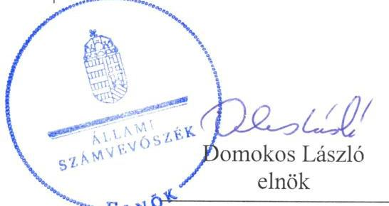

# Jelentés 

## Önkormányzatok integritásés belső kontrollrendszere

Az önkormányzatok belső
kontrollrendszere kialakításának és múködtetésének ellenőrzése, Adósságrendezési eljárás ellenőrzése Salomvár Község Önkormányzata 2019.

---

# Jelentés 

## Önkormányzatok integritásés belsö kontrollrendszere

Az önkormányzatok belső
kontrollrendszere kialakításának és múködtetésének ellenőrzése, Adósságrendezési eljárás ellenőrzéseSalomvár Község Önkormányzata
2019. 05 . hó 23. nap

---

# AZ ELLENŐRZÉST FELÜGYELTE:

- VARGA EDIT felügyeleti vezető:
- AZ ELLENŐRZÉST VEZETTE ÉS A VÉGREHAJTÁSÁÉRT FELELŐS:
- BAJNAI ZSUZSANNA ellenőrzésvezető
- TERLECZKYNÉ DR. EISELE EDIT ellenőrzésvezető
- A PROGRAM ÖSSZEÁLLÍTÁSÁÉRT FELELŐS:
- TÓTPÁL SZABOLCS osztályvezető

**IKTATÓSZÁM:** EL-0357-011/2019.

**Jelentéseink az Országgyűlés számítógépes hálózatán és az Interneten a www.asz.hu címen is olvashatóak.**

**TÉMASZÁM:** 2444

**ELLENŐRZÉS-AZONOSÍTÓ SZÁM:** V078926, V082943

---

# TARTALOMJEGYZÉK 

■ ÖSSZEGZÉS ..... 5
■ AZ ELLENŐRZÉS CÉLJA ..... 6
■ AZ ELLENŐRZÉS TERÜLETE ..... 7
■ AZ ELLENŐRZÉS HÁTTERE, INDOKOLTSÁGA ..... 8
■ A JELENTÉS LÉNYEGES KÉRDÉSKÖREI ..... 9
■ AZ ELLENŐRZÉS HATÓKÖRE ÉS MÓDSZEREI ..... 10
■ MEGÁLLAPÍTÁSOK ..... 13
■ JAVASLATOK ..... 15
■ MELLÉKLETEK ..... 17
I. sz. melléklet: Értelmező szótár ..... 17
■ FÜGGELÉKEK ..... 19
I. sz. függelék a Jelentéshez ..... 19
II. sz. függelék: Észrevételek ..... 20
■ RÖVIDÍTÉSEK JEGYZÉKE ..... 21

---

.

---

# ÖSSZEGZÉS 

Salomvár Község Önkormányzatánál nem volt biztositott a közpénzekkel, a nemzeti vagyonnal történő felelős gazdálkodás, az elszámoltathatóság.

## Az ellenőrzés társadalmi indokoltsága

Az Állami Számvevőszék alapvető feladata a közpénzekkel, az állami és önkormányzati vagyonnal való gazdálkodás ellenőrzése. Az Alaptörvény szerint az önkormányzatok kötelezettsége a kiegyensúlyozott, átlátható és fenntartható költségvetési gazdálkodás elvének érvényesítése, a nemzeti vagyonnal való rendeltetésszerű és felelős módon történő gazdálkodás biztosítása. Az Állami Számvevőszék stratégiájában megfogalmazott célkitűzése az integritás alapú, átlátható és elszámoltatható közpénzfelhasználás elősegítése. Ennek megvalósítása érdekében az Állami Számvevőszék prioritásként kezeli az önkormányzatok gazdálkodásának ellenőrzését.

Salomvár Község Önkormányzatát az Állami Számvevőszék korábban nem ellenőrizte.

## Főbb megállapítások, következtetések

Salomvár Község Önkormányzatánál a jegyző az adósságrendezési eljárás szabályszerűségét nem biztosította.
A belső kontrollrendszer kialakítása és múködtetése a 2016. évben nem volt szabályszerű, ezáltal nem volt biztosított az elszámoltatható gazdálkodás alapvető feltétele. A kontrollkörnyezetnek, a múködés és a gazdálkodás kereteinek kialakítása nem volt szabályszerű, mert a jegyző nem gondoskodott a számviteli elszámolásokat megalapozó belső szabályzatok elkészítéséről. Az integrált kockázatkezelési rendszert a jegyző nem alakította ki, mivel nem gondoskodott a szervezeti integritást sértő események kezelésének és az integrált kockázatkezelés eljárásrendjének szabályozásáról, továbbá nem mérte fel a szervezeti célokkal összefüggő kockázatokat. A gazdálkodási folyamatokhoz kapcsolódó kontrolltevékenységek szabálytalan gyakorlása miatt nem volt garantált a közpénzfelhasználás során a felelős gazdálkodás. Az információs és kommunikációs rendszer kialakításának szabálytalansága miatt nem volt biztosított a szervezet átláthatósága. A jegyző nem alakította ki a monitoring rendszert, mert nem gondoskodott sem az operatív tevékenységek keretében megvalósuló folyamatos és eseti nyomon követés, sem pedig a belső ellenőrzés kialakításáról. A belső kontrollrendszer hiányosságai magukban hordozzák az újbóli eladósodás kockázatát.

Az integritás kontrollokat nem alakították ki, így Salomvár Község Önkormányzata nem volt védett a korrupciós kockázatokkal szemben.

---

# AZ ELLENŐRZÉS CÉLJA 

Az ellenőrzés célja annak értékelése volt, hogy az adósságrendezési eljárás megindítása, lefolytatása szabályszerű volt-e, az önkormányzat gazdálkodása az adósságrendezési eljárás alatt megfelelt-e a jogszabályi előírásoknak, a lefolytatott eljárás elérte-e a törvényben kitűzött célokat. Az ellenőrzés célja továbbá annak megállapítása volt, hogy szabályszerűen történt-e az önkormányzat belső kontrollrendszerének kialakítása és működtetése, az biztosította-e az önkormányzatnál a közpénzfelhasználás szabályosságát, a közpénzekkel és a nemzeti vagyonnal történő szabályszerű és felelős gazdálkodást, a beszámolási és adatszolgáltatási kötelezettségek szabályszerű teljesítését. Az ellenőrzés keretében értékelte az ÁSZ ${ }^{1}$ az önkormányzat korrupciós kockázatainak kezelését szolgáló integritás kontrollok kiépítettségét és az integritás szemlélet érvényesülését.

---

# AZ ELLENŐRZÉS TERÜLETE 

## Salomvár Község Önkormányzata

Salomvár Zala megyében található, állandó lakosainak száma 2016. január 1-jén 610 fő volt a Központi Statisztikai Hivatal Magyarország közigazgatási helynévkönyve adatai alapján.

Az Önkormányzat² öt tagú képviselő-testületének ${ }^{3}$ munkáját egy állandó bizottság segítette.

Az Önkormányzat gazdálkodási feladatainak ellátásáról a Közös Hivatal ${ }^{4}$ gondoskodott, amely önálló szervezeti egységekre nem tagolódott. A Közös Hivatalban foglalkoztatott köztisztviselők száma 2016. év végén 12 fő volt.

A polgármester ${ }^{5}$ 2014. október 12-e óta töltötte be tisztségét, a jegyző ${ }^{6}$ 2013. január 1-je óta látta el feladatát.

Az Önkormányzatnál 2012. április 23. és 2013. január 28. között adósságrendezés folyt, a hitelezők követelése 35,0 millió Ft volt, amely az Önkormányzat vagyonának mintegy tizedét jelentette.

---

# AZ ELLENŐRZÉS HÁTTERE, INDOKOLTSÁGA 

A DEMOKRATIKUS TÁRSADALMAKBAN alapvető igény, hogy a közpénzeket, a közvagyont használók tevékenységükről elszámoljanak, ahhoz egyértelmű és érvényesíthető felelősségi szabályok társuljanak. Ennek a jogos igénynek az érvényesítéséhez meg kell teremteni azokat a folyamatokat, rendszereket, amelyek nélkülözhetetlenek az elszámoltatáshoz. Az elszámoltatás eredményes működtetéséhez szükség van a megfelelő információs, kontroll-, értékelési és beszámolási rendszerek kialakítására. A belső kontrollok kiépítettsége hozzájárul az integritási szemlélet kialakításához és érvényesüléséhez. A belső kontrollrendszer kialakítása és működtetése nélkül nem valósítható meg a közpénzek, a közvagyon szabályos, gazdaságos, hatékony és eredményes felhasználása.

A BELSŐ KONTROLLRENDSZER azt a célt szolgálja, hogy az államháztartás szervei működésük és gazdálkodásuk során a tevékenységeket szabályszerűen, gazdaságosan, hatékonyan, eredményesen hajtsák végre, teljesítsék elszámolási kötelezettségeiket, és megvédjék az erőforrásokat a veszteségektől, a károktól, a nem rendeltetésszerű használattól. A belső kontrollrendszer magában foglalja mindazon szabályokat, eljárásokat, gyakorlati módszereket és szervezeti struktúrákat, kockázatkezelési technikákat, kontrolltevékenységeket, amelyek segítséget nyújtanak a szervezetnek céljai eléréséhez.

A megfelelő belső kontrollrendszer jelentősen csökkenti a hibák és szabálytalanságok kockázatát. Az ÁSZ célja, hogy javuljon az ellenőrzött önkormányzatok belső kontrollrendszerének szabályozottsága, működésének megfelelősége, szabályszerűsége, hozzájárulva ezzel a pénzügyi egyensúlyi helyzet fenntarthatóságának biztosításához, biztosítva az önkormányzatnál a közpénzfelhasználás szabályosságát, a közpénzekkel és a nemzeti vagyonnal történő szabályszerű, gazdaságos, hatékony és eredményes gazdálkodást.

AZ ELLENŐRZÉS VÁRHATÓ HASZNOSULÁSA több szinten valósul meg. A törvényalkotás számára összegzett tapasztalatok állnak rendelkezésre a belső kontrollrendszer önkormányzati területen való kialakításáról, működtetéséről és hatásairól, az adósságrendezési eljárásról szóló törvény alkalmazásáról, a kitűzött célok megvalósulásáról. Az ellenőrzés az ellenőrzött számára visszajelzést ad az előírásoknak való megfelelés hiányosságairól, javaslataival hozzájárul azok kiküszöböléséhez. Az ellenőrzés megállapításait és javaslatait más szervezetek is hasznosíthatják a rendezett gazdálkodási keretek kialakításához. A ,jó gyakorlat" elterjesztésével azok az önkormányzatok is átvehetik a pozitív példákat, ahol nem végez ellenőrzést az ÁSZ.

Az ÁSZ ellenőrzései jelzik a társadalom számára, hogy közpénz nem maradhat ellenőrizetlenül, tevékenysége hozzájárul az értékteremtő rend kialakításához és megőrzéséhez.

---

# A JELENTÉS LÉNYEGES KÉRDÉSKÖREI 

1. Az adósságrendezési eljárás folyamata és végrehajtása szabályszerű volt-e?
2. Az Önkormányzat belső kontrollrendszerének kialakítása és müködtetése szabályszerű volt-e?

---

# AZ ELLENŐRZÉS HATÓKÖRE ÉS MÓDSZEREI 

## Az ellenőrzés típusa

Megfelelőségi ellenőrzés.

## Az ellenőrzött időszak

Az adósságrendezési eljárás esetében a 2010. január 1. és 2017. június 30. közötti időszakon belül az adósságrendezést megelőző egy teljes év január 1-jétől az adósságrendezéssel érintett évek és az adósságrendezés lezárását követő beszámolóval lezárt egy teljes év december 31-éig tartó időszak, a belső kontrollrendszer esetében a 2016. év volt.

## Az ellenőrzés tárgya

A Har. tv. ${ }^{7}$ által szabályozott adósságrendezési eljárás.
A helyi önkormányzatnak, mint éves költségvetési beszámoló készítésére kötelezett szervezetnek és a gazdálkodási feladatait ellátó közös önkormányzati hivatalának belső kontrollrendszere, valamint az integritás szemlélet érvényesülése.

Az ellenőrzés kiterjedt minden olyan körülményre és adatra, amely az ÁSZ jogszabályban meghatározott feladatainak teljesítéséhez, valamint a program végrehajtása folyamán felmerült újabb összefüggések feltárásához szükséges volt.

## Az ellenőrzött szervezet

Salomvár Község Önkormányzata és a gazdálkodási feladatait ellátó Teskándi Közös Önkormányzati Hivatal

## Az ellenőrzés jogalapja

Az ÁSZ tv. ${ }^{8}$ 5. § (2) bekezdése alapján az államháztartás gazdálkodásának ellenőrzése keretében az ÁSZ ellenőrzi a helyi önkormányzatok gazdálkodását, valamint az ÁSZ tv. 5. § (6) bekezdése alapján ellenőrzése során értékeli az államháztartás számviteli rendjének betartását és a belső kontrollrendszer múködését.

---

# Az ellenőrzés módszerei 

Az ÁSZ az ellenőrzést az ellenőrzési program szempontjai, az ellenőrzött időszakban hatályos jogszabályok, az ellenőrzés szakmai szabályai, az egyes ellenőrzési típusokhoz kapcsolódó ÁSZ módszertanok figyelembevételével végezte.

Az ellenőrzés ideje alatt az ÁSZ az Önkormányzattal a kapcsolattartást az ÁSZ SZMSZ ${ }^{9}$-ének vonatkozó előírásai alapján biztosította.

Az ellenőrzési kérdések megválaszolásához szükséges bizonyítékok megszerzése az Önkormányzat által rendelkezésre bocsátott dokumentumokra, adatokra alapozva megfigyelés, szemle (szemrevételezés), valamint elemző eljárás keretében történt.

Az ellenőrzési bizonyítékként felhasználható adatforrások közé tartoztak egyrészt az ellenőrzési program részletes szempontjainál felsorolt adatforrások, másrészt minden - az ellenőrzés folyamán feltárt, az ellenőrzés szempontjából információt tartalmazó - dokumentum.

Az Önkormányzat belső kontrollrendszere jogszabályi előírások szerinti kialakításának és működtetésének szabályszerűségét az erre irányuló ellenőrzési kérdésekre adott válaszok összesítése alapján, pillérenként (kontrollkörnyezet, kockázatkezelési rendszer, kontrolltevékenységek, információs és kommunikációs rendszer, monitoring rendszer) és összesítetten is értékelte az ÁSZ. Az önkormányzat belső kontrollrendszere egyes pilléreinek kialakítása és működtetése „szabályszerü", amennyiben az értékelt területen az elért igen válaszok százalékban kifejezett, egész számra kerekített aránya, meghaladja a $85 \%$-ot, ha nem haladja meg, akkor a minősítés „nem szabályszerű" lesz. Az önkormányzat belső kontrollrendszerének öszszesített értékelése megegyezik a pillérenként (kontrollterületenként) alkalmazott százalékos értékelésekkel. A kontrollrendszer egésze esetében a „szabályszerű" értékelésnek a százalékos értéken felül további feltétele, hogy egyik kontrollterület sem kaphat „nem szabályszerű" értékelést. Az összesített értékelés a százalékos értéktől függetlenül „nem szabályszerű", ha az ellenőrzött kontrollterületek közül több mint egynek „nem szabályszerű" az értékelése.

A kiadások teljesítéséhez kapcsolódó kontrolltevékenység gyakorlása, működtetésének szabályszerűsége esetében az ellenőrzés azokra a legnagyobb értékű tételekre - a lényeges sokaságra - terjedt ki, melyek összértéke eléri a teljes sokaság összértékének 50\%-át.

A lényeges sokaságból véletlen mintavételi eljárással kiválasztott tételek kerültek ellenőrzésre.
„Szabályszerű" egy ellenőrzött terület, amennyiben 95\%-os bizonyossággal az ellenőrzött sokaságban az átlagos hibaarány legfeljebb 10\%, "nem szabályszerű", amennyiben 10\%-nál magasabb.

A közszféra integritás alapú kultúrájának kialakítása, megerősítése és működése szorosan összefügg a belső kontrollrendszer működésével, ezért az ellenőrzés kiterjedt annak értékelésére is, hogy a belső kontrollrendszer kialakítása és működtetése hogyan hatott az integritás szemlélet érvényesülésére.

---

Az adósságrendezési eljárás vonatkozásában amennyiben az önkormányzat múködését és gazdálkodását alapvetően meghatározó dokumentum hiánya miatt, valamely lényeges kérdéskörre vonatkozóan az ÁSZ megállapítást tett, további ellenőrzési tevékenységek az adott kérdéskörrel és az azzal szoros logikai kapcsolatban lévő kérdéskörökkel - ráépülő jelleggel - nem kerültek végrehajtásra.

---

# 1. Az adósságrendezési eljárás folyamata és végrehajtása szabályszerű volt-e? 

Összegző megállapítás

Az adósságrendezési eljárás folyamata, végrehajtása nem volt szabályszerű.

AZ ADÓSSÁGRENDEZÉSI ELJÁRÁS időszakában hivatalban lévő jegyző ${ }^{10}$ a Htv. ${ }^{11} 140$. § (1) bekezdés h) pontja szerinti feladatkörében eljárva nem készített a beszámoló elkészítését megelőzően a könyvviteli zárlat során főkönyvi kivonatot a Számv. tv. 164. § (2) bekezdésében, az Áhsz. ${ }^{12}$ 50. § (1) bekezdésében, az Áhsz. ${ }^{13}$ 5. § (1) bekezdésében foglaltak ellenére a 2011.-2014. években, így az éves költségvetési beszámoló nem volt alátámasztott, ezáltal sérült a Számv. tv. 15. § (3) bekezdésében foglalt valódiság elve.

## 2. Az Önkormányzat belső kontrollrendszerének kialakítása és müködtetése szabályszerű volt-e?

## Összegző megállapítás

A belső kontrollrendszer kialakítása és működtetése a 2016. évben nem volt szabályszerű.

A KONTROLLKÖRNYEZET kialakítása nem volt szabályszerű, mivel a Közös Hivatali SZMSZ ${ }^{14}$ nem tartalmazta az Ávr. ${ }^{15}$ 13. § (1) bekezdés e) pontja ellenére a Közös Hivatal szervezeti ábráját. A jegyző nem készített a Közös Hivatal múködési folyamatairól ellenőrzési nyomvonalat a Bkr. ${ }^{16}$ 6. § (3) bekezdésének előírása ellenére. A jegyző nem készítette el a Számv. tv. ${ }^{17}$ 14. § (5) bekezdés b) pontjának előírása ellenére a Közös Hivatal eszközök és a források értékelési szabályzatát.

A képviselő-testület SZMSZ-e ${ }^{18}$, a vagyonrendelet ${ }^{19}$, az önkormányzati Számviteli politika ${ }^{20}$ és az annak keretében kötelezően kialakítandó szabályzatok ${ }^{21}$ megfeleltek az előírásoknak.

A KOCKÁZATKEZELÉSI RENDSZERT 2016. szeptember 30-ig, valamint az integrált kockázatkezelési rendszert 2016. október 1jétől a jegyző nem alakította ki a Közös Hivatalnál a Bkr. 3. § b) pontjában foglaltak ellenére, mert nem szabályozta 2016. szeptember 30-ig a szabálytalanságok kezelésének, 2016. október 1-jétől a szervezeti integritást sértő események kezelésének- és az integrált kockázatkezelés eljárásrendjét a Bkr. 6. § (4) bekezdésében előírtak ellenére. Továbbá a jegyző nem mérte fel és nem állapította meg a Bkr. 7. § (2) bekezdésében foglaltak ellenére a Közös Hivatal tevékenységében rejlő és szervezeti célokkal összefüggő kockázatokat.

---

A KONTROLLTEVÉKENYSÉGEK működtetése nem volt szabályszerű, mert az önkormányzati kiadási előirányzatok terhére teljesített kifizetéseknél nem vállaltak kötelezettséget az Áht. ${ }^{22} 37$. § (1) bekezdésében foglaltak ellenére, továbbá a teljesítésigazolást nem végezték el az Ávr. 57. § (1) bekezdésében előírtak szerint.

A jegyző az Áht. 6/C. § (1) bekezdés szerinti feladatkörében eljárva nem gondoskodott a gazdálkodási feladatok Számv. tv. előírásainak megfelelő ellátásáról, mert a Számv. tv. 165. § (2) bekezdésében foglaltak ellenére bizonylat nélkül rögzítettek adatot az Önkormányzat könyvviteli nyilvántartásaiban, megsértve a Számv. tv. 15. § (3) bekezdése szerinti valódiság elvét.

# AZ INFORMÁCIÓS ÉS KOMMUNIKÁCIÓS RENDSZER kialakítása nem volt szabályszerű, mert a jegyző nem adott ki a Közös Hivatalra vonatkozó iratkezelési szabályzatot az Ltv. ${ }^{23} 10 . \S$ (1) bekezdés c) pontjában foglaltak ellenére. A polgármester nem készítette el az Önkormányzat, a jegyző a Közös Hivatal adatvédelmi és adatbiztonsági szabályzatát az Info tv. 24. § (3) bekezdésének ${ }^{24}$ előírása ellenére. 

A MONITORING RENDSZERT a jegyző nem alakította ki a Bkr. 10. §-ában foglaltak ellenére a Közös Hivatalnál, mivel nem gondoskodott az operatív tevékenységek keretében megvalósuló folyamatos és eseti nyomon követésről, valamint az Áht. 70. § (1) bekezdésében foglaltak ellenére a belső ellenőrzésről.

AZ INTEGRITÁS SZEMLÉLET nem érvényesült az Önkormányzatnál az előírt kontrollok és a kockázatkezelés kialakításának hiánya miatt.

---

# JAVASLATOK 

Az ÁSZ tv. 33. § (1) bekezdésében foglaltak értelmében az ellenőrzött szervezet vezetője köteles a jelentésben foglalt megállapításokhoz kapcsolódó intézkedési tervet összeállítani és azt a jelentés kézhezvételétől számított 30 napon belül az ÁSZ részére megküldeni. Amennyiben az ellenőrzött szervezet vezetője nem küldi meg határidőben az intézkedési tervet, vagy továbbra sem elfogadható intézkedési tervet küld, az Állami Számvevőszék elnöke az ÁSZ tv. 33. § (3) bekezdése a) és b) pontjaiban foglaltakat érvényesítheti.

## Teskándi Közös Önkormányzati Hivatal jegyzőjének

1. Az Önkormányzat szabályszerű kontrollkörnyezetének kialakítása érdekében intézkedjen a Közös Hivatal:
a) jogszabályi előírásoknak megfelelő tartalmú szervezeti és müködési szabályzatának elkészitéséről;
(2. sz. megállapítás 1. bekezdés 1. mondat 2. tagmondata alapján)
b) ellenőrzési nyomvonalának elkészitéséről;
(2. sz. megállapítás 1. bekezdés 2. mondata alapján)
c) eszközök és a források értékelési szabályzatának elkészitéséről;
(2. sz. megállapítás 1. bekezdés 3. mondata alapján)
2. A Közös Hivatal szabályszerű integrált kockázatkezelési rendszerének kialakítása és müködtetése érdekében intézkedjen:
a) a szervezeti integritást sértő események kezelésének, valamint az integrált kockázatkezelés eljárásrendjének szabályozásáról;
(2. sz. megállapítás 3. bekezdés 1. mondat 4. tagmondata alapján)
b) a Közös Hivatal tevékenységében rejlő és szervezeti célokkal összefüggő kockázatok felméréséről és megállapításáról.
(2. sz. megállapítás 3. bekezdés 2. mondata alapján)
3. Intézkedjen arról, hogy a számviteli (könyvviteli) nyilvántartásokba csak szabályszerűen kiállított bizonylat alapján jegyezzenek be adatokat.
(2. sz. megállapítás 5. bekezdése alapján)

---

4. Az információs és kommunikációs rendszer szabályszerű kialakítása és müködtetése érdekében gondoskodjon a Közös Hivatal:
a) iratkezelési szabályzatának kiadásáról;
(2. sz. megállapítás 6. bekezdés 1. mondata alapján)
b) adatvédelmi és adatbiztonsági szabályzatának elkészitéséről.
(2. sz. megállapítás 6. bekezdés 2. mondat 2. tagmondata alapján)
5. A szabályszerű monitoring rendszer kialakítása és müködtetése érdekében intézkedjen a Közös Hivatalnál a belső ellenőrzés kialakításáról és müködtetéséről.
(2. sz. megállapítás 7. bekezdés 1. mondat 3. tagmondata alapján)

# Salomvár Község Önkormányzata polgármesterének 

1. Az Önkormányzat vonatkozásában gondoskodjon a jogszabályi előírásoknak megfelelő kötelezettségvállalásról.
(2.sz. megállapítás 4. bekezdés 1. mondat 2. tagmondata alapján)
2. Az Önkormányzat vonatkozásában gondoskodjon a jogszabályi előírásoknak megfelelően a teljesítés igazolási jogkör gyakorlásáról.
(2.sz. megállapítás 4. bekezdés 1. mondat 3. tagmondata alapján)
3. Az Önkormányzat vonatkozásában gondoskodjon az adatvédelmi és adatbiztonsági szabályzatának elkészitéséről.
(2. sz. megállapítás 6. bekezdés 2. mondata alapján)

---

# MELLÉKLETEK 

- I. SZ. MELLÉKLET: ÉRTELMEZŐ SZÓTÁR
belső ellenőrzés
belső kontrollrendszer
belső kontrollrendszer pillérei, kontrollterületei
helyi önkormányzat
Független, tárgyilagos bizonyosságot adó és tanácsadó tevékenység, amelynek célja, hogy az ellenőrzött szervezet működését fejlessze és eredményességét növelje, az ellenőrzött szervezet céljai elérése érdekében rendszerszemléletű megközelítéssel és módszeresen értékeli, illetve fejleszti az ellenőrzött szervezet irányítási és belső kontrollrendszerének hatékonyságát. (Forrás: Bkr. 2. § b) pontja)
A belső kontrollrendszer a kockázatok kezelése és tárgyilagos bizonyosság megszerzése érdekében kialakított folyamatrendszer, amely azt a célt szolgálja, hogy a müködés és gazdálkodás során a tevékenységeket szabályszerűen, gazdaságosan, hatékonyan, eredményesen hajtsák végre, az elszámolási kötelezettségeket teljesítsék, megvédjék az erőforrásokat a veszteségektől, károktól és nem rendeltetésszerű használattól. (Forrás: Áht. 69. § (1) bekezdése)
A kontrollkörnyezet, az (integrált) kockázatkezelési rendszer, a kontrolltevékenységek, az információs és kommunikációs rendszer, valamint a nyomon követési (monitoring) rendszer. (Forrás: Bkr. 3. §-a)
A helyi önkormányzat jogi személy. Az önkormányzati feladatok ellátását a képviselő-testület és szervei biztosítják. A képviselő-testület szervei: a polgármester, a főpolgármester, a megyei közgyűlés elnöke, a képviselő-testület bizottságai, a részönkormányzat testülete, az önkormányzati hivatal, a megyei önkormányzati hivatal, a közös önkormányzati hivatal, a jegyző, továbbá a társulás. A képviselő-testület a feladatkörébe tartozó közszolgáltatások ellátására - jogszabályban meghatározottak szerint - költségvetési szervet, a polgári perrendtartásról szóló törvény szerinti gazdálkodó szervezetet (a továbbiakban: gazdálkodó szervezet), nonprofit szervezetet és egyéb szervezetet (a továbbiakban együtt: intézmény) alapíthat, továbbá szerződést köthet természetes és jogi személlyel vagy jogi személyiséggel nem rendelkező szervezettel. A helyi önkormányzat éves költségvetési beszámolója magában foglalja a helyi önkormányzat - nem költségvetési szerveihez tartozó - feladataihoz kapcsolódó bevételeket és kiadásokat. A helyi önkormányzat összevont (konszolidált) költségvetési beszámolóját a helyi önkormányzatra és költségvetési szerveire vonatkozóan külön-külön beérkezett éves költségvetési beszámolók alapján a Kincstár ${ }^{25}$ készíti el és küldi meg az önkormányzatnak. (Forrás: Mötv. 41. § (1), (2), (6) bekezdései; Áhsz. 2. § (1) bekezdése, 6. § (1) bekezdés a) és f) pontja, 30. §-a, 37. § (1) és (6) bekezdése)
információs és kommunikációs rendszer
A költségvetési szerv vezetője által kialakított és működtetett olyan rendszer, mely biztosítja, hogy a megfelelő információk a megfelelő időben eljutnak az illetékes szervezethez, szervezeti egységhez, illetve személyhez. (Forrás: Bkr. 9. § (1) bekezdés)
integrált kockázatkezelési rendszer
olyan folyamatalapú kockázatkezelési rendszer, amely a szervezet minden tevékenységére kiterjed, egységes módszertan és eljárások alkalmazásával, a szervezet célkitűzéseinek és értékeinek figyelembevételével biztosítja a szervezet kockázatainak teljes körű azonosítását, azok meghatározott kritériumok szerinti értékelését, valamint a kockázatok kezelésére vonatkozó intézkedési terv elkészítését és az abban foglaltak nyomon követését (Forrás: Bkr. 2. § m) pontja 2016. október 1-jétől)

---

integritás
kockázatkezelési rendszer
kontrollkörnyezet
kontrolltevékenységek
költségvetési szerv vezetője (Bkr. alkalmazásában)
közös önkormányzati hivatal
monitoring rendszer

Az integritás elvek, értékek, cselekvések, módszerek, intézkedések konzisztenciáját jelenti: olyan magatartásmódot, amely meghatározott értékeknek felel meg. Az integritás a közszféra esetében a társadalom által elvárt nyilvánossági, átláthatósági, illetve jogi/etikai normáknak történő megfelelést jelenti.
(Forrás: a http://integritas.asz.hu honlapon közzétett „A 2012. évi integritás felmérés eredményeinek összefoglalója" című dokumentum 3. oldal 1. bekezdése)
Olyan irányítási eszközök és módszerek összessége, melynek elemei a szervezeti célok elérését veszélyeztető tényezők (kockázatok) azonosítása, elemzése, csoportosítása, nyomon követése, valamint szükség esetén a kockázati kitettség mérséklése. (Forrás: Bkr. 2. § m) pontja 2016. szeptember 30-ig)
A költségvetési szerv vezetője által kialakított olyan elvek, eljárások, belső szabályzatok összessége, amelyben világos a szervezeti struktúra, egyértelműek a felelősségi, hatásköri viszonyok és feladatok, meghatározottak az etikai elvárások a szervezet minden szintjén, átlátható a humánerőforrás-kezelés. (Forrás: Bkr. 6. § (1) bekezdés)
A költségvetési szerv vezetője által a szervezeten belül kialakított (kontroll) tevékenységek, melyek biztosítják a kockázatok kezelését, hozzájárulnak a szervezet céljainak eléréséhez. (Forrás: Bkr. 8. § (1) bekezdés)
Helyi önkormányzat esetén a jegyző, főjegyző, társulás esetén a társulási megállapodásban meghatározott önkormányzat jegyzője. (Forrás: Bkr. 2. § n) pont nb) alpont)
települési képviselő-testület más települési képviselő-testülettel társult kép-viselő-testületet alakíthat, amely esetén a képviselő-testületek részben vagy egészben egyesítik a költségvetésüket, közös önkormányzati hivatalt tartanak fenn, és intézményeiket közösen működtetik. (Forrás: Mötv. 56. § (1)-(2) bekezdései)
nyomon követési rendszer (monitoring) a szervezet tevékenységének, a célok megvalósításának nyomon követését biztosító rendszer, mely az operatív tevékenységek keretében megvalósuló folyamatos és eseti nyomon követésből, valamint az operatív tevékenységektől függetlenül működő belső ellenőrzésből áll (Forrás: Bkr. 10. §-a)

---

# FÜGGELÉKEK 

- I. SZ. FÜGGELÉK A JELENTÉSHEZ

Az Állami Számvevőszék az ellenőrzések során feltárt tényekhez kapcsolódó további körülmények tisztázására eszközrendszerrel nem rendelkezik. Amennyiben az ellenőrzésen túlmutatóan indokoltnak látszik az ellenőrzés során feltárt körülmények további vizsgálata, az Állami Számvevőszék törvényi felhatalmazás alapján az ellenőrzés által feltárt körülményeket továbbítja a hatáskörrel rendelkező szervnek a szükséges intézkedések megtétele, eljárások lefolytatása érdekében.
I.

1. Az Önkormányzat az Áht. 37. § (1) bekezdésében foglalt előírások ellenére nem rendelkezett kötelezettségvállalással összesen 2501106 Ft összegű kiadásra vonatkozóan a 2016 évben.
2. A teljesítésigazolás nem felelt meg az Ávr. 57. § (1) bekezdésében foglaltaknak, mert a 2016. évben a teljesítésigazoló ellenőrizhető okmányok hiányában nem ellenőrizte a kiadások teljesitésének jogosságát, összegszerüségét, valamint az ellenszolgáltatás teljesitését.
3. Az ÁSZ feltárta továbbá, hogy a 2016. évben 1476464 Ft értékben teljesített külső személyi juttatás bizonylattal nem volt alátámasztva a Számv. tv. 165. § (2) bekezdése ellenére.
A szabálytalan kifizetések, a bizonylatok hiánya miatt nem igazolt, hogy a kiadások valóban az Önkormányzat érdekében merültek fel, illetve annak feladatellátását szolgálták, igy nem zárható ki annak lehetősége, hogy azok vagyoni hátrányt okozhattak az Önkormányzatnak.
4. A számvevőszéki ellenőrzés feltárta, hogy az Önkormányzat 2014. évi költségvetési beszámolója alátámasztásához nem készült záró fökönyvi kivonat a Számv. tv. 164. § (2) bekezdésében, az Áhsz. 5. § (1) bekezdésében foglaltak ellenére.
A fökönyvi kivonat hiánya miatt a 2014. évben az Önkormányzat vagyoni helyzete nem volt áttekinthető.
Az esetek konkrét körülményeinek felderítésére az ügyészség rendelkezik hatáskörrel.
II.

Az I/4. pontban rögzített szabálytalanság miatt nem igazolt, hogy az Önkormányzat éves költségvetési beszámolója megbizható, valós összképet mutat az Önkormányzat vagyonáról, igy a Számv. tv. 15. § (3) bekezdésében rögzített valódiság alapelvének teljesülése nem volt bizonyitott.
Az eset konkrét körülményeinek felderítésére a Kincstár rendelkezik hatáskörrel.

---

A jelentéstervezetet a Számvevőszék 15 napos észrevételezésre megküldte az ellenőrzött szervezetek vezetőinek az ÁSZ tv. 29. §* (1) bekezdése előirásának megfelelően.

Az ÁSZ a jelentéstervezetet észrevételezésre megküldte Salomvár Község Önkormányzata polgármestere, valamint a Teskándi Közös Önkormányzati Hivatal vezetője részére.
Salomvár Község Önkormányzata polgármestere, valamint a Teskándi Közös Önkormányzati Hivatal vezetője az ÁSZ tv. 29. § (2) bekezdésében foglalt észrevételezési jogával nem élt, a jelentéstervezet megállapításaira a törvényes határidőn belül észrevételt nem tett.

[^0]
[^0]:    * 29. § (1) Az Állami Számvevőszék az ellenőrzési megállapításait megküldi az ellenőrzött szervezet vezetőjének vagy az általa megbízott személynek, és annak, akinek személyes felelősségét állapította meg.
    (2) Az ellenőrzött szervezet vezetője és a felelősként megjelölt személy az ellenőrzés megállapításaira tizenöt napon belül írásban észrevételt tehet.
    (3) Az Állami Számvevőszék az észrevételre a beérkezésétől számított harminc napon belül írásban válaszol. A figyelembe nem vett észrevételeket köteles a jelentésben feltüntetni, és megindokolni, hogy azokat miért nem fogadta el.

---

# RÖVIDÍTÉSEK JEGYZÉKE 

${ }^{1}$ ÁSZ
${ }^{2}$ Önkormányzat
${ }^{3}$ képviselő-testület
${ }^{4}$ Közös Hivatal
${ }^{5}$ polgármester
${ }^{6}$ jegyző
${ }^{7}$ Har. tv.
${ }^{8}$ ÁSZ tv.
${ }^{9}$ ÁSZ SZMSZ
${ }^{10}$ adósságrendezési eljárás időszakában hivatalban lévő jegyző
${ }^{11} \mathrm{Htv}$.
${ }^{12}$ Áhsz. 1
${ }^{13}$ Áhsz. 2
${ }^{14}$ Közös Hivatali SZMSZ
${ }^{15}$ Ávr.
${ }^{16}$ Bkr.
${ }^{17}$ Számv. tv.
${ }^{18}$ képviselő-testület SZMSZ-e
${ }^{19}$ vagyonrendelet
${ }^{20}$ Számviteli politika
${ }^{21}$ számviteli politika keretében kötelezően kialakítandó szabályzatok
${ }^{22}$ Áht.
${ }^{23} \mathrm{Ltv}$.

Állami Számvevőszék
Salomvár Község Önkormányzata
Salomvár Község Önkormányzatának képviselő-testülete
Teskándi Közös Önkormányzati Hivatal
Salomvár Község Önkormányzatának polgármestere
Teskándi Közös Önkormányzati Hivatal jegyzője (2015. január 1-től)
1996. évi XXV. törvény a helyi önkormányzatok adósságrendezési eljárásáról (hatályos 1996. június 11-től)
2011. évi LXV. törvény az Állami Számvevőszékről (hatályos 2011. július 1-jétől)

Az Állami Számvevőszék elnökének 4/2017. (XII.29.) ÁSZ utasítása az Állami Számvevőszék Szervezeti és Működési Szabályzatáról (hatályos 2018. január 1-jétől)
Zalacséb-Zalaháshágy-Salomvár Községek Körjegyzősége körjegyzője
1991. évi XX. törvény a helyi önkormányzatok és szerveik, a köztársasági megbízottak, valamint egyes centrális alárendeltségű szervek feladat- és hatásköreiről (hatályos 1991. július 23.)
249/2000. (XII. 24.) Korm. rendelet az államháztartás szervezetei beszámolási és könyvvezetési kötelezettségének sajátosságairól
(hatályos 2001. január 1-jétől 2013. december 31-ig)
4/2013. (I. 11.) Korm. rendelet az államháztartás számviteléről (hatályos 2014. január 1-jétől)
Teskándi Közös Önkormányzati Hivatal Szervezeti és Müködési Szabályzata (hatályos 2015. március 1-jétől)
368/2011. (XII. 31.) Kormányrendelet az államháztartásról szóló törvény végrehajtásáról (hatályos 2012. január 1-jétől)
370/2011. (XII. 31.) Korm. rendelet a költségvetési szervek belső kontrollrendszeréről és belső ellenőrzéséről (hatályos 2012. január 1-jétől) 2000. évi C törvény a számvitelről (hatályos 2001. január 1-től)

Salomvár Község Önkormányzat képviselő-testületének 7/2011. (IV.27.) önkormányzati rendelete a Szervezeti és Müködési Szabályzatról, módosítva az 5/2013. (IV.04.), a 13/2014. (XI.28.) és az 1/2015. (III.2.) önkormányzati rendeletekkel (hatályos 2011. április 27-től)
Salomvár Község Önkormányzat képviselő-testületének 17/2012. (VI.29.) önkormányzati rendelete az önkormányzat vagyonáról és a vagyongazdálkodás szabályairól
Salomvár Község Önkormányzat Számviteli politika (hatályos 2016. április 1-től)
Salomvár Község Önkormányzata Eszközök és források értékelési szabályzata (hatályos 2015. január 1-től)
Salomvár Község Önkormányzata leltározási és leltárkészítési szabályzat (hatályos 2015. január 1-től)
Pénzkezelési szabályzat (hatályos 2015. január 1-től)
2011. évi CXCV. törvény az államháztartásról (hatályos 2012. január 1-jétől) 1995. évi LXVI. törvény a köziratokról, a közlevéltárakról és a magánlevéltári anyag védelméről (hatályos 1996. január 1-től)

---

${ }^{24}$ Info tv. 24. § (3) bekezdés
${ }^{25}$ Kincstár
2011. évi CXII. törvény az információs önrendelkezési jogról és az információszabadságról 24. § (3) bekezdése (hatályos 2011. július 27-től 2018. július 25-ig.)
Magyar Államkincstár

---

ÁLLAMI SZÁMVEVŐSZÉK
1052 Budapest, Apáczai Csere János utca 10.
Levélcím: 1364 Budapest 4. Pf. 54
Telefon: +36 14849100 Telefax: +36 14849200
www.asz.hu