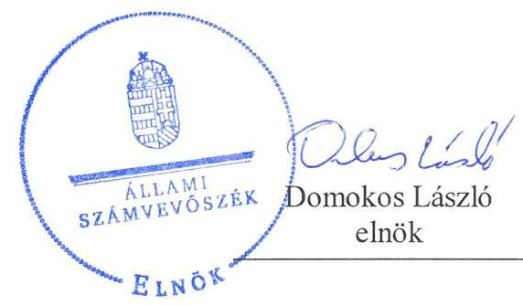
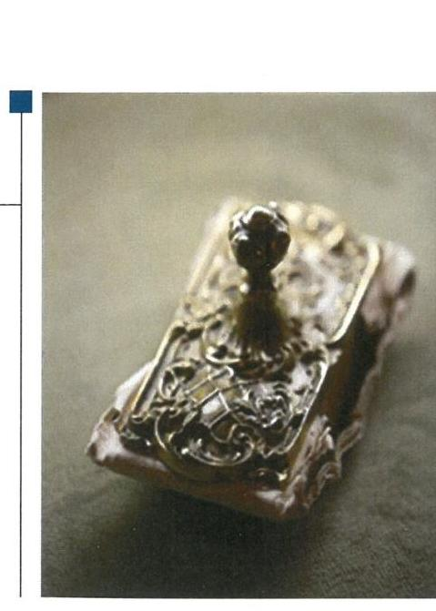
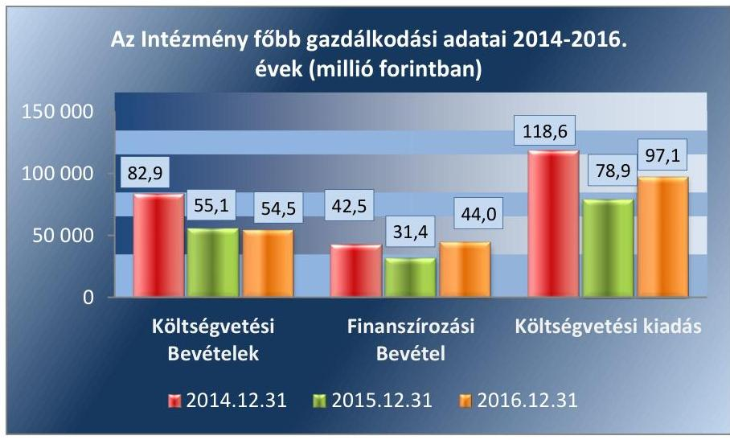

# Jelentés 

## A központi alrendszer intézményei

A központi alrendszer egyes intézményei pénzügyi és vagyongazdálkodásának ellenőrzése - Fejér Megyei Művelődési Központ 2019.

---

# Jelentés 

## A központi alrendszer intézményei

A központi alrendszer egyes intézményei pénzügyi és vagyongazdálkodásának ellenőrzése - Fejér Megyei Művelődési Központ 2019. 05. hó 16. nap

---

# AZ ELLENŐRZÉST FELÜGYELTE:

- **SALAMON ILDIKÓ** felügyeleti vezető

- **AZ ELLENŐRZÉST VEZETTE ÉS A VÉGREHAJTÁSÁÉRT FELELŐS:**
  - **DR. JAKAB KORNÉL** ellenőrzésvezető
  - **A PROGRAM ÖSSZEÁLLÍTÁSÁÉRT FELELŐS:**
    - **TÓTPÁL SZABOLCS** osztályvezető

**IKTATÓSZÁM:** EL-0317-032/2019.

**TÉMASZÁM:** 2450

**ELLENŐRZÉS-AZONOSÍTÓ SZÁM:** V079112

Jelentéseink az Országgyűlés számítógépes hálózatán és az Interneten a www.asz.hu címen is olvashatóak.

---

# TARTALOMJEGYZÉK 

■ ÖSSZEGZÉS ..... 5
■ AZ ELLENŐRZÉS CÉLJA ..... 6
■ AZ ELLENŐRZÉS TERÜLETE ..... 7
■ AZ ELLENŐRZÉS HÁTTERE, INDOKOLTSÁGA ..... 9
■ A JELENTÉS LÉNYEGES KÉRDÉSKÖREI ..... 10
■ AZ ELLENŐRZÉS HATÓKÖRE ÉS MÓDSZEREI ..... 11
■ MEGÁLLAPÍTÁSOK ..... 13
■ JAVASLATOK ..... 18
■ MELLÉKLETEK ..... 23
I. sz. melléklet: Értelmező szótár ..... 23
■ FÜGGELÉK: ÉSZREVÉTELEK ..... 25
■ RÖVIDÍTÉSEK JEGYZÉKE ..... 31

---

.

---

# ÖSSZEGZÉS 

A Fejér Megyei Művelődési Központ belső kontrollrendszerének kialakítása és működtetése nem biztosította a közpénzekkel és a nemzeti vagyonnal történő átlátható, szabályszerű gazdálkodást, illetve a beszámolási és adatszolgáltatási kötelezettségek szabályszerű teljesítését. A pénzügyi és vagyongazdálkodás az ellenőrzött időszakban nem volt szabályszerű. Az integritás szemlélet nem érvényesült, az integritás kontrollrendszert nem a kockázatokkal arányosan építették ki.

## Az ellenőrzés társadalmi indokoltsága

Az államháztartás központi alrendszerének közpénz felhasználása, az Intézmények által ellátott közfeladatok sokrétűsége, valamint a feladatellátásához rendelt vagyon nagyságrendje indokolja, hogy az Állami Számvevőszék ellenőrzéseket folytasson a pénzügyi és vagyongazdálkodás területén. Az Állami Számvevőszék az ellenőrzései során feltárja a gazdálkodást, a központi alrendszer Intézményeinek átalakulását, átszervezését érintő szabályozások esetleges hiányosságait, a szabályozással nem érintett gazdálkodási területeket, rámutathat a vagyongazdálkodási tevékenységeken belül a tulajdonosi joggyakorlás és vagyonkezelés esetleges szabálytalanságaira, értékeli az állami vagyon nyilvántartására és elszámolására vonatkozó eljárásokat. Az ellenőrzésünkkel hozzá kívánunk járulni a központi Intézmények pénzügyi helyzetének pontosabb megítéléséhez, a jó gyakorlat kialakításán és terjesztésén keresztül az ellenőrzéseink elősegíthetik a gazdálkodás szabályszerűségének javítását.

## Főbb megállapítások, következtetések, javaslatok

Az Irányító szervnek a Fejér Megyei Művelődési Központra vonatkozó feladatellátása szabályszerű volt.
A Fejér Megyei Művelődési Központ belső kontrollrendszerének kialakítása és működtetése nem volt szabályszerű, emiatt nem volt biztosított az átlátható és elszámoltatható közpénzfelhasználás.

A kontrollkörnyezet kialakítása a szabályozási hiányosságok következtében nem volt szabályszerű. 2016. október 1-et követően a Fejér Megyei Művelődési Központ vezetője nem szabályozta az integrált kockázatkezelési rendszer eljárásrendjét, annak működtetése nem felelt meg a jogszabályi előírásoknak. A kontrolltevékenység kialakítása és gyakorlása, valamint az információs és kommunikációs folyamatok kialakítása és működtetése nem volt szabályszerű. A Fejér Megyei Művelődési Központ vezetője nem a jogszabályi előírásoknak megfelelően alakította ki a szervezet tevékenységének, a célok megvalósításának folyamatos és eseti nyomon-követését biztosító rendszert.

A pénzügyi gazdálkodás nem volt szabályszerű. A kiadási előirányzatok felhasználása, valamint a bevételek beszedése során a pénzgazdálkodási jogkörök gyakorlása nem felelt meg a jogszabályi előírásoknak, valamint a bevételek elszámolása nem volt szabályszerű. Az előirányzat maradvány megállapítása, a kötelezettségvállalások, más fizetési kötelezettségek nyilvántartása nem volt szabályszerű.

A vagyongazdálkodás nem volt szabályszerű. A gazdálkodási feladatok ellátásáért felelős Szociális és Gyermekvédelmi Főigazgatóság a 2014 - 2016. években az Intézmény mérleg tételeinek alátámasztásához nem állított össze olyan leltárt, amely tételesen, ellenőrizhető módon tartalmazza a mérleg fordulónapján meglévő eszközöket és forrásokat mennyiségben és értékben.

Az integritás szemlélet nem érvényesült, az integritás kontrollrendszert nem a kockázatokkal arányosan építették ki.

Az Állami Számvevőszék az Emberi erőforrások miniszterének egy, a Szociális és Gyermekvédelmi Főigazgatóság, mint a Fejér Megyei Művelődési Központ gazdasági szervezeti feladatait ellátó szerv főigazgatójának hét, a Fejér Megyei Művelődési Központ igazgatójának tizenhét javaslatot tett.

---

# AZ ELLENŐRZÉS CÉLJA 

let érvényesülését.

AZ ELLENŐRZÉS CÉLJA annak megítélése volt, hogy az ellenőrzött intézményre vonatkozó Irányító szervi feladatellátás a jogszabályi előírások betartásával történt-e; az intézménynél a belső kontrollrendszer kialakítása és működtetése szabályszerű volt-e; az intézmény pénzügyi és vagyongazdálkodása megfelelt-e a jogszabályi előírásoknak és belső szabályzatainak; az intézmény átalakításának vagy átszervezésének lebonyolítása szabályszerűen történt-e. Az ellenőrzés keretében értékeltük az intézmény korrupciós kockázatainak kezelését szolgáló integritás kontrollok kiépítettségét és az integritás szemlé-

---

# **AZ ELLENŐRZÉS TERÜLETE**

## **Fejér Megyei Művelődési Központ**

A Fejér Megyei Művelődési Központ 53 éve látja el Székesfehérváron és Fejér megyében a közművelődés szervezésével kapcsolatos feladatokat. Az Intézmény1 feladata Fejér megyében a kulturális műsorok, rendezvények, kiállítások, egyéb közművelődési tevékenységek szervezése, támogatása, szabadidős szolgáltatások biztosítása, egyéb szórakoztatási tevékenység.

Az Intézmény látogatói létszáma 2014-ben 62,6 ezer fő, 2015-ben 74,1 ezer fő, 2016-ban 70,4 ezer fő volt.

A 258/2011. (XII.7.) Korm. rendelet2 rendelkezése szerint 2013. március 31. napjával a megyei intézményfenntartó központok (FMIK3) a Szociális és Gyermekvédelmi Főigazgatóságba történő beolvadással megszűntek. Az SZGYF4 a megyei intézményfenntartó központok általános és egyetemes jogutódja lett, melynek eredményeként az ellenőrzött időszakban az Intézmény Középirányító szerve5 és fenntartója az SZGYF, irányító szerve az Emberi Erőforrások Minisztériuma volt. Az Intézmény önállóan működő költségvetési szerv, gazdasági szervezettel nem rendelkezik, gazdálkodási feladatait az ellenőrzött időszakban az SZGYF látta el.

1. ábra

*Forrás: Az Intézmény 2014-2016. évi éves költségvetési beszámolói*

Az ellenőrzött időszakban az állami tulajdonú ingatlanok vagyonkezelője az SZGYF volt, amely ellenérték nélkül biztosította a közfeladat ellátásának mértékéhez igazodó használatot az Intézmény részére. Az Intézmény feladatellátásához kötődő ingó vagyontárgyak vagyonkezelői jogát és az abból fakadó kötelezettségeket az SZGYF térítésmentesen ruházta át az Intézmény részére. Az ellenőrzött időszakban az Intézményvezető személye nem változott, a gazdálkodási feladatokat ellátó SZGYF gazdasági vezetőjének személye többször változott. 2014. május 15. és 2015. október 12. között a gazdasági vezetői feladatok ellátása helyettesítéssel történt, a gazdasági vezető Irányító szerv ${ }^{6}$ által történő kinevezésére 2015. október 13-án került sor. Az Intézményben dolgozók átlagos statisztikai állományi létszáma 2014-ben 14 fő, 2015-ben 13 fő, 2016-ban 12 fő volt. Az Intézmény Áht. ${ }^{7}$ 11. § szerinti átalakítására az ellenőrzött időszakban nem került sor.

---

# AZ ELLENŐRZÉS HÁTTERE, INDOKOLTSÁGA 

Az államháztartás központi alrendszerének közpénz felhasználása, az Intézmények által ellátott közfeladatok sokrétűsége, valamint a feladatellátásához rendelt vagyon nagyságrendje indokolja, hogy az ÁSZ ellenőrzéseket folytasson a pénzügyi és vagyongazdálkodás területén. Az ÁSZ az ellenőrzései során feltárja a gazdálkodást, a központi alrendszer Intézményei átalakulását, átszervezését érintő szabályozások esetleges hiányosságait, a szabályozással nem érintett gazdálkodási területeket, rámutathat a vagyon-gazdálkodási tevékenység - ezen belül a tulajdonosi joggyakorlás és vagyonkezelés - esetleges szabálytalanságaira, értékeli az állami vagyon nyilvántartására és elszámolására vonatkozó eljárásokat.

Az ellenőrzés várhatóan hozzájárul a központi intézmények pénzügyi helyzetének pontosabb megítéléséhez, és a jó gyakorlat kialakításán és terjesztésén keresztül az ellenőrzések elősegíthetik a gazdálkodás szabályszerűségének javítását.

---

# A JELENTÉS LÉNYEGES KÉRDÉSKÖREI 

1.     - Az Irányító szerv ellenőrzött Intézményre vonatkozó feladatellátása szabályszerű volt-e?
2.     - A belső kontrollrendszer kialakítása és működtetése biztosította-e a közpénzekkel és a nemzeti vagyonnal történő átlátható, szabályszerű, gazdaságos, hatékony és eredményes gazdálkodást, illetve a beszámolási és adatszolgáltatási kötelezettségek szabályszerű teljesítését?
3.     - Az Intézmény pénzügyi gazdálkodása szabályszerű volt-e?
4.     - Az Intézmény vagyongazdálkodása szabályszerű volt-e?
5.     - Érvényesült-e az integritás szemlélet és ennek megfelelően kiépítették-e az integritás kontrollrendszert az Intézménynél?

---

# AZ ELLENŐRZÉS HATÓKÖRE ÉS MÓDSZEREI 

## Az ellenőrzés típusa

Megfelelőségi ellenőrzés.

## Az ellenőrzött időszak

Az ellenőrzött időszak 2014. január 1-jétől 2016. december 31-ig terjedő időszak volt.

## Az ellenőrzés tárgya

Az ellenőrzött szervezetre vonatkozó irányító szervi feladatok ellátása. Az Intézmény belső kontroll rendszerének kialakítása és működtetése. Az Intézmény pénzügyi és vagyongazdálkodása. Az Intézménynél az integritáskontrollok kiépítettsége, az integritás szemlélet érvényesülése.

Az ellenőrzés kiterjedt minden olyan körülményre és adatra, amely az ÁSZ jogszabályban meghatározott feladatainak teljesítéséhez, valamint a program végrehajtása folyamán felmerült újabb összefüggések feltárásához szükséges.

## Az ellenőrzött szervezet

Fejér Megyei Művelődési Központ, Szociális és Gyermekvédelmi Főigazgatóság, mint középirányító szerv és gazdálkodási feladatokat ellátó szervezet, Emberi Erőforrások Minisztériuma, mint irányító szerv.

## Az ellenőrzés jogalapja

Az ellenőrzés jogszabályi alapját az ÁSZ tv. ${ }^{8}$ 1. § (3) bekezdés, 5. § (2)-(4) és (6) bekezdései, valamint az Áht. 61. § (2) bekezdésének előírásai képezték.

## Az ellenőrzés módszerei

Az Állami Számvevőszék az ellenőrzést a szakmai program szempontjai, az ellenőrzött időszakban hatályos jogszabályok, az ellenőrzés szakmai szabályai, a jelen ellenőrzésre irányadó ÁSZ ${ }^{9}$ módszertanok figyelembevételével végezte.

---

Az ellenőrzés ideje alatt az ellenőrzött szervezetekkel történő kapcsolattartást az ÁSZ SZMSZ ${ }^{10}$-ének vonatkozó előírásai alapján biztosította.

Az ellenőrzési kérdések megválaszolásához szükséges bizonyítékok megszerzése az ellenőrzöttek által rendelkezésre bocsátott dokumentumokra, adatokra alapozva megfigyelés, mintavételezés, valamint elemző eljárás útján történt. Az ellenőrzési bizonyítékként felhasználható adatforrások közé tartoztak egyrészt a szakmai program részletes szempontjainál felsorolt adatforrások, másrészt minden egyéb - az ellenőrzés folyamán feltárt, az ellenőrzés szempontjából információt tartalmazó - dokumentum.

A belső kontrollrendszer egyes pilléreinek kialakítása és működtetése „szabályszerű", amennyiben az értékelt területen az elért igen válaszok százalékban kifejezett, egész számra kerekített aránya elérte vagy meghaladta a $85 \%$-ot, „nem szabályszerű", ha $85 \%$ alatt maradt.

A költségvetési szerv belső kontrollrendszerének összesített értékelése az egyes részterületek esetében kapott megfelelőségi arányok számtani átlaga alapján történt és megegyezett a pillérenként (kontrollterületenként) alkalmazott százalékos értékelésekkel, a következő eltérésekkel: a kontrollrendszer egésze esetében a „szabályszerű" értékelésnek a százalékos értéken felül további feltétele volt, hogy egyik kontrollterület sem kaphatott „nem szabályszerű" értékelést.

A bevételek (tárgyi eszközök bérbeadásából és értékesítéséből) beszedésének szabályszerűsége, valamint a kiadási előirányzatok (dologi kiadások, felhalmozási kiadások) felhasználása szabályszerűsége véletlen mintavételes ellenőrzéssel történt.

A mintavétellel ellenőrzött területek esetében minden egyes tétel vonatkozásában a felhasználás, elszámolás és értékelés szabályszerűségére vonatkozó kérdéseket tettünk fel. Szabályszerűnek értékeltünk egy ellenőrzött területet, amennyiben 95\%-os bizonyossággal az ellenőrzött sokaságban az átlagos hibaarány legfeljebb 10\%, nem szabályszerűnek, amennyiben 10\%-nál magasabb arányt képviselt.

Abban az esetben, ha az ellenőrzött sokaság tekintetében a 10\%-os hibaarányhoz való viszony megítélésének megbízhatósága nem érte el a 95\%ot, annak elérése érdekében értékelésünket további szempontokkal egészítettük ki, és figyelembe vettük a feltárt hibák értékét.

Az ellenőrzés lefolytatásához az ellenőrzött szervezetek a tanúsítványok kitöltésével, valamint az ÁSZ által kért dokumentumok megküldésével szolgáltatott adatokat.

Az integritás szemlélet érvényesülésének értékelése az ellenőrzés rendelkezésére bocsátott adatok és dokumentumok alapján történt. Az ellenőrzést az ÁSZ a kérdésekre adott válaszok kiértékelésével, a megjelölt adatforrások felhasználásával, valamint az adott időszakban hatályos jogszabályok figyelembevételével folytatta le.

---

# 1. Az Irányító szerv ellenőrzött Intézményre vonatkozó feladatellátása szabályszerű volt-e? 

Összegző megállapítás Az Irányító szervnek az ellenőrzött Intézményre vonatkozó feladatellátása szabályszerű volt.

Az Intézmény rendelkezett az irányító szerv által kiadott szabályszerű Alapító okirat ${ }^{11}$-tal.

Az Intézmény éves költségvetési beszámolóját 2014-2016. években az irányító

 szerv vezetője szabályszerűen jóváhagyta és döntött az Intézmény előirányzat-maradványának a jóváhagyásáról.

Az intézménnyel kapcsolatos munkáltatói jogosultságait az irányító szerv szabályszerűen gyakorolta.

## 2. A belső kontrollrendszer kialakítása és működtetése biztosította-e a közpénzekkel és a nemzeti vagyonnal történő átlátható, szabályszerű, gazdaságos, hatékony és eredményes gazdálkodást, illetve a beszámolási és adatszolgáltatási kötelezettségek szabályszerű teljesítését?

Összegző megállapítás

A belső kontrollrendszer kialakítása és működtetése nem biztosította a közpénzekkel és a nemzeti vagyonnal történő átlátható, szabályszerű gazdálkodást, illetve a beszámolási és adatszolgáltatási kötelezettségek szabályszerű teljesítését.

A KONTROLLKÖRNYEZET kialakítása nem volt szabályszerű. Az Intézmény az ellenőrzött időszakban rendelkezett SZMSZ ${ }^{12}$-el, de az nem felelt meg az Ávr. ${ }^{13}$ 13. § (1) bekezdés b), c) és e) pontjában foglalt előírásoknak. Nem tartalmazta:
$\longrightarrow$ a költségvetési szerv alapító okiratának keltét, számát, az alapítás időpontját;
$\longrightarrow$ az ellátandó, és a kormányzati funkció szerint besorolt alaptevékenységek, rendszeresen ellátott vállalkozási tevékenységek megjelölését;
$\longrightarrow$ a szervezeti felépítést és a működés rendjét, a szervezeti egységek megnevezését, feladatait, a költségvetési szerv szervezeti ábráját.
A Vnytv. ${ }^{14}$ 3. §-ának (1) bekezdésében meghatározott vagyonnyilatkozat-tételi kötelezettséggel járó munkakörök feltüntetésére az SZMSZ-ben, a Vnytv. 4. § a) pont előírása ellenére nem került sor. A vagyonnyilatkozat

---

átadására, nyilvántartására, a vagyonnyilatkozatban foglalt személyes adatok védelmére vonatkozó szabályozást az Intézmény vezetője a Vnytv. 11. § (6) bekezdésében foglaltak ellenére nem készítette el.

Az Intézmény az ott dolgozó közalkalmazottak jogviszonyával összefüggő kérdéseket a Kjt. ${ }^{15}$ 2. § (1) bekezdésének előírásai ellenére közalkalmazotti szabályzatban nem rendezte. A Bkr. ${ }^{16}$ 6. § (1) bekezdés c) pontjában foglalt előírás ellenére az Intézmény vezetője nem alakított ki olyan kontrollkörnyezetet, amelyben meghatározottak, ismertek és elfogadottak az etikai elvárások a szervezet minden szintjén.

Az Intézmény és a gazdálkodási feladatokat ellátó SZGYF 2015. szeptember hónapig - az Ávr. 10. § (4) bekezdésében, 2015. január 1-től az Ávr. 9. § (5a) bekezdésében foglaltaknak megfelelően - az Irányító szerv által jóváhagyott, az Ávr. 9. § (1) bekezdése szerinti feladatok vonatkozásában a munkamegosztás rendjét szabályozó megállapodással nem rendelkezett.

A Számviteli politika ${ }^{17}$ és a számviteli politika keretében elkészítendő szabályzatok ${ }^{18}$ nem feleltek meg a Számv. tv. ${ }^{19}$ 14. § (3) bekezdésében foglalt előírásnak, ugyanis azok nem a gazdálkodó adottságainak és körülményeinek leginkább megfelelő szabályozást tartalmazták. A Számlarend ${ }^{20}$ - az Áhsz. ${ }^{21}$ 51. § (2) bekezdésében foglaltakkal ellentétben - nem a hatályos, egységes számlakeret alapján készült.

Az Intézmény nem rendelkezett ellenőrzési nyomvonallal, mellyel megsértette a Bkr. 6. § (3) bekezdésében foglalt előírásokat.

A KOCKÁZATKEZELÉSI RENDSZER működtetése nem volt szabályszerű. Az Intézmény vezetője Kockázatkezelési szabályzatban ${ }^{22}$ intézkedett a kockázat kezelési rendszer kialakításáról, azonban 2016. október 1-ig kockázatkezelési rendszert, majd azt követően integrált kockázatkezelési rendszert nem működtetett, mellyel megsértette a Bkr. 7. § (1) bekezdésében foglalt előírásokat.

Az Intézmény vezetője 2016. október 1-ig nem alakította ki a szabálytalanság kezelés eljárásrendjét, majd október 1. után nem szabályozta a szervezeti integritást sértő események kezelésének eljárásrendjét, valamint az integrált kockázatkezelés eljárásrendjét, mellyel megsértette a Bkr. 6. § (4) bekezdésében foglalt előírásokat.

A KONTROLLTEVÉKENYSÉGEK kialakítása és gyakorlása nem volt szabályszerű.

Az Intézmény vezetője a Bkr. 6. § (1) bekezdés b) pontja ellenére nem alakított ki olyan kontrollkörnyezetet, amelyben egyértelműek a felelősségi, hatásköri viszonyok.

A gazdálkodási jogkör gyakorlására jogosult személyek aláírás-mintáit tartalmazó naprakész nyilvántartást az Ávr. 60. § (3) bekezdésében foglaltak ellenére a gazdálkodási feladatokat ellátó SZGYF nem vezette.

A kötelezettségvállalások, más fizetési kötelezettségek SZGYF által vezetett nyilvántartása 2014-2016. években nem felelt meg az Áhsz. 14. melléklet II. 4. a)-c) és e-g) pontjaiban foglalt tartalmi előírásoknak.

A kiadási előirányzatok felhasználása során a 2014-2016. években a kontrolltevékenységek gyakorlása nem felelt meg a jogszabályi előírásoknak. Az ezzel kapcsolatos ellenőrzési megállapítások a 3. számú megállapításban szerepelnek.

---

# AZ INFORMÁCIÓS ÉS KOMMUNIKÁCIÓS FOLYAMATOK kialakítása és működtetése nem volt szabályszerű, nem felelt 

meg a Bkr. 9. § (1) bekezdésében foglaltaknak, mert az Intézmény kialakított és működtetett információs és kommunikációs rendszere nem biztosította az információk megfelelő időben és megfelelő személyhez, szervezeti egységhez történő eljuttatását.

Az ellenőrzött időszakban az Intézmény nem rendelkezett az Info. tv. ${ }^{23}$ 24. § (3) bekezdésében meghatározott hatályos adatvédelmi és adatbiztonsági szabályzattal.

## A MONITORING RENDSZERT ÉS A BELSŐ ELLEN-

ÖRZÉST az Intézmény vezetője nem a jogszabályi előírásoknak megfelelően alakította ki. Az Intézménynél az operatív tevékenységek keretében megvalósuló folyamatos és eseti nyomon követési rendszert meghatározó belső szabályozás (SZMSZ, Munkamegosztási megállapodás ${ }^{24}$ ), nem biztosította a szervezet tevékenységének, a célok megvalósításának nyomon követését, mellyel megsértette a Bkr. 10. §-ában foglalt előírásokat.

Az Intézmény vezetője 2015. szeptemberét követően nem gondoskodott a belső ellenőrzési feladatok ellátásáról, mellyel megsértették az Áht. 70. § (1) bekezdésében foglalt jogszabályi előírást.

Az Intézmény vezetője az Intézménynél lefolytatott külső ellenőrzések javaslatai alapján készült intézkedési tervek végrehajtásáról a Bkr. 14. § (1) bekezdésében foglaltak ellenére nyilvántartást nem vezetett, továbbá nem tett eleget a Bkr. 14. § (2) bekezdésben meghatározott, a fejezetet irányító szerv vezetője és a fejezetet irányító szerv belső ellenőrzési vezetője részére történő beszámolási kötelezettségének.

Az Intézmény belső kontrollrendszerének minőségét az Intézményvezető a 2016. év vonatkozásában a Bkr. 11. § (1) bekezdésében foglaltaknak megfelelően nyilatkozatban értékelte, mely értékelés a kontrollkörnyezet és az integrált kockázatkezelési rendszer kialakítására vonatkozóan megfelel az Állami Számvevőszék ellenőrzése által tett megállapításoknak. A kontrolltevékenység, az információs- és kommunikációs rendszer és a monitoring belső kontrollrendszer pillérek esetében, az Intézményvezető értékelése ellentmond a számvevőszéki ellenőrzés eredményének. A Bkr. 11. § (2) bekezdésében foglaltak ellenére az Intézményvezető a nyilatkozatot az éves költségvetési beszámolóval együtt nem küldte meg az irányító szervnek.

## 3. Az Intézmény pénzügyi gazdálkodása szabályszerű volt-e?

## Összegző megállapítás Az Intézmény pénzügyi gazdálkodása nem volt szabályszerű.

A BEVÉTELEK esetében a pénzgazdálkodási jogkörök kontrolltevékenységének, továbbá a bevételek elszámolásának szabályszerűsége nem felelt meg az előírásoknak:

- Az utalványon az Ávr. 59. § (3) bekezdés e) pontja előírása ellenére az SZGYF nem tüntette fel a bevétel egységes rovatrend és kormányzati funkció szerinti számát, illetve a jóváírással érintett pénzeszköz államháztartási számviteli kormányrendelet szerinti könyvviteli számlájának számát.

---

- Az Intézmény nem győződött meg arról, hogy az általa használt ingatlanok hasznosítása során csak természetes személyekkel vagy az Nvtv. ${ }^{25}$ 3. §-ának (1) bekezdése 1. pontjában meghatározott átlátható szervezetekkel kötöttek-e szerződést, mellyel megsértették az Nvtv. 11. § (10) bekezdésben foglalt előírást.

A DOLOGI ÉS FELHALMOZÁSI KIADÁSOK esetében az ellenőrzött időszakban a pénzgazdálkodási jogkörök kontrolltevékenységének gyakorlása nem felelt meg a jogszabályi előírásoknak.
— A gazdálkodási feladatok ellátásáért felelős SZGYF által kijelölt érvényesítő az érvényesítést az Ávr. 58. § (3) bekezdése szerint aláírásával dokumentálta, azonban az Ávr. 58. § (1) bekezdésében előírt, a megelőző ügymenetben a belső szabályzatokban foglaltak megtartására vonatkozó ellenőrzési kötelezettségét - az SZGYF főigazgatójának 7/2013. (I. 24.) SZGYF utasításában ${ }^{26}$ a 100 ezer Ft alatti kifizetésekre vonatkozó előírások be nem tartása következtében - nem megfelelően végezte.
— Az utalványozást az Ávr. 59. § (1) bekezdése ellenére az arra jogosult nem végezte el.
A kiadások szabályszerűsége a 2015. és 2016. évben megfelelt, a 2014. évben nem felelt meg a jogszabályi előírásoknak. Az Intézmény éves költségvetési beszámolójának részeként elkészített maradvány kimutatást az SZGYF, az Áhsz. 39. § (3) bekezdése ellenére az Áhsz. 14. melléklet II/4-ben foglalt tartalmú részletező nyilvántartással nem támasztotta alá.

# 4. Az Intézmény vagyongazdálkodása szabályszerű volt-e? 

## Összegző megállapítás Az Intézmény vagyongazdálkodása nem volt szabályszerű.

A gazdálkodási feladatok ellátásáért felelős SZGYF a 2014 - 2016. években az Intézmény mérleg tételeinek alátámasztásához - Számv. tv. 69. § (1) bekezdésében és az Áhsz. 22. § (1) bekezdésében foglaltak ellenére - nem állított össze olyan leltárt, amely tételesen, ellenőrizhető módon tartalmazza a mérleg fordulónapján meglévő eszközöket és forrásokat mennyiségben és értékben.

A gazdálkodási feladatok ellátásáért felelős SZGYF az ellenőrzött időszakban, az Áhsz. 47. § (2) bekezdésében foglalt előírás ellenére nem a 01. Befektetett eszközök számlacsoporton belül tartotta nyilván a használatában lévő ingatlanokat.

Az Intézmény a használatában lévő ingatlanban - az Intézményi megállapodás ${ }^{27}$ V. pontjában foglalt írásbeli jóváhagyás megkérése nélkül - a 2016. évben felújítást végzett, mellyel megsértette az Nvtv. 11. § (14) bekezdésében foglalt előírást.

---

# 5. Érvényesült-e az integritás szemlélet és ennek megfelelően kiépítették-e az integritás kontrollrendszert az Intézménynél? 

Összegző megállapítás Az integritás szemlélet nem érvényesült, az integritás kontrollrendszer kiépítettsége nem volt egyensúlyban a korrupciós kockázatokkal.

Az integritás kontrollok nem működtek megfelelően. Az Intézmény nem végzett rendszeresen kockázatelemzést, így korrupciós kockázatelemzést sem. Az Intézmény nem rendelkezett a munkavállalók számára az etikai elvárásokat meghatározó szabályozással. Az integritás szemlélet erősítését segítő korrupcióellenes képzés nem volt az Intézménynél. Az új munkatársak felvétele során nem érvényesültek a felvételi eljáráshoz kapcsolható átláthatósági követelmények.

Nem érvényesült az Intézménynél az integritás szemlélet, mert az Intézmény nem intézkedett az integritással összefüggő kontrollrendszer kiépítése és működtetése érdekében, valamint az integritás kontrollok és a kontrollkörnyezet kiépítettsége összességében alacsony volt.

---

# JAVASLATOK 

Az ÁSZ tv. 33. § (1) bekezdésében foglaltak értelmében az ellenőrzött szervezet vezetője köteles a jelentésben foglalt megállapításokhoz kapcsolódó intézkedési tervet összeállítani és azt a jelentés kézhezvételétől számított 30 napon belül az ÁSZ részére megküldeni. Amennyiben az ellenőrzött szervezet vezetője nem küldi meg határidőben az intézkedési tervet, vagy továbbra sem elfogadható intézkedési tervet küld, az Állami Számvevőszék elnöke az ÁSZ tv. 33. § (3) bekezdés a) és b) pontjaiban foglaltakat érvényesítheti.

## Emberi erőforrások miniszterének

1. Tegyen intézkedéseket a feltárt hiányosságok és szabálytalanságok tekintetében a felelősség tisztázása érdekében és szükség szerint intézkedjen a felelősség érvényesítéséről.
(2. számú megállapítás 1-3. bekezdése, 7-8. bekezdése, 17. bekezdése alapján)

## a Szociális és Gyermekvédelmi Főigazgatóság, mint a Fejér Megyei Művelődési Központ gazdasági szervezeti feladatait ellátó szerv főigazgatójának

1. Intézkedjen, hogy a jogszabályban előírtaknak megfelelően a gazdálkodási jogkörök gyakorlására jogosult személyekről és aláírás mintáiról a belső szabályzatában foglaltak szerint naprakész nyilvántartást vezessen.
(2. számú megállapítás 11. bekezdése alapján)
2. Intézkedjen a kötelezettségvállalások, más fizetési kötelezettségek nyilvántartásának jogszabályi előírásoknak megfelelő vezetésére.
(2. számú megállapítás 12. bekezdése alapján)
3. Intézkedjen, hogy az utalvány feleljen meg a jogszabályi előírásoknak.
(3. számú megállapítás 1. bekezdés 1. alpontja alapján)
4. Intézkedjen, hogy a kiadási előirányzatok felhasználása során az érvényesítő a jogszabályi előírásoknak megfelelően végezze ellenőrzési kötelezettségét.
(3. számú megállapítás 2. bekezdés 1. alpontja alapján)

---

5. Intézkedjen, hogy az éves költségvetési beszámoló részeként elkészített maradvány kimutatását a jogszabályi előírásoknak megfelelő tartalmú részletező nyilvántartással támaszszák alá.
(3. számú megállapítás 3. bekezdés 2. mondata alapján)
6. Intézkedjen, az Intézmény éves mérlegének alátámasztásához a jogszabályi előírásoknak megfelelő olyan leltár összeállítására,
 amely tételesen, ellenőrizhető módon tartalmazza az Intézmény mérleg fordulónapján meglévő eszközeit és forrásait mennyiségben és értékben.
(4. számú megállapítás 1. bekezdése alapján)
7. Intézkedjen az Intézmény használatában lévő ingatlanok jogszabályi előírásoknak megfelelő nyilvántartására.
(4. számú megállapítás 2. bekezdése alapján)

# a Fejér Megyei Művelődési Központ igazgatójának 

1. Intézkedjen az SZMSZ módosítására annak érdekében, hogy az megfeleljen a hatályos jogszabályi előírásoknak.
(2. számú megállapítás 1. bekezdése, 2. bekezdés 1. mondata alapján)
2. Intézkedjen a jogszabályi előírásokkal összhangban a vagyonnyilatkozat átadására, nyilvántartására, a vagyonnyilatkozatban foglalt személyes adatok védelmére vonatkozó szabályozás elkészítésére.
(2. számú megállapítás 2. bekezdés 2. mondata alapján)
3. Intézkedjen arra, hogy a jogszabályi előírásokkal összhangban a közalkalmazottak jogviszonyával összefüggő kérdéseket közalkalmazotti szabályzatban rendezze.
(2. számú megállapítás 3. bekezdés 1. mondata alapján)
4. Intézkedjen a jogszabályi előírással összhangban olyan kontrollkörnyezet kialakítására, amelyben meghatározottak, ismertek és elfogadottak az etikai elvárások.
(2. számú megállapítás 3. bekezdés 2. mondata alapján)

---

5. Intézkedjen az Intézmény adottságainak és körülményeinek leginkább megfelelő számviteli politika, valamint a számviteli politika keretében elkészítendő szabályzatok elkészítésére.
(2. számú megállapítás 5. bekezdés 1. mondata alapján)
6. Intézkedjen a jogszabályi előírásoknak megfelelő számlarend elkészítésére.
(2. számú megállapítás 5. bekezdés 2. mondata alapján)
7. Intézkedjen a jogszabályi előírásokkal összhangban az Intézmény ellenőrzési nyomvonalának elkészítésére.
(2. számú megállapítás 6. bekezdése alapján)
8. Intézkedjen a jogszabályi előírásoknak megfelelően
a) az integrált kockázatkezelési rendszer működtetésére,
b) a szervezeti integritást sértő események kezelésének eljárásrendje, valamint
c) az integrált kockázatkezelés eljárásrendjének szabályozására.
(2. számú megállapítás 7. bekezdés 2. mondata, 8. bekezdése alapján)
9. Intézkedjen a jogszabályi előírásokkal összhangban olyan kontrollkörnyezet kialakítására, amelyben egyértelműek a felelősségi, hatásköri viszonyok.
(2. számú megállapítás 10. bekezdése alapján)
10. Intézkedjen a jogszabályi előírásoknak megfelelően, hogy az Intézmény kialakított és működtetett információs rendszere biztosítsa az információk megfelelő időben és megfelelő személyhez, szervezeti egységhez történő eljuttatását.
(2. számú megállapítás 14. bekezdése alapján)
11. Intézkedjen a jogszabályi előírásokkal összhangban az adatvédelmi és adatbiztonsági szabályzat megalkotására.
(2. számú megállapítás 15. bekezdése alapján)
12. Intézkedjen a belső ellenőrzés jogszabályi előírásoknak megfelelő kialakításáról és működtetéséről.
(2. számú megállapítás 17. bekezdése alapján)

---

13. Intézkedjen a jogszabályi előírásoknak megfelelően
a) a külső ellenőrzések javaslatai alapján készült intézkedési tervek végrehajtásáról nyilvántartás vezetésére,
b) a fejezetet irányító szerv vezetője és a fejezetet irányító szerv belső ellenőrzési vezetője felé a beszámolási kötelezettség teljesítésére.
(2. számú megállapítás 18. bekezdés alapján)
14. Intézkedjen a belső kontrollrendszer minőségét értékelő nyilatkozat jogszabályi előírásoknak megfelelő megküldésére az irányító szerv részére.
(2. számú megállapítás 19. bekezdés 3. mondata alapján)
15. Intézkedjen a jogszabályi előírásokkal összhangban, hogy az ingatlanvagyon hasznosítására csak természetes személyekkel vagy átlátható szervezetekkel kössenek szerződést.
(3. számú megállapítás 1. bekezdés 2. alpontja alapján)
16. Intézkedjen, hogy a kiadási előirányzatok felhasználása során a jogszabályi előírásoknak megfelelően az utalványozást az arra jogosult személy végezze el.
(3. számú megállapítás 2. bekezdés 2. alpontja alapján)
17. Intézkedjen, hogy a nemzeti vagyonba tartozó ingatlanokon felújítási tevékenységet a jogszabályi előírások betartásával végezzék.
(4. számú megállapítás 3. bekezdése alapján)

---

.

---

# MELLÉKLETEK 

- I. SZ. MELLÉKLET: ÉRTELMEZŐ SZÓTÁR
finanszírozási bevétel
Irányító szerv
költségvetési bevétel
költségvetési kiadás
középirányító szerv
közfeladat
működtetés
tulajdonosi joggyakorló
vagyongazdálkodás
nemzeti vagyon

Az intézmény finanszírozási bevételét képezte: belföldi finanszírozási bevételei
A költségvetési szerv tekintetében az e törvényben meghatározott irányítási hatáskört gyakorló szerv. (Forrás: Áht. 1. § 9. pontja)
Az intézmény költségvetési bevételét képezte: működési bevételek; felhalmozási bevételek; működési célú átvett pénzeszközök; működési célú támogatások államháztartáson belülről;
Az intézmény költségvetési kiadását képezte: személyi juttatások; munkaadót terhelő járulékok és szociális hozzájárulási adó; dologi kiadások; egyéb működési célú kiadások; beruházások
A költségvetési szerv tekintetében törvény vagy kormányrendelet alapján meghatározott, átruházott irányítási hatásköröket gyakorló szerv. (Forrás: Áht. 9. § (4) bekezdés)
Jogszabályban meghatározott állami vagy önkormányzati feladat, amit az arra kötelezett közérdekből, a jogszabályban meghatározott követelményeknek és feltételeknek megfelelve végez, ideértve a lakosság közszolgáltatásokkal való ellátását, továbbá az állam nemzetközi szerződésekben vállalt kötelezettségeiből adódó közérdekű feladatokat, valamint e feladatok ellátásakor szükséges infrastruktúra biztosítását is. (Forrás: Nvtv. 3. § (1) bekezdés 7. pontja, hatálytalan: 2015. január 1-jétől)
„Közfeladat a jogszabályban meghatározott állami vagy önkormányzati feladat". A közfeladatok ellátása költségvetési szervek alapításával és működtetésével, vagy azok ellátásához szükséges pénzügyi fedezet törvényben meghatározott eszközökkel, részben, vagy egészben történő biztosításával valósul meg. (Forrás: Áht. 3/A. § (1) bekezdés, hatályos 2015. január 1-jétől)
A nemzeti vagyon birtoklásából, használatából, hasznai szedéséből, a nemzeti vagyon fenntartásából és üzemeltetéséből álló tevékenységek együttese, amely - jogszabály vagy szerződés alapján - a nemzeti vagyon felújítására, fejlesztésére, a birtoklásának, használatának hasznai szedése jogának továbbengedésére is kiterjed. (Forrás: Nvtv. 3. § 10. pontja)

Aki a nemzeti vagyon felett az államot vagy a helyi önkormányzatot megillető tulajdonosi jogok és kötelezettségek összességének gyakorlására jogosult. (Forrás: Nvtv. 3. § (1) bekezdés 17. pontja)

A nemzeti vagyongazdálkodás feladata a nemzeti vagyon rendeltetésének megfelelő, az állam, az önkormányzat mindenkori teherbíró képességéhez igazodó, elsődlegesen a közfeladatok ellátásához és a mindenkori társadalmi szükségletek kielégítéséhez szükséges, egységes elveken alapuló, átlátható, hatékony és költségtakarékos működtetése, értékének megőrzése, állagának védelme, értéknövelő használata, hasznosítása, gyarapítása, továbbá az állam vagy a helyi önkormányzat feladatának ellátása szempontjából feleslegessé váló vagyontárgyak elidegenítése. (Forrás: Nvtv. 7. § (2) bekezdése)
a) az állam vagy a helyi önkormányzat kizárólagos tulajdonában álló dolgok,
b) az a) pont hatálya alá nem tartozó, az állam vagy a helyi önkormányzat tulajdonában lévő dolog,
c) az állam vagy a helyi önkormányzat tulajdonában lévő pénzügyi eszközök, továbbá az államot vagy a helyi önkormányzatot megillető társasági részesedések,

---

d) az államot vagy a helyi önkormányzatot megillető bármely vagyoni értékkel rendelkező jogosultság, amelyet jogszabály vagyoni értékű jogként nevesít,
e) Magyarország határa által körbezárt terület feletti légtér,
f) az üvegházhatású gázok kibocsátási egységeinek kereskedelméről szóló törvény szerinti kibocsátási egység és légiközlekedési kibocsátási egység, valamint az ENSZ Éghajlatváltozási Keretegyezménye és annak Kiotói Jegyzőkönyv végrehajtási keretrendszeréről szóló törvény szerinti kiotói egység,
g) állami vagy helyi önkormányzati fenntartású közgyűjtemény (muzeális intézmény, levéltár, közgyűjteményként működő kép- és hangarchívum, valamint könyvtár) saját gyűjteményében nyilvántartott kulturális javak körébe tartozó dolog, kivéve, ha az állami vagy önkormányzati tulajdon jogszerű létrejötte kétséget kizáró módon nem bizonyítható és a dologra nézve más a tulajdonjogát bizonyítja vagy a kulturális javakra vonatkozó jogszabályokban meghatározott eljárás keretében valószínűsíti,
h) a régészeti lelet,
i) a nemzeti adatvagyon körébe tartozó állami nyilvántartások fokozottabb védelméről szóló törvény szerinti nemzeti adatvagyon.
(Forrás: Nvtv. 1.§ (2) bekezdés)

---

# FÜGGELÉK: ÉSZREVÉTELEK 

A jelentéstervezetet a Számvevőszék 15 napos észrevételezésre megküldte az ellenőrzött szervezetek vezetőinek az ÁSZ tv. 29. $\S^{*}$ (1) bekezdése előírásának megfelelően.

Az emberi erőforrások minisztere a jelentéstervezet megállapításaira nem tett észrevételt, a Fejér Megyei Művelődési Központ igazgatója, valamint a Szociális és Gyermekvédelmi Főigazgatóság főigazgatója a jelentéstervezet megállapításaira írásban észrevételt tett.
Az ÁSZ tv. 29. § (3) bekezdésével összhangban az ÁSZ a Függelékben feltünteti az ellenőrzés megállapításaival kapcsolatban tett, figyelembe nem vett észrevételeket, és megindokolja, hogy azokat miért nem fogadta el.

A Fejér Megyei Művelődési Központ igazgatója 2019. március 26-án kelt (az Állami Számvevőszékhez 2019. április 2-án érkezett) levelében a jelentéstervezet megállapításaival kapcsolatban tett, figyelembe nem vett észrevételei és azok indokolása.

## 1. A jelentéstervezetre tett általános észrevételek kapcsán:

A Fejér Megyei Művelődési Központ Igazgatója (továbbiakban: Igazgató) az észrevételeit tartalmazó dokumentum első oldalán és a második oldal első bekezdésében tájékoztatást adott a Fejér Megyei Művelődési Központ (továbbiakban: FMMK) működésének körülményeiről és a működtetés nehézségeiről.

Igazgató úr/hölgy az FMMK működési környezetéről adott árnyalt tájékoztatással segítette az ellenőrzött szervezet jobb megismerését. Ugyanakkor az adott tájékoztatásban a jelentéstervezet konkrét megállapításait nem vitatta, ezért a jelentéstervezet módosítása nem indokolt.
2. A jelentéstervezet FMMK Igazgatójának címzett 10. számú javaslatára és a 2. sz. megállapítás 14. bekezdésére tett észrevétel kapcsán:
Az észrevétel vitatta a 10. számú javaslat és a kapcsolódó megállapítás jogosságát, mivel indoklása szerint az intézmény igazgatójaként a 13 fős intézményben folyamatosan biztosította az információáramlást és ezt le is szabályozta az intézmény szervezeti működési szabályzatának belső kapcsolattartásra vonatkozó fejezetében.

Az észrevételt nem fogadtuk el. Az FMMK-nál végzett megfelelőségi ellenőrzés a 2014. január 1-től 2016. december 31-ig terjedő időszakra terjedt ki. Az észrevételben hivatkozott „belső kapcsolattartás" című fejezetet tartalmazó SZMSZ az ellenőrzött időszakot követően, 2017. február 23-án lépett

[^0]
[^0]:    * 29. § (1) Az Állami Számvevőszék az ellenőrzési megállapításait megküldi az ellenőrzött szervezet vezetőjének vagy az általa megbízott személynek, és annak, akinek személyes felelősségét állapította meg.
    (2) Az ellenőrzött szervezet vezetője és a felelősként megjelölt személy az ellenőrzés megállapításaira tizenöt napon belül írásban észrevételt tehet.
    (3) Az Állami Számvevőszék az észrevételre a beérkezésétől számított harminc napon belül írásban válaszol. A figyelembe nem vett észrevételeket köteles a jelentésben feltüntetni, és megindokolni, hogy azokat miért nem fogadta el.

---

hatályba, ezért az ellenőrzött időszakra vonatkozóan megfogalmazott megállapítást nem érinti. Az FMMK 2014-2016. években hatályos SZMSZ-e a belső kapcsolattartásra részletes előírásokat nem tartalmazott, abban csak az FMMK külső intézményekkel, személyekkel történő kapcsolattartásának szabályozására tértek ki külön fejezetben.
Az Állami Számvevőszék az ellenőrzéshez történő adatbekérés során az információáramlás rendje, az információkezelési szabályzat vagy azzal egyenértékű dokumentumon túl, kérte az információ áramlási rendszer működését igazoló/alátámasztó dokumentumoknak az átadását, de kapcsolódó dokumentum átadására az Igazgató úr/hölgy által kiállított, 2018. február 15-én kelt teljességi és hitelességi nyilatkozat alapján nem került sor.

Fentiek alapján a jelentéstervezet módosítása nem indokolt.
3. A jelentéstervezet FMMK Igazgatójának címzett 12. számú javaslatára és a 2. sz. megállapítás 17. bekezdésére tett észrevétel kapcsán:

Az észrevétel szerint a középirányító szervként működő SZGYF kötött munkamegosztási megállapodás alapján az SZGYF látta el a belső ellenőrzési feladatokat.

Az észrevételt nem fogadtuk el. A Bkr. 15. § (6) bekezdése értelmében „a költségvetési szerv belső ellenőrzési egysége írásbeli megállapodás alapján belső ellenőrzési feladatot a költségvetési szerv vezetőjének irányítása alá tartozó költségvetési szervnél is elláthat." Az ellenőrzés rendelkezésére bocsátott dokumentumok szerint 2015. szeptemberét követően érvényes írásbeli megállapodás az FMMK és SZGYF között nem volt a belső ellenőrzési tevékenység ellátására.
Az FMMK és SZGYF 2015. szeptemberében írta alá a FEMK-1409-4/2015. számú „Megállapodás a gazdálkodást érintő feladatmegosztásról" című megállapodást, amely a belső ellenőrzésre nem terjesztette ki az együttműködést, miközben a IV. fejezet értelmében a jogelődökkel kötött, gazdasági együttműködésre és munkamegosztásra irányuló megállapodások - így a belső ellenőrzés tevékenység ellátását tartalmazó, az FMMK és az FMIK által 2012. április 23-án kötött 88-2/2012. számú munkamegosztási megállapodás - párhuzamosan érvényüket veszítették. Az SZGYF 2014. december 13-tól hatályos belső ellenőrzési kézikönyvének I. bevezető fejezetében rögzítettek szerint az SZGYF belső ellenőrzést ellátó szervezeti egysége az irányítása alá tartozó költségvetési szervek belső ellenőrzését megállapodás alapján végzi, ennek hiányában azok fenntartói (irányító szervi) ellenőrzésnek minősülnek.
Fentiek alapján a jelentéstervezet módosítása nem indokolt.
4. A jelentéstervezet FMMK Igazgatójának címzett 13. számú javaslatára és a 2. sz.
 megállapítás 18. bekezdésére tett észrevétel kapcsán:

Az Igazgató úrhölgy nem értett egyet az Állami Számvevőszék azon megállapításával, hogy külső ellenőrzések javaslatai alapján készült intézkedési tervek végrehajtásáról nem vezetett nyilvántartást és kapcsolódó beszámolási kötelezettségét nem teljesítette a fejezetet irányító szerv vezetője és a fejezetet irányító szerv belső ellenőrzési vezetője részére. Észrevételében jelezte, hogy az SZGYF belső ellenőre tartja nyilván a náluk lezajlott belső és külső ellenőrzéseket, így a kapcsolódó beszámolási kötelezettségről sem ő rendelkezik adatokkal.
Az észrevételt nem fogadtuk el. A Bkr. 14. § (1) bekezdése szerint „a költségvetési szerv vezetője gondoskodik a külső ellenőrzések koordinációjáról és éves bontásban nyilvántartást vezet a külső ellenőrzések javaslatai alapján készült intézkedési tervek végrehajtásáról a 47. § (2) bekezdése szerinti tartalommal. A költségvetési szerv vezetője ezen feladatot átruházhatja bármely szervezeti egység vezetője részére". A fentiek értelmében az Igazgató, mint az FMMK költségvetési szerv vezetője volt kötelezett a külső ellenőrzésekről nyilvántartás vezetésére, és ezen feladatát - az ellenőrzés rendelkezésére bocsátott dokumentumok szerint - más szervezeti egység vezetőjére nem ruházta át.

---

Az SZGYF a 2016. évben a gépjármű üzemeltetés és használat tárgykörében szabályszerűségi ellenőrzést folytatott le az FMMK-nál, amely - 3. pontban is kifejtettekre tekintettel - külső ellenőrzésnek minősül. Az ellenőrzés megállapításai alapján 5 tervezett intézkedésből álló intézkedési terv került összeállításra. Az Állami Számvevőszék adatbekérése során kérte a külső ellenőrzések javaslatai alapján készült intézkedési tervek végrehajtásáról vezetett nyilvántartás átadását, amelynek átadása a beérkezett dokumentumokról összeállított, 2018. február 15-én kelt teljességi és hitelességi nyilatkozat alapján nem történt meg.
A Bkr. 14. § (2) bekezdése írja elő, hogy „a költségvetési szerv vezetője az (1) bekezdésben meghatározott nyilvántartás alapján a tárgyévet követő év január 31-ig beszámol a fejezetet irányító szerv vezetőjének és a fejezetet irányító szerv belső ellenőrzési vezetőjének." Az idézett jogszabályhely értelmében a külső ellenőrzésekről történő beszámolás a költségvetési szerv vezetőjének a feladata, amelyre vonatkozóan a kapcsolódó adatbekérésre a beszámolás megtörténtét bizonyító dokumentumot nem bocsátott rendelkezésre.

Fentiek alapján a jelentéstervezet módosítása nem indokolt.
5. A jelentéstervezet FMMK Igazgatójának címzett 14. számú javaslatára és a 2. sz. megállapítás 19. bekezdés 3. mondatára tett észrevétel kapcsán:

Az Igazgató úrhölgy észrevételében jelezte, hogy a belső kontrollrendszer minőségét értékelő nyilatkozatot - a jelentéstervezet kapcsolódó megállapításával szemben - minden évben megküldte a fenntartó SZGYF-nek a költségvetési beszámoló kötelező mellékleteként.

Az észrevételt nem fogadtuk el. Az Állami Számvevőszék az adatbekérés során kérte a költségvetési szerv belső kontrollrendszerének értékelését tartalmazó dokumentumok (nyilatkozatok) irányító szerv részére történő megküldését alátámasztó dokumentumokat, amely dokumentumok az Igazgató úrhölgy által kiállított, 2018. február 15-én kelt teljességi és hitelességi nyilatkozat alapján nem kerültek az ellenőrzés részére átadásra.
Az Állami Számvevőszék az adatbekérés során kérte továbbá a költségvetési beszámolók benyújtásának és elfogadásának dokumentumait, amelyre az FMMK - 2018. február 15-én kelt teljességi és hitelességi nyilatkozattal alátámasztott módon - átadta a 2014-2016. évi költségvetési beszámolók kincstári KGR rendszerbe történő felöltését tanúsító képernyőképeket és 2014-2016. évi beszámolók irányító szerv által jóváhagyott fedőlapjait. Ezek a dokumentumok, valamint az Állami Számvevőszék részére szintén megküldött 2014-2016. évi költségvetési beszámolók és 2014-2016. évi beszámolókat alátámasztó dokumentáció nem tartalmazta sem a belső kontrollrendszer nyilatkozatot, sem annak mellékletként történő csatolására való utalást.
A fentiek alapján az ellenőrzés rendelkezésére bocsátott dokumentumok (költségvetési beszámolók, beszámolót alátámasztó dokumentumok, belső kontroll nyilatkozatok, beszámoló benyújtás dokumentációja) annak alátámasztására nem alkalmasak, hogy az irányító szerv részére valóban megtörtént a belső kontrollrendszer értékelését tartalmazó nyilatkozat megküldése.

Fentiek alapján a jelentéstervezet módosítása nem indokolt.
6. A jelentéstervezet FMMK Igazgatójának címzett 17. számú javaslatára és a 4. sz. megállapítás 3. bekezdésére tett észrevétel kapcsán:
Igazgató úrhölgy a 17. számú javaslatot megalapozó megállapításokkal nem értett egyet, mivel észrevétele szerint nem végeztek olyan felújítást az ingatlanon, amely során jogszabályi előírások betartását mellőzték volna.

Az észrevételt nem fogadtuk el. Az Nvtv. 11. § (15) bekezdés c) pontja értelmében nemzeti vagyonba tartozó ingatlannál az ingatlant használó költségvetési szerv abban az esetben végezhet beruházást,

---

felújítást, ha a tulajdonosi joggyakorló szervvel kötött szerződése lehetővé teszi. Az FMMK és FMIK között 2012. szeptember 24-én kötött 34-180/2012. számú intézményi megállapodás V. fejezete szerint az FMMK az állami tulajdonú ingatlanon beruházást, felújítást csak az FMIK - illetve a jogutód SZGYF - előzetes írásbeli jóváhagyása mellett kezdhet meg.

Az FMMK a 2016. június 30-án kötött szerződés alapján a hasznosításában lévő ingatlanban működtetett mozi hangrendszerének és vetítővásznának a cseréjét végezte el 6626 ezer Ft + Áfa ellenérték fejében. A beszerzett eszközök átadás-átvételekor kiállított, 2016. augusztus 3-án kelt jegyzőkönyvben a szállító kijelentette, hogy „a beépített berendezések üzembehelyezése [...] megtörtént". A vásárolt eszközöket a mozi teremben beépítették, így a Számv. tv. 26. § (2) bekezdése szerinti ingatlanon végeztek beszerzést. A Számv. tv. 3. § (4) bekezdés 8. pontja alapján a beszerzés felújításnak minősül, mert „a korszerű technika alkalmazásával a tárgyi eszköz egyes részeinek az eredetitől eltérő megoldásával vagy kicserélésével a tárgyi eszköz üzembiztonságát, teljesítőképességét, használhatóságát vagy gazdaságosságát növel"-ték.

Az Állami Számvevőszék adatbekérésében kérte a tulajdonosi joggyakorló felé történő bejelentési kötelezettség teljesítését igazoló dokumentumok átadását, ennek ellenére az adatszolgáltatás során felújításra vonatkozó írásbeli jóváhagyást kérő vagy nyújtó dokumentum - a 2017. december 15-én kiállított teljességi és hitelességi nyilatkozattal alátámasztott módon - nem került átadásra.

Fentiek alapján a jelentéstervezet módosítása nem indokolt.
A Szociális és Gyermekvédelmi Főigazgatóság főigazgatója 2019. március 26-án kelt (az Állami Számvevőszékhez 2019. április 2-án érkezett) levelében a jelentéstervezet megállapításaival kapcsolatban tett, figyelembe nem vett észrevételei és azok indokolása.

# 1. A jelentéstervezet 2. sz. megállapításának 11. bekezdésére tett észrevétel kapcsán: 

Az SZGYF főigazgatója (továbbiakban: Főigazgató) észrevételében jelezte, hogy az Állami Számvevőszék kapcsolódó megállapításával ellentétben az ellenőrzött időszak (2014-2016) vonatkozásában a gazdálkodási jogkör gyakorlására jogosult személyekről a naprakész nyilvántartás, papíralapú nyilvántartás vezetésével valósult meg.

Az észrevételt nem fogadtuk el. Az Ávr. 60. § (3) bekezdése értelmében a kötelezettséget vállaló szerv feladata, hogy a kötelezettségvállalásra, pénzügyi ellenjegyzésre, teljesítés igazolására, érvényesítésre, utalványozásra jogosult személyekről és aláírás-mintájukról a belső szabályzatában foglaltak szerint naprakész nyilvántartást vezessen. Erre való tekintettel az Állami Számvevőszék az FMMK igazgatójához címzett adatbekérés keretében kérte a gazdálkodási jogkör gyakorlására jogosult személyekről és aláírás-mintájukról vezetett nyilvántartás törvényben meghatározott módon történő rendelkezésre bocsátását.

A kapcsolódó adatszolgáltatás során az FMMK igazgatója a - 2018. február 15-én kelt teljességi és hitelességi nyilatkozattal alátámasztott módon - olyan, nem hitelesített elektronikus nyilvántartást küldött be (Alairasi_jogosultsagi_jegyzek_EcoSTAT.xls), amely nem tartalmazta a gazdálkodási jogkörgyakorló személyek aláírás mintáit. Az észrevételben nevesített papíralapú nyilvántartás átadására nem került sor.

Fentiek alapján a jelentéstervezet módosítása nem indokolt.

## 2. A jelentéstervezet 2. sz. megállapításának 17. bekezdésére tett észrevétel kapcsán:

Az észrevétel vitatta az ellenőrzési megállapítást, amely szerint az FMMK vezetője 2015 szeptemberét követően nem gondoskodott a belső ellenőrzési feladatok ellátásáról, és részletesen bemutatta, hogy az SZGYF Belső Ellenőrzési Főosztálya mivel működött közre az FMMK belső ellenőrzési tevékenységének ellátásában.

---

Az észrevételt nem fogadtuk el. A Bkr. 15. § (6) bekezdése értelmében „a költségvetési szerv belső ellenőrzési egysége írásbeli megállapodás alapján belső ellenőrzési feladatot a költségvetési szerv vezetőjének irányítása alá tartozó költségvetési szervnél is elláthat." Az ellenőrzés rendelkezésére bocsátott dokumentumok szerint 2015. szeptemberét követően érvényes írásbeli megállapodás az FMMK és SZGYF között nem volt a belső ellenőrzési tevékenység ellátására.
Az FMMK és SZGYF 2015. szeptemberében írta alá a FEMK-1409-4/2015. számú „Megállapodás a gazdálkodást érintő feladatmegosztásról" című megállapodást, amely a belső ellenőrzésre nem terjesztette ki az együttműködést, miközben a IV. fejezet értelmében a jogelődökkel kötött, gazdasági együttműködésre és munkamegosztásra irányuló megállapodások - így a belső ellenőrzés tevékenység ellátását tartalmazó, az FMMK és a Fejér Megyei Intézményfenntartó Központ által 2012. április 23-án kötött 88-2/2012. számú munkamegosztási megállapodás - párhuzamosan érvényüket veszítették.

Az SZGYF 2014. december 13-tól hatályos belső ellenőrzési kézikönyvének I. bevezető fejezetében rögzítettek szerint az SZGYF belső ellenőrzést ellátó szervezeti egysége az irányítása alá tartozó költségvetési szervek belső ellenőrzését megállapodás alapján végzi, ennek hiányában azok fenntartói (irányító szervi) ellenőrzésnek minősülnek.

Fentiek alapján a jelentéstervezet módosítása nem indokolt.

# 3. A jelentéstervezet 2. sz. megállapításának 18. bekezdésére tett észrevétel kapcsán: 

Az észrevétel szerint az FMMK a külső ellenőrzések nyilvántartásának vezetésével (2014. évben), továbbá a külső ellenőrzésekről, valamint a külső ellenőrzések javaslatai alapján készült intézkedési tervek végrehajtásáról szóló éves beszámolás SZGYF Belső Ellenőrzési Főosztálya részére történő megküldésével eleget tett a Bkr. 14. § (1) és (2) bekezdésében foglalt kötelezettségének.
Az észrevételt nem fogadtuk el. Az Állami Számvevőszék az FMMK igazgatójának címzett adatbekérés során kérte az intézmény külső (KEHI, egyéb) ellenőrzésekről vezetett nyilvántartását és az ellenőrzésekről szóló beszámolás dokumentumait, de azokat a célzott adatbekérés ellenére az FMMK igazgatója nem bocsátotta az ellenőrzés rendelkezésre. Az Állami Számvevőszék az ellenőrzési megállapításait az adatszolgáltatás során a részére törvényi határidőben rendelkezésre bocsátott dokumentumokra alapozva fogalmazza meg. Az észrevétel mellékleteként csatolt dokumentumokat az Állami Számvevőszék nem értékeli.

Az FMMK igazgatója által 2018. február 15-én kiállított teljességi és hitelességi nyilatkozat alátámasztja, hogy a külső ellenőrzések nyilvántartásával és a kapcsolódó beszámolással kapcsolatban dokumentum nem került megküldésre az adatszolgáltatás során.

Fentiek alapján a jelentéstervezet módosítása nem indokolt.

## 4. A jelentéstervezet 3. sz. megállapításának 2. bekezdés 1. alpontjára tett észrevétel kapcsán:

Az észrevétel arra való tekintettel vitatta az Állami Számvevőszék érvényesítés végzésével kapcsolatos megállapítását, hogy a jelentéstervezet az SZGYF főigazgatójának 7/2013. (I. 24.) SZGYF utasításában (továbbiakban: SZGYF kötelezettségvállalási szabályzata) foglalt előírások be nem tartására hivatkozik, de ezen utasítás hatálya nem terjed ki az FMMK-ra. Indoklása szerint az FMMK saját Kötelezettségvállalási szabályzattal rendelkezett, amely 2014. december 1-jével lépett hatályba, ezért a jelentéstervezetben hivatkozott SZGYF szabályzat nem volt releváns.

Az észrevételt nem fogadtuk el. Az SZGYF kötelezettségvállalási szabályzatának 1.1 pontja szabályozza az utasítás hatályát, amely csak az átvett önállóan működő és gazdálkodó költségvetési szervek viszonylatában mondja ki, hogy „külön szabályzatban határozzák meg a kötelezettségvállalásra, pénzügyi ellenjegyzésre, teljesítésigazolásra, érvényesítésre és utalványozásra vonatkozó szabályzatot". Az FMMK - a 2013. november 18-ától hatályos egységes szerkezetbe foglalt alapító okirata értelmében

---

- az ellenőrzött időszakban nem volt önállóan gazdálkodó költségvetési szerv, saját gazdasági szervezettel nem rendelkezett, a gazdálkodási feladatokat az SZGYF illetékes Megyei Gazdasági Osztálya látta el.

A fentieket tekintetbe véve, a SZGYF kötelezettségvállalási szabályzatának előírásait a FMMK gazdálkodási tevékenységének végzése során alkalmazni kellett volna, ezért a jelentéstervezet kapcsolódó megállapítása helytálló.
Fentiek alapján a jelentéstervezet módosítása nem indokolt.
5. A jelentéstervezet 4. sz. megállapításának 3. bekezdésére tett észrevétel kapcsán:

A hivatkozott megállapításhoz kapcsolódóan Főigazgató úr észrevételében jelezte, hogy a könyvviteli nyilvántartás adatai szerint 2016. évben nem
 hajtottak végre felújítást az intézményben.
Az észrevételt nem fogadtuk el. Az FMMK a 2016. június 30-án kötött szerződés alapján a hasznosításában lévő ingatlanban működtetett mozi hangrendszerének és vetítővásznának a cseréjét végezte el 6626 ezer Ft + Áfa ellenérték fejében. A beszerzett eszközök átadás-átvételekor kiállított, 2016. augusztus 3-án kelt jegyzőkönyvben a szállító kijelentette, hogy „a beépített berendezések üzembehelyezése [...] megtörtént". A vásárolt eszközöket a mozi teremben beépítették, így a Számv. tv. 26. § (2) bekezdése szerinti ingatlanon végeztek beszerzést. A Számv. tv. 3. § (4) bekezdés 8. pontja alapján a beszerzés felújításnak minősül, mert „a korszerű technika alkalmazásával a tárgyi eszköz egyes részeinek az eredetitől eltérő megoldásával vagy kicserélésével a tárgyi eszköz üzembiztonságát, teljesítőképességét, használhatóságát vagy gazdaságosságát növel"-ték.
Fentiek alapján a jelentéstervezet módosítása nem indokolt.

---

# RÖVIDÍTÉSEK JEGYZÉKE 

${ }^{1}$ Intézmény
${ }^{2}$ 258/2011. (XII. 7.) Korm. rendelet
${ }^{3}$ FMIK
${ }^{4}$ SZGYF
${ }^{5}$ Középirányító szerv
${ }^{6}$ Irányító szerv
${ }^{7}$ Áht.
${ }^{8}$ ÁSZ tv.
${ }^{9}$ ÁSZ
${ }^{10}$ ÁSZ SZMSZ
${ }^{11}$ Alapító Okirat
${ }^{12}$ SZMSZ
${ }^{13}$ Ávr.
${ }^{14}$ Vnytv.
${ }^{15}$ Kjt.
${ }^{16}$ Bkr.
${ }^{17}$ Számviteli politika/MMK
${ }^{18}$ Értékelési szabályzat

Leltározási szabályzat

Önköltség-számítási szabályzat

Pénzkezelési szabályzat
${ }^{19}$ Számv. tv.
${ }^{20}$ Számlarend
${ }^{21}$ Áhsz.
${ }^{22}$ Kockázatkezelési Szabályzat
${ }^{23}$ Info tv.
${ }^{24}$ Munkamegosztási megállapodás

Fejér Megyei Múvelődési Központ
megyei intézményfenntartó központokról, valamint a megyei önkormányzatok konszolidációjával, a megyei önkormányzati intézmények és a Fővárosi Önkormányzat egészségügyi intézményeinek átvételével összefüggő egyes kormányrendeletek módosításáról szóló 258/2011. (XII. 7.) Korm. rendelet
Fejér Megyei Intézményfenntartó Központ
Szociális és Gyermekvédelmi Főigazgatóság
Szociális és Gyermekvédelmi Főigazgatóság
Emberi Erőforrások Minisztériuma
2011. évi CXCV. törvény az államháztartásról
az Állami Számvevőszékről szóló 2011. évi LXVI. törvény
Állami Számvevőszék
Állami Számvevőszék Szervezeti és Működési Szabályzata
Fejér Megyei Múvelődési Központ 51755/2013. számú Alapító Okirata
Fejér Megye Közgyűlése Oktatási és Kulturális Bizottsága 94/2009. (IV. 23.) OKB. számú határozatával jóváhagyott Szervezeti Működési Szabályzat (hatályos: 2009. április 23-tól)
368/2011. (XII. 31.) Korm. rendelet az államháztartásról szóló törvény végrehajtásáról
2007. évi CLII. törvény egyes vagyonnyilatkozat-tételi kötelezettségekről
1992. évi XXXIII. törvény a közalkalmazottak jogállásáról
370/2011. (XII. 31.) Korm. rendelet a költségvetési szervek belső kontrollrendszeréről és belső ellenőrzésről
A Fejér Megyei Intézményfenntartó Központ Fejér Megyei Múvelődési Központra kiterjesztett Számviteli politika szabályzata (hatályos: 2012. január 1-től)
A Fejér Megyei Intézményfenntartó Központ Eszköz és források értékelési szabályzata (hatályos 2012. március 30-ától)
Fejér Megyei Intézményfenntartó Központ Leltárkészítési és leltározási szabályzata (hatályos 2012. március 30-ától)
Fejér Megyei Intézményfenntartó Központ Önköltség-számítási szabályzata (hatályos 2012. március 30-ától)
Fejér Megyei Intézményfenntartó Központ Pénzkezelési szabályzata (hatályos 2012. március 30-ától)
2000. évi C. törvény a számvitelről

Fejér Megyei Intézményfenntartó Központ Számlarendje (hatályos 2012. április 5-étől)
4/2013. (I. 11.) Korm. rendelet az államháztartás számviteléről
Fejér Megyei Múvelődési Központ Kockázatkezelési Szabályzata (hatályos: 2012. április 5-től)
2011. évi CXII. törvény az információs önrendelkezési jogról és az információszabadságról
A Fejér Megyei Intézményfenntartó Központ és a Fejér Megyei Múvelődési Központ által 2012. április 23-án kötött 88-2/2012. számú Munkamegosztási megállapodás

---

${ }^{25}$ Nvtv.
${ }^{26}$ 7/2013. (I. 24.) SZGYF utasítás
${ }^{27}$ Intézményi megállapodás
2011. évi CXCVI. törvény a nemzeti vagyonról
az SZGYF főigazgatójának 7/2013. (I. 24.) SZGYF utasítása a kötelezettségvállalás, a pénzügyi ellenjegyzés, teljesítés igazolás, érvényesítés, utalványozás rendjének szabályzatáról
34-180/2012. úgyszámon az FMIK és FMMK között létrejött Intézményi megállapodás

---

ÁLLAMI SZÁMVEVŐSZÉK
1052 Budapest, Apáczai Csere János utca 10.
Levélcím: 1364 Budapest 4. Pf. 54
Telefon: +36 14849100 Telefax: +36 14849200
www.asz.hu
