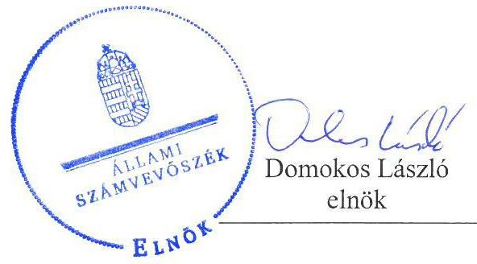

# Jelentés

## Önkormányzatok ellenőrzése-Integritás- és belső kontrollrendszer

Gyönk Város Önkormányzata 2019.

19081 www.asz.hu

---

# Jelentés

## Önkormányzatok ellenőrzése-Integritás- és belső kontrollrendszer

Gyönk Város Önkormányzata
2019. 06. hó 06. nap

---

# AZ ELLENŐRZÉST FELÜGYELTE:

DR. NAGY IMRE felügyeleti vezető

# AZ ELLENŐRZÉST VEZETTE ÉS A VÉGREHAJTÁSÁÉRT FELELŐS:

DR. DOMOKOS MAGDOLNA ellenőrzésvezető

# A PROGRAM ÖSSZEÁLLÍTÁSÁÉRT FELELŐS:

TÓTPÁL SZABOLCS osztályvezető

---

**IKTATÓSZÁM:** EL-1561-001/2019

**TÉMASZÁM:** 2485

**ELLENŐRZÉS-AZONOSÍTÓ SZÁM:** V-082921

---

Jelentéseink az Országgyűlés számítógépes hálózatán és az Interneten a www.asz.hu címen is olvashatóak.

---

# TARTALOMJEGYZÉK

■ ÖSSZEGZÉS ..... 5
■ AZ ELLENŐRZÉS CÉLJA ..... 6
■ AZ ELLENŐRZÉS TERÜLETE ..... 7
■ AZ ELLENŐRZÉS HÁTTERE, INDOKOLTSÁGA ..... 8
■ A JELENTÉS LÉNYEGES KÉRDÉSKÖREI ..... 9
■ AZ ELLENŐRZÉS HATÓKÖRE ÉS MÓDSZEREI ..... 10
■ MEGÁLLAPÍTÁSOK ..... 12
■ JAVASLATOK ..... 14
■ MELLÉKLETEK ..... 17
I. sz. melléklet: Értelmező szótár ..... 17
■ FÜGGELÉKEK ..... 19
I. sz. függelék a Jelentéshez ..... 19
II. sz. függelék: Észrevételek ..... 20
■ RÖVIDÍTÉSEK JEGYZÉKE ..... 21

---

.

---

# ÖSSZEGZÉS

Gyönk Város Önkormányzatánál nem volt biztosított az átláthatóság, elszámoltathatóság, a közpénzfelhasználás szabályossága és a nemzeti vagyonnal történő felelős gazdálkodás. Az integritási kontrollok kiépítése nem történt meg, ezáltal nem biztosították a korrupcióval szembeni védelem feltételeit.

## Az ellenőrzés társadalmi indokoltsága

Az Állami Számvevőszék alapvető feladata a közpénzekkel, az állami és önkormányzati vagyonnal való gazdálkodás ellenőrzése. Az Alaptörvény szerint az önkormányzatok kötelezettsége a kiegyensúlyozott, átlátható és fenntartható költségvetési gazdálkodás elvének érvényesítése, a nemzeti vagyonnal való rendeltetésszerű és felelős módon való gazdálkodás biztosítása. Az Állami Számvevőszék stratégiájában megfogalmazott célkitűzése az integritás alapú, átlátható és elszámoltatható közpénzfelhasználás elősegítése. Ennek megvalósítása érdekében az Állami Számvevőszék prioritásként kezeli a közpénzzel gazdálkodó szervezetek esetében a belső kontrollrendszer működésének ellenőrzését.

Az Állami Számvevőszék Gyönk Város Önkormányzatát korábban nem ellenőrizte.

## Főbb megállapítások, következtetések, javaslatok

Gyönk Város Önkormányzata nem szabályszerű kontrollkörnyezetben működött, mert nem gondoskodtak az integritást sértő események kezelése eljárásrendjéről, a beszerzések lebonyolításával kapcsolatos eljárásrendről, valamint a működési folyamatokra vonatkozó ellenőrzési nyomvonal elkészítéséről.

Gyönk Város Önkormányzatánál a kontrolltevékenységek nem voltak szabályszerűek, a teljesítések igazolása a külső személyi juttatások esetében nem történt meg, ezáltal nem igazolt, hogy a kiadások az önkormányzat feladatellátásának körében keletkeztek és a kötelezettségvállalásokban foglaltaknak megfelelő teljesítések történtek. Így a szabályszerű közpénzfelhasználás, a nemzeti vagyonnal való rendeltetésszerű és felelős módon történő gazdálkodás feltételei nem voltak biztosítottak.

Gyönk Város Önkormányzatánál az információs és kommunikációs rendszer kialakítása nem volt szabályszerű, tekintettel arra, hogy nem rendelkeztek iratkezelési szabályzattal.

Gyönk Város Önkormányzatánál az integrált kockázatkezelési rendszer kialakítása nem volt szabályszerű, mert az alapvető, jogszabály által előírt integrált kockázatkezelés eljárásrendjét nem készítették el.

Gyönk Város Önkormányzatánál a korrupció megelőzését támogató integritási kontrollok kiépítése nem történt meg, nem volt biztosított az integritás alapú közpénzfelhasználás lehetősége, továbbá nem volt biztosított az államháztartás pénzeszközeivel és a nemzeti vagyonnal történő gazdaságos, hatékony és eredményes gazdálkodás mérésének lehetősége.

Az Állami Számvevőszék a Gyönki Közös Önkormányzati Hivatal jegyzője részére a szervezeti integritást sértő eljárásrend, a beszerzések lebonyolításával kapcsolatos eljárásrend, az integrált kockázatkezelés eljárásrendjének elkészítése, az iratkezelési szabályzat kiadása, továbbá a vagyonnyilatkozat átadására, nyilvántartására vonatkozó szabályok, az ellenőrzési nyomvonal elkészítése és a jövőre vonatkozóan ellenőrzési terv jóváhagyásáról történő gondoskodás, valamint a döntések gazdaságossági, hatékonysági és eredményességi szempontú megalapozottsága kapcsán fogalmazott meg javaslatot, melyre az érintettnek 30 napon belül intézkedési tervet kell készítenie.

---

# AZ ELLENŐRZÉS CÉLJA

Az ellenőrzés célja annak megállapítása volt, hogy Gyönk Város Önkormányzatának belső kontrollrendszere biztosította-e a közpénzekkel és a nemzeti vagyonnal történő elszámoltatható, átlátható, szabályszerű, gazdaságos, hatékony és eredményes gazdálkodás feltételeit. Az ellenőrzés keretében értékeljük továbbá, hogy az önkormányzatnál kiépítették és erősítették-e a korrupciós kockázatok kezelését szolgáló integritás kontrollokat és azt, hogy megteremtették-e a teljesítményellenőrzés feltételeit.

---

# AZ ELLENŐRZÉS TERÜLETE

## Gyönk Város Önkormányzata

A Tolna megyei Gyönk város lakosainak száma a Központi Statisztikai Hivatal közigazgatási helynévkönyve alapján 2017. január 1-jén 1905 fő volt.

Az Önkormányzat hét tagú képviselő-testületének munkáját négy állandó bizottság segítette. A településen Német és Roma nemzetiségi önkormányzat működött.

A gazdálkodási feladatokat ellátó Gyönki Közös Önkormányzati Hivatalt 2013. január 1-jén Gyönk Város, Miszla, Szakadát, Udvari és Varsád Községek Önkormányzatainak Képviselő-testületei hozták létre, amelyhez 2015. január 1-jétől Szárazd Község csatlakozott. A Közös Hivatalban foglalkoztatott köztisztviselők száma a 2017. évi zárszámadás adatai alapján 20 fő volt.

A polgármester a 2010. évi önkormányzati választások óta tölti be tisztségét, a jegyző személye nem változott az ellenőrzött időszakban.

Az Önkormányzat 2017. évi költségvetési beszámolója szerint 558,9 millió Ft bevételt ért el, valamint 451,1 millió Ft kiadást teljesített, vagyonának értéke 2017. december 31-én 1248,2 millió Ft volt.

---

# AZ ELLENŐRZÉS HÁTTERE, INDOKOLTSÁGA

A demokratikus társadalmakban alapvető igény, hogy a közpénzeket, a közvagyont használók tevékenységükről elszámoljanak, ahhoz egyértelmű és érvényesíthető felelősségi szabályok társuljanak. Ennek a jogos igénynek az érvényesítéséhez meg kell teremteni azokat a folyamatokat, rendszereket, amelyek nélkülözhetetlenek az elszámoltatáshoz. Az elszámoltatás eredményes működtetéséhez szükség van a megfelelő információs, kontroll-, értékelési és beszámolási rendszerek kialakítására. A belső kontrollok kiépítettsége hozzájárul az integritási szemlélet kialakításához és érvényesüléséhez. A belső kontrollrendszer kialakítása és működtetése nélkül nem valósítható meg a közpénzek, a közvagyon szabályos, gazdaságos, hatékony és eredményes felhasználása.

A BELSŐ KONTROLLRENDSZER azt a célt szolgálja, hogy az államháztartás szervei működésük és gazdálkodásuk során a tevékenységeket szabályszerűen, gazdaságosan, hatékonyan, eredményesen hajtsák végre, teljesítsék elszámolási kötelezettségeiket, és megvédjék az erőforrásokat a veszteségektől, a károktól, a nem rendeltetésszerű használattól. A belső kontrollrendszer magában foglalja mindazon szabályokat, eljárásokat, gyakorlati módszereket és szervezeti struktúrákat, kockázatkezelési technikákat, kontrolltevékenységeket, amelyek segítséget nyújtanak a szervezetnek céljai eléréséhez.

A megfelelő belső kontrollrendszer jelentősen csökkenti a hibák és szabálytalanságok kockázatát. Az ÁSZ célja, hogy javuljon az ellenőrzött önkormányzatok belső kontrollrendszerének szabályozottsága, működésének megfelelősége, szabályszerűsége, hozzájárulva ezzel az egyensúlyi helyzet fenntarthatóságának biztosításához, biztosítva az önkormányzatnál a közpénzfelhasználás szabályosságát, a közpénzekkel és a nemzeti vagyonnal történő szabályszerű, gazdaságos, hatékony és eredményes gazdálkodást.

AZ ELLENŐRZÉS VÁRHATÓ HASZNOSULÁSA négy szinten valósul meg. A törvényalkotás számára összegzett tapasztalatok állnak rendelkezésre a belső kontrollrendszer önkormányzati területen való kialakításáról, működtetéséről és hatásairól. Az ellenőrzés az ellenőrzött számára visszajelzést ad a belső kontrollrendszer kialakításában és működésében lévő hiányosságokról, javaslataival hozzájárul azok kiküszöböléséhez. Az ellenőrzés megállapításait és javaslatait más szervezetek is hasznosíthatják a rendezett gazdálkodási keretek kialakításához, a ,,jó gyakorlat" elterjesztésével azok az önkormányzatok is átvehetik a pozitív példákat, ahol nem végez ellenőrzést az ÁSZ.

Az ÁSZ ellenőrzései jelzik a társadalom számára, hogy közpénz nem maradhat ellenőrizetlenül, tevékenysége hozzájárul az értékteremtő rend kialakításához és megőrzéséhez.

---

# A JELENTÉS LÉNYEGES KÉRDÉSKÖREI

1. Az önkormányzat belső kontrollrendszerének kialakítása és működtetése szabályszerű volt-e, az biztosította-e az önkormányzatnál a közpénzfelhasználás szabályosságát, a nemzeti vagyonnal történő felelős gazdálkodást?
2. Az önkormányzatnál alakítottak-e ki a teljesítmény mérésére alkalmas követelményeket?

---

# AZ ELLENŐRZÉS HATÓKÖRE ÉS MÓDSZEREI

## Az ellenőrzés típusa

Megfelelőségi ellenőrzés.

## Az ellenőrzött időszak

2017. év, illetve az éves költségvetési beszámoló Áht. által megállapított jóváhagyásáig (2018. május 31-éig) tartó időszak.

## Az ellenőrzés tárgya

Gyönk Város Önkormányzata és a gazdálkodási feladatokat ellátó Gyönki Közös Önkormányzati Hivatal belső kontrollrendszerének kialakítása és működtetése, valamint az integritás kontrollok kiépítettsége, a teljesítményellenőrzés feltételei.

## Az ellenőrzött szervezet

Gyönk Város Önkormányzata és a Gyönki Közös Önkormányzati Hivatal.

## Az ellenőrzés jogalapja

Az ellenőrzés jogszabályi alapját az ÁSZ tv. 6. § (3) bekezdés, 5. § (2) és (6) bekezdései, valamint az Áht. 61. § (2) bekezdésének előírásai képezik.

## Az ellenőrzés módszerei

Az ÁSZ az ellenőrzést az ellenőrzési program szempontjai, az ellenőrzött időszakban hatályos jogszabályok, az ellenőrzés szakmai szabályai, a jelen ellenőrzésre irányadó ÁSZ módszertanok figyelembevételével hajtotta végre.

Az ellenőrzés ideje alatt az ellenőrzött szervezettel történő kapcsolattartást az ÁSZ SZMSZ-ének vonatkozó előírásai alapján biztosította az ÁSZ.

Az ellenőrzési kérdések megválaszolásához szükséges bizonyítékok megszerzése az ellenőrzött által rendelkezésre bocsátott dokumentumokra, adatokra alapozva megfigyelés, szemle (szemrevételezés), valamint elemző eljárás útján történt.

Az ellenőrzési bizonyítékként felhasználható adatforrások közé tartoznak az ellenőrzési program részletes szempontjainál felsorolt adatforrások,

---

valamint minden egyéb - az ellenőrzés folyamán feltárt, az ellenőrzés szempontjából információt tartalmazó - dokumentum.

A 2017. évi kiadások teljesítéséhez kapcsolódó pénzgazdálkodási belső kontrollok működésének szabályszerűsége esetében az ellenőrzés azokra a legnagyobb értékű tételekre - a lényeges sokaságra - terjedt ki, melyek összértéke eléri a teljes sokaság összértékének 50%-át. A 2017. évi kiadások esetében a lényeges sokaságot tételesen ellenőriztük.

Az önkormányzat belső kontrollrendszerének összesített értékelése az egyes részterületek esetében kapott megfelelőségi arányok számtani átlaga alapján történik és megegyezik a pillérenként (kontroll-területenként) alkalmazott százalékos értékelésekkel, a következő eltérésekkel: a kontrollrendszer egésze esetében a „szabályszerű" értékelésnek a százalékos értéken felül további feltétele, hogy egyik kontrollterület sem kaphat „nem szabályszerű" értékelést.

Amennyiben az önkormányzat működését és gazdálkodását alapvetően meghatározó dokumentum hiánya miatt, valamely lényeges kérdéskörre vonatkozóan az ÁSZ megállapítást tett, további ellenőrzési tevékenységek az adott kérdéskörrel és az azzal szoros logikai kapcsolatban lévő kérdéskörökkel - ráépülő jelleggel - nem kerültek végrehajtásra.

---

# MEGÁLLAPÍTÁSOK

## 1. Az önkormányzat belső kontrollrendszerének kialakítása és működtetése szabályszerű volt-e, az biztosította-e az önkormányzatnál a közpénzfelhasználás szabályosságát, a nemzeti vagyonnal történő felelős gazdálkodást?

Összegző megállapítás

Az Önkormányzatnál a belső kontrollrendszer kialakítása és működtetése nem volt szabályszerű, az nem biztosította a közpénzfelhasználás szabályosságát, a nemzeti vagyonnal történő felelős gazdálkodást.

## AZ ÖNKORMÁNYZAT NEM SZABÁLYSZERŰ KONTROLLKÖRNYEZETBEN MŰKÖDÖTT, MIVEL A JEGYZŐ NEM GONDOSKODOTT

- a Bkr. 6. § (4) bekezdésében foglalt előírások ellenére a szervezeti integritást sértő események kezelése eljárásrendjének elkészítéséről;
- az Ávr. 13. § (2) bekezdés b) pontjában foglaltak ellenére a beszerzések lebonyolításával kapcsolatos eljárásrendjének elkészítéséről;
- a Bkr. 6. § (3) bekezdés előírásától eltérően a működési folyamatokra vonatkozó ellenőrzési nyomvonal elkészítéséről;
- a Vnytv. 11. § (6) bekezdésében foglalt előírások ellenére a vagyonnyilatkozat átadására, nyilvántartására, a vagyonnyilatkozatban foglalt személyes adatok védelmére, valamint a Vnytv. 14. § (3) bekezdésétől eltérően a meghallgatásra vonatkozó szabályok rögzítéséről.

## A KOCKÁZATKEZELÉSI RENDSZER KIALAKÍTÁSA

NEM VOLT SZABÁLYSZERŰ, mert a jegyző a Bkr. 6. § (4) bekezdésében előírtak ellenére nem szabályozta az integrált kockázatkezelés eljárásrendjét.

## A KONTROLLTEVÉKENYSÉGEK MŰKÖDTETÉSE

NEM VOLT SZABÁLYSZERŰ, mert a külső személyi juttatások kifizetése az Ávr. 57. § (1) bekezdés előírása ellenére teljesítés igazolás nélkül történt, továbbá a jegyző a Bkr. 8. (2) bekezdés b) pontjában foglaltak ellenére a kontrolltevékenység részeként nem gondoskodott minden tevékenységre vonatkozóan a szervezeti célok elérését veszélyeztető kockázatok csökkentésére irányuló kontrollok kiépítéséről a döntések célszerűségi, gazdaságossági, hatékonysági és eredményességi szempontú megalapozottsága tekintetében.

---

# AZ INFORMÁCIÓS ÉS KOMMUNIKÁCIÓS RENDSZER KIALAKÍTÁSA NEM VOLT SZABÁLYSZERŰ,

mert a jegyző az Önkormányzat és a Közös Hivatal vonatkozásában nem gondoskodott az Ltv. 9. § (4) bekezdésének és 10.§ (1) bekezdésének a) és c) pontjának előírása ellenére iratkezelési szabályzat elkészítéséről.

## A
 MONITORING RENDSZER MŰKÖDTETÉSE NEM

VOLT SZABÁLYSZERŰ, mert a jegyző a Bkr. 10. §-ban foglaltak ellenére nem alakította ki a szervezet tevékenységének, a célok megvalósításának nyomon követését biztosító rendszert. A Bkr. 31. § (1) bekezdésének ellenére az Önkormányzat éves ellenőrzési tervvel nem rendelkezett, és a jegyző nem gondoskodott a Bkr. 45. § (1) bekezdés előírásától eltérően a 2017-ben lefolytatott belső ellenőrzés javaslatainak végrehajtása érdekében intézkedési terv elkészítéséről.

## AZ ÖNKORMÁNYZATNÁL A JOGSZABÁLYOK ÁLTAL KÖTELEZŐEN ELŐÍRT INTEGRITÁST TÁMOGATÓ KONTROLLOK KIÉPÍTÉSE NEM TÖRTÉNT

MEG. Az Önkormányzatnál nem végeztek kockázatelemzést, ezáltal nem azonosították az integritást veszélyeztető kockázatokat, továbbá nem határozták meg az integritás erősítésére és a korrupció megelőzésére szolgáló értékeket.

A jegyző által tett belső kontrollrendszer működéséről szóló nyilatkozat sem a belső kontrollrendszer átfogó értékelése, sem az egyes kontrollpillérek kialakításának és működtetésének minősítése tekintetében nincs összhangban az ellenőrzés megállapításaival.

## 2. Az önkormányzatnál alakítottak-e ki a teljesítmény mérésére alkalmas követelményeket?

## Összegző megállapítás

Az Önkormányzatnál nem alakítottak ki a teljesítmény mérésére alkalmas követelményeket.

A szervezeti célok elérését szolgáló feladatok, folyamatok, tevékenységek mérését szolgáló indikátorokat, mérőszámokat, feladat- és teljesítménymutatókat nem képeztek, ezáltal az Önkormányzat a teljesítmény mérésének feltételeit, az államháztartás pénzeszközeivel és a nemzeti vagyonnal történő gazdaságos, hatékony és eredményes gazdálkodás mérésének lehetőségét nem biztosította.

---

# JAVASLATOK 

Az ÁSZ tv. 33. § (1) bekezdésében foglaltak értelmében az ellenőrzött szervezet vezetője köteles a jelentésben foglalt megállapításokhoz kapcsolódó intézkedési tervet összeállítani és azt a jelentés kézhezvételétől számított 30 napon belül az ÁSZ részére megküldeni. Amennyiben az ellenőrzött szervezet vezetője nem küldi meg határidőben az intézkedési tervet, vagy továbbra sem elfogadható intézkedési tervet küld, az Állami Számvevőszék elnöke az ÁSZ tv. 33. § (3) bekezdése a) és b) pontjaiban foglaltakat érvényesítheti.

## Gyönki Közös Önkormányzati Hivatal jegyzőjének

1. Intézkedjen a szervezeti integritást sértő események kezelése eljárásrendjének szabályozásáról a jogszabályi előírásnak megfelelően.
(1. sz. megállapítás 1. bekezdés 1. francia bekezdése alapján)
2. Intézkedjen a beszerzések lebonyolításával kapcsolatos eljárásrend elkészítéséről a jogszabályi előírásnak megfelelően.
(1. sz. megállapítás 1. bekezdés 2. francia bekezdése alapján)
3. Intézkedjen az ellenőrzési nyomvonal elkészítéséről a jogszabályi előírásnak megfelelően.
(1. sz. megállapítás 1. bekezdés 3. francia bekezdése alapján)
4. Intézkedjen a vagyonnyilatkozat átadására, nyilvántartására, a vagyonnyilatkozatban foglalt személyes adatok védelmére, valamint a meghallgatásra vonatkozó szabályok szabályzatban történő megállapításáról a jogszabályi előírásoknak megfelelően.
(1. sz. megállapítás 1. bekezdés 4. francia bekezdése alapján)
5. Intézkedjen az integrált kockázatkezelés eljárásrendjének szabályozásáról a jogszabályi előírásnak megfelelően.
(1. sz. megállapítás 2. bekezdése alapján)
6. Intézkedjen a kiadások teljesítésének igazolásáról a jogszabályi előírásnak megfelelően.
(1. sz. megállapítás 3. bekezdés 2. mondatrésze alapján)

---

7. Biztosítsa a kontrolltevékenység részeként minden tevékenységre vonatkozóan a szervezeti célok elérését veszélyeztető kockázatok csökkentésére irányuló kontrollok kiépítését a döntések célszerűségi, gazdaságossági, hatékonysági és eredményességi szempontú megalapozottsága tekintetében a jogszabályi előírásnak megfelelően,
(1. sz. megállapítás 3. bekezdés 3. mondatrésze alapján)
8. Intézkedjen az Önkormányzat, valamint a Közös Hivatal iratkezelési szabályzatának kiadásáról.
(1. sz. megállapítás 4. bekezdés 1. mondat 2. mondatrésze alapján)
9. Kezdeményezze a jövőben az éves ellenőrzési terv elkészítését.
(1. sz. megállapítás 5. bekezdés 2. mondat 1. mondatrésze alapján)

# Gyönk Város Önkormányzata polgármesterének 

1. Intézkedjen a jövőben az éves ellenőrzési terv képviselő-testületi jóváhagyásra történő előterjesztéséről.
(1. sz. megállapítás 5. bekezdés 2. mondat 1. mondatrésze alapján)

---

.

---

# MELLÉKLETEK 

- I. SZ. MELLÉKLET: ÉRTELMEZŐ SZÓTÁR
belső ellenőrzés
belső kontrollrendszer
belső kontrollrendszer területei
információs és kommunikációs rendszer
integrált kockázatkezelési rendszer
integritás
irányító szerv/felügyeleti szerv
kockázat
kontrollkörnyezet
kontrolltevékenységek

Független, tárgyilagos bizonyosságot adó és tanácsadó tevékenység, amelynek célja, hogy az ellenőrzött szervezet működését fejlessze és eredményességét növelje, az ellenőrzött szervezet céljai elérése érdekében rendszerszemléletű megközelítéssel és módszeresen értékeli, illetve fejleszti az ellenőrzött szervezet irányítási és belső kontrollrendszerének hatékonyságát (Forrás: Bkr. 2. § b) pontja)
A belső kontrollrendszer a kockázatok kezelése és tárgyilagos bizonyosság megszerzése érdekében kialakított folyamatrendszer, amely azt a célt szolgálja, hogy a működés és gazdálkodás során a tevékenységeket szabályszerűen, gazdaságosan, hatékonyan, eredményesen hajtsák végre, az elszámolási kötelezettségeket teljesítsék, megvédjék az erőforrásokat a veszteségektől, károktól és nem rendeltetésszerű használattól (Forrás: Áht. 69. § (1) bekezdése)
A kontrollkörnyezet, az integrált kockázatkezelési rendszer, a kontrolltevékenységek, az információs és kommunikációs rendszer, valamint a nyomon követési (monitoring) rendszer. (Forrás: Bkr. 3. §-a)
A költségvetési szerv vezetője által kialakított és működtetett olyan rendszer, mely biztosítja, hogy a megfelelő információk a megfelelő időben eljutnak az illetékes szervezethez, szervezeti egységhez, illetve személyhez. (Forrás: Bkr. 9. § (1) bekezdés)

Olyan folyamatalapú kockázatkezelési rendszer, amely a szervezet minden tevékenységére kiterjed, egységes módszertan és eljárások alkalmazásával, a szervezet célkitűzéseinek és értékeinek figyelembevételével biztosítja a szervezet kockázatainak teljes körű azonosítását, azok meghatározott kritériumok szerinti értékelését, valamint a kockázatok kezelésére vonatkozó intézkedési terv elkészítését és az abban foglaltak nyomon követését. (Forrás: Bkr. 2. § m) pontja, 2016. október 1-jétől)

Az integritás az elvek, értékek, cselekvések, módszerek, intézkedések konzisztenciáját jelenti, vagyis olyan magatartásmódot, amely meghatározott értékeknek megfelel. (Forrás: Nemzetgazdasági Minisztérium: Magyarországi államháztartási belső kontroll standardok Útmutató 1.6.1. pontja, 2012. december)
A költségvetési szerv tekintetében az Áht-ban meghatározott irányítási hatáskört gyakorló szerv. (Forrás: Áht. 1. § 9. pontja)
A kockázat annak a valószínűségét jelenti, hogy egy vagy több esemény vagy intézkedés nem kívánt módon befolyásolja a rendszer működését, céljainak megvalósulását. (Forrás: Javaslatok a korrupciós kockázatok kezelésére Kockázatkezelési és ellenőrzési módszertan 35. oldal, ÁSZ)
A költségvetési szerv vezetője által kialakított olyan elvek, eljárások, belső szabályzatok összessége, amelyben világos a szervezeti struktúra, egyértelműek a felelősségi, hatásköri viszonyok és feladatok, meghatározottak az etikai elvárások a szervezet minden szintjén, átlátható a humánerőforrás-kezelés (Forrás: Bkr. 6. § (1) bekezdés)
A költségvetési szerv vezetője által a szervezeten belül kialakított (kontroll) tevékenységek, melyek biztosítják a kockázatok kezelését, hozzájárulnak a szervezet céljainak eléréséhez (Forrás: Bkr. 8. § (1) bekezdés)

---

| kommunikáció | Az a tevékenység, melynek során információ továbbítása valósul meg. A kommunikációs folyamat résztvevői között tájékoztatás történik, mely során tényeket, ezek magyarázatát közlik. |
| :--: | :--: |
| közös önkormányzati hivatal | A települési képviselő-testület más települési képviselő-testülettel társult képviselő-testületet alakíthat, amely esetén a képviselő-testületek részben vagy egészben egyesítik a költségvetésüket, közös önkormányzati hivatalt tartanak fenn, és intézményeiket közösen működtetik. (Forrás: Mötv. 56. § (1)-(2) bekezdései) |
| monitoring | A monitoring általánosságban a különböző szintű szervezeti célok megvalósításának folyamatát kíséri figyelemmel, melynek során a releváns eseményekről és tevékenységekről (együtt: folyamatokról) rendszeres jelleggel, strukturált, döntéstámogató információkhoz jutnak a szervezet vezetői. (Forrás: NGM Útmutató a költségvetési szervek monitoring rendszeréhez 2011. november) |
| monitoring rendszer | A költségvetési szerv vezetője köteles kialakítani a szervezet tevékenységének a célok megvalósításának nyomon követését biztosító rendszert, amely az operatív tevékenységek keretében megvalósuló folyamatos és eseti nyomon követésből, valamint az operatív tevékenységektől függetlenül működő belső ellenőrzésből állhat. (Forrás: Bkr. 10. §) |
| önkormányzati hivatal | A polgármesteri hivatal, a főpolgármesteri hivatal, a megyei önkormányzati hivatal és a közös önkormányzati hivatal. (Forrás: Áht. 1. § 18. pont) |
| társulás | A helyi önkormányzatok képviselő-testületei megállapodhatnak abban, hogy egy vagy több önkormányzati feladat- és hatáskör, valamint a polgármester és a jegyző államigazgatási feladat- és hatáskörének hatékonyabb, célszerűbb ellátására jogi személyiséggel rendelkező társulást hoznak létre. (Forrás: Mötv. 87. §) |

---

# FÜGGELÉKEK 

- I. SZ. FÜGGELÉK A JELENTÉSHEZ

Az Állami Számvevőszék az ellenőrzések során feltárt tényekhez kapcsolódó további körülmények tisztázására eszközrendszerrel nem rendelkezik. Amennyiben az ellenőrzésen túlmutatóan indokoltnak látszik az ellenőrzés során feltárt körülmények további vizsgálata, az Állami Számvevőszék törvényi felhatalmazás alapján az ellenőrzés által feltárt körülményeket továbbítja a hatáskörrel rendelkező szervnek a szükséges intézkedések megtétele, eljárások lefolytatása érdekében.
Az ellenőrzés feltárta, hogy a külső személyi juttatások kifizetése az Ávr. 57. § (1) bekezdés előírása ellenére teljesítés igazolása nélkül történt 8936891 Ft értékben. E szabálytalanság miatt nem igazolt, hogy a kiadások az Önkormányzat feladatellátásának körében keletkeztek és a kötelezettségvállalásokban foglaltaknak megfelelő teljesítések történtek, ezáltal felvetődik, hogy az Önkormányzatnál vagyoni hátrány keletkezett.
Az eset konkrét körülményeinek felderítésére az Ügyészség rendelkezik hatáskörrel.

---

A jelentéstervezetet a Számvevőszék 15 napos észrevételezésre megküldte az ellenőrzött szervezetek vezetőinek az ÁSZ tv. 29. § (1) bekezdése előírásának megfelelően.

Gyönk Város Önkormányzatának polgármestere, és a Gyönki Közös Önkormányzati Hivatal jegyzője az ÁSZ tv. 29.§ (2) bekezdésben foglalt észrevételezési jogával nem élt, a jelentéstervezetre észrevételt nem tett.

[^0]
[^0]:    * 29. § (1) Az Állami Számvevőszék az ellenőrzési megállapításait megküldi az ellenőrzött szervezet vezetőjének vagy az általa megbízott személynek, és annak, akinek személyes felelősségét állapította meg.
    (2) Az ellenőrzött szervezet vezetője és a felelősként megjelölt személy az ellenőrzés megállapításaira tizenöt napon belül írásban észrevételt tehet.
    (3) Az Állami Számvevőszék az észrevételre a beérkezésétől számított harminc napon belül írásban válaszol. A figyelembe nem vett észrevételeket köteles a jelentésben feltüntetni, és megindokolni, hogy azokat miért nem fogadta el.

---

# RÖVIDÍTÉSEK JEGYZÉKE 

${ }^{1}$ Önkormányzat
${ }^{2}$ Közös Önkormányzati Hivatal
${ }^{3}$ polgármester
${ }^{4}$ jegyző
${ }^{5}$ Áht.
${ }^{6}$ ÁSZ tv.
${ }^{7}$ ÁSZ SZMSZ
${ }^{8}$ Bkr.
${ }^{9}$ Vnytv.
${ }^{10}$ Ltv.

Gyönk Város Önkormányzata
Gyönk Város Önkormányzati Hivatal
Gyönk Város Önkormányzatának polgármestere
Gyönk Város Önkormányzati Hivatal jegyzője
2011. évi CXCV. törvény az államháztartásról
2011. évi LXV. törvény az Állami Számvevőszékről
Az Állami Számvevőszék elnökének 2/2018. (XII.28.) ÁSZ utasítása az Állami
Számvevőszék Szervezeti és Működési Szabályzatáról
370/2011. (XII.31.) Korm. rendelet a költségvetési szervek belső
kontrollrendszeréről és belső ellenőrzéséről
2007. évi CLII. törvény egyes vagyonnyilatkozat-tételi kötelezettségekről
1995. évi LXVI. törvény a köziratokról, a közlevéltárakról és a magánlevéltári anyag védelméről

---

ÁLLAMI SZÁMVEVŐSZÉK
1052 Budapest, Apáczai Csere János utca 10.
Levélcím: 1364 Budapest 4. Pf. 54
Telefon: +36 14849100 Telefax: +36 14849200
www.asz.hu

