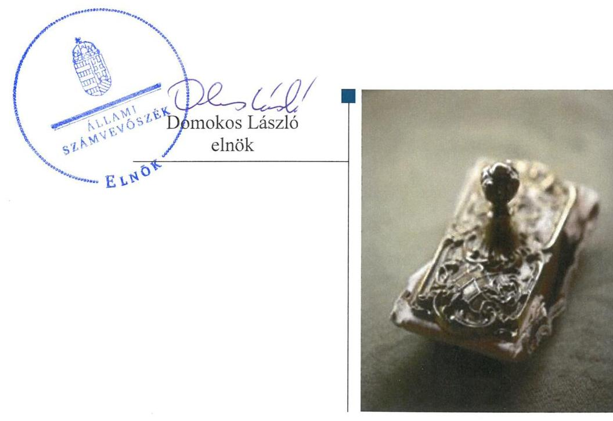

# Jelentés 

## Nemzeti tulajdonú gazdasági társaságok ellenőrzése

UV Újpesti Vagyonkezelő Zártkörűen Működő Részvénytársaság 2019.

19082
www.asz.hu

---

# Jelen 

ÁLLAMI
SZÁMVEVŐSZÉK

## Jelentés

## Nemzeti tulajdonú gazdasági társaságok ellenőrzése

UV Újpesti Vagyonkezelő Zártkörűen Működő Részvénytársaság
2019. 0 f. hó 24. nap

---

# AZ ELLENŐRZÉST FELÜGYELTE:

DR. HORVÁTH MARGIT felügyeleti vezető

## AZ ELLENŐRZÉST VEZETTE ÉS A VÉGREHAJTÁSÁÉRT FELELŐS:

- ÁRPÁSI TIBOR ellenőrzésvezető
- A PROGRAM ÖSSZEÁLLÍTÁSÁÉRT FELELŐS:
  - TÓTPÁL SZABOLCS osztályvezető

IKTATÓSZÁM: EL-0871-062/2019.

TÉMASZÁM: 2478

ELLENŐRZÉS-AZONOSÍTÓ SZÁM: V082215

Jelentéseink az Országgyűlés számítógépes hálózatán és az Interneten a www.asz.hu címen is olvashatóak.

---

# TARTALOMJEGYZÉK 

- ÖSSZEGZÉS ..... 5
- AZ ELLENŐRZÉS CÉLJA ..... 6
- AZ ELLENŐRZÉS TERÜLETE ..... 7
- AZ ELLENŐRZÉS HÁTTERE, INDOKOLTSÁGA ..... 9
- A JELENTÉS LÉNYEGES KÉRDÉSKÖREI ..... 10
- AZ ELLENŐRZÉS HATÓKÖRE ÉS MÓDSZEREI ..... 11
- MEGÁLLAPÍTÁSOK ..... 13
- MELLÉKLETEK ..... 15
I. sz. melléklet: Fogalomtár ..... 15
- FÜGGELÉK: ÉSZREVÉTELEK ..... 17
- RÖVIDÍTÉSEK JEGYZÉKE ..... 19

---

.

---

# ÖSSZEGZÉS 

Budapest Főváros IV. kerület Újpest Önkormányzata az UV Újpesti Vagyonkezelő Zártkörűen Működő Részvénytársaság feletti tulajdonosi jogait szabályszerűen gyakorolta. A Társaság vagyongazdálkodása is szabályszerű volt. A Társaság a 2015-2017. évi számviteli beszámolóit szabályszerűen állította össze. A Társaság a vagyonnal való gazdálkodás során biztosította az elszámoltathatóságot, a nemzeti vagyon megőrzését.

## Az ellenőrzés társadalmi indokoltsága

Az Állami Számvevőszék stratégiájában megfogalmazta, hogy az államháztartáson kívül működő feladatellátó rendszerek ellenőrzéseivel hozzájárul ahhoz, hogy a közpénzeket, illetve az ingyenesen juttatott közvagyont az államháztartáson kívül működő szervezetek is átlátható, rendezett módon használják fel.

Az állam és a helyi önkormányzatok tulajdona nemzeti vagyon. A nemzeti vagyon megőrzése, megóvása érdekében kiemelten fontos a nemzeti tulajdonú gazdasági társaságok ellenőrzése.

Az Állami Számvevőszék céljaival és a társadalmi igénnyel összhangban, a gazdasági társaságok kiemelt fontosságú szerepe miatt került sor a Budapest Főváros IV. kerület Újpest Önkormányzata kizárólagos tulajdonában álló UV Újpesti Vagyonkezelő Zártkörűen Működő Részvénytársaság vagyongazdálkodásának, illetve az Önkormányzat tulajdonosi joggyakorlásának ellenőrzésére.

## Főbb megállapítások, következtetések, javaslatok

Az UV Újpesti Vagyonkezelő Zártkörűen Működő Részvénytársaság feletti tulajdonosi joggyakorlás kereteit a tulajdonosi joggyakorló Budapest Főváros IV. kerület Újpest Önkormányzata a jogszabályoknak és belső szabályzatainak megfelelően alakította ki, a tulajdonosi jogait szabályszerűen gyakorolta.

Az UV Újpesti Vagyonkezelő Zártkörűen Működő Részvénytársaság vagyongazdálkodása szabályszerű volt, a számviteli beszámoló mérlegét leltárral alátámasztotta. A vagyon nyilvántartása, állományba vétele szabályszerű volt. A Társaság a vagyonnal való gazdálkodás során a nemzeti vagyon megőrzését, elszámoltathatóságát biztosította.

---

# AZ ELLENŐRZÉS CÉLJA 

AZ ELLENŐRZÉS CÉLJA annak megállapítása, hogy a tulajdonosi joggyakorló a gazdasági társasága feletti tulajdonosi joggyakorlás kereteit kialakította-e, tulajdonosi jogait megfelelően gyakorolta-e és kötelezettségeit teljesítette-e. Továbbá annak megállapítása, hogy a gazdasági társaság biztosította-e a vagyon védelmét a nyilvántartások szabályszerű vezetése és a mérleg tételeinek leltárral történő alátámasztása útján, valamint szabályszerűen gondoskodott-e a társaság használatában lévő nemzeti vagyon értékének megőrzéséről, gyarapításáról, hasznosításáról.

---

# AZ ELLENŐRZÉS TERÜLETE

# Budapest Főváros IV. kerület Újpest Önkormányzata és az UV Újpesti Vagyonkezelő Zártkörűen Működő Részvénytársaság

Budapest Főváros IV. kerületi Önkormányzata a 100%-os tulajdonában lévő UV Újpesti Vagyonkezelő Zártkörűen Működő Részvénytársaságot 1992-ben alapította. A Társaság$^{1}$ jegyzett tőkéje 3584 M Ft volt, az ellenőrzött időszakban nem változott.

A Társaság az Önkormányzattal$^{2}$ kötött, annak közfeladatát képező, tulajdonosi feladatkörébe tartozó, lakás és nem lakás célú helyiségek, egyéb az önkormányzat vagyongazdálkodását érintő ingatlanok kezelését, fejlesztését, hasznosítását közszolgáltatási szerződés$_{1,2}^{3}$ keretében látta el. Az Önkormányzat rendeletben szabályozta a lakások bérbeadásának feltételeit$^{4}$, az önkormányzati tulajdonú lakások lakbérének mértékét$^{5}$, a lakások és nem lakás célú helyiségek elidegenítését$^{6}$.

A Társaság több mint 2200 önkormányzati szociális lakás üzemeltetését, mintegy 1500 nem lakás célú helyiség és a 300-at meghaladó piaci alapú lakás hasznosítását, a háziorvosi rendelők, az Újpest Szakorvosi Rendelőintézet üzemeltetését látta el. Üzemeltetett továbbá a Halassy Olivér Városi Uszodát, a Tarzan Parkot, a velencei Ifjúsági- és Gyermektábort, a Duna partján található Csónakházat, továbbá a Parádfürdőn, illetve Balatonszepezden lévő önkormányzati dolgozói üdülőket, a Tábor utcai, a Szilágyi utcai sportpályákat és a Halassy Olivér Sportcentrumot, valamint 2017-től az új építésű Újpesti Piac és Vásárcsarnokot és az Újpesti Kulturális Központot. A Társaság tevékenységét 11 telephelyen folytatta.

A Társaság 2015-ben 2248,4 M Ft, 2017-ben 2950,9 M Ft éves nettó árbevételt ért el. A Társaság az ellenőrzött években nyereségesen működött, az eredmény a saját tőkét gyarapította. A Társaság gazdálkodásának főbb adatait az 1. sz. táblázat tartalmazza:

1. táblázat

|  A TÁRSASÁG FŐBB GAZDÁLKODÁSI ADATAI 2015-2017 (M FT) |  |  |   |
| --- | --- | --- | --- |
|   | 2015. | 2016. | 2017.  |
|  Éves nettó árbevétel | 2248,4 | 2178,5 | 2950,9  |
|  Mérlegfőösszeg | 14 314,3 | 19 454,7 | 26 752,5  |
|  Mérleg szerinti / adózott eredmény | 57,3 | 371,3 | 82,5  |
|  Saját tőke összege | 10 133,3 | 13 142,7 | 20 445,3  |
|  Követelések | 364,3 | 410,9 | 377,5  |
|  Kötelezettségek | 2384,3 | 2630,7 | 2513,3  |
|  Foglalkoztatottak száma (fő) | 96 | 93 | 94  |
|   |  |  | Forrás: a Társaság 2015-2017. évi beszámolói  |

Az Önkormányzat a feladatok ellátásához a Közszolgáltatási szerződés$_{1,2}$ alapján nemzeti vagyont haszonkölcsönbe és üzemeltetésre adott a Társaságnak. Vagyonkezelési szerződése nem volt a Társasággal.

---

A Társaság többségi befolyással rendelkezett az Újpesti Piac és Vásárcsarnok Kft., valamint a Vagyonőr Kft. esetében.

A Társaság nem volt kormányzati szektorba sorolt egyéb szervezet.
A Társaság ügyvezetését 5 tagú Igazgatóság$^{7}$ látta el, operatív irányítását Vezérigazgató$^{8}$ végezte az ellenőrzött időszakban. A Vezérigazgató, a Polgármester$^{9}$ és a Jegyző$^{10}$ személyében az ellenőrzött időszakban nem következett be változás.

---

# AZ ELLENŐRZÉS HÁTTERE, INDOKOLTSÁGA 

Az Alaptörvény 38. cikke alapján az állam és a helyi önkormányzatok tulajdona nemzeti vagyon. A nemzeti vagyon megőrzése, megóvása érdekében kiemelten fontos ezen nemzeti tulajdonú gazdasági társaságok ellenőrzése. Gazdálkodásuk jellemzően a közérdeklődés és a média figyelmének középpontjában áll, amihez hozzájárul a gazdálkodásuk körébe tartozó - a nemzeti vagyon részét képező - vagyon nagysága, illetve az általuk ellátott közszolgáltatások minősége és hatékonysága.

Ellenőrzéseink feltárhatják, hogy a tulajdonosi felügyelet hozzájárult-e a szabályszerű gazdálkodáshoz és feladatellátáshoz. Az ellenőrzés eredményeként meghatározhatóvá válnak a gazdasági társaság vagyongazdálkodást érintő kockázatai, ezzel lehetővé téve a kockázatok csökkentését. A megállapítások alapján megfogalmazott számvevőszéki javaslatok hasznosítása elősegítheti a meglévő hibák megszüntetését. A jó gyakorlatok bemutatásával az ÁSZ$^{11}$ hozzájárulhat a követendő megoldások megismertetéséhez, terjesztéséhez.

---

# A JELENTÉS LÉNYEGES KÉRDÉSKÖREI 

1. Az UV Újpesti Vagyonkezelő Zártkörűen Működő Részvénytársaság feletti tulajdonosi joggyakorlás megfelelt-e az előírásoknak?
2. Az UV Újpesti Vagyonkezelő Zártkörűen Működő Részvénytársaság vagyongazdálkodása szabályszerű volt-e?

---

# AZ ELLENŐRZÉS HATÓKÖRE ÉS MÓDSZEREI 

## Az ellenőrzés típusa

Megfelelőségi ellenőrzés.

## Az ellenőrzött időszak

A tulajdonosi joggyakorlás tekintetében az ellenőrzött időszak 2017. január 1-től 2018. szeptember 28-ig, az ellenőrzés megkezdésének napjáig terjedt ki az éves beszámolók elfogadása kivételével, amelynél az ellenőrzött időszak 2015. január 1-től az ellenőrzés megkezdésének napjáig tartott.

A társaság vagyongazdálkodási tevékenységet illetően az ellenőrzött időszak a 2015 - 2017. évek, a 2017. évi beszámoló jóváhagyása és közzététele tekintetében 2018. június elsejéig tartó időszak.

## Az ellenőrzés tárgya

Az UV Újpesti Vagyonkezelő Zártkörűen Működő Részvénytársaság feletti tulajdonosi joggyakorlás kialakítása és működtetése.

Az UV Újpesti Vagyonkezelő Zártkörűen Működő Részvénytársaság vagyongazdálkodási tevékenysége, a társaság használatában lévő nemzeti vagyon, illetve a saját vagyona tekintetében a vagyonnyilvántartások vezetése, leltára, a nemzeti vagyon értékének megőrzése, gyarapítása, hasznosítása.

## Az ellenőrzött szervezet

- Budapest Főváros IV. kerület Újpest Önkormányzata
- UV Újpesti Vagyonkezelő Zártkörűen Működő Részvénytársaság

## Az ellenőrzés jogalapja

Az ellenőrzés jogszabályi alapját az ÁSZ tv.$^{12}$ 1. § (3) bekezdése és 5. § (3) - (5) bekezdései képezték.

---

# Az ellenőrzés módszerei 

Az ellenőrzést az ellenőrzési program ellenőrzési kérdései, az ellenőrzött időszakban hatályos jogszabályok, az ellenőrzés szakmai szabályok és módszertanok alapján, a nemzetközi standardok figyelembe vételével végeztük.

Az ellenőrzés ideje alatt az ellenőrzött szervezettel történő kapcsolattartást az ÁSZ Szervezeti és Működési Szabályzatának vonatkozó előírásai alapján biztosítottuk.
2017. január 1-től az ellenőrzés megkezdésének napjáig - 2018. szeptember 28-ig - ellenőriztük a tulajdonosi joggyakorlás kereteinek kialakítását, a tulajdonosi joggyakorló tevékenységét a felügyelő bizottság és a független könyvvizsgáló működéséhez kapcsolódóan, valamint azt, hogy a tulajdonosi joggyakorló - amennyiben a gazdasági társaság feladatellátásához kapcsolódóan határozott meg követelményeket, elvárásokat - a nemzeti vagyon értékének megőrzése érdekében monitorozta-e azok teljesülését. A 2015. január 1-től 2018. szeptember 28-ig terjedő teljes ellenőrzött időszakra ellenőriztük a tulajdonosi joggyakorló részvételét az éves beszámoló elfogadására vonatkozó döntéshozatalban.

A gazdasági társaság vagyonhoz kapcsolódó nyilvántartásai vezetésének megfelelősége, a mérleg tételeinek leltárral való alátámasztottsága, valamint a nemzeti vagyon értéke megőrzésének, gyarapításának, hasznosításának szabályszerűsége 2015. és 2017. évek tekintetében került ellenőrzésre. A 2015-2017. éveket érintően történt meg a lényeges dokumentumok értékelése.

Az ellenőrzési kérdések megválaszolásához szükséges bizonyítékok megszerzése a következő ellenőrzési eljárások alkalmazásával történt: megfigyelés, információkérés, összehasonlítás, lényeges sokaságból mintavétel, valamint elemző eljárás. Az ellenőrzési bizonyítékként felhasználható adatforrások közé tartoztak az ellenőrzési programban felsorolt adatforrások, továbbá minden - az ellenőrzés folyamán - feltárt, az ellenőrzés szempontjából információkat tartalmazó dokumentum. Az ellenőrzést a kérdésekre adott válaszok kiértékelésével, valamint a megjelölt adatforrások, a csatolt tanúsítványok felhasználásával, továbbá az adott időszakban hatályos jogszabályok figyelembe vételével folytattuk le.

A vagyonnyilvántartások és a leltár szabályszerűsége esetében 2015. és 2017. éveket illetően az ellenőrzés azokra a legnagyobb értékű tételekre a lényeges sokaságra - terjedt ki, melyek összértéke elérte a teljes sokaság összértékének 50%-át. A lényeges sokaságot tételesen ellenőriztük.

---

# 1. Az UV Újpesti Vagyonkezelő Zártkörűen Működő Részvénytársaság feletti tulajdonosi joggyakorlás megfelelt-e az előírásoknak? 

Összegző megállapítás

Az Önkormányzat Társaság feletti tulajdonosi joggyakorlása szabályszerű volt.

A TULAJDONOSI JOGGYAKORLÁS RENDJÉT az Önkormányzat a Mótv.$^{13}$, az Nvtv$^{14}$., illetve a Ptk.$^{15}$ előírásainak megfelelően a Vagyonrendeletben$^{16}$ és az Alapszabályban$_{1,2}^{17}$ határozta meg.

Az Önkormányzat megalkotta a Taktv.$^{18}$ előírásaival összhangban lévő, a vezető tisztségviselők, a felügyelőbizottsági tagok és az Mt.$^{19}$ 208. § hatálya alá tartozó munkavállalók javadalmazására, valamint a jogviszony megszűnése esetére biztosított juttatások módjának, mértékének elveiről, annak rendszeréről szóló javadalmazási szabályzatot$^{20}$.

Az Önkormányzat a Közszolgáltatási szerződésben$_{1,2}$ a közfeladat-ellátáshoz kapcsolódóan előírta a Társaság beszámolási, elszámolási, valamint meghatározta a működés, a közfeladatok ellátásának hatékonysági követelményeit. A vagyonhoz kapcsolódó jogok és kötelezettségek a Vagyonrendeletben foglalt követelmények szerint kerültek megállapításra a szerződésben.

A TULAJDONOSI JOGOK GYAKORLÁSA SORÁN az Önkormányzat megválasztotta a Társaság vezető tisztségviselőit, kijelölte a Felügyelőbizottság$^{21}$ tagjait, elfogadta annak Ügyrendjét$_{1,2}^{22}$, kijelölte a független Könyvvizsgálót$^{23}$.
 Az Alapító a Társaság 2015-2017. évi éves beszámolóit a Ptk. és a Számv. tv. ${ }^{24}$ előírásának megfelelően a Felügyelőbizottság és a Könyvvizsgáló írásbeli jelentésének birtokában fogadta el.

A Felügyelőbizottság ügyrendjének ${ }_{1,2}$ megfelelően rendszeresen megtárgyalta a Társaság gazdálkodásáról, valamint a közszolgáltatási terv ${ }^{25}$ végrehajtásáról szóló féléves beszámolókat, továbbá a Társaság vagyoni, pénzügyi és jövedelmezőségi helyzetéről szóló beszámolókat.

---

# 2. Az UV Újpesti Vagyonkezelő Zártkörűen Működő Részvénytársaság vagyongazdálkodása szabályszerű volt-e? 

## Összegző megállapítás

A Társaság vagyongazdálkodása szabályszerű volt.
A Társaság 2015-2017. években rendelkezett a Számv. tv. előírásának megfelelő Leltározási szabályzattal ${ }^{26}$. A saját vagyon, továbbá az üzemeltetésre, illetve haszonkölcsönbe átvett vagyon nyilvántartása megfelelt a Számv. tv.-ben és a Leltározási szabályzatban foglalt előírásoknak. Az ellenőrzött időszakban a Társaság a tárgyi eszközök üzembe helyezését bizonylattal alátámasztotta, az eszközök besorolása, bekerülési értékének meghatározása, és az értékcsökkenés elszámolása a Számv. tv., a Számviteli politika ${ }_{1-2}{ }^{27}$, a Számlarend ${ }_{1-3}{ }^{28}$, valamint a Bizonylati rend ${ }_{1-3}{ }^{29}$ előírásainak megfelelően történt.

A vagyongazdálkodás a 2015-2017. években szabályszerű volt. A Társaság a 2015-2017. években az éves beszámolókat szabályszerűen állította össze, a mérlegsorokat a jogszabályi előírásoknak megfelelő leltárral támasztotta alá.

A Társaság a haszonkölcsönbe, illetve üzemeltetésre átvett vagyonnal kapcsolatban a Vagyonrendeletben, a Közszolgáltatási szerződésben ${ }_{1,2}$ előírt beszámolási, nyilvántartási és adatszolgáltatási kötelezettségeket teljesítette, a nemzeti vagyont a hasznosítási cél szerint használta.

---

# MELLÉKLETEK 

- I. SZ. MELLÉKLET: FOGALOMTÁR
gazdasági társaság
haszonbérleti szerződés
haszonkölcsön-szerződés
közszolgáltatás
közfeladat
nemzeti vagyon
tulajdonosi jogok gyakorlója
vagyonkezelői jog

A gazdasági társaságok üzletszerű közös gazdasági tevékenység folytatására, a tagok vagyoni hozzájárulásával létrehozott, jogi személyiséggel rendelkező vállalkozások, amelyekben a tagok a nyereségből közösen részesednek, és a veszteséget közösen viselik. (Forrás: Ptk. 3:88. § (1) bekezdése)
Haszonbérleti szerződés alapján a haszonbérlő hasznot hajtó dolog időleges használatára vagy hasznot hajtó jog gyakorlására és hasznainak szedésére jogosult, és ennek fejében köteles haszonbért fizetni. A haszonbérleti szerződést írásba kell foglalni. A haszonbérlő a dolog hasznainak szedésére a rendes gazdálkodás szabályainak megfelelően jogosult. A haszonbérlet tárgyát képező dolog fenntartásához szükséges felújítás és javítás, továbbá a dologgal kapcsolatos terhek viselése a haszonbérlőt terheli. A rendkívüli felújítás és javítás a haszonbérbeadót terheli. A haszonbért időszakonként utólag kell megfizetni. (Forrás: Ptk. XLV. Fejezet)
Haszonkölcsön-szerződés alapján a kölcsönadó meghatározott dolog időleges használatának ingyenes átengedésére, a kölcsönvevő a dolog átvételére köteles. A kölcsönvevő a dolgot rendeltetésének és a szerződésnek megfelelően használhatja. A dolog haszna a kölcsönadót illeti. A kölcsönvevőt terhelik a dolog fenntartásának költségei a dologra fordított egyéb költségeit a megbízás nélküli ügyvitel szabályai szerint követelheti. (Forrás: Ptk. XLVI. fejezet)
Az Ebktv. ${ }^{30}$ 3. § d) pontja a következőképpen határozza meg a közszolgáltatást: „szerződéskötési kötelezettség alapján a lakosság alapvető szükségleteinek ellátására irányuló szolgáltatás, így különösen a villamos energia-, gáz-, hő-, víz-, szennyvíz- és hulladékkezelési, köztisztasági, postai és távközlési szolgáltatás, továbbá a menetrend alapján közlekedő járművekkel végzett közforgalmú személyszállítás".
Az Áht. ${ }^{31}$ 3/A. § (1) bekezdése alapján közfeladat a jogszabályban meghatározott állami vagy önkormányzati feladat.
Nvtv. 1. § (2) bekezdése szerint nemzeti vagyonba tartozik többek között:
„az állam vagy a helyi önkormányzat kizárólagos tulajdonában álló dolgok,
az a) pont hatálya alá nem tartozó, állam vagy a helyi önkormányzat tulajdonában lévő dolog,
az állam vagy a helyi önkormányzat tulajdonában lévő pénzügyi eszközök, továbbá az államot vagy a helyi önkormányzatot megillető társasági részesedések,
az államot vagy a helyi önkormányzatot megillető bármely vagyoni értékkel rendelkező jogosultság, amelyet jogszabály vagyoni értékű jogként nevesít."
Aki a nemzeti vagyon felett az államot vagy a helyi önkormányzatot megillető tulajdonosi jogok és kötelezettségek összességének gyakorlására jogosult. (Forrás: Nvtv. 3. § (1) bekezdés 17. pontja)

A vagyonkezelő köteles a vagyontárgy állagának megóvásáról, jó karbantartásáról, működtetéséről gondoskodni, jogszabályban és szerződésben előírt más kötelezettségét teljesíteni, valamint a vagyontárgyat jogszabályban vagy szerződésben meghatározott célnak megfelelően használni. A vagyonkezelő - a központi költségvetési szervek és a kizárólag közfeladatot ellátó nem központi költségvetési szerv vagyonkezelők kivételével - köteles díjat fizetni, jogszabályban és szerződésben előírt más kötelezettségét teljesíteni, valamint a vagyontárgyat jogszabályban vagy szerződésben meghatározott célnak megfelelően használni. Amennyiben a vagyonkezelő ezen kötelezettségeinek nem tesz eleget, a tulajdonosi joggyakorló jogosult a szerződést azonnali hatállyal felmondani. (Forrás: Vtv. 27. § (2), (2a) bekezdések)

---

.

---

# FÜGGELÉK: ÉSZREVÉTELEK 

A jelentéstervezetet a Számvevőszék 15 napos észrevételezésre megküldte az ellenőrzött szervezet vezetőjének az ÁSZ tv. 29. §* (1) bekezdése előírásának megfelelően.

Az ellenőrzött szervezetek vezetői nem tettek észrevételt a Számvevőszék 15 napos észrevételezésre megküldött jelentéstervezetével kapcsolatban.

[^0]
[^0]:    * 29. § (1) Az Állami Számvevőszék az ellenőrzési megállapításait megküldi az ellenőrzött szervezet vezetőjének vagy az általa megbízott személynek, és annak, akinek személyes felelősségét állapította meg.
    (2) Az ellenőrzött szervezet vezetője és a felelősként megjelölt személy az ellenőrzés megállapításaira tizenöt napon belül írásban észrevételt tehet.
    (3) Az Állami Számvevőszék az észrevételre a beérkezésétől számított harminc napon belül írásban válaszol. A figyelembe nem vett észrevételeket köteles a jelentésben feltüntetni, és megindokolni, hogy azokat miért nem fogadta el.

---

.

---

# RÖVIDÍTÉSEK JEGYZÉKE 

${ }^{1}$ Társaság
${ }^{2}$ Önkormányzat
${ }^{3}$ Közszolgáltatási szerződés1,2
${ }^{4}$ rendelet a lakások bérbeadásának feltételeiről
${ }^{5}$ rendelet az önkormányzati tulajdonú lakások lakbérének mértékéről
${ }^{6}$ rendelet a lakások és nem lakás célú helyiségek elidegenítéséről
${ }^{7}$ Igazgatóság
${ }^{8}$ Vezérigazgató
${ }^{9}$ Polgármester
${ }^{10}$ Jegyző
${ }^{11}$ ÁSZ
${ }^{12}$ ÁSZ tv.
${ }^{13}$ Mötv.
${ }^{14}$ Nvtv.
${ }^{15}$ Ptk.
${ }^{16}$ Vagyonrendelet
${ }^{17}$ Alapszabály1,2
${ }^{18}$ Taktv.
${ }^{19}$ Mt.
${ }^{20}$ Javadalmazási szabályzat
${ }^{21}$ Felügyelőbizottság
${ }^{22}$ Felügyelőbizottság ügyrendje 1,2

UV Újpesti Vagyonkezelő Zártkörűen Működő Részvénytársaság
Budapest Főváros IV. kerület Újpest Önkormányzata
az Önkormányzat és a Társaság között létrejött Közszolgáltatási Szerződés
szerződés: (hatályos: 2012. május 1-től)
szerződés: (hatályos: 2017. január 1-től)
39/2011. (XII. 19.) ÖR az Önkormányzat tulajdonában lévő lakások bérbeadásának
szabályairól és a bérleti jogviszony feltételeiről a módosításokkal egységes szerkezetben (hatályos: 2012. január 1-től)
40/2011. (XII. 19.) ÖR az Önkormányzat tulajdonában álló lakások lakbérének
mértékéről a módosításokkal egységes szerkezetben (hatályos: 2012. március 1-től)
7/1994. (V. 4.) ÖR a lakások és nem lakás céljára szolgáló helyiségek elidegenítéséről
a módosításokkal egységes szerkezetben (hatályos: 1994. május 4-től)
a Társaság igazgatósága
a Társaság vezérigazgatója
Budapest Főváros IV. kerület Újpest Önkormányzata polgármestere
Budapest Főváros IV. kerület Újpest Önkormányzata jegyzője
Állami Számvevőszék
2011. évi LXVI. törvény az Állami Számvevőszékről (hatályos: 2011. július 1-től)

Magyarország helyi önkormányzatairól szóló 2011. évi CLXXXIX. törvény (hatályos: 2011. december 28-tól)
2011. évi CXCVI. törvény a nemzeti vagyonról (hatályos: 2011. december 31-től)
2013. évi V. törvény a Polgári Törvénykönyvről (hatályos: 2014. március 15-től)

48/2012. (XI. 30.) ÖR Budapest Főváros IV. kerület Újpest Önkormányzata vagyonáról és a vagyonelemek feletti tulajdonosi jogok gyakorlásáról, a módosításokkal egységes szerkezetben (hatályos: 2012. december 1-től)
a Társaság Alapító okirata a módosításokkal egységes szerkezetben
Alapszabály: (hatályos: 2016. június 1-2018. május 31-ig)
Alapszabály: (hatályos: 2018. június 1-től)
2009. évi CXXII. törvény a köztulajdonban álló gazdasági társaságok takarékosabb működéséről (hatályos: 2009. december 4-től)
2012. évi I. törvény a munka törvénykönyvéről (hatályos: 2012. július 1-től)
a 89/2011. (III. 31) KT határozattal elfogadott Javadalmazási Szabályzat (hatályos: 2011. április 1-től)
a Társaság felügyelőbizottsága
a Társaság felügyelőbizottságának ügyrendje
ügyrend: a felügyelőbizottság a 30/2010 határozatával, a Képviselő-testület a 440/2010. (XII. 09.) önk. határozatával hagyta jóvá (hatályos: 2010. december 9-től)

---

23 Könyvvizsgáló
${ }^{24}$ Számv. tv.
${ }^{25}$ közszolgáltatási terv
${ }^{26}$ Leltározási Szabályzat
${ }^{27}$ Számviteli politika $_{1,2}$
${ }^{28}$ Számlarend $_{1-3}$
${ }^{29}$ Bizonylati rend $_{1-3}$
${ }^{30}$ Ebktv.
${ }^{31}$ Áht.
ügyrend2: a felügyelőbizottság a 6/2017 (III. 22.) határozatával, az Önkormányzat képviseletében a Polgármester hagyta jóvá (hatályos: 2017. április 1-től)
a Társaság könyvvizsgálója (Audit-Line Könyvelő és Könyvvizsgáló Korlátolt Felelősségű Társaság)
2000. évi. C. törvény a számvitelről (hatályos: 2001. január 1-től)
a Társaság 2017. évi közszolgáltatási és üzleti terve, melyet Képviselő-testület Gazdasági és Pénzügyi Ellenőrző Bizottsága a 44/2017. (IV. 12.) GPEB határozatával hagyott jóvá (hatályos: 2017. április 12-től)
a Társaság Leltározási szabályzata módosításokkal egységes szerkezetben (hatályos: 2013. január 1-től)
a Társaság számviteli politikája
Számviteli politika (hatályos: 2015. április 3-tól 2015. december 31-ig)
Számviteli politika2 (hatályos: 2016. január 1-től)
a Társaság számlarendje
Számlarend (hatályos: 2014. január 1-től 2015. március 31-ig)
Számlarend2 (hatályos: 2015. április 1-től 2016. március 31-ig)
Számlarend (hatályos: 2016. április 1-jétől)
a Társaság bizonylati rendje
Bizonylati rend ${ }_{1}$ (hatályos: 2013. január 1-től 2016. március 31-ig)
Bizonylati rend2 (hatályos: 2016. április 1-től 2017. május 11-ig)
Bizonylati rend3 (hatályos: 2017. május 12-től)
2003. évi CXXV. törvény az egyenlő bánásmódról és az esélyegyenlőség előmozdításáról (hatályos: 2004. január 27-től)
2011. évi CXCV. törvény az államháztartásról (hatályos: 2011. december 31-től)

---

ÁLLAMI SZÁMVEVŐSZÉK
1052 Budapest, Apáczai Csere János utca 10.
Levélcím: 1364 Budapest 4. Pf. 54
Telefon: +36 14849100 Telefax: +36 14849200
www.asz.hu
