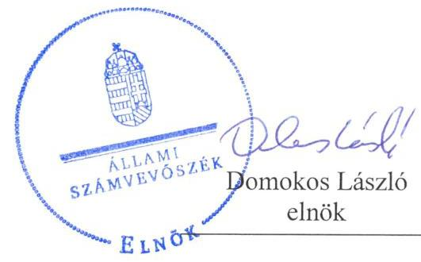
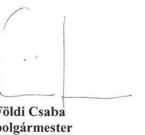
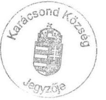
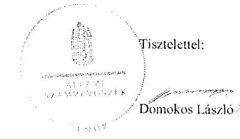
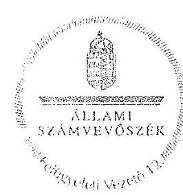
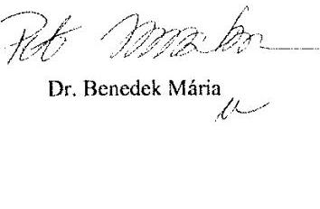

# Jelentés 

## Önkormányzatok ellenőrzése

Integritás- és belső kontrollrendszer, Befektetési tevékenységek ellenőrzése - Karácsond Községi Önkormányzat 2019.

---

# Jelenetés 

## Önkormányzatok ellenőrzése

Integritás- és belső kontrollrendszer, Befektetési tevékenységek ellenőrzése - Karácsond Községi Önkormányzat 2019. 05. hó 29. nap

---

# AZ ELLENŐRZÉST FELÜGYELTE:

DR. BENEDEK MÁRIA felügyeleti vezető

## AZ ELLENŐRZÉST VEZETTE ÉS A VÉGREHAJTÁSÁÉRT FELELŐS:

PETRÓ KATALIN ellenőrzésvezető

A PROGRAM ÖSSZEÁLLÍTÁSÁÉRT FELELŐS:

TÓTPÁL SZABOLCS osztályvezető

IKTATÓSZÁM: EL-0810-055/2019.

TÉMASZÁM: 2485

ELLENŐRZÉS-AZONOSÍTÓ SZÁM: V082912

Jelentéseink az Országgyűlés számítógépes hálózatán és az Interneta a www.asz.hu címen is olvashatóak.

---

# TARTALOMJEGYZÉK 

- ÖSSZEGZÉS ..... 5
- AZ ELLENŐRZÉS CÉLJA ..... 6
- AZ ELLENŐRZÉS TERÜLETE ..... 7
- AZ ELLENŐRZÉS HÁTTERE, INDOKOLTSÁGA ..... 8
- A JELENTÉS LÉNYEGES KÉRDÉSKÖREI ..... 9
- AZ ELLENŐRZÉS HATÓKÖRE ÉS MÓDSZEREI ..... 10
- MEGÁLLAPÍTÁSOK ..... 13
- JAVASLATOK ..... 18
- MELLÉKLETEK ..... 21
I. sz. melléklet: Értelmező szótár ..... 21
- FÜGGELÉKEK ..... 23
I. sz. függelék a Jelentéshez ..... 23
II. sz. függelék: Észrevételek ..... 24
- RÖVIDÍTÉSEK JEGYZÉKE ..... 43

---

.

---

# ÖSSZEGZÉS 

Karácsond Községi Önkormányzat belső kontrollrendszere nem biztositotta a közpénzekkel történő elszámoltatható, átlátható és szabályszerű gazdálkodást és a befektetési tevékenység szabályszerű végzését. A befektetett vagyonáról nem nyújtott megbizható és valós képet. Az integritás kontrollrendszerét nem épitette ki, az integritás alapú müködést nem biztositotta.

## Az ellenőrzés társadalmi indokoltsága

Az ÁSZ az ÁSZ törvényben kapott felhatalmazással élve ellenőrzi az önkormányzatok gazdálkodását, múködését, hogy az ellenőrzések megállapításaival támogassa az ellenőrzött önkormányzatok szabályszerű gazdálkodását, javaslataival elősegítse az Alaptörvényben megfogalmazott alapvetések érvényesülését a mindennapi életben az önkormányzatok szintjén. Az önkormányzati rendszerben zajló folyamatok holisztikus elemzései, a kockázatok folyamatos figyelemmel kísérésének módszerével, az így kiválasztott önkormányzatok célzott, hatékony ellenőrzéseivel az ÁSZ betölti a legfőbb gazdasági ellenőrző szerv küldetését. Az egyes ellenőrzések megállapításaival és egy időszak ellenőrzési eredményeinek elemzésével az ÁSZ ráirányíthatja a jogalkotók figyelmét az önkormányzati alrendszerben esetlegesen felmerülő pénzügyi, szabályozási feszültségekre. Az elvégzett nagyszámú ellenőrzés során az ÁSZ „jó gyakorlatokat" is azonosíthat, melyeket tanácsadó funkciója keretében szélesebb körben is megismertethet az érintettekkel, ezáltal is hozzájárulva az önkormányzati alrendszer szabályozott, átlátható, kiegyensúlyozott és fenntartható múködéséhez.

## Főbb megállapítások, következtetések, javaslatok

Karácsond Községi Önkormányzat belső kontrollrendszerének nem szabályszerű kialakítása és múködtetése a közpénzekkel való felelős, rendeltetésszerű gazdálkodást nem biztosította.

A jegyző nem határozta meg a vagyonnyilatkozat-tételre kötelezettek körét a hivatali szervezeti és múködési szabályzatban. A jegyző a kontrolltevékenységeket nem múködtette szabályszerűen, mert nem gondoskodott, hogy az érvényesítő ugyanazon gazdasági esemény tekintetében ne legyen azonos a kötelezettségvállalásra, utalványozásra jogosult és a teljesítést igazoló személlyel. A jegyző nem múködtetett kockázatkezelési rendszert, az információs és kommunikációs rendszer, valamint a belső ellenőrzés múködtetése nem volt szabályszerű, így azok nem biztosították a közpénzfelhasználás szabályosságát és átláthatóságát.

A 2013-2017 években a kiépített kontrollrendszer nem biztosította a befektetési tevékenység szabályszerű végzését. A polgármester nem gondoskodott Karácsond Községi Önkormányzat számlarendjének összeállításáról, a jegyző 2013. szeptember 1-jétől 2017. december 31 nem készítette el Karácsond Községi Önkormányzat Hivatala számlarendjét, valamint a számviteli politikát és a számviteli politika keretében elkészítendő eszközök és források leltárkészítési és leltározási szabályzatát 2015. december 14-ig, a pénzkezelési szabályzatot 2017. december 14-ig, a források értékelési szabályzatát 2017. november 30-ig. Az egyes befektetések részletező nyilvántartásának nem a jogszabályi előírások szerinti vezetése, valamint a leltári alátámasztottsága hiányában Karácsond Községi Önkormányzat beszámolója a vagyonáról nem nyújtott megbízható és valós összképet.

Karácsond Községi Önkormányzatnál az integritás kontrollrendszer kiépítésének, továbbá a kockázatelemzésnek a hiánya miatt a múködés során az integritás szemlélet nem érvényesült.

Az ÁSZ az ellenőrzés megállapításai alapján Karácsond Községi Önkormányzat polgármesterének három javaslatot, jegyzőjének 12 javaslatot fogalmazott meg.

---

# AZ ELLENŐRZÉS CÉLJA 

Az ellenőrzés célja annak megállapítása volt, hogy az önkormányzat belső kontrollrendszere biztosította-e a közpénzekkel és a nemzeti vagyonnal történő elszámoltatható, átlátható, szabályszerű, gazdaságos, hatékony és eredményes gazdálkodás feltételeit. Az ellenőrzés keretében az Állami Számvevőszék értékelte továbbá, hogy az önkormányzatnál kiépítették és erősítették-e a korrupciós kockázatok kezelését szolgáló integritás kontrollokat és azt, hogy megteremtették-e a teljesítményellenőrzés feltételeit.

Az ellenőrzés további célja annak értékelése volt, hogy a jogszabályi előírásoknak megfelelően alakították-e ki a belső kontrollrendszert, a kontrollkörnyezet biztosította-e a befektetési tevékenységek szabályszerű végzését. Az Állami Számvevőszék értékelte továbbá, hogy az egyes befektetési tevékenységekkel kapcsolatos döntéshozatal és a döntések végrehajtása, valamint az egyes befektetések számviteli elszámolása, nyilvántartása szabályszerű volt-e, és a belső és külső ellenőrzések támogatták-e az egyes befektetési tevékenységek szabályszerű végzését.

---

# **AZ ELLENŐRZÉS TERÜLETE**

## **Karácsond Községi Önkormányzat**

Karácsond község Heves megyében, a Gyöngyösi járásban található. A lakónépesség száma a KSH1 Magyarország közigazgatási helynévkönyve alapján 2017. január 1-jén 2892 fő volt.

Karácsond Községi Önkormányzat hét tagú Képviselő-testületének2 munkáját két állandó bizottság támogatta. A polgármester3 2014. október 12. óta tölti be tisztségét. A jegyző4 1990. november 15-től látja el feladatait.

Karácsond Községi Önkormányzat képviselő-testülete önálló önkormányzati hivatalként működő polgármesteri hivatalt hozott létre. A Hivatal5 gazdasági szervezettel nem rendelkezett.

Karácsond Községi Önkormányzat a 2017. évi költségvetésének végrehajtásáról szóló rendelete6 szerint 741,8 M Ft költségvetési bevételt ért el és 484,8 M Ft költségvetési kiadást teljesített. A 2017. december 31-én mérlegfőösszege 2297,6 millió forint Ft, a követelések állománya 14,9 millió forint, a kötelezettségek állománya 20,0 millió forint volt.

Karácsond Községi Önkormányzat befektetési célú (nem önkormányzati feladatellátást szolgáló) ingatlannal, kulturális javakkal és egyéb érték-tárgyakkal az ellenőrzött időszakban nem rendelkezett. Karácsond Községi Önkormányzat 2017. december 31-én nem rendelkezett értékpapírral és betétlekötésekkel. Befektetett pénzügyi eszközzel két gazdasági társaságban 250 ezer Ft összértékben rendelkezett.

A Karácsondi Szociális Szövetkezetet 2015. október 16-án alapította a Karácsond Községi Önkormányzat, amelyben 150 ezer Ft befizetésével 62%-os tulajdoni hányaddal rendelkezett. A Karácsondi Szociális Szövetkezet célja a tagok számára munkafeltételek teremtése, valamint szociális helyzetük egyéb módon történő segítése.

A Fejlesztési és Koordinációs Központ Nonprofit Kft.-ben Karácsond Községi Önkormányzat 2016. február 29. időponttal üzletrész-adásvételi szerződéssel 100 ezer Ft törzsbetét befizetésével 2,6%-tulajdonrészt szerzett. A Fejlesztési és Koordinációs Központ Nonprofit Kft. feladata egyéb kiegészítő üzleti szolgáltatások keretében elsősorban a tulajdonos 37 település pályázataihoz szakmai anyagok készítése.

---

# AZ ELLENŐRZÉS HÁTTERE, INDOKOLTSÁGA 

A belső kontrollrendszer kialakítása és múködtetése nélkül nem valósítható meg a közpénzek, a közvagyon átlátható, szabályos, gazdaságos, hatékony és eredményes felhasználása. A belső kontrollrendszer azt a célt szolgálja, hogy a költségvetési szervek múködésük és gazdálkodásuk során a tevékenységeket szabályszerűen hajtsák végre, teljesítsék elszámolási kötelezettségeiket és megvédjék az erőforrásokat a veszteségektől, a károktól és a nem rendeltetésszerű használattól. A belső kontrollrendszer magában foglalja mindazon elveket, eljárásokat és belső szabályzatokat, melyek biztosítják, hogy a költségvetési szerv valamennyi tevékenysége és célja összhangban legyen a szabályszerűséggel, szabályozottsággal, valamint a gazdaságosság, hatékonyság és eredményesség követelményeivel, az eszközökkel és forrásokkal való gazdálkodásban ne kerüljön sor pazarlásra, visszaélésre, rendeltetésellenes felhasználásra. Megfelelő, pontos és naprakész információk álljanak rendelkezésre a költségvetési szerv múködésével kapcsolatosan, és a belső kontrollrendszer harmonizációjára, öszszehangolására vonatkozó jogszabályok végrehajtásra kerüljenek. Az integritás kontrollok kiépítése, erősítése a szervezet korrupciós kockázatainak kezelését szolgálja. A teljesítménykövetelmények meghatározása és múködtetése megalapozhatja az önkormányzatoknál a teljesítményellenőrzés lefolytatását.

Az önkormányzati vagyongazdálkodás keretében az önkormányzatok át-menetileg szabad pénzeszközeinek befektetését jogszabály nem tiltja, a befektetések jellege nem korlátozott, a pénzpiaci szolgáltatók közül az önkormányzatok a kínált szolgáltatás és annak költségei alapján, szabadon választhatnak, azonban a veszteséges gazdálkodás kockázatai és következményei az önkormányzatokat terhelik. A szabad pénzeszközök felhasználása során kiemelten fontos a felelős gazdálkodás érvényesülése, amely összhangban kell, hogy legyen, az önkormányzati gazdálkodás alapelveivel. Az ellenőrzéssel feltárásra kerülhetnek azok a kockázatok, amelyek az önkormányzatok gazdálkodásával, ezen belül befektetési tevékenységeivel, kontrollkörnyezetével kapcsolatosak és a befektetési tevékenységek szabályszerű végrehajtását befolyásolják. Az ellenőrzéssel az önkormányzatok befektetési/vagyongazdálkodási döntései értékelhetővé válnak, és megalapozott megállapítás tehető arra vonatkozóan, hogy milyen hatást gyakoroltak az önkormányzat vagyonára a képviselő-testület döntései.

---

# A JELENTÉS LÉNYEGES KÉRDÉSKÖREI 

1. Az önkormányzat belső kontrollrendszerének kialakítása és müködtetése szabályszerű volt-e a 2017. évben, a befektetési tevékenységek szabályszerű végzését a kiépített kontrollrendszer biztositotta-e a 2013-2017. években?
2. Az önkormányzatnál alakítottak-e ki a teljesítmény mérésére alkalmas követelményeket?
3. Az önkormányzat egyes befektetéseivel kapcsolatos döntéshozatala és az egyes befektetések számviteli elszámolása, nyilvántartása szabályszerű volt-e?

---

# AZ ELLENŐRZÉS HATÓKÖRE ÉS MÓDSZEREI 

## Az ellenőrzés típusa

Megfelelőségi és szabályszerűségi ellenőrzés.

## Az ellenőrzött időszak

Az integritás és belső kontrollrendszer ellenőrzött időszaka a 2017. év, illetve az éves költségvetési beszámoló Áht. ${ }^{7}$ által megállapított jóváhagyásáig, 2018. május 31-éig tartó időszak volt.

Az egyes befektetési tevékenységek ellenőrzése tekintetében az ellenőrzött időszak 2013. január 1. - 2017. december 31. közötti időszak, továbbá a 2013. január 1. előtti időszak is, amennyiben a 2017. december 31-én meg-lévő befektetésekkel kapcsolatos döntéshozatalra a 2013. január 1. előtti időszakban került sor.

## Az ellenőrzés tárgya

Az önkormányzat és a gazdálkodási feladatokat ellátó hivatala belső kontrollrendszerének kialakítása és múködtetése, valamint az integritás kontrollok kiépítettsége, a teljesítményellenőrzés feltételei voltak.

Az egyes befektetési tevékenységek ellenőrzésének tárgya az önkormányzat 2017. december 31-én meglévő, a Számv. tv . 3. § (6) bekezdés 2. és 3. pontja szerint az értékpapírokban meg-testesülő befektetései, lekötött betétei. Továbbá a 2017. december 31-én meglévő, az önkormányzat szabad pénzeszközei terhére, adásvételi szerződés keretében megszerzett, a kötelező feladatok ellátását nem szolgáló, az önkormányzat üzleti vagyonába tartozó, az ellenőrzött időszakban (2013-2017.) megszerzett ingatlanok; az üzleti vagyon körébe tartozó, befektetési céllal megszerzett, de még használatba nem vett ingatlan beruházások, továbbá az - időkorlátozás nélkül megszerzett - kulturális javak (műtárgyak, műalkotások, stb.), illetve egyéb értéktárgyak (pl. ékszerek, befektetési nemesfém).

## Az ellenőrzött szervezet

Karácsond Községi Önkormányzat

## Az ellenőrzés jogalapja

Az ellenőrzés jogszabályi alapját az ÁSZ tv . 1. § (3) bekezdés, 5. § (2) és (6) bekezdései, valamint az Áht . 61. § (2) bekezdésének előírásai képezik.

---

# Az ellenőrzés módszerei 

Az ÁSZ az ellenőrzést az ellenőrzési program szempontjai, az ellenőrzött időszakban hatályos jogszabályok, az ellenőrzés szakmai szabályai, a jelen ellenőrzésre irányadó ÁSZ módszertanok figyelembevételével végezte.

Az ellenőrzés ideje alatt az ÁSZ az önkormányzattal a kapcsolattartást az ÁSZ SZMSZ ${ }^{\text {® }}$-ének vonatkozó előírásai alapján biztosította.

Az ellenőrzési kérdések megválaszolásához szükséges bizonyítékok megszerzése az ellenőrzött által rendelkezésre bocsátott dokumentumokra, adatokra alapozva megfigyelés, szemle (szemrevételezés), kérdésfeltevés (információkérés), mintavételezés, valamint elemző eljárás útján történt.

Az ellenőrzési bizonyítékként felhasználható adatforrások közé tartoztak az ellenőrzési program részletes szempontjainál felsorolt adatforrások, valamint minden egyéb - az ellenőrzés folyamán feltárt, az ellenőrzés szempontjából információt tartalmazó - dokumentum.

Az ellenőrzés lefolytatásához az ellenőrzött szervezet tanúsítványok kitöltésével, valamint az ÁSZ által kért dokumentumok megküldésével szolgáltatott adatokat, amelyek valódiságát és teljes körűségét az ellenőrzött szervezet vezetője által tett teljességi és hitelességi nyilatkozat igazolta. A rendelkezésre bocsátott adatok, információk kontrollja az ellenőrzés keretében történt.

Az önkormányzat belső kontrollrendszere egyes pilléreinek kialakítására és működtetésére vonatkozó értékelés:
$\longrightarrow$ „szabályszerú", amennyiben az értékelt területen az elért „igen" válaszok százalékban kifejezett, egész számra kerekített aránya legalább $85 \%$,
$\longrightarrow$ „nem szabályszerű", ha nem éri el a $85 \%$-ot.
Az önkormányzat belső kontrollrendszerének összesített értékelése az egyes részterületek esetében kapott megfelelőségi arányok számtani átlaga alapján történt és megegyezett a pillérenként (kontrollterületenként) alkalmazott százalékos értékelésekkel, a következő eltérésekkel: a kontrollrendszer egésze esetében a „szabályszerű" értékelésnek a százalékos értéken felül további feltétele volt, hogy egyik kontrollterület sem kaphatott „nem szabályszerű" értékelést.

A 2017. évi kiadások teljesítéséhez kapcsolódó pénzgazdálkodási belső kontrollok működésének szabályszerűsége esetében az ellenőrzés azokra a legnagyobb értékű tételekre - a lényeges sokaságra - terjedt ki, melyek összértéke eléri a teljes sokaság összértékének 50\%-át. A 2017. évi kiadások esetében a lényeges sokaságot tételesen ellenőrizte az ÁSZ.

Az önkormányzatok befektetési tevékenységét a szerződéskötés (és a kapcsolódó döntés-előkészítés, döntéshozatal) kivételével a 2013. január 1. és 2017. december 31. közötti időszak vonatkozásában értékelte az ÁSZ. A szerződéskötést az önkormányzat 2017. december 31-én meglévő értékpapírjai és egyéb befektetései vonatkozásában kellett értékelni a befektetési döntés előkészítése és döntéshozatala tekintetében, abban az esetben is, ha az 2013. január 1. előtt történt. Amennyiben a szerződéskötés, illetve

---

a döntések előkészítése a 2013. évet megelőzően történt, akkor értelemszerűen a mindenkor hatályos jogszabályok előírásai alapján kellett az értékelést elvégezni.

---

# 1. Az önkormányzat belső kontrollrendszerének kialakítása és müködtetése szabályszerű volt-e a 2017. évben, a befektetési tevékenységek szabályszerű végzését a kiépített kontrollrendszer biztosította-e a 2013-2017. években?

**Összegző megállapítás**

Az Önkormányzat9 belső kontrollrendszerének kialakítása és működtetése nem volt szabályszerű a 2017. évben. A befektetési tevékenységek szabályszerű végzését a kiépített kontrollrendszer nem biztosította a 2013-2017. években.

**A KONTROLLKÖRNYEZET** kialakítása nem volt szabályszerű. A kontrollkörnyezet kialakításával kapcsolatosan feltárt szabálytalanságokat az 1. táblázat mutatja be.

1. táblázat

|  Sorszám | Részmegállapítás | Megjegyzés  |
| --- | --- | --- |
|  1. | A jegyző a Vnytv.10 4. § a) pontjában előírtak ellenére 2017. december 31-ig nem tüntette fel a vagyonnyilatkozat-tételi kötelezettséget a közszolgálatban álló személyek esetében az őket ilyen minőségében alkalmazó Hivatal szervezeti és működési szabályzatában. |   |
|  2. | A jegyző a 2013. január 01. - 2015. december 14. közötti időszakra nem készítette el a Számv. tv.11 14. § (3) bekezdéseiben foglaltak ellenére a Hivatal számviteli politikáját12. | A Hivatal 2015. december 15-től rendelkezett Számviteli politikával.  |
|  3. | A jegyző a Számv. tv. 14. § (5) bekezdés b) pontjában foglaltak ellenére 2017. november 30-ig nem készítette el a számviteli politika keretében a Hivatal az eszközök és források értékelési szabályzatát13, valamint a Számv. tv. 14. § (5) bekezdés d) pontjában foglaltak ellenére 2017. december 14-ig a számviteli politika keretében a Hivatal pénzkezelési szabályzatát14. | A Hivatal 2017. december 1-jétől rendelkezett eszközök és források értékelési szabályzattal és 2017. december 15-től pénzkezelési szabályzattal.  |
|  4. | A jegyző a Számv. tv. 161. § (4) bekezdésben foglaltak ellenére 2013. szeptember 1-jétől - 2017. december 31-ig nem gondoskodott a Hivatal számlarendjének öszszeállításáról. |   |
|  5. | A polgármester a Számv. tv. 161. § (4) bekezdésben foglaltak ellenére 2017. december 31-ig nem gondoskodott az Önkormányzat számlarendjének összeállításáról. |   |
|  6. | A jegyző az Ávr. 13. § (2) bekezdés a) pontjának előírása ellenére 2017. január 1-jétől 2017. október 31-ig belső szabályzatban nem rendezte a Hivatal tervezéssel, gazdálkodással – így különösen a kötelezettségvállalás, ellenjegyzés, teljesítés igazolása, érvényesítés, utalványozás gyakorlásának módjával, eljárási és dokumentációs részletszabályaival, valamint az ezeket végző személyek kijelölésének rendjével –, az ellenőrzési, adatszolgáltatási és beszámolási feladatok teljesítésével kapcsolatos belső előírásokat, feltételeket. | A Hivatal 2017. november 1-jétől rendelkezett az Ávr. 13. § (2) bekezdés a) pontjának előírásait tartalmazó gazdálkodási szabályzat15-tal.  |
|  7. | A jegyző a Bkr. 6. § (3) bekezdésben előírtak ellenére 2017. december 31-ig nem készítette el a Hivatal ellenőrzési nyomvonalát. |   |

---

| Sorszám | Részmegállapítás | Megjegyzés |
| :--: | :--: | :--: |
| 8. | A jegyző a Bkr. 3. § b) pontjában foglaltak ellenére 2016. október 1-jétől - 2017. augusztus 31-ig nem alakított ki - a szervezet minden szintjén érvényesülő - integrált kockázatkezelési rendszert. | A Hivatal 2017. szeptember 1-jétől rendelkezett integrált kockázatkezelési szabályzat ${ }^{16}$-tal. |
| 9. | A jegyző a Bkr. 3. § d) pontjában foglaltak ellenére nem alakította ki a belső kontrollrendszer keretében - a szervezet minden szintjén érvényesülő - információs és kommunikációs rendszert a 2013-2017 években. |  |
| 10. | Az Önkormányzat Képviselő-testülete a Mótv. ${ }^{17}$ 116. § (5) bekezdésében foglaltak ellenére 2017. december 31-ig nem rendelkezett gazdasági programmal, fejlesztési tervvel. |  |

Forrás: ÁSZ

# INTEGRÁLT KOCKÁZATKEZELÉSI RENDSZERT a2 

Önkormányzat nem múködtetett.
Az integrált kockázatkezelési rendszerrel kapcsolatos szabálytalanságot a 2. táblázat mutatja be.
2. táblázat

## AZ INTEGRÁLT KOCKÁZATKEZELÉSI RENDSZER MŰKÖDTETÉSÉVEL KAPCSOLATOSAN FELTÁRT SZABÁLYTALANSÁG

| Sorszám | Részmegállapítás | Megjegyzés |
| :--: | :--: | :--: |
| 1. | A jegyző a Bkr. 7. § (1) bekezdésében foglaltak ellenére 2016. szeptember 30-ig kockázatkezelési rendszert, 2016. október 1-jétől 2017. december 31-ig integrált kockázatkezelési rendszert nem múködtetett. |  |

Forrás: ÁSZ

## A KONTROLLTEVÉKENYSÉGEK gyakorlása nem volt szabályszerű.

A kontrolltevékenységek gyakorlásával kapcsolatos szabálytalanságot a 3. táblázat mutatja be.
3. táblázat

## A KONTROLLTEVÉKENYSÉGEK VÉGZÉSÉVEL KAPCSOLATOSAN FELTÁRT SZABÁLYTALANSÁG

| Sorszám | Részmegállapítás | Megjegyzés |
| :--: | :--: | :--: |
| 1. | A jegyző az Ávr. 60. § (1) bekezdésben foglaltak ellenére 2017. december 31-ig nem biztosította, hogy az érvényesítő ugyanazon gazdasági esemény tekintetében ne legyen azonos a kötelezettségvállalásra, utalványozásra jogosult és a teljesítést igazoló személlyel. |  |

Forrás: ÁSZ

## AZ INFORMÁCIÓS ÉS KOMMUNIKÁCIÓS RENDSZER múködtetése nem volt szabályszerű.

Az információs és kommunikációs rendszer működtetése során feltárt szabálytalanságokat a 4. táblázat tartalmazza.

---

4. táblázat

# AZ INFORMÁCIÓS ÉS KOMMUNIKÁCIÓS RENDSZER MŰKÖDTETÉSE SORÁN FELTÁRT SZABÁLYTALANSÁGOK 

| Sorszám | Részmegállapítás | Megjegyzés |
| :--: | :--: | :--: |
| 1. | A jegyző az Info tv ${ }^{18}$. 37. § (1) bekezdésében előírtak ellenére az Info tv. 1. melléklet szerinti általános közzétételi lista II./1. pontjában meghatározott adatvédelmi és adatbiztonsági szabályzatot nem tette közzé. |  |
| 2. | A jegyző az Ávr. ${ }^{19}$ 33. § (2) bekezdésben foglaltak ellenére az 5. melléklet 14. pontjában előírt, a 2017. évi elemi költségvetésről adatot nem szolgáltatott a Kincstár által múködtetett elektronikus adatszolgáltató rendszerbe. | . |

Forrás: ÁSZ

## A MONITORING RENDSZERT AZ ÖNKORMÁNYZAT

A BELSŐ ELLENŐRZÉS útján valósította meg. A belső ellenőrzés múködtetése nem volt szabályszerű.

A belső ellenőrzés múködtetésével kapcsolatban feltárt szabálytalanságokat az 5. táblázat szemlélteti.
5. táblázat

## A BELSŐ ELLENŐRZÉS MŰKÖDTETÉSÉVEL KAPCSOLATOSAN FELTÁRT SZABÁLYTALANSÁGOK

| Sorszám | Részmegállapítás | Megjegyzés |
| :--: | :--: | :--: |
| 1. | A belső ellenőrzési vezető a Bkr. 29. § (1) bekezdésben előírtak ellenére a 2017. évre éves ellenőrzési tervet nem állított össze. |  |
| 2. | A belső ellenőrzési vezető a Bkr. 47. § (1) bekezdésében előírtak ellenére a 2017. évben éves bontásban nem vezetett nyilvántartást, amellyel a belső ellenőrzési jelentésekben tett megállapításokat, javaslatokat, vonatkozó intézkedési terveket, és azok végrehajtását nyomon követi. |  |
| 3. | A jegyző a Bkr. 45. § (4) bekezdésben foglaltak ellenére a 2017. évben az intézkedési terv jóváhagyásáról a belső ellenőrzési vezető véleményének kikérése nélkül döntött. | A belső ellenőrzési vezető az intézkedési tervet nem véleményezte. |
| 4. | A polgármester a Bkr. 11. § (2a) bekezdésben előírtak ellenére a vezetői nyilatkozatot a 2017. évi zárszámadási rendelet tervezetével együtt nem terjesztette a képviselő-testület elé. |  |

Forrás: ÁSZ

A belső ellenőrzések nem támogatták az egyes befektetési tevékenységek szabályszerű végzését. Mivel az Önkormányzatnál 2013. január 1. 2017. december 31. közötti időszakban a befektetésekkel kapcsolatos tevékenységet a belső ellenőrzés nem ellenőrizte, nem végzett kockázatelemzést, ezáltal befektetési tevékenységet érintő intézkedések nem fogalmazódtak meg.

A belső kontrollrendszer minőségét a jegyző a Bkr. 1. számú melléklet ${ }^{20}$ szerinti nyilatkozatban értékelte, azonban az ellenőrzés megállapításai ezt nem támasztották alá.

Az Önkormányzat nem építette ki az integritás kontrollrendszerét. A múködés során az integritás szemlélet nem érvényesült. A jogszabályok által kötelezően elő nem írt kontrollokat nem alakította ki, így a kontrollok nem támogatták az integritás alapú múködést.

---

# 2. Az önkormányzatnál alakítottak-e ki a teljesítmény mérésére alkalmas követelményeket? 

## Összegző megállapítás

Az Önkormányzatnál nem alakítottak ki a teljesítmény mérésére alkalmas követelményeket.

A szervezeti célok elérését szolgáló feladatok, folyamatok, tevékenységek mérését szolgáló indikátorokat, mérőszámokat, feladat- és teljesítménymutatókat az Önkormányzat nem képzett, így nem biztosította a teljesítménymérés lehetőségét.

## 3. Az önkormányzat egyes befektetéseivel kapcsolatos döntéshozatala és az egyes befektetések számviteli elszámolása, nyilvántartása szabályszerű volt-e?

Összegző megállapítás

Az Önkormányzat egyes befektetéseivel kapcsolatos döntéshozatala szabályszerű volt, a befektetett pénzügyi eszközeinek számviteli elszámolása, nyilvántartása nem volt szabályszerű.

AZ EGYES BEFEKTETÉSEKKEL KAPCSOLATOS DÖNTÉSHOZATAL szabályszerű volt. Az Önkormányzat a befektetett pénzügyi eszközeivel (részesedések) kapcsolatos döntéseket az önkormányzati rendeletek, belső szabályzatok előírásaiban foglaltak szerint hozta meg.

A polgármester a Karácsondi Szociális Szövetkezetet Önkormányzat Alapító Okiratát 2015. március 20-án írta alá, amelyre Önkormányzati határozatban kapott felhatalmazást. A Fejlesztési és Koordinációs Központ Nonprofit Kft.-ben üzletrész vásárlására a Képviselő-testület Önkormányzati határozatban adott a polgármester részére felhatalmazást.

AZ EGYES BEFEKTETETT PÉNZÜGYI ESZKÖZÖK (RÉSZESEDÉSEK) SZÁMVITELI ELSZÁMOLÁSA, NYILVÁNTARTÁSA nem volt szabályszerű.

Az Önkormányzat befektetett pénzügyi eszközeinek (részesedések) számviteli elszámolása, nyilvántartása során feltárt hiányosságokat a 6. táblázat mutatja be.

---

6. táblázat

# AZ EGYES BEFEKTETÉSEK SZÁMVITELI ELSZÁMOLÁSÁVAL, NYILVÁNTARTÁSÁVAL KAPCSOLATBAN FELTÁRT SZABÁLYTALANSÁGOK 

| Sorszám | Részmegállapítás | Megjegyzés |
| :-- | :-- | :-- |
| 1. | A jegyző az Áhsz ${ }^{21}$. 45. § (3) bekezdésben foglaltak ellenére a befektetett eszközökről (részesedések) az Áhsz. 14. melléklet VIII. fejezet 2. pontjában meghatározott kötelező minimum tartalmi követelmények szerinti részletező nyilvántartást nem vezette. |  |
| 2. | A jegyző a Számv. tv. 69.§ (1) bekezdések előírása ellenére a 2015-2017. években a befektetett pénzügyi eszközök (részesedések) mérleg tételeinek alátámasztásához nem állított össze olyan leltárt, amely tételesen, ellenőrizhető módon tartalmazza mérleg fordulónapján meglévő eszközöket és forrásokat mennyiségben és értékben. |  |

---

# JAVASLATOK 

Az ÁSZ tv. 33. § (1) bekezdésében foglaltak értelmében az ellenőrzött szervezet vezetője köteles a jelentésben foglalt megállapításokhoz kapcsolódó intézkedési tervet összeállítani és azt a jelentés kézhezvételétől számított 30 napon belül az ÁSZ részére megküldeni. Amennyiben az ellenőrzött szervezet vezetője nem küldi meg határidőben az intézkedési tervet, vagy továbbra sem elfogadható intézkedési tervet küld, az Állami Számvevőszék elnöke az ÁSZ tv. 33. § (3) bekezdése a) és b) pontjaiban foglaltakat érvényesítheti.

## a polgármesternek

1. Intézkedjen az Állami Számvevőszék ellenőrzése során feltárt hiányosságok és/vagy szabálytalanságok tekintetében a munkajogi felelősség tisztázására irányuló eljárás megindításáról, és ennek eredménye ismeretében tegye meg a szükséges intézkedéseket.
(1. táblázat 1., 4.,7., és 9. sz., 2. táblázat 1. sz., 3. táblázat 1., 4. táblázat 1-2. sz., 5. táblázat 3. sz. és 6. táblázat 1-2. sz. megállapításai alapján)
2. Gondoskodjon a Számv. tv.-ben foglaltak szerint az Önkormányzat számlarendjének összeállításáról.
(1. táblázat 5. sz. megállapítás alapján)
3. Terjessze a Bkr. előírásai szerint a vezetői nyilatkozatot a zárszámadási rendelet tervezetével együtt a képviselő-testület elé.
(5. táblázat 4. sz. megállapítás alapján)

## a jegyzőnek

1. Intézkedjen a Vnytv. előírása szerint a közszolgálatban álló személyek esetében a vagyonnyilatkozat-tételi kötelezettség Hivatali SZMSZ-ben történő feltüntetéséről.
(1. táblázat 1. sz. megállapítás alapján)
2. Gondoskodjon a Számv. tv.-ben foglaltak szerint a Hivatal számlarendjének összeállításáról.
(1. táblázat 4. sz. megállapítás alapján)

---

3. Intézkedjen a Bkr. előírása szerint a Hivatal ellenőrzési nyomvonalának elkészitéséről.
(1. táblázat 7. sz. megállapítás alapján)
4. Alakitsa ki a Bkr. előírásainak megfelelően a belső kontrollrendszer keretében - a szervezet minden szintjén érvényesülő - információs és kommunikációs rendszert.
(1. táblázat 9. sz. megállapítás alapján)
5. Müködtessen a Bkr. előírása szerint integrált kockázatkezelési rendszert.
(2. táblázat 1. sz. megállapítás alapján)
6. Biztosítsa az Ávr. előírásának megfelelően, hogy az érvényesitő ugyanazon gazdasági esemény tekintetében nem legyen azonos a kötelezettségvállalásra, utalványozásra jogosult és a teljesítést igazoló személylyel.
(3. táblázat 1. sz. megállapítás alapján)
7. Intézkedjen az Ávr. előírásának megfelelően az elemi költségvetésről történő adatszolgáltatásról a Kincstár által müködtetett elektronikus adatszolgáltató rendszerbe.
(4. táblázat 2. sz. megállapítás alapján)
8. Gondoskodjon, hogy a Bkr. előírása szerint a belső ellenőrzési vezető állitsa össze az éves ellenőrzési tervet.
(5. táblázat 1. sz. megállapítás alapján)
9. Gondoskodjon, hogy a Bkr. előírása szerint a belső ellenőrzési vezető éves bontásban nyilvántartást vezessen, amellyel a belső ellenőrzési jelentésekben tett megállapításokat, javaslatokat, a vonatkozó intézkedési terveket és azok végrehajtását nyomon követi.
(5. táblázat 2. sz. megállapítás alapján)
10. A Bkr. előírásának megfelelően az intézkedési terv jóváhagyásáról a belső ellenőrzési vezető véleményének kikérésével döntsön.
(5. táblázat 3. sz. megállapítás alapján)

---

11. Intézkedjen a befektetett eszközök (részesedések) vonatkozásában az Áhsz. előírásának megfelelően a 14. melléklet VIII. fejezet 2. pontjában meghatározott részletező nyilvántartás vezetéséről.
(6. táblázat 1. sz. megállapítás alapján)
12. Intézkedjen a Számv. tv. előírásának megfelelően a befektetett pénzügyi eszközök (részesedések) mérleg tételeinek alátámasztásához olyan leltár összeállításáról, amely ellenőrizhető módon tartalmazza a mérleg fordulónapján meglévő eszközöket és forrásokat mennyiségben és értékben.
(6. táblázat 2. sz. megállapítás alapján)

---

# MELLÉKLETEK 

- I. SZ. MELLÉKLET: ÉRTELMEZŐ SZÓTÁR
belső ellenőrzés
belső kontrollrendszer
belső kontrollrendszer területei
betét
betétszerződés
információs és kommunikációs rendszer
integrált kockázatkezelési rendszer
integritás
kockázat
kontrollkörnyezet

Független, tárgyilagos bizonyosságot adó és tanácsadó tevékenység, amelynek célja, hogy az ellenőrzött szervezet működését fejlessze és eredményességét növelje, az ellenőrzött szervezet céljai elérése érdekében rendszerszemléletű megközelítéssel és módszeresen értékeli, illetve fejleszti az ellenőrzött szervezet irányítási és belső kontrollrendszerének hatékonyságát. (Forrás: Bkr. 2. § b) pontja)
A belső kontrollrendszer a kockázatok kezelése és tárgyilagos bizonyosság megszerzése érdekében kialakított folyamatrendszer, amely azt a célt szolgálja, hogy a múködés és gazdálkodás során a tevékenységeket szabályszerűen, gazdaságosan, hatékonyan, eredményesen hajtsák végre, az elszámolási kötelezettségeket teljesítsék, megvédjék az erőforrásokat a veszteségektől, károktól és nem rendeltetésszerű használattól. (Forrás: Áht. 69. § (1) bekezdése)
A kontrollkörnyezet, az integrált kockázatkezelési rendszer, a kontrolltevékenységek, az információs és kommunikációs rendszer, valamint a nyomon követési (monitoring) rendszer. (Forrás: Bkr. 3. §-a)
a Ptk. szerinti betétszerződés vagy a takarékbetétről szóló 1989. évi 2. törvényerejű rendelet szerinti takarékbetét-szerződés alapján fennálló tartozás, ideértve a hitelintézetnél a fizetésiszámla-szerződés alapján fennálló pozitív számlaegyenleget is (Hpt. 6. § (1) bekezdés 8. pont)
betétszerződés alapján a betétes jogosult a bank számára meghatározott pénzössszeget fizetni, a bank köteles a betétes által felajánlott pénzösszeget elfogadni, ugyanakkora pénzösszeget későbbi időpontban visszafizetni, valamint kamatot fizetni (Ptk. 6:390. § (1) bekezdés)
A költségvetési szerv vezetője által kialakított és működtetett olyan rendszer, mely biztosítja, hogy a megfelelő információk a megfelelő időben eljutnak az illetékes szervezethez, szervezeti egységhez, illetve személyhez. (Forrás: Bkr. 9. § (1) bekezdés)
Olyan folyamatalapú kockázatkezelési rendszer, amely a szervezet minden tevékenységére kiterjed, egységes módszertan és eljárások alkalmazásával, a szervezet célkitűzéseinek és értékeinek figyelembevételével biztosítja a szervezet kockázatainak teljes körű azonosítását, azok meghatározott kritériumok szerinti értékelését, valamint a kockázatok kezelésére vonatkozó intézkedési terv elkészítését és az abban foglaltak nyomon követését. (Forrás: Bkr. 2. § m) pontja, 2016. október 1-jétől)
Az integritás az elvek, értékek, cselekvések, módszerek, intézkedések konzisztenciáját jelenti, vagyis olyan magatartásmódot, amely meghatározott értékeknek megfelel. (Forrás: Nemzetgazdasági Minisztérium: Magyarországi államháztartási belső kontroll standardok Útmutató 1.6.1. pontja, 2012. december)
A kockázat annak a valószínűségét jelenti, hogy egy vagy több esemény vagy intézkedés nem kívánt módon befolyásolja a rendszer múködését, céljainak megvalósulását. (Forrás: Javaslatok a korrupciós kockázatok kezelésére - Kockázatkezelési és ellenőrzési módszertan 35. oldal, ÁSZ)
A költségvetési szerv vezetője által kialakított olyan elvek, eljárások, belső szabályzatok összessége, amelyben világos a szervezeti struktúra, a folyamatok átláthatók, egyértelműek a felelősségi, hatásköri viszonyok és feladatok, meghatározottak, ismertek és elfogadottak az etikai elvárások a szervezet minden szintjén, átlátható a humánerőforrás-kezelés, biztosított a szervezeti célok és értékek irányában való elkötelezettség fejlesztése és elősegítése. (Forrás: Bkr. 6. § (1) bekezdés)

---

| kontrolltevékenységek | A költségvetési szerv vezetője által a szervezeten belül kialakított (kontroll) tevékenységek, melyek biztosítják a kockázatok kezelését, hozzájárulnak a szervezet céljainak eléréséhez és erősítik a szervezet integritását. (Forrás: Bkr. 8. § (1) bekezdés) |
| :--: | :--: |
| kommunikáció | Az a tevékenység, melynek során információ továbbítása valósul meg. A kommunikációs folyamat résztvevői között tájékoztatás történik, mely során tényeket, ezek magyarázatát közlik. |
| monitoring | A monitoring általánosságban a különböző szintű szervezeti célok megvalósításának folyamatát kíséri figyelemmel, melynek során a releváns eseményekről és tevékenységekről (együtt: folyamatokról) rendszeres jelleggel, strukturált, döntéstámogató információkhoz jutnak a szervezet vezetői. (Forrás: NGM Útmutató a költségvetési szervek monitoring rendszeréhez 2011. november) |
| monitoring-rendszer | A költségvetési szerv vezetője köteles kialakítani a szervezet tevékenységének a célok megvalósításának nyomon követését biztosító rendszert, amely az operatív tevékenységek keretében megvalósuló folyamatos és eseti nyomon követésből, valamint az operatív tevékenységektől függetlenül múködő belső ellenőrzésből állhat. (Forrás: Bkr. 10. §) |
| önkormányzati hivatal | A polgármesteri hivatal, a főpolgármesteri hivatal, a megyei önkormányzati hivatal és a közös önkormányzati hivatal. (Forrás: Áht. 1. § 18. pont) |

---

# FÜGGELÉKEK 

- I. SZ. FÜGGELÉK A JELENTÉSHEZ

Az Állami Számvevőszék az ellenőrzések során feltárt tényekhez kapcsolódó további körülmények tisztázására eszközrendszerrel nem rendelkezik. Amennyiben az ellenőrzésen túlmutatóan indokoltnak látszik az ellenőrzés során feltárt körülmények további vizsgálata, az Állami Számvevőszék törvényi felhatalmazás alapján az ellenőrzés által feltárt körülményeket továbbítja a hatáskörrel rendelkező szervnek a szükséges intézkedések megtétele, eljárások lefolytatása érdekében.
2017. december 31-én az Önkormányzat kettő gazdasági társaságban rendelkezett részesedéssel 250 ezer forint összértékben.
I. A jegyző a Számv. tv. 69. § (1) bekezdés előírása ellenére a 2015-2017. években a befektetett pénzügyi eszközök (részesedések) mérlegsor tételeinek alátámasztásához nem állított össze olyan leltárt, mely az eszközöket tételesen, ellenőrizhető módon tartalmazza. A jegyző az Áhsz. 45. § (3) bekezdésében foglaltak ellenére a befektetett eszközökről (részesedések) az Áhsz. 14. melléklet VIII. fejezet 2. pontjában meghatározott kötelező minimum tartalmi követelmények szerinti részletező nyilvántartást nem vezette.
A leltár és a nyilvántartás vezetésének hiánya miatt nem igazolt, hogy az Önkormányzat beszámolója megbízható valós összképet mutat az önkormányzat vagyonáról, mellyel az Önkormányzat megsértette a Számv. tv. 15. § (3) bekezdésben foglalt valódiság elvét.
Az Áht.68/B. § (1) bekezdés c) pontjában előirtak szerint a Magyar Államkincstár ellenőrzési jogköre kiterjed a helyi önkormányzat éves költségvetési beszámolója megbizható, valós összképének vizsgálatára, ezért a Magyar Államkincstár illetékes igazgatósága jogosult eljárni a jogsértő magatartás tekintetében.
II. A jegyző a Vnytv. 4. § a) pontjában előirtak ellenére nem tüntette fel a vagyonnyilatkozattételi kötelezettséget a közszolgálatban álló személyek esetében a Hivatal szervezeti és müködési szabályzatában.
A vagyonnyilatkozat-tételre vonatkozó szabályozás hiányában az integritásalapú müködés nem biztositott, a Mötv. 132. §-ában foglaltak alapján az Önkormányzat törvényességi felügyeletét ellátó illetékes Kormányhivatal jogosult eljárni.

---

A jelentéstervezetet a Számvevőszék 15 napos észrevételezésre megküldte az ellenőrzött szervezetek vezetőinek az ÁSZ tv. 29. §̊ (1) bekezdése előirásának megfelelően.

Karácsond Községi Önkormányzat polgármestere a jelentéstervezet megállapításaira írásban észrevételt tett.
Az ÁSZ tv. 29. § (3) bekezdésével összhangban az ÁSZ a Függelékben feltünteti az ellenőrzés megállapításaival kapcsolatban tett, figyelembe nem vett észrevételeket, és megindokolja, hogy azokat miért nem fogadta el.

[^0]
[^0]:    * 29. § (1) Az Állami Számvevőszék az ellenőrzési megállapításait megküldi az ellenőrzött szervezet vezetőjének vagy az általa megbízott személynek, és annak, akinek személyes felelősségét állapította meg.
    (2) Az ellenőrzött szervezet vezetője és a felelősként megjelölt személy az ellenőrzés megállapításaira tizenöt napon belül írásban észrevételt tehet.
    (3) Az Állami Számvevőszék az észrevételre a beérkezésétől számított harminc napon belül írásban válaszol. A figyelembe nem vett észrevételeket köteles a jelentésben feltüntetni, és megindokolni, hogy azokat miért nem fogadta el.

---

# KARÁCSOND KÖZSÉG POLGÁRMESTERÉTŐL 

3281 KARÁCSOND, SZENT ISTVÁN ÚT 42. Telefon: 37/322-001 Fax: 37/522-002 E-mail: polgarmester@karacsond.hu

Iktatószám: KAR/965-2/2019.

Tárgy: Észrevétel tétele az Állami Számvevőszék EL-0810-037/2019. iktatószámú jelentéstervezetére
Mell.: Kimutatás az Állami Számvevőszék
EL-0810-037/2019. iktatószámú jelentés-
tervezetére tett észrevételekről
(Iktatószám: KAR/965-3/2019.)
Domokos László elnök úrnak
Állami Számvevőszék

## 1364 Budapest

Pf. 54.

## Tisztelt Elnök Úr!

A Karácsond Községi Önkormányzatnál lefolytatott „Önkormányzatok ellenőrzése Integritás- és belső kontrollrendszer - Befektetési tevékenységek - Karácsond Községi Önkormányzat" című ellenőrzés EL-0810-37/2019. iktatószámú jelentéstervezetében lévő megállapításokra észrevételt teszek.

Észrevételeimet az ellenőrzésnél kapcsolattartóként közreműködő Forgó Istvánné jegyző által összeállított, és általam megismert és jóváhagyott kimutatás tartalmazza, melyet levelemhez mellékelek.

Kérem Elnök Urat, hogy amennyiben lehetőség van rá az észrevételeket elfogadni és a végleges jelentést ennek megfelelően elkészíteni szíveskedjenek. Az ellenőrzés során feltárt szabálytalanságok, hiányosságok mielőbbi megszüntetése érdekében a szükséges intézkedéseket meg fogom tenni.

Karácsond, 2019. április 4.

---

# KARÁCSOND KÖZSÉG JEGYZŐJÉTŐL 3281 KARÁCSOND, SZENT ISTVÁN ÚT 42. 

Telefon: 37/322-001 Fax: 37/522-002 E-mail: jegyzoc@karacsond.hu

Iktatószám: KAR/965-3/2019.
Tárgy: Kimutatás az Állami Számvevőszék
EL-0810-037/2019. iktatószámú jelentés-
tervezetére tett észrevételekről
Domokos László elnök úrnak
Állami Számvevőszék

## 1364 Budapest 4.

Pf. 54.

## Tisztelt Elnök Úr!

Az Állami Számvevőszék „Önkormányzatok ellenőrzése - Integritás- és belső kontrollrendszer - Befektetési tevékenységek - Karácsond Községi Önkormányzat" című ellenőrzésénél kapcsolattartóként működtem közre. Az ellenőrzés megállapításaira tett észrevételeket az alábbi táblázatok tartalmazzák, mely Földi Csaba polgármester úr KAR/965-2/2019. iktatószámú levelének mellékletét képezi.

Észrevételek az EL-0810-37/2019. iktatószámú jelentéstervezetben lévő megállapítások 1. pontjához:

| Táblázat száma | Feltárt szabálytalanság   sorszáma | Észrevétel |
| :--: | :--: | :-- |
| 1. | 1. | A vagyonnyilatkozat-tételi kötelezettség szabályozása a hivatal   szervezeti és müködési szabályzatának módosításával a   közeljövőben meg fog történni. |
| 1. | 2. | A polgármesteri hivatal a 2013. január 01. - 2015. december 14.   közötti időszaban rendelkezett számviteli politikával. A 2006.   január 1-jétől hatályos számviteli rend és a 2013. szeptember 1-   jétől hatályos számviteli politika feltöltésre került az   Adatbekérési Rendszer V082912_03._KARÁCSOND kódszámú   ellenőrzés 01_01_02 pontjához. Elsődleges dokumentumként a   2006. január 1-jétől hatályos számviteli rend lett megjelölve. |
| 1. | 3. | A jegyző elkészítette az önkormányzat 2011. január 1-jétől, a   2013. szeptember 1-jétől, 2015. december 15-től hatályos   értékelési szabályzatait és 2007. január 1-jétől, a 2013.   szeptember 1-jétől, 2015. december 15-től hatályos pénzkezelési   szabályzatait. Ezen szabályzatok kerültek alkalmazásra a   önkormányzat fenntartásában müködő költségvetési szervekre,   így a polgármesteri hivatalra is. |
|  |  | Az Adatbekérési Rendszer V082912_03._KARÁCSOND   kódszámú ellenőrzés 01_01_02 pontjához feltöltésre került:   Értékelési szabályzat_2011.01.01., Értékelési   szabályzat_2013.09.01, Eszközök és források értékelési   szabályzata_2015.12.15., Bankszámlapénz kezelésére vonatkozó   szabályzat_2007.01.01., Pénzkezelési szabályzat_2007.01.01.,   Bankszámlapénz kezelési szabályzat_2013.09.01., Házipénztár   pénzkezelési szabályzat_2013.09.01., Számlapénzkezelési   szabályzat_2015.12.15., Házipénztári szabályzat_2015.12.15, |
|  |  | A 2017. január 1-jétől 2017. december 31-ig terjedő időszakra   vonatkozó V082912 kódszámú ellenőrzés 2_3 pontjához   feltöltésre került az Eszközök és források értékelési   szabályzata_2015.12.15. Elsőleges dokumentumként a 2017. |

---

|  |   |   |
| --- | --- | --- |
|   |  | december 1-jétől hatályos eszközök és források értékelési szabályzata lett megjelölve. A 2_4 ponthoz feltöltésre került Számlapénzkezelési szabályzat_2015.12.15., Házipénztári szabályzat_2015.12.15. Elsőleges dokumentumként a 2017. december 15-től hatályos pénzkezelési szabályzat lett megjelölve.  |
|  1. | 4. | A polgármesteri hivatal rendelkezik számlarenddel és annak hiteles példányával. A 2017. november 1-jétől hatályos számlarend feltöltése az Adatbekérési Rendszerbe hitelesítés nélkül történt. Karácsond Községi Önkormányzat 2015. december 15-től hatályos, hiteles Számviteli politikája és ezen belül az V. fejezet - mely a számlarendet tartalmazza, feltöltésre került az Adatbekérési Rendszer V082912_02_KARACSOND kódszámú ellenőrzés 3_1_04 pontjához. A hivatal 2006. január 1-jétől hatályos, hiteles számviteli rendje és ezen belül az V. fejezet feltöltésre került az Adatbekérési Rendszer V082912_03._KARÁCSOND 01_03_09 pontjához.  |
|  1. | 5. | Karácsond Községi Önkormányzat 2019. január 1-jétől hatályos számlarenddel rendelkezik. Karácsond Községi Önkormányzat 2015. december 15-től hatályos Számviteli politikája és ezen belül az V. fejezet, mely a számlarendet tartalmazza, feltöltésre került az Adatbekérési Rendszer V082912_02_KARACSOND kódszámú ellenőrzés 3_1_04 pontjához.  |
|  1. | 6. | Karácsond Községi Önkormányzat a 2017. január 1-jétől 2017. október 31-ig terjedő időszakra rendelkezett a pénzgazdálkodással kapcsolatos kötelezettségvállalás, utalványozás, érvényesítés és ellenjegyzés hatásköri rendjére vonatkozó szabályzattal, mely 2015. december 15-től volt hatályos. A szabályzat rendelkezései kiterjedtek az önkormányzat fenntartásában működő költségvetési szervekre, köztük a polgármesteri hivatalra. A szabályzat mellékletében megtörtént a kötelezettségvállalásra, ellenjegyzésre, teljesítés igazolásra, érvényesítésre, utalványozásra jogosult személyek kijelölése.
A szabályzat feltöltése megtörtént az Adatbekérési Rendszer V082912_02._KARÁCSOND kódszámú ellenőrzés 3_1_15 pontjához. Elsődleges dokumentumként a 2017. november 1jétől hatályos, Karácsond Községi Önkormányzat és költségvetési szervei Gazdálkodási Szabályzata lett megjelölve.  |
|  1. | 7. | A polgármesteri hivatal rendelkezik ellenőrzési nyomvonalal. Az új ellenőrzési nyomvonal 2019. január 21-én lépett hatályba, a régi, 2012. május 4-től hatályos ellenőrzési nyomvonal mellékleteivel együtt feltöltésre került az Adatbekérési Rendszer V082912_02_KARACSOND kódszámú ellenőrzés 3_1_34 pontjához.  |
|  1. | 8. | A 2012. május 11-től hatályos Kockázatkezelési Szabályzat feltöltésre került az Adatbekérési Rendszer V082912_03._KARÁCSOND kódszámú ellenőrzés 01_03_12 pontjához  |
|  1. | 9. | A szervezet minden szintjén érvényesülő információs és kommunikációs rendszer kiépítésének pótlása rövid időn megtörténik.  |
|  1. | 10. | Karácsond Községi Önkormányzat 2014-2019. időszakra vonatkozóan rendelkezik gazdasági programmal. Adatbekérési Rendszer V082912_02_KARACSOND kódszámú ellenőrzés 3_1_02 pontjához a polgármesteri program elfogadását tartalmazó jegyzőkönyv került feltöltésre. A gazdasági programot 2015. április 27-i ülésén fogadta el a képviselőtestület, viszont az ülés jegyzőkönyve nem lett feltöltve az  |

---

|  |   |   |
| --- | --- | --- |
|   |  | Adatbekérési Rendszerbe. A 2015. április 27-i testületi ülés  |
|   |  | jegyzőkönyvének felterjesztése a Nemzeti Jogszabálytáron  |
|   |  | keresztül a Heves Megyei Kormányhivatal számára megtörtént,  |
|   |  | és az önkormányzat www.karacsond.hu honlapján publikálva  |
|   |  | lett. Amennyiben lehetséges, kérem utólagos elfogadását. A  |
|   |  | jegyzőkönyv másolatát mellékelem.  |
|  2. | 1. | A jövőben nagyobb figyelmet és hangsúlyt fogunk fektetni az  |
|   |  | integrált kockázatkezelési rendszer müködtetésére.  |
|  3. | 1. | Karácsond Községi Önkormányzat és költségvetési szervei 2017.  |
|   |  | november 1-jétől hatályos Gazdálkodási szabályzatának  |
|   |  | összeférhetetlenségre vonatkozó szabályai biztosítják, hogy az  |
|   |  | érvényesítő ugyanazon gazdasági esemény tekintetében ne  |
|   |  | legyen azonos a kötelezettségvállalásra, utalványozásra jogosult  |
|   |  | és a teljesítést igazoló személlyel. A 4. melléklet tartalmazza az  |
|   |  | érvényesítési jogkör ellátásával való megbízást, amely alapján az  |
|   |  | érvényesítési jogkör ellátásával megbízott személy a Karácsondi  |
|   |  | Polgármesteri Hivatal gazdálkodási előadója, aki nem azonos a  |
|   |  | kötelezettségvállalásra, utalványozásra és teljesítésigazolásra  |
|   |  | jogosult személyekkel. A 2015. december 15-től hatályos a  |
|   |  | pénzgazdálkodással kapcsolatos kötelezettségvállalás,  |
|   |  | utalványozás, érvényesítés és ellenjegyzés hatásköri rendjéről  |
|   |  | szóló szabályzat is tartalmazott összeférhetetlenségi szabályokat.  |
|   |  | A szabályzatok feltöltése megtörtént az Adatbekérési Rendszer  |
|   |  | V082912_02_KARACSOND kódszámú ellenőrzés 3_1_15  |
|   |  | pontjához.  |
|  4. | 1. | Az adatvédelmi és adatbiztonsági szabályzat közzétételéről  |
|   |  | hamarosan intézkedni fogok.  |
|  4. | 2. | A 2017. évi elemi költségvetésről az adatszolgáltatás megtörtént  |
|   |  | a Kincstár által működtetett elektronikus adatszolgáltatási  |
|   |  | rendszerben. A rendszerből kinyomtatott naplózást mellékelem.  |
|   |  | A feladásra - az önkormányzat hibáján kívül álló okok miatt -  |
|   |  | 2017. március 20-án kerülhetett sor, melyet a mellékelt  |
|   |  | naplóadatok és értesítések igazolnak. Az elemi költségvetés  |
|   |  | feltöltése megtörtént az Adatbekérési Rendszer  |
|   |  | V082912_02_KARACSOND kódszámú ellenőrzés 3_1_42  |
|   |  | pontjához.  |
|  5. | 1. | A belső ellenőrzési vezető 2017. évre összeállította az éves  |
|   |  | ellenőrzési tervet. Az Adatbekérési Rendszerben  |
|   |  | V082912_02_KARACSOND kódszámú ellenőrzés 3_1_51  |
|   |  | pontjához feltöltésre került Karácsond Községi Önkormányzat  |
|   |  | Képviselő-testületének 2016. december 12-én tartott üléséről  |
|   |  | készült jegyzőkönyv, mely tartalmazza a 2017. évi belső  |
|   |  | ellenőrzési terv elfogadását. Elsődleges dokumentumként a  |
|   |  | Stratégiai ellenőrzési terv 2016-2019. lett megjelölve.  |
|  5. | 2. | A belső ellenőrzések nyilvántartása feltöltésre került az  |
|   |  | Adatbekérési Rendszerben V082912_02_KARACSOND  |
|   |  | kódszámú ellenőrzés 3_1_55 pontjához.  |
|  5. | 4. | A Bkr. 1. melléklete szerinti vezetői nyilatkozat feltöltésre került  |
|   |  | a Adatbekérési Rendszerben a V082912 kódszámú ellenőrzés 4  |
|   |  | pontjához és a V082912_02_KARACSOND kódszámú  |
|   |  | ellenőrzés 3_1_57 pontjához. A nyilatkozat a 2017. évi  |
|   |  | zárszámadási rendelettel együtt beterjesztésre és elfogadásra  |
|   |  | került, és a 2018. május 29-i képviselő-testületi ülés  |
|   |  | jegyzőkönyvének mellékletét képezi. A 2018. május 29-i testületi  |
|   |  | ülés jegyzőkönyvének felterjesztése a Nemzeti Jogszabálytáron  |
|   |  | keresztül a Heves Megyei Kormányhivatal számára megtörtént,  |
|   |  | és az önkormányzat www.karacsond.hu honlapján publikálva  |
|   |  | lett. A jegyzőkönyv másolatát mellékelem.  |

---

Észrevételek az EL-0810-37/2019. iktatószámú jelentéstervezetben lévő megállapítások 2. pontjához:

| Megállapítás | Észrevétel |
| :--: | :--: |
| Az önkormányzatnál nem alakítottak ki a teljesítmény mérésére alkalmas követelményeket | A vizsgált időszakban az önkormányzat az alábbiakkal biztosította a teljesítménymérést:   A köztisztviselők tekintetében a Belügyminisztérium által müködtetett közszolgálati teljesítményértékelő rendszer alkalmazásával meghatározásra kerülnek a szervezeti célok elérését szolgáló és az egyéni munkavégzés színvonalának emelését biztosító teljesítménykövetelmények. A teljesítményértékelési rendszerről szóló nyilatkozat az Adatbekérési Rendszerben V082912_02_KARACSOND kódszámú ellenőrzés 3_2_6 pontjához, a teljesítményértékelési adatlapok 3_3_1 pontjához való feltöltése megtörtént. Ugyancsak ezeket a célokat szolgálta a munkairányítókra vonatkozó munkáltatói intézkedés, a munkanapfényképezés elrendeléséről szóló munkáltatói intézkedés. Ezeknek a dokumentumoknak és a munkanapfényképezés adatlapjainak feltöltése megtörtént az Adatbekérési Rendszerben V082912_02_KARACSOND kódszámú ellenőrzés 3_3_3 pontjához.   A szervezeti célok elérésével összefüggésben a források gazdaságos és hatékony felhasználása érdekében a vizsgált időszakban intézkedés történt a napköziotthonos óvoda csoportjainak számát és az egyes óvodai csoportokba felvehető gyermekek számát illetően. Az erre vonatkozó előterjesztés, képviselő-testületi határozatok feltöltésre kerültek az Adatbekérési Rendszerben V082912_02_KARACSOND kódszámú ellenőrzés 3_3_3 pontjához.   A közeljövőben intézkedés történik a szervezeti célok elérését szolgáló feladatok, folyamatok, tevékenységek mérését szolgáló indikátorok, mérőszámok, feladat- és teljesítménymutatók képzésére, a teljesítménymérésre és értékelésre. |

Észrevételek az EL-0810-37/2019. iktatószámú jelentéstervezetben lévő megállapítások 3. pontjához:

| Táblázat száma | Feltárt szabálytalanság   sorszáma | Észrevétel |
| :--: | :--: | :-- |
| 6. | 1. | 2018-tól megtörténik a befektetett eszközökről részletező   nyilvántartás vezetése. |
| 6. | 2. | 2018-tól rendelkezésre áll olyan leltár, amely tételesen   tartalmazza a mérleg fordulónapján meglévő eszközöket és   forrásokat mennyiségben és értékben. |

Karácsond, 2019. április 4.

Tisztelettel:

Forgó Ísivánné
jegyzó

---

ELKök

Ikt.szám: EL-0810-047/2019.

# Földi Csaba úr 

polgármester
Karácsond Községi Önkormányzat

## Karácsond

## Tisztelt Polgármester Úr!

Az „Önkormányzatok ellenörzése - Integritás- és belsö kontrollrendszer. Befektetési tevékenységek ellenörzése - Karácsond Községi Önkormányzat" címmel készített számvevöszéki jelentéstervezetben foglalt megállapításokra tett észrevételeit megkaptam.
Tájékoztatom Polgármester urat, hogy a figyelembe nem vett észrevételeket - az Állami Számvevőszékről szóló 2011. évi LXVI. törvény 29. § (3) bekezdése alapján - az Állami Számvevőszék a számvevöszéki jelentésben szerepelteti azok elutasítása indoklásának feltüntetésével.
Az Állami Számvevőszék észrevételekre vonatkozó álláspontjáról a felügyeleti vezető által készített részletes tájékoztatást csatoltan megküldöm.

Budapest, 2019. 0.5 hó. nap

Melléklet: Tájékoztatás az észrevételek kezeléséről

---

# Tájékoztatás az észrevételek kezeléséről 

Az .. Önkormányzatok ellenörzése - Integritás- és belsö kontrollrendszer. Befektetési tevékenységek ellenörzése - Karácsond Községi Önkormányzat" címủ számvevőszéki jelentéstervezetben foglalt megállapításokra a KAR/965-2/2019. iktatószámú levélben megküldött észrevételeit áttekintettem. Az észrevételek kezeléséről az alábbi tájékoztatást adom.

1. A jelentéstervezet 1. táblázatának 1. sorszámú részmegállapításához tett észrevétele kapcsán:

Polgármester úr jelezte, hogy ,,A vagyonnyilatkozat-tételi kötelezettség szabályozása a hivatal szervezeti és müködési szabályzatának módositásával a közeljövöben meg fog történni. "

A leírtakat az Állami Számvevőszék (továbbiakban: ÁSZ) nem tekinti észrevételnek. Köszönettel vettem tájékoztatását a Karácsondi Polgármesteri Hivatal (továbbiakban: Hivatal) szervezeti és müködési szabályzatának várható módosításáról. Polgármester úr a megállapítást nem vitatja, ezért annak módosítása nem indokolt. Az ÁSZ fenntartja a jelentéstervezet 1. táblázatának 1. sorszámú részmegállapitását.
2. A jelentéstervezet 1. táblázatának 2. sorszámú részmegállapításaihoz tett észrevétele kapcsán:

Polgármester úr arról adott tájékoztatást, hogy ,,A polgármesteri hivatal a 2013. január 01. - 2015. december 14. között időszakban rendelkezett számviteli politikával. A 2006. január 1-jétől hatályos számviteli rend és a 2013. szeptember 1-jétől hatályos számviteli politika feltöltésre került az Adatbekérési Rendszer V082912_03._KARÁCSOND kódszámú ellenörzés 01_01_02 pontjához. Elsődleges dokumentumként a 2006. január 1jétől hatályos számviteli rend lett megjelölve."
Az ÁSZ a rendelkezésére bocsátott dokumentumok felülvizsgálata során megállapította, hogy Karácsond Községi Önkormányzat (továbbiakban: Önkormányzat) által beküldött, 2006. január 1-jétől hatályos számviteli rend dokumentum nem tartalmazza egységes szerkezetben a számvitelről szóló 2000 . évi C. törvényben (továbbiakban: Számv. tv.) elöírt számviteli politikát, csak a módosítással érintett szakaszokat. A számviteli politika módosításai nem tekinthetőek érvényesnek és hatályosnak tekintettel arra, hogy nem az arra jogosult jegyző, hanem a polgármester kiadmányozta.

---

Az ÁSZ a rendelkezésére bocsátott dokumentumok felülvizsgálata során megállapította, hogy az Önkormányzat által 2013. szeptember 1-jétől a Hivatal tekintetében hatályos számviteli politikaként megküldött dokumentum nem tartalmazott aláirást, nem igazolt, hogy azt a gazdálkodó képviseletére jogosultszemély a Számv. tv. 14. § (12) bekezdésében rögzített felelősségi körében készítette el, ezért azt az ÁSZ nem tekinti ellenőrzési bizonyítéknak.
Az előzőekben leírtakra figyelemmel észrevételeit nem fogadjuk el, a számvevőszéki jelentéstervezetben szereplő megállapítás módosítása nem indokolt. Az ÁSZ fenntartja a jelentéstervezet 1. táblázatának 2. sorszámú részmegállapítását.

# 3. A jelentéstervezet 1. táblázatának 3. sorszámú részmegállapításaihoz tett észrevétele kapcsán: 

Polgármester úr arról adott tájékoztatást, hogy ,, A jegyző elkészítette az önkormányzat 2011. január 1-jétől, a 2013. szeptember 1-jétől, 2015. december 15-től hatályos értékelési szabályzatait és 2007. január 1-jétől, a 2013. szeptember 1-jétől, 2015. december 15töl hatályos pénzkezelési szabályzatait. Ezen szabályzatok kerültek alkalmazásra a önkormányzat fenntartásában müködő költségvetési szervekre, így a polgármesteri hivatalra is.
Az Adatbekérési Rendszer V082912_03._KARÁCSOND_kódszámú ellenőrzés 010102 pontjához feltöltésre került: Értékelési szabályzat_2011.01.01., Értékelési szabályzat_2013.09.01, Eszközök és források értékelési szabályzata_2015.12.15., Bankszámlapénz kezelésére vonatkozó szabályzat_2007.01.01., Pénzkezelési szabályzat_2007.01.01., Bankszámlapénz kezelési szabályzat_2013.09.01., Házipénztár pénzkezelési szabályzat_2013.09.01., Számlapénzkezelési szabályzat_2015.12.15., Házipénztári szabályzat_2015.12.15.
A 2017. január 1-jétől 2017. december 31-ig terjedő időszakra vonatkozó V082912 kódszámú ellenőrzés 2_3 pontjához feltöltésre került az Eszközök és források értékelési szabályzata 2015.12.15. Elsőleges dokumentumként a 2017. december 1-jétől hatályos eszközök és források értékelési szabályzata lett megjelölve. A 2_4 ponthoz feltöltésre került Számlapénzkezelési szabályzat_2015.12.15., Házipénztári szabályzat 2015.12.15. Elsőleges dokumentumként a 2017. december 15-től hatályos pénzkezelési szabályzat lett megjelölve."
Észrevétele alapján az adatszolgáltatásra biztosított határidőben rendelkezésre bocsátott értékelési szabályzatok felülvizsgálata során az ÁSZ megállapította, hogy a hivatkozott dokumentumok nem tekinthetőek a Hivatalra vonatkozóan érvényesnek és hatályosnak tekintettel arra, hogy nem az arra jogosult jegyző, hanem a polgármester kiadmányozta.
Észrevétele alapján az adatszolgáltatásra biztosított határidőben rendelkezésre bocsátott, 2007. január 1-jétől hatályos bankszámlapénz kezelésére vonatkozó szabályzatként, valamint pénzkezelési szabályzatként megküldött dokumentumok felülvizsgálata során az

---

ÁSZ megállapította, hogy azok nem tekinthetőek érvényesnek és hatályosnak tekintettel arra, hogy nem az arra jogosult jegyző, hanem a polgármester kiadmányozta.
Észrevétele alapján az adatszolgáltatásra biztosított határidőben rendelkezésre bocsátott, 2013. szeptember 1-jétől és 2015. december 15-től hatályos bankszámlapénz kezelésére vonatkozó szabályzatként, valamint pénzkezelési szabályzatként megküldött dokumentumok felülvizsgálata során az ÁSZ megállapította, hogy a hivatkozott dokumentumok nem tekinthetőek a Hivatalra vonatkozóan érvényesnek és hatályosnak tekintettel arra, hogy azok hatálya az önkormányzatra terjed ki, a polgármester kiadmányozta.
Az előzőekben leírtakra figyelemmel észrevételét nem fogadjuk el, a számvevőszéki jelentéstervezetben szereplő megállapítás módosítása nem indokolt. Az ÁSZ fenntartja a jelentéstervezet 1. táblázatának 3. sorszámú részmegállapításait.

# 4. A jelentéstervezet 1. táblázatának 4. sorszámú részmegállapításához tett észrevétele kapcsán: 

Polgármester úr jelezte, hogy ,,A polgármesteri hivatal rendelkezik számlarenddel és annak hiteles példányával. A 2017. november 1-jétől hatályos számlarend feltöltése az Adatbekérési Rendszerbe hitelesités nélkül történt. Karácsond Községi Önkormányzat 2015. december 15 -töl hatályos, hiteles Számviteli politikája és ezen belül az V. fejezet mely a számlarendet tartalmazza, - feltöltésre került az Adatbekérési Rendszer V082912_02_KARACSOND kódszámú ellenörzés 3104 pontjához. A hivatal 2006. ja-muár 1-jétöl hatályos, hiteles számviteli rendje és ezen belül az V. fejezet feltöltésre került az Adatbekérési Rendszer V082912_03._KARÁCSOND 01_03_09 pontjához."
Észrevétele alapján Polgármester úr is megerősítette, hogy 2017. november 1-jétől hatályos számlarend feltöltése hitelesítés nélkül történt meg, így a feltöltött dokumentumot ellenőrzési bizonyítékként nem tudjuk figyelembe venni.
Az Önkormányzat által az adatszolgáltatásra biztosított határidőben rendelkezésre bocsátott, 2015. december 15 -től hatályos, észrevétele szerint a számlarendet tartalmazó számviteli politika felülvizsgálata alapján az ÁSZ megállapította, hogy annak hatálya nem terjedt ki a Hivatalra. A hivatkozott számviteli politika 2. oldalának utolsó mondata is ezt erősíti meg: ,,Az önkormányzat a számviteli rend hatályát más költségvetési szervre nem terjeszti ki."
Az Önkormányzat által 2013. szeptember 1-jétől a Hivatal tekintetében hatályos a számlarendet is tartalmazó számviteli politikaként megküldött dokumentum nem tartalmazott aláirást, nem igazolt, hogy azt a gazdálkodó képviseletére jogosultszemély a Számv. tv. 14. § (12) bekezdésében rögzített felelősségi körében készítette el, ezért azt az ÁSZ nem tekinti ellenőrzési bizonyítéknak.
Az előzőekben leírtakra figyelemmel észrevételét nem fogadjuk el a 2013. szeptember 1je és 2017. december 31-ei időszakra vonatkozóan a jelentéstervezet 1. táblázatának 4. sorszámú részmegállapítása megalapozott.

---

Észrevételének azon részét elfogadjuk, hogy a Hivatal a 2013. január 1. és augusztus 31. között rendelkezett számlarenddel. Ennek alapján a jelentéstervezet 1. táblázatának 4. sorszámú részmegállapítását módosítjuk.

# 5. A jelentéstervezet 1. táblázatának 5. sorszámú részmegállapításához tett észrevétele kapcsán: 

Polgármester úr jelezte, hogy ,,Karácsond Községi Önkormányzat 2019. január 1-jétől hatályos számlarenddel rendelkezik. Karácsond Községi Önkormányzat 2015. december 15-től hatályos Számviteli politikája és ezen belül az V. fejezet, mely a számlarendet tartalmazza, feltöltésre került az Adatbekérési Rendszer V082912 02 KARACSOND kódszámú ellenörzés 3_1_04 pontjához."
Az ÁSZ az ellenőrzéshez a 2013. január 01. - 2017. december 31. között hatályos számlarendet kérte be az Önkormányzattól, ezért Polgármester úr észrevételében jelzett Karácsond Községi Önkormányzat 2019. január 1-jétől hatályos számlarendje az ellenőrzés szempontjából nem releváns, mert az az ellenőrzött időszakon túlmutat.
Észrevételében hivatkozott 2015. december 15 -től hatályos számviteli politikaként megküldött dokumentum felülvizsgálata során az ÁSZ megállapította, hogy az Önkormányzat vonatkozásában nem tartalmaz számlarendet. A Számv. tv. 3. § (1) bekezdés 1. és 3. pontja, a 161. § (1) és (4) bekezdések alapján az Önkormányzat számlarendjének elkészítéséért a polgármester a felelős.
Az előzőekben leírtakra figyelemmel észrevételeit nem fogadjuk el, a számvevőszéki jelentéstervezetben szereplő megállapítás módosítása nem indokolt. Az ÁSZ fenntartja a jelentéstervezet 1. táblázatának 5. sorszámú részmegállapítását.

## 6. A jelentéstervezet 1. táblázatának 6. sorszámú részmegállapításaihoz tett észrevétele kapcsán:

Polgármester úr jelzi, hogy ,,Karácsond Községi Önkormányzat a 2017. január 1-jétől 2017. október 31-ig terjedő idöszakra rendelkezett a pénzgazdálkodással kapcsolatos kötelezettségvállalás, utalványozás, érvényesités és ellenjegyzés hatásköri rendjére vonatkozó szabályzattal, mely 2015. december 15 -töl volt hatályos. A szabályzat rendelkezései kiterjedtek az önkormányzat fenntartásában müködő költségvetési szervekire, köztük a polgármesteri hivatalra. A szabályzat mellékletében megtörtént a kötelezettségvállalásra, ellenjegyzésre, teljesités igazolásra, érvényesitésre, utalványozásra jogosult személyek kijelölése.
A szabályzat feltöltése megtörtént az Adatbekérési Rendszer V082912 02. KARÁCSOND kódszámú ellenörzés 3_1_15 pontjához. Elsődleges dokumentumként a 2017. november 1-jétől hatályos, Karácsond Községi Önkormányzat és költségvetési szervei Gazdálkodási Szabályzata lett megjelölve."
Észrevétele alapján az Önkormányzat által az adatszolgáltatásra biztosított határidőben rendelkezésre bocsátott dokumentumok felülvizsgálata során az ÁSZ megállapította,

---

hogy a hivatkozott dokumentum az Önkormányzat hatályos szabályzata, amelynek hatálya nem terjedt ki a Hivatalra.
Az előzőekben leírtakra figyelemmel észrevételét nem fogadjuk el, a számvevőszéki jelentéstervezetben szereplő megállapítás módosítása nem indokolt. Az ÁSZ fenntartja a jelentéstervezet 1. táblázatának 6. sorszámú részmegállapítását.

# 7. A jelentéstervezet 1. táblázatának 7. sorszámú részmegállapításához tett észrevétele kapcsán: 

Polgármester úr jelezte, hogy ,,A polgármesteri hivatal rendelkezik ellenörzési nyomvanallal. Az új ellenörzési nyomvonal 2019. január 21-én lépett hatályba, a régi, 2012. május 4-től hatályos ellenörzési nyomvonal mellékleteivel együtt feltöltésre került az Adatbekérési Rendszer V082912_02_KARACSOND kódszámú ellenörzés 3_1_34 pontjához."
Az ÁSZ az ellenőrzéshez 2017. december 31-ig hatályos ellenőrzési nyomvonalat kérte be az Önkormányzattól, ezért Polgármester úr észrevételében jelzett 2019. január 21-től hatályos nyomvonal az ellenőrzés szempontjából nem releváns, mert az ellenőrzött időszakon túlmutat.
Észrevétele alapján az Önkormányzat által az adatszolgáltatásra biztosított határidőben rendelkezésre bocsátott dokumentum felülvizsgálata során az ÁSZ megállapította, hogy a hivatkozott ellenőrzési nyomvonal nem tartalmazza, hogy mely szervezetre terjed ki egyértelműen, ezért az ÁSZ azt nem tekinti ellenőrzési bizonyítéknak.
Az előzőekben leírtakra tekintettel észrevételét nem fogadjuk el, a számvevőszéki jelentéstervezetben szereplő megállapítás módosítása nem indokolt. Az ÁSZ fenntartja a jelentéstervezet 1. táblázatának 7. sorszámú részmegállapítását.

## 8. A jelentéstervezet 1. táblázatának 8. sorszámú részmegállapításaihoz tett észrevétele kapcsán:

Polgármester úr jelzi, hogy ,,A 2012. május 11-től hatályos Kockázatkezelési Szabályzat feltöltésre került az Adatbekérési RendszerV082912_3._KARÁCSOND kódszámú ellenörzés 01_03_12 pontjához."
Észrevétele azon részét elfogadjuk, hogy a Hivatal 2016. szeptember 30 -ig rendelkezett Kockázatkezelési Szabályzattal.
A költségvetési szervek belső kontrollrendszeréről és belső ellenőrzéséről szóló 370/2011. (XII. 31.) Korm. rendelet (továbbiakban: Bkr.) 2016. október 1-jétől hatályos szabályozása szerint a költségevetési szerv vezetője felelős a belső kontrollrendszer keretében megfelelő integrált kockázatkezelési rendszer kialakításáról. A Bkr. 6. § (4) bekezdése alapján a költségvetési szerv vezetője köteles szabályozni az integrált kockázatkezelés eljárásrendjét. Az ÁSZ részére átadott integrált kockázatkezelési szabályzat

---

2017. szeptember 1-jétől hatályos. Ezért továbbra is fenntartjuk azt a megállapítást, hogy a jegyző a Bkr. 3. § b) pontjában foglaltak ellenére 2016. október 1-jétől 2017. augusztus 31-nem alakított ki - a szervezet minden szintjén érvényesülő - integrált kockázatkezelési rendszert.

# 9. A jelentéstervezet 1. táblázatának 9. sorszámú részmegállapításához tett észrevétele kapcsán: 

Polgármester úr jelzi, hogy ,,A szervezet minden szintjén érvényesülő információs és kommunikációs rendszer kiépitésének pótlása rövid időn megtörténik."
A leírtakat az ÁSZ nem tekinti észrevételnek. Köszönettel vettem tájékoztatását a szervezet minden szintjén érvényesülő információs és kommunikációs rendszer kiépítésének várható pótlásáról. Polgármester úr a megállapítást nem vitatja, ezért annak módosítása nem indokolt. Az ÁSZ fenntartja a jelentéstervezet 1. táblázatának 9. sorszámú részmegállapítását.

## 10. A jelentéstervezet 1. táblázatának 10. sorszámú részmegállapításához tett észrevétele kapcsán:

Polgármester úr jelzi, hogy ,,Karácsond Községi Önkormányzat 2014-2019. időszakra vonatkozóan rendelkezik gazdasági programmal. Adatbekérési Rendszer V082912_02_KARACSOND kódszámú ellenőrzés 3_1_02 pontjához a polgármesteri program elfogadását tartalmazó jegyzőkönyv került feltöltésre. A gazdasági programot 2015. április 27-i ülésén fogadta el a képviselő-testület, viszont az ülés jegyzőkönyve nem lett feltöltve az Adatbekérési Rendszerbe. A 2015. április 27-i testületi ülés jegyzőkönyvének felterjesztése a Nemzeti Jogszabálytáron keresztül a Heves Megyei Kormányhivatal számára megtörtént, és az önkormányzat www.karacsond.hu honlapján publikálva lett. Amennyiben lehetséges, kérem utólagos elfogadását. A jegyzőkönyv másolatát mellékelem."
Észrevétele alapján az Önkormányzat által az adatszolgáltatásra biztosított határidőben rendelkezésre bocsátott dokumentumok felülvizsgálata során az ÁSZ megállapította, hogy a 2018. június 27 -én kelt, EL-0810-006/2018. iktatószámú adatbekérő levél 2. számú melléklete 3.1.2. pontjában bekért ,, Gazdasági program" dokumentumot az Önkormányzat nem adta át az ÁSZ részére. Az Önkormányzat által megküldött, Polgármester úr észrevételében is hivatkozott 2014. október 27 -ei keltezésü. ,,Polgármesteri program 2014-2019" nem feleltethető meg a Magyarország helyi önkormányzatairól szóló 2011. évi CLXXXIX. törvény 116. § (5) bekezdésében rögzített gazdasági programnak, fejlesztési tervnek. A hivatkozott jogszabályhely előírása szerint a képviselötestület hosszú távú fejlesztési elképzeléseit gazdasági programban, fejlesztési tervben rögzíti. Az Önkormányzat az ÁSZ részére nem adott át olyan dokumentumot (képviselőtestületi előterjesztést és képviselő-testületi határozatot), amely igazolná az átadott doku-

---

mentum képviselö-testület általi elfogadását. Továbbá ezen dokumentumokat Polgármester úr és a jegyző által aláirı teljességi és hitelességi nyilatkozat sem tartalmaz. A teljességi és hitelességi nyilatkozat szerint az ÁSZ részére átadott dokumentumok, adatok megbízhatóak, és a bekért adatokra, dokumentumokra vonatkozóan teljes körü információt tartalmaznak. Az észrevételhez mellékletként csatolt, az adatszolgáltatáson kívül megküldött, utólag rendelkezésre bocsátott dokumentumokat az ÁSZ nem értékeli.
Az előzőekben leírtakra tekintettel észrevételét nem fogadjuk el, a számvevőszéki jelentéstervezetben szereplő megállapítás módosítása nem indokolt. Az ÁSZ fenntartja a jelentéstervezet 1. táblázatának 10. sorszámú részmegállapítását.

# 11. A jelentéstervezet 2. táblázatának 1. sorszámú részmegállapításához tett észrevétele kapcsán: 

Polgármester úr jelzi, hogy ,,A jövőben nagyobb figyelmet és hangsúlyt fogunk fektetni az integrált kockázatkezelési rendszer müködtetésére."
A leírtakat az ÁSZ nem tekinti észrevételnek. Köszönettel vettem tájékoztatását, hogy az integrált kockázatkezelési rendszer müködtetésére nagyobb figyelmet és hangsúlyt fog fektetni. Polgármester úr a megállapítást nem vitatja, ezért annak módosítása nem indokolt. Az ÁSZ fenntartja a jelentéstervezet 2. táblázatának 1. sorszámú részmegállapítását.

## 12. A jelentéstervezet 3. táblázatának 1. sorszámú részmegállapításához tett észrevétele kapcsán:

Polgármester úr jelzi, hogy ,,Karácsond Községi Önkormányzat és költségvetési szervei 2017. november 1-jétől hatályos Gazdálkodási szabályzatának összeférhetetlenségre vonatkozó szabályai biztositják, hogy az érvényesitő ugyanazon gazdasági esemény tekintetében ne legyen azonos a kötelezettségvállalásra, utalványozásra jogosult és a teljesítést igazoló személlyel. A 4. melléklet tartalmazza az érvényesitési jogkör ellátásával való megbízást, amely alapján az érvényesitési jogkör ellátásával megbizott személy a Karácsondi Polgármesteri Hivatal gazdálkodási elöadója, aki nem azonos a kötelezettségvállalásra, utalványozásra és teljesitésigazolásra jogosult személyekkel. A 2015. december 15-től hatályos a pénzgazdálkodással kapcsolatos kötelezettségvállalás, utalványozás, érvényesités és ellenjegyzés hatásköri rendjéről szóló szabályzat is tartalmazott összeférhetetlenségi szabályokat.
A szabályzatok feltöltése megtörtént az Adatbekérési Rendszer V082912_02_KARACSOND kódszámú ellenörzés 3_1_15 pontjához."
Polgármester úr észrevételei a gazdálkodási szabályzatokban megfogalmazott, az összeférhetetlenségre vonatkozó szabályozásra irányulnak, míg a számvevőszéki jelentéstervezet 3. táblázata a kontrolltevékenységek végzése során feltárt szabálytalanságot mutatja be.

---

A fent leirtakra tekintettel észrevételét nem fogadjuk el, a számvevöszéki jelentéstervezetben szereplő megállapítás módosítása nem indokolt. Az ÁSZ fenntartja a jelentéstervezet 3. táblázatának 1. sorszámú részmegállapítását.

# 13. A jelentéstervezet 4. táblázatának 1. sorszámú részmegállapításához tett észrevétele kapcsán: 

Polgármester úr jelzi, hogy ,,Az adatvédelmi és adatbiztonsági szabályzat közzétételéről hamarosan intézkedni fogok. "
A leírtakat az ÁSZ nem tekinti észrevételnek. Köszönettel vettem tájékoztatását, hogy az adatvédelmi és adatbiztonsági szabályzat várható közzétételéről hamarosan intézkedni fog. Polgármester úr a megállapítást nem vitatja, ezért annak módosítása nem indokolt. Az ÁSZ fenntartja a jelentéstervezet 4. táblázatának 1. sorszámú részmegállapítását.

## 14. A jelentéstervezet 4. táblázatának 2. sorszámú részmegállapításához tett észrevétele kapcsán:

Polgármester úr jelzi, hogy ,,A 2017. évi elemi költségvetésről az adatszolgáltatás megtörtént a Kincstár által müködtetett elektronikus adatszolgáltatási rendszerben. A rendszerböl kinyomtatott naplózást mellékelem. A feladásra - az önkormányzat hibáján kivül álló okok miatt - 2017. március 20-án kerülhetett sor, melyet a mellékelt naplóadatok és értesitések igazolnak. Az elemi költségvetés feltöltése megtörtént az Adatbekérési Rendszer V082912_02_KARACSOND kódszámú ellenörzés 3_1_42 pontjához."
Észrevétele alapján az Önkormányzat által az adatszolgáltatásra biztosított határidőben rendelkezésre bocsátott dokumentumok felülvizsgálata során az ÁSZ megállapította, hogy az EL-0810-006/2018. iktatószámú adatbekérő levelének 2. számú melléklete 3.1.42. pontjában bekért - az államháztartásról szóló törvény végrehajtásáról szóló 368/2011. (XII. 31.) Korm. rendelet 33. § (2) bekezdése és 5. melléklet 14. pontja szerinti -, a 2017. évi elemi költségvetés Kincstár részére történő megküldését bizonyító dokumentumot nem adott át. Továbbá ezen dokumentumokat Polgármester úr és a jegyző által aláirt teljességi és hitelességi nyilatkozata sem tartalmaz. A teljességi és hitelességi nyilatkozat szerint az ÁSZ részére átadott dokumentumok, adatok megbízhatóak, és a bekért adatokra, dokumentumokra vonatkozóan teljes körü információt tartalmaznak. Az észrevételhez mellékletként csatolt, az adatszolgáltatáson kívül megküldött, utólag rendelkezésre bocsátott dokumentumokat az ÁSZ nem értékeli.
A fent leírtakra tekintettel észrevételét nem fogadjuk el, a számvevőszéki jelentéstervezetben szereplő megállapítás módosítása nem indokolt. Az ÁSZ fenntartja a jelentéstervezet 4. táblázatának 2. sorszámú részmegállapítását.

---

15. A jelentéstervezet 5. táblázatának 1. sorszámú részmegállapításához tett észrevétele kapcsán:

Polgármester úr jelzi, hogy ,,A belsö ellenörzési vezetö 2017. évre összeállitotta az éves ellenörzési tervet. Az Adatbekérési Rendszerben V082912_02_KARACSOND kódszámú ellenörzés 3_1_51 pontjához feltöltésre került Karácsond Községi Önkormányzat Képviselö-testületének 2016. december 12-én tartott üléséröl készült jegyzőkönyv, mely tartalmazza a 2017. évi belső ellenörzési terv elfogadását. Elsődleges dokumentumként a Stratégiai ellenörzési terv 2016-2019. lett megjelölve."
Észrevétele alapján az Önkormányzat által az adatszolgáltatásra biztosított határidőben a rendelkezésre bocsátott dokumentumok felülvizsgálata során az ÁSZ megállapította, hogy a hivatkozott képviselő-testületi ülésről készült jegyzőkönyv nem tartalmazta a 2017. évi belső ellenőrzési tervre vonatkozó beterjesztést, amely egyértelműen igazolná, hogy mit fogadott el a Képviselő-testület. Az észrevételében hivatkozott és word formátumban beküldött dokumentum nem igazolja, hogy valóban ezt tárgyalta meg és fogadta el a Képviselö-testület.

A fent leírtakra tekintettel észrevételét nem fogadjuk el, a számvevőszéki jelentéstervezetben szereplő megállapítás módosítása nem indokolt. Az ÁSZ fenntartja a jelentéstervezet 5. táblázatának 1. sorszámú részmegállapítását.
16. A jelentéstervezet 5. táblázatának 2. sorszámú részmegállapításához tett észrevétele kapcsán:

Polgármester úr jelzi, hogy ,,A belső ellenörzések nyilvántartása feltöltésre került az Adatbekérési Rendszerben V082912_02_KARACSOND kódszámú ellenörzés 3_1_55 pontjához."
Észrevétele alapján az Önkormányzat által az adatszolgáltatásra biztosított határidőben rendelkezésre bocsátott dokumentumok felülvizsgálata során az ÁSZ megállapította, hogy a beküldött dokumentum nem felel meg a Bkr. 47. § (1) bekezdésében foglaltaknak, mert nem tartalmazza a belső ellenőrzési jelentésekben tett megállapításokat, javaslatokat, a vonatkozó intézkedési tervek végrehajtásának nyomon követését.
A fent leírtakra tekintettel észrevételét nem fogadjuk el, a számvevőszéki jelentéstervezetben szereplő megállapítás módosítása nem indokolt. Az ÁSZ fenntartja a jelentéstervezet 5. táblázatának 2. sorszámú részmegállapítását.
17. A jelentéstervezet 5. táblázatának 4. sorszámú részmegállapításához tett észrevétele kapcsán:
Polgármester úr jelzi, hogy ,, A Bkr. 1. melléklete szerinti vezetöi nyilatkozat feltöltésre került a Adatbekérési Rendszerben a V082912 kódszámú ellenörzés 4 pontjához és a V08291202 KARACSOND kódszámú ellenörzés 3 1_57 pontjához. A nyilatkozat a 2017.

---

évi zárszámadási rendelettel cgyütt beterjesztésre és elfogadásra keriult, és a 2018. május 29-i képriselö-testületi ülés jegyzőkönyvének mellékletét képezi. A 2018. május 29-i testületi ülés jegyzőkönyvének felterjesztése a Nemzeti Jogszabálytáron keresztül a Heves Megyei Kormányhivatal számára megtörtént, és az önkormányzat www.karacsond.hu honlapján publikálva lett. A jegyzőkönyv másolatát mellékelem."
Észrevétele alapján az Önkormányzat által az adatszolgáltatásra biztosított határidőben rendelkezésre bocsátott dokumentumok felülvizsgálata során az ÁSZ megállapította, hogy a beküldött Vezetői nyilatkozat önmagában nem bizonyítja, hogy azt a polgármester a Bkr. 11. § (2a) bekezdésében elöírtak szerint a polgármester a zárszámadási rendelet tervezetével együtt a Képviselő-testület elé terjesztette. A hivatkozott képviselő-testületi ülés jegyzőkönyvét Polgármester úr és a jegyző által aláirt teljességi és hitelességi nyilatkozat sem tartalmaz. A teljességi és hitelességi nyilatkozat szerint az ÁSZ részére átadott dokumentumok, adatok megbízhatóak, és a bekért adatokra, dokumentumokra vonatkozóan teljes körü információt tartalmaznak. Az észrevételhez mellékletként csatolt, az adatszolgáltatáson kívül megküldött, utólag rendelkezésre bocsátott dokumentumot az ÁSZ nem értékeli.
Az előzőekben leirtakra tekintettel észrevételét nem fogadjuk el, a számvevőszéki jelentéstervezetben szereplő megállapítás módosítása nem indokolt. Az ÁSZ fenntartja a jelentéstervezet 5 . táblázatának 4 . sorszámú részmegállapítását.

# 18. A jelentéstervezet 2. lényeges kérdésének összegző megállapításához tett észrevétele kapcsán: 

Polgármester úr jelzi, hogy ,, A vizsgált időszakban az önkormányzat az alábbiakkal biztositotta a teljesitménymérést:

A köztisztviselők tekintetében a Belügyminisztérium által müködtetett közszolgálati teljesitményértékelö̉ rendszer alkalmazásával meghatározásra kerülnek a szervezeti célok elérését szolgáló és az egyéni munkavégzés szinvonalának emelését biztositó teljesitménykövetelmények. A teljesitményértékelési rendszerről szóló nyilatkozat az Adatbekérési Rendszerben V082912_02_KARACSOND kódszámú ellenörzés 3_2_6 pontjához, a teljesitményértékelési adatlapok 3_3_1 pontjához való feltöltése megtörtént. Ugyancsak ezeket a célokat szolgálta a munkairányitókra vonatkozó munkáltatói intézkedés, a munkanap fényképezés elrendeléséről szóló munkáltatói intézkedés. Ezeknek a dokumentumoknak és a munkanapfényképezés adatlapjainak feltöltése megtörtént az Adatbekérési Rendszerben V082912_02_KARACSOND kódszámú ellenörzés 3_3_3 pontjához.
A szervezeti célok elérésével összefüggésben a források gazdaságos és hatékony felhasználása érdekében a vizsgált időszakban intézkedés történt a napköziotthonos óvoda csoportjainak számát és az egyes óvodai csoportokba felvehető gyermekek számát illetően. Az erre vonatkozó elöterjesztés, képviselő-testületi határozatok feltöltésre kerültek az Adatbekérési Rendszerben V082912_02_KARACSOND kódszámú ellenörzés 3_3_3 pontjához.

---

Észrevétele alapján az Önkormányzat által az adatszolgáltatásra biztosított határidőben rendelkezésre bocsátott dokumentumok felülvizsgálata során az ÁSZ megállapította, hogy az EL-0810-006/2018. iktatószámú adatbekérő levelének 2. számú melléklet 2.1 pontjában meghatározott dokumentumokat az ÁSZ részére nem adták át. Továbbá ezen dokumentumokat Polgármester úr és a jegyző által aláirt teljességi és hitelességi nyilatkozat sem tartalmaz. A teljességi és hitelességi nyilatkozat szerint az ÁSZ részére átadott dokumentumok, adatok megbízhatóak, és a bekért adatokra, dokumentumokra vonatkozóan teljes körű információt tartalmaznak. Így nem megállapítható, hogy a szervezeti célok elérését szolgáló feladatok, folyamatok, tevékenységek mérését szolgáló indikátorokat, mérőszámokat, feladat- és teljesítménymutatókat az Önkormányzat képzette, és az biztosította-e a teljesítménymérés lehetőségét. Polgármester úr észrevételében jelzett köztisztviselői teljesítményértékelő rendszer, valamint a napköziotthonos óvoda csoportjainak számát és az egyes óvodai csoportokba felvehető gyermekek számának meghatározása nem feleltethető meg a szervezeti célok elérését szolgáló feladatok, folyamatok, tevékenységek mérését szolgáló indikátoroknak, mérőszámoknak, feladat- és teljesítménymutatóknak.
Az előzőekben leírtakra tekintettel észrevételét nem fogadjuk el, a számvevőszéki jelentéstervezetben szereplő megállapítás módosítása nem indokolt. Az ÁSZ fenntartja a jelentéstervezet 2 . lényeges kérdésének összegző megállapítását.
Észrevételében Polgármester úr arról tájékoztat, hogy ,,A közeljövőben intézkedés történik a szervezeti célok elérését szolgáló feladatok, folyamatok, tevékenységek mérését szolgáló indikátorok, mérő́zámok, feladat- és teljesítménymutatók képzésére, a teljesitménymérésre és értékelésre.".
A leírtakat az ÁSZ nem tekinti észrevételnek. Köszönettel vettem tájékoztatását a szervezeti célok elérését szolgáló feladatok, folyamatok, tevékenységek mérését szolgáló indikátorok, mérőszámok, feladat- és teljesítménymutatók várható képzéséről, a teljesítménymérésről és értékelésről.

# 19. A jelentéstervezet 6. táblázatának 1. sorszámú részmegállapításához tett észrevétele kapcsán: 

Polgármester úr jelzi, hogy ,,2018-tól megtörténik a befektetett eszközökröl részletezö nyilvántartás vezetése."
A leírtakat az ÁSZ nem tekinti észrevételnek. Köszönettel vettem tájékoztatását, hogy a befektetett eszközökről részletező nyilvántartás várható vezetéséről tájékoztat. Polgármester úr a megállapítást nem vitatja, ezért annak módosítása nem indokolt. Az ÁSZ fenntartja a jelentéstervezet 6 . táblázatának 1. sorszámú részmegállapítását.

---

20. A jelentéstervezet 6. táblázatának 2. sorszámú részmegállapításához tett észrevétele kapcsán:

Polgármester úr jelzi, hogy ,,2018-tól rendelkezésre áll olyan leltár, amely tételesen tartalmazza a mérleg fordulónapján meglévő eszközöket és forrásokat mennyiségben és értékben."
A leírtakat az ÁSZ nem tekinti észrevételnek. Köszönettel vettem tájékoztatását, hogy a 2018-tól rendelkezésre álló leltár tételesen tartalmazza a mérleg fordulónapján meglévő eszközöket és forrásokat mennyiségben és értékben. Polgármester úr a megállapítást nem vitatja, ezért annak módosítása nem indokolt. Az ÁSZ fenntartja a jelentéstervezet 6. táblázatának 2. sorszámú részmegállapítását.

Budapest, 2019. 06. hó 07 nap

Tisztelettel:

---

# RÖVIDÍTÉSEK JEGYZÉKE 

${ }^{1}$ KSH
${ }^{2}$ Képviselő-testület
${ }^{3}$ polgármester
${ }^{4}$ jegyző
${ }^{5}$ Hivatal
${ }^{6}$ 2017. évi költségvetésének
végrehajtásáról szóló rendelet
${ }^{7}$ Áht.
${ }^{8}$ ÁSZ SZMSZ
${ }^{9}$ Önkormányzat
${ }^{10}$ Vnytv.
${ }^{11}$ Számv. tv.
${ }^{12}$ Számviteli politika
${ }^{13}$ eszközök és források értékelési szabályzat
${ }^{14}$ pénzkezelési szabályzatát
${ }^{15}$ gazdálkodási szabályzat
${ }^{16}$ integrált kockázatkezelési szabályzatot
${ }^{17}$ Mötv.
${ }^{18}$ Info tv.
${ }^{19}$ Ávr.
${ }^{20}$ Bkr. 1. melléklet
${ }^{21}$ Áhsz.

Központi Statisztikai Hivatal
Karácsond Községi Önkormányzat Képviselő-testülete
Karácsond Községi Önkormányzat polgármestere
Karácsond Községi Önkormányzat jegyzője
Karácsond Községi Önkormányzat Hivatala
Karácsond Községi Önkormányzat képviselő-testületének 7/2018. (V. 30.)
önkormányzati rendelete az önkormányzat 2017. évi zárszámadásáról
2011. évi CXCV. törvény - az államháztartásról (hatályos 2012. január 1-jétől)

Állami Számvevőszék Szervezeti és Múködési Szabályzata
Karácsond Községi Önkormányzat
2007. évi CLII. törvény egyes vagyonnyilatkozat-tételi kötelezettségről

A számvitelről szóló 2000. évi C. törvény
Karácsond Községi Önkormányzat és költségvetési szervei Számviteli politikája (hatályos 2015. december 15-től és 2017. november 01-től)
Karácsond Községi Önkormányzat és költségvetési szervei eszközök és források értékelési szabályzata (hatályos 2017. december 01-től)
Karácsond Községi Önkormányzat és költségvetési szervei pénzkezelési szabályzata (hatályos 2017. december 15-től)
Karácsond Községi Önkormányzat és költségvetési szervei és költségvetési szervei (hatályos 2017. november 1-től)
Karácsondi Polgármesteri Hivatal Integrált Kockázatkezelési Szabályzat (hatályos 2017. szeptember 1-től)

2011. évi CLXXXIX. törvény Magyarország helyi önkormányzatairól (hatályos 2012. január 1-jétől)
az információ önrendelkezési jogról és az információszabadságról szóló 2011. évi CXII. törvény (hatályos 2011. július 27-től)
368/2011. (XII. 31.) Korm. rendelet az államháztartásról szóló törvény végrehajtásáról
370/2011. (XII. 31.) Korm. rendelet a költségvetési szervek belső
kontrollrendszeréről és belső ellenőrzéséről I. melléklet
4/2013. (I. 11.) Korm. rendelet az államháztartás számviteléről

---

ÁLLAMI SZÁMVEVŐSZÉK
1052 Budapest, Apáczai Csere János utca 10.
Levélcím: 1364 Budapest 4. Pf. 54
Telefon: +36 14849100 Telefax: +36 14849200
www.asz.hu