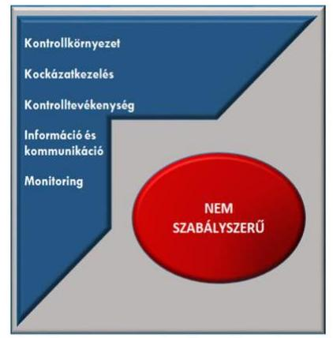

# Jelenetés 

## Önkormányzatok integritás és belső kontrollrendszere

Az önkormányzatok belső kontrollrendszere kialakításának és működtetésének ellenőrzése, Adósságrendezési eljárás ellenőrzése - Versend Község Önkormányzata
2019. 05. hó 29. nap

---

# AZ ELLENŐRZÉST FELÜGYELTE:

- VARGA EDIT felügyeleti vezető
- AZ ELLENŐRZÉST VEZETTE ÉS A VÉGREHAJTÁSÁÉRT FELELŐS:
  - BAJNAI ZSUZSANNA ellenőrzésvezető
  - A PROGRAM ÖSSZEÁLLÍTÁSÁÉRT FELELŐS:
    - TÓTPÁL SZABOLCS osztályvezető

**IKTATÓSZÁM:** EL-0351-013/2019.

**TÉMASZÁM:** 2444

**ELLENŐRZÉS-AZONOSÍTÓ SZÁM:** V078920

Jelentéseink az Országgyűlés számítógépes hálózatán és az Interneten a www.asz.hu címen is olvashatóak.

---

# TARTALOMJEGYZÉK 

■ ÖSSZEGZÉS ..... 5
■ AZ ELLENŐRZÉS CÉLJA ..... 6
■ AZ ELLENŐRZÉS TERÜLETE ..... 7
■ AZ ELLENŐRZÉS HÁTTERE, INDOKOLTSÁGA ..... 8
■ A JELENTÉS LÉNYEGES KÉRDÉSKÖREI ..... 9
■ AZ ELLENŐRZÉS HATÓKÖRE ÉS MÓDSZEREI ..... 10
■ MEGÁLLAPÍTÁSOK ..... 13
■ JAVASLATOK ..... 16
■ MELLÉKLETEK ..... 19
I. sz. melléklet: Értelmező szótár ..... 19
■ FÜGGELÉKEK ..... 21
I. sz. függelék a Jelentéshez ..... 21
II. sz. függelék: Észrevételek ..... 22
■ RÖVIDÍTÉSEK JEGYZÉKE ..... 23

---

.

---

# ÖSSZEGZÉS 

Versend Község Önkormányzata belső kontrollrendszerének kialakítása és működtetése, továbbá az adósságrendezési eljárás folyamata és végrehajtása nem volt szabályszerű, nem biztosította a közpénzfelhasználás szabályosságát és a nemzeti vagyonnal történő felelős gazdálkodást. Az integritás kontrollokat nem építették ki.

## Az ellenőrzés társadalmi indokoltsága

Az Állami Számvevőszék alapvető feladata a közpénzekkel, az állami és önkormányzati vagyonnal való gazdálkodás ellenőrzése. Az Alaptörvény szerint az önkormányzatok kötelezettsége a kiegyensúlyozott, átlátható és fenntartható költségvetési gazdálkodás elvének érvényesítése, a nemzeti vagyonnal való rendeltetésszerű és felelős módon való gazdálkodás biztosítása. Az Állami Számvevőszék stratégiájában megfogalmazott célkitűzése az integritás alapú, átlátható és elszámoltatható közpénzfelhasználás elősegítése. Ennek megvalósítása érdekében az Állami Számvevőszék prioritásként kezeli a közpénzzel gazdálkodó szervezetek esetében a belső kontrollrendszer működésének ellenőrzését.

Versend Község Önkormányzatát az Állami Számvevőszék korábban nem ellenőrizte, a pénzügyi helyzetével kapcsolatos kockázatokra tekintettel került ellenőrzésre kiválasztásra.

## Főbb megállapítások, következtetések

Versend Község Önkormányzata belső kontrollrendszerének kialakítása és működtetése nem volt szabályszerű. Nem alakítottak ki olyan kontrollkörnyezetet, amelyben egyértelműek a hatásköri és felelősségi viszonyok, mert a közös önkormányzati hivatal nem rendelkezett szervezeti és működési szabályzattal, nem voltak munkaköri leírások. Integrált kockázatkezelési rendszert a jegyző nem alakított ki. Nem mérte fel és állapította meg a tevékenységben rejlő és a szervezeti célokkal összefüggő kockázatokat, nem határozta meg az egyes kockázatokkal kapcsolatban szükséges intézkedéseket, valamint azok teljesítésének folyamatos nyomon követési módját. A gazdálkodási folyamatokhoz kapcsolódó kontrolltevékenységek működtetése nem volt szabályszerű, ezáltal nem volt garantált a közpénzfelhasználás szabályossága. Az információs és kommunikációs folyamatok kialakítása sem volt szabályszerű. A jegyző nem gondoskodott a tevékenységek, célok megvalósításának nyomon követését biztosító rendszer és a belső ellenőrzés kialakításáról. Versend Község Önkormányzata az integritás kontrollokat nem építette ki, a korrupciós kockázatokat nem kezelte.

A Babarci Közös Önkormányzati Hivatal Versendi Roma Nemzetiségi Önkormányzattal kapcsolatos gazdálkodási feladatellátása nem volt szabályszerű.

Versend Község Önkormányzata adósságrendezési eljárásának folyamata és végrehajtása nem volt szabályszerű.

---

# AZ ELLENŐRZÉS CÉLJA 

Az ellenőrzés célja annak megállapítása volt, hogy szabályszerűen történt-e a belső kontrollrendszer kialakítása és működtetése, az biztosította-e a közpénzfelhasználásának szabályosságát, a közpénzekkel és a nemzeti vagyonnal történő szabályszerű és felelős gazdálkodást, a beszámolási és adatszolgáltatási kötelezettségek szabályszerű teljesítését. Az ellenőrzés keretében értékelte az ÁSZ ${ }^{1}$ a korrupciós kockázatok kezelését szolgáló integritás kontrollok kiépítettségét és az integritás szemlélet érvényesülését.

Az ellenőrzés célja továbbá annak értékelése volt, hogy az adósságrendezési eljárás megindítása, lefolytatása szabályszerű volt-e, az önkormányzat gazdálkodása az adósságrendezési eljárás alatt megfelelt-e a jogszabályi előírásoknak, a lefolytatott eljárás elérte-e a törvényben kitűzött célokat.

---

# AZ ELLENŐRZÉS TERÜLETE 

## Versend Község Önkormányzata

Versend Baranya megyében található, állandó lakosainak száma 2016. január 1-jén 932 fő volt a Központi Statisztikai Hivatal Magyarország közigazgatási helynévkönyve adatai alapján.

Az Önkormányzat² öttagú képviselő-testületének ${ }^{3}$ munkáját kettő állandó bizottság segítette. A településen német, horvát és roma nemzetiségi önkormányzat működött.

Az Önkormányzat egy intézménnyel (óvoda) rendelkezett, a gazdálkodási feladatai ellátásáról 2013. február 28-ig a Hivatal${ }^{4}$, 2013. március 1-től a Közös Hivatal ${ }^{5}$ gondoskodott.

A Közös Hivatal önálló szervezeti egységekre nem tagolódott, gazdasági szervezete nem volt, 2016. év végén nyolc köztisztviselőt foglalkoztattak.

A polgármester ${ }^{6}$ a 2010. évi önkormányzati választások óta tölti be tisztségét, a jegyző személyében az ellenőrzött időszak alatt változás történt. A Hivatal jegyzője; ${ }^{7}$ 2013. február 28-ig töltötte be tisztségét, míg a Közös Hivatal jegyzője; ${ }^{8}$ 2013. március 1-től lépett hivatalba.

Az Önkormányzat a 2016. évi konszolidált éves költségvetési beszámoló szerint 240,1 millió Ft költségvetési bevételt ért el, valamint 217,5 millió Ft költségvetési kiadást teljesített, vagyonának értéke 2016. december 31-én 584,8 millió Ft volt.

Az Önkormányzat ellen 2011. augusztus 29-én adósságrendezési eljárás indult, amelynek befejezéséről szóló döntés 2014. augusztus 29-én lépett hatályba.

---

# AZ ELLENŐRZÉS HÁTTERE, INDOKOLTSÁGA 

A demokratikus társadalmakban alapvető igény, hogy a közpénzeket, a közvagyont használók tevékenységükről elszámoljanak, ahhoz egyértelmű és érvényesíthető felelősségi szabályok társuljanak. Ennek a jogos igénynek az érvényesítéséhez meg kell teremteni azokat a folyamatokat, rendszereket, amelyek nélkülözhetetlenek az elszámoltatáshoz. Az elszámoltatás eredményes működtetéséhez szükség van a megfelelő információs, kontroll-, értékelési és beszámolási rendszerek kialakítására. A belső kontrollok kiépítettsége hozzájárul az integritási szemlélet kialakításához és érvényesüléséhez. A belső kontrollrendszer kialakítása és működtetése nélkül nem valósítható meg a közpénzek, a közvagyon szabályos, gazdaságos, hatékony és eredményes felhasználása.

A belső kontrollrendszer azt a célt szolgálja, hogy az államháztartás szervei működésük és gazdálkodásuk során a tevékenységeket szabályszerűen, gazdaságosan, hatékonyan, eredményesen hajtsák végre, teljesítsék elszámolási kötelezettségeiket és megvédjék az erőforrásokat a veszteségektől, a károktól, a nem rendeltetésszerű használattól. A belső kontrollrendszer magában foglalja mindazon szabályokat, eljárásokat, gyakorlati módszereket és szervezeti struktúrákat, kockázatkezelési technikákat, kontrolltevékenységeket, amelyek segítséget nyújtanak a szervezetnek céljai eléréséhez.

A megfelelő belső kontrollrendszer jelentősen csökkenti a hibák és szabálytalanságok kockázatát. Az ÁSZ célja, hogy javuljon az ellenőrzött önkormányzatok belső kontrollrendszerének szabályozottsága, működésének megfelelősége, szabályszerűsége, hozzájárulva ezzel az egyensúlyi helyzet fenntarthatóságának biztosításához, biztosítva az önkormányzatnál a közpénzfelhasználás szabályosságát, a közpénzekkel és a nemzeti vagyonnal történő szabályszerű, gazdaságos, hatékony és eredményes gazdálkodást. Az ÁSZ ellenőrzés tapasztalatai nem csupán a közvetlenül ellenőrzött önkormányzatokat támogathatják.

Az ellenőrzés várható hasznosulása négy szinten valósul meg. A törvényalkotás számára összegzett tapasztalatok állnak rendelkezésre a belső kontrollrendszer önkormányzati területen való kialakításáról, működtetéséről és hatásairól. Az ellenőrzés az ellenőrzött számára visszajelzést ad a belső kontrollrendszer kialakításában és működésében lévő hiányosságokról, javaslataival hozzájárul azok kiküszöböléséhez. Az ellenőrzés megállapításait és javaslatait más szervezetek is hasznosíthatják a rendezett gazdálkodási keretek kialakításához, a ,,jó gyakorlat" elterjesztésével azok az önkormányzatok is átvehetik a pozitív példákat, ahol nem végez ellenőrzést az ÁSZ.

Az ÁSZ ellenőrzései jelzik a társadalom számára, hogy közpénz nem maradhat ellenőrizetlenül, tevékenysége hozzájárul az értékteremtő rend kialakításához és megőrzéséhez.

---

# A JELENTÉS LÉNYEGES KÉRDÉSKÖREI 

1. Az Önkormányzat belső kontrollrendszerének kialakítása és működtetése szabályszerű volt-e?
2. A nemzetiségi önkormányzat gazdálkodásával kapcsolatos feladatok ellátása szabályszerű volt-e?
3. Az adósságrendezési eljárás folyamata és végrehajtása szabályszerű volt-e?

---

# AZ ELLENŐRZÉS HATÓKÖRE ÉS MÓDSZEREI 

## Az ellenőrzés típusa

Megfelelőségi ellenőrzés.

## Az ellenőrzött időszak

Az adósságrendezési eljárás esetében a 2010. január 1. és 2017. június 30. közötti időszakon belül az adósságrendezést megelőző egy teljes év január 1-jétől az adósságrendezéssel érintett évek és az adósságrendezés lezárását követő beszámolóval lezárt egy teljes év december 31-éig tartó időszak volt (Versend Község Önkormányzata esetén 2011. augusztus 29. - 2014. augusztus 29.), a belső kontrollrendszer esetében a 2016. év volt.

## Az ellenőrzés tárgya

A helyi önkormányzatnak, mint éves költségvetési beszámoló készítésére kötelezett szervezetnek és a gazdálkodási feladatait ellátó közös önkormányzati hivatalának belső kontrollrendszere, valamint az integritás szemlélet érvényesülése.

Az ellenőrzés kiterjedt minden olyan körülményre és adatra, amely az ÁSZ jogszabályban meghatározott feladatainak teljesítéséhez, valamint a program végrehajtása folyamán felmerült újabb összefüggések feltárásához szükséges volt.

A Har. tv. ${ }^{9}$ által szabályozott adósságrendezési eljárás.

## Az ellenőrzött szervezet

Versend Község Önkormányzata és a gazdálkodási feladatait ellátó Babarci Közös Önkormányzati Hivatal

## Az ellenőrzés jogalapja

Az ÁSZ tv. ${ }^{10}$ 1. § (3) bekezdésében foglaltak alapján az ÁSZ általános hatáskörrel végzi a közpénzekkel, valamint az állami és önkormányzati vagyonnal való felelős gazdálkodás ellenőrzését. Az ÁSZ tv. 5. § (2) bekezdése alapján az államháztartás gazdálkodásának ellenőrzése keretében az ÁSZ ellenőrzi a helyi önkormányzatok gazdálkodását, valamint az ÁSZ tv. 5. § (6) bekezdése alapján ellenőrzése során értékeli az államháztartás számviteli rendjének betartását és a belső kontrollrendszer működését.

---

# Az ellenőrzés módszerei 

Az ÁSZ az ellenőrzést az ellenőrzési program szempontjai, az ellenőrzött időszakban hatályos jogszabályok, az ellenőrzés szakmai szabályai, az egyes ellenőrzési típusokhoz kapcsolódó ÁSZ módszertanok figyelembevételével végezte.

Az ellenőrzés ideje alatt az ÁSZ az Önkormányzattal a kapcsolattartást az ÁSZ SZMSZ ${ }^{11}$-ének vonatkozó előírásai alapján biztosította.

Az ellenőrzési kérdések megválaszolásához szükséges bizonyítékok megszerzése az Önkormányzat által rendelkezésre bocsátott dokumentumokra, adatokra alapozva megfigyelés, szemle (szemrevételezés), valamint elemző eljárás keretében történt.

Az ellenőrzési bizonyítékként felhasználható adatforrások közé tartoztak egyrészt az ellenőrzési program részletes szempontjainál felsorolt adatforrások, másrészt minden - az ellenőrzés folyamán feltárt, az ellenőrzés szempontjából információt tartalmazó - dokumentum.

Az Önkormányzat belső kontrollrendszere jogszabályi előírások szerinti kialakításának és működtetésének szabályszerűségét az erre irányuló ellenőrzési kérdésekre adott válaszok összesítése alapján, pillérenként (kontrollkörnyezet, kockázatkezelési rendszer, kontrolltevékenységek, információs és kommunikációs rendszer, monitoring rendszer) és összesítetten is értékelte az ÁSZ. Az önkormányzat belső kontrollrendszere egyes pilléreinek kialakítása és működtetése „szabályszerű", amennyiben az értékelt területen az elért igen válaszok százalékban kifejezett, egész számra kerekített aránya meghaladja a 85%-ot, „nem szabályszerű", ha nem haladja meg, akkor a minősítés „nem szabályszerű" lesz. Az önkormányzat belső kontrollrendszerének összesített értékelése megegyezik a pillérenként (kontrollterületenként) alkalmazott százalékos értékelésekkel. A kontrollrendszer egésze esetében a „szabályszerű" értékelésnek a százalékos értéken felül további feltétele, hogy egyik kontrollterület sem kaphat „nem szabályszerű" értékelést. Az összesített értékelés a százalékos értéktől függetlenül „nem szabályszerű", ha az ellenőrzött kontrollterületek közül több mint egynek „nem szabályszerű" az értékelése.

A kontrolltevékenységek gyakorlásának és működtetésének szabályszerűségét mintavételi eljárás alkalmazásával ellenőrizte az ÁSZ. A jelentéstervezetben a mintavételi eredmények alapján megfogalmazott megállapítások a lényeges sokaságra vonatkoznak, melyek összértéke eléri a teljes sokaság összértékének 50%-át.

A nemzetiségi önkormányzattal kapcsolatos gazdálkodási feladatok ellátását a legnagyobb költségvetési bevétellel rendelkező nemzetiségi önkormányzat esetében tekintette át az ÁSZ.

A közszféra integritás alapú kultúrájának kialakítása, megerősítése és működése szorosan összefügg a belső kontrollrendszer működésével, ezért az ellenőrzés kiterjedt annak értékelésére is, hogy a belső kontrollrendszer kialakítása és működtetése hogyan hatott az integritás szemlélet érvényesülésére.

Az adósságrendezési eljárás vonatkozásában amennyiben az önkormányzat működését és gazdálkodását alapvetően meghatározó dokumentum
 hiánya miatt, valamely lényeges kérdéskörre vonatkozóan az ÁSZ

---

megállapítást tett, további ellenőrzési tevékenységek az adott kérdéskörrel és az azzal szoros logikai kapcsolatban lévő kérdéskörökkel - ráépülő jelleggel - nem kerültek végrehajtásra.

---

# 1. Az Önkormányzat belső kontrollrendszerének kialakítása és működtetése szabályszerű volt-e? 

## Összegző megállapítás

1. ábra: A belső kontrollrendszer értékelése

Forrás: ÁSZ értékelés

## A belső kontrollrendszer kialakítása és működtetése nem volt szabályszerű.

A belső kontrollrendszer pillérenkénti és összesített értékelését az 1. ábra szemlélteti.

A KONTROLLKÖRNYEZET, a működés szervezeti kereteinek kialakítása nem volt szabályszerű. A jegyző nem állapította meg az Áht. ${ }^{12}$ 10. § (5) bekezdésében foglaltak ellenére a Közös Hivatal feladatai ellátásának részletes belső rendjét és módját szervezeti és működési szabályzatban. Az Önkormányzat a vagyonnal történő gazdálkodás szabályait nem alakította ki a Htv. ${ }^{13} 138 . \S$ (1) bekezdés j) pontjában előírtak ellenére.

A jegyző nem készített a Közös Hivatal működési folyamatairól ellenőrzési nyomvonalat a Bkr. 6. § (3) bekezdésében foglaltak ellenére.

A jegyző és a pénzügyi-számviteli területen dolgozó köztisztviselők a Kttv. ${ }^{14} 75 . \S$ (1) bekezdésének d) pontjában előírtak ellenére - figyelemmel a Kttv. 226. § (1) és a (2) bekezdés a-b) pontjaira - nem rendelkeztek a feladatokat és a munkakör betöltésével kapcsolatos követelményeket meghatározó munkaköri leírással.

A KOCKÁZATKEZELÉSI RENDSZER kialakítása és működtetése a Közös Hivatalnál nem volt szabályszerű, mert a jegyző:

- nem alakította ki és működtette 2016. szeptember 30-ig kockázatkezelési rendszert, 2016. október 1-jétől pedig integrált kockázatkezelési rendszert a Bkr. ${ }^{15} 3 . \S$ b) pontjában foglaltak ellenére;
- nem szabályozta 2016. szeptember 30-ig a szabálytalanságok kezelésének eljárásrendjét, 2016. október 1-jétől pedig a szervezeti integritást sértő események kezelésének eljárásrendjét, valamint az integrált kockázatkezelés eljárásrendjét a Bkr. 6.§ (4) bekezdésében előírtak ellenére.

A KONTROLLTEVÉKENYSÉGEK működtetése nem volt szabályszerű, mert a jegyző nem gondoskodott a Közös Hivatal tekintetében a kötelezettségvállalásra, pénzügyi ellenjegyzésre, teljesítés igazolására, érvényesítésre, utalványozásra jogosult személyek és aláírás-mintájuk naprakész nyilvántartásának vezetéséről az Ávr. ${ }^{16} 60 . \S$ (3) bekezdésében előírtak ellenére.

A jegyző az Áht. 6/C. § (1) bekezdés szerinti feladatkörében eljárva nem gondoskodott a gazdasági események folyamatát tükröző bizonylatok adatainak könyvviteli nyilvántartásokban való rögzítéséről a Számv. tv. ${ }^{17} 165 . \S$

---

(1) bekezdésében foglaltak ellenére, sem az Önkormányzat, sem a Közös Hivatal vonatkozásában.

# AZ INFORMÁCIÓS ÉS KOMMUNIKÁCIÓS RENDSZER kialakítása nem volt szabályszerű, mert a jegyző nem készítette el az Ltv. ${ }^{18}$ 9. § (4) bekezdésének előírása ellenére a Közös Hivatal iratkezelési szabályzatát. A polgármester nem készítette el az Info tv. ${ }^{19} 24$. § (3) bekezdésében foglaltak ellenére az Önkormányzat, a jegyző a Közös Hivatal adatvédelmi és adatbiztonsági szabályzatát. 

A MONITORING-RENDSZER keretében megvalósuló folyamatos és eseti nyomon követési rendszert a jegyző nem alakította ki 2016. szeptember 30. napjáig a Bkr. 10. §-ában foglaltak ellenére a Közös Hivatalnál. Továbbá nem gondoskodott az Áht. 70. § (1) bekezdésének előírása ellenére a belső ellenőrzés kialakításáról és működtetéséről sem az Önkormányzat, sem a Közös Hivatal esetében.

A belső kontrollrendszer minőségét a jegyző nem értékelte a Bkr. 11. § (1) bekezdése ellenére.

AZ INTEGRITÁS szemlélet nem érvényesült az Önkormányzatnál az előírt kontrollok és a kockázatkezelési rendszer kialakításának hiánya miatt.

## 2. A nemzetiségi önkormányzat gazdálkodásával kapcsolatos feladatok ellátása szabályszerű volt-e?

## Összegző megállapítás

A Nemzetiségi Önkormányzat gazdálkodásával kapcsolatos feladatok ellátása nem felelt meg a jogszabályi előírásoknak.

AZ EGYÜTTMŰKÖDÉSI MEGÁLLAPODÁSBAN ${ }^{20}$ nem rögzítették a Nek. tv. ${ }^{21} 80$. § (3) bekezdés b) pontja ellenére a Nemzetiségi Önkormányzat ${ }^{22}$ kötelezettségvállalásaival kapcsolatosan az Önkormányzatot terhelő teljesítésigazolási feladatokat.

A jegyző a Számv. tv. 161. § (1) és az Áhsz. ${ }^{23} 51$. § (2) bekezdéseiben foglalt előírások ellenére - figyelemmel az Áht. 6/C. § (2) bekezdés b) pontjára - nem készítette el a Nemzetiségi Önkormányzat számlarendjét.

## 3. Az adósságrendezési eljárás folyamata és végrehajtása szabályszerű volt-e?

## Összegző megállapítás

Az Önkormányzat adósságrendezési eljárásának folyamata és végrehajtása nem volt szabályszerű.

Az Önkormányzat adósságrendezési eljárásának folyamata és végrehajtása nem volt szabályszerű, mivel a jegyző:
— nem készítette el az Ámr. ${ }^{24} 20$. § (3) bekezdés a) pontjában, az Ávr. 13. § (2) bekezdés a) pontjában előírt, a gazdálkodással - így különösen a kötelezettségvállalás, ellenjegyzés, teljesítés igazolása, érvényesítés, utalványozás gyakorlásának módjával, eljárási és dokumentációs részletszabályaival, valamint az ezeket végző személyek kijelölésének rendjével-, az ellenőrzési, adatszolgáltatási és beszámolási feladatok teljesítésével kapcsolatos belső előírásokat, feltételeket tartalmazó belső szabályzatot 2010-2015. évek vonatkozásában;
nem készített a beszámoló elkészítését megelőzően a könyvviteli zárlat során főkönyvi kivonatot 2010-2013. évekre vonatkozóan a Számv. tv. 164. § (2) bekezdésében, az Áhsz. ${ }^{25}$ 50. § (1) bekezdésében, az Áhsz. 5. § (1) bekezdésében foglaltak ellenére;
nem gondoskodott a kötelezettségvállalásra, pénzügyi ellenjegyzésre, teljesítés igazolására, érvényesítésre, utalványozásra jogosult személyek és aláírás-mintájuk naprakész nyilvántartásának vezetéséről 2010-2015. évek vonatkozásában az Ámr. 80. § (3) bekezdésében és az Ávr. 60. § (3) bekezdésében előírtak ellenére.

---

# JAVASLATOK 

Az ÁSZ tv. 33. § (1) bekezdésében foglaltak értelmében az ellenőrzött szervezet vezetője köteles a jelentésben foglalt megállapításokhoz kapcsolódó intézkedési tervet összeállítani és azt a jelentés kézhezvételétől számított 30 napon belül az ÁSZ részére megküldeni. Amennyiben az ellenőrzött szervezet vezetője nem küldi meg határidőben az intézkedési tervet, vagy továbbra sem elfogadható intézkedési tervet küld, az Állami Számvevőszék elnöke az ÁSZ tv. 33. § (3) bekezdése a) és b) pontjaiban foglaltakat érvényesítheti.

## Babarci Közös Önkormányzati Hivatal jegyzőjének

1. Az Önkormányzat szabályszerű kontrollkörnyezetének kialakítása érdekében gondoskodjon:
a) a Közös Hivatal feladatai ellátásának részletes belső rendje és módja megállapításáról szervezeti és működési szabályzatban a jogszabályban előírtak szerint;
(1. sz. megállapítás 2. bekezdés 2. mondata alapján)
b) a pénzügyi-számviteli területen dolgozó köztisztviselők feladatainak és a munkakör betöltésével kapcsolatos követelményeknek a munkaköri leírásban való rögzítéséről a jogszabálynak megfelelően;
(1. sz. megállapítás 4. bekezdése alapján)
2. Az Önkormányzat szabályszerű kockázatkezelési rendszerének kialakítása és működtetése érdekében gondoskodjon:
a) az integrált kockázatkezelési rendszer kialakításáról és működtetéséről a jogszabályban foglaltak szerint;
(1. sz. megállapítás 5. bekezdés 1. francia bekezdés 2. tagmondata alapján)
b) a jogszabályi előírásnak megfelelően a szervezeti integritást sértő események kezelésének, valamint az integrált kockázatkezelés eljárásrendjének szabályozásáról.
(1. sz. megállapítás 5. bekezdés 2. francia bekezdés 2-3. tagmondatai alapján)
3. A kontrolltevékenységek szabályszerű működtetése érdekében intézkedjen a jogszabályi előírásoknak megfelelően:
a) az ellenőrzési nyomvonal elkészítéséről;
(1. sz. megállapítás 3. bekezdése alapján)

---

b) a kötelezettségvállalásra, pénzügyi ellenjegyzésre, teljesítés igazolására, érvényesítésre, utalványozásra jogosult személyekről és aláírás-mintájukról naprakész nyilvántartás vezetéséről;
(1. sz. megállapítás 6. bekezdése alapján)
c) a gazdasági események folyamatát tükröző bizonylatok adatainak a könyvviteli nyilvántartásokban való rögzítéséről.
(1. sz. megállapítás 7. bekezdése alapján)
4. Az információs és kommunikációs rendszer szabályszerű kialakítása és működtetése érdekében gondoskodjon:
a) a jogszabályi előírásnak megfelelően az iratkezelési szabályzat elkészítéséről;
(1. sz. megállapítás 8. bekezdés 1. mondata alapján)
b) a jogszabályban előírt adatvédelmi és adatbiztonsági szabályzat megalkotásáról a Közös Hivatal vonatkozásában.
(1. sz. megállapítás 8. bekezdés 2. mondata alapján)
5. A szabályszerű monitoring rendszer kialakítása és működtetése érdekében gondoskodjon a belső ellenőrzés kialakításáról és működtetéséről.
(1. sz. megállapítás 9. bekezdés 2. mondata alapján)
6. Gondoskodjon a belső kontrollrendszer minőségét jogszabályi előírásnak megfelelő értékeléséről.
(1. sz. megállapítás 10. bekezdése alapján)
7. A Roma Nemzetiségi Önkormányzat gazdálkodásával kapcsolatos feladatok szabályszerű ellátása érdekében gondoskodjon:
a) az Együttműködési megállapodásban, a Roma Nemzetiségi Önkormányzat kötelezettségvállalásaival kapcsolatosan az Önkormányzatot terhelő teljesítésigazolási feladatok rögzítéséről a jogszabályban előírtaknak megfelelően;
(2. sz. megállapítás 1. bekezdése alapján)
b) a Roma Nemzetiségi Önkormányzat számlarendjének elkészítéséről a jogszabályokban foglaltak szerint.
(2. sz. megállapítás 2. bekezdése alapján)

---

# Versend Község Önkormányzata polgármesterének 

1. A jogszabályi előírásoknak megfelelően gondoskodjon az önkormányzati vagyonnal történő gazdálkodás szabályainak Képviselő-testület elé történő terjesztéséről.
(1.sz. megállapítás 2. bekezdés 3. mondata alapján)
2. Gondoskodjon a jogszabályban előírt adatvédelmi és adatbiztonsági szabályzat megalkotásáról az Önkormányzat vonatkozásában.
(1. sz. megállapítás 8. bekezdés 2. mondata alapján)

---

# MELLÉKLETEK 

- I. SZ. MELLÉKLET: ÉRTELMEZŐ SZÓTÁR
belső ellenőrzés
belső kontrollrendszer
belső kontrollrendszer pillérei, kontrollterületei
helyi önkormányzat
független, tárgyilagos bizonyosságot adó és tanácsadó tevékenység, amelynek célja, hogy az ellenőrzött szervezet működését fejlessze és eredményességét növelje, az ellenőrzött szervezet céljai elérése érdekében rendszerszemléletű megközelítéssel és módszeresen értékeli, illetve fejleszti az ellenőrzött szervezet irányítási és belső kontrollrendszerének hatékonyságát (Forrás: Bkr. 2. § b) pontja)
a belső kontrollrendszer a kockázatok kezelése és tárgyilagos bizonyosság megszerzése érdekében kialakított folyamatrendszer, amely azt a célt szolgálja, hogy a működés és gazdálkodás során a tevékenységeket szabályszerűen, gazdaságosan, hatékonyan, eredményesen hajtsák végre, az elszámolási kötelezettségeket teljesítsék, megvédjék az erőforrásokat a veszteségektől, károktól és nem rendeltetésszerű használattól (Forrás: Áht. 69. § (1) bekezdése)
a kontrollkörnyezet, a (integrált) kockázatkezelési rendszer, a kontrolltevékenységek, az információs és kommunikációs rendszer, valamint a nyomon követési (monitoring) rendszer (Forrás: Bkr. 3. §-a)
A helyi önkormányzat jogi személy. Az önkormányzati feladatok ellátását a képviselő-testület és szervei biztosítják. A képviselő-testület szervei: a polgármester, a főpolgármester, a megyei közgyűlés elnöke, a képviselő-testület bizottságai, a részönkormányzat testülete, az önkormányzati hivatal, a megyei önkormányzati hivatal, a közös önkormányzati hivatal, a jegyző, továbbá a társulás. A képviselő-testület a feladatkörébe tartozó közszolgáltatások ellátására - jogszabályban meghatározottak szerint - költségvetési szervet, a polgári perrendtartásról szóló törvény szerinti gazdálkodó szervezetet (a továbbiakban: gazdálkodó szervezet), nonprofit szervezetet és egyéb szervezetet (a továbbiakban együtt: intézmény) alapíthat, továbbá szerződést köthet természetes és jogi személlyel vagy jogi személyiséggel nem rendelkező szervezettel. A helyi önkormányzat éves költségvetési beszámolója magában foglalja a helyi önkormányzat - nem költségvetési szerveihez tartozó - feladataihoz kapcsolódó bevételeket és kiadásokat. A helyi önkormányzat összevont (konszolidált) költségvetési beszámolóját a helyi önkormányzatra és költségvetési szerveire vonatkozóan külön-külön beérkezett éves költségvetési beszámolók alapján a Kincstár készíti el és küldi meg az önkormányzatnak. (Forrás: Mötv. 41. § (1), (2), (6) bekezdései; Áhsz. 2. § (1) bekezdése, 6. § (1) bekezdés a) és f) pontja, 30. §-a, 37. § (1) és (6) bekezdése)
a költségvetési szerv vezetője által kialakított és működtetett olyan rendszer, mely biztosítja, hogy a megfelelő információk a megfelelő időben eljutnak az illetékes szervezethez, szervezeti egységhez, illetve személyhez (Forrás: Bkr. 9. § (1) bekezdés)
olyan folyamatalapú kockázatkezelési rendszer, amely a szervezet minden tevékenységére kiterjed, egységes módszertan és eljárások alkalmazásával, a szervezet célkitűzéseinek és értékeinek figyelembevételével biztosítja a szervezet kockázatainak teljes körű azonosítását, azok meghatározott kritériumok szerinti értékelését, valamint a kockázatok kezelésére vonatkozó intézkedési terv elkészítését és az abban foglaltak nyomon követését (Forrás: Bkr. 2. § m) pontja 2016. október 1-jétől)

---

integritás
kockázatkezelési rendszer
kontrollkörnyezet
kontrolltevékenységek
költségvetési szerv vezetője (Bkr. alkalmazásában)
közös önkormányzati hivatal
monitoring rendszer
vagyongazdálkodás
az integritás elvek, értékek, cselekvések, módszerek, intézkedések konzisztenciáját jelenti: olyan magatartásmódot, amely meghatározott értékeknek felel
 meg. Az integritás a közszféra esetében a társadalom által elvárt nyilvánossági, átláthatósági, illetve jogi/etikai normáknak történő megfelelést jelenti
(Forrás: a http://integritas.asz.hu honlapon közzétett „A 2012. évi integritás felmérés eredményeinek összefoglalója" című dokumentum 3. oldal 1. bekezdése)
olyan irányítási eszközök és módszerek összessége, melynek elemei a szervezeti célok elérését veszélyeztető tényezők (kockázatok) azonosítása, elemzése, csoportosítása, nyomon követése, valamint szükség esetén a kockázati kitettség mérséklése (Forrás: Bkr. 2. § m) pontja 2016. szeptember 30-ig)
a költségvetési szerv vezetője által kialakított olyan elvek, eljárások, belső szabályzatok összessége, amelyben világos a szervezeti struktúra, egyértelműek a felelősségi, hatásköri viszonyok és feladatok, meghatározottak az etikai elvárások a szervezet minden szintjén, átlátható a humánerőforrás-kezelés (Forrás: Bkr. 6. § (1) bekezdés)
a költségvetési szerv vezetője által a szervezeten belül kialakított (kontroll) tevékenységek, melyek biztosítják a kockázatok kezelését, hozzájárulnak a szervezet céljainak eléréséhez (Forrás: Bkr. 8. § (1) bekezdés)
helyi önkormányzat esetén a jegyző, főjegyző, társulás esetén a társulási megállapodásban meghatározott önkormányzat jegyzője (Forrás: Bkr. 2. § n) pont nb) alpont)
települési képviselő-testület más települési képviselő-testülettel társult képviselő-testületet alakíthat, amely esetén a képviselő-testületek részben vagy egészben egyesítik a költségvetésüket, közös önkormányzati hivatalt tartanak fenn, és intézményeiket közösen működtetik. (Forrás: Mötv. 56. § (1)-(2) bekezdései)
nyomon követési rendszer (monitoring) a szervezet tevékenységének, a célok megvalósításának nyomon követését biztosító rendszer, mely az operatív tevékenységek keretében megvalósuló folyamatos és eseti nyomon követésből, valamint az operatív tevékenységektől függetlenül működő belső ellenőrzésből áll (Forrás: Bkr. 10. §-a)
a nemzeti vagyongazdálkodás feladata a nemzeti vagyon rendeltetésének megfelelő, az állam, az önkormányzat mindenkori teherbíró képességéhez igazodó, elsődlegesen a közfeladatok ellátásához és a mindenkori társadalmi szükségletek kielégítéséhez szükséges, egységes elveken alapuló, átlátható, hatékony és költségtakarékos működtetése, értékének megőrzése, állagának védelme, értéknövelő használata, hasznosítása, gyarapítása, továbbá az állam vagy a helyi önkormányzat feladatának ellátása szempontjából feleslegessé váló vagyontárgyak elidegenítése (Nvtv. 7. § (2) bekezdése)

---

# FÜGGELÉKEK 

- I. SZ. FÜGGELÉK A JELENTÉSHEZ

Az Állami Számvevőszék az ellenőrzések során feltárt tényekhez kapcsolódó további körülmények tisztázására eszközrendszerrel nem rendelkezik. Amennyiben az ellenőrzésen túlmutatóan indokoltnak látszik az ellenőrzés során feltárt körülmények további vizsgálata, az Állami Számvevőszék törvényi felhatalmazás alapján az ellenőrzés által feltárt körülményeket továbbítja a hatáskörrel rendelkező szervnek a szükséges intézkedések megtétele, eljárások lefolytatása érdekében.
I.

Az ellenőrzés feltárta, hogy a Babarci Közös Önkormányzati Hivatal (továbbiakban: Közös Hivatal) jegyzője nem állapította meg az Áht. 10. § (5) bekezdésében foglaltak ellenére a Közös Hivatal feladatai ellátásának részletes belső rendjét és módját szervezeti és működési szabályzatban.
Az eset konkrét körülményeinek felderítésére az illetékes kormányhivatal rendelkezik hatáskörrel.
II.

1. Az ellenőrzés feltárta, hogy a jegyző nem gondoskodott a Közös Hivatal tekintetében a kötelezettségvállalásra, pénzügyi ellenjegyzésre, teljesítés igazolására, érvényesítésre, utalványozásra jogosult személyek és aláírás-mintájuk naprakész nyilvántartásának vezetéséről az Ávr. 60. § (3) bekezdésében előírtak ellenére a 2010-2016. közötti időszakban.
2. További körülményként tárta fel az Állami Számvevőszék, hogy a 2016. évben a jegyző az Áht. 6/C. § (1) bekezdés szerinti feladatkörében eljárva nem gondoskodott a gazdasági események folyamatát tükröző bizonylatok adatainak könyvviteli nyilvántartásokban való rögzítéséről a Számv. tv. 165. § (1) bekezdésében foglaltak ellenére, sem Versend Község Önkormányzata, sem a Közös Hivatal vonatkozásában.
A gazdálkodási jogkörök gyakorlására jogosultakról és aláírásmintájukról vezetett naprakész nyilvántartás hiánya, továbbá a gazdasági eseményekről kiállított bizonylatok adatainak könyvviteli nyilvántartásokban való rögzítésének elmaradása miatt felvetődik, hogy a szabálytalan kifizetések az ellenőrzött szervezeteknél vagyoni hátrányt okoztak.
Az eset konkrét körülményeinek felderítésére az ügyészség rendelkezik hatáskörrel.

---

A jelentéstervezetet a Számvevőszék 15 napos észrevételezésre megküldte az ellenőrzött szervezetek vezetőinek az ÁSZ tv. 29. § (1) bekezdése előírása szerint.

Az ÁSZ a jelentéstervezetet észrevételezésre megküldte Versend Község Önkormányzata polgármestere, valamint a Babarci Közös Önkormányzati Hivatal vezetője részére.
Versend Község Önkormányzata polgármestere, valamint a Babarci Közös Önkormányzati Hivatal vezetője az ÁSZ tv. 29. § (2) bekezdésében foglalt észrevételezési jogával nem élt, a jelentéstervezet megállapításaira a törvényes határidőn belül észrevételt nem tett. A Babarci Közös Önkormányzati Hivatal vezetője írásban jelezte, hogy a jelentéstervezet megállapításaival egyetért.

[^0]
[^0]:    * 29. § (1) Az Állami Számvevőszék az ellenőrzési megállapításait megküldi az ellenőrzött szervezet vezetőjének vagy az általa megbízott személynek, és annak, akinek személyes felelősségét állapította meg.
    (2) Az ellenőrzött szervezet vezetője és a felelősként megjelölt személy az ellenőrzés megállapításaira tizenöt napon belül írásban észrevételt tehet.
    (3) Az Állami Számvevőszék az észrevételre a beérkezésétől számított harminc napon belül írásban válaszol. A figyelembe nem vett észrevételeket köteles a jelentésben feltüntetni, és megindokolni, hogy azokat miért nem fogadta el.

---

# RÖVIDÍTÉSEK JEGYZÉKE 

${ }^{1}$ ÁSZ
${ }^{2}$ Önkormányzat
${ }^{3}$ képviselő-testület
${ }^{4}$ Hivatal
${ }^{5}$ Közös Hivatal
${ }^{6}$ polgármester
${ }^{7}$ jegyző ${ }_{1}$
${ }^{8}$ jegyző ${ }_{2}$
${ }^{9}$ Har. tv.
${ }^{10}$ ÁSZ tv.
${ }^{11}$ ÁSZ SZMSZ
${ }^{12}$ Áht.
${ }^{13} \mathrm{Htv}$.
${ }^{14} \mathrm{Kttv}$.
${ }^{15} \mathrm{Bkr}$.
${ }^{16}$ Ávr.
${ }^{17}$ Számv.tv.
${ }^{18} \mathrm{Ltv}$.
${ }^{19}$ Infotv.
${ }^{20}$ Együttműködési megállapodás
${ }^{21}$ Nek. tv.
${ }^{22}$ Nemzetiségi Önkormányzat
${ }^{23}$ Áhsz. 2
${ }^{24}$ Ámr.
${ }^{25}$ Áhsz. 1

Állami Számvevőszék
Versend Község Önkormányzata
Versend Község Önkormányzatának képviselő-testülete
Versend Község Polgármesteri Hivatala
Babarci Közös Önkormányzati Hivatal
Versend Község Önkormányzata polgármestere
Versend Község Polgármesteri Hivatalának jegyzője
Babarci Közös Önkormányzati Hivatal jegyzője
1996. évi XXV. törvény a helyi önkormányzatok adósságrendezési eljárásáról (hatályos 1996. június 11-től)
2011. évi LXV. törvény az Állami Számvevőszékről (hatályos: 2011. július 1-jétől)

Az Állami Számvevőszék elnökének 4/2017. (XII.29.) ÁSZ utasítása az Állami Számvevőszék Szervezeti és Működési Szabályzatáról (hatályos 2018. január 1-jétől)
2011. évi CXCV. törvény az államháztartásról (hatályos 2012. január 1-jétől)
1991. évi XX. törvény a helyi önkormányzatok és szerveik, a köztársasági megbízottak, valamint egyes centrális alárendeltségű szervek feladat- és hatásköreiről (hatályos 1991. július 23-tól)
2011. évi CXCIX. törvény a közszolgálati tisztviselőkről (hatályos 2012. március 1-jétől)
370/2011. (XII. 31.) Korm. rendelet a költségvetési szervek belső kontrollrendszeréről és belső ellenőrzéséről (hatályos 2012. január 1-jétől)
368/2011. (XII. 31.) Kormányrendelet az államháztartásról szóló törvény végrehajtásáról (hatályos 2012. január 1-jétől)
2000. évi C törvény a számvitelről (hatályos 2001. január 1-től)
1995. évi LXVI. törvény a köziratokról, a közlevéltárakról és a magánlevéltári anyag védelméről (hatályos 1996. január 1-től)
2011. évi CXII. törvény az az információs önrendelkezési jogról és az információszabadságról (hatályos 2011. július 27-től)
Együttműködési megállapodás Versend Község Önkormányzata és a Versendi Roma Önkormányzat között (hatályos 2015. december 30-tól)
2011. évi CLXXIX. törvény a nemzetiségek jogairól (hatályos 2011. december 20-tól)
Versendi Roma Nemzetiségi Önkormányzat
4/2013. (I.11.) Korm. rendelet az államháztartás számviteléről (hatályos 2014. január 1-től)
292/2009. (XII. 19.) Korm. rendelet az államháztartás működési rendjéről
249/2000. (XII. 24.) Korm. rendelet az államháztartás szervezetei beszámolási és könyvvezetési kötelezettségének sajátosságairól (hatálytalan 2014. január 1-jétől)

---

# ÁLLAMI SZÁMVEVŐSZÉK 

1052 Budapest, Apáczai Csere János utca 10.
Levélcím: 1364 Budapest 4. Pf. 54
Telefon: +36 14849100 Telefax: +36 14849200
www.asz.hu
