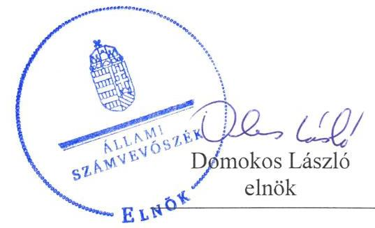
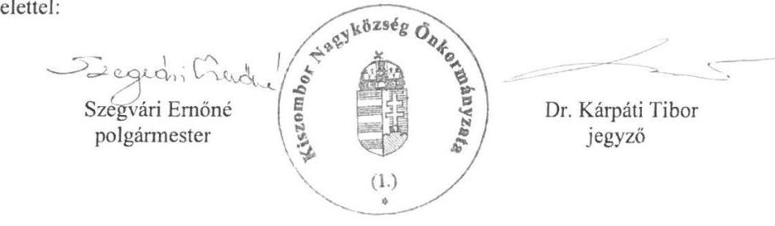
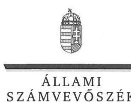
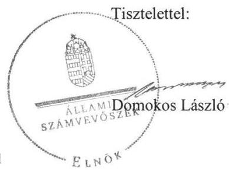
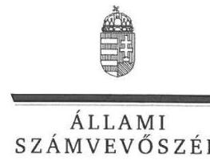
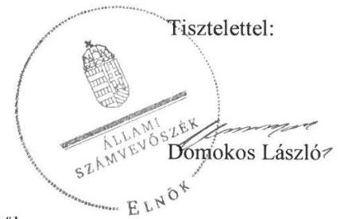

ÁLLAMI
SZÁMVEVŐSZÉK

# Jelentés 

## Önkormányzatok ellenőrzése

Integritás- és belső kontrollrendszer, Befektetési tevékenységek ellenőrzése

- Kiszombor Nagyközség

Önkormányzata
2019.

---

# Jelen 

## Jelentés

## Önkormányzatok ellenőrzése

Integritás- és belső kontrollrendszer, Befektetési tevékenységek ellenőrzése - Kiszombor Nagyközség Önkormányzata
2019. 05. hó 29. nap

---

# AZ ELLENŐRZÉST FELÜGYELTE: 

DR. NAGY IMRE felügyeleti vezető

## AZ ELLENŐRZÉST VEZETTE ÉS A VÉGREHAJTÁSÁÉRT FELELŐS:

KISTÓTH KRISZTINA ellenőrzésvezető

## A PROGRAM ÖSSZEÁLLÍTÁSÁÉRT FELELŐS:

TÓTPÁL SZABOLCS osztályvezető

IKTATÓSZÁM: EL-1566-001/2019

TÉMASZÁM: 2485

## ELLENŐRZÉS-AZONOSÍTÓ SZÁM: V082910

Jelentéseink az Országgyúlés számítógépes hálózatán és az Interneten a www.asz.hu címen is olvashatóak.

---

# TARTALOMJEGYZÉK 

■ ÖSSZEGZÉS ..... 5
■ AZ ELLENŐRZÉS CÉLJA ..... 6
■ AZ ELLENŐRZÉS TERÜLETE ..... 7
■ AZ ELLENŐRZÉS HÁTTERE, INDOKOLTSÁGA ..... 8
■ A JELENTÉS LÉNYEGES KÉRDÉSKÖREI ..... 9
■ AZ ELLENŐRZÉS HATÓKÖRE ÉS MÓDSZEREI ..... 10
■ MEGÁLLAPÍTÁSOK ..... 13
■ JAVASLATOK ..... 17
■ MELLÉKLETEK ..... 19
I. sz. melléklet: Értelmező szótár ..... 19
■ FÜGGELÉKEK ..... 21
I. sz. függelék a Jelentéshez ..... 21
II. sz. függelék: Észrevételek ..... 22
■ RÖVIDÍTÉSEK JEGYZÉKE ..... 39

---

.

---

# ÖSSZEGZÉS 

Kiszombor Nagyközség Önkormányzata belső kontrollrendszere nem biztosította a közpénzekkel történő elszámoltatható, átlátható és szabályszerű gazdálkodást és a befektetési tevékenység szabályszerű végzését. Az integritás kontrollrendszer kialakítása és működtetése nem volt megfelelő, nem biztosította a korrupciós kockázatokkal szembeni védelmet. A befektetett vagyonáról az Önkormányzat beszámolója nem nyújtott megbízható és valós képet.

## Az ellenőrzés társadalmi indokoltsága

Az ÁSZ az ÁSZ törvényben kapott felhatalmazással élve ellenőrzi az önkormányzatok gazdálkodását, működését, hogy az ellenőrzések megállapításaival támogassa az ellenőrzött önkormányzatok szabályszerű gazdálkodását, javaslataival elősegítse az Alaptörvényben megfogalmazott alapvetések érvényesülését a mindennapi életben az önkormányzatok szintjén. Az önkormányzati rendszerben zajló folyamatok holisztikus elemzései, a kockázatok folyamatos figyelemmel kísérésének módszerével, az így kiválasztott önkormányzatok célzott, hatékony ellenőrzéseivel az ÁSZ betölti a legfőbb gazdasági ellenőrző szerv küldetését. Az egyes ellenőrzések megállapításaival és egy időszak ellenőrzési eredményeinek elemzésével az ÁSZ ráirányíthatja a jogalkotók figyelmét az önkormányzati alrendszerben esetlegesen felmerülő pénzügyi, szabályozási feszültségekre. Az elvégzett nagyszámú ellenőrzés során az ÁSZ „jó gyakorlatokat" is azonosíthat, melyeket tanácsadó funkciója keretében szélesebb körben is megismertethet az érintettekkel, ezáltal is hozzájárulva az önkormányzati alrendszer szabályozott, átlátható, kiegyensúlyozott és fenntartható működéséhez.

## Főbb megállapítások, következtetések, javaslatok

Kiszombor Nagyközség Önkormányzatánál a belső kontrollrendszer nem szabályszerű működtetése következtében a közpénzekkel való felelős, rendeltetésszerű gazdálkodás nem volt biztosított.
2017. évben az Önkormányzat a jogszabályi előírások szerint kialakította működésének szervezeti kereteit, az Önkormányzatnál a gazdálkodási jogköröket szabályszerűen gyakorolták. Ugyanakkor a jegyző az ellenőrzött időszakban nem működtette az integrált kockázatkezelési rendszert, nem gondoskodott a beszámolási rendszer keretében a beszámolási szintek, határidők, módok meghatározásáról és az operatív tevékenységek keretében megvalósuló folyamatos és eseti nyomon követés működtetéséről. A jegyző a feladatok, folyamatok, tevékenységek méréséhez teljesítmény indikátorokat nem határozott meg, a teljesítménymérés lehetőségét nem biztosította.

Az Önkormányzat integritás elvű működését támogatta a jogszabályok által kötelezően előírt kontrollok kiépítettsége, azonban a kockázat elemzést és a nem kötelezően előírt integritást segítő kontroll elemeket nem működtették.

Az Önkormányzatnál a kontrollrendszer 2013-2017. években nem biztosította a befektetési tevékenység szabályszerű végzését. A kontrollkörnyezet 2013-ban nem volt szabályszerű, az Önkormányzat nem rendelkezett számviteli politikával és pénzkezelési szabályzattal. 2014-2017. években az Önkormányzat kialakította a szabályszerű működés feltételeit. A kontrollrendszer keretében azonban a jegyző nem működtetett az egyes befektetésekkel kapcsolatos információk esetében szervezeten belüli információáramlást és nem határozta meg a befektetési tevékenységben rejlő kockázatokat.

Az egyes befektetések részletező nyilvántartásának nem a jogszabályi előírások szerinti vezetése, valamint a leltári alátámasztottság hiányában az Önkormányzat beszámolója a vagyonáról nem nyújtott megbízható és valós összképet.

Az Állami Számvevőszék a jelentésben foglalt megállapítások alapján a Kiszombori Polgármesteri Hivatal jegyzőjének 10 javaslatot fogalmazott meg.

---

# AZ ELLENŐRZÉS CÉLJA 

Az ellenőrzés célja annak megállapítása volt, hogy az önkormányzat belső kontrollrendszere biztosította-e a közpénzekkel és a nemzeti vagyonnal történő elszámoltatható, átlátható, szabályszerű, gazdaságos, hatékony és eredményes gazdálkodás feltételeit. Az ellenőrzés keretében értékeljük továbbá, hogy az önkormányzatnál kiépítették és erősítették-e a korrupciós kockázatok kezelését szolgáló integritás kontrollokat és azt, hogy megteremtették-e a teljesítményellenőrzés feltételeit.

Az ellenőrzés további célja annak értékelése, hogy a jogszabályi előírásoknak megfelelően alakították-e ki a belső
kontrollrendszert, a kontrollkörnyezet biztosította-e a befektetési tevékenységek szabályszerű végzését. Értékeljük, hogy az egyes befektetési tevékenységekkel kapcsolatos döntéshozatal és a döntések végrehajtása, valamint az egyes befektetések számviteli elszámolása, nyilvántartása szabályszerű volt-e, és a belső és külső ellenőrzések támogatták-e az egyes befektetési tevékenységek szabályszerű végzését.

---

# AZ ELLENŐRZÉS TERÜLETE 

## Kiszombor Nagyközség Önkormányzata

Kiszombor Nagyközség a Dél-Alföldi régióban, Csongrád megyében, a Makói járásban helyezkedik el, állandó lakosainak száma a Központi Statisztikai Hivatal Magyarország közigazgatási helynévkönyve alapján 2017. január 1-jén 3722 fő volt. Az Önkormányzat ${ }^{1}$ hét tagból álló Képviselő-testülete ${ }^{2}$ három állandó bizottság támogatásával látta el feladatát. A település polgármestere ${ }^{3}$ 2002. október 20- óta tölti be tisztségét. A jegyző ${ }^{4}$ 2007. június 1-jétől került kinevezésre.

A Polgármesteri Hivatal ${ }^{5}$ gazdasági szervezettel nem rendelkezett. A településen roma nemzetiségi önkormányzat működött.

Az Önkormányzat irányítása alá kettő intézmény tartozott és 2017. év végén három gazdasági társaságban rendelkezett részesedéssel, a társaságok közfeladatok láttak el (vízi közmű-szolgáltatás, településfejlesztés, környezet-egészségügy, település tisztaság, hulladékgazdálkodás). Az Önkormányzat 2017. december 31-én nem rendelkezett forint és deviza lekötött betéttel, a kötelező feladat ellátását nem szolgáló ingatlannal, továbbá kulturális javakkal és egyéb értéktárgyakkal.

---

# AZ ELLENŐRZÉS HÁTTERE, INDOKOLTSÁGA 

A belső kontrollrendszer kialakítása és működtetése nélkül nem valósítható meg a közpénzek, a közvagyon átlátható, szabályos, gazdaságos, hatékony és eredményes felhasználása. A belső kontrollrendszer azt a célt szolgálja, hogy a költségvetési szervek működésük és gazdálkodásuk során a tevékenységeket szabályszerűen hajtsák végre, teljesítsék elszámolási kötelezettségeiket és megvédjék az erőforrásokat a veszteségektől, a károktól és a nem rendeltetésszerű használattól. A belső kontrollrendszer magában foglalja mindazon elveket, eljárásokat és belső szabályzatokat, melyek biztosítják, hogy a költségvetési szerv valamennyi tevékenysége és célja összhangban legyen a szabályszerűséggel, szabályozottsággal, valamint a gazdaságosság, hatékonyság és eredményesség követelményeivel, az eszközökkel és forrásokkal való gazdálkodásban ne kerüljön sor pazarlásra, visszaélésre, rendeltetésellenes felhasználásra. Megfelelő, pontos és naprakész információk álljanak rendelkezésre a költségvetési szerv működésével kapcsolatosan, és a belső kontrollrendszer harmonizációjára, összehangolására vonatkozó jogszabályok végrehajtásra kerüljenek. Az integritás kontrollok kiépítése, erősítése a szervezet korrupciós kockázatainak kezelését szolgálja. A teljesítménykövetelmények meghatározása és működtetése megalapozhatja az önkormányzatoknál a teljesítményellenőrzés lefolytatását.

Az önkormányzati vagyongazdálkodás keretében az önkormányzatok átmenetileg szabad pénzeszközeinek befektetését jogszabály nem tiltja, a befektetések jellege nem korlátozott, a pénzpiaci szolgáltatók közül az önkormányzatok a kínált szolgáltatás és annak költségei alapján, szabadon választhatnak, azonban a veszteséges gazdálkodás kockázatai és következményei az önkormányzatokat terhelik. A szabad pénzeszközök felhasználása során kiemelten fontos a felelős gazdálkodás érvényesülése, amely összhangban kell, hogy legyen, az önkormányzati gazdálkodás alapelveivel.

Az ellenőrzéssel feltárásra kerülhetnek azok a kockázatok, amelyek az önkormányzatok gazdálkodásával, ezen belül befektetési tevékenységeivel, kontrollkörnyezetével kapcsolatosak és a befektetési tevékenységek szabályszerű végrehajtását befolyásolják. Az ellenőrzéssel az önkormányzatok befektetési/vagyongazdálkodási döntései értékelhetővé válnak, és megalapozott megállapítás tehető arra vonatkozóan, hogy milyen hatást gyakoroltak az önkormányzat vagyonára a képviselő-testület döntései.

---

# A JELENTÉS LÉNYEGES KÉRDÉSKÖREI 

1. Az önkormányzat belső kontrollrendszerének működtetése szabályszerűen történt-e 2017. évben, kiépítették-e az integritás kontrollrendszerét?
2. A befektetési tevékenységek szabályszerű végzését a kiépített kontrollrendszer biztosította-e a 2013-2017. években?
3. Az önkormányzat egyes befektetéseivel kapcsolatos döntéshozatala és a döntések végrehajtása szabályszerű volt-e?
4. Az egyes befektetések számviteli elszámolása, nyilvántartása szabályszerű volt-e?

---

# AZ ELLENŐRZÉS HATÓKÖRE ÉS MÓDSZEREI 

## Az ellenőrzés típusa

Megfelelőségi ellenőrzés.

## Az ellenőrzött időszak

Az integritás és belső kontrollrendszer ellenőrzött időszaka 2017. év, illetve a 2018. május 31-éig tartó időszak.

Az egyes befektetési tevékenységek ellenőrzése tekintetében az ellenőrzött időszak 2013. január 1. - 2017. december 31. közötti időszak, továbbá a 2013. január 1. előtti időszak is, amennyiben a 2017. december 31-én meglévő befektetésekkel kapcsolatos döntéshozatalra a 2013. január 1. előtti időszakban került sor.

## Az ellenőrzés tárgya

Az önkormányzat és a gazdálkodási feladatokat ellátó hivatala belső kontrollrendszerének kialakítása és működtetése, valamint az integritás kontrollok kiépítettsége, a teljesítményellenőrzés feltételei.

Az egyes befektetési tevékenységek ellenőrzésének tárgya az önkormányzat 2017. december 31-én meglévő, a Számv. tv6. 3. § (6) bekezdés 2. és 3. pontja szerint az értékpapírokban megtestesülő befektetései, lekötött betétei. Továbbá a 2017. december 31-én meglévő, az önkormányzat szabad pénzeszközei terhére, adásvételi szerződés keretében megszerzett, a kötelező feladatok ellátását nem szolgáló, az önkormányzat üzleti vagyonába tartozó, az ellenőrzött időszakban (2013-2017.) megszerzett ingatlanok; az üzleti vagyon körébe tartozó, befektetési céllal megszerzett, de még használatba nem vett ingatlan beruházások, továbbá az - időkorlátozás nélkül megszerzett - kulturális javak (műtárgyak, műalkotások, stb.), illetve egyéb értéktárgyak (pl. ékszerek, befektetési nemesfém).

## Az ellenőrzött szervezet

Kiszombor Nagyközség Önkormányzata

## Az ellenőrzés jogalapja

Az ellenőrzés jogszabályi alapját az ÁSZ tv. 1. § (3) bekezdés, 5. § (2) és (6) bekezdései, valamint az Áht. 61. § (2) bekezdésének előírásai képezik.

---

# Az ellenőrzés módszerei 

Az ellenőrzést az ellenőrzési program szempontjai, az ellenőrzött időszakban hatályos jogszabályok, az ellenőrzés szakmai szabályai, az egyes ellenőrzési típusokhoz kapcsolódó ÁSZ módszertanok figyelembe vételével végeztük. A gazdálkodás hibáinak kijavítására, a közpénzekkel való felelős gazdálkodás elősegítésére irányuló javaslatok kidolgozásakor a hatályos jogszabályok voltak az irányadóak.

Az ellenőrzés ideje alatt az ellenőrzött szervezettel történő kapcsolattartást az ÁSZ SZMSZ-ének vonatkozó előírásai alapján biztosítottuk.

Az ellenőrzési kérdések megválaszolásához szükséges bizonyítékok megszerzése az ellenőrzött által rendelkezésre bocsátott dokumentumokra, adatokra alapozva megfigyelés, szemle (szemrevételezés), valamint elemző eljárás keretében történt.

Az ellenőrzési bizonyítékként felhasználható adatforrások közé tartoztak egyrészt az ellenőrzési program részletes szempontjainál felsorolt adatforrások, másrészt minden - az ellenőrzés folyamán feltárt, az ellenőrzés szempontjából releváns információt tartalmazó - dokumentum.

Az ellenőrzés lefolytatásához az ellenőrzött szervezet az ÁSZ által kért dokumentumok elektronikus megküldésével szolgáltatott adatokat. A rendelkezésre bocsátott adatok, információk kontrollja az ellenőrzés keretében történt.

Az önkormányzat belső kontrollrendszere egyes pilléreinek kialakítására és működtetésére vonatkozó értékelés:
$\longrightarrow$ „szabályszerű", amennyiben az értékelt területen az elért „igen" válaszok százalékban kifejezett, egész számra kerekített aránya legalább $85 \%$,
$\longrightarrow$ „nem szabályszerű", ha nem éri el a 85\%-ot,
Az önkormányzat belső kontrollrendszerének összesített értékelése az egyes részterületek esetében kapott megfelelőségi arányok számtani átlaga alapján történt és megegyezett a pillérenként (kontrollterületenként) alkalmazott százalékos értékelésekkel, a következő eltérésekkel: a kontrollrendszer egésze esetében a „szabályszerű" értékelésnek a százalékos értéken felül további feltétele volt, hogy egyik kontrollterület sem kaphat „nem szabályszerű" értékelést.

A 2017. évi kiadások teljesítéséhez kapcsolódó pénzgazdálkodási belső kontrollok működésének szabályszerűsége esetében az ellenőrzés azokra a legnagyobb értékű tételekre - a lényeges sokaságra - terjedt ki, melyek összértéke eléri a teljes sokaság összértékének 50\%-át. A 2017. évi kiadások esetében a lényeges sokaságot tételesen ellenőriztük.

Az önkormányzatok befektetési tevékenységét a szerződéskötés (és a kapcsolódó döntés-előkészítés, döntéshozatal) kivételével a 2013. január 1.
 és 2017. december 31. közötti időszak vonatkozásában értékeltük. A szerződéskötést az önkormányzat 2017. december 31-én meglévő értékpapírjai és egyéb befektetései vonatkozásában kellett értékelni a befektetési döntés előkészítése és a döntéshozatala tekintetében, abban az esetben is, ha az 2013. január 1. előtt történt. Amennyiben a szerződéskötés,

---

illetve a döntések előkészítése a 2013. évet megelőzően történt, akkor értelemszerűen a mindenkor hatályos jogszabályok előírásai alapján kellett az értékelést elvégezni.

---

# 1. Az önkormányzat belső kontrollrendszerének működtetése szabályszerűen történt-e 2017. évben, kiépítették-e az integritás kontrollrendszerét? 

Összegző megállapítás

### 1.1. számú megállapítás

Az Önkormányzat a belső kontrollrendszert nem szabályszerűen működtette 2017. évben, az integritás területén a kötelezően előírt kontrollokat kiépítette, a kockázatkezelést és a nem kötelezően előírt kontroll elemeket nem működtette.

Az Önkormányzat szabályszerű kontrollkörnyezetben működött.
Az Önkormányzat rendelkezett a Képviselő-testület által elfogadott Önkormányzati SZMSZ ${ }_{2}{ }^{8}$-szel valamint a 2014-2019. évekre szóló Gazdasági programmal ${ }^{9}$. A Képviselő-testület a Vagyongazdálkodási rendeletben ${ }^{10}$ elfogadta a helyi önkormányzati vagyonnal történő gazdálkodás szabályait.

A Polgármesteri hivatal rendelkezett alapító okirattal, és Hivatali SZMSZ ${ }_{1}{ }^{11}$-szel. Az ellenőrzési nyomvonal ${ }_{2}{ }^{12}$ kialakításra került.

A kötelezettségvállalás és teljesítésigazolás eljárási és dokumentációs szabályait a Gazdálkodási jogkörök szabályzatában ${ }^{13}$ a jogszabályi előírások szerint meghatározták.

Az Önkormányzat rendelkezett Számviteli politikával ${ }^{14}$, Leltározási és selejtezési, Értékelési ${ }^{15}$, Pénzkezelési ${ }^{16}$ és Önköltségszámítási ${ }^{17}$ szabályzattal. A Számlarend ${ }^{18}$ az Áhsz ${ }_{2} .{ }^{19} 51 . \S$ (3) bekezdésben előírtakkal ellentétben nem tartalmazta a pénzügyi könyveléshez készült összesítő bizonylatok tartalmi és formai követelményeit, elkészítésének rendjét.

A jegyző az Integrált kockázatkezelési szabályzatban gondoskodott az integrált kockázatkezelés eljárásrendjének kialakításáról.

Az Önkormányzat rendelkezett Adatvédelmi és adatbiztonsági szabályzattal ${ }^{20}$, valamint Iratkezelési szabályzattal ${ }^{21}$.

Az Önkormányzatnál nem működtették az integrált kockázatkezelési rendszert.

A jegyző a Bkr. ${ }^{22}$ 7. § (1)-(2) bekezdéseiben foglalt követelmények ellenére nem mérte fel és nem állapította meg a Polgármesteri hivatal tevékenységében rejlő, szervezeti célokkal összefüggő kockázatokat valamint integritási és korrupciós kockázatokat, továbbá nem határozta meg az egyes kockázatokkal kapcsolatban szükséges intézkedéseket, valamint azok teljesítésének folyamatos nyomon követésének módját.

---

| 1.3. számú megállapítás | Az Önkormányzatnál a kontrolltevékenységek gyakorlása szabályszerű volt. |
| :--: | :--: |
|  | A kontrolltevékenységek működtetése érdekében a Gazdálkodási jogkörök szabályzatban kijelölték a gazdálkodási jogkörök gyakorlóit, meghatározták a gazdálkodási jogkörgyakorlásra és az összeférhetetlenségre vonatkozó szabályokat. Szabályszerűen jelölték ki a pénzügyi ellenjegyzést és az érvényesítést végző személyt. A Gazdálkodási jogkörök szabályzat függelékében a gazdálkodási jogkörgyakorlásra jogosult személyekről aláírás mintával naprakész nyilvántartást vezettek.   A kiadások teljesítéséhez kapcsolódóan a gazdálkodási jogköröket szabályszerűen gyakorolták, az összeférhetetlenségi szabályokat betartották. |
| 1.4. számú megállapítás | Az Önkormányzat információs és kommunikációs folyamatainak működtetése nem volt szabályszerű. |
| 1.5. számú megállapítás | A jegyző a Bkr. 3. § d) pontja és a 9. § (2) bekezdésében foglaltak ellenére nem gondoskodott az információs rendszer keretében a beszámolási rendszerek működtetése során a beszámolási szintek, határidők és módok világos meghatározásáról. |
| 1.5. számú megállapítás | Az Önkormányzatnál a szervezet tevékenységének, a célok megvalósításának nyomon követését biztosító rendszer működtetése nem volt szabályszerű. |
|  | A jegyző kialakította a szervezet tevékenységének, a célok megvalósításának nyomon követését biztosító rendszerét a Monitoring szabályzatban ${ }^{23}$, azonban a Bkr. 10. § bekezdés előírása ellenére az operatív tevékenységek keretében megvalósuló folyamatos és eseti nyomon követésről a végrehajtás során nem gondoskodott.   A jegyző nyilatkozatban értékelte a költségvetési szerv belső kontrollrendszerének minőségét. Azonban a Bkr. 11. § (2a) bekezdésében foglaltak ellenére a jegyző a nyilatkozatot nem küldte meg az irányító szerv részére.   A belső ellenőrzés működtetése nem volt szabályszerű, mert a belső ellenőrzési vezető a Bkr. 50. § (1) bekezdésében foglaltaktól eltérően a 2017. évben elvégzett belső ellenőrzésekről nem vezetett nyilvántartást.   A Jegyző a szervezeti célok elérését szolgáló egyes feladatok, folyamatok, tevékenységek teljesítmény méréséhez konkrét indikátorokat nem határozott meg. Az Önkormányzatnál a teljesítmény mérésének lehetősége nem volt biztosított. |
| 1.6. számú megállapítás | Az Önkormányzat a kötelezően előírt kontrollokat kiépítette, a kockázatkezelést és a nem kötelezően előírt kontrollokat nem működtette. |
|  | Az Önkormányzat integritás elvű működését támogatta a jogszabályok által kötelezően előírt kontrollok kiépítettsége, azonban a hosszú távú célok között nem fogalmazták meg az integritás erősítését.   A kockázatelemzés hiányában az integritás elvű működést támogató kontrollok nem kerültek kialakításra. Az Önkormányzat nem működtette az integritást erősítő, nem kötelezően előírt kontrollokat. |

---

# 2. A befektetési tevékenységek szabályszerű végzését a kiépített kontrollrendszer biztosította-e a 2013-2017. években? 

Összegző megállapítás

A befektetési tevékenység szabályszerű végzését 2013-2017. években a kontrollrendszer nem biztosította.

A befektetési tevékenység szabályszerű végzéséhez szükséges kontrollrendszer elemek közül a kontrollkörnyezet 2013. évben nem támogatta, 2014-2017. évben támogatta, míg az integrált kockázatkezelési, az információs és kommunikációs rendszer és a belső ellenőrzés nem biztosította az Önkormányzatnál az egyes befektetési tevékenységek szabályszerű döntéshozatalát és nyilvántartását.

A KONTROLLKÖRNYEZET kialakítása során 2013. évben nem tartották be a jogszabályi előírásokat, mert az Önkormányzat a 2013. január 1 és 2013. december 31. közötti időszakra vonatkozóan nem rendelkezett a befektetési tevékenység szabályszerű végzéséhez szükséges a Számv. tv, 14. § (3) bekezdésében előírt Számviteli politikával, valamint a Számv. tv. 14. § (5) bekezdés d) pontjában előírt pénzkezelési szabályzattal. A Polgármesteri Hivatal a 2013. január 1 és 2013. december 31. közötti időszakra vonatkozóan nem rendelkezett a Számv, tv. 14. § (5) bekezdés b) pontjában előírt eszközök és a források értékelési szabályzatával. A Képviselő-testület 2013. március 28-tól rendelkezett az SZMSZ ${ }_{1}{ }^{24}$-ről.

2014-2017. években az Önkormányzatnál a jogszabályi előírásokkal összhangban alakították ki a kontrollkörnyezetet.

## A KOCKÁZATKEZELÉSI ÉS AZ INFORMÁCIÓS ÉS

KOMMUNIKÁCIÓS RENDSZERT az egyes befektetésekkel kapcsolatosan az Önkormányzatnál nem alakították ki. A jegyző a Bkr. 7. § (2) bekezdés ellenére nem mérte fel az egyes befektetési tevékenységek kockázatait 2014-2017. években. A jegyző a Bkr. 3. § d) pontja és a 9. § (1)(2) bekezdés előírása ellenére nem alakította ki - az egyes befektetésekkel is kapcsolatos - információk esetében a szervezeten belüli és szervezeten kívülre történő információáramlás rendszerét.

A BELSŐ ELLENŐRZÉSEK nem támogatták az egyes befektetési tevékenységek szabályszerű végzését. Mivel az Önkormányzatnál 2013. január 1. - 2017. december 31. közötti időszakban a befektetésekkel kapcsolatos tevékenységet a belső ellenőrzés nem ellenőrizte, nem végzett kockázatelemzést, ezáltal befektetési tevékenységet érintő intézkedések nem fogalmazódtak meg.

---

# 3. Az önkormányzat egyes befektetéseivel kapcsolatos döntéshozatala és a döntések végrehajtása szabályszerű volt-e? 

## Összegző megállapítás Az Önkormányzat egyes befektetéseivel kapcsolatos döntéshozatal és a döntések végrehajtása nem volt szabályszerű.

Az értékpapír vásárlásokról a Képviselő testület döntött. A Vagyongazdálkodási rendeletben az egy évnél rövidebb lejáratú értékpapír forgalom lebonyolítására a Polgármestert hatalmazták fel. Azonban a Polgármester 2013. évben a kamatozó kincstárjegyek vásárlása után a Vagyongazdálkodási rendelet 12. § (5) bekezdésében foglaltak ellenére a Képviselő-testületet nem tájékoztatta, 2016-2017. években a tájékoztatás megtörtént.

A jegyző a Bkr. 8. § (2) bekezdés b) pontjában foglaltak ellenére nem gondoskodott a kockázatok csökkentésére irányuló kontrollok kiépítéséről az egyes befektetésekkel kapcsolatos döntések célszerűségi, gazdaságossági, hatékonysági és eredményességi szempontú megalapozottsága vonatkozásában. A jegyző a Számv. tv. 14. § (8) bekezdés ellenére nem rendelkezett a pénzkezelési szabályzatban a bankszámla és az értékpapír számla közötti pénzforgalom lebonyolítási rendjéről.

## 4. Az egyes befektetések számviteli elszámolása, nyilvántartása szabályszerű volt-e?

## Összegző megállapítás Az Önkormányzat befektetés elszámolása és nyilvántartása nem volt szabályszerű.

A jegyző a 2013-2017. években az értékpapír mérlegsort, annak eszközeit tételesen, ellenőrizhető módon tartalmazó leltárral nem támasztotta alá a Számv. tv. 69. § (1) bekezdésében, az Áhsz ${ }^{25}$ 37. § (1)-(2) bekezdésében, az Áhsz 22. § (1) bekezdésében foglaltak ellenére. A jegyző a Számv. tv. 161.§ (3) bekezdés, Áhsz 1. melléklet 1. k) pont, Áhsz 2 39.§ (3), 45.§ (3) bekezdés, 14. melléklet ellenére a főkönyvi könyvelés mellett nem gondoskodott a diszkontkincstárjegyek analitikus nyilvántartásának vezetéséről 2013-2015. években.

Az értékpapírokról vezetett analitikus nyilvántartás 2014. január 1-jétől nem felelt meg az Áhsz 14. melléklet VIII. fejezet 1. pont c) és i) alpontjában foglaltaknak, mert nem tartalmazta az értékpapír beszerzésének célját, számviteli besorolását, illetve az értékpapír Nvtv. ${ }^{26}$ szerinti besorolását.

---

# JAVASLATOK 

Az ÁSZ tv. 33. § (1) bekezdésében foglaltak értelmében az ellenőrzött szervezet vezetője köteles a jelentésben foglalt megállapításokhoz kapcsolódó intézkedési tervet összeállítani és azt a jelentés kézhezvételétől számított 30 napon belül az ÁSZ részére megküldeni. Amennyiben az ellenőrzött szervezet vezetője nem küldi meg határidőben az intézkedési tervet, vagy továbbra sem elfogadható intézkedési tervet küld, az Állami Számvevőszék elnöke az ÁSZ tv. 33. § (3) bekezdése a) és b) pontjaiban foglaltakat érvényesítheti.

## Kiszombori Polgármesteri Hivatal jegyzőjének

1. Intézkedjen a számlarend jogszabályi rendelkezés szerinti kiegészítéséről.
(1.1. sz. megállapítás 4. bekezdés 2. mondata alapján)
2. Intézkedjen az integrált kockázatkezelési rendszer működtetéséről, határozza meg az egyes kockázatokkal kapcsolatban szükséges intézkedéseket, valamint azok teljesítésének folyamatos nyomon követésének módját.
(1.2. sz. megállapítás 1. bekezdése alapján)
3. Intézkedjen a beszámolási rendszerek működtetése során a beszámolási szintek, határidők, módok meghatározásáról.
(1.4. sz. megállapítás 1. bekezdése alapján)
4. Intézkedjen az operatív tevékenységek keretében megvalósuló folyamatos és eseti nyomon követésről a végrehajtás során.
(1.5. sz. megállapítás 1. bekezdése alapján)
5. Intézkedjen a költségvetési szerv belső kontrollrendszerének minőségét értékelő nyilatkozat megküldéséről az irányító szerv vezetője részére a jogszabályi előírásnak megfelelően.
(1.5. sz. megállapítás 2. bekezdés 2. mondata alapján)
6. Gondoskodjon arról, hogy a belső ellenőrzésekről a jogszabályi előírásoknak megfelelően nyilvántartást vezessenek.
(1.5. sz. megállapítás 3. bekezdése alapján)

---

7. Biztosítsa a kockázatok csökkentésére irányuló kontrollok kiépítését az egyes befektetésekkel kapcsolatos döntések célszerűségi, gazdaságossági, hatékonysági és eredményességi szempontú megalapozottsága vonatkozásában a jogszabályi előírásnak megfelelően.
(3. sz. megállapítás 2. bekezdés 1. mondata alapján)
8. Intézkedjen, hogy a pénzkezelési szabályzat rendelkezzen a bankszámla és az értékpapír számla közötti pénzforgalom lebonyolítási rendjéről.
(3. sz. megállapítás 2. bekezdés 2. mondata alapján)
9. Intézkedjen a jogszabályi előírás szerinti leltár elkészítéséről.
(4. sz. megállapítás 1. bekezdés 1. mondata alapján)
10. Intézkedjen, hogy az értékpapírokról vezetett analitikus nyilvántartás feleljen meg a jogszabályi előírásokban foglaltaknak.
(4 sz. megállapítás 2. bekezdés alapján)

---

# MELLÉKLETEK 

- I. SZ. MELLÉKLET: ÉRTELMEZŐ SZÓTÁR
belső ellenőrzés
belső kontrollrendszer
belső kontrollrendszer területei
információs és kommunikációs rendszer
integrált kockázatkezelési rendszer
integritás
kockázat
kontrollkörnyezet
kontrolltevékenységek
kommunikáció

Független, tárgyilagos bizonyosságot adó és tanácsadó tevékenység, amelynek célja, hogy az ellenőrzött szervezet működését fejlessze és eredményességét növelje, az ellenőrzött szervezet céljai elérése érdekében rendszerszemléletű megközelítéssel és módszeresen értékeli, illetve fejleszti az ellenőrzött szervezet irányítási és belső kontrollrendszerének hatékonyságát. (Forrás: Bkr. 2. § b) pontja)
A belső kontrollrendszer a kockázatok kezelése és tárgyilagos bizonyosság megszerzése érdekében

 kialakított folyamatrendszer, amely azt a célt szolgálja, hogy a működés és gazdálkodás során a tevékenységeket szabályszerűen, gazdaságosan, hatékonyan, eredményesen hajtsák végre, az elszámolási kötelezettségeket teljesítsék, megvédjék az erőforrásokat a veszteségektől, károktól és nem rendeltetésszerű használattól. (Forrás: Áht. 69. § (1) bekezdése)
A kontrollkörnyezet, az integrált kockázatkezelési rendszer, a kontrolltevékenységek, az információs és kommunikációs rendszer, valamint a nyomon követési (monitoring) rendszer. (Forrás: Bkr. 3. §-a)
A költségvetési szerv vezetője által kialakított és működtetett olyan rendszer, mely biztosítja, hogy a megfelelő információk a megfelelő időben eljutnak az illetékes szervezethez, szervezeti egységhez, illetve személyhez. (Forrás: Bkr. 9. § (1) bekezdés)
Olyan folyamatalapú kockázatkezelési rendszer, amely a szervezet minden tevékenységére kiterjed, egységes módszertan és eljárások alkalmazásával, a szervezet célkitűzéseinek és értékeinek figyelembevételével biztosítja a szervezet kockázatainak teljes körű azonosítását, azok meghatározott kritériumok szerinti értékelését, valamint a kockázatok kezelésére vonatkozó intézkedési terv elkészítését és az abban foglaltak nyomon követését. (Forrás: Bkr. 2. § m) pontja, 2016. október 1-jétől)
Az integritás az elvek, értékek, cselekvések, módszerek, intézkedések konzisztenciáját jelenti, vagyis olyan magatartásmódot, amely meghatározott értékeknek megfelel. (Forrás: Nemzetgazdasági Minisztérium: Magyarországi államháztartási belső kontroll standardok Útmutató 1.6.1. pontja, 2012. december)
A kockázat annak a valószínűségét jelenti, hogy egy vagy több esemény vagy intézkedés nem kívánt módon befolyásolja a rendszer működését, céljainak megvalósulását. (Forrás: Javaslatok a korrupciós kockázatok kezelésére - Kockázatkezelési és ellenőrzési módszertan 35. oldal, ÁSZ)
A költségvetési szerv vezetője által kialakított olyan elvek, eljárások, belső szabályzatok összessége, amelyben világos a szervezeti struktúra, a folyamatok átláthatók, egyértelműek a felelősségi, hatásköri viszonyok és feladatok, meghatározottak, ismertek és elfogadottak az etikai elvárások a szervezet minden szintjén, átlátható a humánerőforrás-kezelés, biztosított a szervezeti célok és értékek irányában való elkötelezettség fejlesztése és elősegítése. (Forrás: Bkr. 6. § (1) bekezdés)
A költségvetési szerv vezetője által a szervezeten belül kialakított (kontroll) tevékenységek, melyek biztosítják a kockázatok kezelését, hozzájárulnak a szervezet céljainak eléréséhez és erősítik a szervezet integritását. (Forrás: Bkr. 8. § (1) bekezdés)
Az a tevékenység, melynek során információtovábbítás valósul meg. A kommunikációs folyamat résztvevői között tájékoztatás történik, mely során tényeket, ezek magyarázatát közlik.

---

| közös önkormányzati hivatal | A települési képviselő-testület más települési képviselő-testülettel társult képviselőtestületet alakíthat, amely esetén a képviselő-testületek részben vagy egészben egyesítik a költségvetésüket, közös önkormányzati hivatalt tartanak fenn és intézményeiket közösen működtetik. (Forrás: Mötv. 56. § (1)-(2) bekezdései) |
| :--: | :--: |
| monitoring | A monitoring általánosságban a különböző szintű szervezeti célok megvalósításának folyamatát kíséri figyelemmel, melynek során a releváns eseményekről és tevékenységekről (együtt: folyamatokról) rendszeres jelleggel, strukturált, döntéstámogató információkhoz jutnak a szervezet vezetői. (Forrás: NGM Útmutató a költségvetési szervek monitoring rendszeréhez 2011. november) |
| monitoring-rendszer | A költségvetési szerv vezetője köteles kialakítani a szervezet tevékenységének a célok megvalósításának nyomon követését biztosító rendszert, amely az operatív tevékenységek keretében megvalósuló folyamatos és eseti nyomon követésből, valamint az operatív tevékenységektől függetlenül működő belső ellenőrzésből állhat. (Forrás: Bkr. 10. §) |
| hitelviszonyt megtestesítő értékpapír | Minden olyan értékpapír, illetve törvény által értékpapírnak minősített, jogot megtestesítő okirat, amelyben a kibocsátó (adós) meghatározott pénzösszeg rendelkezésére bocsátását elismerve arra kötelezi magát, hogy a pénz (kölcsön) összegét, valamint annak meghatározott módon számított kamatát vagy egyéb hozamát, és az általa esetleg vállalt egyéb szolgáltatásokat az értékpapír birtokosának (a hitelezőnek) a megjelölt időben és módon megfizeti, illetve teljesíti. Ide tartozik különösen: a kötvény, a kincstárjegy, a letéti jegy, a pénztárjegy, a célrész-jegy, a takaréklevél, a jelzáloglevél, a hajóraklevél, a közraktárjegy, az árujegy, a zálogjegy, a kárpótlási jegy, a határozott idejű befektetési alap által kibocsátott befektetési jegy (Számv. tv. (6) bekezdés 2. pont) |
| kötvény | Névre szóló, hitelviszonyt megtestesítő értékpapír, amely lejárat nélküli vagy - jogszabály által megszabott keretek között - lejárattal rendelkezik. A kötvényben a kibocsátó (az adós) arra kötelezi magát, hogy az ott megjelölt pénzösszegnek az előre meghatározott kamatát vagy egyéb jutalékait, valamint az általa vállalt esetleges egyéb szolgáltatásokat (a továbbiakban együtt: kamat), továbbá a pénzösszeget a kötvény mindenkori tulajdonosának, illetve jogosultjának (a hitelezőnek) a megjelölt időben és módon megfizeti és teljesíti (Tpt. 12/B. § (1) bekezdés) |
| kulturális javak | Az élettelen és élő természet keletkezésének, fejlődésének, az emberiség, a magyar nemzet, Magyarország történelmének kiemelkedő és jellemző tárgyi, képi, hangrögzített, írásos emlékei és egyéb bizonyítékai - az ingatlanok kivételével -, valamint a művészeti alkotások (a kulturális örökség védelméről szóló 2001. évi LXIV. törvény) |
| vagyongazdálkodás | A nemzeti vagyongazdálkodás feladata a nemzeti vagyon rendeltetésének megfelelő, az állam, az önkormányzat mindenkori teherbíró képességéhez igazodó, elsődlegesen a közfeladatok ellátásához és a mindenkori társadalmi szükségletek kielégítéséhez szükséges, egységes elveken alapuló, átlátható, hatékony és költség-takarékos működtetése, értékének megőrzése, állagának védelme, értéknövelő használata, hasznosítása, gyarapítása, továbbá az állam vagy a helyi önkormányzat feladatának ellátása szempontjából feleslegessé váló vagyontárgyak elidegenítése (Nvtv. 7. § (2) bekezdése) |

---

# FÜGGELÉKEK 

- I. SZ. FÜGGELÉK A JELENTÉSHEZ

Az Állami Számvevőszék az ellenőrzések során feltárt tényekhez kapcsolódó további körülmények tisztázására eszközrendszerrel nem rendelkezik. Amennyiben az ellenőrzésen túlmutatóan indokoltnak látszik az ellenőrzés során feltárt körülmények további vizsgálata, az Állami Számvevőszék törvényi felhatalmazás alapján az ellenőrzés által feltárt körülményeket továbbítja a hatáskörrel rendelkező szervnek a szükséges intézkedések megtétele, eljárások lefolytatása érdekében.
Az ellenőrzés feltárta, hogy a jegyző a Számv. tv. 69. § (1) bekezdésében, továbbá az Áhsz ¹ 37. § (1)-(2) bekezdésében, és az Áhsz ² 22. § (1) bekezdésében foglaltak ellenére 2013-2017. években az Önkormányzat éves beszámolója értékpapír mérlegsorát nem támasztotta alá olyan leltárral, mely az eszközöket tételesen, ellenőrizhető módon tartalmazza. Az analitikus nyilvántartás szerint az értékpapírok értéke 2017. december 31-én 105470 eft volt.
A jegyző a Számv. tv. 161.§ (3) bekezdés, Áhsz ¹ 9. melléklet 1.k) pont, Áhsz ² 39.§ (3), 45.§ (3) bekezdés, 14. melléklet ellenére nem gondoskodott a diszkontkincstárjegyek analitikus nyilvántartásának vezetéséről 2013-2015. években.
A leltári alátámasztottság és a diszkontkincstárjegyek analitikus nyilvántartásának vezetése hiányában nem igazolt, hogy az Önkormányzat beszámolója megbízható valós összképet mutat az önkormányzat vagyonáról, az Önkormányzat megsértette a Számv. tv. 15§ (3) bekezdésben foglalt valódiság elvét.
Az Áht. 68/B. § (1) bekezdés c) pontja szerint a kincstár ellenőrzési jogkörébe tartozik az önkormányzat által elkészített éves költségvetési beszámoló megbízható, valós összképének vizsgálata, ezért a szükséges intézkedések megtételére a Magyar Államkincstár jogosult.

---

A jelentéstervezetet a Számvevőszék 15 napos észrevételezésre megküldte az ellenőrzött szervezet vezetőinek az ÁSZ tv. 29. § (1) bekezdése előírásainak megfelelően.

Kiszombor Nagyközség Önkormányzatának polgármestere és a jegyző a jelentéstervezet megállapításaira írásban együttes észrevételt tettek.
Az ÁSZ tv. 29. § (3) bekezdésével összhangban az ÁSZ a Függelékben feltünteti az ellenőrzés megállapításaival kapcsolatban tett, figyelembe nem vett észrevételeket, és megindokolja, hogy azokat miért nem fogadta el.

[^0]
[^0]:    * 29. § (1) Az Állami Számvevőszék az ellenőrzési megállapításait megküldi az ellenőrzött szervezet vezetőjének vagy az általa megbízott személynek, és annak, akinek személyes felelősségét állapította meg.
    (2) Az ellenőrzött szervezet vezetője és a felelősként megjelölt személy az ellenőrzés megállapításaira tizenöt napon belül írásban észrevételt tehet.
    (3) Az Állami Számvevőszék az észrevételre a beérkezésétől számított harminc napon belül írásban válaszol. A figyelembe nem vett észrevételeket köteles a jelentésben feltüntetni, és megindokolni, hogy azokat miért nem fogadta el.

---

# Kiszombor Nagyközség Önkormányzata 

6775 Kiszombor, Nagyszentmiklósi u. 8.
Tel: 62/525-090
E-mail: ph@kiszombor.hu

Üsz.: 1414-4/2019.
Tárgy: Jelentéstervezetre tett észrevétel
Hivatkozási szám: EL-1041-024/2019.,
EL-1041-025/2019.

## Domokos László

Elnök Úr
részére

## Állami Számvevőszék

Budapest
Apáczai Csere János u. 10.
1052

## Tisztelt Elnök Úr!

Alulírottak Kiszombor nagyközség polgármestere és Kiszombor nagyközség jegyzője az Állami Számvevőszék 2019. március 20. napján kelt, a Kiszombori Polgármesteri Hivatalhoz 2019. március 22. napján érkezett, fenti hivatkozási számokon megküldött, az „Önkormányzatok ellenőrzése - Integritás- és belső kontrollrendszer, Befektetési tevékenységek ellenőrzése - Kiszombor Nagyközség Önkormányzata 2019." tárgyú számvevőszéki jelentéstervezetével (a továbbiakban: Jelentéstervezet) kapcsolatban, törvényes határidőn belül, az alábbi együttes

## észrevételt

tesszük:

## I. Észrevételek a „Megállapítások"-ra:

1. Észrevétel a Jelentéstervezet „Megállapítások" 1.4. számú megállapítására vonatkozóan:

1749-8/2018. ügyiratszámon beküldött nyilatkozatban foglaltak szerint „A polgármester, a jegyző, a csoportvezetők és az adott feladattal érintett ügyintézők napi szinten személyesen egyeztetnek az elvégzendő feladatokról. A Polgármesteri Hivatal egymásba nyíló hivatali helyiségekkel rendelkező, földszintes épület, így az információáramlás személyes, szóbeli egyeztetések, utasítások, referálások által könnyen, gyorsan és rugalmasan megoldható.

---

Munkaértekezletek megtartására esetileg, indokolt esetben kerül sor, klasszikus vezetői értekezlet - a Kttv. szerinti vezetői szintek hiányában (a 2 csoportvezető nem minősül annak, vezetői pótlékban sem részesülnek) - nincs, a csoportvezetőkkel a vezetők (polgármester, jegyző) információcseréje napi szintű, személyes."

A fentiek alapján a Kttv. szerinti vezetői szintek nincsenek ugyan, de a két csoportvezetővel napi szinten történik az aktuális feladatok megbeszélése, illetve beszámoltatás az elvégzett feladatokról.

10-12 fős községi hivatal esetében, vezetői szintek hiányában - külön iránymutatás nélkül - nehézkes értelmezni és helyesen végrehajtani a 370/2011. (XII.31.) Korm. rendelet 9. § (2) bekezdésében foglaltakat.

Kérjük, szíveskedjenek fentiek alapján pontosítani a megállapítást.
2. Észrevétel a Jelentéstervezet „Megállapítások" 1.5. számú megállapítás 2. bekezdésének 2. mondatára vonatkozóan:

Az EL-1041-001/2018. adatbekérő levél 2. számú melléklet 3.5. pontja alapján a 2013-2016. évi zárszámadásról szóló rendeletek a kapcsolódó előterjesztésekkel, a 3.8. pontja alapján pedig a jegyzői nyilatkozatok a belső kontrollrendszer működéséről az Állami Számvevőszék Elektronikus Adatszolgáltatási Rendszerébe (a továbbiakban: ABR) feltöltésre kerültek.

A 2013-2016. évi zárszámadásról szóló rendelet, valamint a kapcsolódó előterjesztés meghaladta a 30 MB-ot. Azonban az ABR nem képes kezelni a 30 MB-nál nagyobb fájlokat, ezért az említett dokumentumokat több részletben tudtuk feltölteni. Tekintve, hogy a zárszámadáshoz kapcsolódó, a polgármester által jegyzett előterjesztés mellékletét képezi az előbbi nyilatkozat - amely tényt igazolja, hogy az előterjesztéseknél minden esetben mellékletként van megjelölve mint „nyilatkozat" -, nem tartottuk indokoltnak a jegyzői nyilatkozatokat a zárszámadások (éves költségvetési beszámolók) előterjesztéséhez is, még egyszer felcsatolni a rendszerben, amikor azt a 3.8. pontnál már feltöltöttük.

A jegyző a nyilatkozatokat megküldte az irányító szerv (illetve annak vezetője) felé, ezt a Csongrád Megyei Kormányhivatalnak továbbított képviselő-testületi jegyzőkönyvek közokiratként is bizonyítják, illetve igazolják ezt a tényt az Önkormányzatunk hivatalos weboldalán közzétett költségvetési beszámolóval kapcsolatos adott évi előterjesztések is.

Az EL-1041-001/2018. adatbekérő levél 2. számú melléklet 3.8. pontjában ezen nyilatkozatokat szerepeltettük. Ez alapján a Jelentéstervezet is rögzíti: „A jegyző nyilatkozatban értékelte a költségvetési szerv belső kontrollrendszerének minőségét."

A jegyzői nyilatkozat a vizsgált időszakban (a 2013-as évről szóló beszámolóval kezdődően) minden esetben a költségvetési beszámolóról szóló előterjesztés mellékletét képezte - hiszen a jegyző ezzel a szándékkal tette azt.

A fentiek
 alapján a Jelentéstervezet „Megállapítások” 1.5. számú megállapítás 2. bekezdés 2. mondatát kérjük felülvizsgálni és módosítani.

---

3. Észrevétel a Jelentéstervezet „Megállapítások” 1.5. számú megállapítás 3. bekezdésére vonatkozóan:

A belső ellenőrzésről vezetett nyilvántartás minden évben elkészül, sajnálatos módon a 2017. évben az excel-tábla széthúzása hiányában nem látszódik a nevezett évről vezetett nyilvántartás a feltöltött anyagban. A nyilvántartás rendelkezésre áll.
4. Észrevétel a Jelentéstervezet „Megállapítások” 2. számú összegző megállapítás „Kontrollkörnyezet” kezdetű bekezdésére vonatkozóan:

A Polgármesteri Hivatal 2008. október 15-től 2013. december 31-ig hatályos számviteli politikája, 2013. évben hatályos pénzkezelési szabályzata, valamint Kiszombor Nagyközség Önkormányzatának 2009. január 1-től 2013. december 31-ig hatályos eszközök és források értékelési szabályzata az ABR-be feltöltésre kerültek. 2013. évben ezen szabályzatokat mind az Önkormányzat, mind a Polgármesteri Hivatal vonatkozásában alkalmaztuk.

A Jelentéstervezet „Megállapítások” 2. számú összegző megállapítás „Kontrollkörnyezet” kezdetű bekezdés utolsó mondatának megállapítását - miszerint „a Képviselő-testület 2013. március 28-tól rendelkezett az SZMSZ-ról” - kérjük pontosítani, mivel 2018. március 28-át megelőzőleg is rendelkezett az önkormányzat SZMSZ-szel. Azt elismerjük, hogy sajnálatos módon az ABR-be - az SZMSZ számos időállapota és módosítása mellett - nem került becsatolásra a 2013. március 28-át megelőzően hatályos SZMSZ, azonban a 2013. március 28-ától hatályos SZMSZ záró rendelkezésében hivatkozás van az ezt megelőző SZMSZ-re annak hatályon kívül helyezésével („45. § Hatályát veszti Kiszombor Nagyközség Önkormányzata Képviselő-testületének az önkormányzat Szervezeti és Működési Szabályzatáról szóló 8/2011. (IV.6.) önkormányzati rendelete.”), ami a korábbi SZMSZ meglétét igazolja.
5. Észrevétel a Jelentéstervezet „Megállapítások” 3. számú összegző megállapítás 2. bekezdésére vonatkozóan:

Kiszombor Nagyközség Önkormányzata a Kereskedelmi és Hitelbank Zrt.-nél vezetett értékpapírszámlája terhére mindig a Magyar Állam által nyilvánosan értékesítésre felajánlott értékpapírokat vásárolt.

Kiszombor Nagyközség Önkormányzatának Képviselő-testülete a 42/2015. (III.31.) KNÖT határozatában döntött arról, hogy a Kereskedelmi és Hitelbank Zrt.-nél (6720 Szeged, Széchenyi tér 9.) 2015. március 31-én lejáró 99.700.000,- Ft össznévértékű diszkontkincstárjegyet 2015. április 1. napjával a Magyar Államkincstárnál vezeti. A Magyar Államkincstárról szóló 310/2017. (X. 31.) Korm. rendelet alapján a Magyar Államkincstár az államháztartásért felelős miniszter irányítása alá tartozó, központi hivatalként működő központi költségvetési szerv, amely az államháztartásról szóló 2011. évi CXCV. törvényben és az államháztartásról szóló törvény végrehajtásáról szóló 368/2011. (XII. 31.) Korm. rendeletben meghatározott feladatai körében befektetési szolgáltatást, valamint kiegészítő szolgáltatást nyújt az állam által kibocsátott hitelviszonyt megtestesítő értékpapírok tekintetében.

---

Véleményünk szerint azzal, hogy egy kereskedelmi banktól átvittük az értékpapírjainkat egy, gyakorlatilag a Magyar Állam tulajdonában lévő központi költségvetési szervhez - az értékpapírok befektetésének kockázatát - ezáltal is - csökkentettük (minimalizáltuk).

A lejáró értékpapírjaink újra befektetése előtt rendszeresen konzultáltunk az Államkincstár Területi Igazgatóságával annak érdekében, hogy a megkötendő értékpapír-vásárlások hatékonyak és eredményesek legyenek. Az újra kötött befektetések esetében mindig forint alapú állampapírt vásároltunk, amellyel szintén igyekeztünk mérsékelni az értékpapírok befektetési kockázatát.
2018. évtől kezdődően az Állami Adósságkezelő Központ által kibocsátott állampapírok közül önkormányzat kizárólag diszkontkincstárjegyet vagy Önkormányzati Magyar Államkötvényt vásárolhat. A diszkontkincstárjegy egy évnél rövidebb futamidejű állampapír, mely névértéknél alacsonyabb, diszkont áron kerül forgalomba, de lejáratkor a névértéket fizeti vissza. Az Önkormányzati Magyar Államkötvény 3 éves futamidejű, fix kamatozású, éves kamatfizetésű állampapír, a kamatfizetés minden év szeptember 22-én történik. A névérték visszafizetése a lejáratkor egy összegben esedékes.

Megjegyezzük továbbá, hogy az általunk vezetett analitikus nyilvántartásban szerepeltetett értékpapír állománya megegyezett a főkönyvi könyveléssel, ezzel együtt a mérlegben szerepeltetett összeggel, amelynek leltározása minden évben megtörténik, a leltárfelvételi ívek megküldésre kerültek (EL-1041-001/2018. adatbekérés 2. melléklet 3.38. ponthoz), azonban tudomásul vesszük, hogy azok részletezettsége nem felelt meg a jogszabályi előírásnak.

Az évente elvégzett kockázatelemzés miatt - tekintettel a fentiekre - nem lettek magas kockázatúnak minősítve a befektetéssel kapcsolatos tevékenységek.

A fentiek figyelembevételével körültekintően jártunk el és megtettünk minden elvárhatót az értékpapírok befektetési kockázatának csökkentése érdekében.

A Magyar Államkincstár a költségvetési beszámoló megbízhatóságával és valós összképével összefüggésben rendelkezik adatokkal értékpapír-befektetéseinkkel kapcsolatban, már csupán azért is, mert befektetéseink az Államkincstárnál történtek.

A fentiek alapján a 3. számú megállapítás 2. bekezdés 1. mondatával nem értünk egyet, azt kérjük pontosítani.

# II. Észrevételek a „Javaslatok”-ra: 

## 1. Észrevétel a Jelentéstervezet „Javaslatok” 5. pontjára vonatkozóan:

A Jelentéstervezet „Megállapítások” 1.5. számú megállapítás 2. bekezdés 2. mondatára vonatkozóan tett észrevételünkben foglaltak alapján nem tartjuk indokoltnak. A jegyző az értékelő nyilatkozatot eddig is továbbította az irányító szerv vezetője (polgármester) részére, aki az irányító szerv (képviselő-testület) elé terjesztette a tárgyévi zárszámadási rendelet (költségvetési beszámoló) tervezetével együtt, ezt a jövőben is meg fogjuk tenni külön - erre vonatkozó - intézkedési terv nélkül is.

---

# III. Észrevételek a „Függelék”-re: 

1. Észrevétel az I. számú Függelék 4. bekezdésére vonatkozóan:

Az általunk vezetett leltári nyilvántartásban az értékpapírok értéke (összege) egyeztetéssel leltározásra került és megegyezett a főkönyvi könyveléssel, ezzel együtt a mérlegben szerepeltetett adatokkal, erre tekintettel álláspontunk szerint nem sérült a mérlegre vonatkozóan a Számv. tv. 15. § (3) bekezdésben foglalt valódiság elve.

Megjegyezni kívánjuk, hogy Kiszombor Nagyközség Önkormányzata 2014. évben, 2016. évben is sikeresen pályázott az adósságkonszolidációban nem részesült települési önkormányzatok támogatására. A támogatások célja az önkormányzati adósságátvállalásban részt nem vett, vagy törlesztési célú támogatásban nem részesült települési önkormányzatok fejlesztéseinek támogatása volt. Ennek ismeretében is túlzó lenne azt állítani, hogy Kiszombor Nagyközség Önkormányzatánál a közpénzekkel való felelős, rendeltetésszerű gazdálkodás nem volt biztosított.

Kérem T. Elnök Urat, hogy a Jelentéstervezetre tett észrevételeinket a jelentés véglegesítése során méltányolni és figyelembe venni szíveskedjék.

Kiszombor, 2019. április 3.

Tisztelettel:

---

ELNÖK

# Szegvári Ernőné úrhölgy 

polgármester

Kiszombor Nagyközség Önkormányzata

## Kiszombor

## Tisztelt Polgármester Úrhölgy!

Az „Önkormányzatok ellenőrzése - Integritás- és belső kontrollrendszer, Befektetési tevékenységek ellenőrzése - Kiszombor Nagyközség Önkormányzata” címmel készített számvevőszéki jelentéstervezetre tett, 1414-4/2019. számú észrevételeit köszönettel megkaptam.
Az Állami Számvevőszék észrevételekre vonatkozó álláspontjáról a felügyeleti vezető által készített részletes tájékoztatást csatoltan megküldöm.
Tájékoztatom Polgármester úrhölgyet, hogy a számvevőszéki jelentésben - az Állami Számvevőszékről szóló 2011. évi LXVI. törvény 29. § (3) bekezdése alapján - a figyelembe nem vett észrevételeket szerepeltetjük annak indoklásával, hogy azokat miért nem fogadtuk el.

Budapest, 2019. őő hó ő nap

Melléklet: Tájékoztatás az észrevételek kezeléséről

1052 BUDAPEST, APACZAI CSERE JÁNOS UTCA 10. 1364 Budapest 4. Pf. 54 telefon: 4849101 fax: 4849201

---

# Tájékoztatás   az észrevételek kezeléséről 

Az „Önkormányzatok ellenőrzése - Integritás- és belső kontrollrendszer, Befektetési tevékenységek ellenőrzése - Kiszombor Nagyközség Önkormányzata” címú jelentéstervezetre 2019. április 3-án tett (az Állami Számvevőszékhez 2019. április 5-én érkezett) észrevételének kezelésével kapcsolatban a következő tájékoztatást adom.

## 1. A jelentéstervezet 1.4 számú megállapításra vonatkozó észrevétel:

Polgármester úrhölgy és Jegyző úr együttesen tett észrevételében arról tájékoztatott, hogy a polgármester, a jegyző, a csoportvezetők és az adott feladattal érintett ügyintézők napi szinten személyesen egyeztetnek az elvégzendő feladatokról, továbbá a Polgármesteri Hivatal egymásba nyíló hivatali helyiségekkel rendelkező, földszintes épület, így az információáramlás személyes, szóbeli egyeztetések, utasítások, referálások által könnyen, gyorsan és rugalmasan megoldható. Az észrevételében foglaltak szerint munkaértekezletek megtartására esetileg, indokolt esetben került sor, klasszikus vezetői értekezletek nincs, a csoportvezetőkkel a vezetők (polgármester, jegyző) információcseréje napi szintű, személyes.
Az ellenőrzés megállapította, hogy a jegyző a költségvetési szervek belső kontrollrendszeréről és belső ellenőrzéséről szóló 370/2011. (XII. 31.) Korm. rendelet (továbbiakban: Bkr.) 3. § d) pontja és a 9. § (2) bekezdésében foglaltak ellenére nem gondoskodott az információs rendszer keretében a beszámolási rendszerek működtetése során a beszámolási szintek, határidők és módok világos meghatározásáról. Az Önkormányzat információs és kommunikációs folyamatainak működtetése nem volt szabályszerű.
Az Állami Számvevőszék az ellenőrzés végrehajtása során az adatbekérésre határidőben megküldött dokumentumokat értékeli, és az alapján teszi meg az ellenőrzési megállapításait. Az Önkormányzat az ellenőrzés során nem bocsátott az ellenőrzés rendelkezésre olyan dokumentumot, amely az Önkormányzat információs és kommunikációs folyamatainak szabályszerű működtetését alátámasztotta volna. A fenti indokok alapján az észrevételt nem fogadjuk el, a jelentéstervezet módosítása nem indokolt.

---

2. A jelentéstervezet 1.5 számú megállapítás 2. bekezdésére 2. mondatára vonatkozó észrevétel:

Polgármester úrhölgy és Jegyző úr együttesen tett észrevételében jelezte, hogy az „EL-1041001/2018. adatbekérő levél 2. számú melléklet 3.5. pontja alapján a 2013-2016. évi zárszámadásról szóló rendeletek a kapcsolódó előterjesztésekkel, a 3.8. pontja alapján pedig a jegyzői nyilatkozatok a belső kontrollrendszer működéséről az Állami Számvevőszék Elektronikus Adatszolgáltatási Rendszerébe feltöltésre kerültek. „Nem tartották indokoltnak a jegyzői nyilatkozatokat a zárszámadások (éves költségvetési beszámolók) előterjesztéséhez is felcsatolni, mivel már azt a 3.8. pontnál feltöltötték.
Az ellenőrzés megállapította, hogy a jegyző nyilatkozatban értékelte a költségvetési szerv belső kontrollrendszerének minőségét, azonban a Bkr. 11. § (2a) bekezdésében foglaltak ellenére a jegyző a nyilatkozatot nem küldte meg az irányító szerv részére. A Bkr. 11. § (2a) bekezdés szerint ,, a helyi önkormányzati költségvetési szerv vezetője a nyilatkozatot az éves költségvetési beszámolóval együtt küldi meg az irányító szerv vezetőjének. A vezetői nyilatkozatot a polgármester a zárszámadási rendelet tervezetével együtt terjeszti a képviselő-testület elé.”
Az Állami Számvevőszék az ellenőrzés végrehajtása során az adatbekérésre határidőben megküldött dokumentumokat értékeli, és az alapján teszi meg az ellenőrzési megállapításait. Az adatszolgáltatás során megküldték a zárszámadás előterjesztését igazoló dokumentumokat, amelyek között a vezetői nyilatkozat nem szerepelt. Ezáltal nem alátámasztott, hogy a zárszámadások előterjesztésének a vezetői nyilatkozat része lett volna. A fenti indokok alapján az észrevételt nem fogadjuk el, a jelentéstervezet módosítása nem indokolt.
3. A jelentéstervezet 1.5. számú megállapítás 3. bekezdésére vonatkozó észrevétel:

Polgármester úrhölgy és Jegyző úr együttesen tett észrevételében jelezte, hogy a „belső ellenőrzésről vezetett nyilvántartás minden évben elkészül, sajnálatos módon a 2017. évben az excel-tábla széthúzása hiányában nem látszódik a nevezett évről vezetett nyilvántartás a feltöltött anyagban. A nyilvántartás rendelkezésre áll.”
Az ellenőrzés megállapította, hogy a belső ellenőrzés működtetése nem volt szabályszerű, mert a belső ellenőrzési vezető a Bkr. 50. § (1) bekezdésében foglaltaktól eltérően a 2017. évben elvégzett belső ellenőrzésekről nem vezetett nyilvántartást. A Bkr. 50. § (1) bekezdés szerint a belső ellenőrzési vezető köteles nyilvántartást vezetni az elvégzett belső ellenőrzésekről és gondoskodni az ellenőrzési dokumentumok megőrzéséről.
Az Állami Számvevőszék az ellenőrzés végrehajtása során az adatbekérésre határidőben megküldött dokumentumokat értékeli, és az alapján teszi meg az ellenőrzési megállapításait. Az Önkormányzat az ellenőrzés során nem bocsátott az ellenőrzés rendelkezésre olyan dokumentumot, amely a belső ellenőrzésekre előírt nyilvántartás vezetését alátámasztotta volna. A fenti indokok alapján az észrevételt nem fogadjuk el, a jelentéstervezet módosítása nem indokolt.

---

4. A jelentéstervezet 2. számú összegző megállapítás, „Kontrollkörnyezet” bekezdésére vonatkozó észrevétel:
Polgármester úrhölgy és Jegyző úr az észrevételben jelezte, hogy az Önkormányzat 2013. március 28-át megelőzően is rendelkezett SZMSZ-szel, de az adatszolgáltatás során nem került becsatolásra a 2013. március 28-át megelőzően hatályos SZMSZ. Továbbá, hogy a
 Polgármesteri Hivatal 2008. október 15-től 2013. december 31-ig hatályos számviteli politikája, 2013. évben hatályos pénzkezelési szabályzata, valamint Kiszombor Nagyközség Önkormányzatának 2009. január 1-től 2013. december 31-ig hatályos eszközök és források értékelési szabályzata az adatszolgáltatás során feltöltésre került.
Az ellenőrzés megállapította, hogy az Önkormányzat a 2013. január 1. és 2013. december 31. közötti időszakra vonatkozóan nem rendelkezett a befektetési tevékenység szabályszerű végzéséhez szükséges a Számv. tv. 14. § (3) bekezdésében előírt Számviteli politikával, valamint a Számv. tv. 14. § (5) bekezdés d) pontjában előírt pénzkezelési szabályzattal. A Polgármesteri Hivatal a 2013. január 1. és 2013. december 31. közötti időszakra vonatkozóan nem rendelkezett a Számv. tv. 14. § (5) bekezdés b) pontjában előírt eszközök és források értékelési szabályzatával. A Képviselő-testület 2013. március 28-tól rendelkezett az SZMSZ-szel.
Az Állami Számvevőszék az ellenőrzés végrehajtása során az adatbekérésre határidőben megküldött dokumentumokat értékeli, és az alapján teszi meg az ellenőrzési megállapításait. Az észrevételben Polgármester úrhölgy és Jegyző úr elismerte, hogy a 2013. március 28-át megelőzően hatályos SZMSZ nem került feltöltésre. Továbbá az észrevétel megerősítette, hogy az adatszolgáltatás során az Önkormányzat 2013. évi számviteli politikáját és pénzkezelési szabályzatát nem töltötték fel, kizárólag a Polgármesteri Hivatal vonatkozó szabályozását. Az észrevétel azt is megerősítette, hogy a Polgármesteri Hivatal 2013. évre hatályos eszközök és források értékelési szabályzatát nem bocsátották az ellenőrzés rendelkezésére, csak Kiszombor Nagyközség Önkormányzat szabályzatát töltötték fel. A fenti indokok alapján az észrevételt nem fogadjuk el, a jelentéstervezet módosítása nem indokolt.
5. A jelentéstervezet 3. számú összegző megállapítás, 2. bekezdésére vonatkozó észrevétel:

Polgármester úrhölgy és Jegyző úr együttesen tett észrevételében jelezte, hogy törekedtek az értékpapírok befektetési kockázatainak csökkentésére azzal, hogy kereskedelmi banktól átvitték az értékpapírokat a Magyar Állam tulajdonában lévő központi költségvetési szervhez. Továbbá megjegyezték, hogy az általuk vezetett analitikus nyilvántartásban szerepeltetett értékpapír állománya megegyezett a főkönyvi könyveléssel, ezzel együtt a mérlegben szerepeltetett összeggel.
Az ellenőrzés megállapította, hogy a jegyző a Bkr. 8. § (2) bekezdés b) pontjában foglaltak ellenére nem gondoskodott a kockázatok csökkentésére irányuló kontrollok kiépítéséről az egyes befektetésekkel kapcsolatos döntések célszerűségi, gazdaságossági, hatékonysági és eredményességi szempontú megalapozottsága vonatkozásában. A jegyző a számvitelről szóló 2000. évi C. törvény (továbbiakban: Számv. tv.) 14. § (8) bekezdés ellenére nem rendelkezett a pénzkezelési szabályzatban a bankszámla és az értékpapír számla közötti pénzforgalom lebonyolítási rendjéről.

---

Az Állami Számvevőszék az ellenőrzés végrehajtása során az adatbekérésre határidőben megküldött dokumentumokat értékeli, és az alapján teszi meg az ellenőrzési megállapításait. Az Önkormányzat az ellenőrzés során nem bocsátott az ellenőrzés rendelkezésére olyan dokumentumot, amely alátámasztotta volna, hogy gondoskodott a kockázatok csökkentésére irányuló kontrollok kiépítéséről az egyes befektetésekkel kapcsolatos döntések célszerűségi, gazdaságossági, hatékonysági és eredményességi szempontú megalapozottsága vonatkozásában, továbbá, hogy a pénzkezelési szabályzatban a bankszámla és az értékpapír számla közötti pénzforgalom lebonyolítási rendjéről rendelkeztek volna. A fenti indokok alapján az észrevételt nem fogadjuk el, a jelentéstervezet módosítása nem indokolt.
6. A jelentéstervezet 1. számú Függelék 4. bekezdésére vonatkozó észrevétel (a 4. számú megállapítás 1. bekezdés 1. mondata vonatkozásában)
Polgármester úrhölgy és Jegyző úr együttesen tett észrevételében jelezte, hogy az általuk vezetett leltári nyilvántartásban az értékpapírok (összege) egyeztetéssel leltározásra került és megegyezett a főkönyvi könyveléssel, ezzel együtt a mérlegben szerepeltetett adatokkal, erre tekintettel álláspontjuk szerint nem sérült a mérlegre vonatkozóan a Számv. tv. 15. § (3) bekezdésben foglalt valódiság elve. A második bekezdésben tájékoztatást adtak arról, hogy Kiszombor Nagyközség Önkormányzata 2014. évben, 2016. évben is sikeresen pályázott az adósságkonszolidációban nem részesült települési önkormányzatok támogatására.
Az ellenőrzés megállapította, hogy a leltári alátámasztottság és a diszkontkincstárjegyek analitikus nyilvántartásának vezetése hiányában nem igazolt, hogy az Önkormányzat beszámolója megbízható valós összképet mutat az önkormányzat vagyonáról, az Önkormányzat megsértette a Számv. tv. 15. § (3) bekezdésben foglalt valódiság elvét.
Az Állami Számvevőszék az ellenőrzés végrehajtása során az adatbekérésre határidőben megküldött dokumentumokat értékeli, és az alapján teszi meg az ellenőrzési megállapításait. Az Önkormányzat az adatbekérés során nem bocsátott az ellenőrzés rendelkezésére a diszkont kincstárjegyeket is tartalmazó analitikus nyilvántartást. A fenti indokok alapján az észrevételt nem fogadjuk el, a jelentéstervezet módosítása nem indokolt.
Az Állami Számvevőszékről szóló 2011. évi LXVI. törvény 29. § (2) bekezdése alapján az ellenőrzött szervezet vezetője az ellenőrzés megállapításaira tizenöt napon belül írásban észrevételt tehet. A levelében a javaslatokkal kapcsolatban megfogalmazott vélemények nem a jelentéstervezet megállapításaihoz kapcsolódnak, ezért nem tekinthetők észrevételnek.

Budapest, 2019. ő. hó ő. nap
Dr. Nagy Imre
felügyeleti vezető

---

# Dr. Kárpáti Tibor úr 

jegyző
Kiszombori Polgármesteri Hivatal

## Kiszombor

## Tisztelt Jegyző Úr!

Az „Önkormányzatok ellenőrzése - Integritás- és belső kontrollrendszer, Befektetési tevékenységek ellenőrzése - Kiszombor Nagyközség Önkormányzata" címmel készített számvevőszéki jelentéstervezetre tett, 1414-4/2019. számú észrevételeit köszönettel megkaptam.
Az Állami Számvevőszék észrevételekre vonatkozó álláspontjáról a felügyeleti vezető által készített részletes tájékoztatást csatoltan megküldöm.
Tájékoztatom Jegyző urat, hogy a számvevőszéki jelentésben - az Állami Számvevőszékről szóló 2011. évi LXVI. törvény 29. § (3) bekezdése alapján - a figyelembe nem vett észrevételeket szerepeltetjük annak indoklásával, hogy azokat miért nem fogadtuk el.

Budapest, 2019. $\quad \square \quad$ hó $\emptyset$ nap

Melléklet: Tájékoztatás az észrevételek kezeléséről

---

# Tájékoztatás   az észrevételek kezeléséről 

Az „Önkormányzatok ellenőrzése - Integritás- és belső kontrollrendszer, Befektetési tevékenységek ellenőrzése - Kiszombor Nagyközség Önkormányzata" című jelentéstervezetre 2019. április 3-án tett (az Állami Számvevőszékhez 2019. április 5-én érkezett) észrevételének kezelésével kapcsolatban a következő tájékoztatást adom.

## 1. A jelentéstervezet 1.4 számú megállapításra vonatkozó észrevétel:

Polgármester úrhölgy és Jegyző úr együttesen tett észrevételében arról tájékoztatott, hogy a polgármester, a jegyző, a csoportvezetők és az adott feladattal érintett ügyintézők napi szinten személyesen egyeztetnek az elvégzendő feladatokról, továbbá a Polgármesteri Hivatal egymásba nyíló hivatali helyiségekkel rendelkező, földszintes épület, így az információáramlás személyes, szóbeli egyeztetések, utasítások, referálások által könnyen, gyorsan és rugalmasan megoldható. Az észrevételében foglaltak szerint munkaértekezletek megtartására esetileg, indokolt esetben került sor, klasszikus vezetői értekezletek nincs, a csoportvezetőkkel a vezetők (polgármester, jegyző) információcseréje napi szintű, személyes.
Az ellenőrzés megállapította, hogy a jegyző a költségvetési szervek belső kontrollrendszeréről és belső ellenőrzéséről szóló 370/2011. (XII. 31.) Korm. rendelet (továbbiakban: Bkr.) 3. § d) pontja és a 9. § (2) bekezdésében foglaltak ellenére nem gondoskodott az információs rendszer keretében a beszámolási rendszerek működtetése során a beszámolási szintek, határidők és módok világos meghatározásáról. Az Önkormányzat információs és kommunikációs folyamatainak működtetése nem volt szabályszerű.
Az Állami Számvevőszék az ellenőrzés végrehajtása során az adatbekérésre határidőben megküldött dokumentumokat értékeli, és az alapján teszi meg az ellenőrzési megállapításait. Az Önkormányzat az ellenőrzés során nem bocsátott az ellenőrzés rendelkezésre olyan dokumentumot, amely az Önkormányzat információs és kommunikációs folyamatainak szabályszerű működtetését alátámasztotta volna. A fenti indokok alapján az észrevételt nem fogadjuk el, a jelentéstervezet módosítása nem indokolt.

---

2. A jelentéstervezet 1.5 számú megállapítás 2. bekezdésére 2. mondatára vonatkozó észrevétel:

Polgármester úrhölgy és Jegyző úr együttesen tett észrevételében jelezte, hogy az „EL-1041001/2018. adatbekérő levél 2. számú melléklet 3.5. pontja alapján a 2013-2016. évi zárszámadásról szóló rendeletek a kapcsolódó előterjesztésekkel, a 3.8. pontja alapján pedig a jegyzői nyilatkozatok a belső kontrollrendszer működéséről az Állami Számvevőszék Elektronikus Adatszolgáltatási Rendszerébe feltöltésre kerültek. "Nem tartották indokoltnak a jegyzői nyilatkozatokat a zárszámadások (éves költségvetési beszámolók) előterjesztéséhez is felcsatolni, mivel már azt a 3.8. pontnál feltöltötték.
Az ellenőrzés megállapította, hogy a jegyző nyilatkozatban értékelte a költségvetési szerv belső kontrollrendszerének minőségét, azonban a Bkr. 11. § (2a) bekezdésében foglaltak ellenére a jegyző a nyilatkozatot nem küldte meg az irányító szerv részére. A Bkr. 11. § (2a) bekezdés szerint „a helyi önkormányzati költségvetési szerv vezetője a nyilatkozatot az éves költségvetési beszámolóval együtt küldi meg az irányító szerv vezetőjének. A vezetői nyilatkozatot a polgármester a zárszámadási rendelet tervezetével együtt terjeszti a képviselő-testület elé."
Az Állami Számvevőszék az ellenőrzés végrehajtása során az adatbekérésre határidőben megküldött dokumentumokat értékeli, és az alapján teszi meg az ellenőrzési megállapításait. Az adatszolgáltatás során megküldték a zárszámadás előterjesztését igazoló dokumentumokat, amelyek között a vezetői nyilatkozat nem szerepelt. Ezáltal nem alátámasztott, hogy a zárszámadások előterjesztésének a vezetői nyilatkozat része lett volna. A fenti indokok alapján az észrevételt nem fogadjuk el, a jelentéstervezet módosítása nem indokolt.
3. A jelentéstervezet 1.5. számú megállapítás 3. bekezdésére vonatkozó észrevétel:

Polgármester úrhölgy és Jegyző úr együttesen tett észrevételében jelezte, hogy a „belső ellenőrzésről vezetett nyilvántartás minden évben elkészül, sajnálatos módon a 2017. évben az excel-tábla széthúzása hiányában nem látszódik a nevezett évről vezetett nyilvántartás a feltöltött anyagban. A nyilvántartás rendelkezésre áll."
Az ellenőrzés megállapította, hogy a belső ellenőrzés működtetése nem volt szabályszerű, mert a belső ellenőrzési vezető a Bkr. 50. § (1) bekezdésében foglaltaktól eltérően a 2017. évben elvégzett belső ellenőrzésekről nem vezetett nyilvántartást. A Bkr. 50. § (1) bekezdés szerint a belső ellenőrzési vezető köteles nyilvántartást vezetni az elvégzett belső ellenőrzésekről és gondoskodni az ellenőrzési dokumentumok megőrzéséről.
Az Állami Számvevőszék az ellenőrzés végrehajtása során az adatbekérésre határidőben megküldött dokumentumokat értékeli, és az alapján teszi meg az ellenőrzési megállapításait. Az Önkormányzat az ellenőrzés során nem bocsátott az ellenőrzés rendelkezésére olyan dokumentumot, amely a belső ellenőrzésekre előírt nyilvántartás vezetését alátámasztotta volna. A fenti indokok alapján az észrevételt nem fogadjuk el, a jelentéstervezet módosítása nem indokolt.

---

# 4. A jelentéstervezet 2. számú összegző megállapítás, „Kontrollkörnyezet" bekezdésére vonatkozó észrevétel: 

Polgármester úrhölgy és Jegyző úr az észrevételben jelezte, hogy az Önkormányzat 2013. március 28-át megelőzően is rendelkezett SZMSZ-szel, de az adatszolgáltatás során nem került becsatolásra a 2013. március 28-át megelőzően hatályos SZMSZ. Továbbá, hogy a Polgármesteri Hivatal 2008. október 15-től 2013. december 31-ig hatályos számviteli politikája, 2013. évben hatályos pénzkezelési szabályzata, valamint Kiszombor Nagyközség Önkormányzatának 2009. január 1-től 2013. december 31-ig hatályos eszközök és források értékelési szabályzata az adatszolgáltatás során feltöltésre került.
Az ellenőrzés megállapította, hogy az Önkormányzat a 2013. január 1. és 2013. december 31. közötti időszakra vonatkozóan nem rendelkezett a befektetési tevékenység szabályszerű végzéséhez szükséges a Számv. tv. 14. § (3) bekezdésében előírt Számviteli politikával, valamint a Számv. tv. 14. § (5) bekezdés d) pontjában előírt pénzkezelési szabályzattal. A Polgármesteri Hivatal a 2013. január 1. és 2013. december 31. közötti időszakra vonatkozóan nem rendelkezett a Számv. tv. 14. § (5) bekezdés b) pontjában előírt eszközök és források értékelési szabályzatával. A Képviselő-testület 2013. március 28-tól rendelkezett az SZMSZ-szel.
Az Állami Számvevőszék az ellenőrzés végrehajtása során az adatbekérésre határidőben megküldött dokumentumokat értékeli, és az alapján teszi meg az ellenőrzési megállapításait. Az észrevételben Polgármester úrhölgy és Jegyző úr elismerte,
 hogy a 2013. március 28-át megelőzően hatályos SZMSZ nem került feltöltésre. Továbbá az észrevétel megerősítette, hogy az adatszolgáltatás során az Önkormányzat 2013. évi számviteli politikáját és pénzkezelési szabályzatát nem töltötték fel, kizárólag a Polgármesteri Hivatal vonatkozó szabályozását. Az észrevétel azt is megerősítette, hogy a Polgármesteri Hivatal 2013. évre hatályos eszközök és források értékelési szabályzatát nem bocsátották az ellenőrzés rendelkezésére, csak Kiszombor Nagyközség Önkormányzat szabályzatát töltötték fel. A fenti indokok alapján az észrevételt nem fogadjuk el, a jelentéstervezet módosítása nem indokolt.
5. A jelentéstervezet 3. számú összegző megállapítás, 2. bekezdésére vonatkozó észrevétel:

Polgármester úr/hölgy és Jegyző úr együttesen tett észrevételében jelezte, hogy törekedtek az értékpapírok befektetési kockázatainak csökkentésére azzal, hogy kereskedelmi banktól átvitték az értékpapírokat a Magyar Állam tulajdonában lévő központi költségvetési szervhez. Továbbá megjegyezték, hogy az általuk vezetett analitikus nyilvántartásban szerepeltetett értékpapír-állománya megegyezett a főkönyvi könyveléssel, ezzel együtt a mérlegben szerepeltetett összeggel.
Az ellenőrzés megállapította, hogy a jegyző a Bkr. 8. § (2) bekezdés b) pontjában foglaltak ellenére nem gondoskodott a kockázatok csökkentésére irányuló kontrollok kiépítéséről az egyes befektetésekkel kapcsolatos döntések célszerűségi, gazdaságossági, hatékonysági és eredményességi szempontú megalapozottsága vonatkozásában. A jegyző a számvitelről szóló 2000. évi C. törvény (továbbiakban: Számv. tv.) 14. § (8) bekezdés ellenére nem rendelkezett a pénzkezelési szabályzatban a bankszámla és az értékpapír-számla közötti pénzforgalom lebonyolítási rendjéről.

---

Az Állami Számvevőszék az ellenőrzés végrehajtása során az adatbekérésre határidőben megküldött dokumentumokat értékeli, és az alapján teszi meg az ellenőrzési megállapításait. Az Önkormányzat az ellenőrzés során nem bocsátott az ellenőrzés rendelkezésére olyan dokumentumot, amely alátámasztotta volna, hogy gondoskodott a kockázatok csökkentésére irányuló kontrollok kiépítéséről az egyes befektetésekkel kapcsolatos döntések célszerűségi, gazdaságossági, hatékonysági és eredményességi szempontú megalapozottsága vonatkozásában, továbbá, hogy a pénzkezelési szabályzatban a bankszámla és az értékpapír-számla közötti pénzforgalom lebonyolítási rendjéről rendelkeztek volna. A fenti indokok alapján az észrevételt nem fogadjuk el, a jelentéstervezet módosítása nem indokolt.
6. A jelentéstervezet 1. számú Függelék 4. bekezdésére vonatkozó észrevétel (a 4. számú megállapítás 1. bekezdés 1. mondata vonatkozásában)
Polgármester úr/hölgy és Jegyző úr együttesen tett észrevételében jelezte, hogy az általuk vezetett leltári nyilvántartásban az értékpapírok (összege) egyeztetéssel leltározásra került és megegyezett a főkönyvi könyveléssel, ezzel együtt a mérlegben szerepeltetett adatokkal, erre tekintettel álláspontjuk szerint nem sérült a mérlegre vonatkozóan a Számv. tv. 15. § (3) bekezdésben foglalt valódiság elve. A második bekezdésben tájékoztatást adtak arról, hogy Kiszombor Nagyközség Önkormányzata 2014. évben, 2016. évben is sikeresen pályázott az adósságkonszolidációban nem részesült települési önkormányzatok támogatására.
Az ellenőrzés megállapította, hogy a leltári alátámasztottság és a diszkontkincstárjegyek analitikus nyilvántartásának vezetése hiányában nem igazolt, hogy az Önkormányzat beszámolója megbízható valós összképet mutat az önkormányzat vagyonáról, az Önkormányzat megsértette a Számv. tv. 15§ (3) bekezdésben foglalt valódiság elvét.
Az Állami Számvevőszék az ellenőrzés végrehajtása során az adatbekérésre határidőben megküldött dokumentumokat értékeli, és az alapján teszi meg az ellenőrzési megállapításait. Az Önkormányzat az adatbekérés során nem bocsátott az ellenőrzés rendelkezésére a diszkont kincstárjegyeket is tartalmazó analitikus nyilvántartást. A fenti indokok alapján az észrevételt nem fogadjuk el, a jelentéstervezet módosítása nem indokolt.
Az Állami Számvevőszékről szóló 2011. évi LXVI. törvény 29. § (2) bekezdése alapján az ellenőrzött szervezet vezetője az ellenőrzés megállapításaira tizenöt napon belül írásban észrevételt tehet. A levelében a javaslatokkal kapcsolatban megfogalmazott vélemények nem a jelentéstervezet megállapításaihoz kapcsolódnak, ezért nem tekinthetők észrevételnek.

Budapest, 2019. 04. hó 24. nap

Dr. Nagy Imre
felügyeleti vezető

---

.

---

# RÖVIDÍTÉSEK JEGYZÉKE 

${ }^{1}$ Önkormányzat
${ }^{2}$ Képviselő-testület
${ }^{3}$ polgármester
${ }^{4}$ jegyző
${ }^{5}$ Polgármesteri Hivatal
${ }^{6}$ Számv. tv.
${ }^{7}$ ÁSZ SZMSZ
${ }^{8}$ Önkormányzati SZMSZ ${ }_{2}$

## ${ }^{9}$ Gazdasági program

${ }^{10}$ Vagyongazdálkodási rendelet
${ }^{11}$ Hivatali SZMSZ ${ }_{1}$
${ }^{12}$ ellenőrzési nyomvonal ${ }_{2}$
${ }^{13}$ Gazdálkodási jogkörök szabályzata
${ }^{14}$ Számviteli politika
${ }^{15}$ Értékelési szabályzat
${ }^{16}$ Pénzkezelési szabályzat
${ }^{17}$ Önköltségszámítási szabályzat
${ }^{18}$ Számlarend
${ }^{19}$ Áhszz
${ }^{20}$ Adatvédelmi és adatbiztonsági szabályzat
${ }^{21}$ Iratkezelési szabályzat

Kiszombor Nagyközség Önkormányzata
Kiszombor Nagyközség Önkormányzat Képviselő-testülete
Kiszombor Nagyközség Önkormányzat Polgármestere
Kiszombori Polgármesteri Hivatal jegyzője
Kiszombori Polgármesteri Hivatal
2000. évi C. törvény a számvitelről

Állami Számvevőszék Szervezeti és Működési Szabályzata
Kiszombor Nagyközség Önkormányzata Képviselő-testületének 17/2014 (X.22) önkormányzati rendelete az önkormányzat Szervezeti és Működési Szabályzatáról (módosult, egységes szerkezetbe foglalva hatályos 2016. március 30-tól)

Kiszombor Nagyközség Önkormányzat 2014-2019. évekre szóló gazdasági programja
Kiszombor Nagyközség Önkormányzat Vagyongazdálkodási rendelete (A Képviselőtestület 7/2006. (II.28.) számú rendelete az önkormányzat vagyonáról, és a vagyongazdálkodás szabályairól, módosítva 5/2012. (II.29.) önkormányzati rendelettel egységes szerkezetben, hatályos 2012. február 29-től)
Kiszombori Polgármesteri hivatala Szervezeti és Működési Szabályzata (hatályos: 2016. szeptember 1-től)
Kiszombor Nagyközség Önkormányzat ellenőrzési nyomvonala
A kötelezettségvállalás, utalványozás, pénzügyi ellenjegyzés, érvényesítés, teljesítésigazolás rendjének szabályzata (hatályos 2017. január 1-től, módosult: 2017. augusztus 12-től)
Kiszombor Nagyközség Önkormányzat és a Kiszombori Polgármesteri Hivatal összevont Számviteli politikája (hatályos 2014. január 1-től, módosult 2016. augusztus 31-től)
Kiszombor Nagyközség Önkormányzat és a Kiszombori Polgármesteri Hivatal összevont Eszközök és Források Értékelési szabályzata (hatályos 2016. augusztus 31-től)
Kiszombor Nagyközség Önkormányzat és a Kiszombori Polgármesteri Hivatal összevont Pénzkezelési szabályzata (hatályos 2017. január 1-től módosult: 2017. október 2-től)
Kiszombor Nagyközség Önkormányzat Önköltségszámítási szabályzata (hatályos 2016. január 1-től)
Kiszombor Nagyközség Önkormányzat és a Kiszombori Polgármesteri Hivatal összevont Számlarendje (hatályos 2016. augusztus 31-től)
4/2013. (I.11.) Korm. rendelet az államháztartás számviteléről (hatályos 2014. január 1-től)
Önkormányzat Közszolgálati Adatvédelmi és Adatkezelési Szabályzata (hatályos 2013. április 3-tól) Informatikai Biztonsági Szabályzat Kiszombor (hatályos 2014. június 1-től, módosult 2017. január 1-től)
Kiszombor Nagyközség Önkormányzat és a Kiszombori Polgármesteri Hivatal Iratkezelési szabályzata (hatályos 2007. szeptember 6-tól, módosult 2011. december 30-tól)

---

${ }^{22}$ Bkr.
Monitoring szabályzata
${ }^{24}$ Önkormányzati SZMSZ ${ }_{1}$
${ }^{25}$ Áhsz $_{1}$
${ }^{26}$ Nvtv.
a költségvetési szervek belső kontrollrendszeréről és belső ellenőrzéséről szóló 370/2011. (XII. 31.) Korm. rendelet
Kiszombor Nagyközség Önkormányzata és a Kiszombori Polgármesteri hivatala Monitoring rendszer kialakításának és működtetésének szabályzata (hatályos 2016. október 1-től)
Kiszombor Nagyközség Önkormányzata Képviselő-testületének 8/2013 (III. 27) önkormányzati rendelete az önkormányzat Szervezeti és Működési Szabályzatáról (hatályos 2013. március 28-tól)
Kiszombor Nagyközség Önkormányzata Képviselő-testületének 17/2014 (X.22) önkormányzati rendelete az önkormányzat Szervezeti és Működési Szabályzatáról, (hatályos 2014. október 22-től, módosult 2014. december 17-től, 2015. február 25-től, 2015. július 2-től, 2015. augusztus 26-tól, 2015. október 28-tól, 2015. november 25-től, 2016. január 27-től, 2016. március 30-tól, 2017. március 29-től)
249/2000. (XII. 24.) Korm. rendelet az államháztartás szervezetei beszámolási és könyvvezetési kötelezettségének sajátosságairól, hatálytalan 2014. január 1-től 2011. évi CXCVI. törvény a nemzeti vagyonról

---

# ÁLLAMI SZÁMVEVŐSZÉK 

1052 Budapest, Apáczai Csere János utca 10.
Levélcím: 1364 Budapest 4. Pf. 54
Telefon: +36 1 4849100 Telefax: +36 1 4849200
www.asz.hu

