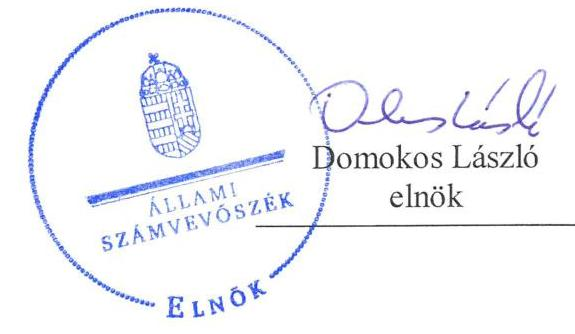
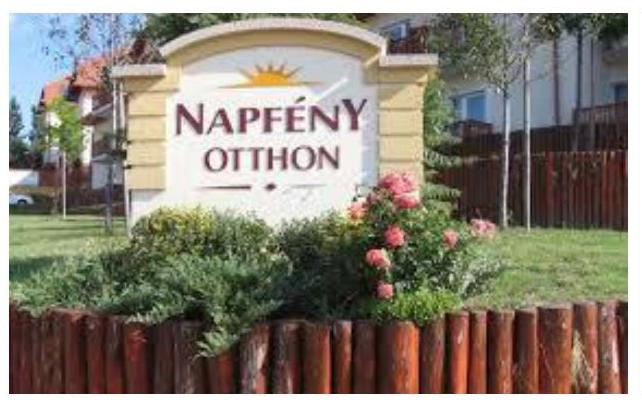

# Jelentés 

## Nem állami humánszolgáltatók ellenőrzése

A humánszolgáltatást nyújtó államháztartáson kívüli szociális intézmények, szolgáltatók fenntartói központi költségvetésből kapott támogatásai felhasználásának ellenőrzése - „Napfény-Otthon” Kiemelten Közhasznú Alapítvány
2019.

---

# Jelentés 

## Nem állami humánszolgáltatók ellenőrzése

A humánszolgáltatást nyújtó államháztartáson kívüli szociális intézmények, szolgáltatók fenntartói központi költségvetésből kapott támogatásai felhasználásának ellenőrzése „Napfény-Otthon” Kiemelten Közhasznú Alapítvány
2019. 05. hó 30. nap

---

# AZ ELLENŐRZÉST FELÜGYELTE:

- KAKAS SÁNDOR felügyeleti vezető
- TÓTH MARIANNA felügyeleti vezető

# AZ ELLENŐRZÉST VEZETTE ÉS A VÉGREHAJTÁSÁÉRT FELELŐS:

- VERTKOVCZI MÁRIA ellenőrzésvezető
- HUDÁK KATALIN ellenőrzésvezető

# A PROGRAM ÖSSZEÁLLÍTÁSÁÉRT FELELŐS:

- TÓTPÁL SZABOLCS osztályvezető

Jelentéseink az Országgyűlés számítógépes hálózatán és az Interneten a www.asz.hu címen is olvashatóak.

|  IKTATÓSZÁM: EL-1564-001/2019. | |
| --- | --- |
|  TÉMASZÁM: 2491 | |
|  ELLENŐRZÉS-AZONOSÍTÓ SZÁM: V083506 | |

---

# TARTALOMJEGYZÉK 

■ ÖSSZEGZÉS ..... 5
■ AZ ELLENŐRZÉS CÉLJA ..... 6
■ AZ ELLENŐRZÉS TERÜLETE ..... 7
■ AZ ELLENŐRZÉS HÁTTERE, INDOKOLTSÁGA ..... 8
■ A JELENTÉS LÉNYEGES KÉRDÉSKÖRE ..... 9
■ AZ ELLENŐRZÉS HATÓKÖRE ÉS MÓDSZEREI ..... 10
■ MEGÁLLAPÍTÁSOK ..... 12
■ MELLÉKLETEK ..... 13
I. sz. melléklet: Értelmező szótár ..... 13
■ FÜGGELÉKEK ..... 15
I. sz. függelék a Jelentéshez ..... 15
II. sz. függelék: Észrevételek ..... 16
■ RÖVIDÍTÉSEK JEGYZÉKE ..... 19

---

.

---

# ÖSSZEGZÉS 

A „Napfény-Otthon” Kiemelten Közhasznú Alapítvány gazdálkodása - ezen belül a közfeladatot ellátó intézményei működtetéséhez felhasznált közpénzekre vonatkozó gazdálkodása - nem volt elszámoltatható és átlátható.

## Az ellenőrzés társadalmi indokoltsága

Az Állami Számvevőszék stratégiájában célul tűzte ki, hogy az államháztartáson kívülre nyújtott költségvetési támogatások ellenőrzésével hozzájárul ahhoz, hogy a közpénzeket az államháztartáson kívüli szervezetek is átlátható módon használják fel a közfeladatok szerződésben vállalt ellátása érdekében. Tekintettel az elmúlt években a szociális területet érintő finanszírozási változásokra, a társadalom fokozott érdeklődéssel figyeli a szociális feladatokra fordított források felhasználását. Fontos a közvélemény biztosítása arról, hogy a közpénz államháztartáson kívüli felhasználása ezen a területen sem marad ellenőrizetlenül. Az ellenőrzés eredményeképpen a nyilvánosság és a szolgáltatást igénybe vevők megfelelő tájékoztatást kaphatnak az államháztartáson kívüli közfeladatot ellátó működéséről.

A „Napfény-Otthon” Kiemelten Közhasznú Alapítványnál végzett ellenőrzést indokolja az is, hogy a humánszolgáltatási közfeladat ellátására az ellenőrzött időszakban 1000 millió Ft központi költségvetési támogatásban részesült.

## Főbb megállapítások, következtetések

A „Napfény-Otthon” Kiemelten Közhasznú Alapítvány a 2015-2017. években nem rendelkezett a jogszabályban előírt számviteli politikával, ezáltal nem alakított ki szabályszerű működési és gazdálkodási környezetet. Nem igazolta a kapott költségvetési támogatások szabályszerű felhasználását. Számviteli szabályzatokkal megalapozott, szabályszerű beszámolókkal nem rendelkezett, ezzel nem biztosította a közpénzek törvényes felhasználásának ellenőrizhetőségét.

---

# AZ ELLENŐRZÉS CÉLJA

**AZ ELLENŐRZÉS CÉLJA** annak értékelése, hogy a nem állami, nem önkormányzati szociális intézmények fenntartói központi költségvetésből kapott támogatásainak felhasználása szabályszerű volt-e, a támogatások igénylése, évközi módosítása és év végi elszámolása megfelel-e a jogszabályi előírásoknak.

---

# AZ ELLENŐRZÉS TERÜLETE 

## „Napfény-Otthon” Kiemelten Közhasznú Alapítvány

A „Napfény-Otthon” Kiemelten Közhasznú Alapítványt az Evangélikus Gerontológiai Egyesület 1995. évben alapította. A „Napfény-Otthon” Kiemelten közhasznú Alapítvány célja idős emberek szociális elhelyezésének biztosítása, gondozása, ellátása, továbbá a céllal összefüggő tanulmányok támogatása ösztöndíj és egyéb formában. Az irányítását öt tagú kuratórium látja el, képviseletére a kuratórium elnöke jogosult. A kuratórium elnökének személye a 2015-2017. években nem változott.

Tevékenysége ellátására a 2015. évben 325 millió, a 2016. évben 351 millió és a 2017. évben 324 millió Ft támogatást kapott a költségvetésből.

A „Napfény-Otthon” Kiemelten közhasznú Alapítvány, mint fenntartó Érden három, Budapesten egy szociális otthon üzemeltetését látta el.

---

# AZ ELLENŐRZÉS HÁTTERE, INDOKOLTSÁGA 

A szociális feladatokat ellátó nem állami intézményfenntartók részére közfeladataik ellátására évente jelentős összegű pénzügyi támogatást biztosítottak a mindenkori költségvetési törvények a bennük megfogalmazott feltételek mellett. A felhasználható állami támogatások a Kvtv.-ekben (a 2014. évi C. törvény Magyarország 2015. évi központi költségvetéséről, 2015. évi C. törvény Magyarország 2016. évi központi költségvetéséről, 2016. évi XC. törvény Magyarország 2017. évi központi költségvetéséről) a 2015-2017. években a szociális ágazatra vonatkozóan 273 Mrd Ft előirányzatot határoztak meg. Módosították a szociális igazgatásról és szociális ellátásokról szóló 1993. évi III. törvényt, amely - többek között - 2012. január 1-jei hatállyal megfogalmazta a finanszírozási rendszerbe történő befogadással összefüggő szabályokat.

Az ÁSZ¹ stratégiájában foglaltak alapján is indokolt az ellenőrzés, amely a társadalom számára jelzi, hogy a közpénz államháztartáson kívüli felhasználása sem maradhat ellenőrizetlenül. Az államháztartáson kívülre nyújtott költségvetési támogatások ellenőrzésével az ÁSZ hozzájárul ahhoz, hogy a közpénzeket a nem állami humán fenntartók átlátható módon használják fel a közfeladatok ellátására kötött szerződésekben vállalt kötelezettségek teljesítése érdekében. Az ellenőrzés javaslataival hozzájárulhat az említett rendszerek szabályszerű támogatás felhasználásához, javíthatja a társadalmi-gazdasági döntések megalapozottságát, amely a „jól irányított állam” működéséhez járul hozzá.

A holisztikus megközelítés jegyében az ellenőrzés keretében egyedi kockázatelemzés alapján kiválasztott fenntartóknál és intézményeiknél értékeljük az államháztartáson kívüli szociális tevékenységhez kapcsolódó támogatások felhasználásának megfelelőségét.

---

# A JELENTÉS LÉNYEGES KÉRDÉSKÖRE 

- A szociális humánszolgáltató közfeladatot ellátó fenntartó megteremtette-e a költségvetési támogatások átlátható, elszámoltatható igénybevételének, felhasználásának feltételeit, a költségvetési támogatásokat szabályszerűen használta-e fel, a közpénzekre vonatkozó gazdálkodásával a nyilvánosság előtt megalapozottan elszámolt-e?

---

# AZ ELLENŐRZÉS HATÓKÖRE ÉS MÓDSZEREI 

## Az ellenőrzés típusa

Megfelelőségi ellenőrzés.

## Az ellenőrzött időszak

A 2015. január 1-je és 2017. december 31-e közötti időszak azon évei, amelyben nem állami, nem önkormányzati fenntartó - szociális - közfeladat-ellátásra az államháztartásból támogatást kapott és/vagy használt fel.

## Az ellenőrzés tárgya

Az ellenőrzés a szociális humánszolgáltatási közfeladatokat ellátó államháztartáson kívüli fenntartók, humánszolgáltatási közfeladatai ellátásához a költségvetési törvényekben biztosított központi költségvetési támogatások igénylése, évközi módosítása és év végi elszámolása fenntartói feladatainak ellátása, illetve e központi költségvetésből kapott támogatásaik humánszolgáltatási közfeladatokra való fenntartó általi felhasználása szabályszerűségének értékelésére terjed ki.

## Az ellenőrzött szervezet

„Napfény-Otthon” Kiemelten Közhasznú Alapítvány

## Az ellenőrzés jogalapja

Az ellenőrzés jogszabályi alapját az ÁSZ tv. 1. § (3) bekezdése, 5. § (3) bekezdés, valamint az 5. § (11) c) pontjában foglalt előírások adják.

## Az ellenőrzés módszerei

Az ellenőrzést az ellenőrzési program szempontjai, kérdései, az ellenőrzött időszakban hatályos jogszabályok, a nemzetközi standardokat irányadónak tekintve, az ellenőrzés szakmai szabályok és módszertanok figyelembe vételével végezte az ÁSZ. A közpénzekkel való felelős gazdálkodás segítésére irányuló javaslatok kidolgozásakor a hatályos jogszabályok az irányadóak.

Az ellenőrzés ideje alatt az ellenőrzött szervezettel történő kapcsolattartást az ÁSZ SZMSZ² -ének vonatkozó előírásai alapján biztosította az ÁSZ.

---

Az ellenőrzési kérdések megválaszolásához szükséges bizonyítékok megszerzése az ellenőrzött által rendelkezésre bocsátott dokumentumokra, adatokra alapozva megfigyelés, szemle (szemrevételezés), kérdésfeltevés (információkérés), valamint elemző eljárással történt.

Az ellenőrzési bizonyítékként felhasználható adatforrások közé tartoznak egyrészt az ellenőrzési program részletes szempontjainál felsorolt adatforrások, másrészt minden - az ellenőrzés folyamán feltárt, az ellenőrzés szempontjából információt tartalmazó - dokumentum.

Az ellenőrzés lefolytatásához az ellenőrzött szervezet a kitöltött tanúsítványok, valamint az ÁSZ által kért dokumentumok elektronikus úton való megküldésével szolgáltatott adatokat, információkat. Az így rendelkezésre bocsátott adatok, információk és a tanúsítványok adatai valódiságának kontrollja az ellenőrzés keretében történt.

Az egységes értelmezést támogatja a program mellékletét képező fogalomtár és rövidítésjegyzék.

Az ellenőrzést alapvetően a szociális humánszolgáltatások esetében a központi költségvetési támogatások igénylésével, módosításával, felhasználásával, elszámolásával kapcsolatos feladatokat ellátó államháztartáson kívüli fenntartóknál/szervezeteinél végeztük.

A szociális humánszolgáltatások központi költségvetési támogatásai igénylésével, módosításával, elszámolásával kapcsolatos, államháztartáson kívüli fenntartó jogszabályokban előírt feladatai betartását, továbbá a központi költségvetési támogatások szabályszerű kezelését, nyilvántartását ellenőriztük a fenntartónál, az ott rendelkezésre álló határozatok, nyilvántartások, beszámolók és egyéb dokumentumok alapján. Az ellenőrzés nem terjedt ki a szociális humánszolgáltatások központi költségvetési támogatásai igénylése, módosítása, elszámolása valódiságának, megalapozottságának, helyességének - sem a fenntartónál, sem a székhely intézményeinél való - értékelésére (mivel ennek felülvizsgálata, ellenőrzése a finanszírozó jogszabályban előírt feladata, határozatai kiadása előtt). Továbbá nem terjed ki az ellenőrzés e források, intézmények általi szabályszerű felhasználásának értékelésére.

---

# MEGÁLLAPÍTÁSOK 

## A szociális humánszolgáltató közfeladatot ellátó fenntartó megteremtette-e a költségvetési támogatások átlátható, elszámoltatható igénybevételének, felhasználásának feltételeit, a költségvetési támogatásokat szabályszerűen használta-e fel, a közpénzekre vonatkozó gazdálkodásával a nyilvánosság előtt megalapozottan elszámolt-e?

Összegző megállapítás

Az Alapítvány nem teremtette meg a költségvetési támogatások átlátható, elszámoltatható igénybevételének, felhasználásának feltételeit, ezáltal a közpénzfelhasználása nem volt elszámoltatható.

Az Alapítvány³ működésének szabályozottsága, ennek keretében a gazdálkodására vonatkozó belső szabályozás nem felelt meg az előírásoknak, mivel az Alapítvány 2015-2017. években a Számv. tv.⁴ 14. § (3) bekezdésben előírtak ellenére nem alakította ki és nem foglalta írásba a gazdálkodó adottságainak, körülményeinek leginkább megfelelő - a törvény végrehajtásának módszereit, eszközeit meghatározó - számviteli politikát, és nem készítette el az (5) bekezdés a), b), d) pontjaiban foglaltak ellenére a számviteli politika keretében elkészítendő szabályzatokat. Így az Alapítvány gazdálkodása - ezen belül a közfeladatot ellátó intézményei működtetéséhez felhasznált közpénzekre vonatkozó gazdálkodása - nem volt elszámoltatható.

Az Alapítvány a közfeladatok szerződésben vállalt ellátása érdekében biztosított közpénzek átlátható módon való igénybevétele, felhasználása alapfeltételeit nem biztosította, így nem volt igazolt, hogy az Alapítvány az átvállalt szociális közfeladathoz biztosított költségvetési támogatásokat szabályszerűen fordította-e a humánszolgáltató intézményei működtetésére.

Az Alapítvány a közfeladatot ellátó intézményei működtetéséhez felhasznált közpénzekre vonatkozó gazdálkodásával a nyilvánosság előtt a 2015-2017. években nem számolt el. A jogszabályokban előírt beszámolási kötelezettségének a Civilszr₁⁵ 6. § (1) bekezdésében és Civilszr₂⁶ 7. § (1) bekezdésében foglaltak ellenére nem tett eleget, ezzel nem biztosította a közpénzek törvényes felhasználásának ellenőrizhetőségét, és az Alaptörvényben előírt átláthatóság elvének érvényesülését.

---

# MELLÉKLETEK 

- I. SZ. MELLÉKLET: ÉRTELMEZŐ SZÓTÁR
költségvetési támogatás
nem állami, nem önkormányzati (államháztartáson kívüli) intézmény fenntartó
székhely intézmény
a társadalombiztosítás pénzügyi alapjai kivételével az államháztartás központi alrendszeréből ellenérték nélkül, pénzben nyújtott támogatások (Áht. 1. § 14. pont)
A költségvetési törvényekben (2013. évi CCXXX. törvény 33-34. §, 2014. évi C. törvény 42-43. §, 2015. évi C. törvény 40-41. §) megállapított támogatás. Például a 2015. évi C. törvény 40-41. § szerint többek között: Az Országgyűlés a szociális, gyermekjóléti, gyermekvédelmi közfeladatot ellátó intézményt, szolgáltatást fenntartó egyházi jogi személy, civil szervezet, közalapítvány, országos nemzetiségi önkormányzat, települési vagy területi nemzetiségi önkormányzat, gazdasági társaság, és a humánszolgáltatást alaptevékenységként végző, az Szja tv. hatálya alá tartozó egyéni vállalkozó (a továbbiakban együtt: nem állami szociális fenntartó) részére támogatást állapít meg a következők szerint: a támogatás a nem állami szociális fenntartót a települési önkormányzatok 2. melléklet III. pont 3. alpont c)-k) pontjában és III. pont 5. alpont a) pontjában meghatározott támogatásaival azonos jogcímeken, összegben és feltételek mellett illeti meg.
A szociális, gyermekjóléti és gyermekvédelmi közfeladatokat /humánszolgáltatásokat ellátó intézményt fenntartó egyházi jogi személy, társadalmi szervezet, alapítvány, közalapítvány, civil szervezet, országos nemzetiségi önkormányzat, nonprofit gazdasági társaság, gazdasági társaság és a humánszolgáltatást alaptevékenységként végző, Szja tv. hatálya alá tartozó egyéni vállalkozó. (2013. évi Kvtv. 35. § (1), (3) bekezdés, 2014. évi Kvtv. 33. §, 34.
 § (1), (4) bekezdés, 2015. évi Ktv. 42. §, 43. § (1), (4) bekezdés, 2016. évi Ktv. 40. §, 41. § (1), (4) bekezdés, 2017. évi Ktv. 41. § (1), (4))
a szolgáltató székhelye, azaz a szolgáltató központi ügyintézésének helye, függetlenül attól, hogy használják-e szolgáltatás nyújtására (Sznyvhr. 1.§ k) pont) (hatályos: 2013. december 1-től)

---

.

---

# FÜGGELÉKEK 

- I. SZ. FÜGGELÉK A JELENTÉSHEZ

Az Állami Számvevőszék az ellenőrzések során feltárt tényekhez kapcsolódó további körülmények tisztázására eszközrendszerrel nem rendelkezik. Amennyiben az ellenőrzésen túlmutatóan indokoltnak látszik az ellenőrzés során feltárt körülmények további vizsgálata, az Állami Számvevőszék törvényi felhatalmazás alapján az ellenőrzés által feltárt körülményeket továbbítja a hatáskörrel rendelkező szervnek a szükséges intézkedések megtétele, eljárások lefolytatása érdekében.

1. 

Az ellenőrzés feltárta, hogy az Alapítvány a Számv. tv. 14. § (3) bekezdésben előírtak ellenére a 2015-2017. években nem készítette el a számviteli politikáját és annak keretében előírt szabályzatokat.
Leltározási szabályzat hiányában a nyilvántartásban szereplő eszközök valódisága és értéke, az értékelési szabályzat hiánya miatt az eszközök források kimutatott értéke nem volt igazolt. A pénzkezelési szabályzat hiányában a pénzeszközök elszámolásának jogszerűsége és értéke nem volt igazolt. Szabályzatok hiányában az Alapítvány 2015-2017. évi beszámolója nem volt megbízható és nem valós képet mutatott.
Mivel a 465/2017 (XII. 28.) Korm. rendelet 89. § (1) bekezdése alapján a beszámolók jogszabályi előírásoknak való megfelelőségét a Nemzeti Adó és Vámhivatal (NAV) ellenőrzi, a NAV jogosult eljárni a szabálytalanság tekintetében.
2.

Szabályzatok hiányában nem igazolt, hogy a közfeladatok ellátása érdekében kapott költségvetési támogatásokat az Alapítvány cél szerint használta-e fel.
Az Alapítvány a 2015. évben 325 millió, a 2016. évben 351 millió és a 2017. évben 324 millió Ft központi költségvetési támogatást kapott közhasznú feladatainak ellátására.
A támogatások felhasználása ellenőrzésében az Átr. ${ }^{7}$ 19. § (1) bekezdése alapján, mint hatóság a Magyar Államkincstár jogosult eljárni.
3.

Az ellenőrzés feltárta, hogy az Alapítvány által közzétett éves számviteli beszámolók a 2015-2017. években nem tartalmazták a Kuratórium ${ }^{8}$ elnökének, mint az Alapító Okirat ${ }^{9}$ 4.4. pontja alapján az Alapítvány képviseletére jogosult személynek az aláírását. Mivel aláírás hiányában a Civil. tv. ${ }^{10}$ 30. § (1) bekezdésében foglaltak ellenére a közzétett beszámolók igazoltan nem kerültek elfogadásra, ennek hiányában nem igazolt, hogy a közhiteles nyilvántartásba érvényes, hiteles adatok kerültek. Ez alapján a közzétett beszámolók nem adtak megbízható és valós összképet a gazdálkodó vagyonáról, pénzügyi helyzetéről és tevékenysége eredményéről.
Mivel törvényességi felügyeleti eljárásra a civil szervezetek bírósági nyilvántartásáról és az ezzel összefüggő eljárási szabályokról szóló 2011. évi CLXXXI. törvény 71/A. § (1) bekezdés, valamint 71/C. § (1) bekezdés d) pontjában foglaltak alapján a Bíróságnak van jogköre, ezért az Alapítvány törvényes működésének helyreállítása érdekében az illetékes bíróság jogosult eljárni.

---

A jelentéstervezetet a Számvevőszék 15 napos észrevételezésre megküldte az ellenőrzött szervezet vezetőjének az ÁSZ tv. 29. § (1) bekezdése előírásának megfelelően.

A „Napfény-Otthon" Közhasznú Alapítvány kuratóriumi elnöke a jelentéstervezet megállapításaira írásban észrevételt tett.
Az ÁSZ tv. 29. § (3) bekezdésével összhangban az ÁSZ a Függelékben feltünteti az ellenőrzés megállapításaival kapcsolatban tett, figyelembe nem vett észrevételeket, és megindokolja, hogy azokat miért nem fogadta el.

# 1) A jelentéstervezet szabályzatokkal kapcsolatos megállapítására tett észrevétel 

A kuratóriumi elnök észrevételében jelezte, hogy a „Napfény-Otthon" Kiemelten Közhasznú Alapítvány (a továbbiakban: Alapítvány) rendelkezik szabályzatokkal, de az adatbekérés során csak a „legfrissebb" verziót küldték meg az ÁSZ részére. Az észrevétel mellékleteként megküldte a korábbi időszakra vonatkozó számviteli politikát, értékelési szabályzatot, házipénztár pénzkezelési szabályzatot és a leltározási szabályzatot.

Az ellenőrzés megállapította, hogy az Alapítvány a 2015-2017. években a Számv. tv. 14. § (3) bekezdésben előírtak ellenére nem alakította ki és nem foglalta írásba a gazdálkodó adottságainak, körülményeinek leginkább megfelelő - a törvény végrehajtásának módszereit, eszközeit meghatározó - számviteli politikát, és nem készítette el az (5) bekezdés a), b), d) pontjaiban foglaltak ellenére a számviteli politika keretében elkészítendő szabályzatokat. Az Alapítvány az adatbekérés során a 2015-2017. évekre vonatkozó, előbbiekben felsorolt szabályzatokat nem bocsátotta az ellenőrzés rendelkezésére, amelyet az észrevételben foglaltak is megerősítenek. Az ÁSZ az adatbekérés során megküldött dokumentumokat értékeli és az alapján teszi meg az ellenőrzési megállapításait. Az előbbiekre tekintettel az észrevételt nem fogadjuk el, a jelentéstervezet módosítása nem indokolt.

## 2) A jelentéstervezet számviteli beszámolókkal kapcsolatos megállapítására tett észrevétel

A kuratóriumi elnök észrevételében jelezte, hogy a beszámolókat az Ügyfélkapun keresztül a törvényi előírások alapján tették közzé, elektronikus hitelesítés mellett, amelyek a bíróság nyilvántartása alá is felkerültek. Az Alapítvány az adatbekérés során ezt a beszámolót küldte meg az ÁSZ részére, amelyen azonban aláírás nem szerepelt. Az aláírt beszámolókat az észrevétel mellékleteként megküldte.
Az ellenőrzés megállapította, hogy az Alapítvány a jogszabályokban előírt beszámolási kötelezettségének

[^0]
[^0]:    * 29. § (1) Az Állami Számvevőszék az ellenőrzési megállapításait megküldi az ellenőrzött szervezet vezetőjének vagy az általa megbízott személynek, és annak, akinek személyes felelősségét állapította meg.
    (2) Az ellenőrzött szervezet vezetője és a felelősként megjelölt személy az ellenőrzés megállapításaira tizenöt napon belül írásban észrevételt tehet.
    (3) Az Állami Számvevőszék az észrevételre a beérkezésétől számított harminc napon belül írásban válaszol. A figyelembe nem vett észrevételeket köteles a jelentésben feltüntetni, és megindokolni, hogy azokat miért nem fogadta el.

---

a 2015-2017. években a Civilszr ${ }_{1}$ 6. § (1) bekezdésében, illetve a Civilszr ${ }_{2}$ 7. § (1) bekezdésében foglaltak ellenére nem tett eleget. Az Alapítvány az adatbekérés során nem bocsátott az ellenőrzés rendelkezésére aláírt beszámolót, amelyet az észrevételben foglaltak is megerősítenek. Az ÁSZ az adatbekérés során megküldött dokumentumokat értékeli és az alapján teszi meg az ellenőrzési megállapításait. Az előbbiekre tekintettel az észrevételt nem fogadjuk el, a jelentéstervezet módosítása nem indokolt.

---

.

---

# RÖVIDÍTÉSEK JEGYZÉKE 

${ }^{1}$ ÁSZ
${ }^{2}$ ÁSZ SZMSZ
${ }^{3}$ Alapítvány
${ }^{4}$ Számv. tv.
${ }^{5}$ Civilszr ${ }_{1}$
${ }^{6}$ Civilszr ${ }_{2}$
${ }^{7}$ Átr.
${ }^{8}$ Kuratórium
${ }^{9}$ Alapító Okirat
${ }^{10}$ Civil tv.

Állami Számvevőszék
Állami Számvevőszék Szervezeti és Működési Szabályzata
„Napfény-Otthon" Kiemelten Közhasznú Alapítvány
2000. évi C. törvény a számvitelről (hatályos: 2001. január 1.)

224/2000. (XII. 19.) Korm. rendelet az egyes egyéb szervezetek beszámoló készítési és könyvvezetési kötelezettségének sajátosságairól (hatályos 2016. december 31-ig)
479/2016. (XII. 28.) Korm. rendelet a számviteli törvény szerinti egyes egyéb szervezetek beszámoló készítési és könyvvezetési kötelezettségének sajátosságairól (hatályos 2017. január 1-jétől)
489/2013. (XII. 18.) Korm. rendelet az egyházi és nem állami fenntartású szociális, gyermekjóléti és gyermekvédelmi szolgáltatók, intézmények és hálózatok állami támogatásáról
„Napfény-Otthon" Kiemelten Közhasznú Alapítvány öt tagú kuratóriuma, a 2013. V. törvény a Polgári Törvénykönyvről 3:397. § (1) bekezdésében foglaltak alapján az Alapítvány ügyvezető szerve
A „Napfény-Otthon" Kiemelten Közhasznú Alapítvány alapítói okirata
2011. évi CLXXV. tv. az egyesülési jogról, a közhasznú jogállásról, valamint a civil szervezetek működéséről és támogatásáról

---

ÁLLAMI SZÁMVEVŐSZÉK
1052 Budapest, Apáczai Csere János utca 10.
Levélcím: 1364 Budapest 4. Pf. 54
Telefon: +36 1 4849100 Telefax: +36 1 4849200
www.asz.hu
