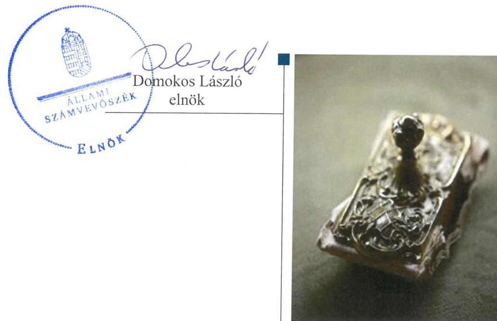

# Jelentés 

## Nemzeti tulajdonú gazdasági társaságok ellenőrzése

Nagytarcsai Közszolgáltató Nonprofit Korlátolt Felelősségű Társaság 2019.

19087
www.asz.hu

---

# Jelentés 

## Nemzeti tulajdonú gazdasági társaságok ellenőrzése

Nagytarcsai Közszolgáltató Nonprofit Korlátolt Felelősségű Társaság
2019. 05. hó 24. nap

---

# AZ ELLENŐRZÉST FELÜGYELTE:

- KAKAS SÁNDOR felügyeleti vezető
- AZ ELLENŐRZÉST VEZETTE ÉS A VÉGREHAJTÁSÁÉRT FELELŐS:
  - JOÓ ERIKA ellenőrzésvezető
  - A PROGRAM ÖSSZEÁLLÍTÁSÁÉRT FELELŐS:
    - TÓTPÁL SZABOLCS osztályvezető

**IKTATÓSZÁM:** EL-1565-001/2019

**TÉMASZÁM:** 2478

**ELLENŐRZÉS-AZONOSÍTÓ SZÁM:** V-082209

Jelentéseink az Országgyűlés számítógépes hálózatán és az Interneta a www.asz.hu címen is olvashatóak.

---

# TARTALOMJEGYZÉK 

■ ÖSSZEGZÉS ..... 5
■ AZ ELLENŐRZÉS CÉLJA ..... 6
■ AZ ELLENŐRZÉS TERÜLETE ..... 7
■ AZ ELLENŐRZÉS HÁTTERE, INDOKOLTSÁGA ..... 8
■ A JELENTÉS LÉNYEGES KÉRDÉSKÖREI ..... 9
■ AZ ELLENŐRZÉS HATÓKÖRE ÉS MÓDSZEREI ..... 10
■ MEGÁLLAPÍTÁSOK ..... 12
■ JAVASLATOK ..... 14
■ MELLÉKLETEK ..... 15
I. sz. melléklet: Értelmező szótár ..... 15
■ FÜGGELÉKEK ..... 17
I. sz. függelék a Jelentéshez ..... 17
II. sz. függelék: Észrevételek ..... 18
■ RÖVIDÍTÉSEK JEGYZÉKE ..... 23

---

.

---

# ÖSSZEGZÉS 

A Nagytarcsai Közszolgáltató Nonprofit Korlátolt Felelősségű Társaság felett tulajdonosi jogokat gyakorló Nagytarcsa Község Önkormányzata a tulajdonosi joggyakorlás kereteit nem a jogszabályi előírásoknak megfelelően alakította ki, a tulajdonosi jogok gyakorlása nem volt szabályszerű. A Társaság vagyongazdálkodása nem volt szabályszerű. A Társaság a számviteli beszámolóit nem támasztotta alá leltárral, ezzel nem volt biztositott az átláthatóság és elszámoltathatóság.

## Az ellenőrzés társadalmi indokoltsága

Az Állami Számvevőszék kiemelt célja, hogy a helyi önkormányzatok gazdálkodásában rejlő pénzügyi kockázatok feltárásával, az államháztartáson kívülre nyújtott költségvetési támogatások és ingyenes vagyonjuttatások, valamint az államháztartáson kívül múködő feladat-ellátó rendszerek ellenőrzéseivel hozzájáruljon ahhoz, hogy a közpénzeket az államháztartáson kívül múködő szervezetek is átlátható, rendezett módon használják fel.

Magyarországon az önkormányzatok kötelező és önként vállalt feladataik vonatkozásában is egyre szélesebb körben alkalmazzák a költségvetésen kívüli feladatellátást, ezáltal - a nonprofit szervezetek mellett - az önkormányzati tulajdonú gazdasági társaságok is kiemelt fontosságú szerephez jutottak.

## Főbb megállapítások, következtetések, javaslatok

Nagytarcsa Község Önkormányzata tulajdonosi joggyakorlása nem volt szabályszerű, mert a jogszabályi előírás ellenére a Képviselő-testület nem alkotta meg a Társaság javadalmazással összefüggő szabályzatát, a felügyelőbizottság nem készítette el jelentését a 2015-2017. évi beszámolók vonatkozásában, valamint - a Társaság legfőbb szerveként - a Képviselő-testület nem tárgyalta és nem hagyta jóvá a 2015-2017. évekre vonatkozó éves beszámolókat.

A Nagytarcsai Közszolgáltató Nonprofit Korlátolt Felelősségű Társaság az ellenőrzött időszakban nem a jogszabályi előírásoknak megfelelően vezette a vagyonhoz kapcsolódó nyilvántartásait, az éves beszámolók mérlegtételeit leltárral nem támasztotta alá, ennek következtében nem volt biztosított a vagyonnal való felelős gazdálkodás és elszámoltathatóság.

Az Állami Számvevőszék a jelentésben foglalt megállapítások alapján Nagytarcsa Község Önkormányzata polgármesterének két javaslatot, a Nagytarcsai Közszolgáltató Nonprofit Korlátolt Felelősségű Társaság ügyvezetőjének pedig három javaslatot fogalmazott meg. A javaslatokat megalapozó megállapításokra az érintetteknek 30 napon belül intézkedési tervet kell készíteniük.

---

# AZ ELLENŐRZÉS CÉLJA 

AZ ELLENŐRZÉS CÉLJA annak megállapítása, hogy a tulajdonosi joggyakorló a gazdasági társaságai feletti tulajdonosi joggyakorlás kereteit kialakította-e, tulajdonosi jogait megfelelően gyakorolta-e és kötelezettségeit teljesítette-e, továbbá annak megállapítása, hogy a gazdasági társaság biztosította-e a vagyon védelmét a nyilvántartások szabályszerű vezetése és a mérleg tételeinek leltárral történő alátámasztása útján, valamint szabályszerűen gondoskodott-e a társaság használatában, kezelésében lévő nemzeti vagyon értékének megőrzéséről, gyarapításáról, hasznosításáról.

---

# **AZ ELLENŐRZÉS TERÜLETE**

## **Nagytarcsa Község Önkormányzata; Nagytarcsai Közszolgáltató Nonprofit Korlátolt Felelősségű Társaság**

A Nagytarcsai Hulladékgazdálkodási Közszolgáltató Korlátolt Felelősségű Társaság 100% önkormányzati tulajdonban álló gazdasági társaság, tulajdonosa Nagytarcsa Község Önkormányzata. A Társaságot^{1} Nagytarcsa Község Önkormányzata alapította 2013. október 14-én 0,5 M Ft jegyzett tőkével.

A Társaság 2014. január 29-én nonprofit gazdasági társasággá alakult, elnevezése Nagytarcsai Település- és Hulladékgazdálkodási Közszolgáltató Nonprofit Korlátolt Felelősségű Társaságra, majd 2017. október 27-től Nagytarcsai Közszolgáltató Nonprofit Korlátolt Felelősségű Társaságra változott. A jegyzett tőke összegét 2015. október 1-jén 3,0 M Ft-ra emelte az Önkormányzat^{2}.

A Társaság a 2016. és a 2017. évben veszteségesen gazdálkodott. A veszteséges gazdálkodás következtében a 2017. évben a saját tőke nem érte el az adott társasági formára kötelezően előírt jegyzett tőke összegét. Az adózott eredmény és a saját tőke alakulását az 1. táblázat mutatja be.

A kizárólagos önkormányzati tulajdonban lévő Társaság főtevékenysége 2017 májusáig a hulladékgazdálkodás volt, amely mellett a helyi közutak, közparkok, egyéb közterületek üzemeltetésével, karbantartásával kapcsolatos feladatokat látott el, valamint a lakás és nem lakás céljára szolgáló épületek, építmények, a piac és a sportpályák üzemeltetését végezte. Az Önkormányzat a közfeladatok ellátásához szükséges vagyontárgyakat üzemeltetésre^{3} adta át a Társaságnak, vagyonkezelői jog létesítésére nem került sor.

A Társaság irányítása 2015. augusztus 31-ig kettős ügyvezetés keretében történt. A jelenlegi ügyvezető^{4} 2014. január 30-tól tölti be tisztségét, a polgármester^{5} személyében nem történt változás, a jegyző^{6} személye 2018. júniusban változott.

A Társaság az ellenőrzött években a Számv. tv. 155. § (2) bekezdése alapján nem volt könyvvizsgálatra kötelezett, azonban a Képviselő-testület állandó könyvvizsgálót választott. A könyvvizsgáló személye az ellenőrzött időszakban nem változott.

Az Önkormányzat az ellenőrzött időszakban egy további gazdasági társaságban rendelkezett többségi tulajdoni részesedéssel.

A Társaság az ellenőrzött időszakban nem tartozott a kormányzati szektorba sorolt gazdasági társaságok közé és nem rendelkezett más gazdasági társaságokban tulajdoni részesedéssel.

1. táblázat

**ADÓZOTT EREDMÉNY ÉS SAJÁT TŐKE 2015-2017. ÉV (MILLIÓ FORINT)**

|  Év | Adózott
eredmény | Saját tőke  |
| --- | --- | --- |
|  2015. | 17,3 | 27,8  |
|  2016. | -3,8 | 21,5  |
|  2017. | -43,3 | -21,8  |

*Forrás: a Társaság között beszámolói*

---

# AZ ELLENŐRZÉS HÁTTERE, INDOKOLTSÁGA 

Az Alaptörvény 38. cikke alapján az állam és a helyi önkormányzatok tulajdona nemzeti vagyon. A nemzeti vagyon megőrzése, megóvása érdekében kiemelten fontos ezen nemzeti tulajdonú gazdasági társaságok ellenőrzése. Gazdálkodásuk jellemzően a közérdeklődés és a média figyelmének középpontjában áll, amihez hozzájárul a gazdálkodásuk körébe tartozó - a nemzeti vagyon részét képező - vagyon nagysága, illetve az általuk ellátott közszolgáltatások minősége és hatékonysága. Ellenőrzéseink feltárhatják, hogy a tulajdonosi felügyelet hozzájárult-e a szabályszerű gazdálkodáshoz és feladatellátáshoz.

Az ellenőrzés eredményeként meghatározhatóvá válnak a szervezet vagyongazdálkodást érintő kockázatai, ezzel lehetővé téve a kockázatok csökkentését. A megállapítások alapján megfogalmazott számvevőszéki javaslatok hasznosítása elősegítheti a meglévő hibák megszüntetését. A jó gyakorlatok bemutatásával az ÁSZ hozzájárulhat a követendő megoldások megismertetéséhez, terjesztéséhez.

---

# A JELENTÉS LÉNYEGES KÉRDÉSKÖREI 

1. A gazdasági társaság feletti tulajdonosi joggyakorlás megfelel-e a jogszabályi és belső előírásoknak?
2. A Társaság vagyongazdálkodási tevékenysége szabályszerü volt-e?

---

# AZ ELLENŐRZÉS HATÓKÖRE ÉS MÓDSZEREI 

## Az ellenőrzés típusa

Megfelelőségi ellenőrzés.

## Az ellenőrzött időszak

A tulajdonosi joggyakorlás vonatkozásában az ellenőrzött időszak 2017. január 1-től az ellenőrzés megkezdésének napjáig terjedt ki az éves beszámolók elfogadása és a vagyonkezelésbe adott vagyonnal való gazdálkodás tulajdonosi ellenőrzése kivételével, amelyeknél az ellenőrzött időszak 2015. január 1-től az ellenőrzés megkezdésének napjáig - 2018. szeptember 21-ig - tartott.

A Társaság vagyongazdálkodása vonatkozásában az ellenőrzött időszak 2015. - 2017. évek, a 2017. évi beszámoló jóváhagyása tekintetében 2018. június elsejéig tartó időszak.

## Az ellenőrzés tárgya

Az önkormányzati tulajdonban lévő gazdasági társaság feletti tulajdonosi joggyakorlás kialakítása és múködtetése.

Önkormányzati tulajdonban lévő gazdasági társaság vagyongazdálkodása keretében a társaság használatában, kezelésében lévő nemzeti vagyon, illetve a saját vagyon tekintetébe a vagyonnyilvántartások vezetése, leltára. A társaság használatában, vagyonkezelésében lévő nemzeti vagyon tekintetében a vagyon értékének megőrzése, gyarapítása, hasznosítása.

## Az ellenőrzött szervezet

- Nagytarcsa Község Önkormányzata;
- Nagytarcsai Közszolgáltató Nonprofit Korlátolt Felelősségű Társaság

## Az ellenőrzés jogalapja

Az ellenőrzés jogalapját az ÁSZ tv. ${ }^{7}$ 1. § (3) bekezdése és 5. § (3)-(5) bekezdései képezték.

---

# Az ellenőrzés módszerei 

Az ellenőrzést az ellenőrzési program ellenőrzési kérdései, az ellenőrzött időszakban hatályos jogszabályok, az ellenőrzés szakmai szabályok és módszertanok alapján, a nemzetközi standardok figyelembe vételével végeztük.

Az ellenőrzés ideje alatt az ellenőrzött szervezettel történő kapcsolattartást az ÁSZ Szervezeti és Múködési Szabályzatának vonatkozó előírásai alapján biztosítottuk.
2017. január 1-től az ellenőrzés megkezdésének napjáig ellenőriztük a tulajdonosi joggyakorlás kereteinek kialakítását, a tulajdonosi joggyakorló tevékenységét a felügyelő bizottság és a független könyvvizsgáló múködéséhez kapcsolódóan, valamint azt, hogy a tulajdonosi joggyakorló - amenynyiben a gazdasági társaság feladatellátásához és vagyonkezeléséhez kapcsolódóan határozott meg követelményeket, elvárásokat - a nemzeti vagyon értékének megőrzése érdekében monitorozta-e azok teljesülését. 2015. január 1-től az ellenőrzés megkezdésének napjáig ellenőriztük a tulajdonosi joggyakorló részvételét az éves beszámoló elfogadására vonatkozó döntéshozatalban, valamint amennyiben adott a társaságainak vagyonkezelésbe nemzeti vagyont, akkor azt, hogy az azzal történő gazdálkodást a tulajdonosi joggyakorló ellenőrizte-e.

Az ellenőrzési kérdések megválaszolásához szükséges bizonyítékok megszerzése a Társaság vagyongazdálkodása vonatkozásában a következő ellenőrzési eljárások alkalmazásával történt: megfigyelés, információkérés, összehasonlítás, elemző eljárás. Az ellenőrzési bizonyítékként felhasználható adatforrások közé tartoznak az ellenőrzési programban felsorolt adatforrások, továbbá minden - az ellenőrzés folyamán - feltárt, az ellenőrzés szempontjából információkat tartalmazó dokumentum.

Az ellenőrzést a kérdésekre adott válaszok kiértékelésével, valamint a megjelölt adatforrások, a csatolt tanúsítványok felhasználásával, továbbá az adott időszakban hatályos jogszabályok figyelembe vételével folytattuk le.

A vagyonnyilvántartások és a leltár szabályszerűsége esetében az ellenőrzés azokra a legnagyobb értékű tételekre - a lényeges sokaságra - terjedt ki, melyek összértéke eléri a teljes sokaság összértékének 50\%-át.

A 2015. és a 2017. évben a lényeges sokaságot tételesen ellenőriztük.

---

# 1. A gazdasági társaság feletti tulajdonosi joggyakorlás megfelel-e a jogszabályi és belső előírásoknak? 

## Összegző megállapítás

1.1. számú megállapítás
1.2. számú megállapítás

Az Önkormányzat tulajdonosi joggyakorlása nem volt szabályszerű.

Az Önkormányzat a tulajdonosi joggyakorlás kereteit nem szabályszerűen alakította ki.

Az Önkormányzat Képviselő-testülete ${ }^{8}$, a Társaság legfőbb szerveként a Taktv. ${ }^{9}$ 5. § (3) bekezdés előírása ellenére nem alkotta meg a vezető tisztségviselők, felügyelőbizottsági tagok, az Mt. ${ }^{10}$ 208. §-ának hatálya alá eső munkavállalók javadalmazása, valamint a jogviszony megszűnése esetére biztosított juttatások módjának, mértékének elveiről, annak rendszeréről szóló szabályzatot.

Az Önkormányzat a Társaság feletti tulajdonosi jogait nem szabályszerűen gyakorolta.

Az Önkormányzat Képviselő-testülete a Társaság ellenőrzése céljából a Ptk. ${ }^{11}$ és a Taktv. előírásainak megfelelően háromtagú felügyelőbizottságot hozott létre, de a Felügyelőbizottság ${ }^{12}$ a Ptk. előírásai szerinti feladatait nem látta el. A Ptk. 3:120. § (2) bekezdésében előírtak ellenére a Felügyelőbizottság nem készítette el írásbeli jelentését a Társaság éves beszámolóiról.

A Társaság legfőbb szerve - a Képviselő-testület - a 2015-2017. évi éves beszámolókat nem tárgyalta, és a Ptk. 3:109. § (2) bekezdés előírása ellenére nem hagyta jóvá a Társaság éves beszámolóit.

## 2. A Társaság vagyongazdálkodási tevékenysége szabályszerű volt-e?

## Összegző megállapítás

2.1. számú megállapítás

A Társaság vagyongazdálkodási tevékenysége nem volt szabályszerű.

A Társaság nem a jogszabályi és belső előírásoknak megfelelően vezette a vagyonhoz kapcsolódó nyilvántartásait.

A Társaság az ellenőrzött időszakban a Számv. tv. ${ }^{13}$ 161. § (1) bekezdés előírásai ellenére nem rendelkezett számlarenddel.

A Társaság az Önkormányzattól térítés nélküli átadás keretében kapott egyedi helyrajzi számmal ${ }^{14}$ rendelkező három eszközt a Számv. tv. 16. §

---

(1) bekezdés - egyedi értékelés elvére vonatkozó - előírása ellenére egyetlen eszközként vette nyilvántartásba, és nem egyedileg értékelte az eszközöket.

# 2.2. számú megállapítás 

## A Társaság az éves beszámolók mérlegtételeit nem támasztotta alá leltárral.

A Társaság az ellenőrzött időszakban rendelkezett az előírásoknak megfelelő leltárkészítésre és leltározásra vonatkozó Leltározási szabályzattal ${ }^{15}$.

A Társaság a 2015-2017. években a Számv. tv. 69. § (1) bekezdése előírása ellenére a mérleg tételeinek alátámasztásához nem állított össze olyan leltárt, amely tételesen, ellenőrizhető módon tartalmazza a mérleg fordulónapján meglévő eszközeit és forrásait mennyiségben és értékben.

A Társaság az éves beszámolók mérlegtételeit a Számv. tv. 69. § (1) bekezdésében foglaltak ellenére nem támasztotta alá leltárral, ezért a Számv. tv. 15. § (3) bekezdésében foglalt valódiság elve nem érvényesült.

A saját tőke összege a 2017. évben -21,8 M Ft, a jegyzett tőke 3,0 M Ft volt. A Társaság saját tőkéje a 2017. évben a törzstőke törvényben meghatározott minimális összege alá csökkent, azonban az ügyvezető a Ptk. 3:189. § (1) bekezdés b) pontjában előírtak ellenére nem kezdeményezte a legfőbb szerv döntéshozatalát.

---

# JAVASLATOK 

Az ÁSZ tv. 33. § (1) bekezdésében foglaltak értelmében az ellenőrzött szervezet vezetője köteles a jelentésben foglalt megállapításokhoz kapcsolódó intézkedési tervet összeállítani és azt a jelentés kézhezvételétől számított 30 napon belül az ÁSZ részére megküldeni. Amennyiben az ellenőrzött szervezet vezetője nem küldi meg határidőben az intézkedési tervet, vagy továbbra sem elfogadható intézkedési tervet küld, az Állami Számvevőszék elnöke az ÁSZ tv. 33. § (3) bekezdése a) és b) pontjaiban foglaltakat érvényesítheti.

## Nagytarcsai Közszolgáltató Nonprofit Korlátolt Felelősségű Társaság ügyvezetőjének

1. Intézkedjen a számlarend elkészitéséről a Számv. tv. elöírásai szerint.
(2.1. sz. megállapítás 1. bekezdése alapján)
2. Gondoskodjon a könyvvezetés során az eszközök egyedi értékeléséről a Számv. tv. előírásai szerint.
(2.1. sz. megállapítás 2. bekezdése alapján)
3. Gondoskodjon a mérlegben kimutatott eszközök és források jogszabályban elöirtaknak megfelelő, teljes körü leltárral történő alátámasztásáról.
(2.2. sz. megállapítás 2. és 3. bekezdése alapján)

## Nagytarcsa Község Önkormányzata polgármesterének

1. Kezdeményezze a Képviselő-testületnél a vezető tisztségviselők, a felügyelő bizottsági tagok, az Mt. 208. §-ának hatálya alá eső munkavállalók javadalmazása, valamint a jogviszony megszünése esetére biztosított juttatások módjának, mértékének elveire, annak rendszerére vonatkozó szabályzat megalkotását a Taktv.-ben elöirtaknak megfelelően.
(1.1. sz. megállapítás 1. bekezdése alapján)
2. Kezdeményezze a Képviselő-testületnél a beszámoló jogszabályi előírás szerinti jóváhagyását.
(1.2. sz. megállapítás 2. bekezdése alapján)

---

# MELLÉKLETEK 

- I. SZ. MELLÉKLET: ÉRTELMEZŐ SZÓTÁR
gazdasági társaság
kettős ügyvezetés
koncessziós szerződés
közszolgáltatás
közfeladat
nemzeti vagyon
nemzeti vagyon hasznosítása
nemzeti vagyon használója
vagyonkezelő

Ptk. 3:88. § (1) bekezdése szerint „a gazdasági társaságok üzletszerű közös gazdasági tevékenység folytatására, a tagok vagyoni hozzájárulásával létrehozott, jogi személyiséggel rendelkező vállalkozások, amelyekben a tagok a nyereségből közösen részesednek, és a veszteséget közösen viselik".
Ptk. 3:196. § (1) A társaság ügyvezetését egy vagy több ügyvezető látja el.
Az 1991. évi XVI. tv. alapján a kizárólagos állami, önkormányzati vagy ön-kormányzati társulási tulajdon hatékony működtetésének, valamint a kizárólagosan az állam vagy az önkormányzat hatáskörébe utalt tevékenységek gyakorlásának egyik lehetséges útja mindezek koncessziós szerződés alapján való átengedése
Az Ebktv. ${ }^{16}$ 3. § d) pontja a következőképpen határozza meg a közszolgáltatást: „szerződéskötési kötelezettség alapján a lakosság alapvető szükségleteinek ellátására irányuló szolgáltatás, így különösen a villamos energia-, gáz-, hő-, víz-, szenny-víz- és hulladékkezelési, köztisztasági, postai és táv-közlési szolgáltatás, továbbá a menetrend alapján közlekedő járművekkel végzett közforgalmú személyszállítás".
Az Áht. 3/A. § (1) bekezdése alapján közfeladat a jogszabályban meghatározott állami vagy önkormányzati feladat
Nvtv. 1. § (2) bekezdése szerint nemzeti vagyonba tartozik többek között:
„az állam vagy a helyi önkormányzat kizárólagos tulajdonában álló dolgok,
az a) pont hatálya alá nem tartozó, állam vagy a helyi önkormányzat tulajdonában lévő dolog,
az állam vagy a helyi önkormányzat tulajdonában lévő pénzügyi eszközök, továbbá az államot vagy a helyi önkormányzatot megillető társasági részesedések, az államot vagy a helyi önkormányzatot megillető bármely vagyoni érték-kel rendelkező jogosultság, amelyet jogszabály vagyoni értékű jogként nevesít
A tulajdonosi joggyakorló vagy a nemzeti vagyon használója által a nemzeti vagyon birtoklásának, használatának, hasznok szedése jogának bármely - a tulajdonjog átruházását nem eredményező - jogcímen történő átengedése, ide nem értve a vagyonkezelésbe adást, valamint a haszonélvezeti jog alapítását.
Forrás: Nvtv. 3. § (1) bekezdés 4. pont
Azon természetes személy, jogi személy vagy jogi személyiséggel nem rendelkező szervezet, aki vagy amely állami vagyon tekintetében törvény vagy szerződés alapján, a helyi önkormányzat vagyona tekintetében törvény, a helyi önkormányzat rendelete vagy szerződés alapján bármely jogcímen nemzeti vagyont birtokol, használ, szedi annak hasznait, kivéve a tulajdonosi joggyakorló.
Forrás: Nvtv. 3. § (1) bekezdés 11. pont
Aki a nemzeti vagyon felett az államot vagy a helyi önkormányzatot megillető tulajdonosi jogok és kötelezettségek összességének gyakorlására jogosult. (Forrás: Nvtv. 3. § (1) bekezdés 17. pontja)
az állam tulajdonában álló nemzeti vagyon tekintetében:
aa) költségvetési szerv,
ab) helyi önkormányzat, nemzetiségi önkormányzat, valamint ezek társulásai, ac) az ab) alpontban felsoroltak fenntartása vagy irányítása alá tartozó intézmény, ad) köztestület,

---

ae) az állam, az aa)-ac) alpontban meghatározott személyek együtt vagy külön-külön 100\%-os tulajdonában álló gazdálkodó szervezet,
af) az ae) alpont szerinti gazdálkodó szervezet 100\%-os tulajdonában álló gazdálkodó szervezet,
ag) a törvény által kijelölt egyedileg meghatározott jogi személy.
b) a helyi önkormányzat tulajdonában álló nemzeti vagyon tekintetében:
ba) nemzetiségi önkormányzat, helyi vagy nemzetiségi önkormányzati társulás, valamint ezek fenntartása vagy irányítása alá tartozó intézmény,
bb) költségvetési szerv,
bc) köztestület,
bd) az állam, a helyi önkormányzat, a ba) alpontban meghatározott személyek együtt vagy külön-külön 100\%-os tulajdonában álló gazdálkodó szervezet,
be) a bd) alpont szerinti gazdálkodó szervezet 100\%-os tulajdonában álló gazdálkodó szervezet.
Forrás: Nvtv. 3. § (1) bekezdés 19. pont
vagyonkezelői jog
vagyongazdálkodás

A vagyonkezelő köteles a vagyontárgy állagának megóvásáról, jó karban-tartásáról, működtetéséről gondoskodni, jogszabályban és szerződésben előírt más kötelezettségét teljesíteni, valamint a vagyontárgyat jogszabályban vagy szerződésben meghatározott célnak megfelelően használni. A vagyonkezelő - a központi költségvetési szervek és a kizárólag közfeladatot ellátó nem központi költségvetési szerv vagyonkezelők kivételével - köteles díjat fizetni, jogszabályban és szerződésben előírt más kötelezettségét teljesíteni, valamint a vagyontárgyat jogszabályban vagy szerződésben meghatározott célnak megfelelően használni. Amennyiben a vagyonkezelő ezen kötelezettségeinek nem tesz eleget, a tulajdonosi joggyakorló jogosult a szerződést azonnali hatállyal felmondani.
Forrás: Vtv. 27. § (2), (2a
A nemzeti vagyongazdálkodás feladata a nemzeti vagyon rendeltetésének megfelelő, az állam, az önkormányzat mindenkori teherbíró képességéhez igazodó, elsődlegesen a közfeladatok ellátásához és a mindenkori társadalmi szükségletek kielégítéséhez szükséges, egységes elveken alapuló, átlátható, hatékony és költségtakarékos működtetése, értékének megőrzése, állagának védelme, értéknövelő használata, hasznosítása, gyarapítása, továbbá az állam vagy a helyi önkormányzat feladatának ellátása szempontjából feleslegessé váló vagyontárgyak elidegenítése. (Forrás: Nvtv. 7. § (2) bekezdése).

---

# FÜGGELÉKEK 

- I. SZ. FÜGGELÉK A JELENTÉSHEZ

Az Állami Számvevőszék az ellenőrzések során feltárt tényekhez kapcsolódó további körülmények tisztázására eszközrendszerrel nem rendelkezik. Amennyiben az ellenőrzésen túlmutatóan indokoltnak látszik az ellenőrzés során feltárt körülmények további vizsgálata, az Állami Számvevőszék törvényi felhatalmazás alapján az ellenőrzés által feltárt körülményeket továbbítja a hatáskörrel rendelkező szervnek a szükséges intézkedések megtétele, eljárások lefolytatása érdekében.

1. A Képviselő-testület a Társaság 2015-2017. évi éves beszámolóját a Ptk. 3:109. § (2) bekezdés előírásai ellenére nem tárgyalta. A Társaság 2015-2017. évi - közzétett és letétbe helyezett - éves beszámolóját a polgármester hagyta jóvá, annak ellenére, hogy erre átruházott hatáskörrel nem rendelkezett.
A beszámolók elfogadásával kapcsolatban feltárt jogszabálysértő gyakorlat tekintetében a Ptk. 3:34. § (1) bekezdése értelmében a Cégbíróság jogosult eljárni.
2. A Társaság az ellenőrzött időszakban nem készítette el a Számv. tv. 69. § (1) bekezdése előírásainak megfelelő leltárakat.
A leltárral alá nem támasztott mérlegsorok értéke a 2015. évben eszközök esetén a mérlegfőösszeg 99\%-a volt, a források esetében a mérlegfőösszeg 100\%-a volt. A mérleg föösszege a 2015. évben 102,0 M Ft volt. A leltárral alá nem támasztott érték a Számv. tv. 3. § (3) bekezdésének 3. pontja alapján jelentős összegű hiba volt.
A leltárral alá nem támasztott mérlegsorok értéke a 2016. évben az eszközök és a források esetében a mérlegfőösszeg 100\%-a volt. A mérleg föösszege a 2016. évben 161,0 M Ft volt. A leltárral alá nem támasztott érték a Számv. tv. 3. § (3) bekezdésének 3. pontja alapján jelentős összegű hiba volt.
A leltárral alá nem támasztott mérlegsorok értéke a 2017. évben eszközök esetén a mérlegfőösszeg 97,2\%-a volt, a források esetében a mérlegfőösszeg 100\%-a volt. A mérleg föösszege a 2017. évben 83,8 M Ft volt. A leltárral alá nem támasztott érték a Számv. tv. 3. § (3) bekezdésének 3. pontja alapján jelentős összegű hiba volt.
A mérleg tételeit alátámasztó leltárak hiányában a Társaság 2015-2017. évi éves beszámolóiban a Számv. tv. 15. § (3) bekezdésében foglalt előírás ellenére nem érvényesült a valódiság elve és nem igazolt, hogy a Társaság éves beszámolói megbízható, valós összképet mutatnak.
Az adóigazgatási eljárás részletszabályairól szóló 465/2017. (XII. 28.) Korm. rendelet 89. § (1) bekezdése szerint a Nemzeti Adó- és Vámhivatal ellenőrzési jogköre kiterjed a nyilvántartásra és a könyvvezetésre vonatkozó előírások megtartásának ellenőrzésére, így a mérleg tételeit alátámasztó leltárak hiánya tekintetében jogosult eljárni.
A könyvvizsgáló a 2015. évi, a 2016. évi és a 2017. évi beszámolóról készített jelentésében nem kifogásolta a leltárak hiányát. A jogszabálysértő gyakorlat vonatkozásában a Magyar Könyvvizsgálói Kamaráról, a könyvvizsgálói tevékenységről, valamint a könyvvizsgálói közfelügyeletről szóló 2007. évi LXXV. törvény 4. § (5) bekezdés h) pontja alapján a Magyar Könyvvizsgálói Kamara jogosult eljárni.

---

A jelentéstervezetet a Számvevőszék 15 napos észrevételezésre megküldte az ellenőrzött szervezetek vezetőinek az ÁSZ tv. 29. §* (1) bekezdése előírásának megfelelően.

A Nagytarcsai Közszolgáltató Nonprofit Korlátolt Felelősségű Társaság ügyvezetője és Nagytarcsa Község Önkormányzatának polgármestere a jelentéstervezet megállapításaira írásban észrevételt tett.
Az ÁSZ tv. 29. § (3) bekezdésével összhangban az ÁSZ a Függelékben feltünteti az ellenőrzés megállapításaival kapcsolatban tett, figyelembe nem vett észrevételeket, és megindokolja, hogy azokat miért nem fogadta el.

[^0]
[^0]:    * 29. § (1) Az Állami Számvevőszék az ellenőrzési megállapításait megküldi az ellenőrzött szervezet vezetőjének vagy az általa megbízott személynek, és annak, akinek személyes felelősségét állapította meg.
    (2) Az ellenőrzött szervezet vezetője és a felelősként megjelölt személy az ellenőrzés megállapításaira tizenöt napon belül írásban észrevételt tehet.
    (3) Az Állami Számvevőszék az észrevételre a beérkezésétől számított harminc napon belül írásban válaszol. A figyelembe nem vett észrevételeket köteles a jelentésben feltüntetni, és megindokolni, hogy azokat miért nem fogadta el.

---

A „Nemzeti tulajdonú gazdasági társaságok ellenőrzése - Nagytarcsai Közszolgáltató Nonprofit Korlátolt Felelősségű Társaság" címmel készített számvevőszéki jelentéstervezet megállapításaival kapcsolatban az ügyvezető által 2019. március 27-én tett (az Állami Számvevőszékhez 2019. április 1-jén érkezett), figyelembe nem vett észrevételei és azok indokolása.

1. A jelentéstervezet 2.1. számú megállapítás 1. bekezdésére, valamint az ügyvezetőnek szóló 1. számú javaslatra vonatkozó észrevétel:

A Társaság észrevétele szerint a 2015. július 10-én elkészített szöveges számlarendet az adatszolgáltatás során beküldték az ÁSZ részére. A számlarendet az észrevételhez is mellékelték.

Az észrevételt nem fogadjuk el. A Társaság észrevételében hivatkozott és az adatbekérés során az ellenőrzésnek átadott számlarend borítólap, aláírás és bélyegző, keltezés nélküli dokumentum, nem beazonosítható, milyen vállalkozásra, milyen időszakra vonatkozik. Az Állami Számvevőszékről szóló 2011. évi LXVI. törvény (ÁSZ tv.) 28. § (1) bekezdése alapján az ÁSZ ellenőrzéseinek lefolytatása érdekében az ellenőrzött szervezet közreműködésre köteles. Az ellenőrzött szervezet közreműködési kötelezettsége magában foglalja a (2) bekezdés szerinti kötelezettséget, amely szerint a közreműködésre felhívott szervezet az ÁSZ részére - annak kérésére soron kívül, de legkésőbb öt munkanapon belül - az ellenőrzés lefolytatása érdekében szükséges adatokat és dokumentumokat rendelkezésre bocsátja. Az ÁSZ tv. 28. § (2) bekezdése szerinti közreműködési kötelezettség törvényi határidőben történő teljesítése a rendelkezésre bocsátott adatok, dokumentumok ÁSZ általi befogadásának alapvető feltétele. Az ügyvezető teljességi és hitelességi nyilatkozatával igazolta az ellenőrzésnek határidőben átadott dokumentumok teljes körűségét és hitelességét, hogy azokat az objektív ellenőrzés bizonyítékként tudja értékelni és figyelembe venni a megbízható és szakszerű megállapítások megtételéhez. A Társaság észrevételéhez mellékelt dokumentum a fenti feltételeknek nem felel meg, ellenőrzési bizonyítékként nem vehető figyelembe.

Mindezekre tekintettel az észrevétel figyelembevétele, a jelentéstervezet módosítása nem indokolt.
2. A jelentéstervezet 2.1. számú megállapítás 2. bekezdésére, valamint az ügyvezetőnek szóló 2. számú javaslatra vonatkozó észrevétel:

A Társaság észrevétele szerint 2019. március 26-án önellenőrzést hajtottak végre, az eszközöket egyedileg nyilvántartásba vették.

Az észrevétel a megállapítással egyetért, a jelentéstervezet módosítása nem indokolt.
3. A jelentéstervezet 2.2. számú megállapítás 2-3. bekezdéseire, valamint az ügyvezetőnek szóló 3. számú javaslatra vonatkozó észrevétel:

A Társaság észrevétele szerint mindhárom évben, 2015-2017-ben elkészítették a leltárt a követelés-kötelezettség viszonylatában, illetve a befektetett eszközök leltárát is, amelyeket az észrevételhez mellékletként csatoltak.

Az észrevételt nem fogadjuk el. A Társaság által az ellenőrzés részére az adatszolgáltatásra rendelkezésre álló időn belül átadott leltározási utasítások csak a tárgyi eszközök és a készletek leltározását rendelték el. A tárgyi eszközökről felvett leltározási jegyzőkönyvek nem feleltek meg a Társaság Leltározási szabályzatában előírt tartalmi követelményeknek, mert egységárakat nem tartalmaztak. A Társaság által átadott leltárak a számvitelről szóló 2000. évi C. törvény (Számv. tv.) 69. §-ában előírtak ellenére a beszámoló elkészítését, a mérleg tételeit (valamennyi sorát) nem támasztották alá. A Társaság nem igazolta az üzleti évek mérleg-fordulónapjára vonatkozóan a jogszabályban előírt, a főkönyvi könyvelés és az analitikus nyilvántartások adatai közötti egyeztetés elvégzését, illetve az átadott leltárak nem tartalmazták a Társaság eszközeit és forrásait mennyiségben és értékben. Az ÁSZ tv. 28. § (1) bekezdése alapján az ÁSZ ellenőrzéseinek lefolytatása érdekében az ellenőrzött szervezet közreműködésre köteles. Az ellenőrzött szervezet közreműködési kötelezettsége magában foglalja a (2) bekezdés szerinti kötelezettséget, amely szerint a közreműködésre felhívott szervezet az ÁSZ részére - annak kérésére soron kívül, de legkésőbb öt munkanapon belül - az ellenőrzés lefolytatása érdekében szükséges adatokat és dokumentumokat rendelkezésre bocsátja. Az ÁSZ tv. 28. § (2) bekezdése szerinti közreműködési kötelezettség törvényi határidőben történő teljesítése a rendelkezésre bocsátott adatok, dokumentumok ÁSZ általi befogadásának alapvető feltétele. Az ügyvezető teljességi és hitelességi nyilatkozatával igazolta az ellenőrzésnek határidőben átadott dokumentumok teljes körűségét és hitelességét, hogy

---

azokat az objektív ellenőrzés bizonyítékként tudja értékelni és figyelembe venni a megbízható és szakszerű megállapítások megtételéhez. A Társaság észrevételéhez mellékelt dokumentumok a fenti feltételeknek nem felelnek meg, ellenőrzési bizonyítékként nem vehetők figyelembe.

Fentiekre tekintettel a jelentéstervezet módosítása nem indokolt.

# 4. A jelentéstervezet 2.2. számú megállapítás 4. bekezdésére vonatkozó észrevétel: 

Az ügyvezető észrevétele szerint a Társaság mérlegének elfogadásakor tájékoztatta a taggyűlést a törzstőke emelés szükségességéről. Nagytarcsa Község Önkormányzatának Képviselő-testülete 2019. március 18-án határozattal döntött a törzstőke emeléséről.

Az észrevétel a megállapítást nem vitatja, a jelentéstervezet módosítása nem indokolt.

## 5. A jelentéstervezet 1.1. számú megállapítására, valamint a polgármesternek szóló 1. számú javaslatra vonatkozó észrevétel:

Az ügyvezető észrevételében jelezte, hogy 2019. március 27-ével elkészítette a Társaság javadalmazási szabályzatát, amelyet a Nagytarcsa Község Önkormányzatának Képviselő-testülete aznapi rendkívüli ülésén elfogadott.

Az észrevétel a megállapítást nem vitatja, a jelentéstervezet módosítása nem indokolt.

## 6. A jelentéstervezet 1.2. számú megállapítás 1. bekezdésére vonatkozó észrevétel:

Az ügyvezető észrevétele szerint a Felügyelő Bizottság minden ellenőrzött évben tárgyalta a Társaság beszámolóit. A z észrevételhez a beszámoló elfogadásáról hozott felügyelő bizottsági határozatokat, jegyzőkönyveket mellékelte. Az észrevételt nem fogadjuk el. Az ügyvezető az észrevételében elismerte, hogy a felügyelő bizottsági határozatokat, jegyzőkönyveket az adatszolgáltatás során nem adták át az ellenőrzés részére. Az ÁSZ tv. 28. § (1) bekezdése alapján az ÁSZ ellenőrzéseinek lefolytatása érdekében az ellenőrzött szervezet közreműködésre köteles. Az ellenőrzött szervezet közreműködési kötelezettsége magában foglalja a (2) bekezdés szerinti kötelezettséget, amely szerint a közreműködésre felhívott szervezet az ÁSZ részére - annak kérésére soron kívül, de legkésőbb öt munkanapon belül - az ellenőrzés lefolytatása érdekében szükséges adatokat és dokumentumokat rendelkezésre bocsátja. Az ÁSZ tv. 28. § (2) bekezdése szerinti közreműködési kötelezettség törvényi határidőben történő teljesítése a rendelkezésre bocsátott adatok, dokumentumok ÁSZ általi befogadásának alapvető feltétele. Az ügyvezető teljességi és hitelességi nyilatkozatával igazolta az ellenőrzésnek határidőben átadott dokumentumok teljes körűségét és hitelességét, hogy azokat az objektív ellenőrzés bizonyítékként tudja értékelni és figyelembe venni a megbízható és szakszerű megállapítások megtételéhez. A Társaság észrevételéhez mellékelt dokumentumok a fenti feltételeknek nem felelnek meg, ellenőrzési bizonyítékként nem vehetők figyelembe.

Fentiekre tekintettel a jelentéstervezet megállapításának módosítása nem indokolt.
7. A jelentéstervezet 1.2. számú megállapítás 2. bekezdésére, valamint a polgármesternek szóló 2. számú javaslatra vonatkozó észrevétel:

A Társaság észrevétele szerint Nagytarcsa Község Önkormányzatának Képviselő-testülete minden évben megtárgyalta és elfogadta a Társaság éves beszámolóit, azonban a 2015. és 2016. évi beszámolók elfogadásáról nem hoztak határozatot. A Képviselő-testület 2019. március 27-ei rendkívüli ülésén utólag határozatban fogadta el a Társaság 2015. és 2016. évi beszámolóit. A 2017. évi beszámoló elfogadásáról 2018. októberében készült határozat. Az ügyvezető a beszámolók elfogadásáról hozott képviselő-testületi határozatokat az észrevételhez mellékelte.

Az észrevételt nem fogadjuk el. Az ÁSZ tv. 28. § (1) bekezdése alapján az ÁSZ ellenőrzéseinek lefolytatása érdekében az ellenőrzött szervezet közreműködésre köteles. Az ellenőrzött szervezet közreműködési kötelezettsége magában foglalja a (2) bekezdés szerinti kötelezettséget, amely szerint a közreműködésre felhívott szervezet az ÁSZ részére annak kérésére soron kívül, de legkésőbb öt munkanapon belül - az ellenőrzés lefolytatása érdekében szükséges adatokat és dokumentumokat rendelkezésre bocsátja. Az ÁSZ tv. 28. § (2) bekezdése szerinti közreműködési kötelezettség törvényi határidőben történő teljesítése a rendelkezésre bocsátott adatok, dokumentumok ÁSZ általi befogadásának alapvető feltétele. Az ügyvezető teljességi és hitelességi nyilatkozatával igazolta az ellenőrzésnek határidőben átadott dokumentumok teljes körűségét és hitelességét, hogy azokat az objektív ellenőrzés bizonyítékként

---

tudja értékelni és figyelembe venni a megbízható és szakszerű megállapítások megtételéhez. A Társaság észrevételéhez mellékelt dokumentumok a fenti feltételeknek nem felelnek meg, ellenőrzési bizonyítékként nem vehetők figyelembe.

Fentiekre tekintettel a jelentéstervezet megállapításának módosítása nem indokolt.

---

A „Nemzeti tulajdonú gazdasági társaságok ellenőrzése - Nagytarcsai Közszolgáltató Nonprofit Korlátolt Felelősségú Társaság" címmel készített számvevőszéki jelentéstervezet megállapításaival kapcsolatban Nagytarcsa Község Önkormányzat polgármestere által 2019. április 3-án tett (az Állami Számvevőszékhez 2019. április 8-án érkezett), figyelembe nem vett észrevételei és azok indokolása.

1. A jelentéstervezet 1.1. számú megállapítására, valamint a polgármesternek szóló 1. számú javaslatra vonatkozó észrevétel:

A polgármester észrevételében jelezte, hogy 2019. március 27-én Nagytarcsa Község Önkormányzatának Képviselőtestülete rendkívüli ülésén elfogadta a Társaság javadalmazási szabályzatát, amelyet az elfogadó határozattal együtt az észrevételhez mellékelt.

Az észrevétel a megállapítást nem vitatja, a jelentéstervezet módosítása nem indokolt.
2. A jelentéstervezet 1.2. számú megállapítására, valamint a polgármesternek szóló 2. számú javaslatra vonatkozó észrevétel:

A polgármester észrevételében jelezte, hogy 2019. március 27-én Nagytarcsa Község Önkormányzatának Képviselőtestülete rendkívüli ülésén utólag határozatban fogadta el a Társaság 2015. és 2016. évi beszámolóit. A polgármester a beszámolók elfogadásáról hozott képviselő-testületi határozatot és a beszámolókat az észrevételhez mellékelte.

Az észrevétel a megállapítást nem vitatja, a jelentéstervezet módosítása nem indokolt.

---

# RÖVIDÍTÉSEK JEGYZÉKE 

${ }^{1}$ Társaság
${ }^{2}$ Önkormányzat
${ }^{3}$ Üzemeltetési-fenntartási szerződés ${ }_{1,2}$

## ${ }^{4}$ ügyvezető

${ }^{5}$ polgármester
${ }^{6}$ jegyző
${ }^{7}$ ÁSZ tv.
${ }^{8}$ Képviselő-testület
${ }^{9}$ Taktv.
${ }^{10} \mathrm{Mt}$.
${ }^{11}$ Ptk.
${ }^{12}$ Felügyelőbizottság
${ }^{13}$ Számv. tv.
${ }^{14}$ térítésmentesen átvett eszközök
${ }^{15}$ leltározási szabályzat
${ }^{16}$ Ebktv.

Nagytarcsai Közszolgáltató Nonprofit Korlátolt Felelősségű Társaság
Nagytarcsa Község Önkormányzata
Üzemeltetési szerződések Nagytarcsa Község Önkormányzata és Nagytarcsai
Település- és Hulladékgazdálkodási Közszolgáltató Nonprofit Kft. között
(Üzemeltetési szerződés: hatályos 2014. február 1-től,
Üzemeltetési szerződés: hatályos 2017. február 1-től)
Nagytarcsai Közszolgáltató Nonprofit Kft. ügyvezetője
Nagytarcsa Község Önkormányzatának polgármestere
Nagytarcsa Község Önkormányzatának jegyzője
az Állami Számvevőszékről szóló 2011. évi LXVI. törvény
Nagytarcsa Község Önkormányzata Képviselő-testülete
2009. évi CXXII. törvény a köztulajdonban álló gazdasági társaságok takarékosabb müködéséről
2012. évi I. törvény a munka törvénykönyvéről
2013. évi V. törvény a polgári törvénykönyvről
Nagytarcsai Közszolgáltató Nonprofit Kft. felügyelőbizottsága
a számvitelről szóló 2000. évi C. törvény
017/1 helyrajzi szám; 017/3 helyrajzi szám; 018/13 helyrajzi számú ingatlanok
Nagytarcsai Közszolgáltató Nonprofit Korlátolt Felelősségű Társaság
Leltárkészítési és Leltározási szabályzata (hatályos: 2014. január 10-től)
egyenlő bánásmódról és az esélyegyenlőség előmozdításáról szóló 2003. évi
CXXV. törvény

---

# ÁLLAMI SZÁMVEVŐSZÉK 

1052 Budapest, Apáczai Csere János utca 10.
Levélcím: 1364 Budapest 4. Pf. 54
Telefon: +36 14849100 Telefax: +36 14849200
www.asz.hu