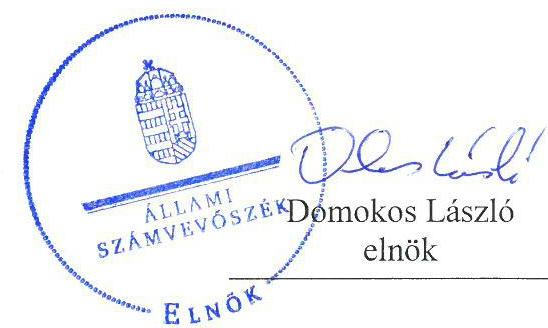
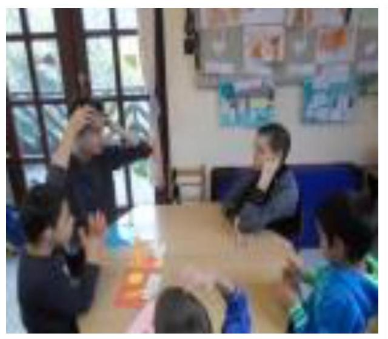

ÁLLAMI
SZÁMVEVŐSZÉK

# Jelentés 

## Nem állami humánszolgáltatók ellenőrzése

A humánszolgáltatást nyújtó államháztartáson kívüli köznevelési és szociális intézmények, szolgáltatók fenntartói központi költségvetésből kapott támogatásai felhasználásának ellenőrzése - Via Vita Veritas Alapítvány
2019.

---

# Jelentés 

## Nem állami humánszolgáltatók ellenőrzése

A humánszolgáltatást nyújtó államháztartáson kívüli köznevelési és szociális intézmények, szolgáltatók fenntartói központi költségvetésből kapott támogatásai felhasználásának ellenőrzése - Via Vita Veritas Alapítvány
2019. 05. hó 30. nap

---

# AZ ELLENŐRZÉST FELÜGYELTE:

## TÓTH MARIANNA felügyeleti vezető

## AZ ELLENŐRZÉST VEZETTE ÉS A VÉGREHAJTÁSÁÉRT FELELŐS:

### DR. PELLEI TAMÁS ellenőrzésvezető

### A PROGRAM ÖSSZEÁLLÍTÁSÁÉRT FELELŐS:

### TÓTPÁL SZABOLCS osztályvezető

---

**IKTATÓSZÁM:** EL-0743-022/2019.

**TÉMASZÁM:** 2448

**ELLENŐRZÉS-AZONOSÍTÓ SZÁM:** V079428

---

Jelentéseink az Országgyűlés számítógépes hálózatán és az Interneta a www.asz.hu címen is olvashatóak.

---

# TARTALOMJEGYZÉK 

■ ÖSSZEGZÉS ..... 5
■ AZ ELLENŐRZÉS CÉLJA ..... 6
■ AZ ELLENŐRZÉS TERÜLETE ..... 7
■ AZ ELLENŐRZÉS HÁTTERE, INDOKOLTSÁGA ..... 8
■ A JELENTÉS LÉNYEGES KÉRDÉSKÖRE ..... 9
■ AZ ELLENŐRZÉS HATÓKÖRE ÉS MÓDSZEREI ..... 10
■ MEGÁLLAPÍTÁSOK ..... 12
■ KÖVETKEZTETÉSEK ..... 13
■ MELLÉKLETEK ..... 15
I. sz. melléklet: Értelmező szótár ..... 15
■ FÜGGELÉKEK ..... 17
I. sz. függelék a Jelentéshez ..... 17
II. sz. függelék: Észrevételek ..... 18
■ RÖVIDÍTÉSEK JEGYZÉKE ..... 21

---

.

---

# ÖSSZEGZÉS 

A Via Vita Veritas Alapítvány intézményei müködtetéséhez felhasznált közpénzekre vonatkozó gazdálkodása nem volt elszámoltatható és átlátható.

## Az ellenőrzés társadalmi indokoltsága

Az Állami Számvevőszék stratégiájában célul tűzte ki, hogy az államháztartáson kívülre nyújtott költségvetési támogatások ellenőrzésével hozzájáruljon ahhoz, hogy a közpénzeket az államháztartáson kívüli szervezetek is átlátható módon használják fel a közfeladatok szerződésben vállalt ellátása érdekében.

Az Állami Számvevőszék stratégiájában hangsúlyos szerepet szán annak, hogy szilárd szakmai alapon álló, értékteremtő ellenőrzéseivel előmozdítsa a közpénzügyek átláthatóságát, rendezettségét és javaslataival a közpénzek és a közvagyon szabályos, gazdaságos, hatékony és eredményes felhasználását segítse. Az államháztartáson kívülre nyújtott költségvetési támogatások ellenőrzésével az Állami Számvevőszék hozzájárul ahhoz, hogy a közpénzeket a nem állami humán fenntartók átlátható módon használják fel a közfeladatok ellátására kötött szereződésekben vállalt kötelezettségek teljesítése érdekében.

Az ellenőrzés eredményeképpen a nyilvánosság és a szolgáltatást igénybe vevők megfelelő tájékoztatást kaphatnak az államháztartáson kívüli közfeladatot ellátók működéséről. A Via Vita Veritas Alapítványnál végzett ellenőrzést indokolja továbbá az is, hogy a humánszolgáltatási közfeladat ellátására az ellenőrzött időszakban 531 millió Ft központi költségvetési támogatásban részesült.

## Főbb megállapítások, következtetések

A Via Vita Veritas Alapítvány a 2014-2017. években nem rendelkezett a jogszabályban előírt számviteli politikával és annak keretében elkészítendő számviteli szabályzatokkal, ezáltal nem alakított ki szabályszerű működési és gazdálkodási környezetet. A szabályzatok hiánya miatt a pénzgazdálkodás felelős végrehajtása, a számviteli elszámolások szabályszerűsége, illetve a közpénzekkel való rendeltetésszerű és felelős gazdálkodás nem volt biztosított. A jogszabályokban előírt beszámolási kötelezettségének nem tett eleget. A költségvetési támogatásokat a Via Vita Veritas Alapítvány nem szabályszerűen használta fel.

Mindezek alapján a Via Vita Veritas Alapítvány nem biztosította a közfeladathoz biztosított költségvetési támogatások felhasználásának átláthatóságát, elszámoltathatóságát és az Alaptörvényben előírt átláthatóság elvének érvényesülését.

---

# AZ ELLENŐRZÉS CÉLJA

**AZ ELLENŐRZÉS CÉLJA** annak értékelése, hogy a nem állami, nem önkormányzati köznevelési és szociális intézmények fenntartói központi költségvetésből kapott támogatásainak felhasználása szabályszerű volt-e, a támogatások igénylése, évközi módosítása és év végi elszámolása megfelelte-e a jogszabályi előírásoknak.

---

# AZ ELLENŐRZÉS TERÜLETE 

## Via Vita Veritas Alapítvány

A Via Vita Veritas Alapítvány, mint fenntartó tevékenysége keretében kisgyermekes családok segítését, bölcsődei ellátás biztosítását, továbbá alap, közép és felsőfokú nevelési oktatási intézmény múködtetését végzi. Az Alapítvány irányítását háromtagú Kuratórium látja el, képviseletére a kuratórium egyik tagja jogosult.

Tevékenysége ellátására a 2014. évben 100 millió Ft, a 2015. évben 136 millió Ft, a 2016. évben 152 millió Ft és a 2017. évben 143 millió Ft támogatást kapott a költségvetésből.

A Fenntartó ${ }^{1}$ Pécsett három bölcsődét, továbbá egy integrációs nevelési, oktatási intézményt tart fenn.

---

# AZ ELLENŐRZÉS HÁTTERE, INDOKOLTSÁGA 

A köznevelési és szociális feladatokat ellátó nem állami intézményfenntartók részére közfeladataik ellátására évente jelentős összegű pénzügyi támogatást biztosítottak a mindenkori költségvetési törvények a bennük megfogalmazott feltételek mellett.

A köznevelési és szociális feladatokra felhasználható állami támogatások előirányzata 2014 - 2017. években 1049 Mrd Ft volt. A 2013. évben jelentős változások következtek be a normatív finanszírozás rendszerében. Az Országgyűlés elfogadta a nemzeti köznevelésről szóló 2011. évi CXC. törvényt, amely jelentősen átalakította a korábbi finanszírozási rendszert 2013 szeptemberétől. Módosították a szociális igazgatásról és szociális ellátásokról szóló 1993. évi III. törvényt is, amely többek között - 2012. január 1-jei hatállyal megfogalmazta a finanszírozási rendszerbe történő befogadással összefüggő szabályokat. Mindkét területen új feladatfinanszírozási forma (átlagbéralapú támogatás) jelent meg, amely az államháztartáson kívüli intézményfenntartókra is vonatkozik. Az ellenőrzés a finanszírozási rendszerben bekövetkezett változásokra, azok közfeladat ellátásra gyakorolt hatására fókuszált a költségvetési támogatásokat felhasználó államháztartáson kívüli szervezetek körében. Az ellenőrzés indokoltságát az is alátámasztotta, hogy az ÁSZ² még nem ellenőrizte átfogóan e területet.

Az ÁSZ stratégiájában foglaltak alapján is indokolt az ellenőrzés, amely a társadalom számára jelzi, hogy a közpénz államháztartáson kívüli felhasználása sem maradhat ellenőrizetlenül. Az államháztartáson kívülre nyújtott költségvetési támogatások ellenőrzésével az ÁSZ hozzájárul ahhoz, hogy a közpénzeket a nem állami fenntartók átlátható módon használják fel a közfeladatok ellátására kötött szerződésekben vállalt kötelezettségek teljesítése érdekében. Az ÁSZ az ellenőrzés javaslataival hozzájárulhat az említett rendszerek szabályszerű támogatásfelhasználásához, javíthatja a társadalmi-gazdasági döntések megalapozottságát, amely a „jól irányított állam" feltétele.

A holisztikus megközelítés jegyében az ellenőrzés keretében egyedi kockázatelemzés alapján kiválasztott fenntartóknál és intézményeiknél értékeljük az államháztartáson kívüli szociális tevékenységhez kapcsolódó támogatások felhasználásának megfelelőségét.

---

# A JELENTÉS LÉNYEGES KÉRDÉSKÖRE 

- A Fenntartó szabályszerű müködési és gazdálkodási környezet kialakításával megteremtette-e a költségvetési támogatások átlátható, elszámoltatható igénybevételének, felhasználásának feltételeit?

---

# AZ ELLENŐRZÉS HATÓKÖRE ÉS MÓDSZEREI 

## Az ellenőrzés típusa

Megfelelőségi ellenőrzés.

## Az ellenőrzött időszak

A 2014. január 1-je és 2017. december 31-e közötti időszak azon évei, amelyben nem állami, nem önkormányzati fenntartó - köznevelési, szociális - közfeladat-ellátásra az államháztartásból támogatást kapott és/vagy használt fel.

## Az ellenőrzés tárgya

Az ellenőrzés a köznevelési és szociális humánszolgáltatási közfeladatokat ellátó államháztartáson kívüli fenntartók, humánszolgáltatási közfeladatai ellátásához a költségvetési törvényekben biztosított központi költségvetési támogatások igénylése, évközi módosítása és év végi elszámolása fenntartói feladatainak ellátása, illetve e központi költségvetésből kapott támogatásaik humánszolgáltatási közfeladatokra való fenntartó általi felhasználása szabályszerűségének értékelésére terjed ki.

## Az ellenőrzött szervezet

Via Vita Veritas Alapítvány

## Az ellenőrzés jogalapja

Az ellenőrzés jogszabályi alapját az ÁSZ tv. ${ }^{3} 1 . \S$ (3) bekezdése, valamint az 5. § (3) bekezdésében foglalt előírások adják.

## Az ellenőrzés módszerei

Az ellenőrzést az ellenőrzési program szempontjai, kérdései, az ellenőrzött időszakban hatályos jogszabályok alapján, a nemzetközi standardokat irányadónak tekintve, az ellenőrzés szakmai szabályok és módszertanok figyelembe vételével végezte az ÁSZ. A közpénzekkel való felelős gazdálkodás segítésére irányuló javaslatok kidolgozásakor a hatályos jogszabályok az irányadóak.

---

Az ellenőrzés ideje alatt az ellenőrzött szervezettel történő kapcsolattartást az ÁSZ SZMSZ²-ének vonatkozó előírásai alapján biztosította az ÁSZ.

Az ellenőrzési kérdések megválaszolásához szükséges bizonyítékok megszerzése az ellenőrzött által rendelkezésre bocsátott dokumentumokra, adatokra alapozva megfigyelés, szemle (szemrevételezés), kérdésfeltevés (információkérés), valamint elemző eljárással történt. Az ellenőrzési bizonyítékként felhasználható adatforrások közé tartoznak egyrészt az ellenőrzési program részletes szempontjainál felsorolt adatforrások, másrészt minden - az ellenőrzés folyamán feltárt, az ellenőrzés szempontjából információt tartalmazó dokumentum.

Amennyiben a Fenntartó múködését és gazdálkodását alapvetően meghatározó dokumentum hiánya miatt, valamely lényeges kérdéskörre vonatkozóan az ÁSZ megállapítást tett, további ellenőrzési tevékenységek az adott kérdéskörrel és az azzal szoros logikai kapcsolatban lévő kérdéskörökkel - ráépülő jelleggel - nem kerültek végrehajtásra.

---

# MEGÁLLAPÍTÁSOK 

## 1. A Fenntartó szabályszerű múködési és gazdálkodási környezet kialakításával megteremtette-e a költségvetési támogatások átlátható, elszámoltatható igénybevételének, felhasználásának feltételeit?

Összegző megállapítás

A költségvetési támogatások átlátható, elszámoltatható igénybevételének és felhasználásának feltételeit a Fenntartó nem teremtette meg. A közpénzekkel való gazdálkodása nem volt elszámoltatható, átlátható.

A Fenntartó múködésének szabályozottsága, ennek keretében a gazdálkodására vonatkozó belső szabályozás nem felelt meg az előírásoknak, mivel a Fenntartó 2014-2017. években nem rendelkezett a Számv. tv. ${ }^{5}$ 14. § (3) bekezdésében előírt számviteli politikával és a Számv. tv. 14. § (5) a)-b) és d) pontjaiban előírt az eszközök és a források leltárkészítési és leltározási szabályzatával, az eszközök és a források értékelési szabályzatával, továbbá pénzkezelési szabályzattal.

A Fenntartó a jogszabályokban előírt beszámolási kötelezettségének a Civilszr ${ }_{1}{ }^{6} 6 . \S$ (1) bekezdésében és Civilszr ${ }_{2}{ }^{7} 7 . \S$ (1) bekezdésében foglaltak ellenére nem tett eleget.

---

# KÖVETKEZTETÉSEK 

Az ÁSZ tv. 32. § (1) bekezdésében foglaltak értelmében az ÁSZ jelentés tartalmazza a feltárt tényeket, az ezeken alapuló megállapításokat, következtetéseket, amelyeknek a 24. § (1) bekezdés d) pontja szerint okszerünek és megalapozottnak kell lenniük.

A Via Vita Veritas Alapítvány, mint intézményfenntartó azáltal, hogy nem rendelkezett számviteli politikával és az annak a keretén belül elkészítendő számviteli szabályzatokkal, a szabályszerű müködési és gazdálkodási környezetet nem alakította ki. Ezzel nem voltak biztosítottak a központi költségvetésből kapott támogatások átlátható és elszámoltatható igénybevételének és felhasználásának feltételei. A jogszabályban előirt beszámolási kötelezettségének nem tett eleget. Mindez alapján nem biztosította az Alaptörvényben előirt átláthatóság elvének érvényesülését.

---

.

---

# MELLÉKLETEK 

- I. SZ. MELLÉKLET: ÉRTELMEZŐ SZÓTÁR
költségvetési támogatás
nem állami, nem önkormányzati (államháztartáson kívüli) intézmény fenntartó
a társadalombiztosítás pénzügyi alapjai kivételével az államháztartás központi alrendszeréből ellenérték nélkül, pénzben nyújtott támogatások (Áht. 1. § 14. pont) A költségvetési törvényekben (2013. évi CCXXX. törvény 33-34. §, 2014. évi C. törvény 42-43. §, 2015. évi C. törvény 40-41. §) megállapított támogatás. Például a 2015. évi C. törvény 40-41. § szerint többek között: Az Országgyűlés a szociális, gyermekjóléti, gyermekvédelmi közfeladatot ellátó intézményt, szolgáltatást fenntartó egyházi jogi személy, civil szervezet, közalapítvány, országos nemzetiségi önkormányzat, települési vagy területi nemzetiségi önkormányzat, gazdasági társaság, és a humánszolgáltatást alaptevékenységként végző, az Szja tv. hatálya alá tartozó egyéni vállalkozó (a továbbiakban együtt: nem állami szociális fenntartó) részére támogatást állapít meg a következők szerint: a támogatás a nem állami szociális fenntartót a települési önkormányzatok 2. melléklet III. pont 3. alpont c)-k) pontjában és III. pont 5. alpont a) pontjában meghatározott támogatásaival azonos jogcímeken, összegben és feltételek mellett illeti meg.
A szociális, gyermekjóléti és gyermekvédelmi közfeladatokat /humánszolgáltatásokat ellátó intézményt fenntartó egyházi jogi személy, társadalmi szervezet, alapítvány, közalapítvány, civil szervezet, országos nemzetiségi önkormányzat, nonprofit gazdasági társaság, gazdasági társaság és a humánszolgáltatást alaptevékenységként végző, Szja tv. hatálya alá tartozó egyéni vállalkozó. (2013. évi Kvtv. 35. § (1), (3) bekezdés, 2014. évi Kvtv. 33. §, 34. § (1), (4) bekezdés, 2015. évi Kvtv. 42. §, 43. § (1), (4) bekezdés, 2016. évi Kvtv. 40. §, 41. § (1), (4) bekezdés, 2017. évi Kvtv. 41. § (1), (4))

---

.

---

# FÜGGELÉKEK 

- I. SZ. FÜGGELÉK A JELENTÉSHEZ

Az Állami Számvevőszék az ellenőrzések során feltárt tényekhez kapcsolódó további körülmények tisztázására eszközrendszerrel nem rendelkezik. Amennyiben az ellenőrzésen túlmutatóan indokoltnak látszik az ellenőrzés során feltárt körülmények további vizsgálata, az Állami Számvevőszék törvényi felhatalmazás alapján az ellenőrzés által feltárt körülményeket továbbítja a hatáskörrel rendelkező szervnek a szükséges intézkedések megtétele, eljárások lefolytatása érdekében.
I. A Fenntartó 2014-2017. évekre vonatkozóan nem rendelkezett a Számv.tv. 14. § (3) bekezdés és 14. § (5) bekezdés a)-b) és d) pontjaiban elöirt számviteli politikával és az annak keretében elkészítendő, az eszközök és a források leltárkészittési és leltározási szabályzatával, az eszközök és a források értékelési szabályzatával, valamint pénzkezelési szabályzattal. A számviteli szabályzatok hiánya miatt felmerül a számviteli elszámolások szabályszerütlensége. A jogszabályokban elöirt beszámolási kötelezettségének a Civilszr ${ }_{1}$ 6. § (1) bekezdésében és Civilszr ${ }_{2}$ 7. § (1) bekezdésében foglaltak ellenére nem tett eleget.
A számviteli beszámolók hiányában nem érvényesül a Számv. tv. 4. § (1) bekezdésében rögzített megbizható és valós vagyoni helyzet bemutatásának követelménye.
Az eset összes körülményeinek felderitésére az adóhatóság rendelkezik hatáskörrel.
II. A számviteli szabályzatok hiányában a fenntartó nem igazolta, hogy a költségvetési támogatások összegét a köznevelési és szociális feladatellátására használta fel.
Az eset összes körülményeinek felderítésére a Magyar Államkincstár rendelkezik hatáskörrel.

---

A jelentéstervezetet a Számvevőszék 15 napos észrevételezésre megküldte az ellenőrzött szervezetek vezetőinek az ÁSZ tv. 29. §̊ (1) bekezdése előirásának megfelelően.

Az ÁSZ a jelentéstervezetet a Via Vita Veritas Alapítvány képviselőjének küldte meg. A Via Vita Veritas Alapítvány kuratóriumi elnöke a jelentéstervezet megállapításaira írásban észrevételt tett.
Az ÁSZ tv. 29. § (3) bekezdésével összhangban az ÁSZ a Függelékben feltünteti az ellenőrzés megállapításaival kapcsolatban tett, figyelembe nem vett észrevételeket, és megindokolja, hogy azokat miért nem fogadta el.

[^0]
[^0]:    * 29. § (1) Az Állami Számvevőszék az ellenőrzési megállapításait megküldi az ellenőrzött szervezet vezetőjének vagy az általa megbízott személynek, és annak, akinek személyes felelősségét állapította meg.
    (2) Az ellenőrzött szervezet vezetője és a felelősként megjelölt személy az ellenőrzés megállapításaira tizenöt napon belül írásban észrevételt tehet.
    (3) Az Állami Számvevőszék az észrevételre a beérkezésétől számított harminc napon belül írásban válaszol. A figyelembe nem vett észrevételeket köteles a jelentésben feltüntetni, és megindokolni, hogy azokat miért nem fogadta el.

---

A Via Vita Veritas Alapítvány kuratórium elnökének 2019. április 29-én írt (az Állami Számvevőszékhez 2019. május 6-án érkezett) levelében a jelentéstervezet megállapításaival kapcsolatban tett, figyelembe nem vett észrevételek és azok indokolása.

Az ellenőrzött szervezet vezetője észrevételt tett a jelentéstervezetben megfogalmazott - a számviteli politikával, a beszámolási kötelezettséggel, illetve a költségvetési támogatások felhasználásával kapcsolatos - megállapításokra.
A 2019. április 29-én kelt levélben tett észrevételeket nem fogadtuk el. Az Állami Számvevőszék a 2018. augusztus 3-án kelt, EL-743-002/2018. iktatószámú adatbekérő levelében bekérte a Via Vita Veritas Alapítványtól az ellenőrzési programban meghatározott adatokat, dokumentumokat. A visszaérkezett tértivevény alapján a Via Vita Veritas Alapítvány az adatbekérő levelet 2018. augusztus 14-én átvette. Ezt követően az Állami Számvevőszék az adatbekérési felületet megnyitotta, és a felület az Állami Számvevőszékről szóló 2011. évi LXVI. törvényben meghatározott határideig nyitva állt a dokumentumok feltöltésére. Ezen időszak alatt a Via Vita Veritas Alapítvány semmilyen dokumentumot nem töltött fel és papír alapon sem küldte be a kért dokumentumokat.
Fentiekre tekintettel a jelentéstervezet megállapításainak módosítása, törlése nem indokolt.

---

.

---

# RÖVIDÍTÉSEK JEGYZÉKE 

${ }^{1}$ Fenntartó
${ }^{2}$ ÁSZ
${ }^{3}$ ÁSZ tv
${ }^{4}$ ÁSZ SZMSZ
${ }^{5}$ Számv. tv.
${ }^{6}$ Civilszr ${ }_{1}$
${ }^{7}$ Civilszr $r_{2}$

Via Vita Veritas Alapítvány
Állami Számvevőszék
Az Állami Számvevőszékről szóló 2011. évi LXVI. törvény
Állami Számvevőszék Szervezeti és Müködési Szabályzata
A számvitelről szóló 2000. évi C. törvény (hatályos: 2001. január 1-jétől)
Az egyes egyéb szervezetek beszámoló készítési és könyvvezetési
kötelezettségének sajátosságairól 224/2000. (XII. 19.) Korm. rendelet (hatályos: 2016. december 31-ig)

A számviteli törvény szerinti egyes egyéb szervezetek beszámoló készítési és
könyvvezetési kötelezettségének sajátosságairól szóló 479/2016. (XII. 28.) Korm. rendelet (hatályos: 2017. január 1-jétől)

---

ÁLLAMI SZÁMVEVŐSZÉK
1052 Budapest, Apáczai Csere János utca 10.
Levélcím: 1364 Budapest 4. Pf. 54
Telefon: +36 14849100 Telefax: +36 14849200
www.asz.hu