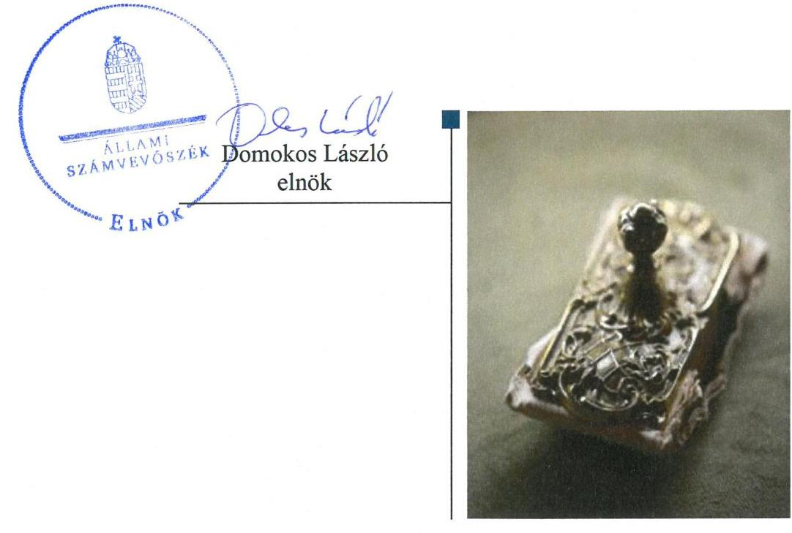
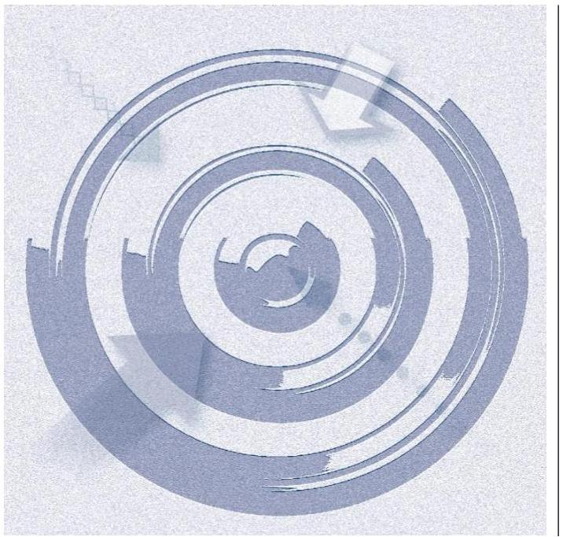
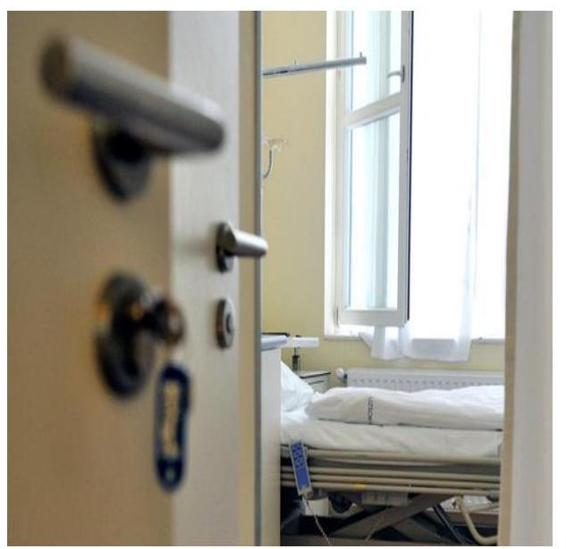
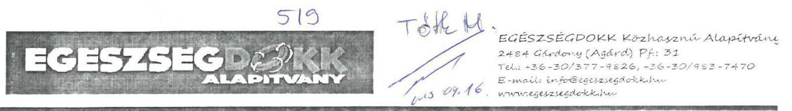
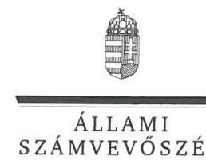
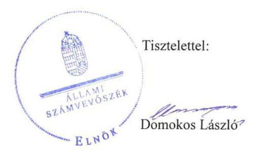

# Jelenetés 

## Nem állami humánszolgáltatók ellenőrzése

A humánszolgáltatást nyújtó államháztartáson kívüli szociális intézmények, szolgáltatók fenntartói központi költségvetésből kapott támogatásai felhasználásának ellenőrzése „EGÉSZSÉGDOKK" Közhasznú Alapítvány 2019.

19089
www.asz.hu

---

# Jelentés 

## Nem állami humánszolgáltatók ellenőrzése

A humánszolgáltatást nyújtó államháztartáson kívüli szociális intézmények, szolgáltatók fenntartói központi költségvetésből kapott támogatásai felhasználásának ellenőrzése „EGÉSZSÉGDOKK" Közhasznú Alapítvány 2019. 05. hó 30. nap

---

# AZ ELLENŐRZÉST FELÜGYELTE: 

TÓTH MARIANNA felügyeleti vezető

## AZ ELLENŐRZÉST VEZETTE ÉS A VÉGREHAJTÁSÁÉRT FELELŐS:

DR. PELLEI TAMÁS ellenőrzésvezető

## A PROGRAM ÖSSZEÁLLÍTÁSÁÉRT FELELŐS:

TÓTPÁL SZABOLCS osztályvezető

IKTATÓSZÁM: EL-1235-027/2019.
TÉMASZÁM: 2491
ELLENŐRZÉS-AZONOSÍTÓ SZÁM: V083555

---

# TARTALOMJEGYZÉK 

■ ÖSSZEGZÉS ..... 5
■ AZ ELLENŐRZÉS CÉLJA ..... 6
■ AZ ELLENŐRZÉS TERÜLETE ..... 7
■ AZ ELLENŐRZÉS HÁTTERE, INDOKOLTSÁGA ..... 8
■ A JELENTÉS LÉNYEGES KÉRDÉSKÖRE ..... 9
■ AZ ELLENŐRZÉS HATÓKÖRE ÉS MÓDSZEREI ..... 10
■ MEGÁLLAPÍTÁSOK ..... 12
■ KÖVETKEZTETÉSEK ..... 13
■ MELLÉKLETEK ..... 15
I. sz. melléklet: Értelmező szótár ..... 15
■ FÜGGELÉKEK ..... 17
I. sz. függelék a Jelentéshez ..... 17
II. sz. függelék: Észrevételek ..... 18
■ RÖVIDÍTÉSEK JEGYZÉKE ..... 23

---

.

---

# ÖSSZEGZÉS 

Az „EGÉSZSÉGDOKK" Közhasznú Alapítvány intézményei müködtetéséhez felhasznált közpénzekkel való gazdálkodása nem volt elszámoltatható és átlátható.

## Az ellenőrzés társadalmi indokoltsága

Az Állami Számvevőszék stratégiájában célul tűzte ki, hogy az államháztartáson kívülre nyújtott költségvetési támogatások ellenőrzésével hozzájáruljon ahhoz, hogy a közpénzeket az államháztartáson kívüli szervezetek is átlátható módon használják fel a közfeladatok szerződésben vállalt ellátása érdekében. Tekintettel az elmúlt években a szociális területet érintő finanszírozási változásokra a társadalom fokozott érdeklődéssel figyeli a szociális feladatokra fordított források felhasználását. Fontos a közvéleményt biztosítani arról, hogy a közpénz államháztartáson kívüli felhasználása ezen a területen sem marad ellenőrietlenül. Az ellenőrzés eredményeképpen a nyilvánosság és a szolgáltatást igénybe vevők megfelelő tájékoztatást kaphatnak az államháztartáson kívüli közfeladatot ellátók működéséről.

Az „EGÉSZSÉGDOKK" Közhasznú Alapítványnál végzett ellenőrzést indokolja az is, hogy a humánszolgáltatási közfeladat ellátására az ellenőrzött időszakban 194 millió Ft központi költségvetési támogatásban részesült.

## Főbb megállapítások, következtetések

Az „EGÉSZSÉGDOKK" Közhasznú Alapítvány a 2015-2017. években nem rendelkezett a jogszabályban előírt számviteli politikával és annak keretében elkészítendő számviteli szabályzatokkal, ezáltal nem alakított ki szabályszerű múködési és gazdálkodási környezetet. A szabályzatok hiánya miatt a pénzgazdálkodás felelős végrehajtása, a számviteli elszámolások szabályszerűsége, illetve a közpénzekkel való rendeltetésszerű és felelős gazdálkodás nem volt biztosított. A jogszabályokban előírt beszámolási kötelezettségének nem tett eleget. A költségvetési támogatásokat az „EGÉSZSÉGDOKK" Közhasznú Alapítvány nem szabályszerűen használta fel.

Mindezek alapján az „EGÉSZSÉGDOKK" Közhasznú Alapítvány nem biztosította a közfeladathoz biztosított költségvetési támogatások felhasználásának átláthatóságát, elszámoltathatóságát és az Alaptörvényben előírt átláthatóság elvének érvényesülését.

---

# AZ ELLENŐRZÉS CÉLJA 

AZ ELLENŐRZÉS CÉLJA annak értékelése, hogy a nem állami, nem önkormányzati szociális intézmények fenntartói központi költségvetésből kapott támogatásainak felhasználása szabályszerű volt-e, a támogatások igénylése, évközi módosítása és év végi elszámolása megfelelt-e a jogszabályi előírásoknak.

---

# **AZ ELLENŐRZÉS TERÜLETE**

## **"EGÉSZSÉGDOKK" Közhasznú Alapítvány**

Az **"EGÉSZSÉGDOKK" Közhasznú Alapítvány**, mint fenntartó közhasznú tevékenysége keretében szenvedélybetegek addiktológiai és egészségügyi ellátását járóbeteg gondozás alapján, továbbá szenvedélybetegek nappali és bentlakásos ellátását végzi. A Fenntartó irányítását öttagú Kuratórium látja el, képviseletére a kuratórium elnöke jogosult.

Tevékenysége ellátására a 2015. évben 51 millió a 2016. évben 71 millió és a 2017. évben 72 millió Ft támogatást kapott a költségvetésből.

A Fenntartó Székesfehérváron és Kiskunfélegyházán egyegy intézményt tart fenn.

---

# AZ ELLENŐRZÉS HÁTTERE, INDOKOLTSÁGA 

A szociális feladatokat ellátó nem állami intézményfenntartók részére közfeladataik ellátására évente jelentős összegű pénzügyi támogatást biztosítottak a mindenkori költségvetési törvények a bennük megfogalmazott feltételek mellett. A felhasználható állami támogatások a Kvtv.-ekben (a 2014. évi C. törvény Magyarország 2015. évi központi költségvetéséről, 2015. évi C. törvény Magyarország 2016. évi központi költségvetéséről, 2016. évi XC. törvény Magyarország 2017. évi központi költségvetéséről) a 2015-2017. években a szociális ágazatra vonatkozóan 273 Mrd Ft előirányzatot határoztak meg. Módosították a szociális igazgatásról és szociális ellátásokról szóló 1993. évi III. törvényt, amely többek között - 2012. január 1-jei hatállyal megfogalmazta a finanszírozási rendszerbe történő befogadással összefüggő szabályokat.

Az ÁSZ ${ }^{2}$ stratégiájában foglaltak alapján is indokolt az ellenőrzés, amely a társadalom számára jelzi, hogy a közpénz államháztartáson kívüli felhasználása sem maradhat ellenőrizetlenül. Az államháztartáson kívülre nyújtott költségvetési támogatások ellenőrzésével az ÁSZ hozzájárul ahhoz, hogy a közpénzeket a nem állami humán fenntartók átlátható módon használják fel a közfeladatok ellátására kötött szerződésekben vállalt kötelezettségek teljesítése érdekében. Az ellenőrzés javaslataival hozzájárulhat az említett rendszerek szabályszerű támogatás felhasználásához, javíthatja a társadalmi-gazdasági döntések megalapozottságát, amely a „jól irányított állam" működéséhez járul hozzá.

A holisztikus megközelítés jegyében az ellenőrzés keretében egyedi kockázatelemzés alapján kiválasztott fenntartóknál és intézményeiknél értékeljük az államháztartáson kívüli szociális tevékenységhez kapcsolódó támogatások felhasználásának megfelelőségét.

---

# A JELENTÉS LÉNYEGES KÉRDÉSKÖRE 

- A Fenntartó szabályszerű müködési és gazdálkodási környezet kialakításával megteremtette-e a költségvetési támogatások átlátható, elszámoltatható igénybevételének, felhasználásának feltételeit?

---

# AZ ELLENŐRZÉS HATÓKÖRE ÉS MÓDSZEREI 

## Az ellenőrzés típusa

Megfelelőségi ellenőrzés.

## Az ellenőrzött időszak

A 2015. január 1-je és 2017. december 31-e közötti időszak azon évei, amelyben nem állami, nem önkormányzati fenntartó - szociális -közfeladat-ellátásra az államháztartásból támogatást kapott és/vagy használt fel.

## Az ellenőrzés tárgya

Az ellenőrzés a szociális humánszolgáltatási közfeladatokat ellátó államháztartáson kívüli fenntartók, humánszolgáltatási közfeladatai ellátásához a költségvetési törvényekben biztosított központi költségvetési támogatások igénylése, évközi módosítása és év végi elszámolása fenntartói feladatainak ellátása, illetve e központi költségvetésből kapott támogatásaik humánszolgáltatási közfeladatokra való fenntartó általi felhasználása szabályszerűségének értékelésére terjed ki.

## Az ellenőrzött szervezet

$\longrightarrow$ „EGÉSZSÉGDOKK" Közhasznú Alapítvány

## Az ellenőrzés jogalapja

Az ellenőrzés jogszabályi alapját az ÁSZ tv. ${ }^{3}$ 1. § (3) bekezdése, 5. § (3) bekezdésében foglalt előírások adják.

## Az ellenőrzés módszerei

Az ellenőrzést az ellenőrzési program szempontjai, kérdései, az ellenőrzött időszakban hatályos jogszabályok alapján, a nemzetközi standardokat irányadónak tekintve, az ellenőrzés szakmai szabályok és módszertanok figyelembe vételével végezte az ÁSZ. A közpénzekkel való felelős gazdálkodás segítésére irányuló javaslatok kidolgozásakor a hatályos jogszabályok az irányadóak.

---

Az ellenőrzés ideje alatt az ellenőrzött szervezettel történő kapcsolattartást az ÁSZ SZMSZ²-ének vonatkozó előírásai alapján biztosította az ÁSZ.

Az ellenőrzési kérdések megválaszolásához szükséges bizonyítékok megszerzése az ellenőrzött által rendelkezésre bocsátott dokumentumokra, adatokra alapozva megfigyelés, szemle (szemrevételezés), kérdésfeltevés (információkérés), valamint elemző eljárással történt. Az ellenőrzési bizonyítékként felhasználható adatforrások közé tartoznak egyrészt az ellenőrzési program részletes szempontjainál felsorolt adatforrások, másrészt minden - az ellenőrzés folyamán feltárt, az ellenőrzés szempontjából információt tartalmazó dokumentum.

Amennyiben a Fenntartó múködését és gazdálkodását alapvetően meghatározó dokumentum hiánya miatt, valamely lényeges kérdéskörre vonatkozóan az ÁSZ megállapítást tett, további ellenőrzési tevékenységek az adott kérdéskörrel és az azzal szoros logikai kapcsolatban lévő kérdéskörökkel - ráépülő jelleggel - nem kerültek végrehajtásra.

---

# MEGÁLLAPÍTÁSOK 

## 1. A Fenntartó szabályszerű múködési és gazdálkodási környezet kialakításával megteremtette-e a költségvetési támogatások átlátható, elszámoltatható igénybevételének, felhasználásának feltételeit?

Összegző megállapítás

A költségvetési támogatások átlátható, elszámoltatható igénybevételének és felhasználásának feltételeit a Fenntartó nem teremtette meg. A közpénzekkel való gazdálkodása nem volt elszámoltatható, átlátható.

A Fenntartó múködésének szabályozottsága, ennek keretében a gazdálkodására vonatkozó belső szabályozás nem felelt meg a jogszabályi előírásoknak, mivel a Fenntartó 2015-2017. években nem rendelkezett a Számv. tv. ${ }^{5}$ 14. § (3) bekezdésében előírt számviteli politikával és a Számv. tv. 14. § (5) a)-b) és d) pontjaiban előírt az eszközök és a források leltárkészítési és leltározási szabályzatával, az eszközök és a források értékelési szabályzatával, továbbá pénzkezelési szabályzattal.

A Fenntartó a beszámolási kötelezettségének a Civilszr ${ }_{1}{ }^{6}$ 6. § (1) bekezdésében és Civilszr ${ }_{2}{ }^{7}$ 7. § (1) bekezdésében foglaltak ellenére nem tett eleget.

---

# KÖVETKEZTETÉSEK 

Az ÁSZ tv. 32. § (1) bekezdésében foglaltak értelmében az ÁSZ jelentés tartalmazza a feltárt tényeket, az ezeken alapuló megállapításokat, következtetéseket, amelyeknek a 24. § (1) bekezdés d) pontja szerint okszerünek és megalapozottnak kell lenniük.
Az „Egészségdokk" Közhasznú Alapítvány, mint intézményfenntartó azáltal, hogy nem rendelkezett számviteli politikával és az annak a keretén belül elkészítendő számviteli szabályzatokkal a szabályszerű müködési és gazdálkodási környezetet nem alakította ki. Ezzel nem voltak biztosítottak a központi költségvetésből kapott támogatások átlátható és elszámoltatható igénybevételének és felhasználásának feltételei. A jogszabályban előirt beszámolási kötelezettségének nem tett eleget. Mindez alapján nem biztosította az Alaptörvényben előirt átláthatóság elvének érvényesülését.

---

.

---

# MELLÉKLETEK 

- I. SZ. MELLÉKLET: ÉRTELMEZŐ SZÓTÁR
költségvetési támogatás a társadalombiztosítás pénzügyi alapjai kivételével az államháztartás központi alrendszeréből ellenérték nélkül, pénzben nyújtott támogatások (Áht. 1. § 14. pont) A költségvetési törvényekben (2013. évi CCXXX. törvény 33-34. §, 2014. évi C. törvény 42-43. §, 2015. évi C. törvény 40-41. §) megállapított támogatás. Például a 2015. évi C. törvény 40-41. § szerint többek között: Az Országgyűlés a szociális, gyermekjóléti, gyermekvédelmi közfeladatot ellátó intézményt, szolgáltatást fenntartó egyházi jogi személy, civil szervezet, közalapítvány, országos nemzetiségi önkormányzat, települési vagy területi nemzetiségi önkormányzat, gazdasági társaság, és a humánszolgáltatást alaptevékenységként végző, az Szja tv. hatálya alá tartozó egyéni vállalkozó (a továbbiakban együtt: nem állami szociális fenntartó) részére támogatást állapít meg a következők szerint: a támogatás a nem állami szociális fenntartót a települési önkormányzatok 2. melléklet III. pont 3. alpont c)-k) pontjában és III. pont 5. alpont a) pontjában meghatározott támogatásaival azonos jogcímeken, összegben és feltételek mellett illeti meg.
nem állami, nem önkormányzati (államháztartáson kívüli) intézmény fenntartó

A szociális, gyermekjóléti és gyermekvédelmi közfeladatokat /humánszolgáltatásokat ellátó intézményt fenntartó egyházi jogi személy, társadalmi szervezet, alapítvány, közalapítvány, civil szervezet, országos nemzetiségi önkormányzat, nonprofit gazdasági társaság, gazdasági társaság és a humánszolgáltatást alaptevékenységként végző, Szja tv. hatálya alá tartozó egyéni vállalkozó. (2013. évi Kvtv. 35. § (1), (3) bekezdés, 2014. évi Kvtv. 33. §, 34. § (1), (4) bekezdés, 2015. évi Kvtv. 42. §, 43. § (1), (4) bekezdés, 2016. évi Kvtv. 40. §, 41. § (1), (4) bekezdés, 2017. évi Kvtv. 41. § (1), (4))

---

.

---

# FÜGGELÉKEK 

- I. SZ. FÜGGELÉK A JELENTÉSHEZ

Az Állami Számvevőszék az ellenőrzések során feltárt tényekhez kapcsolódó további körülmények tisztázására eszközrendszerrel nem rendelkezik. Amennyiben az ellenőrzésen túlmutatóan indokoltnak látszik az ellenőrzés során feltárt körülmények további vizsgálata, az Állami Számvevőszék törvényi felhatalmazás alapján az ellenőrzés által feltárt körülményeket továbbítja a hatáskörrel rendelkező szervnek a szükséges intézkedések megtétele, eljárások lefolytatása érdekében.
I. A Fenntartó 2015-2017. évekre vonatkozóan nem rendelkezett a Számv.tv. 14. § (3) bekezdés és 14.§ (5) bekezdés a) - b) és d) pontjaiban elöirt számviteli politikával és az annak keretében elkészítendő, az eszközök és a források leltárkészittési és leltározási szabályzatával, az eszközök és a források értékelési szabályzatával, valamint pénzkezelési szabályzattal. A számviteli szabályzatok hiánya miatt felmerül a számviteli elszámolások szabályszerütlensége. A jogszabályokban elöirt beszámolási kötelezettségének a Civilszr ${ }_{1}$ 6. § (1) bekezdésében és Civilszr ${ }_{2}$ 7. § (1) bekezdésében foglaltak ellenére nem tett eleget.
A számviteli beszámolók hiányában nem érvényesül a Számv. tv. 4. § (1) bekezdésében rögzített megbizható és valós vagyoni helyzet bemutatásának követelménye.
Az eset összes körülményeinek felderitésére az adóhatóság rendelkezik hatáskörrel.
II. A számviteli szabályzatok hiányában a fenntartó nem igazolta, hogy a költségvetési támogatások összegét a szociális feladatellátására használta fel.
Az eset összes körülményeinek felderitésére a Magyar Államkincstár rendelkezik hatáskörrel.

---

A jelentéstervezetet a Számvevőszék 15 napos észrevételezésre megküldte az ellenőrzött szervezet vezetőjének az ÁSZ tv. 29. §* (1) bekezdése előírásának megfelelően.

Az ÁSZ a jelentéstervezetet az "EGÉSZSÉGDOKK" Közhasznú Alapítvány kuratóriumi elnökének küldte meg. Az „EGÉSZSÉGDOKK" Közhasznú Alapítvány kuratóriumi elnöke a jelentéstervezet megállapításaira írásban észrevételt tett.
Az ÁSZ tv. 29. § (3) bekezdésével összhangban az ÁSZ a Függelékben feltünteti az ellenőrzés megállapításaival kapcsolatban tett, figyelembe nem vett észrevételeket, és megindokolja, hogy azokat miért nem fogadta el.

[^0]
[^0]:    * 29. § (1) Az Állami Számvevőszék az ellenőrzési megállapításait megküldi az ellenőrzött szervezet vezetőjének vagy az általa megbízott személynek, és annak, akinek személyes felelősségét állapította meg.
    (2) Az ellenőrzött szervezet vezetője és a felelősként megjelölt személy az ellenőrzés megállapításaira tizenöt napon belül írásban észrevételt tehet.
    (3) Az Állami Számvevőszék az észrevételre a beérkezésétől számított harminc napon belül írásban válaszol. A figyelembe nem vett észrevételeket köteles a jelentésben feltüntetni, és megindokolni, hogy azokat miért nem fogadta el.

---

ÁLLAMI SZÁMVEVŐSZÉK
1052 Budapest
Apáczai Csere János utca 10.

Tisztelt Domokos László Úr !

Hivatkozva 2019.04 01-én átvett EL-1235-017/2019. iktatószámú levelére az alábbi észrevételt teszem:

2018 október 24-én érkezett az adatbekérési projekt levelük, amely a „Nem állami humánszolgáltatók ellenőrzéséről szólt. A levélben leírtak alapján be is jelentkeztünk 2018.10.25-én az Önök által előírt felületre, de sajnos már feltölteni nem tudtuk a kért iratanyagot, mivel az 5 nap időközben lejárt.

Ebben az időszakban voltak a munkanap áthelyezések, telefonon is és levélben is jeleztünk kértük a felület ismételt megnyitását.

2018. december 05-én székhelyünkön helyszíni adatbetekintés tárgyában az ÁSZ képviselői megjelentek amiről jegyzőkönyv készült.

Az Egészségdokk Közhasznú Alapítvány a vizsgált időszakokra is rendelkezett és rendelkezik a jogszabályban előírt számviteli politikával, számviteli szabályzatokkal és minden olyan jogszabályban előírt szabályzatokkal és engedélyekkel, mely az alapítvány működéséhez elengedhetetlen.

Szervezetünk 2009. december 31-én bejegyzett közhasznú alapítvány.

Az EGÉSZSÉGDOKK Közhasznú Alapítvány által fenntartott intézmények:

- EGÉSZSÉGDOKK Addiktológiai Serdülő Krizis Centrum (8000 Székesfehérvár, Mártírok útja 2)
- VÁLASZ Szenvedélybeteg-segitő és Drogprevenciós Központ (6100 Kiskunfélegyháza, Jókai u.30.)
- EGÉSZSÉGDOKK Közösségi és Pszichiátriai Szolgálat (2400 Dunaújváros, Gagarin tér 11.)
- TÁMOGATOTT LAKHATÁS (Gárdonyban, Kiskunfélegyházán, (Székesfehérváron és Budapesten)

Intézményeinkben jelenleg több mint 200 fő szenvedélybeteg-elsősorban drogfüggő és politoxikomán - - ellátás folyik. 2013 nyarától felnőtt, 2017 júniusától pedig gyermek és ifjúsági addiktológiai ellátás is működik addiktológiai-járóbeteg szakellátás és gondozási keretek között.

Alapítványunk a Magyar Államkincstár által támogatott szervezet (Emberi Erőforrások Minisztériuma) így ennek megfelelően minden második évben ellenőrzik az általunk megigényelt és kiutalt normatíva felhasználását. Jelen levelünk mellékleteként küldjük a 2014-2016 év ellenőrzésének jegyzőkönyveit, melyek 2015-2017-ben történtek. Az elmúlt napokban 2019.04.08-04.11-ig a 2018 évet ellenőrizték. Az ellenőrzések során az összes szabályzatunkat is ellenőrzik, hogy megfelelő vagy sem az előírt jogszabályoknak.

Ezen felül a szakhatóságok is évente ellenőrzik Alapítványunk működését.

Kérném a fentiekben leírt észrevételemet figyelembe venni.

Gárdony, 2019. április 12.

Tisztelettel:

Baldsik-Tangás Zsolt, kuratórium elnöke

---

ELNÖK

Ikt.szám: EL-1235-024/2019.

# Balcsik-Tamás Zsolt 

kuratórium elnöke
„EGÉSZSÉGDOKK" Közhasznú Alapítvány

## Gárdony

## Tisztelt Elnök Úr!

A „Nem állami humánszolgáltatók ellenőrzése - A humánszolgáltatást nyújtó államháztartáson kívüli szociális intézmények, szolgáltatók fenntartói központi költségvetésből kapott támogatásai felhasználásának ellenőrzése - „EGÉSZSÉGDOKK" Közhasznú Alapítvány" címmel készített számvevőszéki jelentéstervezetre a 47/2019. iktatószámú levelében megküldött észrevételét köszönettel megkaptam.
Az Állami Számvevőszék észrevételekre vonatkozó álláspontjáról a felügyeleti vezető által készített részletes tájékoztatást csatoltan megküldöm.
Tájékoztatom Elnök urat, hogy a számvevőszéki jelentésben - az Állami Számvevőszékről szóló 2011. évi LXVI. törvény 29. § (3) bekezdése alapján - a figyelembe nem vett észrevételt szerepeltetjük az elutasítás indokának feltüntetésével.

Budapest, 2019. 29 hó 10 nap

Melléklet: Tájékoztatás az el nem fogadott észrevételekről

---

# Tájékoztatás az észrevételek kezeléséről 

„Nem állami humánszolgáltatók ellenőrzése - A humánszolgáltatást nyújtó államháztartáson kivüli szociális intézmények, szolgáltatók fenntartói központi költségvetésböl kapott támogatásai felhasználásának ellenőrzése - „EGÉSZSÉGDOKK" Közhasznú Alapítvány" címü jelentéstervezetre 47/2019. iktatószámú levelében megküldött észrevételeit áttekintettem. Az észrevételek kezeléséről az alábbi tájékoztatást adom.

A 47/2019. iktatószámú levelében tett észrevételeit nem fogadtuk el. Az Állami Számvevőszék a 2018. október 17-én kelt, EL-1235-001/2018. iktatószámú adatbekérő levelében bekérte az Alapítványtól az ellenőrzési programban meghatározott adatokat, dokumentumokat. A visszaérkezett tértivevény alapján az Alapítvány az adatbekérő levelet 2018. október 24-én átvette, ezt követően az Állami Számvevőszék az adatbekérési felületet 2018. október 25-én megnyitotta, és a felület egészen 2018. október 31. éjfélig nyitva állt a dokumentumok feltöltésére. Ezen időszak alatt az Alapítvány semmilyen dokumentumot nem töltött fel és papír alapon sem küldte be a kért dokumentumokat.

Fentiekre tekintettel a jelentéstervezet megállapításának módosítása, törlése nem indokolt.
Budapest, 2019. 04 hó 2.3 nap

Tóth Marianna
felügyeleti vezető

---

.

---

# RÖVIDÍTÉSEK JEGYZÉKE 

${ }^{1}$ Fenntartó
${ }^{2}$ ÁSZ
${ }^{3}$ ÁSZ tv.
${ }^{4}$ ÁSZ SZMSZ
${ }^{5}$ Számv. tv.
${ }^{6}$ Civilszr ${ }_{1}$
${ }^{7}$ Civilszr $r_{2}$
„EGÉSZSÉGDOKK"Közhasznú Alapítvány
Állami Számvevőszék
Az Állami Számvevőszékről szóló 2011. évi LXVI. törvény
Állami Számvevőszék Szervezeti és Müködési Szabályzata
A számvitelről szóló 2000. évi C. törvény (hatályos: 2001. január 1-jétől)
Az egyes egyéb szervezetek beszámoló készítési és könyvvezetési
kötelezettségének sajátosságairól szóló 224/2000. (XII. 19.) Korm. rendelet (hatályos: 2016. december 31-ig)
A számviteli törvény szerinti egyes egyéb szervezetek beszámoló készítési és könyvvezetési kötelezettségének sajátosságairól szóló 479/2016. (XII. 28.) Korm. rendelet (hatályos: 2017. január 1-jétől)

---

ÁLLAMI SZÁMVEVŐSZÉK
1052 Budapest, Apáczai Csere János utca 10.
Levélcím: 1364 Budapest 4. Pf. 54
Telefon: +36 14849100 Telefax: +36 14849200
www.asz.hu