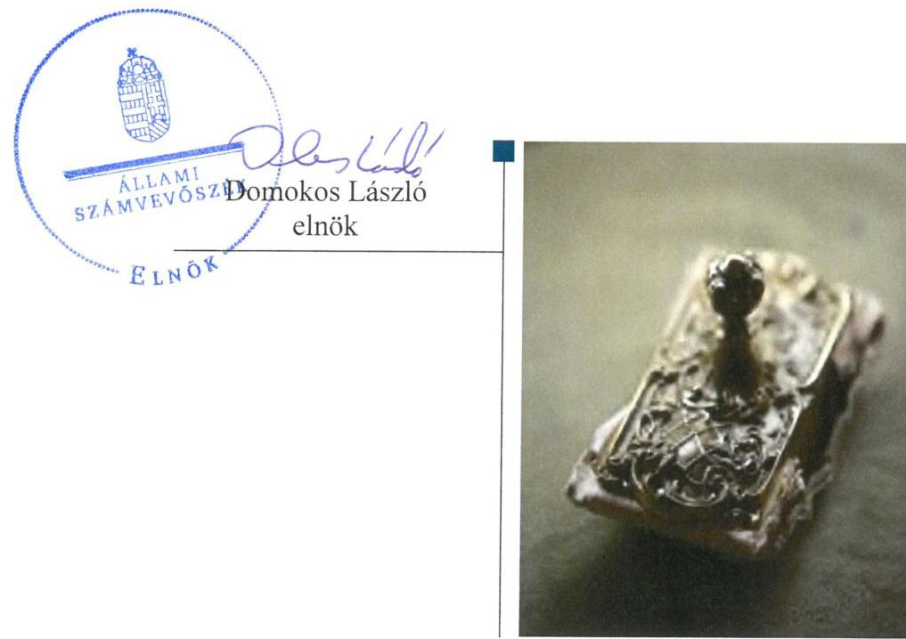

ÁLLAMI
SZÁMVEVŐSZÉK

# Jelentés 

## Nem állami humánszolgáltatók ellenőrzése

A humánszolgáltatást nyújtó államháztartáson kívüli köznevelési és szociális intézmények, szolgáltatók fenntartói központi költségvetésből kapott támogatásai felhasználásának ellenőrzése - Budapesti Zsidó Hitközség
2019.

---

# Jelentés 

## Nem állami humánszolgáltatók ellenőrzése

A humánszolgáltatást nyújtó államháztartáson kívüli köznevelési és szociális intézmények, szolgáltatók fenntartói központi költségvetésből kapott támogatásai felhasználásának ellenőrzése - Budapesti Zsidó Hitközség
2019. 05. hó 30. nap

---

# AZ ELLENŐRZÉST FELÜGYELTE:

DR. NAGY IMRE felügyeleti vezető

KAKAS SÁNDOR felügyeleti vezető

AZ ELLENŐRZÉST VEZETTE ÉS A VÉGREHAJTÁSÁÉRT FELELŐS:

MOLNÁR ZSUZSANNA ellenőrzésvezető

A PROGRAM ÖSSZEÁLLÍTÁSÁÉRT FELELŐS:

TÓTPÁL SZABOLCS osztályvezető

IKTATÓSZÁM: EL-1569-001/2019.

|  Jelentéseink az Országgyűlés számítógépes hálózatán és az Interneten a www.asz.hu címen is olvashatóak. | TÉMASZÁM: 2448  |
| --- | --- |
|   | ELLENŐRZÉS-AZONOSÍTÓ SZÁM: V079434  |

---

# TARTALOMJEGYZÉK 

■ ÖSSZEGZÉS ..... 5
■ AZ ELLENŐRZÉS CÉLJA ..... 6
■ AZ ELLENŐRZÉS TERÜLETE ..... 7
■ AZ ELLENŐRZÉS HÁTTERE, INDOKOLTSÁGA ..... 8
■ A JELENTÉS LÉNYEGES KÉRDÉSKÖREI ..... 9
■ AZ ELLENŐRZÉS HATÓKÖRE ÉS MÓDSZEREI ..... 10
■ MEGÁLLAPÍTÁSOK ..... 12
■ JAVASLATOK ..... 14
■ MELLÉKLETEK ..... 15
I. sz. melléklet: Értelmező szótár ..... 15
■ FÜGGELÉKEK ..... 17
I. sz. függelék a Jelentéshez ..... 17
II. sz. függelék: Észrevételek ..... 18
■ RÖVIDÍTÉSEK JEGYZÉKE ..... 21

---

.

---

# ÖSSZEGZÉS 

A Budapesti Zsidó Hitközség humánszolgáltatási közfeladatot ellátó intézményei müködtetésére igénybevett közpénzekkel való gazdálkodása nem volt elszámoltatható és átlátható.

## Az ellenőrzés társadalmi indokoltsága

Az Állami Számvevőszék stratégiájában hangsúlyos szerepet szán annak, hogy szilárd szakmai alapon álló, értékteremtő ellenőrzéseivel előmozdítsa a közpénzügyek átláthatóságát, rendezettségét és javaslataival a közpénzek és a közvagyon szabályos, gazdaságos, hatékony és eredményes felhasználását segítse. Az ÁSZ a stratégiájában célul tűzte ki, hogy az államháztartáson kívülre nyújtott költségvetési támogatások ellenőrzésével hozzájárul ahhoz, hogy a közpénzeket az államháztartáson kívüli szervezetek is átlátható módon használják fel a közfeladatok szerződésben vállalt ellátása érdekében. Tekintettel az elmúlt években mind a köznevelés, mind a szociális területet érintő finanszírozási változásokra, a társadalom fokozott érdeklődéssel figyeli a köznevelési és szociális feladatokra fordított források felhasználását. Fontos a közvéleményt biztosítani arról, hogy a közpénz államháztartáson kívüli felhasználása ezen a területen sem marad ellenőrizetlenül. Hozzájárul ezzel ahhoz is, hogy a nyilvánosság és a szolgáltatást igénybe vevők megfelelő tájékoztatást kapjanak az államháztartáson kívüli közfeladatot ellátók müködéséről. A Budapesti Zsidó Hitközségnél végzett ellenőrzést további társadalmi elvárás is indokolja tevékenységéből adódóan, mivel humánszolgáltatási közfeladat ellátására közel 1700 millió Ft központi költségvetési támogatásban részesült az ellenőrzött időszakban.

## Főbb megállapítások, következtetések, javaslatok

A Budapesti Zsidó Hitközség a jogszabályi előírások szerinti számviteli szabályozás hiányában nem alakította ki szabályszerű működési- és gazdálkodási kereteit, ezáltal nem biztosította a költségvetési támogatások átlátható, elszámoltatható igénybevételének, felhasználásának feltételeit.

A 2014-2017. közötti években a számviteli szabályozás hiányában nem volt igazolt, hogy a költségvetési támogatásokat a Fenntartó szabályszerűen fordította az intézmények működtetésére.

A Budapesti Zsidó Hitközség a jogszabályi előírás szerinti beszámolási kötelezettségét nem teljesítette, ezáltal nem biztosította a nyilvánosság előtt a humánszolgáltatási közfeladatot ellátó intézményei működtetésére biztosított közpénzekre vonatkozóan az átláthatóságot.

Az Állami Számvevőszék a jelentésben foglalt megállapítások alapján a Budapesti Zsidó Hitközség elnökének két javaslatot fogalmazott meg. A javaslatokat megalapozó megállapításokra az érintettnek 30 napon belül intézkedési tervet kell készítenie.

---

# AZ ELLENŐRZÉS CÉLJA 

AZ ELLENŐRZÉS CÉLJA annak értékelése volt, hogy a Budapesti Zsidó Hitközség, mint köznevelési és szociális intézmények egyházi fenntartója központi költségvetésből kapott támogatásainak felhasználása szabályszerű volt-e, a támogatások igénylése, évközi módosítása és év végi elszámolása megfelelt-e a jogszabályi előírásoknak.

---

# **A2 ELLENŐRZÉS TERÜLETE**

## **Budapesti Zsidó Hitközség, mint intézményfenntartó**

Az 1950-ben létrejött Budapesti Zsidó Hitközség a magyarországi zsidóság budapesti "egyházkerülete", amely 2012-től a Magyarországi Zsidó Hitközségek Szövetsége belső egyházi jogi személyeként működött. Tizenöt zsinagóga, illetve imaház tartozott hozzá, ami alapján ugyanennyi templomi körzetre bontva működött a fővárosban.

A Fenntartó1 képviselőinek személye és a képviselet módja 2014-ben háromszor változott. 2015. január 22. óta az elnök az ügyvezető igazgatóval együttesen volt jogosult a Fenntartó képviseletére.

A Fenntartó 2016. szeptember 1-je előtt három, azt követően két intézménye révén látott el az ellenőrzött időszakban köznevelési feladatokat. A Benjamin Óvoda és Bölcsőde óvodai és bölcsődei ellátási, nevelési feladatokat látott el, az Anna Frank Árvaház és Kollégium kollégiumi ellátást biztosított. A Scheiber Sándor Gimnázium és Általános Iskola alap- és középfokú oktatási, nevelési feladatokat végzett, tevékenysége – az Anna Frank Árvaház és Kollégium intézménnyel való összeolvadását követően – 2016. szeptember 1-jétől kollégiumi ellátással bővült. A Fenntartó köznevelési intézményei önálló jogi személyiséggel rendelkező, önállóan gazdálkodó nevelési-oktatási intézmények voltak.

Szociális közfeladatait önálló jogi személyiséggel és gazdálkodási jogkörrel nem rendelkező, a Fenntartó szervezetén belül működő három szociális intézménye révén látta el a Fenntartó.

Az Újpesti Zsidó Szociális Otthon idősek otthonaként működött, továbbá felnőtt korú értelmi fogyatékos személyek befogadását, gondozását és ellátását végezte. A Herman Lipót Idősek Klubja és a Héber Imre Idősek Klubja az idősek nappali ellátását és szociális étkeztetést biztosított.

A köznevelési és szociális humánszolgáltatási közfeladatok ellátásával kapcsolatos szakmai irányító szerv az EMMI2 volt, a Fenntartó törvényességi felügyeletére a területileg illetékes kormányhivatalok és az NRSZH3 voltak jogosultak.

A Fenntartó közfeladatok ellátására kapott központi költségvetési támogatása az ellenőrzött időszakban folyamatosan növekedett, 2014. évben 388,1 millió Ft, 2017. évben 468,7 millió Ft támogatásban részesült.

---

# AZ ELLENŐRZÉS HÁTTERE, INDOKOLTSÁGA 

A köznevelési és szociális feladatokat ellátó nem állami intézményfenntartók részére közfeladataik ellátására évente jelentős összegű pénzügyi támogatást biztosítottak a mindenkori költségvetési törvények a bennük megfogalmazott feltételek mellett.

A felhasználható állami támogatások Kvtv. ${ }_{1-4}{ }^{4}$ szerinti előirányzata 2014. - 2017. években együtt 1049 Mrd Ft volt. A 2013. évben jelentős változások következtek be a normatív finanszírozás rendszerében. Az Országgyűlés elfogadta a nemzeti köznevelésről szóló 2011. évi CXC. törvényt, amely jelentősen átalakította a korábbi finanszírozási rendszert 2013 szeptemberétől. Módosították a szociális igazgatásról és szociális ellátásokról szóló 1993. évi III. törvényt is, amely - többek között - 2012. január 1-jei hatállyal megfogalmazta a finanszírozási rendszerbe történő befogadással összefüggő szabályokat. Mindkét területen új feladatfinanszírozási forma (átlagbéralapú támogatás) jelent meg, amely az államháztartáson kívüli intézményfenntartókra is vonatkozik. Az ellenőrzés a finanszírozási rendszerben 2011-2015 között bekövetkezett változásokra, azok közfeladat ellátásra gyakorolt hatására fókuszált a költségvetési támogatásokat felhasználó államháztartáson kívüli szervezetek körében. Az ellenőrzések indokoltságát az is alátámasztja, hogy az ÁSZ ${ }^{5}$ még nem ellenőrizte átfogóan e területet.

Az ÁSZ stratégiájában foglaltak alapján is indokolt volt az ellenőrzés, amely a társadalom számára jelzi, hogy a közpénz államháztartáson kívüli felhasználása sem maradhat ellenőrizetlenül. Az államháztartáson kívülre nyújtott költségvetési támogatások ellenőrzésével az ÁSZ hozzájárul ahhoz, hogy a közpénzeket a nem állami humán fenntartók átlátható módon használják fel a közfeladatok ellátására kötött szerződésekben vállalt kötelezettségek teljesítése érdekében. Az ÁSZ ellenőrzés javaslataival hozzájárulhat az említett rendszerek szabályszerű támogatás felhasználásához, javíthatja a társadalmi-gazdasági döntések megalapozottságát, amely a „jól irányított állam" múködésének feltétele.

---

# A JELENTÉS LÉNYEGES KÉRDÉSKÖREI 

1. A Fenntartó szabályszerű múködési és gazdálkodási környezet kialakításával megteremtette-e a költségvetési támogatások átlátható, elszámoltatható igénybevételének, felhasználásának feltételeit és a költségvetési támogatásokat szabályszerűen for-ditotta-e intézményei müködtetésére?
2. A Fenntartó a felhasznált közpénzekre vonatkozó gazdálkodásával a nyilvánosság előtt elszámolt-e, ennek megalapozása érdekében ellenőrzési, értékelési és a külső ellenőrzésekkel kapcsolatos intézkedési feladatait szabályszerűen látta-e el?

---

# AZ ELLENŐRZÉS HATÓKÖRE ÉS MÓDSZEREI 

## Az ellenőrzés típusa

Megfelelőségi ellenőrzés.

## Az ellenőrzött időszak

A 2014. január 1-je és 2017. december 31-e közötti időszak. A helyszíni szemle tekintetében 2018. január 1-jétől az utolsó helyszíni szemle időpontjáig (2018. október 11-ig) tartó időszak.

## Az ellenőrzés tárgya

Az ellenőrzés a köznevelési és szociális humánszolgáltatási közfeladatokat ellátó államháztartáson kívüli Fenntartó humánszolgáltatási közfeladatai ellátásához a költségvetési törvényekben biztosított központi költségvetési támogatások (köznevelési és szociális ágazat átlagbér alapú támogatásai, tankönyvtámogatás, gyermek- és tanulóétkeztetéshez nyújtott támogatás, nem hitéleti célú egyházi kiegészítő támogatás) igénylése, évközi módosítása és év végi elszámolása fenntartói feladatainak ellátása, illetve e központi költségvetésből kapott támogatásaik humánszolgáltatási közfeladatokra való fenntartó általi felhasználása szabályszerűségének értékelésére terjedt ki.

## Az ellenőrzött szervezet

Budapesti Zsidó Hitközség, mint intézményfenntartó.

## Az ellenőrzés jogalapja

Az ellenőrzés jogszabályi alapját az ÁSZ tv. ${ }^{6} 1 . \S$ (3) bekezdése, valamint az 5. § (11) bekezdés c) pontjában foglalt előírások adták.

## Az ellenőrzés módszerei

Az ellenőrzést az ellenőrzési program szempontjai, kérdései, az ellenőrzött időszakban hatályos jogszabályok, a nemzetközi standardokat irányadónak tekintve az ellenőrzés szakmai szabályok és módszertanok figyelembevételével végezte az ÁSZ.

---

A közpénzekkel való felelős gazdálkodás segítésére irányuló javaslatok kidolgozásakor a hatályos jogszabályok voltak az irányadóak.

Az ellenőrzés ideje alatt az ÁSZ a Fenntartóval történő kapcsolattartást az ÁSZ SZMSZ ${ }^{7}$ vonatkozó előírásai alapján biztosította.

Az ellenőrzési kérdések megválaszolásához szükséges bizonyítékok megszerzése az ellenőrzöttek által rendelkezésre bocsátott dokumentumokra, adatokra alapozva megfigyelés, szemle (szemrevételezés), kérdésfeltevés (információkérés), valamint elemző eljárással történt.

Az ellenőrzési bizonyítékként felhasznált adatforrások közé tartoztak egyrészt a szakmai program részletes szempontjainál felsorolt adatforrások, másrészt minden - az ellenőrzés folyamán feltárt, az ellenőrzés szempontjából információt tartalmazó - dokumentum.

Az ellenőrzés lefolytatásához a Fenntartó a kitöltött tanúsítványok, valamint az ÁSZ által kért dokumentumok elektronikus úton való megküldésével szolgáltatott adatokat, információkat. Az így rendelkezésre bocsátott adatok, információk és a tanúsítványok adatai valódiságának kontrollja az ellenőrzés keretében történt.

Az ÁSZ a fenntartott intézményeknél helyszíni szemle keretében győződött meg a tényleges feladatellátásról. Helyszíni szemlékre a fenntartott intézmények egyes feladatellátási helyein került sor.

A köznevelési, a szociális humánszolgáltatások központi költségvetési támogatásai igénylésével, módosításával, elszámolásával kapcsolatos, államháztartáson kívüli fenntartó jogszabályokban előírt feladatai betartását, továbbá a központi költségvetési támogatások szabályszerű kezelését, nyilvántartását ellenőrizte az ÁSZ a Fenntartónál határozatok, nyilvántartások, beszámolók és egyéb dokumentumok, valamint a Magyar Államkincstártól - mint adatszolgáltatásra felkért szervtől - megkért határozatok és beszámolók alapján. Az ellenőrzés nem terjedt ki a köznevelési, a szociális humánszolgáltatások központi költségvetési támogatásai igénylése, módosítása, elszámolása valódiságának, megalapozottságának, helyességének - sem a Fenntartónál, sem a székhely intézményeinél való - értékelésére. Továbbá nem terjedt ki az ellenőrzés e források intézmények általi szabályszerű felhasználásának értékelésére.

---

# MEGÁLLAPÍTÁSOK 

## 1. A Fenntartó szabályszerű múködési és gazdálkodási környezet kialakításával megteremtette-e a költségvetési támogatások átlátható, elszámoltatható igénybevételének, felhasználásának feltételeit és a költségvetési támogatásokat szabályszerűen fordította-e intézményei múködtetésére?

Összegző megállapítás

A Fenntartó nem alakította ki a szabályszerű múködési- és gazdálkodási környezetet, a költségvetési támogatások átlátható, elszámoltatható igénybevételének, felhasználásának feltételeit. A Fenntartó nem igazolta, hogy a közfeladat ellátására biztosított költségvetési támogatásokat szabályszerűen fordította az intézmények múködtetésre.

A Fenntartó múködésének szabályozottsága, ennek keretében a fenntartó gazdálkodására vonatkozó számviteli szabályozás az ellenőrzött időszakban nem felelt meg a jogszabályban előírtaknak, mivel a fenntartó nem rendelkezett a Számv. tv. ${ }^{8} 14 . \S$ (3) bekezdésében előírt számviteli politikával és a Számv. tv. 14. § (5) bekezdés b) pontjában előírt eszközök és a források értékelési szabályzatával. A 2014. január 1-je és 2015. augusztus 31e közötti időszakban nem rendelkezett a Számv. tv. 14. § (5) bekezdés a) és d) pontjaiban előírt eszközök és a források leltárkészítési és leltározási szabályzatával és pénzkezelési szabályzattal. A számviteli politika és az annak keretében elkészítendő szabályzatok hiányában nem kerültek rögzítésre a Számv. tv. végrehajtásának azon módszerei, eszközei melyek a Fenntartó adottságainak, körülményeinek leginkább megfelelőek. Ennek következtében nem ismerhetőek meg azon sajátos eljárások és módszerek, melyeket a Fenntartó a könyovezetés, és a beszámoló összeállítása során alkalmazott. A számviteli politika, illetve az annak keretében elkészítendő szabályzatok hiánya a Számv. tv. számviteli alapelveknek megfelelő végrehajtását akadályozza.

A Számv. tv. 14. § (3) bekezdésében előírt számviteli politika hiányában 2014-2017. között nem volt igazolt, hogy a költségvetési támogatásokat szabályszerűen fordította a Fenntartó az intézmények múködtetésére.

---

# 2. A Fenntartó a felhasznált közpénzekre vonatkozó gazdálkodásával a nyilvánosság előtt elszámolt-e, ennek megalapozása érdekében ellenőrzési, értékelési és a külső ellenőrzésekkel kapcsolatos intézkedési feladatait szabályszerűen látta-e el? 

## Összegző megállapítás

A Fenntartó a külső ellenőrzésekhez kapcsolódó intézkedési kötelezettségét teljesítette, jogszabályi előírás szerinti beszámolási kötelezettségének nem tett eleget.

A Fenntartó eleget tett a Kormányhivatal ${ }^{9}$ által a köznevelési és szociális intézményeknél az ellenőrzött időszakban végzett ellenőrzések, valamint a Kincstár ${ }^{10}$ által a Fenntartónál végzett ellenőrzésekkel kapcsolatban keletkezett intézkedési kötelezettségének.

A Fenntartó vállalkozási tevékenységet nem folytatott az ellenőrzött időszakban. A Fenntartó az Eszámv. ${ }^{11}$ 5. § (4) bekezdésében foglaltak ellenére az egyszerűsített éves beszámoló formáját és tartalmát belső szabályban nem határozta meg. Belső szabályozás hiányában nem igazolt, hogy a Fenntartó a köznevelési és szociális közfeladatokra felhasznált közpénzekre vonatkozó gazdálkodásával szabályszerűen számolt el.

---

# JAVASLATOK 

Az ÁSZ tv. 33. § (1) bekezdésében foglaltak értelmében az ellenőrzött szervezet vezetője köteles a jelentésben foglalt megállapításokhoz kapcsolódó intézkedési tervet összeállítani és azt a jelentés kézhezvételétől számított 30 napon belül az ÁSZ részére megküldeni. Amennyiben az ellenőrzött szervezet vezetője nem küldi meg határidőben az intézkedési tervet, vagy továbbra sem elfogadható intézkedési tervet küld, az Állami Számvevőszék elnöke az ÁSZ tv. 33. § (3) bekezdése a) és b) pontjaiban foglaltakat érvényesítheti.

## a Budapesti Zsidó Hitközség elnökének

1. Intézkedjen a számviteli politika, valamint az eszközök és források értékelési szabályzata elkészitéséről a Számv. tv. elöírásai szerint.
(1. összegző megállapítás 1. bekezdésének 1. mondata alapján)
2. Gondoskodjon a jogszabályi előírás szerinti beszámoló elkészítéséről.
(2. összegző megállapítás 2. bekezdése alapján)

---

# MELLÉKLETEK 

- I. SZ. MELLÉKLET: ÉRTELMEZŐ SZÓTÁR
átlagbéralapú támogatás
egyházi fenntartó
humánszolgáltatás
költségvetési támogatás
köznevelési közfeladat

Az átlagbér alapú támogatás alapja a pedagógus-munkakörben, valamint nevelő-, oktató munkát közvetlenül segítő munkakörben foglalkoztatottak után kifizetett személyi juttatás és járulék. (2013. évi CCXXX. törvény Magyarország 2014. évi központi költségvetéséről 33. § (4) bekezdés)
Az Ehtv. 33. §-a alapján az Ehtv. mellékletében felsorolt egyházak és az általuk meghatározott, az egyház belső egyházi szabálya szerint jogi személyiséggel rendelkező szervezetek - a nyilvántartásba vételük dátumától függetlenül - 2012. január 1-jétől minősülnek egyházi fenntartóknak. Az Ehtv. 14. §-ában meghatározott eljárás folyamán az Országgyűlés által egyháznak elismert szervezet a törvénynek az egyház bejegyzésére vonatkozó módosítása hatálybalépésének napjától minősül egyháznak (Ehtv. 15. §).
Külön törvényben meghatározott szociális, gyermekjóléti, gyermekvédelmi, közoktatási, felsőoktatási, kulturális közfeladatok (2014. évi Kvtv. 34. § (1), (4) bekezdés, 1. számú melléklet XX/20/2. alcím, 19. alcím, 2015. évi Kvtv. 43. § (1), (4) bekezdés, 1. számú melléklet XX/20/2/3. jogcím csoport, 19. alcím, 2016. évi Kvtv. 41. § (1), (4) bekezdés, 1. számú melléklet XX/20/2/3. jogcím csoport, 19. alcím).
a társadalombiztosítás pénzügyi alapjai kivételével az államháztartás központi alrendszeréből ellenérték nélkül, pénzben nyújtott támogatások (Áht. 1. § 14. pont)
A költségvetési törvényekben (2013. évi CCXXX. törvény 33-34. §, 2014. évi C. törvény 42-43. §, 2015. évi C. törvény 40-41. §) megállapított támogatás. Például a 2015. évi C. törvény 40-41. § szerint többek között: Az Országgyűlés a köznevelési feladat ellátására átlagbéralapú támogatást állapít meg. A nevelési-oktatási, valamint pedagógiai szakszolgálati intézményt fenntartó nemzetiségi önkormányzat, az egyházi és magán köznevelési intézmény fenntartója részére az általuk fenntartott nevelési-oktatási intézményben, továbbá pedagógiai szakszolgálati intézményben pedagógus és - a b) pont kivételével - ne-velő-oktató munkát közvetlenül segítő munkakörben foglalkoztatottak után a 7. melléklet I. pontja, valamint az óvoda, egységes óvoda-bölcsőde esetében a 2. melléklet II. pont 1. alpontja szerint és az 5. alpontjában meghatározott jogosultak után, az őket ott megillető mértékek szerint. Müködési támogatást állapít meg a nemzetiségi önkormányzat vagy az egyházi jogi személy által fenntartott nevelési-oktatási intézményekben ellátott, továbbá a pedagógiai szakszolgálati intézményekben gyógypedagógiai tanácsadásban, korai fejlesztésben, oktatásban és gondozásban, valamint a fejlesztő nevelésben részt vevő gyermekekre, tanulókra tekintettel a nemzetiségi önkormányzat és a bevett egyház részére a 7. melléklet II. pontja szerint.
Az Országgyűlés a szociális, gyermekjóléti, gyermekvédelmi közfeladatot ellátó intézményt, szolgáltatást fenntartó egyházi jogi személy, civil szervezet, közalapítvány, országos nemzetiségi önkormányzat, települési vagy területi nemzetiségi önkormányzat, gazdasági társaság, és a humánszolgáltatást alaptevékenységként végző, az Szja tv. hatálya alá tartozó egyéni vállalkozó (a továbbiakban együtt: nem állami szociális fenntartó) részére támogatást állapít meg a következők szerint: a támogatás a nem állami szociális fenntartót a települési önkormányzatok 2. melléklet III. pont 3. alpont c)-k) pontjában és III. pont 5. alpont a) pontjában meghatározott támogatásaival azonos jogcímeken, öszszegben és feltételek mellett illeti meg.
A köznevelési intézmény alapító okiratában foglalt feladat: óvodai nevelés, nemzetiséghez tartozók óvodai nevelése, általános iskolai nevelés-oktatás, nemzetiséghez tartozók általános iskolai nevelése-oktatása, kollégiumi ellátás, nemzetiségi kollégiumi ellátás, gimnáziumi nevelés-oktatás, szakközépiskolai nevelés-oktatás, szakiskolai nevelés-oktatás, nemzetiség gimnáziumi nevelés-oktatása, nemzetiség szakközépiskolai nevelés-oktatása, nemzetiség szakiskolai nevelés-oktatása, köznevelési Hídprogramok keretében

---

folyó nevelés-oktatás, felnőttoktatás, alapfokú művészetoktatás, fejlesztő nevelés, fejlesztő nevelés-oktatás, pedagógiai szakszolgálati feladat, a többi gyermekkel, tanulóval együtt nevelhető, oktatható sajátos nevelési igényű gyermekek, tanulók óvodai nevelése és iskolai nevelése-oktatása, azoknak a sajátos nevelési igényű gyermekeknek, tanulóknak az óvodai, iskolai, kollégiumi ellátása, akik a többi gyermekkel, tanulóval nem foglalkoztathatók együtt, a gyermekgyógyúdülőkben, egészségügyi intézményekben, rehabilitációs intézményekben tartós gyógykezelés alatt álló gyermekek tankötelezettségének teljesítéséhez szükséges oktatás, pedagógiai-szakmai szolgáltatás.
köznevelési intézmény
A nevelési- oktatási intézmény, pedagógiai szakszolgálati intézmény, pedagógiai-szakmai szolgáltatást nyújtó intézmény.

---

# FÜGGELÉKEK 

- I. SZ. FÜGGELÉK A JELENTÉSHEZ

Az Állami Számvevőszék az ellenőrzés során feltárt tényekhez kapcsolódó további körülmények tisztázására eszközrendszerrel nem rendelkezik. Amennyiben az ellenőrzésen túlmutatóan indokoltnak látszik az ellenőrzés során feltárt körülmények további vizsgálata, az Állami Számvevőszék törvényi felhatalmazás alapján az ellenőrzés által feltárt körülményeket továbbítja a hatáskörrel rendelkező szervnek a szükséges intézkedések megtétele, eljárások lefolytatása érdekében.
Az Állami Számvevőszék a Budapesti Zsidó Hitközség központi költségvetésből kapott támogatásai felhasználásának ellenőrzése során feltárta, hogy

- a Budapesti Zsidó Hitközség a köznevelési feladatra kapott költségvetési támogatások felhasználását nem a jogszabályi előírások szerinti tartotta nyilván, mert - az Nkt. vhr. ${ }^{12}$ 37/G. § (1) bekezdésének előírásai ellenére - nem gondoskodott alapfeladatonkénti bontásban elkülönített nyilvántartás kialakításáról, amelyből megállapítható, hogy a támogatások milyen célra kerültek felhasználásra,
- a köznevelési feladat ellátására biztosított 2014. évi támogatás teljes összegét a Budapesti Zsidó Hitközség (a Kvtv. 33§ (25) bekezdése ellenére) nem adta át intézményeinek, és az át nem adott támogatások cél szerinti felhasználása - az Nkt. vhr.37/G. § (1) bekezdése szerinti nyilvántartás hiányában - nem volt igazolt,
- A szociális célú támogatások felhasználását a Fenntartó számviteli rendjében - az Atr. ${ }^{13}$ 16. § (1) bekezdésében foglaltak ellenére - nem feladatonkénti bontásban, elkülönítetten kezelte.

A Budapesti Zsidó Hitközségnél feltárt költségvetési támogatások felhasználásának nyilvántartását, kezelését érintő szabálytalanságok miatt nem igazolt, hogy a költségvetési támogatásokat jogszerüen használta fel.
Az Nktv. vhr. 37/O. § (2) bekezdése és az Atr. 19. § (1) bekezdése szerint a Magyar Államkincstár ellenőrzési jogköre kiterjed a támogatások felhasználása jogszerüségének ellenőrzésére, így a Magyar Államkincstár illetékes igazgatósága jogosult eljárni a jogsértő magatartás tekintetében.

---

A jelentéstervezetet a Számvevőszék 15 napos észrevételezésre megküldte az ellenőrzött szervezet vezetőjének az ÁSZ tv. 29. §* (1) bekezdése előírásának megfelelően.

A Budapesti Zsidó Hitközség ügyvezető igazgatója a jelentéstervezet megállapításaira írásban észrevételt tett.
Az ÁSZ tv. 29. § (3) bekezdésével összhangban az ÁSZ a Függelékben feltünteti az ellenőrzés megállapításaival kapcsolatban tett, figyelembe nem vett észrevételeket, és megindokolja, hogy azokat miért nem fogadta el.

[^0]
[^0]:    * 29. § (1) Az Állami Számvevőszék az ellenőrzési megállapításait megküldi az ellenőrzött szervezet vezetőjének vagy az általa megbízott személynek, és annak, akinek személyes felelősségét állapította meg.
    (2) Az ellenőrzött szervezet vezetője és a felelősként megjelölt személy az ellenőrzés megállapításaira tizenöt napon belül írásban észrevételt tehet.
    (3) Az Állami Számvevőszék az észrevételre a beérkezésétől számított harminc napon belül írásban válaszol. A figyelembe nem vett észrevételeket köteles a jelentésben feltüntetni, és megindokolni, hogy azokat miért nem fogadta el.

---

A „Nem állami humánszolgáltatók ellenőrzése - A humánszolgáltatást nyújtó államháztartáson kívüli köznevelési és szociális intézmények, szolgáltatók fenntartói központi költségvetésből kapott támogatásai felhasználásának ellenőrzése - Budapesti Zsidó Hitközség" címmel készített számvevőszéki jelentéstervezet megállapításaival kapcsolatban az ügyvezető igazgató által 2019. április 8-án tett (az Állami Számvevőszékhez 2019. április 12-én érkezett) észrevételek és azok kezelésének indokolása.

# 1. Az 1. sz. összegző megállapítás 1. bekezdéséhez tett észrevétel (észrevétel 1. pontja): 

A Fenntartó észrevétele szerint a jelentéstervezet megállapítása megalapozatlan, mert a Budapesti Zsidó Hitközségnek (továbbiakban: Fenntartó) az ellenőrzött időszakban volt számviteli politikája, azonban „a kanonizálásra valóban nem került sor". A jogosan kifogásolt hiányosságot 2018. január 1-ei hatályba léptetéssel kiküszöbölték.

Az észrevételt nem fogadjuk el. Az észrevételben a Fenntartó elismerte a jóváhagyott számviteli politika hiányát, és azt a tájékoztatást adta, hogy a jogosan kifogásolt hiányosság a számviteli politika 2018. január 1-ei hatályba léptetésével már nem áll fenn. Tekintettel arra, hogy az ellenőrzési megállapítások a 2014-2017 közötti ellenőrzött időszakra vonatkoznak, és a megtett intézkedés az ellenőrzött időszakon túli, az észrevétel az ellenőrzött időszakra vonatkozó megállapítást nem módosítja.
2. A Főbb megállapítások, következtetések, javaslatok rész 2. bekezdéséhez és az 1. sz. összegző megállapítás 2. bekezdéséhez tett észrevétel (észrevétel 2. és 4. pontja):

Az észrevétel szerint a támogatások felhasználása követhető volt a számvitelben jól elkülönített főkönyvi számlákon, illetve a pénzügyi dokumentumok alapján is az ellenőrzött időszakban. A Fenntartó a támogatásokat minden esetben átadta a fenntartott intézményeknek. A Fenntartó az észrevételben jelezte továbbá, hogy a fenntartói és az intézményi beszámolókból egyértelműen levezethető, hogy a Fenntartó minden állami támogatást szabályszerűen az intézmények működtetésre fordította.

Az észrevételt nem fogadtuk el. Az ÁSZ az ellenőrzési megállapításait az adatszolgáltatás során a részére törvényi határidőben rendelkezésre bocsátott dokumentumokra alapozva fogalmazza meg. A 2018. szeptember 7-én kelt teljességi és hitelességi nyilatkozat szerint az ÁSZ részére átadott dokumentumok, adatok megbízhatóak, és a bekért adatokra, dokumentumokra vonatkozóan teljes körű információt tartalmaznak. Az ellenőrzési dokumentumok ismételt felülvizsgálatát követően megállapítást nyert, hogy az ellenőrzött időszakban a fenntartó nem rendelkezett elfogadott és jóváhagyott - a Számv. tv. 14. § (3) bekezdésében előírt - számviteli politikával, amely hiányosságot a Fenntartó észrevételében elismerte. Számviteli szabályozás hiányában a Fenntartó közfeladatot ellátó intézménye/i működtetéséhez felhasznált közpénzekre vonatkozó gazdálkodása nem volt elszámoltatható, nem igazolt, hogy a költségvetési támogatásokat a Fenntartó szabályszerűen fordította az intézmények működtetésére. Fentiek alapján a jelentéstervezet módosítása nem indokolt.
3. A Főbb megállapítások, következtetések, javaslatok rész 3. bekezdéséhez és a 2. sz. összegző megállapítás 2. bekezdéséhez tett észrevétel (észrevétel 3. és 5. pontja):

A Fenntartó észrevételében jelezte, hogy teljesítette a jogszabályok szerinti beszámolási kötelezettségét. A Fenntartó az Eszámv. 5. § (4) bekezdésére hivatkozott, amely szerint, ha az egyházi jogi személy vállalkozási tevékenységet nem folytat, az egyszerűsített éves beszámoló és az egyszerűsített beszámoló formáját és tartalmát - a (3) bekezdéstől eltérően - a belső szabályában határozza meg. A dokumentumok ismételt felülvizsgálatát követően megállapítást nyert, hogy a Fenntartó vállalkozási tevékenységet nem folytatott, így az észrevétel a jogszabályi hivatkozás tekintetében megalapozott, a jelentéstervezet vonatkozó megállapítását pontosítjuk.

A Fenntartó észrevételében jelezte, hogy az Eszámv. 5. § (4) bekezdése szerinti beszámolókat az ellenőrzés részére átadta. Az ellenőrzési dokumentumok alapján megállapítást nyert, hogy a Fenntartó az egyszerűsített éves beszámoló formáját és tartalmát - az Eszám. tv. 5. § (4) bekezdésében foglaltak ellenére - belső szabályban nem határozta meg. Erre tekintettel a csatolt dokumentumok alapján sem volt átlátható és ellenőrizhető, hogy a Fenntartó a köznevelési és szociális közfeladatokra felhasznált közpénzekre vonatkozó gazdálkodásával milyen formában és tartalommal számolt el.

Az észrevételben a Fenntartó jelezte, hogy valamennyi beszámolóját nyilvános ülésen fogadta el, és hivatkozott továbbá az Eszámv. 11. §-ban előírtakra, amely szerint az egyházi jogi személynek beszámolóját nem kell letétbe he-

---

lyeznie, de azt a számviteli politikájában meghatározott módon közzéteheti. A jelentéstervezet a beszámoló nyilvánosságra hozatalára vonatkozóan nem tartalmaz megállapítást, ezért az észrevétel figyelembe vétele nem indokolt. Magyarország Alaptörvénye (2011. április 25.) 39. cikk (2) bekezdésében foglaltak értelmében a közpénzekkel gazdálkodó minden szervezet köteles a nyilvánosság előtt elszámolni a közpénzekre vonatkozó gazdálkodásával, a közpénzeket az átláthatóság és a közélet tisztaságának elve szerint kell kezelni, továbbá a közpénzekre és a nemzeti vagyonra vonatkozó adatok közérdekű adatok. A Fenntartó nem alakította ki a belső szabályát a beszámolás formájára és módjára vonatkozóan, következésképpen a humánszolgáltatási közfeladatokat ellátó intézményei működtetésére biztosított közpénzekre vonatkozóan az átláthatóság nem volt biztosított. Fentiek miatt a jelentéstervezet Főbb megállapítások, következtetések, javaslatok fejezetében foglaltak módosítása nem indokolt.

A Fenntartó észrevételében továbbá az ellenőrzés javaslatokat megalapozó megállapításaival összefüggésben tervezett intézkedéseiről adott tájékoztatást. Tekintettel arra, hogy a tájékoztatás nem tartalmazott konkrét megállapításra vonatkozó észrevételt, a jelentéstervezet módosítása nem indokolt. A tervezett vagy megtett intézkedésekről - a kiadmányozott jelentés megállapításaira az ÁSZ tv. 33.§ (1) bekezdése alapján összeállított - intézkedési tervben indokolt számot adni.

A Fenntartó észrevételében jelezte továbbá, hogy - az adatszolgáltatásra rendelkezésre álló - rövid határidő meghosszabbítását az ÁSZ „elutasította". Az EL-0866-013/2018. ikt. sz. elektronikus levélben 2018. szeptember 5-én az ÁSZ tájékoztatta a Fenntartót, hogy az ÁSZ tv. 28. § (2) bekezdése alapján a közreműködésre felhívott szervezet az ÁSZ részére - annak kérésére soron kívül, de legkésőbb öt munkanapon belül - az ellenőrzés tervezhetősége, meghatározása, illetve lefolytatása érdekében szükséges adatokat és dokumentumokat rendelkezésre bocsátja, illetve a kapcsolódó tájékoztatást köteles megadni, amelytől való eltérésre az ÁSZ tv. nem ad lehetőséget.

---

# RÖVIDÍTÉSEK JEGYZÉKE 

${ }^{1}$ Fenntartó
${ }^{2}$ EMMI
${ }^{3}$ NRSZH
${ }^{4}$ Kvtv. 1 -4
${ }^{5}$ ÁSZ
${ }^{6}$ ÁSZ tv.
${ }^{7}$ ÁSZ SZMSZ
${ }^{8}$ Számv. tv.
${ }^{9}$ Kormányhivatal
${ }^{10}$ Kincstár
${ }^{11}$ Eszámv.
${ }^{12}$ Nkt. vhr.
${ }^{13} \mathrm{Atr}$.

Budapesti Zsidó Hitközség
Emberi Erőforrások Minisztériuma
Nemzeti Rehabilitációs és Szociális Hivatal
1: 2013. évi CCXXX. törvény Magyarország 2014. évi központi költségvetéséről (hatályos: 2014. január 1-jétől)
2: 2014. évi C. törvény Magyarország 2015. évi központi költségvetéséről (hatályos: 2015. január 1-jétől)
3: 2015. évi C. törvény Magyarország 2016. évi központi költségvetéséről (hatályos: 2016. január 1-jétől)
4: 2016. évi XC. törvény - Magyarország 2017. évi központi költségvetéséről (hatályos: 2016. november 1-jétől)
Állami Számvevőszék
2011. évi LXVI. törvény az Állami Számvevőszékről (hatályos: 2011. július 1-jétől)

Az Állami Számvevőszék elnökének 4/2017. (XII.29.) ÁSZ utasítása az Állami Számvevőszék Szervezeti és Müködési Szabályzatáról
(hatályos: 2018. január 1-jétől)
2000. évi C. törvény - a számvitelről (hatályos: 2001. január 1-től)

Budapest Főváros Kormányhivatala
Magyar Államkincstár
296/2013. (VIII. 29.) Korm. rendelet az egyházi jogi személyek beszámoló készítési és könyvvezetési kötelezettségének sajátosságairól (hatályos 2014. január 1-jétől)
229/2012. (VIII. 28.) Korm. rendelet - a nemzeti köznevelésről szóló törvény végrehajtásáról
489/2013. (XII. 18.) Korm. rendelet az egyházi és nem állami fenntartású szociális, gyermekjóléti és gyermekvédelmi szolgáltatók, intézmények és hálózatok állami támogatásáról (hatályos 2014. január 1-től)

---

ÁLLAMI SZÁMVEVŐSZÉK
1052 Budapest, Apáczai Csere János utca 10.
Levélcím: 1364 Budapest 4. Pf. 54
Telefon: +36 14849100 Telefax: +36 14849200
www.asz.hu