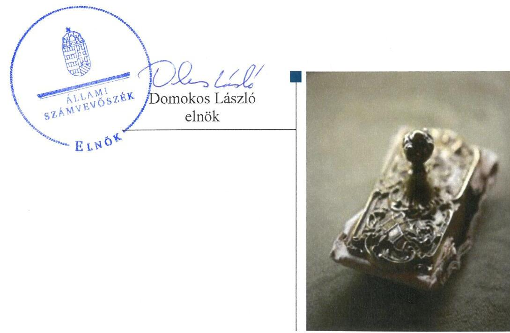
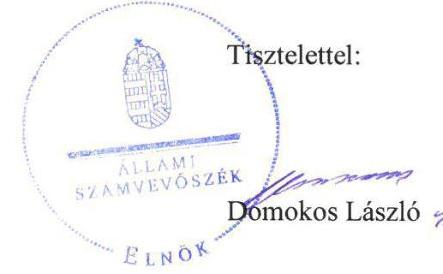
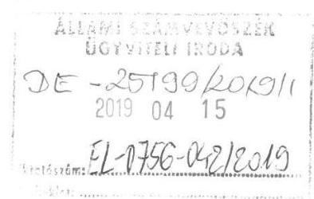
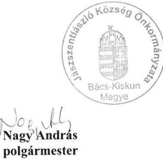
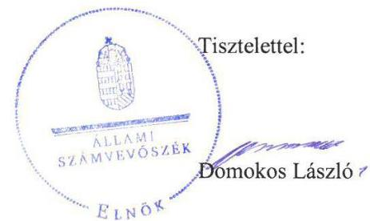

# Jelentés 

## Önkormányzatok ellenőrzése

Integritás- és belső kontrollrendszer, Befektetési tevékenységek ellenőrzése - Jászszentlászló Község Önkormányzata 2019.

19091
www.asz.hu

---

# Jelentés 

## Önkormányzatok ellenőrzése

Integritás- és belső kontrollrendszer, Befektetési tevékenységek ellenőrzése - Jászszentlászló Község Önkormányzata 2019.  hó  nap

---

# AZ ELLENŐRZÉST FELÜGYELTE: 

DR. NAGY IMRE felügyeleti vezető

## AZ ELLENŐRZÉST VEZETTE ÉS A VÉGREHAJTÁSÁÉRT FELELŐS:

KISTÓTH KRISZTINA ellenőrzésvezető

## A PROGRAM ÖSSZEÁLLÍTÁSÁÉRT FELELŐS:

TÓTPÁL SZABOLCS osztályvezető

IKTATÓSZÁM: EL-1571-001/2019

TÉMASZÁM: 2485, 2494

## ELLENŐRZÉS-AZONOSÍTÓ SZÁM: V082909, V082952

Jelentéseink az Országgyűlés számítógépes hálózatán és az Interneten a www.asz.hu címen is olvashatóak.

---

# TARTALOMJEGYZÉK 

■ ÖSSZEGZÉS ..... 5
■ AZ ELLENŐRZÉS CÉLJA ..... 6
■ AZ ELLENŐRZÉS TERÜLETE ..... 7
■ AZ ELLENŐRZÉS HÁTTERE, INDOKOLTSÁGA ..... 8
■ A JELENTÉS LÉNYEGES KÉRDÉSKÖREI ..... 9
■ AZ ELLENŐRZÉS HATÓKÖRE ÉS MÓDSZEREI ..... 10
■ MEGÁLLAPÍTÁSOK ..... 13
■ JAVASLATOK ..... 17
■ MELLÉKLETEK ..... 19
I. sz. melléklet: Értelmező szótár ..... 19
■ FÜGGELÉKEK ..... 21
I. sz. függelék a Jelentéshez ..... 21
II. sz. függelék: Észrevételek ..... 22
■ RÖVIDÍTÉSEK JEGYZÉKE ..... 31

---

.

---

# ÖSSZEGZÉS 

Jászszentlászló Község Önkormányzata belső kontrollrendszer működtetése nem biztosította a közpénzfelhasználás szabályosságát, az átlátható működést és a befektetési tevékenység szabályszerű végzését. Az Önkormányzat integritás elvű működését célzó kontrollok nem kerültek kiépítésre, nem volt biztosított a korrupciós kockázatokkal szembeni védelem. A befektetett vagyonáról az Önkormányzat beszámolója nem nyújtott megbízható és valós képet.

## Az ellenőrzés társadalmi indokoltsága

Az ÁSZ az ÁSZ törvényben kapott felhatalmazással élve ellenőrzi az önkormányzatok gazdálkodását, működését, hogy az ellenőrzések megállapításaival támogassa az ellenőrzött önkormányzatok szabályszerű gazdálkodását, javaslataival elősegítse az Alaptörvényben megfogalmazott alapvetések érvényesülését a mindennapi életben az önkormányzatok szintjén. Az önkormányzati rendszerben zajló folyamatok holisztikus elemzései, a kockázatok folyamatos figyelemmel kísérésének módszerével, az így kiválasztott önkormányzatok célzott, hatékony ellenőrzéseivel az ÁSZ betölti a legfőbb gazdasági ellenőrző szerv küldetését. Az egyes ellenőrzések megállapításaival és egy időszak ellenőrzési eredményeinek elemzésével az ÁSZ ráirányíthatja a jogalkotók figyelmét az önkormányzati alrendszerben esetlegesen felmerülő pénzügyi, szabályozási feszültségekre. Az elvégzett nagyszámú ellenőrzés során az ÁSZ „jó gyakorlatokat" is azonosíthat, melyeket tanácsadó funkciója keretében szélesebb körben is megismertethet az érintettekkel, ezáltal is hozzájárulva az önkormányzati alrendszer szabályozott, átlátható, kiegyensúlyozott és fenntartható működéséhez.

## Főbb megállapítások, következtetések, javaslatok

Jászszentlászló Község Önkormányzatánál a belső kontrollrendszer szabálytalan működtetése következtében a közpénzekkel való felelős, rendeltetésszerű gazdálkodás nem volt biztosított.
2017. évben a kontrollkörnyezet kialakítása nem támogatta az Önkormányzat szabályszerű működését és gazdálkodását. Az Önkormányzat gazdasági programmal nem rendelkezett. A jegyző a leltározási és leltárkészítési szabályzatot és a házipénztári pénzkezelési szabályzatot kiadta, de azok tartalma nem felelt meg a jogszabályi előírásoknak. A jegyző nem működtetett integrált kockázatkezelési rendszert, nem gondoskodott a kockázatok csökkentésére irányuló kontrollok kiépítéséről. A jegyző nem gondoskodott az Önkormányzatnál információs és kommunikációs rendszer és az operatív tevékenységek keretében megvalósuló folyamatos és eseti nyomon követés működtetéséről. A jegyző nem alakította ki a teljesítménymérésre alkalmas követelményeket, nem biztosította a teljesítménymérés lehetőségét.

Az Önkormányzatnál az integritás elvű működést támogató célszerű kontrollok nem kerültek kiépítésre.
2013-2017. években az Önkormányzatnál a kontrollrendszer nem biztosította a befektetési tevékenység szabályszerű végzését. 2013. május 31-ig az Önkormányzat és a közös Hivatal nem rendelkezett szervezeti és működési szabályzattal. 2014-2017. években a jegyző az Önkormányzatnál a befektetések szempontjából releváns kockázatokat nem vizsgálta, a befektetésekkel kapcsolatos szervezeten belüli és kívüli információáramlás rendszerét nem alakította ki.

A befektetett pénzügyi eszközök és az értékpapírok leltári alátámasztottságának hiányában az Önkormányzat beszámolója a befektetett vagyonáról nem nyújtott megbízható és valós összképet.

Az Állami Számvevőszék a jelentésben foglalt megállapítások alapján Jászszentlászló Község Önkormányzata polgármesterének 2 javaslatot, a Jászszentlászlói Közös Önkormányzati Hivatal jegyzőjének 11 javaslatot fogalmazott meg.

---

# AZ ELLENŐRZÉS CÉLJA 

Az ellenőrzés célja annak megállapítása volt, hogy az önkormányzat belső kontrollrendszere biztosította-e a közpénzekkel és a nemzeti vagyonnal történő elszámoltatható, átlátható, szabályszerű, gazdaságos, hatékony és eredményes gazdálkodás feltételeit. Az ellenőrzés keretében értékeljük továbbá, hogy az önkormányzatnál kiépítették és erősítették-e a korrupciós kockázatok kezelését szolgáló integritás kontrollokat és azt, hogy megteremtették-e a teljesítményellenőrzés feltételeit.

Az ellenőrzés további célja annak értékelése, hogy a jogszabályi előírásoknak megfelelően alakították-e ki a belső kontrollrendszert, a kontrollkörnyezet biztosította-e a befektetési tevékenységek szabályszerű végzését. Értékeljük, hogy az egyes befektetési tevékenységekkel kapcsolatos döntéshozatal és a döntések végrehajtása, valamint az egyes befektetések számviteli elszámolása, nyilvántartása szabályszerű volt-e, és a belső és külső ellenőrzések támogatták-e az egyes befektetési tevékenységek szabályszerű végzését.

---

# AZ ELLENŐRZÉS TERÜLETE 

## Jászszentlászló Község Önkormányzata

Jászszentlászló község Bács-Kiskun megye Kiskunmajsai járásában, Kiskunmajsától északra helyezkedik el, állandó lakosainak száma a Központi Statisztikai Hivatal Magyarország közigazgatási helynévkönyve alapján 2017. január 1-jén 2465 fő volt.

Jászszentlászló Község Önkormányzata hét tagból álló képviselő-testülete kettő állandó bizottság támogatásával látta el feladatát. A település polgármestere ${ }^{1}$ a 2014. évi önkormányzati választásokon történt megválasztása óta tölti be tisztségét. A jegyző ${ }^{2}$ 2013. márciusában került kinevezésre.

Jászszentlászló Község Önkormányzata Képviselő-testülete és Móricgát Község Önkormányzata Képviselő-testülete 2013. március 1. hatállyal létrehozta a Jászszentlászlói Közös Önkormányzati Hivatalt, amely gazdasági szervezettel nem rendelkezett, feladatait 2017. évben 12 fő foglalkoztatottal látta el.

Jászszentlászló-Móricgát Községi Önkormányzatok Társulása irányítása alá két intézmény tartozott.

Az Önkormányzat ${ }^{3}$ 2017. december 31-én hat gazdasági társaságban rendelkezett részesedéssel, melyek közül a Jászszentlászló Közmű Beruházó- és Szolgáltató Kft. és a Dél-Alföldi Térségfejlesztő Kft. nem látott el közfeladatot. A két gazdasági társaságban a részesedések mértéke 2017. december 31-én 2700 ezer Ft, illetve 960 ezer Ft, az Önkormányzat tulajdoni részaránya 90%, illetve 32% volt. Az Önkormányzat 2017. december 31-én rendelkezett forgatási célú magyar államkötvénnyel és hét darab üzleti célú, nem önkormányzati feladatellátást szolgáló ingatlannal, lekötött betéttel nem rendelkezett.

---

# AZ ELLENŐRZÉS HÁTTERE, INDOKOLTSÁGA 

A belső kontrollrendszer kialakítása és működtetése nélkül nem valósítható meg a közpénzek, a közvagyon átlátható, szabályos, gazdaságos, hatékony és eredményes felhasználása. A belső kontrollrendszer azt a célt szolgálja, hogy a költségvetési szervek működésük és gazdálkodásuk során a tevékenységeket szabályszerűen hajtsák végre, teljesítsék elszámolási kötelezettségeiket és megvédjék az erőforrásokat a veszteségektől, a károktól és a nem rendeltetésszerű használattól. A belső kontrollrendszer magában foglalja mindazon elveket, eljárásokat és belső szabályzatokat, melyek biztosítják, hogy a költségvetési szerv valamennyi tevékenysége és célja összhangban legyen a szabályszerűséggel, szabályozottsággal, valamint a gazdaságosság, hatékonyság és eredményesség követelményeivel, az eszközökkel és forrásokkal való gazdálkodásban ne kerüljön sor pazarlásra, visszaélésre, rendeltetésellenes felhasználásra. Megfelelő, pontos és naprakész információk álljanak rendelkezésre a költségvetési szerv működésével kapcsolatosan, és a belső kontrollrendszer harmonizációjára, összehangolására vonatkozó jogszabályok végrehajtásra kerüljenek. Az integritás kontrollok kiépítése, erősítése a szervezet korrupciós kockázatainak kezelését szolgálja. A teljesítménykövetelmények meghatározása és működtetése megalapozhatja az önkormányzatoknál a teljesítményellenőrzés lefolytatását.

Az önkormányzati vagyongazdálkodás keretében az önkormányzatok átmenetileg szabad pénzeszközeinek befektetését jogszabály nem tiltja, a befektetések jellege nem korlátozott, a pénzpiaci szolgáltatók közül az önkormányzatok a kínált szolgáltatás és annak költségei alapján, szabadon választhatnak, azonban a veszteséges gazdálkodás kockázatai és következményei az önkormányzatokat terhelik. A szabad pénzeszközök felhasználása során kiemelten fontos a felelős gazdálkodás érvényesülése, amely összhangban kell, hogy legyen az önkormányzati gazdálkodás alapelveivel.

Az ellenőrzéssel feltárásra kerülhetnek azok a kockázatok, amelyek az önkormányzatok gazdálkodásával, ezen belül befektetési tevékenységeivel, kontrollkörnyezetével kapcsolatosak és a befektetési tevékenységek szabályszerű végrehajtását befolyásolják. Az ellenőrzéssel az önkormányzatok befektetési/vagyongazdálkodási döntései értékelhetővé válnak, és megalapozott megállapítás tehető arra vonatkozóan, hogy milyen hatást gyakoroltak az önkormányzat vagyonára a képviselő-testület döntései.

---

# A JELENTÉS LÉNYEGES KÉRDÉSKÖREI 

1. Az önkormányzat belső kontrollrendszerének működtetése szabályszerűen történt-e 2017. évben, kiépítették-e az integritás kontrollrendszerét?
2. A befektetési tevékenységek szabályszerű végzését a kiépített kontrollrendszer biztosította-e a 2013-2017. években?
3. Az önkormányzat egyes befektetéseivel kapcsolatos döntéshozatala és a döntések végrehajtása szabályszerű volt-e?
4. Az egyes befektetések számviteli elszámolása, nyilvántartása szabályszerű volt-e?

---

# AZ ELLENŐRZÉS HATÓKÖRE ÉS MÓDSZEREI 

## Az ellenőrzés típusa

Megfelelőségi ellenőrzés.

## Az ellenőrzött időszak

Az integritás és belső kontrollrendszer ellenőrzött időszaka 2017. év, illetve a 2018. május 31-éig tartó időszak.

Az egyes befektetési tevékenységek ellenőrzése tekintetében az ellenőrzött időszak 2013. január 1. - 2017. december 31. közötti időszak, továbbá a 2013. január 1. előtti időszak is, amennyiben a 2017. december 31-én meglévő befektetésekkel kapcsolatos döntéshozatalra a 2013. január 1. előtti időszakban került sor.

## Az ellenőrzés tárgya

Az önkormányzat és a gazdálkodási feladatokat ellátó hivatala belső kontrollrendszerének kialakítása és működtetése, valamint az integritás kontrollok kiépítettsége, a teljesítményellenőrzés feltételei.

Az egyes befektetési tevékenységek ellenőrzésének tárgya az önkormányzat 2017. december 31-én meglévő, a Számv. tv. ${ }^{4}$ 3. § (6) bekezdés 2. és 3. pontja szerint az értékpapírokban megtestesülő befektetései, lekötött betétei. Továbbá a 2017. december 31-én meglévő, az önkormányzat szabad pénzeszközei terhére, adásvételi szerződés keretében megszerzett, a kötelező feladatok ellátását nem szolgáló, az önkormányzat üzleti vagyonába tartozó, az ellenőrzött időszakban (2013-2017.) megszerzett ingatlanok; az üzleti vagyon körébe tartozó, befektetési céllal megszerzett, de még használatba nem vett ingatlan beruházások, továbbá az - időkorlátozás nélkül megszerzett - kulturális javak (műtárgyak, műalkotások, stb.), illetve egyéb értéktárgyak (pl. ékszerek, befektetési nemesfém).

## Az ellenőrzött szervezet

Jászszentlászló Község Önkormányzata

## Az ellenőrzés jogalapja

Az ellenőrzés jogszabályi alapját az ÁSZ tv. 1. § (3) bekezdése, 5. § (2) és (6) bekezdései, valamint az Áht. ${ }^{5}$ 61. § (2) bekezdésének előírásai képezik.

---

# Az ellenőrzés módszerei 

Az ellenőrzést az ellenőrzési program szempontjai, az ellenőrzött időszakban hatályos jogszabályok, az ellenőrzés szakmai szabályai, az egyes ellenőrzési típusokhoz kapcsolódó ÁSZ módszertanok figyelembevételével végeztük. A gazdálkodás hibáinak kijavítására, a közpénzekkel való felelős gazdálkodás elősegítésére irányuló javaslatok kidolgozásakor a hatályos jogszabályok voltak az irányadóak.

Az ellenőrzés ideje alatt az ellenőrzött szervezettel történő kapcsolattartást az ÁSZ SZMSZ ${ }^{\circledR}$-ének vonatkozó előírásai alapján biztosítottuk.

Az ellenőrzési kérdések megválaszolásához szükséges bizonyítékok megszerzése az ellenőrzött által rendelkezésre bocsátott dokumentumokra, adatokra alapozva megfigyelés, szemle (szemrevételezés), valamint elemző eljárás keretében történt.

Az ellenőrzési bizonyítékként felhasználható adatforrások közé tartozott egyrészt az ellenőrzési program részletes szempontjainál felsorolt adatforrások, másrészt minden - az ellenőrzés folyamán feltárt, az ellenőrzés szempontjából releváns információt tartalmazó - dokumentum.

Az ellenőrzés lefolytatásához az ellenőrzött szervezet az ÁSZ által kért dokumentumok elektronikus megküldésével szolgáltatott adatokat. A rendelkezésre bocsátott adatok, információk kontrollja az ellenőrzés keretében történt.

Az önkormányzat belső kontrollrendszere egyes pilléreinek kialakítására és működtetésére vonatkozó értékelés:
$\longrightarrow$ „szabályszerű", amennyiben az értékelt területen az elért „igen" válaszok százalékban kifejezett, egész számra kerekített aránya legalább $85 \%$,
$\longrightarrow$ „nem szabályszerű", ha nem éri el a $85 \%$-ot,
Az önkormányzat belső kontrollrendszerének összesített értékelése az egyes részterületek esetében kapott megfelelőségi arányok számtani átlaga alapján történt és megegyezett a pillérenként (kontrollterületenként) alkalmazott százalékos értékelésekkel, a következő eltérésekkel: a kontrollrendszer egésze esetében a „szabályszerű" értékelésnek a százalékos értéken felül további feltétele volt, hogy egyik kontrollterület sem kaphat „nem szabályszerű" értékelést.

A 2017. évi
 kiadások teljesítéséhez kapcsolódó pénzgazdálkodási belső kontrollok működésének szabályszerűsége esetében az ellenőrzés azokra a legnagyobb értékű tételekre - a lényeges sokaságra - terjedt ki, melyek összértéke eléri a teljes sokaság összértékének 50%-át. A 2017. évi kiadások esetében a lényeges sokaságot tételesen ellenőriztük.

Az önkormányzatok befektetési tevékenységét a szerződéskötés (és a kapcsolódó döntés-előkészítés, döntéshozatal) kivételével a 2013. január 1. és 2017. december 31. közötti időszak vonatkozásában értékeltük. A szerződéskötést az önkormányzat 2017. december 31-én meglévő értékpapírjai és egyéb befektetései vonatkozásában kellett értékelni a befektetési döntés előkészítése és a döntéshozatala tekintetében, abban az esetben is, ha az 2013. január 1. előtt történt. Amennyiben a szerződéskötés,

---

illetve a döntések előkészítése a 2013. évet megelőzően történt, akkor értelemszerűen a mindenkor hatályos jogszabályok előírásai alapján kellett az értékelést elvégezni.

---

# 1. Az önkormányzat belső kontrollrendszerének működtetése szabályszerűen történt-e 2017. évben, kiépítették-e az integritás kontrollrendszerét? 

Összegző megállapítás Az Önkormányzat a belső kontrollrendszerét nem működtette szabályszerűen, az integritás kontrollrendszerét nem építette ki.

### 1.1. számú megállapítás Az Önkormányzat kontrollkörnyezete nem volt szabályszerű.

A Képviselő-testület ${ }^{7}$ a működési és szervezeti keretek kialakítása érdekében megalkotta Szervezeti és működési szabályzatát és rendeletét az Önkormányzat vagyonáról ${ }^{8}$. Az Önkormányzat a Mötv. ${ }^{9}$ 116. § (1) bekezdésében foglaltak ellenére nem rendelkezett gazdasági programmal.

A közös Hivatal ${ }^{10}$ rendelkezett alapító okirattal, a Képviselő-testület jóváhagyta a közös Hivatal SZMSZ ${ }_{2}{ }^{11}$-ét. A jegyző a Bkr. ${ }^{12}$ 6. § (3) bekezdésében foglaltak ellenére nem készítette el a közös Hivatal ellenőrzési nyomvonalát.

Az Önkormányzat rendelkezett számviteli politikával ${ }^{13}$, leltározási és leltárkészítési szabályzattal, az eszközök és források értékelési szabályzatával ${ }^{14}$, házipénztári pénzkezelési szabályzattal. A jegyző nem rögzítette a leltározási szabályzatban ${ }^{15}$ az Áhsz. ${ }^{16}$ 22. § 2) bekezdés b) pontjában foglaltak ellenére a használt, de a mérlegben értékkel nem szereplő immateriális javak, tárgyi eszközök, készletek leltározási módját és a házipénztári szabályzatban ${ }^{17}$ a Számv. tv. 14. § (8) bekezdése ellenére a pénzforgalom (készpénzben, illetve bankszámlán történő) lebonyolítás rendjét.

A közös Hivatal rendelkezett iratkezelési szabályzattal ${ }^{18}$ és adatvédelmi és adatbiztonsági szabályzattal ${ }^{19}$. A jegyző nem készítette el az Önkormányzat iratkezelési szabályzatát az Ltv. ${ }^{20}$ 9. § (4) bekezdés ellenére és az adatvédelmi és adatbiztonsági szabályzatát az Info tv. ${ }^{21}$ 24. § (3) bekezdés ellenére.

Az Önkormányzat és a közös Hivatal pénzgazdálkodási szabályzataiban ${ }^{22}$ a polgármester és a jegyző az Ávr ${ }^{23}$. és az Áht. előírásai szerint kijelölték a gazdálkodási jogkörök gyakorlóit, meghatározták a gazdálkodási jogkörgyakorlásra és az összeférhetetlenségre vonatkozó szabályokat. A pénzgazdálkodási szabályzatok mellékletei tartalmazták a gazdálkodási jogkörök gyakorlói naprakész aláírás mintáit.

---

| 1.2. számú megállapítás | Az Önkormányzat integrált kockázatkezelési rendszert nem működtetett. |
| :--: | :--: |
| 1.3. számú megállapítás | A jegyző a Bkr. 3. § b) pontjában foglaltak ellenére nem alakított ki integrált kockázatkezelési rendszert, mert a Bkr. 6. § (4) bekezdés ellenére nem szabályozta a szervezeti integritást sértő események kezelésének eljárásrendjét, valamint az integrált kockázatkezelés eljárásrendjét. |
| 1.4. számú megállapítás | Az Önkormányzat a kontrolltevékenységét nem működtette szabályszerűen. |
| 1.4. számú megállapítás | Az Önkormányzatnál a gazdálkodási jogkörökre vonatkozóan a kontrolltevékenységet kiépítették. A kiadások teljesítéséhez kapcsolódóan a kötelezettségvállalás és a teljesítésigazolás jogköröket szabályszerűen gyakorolták, az összeférhetetlenségi szabályokat betartották.   A kontrolltevékenység részeként a gazdálkodási jogkörökön felüli további területekre vonatkozóan a jegyző a Bkr. 8. § (2) bekezdés a), b), d) pontjaiban foglaltak ellenére a szervezeti célok elérését veszélyeztető kockázatok csökkentésére irányuló kontrollok kiépítéséről nem gondoskodott. |
| 1.5. számú megállapítás | Az Önkormányzat információs és kommunikációs folyamatainak működtetése nem volt szabályszerű. |
| 1.5. számú megállapítás | A jegyző a Bkr. 3. § d) pontjában és 9. § (1)-(2) bekezdésekben előírtak ellenére nem alakított ki olyan rendszert, amely az Önkormánynál biztosítja, hogy a megfelelő információk a megfelelő időben eljutnak az illetékes szervezethez, szervezeti egységhez, illetve személyhez.   A jegyző az Ávr. 13. § (2) bekezdés h) pont előírása ellenére nem szabályozta a kötelezően közzéteendő adatok nyilvánosságra hozatalának rendjét. |
| 1.6. számú megállapítás | Az Önkormányzatnál a szervezet tevékenységének, a célok megvalósításának nyomon követését biztosító rendszer működtetése nem volt szabályszerű. |
| 1.6. számú megállapítás | A jegyző nyilatkozatban értékelte a költségvetési szerv belső kontroll-rendszerének minőségét, azonban a Bkr. 11. § (2a) bekezdésében foglaltak ellenére a jegyző a nyilatkozatot nem küldte meg az irányító szerv részére.   A jegyző a Bkr. 10. § előírása ellenére nem alakította ki az operatív tevékenységek keretében megvalósuló folyamatos és eseti nyomon követést. A belső ellenőrzési vezető nem vezette az elvégzett ellenőrzésekről a Bkr. 50. § előírása szerinti nyilvántartást.   A jegyző az Önkormányzat és közös Hivatala tevékenységeinek, folyamatainak, irányítási, működési rendszereinek és eljárásainak ellenőrzéséhez nem határozott meg teljesítmény-kategóriákat, kritériumokat, mutatószámokat. Az Önkormányzatnál a teljesítmény mérésének lehetősége nem volt biztosított. |
| 1.6. számú megállapítás | Az Önkormányzat nem építette ki az integritás kontrollrendszerét. |
|  | A kockázatelemzés hiányában az integritás elvű működést támogató célszerű kontrollok nem kerültek kialakításra. |

---

# 2. A befektetési tevékenységek szabályszerű végzését a kiépített kontrollrendszer biztosította-e a 2013-2017. években? 

Összegző megállapítás

Az Önkormányzatnál a befektetési tevékenység szabályszerű végzését 2013-2017. években a kontrollrendszer nem biztosította.

A befektetési tevékenység szabályszerű végzéséhez szükséges kontroll-rendszer-elemek közül az Önkormányzatnál a kontrollkörnyezet, az integrált kockázatkezelési, az információs és kommunikációs rendszer és a belső ellenőrzés nem biztosította az egyes befektetési tevékenységeknél a szabályszerű döntéshozatalt és nyilvántartást.

A KONTROLLKÖRNYEZET kialakítása során nem tartották be a jogszabályi előírásokat. Az Önkormányzat 2013. január 1. és május 31. közötti időszakban nem rendelkezett az Mötv. 53. § (1) bekezdése által előírt szervezeti és működési szabályzattal, valamint a közös Hivatal nem rendelkezett az Áht. 10. § (5) bekezdésében előírt és az Ávr. 13. § (1) bekezdésében előírt tartalom szerinti szervezeti és működési szabályzattal.
2013. évben az Önkormányzat és a közös Hivatal nem rendelkezett a befektetési tevékenység szabályszerű végzéséhez szükséges, a Számv. tv. 14. § (3) bekezdése által meghatározott számviteli politikával.

Az Önkormányzat 2014. január 1-től, míg a közös Hivatal 2015. január 1-től rendelkezett Számlarenddel ${ }^{24}$. A polgármester a Számlarendben az Áhsz. 51. § (3) bekezdés előírásai ellenére nem szabályozta a részletező nyilvántartások vezetésének módját, azok egyeztetését a nyilvántartási számlákkal és annak dokumentálását a befektetések vonatkozásában.

## A KOCKÁZATKEZELÉSI ÉS AZ INFORMÁCIÓS ÉS

KOMMUNIKÁCIÓS RENDSZER keretében a jegyző az egyes befektetésekkel kapcsolatosan a Bkr. 2. § m) pontja, a 3. § b) pontja és a 7. § előírásai ellenére nem alakította ki az Önkormányzatnál 2016. szeptember 30-ig a kockázatkezelési rendszert, 2016. október 1-től az integrált kockázatkezelési rendszert, továbbá a Bkr. 9. § (2) bekezdésekben foglaltak ellenére a 2014-2017 években nem határozta meg a beszámolási szinteket, határidőket, módokat.

A BELSŐ ELLENŐRZÉSEK nem támogatták az egyes befektetési tevékenységek szabályszerű végzését. Az Önkormányzatnál 2013 január 1. és 2017 december 31. közötti időszakban a befektetésekkel kapcsolatos tevékenységet a belső ellenőrzés nem ellenőrizte, nem végzett kockázatelemzést, ezáltal befektetési tevékenységet érintő intézkedések nem fogalmazódtak meg.

---

# 3. Az önkormányzat egyes befektetéseivel kapcsolatos döntéshozatal és a döntések végrehajtása szabályszerű volt-e? 

## Összegző megállapítás

Az Önkormányzat egyes befektetéseivel kapcsolatos döntéshozatal és a döntések végrehajtása nem volt szabályszerű.

A Képviselő-testület az Mötv. előírásai szerint hatásköreinek átruházását az önkormányzati SZMSZ-ben rögzítette, a vagyonnal való rendelkezési, döntési hatásköröket az Önkormányzat vagyonáról szóló rendeletében határozta meg.

Az Önkormányzat 2013-2017. évi költségvetési rendeleteiben a Képviselő-testület felhatalmazta a polgármestert, hogy az Önkormányzat szabad pénzeszközeit értékpapírokba - államkötvénybe és kincstárjegybe - fektesse, azonban a polgármester a költségvetési rendeletek ${ }^{25}$ 14. § ellenére a Képviselő-testületet a pénzügyi befektetésekről nem tájékoztatta.

A jegyző a befektetéssel kapcsolatos kockázatokat előzetesen nem vizsgálta, nem gondoskodott a kockázatok csökkentésére irányuló kontrollok kiépítéséről a Bkr. 8. § (2) bekezdés b) pontjában foglaltak ellenére az egyes befektetési döntések célszerűségi, gazdaságossági, hatékonysági és eredményességi szempontú megalapozottsága vonatkozásában.

## 4. Az egyes befektetések számviteli elszámolása, nyilvántartása szabályszerű volt-e?

## Összegző megállapítás

Az Önkormányzat befektetés elszámolása és nyilvántartása nem volt szabályszerű.

A jegyző a 2013-2017. években a befektetett pénzügyi eszközök és az értékpapírok mérlegsor tételeit a Számv. tv. 69. § (1) bekezdésében, az Áhsz. ${ }^{26} 37$. § (1) bekezdésében és az Áhsz. ${ }_{2} 22$. § (1) bekezdésében foglaltak ellenére leltárral nem támasztotta alá.

Az értékpapírokról vezetett analitikus nyilvántartás 2014. január 1-jétől nem felelt meg az Áhsz. 2 14. melléklet VIII. fejezet 1. pont c) és i) alpontjában foglaltaknak, mert nem tartalmazta az értékpapír beszerzésének célját, illetve az értékpapír Nvtv. ${ }^{27}$ szerinti besorolását.

---

# JAVASLATOK 

Az ÁSZ tv. 33. § (1) bekezdésében foglaltak értelmében az ellenőrzött szervezet vezetője köteles a jelentésben foglalt megállapításokhoz kapcsolódó intézkedési tervet összeállítani és azt a jelentés kézhezvételétől számított 30 napon belül az ÁSZ részére megküldeni. Amennyiben az ellenőrzött szervezet vezetője nem küldi meg határidőben az intézkedési tervet, vagy továbbra sem elfogadható intézkedési tervet küld, az Állami Számvevőszék elnöke az ÁSZ tv. 33. § (3) bekezdés a) és b) pontjaiban foglaltakat érvényesítheti.

## Jászszentlászlói Közös Önkormányzati Hivatal jegyzőjének

1. Intézkedjen a közös Hivatal ellenőrzési nyomvonalának elkészítéséről.
(1.1. sz. megállapítás 2. bekezdés 2. mondata alapján)
2. Intézkedjen a leltározási szabályzat és a házipénztár szabályzat jogszabályi előírásoknak való megfeleléséről.
(1.1. sz. megállapítás 3. bekezdés 2. mondata alapján)
3. Intézkedjen a szervezeti integritást sértő események kezelésének eljárásrendje, valamint az integrált kockázatkezelés eljárásrendje szabályozásáról a jogszabályi előírásnak megfelelően.
(1.2. sz. megállapítás 1. bekezdése alapján)
4. Intézkedjen a szervezeti célok elérését veszélyeztető kockázatok csökkentésére irányuló kontrollok kiépítéséről a jogszabályi előírásnak megfelelően.
(1.3. sz. megállapítás 2. bekezdése alapján)
5. Intézkedjen olyan rendszer kialakításáról, amely az Önkormánynál biztosítja, hogy a megfelelő információk a megfelelő időben eljutnak az illetékes szervezethez, szervezeti egységhez, illetve személyhez.
(1.4. sz. megállapítás 1. bekezdés alapján)
6. Intézkedjen a kötelezően közzéteendő adatok nyilvánosságra hozatalának rendje kiadásáról.
(1.4. sz. megállapítás 2. bekezdés alapján)

---

7. Intézkedjen a költségvetési szerv belső kontrollrendszerének minőségét értékelő nyilatkozat megküldéséről az irányító szerv vezetője részére a jogszabályi előírásnak megfelelően.
(1.5. sz. megállapítás 1. bekezdése alapján)
8. Gondoskodjon arról, hogy a belső ellenőrzési vezető a belső ellenőrzésekről vezesse a jogszabályban meghatározott nyilvántartást.
(1.5. sz. megállapítás 2. bekezdés 2. mondata alapján)
9. Gondoskodjon a kockázatok csökkentésére irányuló kontrollok kiépítéséről az egyes befektetésekkel kapcsolatos döntések célszerűségi, gazdaságossági, hatékonysági és eredményességi szempontú megalapozottsága vonatkozásában.
(3. sz. megállapítás 3. bekezdés alapján)
10. Intézkedjen a jogszabályi előírás szerinti leltár elkészítéséről.
(4. sz. megállapítás 1. bekezdés alapján)
11. Intézkedjen a jogszabályi előírás szerinti
 nyilvántartás vezetéséről.
(4. sz. megállapítás 2. bekezdés alapján)

# Jászszentlászló Község Önkormányzata polgármesterének 

1. Intézkedjen a gazdasági program képviselő-testületi elfogadásra történő előterjesztéséről.
(1.1 sz. megállapítás 1. bekezdés 2. mondata alapján)
2. Intézkedjen arról, hogy a jogszabályi előírásnak megfelelően szabályozza az analitikus nyilvántartások vezetésének módját, a kapcsolódó főkönyvi nyilvántartásokkal való egyeztetését és annak dokumentálását a befektetések vonatkozásában.
(2. sz. megállapítás 4. bekezdés 2. mondata alapján)

---

# MELLÉKLETEK 

- I. SZ. MELLÉKLET: ÉRTELMEZŐ SZÓTÁR
belső ellenőrzés
belső kontrollrendszer
belső kontrollrendszer területei
információs és kommunikációs rendszer
integrált kockázatkezelési rendszer
integritás
kockázat
kontrollkörnyezet
kontrolltevékenységek
kommunikáció

Független, tárgyilagos bizonyosságot adó és tanácsadó tevékenység, amelynek célja, hogy az ellenőrzött szervezet működését fejlessze és eredményességét növelje, az ellenőrzött szervezet céljai elérése érdekében rendszerszemléletű megközelítéssel és módszeresen értékeli, illetve fejleszti az ellenőrzött szervezet irányítási és belső kontrollrendszerének hatékonyságát. (Forrás: Bkr. 2. § b) pontja)
A belső kontrollrendszer a kockázatok kezelése és tárgyilagos bizonyosság megszerzése érdekében kialakított folyamatrendszer, amely azt a célt szolgálja, hogy a működés és gazdálkodás során a tevékenységeket szabályszerűen, gazdaságosan, hatékonyan, eredményesen hajtsák végre, az elszámolási kötelezettségeket teljesítsék, megvédjék az erőforrásokat a veszteségektől, károktól és nem rendeltetésszerű használattól. (Forrás: Áht. 69. § (1) bekezdése)
A kontrollkörnyezet, az integrált kockázatkezelési rendszer, a kontrolltevékenységek, az információs és kommunikációs rendszer, valamint a nyomon követési (monitoring) rendszer. (Forrás: Bkr. 3. §-a)
A költségvetési szerv vezetője által kialakított és működtetett olyan rendszer, mely biztosítja, hogy a megfelelő információk a megfelelő időben eljutnak az illetékes szervezethez, szervezeti egységhez, illetve személyhez. (Forrás: Bkr. 9. § (1) bekezdés)
Olyan folyamatalapú kockázatkezelési rendszer, amely a szervezet minden tevékenységére kiterjed, egységes módszertan és eljárások alkalmazásával, a szervezet célkitűzéseinek és értékeinek figyelembevételével biztosítja a szervezet kockázatainak teljes körű azonosítását, azok meghatározott kritériumok szerinti értékelését, valamint a kockázatok kezelésére vonatkozó intézkedési terv elkészítését és az abban foglaltak nyomon követését. (Forrás: Bkr. 2. § m) pontja, 2016. október 1-jétől)
Az integritás az elvek, értékek, cselekvések, módszerek, intézkedések konzisztenciáját jelenti, vagyis olyan magatartásmódot, amely meghatározott értékeknek megfelel. (Forrás: Nemzetgazdasági Minisztérium: Magyarországi államháztartási belső kontroll standardok Útmutató 1.6.1. pontja, 2012. december)
A kockázat annak a valószínűségét jelenti, hogy egy vagy több esemény vagy intézkedés nem kívánt módon befolyásolja a rendszer működését, céljainak megvalósulását. (Forrás: Javaslatok a korrupciós kockázatok kezelésére - Kockázatkezelési és ellenőrzési módszertan 35. oldal, ÁSZ)
A költségvetési szerv vezetője által kialakított olyan elvek, eljárások, belső szabályzatok összessége, amelyben világos a szervezeti struktúra, a folyamatok átláthatók, egyértelműek a felelősségi, hatásköri viszonyok és feladatok, meghatározottak, ismertek és elfogadottak az etikai elvárások a szervezet minden szintjén, átlátható a humánerőforrás-kezelés, biztosított a szervezeti célok és értékek irányában való elkötelezettség fejlesztése és elősegítése. (Forrás: Bkr. 6. § (1) bekezdés)
A költségvetési szerv vezetője által a szervezeten belül kialakított (kontroll) tevékenységek, melyek biztosítják a kockázatok kezelését, hozzájárulnak a szervezet céljainak eléréséhez és erősítik a szervezet integritását. (Forrás: Bkr. 8. § (1) bekezdés)
Az a tevékenység, melynek során információ továbbítása valósul meg. A kommunikációs folyamat résztvevői között tájékoztatás történik, mely során tényeket, ezek magyarázatát közlik.

---

| közös önkormányzati hivatal | A települési képviselő-testület más települési képviselő-testülettel társult képviselőtestületet alakíthat, amely esetén a képviselő-testületek részben vagy egészben egyesítik a költségvetésüket, közös önkormányzati hivatalt tartanak fenn és intézményeiket közösen működtetik. (Forrás: Mötv. 56. § (1)-(2) bekezdései) |
| :--: | :--: |
| monitoring | A monitoring általánosságban a különböző szintű szervezeti célok megvalósításának folyamatát kíséri figyelemmel, melynek során a releváns eseményekről és tevékenységekről (együtt: folyamatokról) rendszeres jelleggel, strukturált, döntéstámogató információkhoz jutnak a szervezet vezetői. (Forrás: NGM Útmutató a költségvetési szervek monitoring rendszeréhez 2011. november) |
| monitoring-rendszer | A költségvetési szerv vezetője köteles kialakítani a szervezet tevékenységének a célok megvalósításának nyomon követését biztosító rendszert, amely az operatív tevékenységek keretében megvalósuló folyamatos és eseti nyomon követésből, valamint az operatív tevékenységektől függetlenül működő belső ellenőrzésből állhat. (Forrás: Bkr. 10. §) |
| hitelviszonyt megtestesítő értékpapír | Minden olyan értékpapír, illetve törvény által értékpapírnak minősített, jogot megtestesítő okirat, amelyben a kibocsátó (adós) meghatározott pénzösszeg rendelkezésére bocsátását elismerve arra kötelezi magát, hogy a pénz (kölcsön) összegét, valamint annak meghatározott módon számított kamatát vagy egyéb hozamát, és az általa esetleg vállalt egyéb szolgáltatásokat az értékpapír birtokosának (a hitelezőnek) a megjelölt időben és módon megfizeti, illetve teljesíti. Ide tartozik különösen: a kötvény, a kincstárjegy, a letéti jegy, a pénztárjegy, a célrész-jegy, a takaréklevél, a jelzáloglevél, a hajóraklevél, a közraktárjegy, az árujegy, a zálogjegy, a kárpótlási jegy, a határozott idejű befektetési alap által kibocsátott befektetési jegy (Számv. tv. (6) bekezdés 2. pont) |
| kötvény | Névre szóló, hitelviszonyt megtestesítő értékpapír, amely lejárat nélküli vagy - jogszabály által megszabott keretek között - lejárattal rendelkezik. A kötvényben a kibocsátó (az adós) arra kötelezi magát, hogy az ott megjelölt pénzösszegnek az előre meghatározott kamatát vagy egyéb jutalékait, valamint az általa vállalt esetleges egyéb szolgáltatásokat (a továbbiakban együtt: kamat), továbbá a pénzösszeget a kötvény mindenkori tulajdonosának, illetve jogosultjának (a hitelezőnek) a megjelölt időben és módon megfizeti és teljesíti (Tpt. $^{28}$ 12/B. § (1) bekezdés) |
| kulturális javak | Az élettelen és élő természet keletkezésének, fejlődésének, az emberiség, a magyar nemzet, Magyarország történelmének kiemelkedő és jellemző tárgyi, képi, hangrögzített, írásos emlékei és egyéb bizonyítékai - az ingatlanok kivételével -, valamint a művészeti alkotások (a kulturális örökség védelméről szóló 2001. évi LXIV. törvény) |
| vagyongazdálkodás | A nemzeti vagyongazdálkodás feladata a nemzeti vagyon rendeltetésének megfelelő, az állam, az önkormányzat mindenkori teherbíró képességéhez igazodó, elsődlegesen a közfeladatok ellátásához és a mindenkori társadalmi szükségletek kielégítéséhez szükséges, egységes elveken alapuló, átlátható, hatékony és költség-takarékos működtetése, értékének megőrzése, állagának védelme, értéknövelő használata, hasznosítása, gyarapítása, továbbá az állam vagy a helyi önkormányzat feladatának ellátása szempontjából feleslegessé váló vagyontárgyak elidegenítése (Nvtv. 7. § (2) bekezdése) |

---

# FÜGGELÉKEK 

- I. SZ. FÜGGELÉK A JELENTÉSHEZ

Az Állami Számvevőszék az ellenőrzések során feltárt tényekhez kapcsolódó további körülmények tisztázására eszközrendszerrel nem rendelkezik. Amennyiben az ellenőrzésen túlmutatóan indokoltnak látszik az ellenőrzés során feltárt körülmények további vizsgálata, az Állami Számvevőszék törvényi felhatalmazás alapján az ellenőrzés által feltárt körülményeket továbbítja a hatáskörrel rendelkező szervnek a szükséges intézkedések megtétele, eljárások lefolytatása érdekében.
Az ellenőrzés feltárta, hogy a jegyző a Számv. tv. 69. § (1) bekezdésében, továbbá az Áhsz. 37. § (1)-(2) bekezdéseiben és az Ahsz. 22. § (1) bekezdésében foglaltak ellenére 2013-2017. években az Önkormányzat éves beszámolójának a befektetett pénzügyi eszközök és az értékpapírok mérlegsorok tételeit leltárral nem támasztotta alá. Az analitikus nyilvántartás szerint 2017. december 31-én az értékpapírok értéke 100000 ezer forint, míg a befektetett pénzügyi eszközök értéke 3920 ezer forint volt, melyen belül a nem közfeladat ellátáshoz kapcsolódó befektetett pénzügyi eszközök értéke 3660 ezer forint.
A leltári alátámasztottság hiányában nem igazolt, hogy az Önkormányzat beszámolója megbízható, valós összképet mutat az önkormányzat vagyonáról, az Önkormányzat megsértette a Számv. tv. 15. § (3) bekezdésben foglalt valódiság elvét.
Az eset konkrét körülményeinek felderítésére a Magyar Államkincstár rendelkezik hatáskörrel.

---

A jelentéstervezetet a Számvevőszék 15 napos észrevételezésre megküldte az ellenőrzött szervezetek vezetőinek az ÁSZ tv. 29. § (1) bekezdése előírásának megfelelően.

A Jászszentlászlói Közös Önkormányzati Hivatal jegyzője és Jászszentlászló Község polgármestere a jelentéstervezet megállapításaira írásban észrevételt tett.
Az ÁSZ tv. 29. § (3) bekezdésével összhangban az ÁSZ a Függelékben feltünteti az ellenőrzés megállapításaival kapcsolatban tett, figyelembe nem vett észrevételeket, és megindokolja, hogy azokat miért nem fogadta el.

[^0]
[^0]:    * 29. § (1) Az Állami Számvevőszék az ellenőrzési megállapításait megküldi az ellenőrzött szervezet vezetőjének vagy az általa megbízott személynek, és annak, akinek személyes felelősségét állapította meg.
    (2) Az ellenőrzött szervezet vezetője és a felelősként megjelölt személy az ellenőrzés megállapításaira tizenöt napon belül írásban észrevételt tehet.
    (3) Az Állami Számvevőszék az észrevételre a beérkezésétől számított harminc napon belül írásban válaszol. A figyelembe nem vett észrevételeket köteles a jelentésben feltüntetni, és megindokolni, hogy azokat miért nem fogadta el.

---

Jászszentlászlói Közös Önkormányzati Hivatal Jegyzője 6133 Jászszentlászló, Dózsa György u. 8. e-mail: jegyzo@jaszszentlaszlo.hu Tel/Fax: 06-77-492-161

Ügyiratszám: J/982-4/2019. Tárgy: Észrevétel megküldése
Hiv. szám: EL-0756-038/2019.

Állami Számvevőszék
Budapest
Apáczai Csere János u. 10.
1052

Tisztelt Állami Számvevőszék!

A fenti hivatkozási számú levelükben valamint az Állami Számvevőszékről szóló 2011. évi LXVI.
törvény 29. § (2) bekezdésében foglaltakra tekintettel az „Önkormányzatok ellenőrzése- Integritás- és
belső kontrollrendszer, Befektetési tevékenységek ellenőrzése- Jászszentlászló Község
Önkormányzata” című számvevőszéki jelentésre az alábbi észrevételt teszem.

Önkormányzat ellenőrzési nyomvonala

A jelentéstervezet szerint a költségvetési szervek belső kontrollrendszeréről és belső ellenőrzéséről
szóló 370/2011. (XII. 31.) Korm. rendelet (a továbbiakban: Bkr.) 6. § (3) bekezdésében foglaltak
ellenére nem készült el az Önkormányzat ellenőrzési nyomvonala. A Bkr. 6. § (3) bekezdésében
foglalt előírások a költségvetési szervre vonatkoznak. Az Önkormányzat nem költségvetési szerv, e
tekintetben nem is rendelkezhet ellenőrzési nyomvonallal.

Belső ellenőrzések nyilvántartása

A belső ellenőrzési feladatokat már több éve, így 2017-ben és 2018-ban is megbízási szerződés
alapján Vincent Auditor Számviteli Szolgáltató és Tanácsadó Kft. látta és látja el jelenleg is az
Önkormányzat vonatkozásában. A szerződés szerint a belső ellenőrzési vezető Lisztes-Tóth Linda
közgazdász, költségvetési ellenőr, belső ellenőr (regisztrációs száma: 5113456). Lisztes-Tóth Linda
tájékoztatott arról, hogy a Bkr. 50. §-a szerint ellenőrzésekre vonatkozó nyilvántartás rendelkezésre áll
nála a vizsgált időszakra vonatkozóan. Továbbá megvizsgálva az ellenőrzés során Számvevőszék által
bekért dokumentumok listáját, a fenti nyilvántartás nem szerepel rajta.

Kérem észrevételeim szíves figyelembevételét.

Jászszentlászló, 2019. április 12.

Tisztelettel:

Valentovics Beáta
jegyző

---

ELNÖK

Ikt. szám: EL-0756-045/2019.

# Valentovics Beáta úrhölgy 

jegyző

Jászszentlászlói Közös Önkormányzati Hivatal

## Jászszentlászló

## Tisztelt Jegyző Úrhölgy!

Az „Önkormányzatok ellenőrzése - Integritás- és belső kontrollrendszer, Befektetési tevékenységek ellenőrzése - Jászszentlászló Község Önkormányzata" címmel készített számvevőszéki jelentéstervezetre tett észrevételét megkaptam.
Az Állami Számvevőszék észrevételekre vonatkozó álláspontjáról a felügyeleti vezető által készített részletes tájékoztatást csatoltan megküldöm.
Tájékoztatom Jegyző úrhölgyet, hogy a számvevőszéki jelentésben - az Állami Számvevőszékről szóló 2011. évi LXVI. törvény 29. § (3) bekezdése alapján - a figyelembe nem vett észrevételeket szerepeltetjük az elutasítás indokának feltüntetésével.

Budapest, 2019. 07. hó 1. nap

Melléklet: Tájékoztatás az észrevételek kezeléséről

---

# Tájékoztatás az észrevételek kezeléséről 

Az „Önkormányzatok ellenőrzése - Integritás- és belső kontrollrendszer, Befektetési tevékenységek ellenőrzése - Jászszentlászló Község Önkormányzata" című jelentéstervezetre (továbbiakban: jelentéstervezet) levélben megküldött észrevételeit áttekintettem. Az észrevételek kezeléséről az alábbi tájékoztatást adom.

1) Az Önkormányzat ellenőrzési nyomvonalára vonatkozóan tett észrevétel (jelentéstervezet 1.1. számú megállapítás 2. bekezdés 2. mondata)
Jegyző úrhölgy észrevételében foglaltak szerint Jászszentlászló Község Önkormányzata (továbbiakban: Önkormányzat) nem költségvetési szerv, így a költségvetési szervek belső kontrollrendszeréről és belső ellenőrzéséről szóló 370/2011. (XII. 31.) Korm. rendelet (továbbiakban: Bkr.) 6. § (3) bekezdésében foglaltak szerinti ellenőrzési nyomvonallal nem is rendelkezhet.
Az Állami Számvevőszék (továbbiakban: ÁSZ) az ellenőrzési megállapításait az adatszolgáltatás során a
 részére törvényi határidőben rendelkezésre bocsátott dokumentumokra alapozva fogalmazza meg. A 2018. július 12-én kelt teljességi és hitelességi nyilatkozat szerint az ÁSZ részére átadott dokumentumok, adatok megbízhatóak, és a bekért adatokra, dokumentumokra vonatkozóan teljes körű információt tartalmaznak. Az ellenőrzési dokumentumok ismételt felülvizsgálatát követően megállapítást nyert, hogy a teljességi és hitelességi nyilatkozat 3.1.6. pontjában a „nem áll rendelkezésre feltöltendő adat” meghatározás szerepelt. Fentiek alapján sem az Önkormányzat, sem a Jászszentlászlói Közös Önkormányzati Hivatal (továbbiakban: közös hivatal), mint az Önkormányzat gazdálkodási feladatait ellátó költségvetési szerv, nem bocsátott az ellenőrzés rendelkezésre ellenőrzési nyomvonalat.
A Bkr. 6. § (3) bekezdés értelmében a költségvetési szerv vezetője köteles elkészíteni és rendszeresen aktualizálni a költségvetési szerv ellenőrzési nyomvonalát, amely a költségvetési szerv működési folyamatainak szöveges, táblázatokkal vagy folyamatábrákkal szemléltetett leírása, amely tartalmazza különösen a felelősségi és információs szinteket és kapcsolatokat, irányítási és ellenőrzési folyamatokat, lehetővé téve azok nyomon követését és utólagos ellenőrzését. A Bkr. 2. § nb) pontjának értelmében a költségvetési szerv vezetője helyi önkormányzat esetén a jegyző. A fentiekre tekintettel a jelentéstervezetben a hivatkozott megállapítást pontosítjuk, a megállapításban a közös Hivatal kerül megnevezésre.

---

# 2) A belső ellenőrzések nyilvántartására vonatkozóan tett észrevétel (jelentéstervezet 1.5. számú megállapítás 2. bekezdés 2. mondata) 

Jegyző úr/hölgy észrevételében jelezte, hogy a belső ellenőrzési feladatokat megbízási szerződés alapján ellátó belső ellenőrzési vezetőnél a Bkr. 50. §-a szerinti, az ellenőrzésekre vonatkozó nyilvántartás rendelkezésre áll. Jelezte továbbá, hogy véleménye szerint az ÁSZ által bekért dokumentumlistában a fenti nyilvántartás nem szerepelt.
Az észrevételt nem fogadtuk el. Az ÁSZ az ellenőrzési megállapításait az adatszolgáltatás során a részére törvényi határidőben rendelkezésre bocsátott dokumentumokra alapozva fogalmazza meg. A 2018. július 12-én kelt teljességi és hitelességi nyilatkozat szerint az ÁSZ részére átadott dokumentumok, adatok megbízhatóak, és a bekért adatokra, dokumentumokra vonatkozóan teljes körű információt tartalmaznak. Az ÁSZ 2018. június 27-én kelt EL-0756005/2018. és az EL-0756-006/2018. ikt. sz. adatbekérő levelei 2. sz. mellékletének 3.1.55. pontja tartalmazta a „belső ellenőrzési jelentésekben tett megállapításokat, javaslatokat, a vonatkozó intézkedési terveket és azok nyomon követését tartalmazó nyilvántartást éves bontásban” megnevezésű dokumentumok megküldésére vonatkozó felhívást. Az ellenőrzési dokumentumok ismételt felülvizsgálatát követően megállapítást nyert, hogy a teljességi és hitelességi nyilatkozat 3.1.55. pontjában a „nem áll rendelkezésre feltöltendő dokumentum” meghatározás szerepelt. A jegyző észrevételében azt a tájékoztatást adta, hogy a Bkr. 50. §-a szerinti nyilvántartás a belső ellenőrzési vezetőnél található, azt azonban a fentiek alapján az Önkormányzat nem bocsátotta az ellenőrzés rendelkezésre. Fentiek alapján a jelentéstervezet módosítása nem indokolt.

Budapest, 2019. 06. hó 13. nap

Dr. Nagy Imre felügyeleti vezető

---

Jászszent László Község Polgármesterétől
6133 Jászszentlászló, Dózsa György u. 8.
e-mail: polgarmester@jaszszentlaszlo.hu
Tel/Fax: 06-77-492-161

Ügyiratszám: J/974-5/2019.
Hív. szám: EL-0756-037/2019.

Tárgy: Észrevétel megküldése
Melléklet: 3 db
123/2014. (XI.27.) sz. határozat
75/2015. (IV.23.) sz. határozat
8/2011. sz. jegyzőkönyv

Állami Számvevőszék
Budapest
Apáczai Csere János u. 10.
1052

Tisztelt Állami Számvevőszék!

A fenti hivatkozási számú levelükben valamint az Állami Számvevőszékről szóló 2011. évi LXVI.
törvény 29. § (2) bekezdésében foglaltakra tekintettel az „Önkormányzatok ellenőrzése- Integritás- és
belső kontrollrendszer, Befektetési tevékenységek ellenőrzése- Jászszentlászló Község
Önkormányzata” című számvevőszéki jelentésre az alábbi észrevételeit teszem.

Gazdasági Program

Jászszentlászló Község Önkormányzat Képviselő-testülete két határozatot hozott a gazdasági
programmal kapcsolatban. Az első határozat a 123/2014. (XI.27.) Gazdasági program jóváhagyása
címmel, melyben a Képviselő-testülete megbízta a polgármestert, hogy a szükséges egyeztetések
alapján az önkormányzat gazdasági programját terjessze a Képviselő-testület elé 2015. április 22-ig. A
második határozat a 75/2015. (IV.23.) Jászszentlászló Községi Önkormányzat Gazdasági
programjának elfogadása, melyben a Képviselő-testülete megtárgyalta a Jászszentlászló
Önkormányzat 2015-2019. évre szóló gazdasági programjáról szóló előterjesztést és a határozat
mellékletét képező 2015-2019. évre szóló gazdasági programját elfogadta.

Magyarország helyi önkormányzatáról szóló 2011. évi CLXXXIX. tv. ( a továbbiakban: Mötv.) 116.
§-a az alábbiak szerint rendelkezik:

,,116. § (1) A képviselő-testület hosszú távú fejlesztési elképzeléseit gazdasági programban, fejlesztési
tervben rögzíti, melynek elkészítéséért a helyi önkormányzat felelős.
(2) A gazdasági program, fejlesztési terv a képviselő-testület megbízatásának időtartamára vagy azt
meghaladó időszakra szól.
(3) A gazdasági program, fejlesztési terv helyi szinten meghatározza mindazokat a célkitűzéseket és
feladatokat, amelyek a helyi önkormányzat költségvetési lehetőségeivel összhangban, a helyi
társadalmi, környezeti és gazdasági adottságok átfogó figyelembevételével a helyi önkormányzat által
nyújtanó feladatok biztosítását, színvonalának javítását szolgálják.
(4) A gazdasági program, fejlesztési terv - a megyei területfejlesztési elképzelésekkel összhangban -
tartalmazza, különösen: az egyes közszolgáltatások biztosítására, színvonalának javítására vonatkozó
fejlesztési elképzeléseket.
(5) A gazdasági programot, fejlesztési tervet a képviselő-testület az alakuló ülését követő hat hónapon
belül fogadja el. Ha a meglévő gazdasági program, fejlesztési terv az előző ciklusidőn túlnyúló, úgy
azt az újonnan megválasztott képviselő-testület az alakuló ülését követő hat hónapon belül köteles
felülvizsgálni, és legalább a ciklusidő végéig kiegészíteni vagy módosítani."

---

A 2014. évi önkormányzati választásokat követően Jászszentlászló Község Önkormányzatának Képviselő-testületének alakuló ülésére 2014. október 22. napján került sor. A Gazdasági Programot pedig 2015. április 23. napján megtartott ülésen fogadta el a képviselő-testület, az Mötv. 116. §-ában foglaltak szerint.

Az ellenőrzés folyamán bekért dokumentumok között a 2015-2019. évre vonatkozó gazdasági program felcsatolásra került. Nem került felcsatolásra a fentebb említett két határozat, melyet most mellékelten megküldök.

A 2010-2014. évi önkormányzati időszakban is született döntés gazdasági program címen. A testületi ülésről készült jegyzőkönyveket megvizsgálva megállapítható, hogy az akkori polgármester - dr. Kiss Melinda - terjesztette a képviselő-testület elé. A gazdasági program a jegyzőkönyvhöz lett csatolva. Mellékelten megküldöm a jegyzőkönyv hiteles másolatát.

Jászszentlászló, 2019. április 10.

Tisztelettel:

---

ELNÖK

Ikt. szám: EL-0756-044/2019.

# Nagy András úr 

polgármester

Jászszent László Község Önkormányzata

## Jászszentlászló

## Tisztelt Polgármester Úr!

Az „Önkormányzatok ellenőrzése - Integritás- és belső kontrollrendszer, Befektetési tevékenységek ellenőrzése - Jászszentlászló Község Önkormányzata” címmel készített számvevőszéki jelentéstervezetre tett észrevételét megkaptam.
Az Állami Számvevőszék észrevételekre vonatkozó álláspontjáról a felügyeleti vezető által készített részletes tájékoztatást csatoltan megküldöm.
Tájékoztatom Polgármester urat, hogy a számvevőszéki jelentésben - az Állami Számvevőszékről szóló 2011. évi LXVI. törvény 29. § (3) bekezdése alapján - a figyelembe nem vett észrevételeket szerepeltetjük az elutasítás indokának feltüntetésével.

Budapest, 2019. 05. hó 13. nap

Melléklet: Tájékoztatás az észrevételek kezeléséről

---

# Tájékoztatás az észrevételek kezeléséről 

Az „Önkormányzatok ellenőrzése - Integritás- és belső kontrollrendszer, Befektetési tevékenységek ellenőrzése - Jászszentlászló Község Önkormányzata” című jelentéstervezetre (továbbiakban: jelentéstervezet) levélben megküldött észrevételeit áttekintettem. Az észrevételek kezeléséről az alábbi tájékoztatást adom.

Polgármester úr észrevételében jelezte, hogy Jászszentlászló Község Önkormányzatának Képviselő-testülete a 2014. október 22-ei alakuló ülését követően - a Magyarország helyi önkormányzatairól szóló 2011. évi CLXXXIX. törvény előírásai szerint - hat hónapon belül, 2015. április 23-án megtárgyalta és elfogadta a 2015-2019. évekre szóló gazdasági programot. Az ellenőrzés során a bekért dokumentumok között a 2015-2019. évekre szóló gazdasági program becsatolása került. A Jászszentlászló Község Önkormányzatának (továbbiakban: Önkormányzat) 2015-2019. évekre szóló gazdasági programját jóváhagyó képviselő-testületi határozatot Polgármester úr az észrevételéhez mellékelte.
Az észrevételt nem fogadtuk el. Az Állami Számvevőszék (továbbiakban: ÁSZ) az ellenőrzési megállapításait az adatszolgáltatás során a részére törvényi határidőben rendelkezésre bocsátott dokumentumokra alapozva fogalmazza meg. A 2018. július 12-én kelt teljességi és hitelességi nyilatkozat szerint az ÁSZ részére átadott dokumentumok, adatok megbízhatóak, és a bekért adatokra, dokumentumokra vonatkozóan teljes körű információt tartalmaznak. A hivatkozott nyilatkozat 3.1.2. pontjában az Önkormányzat - az észrevételben is hivatkozott - 2015-2019. évi gazdasági programját tartalmazó dokumentum szerepelt. Polgármester úr észrevételében elismerte a gazdasági programot jóváhagyó képviselő-testületi határozat hiányát. Az észrevételben hivatkozott, az adatszolgáltatáson kívül megküldött, utólag rendelkezésre bocsátott dokumentumokat az ÁSZ nem értékeli, ezért a jelentéstervezet módosítása nem indokolt.

Budapest, 2019. 05. hó 13. nap

Dr. Nagy Imre felügyeleti vezető

---

# RÖVIDÍTÉSEK JEGYZÉKE 

${ }^{1}$ polgármester
${ }^{2}$ jegyző
${ }^{3}$ Önkormányzat
${ }^{4}$ Számv. tv.
${ }^{5}$ Áht.
${ }^{6}$ ÁSZ SZMSZ
${ }^{7}$ Képviselő-testület
${ }^{8}$ Rendelet az Önkormányzat vagyonáról
${ }^{9}$ Mötv.
${ }^{10}$ közös Hivatal
${ }^{11}$ közös Hivatal SZMSZ${ }_{2}$
${ }^{12}$ Bkr.
${ }^{13}$ számviteli politika
${ }^{14}$ eszközök és források értékelési szabályzata
${ }^{15}$ leltározási szabályzat
${ }^{16}$ Áhsz. 2
${ }^{17}$ házipénztári szabályzat
${ }^{18}$ iratkezelési szabályzat
${ }^{19}$ adatvédelmi és adat biztonsági szabályzat
${ }^{20}$ Ltv.
${ }^{21}$ Info tv.

Jászszentlászló Község Önkormányzata polgármestere
Jászszentlászlói Közös Önkormányzati Hivatal jegyzője
Jászszentlászló Község Önkormányzata
2000. évi C. törvény a számvitelről
2011. évi CXCV. törvény az államháztartásról

Állami Számvevőszék Szervezeti és Működési Szabályzata
Jászszentlászló Község Önkormányzata Képviselő-testülete
5/2013. (II. 14.) számú rendelet az Önkormányzat vagyonáról, hatályos 2013. február 15-től
2011. évi CLXXXIX. törvény Magyarország helyi önkormányzatairól

Jászszentlászlói Közös Önkormányzati Hivatal
Jászszentlászlói Közös Önkormányzati Hivatal Szervezeti és Működési
Szabályzata (hatályos 2015. június 1-től)
a költségvetési szervek belső kontrollrendszeréről és belső ellenőrzéséről szóló 370/2011. (XII. 31.) Korm. rendelet
Községi Önkormányzat Jászszentlászló számviteli politikája pénzügyigazdálkodási szabályzatokkal, hatályos 2014. február 12-től
Jászszentlászlói Közös Önkormányzati Hivatal számviteli politikája pénzügyigazdálkodási szabályzatokkal, hatályos 2014. február 12-től
Jászszentlászló az eszközök és források értékelési szabályzata, hatályos 2017. január 1-től
Jászszentlászlói Közös Önkormányzati Hivatal az eszközök és források értékelési szabályzata, hatályos 2017. január 1-től
Jászszentlászló Község Önkormányzata Leltározási és Leltárkészítési
Szabályzata, hatályos 2013. január 1-től, módosítva 2014. január 1., 2015. január 1., 2016. január 1., 2017. január 1.

Jászszentlászlói Közös Önkormányzati Hivatal Leltározási és Leltárkészítési Szabályzata hatályos 2013. január 1-től, módosítva 2014. január 1., 2015. január 1., 2016. január 1.
4/2013. (I. 11.) Korm. rendelet az államháztartás számviteléről, hatályos 2014. január 1-től
Jászszentlászló Önkormányzat házipénztári pénzkezelés szabályzata, hatályos 2014. január 1-től
Közös Önkormányzati Hivatal házipénztári pénzkezelés szabályzata, hatályos 2013. január 1-től)
Jászszentlászlói Közös Önkormányzati Hivatal Egyedi Iratkezelési Szabályzata, hatályos 2016. január 1-től
Jászszentlászlói Közös Önkormányzati Hivatal Adatvédelmi és Informatikai Biztonsági Szabályzata, hatályos 2014. június 25-től
1995. évi LXVI. törvény a köziratokról, a közlevéltárakról és a magánlevéltári anyag védelméről
2011. évi CXII. törvény az információs önrendelkezési jogról és az információszabadságról

---

${ }^{22}$ pénzgazdálkodási szabályzatok
${ }^{23}$ Ávr.
${ }^{24}$ Számlarend
${ }^{25}$ költségvetési rendeletek
${ }^{26}$ Áhsz. 3
${ }^{27}$ Nvtv.
${ }^{28}$ Tpt.

Jászszentlászló Község Önkormányzata Szabályzat a pénzgazdálkodással kapcsolatos kötelezettségvállalás, utalványozás, érvényesítés és ellenjegyzés hatásköri rendjéről, hatályos 2017. január 1-től
Jászszentlászlói Közös Önkormányzati Hivatal Szabályzat a pénzgazdálkodással kapcsolatos kötelezettségvállalás, utalványozás, érvényesítés és ellenjegyzés hatásköri rendjéről, hatályos 2017. január 1-től
368/2011. (XII. 31.) Korm. rendelet az államháztartásról szóló törvény végrehajtásáról
Községi Önkormányzat Jászszentlászló Számlarend, hatályos 2014. január 1-től 2015. január 1-ig

Jászszentlászlói Közös Önkormányzati Hivatal Számlarend hatályos 2015. január 1-től, módosítva 2016. január 1. hatálya kiterjed Jászszentlászló Község Önkormányzatára
Jászszentlászló Községi Önkormányzat Képviselő-testülete 4/2013. (II. 14.) önkormányzati rendelete a helyi önkormányzat 2013. évi költségvetéséről, 3/2014. (II. 5.) önkormányzati rendelete a helyi önkormányzat 2014. évi költségvetéséről és a 3/2015. (II. 27.) önkormányzati rendelete a helyi önkormányzat 2015. évi költségvetéséről
249/2000. (XII. 24.) Korm. rendelet az államháztartás szervezetei beszámolási és könyvvezetési kötelezettségének sajátosságairól (hatálytalan 2014. január 1-től)
2011. évi CXCVI. törvény a nemzeti vagyonról
2001. évi CXX. törvény a tőkepiacról

---

# ÁLLAMI SZÁMVEVŐSZÉK 

1052 Budapest, Apáczai Csere János utca 10.
Levélcím: 1364 Budapest 4. Pf. 54
Telefon: +36 14849100 Telefax: +36 14849200
www.asz.hu
