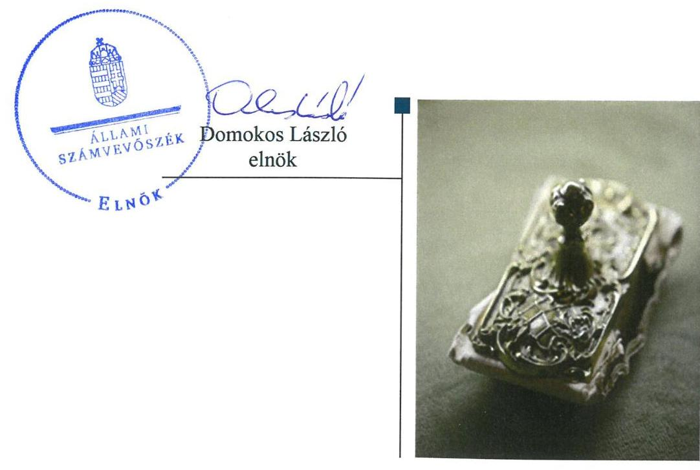
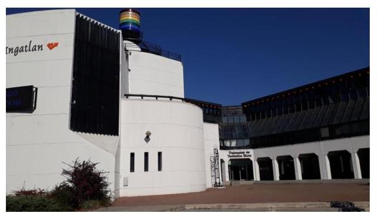

# Jelentés 

## Nem állami humánszolgáltatók ellenőrzése

A humánszolgáltatást nyújtó államháztartáson kívüli köznevelési és szociális intézmények, szolgáltatók fenntartói központi költségvetésből kapott támogatásai felhasználásának ellenőrzése - Fókusz Oktató Közhasznú Nonprofit Kft.

2019

---

# Jelentés 

## Nem állami humánszolgáltatók ellenőrzése

A humánszolgáltatást nyújtó államháztartáson kívüli köznevelési és szociális intézmények, szolgáltatók fenntartói központi költségvetésből kapott támogatásai felhasználásának ellenőrzése - Fókusz Oktató Közhasznú Nonprofit Kft.
2019. 09. 11.

---

# AZ ELLENŐRZÉST FELÜGYELTE:

- KAKAS SÁNDOR felügyeleti vezető

- AZ ELLENŐRZÉST VEZETTE ÉS A VÉGREHAJTÁSÁÉRT FELELŐS:
  - DR. PELLEI TAMÁS ellenőrzésvezető
  - A PROGRAM ÖSSZEÁLLÍTÁSÁÉRT FELELŐS:
    - TÓTPÁL SZABOLCS osztályvezető

- IKTATÓSZÁM: EL-1572-001/2019.
- TÉMASZÁM: 2448
- ELLENŐRZÉS-AZONOSÍTÓ SZÁM: V079424

Jelentéseink az Országgyűlés számítógépes hálózatán és az Interneten a www.asz.hu címen is olvashatóak.

---

# TARTALOMJEGYZÉK 

■ ÖSSZEGZÉS ..... 5
■ AZ ELLENŐRZÉS CÉLJA ..... 6
■ AZ ELLENŐRZÉS TERÜLETE ..... 7
■ AZ ELLENŐRZÉS HÁTTERE, INDOKOLTSÁGA ..... 8
■ A JELENTÉS LÉNYEGES KÉRDÉSKÖREI ..... 9
■ AZ ELLENŐRZÉS HATÓKÖRE ÉS MÓDSZEREI ..... 10
■ MEGÁLLAPÍTÁSOK ..... 12
■ JAVASLATOK ..... 15
■ MELLÉKLETEK ..... 17
I. sz. melléklet: Értelmező szótár ..... 17
■ FÜGGELÉKEK ..... 19
I. sz. függelék a Jelentéshez ..... 19
II. sz. függelék: Észrevételek ..... 20
■ RÖVIDÍTÉSEK JEGYZÉKE ..... 23

---

.

---

# ÖSSZEGZÉS 

A Fókusz Oktató Közhasznú Nonprofit Kft. - mint intézményfenntartó - a költségvetési támogatások átlátható, elszámoltatható igénybevételének és felhasználásának feltételeit nem teremtette meg. A közszolgáltatás igénybevételének és a szociális alapon adható kedvezmények feltételeit nem határozta meg.

## Az ellenőrzés társadalmi indokoltsága

Az Állami Számvevőszék stratégiájában hangsúlyos szerepet szán annak, hogy szilárd szakmai alapon álló, értékteremtő ellenőrzéseivel előmozdítsa a közpénzügyek átláthatóságát, rendezettségét, javaslataival a közpénzek és a közvagyon szabályos, gazdaságos, hatékony és eredményes felhasználását segítse. Stratégiájában az Állami Számvevőszék célul tűzte ki, hogy az államháztartáson kívülre nyújtott költségvetési támogatások ellenőrzésével hozzájárul ahhoz, hogy a közpénzeket az államháztartáson kívüli szervezetek is átlátható módon használják fel a közfeladatok szerződésben vállalt ellátása érdekében. Tekintettel az elmúlt években a köznevelés finanszírozását és a köznevelési intézmények fenntartását érintően végbement változásokra, a társadalom fokozott érdeklődéssel figyeli a köznevelési feladatok ellátására fordított források felhasználását. Fontos ezért az Állami Számvevőszéknek a közvéleményt biztosítani arról, hogy a közpénz államháztartáson kívüli felhasználása ezen a területen sem marad ellenőrizetlenül. Az ellenőrzés hozzájárul ahhoz is, hogy a nyilvánosság és a közszolgáltatást igénybevevők megfelelő tájékoztatást kapjanak az államháztartáson kívüli közfeladatot ellátók működéséről. A Fókusz Oktató Közhasznú Nonprofit Kft.-nél végzett ellenőrzést további társadalmi elvárás is indokolta köznevelési tevékenységéből adódóan, mely révén két megye gimnáziumi, szakiskolai, szakgimnáziumi, illetve szakközépiskolai feladatainak ellátásában is részt vett.

## Főbb megállapítások, következtetések, javaslatok

A Fókusz Oktató Közhasznú Nonprofit Kft. a szabályszerű gazdálkodási környezet kialakításának hiányában nem teremtette meg a költségvetési támogatások átlátható, elszámoltatható igénybevételének, felhasználásának feltételeit. A közfeladat-ellátást a 2014-2017. években jogszabályi előírások szerint szervezte meg.

A Fókusz Oktató Közhasznú Nonprofit Kft. nem határozta meg az intézmény által kérhető térítési díj és tandíj megállapításának szabályait, valamint a szociális alapon adható kedvezmények feltételeit. Ez által nem alakította ki az intézmény szabályszerű működtetéséhez szükséges jogszabályban előírt kereteket és nem határozta meg a közszolgáltatás igénybevételének feltételeit.

A Fókusz Oktató Közhasznú Nonprofit Kft. a közérdekű adatok közzétételi kötelezettségének nem tett eleget.
Az Állami Számvevőszék a jelentésben foglalt megállapítások alapján a Fókusz Oktató Közhasznú Nonprofit Kft. ügyvezetőjének hat javaslatot fogalmazott meg. A javaslatokat megalapozó megállapításokra az érintettnek 30 napon belül intézkedési tervet kell készítenie.

---

# AZ ELLENŐRZÉS CÉLJA

**AZ ELLENŐRZÉS CÉLJA** annak értékelése volt, hogy a Fókusz Oktató Közhasznú Nonprofit Kft. mint köznevelési intézményfenntartó központi költségvetésből kapott támogatásainak felhasználása szabályszerű volt-e, a támogatások igénylése, évközi módosítása és év végi elszámolása megfelelte-e a jogszabályi előírásoknak.

---

# AZ ELLENŐRZÉS TERÜLETE 

## Fókusz Oktató Közhasznú Nonprofit Kft., mint intézményfenntartó

A 2010-ben magánszemély által alapított Fókusz Oktató Közhasznú Nonprofit Kft. 2016. március 31-ig egyszemélyes gazdasági társaságként működött, ezt követően a tagok száma eggyel bővült. A Fenntartó ${ }^{1}$ közhasznú tevékenysége körében középiskolai oktatási tevékenységet végzett, 2014-2015. években vállalkozási tevékenységet is folytatott. Legfőbb szerve a taggyülés volt. A Fenntartó képviseletét az ügyvezető látta el, akinek a személyében nem történt változás az ellenőrzött időszakban.

2014-től a Fenntartó működésének és gazdálkodásának ellenőrzésére Felügyelő Bizottságot hoztak létre.

A Fenntartó 2010-ben alapította a Fókusz Gimnázium és Szakképző Iskolát, amely gimnáziumi és szakiskolai, szakgimnáziumi és szakközépiskolai képzést folytatott nappali rendszerű, esti, valamint levelező oktatás munkarendje szerint. A Fenntartó az intézmény² feladatai ellátására az alapítói okiratban Borsod-Abaúj-Zemplén és Bács-Kiskun megyében összesen négy telephelyet jelölt ki.

A Fenntartó összes bevétele a 2014. évi 323,2 M Ft-ról 2017. évre 14,5 %-kal 276,5 M Ft-ra csökkent. A költségvetési támogatás összes bevételhez viszonyított aránya 2014-ben 81,8\% volt, ami 2017-re 79,3\%-ra csökkent.

---

# AZ ELLENŐRZÉS HÁTTERE, INDOKOLTSÁGA 

A köznevelési feladatokat ellátó nem állami intézményfenntartók részére közfeladataik ellátására évente jelentős összegű pénzügyi támogatást biztosítottak a mindenkori költségvetési törvények a bennük megfogalmazott feltételek mellett.

Az Országgyűlés elfogadta a nemzeti köznevelésről szóló 2011. évi CXC. törvényt, amely jelentősen átalakította a korábbi finanszírozási rendszert 2013 szeptemberétől. Új feladatfinanszírozási forma (átlagbéralapú támogatás) jelent meg, amely az államháztartáson kívüli intézményfenntartókra is vonatkozik. Az ellenőrzés a finanszírozási rendszerben bekövetkezett változásokra, azok közfeladat ellátásra gyakorolt hatására fókuszált a költségvetési támogatásokat felhasználó államháztartáson kívüli szervezetek körében. Az ellenőrzés indokoltságát az is alátámasztotta, hogy az ÁSZ ${ }^{3}$ még nem ellenőrizte átfogóan e területet.

Az ÁSZ stratégiájában foglaltak alapján is indokolt az ellenőrzés, amely a társadalom számára jelzi, hogy a közpénz államháztartáson kívüli felhasználása sem maradhat ellenőrizetlenül. Az államháztartáson kívülre nyújtott költségvetési támogatások ellenőrzésével az ÁSZ hozzájárul ahhoz, hogy a közpénzeket a nem állami fenntartók átlátható módon használják fel a közfeladatok ellátására kötött szerződésekben vállalt kötelezettségek teljesítése érdekében. Az ÁSZ az ellenőrzés javaslataival hozzájárulhat az említett rendszerek szabályszerű támogatás-felhasználásához, javíthatja a társadalmi-gazdasági döntések megalapozottságát, amely a „jól irányított állam" működésének feltétele.

---

# A JELENTÉS LÉNYEGES KÉRDÉSKÖREI 

1. A köznevelési humánszolgáltatási közfeladatot ellátó Fenntartó szabályszerű működési - és gazdálkodási környezet kialakításával megteremtette-e a költségvetési támogatások átlátható, elszámoltatható igénybevételének, felhasználásának feltételeit?
2. Az államháztartáson kívüli Fenntartó az átvállalt köznevelési közfeladathoz biztosított költségvetési támogatásokat szabályszerűen fordította-e a humánszolgáltató intézménye működtetésére?
3. Az államháztartáson kívüli Fenntartó a köznevelési intézménye működtetéséhez felhasznált közpénzekre vonatkozó gazdálkodásával a nyilvánosság előtt elszámolt-e, ennek megalapozása érdekében ellenőrzési, értékelési és a külső ellenőrzésekkel kapcsolatos intézkedési feladatait szabályszerűen látta-e el?

---

# AZ ELLENŐRZÉS HATÓKÖRE ÉS MÓDSZEREI 

## Az ellenőrzés típusa

Megfelelőségi ellenőrzés.

## Az ellenőrzött időszak

A 2014. január 1-je és 2017. december 31-e közötti időszak. A helyszíni szemle tekintetében 2018. január 1-jétől az utolsó helyszíni szemle időpontjáig (2018. október 11-ig) tartó időszak.

## Az ellenőrzés tárgya

Az ellenőrzés a köznevelési közfeladatokat ellátó államháztartáson kívüli fenntartó közfeladatainak ellátásához a költségvetési törvényekben biztosított központi költségvetési támogatások igénylése, évközi módosítása és év végi elszámolása fenntartói feladatainak ellátása, illetve e központi költségvetésből kapott támogatásaik közfeladatokra való fenntartó általi felhasználása szabályszerűségének értékelésére terjedt ki.

Az ellenőrzés nem terjedt ki a költségvetési támogatás igénylése, módosítása, elszámolása valódiságának, megalapozottságának, helyességének értékelésére, valamint a források intézmény általi felhasználásának értékelésére.

## Az ellenőrzött szervezet

Fókusz Oktató Közhasznú Nonprofit Kft. mint intézményfenntartó.

## Az ellenőrzés jogalapja

Az ellenőrzés jogszabályi alapját az ÁSZ tv. ${ }^{4}$ 1. § (3) bekezdésében, valamint az 5. § (3) bekezdésében foglalt előírások adták.

## Az ellenőrzés módszerei

Az ellenőrzést az ellenőrzési program kérdései, az adott időszakban hatályos jogszabályok, az ellenőrzés szakmai szabályok és módszertanok, valamint a nemzetközi standardok figyelembevételével végezte az ÁSZ.

A közpénzekkel való felelős gazdálkodás segítésére irányuló javaslatok kidolgozásakor a hatályos jogszabályok voltak az irányadóak.

---

Az ellenőrzés ideje alatt az ÁSZ a Fenntartóval történő kapcsolattartást az ÁSZ SZMSZ ${ }^{5}$-ének vonatkozó előírásai alapján biztosította.

Az ellenőrzési kérdések megválaszolásához szükséges bizonyítékok megszerzése az ellenőrzött által rendelkezésre bocsátott dokumentumokra, adatokra alapozva történt.

Az ellenőrzési bizonyítékként felhasznált adatforrások közé tartoztak egyrészt a szakmai program részletes szempontjainál felsorolt adatforrások, másrészt minden - az ellenőrzés folyamán feltárt, az ellenőrzés szempontjából információt tartalmazó - dokumentum.

Az ellenőrzés lefolytatásához a Fenntartó a kitöltött tanúsítványok, valamint az ÁSZ által kért dokumentumok átadásával szolgáltatott adatokat, információkat. Az így rendelkezésre bocsátott adatok, információk és a tanúsítványok adatai valódiságának kontrollja az ellenőrzés keretében történt.

A fenntartott intézménynél helyszíni szemle keretében vizsgáltuk meg a tényleges feladatellátást. A köznevelési humánszolgáltatások központi költségvetési támogatásai igénylésével, módosításával, elszámolásával kapcsolatos, államháztartáson kívüli fenntartó jogszabályokban előírt feladatai betartását, továbbá a központi költségvetési támogatások szabályszerű kezelését, nyilvántartását ellenőriztük a Fenntartónál, az ott rendelkezésre álló határozatok, nyilvántartások, beszámolók és egyéb dokumentumok alapján.

---

# MEGÁLLAPÍTÁSOK 

## 1. A köznevelési humánszolgáltatási közfeladatot ellátó Fenntartó szabályszerű működési - és gazdálkodási környezet kialakításával megteremtette-e a költségvetési támogatások átlátható, elszámoltatható igénybevételének, felhasználásának feltételeit?

Összegző megállapítás

A Fenntartó nem teremtette meg a költségvetési támogatások átlátható, elszámoltatható igénybevételének, felhasználásának feltételeit, mert nem alakította ki a szabályszerű gazdálkodási környezetet.
1.1. számú megállapítás

A Fenntartó gazdálkodási környezetének kialakítása nem felelt meg a jogszabályi előírásoknak. A közfeladat-ellátást a jogszabályi előírások szerint szervezte meg.

Nem rendelkezett a Fenntartó - a Számv. tv. ${ }^{6}$ 161. § (1) bekezdés előírása ellenére - 2017-ben számlarenddel. Számviteli politikája ${ }^{7}$ 2015. július 4-től nem felelt meg a Számv. tv. 14. § (4) bekezdésében foglalt előírásnak, mert nem rögzítették benne azokat a jellemző szabályokat, előírásokat, módszereket, amelyekkel a Fenntartó meghatározza, hogy mit tekint a számviteli elszámolás az értékelés szempontjából kivételes nagyságú vagy előfordulású bevételnek, költségnek, ráfordításnak.

A Fenntartó rendelkezett a Gt.tv. ${ }^{8}$, illetve 2014. március 15-től a Ptk. ${ }^{9}$ előírása szerinti alapító okirattal ${ }_{1-5}{ }^{10}$, illetve 2016. március 31-től a Ptk. rendelkezései alapján társasági szerződéssel ${ }^{11}$, melyekben meghatározta szervezeti felépítését, működési rendjét, tevékenységét. A felelősségi és hatásköri szabályok a döntési, felelősségi körök szabályzatában ${ }^{12}$ kerültek meghatározásra. A költségvetési hozzájárulás igénybevételének feltételéül szolgáló szakképzési megállapodást a Fenntartó az Nkt.-ban ${ }^{13}$ foglaltak szerint megkötötte a Kormányhivatallal ${ }^{14}$.
1.2. számú megállapítás

A Fenntartó a költségvetési támogatások elszámolása során nem tartotta be a törvényi előírásokat.

A Fenntartó a Kvtv ${ }_{1-4}$-ben ${ }^{15}$ foglalt határidőt követően számolt el az ellenőrzött időszakban igénybevett támogatásokkal. Ezzel megsértette a Kvtv ${ }_{1}$ 33. § (8) bekezdésében, a Kvtv. 2 8. melléklet V./16. a) pontjában, a Kvtv 37. melléklet VI./16. a) pontjában és a Kvtv. 4 7. melléklet VI./25. a) pontjában foglaltakat.

A 2014-2017. évekre vonatkozó költségvetési támogatásokra vonatkozó kérelmét a Fenntartó szabályszerűen nyújtotta be - az Nkt. vhr.-ben ${ }^{16}$ előírt nyilatkozatokkal együtt - a Kincstárhoz ${ }^{17}$.

---

# 2. Az államháztartáson kívüli Fenntartó az átvállalt köznevelési közfeladathoz biztosított költségvetési támogatásokat szabályszerűen fordította-e a humánszolgáltató intézménye működtetésére?
 Összegző megállapítás

A Fenntartó az átvállalt köznevelési feladathoz megigényelt költségvetési támogatásokat a 2014-2017. években átadta a közfeladatot ellátó intézményének, a közszolgáltatás igénybevételének feltételeit azonban nem határozta meg.

A Fenntartó nem határozta meg az Nkt. 83. § (2) bekezdés c) pont előírása ellenére az intézmény által kérhető térítési díj és tandíj megállapításának szabályait, valamint a szociális alapon adható kedvezmények feltételeit.

Az intézmény könyvvezetési, beszámoló-készítési kötelezettségét a Számv. tv. 3. § (1) bekezdés 4. pontja szerinti egyéb szervezetek közé történő besorolásával - a Számv. tv. 6. § (3) bekezdésében rögzítettek ellenére - nem állapította meg.

Intézménye alapfeladatait - az Nkt. előírásainak megfelelően - intézményi alapító okiratban ${ }_{1-8}{ }^{18}$ határozta meg a Fenntartó. Az intézményt a Kormányhivatal nyilvántartásba vette, az Nkt. vhr.-ben meghatározott OM azonosítóval ${ }^{19}$ rendelkezett. A Fenntartó biztosította az intézmény működtetésének - Nkt. szerinti - szervezeti-, tárgyi- és pénzügyi feltételeit, az intézmény működési engedéllyel rendelkezett a Fenntartó.

A Fenntartó a megigényelt központi költségvetési támogatások teljes összegét - a Kvtv. ${ }_{1-4}$ által meghatározott határidőben - továbbadta intézményének.

A költségvetési támogatások felhasználását a Fenntartó az Nkt.vhr. előírásai szerint tartotta nyilván.

---

# 3. Az államháztartáson kívüli Fenntartó a köznevelési intézménye működtetéséhez felhasznált közpénzekre vonatkozó gazdálkodásával a nyilvánosság előtt elszámolt-e, ennek megalapozása érdekében ellenőrzési, értékelési és a külső ellenőrzésekkel kapcsolatos intézkedési feladatait szabályszerűen látta-e el? 

Összegző megállapítás

A Fenntartó a köznevelési intézménye működtetéséhez felhasznált közpénzekkel való gazdálkodását a nyilvánosság számára nem tette átláthatóvá, ellenőrzési és szakmai értékelési feladatokat nem végzett.

3.1. számú megállapítás

A Fenntartó intézményét nem ellenőrizte, a pedagógiai-szakmai feladatok végrehajtásával, a szakmai munka eredményességével kapcsolatban értékelési feladatokat nem végzett.

A Fenntartó nem ellenőrizte - az Nkt. 83. § (2) bekezdés h) és i) pontja alapján - intézménye pedagógiai programját az ellenőrzött időszakban, nem értékelte a nevelési-oktatási intézmény pedagógiai programjában meghatározott feladatok végrehajtását, a pedagógiai-szakmai munka eredményességét.

A Fenntartó a Kormányhivatal ${ }^{20}$ által lefolytatott törvényességi ellenőrzéshez kapcsolódó intézkedési kötelezettségének eleget tett.
3.2. számú megállapítás

A Fenntartó a köznevelési intézménye működtetéséhez felhasznált közpénzekre vonatkozó közzétételi kötelezettségének nem tett eleget.

Az Info tv.-ben ${ }^{21}$ meghatározott közzétételi listákon szereplő adatok pontos, naprakész és folyamatos közzétételének, a közzétételi kötelezettség teljesítésének a részletes szabályait az Info tv. 35. § (3) bekezdésben foglalt előírások ellenére nem alakította ki a Fenntartó.

Nem gondoskodott a Fenntartó az Info tv. 37. § (1) bekezdésében foglaltak ellenére - a 2014.-2017. évek beszámolóinak kivételével - az Info tv. 1. melléklet szerinti általános közzétételi listában felsorolt adatok közzétételéről. A Fenntartó a Számv. tv. előírásának megfelelő, egyszerűsített éves beszámolót készített a Civil tv. ${ }^{22}$ előírása szerinti közhasznúsági melléklettel.

---

# JAVASLATOK 

Az ÁSZ tv. 33. § (1) bekezdésében foglaltak értelmében az ellenőrzött szervezet vezetője köteles a jelentésben foglalt megállapításokhoz kapcsolódó intézkedési tervet összeállítani és azt a jelentés kézhezvételétől számított 30 napon belül az ÁSZ részére megküldeni. Amennyiben az ellenőrzött szervezet vezetője nem küldi meg határidőben az intézkedési tervet, vagy továbbra sem elfogadható intézkedési tervet küld, az Állami Számvevőszék elnöke az ÁSZ tv. 33. § (3) bekezdése a) és b) pontjaiban foglaltakat érvényesítheti.

## a Fókusz Oktató Közhasznú Nonprofit Kft. ügyvezetőjének

1. Intézkedjen a számlarend elkészítéséről a Számv. tv. előírásai szerint.
(1.1. sz. megállapítás 1. bekezdésének 1. mondata alapján)
2. Intézkedjen arra, hogy a számviteli politika megfeleljen a Számv. tv. előírásainak.
(1.1. sz. megállapítás 1. bekezdésének 2. mondata alapján)
3. Gondoskodjon az igénybevett támogatások jogszabályi határidőben történő elszámolásáról.
(1.2. sz. megállapítás 1. bekezdése alapján)
4. Határozza meg az intézmény által kérhető térítési díj és tandíj megállapításának szabályait, a szociális alapon adható kedvezmények feltételeit a jogszabályi előírás szerint.
(2. sz. megállapítás 1. bekezdése alapján)
5. Gondoskodjon az intézmény könyvvezetési, beszámoló-készítési kötelezettségének megállapításáról a jogszabályi előírások szerint.
(2. sz. megállapítás 2. bekezdése alapján)
6. Gondoskodjon az Info tv. előírásai alapján a közzétételi kötelezettség teljesítésének részletes szabályai megállapításáról.
(3.2. sz. megállapítás 1. bekezdése alapján)

---

.

---

# MELLÉKLETEK 

## I. SZ. MELLÉKLET: ÉRTELMEZŐ SZÓTÁR

humánszolgáltatás
költségvetési támogatás
köznevelési közfeladat

Külön törvényben meghatározott szociális, gyermekjóléti, gyermekvédelmi, közoktatási, felsőoktatási, kulturális közfeladatok (2014. évi Kvtv. 34. § (1), (4) bekezdés, 1. számú melléklet XX/20/2. alcím, 19. alcím, 2015. évi Kvtv. 43. § (1), (4) bekezdés, 1. számú melléklet XX/20/2/3. jogcím csoport, 19. alcím, 2016. évi Kvtv. 41. § (1), (4) bekezdés, 1. számú melléklet XX/20/2/3. jogcím csoport, 19. alcím).
a társadalombiztosítás pénzügyi alapjai kivételével az államháztartás központi alrendszeréből ellenérték nélkül, pénzben nyújtott támogatások (Áht. 1. § 14. pont)
A Kvtv-ekben (2013. évi CCXXX. törvény 33-34. §, 2014. évi C. törvény 42-43. §, 2015. évi C. törvény 40-41. §) megállapított támogatás. Például a 2015. évi C. törvény 40-41. § szerint többek között: Az Országgyűlés a köznevelési feladat ellátására átlagbéralapú támogatást állapít meg. A nevelési-oktatási, valamint pedagógiai szakszolgálati intézményt fenntartó nemzetiségi önkormányzat, az egyházi és magán köznevelési intézményfenntartója részére az általuk fenntartott nevelési-oktatási intézményben, továbbá pedagógiai szakszolgálati intézményben pedagógus és - a b) pont kivételével -nevelő-oktató munkát közvetlenül segítő munkakörben foglalkoztatottak után a 7. melléklet I. pontja, valamint az óvoda, egységes óvoda-bölcsőde esetében a 2. melléklet II. pont 1. alpontja szerint és az 5. alpontjában meghatározott jogosultak után, az őket ott megillető mértékek szerint. Működési támogatást állapít meg a nemzetiségi önkormányzat vagy az egyházi jogi személy által fenntartott nevelési-oktatási intézményekben ellátott, továbbá a pedagógiai szakszolgálati intézményekben gyógypedagógiai tanácsadásban, korai fejlesztésben, oktatásban és gondozásban, valamint a fejlesztő nevelésben részt vevő gyermekekre, tanulókra tekintettel a nemzetiségi önkormányzat és a bevett egyház részére a 7. melléklet II. pontja szerint.
Az Országgyűlés a szociális, gyermekjóléti, gyermekvédelmi közfeladatot ellátó intézményt, szolgáltatást fenntartó egyházi jogi személy, civil szervezet, közalapítvány, országos nemzetiségi önkormányzat, települési vagy területi nemzetiségi önkormányzat, gazdasági társaság, és a humánszolgáltatást alaptevékenységként végző, az Szja tv. hatálya alá tartozó egyéni vállalkozó (a továbbiakban együtt: nem állami szociális fenntartó) részére támogatást állapít meg a következők szerint: a támogatás a nem állami szociális fenntartót a települési önkormányzatok 2. melléklet III. pont 3. alpont c)-k) pontjában és III. pont 5. alpont a) pontjában meghatározott támogatásaival azonos jogcímeken, összegben és feltételek mellett illeti meg.
A köznevelési intézmény alapító okiratában foglalt feladat: óvodai nevelés, nemzetiséghez tartozók óvodai nevelése, általános iskolai nevelés-oktatás, nemzetiséghez tartozók általános iskolai nevelése-oktatása, kollégiumi ellátás, nemzetiségi kollégiumi ellátás, gimnáziumi nevelés-oktatás, szakközépiskolai nevelés-oktatás, szakiskolai nevelés-oktatás, nemzetiség gimnáziumi nevelés-oktatása, nemzetiség szakközépiskolai nevelés-oktatása, nemzetiség szakiskolai nevelés-oktatása, Köznevelési Hidprogramok keretében folyó nevelés-oktatás, felnőttoktatás, alapfokú művészetoktatás, fejlesztő nevelés, fejlesztő nevelés-oktatás, pedagógiai szakszolgálati feladat, a többi gyermekkel, tanulóval együtt nevelhető, oktatható sajátos nevelési igényű gyermekek, tanulók óvodai nevelése és iskolai nevelése-oktatása, azoknak a sajátos nevelési igényű gyermekeknek, tanulóknak az óvodai, iskolai, kollégiumi ellátása, akik a többi gyermekkel, tanulóval nem foglalkoztathatók együtt, a gyermekgyógyüdülőkben, egészségügyi intézményekben, rehabilitációs intézményekben tartós gyógykezelés alatt álló gyermekek tankötelezettségének teljesítéséhez szükséges oktatás, pedagógiai-szakmai szolgáltatás.

---

# Mellékletek 

köznevelési intézmény
nem állami, nem önkormányzati (államháztartáson kívüli) intézményfenntartó

A nevelési- oktatási intézmény, pedagógiai szakszolgálati intézmény, pedagógiai-szakmai szolgáltatást nyújtó intézmény.
A köznevelési és szociális, gyermekjóléti és gyermekvédelmi közfeladatokat/humánszolgáltatásokat ellátó intézményt fenntartó egyházi jogi személy, társadalmi szervezet, alapítvány, közalapítvány, civil szervezet, országos nemzetiségi önkormányzat, nonprofit gazdasági társaság, gazdasági társaság és a humánszolgáltatást alaptevékenységként végző, Szja tv. hatálya alá tartozó egyéni vállalkozó. (2013. évi Kvtv. 35. § (1), (3) bekezdés, 2014. évi Kvtv. 33. §, 34. § (1), (4) bekezdés, 2015. évi Kvtv. 42. §, 43. § (1), (4) bekezdés, 2016. évi Kvtv. 40. §, 41. § (1), (4) bekezdés)

---

# FÜGGELÉKEK 

- I. SZ. FÜGGELÉK A JELENTÉSHEZ

Az Állami Számvevőszék az ellenőrzések során feltárt tényekhez kapcsolódó további körülmények tisztázására eszközrendszerrel nem rendelkezik. Amennyiben az ellenőrzésen túlmutatóan indokoltnak látszik az ellenőrzés során feltárt körülmények további vizsgálata, az Állami Számvevőszék törvényi felhatalmazás alapján az ellenőrzés által feltárt körülményeket továbbítja a hatáskörrel rendelkező szervnek a szükséges intézkedések megtétele, eljárások lefolytatása érdekében.
Az ÁSZ helyszíni szemle keretében ellenőrizte - az Ász tv. 25. § (3) bekezdése alapján -a Fenntartó közfeladat ellátását a feladat ellátási helyeken.
A Fenntartó adatszolgáltatása, valamint a Hivatal ${ }^{23}$ honlapján a Köznevelés Információs Rendszerében (KIR) közzétett közhiteles adatok alapján az Intézmény 2018. október 11-én feladatellátási hellyel rendelkezett Kecskeméten a Ceglédi út 2. szám alatt. Az Intézmény 2018. augusztus 31-től hatályos alapító okirata ${ }^{24}$ és a 2018. szeptember 1-jétől hatályos működési engedélye ${ }^{25}$ szerint a kecskeméti feladatellátási helyen ${ }^{26}$ ellátandó feladatok nappali rendszerű gimnáziumi nevelés-oktatási, valamint felnőtt oktatás keretében, nappali és esti munkarendben történő gimnáziumi nevelés-oktatási feladatok voltak, amelyek ellátására - a Fenntartó a 2018. január 22-én a Kincstár felé benyújtott támogatás iránti kérelme, illetve a Kincstár támogatást megállapító határozata ${ }^{27}$ alapján - költségvetési támogatást vett igénybe.
A helyszíni ellenőrzésre a kecskeméti feladatellátási helyen 2018. október 11-én 8 óra 50 perctől 9.00 óráig került sor. A helyszíni szemlén felvett jegyzőkönyv szerint a kecskeméti feladatellátási helyen egy zárt épület volt található, az iskola nem működött.
Tekintettel arra, hogy a Fókusz Gimnázium, Szakképző Iskola és Felnőttképző Intézmény a 2018. augusztus 31-től hatályos alapító okiratában és 2018. szeptember 1-jétől hatályos működési engedélyében rögzített adatokkal ellentétben - a kecskeméti feladatellátási helyen a helyszíni szemle idején nem működött, felmerült annak a gyanúja, hogy a Fenntartó az Intézményt nem az alapító okiratban és a működési engedélyben meghatározottak szerint működtette.
Az eset konkrét körülményeinek felderítése a megyei kormányhivatal hatáskörébe tartozik.

---

A jelentéstervezetet a Számvevőszék 15 napos észrevételezésre megküldte az ellenőrzött szervezet vezetőjének az ÁSZ tv. 29. §* (1) bekezdése előírásának megfelelően.

A „Fókusz Oktató Közhasznú Nonprofit Kft." ügyvezetője a jelentéstervezet megállapításaira írásban észrevételt tett.
Az ÁSZ tv. 29. § (3) bekezdésével összhangban az ÁSZ a Függelékben feltünteti az ellenőrzés megállapításaival kapcsolatban tett, figyelembe nem vett észrevételeket, és megindokolja, hogy azokat miért nem fogadta el.

[^0]
[^0]:    * 29. § (1) Az Állami Számvevőszék az ellenőrzési megállapításait megküldi az ellenőrzött szervezet vezetőjének vagy az általa megbízott személynek, és annak, akinek személyes felelősségét állapította meg.
    (2) Az ellenőrzött szervezet vezetője és a felelősként megjelölt személy az ellenőrzés megállapításaira tizenöt napon belül írásban észrevételt tehet.
    (3) Az Állami Számvevőszék az észrevételre a beérkezésétől számított harminc napon belül írásban válaszol. A figyelembe nem vett észrevételeket köteles a jelentésben feltüntetni, és megindokolni, hogy azokat miért nem fogadta el.

---

A „Nem állami humánszolgáltatók ellenőrzése - A humánszolgáltatást nyújtó államháztartáson kívüli köznevelési és szociális intézmények, szolgáltatók fenntartói központi költségvetésből kapott támogatásai felhasználásának ellenőrzése - Fókusz Oktató Közhasznú Nonprofit Kft." címmel készített számvevőszéki jelentéstervezet

 megállapításaival kapcsolatban az ügyvezető által 2019. április 17-én tett (az Állami Számvevőszékhez 2019. április 25-én érkezett) észrevételek és azok kezelésének indokolása.

# 1) Az 1.2 sz. megállapítás 1. bekezdéséhez tett észrevétel: 

Az ügyvezető észrevételében jelezte, hogy a Fókusz Oktató Közhasznú Nonprofit Kft. (továbbiakban: Fenntartó) a Magyar Államkincstár (MÁK) felé mindig a határidők betartásával adja be az elszámolásokat. Az ellenőrzött időszakban az elszámolások beérkezése tekintetében egyeztetések történtek a MÁK Borsod-Abaúj-Zemplén Megyei Igazgatóságával. Az egyeztetések alapján a 2014. évi elszámolást 2015. március 31-én, a 2015. évi elszámolást 2016. március 31-én, a 2016. évi elszámolást pedig 2017. március 31-én személyesen adta le, továbbá a 2018. évi elszámolás postai feladásának tértivevényén szereplő időpont 2019. március 31-e volt. Észrevételében jelezte továbbá, hogy az ellenőrzés részére átadott dokumentumokban egyes oldalakon a dátumok adminisztratív hibák miatt tévesen szerepelnek.
Az észrevételt nem fogadtuk el. Észrevételében az ügyvezető elismerte, hogy az ellenőrzés részére átadott dokumentumokban adminisztratív hibák miatt több esetben szerepelnek téves időpontok, az „adott dokumentumokon belül egyes oldalakon a dátum tévesen szerepel, míg a többi oldalon helyesen". Az Állami Számvevőszék (továbbiakban: ÁSZ) az ellenőrzési megállapításait az adatszolgáltatás során a részére törvényi határidőben rendelkezésre bocsátott dokumentumokra alapozva fogalmazza meg. Az ellenőrzési dokumentumok ismételt felülvizsgálatát követően megállapítást nyert, hogy a 2018. szeptember 11-én kelt teljességi és hitelességi nyilatkozat 2.15. és 3.22. pontjában felsorolt dokumentumok alátámasztják az ügyvezető észrevételében foglaltakat, amely szerint az ellenőrzés részére átadott, az egyes évek elszámolását alátámasztó dokumentumokban eltérő időpontok szerepelnek. Az ellenőrzési dokumentumok alapján az ügyvezető által említett „adminisztratív hibák" az ellenőrzött 2014-2017. közötti időszak minden évében fennálltak. Az ellenőrzött időszak minden évében az egyes adatlapok és nyilatkozatok keltezése az adott év április hónapjában történt, így a teljes elszámolási dokumentáció benyújtása egyik évben sem történhetett meg - a központi költségvetésről szóló törvények előírásai szerint - az adott év március 31-éig.
Az ügyvezető a 2018. szeptember 11-én kelt teljességi és hitelességi nyilatkozatában az átadott dokumentumok, adatok hitelességéért, valódiságáért, hiánytalanságáért teljes felelősséget vállalt. A Fenntartó a 2018. augusztus 28-án kelt EL-0739-004/2019. ikt. sz. adatbekérő levél 2.15. és 3.22. pontjában foglaltak ellenére a 2014-2017. évekre vonatkozóan az elszámolási dokumentáció benyújtását igazoló dokumentumokat nem bocsátott az ellenőrzés rendelkezésére. A Fenntartó az észrevételben hivatkozott „személyes benyújtásra”, illetve a 2017. évi elszámolás tekintetében a postai feladás tértivevényére vonatkozóan alátámasztó dokumentumokat nem bocsátott az ellenőrzés rendelkezésre. Fentiek alapján nem igazolt, hogy az ellenőrzött időszakban a Fenntartó az igénybevett támogatásokkal a törvényes határidőben elszámolt, ezért a jelentéstervezet módosítása nem indokolt.

## 2) A jelentéstervezet Függelékéhez tett észrevétel:

Az észrevétel szerint a 2018. évi támogatási kérelem benyújtása során a 2018. szeptember-december időszakra a Fenntartónak becsült tanulói létszámot kell megadnia. A gimnáziumi nevelés-oktatás nappali munkarendje szerinti becsült tanulói létszámot 21 főben határozta meg a 2018. januári igénylés során. A tényleges tanulói létszám az átjelentkezések miatt 2018. szeptemberére 0 főre csökkent. A 2019. március 31-én beadott 2018. évi elszámolásban már a 0 fős adat került feltüntetésre.
Az észrevételt nem fogadtuk el. Az ügyvezető az észrevételében elismerte, hogy a 2018. szeptember 1-től hatályos működési engedély tartalmazza a nappali rendszerű gimnáziumi nevelés-oktatási feladatokat, ugyanakkor a Kecskemét, Ceglédi út 2. szám alatti telephelyen - a 0 fő tanulói létszámra tekintettel - nappali rendszerű képzés nem folyt. A helyszíni szemle időpontjában - 2018. október 11. 8:50 perc és 9:00 perc között - az adminisztratív és segítői feladatokat ellátó személyek sem tartózkodtak az épületben.
A helyszíni szemle tekintetében az ellenőrzött időszak a 2018. január 1-jétől az utolsó helyszíni szemle időpontjáig (2018. október 11-ig) tartó időszak volt. Az észrevételben hivatkozott - és az észrevételhez mellékletként csatolt, 2019. március 28-án kelt 2018. évi elszámoló lap az ellenőrzött időszakon túli, ezért az ellenőrzött időszakra vonatkozóan a jelentéstervezet Függelék részben foglaltakat nem módosítja, figyelembe vétele nem indokolt.

---

.

---

# RÖVIDÍTÉSEK JEGYZÉKE 

${ }^{1}$ Fenntartó
${ }^{2}$ Intézmény
${ }^{3}$ ÁSZ
${ }^{4}$ ÁSZ tv.
${ }^{5}$ ÁSZ SZMSZ
${ }^{6}$ Számv. tv.
${ }^{7}$ számviteli politika
${ }^{8}$ Gt.tv.
${ }^{9}$ Ptk.
${ }^{10}$ alapító okirat ${ }_{1-3}$
${ }^{11}$ társasági szerződés
${ }^{12}$ döntési, felelősségi körök szabályzata
${ }^{13} \mathrm{Nkt}$.
${ }^{14}$ Kormányhivatal
${ }^{15} \mathrm{Kvtv}_{1-4}$
${ }^{16} \mathrm{Nkt}$. vhr.
${ }^{17}$ Kincstár
${ }^{18}$ intézmény alapító okirata ${ }_{1-8}$

Fókusz Oktató Közhasznú Nonprofit Kft.
Fókusz Gimnázium és Szakképző Iskola (2018. május 28-ig)
Fókusz Gimnázium, Szakképző iskola és Felnőttképző Intézmény (2018. május 29-től)
Állami Számvevőszék
2011. évi LXVI. törvény az Állami Számvevőszékről (hatályos: 2011. július 1-jétől)
az Állami Számvevőszék elnökének 4/2017. (XII.29.) ÁSZ utasítása az Állami Számvevőszék Szervezeti és Működési Szabályzatáról (hatályos: 2017. január 1-jétől)
2000. évi C. törvény a számvitelről

Fókusz Oktató Közhasznú Nonprofit Kft. gazdálkodási szabályzatának I. pontja (hatályos: 2013. szeptember 30-ától)
2006. évi IV. törvény a gazdasági társaságokról
(hatályon kívül helyezve: 2014. március 15-től)
2013. évi V. törvény a Polgári Törvénykönyvről (hatályos: 2014. március 15-től)

1: Fókusz Oktató Közhasznú Nonprofit Kft. - Alapító Okirat módosításokkal egységes szerkezetben (hatályos: 2013. szeptember 30-tól)
2: Fókusz Oktató Közhasznú Nonprofit Kft. - Alapító Okirat módosításokkal egységes szerkezetben (hatályos: 2015. május 13-tól)
3: Fókusz Oktató Közhasznú Nonprofit Kft. - Alapító Okirat módosításokkal egységes szerkezetben (hatályos: 2015. október 21-től)
Fókusz Oktató Közhasznú Nonprofit Kft. - Társasági Szerződése módosításokkal egységes szerkezetbe foglalva (hatályos: 2016. március 31-től)
A Fókusz Oktató Közhasznú Nonprofit Kft. - Döntési, felelősségi körök szabályai (hatályos: 2013. szeptember 30-tól)
2011. évi CXC. törvény a nemzeti köznevelésről
(hatályos: 2012. szeptember 1-jétől)
Borsod-Abaúj-Zemplén Megyei Kormányhivatal
1: 2013. évi CCXXX. törvény Magyarország 2014. évi központi költségvetéséről (hatályos: 2014. január 1-jétől)
2: 2014. évi C. törvény Magyarország 2015. évi központi költségvetéséről, (hatályos: 2015. január 1-jétől)
3: 2015. évi C. törvény Magyarország 2016. évi központi költségvetéséről (hatályos: 2015. július 4-től)
4: 2016. évi XC. törvény Magyarország 2017. évi központi költségvetéséről (hatályos: 2016. november 1-jétől)
229/2012. (VIII.28.) Korm. rendelet a nemzeti köznevelési törvény végrehajtásáról (hatályos 2012. szeptember 1-jétől)
Magyar Államkincstár
1: Fókusz Gimnázium és Szakképző Iskola - Alapító Okirat 2013.
(hatályos: 2013. május 6-tól)
2: Fókusz Gimnázium és Szakképző Iskola - Alapító Okirat 2014. július 14.
(hatályos: 2014. július 14-től)

---

3: Fókusz Gimnázium és Szakképző Iskola - Alapító Okirat 2015. február 11. (hatályos: 2015. február 11-től)
4: Fókusz Gimnázium és Szakképző Iskola - Alapító Okirat 2015. május 28. (hatályos: 2015. május 28-tól)
5: Fókusz Gimnázium és Szakképző Iskola - Alapító Okirat 2016. május 27. (hatályos: 2016. május 27-től)
6: Fókusz Gimnázium és Szakképző Iskola - Alapító Okirat 2016. október 10. (hatályos: 2016. október 10-től)
7: Fókusz Gimnázium és Szakképző Iskola - Alapító Okirat (hatályos: 2017. május 16-tól)
8: Fókusz Gimnázium és Szakképző Iskola - Alapító Okirat 2015. február 11. (hatályos: 2017. augusztus 30-tól)
oktatási azonosító szám
Bács-Kiskun Megyei Kormányhivatal Kecskeméti Járási Hivatala
2011. évi CXII. törvény az információs önrendelkezési jogról és az információszabadságról (hatályos: 2011. július 27-től)
2011. évi CLXXV. törvény az egyesülési jogról, a közhasznú jogállásról, valamint a civil szervezetek működéséről és támogatásáról (hatályos: 2011. december 22-étől)
Oktatási Hivatal
9: Fókusz Gimnázium, Szakképző Iskola és Felnőttképző Intézmény - Alapító Okirat (hatályos: 2018. augusztus 31-től)
Bács-Kiskun megyei Kormányhivatal által BK-05/TH/04802-5/2018. számon és a Borsod-Abaúj-Zemplén megyei Kormányhivatal által BO-08/H3/6189-15/2018. számon kiadott működési engedélyek
Kecskemét, Ceglédi út 2. szám alatti feladatellátási hely
Magyar Államkincstár Borsod-Abaúj-Zemplén Megyei Igazgatóság Államháztartási Iroda BOR-ÁHI/396-11/2018. számú határozata

---

ÁLLAMI SZÁMVEVŐSZÉK
1052 Budapest, Apáczai Csere János utca 10.
Levélcím: 1364 Budapest 4. Pf. 54
Telefon: +36 14849100 Telefax: +36 14849200
www.asz.hu
