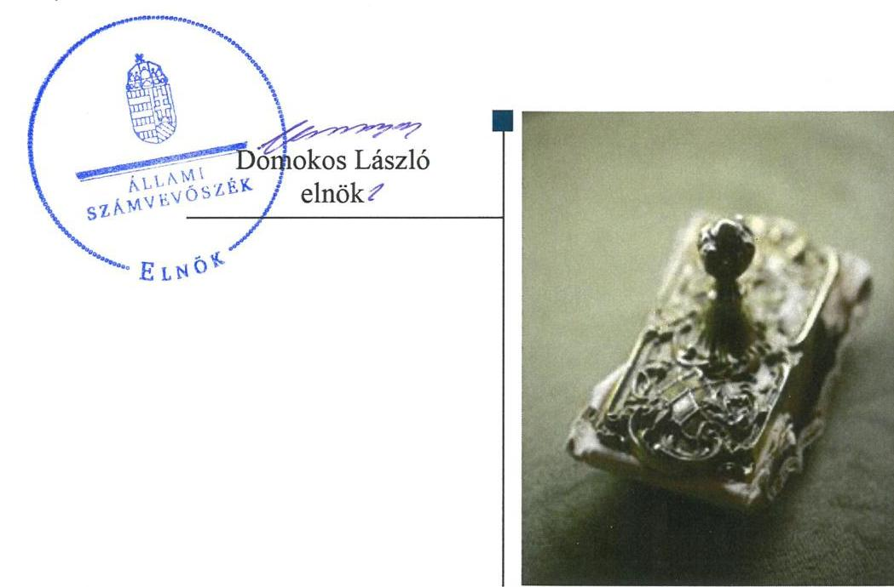
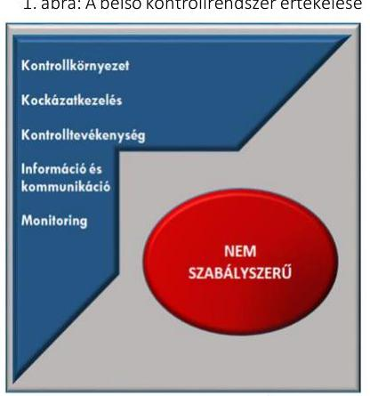

# Jelentés 

## Önkormányzatok integritás- és belső kontrollrendszere

Az önkormányzatok belső kontrollrendszere kialakításának és működtetésének ellenőrzése, Adósságrendezési eljárás ellenőrzése Vizsoly Község Önkormányzata 2019.

---

# Jelentés 

## Önkormányzatok integritás- és belső kontrollrendszere

Az önkormányzatok belső
kontrollrendszere kialakításának és működtetésének ellenőrzése, Adósságrendezési eljárás ellenőrzése Vizsoly Község Önkormányzata 2019. 06. hó 13. nap

---

# AZ ELLENŐRZÉST FELÜGYELTE:

- VARGA EDIT felügyeleti vezető:
- AZ ELLENŐRZÉST VEZETTE ÉS A VÉGREHAJTÁSÁÉRT FELELŐS:
- LACZI HEDVIG ANNA ellenőrzésvezető
- BAJNAI ZSUZSANNA ellenőrzésvezető
- A PROGRAM ÖSSZEÁLLÍTÁSÁÉRT FELELŐS:
- TÓTPÁL SZABOLCS osztályvezető

**IKTATÓSZÁM:** EL-0356-013/2019.

**TÉMASZÁM:** 2444

**ELLENŐRZÉS-AZONOSÍTÓ SZÁM:** V078925

Jelentéseink az Országgyűlés számítógépes hálózatán és az Interneten a www.asz.hu címen is olvashatóak.

---

# TARTALOMJEGYZÉK 

■ ÖSSZEGZÉS ..... 5
■ AZ ELLENŐRZÉS CÉLJA ..... 6
■ AZ ELLENŐRZÉS TERÜLETE ..... 7
■ AZ ELLENŐRZÉS HÁTTERE, INDOKOLTSÁGA ..... 8
■ A JELENTÉS LÉNYEGES KÉRDÉSKÖREI ..... 9
■ AZ ELLENŐRZÉS HATÓKÖRE ÉS MÓDSZEREI ..... 10
■ MEGÁLLAPÍTÁSOK ..... 12
■ JAVASLATOK ..... 15
■ MELLÉKLETEK ..... 19
I. sz. melléklet: Értelmező szótár ..... 19
■ FÜGGELÉKEK ..... 21
I. sz. függelék a Jelentéshez ..... 21
II. sz. függelék: Észrevételek ..... 22
■ RÖVIDÍTÉSEK JEGYZÉKE ..... 23

---

.

---

# ÖSSZEGZÉS 

Vizsoly Község Önkormányzatánál a belső kontrollrendszer kialakítása és működtetése, továbbá az adósságrendezési eljárás végrehajtása nem volt szabályszerű, így nem biztosították a közpénzfelhasználás szabályosságát és a nemzeti vagyonnal történő felelős gazdálkodást. Vizsoly Község Roma Nemzetiségi Önkormányzatával kapcsolatos gazdálkodási feladatok ellátása nem volt szabályszerű. Az integritás kontrollokat nem építették ki, ezért a korrupciós veszélyek ellen nem védett az Önkormányzat.

## Az ellenőrzés társadalmi indokoltsága

Az Állami Számvevőszék alapvető feladata a közpénzekkel, az állami és önkormányzati vagyonnal való gazdálkodás ellenőrzése. Az Alaptörvény szerint az önkormányzatok kötelezettsége a kiegyensúlyozott, átlátható és fenntartható költségvetési gazdálkodás elvének érvényesítése, a nemzeti vagyonnal való rendeltetésszerű és felelős módon való gazdálkodás biztosítása. Az Állami Számvevőszék stratégiájában megfogalmazott célkitűzése az integritás alapú, átlátható és elszámoltatható közpénzfelhasználás elősegítése. Ennek megvalósítása érdekében az Állami Számvevőszék prioritásként kezeli a közpénzzel gazdálkodó szervezetek esetében a belső kontrollrendszer működésének ellenőrzését.

Vizsoly Község Önkormányzatát az Állami Számvevőszék korábban nem ellenőrizte, a pénzügyi helyzetével kapcsolatos kockázatokra tekintettel került ellenőrzésre kiválasztásra.

## Főbb megállapítások, következtetések

Vizsoly Község Önkormányzata belső kontrollrendszerének kialakítása és működtetése nem volt szabályszerű.
Nem alakítottak ki olyan kontrollkörnyezetet, amelyben átláthatóak a felelősségi viszonyok, világosak a szervezeti hatáskörök, feladatok. A vagyonnyilatkozat-tételi kötelezettség szabályozásának hiányában nem volt biztosított a jogok és kötelességek pártatlan és elfogulatlan érvényesítése, a közélet tisztaságának biztosítása. Az integrált kockázatkezelési rendszer keretében előírt szabályzatokat a jegyző nem adta ki, nem mérte fel és állapította meg a tevékenységben rejlő és a szervezeti célokkal összefüggő kockázatokat, nem határozta meg az egyes kockázatokkal kapcsolatban szükséges intézkedéseket, valamint azok teljesítésének folyamatos nyomon követésének módját. A gazdálkodási folyamatokhoz kapcsolódó kontrolltevékenységek kialakítása nem volt szabályszerű, egyes kontrolltevékenységeket ellátók kijelölésének hiánya miatt nem volt garantált a közpénzfelhasználás során a felelős gazdálkodás. Az információs és kommunikációs rendszer kialakítása nem volt szabályszerű. A jegyző nem gondoskodott a célok megvalósításának nyomon követését biztosító rendszer kialakításáról.

Az integritás kontrollokat nem alakították ki.
Vizsoly Község Roma Nemzetiségi Önkormányzatával kapcsolatos gazdálkodási feladatok ellátása nem felelt meg a jogszabályi előírásoknak.

Vizsoly Község Önkormányzata adósságrendezési eljárásának végrehajtása nem volt szabályszerű.

---

# AZ ELLENŐRZÉS CÉLJA 

Az ellenőrzés célja annak megállapítása volt, hogy szabályszerűen történt-e az önkormányzat belső kontrollrendszerének kialakítása és működtetése, az biztosította-e az önkormányzatnál a közpénzfelhasználás szabályosságát, a közpénzekkel és a nemzeti vagyonnal történő szabályszerű és felelős gazdálkodást, a beszámolási és adatszolgáltatási kötelezettségek szabályszerű teljesítését. Az ellenőrzés keretében értékelte az ÁSZ ${ }^{1}$ az önkormányzat korrupciós kockázatainak kezelését szolgáló integritás kontrollok kiépítettségét és az integritás szemlélet érvényesülését.

Az ellenőrzés célja továbbá annak értékelése volt, hogy az adósságrendezési eljárás megindítása, lefolytatása szabályszerű volt-e, az önkormányzat gazdálkodása az adósságrendezési eljárás alatt megfelelt-e a jogszabályi előírásoknak, a lefolytatott eljárás elérte-e a törvényben kitűzött célokat.

---

# AZ ELLENŐRZÉS TERÜLETE 

## Vizsoly Község Önkormányzata

Vizsoly Borsod-Abaúj-Zemplén megyében található, állandó lakosainak száma 2016. január 1-jén 848 fő volt a Központi Statisztikai Hivatal Magyarország közigazgatási helynévkönyve adatai alapján.

Az Önkormányzat² öttagú képviselő-testületének ${ }^{3}$ munkáját egy állandó bizottság segítette. A településen Roma Nemzetiségi Önkormányzat ${ }^{4}$ működött.

Az Önkormányzat működésével kapcsolatos feladatok ellátásáról Közös Hivatal ${ }^{5}$ gondoskodott, amely önálló szervezeti egységekre nem tagolódott, gazdasági szervezete nem volt. A belső ellenőrzési feladatokat a Társulás ${ }^{6}$ látta el, mind az Önkormányzat, mind a Közös Hivatal vonatkozásában. Az Önkormányzat a Közös Hivatalon kívül egy további költségvetési szervvel, az Óvodával ${ }^{7}$ rendelkezett. A foglalkoztatottak létszáma száma 13 fő volt.

A polgármester ${ }^{8}$ a 2002. évi önkormányzati választások óta tölti be tisztségét, a Hivatal jegyzője; ${ }^{9}$ 2013. február 28-ig töltötte be tisztségét, míg a Közös Hivatal jegyzője; ${ }^{10}$ 2013. március 1-től lépett hivatalba.

Az Önkormányzat a 2016. évi éves költségvetési beszámolója szerint 318,1 millió Ft költségvetési bevételt ért el, valamint 280,0 millió Ft költségvetési kiadást teljesített. Vagyonának értéke 2016. december 31-én 531,3 millió Ft volt.

Az Önkormányzat ellen 2012. július 17-én adósságrendezési eljárás indult, amelynek befejezéséről szóló döntés 2013. február 27-én lépett hatályba.

---

# AZ ELLENŐRZÉS HÁTTERE, INDOKOLTSÁGA 

A DEMOKRATIKUS TÁRSADALMAKBAN alapvető igény, hogy a közpénzeket, a közvagyont használók tevékenységükről elszámoljanak, ahhoz egyértelmű és érvényesíthető felelősségi szabályok társuljanak. Ennek a jogos igénynek az érvényesítéséhez meg kell teremteni azokat a folyamatokat, rendszereket, amelyek nélkülözhetetlenek az elszámoltatáshoz. Az elszámoltatás eredményes működtetéséhez szükség van a megfelelő információs, kontroll-, értékelési és beszámolási rendszerek kialakítására. A belső kontrollok kiépítettsége hozzájárul az integritási szemlélet kialakításához és érvényesüléséhez. A belső kontrollrendszer kialakítása és működtetése nélkül nem valósítható meg a közpénzek, a közvagyon szabályos, gazdaságos, hatékony és eredményes felhasználása.

A BELSŐ KONTROLLRENDSZER azt a célt szolgálja, hogy az államháztartás szervei működésük és gazdálkodásuk során a tevékenységeket szabályszerűen, gazdaságosan, hatékonyan, eredményesen hajtsák végre, teljesítsék elszámolási kötelezettségeiket, és megvédjék az erőforrásokat a veszteségektől, a károktól, a nem rendeltetésszerű használattól. A belső kontrollrendszer magában foglalja mindazon szabályokat, eljárásokat, gyakorlati módszereket és szervezeti struktúrákat, kockázatkezelési technikákat, kontrolltevékenységeket, amelyek segítséget nyújtanak a szervezetnek céljai eléréséhez.

A megfelelő belső kontrollrendszer jelentősen csökkenti a hibák és szabálytalanságok kockázatát. Az ÁSZ célja, hogy javuljon az ellenőrzött önkormányzatok belső kontrollrendszerének szabályozottsága, működésének megfelelősége, szabályszerűsége, hozzájárulva ezzel az egyensúlyi helyzet fenntarthatóságának biztosításához, biztosítva az önkormányzatnál a közpénzfelhasználás szabályosságát, a közpénzekkel és a nemzeti vagyonnal történő szabályszerű, gazdaságos, hatékony és eredményes gazdálkodást.

AZ ELLENŐRZÉS VÁRHATÓ HASZNOSULÁSA négy szinten valósul meg. A törvényalkotás számára összegzett tapasztalatok állnak rendelkezésre a belső kontrollrendszer önkormányzati területen való kialakításáról, működtetéséről és hatásairól. Az ellenőrzés az ellenőrzött számára visszajelzést ad a belső kontrollrendszer kialakításában és működésében lévő hiányosságokról, javaslataival hozzájárul azok kiküszöböléséhez. Az ellenőrzés megállapításait és javaslatait más szervezetek is hasznosíthatják a rendezett gazdálkodási keretek kialakításához, a ,,jó gyakorlat" elterjesztésével azok az önkormányzatok is átvehetik a pozitív példákat, ahol nem végez ellenőrzést az ÁSZ.

Az ÁSZ ellenőrzései jelzik a társadalom számára, hogy közpénz nem maradhat ellenőrizetlenül, tevékenysége hozzájárul az értékteremtő rend kialakításához és megőrzéséhez.

---

# A JELENTÉS LÉNYEGES KÉRDÉSKÖREI 

1. Az Önkormányzat belső kontrollrendszerének kialakítása és működtetése szabályszerű volt-e?
2. A nemzetiségi önkormányzat gazdálkodásával kapcsolatos feladatok ellátása szabályszerű volt-e?
3. Az adósságrendezési eljárás végrehajtása szabályszerű volt-e?

---

# AZ ELLENŐRZÉS HATÓKÖRE ÉS MÓDSZEREI 

## Az ellenőrzés típusa

Megfelelőségi ellenőrzés.

## Az ellenőrzött időszak

A belső kontrollrendszer esetében a 2016. év volt. Az adósságrendezési eljárás esetében a 2010. január 1. és 2017. június 30. közötti időszakon belül az adósságrendezést megelőző egy teljes év január 1-jétől az adósságrendezéssel érintett évek és az adósságrendezés lezárását követő beszámolóval lezárt egy teljes év december 31-éig tartó időszak volt (Vizsoly Község Önkormányzata esetén az adósságrendezési eljárás 2012. július 17 - 2013. február 27. közötti időszakot érintette).

## Az ellenőrzés tárgya

A helyi önkormányzatnak, mint éves költségvetési beszámoló készítésére kötelezett szervezetnek és a gazdálkodási feladatait ellátó közös önkormányzati hivatalának belső kontrollrendszere az ellenőrzés tárgya, valamint az integritás szemlélet érvényesülése.

Az ellenőrzés kiterjedt minden olyan körülményre és adatra, amely az ÁSZ jogszabályban meghatározott feladatainak teljesítéséhez, valamint a program végrehajtása folyamán felmerült újabb összefüggések feltárásához szükséges volt.

A Har. tv. ${ }^{11}$ által szabályozott adósságrendezési eljárás.

## Az ellenőrzött szervezet

Vizsoly Község Önkormányzata és a gazdálkodási feladatait ellátó Boldogkőváraljai Közös Önkormányzati Hivatal.

## Az ellenőrzés jogalapja

Az ÁSZ tv. ${ }^{12}$ 5. § (2) bekezdése alapján az államháztartás gazdálkodásának ellenőrzése keretében az ÁSZ ellenőrzi a helyi önkormányzatok gazdálkodását, valamint az ÁSZ tv. 5. § (6) bekezdése alapján ellenőrzése során értékeli az államháztartás számviteli rendjének betartását és a belső kontrollrendszer működését.

---

# Az ellenőrzés módszerei 

Az ÁSZ az ellenőrzést az ellenőrzési program szempontjai, az ellenőrzött időszakban hatályos jogszabályok, az ellenőrzés szakmai szabályai, az egyes ellenőrzési típusokhoz kapcsolódó ÁSZ módszertanok figyelembevételével végezte.

Az ellenőrzés ideje alatt az ÁSZ az Önkormányzattal a kapcsolattartást az ÁSZ SZMSZ ${ }^{13}$-ének vonatkozó előírásai alapján biztosította.

Az ellenőrzési kérdések megválaszolásához szükséges bizonyítékok megszerzése az Önkormányzat által rendelkezésre bocsátott dokumentumokra, adatokra alapozva megfigyelés, szemle (szemrevételezés), valamint elemző eljárás keretében történt.

Az ellenőrzési bizonyítékként felhasználható adatforrások közé tartoztak egyrészt az ellenőrzési program részletes szempontjainál felsorolt adatforrások, másrészt minden - az ellenőrzés folyamán feltárt, az ellenőrzés szempontjából információt tartalmazó - dokumentum.

Az Önkormányzat belső kontrollrendszere jogszabályi előírások szerinti kialakításának és működtetésének szabályszerűségét az erre irányuló ellenőrzési kérdésekre adott válaszok összesítése alapján, pillérenként (kontrollkörnyezet, kockázatkezelési rendszer, kontrolltevékenységek, információs és kommunikációs rendszer, monitoring rendszer) és összesítetten is értékelte az ÁSZ. Az önkormányzat belső kontrollrendszere egyes pilléreinek kialakítása és működtetése „szabályszerű", amennyiben az értékelt területen az elért igen válaszok százalékban kifejezett, egész számra kerekített aránya meghaladja a 85%-ot, „nem szabályszerű", ha nem haladja meg, akkor a minősítés „nem szabályszerű" lesz. Az önkormányzat belső kontrollrendszerének összesített értékelése megegyezik a pillérenként (kontrollterületenként) alkalmazott százalékos értékelésekkel. A kontrollrendszer egésze esetében a „szabályszerű" értékelésnek a százalékos értéken felül további feltétele, hogy egyik kontrollterület sem kaphat „nem szabályszerű" értékelést. Az összesített értékelés a százalékos értéktől függetlenül „nem szabályszerű", ha az ellenőrzött kontrollterületek közül több mint egynek „nem szabályszerű" az értékelése.

A kiadások teljesítéséhez kapcsolódó kontrolltevékenység gyakorlása, működtetésének szabályszerűsége esetében az ellenőrzés azokra a legnagyobb értékű tételekre - a lényeges sokaságra - terjedt ki, melyek összértéke eléri a teljes sokaság összértékének 50%-át.

A közszféra integritás alapú kultúrájának kialakítása, megerősítése és működése szorosan összefügg a belső kontrollrendszer működésével, ezért az ellenőrzés kiterjedt annak értékelésére is, hogy a belső kontrollrendszer kialakítása és működtetése hogyan hatott az integritás szemlélet érvényesülésére.

Az adósságrendezési eljárás vonatkozásában amennyiben az önkormányzat működését és gazdálkodását alapvetően meghatározó dokumentum hiánya miatt, valamely lényeges kérdéskörre vonatkozóan az ÁSZ megállapítást tett, további ellenőrzési tevékenységek az adott kérdéskörrel és az
 azzal szoros logikai kapcsolatban lévő kérdéskörökkel - ráépülő jelleggel - nem kerültek végrehajtásra.

---

# 1. Az Önkormányzat belső kontrollrendszerének kialakítása és működtetése szabályszerű volt-e? 

## Összegző megállapítás

1. ábra: A belső kontrollrendszer értékelése

A belső kontrollrendszer kialakítása és működtetése nem volt szabályszerű.

A belső kontrollrendszer pillérenkénti és összesített értékelését az 1. ábra szemlélteti.

A KONTROLLKÖRNYEZET, a működés szervezeti kereteinek kialakítása nem volt szabályszerű, mert az Önkormányzati SZMSZ ${ }^{14}$-ben a Mötv. ${ }^{15}$ 39. § (3) bekezdésben foglaltak ellenére nem jelölték ki a „vagyonnyilatkozat-vizsgáló bizottság”-ot, továbbá nem tüntették fel a vagyonnyilatkozat-tételi kötelezettséget a Vnytv. ${ }^{16}$ 4.§ a) pontjában meghatározott személyek esetében a Közös Hivatali SZMSZ-ben ${ }^{17}$.

A jegyző által készített, jóváhagyott Közös Hivatali SZMSZ nem tartalmazta az Ávr. ${ }^{18} 13 . \S$ (1) bekezdés e) és g) pontjainak előírása ellenére a Közös Hivatal szervezeti ábráját, a Közös Hivatali SZMSZ-ben nevesített munkakörökhöz tartozó feladat- és hatásköröket, a hatáskörök gyakorlásának módját, a helyettesítés rendjét, az ezekhez kapcsolódó felelősségi szabályokat.

Az Önkormányzat és a Közös Hivatal Számviteli politikája ${ }^{19}$ és annak keretében kötelezően kialakítandó szabályzatok ${ }^{20}$ valamint a Számlarend ${ }^{21}$ megfelelt a Számv. tv. ${ }^{22}$ és az Áhsz. ${ }^{23}$ előírásainak.

KOCKÁZATKEZELÉSI RENDSZERT 2016. szeptember 30-ig, illetve az integrált kockázatkezelési rendszert 2016. október 1-jétől a jegyző nem alakított ki a Bkr. ${ }^{24}$ 3. § b) pontjában foglaltak ellenére a Közös Hivatalnál. Nem szabályozta 2016. szeptember 30-ig a szabálytalanságok kezelésének, 2016. október 1-jétől a szervezeti integritást sértő események kezelésének és az integrált kockázatkezelés eljárásrendjét a Bkr. 6.§ (4) bekezdésében előírtak ellenére. Továbbá nem mérte fel és állapította meg a Bkr. 7. § (2) bekezdésében foglaltak ellenére 2016. szeptember 30-ig a tevékenységében, gazdálkodásában rejlő, 2016. október 1-jétől a szervezeti célokkal összefüggő kockázatokat.

A KONTROLLTEVÉKENYSÉGEK kialakítása nem volt szabályszerű, mert a jegyző - figyelemmel az Ávr. 55. § (2) bekezdés c) pont cb) alpontjára - nem jelölt ki az Ávr. 55. § (2) bekezdés f) pontjának előírása ellenére a pénzügyi ellenjegyzés, az Ávr. 58. § (4) bekezdésének előírása ellenére az érvényesítő feladatának ellátására alkalmas köztisztviselőt az Önkormányzat és a Közös Hivatal kiadási előirányzatai terhére vállalt kötelezettség esetére.

AZ INFORMÁCIÓS ÉS KOMMUNIKÁCIÓS RENDSZER kialakítása nem volt szabályszerű, mert a jegyző a Közös Hivatal

---

iratkezelési szabályzatát ${ }^{25}$ az Ltv. ${ }^{26} 10 . \S$ (1) bekezdés c) pontjában foglaltak ellenére nem a Magyar Nemzeti Levéltárral egyetértésben adta ki, továbbá a polgármester nem készítette el az Önkormányzat, a jegyző a Közös Hivatal adatvédelmi és adatbiztonsági szabályzatát az Info tv. ${ }^{27}$ 24. § (3) bekezdésének előírása ellenére.

A MONITORING-RENDSZER kialakítása és működtetése nem volt szabályszerű, mert a jegyző nem alakította ki a Közös Hivatalnál a Bkr. 10. §-ában foglaltak ellenére a tevékenységek, célok operatív tevékenységek keretében megvalósuló folyamatos és eseti nyomon követését 2016. szeptember 30-ig, továbbá a Bkr. 32. § (3)-(4) bekezdésében foglaltak ellenére nem gondoskodott a 2016. évi ellenőrzési terv képviselő-testület elé terjesztésének polgármesternél való kezdeményezéséről.

A belső kontrollrendszer minőségét a Közös Hivatalra vonatkozóan a jegyző nem értékelte a Bkr. 11. § (1) bekezdése ellenére.

AZ INTEGRITÁS nem érvényesült az Önkormányzatnál a kockázatkezelési rendszer kialakításának hiánya miatt, az Önkormányzatnál a korrupciós kockázatokat nem kezelték.

# 2. A nemzetiségi önkormányzat gazdálkodásával kapcsolatos feladatok ellátása szabályszerű volt-e? 

Összegző megállapítás A Roma Nemzetiségi Önkormányzat gazdálkodásával kapcsolatos feladatok ellátása nem felelt meg a jogszabályi előírásoknak.

A ROMA NEMZETISÉGI ÖNKORMÁNYZAT gazdálkodásával kapcsolatos feladatok ellátása nem volt szabályszerű, mert az Önkormányzat a Nek. tv. ${ }^{28}$ 80. § (2) bekezdésében előírtak ellenére nem kötött megállapodást a Roma Nemzetiségi Önkormányzattal a helyiséghasználatra, a további feltételek biztosítására és a feladatok ellátására vonatkozóan.

## 3. Az adósságrendezési eljárás végrehajtása szabályszerű volt-e?

## Összegző megállapítás Az Önkormányzat adósságrendezési eljárásának végrehajtása nem volt szabályszerű.

Az Önkormányzat adósságrendezési eljárásának végrehajtása nem volt szabályszerű, mivel a jegyző 2011-2014. évek vonatkozásában:
nem készítette el az Ámr. ${ }^{29}$ 20. § (3) bekezdés a) pontjában, az Ávr. 13. § (2) bekezdés a) pontjában előírt, a gazdálkodással - így különösen a kötelezettségvállalás, ellenjegyzés, teljesítés igazolása, érvényesítés, utalványozás gyakorlásának módjával, eljárási és dokumentációs részletszabályaival, valamint az ezeket végző személyek

---

kijelölésének rendjével-, az ellenőrzési, adatszolgáltatási és beszámolási feladatok teljesítésével kapcsolatos belső előírásokat, feltételeket tartalmazó belső szabályzatot;
nem gondoskodott a kötelezettségvállalásra, pénzügyi ellenjegyzésre, teljesítés igazolására, érvényesítésre, utalványozásra jogosult személyek és aláírás-mintájuk naprakész nyilvántartásának vezetéséről az Ámr. 80. § (3) bekezdésében és az Ávr. 60. § (3) bekezdésében előírtak ellenére;
nem készített a beszámoló elkészítését megelőzően a könyvviteli zárlat során főkönyvi kivonatot a Számv. tv. 164. § (2) bekezdésében, az Áhsz. ${ }^{30}$ 50. § (1) bekezdésében, az Áhsz. ${ }_{2}$ 5. § (1) bekezdésében foglaltak ellenére.

---

# JAVASLATOK 

Az ÁSZ tv. 33. § (1) bekezdésében foglaltak értelmében az ellenőrzött szervezet vezetője köteles a jelentésben foglalt megállapításokhoz kapcsolódó intézkedési tervet összeállítani és azt a jelentés kézhezvételétől számított 30 napon belül az ÁSZ részére megküldeni. Amennyiben az ellenőrzött szervezet vezetője nem küldi meg határidőben az intézkedési tervet, vagy továbbra sem elfogadható intézkedési tervet küld, az Állami Számvevőszék elnöke az ÁSZ tv. 33. § (3) bekezdés a) és b) pontjaiban foglaltakat érvényesítheti.

## Boldogkőváraljai Közös Önkormányzati Hivatal jegyzőjének

1. Az Önkormányzat szabályszerű kontrollkörnyezetének kialakítása érdekében gondoskodjon az Önkormányzat jogszabályi előírásoknak megfelelő tartalmú szervezeti és működési szabályzatának elkészítéséről.
(1. sz. megállapítás 2. bekezdés 3. tagmondata alapján)
2. A Közös Hivatal szabályszerű kontrollkörnyezetének kialakítása érdekében gondoskodjon a Közös Hivatal jogszabályi előírásoknak megfelelő tartalmú szervezeti és működési szabályzatának elkészítéséről.
(1. sz. megállapítás 2. bekezdés 4. tagmondata és 1. sz. megállapítás 3. bekezdése alapján)
3. A Közös Hivatal szabályszerű belső kontrollrendszere kialakítása és működtetése érdekében gondoskodjon a jogszabályi előírásoknak megfelelően a Közös Hivatal szabályszerű integrált kockázatkezelési rendszerének kialakításáról és működtetéséről.
(1. sz. megállapítás 5. bekezdés 1. mondata alapján)
4. A Közös Hivatal szabályszerű integrált kockázatkezelési rendszerének kialakítása érdekében gondoskodjon:
a) a jogszabályi előírásnak megfelelően a szervezeti integritást sértő események kezelésének, valamint az integrált kockázatkezelés eljárásrendjének szabályozásáról;
(1. sz. megállapítás 5. bekezdés 2. mondat 2. tagmondata alapján)
b) a jogszabályi előírásnak megfelelően a szervezeti célokkal összefüggő kockázatok felméréséről és megállapításáról.
(1. sz. megállapítás 5. bekezdés 3. mondata alapján)

---

5. Az Önkormányzatnál és a Közös Hivatalnál a szabályszerű kontrolltevékenységek működtetése érdekében intézkedjen a pénzügyi ellenjegyzést, valamint az érvényesítést végző személyek jogszabályi előírásoknak megfelelő kijelöléséről.
(1. sz. megállapítás 6. bekezdése alapján)
6. A Közös Hivatal szabályszerű információs és kommunikációs rendszere kialakítása érdekében gondoskodjon:
a) a Közös Hivatal iratkezelési szabályzatának a Magyar Nemzeti Levéltárral egyetértésben való kiadásáról a jogszabályi előírásnak megfelelően;
(1. sz. megállapítás 7. bekezdés 2. tagmondata alapján)
b) a Közös Hivatal jogszabályban előírt adatvédelmi és adatbiztonsági szabályzatának megalkotásáról.
(1. sz. megállapítás 7. bekezdés 3. tagmondata alapján)
7. A szabályszerű monitoring rendszer kialakítása és működtetése érdekében gondoskodjon az éves ellenőrzési terv képviselő-testület elé terjesztésének polgármesternél való kezdeményezéséről.
(1. sz. megállapítás 8. bekezdése 3. tagmondata alapján)
8. Gondoskodjon a belső kontrollrendszer minőség jogszabályi előírásnak megfelelő értékeléséről.
(1. sz. megállapítás 9. bekezdése alapján)

# Vizsoly Község Önkormányzata polgármesterének 

1. Az Önkormányzat szabályszerű kontrollkörnyezetének kialakítása érdekében gondoskodjon az Önkormányzat jogszabályi előírásoknak megfelelő tartalmú szervezeti és működési szabályzatának képviselőtestület elé terjesztéséről.
(1. sz. megállapítás 2. bekezdés 3. tagmondata alapján)
2. A Közös Hivatal szabályszerű kontrollkörnyezetének kialakítása érdekében gondoskodjon a Közös Hivatal jogszabályi előírásoknak megfelelő tartalmú szervezeti és működési szabályzatának képviselő-testület elé terjesztéséről.
(1. sz. megállapítás 2. bekezdés 4. tagmondata és 1. sz. megállapítás 3. bekezdése alapján)

---

3. Az Önkormányzat szabályszerű információs és kommunikációs rendszere kialakítása érdekében gondoskodjon az Önkormányzat jogszabályban előírt adatvédelmi és adatbiztonsági szabályzatának megalkotásáról.
(1. sz. megállapítás 7. bekezdés 3. tagmondata alapján)
4. A Roma Nemzetiségi Önkormányzat gazdálkodásával kapcsolatos feladatok szabályszerű ellátása érdekében gondoskodjon a helyiséghasználatra, a további feltételek biztosítására és a feladatok ellátására vonatkozóan a megállapodás megkötéséről.
(2. sz. megállapítás 1. bekezdése alapján)

---

.

---

# MELLÉKLETEK 

- I. SZ. MELLÉKLET: ÉRTELMEZŐ SZÓTÁR
belső ellenőrzés
belső kontrollrendszer
belső kontrollrendszer pillérei, kontrollterületei
helyi önkormányzat
információs és kommunikációs rendszer
integrált kockázatkezelési rendszer

Független, tárgyilagos bizonyosságot adó és tanácsadó tevékenység, amelynek célja, hogy az ellenőrzött szervezet működését fejlessze és eredményességét növelje, az ellenőrzött szervezet céljai elérése érdekében rendszerszemléletű megközelítéssel és módszeresen értékeli, illetve fejleszti az ellenőrzött szervezet irányítási és belső kontrollrendszerének hatékonyságát. (Forrás: Bkr. 2. § b) pontja)
A belső kontrollrendszer a kockázatok kezelése és tárgyilagos bizonyosság megszerzése érdekében kialakított folyamatrendszer, amely azt a célt szolgálja, hogy a működés és gazdálkodás során a tevékenységeket szabályszerűen, gazdaságosan, hatékonyan, eredményesen hajtsák végre, az elszámolási kötelezettségeket teljesítsék, megvédjék az erőforrásokat a veszteségektől, károktól és nem rendeltetésszerű használattól. (Forrás: Áht. ${ }^{31}$ 69. § (1) bekezdése)
A kontrollkörnyezet, az (integrált) kockázatkezelési rendszer, a kontrolltevékenységek, az információs és kommunikációs rendszer, valamint a nyomon követési (monitoring) rendszer. (Forrás: Bkr. 3. §-a)
A helyi önkormányzat jogi személy. Az önkormányzati feladatok ellátását a képviselő-testület és szervei biztosítják. A képviselő-testület szervei: a polgármester, a főpolgármester, a megyei közgyűlés elnöke, a képviselő-testület bizottságai, a részönkormányzat testülete, az önkormányzati hivatal, a megyei önkormányzati hivatal, a közös önkormányzati hivatal, a jegyző, továbbá a társulás. A képviselő-testület a feladatkörébe tartozó közszolgáltatások ellátására - jogszabályban meghatározottak szerint - költségvetési szervet, a polgári perrendtartásról szóló törvény szerinti gazdálkodó szervezetet (a továbbiakban: gazdálkodó szervezet), nonprofit szervezetet és egyéb szervezetet (a továbbiakban együtt: intézmény) alapíthat, továbbá szerződést köthet természetes és jogi személlyel vagy jogi személyiséggel nem rendelkező szervezettel. A helyi önkormányzat éves költségvetési beszámolója magában foglalja a helyi önkormányzat - nem költségvetési szerveihez tartozó - feladataihoz kapcsolódó bevételeket és kiadásokat. A helyi önkormányzat összevont (konszolidált) költségvetési beszámolóját a helyi önkormányzatra és költségvetési szerveire vonatkozóan külön-külön beérkezett éves költségvetési beszámolók alapján a Kincstár készíti el és küldi meg az önkormányzatnak. (Forrás: Mötv. 41. § (1), (2), (6) bekezdései; Áhsz. 2 2. § (1) bekezdése, 6. § (1) bekezdés a) és f) pontja, 30. §-a, 37. § (1) és (6) bekezdése)
A költségvetési szerv vezetője által kialakított és működtetett olyan rendszer, mely biztosítja, hogy a megfelelő információk a megfelelő időben eljutnak az illetékes szervezethez, szervezeti egységhez, illetve személyhez. (Forrás: Bkr. 9. § (1) bekezdés)
olyan folyamatalapú kockázatkezelési rendszer, amely a szervezet minden tevékenységére kiterjed, egységes módszertan és eljárások alkalmazásával, a szervezet célkitűzéseinek és értékeinek figyelembevételével biztosítja a szervezet kockázatainak teljes körű azonosítását, azok meghatározott kritériumok szerinti értékelését, valamint a kockázatok kezelésére vonatkozó intézkedési terv elkészítését és az abban foglaltak nyomon követését (Forrás: Bkr. 2. § m) pontja 2016. október 1-jétől)

---

integritás

Kontrollkörnyezet
kontrolltevékenységek
költségvetési szerv vezetője (Bkr. alkalmazásában)
közös önkormányzati hivatal
monitoring rendszer

Az integritás elvek, értékek,
 cselekvések, módszerek, intézkedések konzisztenciáját jelenti: olyan magatartásmódot, amely meghatározott értékeknek felel meg. Az integritás a közszféra esetében a társadalom által elvárt nyilvánossági, átláthatósági, illetve jogi/etikai normáknak történő megfelelést jelenti.
(Forrás: a http://integritas.asz.hu honlapon közzétett „A 2012. évi integritás felmérés eredményeinek összefoglalója" című dokumentum 3. oldal 1. bekezdése)
A költségvetési szerv vezetője által kialakított olyan elvek, eljárások, belső szabályzatok összessége, amelyben világos a szervezeti struktúra, egyértelműek a felelősségi, hatásköri viszonyok és feladatok, meghatározottak az etikai elvárások a szervezet minden szintjén, átlátható a humánerőforrás-kezelés. (Forrás: Bkr. 6. § (1) bekezdés)
A költségvetési szerv vezetője által a szervezeten belül kialakított (kontroll) tevékenységek, melyek biztosítják a kockázatok kezelését, hozzájárulnak a szervezet céljainak eléréséhez. (Forrás: Bkr. 8. § (1) bekezdés)
Helyi önkormányzat esetén a jegyző, főjegyző, társulás esetén a társulási megállapodásban meghatározott önkormányzat jegyzője. (Forrás: Bkr. 2. § n) pont nb) alpont)
települési képviselő-testület más települési képviselő-testülettel társult képviselő-testületet alakíthat, amely esetén a képviselő-testületek részben vagy egészben egyesítik a költségvetésüket, közös önkormányzati hivatalt tartanak fenn, és intézményeiket közösen működtetik. (Forrás: Mötv. 56. § (1)-(2) bekezdései)
nyomon követési rendszer (monitoring) a szervezet tevékenységének, a célok megvalósításának nyomon követését biztosító rendszer, mely az operatív tevékenységek keretében megvalósuló folyamatos és eseti nyomon követésből, valamint az operatív tevékenységektől függetlenül működő belső ellenőrzésből áll. (Forrás: Bkr. 10. §-a)

---

# FÜGGELÉKEK 

- I. SZ. FÜGGELÉK A JELENTÉSHEZ

Az Állami Számvevőszék az ellenőrzések során feltárt tényekhez kapcsolódó további körülmények tisztázására eszközrendszerrel nem rendelkezik. Amennyiben az ellenőrzésen túlmutatóan indokoltnak látszik az ellenőrzés során feltárt körülmények további vizsgálata, az Állami Számvevőszék törvényi felhatalmazás alapján az ellenőrzés által feltárt körülményeket továbbítja a hatáskörrel rendelkező szervnek a szükséges intézkedések megtétele, eljárások lefolytatása érdekében.

1. Az ellenőrzés feltárta, hogy Vizsoly Község Önkormányzata (továbbiakban: Önkormányzat) vonatkozásában a Mötv. 39. § (3) bekezdésében foglaltak ellenére nem teljesítették a „vagyonnyilatkozat-vizsgáló bizottság" kijelölésére vonatkozó kötelezettséget.
2. Az ellenőrzés feltárta, hogy a Boldogkőváraljai Közös Önkormányzati Hivatal (továbbiakban: Közös Hivatal) vonatkozásában a Közös Hivatali SZMSZ-ben nem tüntették fel a vagyonnyilatkozat-tételi kötelezettséget a Vnytv. 4.§ a) pontjában meghatározott személyek esetében.
A vagyonnyilatkozat-tételi kötelezettség szabályozásának hiányában nem biztosított a jogok és kötelezettségek pártatlan és elfogulatlan érvényesítése, a közélet tisztaságának biztosítása és a korrupció megelőzése.
3. Az ellenőrzés feltárta, hogy a Nek. tv. 80. § (1)-(4) bekezdéseiben foglaltak szerinti megállapodás nem jött létre Vizsoly Község Roma Nemzetiségi Önkormányzata valamint az Önkormányzat között.
Ezáltal nem volt biztosított a Roma Nemzetiségi Önkormányzat jogszabályoknak megfelelő szabályszerű, átlátható működése.
Az 1-3. pontban rögzített esetek konkrét körülményeinek felderítésére az illetékes kormányhivatal rendelkezik hatáskörrel.

---

A jelentéstervezetet a Számvevőszék 15 napos észrevételezésre megküldte az ellenőrzött szervezet vezetőjének az ÁSZ tv. 29. § (1) bekezdése előírásának megfelelően.

Az ÁSZ a jelentéstervezetet észrevételezésre megküldte Vizsoly Község Önkormányzata polgármestere, valamint a Boldogkőváraljai Közös Önkormányzati Hivatal vezetője részére.

Vizsoly Község Önkormányzata polgármestere, valamint a Boldogkőváraljai Közös Önkormányzati Hivatal vezetője az ÁSZ tv. 29. § (2) bekezdésében foglalt észrevételezési jogával nem élt, a jelentéstervezet megállapításaira a törvényes határidőn belül észrevételt nem tett.

[^0]
[^0]:    * 29. § (1) Az Állami Számvevőszék az ellenőrzési megállapításait megküldi az ellenőrzött szervezet vezetőjének vagy az általa megbízott személynek, és annak, akinek személyes felelősségét állapította meg.
    (2) Az ellenőrzött szervezet vezetője és a felelősként megjelölt személy az ellenőrzés megállapításaira tizenöt napon belül írásban észrevételt tehet.
    (3) Az Állami Számvevőszék az észrevételre a beérkezésétől számított harminc napon belül írásban válaszol. A figyelembe nem vett észrevételeket köteles a jelentésben feltüntetni, és megindokolni, hogy azokat miért nem fogadta el.

---

# RÖVIDÍTÉSEK JEGYZÉKE 

${ }^{1}$ ÁSZ
${ }^{2}$ Önkormányzat
${ }^{3}$ képviselő-testület
${ }^{4}$ Roma Nemzetiségi Önkormányzata
${ }^{5}$ Közös Hivatal
${ }^{6}$ Társulás
${ }^{7}$ Óvoda
${ }^{8}$ polgármester
${ }^{9}$ jegyző ${ }_{1}$
${ }^{10}$ jegyző ${ }_{2}$
${ }^{11}$ Har. tv.
${ }^{12}$ ÁSZ tv.
${ }^{13}$ ÁSZ SZMSZ
${ }^{14}$ Önkormányzati SZMSZ
${ }^{15}$ Mötv.
${ }^{16}$ Vnyvt.
${ }^{17}$ Közös Hivatali SZMSZ
${ }^{18}$ Ávr.
${ }^{19}$ Számviteli politika
${ }^{20}$ kötelezően kialakítandó szabályzatok
${ }^{21}$ Számlarend
${ }^{22}$ Számv. tv.
${ }^{23}$ Áhsz. 2
${ }^{24}$ Bkr.
${ }^{25}$ iratkezelési szabályzat

Állami Számvevőszék
Vizsoly Község Önkormányzata
Vizsoly Község Önkormányzatának képviselő-testülete
Vizsoly Község Roma Nemzetiségi Önkormányzata
Boldogkőváraljai Közös Önkormányzati Hivatal
Encsi Többcélú Társulás
Vizsolyi Óvoda
Vizsoly Község Önkormányzata polgármestere
Hernádcéce-Korlát-Vizsoly Községi Önkormányzatok Körjegyzői Hivatala jegyzője
Boldogkőváraljai Közös Önkormányzati Hivatal jegyzője
1996. évi XXV. törvény a helyi önkormányzatok adósságrendezési eljárásáról (hatályos 1996. június 11-től)
2011. évi LXV. törvény az Állami Számvevőszékről (hatályos 2011. július 1-jétől)

Az Állami Számvevőszék elnökének 4/2017. (XII.29.) ÁSZ utasítása az Állami
Számvevőszék Szervezeti és Működési Szabályzatáról
(hatályos 2018. január 1-jétől)
Vizsoly Község Önkormányzata képviselő-testületének 9/2014. (XII.8.) önkormányzati rendelete a Vizsoly Község Önkormányzata Szervezeti és
Működési Szabályzatáról (hatályos 2015. január 1-jétől)
2011. évi CLXXXIX. törvény Magyarország helyi önkormányzatairól (hatályos 2012. január 1-jétől)
2007. évi CLII. törvény egyes vagyonnyilatkozat-tételi kötelezettségekről
Boldogkőváraljai Közös Önkormányzati Hivatal Szervezeti és Működési
Szabályzata (Hatályos: 2014. április 1-jétől)
368/2011. (XII. 31.) Kormányrendelet az államháztartásról szóló törvény végrehajtásáról (hatályos 2012. január 1-jétől)
Boldogkőváraljai Közös Önkormányzati Hivatal Számviteli Politika (hatályos 2014. október 15-től)
Boldogkőváraljai Közös Önkormányzati Hivatal Leltározási és Leltárkészítési Szabályzat (hatályos 2014. október 15-től)
Boldogkőváraljai Közös Önkormányzati Hivatal Eszközök és Források Értékelési Szabályzata (hatályos 2014. október 15-től)
Boldogkőváraljai Közös Önkormányzati Hivatal Házipénztári, készpénzkezelési szabályzata (hatályos 2014. október 15-től)
Boldogkőváraljai Közös Önkormányzati Számlarend (hatályos 2014. október 15-től)
2000. évi C törvény a számvitelről (hatályos 2001. január 1-jétől)
4/2013. (I. 11.) Korm. rendelet az államháztartás számviteléről (hatályos 2014. január 1-jétől)
370/2011. (XII. 31.) Korm. rendelet a költségvetési szervek belső kontrollrendszeréről és belső ellenőrzéséről
Boldogkőváraljai Közös Önkormányzati Hivatal iratkezelési szabályzata (hatályos 2014. január 1-től)

---

${ }^{26}$ Ltv.
${ }^{27}$ Info tv.
${ }^{28}$ Nek. tv.
${ }^{29}$ Ámr.
${ }^{30}$ Áhsz.:
${ }^{31}$ Áht.
1995. évi LXVI. törvény a köziratokról, a közlevéltárakról és a magánlevéltári anyag védelméről (hatályos 1996. január 1-jétől)
2011. évi CXII. törvény az az információs önrendelkezési jogról és az információszabadságról (hatályos 2011. július 27.)
2011. évi CLXXIX. törvény a nemzetiségek jogairól

292/2009. (XII. 19.) Korm. rendelet az államháztartás működési rendjéről
249/2000. (XII. 24.) Korm. rendelet az államháztartás szervezetei beszámolási és könyvvezetési kötelezettségének sajátosságairól (hatálytalan 2014. január 1-jétől)
2011. évi CXCV. törvény az államháztartásról (hatályos 2012. január 1-jétől)

---

# ÁLLAMI SZÁMVEVŐSZÉK 

1052 Budapest, Apáczai Csere János utca 10.
Levélcím: 1364 Budapest 4. Pf. 54
Telefon: +36 14849100 Telefax: +36 14849200
www.asz.hu
