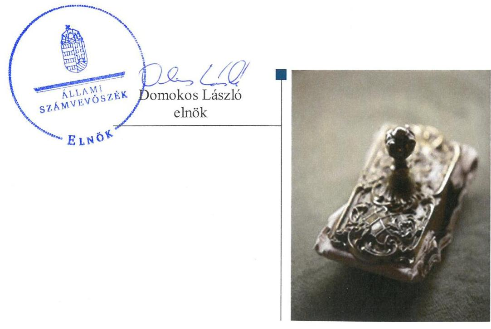
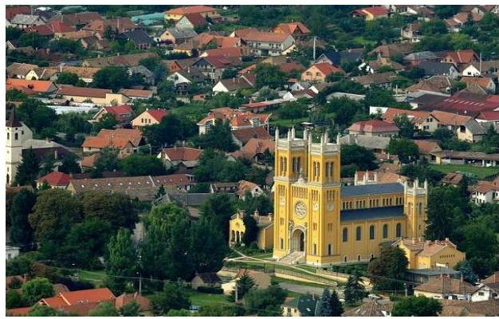

# Jelentés 

## Nem állami humánszolgáltatók ellenőrzése

A humánszolgáltatást nyújtó államháztartáson kívüli köznevelési és szociális intézmények, szolgáltatók fenntartói központi költségvetésből kapott támogatásai felhasználásának ellenőrzése - Fóti Ökumenikus Közművelődési Egyesület 2019.

---

# Jelentés 

## Nem állami humánszolgáltatók ellenőrzése

A humánszolgáltatást nyújtó államháztartáson kívüli köznevelési és szociális intézmények, szolgáltatók fenntartói központi költségvetésből kapott támogatásai felhasználásának ellenőrzése - Fóti Ökumenikus Közművelődési Egyesület 2019. 06. hó 27. nap

---

# AZ ELLENŐRZÉST FELÜGYELTE:

## MAKKAI MÁRIA felügyeleti vezető

## AZ ELLENŐRZÉST VEZETTE ÉS A VÉGREHAJTÁSÁÉRT FELELŐS:

### DR. PELLEI TAMÁS ellenőrzésvezető

## A PROGRAM ÖSSZEÁLLÍTÁSÁÉRT FELELŐS:

### TÓTPÁL SZABOLCS osztályvezető

IKTATÓSZÁM: EL-1573-001/2019.

TÉMASZÁM: 2448

ELLENŐRZÉS-AZONOSÍTÓ SZÁM: V079429

Jelentéseink az Országgyűlés számítógépes hálózatán és az Interneta a www.asz.hu címen is olvashatóak.

---

# TARTALOMJEGYZÉK 

- ÖSSZEGZÉS ..... 5
- AZ ELLENŐRZÉS CÉLJA ..... 6
- AZ ELLENŐRZÉS TERÜLETE ..... 7
- AZ ELLENŐRZÉS HÁTTERE, INDOKOLTSÁGA ..... 8
- A JELENTÉS LÉNYEGES KÉRDÉSKÖREI ..... 9
- AZ ELLENŐRZÉS HATÓKÖRE ÉS MÓDSZEREI ..... 10
- MEGÁLLAPÍTÁSOK ..... 12
- MELLÉKLETEK ..... 15
I. sz. melléklet: Értelmező szótár ..... 15
- FÜGGELÉK: ÉSZREVÉTELEK ..... 17
- RÖVIDÍTÉSEK JEGYZÉKE ..... 19

---

.

---

# ÖSSZEGZÉS 

A Fóti Ökumenikus Közművelődési Egyesület a köznevelési közfeladat ellátásához kialakította a központi költségvetési támogatások átlátható és elszámoltatható igénybevételének és felhasználásának feltételeit. A köznevelési közfeladathoz biztosított központi költségvetési támogatásokat a jogszabályi előírásoknak megfelelően használta fel intézménye müködtetésére, a felhasznált közpénzekre vonatkozó gazdálkodásával a nyilvánosság előtt elszámolt.

## Az ellenőrzés társadalmi indokoltsága

Az Állami Számvevőszék stratégiájában hangsúlyos szerepet szán annak, hogy szilárd szakmai alapon álló, értékteremtő ellenőrzéseivel előmozdítsa a közpénzügyek átláthatóságát, rendezettségét és javaslataival a közpénzek és a közvagyon szabályos, gazdaságos, hatékony és eredményes felhasználását segítse. Az államháztartáson kívülre nyújtott költségvetési támogatások ellenőrzésével az Állami Számvevőszék hozzájárul ahhoz, hogy a közpénzeket a nem állami humán fenntartók átlátható módon használják fel a közfeladatok ellátására kötött szereződésekben vállalt kötelezettségek teljesítése érdekében.

## Főbb megállapítások, következtetések

A Fóti Ökumenikus Közművelődési Egyesület a köznevelési közfeladat ellátás szervezeti feltételeit megteremtette, a szakmai feladatellátás és a gazdálkodási kereteit kialakította, biztosította a költségvetési támogatások igénybevételének, felhasználásának elszámoltathatóságát.

A Fóti Ökumenikus Közművelődési Egyesület meghatározta a közfeladatot ellátó intézménye alapfeladatait, biztosította müködésének feltételeit. A köznevelési közfeladathoz rendelt költségvetési támogatást szabályszerűen kezelte, elkülönítetten tartotta nyilván. A költségvetési támogatásokat a jogszabályi előírásoknak megfelelően használta fel intézménye működtetésére.

A Fóti Ökumenikus Közművelődési Egyesület ellenőrzési, értékelési kötelezettségeinek szabályszerűen eleget tett. A köznevelési intézménye működtetéséhez felhasznált közpénzekre vonatkozó gazdálkodásával a nyilvánosság előtt elszámolt.

---

# AZ ELLENŐRZÉS CÉLJA 

AZ ELLENŐRZÉS CÉLJA annak értékelése volt, hogy a Fóti Ökumenikus Közművelődési Egyesület, mint köznevelési intézmény fenntartója központi költségvetésből kapott támogatásainak felhasználása szabályszerű volt-e, a támogatások igénylése, évközi módosítása és év végi elszámolása megfelelt-e a jogszabályi előírásoknak.

---

# **AZ ELLENŐRZÉS TERÜLETE**

## **Fóti Ökumenikus Közművelődési Egyesület**

A Fóti Ökumenikus Közművelődési Egyesületet 1990. február 22-én négy felekezet – református, evangélikus, római katolikus és baptista gyülekezet – alapította meg.

A Fenntartó közhasznú jogállású szervezet, amelynek testületi szervei: a Közgyűlés, mint legfőbb döntéshozó szerv, továbbá az Intéző Bizottság és az Ellenőrző Bizottság. Fenntartó törvényes képviseletét az Elnök bármelyik alelnökkel együttesen látta el.

A Fenntartó a 2014-2017. években köznevelési célra – egy intézmény tekintetében – a központi költségvetésből átlagbéralapú normatív köznevelési támogatás, gyermekétkeztetéshez nyújtott támogatás, valamint tankönyvtámogatás jogcímen kapott támogatást. Intézménye – a 2014. év kivételével – nem önállóan gazdálkodó intézmény volt. Mindemellett – az EMMI²-vel kötött 2012. évi közoktatási megállapodás, valamint a 2017. évi köznevelési szerződés alapján az állami köznevelési közszolgálati feladatok ellátásában való részvételért – évenként legfeljebb 97,7 M Ft összegű kiegészítő támogatás igénybevételére is jogosult volt.

A Fenntartó által a köznevelési feladatokhoz igényelt és megkapott költségvetési támogatás összege a 2014. évben 176,9 millió Ft, a 2015. évben 181,4 millió Ft, a 2016. évben 192,2 millió Ft, valamint a 2017. évben 206,9 millió Ft volt.

A Fenntartó összes bevétele a 2014. évben 320,6 M Ft, a 2015. évben 326,9 M Ft, a 2016. évben 340,8 M Ft, a 2017. évben 357,2 M Ft volt. A Fenntartó 2014. évi összes bevételének 85,7%-át a központi költségvetési támogatás tette ki, továbbá a helyi önkormányzat költségvetéséből további 35 M Ft értékű támogatásban részesült. A 2017. évben a központi költségvetési támogatás aránya az összes bevételen belül 85,5% volt. A helyi önkormányzat 2017. évben is 35 M Ft-tal támogatta a Fenntartó által vállalt köznevelési feladatok ellátását.

A közfeladat ellátásával kapcsolatos szakmai irányítószervi feladatokat az ellenőrzött időszakban az EMMI látta el.

---

# AZ ELLENŐRZÉS HÁTTERE, INDOKOLTSÁGA 

A köznevelési és szociális feladatokat ellátó nem állami intézményfenntartók részére közfeladataik ellátására évente jelentős összegű pénzügyi támogatást biztosítottak a mindenkori költségvetési törvények a bennük megfogalmazott feltételek mellett.

A köznevelési és szociális feladatokra felhasználható állami támogatások előirányzata 2014 - 2017. években 1049 Mrd Ft volt. A 2013. évben jelentős változások következtek be a normatív finanszírozás rendszerében. Az Országgyűlés elfogadta a nemzeti köznevelésről szóló 2011. évi CXC. törvényt, amely jelentősen átalakította a korábbi finanszírozási rendszert 2013 szeptemberétől. Módosították a szociális igazgatásról és szociális ellátásokról szóló 1993. évi III. törvényt is, amely - többek között - 2012. január 1-jei hatállyal megfogalmazta a finanszírozási rendszerbe történő befogadással összefüggő szabályokat. Mindkét területen új feladatfinanszírozási forma (átlagbéralapú támogatás) jelent meg, amely az államháztartáson kívüli intézményfenntartókra is vonatkozik. Az ellenőrzés a finanszírozási rendszerben bekövetkezett változásokra, azok közfeladat ellátásra gyakorolt hatására fókuszált a költségvetési támogatásokat felhasználó államháztartáson kívüli szervezetek körében. Az ellenőrzés indokoltságát az is alátámasztotta, hogy az ÁSZ ${ }^{3}$ még nem ellenőrizte átfogóan e területet.

Az ÁSZ stratégiájában foglaltak alapján is indokolt az ellenőrzés, amely a társadalom számára jelzi, hogy a közpénz államháztartáson kívüli felhasználása sem maradhat ellenőrizetlenül. Az államháztartáson kívülre nyújtott költségvetési támogatások ellenőrzésével az ÁSZ hozzájárul ahhoz, hogy a közpénzeket a nem állami fenntartók átlátható módon használják fel a közfeladatok ellátására kötött szerződésekben vállalt kötelezettségek teljesítése érdekében. Az ÁSZ az ellenőrzés javaslataival hozzájárulhat az említett rendszerek szabályszerű támogatás-felhasználásához, javíthatja a társa-dalmi-gazdasági döntések megalapozottságát, amely a „jól irányított állam" feltétele.

---

# A JELENTÉS LÉNYEGES KÉRDÉSKÖREI 

1. A köznevelési közfeladatot ellátó Fenntartó szabályszerű mükö-dési- és gazdálkodási környezet kialakításával megteremtette-e a költségvetési támogatások átlátható, elszámoltatható igénybevételének, felhasználásának feltételeit?
2. A Fenntartó az átvállalt köznevelési közfeladathoz biztositott költségvetési támogatásokat szabályszerűen fordította-e humánszolgáltató intézménye müködtetésére?
3. A Fenntartó a köznevelési intézménye müködtetéséhez felhasznált közpénzekre vonatkozó gazdálkodásával a nyilvánosság előtt elszámolt-e, ennek megalapozása érdekében ellenőrzési, értékelési és külső ellenőrzésekkel kapcsolatos intézkedési feladatait szabályszerűen látta-e el?

---

# AZ ELLENŐRZÉS HATÓKÖRE ÉS MÓDSZEREI 

## Az ellenőrzés típusa

Megfelelőségi ellenőrzés.

## Az ellenőrzött időszak

2014. január 1-je és 2017. december 31-e közötti időszak.

## Az ellenőrzés tárgya

Az ellenőrzés a köznevelési és szociális humánszolgáltatási közfeladatokat ellátó államháztartáson kívüli fenntartók, humánszolgáltatási közfeladatai ellátásához a költségvetési törvényekben biztosított központi költségvetési támogatások igénylése, évközi módosítása és év végi elszámolása fenntartói feladatainak ellátása, illetve e központi költségvetésből kapott támogatásaik humánszolgáltatási közfeladatokra való fenntartó általi felhasználása szabályszerűségének értékelésére terjed ki.

Az ellenőrzés kiterjed minden olyan körülményre és adatra, amely az ÁSZ jogszabályban meghatározott feladatainak teljesítéséhez, valamint a program végrehajtása folyamán felmerült újabb összefüggések feltárásához szükséges.

## Az ellenőrzött szervezet

Fóti Ökumenikus Közművelődési Egyesület

## Az ellenőrzés jogalapja

Az ellenőrzés jogszabályi alapját az ÁSZ tv. 1. § (3) bekezdése, 5. § (3) bekezdésben foglalt előírások adták.

## Az ellenőrzés módszerei

Az ellenőrzést az ellenőrzési program kérdései, az adott időszakban hatályos jogszabályok, az ellenőrzés szakmai szabályok és módszertanok, valamint a nemzetközi standardok figyelembevételével végezte az ÁSZ.

Az ellenőrzés ideje alatt az ÁSZ a Fenntartóval történő kapcsolattartást az ÁSZ SZMSZ4-ének vonatkozó előírásai alapján biztosította.

---

Az ellenőrzési kérdések megválaszolásához szükséges bizonyítékok megszerzése az ellenőrzött által rendelkezésre bocsátott dokumentumokra, adatokra alapozva történt.

Az ellenőrzési bizonyítékként felhasznált adatforrások közé tartoztak egyrészt a szakmai program részletes szempontjainál felsorolt adatforrások, másrészt minden - az ellenőrzés folyamán feltárt, az ellenőrzés szempontjából információt tartalmazó - dokumentum.

Az ellenőrzés lefolytatásához a Fenntartó a kitöltött tanúsítványok, valamint az ÁSZ által kért dokumentumok átadásával szolgáltatott adatokat, információkat. Az így rendelkezésre bocsátott adatok, információk és a tanúsítványok adatai valódiságának kontrollja az ellenőrzés keretében történt.

A köznevelési feladatok központi költségvetési támogatásai igénylésével, módosításával, elszámolásával kapcsolatos, államháztartáson kívüli fenntartó jogszabályokban előírt feladatai betartását, továbbá a központi költségvetési támogatások szabályszerű kezelését, nyilvántartását ellenőrizte az ÁSZ a Fenntartónál, az ott rendelkezésre álló határozatok, nyilvántartások, beszámolók és egyéb dokumentumok alapján.

Az ellenőrzés nem terjedt ki a köznevelési feladatok ellátásához kapcsolódó központi költségvetési támogatás igénylése, módosítása, elszámolása valódiságának, megalapozottságának, helyességének - sem a fenntartónál, sem a székhely intézményeinél való - értékelésére. Továbbá nem terjedt ki az ellenőrzés e források, intézmények általi szabályszerű felhasználásának értékelésére.

---

# MEGÁLLAPÍTÁSOK 

## 1. A köznevelési közfeladatot ellátó Fenntartó szabályszerű mú-ködési- és gazdálkodási környezet kialakításával megterem-tette-e a költségvetési támogatások átlátható, elszámoltatható igénybevételének, felhasználásának feltételeit?

Összegző megállapítás A költségvetési támogatások átlátható, elszámoltatható igénybevételének és felhasználásának feltételeit a Fenntartó megteremtette.

A Fenntartó a köznevelési közfeladatok ellátásának szervezeti kereteit, a működés rendjét, tevékenységét, valamint ezek gyakorlásának módját az Alapszabály ${ }_{1-5}$-ban ${ }^{5}$ rögzítette, továbbá belső szabályozásaiban megállapította a felelősségi körök meghatározásával az engedélyezési, jóváhagyási és kontrolleljárásokat.

A Fenntartó a Számv. tv. ${ }^{6}$ előírásának megfelelő Számviteli politikával ${ }_{1-4}{ }^{7}$ rendelkezett és a Számv tv. előírásai szerint kialakította a gazdálkodásához kapcsolódó belső szabályzatokat.

## 2. A Fenntartó az átvállalt köznevelési közfeladathoz biztosított költségvetési támogatásokat szabályszerűen fordította-e humánszolgáltató intézménye múködtetésére?

Összegző megállapítás A Fenntartó biztosította köznevelési intézménye múködésének feltételeit, a költségvetési támogatásokat a jogszabályi előírásoknak megfelelően tartotta nyilván, használta fel intézménye múködtetésére.

A Fenntartó az Nkt. ${ }^{8}$ előírásai alapján a köznevelési intézménye alapítói okiratát kiadta. Az alapítói okirat többek között tartalmazta az intézménye alapfeladatait, a felvehető maximális gyermek és tanulói létszámot, a fel-adat-ellátási hely megnevezését, a feladat ellátásához szükséges vagyon feletti használati jogot, a feladatellátást szolgáló vagyont, valamint a gazdálkodással összefüggő jogosítványokat.

A köznevelési intézménye szervezeti és múködési szabályzatainak, pedagógiai programjainak és a házirendjeinek elkészítéséről a Fenntartó gondoskodott.

A Fenntartó az Nkt. előírásainak megfelelően biztosította az intézménye múködtetésének szervezeti-, tárgyi feltételeit, rendelkezett intézménye alapfeladat ellátáshoz szükséges személyi és tárgyi feltételek meglétét igazoló múködési engedélyekkel.

---

A köznevelési közfeladat ellátására kapott támogatások felhasználását a Fenntartó az Nkt. vhr. ${ }^{9}$-ben foglaltakkal összhangban alapfeladatonkénti bontásban elkülönítetten és naprakészen tartotta nyilván. A költségvetési támogatások felhasználásának nyilvántartását Fenntartó Nkt.vhr.-ben foglaltaknak megfelelően úgy alakította ki, hogy abból megállapítható volt, hogy a költségvetési támogatások milyen célra kerültek felhasználásra.

A Fenntartó a beérkezett költségvetési támogatásokat a 2014. évi Kvtv. ${ }^{10}$ 33. § (25)-(26) előírásainak ellenére a köznevelési intézmény részére nem adta át, azonban a fenntartó elkülönített nyilvántartásai alapján a támogatás céljának megfelelő felhasználása nyomon követhető és igazolt volt. A Fenntartó a támogatást az intézménye múködtetésére fordította. A 2015. évtől kezdődően a fenntartott intézmény az alapító okirata alapján nem volt önállóan gazdálkodó. Ezért ettől az időszaktól kezdődően a Fenntartói nyilvántartások alapján a támogatásokat szabályszerűen fordította az intézménye múködtetésére.

# 3. A Fenntartó a köznevelési intézménye múködtetéséhez felhasznált közpénzekre vonatkozó gazdálkodásával a nyilvánosság előtt elszámolt-e, ennek megalapozása érdekében ellenőrzési, értékelési és külső ellenőrzésekkel kapcsolatos intézkedési feladatait szabályszerűen látta-e el? 

Összegző megállapítás

## 3.1. számú megállapítás

3.2. számú megállapítás

A Fenntartó ellenőrzési, értékelési feladatait szabályszerűen látta el, az intézménye múködtetéséhez felhasznált közpénzekre vonatkozó gazdálkodásával a nyilvánosság előtt elszámolt.

A Fenntartó ellenőrzési, értékelési feladatait szabályszerűen ellátta.

A Fenntartó az Nkt.-ban foglaltak alapján ellenőrizte a köznevelési intézménye gazdálkodását, múködésének törvényességét, a szakmai munka eredményességét.

A Fenntartó a köznevelési intézménye múködtetéséhez felhasznált közpénzekre vonatkozó gazdálkodásával a nyilvánosság előtt elszámolt.

A Fenntartó az ellenőrzött időszakban az intézményei múködtetéséhez felhasznált közpénzekre vonatkozó gazdálkodásával a nyilvánosság - az éves számviteli beszámolók közzétételével - elszámolt.

A Fenntartó az Info. tv. ${ }^{11} 7 . \S$ (2) bekezdésében foglalt előírások ellenére az adatok biztonságának, védelmének érvényre juttatásához szükséges eljárási szabályokat nem alakította ki.

A közérdekú adatok közzétételére vonatkozó kötelezettség teljesítésének részletes szabályait az Info. tv. 35. § (3) bekezdésében előírtak ellenére szabályzatban nem határozta meg.

---

.

---

# MELLÉKLETEK 

- I. SZ. MELLÉKLET: ÉRTELMEZŐ SZÓTÁR
költségvetési támogatás
köznevelési közfeladat
köznevelési intézmény
nem állami, nem önkormányzati (államháztartáson kívüli) intézmény fenntartó
a társadalombiztosítás pénzügyi alapjai kivételével az államháztartás központi alrendszeréből ellenérték nélkül, pénzben nyújtott támogatások (Áht. 1. § 14. pont)
A költségvetési törvényben (2016. évi XC. törvény 40. §) megállapított támogatás többek között: Átlagbéralapú támogatást állapít meg a nevelési-oktatási, valamint pedagógiai szakszolgálati intézményt fenntartó nemzetiségi önkormányzat, az egyházi és magán köznevelési intézmény fenntartója részére az általuk fenntartott nevelési-oktatási intézményben, továbbá pedagógiai szakszolgálati intézményben pedagógus és - a (3) bekezdés kivételével - a nevelő-oktató munkát közvetlenül segítő munkakörben foglalkoztatottak után a 7. melléklet I. pontjában meghatározott jogosultak után, az őket ott megillető mértékek szerint. Múködési támogatást állapít meg a nemzetiségi önkormányzat vagy az egyházi jogi személy által fenntartott nevelési-oktatási intézményekben ellátott, továbbá a pedagógiai szakszolgálati intézményekben gyógypedagógiai tanácsadásban, korai fejlesztésben, oktatásban és gondozásban, valamint a fejlesztő nevelésben részt vevő gyermekekre, tanulókra tekintettel a nemzetiségi önkormányzat és a bevett egyház részére a 7. melléklet II. pontja szerint.
A köznevelési intézmény alapító okiratában foglalt feladat: óvodai nevelés, nemzetiséghez tartozók óvodai nevelése, általános iskolai nevelés-oktatás, nemzetiséghez tartozók általános iskolai nevelése-oktatása, kollégiumi ellátás, nemzetiségi kollégiumi ellátás, gimnáziumi nevelés-oktatás, szakközépiskolai nevelés-oktatás, szakiskolai nevelés-oktatás, nemzetiség gimnáziumi nevelés-oktatása, nemzetiség szakközépiskolai nevelés-oktatása, nemzetiség szakiskolai nevelés-oktatása, Köznevelési Hidprogramok keretében folyó nevelés-oktatás, felnőttoktatás, alapfokú művészetoktatás, fejlesztő nevelés, fejlesztő nevelés-oktatás, pedagógiai szakszolgálati feladat, a többi gyermekkel, tanulóval együtt nevelhető, oktatható sajátos nevelési igényű gyermekek, tanulók óvodai nevelése és iskolai nevelése-oktatása, azoknak a sajátos nevelési igényű gyermekeknek, tanulóknak az óvodai, iskolai, kollégiumi ellátása, akik a többi gyermekkel, tanulóval nem foglalkoztathatók együtt, a gyermekgyógyüdülőkben, egészségügyi intézményekben, rehabilitációs intézményekben tartós gyógykezelés alatt álló gyermekek tankötelezettségének teljesítéséhez szükséges oktatás, pedagógiai-szakmai szolgáltatás.
A nevelési- oktatási intézmény, pedagógiai szakszolgálati intézmény, pedagógiai-szakmai szolgáltatást nyújtó intézmény.
A köznevelési közfeladatokat/humánszolgáltatásokat ellátó intézményt fenntartó egyházi jogi személy, társadalmi szervezet, alapítvány, közalapítvány, civil szervezet, országos nemzetiségi önkormányzat, nonprofit gazdasági társaság, gazdasági társaság és a humánszolgáltatást alaptevékenységként végző, Szja tv. hatálya alá tartozó egyéni vállalkozó. (2017. évi Kvtv. 40. § bekezdés).

---

.

---

# FÜGGELÉK: ÉSZREVÉTELEK 

A jelentéstervezetet a Számvevőszék 15 napos észrevételezésre megküldte az ellenőrzött szervezet vezetőjének az ÁSZ tv. 29. §* (1) bekezdése előírásának megfelelően.

A Fóti Ökumenikus Közművelődési Egyesület elnöke az ÁSZ tv. 29. § (2) bekezdésében foglalt törvényes határidőn belül észrevételt nem tett.

[^0]
[^0]:    * 29. § (1) Az Állami Számvevőszék az ellenőrzési megállapításait megküldi az ellenőrzött szervezet vezetőjének vagy az általa megbízott személynek, és annak, akinek személyes felelősségét állapította meg.
    (2) Az ellenőrzött szervezet vezetője és a felelősként megjelölt személy az ellenőrzés megállapításaira tizenöt napon belül írásban észrevételt tehet.
    (3) Az Állami Számvevőszék az észrevételre a beérkezésétől számított harminc napon belül írásban válaszol. A figyelembe nem vett észrevételeket köteles a jelentésben feltüntetni, és megindokolni, hogy azokat miért nem fogadta el.

---

.

---

# RÖVIDÍTÉSEK JEGYZÉKE 

${ }^{1}$ Fenntartó
${ }^{2}$ EMMI
${ }^{3}$ ÁSZ
${ }^{4}$ ÁSZ SZMSZ
${ }^{5}$ Alapszabály $_{2-5}$

Fóti Ökumenikus Közművelődési Egyesület
Emberi Erőforrások Minisztériuma
Állami Számvevőszék
Az Állami Számvevőszék szervezeti és működési szabályzata
Alapszabály: A Fóti Ökomenikus Közművelődési Egyesület Alapszabálya (hatályos: 2010. december 20-ától 2016. március 1-jéig)
Alapszabály: A Fóti Ökomenikus Közművelődési Egyesület Alapszabálya (hatályos: 2016. március 2-ától 2016. május 25-éig)
Alapszabály: A Fóti Ökomenikus Közművelődési Egyesület Alapszabálya (hatályos: 2016. május 26-ától 2016. december 7-éig)
Alapszabály: A Fóti Ökomenikus Közművelődési Egyesület Alapszabálya (hatályos: 2016. december 8-ától 2017. december 18-áig)
Alapszabály: A Fóti Ökomenikus Közművelődési Egyesület Alapszabálya (hatályos: 2017. december 19-étől)
A számvitelről szóló 2000. évi C. törvény (hatályos: 2001. január 1-jétől)
Számviteli politika: Fóti Ökomenikus Közművelődési Egyesület Számviteli Politika 2014 (hatályos: 2014. január 1-jétől 2014. december 31-éig)
Számviteli politika: Fóti Ökomenikus Közművelődési Egyesület Számviteli Politika 2015 (hatályos: 2015. január 1-jétől 2015. december 31-éig)
Számviteli politika: Fóti Ökomenikus Közművelődési Egyesület Számviteli Politika 2016 (hatályos: 2016. január 1-jétől 2016. december 31-éig)
Számviteli politika: Fóti Ökomenikus Közművelődési Egyesület Számviteli Politika 2017 (hatályos: 2017. január 1-jétől)
A nemzeti köznevelésről szóló 2011. évi CXC. törvény (hatályos: 2012. szeptember 1-jétől)
A nemzeti köznevelésről szóló törvény végrehajtásáról szóló 229/2012. (VIII. 28.) Korm. rendelet (hatályos: 2012. szeptember 1-jétől)
Magyarország 2014. évi központi költségvetéséről szóló 2013. évi CCXXX. törvény Az információs és önrendelkezési jogról és az információ szabadságról szóló 2011. évi CXII. törvény (hatályos: 2011. július 27-étől)

---

ÁLLAMI SZÁMVEVŐSZÉK
1052 Budapest, Apáczai Csere János utca 10.
Levélcím: 1364 Budapest 4. Pf. 54
Telefon: +36 14849100 Telefax: +36 14849200
www.asz.hu