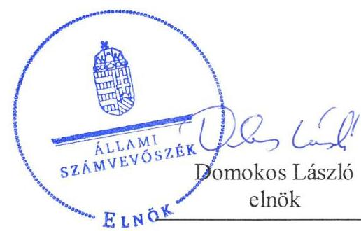
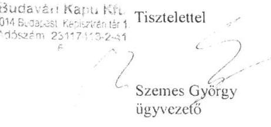
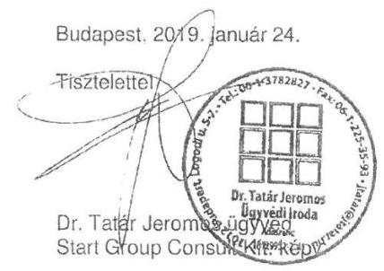
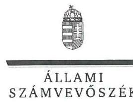
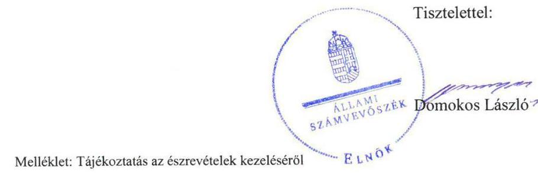
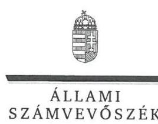
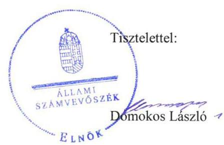

# Jelentés 

## Nemzeti tulajdonú gazdasági társaságok ellenőrzése

Budavári Kapu Behajtási Rendszert Üzemeltető Kft.
2019.

---

# Jelentés 

## Nemzeti tulajdonú gazdasági társaságok ellenőrzése

Budavári Kapu Behajtási Rendszert Üzemeltető Kft.
2019. 06. hó 20. nap

---

# AZ ELLENŐRZÉST FELÜGYELTE:

DR. PULAY GYULA felügyeleti vezető

## AZ ELLENŐRZÉST VEZETTE ÉS A VÉGREHAJTÁSÁÉRT FELELŐS:

VALASTYÁNNÉ DR. VÍZHÁNYÓ JÚLIA ellenőrzésvezető

SALAMIN VIKTOR ellenőrzésvezető

A PROGRAM ÖSSZEÁLLÍTÁSÁÉRT FELELŐS:

TÓTPÁL SZABOLCS osztályvezető

IKTATÓSZÁM: EL-1576-001/2019.

|  Jelentéseink az Országgyűlés számítógépes hálózatán és az Interneten a www.asz.hu címen is olvashatóak. | TÉMASZÁM: 2478  |
| --- | --- |
|   | ELLENŐRZÉS-AZONOSÍTÓ SZÁM: V082212  |

---

# TARTALOMJEGYZÉK 

■ ÖSSZEGZÉS ..... 5
■ AZ ELLENŐRZÉS CÉLJA ..... 6
■ AZ ELLENŐRZÉS TERÜLETE ..... 7
■ AZ ELLENŐRZÉS HÁTTERE, INDOKOLTSÁGA ..... 8
■ A JELENTÉS LÉNYEGES KÉRDÉSKÖREI ..... 9
■ AZ ELLENŐRZÉS HATÓKÖRE ÉS MÓDSZEREI ..... 10
■ MEGÁLLAPÍTÁSOK ..... 12
■ JAVASLATOK ..... 14
■ MELLÉKLETEK ..... 15
I. sz. melléklet: Értelmező szótár ..... 15
■ FÜGGELÉKEK ..... 17
I. számú függelék a Jelentéshez ..... 17
II. sz. függelék: Észrevételek ..... 18
■ RÖVIDÍTÉSEK JEGYZÉKE ..... 29

---

.

---

# ÖSSZEGZÉS 

A Budavári Kapu Behajtási Rendszert Üzemeltető Kft. felett tulajdonosi jogokat gyakorló Budapest I. Kerület Budavári Önkormányzat tulajdonosi joggyakorlása nem volt szabályszerű A Budavári Kapu Behajtási Rendszert Üzemeltető Kft. vagyongazdálkodása nem volt szabályszerű, számviteli beszámolóit 2015-2017. években nem támasztotta alá leltárral, beszámolója nem volt megalapozott, ezért müködésének átláthatósága és elszámoltathatósága nem volt biztositott.

## Az ellenőrzés társadalmi indokoltsága

Az Állami Számvevőszék kiemelt célja, hogy a helyi önkormányzatok gazdálkodásában rejlő pénzügyi kockázatok feltárásával, az államháztartáson kívülre nyújtott költségvetési támogatások és ingyenes vagyonjuttatások, valamint az államháztartáson kívül múködő feladat-ellátó rendszerek ellenőrzéseivel hozzájáruljon ahhoz, hogy a közpénzeket az államháztartáson kívül múködő szervezetek is átlátható, rendezett módon használják fel.

Magyarországon az önkormányzatok kötelező és önként vállalt feladataik vonatkozásában is egyre szélesebb körben alkalmazzák a költségvetésen kívüli feladatellátást, ezáltal - a nonprofit szervezetek mellett - az önkormányzati tulajdonú gazdasági társaságok is kiemelt fontosságú szerephez jutottak.

## Főbb megállapítások, következtetések, javaslatok

Budapest I. Kerület Budavári Önkormányzat tulajdonosi joggyakorlás kereteit a jogszabályi előírások szerint alakította ki. A Társaság feletti tulajdonosi joggyakorlás nem volt szabályszerű, mert a jogszabályi előírás ellenére a Felügyelő bizottság a Társaság legfőbb szervének jogkörét gyakorló Képviselő-testület által jóváhagyott ügyrenddel nem rendelkezett.

A Budavári Kapu Behajtási Rendszert Üzemeltető Kft vagyongazdálkodási tevékenysége nem volt szabályszerű, 2015-2017. években mérlege alátámasztásához nem készített a jogszabályi előírásoknak megfelelő leltárt, ezért az éves beszámolói nem voltak megalapozottak.

Az Állami Számvevőszék a jelentésben foglalt megállapítások alapján Budapest I. Kerület Budavári Önkormányzat polgármesterének és a Budavári Kapu Behajtási Rendszert Üzemeltető Kft. ügyvezetőjének egy-egy javaslatot fogalmazott meg. A javaslatokat megalapozó megállapításokra az érintetteknek 30 napon belül intézkedési tervet kell készíteniük.

---

# AZ ELLENŐRZÉS CÉLJA 

AZ ELLENŐRZÉS CÉLJA annak megítélése volt, hogy a tulajdonosi joggyakorló a gazdasági társaságai feletti tulajdonosi joggyakorlás kereteit kialakította-e, tulajdonosi jogait megfelelően gyakorolta-e és kötelezettségeit teljesítette-e. A gazdasági társaság biztosította-e a vagyon védelmét a nyilvántartások szabályszerű vezetése és a mérleg tételeinek leltárral történő alátámasztása útján, valamint szabályszerűen gondoskodott-e a társaság használatában, kezelésében lévő nemzeti vagyon értékének megőrzéséről, gyarapításáról, hasznosításáról.

---

# **A2 ELLENŐRZÉS TERÜLETE**

## **Budapest I. Kerület Budavári Önkormányzat, Budavári Kapu Behajtási Rendszert Üzemeltető Kft.**

Az Önkormányzat¹ a Társaságot² 2010. december 16-án alapította, jegyzett tőkéje 20 M Ft. A társaság az Önkormányzat kizárólagos tulajdonában volt.

A Társaság főtevékenysége alapítása óta az Önkormányzattal 2014. március 1-jén megkötött határozott időtartamra 5 évre közszolgáltatási szerződés alapján, ellátandó közfeladata, a Budai Vár védett várakozási területén, több övezetre tagolt gépjármű beléptető, és parkolási rendszer üzemeltetése, támogatása, és karbantartása során felmerült problémák kezelése, a felhasználók által bejelentett problémák kezelése, rendszergazdai feladatok elvégzése, üzemeltetés-folytonosság biztosítása volt az Mötv. 13.§ (1) bekezdésének megfelelően.

Az ellenőrzött időszakban a polgármester³ és a jegyző⁴ személyében nem történt változás, a Társaság ügyvezetőjének személye 2017. januárjában változott. A Társaság az ellenőrzött időszakban nem rendelkezett vagyonkezelésbe vett vagyonnal, továbbá nem tartozott kormányzati szektorba sorolt gazdasági társaságok közé.

---

# AZ ELLENŐRZÉS HÁTTERE, INDOKOLTSÁGA 

Az Alaptörvény 38. cikke alapján az állam és a helyi önkormányzatok tulajdona nemzeti vagyon. A nemzeti vagyon megőrzése, megóvása érdekében kiemelten fontos ezen nemzeti tulajdonú gazdasági társaságok ellenőrzése. Gazdálkodásuk jellemzően a közérdeklődés és a média figyelmének középpontjában áll, amihez hozzájárul a gazdálkodásuk körébe tartozó - a nemzeti vagyon részét képező - vagyon nagysága, illetve az általuk ellátott közszolgáltatások minősége és hatékonysága. Ellenőrzéseink feltárhatják, hogy a tulajdonosi felügyelet hozzájárult-e a szabályszerű gazdálkodáshoz és feladatellátáshoz.

Az ellenőrzés eredményeként meghatározhatóvá válnak a szervezet vagyongazdálkodást érintő kockázatai, ezzel lehetővé téve a kockázatok csökkentését. A megállapítások alapján megfogalmazott számvevőszéki javaslatok hasznosítása elősegítheti a meglévő hibák megszüntetését. A jó gyakorlatok bemutatásával az ÁSZ hozzájárulhat a követendő megoldások megismertetéséhez, terjesztéséhez.

---

# A JELENTÉS LÉNYEGES KÉRDÉSKÖREI 

1. A Társaság feletti tulajdonosi joggyakorlás megfelelt-e a jogszabályi és belső előírásoknak?
2. A Társaság vagyongazdálkodási tevékenysége szabályszerü volt-e?

---

# AZ ELLENŐRZÉS HATÓKÖRE ÉS MÓDSZEREI 

## Az ellenőrzés típusa

Megfelelőségi ellenőrzés.

## Az ellenőrzött időszak

A tulajdonosi joggyakorlás vonatkozásában az ellenőrzött időszak 2017. január 1-től az ellenőrzés megkezdésének napjáig terjedt ki az éves beszámolók elfogadása és a vagyonkezelésbe adott vagyonnal való gazdálkodás tulajdonosi ellenőrzése kivételével, amelyeknél az ellenőrzött időszak 2015. január 1-től az ellenőrzés megkezdésének napjáig - 2018. szeptember 28-ig - tartott.

A Társaság vagyongazdálkodása vonatkozásában az ellenőrzött időszak 2015-2017. évek, a 2017. évi beszámoló jóváhagyása tekintetében 2018. június elsejéig tartó időszak.

## Az ellenőrzés tárgya

Az önkormányzati tulajdonban lévő gazdasági társaság feletti tulajdonosi joggyakorlás kialakítása és múködtetése.

Önkormányzati tulajdonban lévő gazdasági társaság vagyongazdálkodása keretében a társaság használatában, kezelésében lévő nemzeti vagyon, illetve a saját vagyon tekintetében a vagyonnyilvántartások vezetése, leltára. A társaság használatában, vagyonkezelésében lévő nemzeti vagyon tekintetében a vagyon értékének megőrzése, gyarapítása, hasznosítása.

## Az ellenőrzött szervezet

Budapest I. Kerület Budavári Önkormányzat, valamint a Budavári Kapu Behajtási Rendszert Üzemeltető Kft.

## Az ellenőrzés jogalapja

Az ellenőrzés jogalapját az ÁSZ tv. ${ }^{5} 1 . \S$ (3) bekezdése és 5. § (3)-(5) bekezdései képezték.

---

# Az ellenőrzés módszerei 

Az ellenőrzést az ellenőrzési program ellenőrzési kérdései, az ellenőrzött időszakban hatályos jogszabályok, az ellenőrzés szakmai szabályok és módszertanok alapján, a nemzetközi standardok figyelembe vételével végeztük.

Az ellenőrzés ideje alatt az ellenőrzött szervezettel történő kapcsolattartást az ÁSZ Szervezeti és Múködési Szabályzatának vonatkozó előírásai alapján biztosítottuk.
2017. január 1-től az ellenőrzés megkezdésének napjáig ellenőriztük a tulajdonosi joggyakorlás kereteinek kialakítását, a tulajdonosi joggyakorló tevékenységét a felügyelő bizottság és a független könyvvizsgáló múködéséhez kapcsolódóan, valamint azt, hogy a tulajdonosi joggyakorló - amenynyiben a gazdasági társaság feladatellátásához és vagyonkezeléséhez kapcsolódóan határozott meg követelményeket, elvárásokat - a nemzeti vagyon értékének megőrzése érdekében monitorozta-e azok teljesülését. 2015. január 1-től az ellenőrzés megkezdésének napjáig ellenőriztük a tulajdonosi joggyakorló részvételét az éves beszámoló elfogadására vonatkozó döntéshozatalban, valamint amennyiben adott a társaságainak vagyonkezelésbe nemzeti vagyont, akkor azt, hogy az azzal történő gazdálkodást a tulajdonosi joggyakorló ellenőrizte-e.

Az ellenőrzési kérdések megválaszolásához szükséges bizonyítékok megszerzése a Társaság vagyongazdálkodása vonatkozásában a következő ellenőrzési eljárások alkalmazásával történt: megfigyelés, információkérés, összehasonlítás, elemző eljárás. Az ellenőrzési bizonyítékként felhasználható adat-források közé tartoznak az ellenőrzési programban felsorolt adatforrások, továbbá minden - az ellenőrzés folyamán - feltárt, az ellenőrzés szempontjából információkat tartalmazó dokumentum.

Az ellenőrzést a kérdésekre adott válaszok kiértékelésével, valamint a megjelölt adatforrások, a csatolt tanúsítványok felhasználásával, továbbá az adott időszakban hatályos jogszabályok figyelembe vételével folytattuk le.

A vagyonnyilvántartások szabályszerűsége esetében az ellenőrzés azokra a legnagyobb értékű tételekre - a lényeges sokaságra - terjedt ki, melyek összértéke eléri a teljes sokaság összértékének 50\%-át. A lényeges sokaságot tételesen 2017. évre vonatkozóan ellenőriztük. A 2015-2017. évekre történt meg a lényeges dokumentumok, ennek keretében a leltározáshoz kapcsolódó dokumentumok, valamint a mérleg tételeit alátámasztó leltár értékelése.

---

# 1. A Társaság feletti tulajdonosi joggyakorlás megfelelt-e a jogszabályi és belső előírásoknak? 

Összegző megállapítás

Az Önkormányzat tulajdonosi joggyakorlása nem volt szabályszerű.
1.1. számú megállapítás

Az Önkormányzat a tulajdonosi joggyakorlás kereteit a jogszabályi előírások szerint alakította ki.

A TULAJDONOSI JOGOK GYAKORLÁSÁNAK
RENDJÉT az Önkormányzat a Vagyongazdálkodási rendelet ${ }^{6}$-ben, az önkormányzati SZMSZ ${ }^{7}$-ben, valamint a Társasági Alapító Okirat ${ }_{1-3}{ }^{8}$ ban a jogszabályi előírásokkal összhangban kialakította.

A tulajdonosi joggyakorló Önkormányzat a Taktv. ${ }^{9}$ 5. § (3) bekezdésének előírása szerint alkotta meg a vezető tisztségviselők, a felügyelőbizottsági tagok, az Mt. ${ }^{10}$ 208. §-ának hatálya alá eső munkavállalók javadalmazásáról, valamint a jogviszony megszűnése esetére biztosított juttatások módjának, mértékének elveiről, annak rendszeréről szóló szabályzatot.
1.2. számú megállapítás

A Társaság feletti tulajdonosi joggyakorlás nem volt szabályszerű.
A SZÁMVITELI BESZÁMOLÓ ELFOGADÁSÁRA, az eredmény felosztására vonatkozó döntéshozatalban a tulajdonosi joggyakorló a jogszabályi előírásoknak megfelelően részt vett. A döntéshez a Felügyelő bizottság és a Könyvvizsgáló jelentése rendelkezésre állt.

A FELÜGYELŐ BIZOTTSÁG a Képviselő-testület, mint a Társaság legfőbb szerve által jóváhagyott ügyrenddel a Ptk. 3:122. § (3) bekezdésének előírása ellenére nem rendelkezett. A könyvvizsgáló megválasztása megfelelt a Ptk. és a Számv. tv. ${ }^{11}$ előírásainak.

## 2. A Társaság vagyongazdálkodási tevékenysége szabályszerű volt-e?

Összegző megállapítás

A Társaság vagyongazdálkodási tevékenysége nem volt szabályszerű.

## LELTÁRKÉSZÍTÉSI ÉS LELTÁROZÁSI SZABÁLY-

ZATTAL a Társaság rendelkezett az ellenőrzött időszakban a Számv. tv előírásainak megfelelően.

A MÉRLEG TÉTELEINEK ALÁTÁMASZTÁSÁHOZ a Társaság a Számv. tv. 69. § (1) bekezdésének előírása ellenére 2015-2017.

---

évekre vonatkozóan nem állított össze olyan leltárt, amely tételesen, ellenőrizhető módon tartalmazta volna a mérleg fordulónapján meglévő eszközöket és forrásokat mennyiségben és értékben. Szabályszerű leltár hiányában a mérleg nem volt alátámasztott, a 2015-2017. évi beszámolók nem voltak megalapozottak.

A nem szabályszerűen összeállított leltárak következtében az egyszerűsített éves beszámolók vonatkozásában nem érvényesült a Számv. tv. 15. § (3) bekezdésében foglalt valódiság elve.

---

# JAVASLATOK 

Az ÁSZ tv. 33. § (1) bekezdésében foglaltak értelmében az ellenőrzött szervezet vezetője köteles a jelentésben foglalt megállapításokhoz kapcsolódó intézkedési tervet összeállítani és azt a jelentés kézhezvételétől számított 30 napon belül az ÁSZ részére megküldeni. Amennyiben az intézkedési tervet határidőre nem küldi meg a szervezet, vagy amennyiben az nem elfogadható, az ÁSZ elnöke az ÁSZ tv. 33. § (3) bekezdés a)-b) pontjaiban foglaltakat érvényesítheti.

## Budapest I. kerület Budavári Önkormányzat polgármesterének

1. Gondoskodjon a Felügyelő Bizottság ügyrendjének a Ptk. szerinti jóváhagyásáról.
(1.2. sz. megállapítás 2. bekezdés első mondata alapján)

## Budavári Kapu Behajtási Rendszert Üzemeltető Kft. ügyvezetőjének

1. Intézkedjen a Számv.tv. előírása szerinti leltár összeállításáról és megőrzéséről.
(2. sz. megállapítás 2. bekezdése első mondata alapján)

---

# MELLÉKLETEK 

- I. SZ. MELLÉKLET: ÉRTELMEZŐ SZÓTÁR
gazdasági társaság
koncessziós szerződés
közszolgáltatás
közfeladat
nemzeti vagyon
nemzeti vagyon használója
tulajdonosi jogok gyakorlója vagyonkezelő

Ptk. 3:88. § (1) bekezdése szerint „a gazdasági társaságok üzletszerű közös gazdasági tevékenység folytatására, a tagok vagyoni hozzájárulásával létrehozott, jogi személyiséggel rendelkező vállalkozások, amelyekben a tagok a nyereségből közösen részesednek, és a veszteséget közösen viselik".
Az 1991. évi XVI. tv. alapján a kizárólagos állami, önkormányzati vagy ön-kormányzati társulási tulajdon hatékony működtetésének, valamint a kizárólagosan az állam vagy az önkormányzat hatáskörébe utalt tevékenységek gyakorlásának egyik lehetséges útja mindezek koncessziós szerződés alapján való átengedése
Az Ebktv. ${ }^{12}$ 3. § d) pontja a következőképpen határozza meg a közszolgáltatást: „szerződéskötési kötelezettség alapján a lakosság alapvető szükségleteinek ellátására irányuló szolgáltatás, így különösen a villamos energia-, gáz-, hő-, víz-, szennyvíz- és hulladékkezelési, köztisztasági, postai és táv-közlési szolgáltatás, továbbá a menetrend alapján közlekedő járművekkel végzett közforgalmú személyszállítás".
Az Áht. 3/A. § (1) bekezdése alapján közfeladat a jogszabályban meghatározott állami vagy önkormányzati feladat
Nvtv. 1. § (2) bekezdése szerint nemzeti vagyonba tartozik többek között:
„az állam vagy a helyi önkormányzat kizárólagos tulajdonában álló dolgok,
az a) pont hatálya alá nem tartozó, állam vagy a helyi önkormányzat tulajdonában lévő do$\log$,
az állam vagy a helyi önkormányzat tulajdonában lévő pénzügyi eszközök, továbbá az államot vagy a helyi önkormányzatot megillető társasági részesedések,
az államot vagy a helyi önkormányzatot megillető bármely vagyoni érték-kel rendelkező jogosultság, amelyet jogszabály vagyoni értékű jogként nevesít
A tulajdonosi joggyakorló vagy a nemzeti vagyon használója által a nemzeti vagyon birtoklásának, használatának, hasznok szedése jogának bármely - a tulajdonjog átruházását nem eredményező - jogcímen történő átengedése, ide nem értve a vagyonkezelésbe adást, valamint a haszonélvezeti jog alapítását.
Forrás: Nvtv. 3. § (1) bekezdés 4. pont
Azon természetes személy, jogi személy vagy jogi személyiséggel nem rendelkező szervezet, aki vagy amely állami vagyon tekintetében törvény vagy szerződés alapján, a helyi önkormányzat vagyona tekintetében törvény, a helyi önkormányzat rendelete vagy szerződés alapján bármely jogcímen nemzeti vagyont birtokol, használ, szedi annak hasznait, kivéve a tulajdonosi joggyakorló.
Forrás: Nvtv. 3. § (1) bekezdés 11. pont
Aki a nemzeti vagyon felett az államot vagy a helyi önkormányzatot megillető tulajdonosi jogok és kötelezettségek összességének gyakorlására jogosult. (Forrás: Nvtv. 3. § (1) bekezdés 17. pontja)
az állam tulajdonában álló nemzeti vagyon tekintetében:
aa) költségvetési szerv,
ab) helyi önkormányzat, nemzetiségi önkormányzat, valamint ezek társulásai,
ac) az ab) alpontban felsoroltak fenntartása vagy irányítása alá tartozó intézmény,
ad) köztestület,
ae) az állam, az aa)-ac) alpontban meghatározott személyek együtt vagy külön-külön 100\%os tulajdonában álló gazdálkodó szervezet,
af) az ae) alpont szerinti gazdálkodó szervezet 100\%-os tulajdonában álló gazdálkodó szervezet,
ag) a törvény által kijelölt egyedileg meghatározott jogi személy.
b) a helyi önkormányzat tulajdonában álló nemzeti vagyon tekintetében: melle

---

ba) nemzetiségi önkormányzat, helyi vagy nemzetiségi önkormányzati társulás, valamint ezek fenntartása vagy irányítása alá tartozó intézmény,
bb) költségvetési szerv,
bc) köztestület,
bd) az állam, a helyi önkormányzat, a ba) alpontban meghatározott személyek együtt vagy külön-külön 100\%-os tulajdonában álló gazdálkodó szervezet,
be) a bd) alpont szerinti gazdálkodó szervezet 100\%-os tulajdonában álló gazdálkodó szervezet.
Forrás: Nvtv. 3. § (1) bekezdés 19. pont
vagyongazdálkodás
A nemzeti vagyongazdálkodás feladata a nemzeti vagyon rendeltetésének megfelelő, az állam, az önkormányzat mindenkori teherbíró képességéhez igazodó, elsődlegesen a közfeladatok ellátásához és a mindenkori társadalmi szükségletek kielégítéséhez szükséges, egységes elveken alapuló, átlátható, hatékony és költségtakarékos múködtetése, értékének megőrzése, állagának védelme, értéknövelő használata, hasznosítása, gyarapítása, továbbá az állam vagy a helyi önkormányzat feladatának ellátása szempontjából feleslegessé váló vagyontárgyak elidegenítése. (Forrás: Nvtv. 7. § (2) bekezdése).

---

# FÜGGELÉKEK 

- I. SZÁMÚ FÜGGELÉK A JELENTÉSHEZ

Az Állami Számvevőszék az ellenőrzések során feltárt tényekhez kapcsolódó további körülmények tisztázására eszközrendszerrel nem rendelkezik. Amennyiben az ellenőrzésen túlmutatóan indokoltnak látszik az ellenőrzés során feltárt körülmények további vizsgálata, az Állami Számvevőszék törvényi felhatalmazás alapján az ellenőrzés által feltárt körülményeket továbbítja a hatáskörrel rendelkező szervnek a szükséges intézkedések megtétele, eljárások lefolytatása érdekében.
I. Az Állami Számvevőszék feltárta, hogy a Társaság 2015-2017. években nem készítette el a Számv. tv. 69. § (1) bekezdése szerinti leltárt. Szabályszerü leltár hiányában a mérleg nem volt alátámasztott, a 2015-2017. évi beszámolók nem voltak megalapozottak.
A mérleget alátámasztó leltár hiánya miatt sérült a Számv. tv. 15. §. (3) bekezdése szerinti valódiság elve, így nem igazolt, hogy a Társaság 2015-2017. évi beszámolói megbízható és valós összképet mutatnak.
Az eset konkrét körülményeinek felderítésére a Nemzeti Adó- és Vámhivatal rendelkezik hatáskörrel.

---

A jelentéstervezetet a Számvevőszék 15 napos észrevételezésre megküldte az ellenőrzött szervezetek vezetőinek az ÁSZ tv. 29. §̊ (1) bekezdése előirásának megfelelően.

A Budavári Kapu Behajtási Rendszert Üzemeltető Korlátolt Felelősségű Társaság ügyvezetője és Budapest I. Kerület Budavári Önkormányzatának polgármester élt az ÁSZ 29. § (2) bekezdésében foglalt észrevételezési lehetőségével és a törvényes határidőn belül a jelentéstervezet megállapításaira észrevételt tett. Az észrevételeket és az arra adott válaszokat a függelék tartalmazza.

[^0]
[^0]:    * 29. § (1) Az Állami Számvevőszék az ellenőrzési megállapításait megküldi az ellenőrzött szervezet vezetőjének vagy az általa megbízott személynek, és annak, akinek személyes felelősségét állapította meg.
    (2) Az ellenőrzött szervezet vezetője és a felelősként megjelölt személy az ellenőrzés megállapításaira tizenöt napon belül írásban észrevételt tehet.
    (3) Az Állami Számvevőszék az észrevételre a beérkezésétől számított harminc napon belül írásban válaszol. A figyelembe nem vett észrevételeket köteles a jelentésben feltüntetni, és megindokolni, hogy azokat miért nem fogadta el.

---

Budavári Kapu Kft.
1014 Budapest, Kapisztrán tér 1.
Adószám: 23117413-2-41
Nyilvántartó cégbíróság: Fővárosi Törvényszék Cégbírósága, Cégjegyzékszám: 01-09-952764
Adatkezelői nyilvántartási azonosító: 04502-0001

Viziváros - Vár - Krisztinaváros - Tabán - Gellérthegy

Állami Számvevőszék ikt.sz.: $37 / 2 / 2019$
Tel: +36 1 458-3072
1052 Budapest, Apáczai Csere János u. 10.
1364 Budapest 4. Pf. 54.

# Domokos László Úr elnök 

Tárgy: EL-0868-067/2019
„Nemzeti tulajdonú gazdasági társaságok ellenőrzése - Budavári Kapu Behajtási Rendszert Üzemeltető Kft." - címü jelentés tervezet észrevételezése

## Tisztelt Elnök Úr!

Az Állami Számvevőszék tárgyi jelentés tervezetében a Budavári Kapu Kft. részére megfogalmazott megállapításokra az alábbi észrevételt tesszük:

A Budavári Kapu Kft. vagyongazdálkodási tevékenysége szabályszerű volt a vizsgált időszakban.
A 2015-2017. évek mérlegének alátámasztásához a Társaság készített jogszabályi előírás szerinti leltárt.
A könyvvizsgálói jelentés igazolta, hogy a mérlegbeszámoló megbízható és valós képet mutat a Társaság vagyoni és pénzügyi helyzetéről a hatályos számvitelről szóló 2000 .évi C. törvénnyel összehangban.

A Budavári Kapu Kft. 2015-2016. évi könyviteli tevékenységét szerződés szerint az SG Consult Kft. látta el. A teljes könyvelési anyag a Könyvelő Irodában volt tárolva. Az SG Consult Kft-vel történő szerződésbontás után hiányos könyvelési anyag került vissza Társaságunkhoz, amit a későbbiek során sem sikerült pótolnunk. Ennek egyik fő oka, hogy a könyvelő cég tulajdonosa időközben elhunyt és a cég felszámolás alá került. (Mellékelve az SG Consult Kft. jogi képviselőjének nyilatkozata a Budavári Kapu Kft-re vonatkozó könyvelési anyag illetve számítógépen tárolt adatok meglétéről).

Kérjük Tisztelt Elnök urat, hogy a végleges jelentés elkészítésekor szíveskedjen figyelembe venni fentiekben megfogalmazott észrevételeinket.

Budapest, 2019. 04. 17.

---

Dr. Tatár Jeromos ügyvéd KASZ\#36070091
Dr. Tatár Jeromos Ügyvédi Iroda 1012 Budapest, Logodi u. 5-7.

# Tisztelt Budavári Kapu Kft! 

Alulírott dr. Tatár Jeromos ügyvéd, a Start Group Consult Korlátolt Felelösségü Társaság (1027 Budapest, Bern József utca 6.) jogi képviselöje az alábbi
nyilatkozatot
teszem.
A Társaság képviseletére jogosult ügyvezető Andrej Pintér 2018. augusztus 6. napján elhunyt.

Legjobb tudomásom szerint nyilatkozom, hogy a Társaság iratanyagai között a Budavári Kapu Kft-re vonatkozó könyvelési anyagok, illetve számítógépen tárolt adatok a Társaság birtokában nincsenek.

---

ELNÖK

Ikt.szám: EL-0868-071/2019.

# Szemes György úr 

ügyvezető
Budavári Kapu Behajtási Rendszert Üzemeltető Kft.

## Budapest

## Tisztelt Ügyvezető Úr!

A ,,Nemzeti tulajdonú gazdasági társaságok ellenőrzése - Budavári Kapu Behajtási Rendszert Üzemeltető Kft. " - címmel készített számvevőszéki jelentéstervezetre a 37/2/2019. iktatószámú levelében megküldött észrevételét köszönettel megkaptam.
Az Állami Számvevőszék észrevételre vonatkozó álláspontjáról a felügyeleti vezető által készített részletes tájékoztatást csatoltan megküldöm.
Tájékoztatom Ügyvezető urat, hogy a számvevőszéki jelentésben - az Állami Számvevőszékről szóló 2011. évi LXVI. törvény 29. § (3) bekezdése alapján - a figyelembe nem vett észrevételeket szerepeltetjük az elutasítás indokának feltüntetésével.

Budapest, 2019. 07 hó 26 nap

---

# Tájékoztatás az észrevételek kezeléséről 

„Nemzeti tulajdonú gazdasági társaságok ellenőrzése - Budavári Kapu Behajtási Rendszert Üzemeltető Kft." címủ jelentéstervezetre a 37/2/2019. iktatószámú levelében megküldött észrevételét áttekintettem. Az észrevétel kezeléséről az alábbi tájékoztatást adom.

## 1.) A Főbb megállapítások, következtetések, javaslatokhoz megfogalmazott észrevételre adott válasz

A Budavári Kapu Behajtási Rendszert Üzemeltető Kft. -t (továbbiakban: a Társaság) illetően megfogalmazott Főbb megállapítások, következtetések, javaslatokra illetve az azt alátámasztó 2. számú megállapításra tett észrevételét nem fogadtuk el.
A Társaság által megküldött leltár nem tartalmazta a Társaságnak a mérlegforduló napján meglévő eszközeit és forrásait mennyiségben és értékben, nem felelt meg a Számvitelről szóló 2000.évi C. törvény (továbbiakban Számv. tv.) 69. § (1)-(4) bekezdéseinek, valamint nem vette figyelembe saját Leltározási és selejtezési szabályzatának előírásait.
Az ellenőrzéshez beküldött dokumentumokból az volt megállapítható, hogy a 2015 2017 években a Társaság nem rendelkezett az immateriális javak, tárgyi eszközök, a követelések, a pénzeszközök, az aktív időbeli elhatárolások, a saját tőke, a kötelezettségek és a passzív időbeli elhatárolások mérlegsorait alátámasztó olyan hiteles leltárral, amely tételesen, ellenőrizhető módon tartalmazta a mérleg fordulónapján meglévő eszközeit és forrásait mennyiségben és értékben. A Társaság leltározási bizonylata nem felelt meg az általános alaki, tartalmi előírásoknak, mivel nem tartalmazta a bizonylat megnevezését, sorszámát, a bizonylatot kiállító szervezeti egység megjelölését, a leltározók és leltárellenőr aláírását.

## 2.) A 2. számú fókuszkérdés - Összegző megállapítás utolsó bekezdésével kapcsolatban megfogalmazott észrevételre adott válasz

A 2. számú fókuszkérdés - Összegző megállapítás utolsó bekezdésével összefüggésben megfogalmazott észrevételét nem fogadtuk el. A Társaságnak a Számv.tv. 69. § (3) bekezdésében foglaltak szerint háromévente, a saját Leltározási és selejtezési szabályzata 4. sz. mellékletében foglaltak szerint ennél gyakrabban, kétévente esedékes mennyiségi felvétellel történő leltározást kellett végeznie az immateriális javak és tárgyi eszközöknél, mely kötelezettségének nem tett eleget.
A mérlegtételeket alátámasztó leltár dokumentációk hiánya a 2015-2017. évi éves beszámolók vonatkozásában sértette a Számv.tv. 4 § (2) és a 15. § (3) bekezdésében előírt megbízható és valós összkép adását a gazdálkodó vagyonáról, annak összetételéről.

---

A fökönyvi könyvelés és az analitikus nyilvántartás egyeztetésének hiánya miatt a Könyvvizsgáló a 2017. évi beszámolóhoz kapcsolódó jelentésében korlátozott véleményt, záradékot adott, mert jelentős eltérés mutatkozott a Társaság főkönyvi adatai és az analitika adatai között.

Az ÁSZ - ellenőrzési program alapján lefolytatott - ellenőrzésének megállapításai a Társaság által az ÁSZ rendelkezésére bocsátott dokumentumokon alapulnak. Tájékoztatom továbbá, hogy Ügyvezető úr az adatszolgáltatással összefüggésben „Teljességi és hitelességi nyilatkozat"-ot állított ki, amelyben rögzítette, hogy az adatszolgáltatás teljes körű és hiteles.

Budapest, 2019. 05 hó 2 nap

Dr. Pulay Gyula
felügyeleti vezető

---

# Budapest I. kerület Budavári ÖNKORMÁnyZat 

Víziváros - Vár - Krisztinaváros - Tabán - Gellérthegy

Állami Számvevőszék

## Domokos László

elnök úr részére
Budapest
Apáczai Csere János út 10.
1052
Hiv. szám: EL-0868-066/2019.
Iktatószám: BDV/ 10368-2/2019.
Ügyintéző: Kékesi István
Telefonszám: 1/458-3037

Tárgy: a „Nemzeti tulajdonú gazdasági társaságok ellenőrzése - Budavári Kapu Behajtási Rendszert Üzemeltető Kft." címü jelentéstervezet észrevételezése

Tisztelt Elnök Úr!
A Budapest Főváros I. kerület Budavári Önkormányzat 100\%-os tulajdonában álló Budavári Kapu Behajtási Rendszert Üzemeltető Kft. tekintetében végzett (ellenőrzés-azonosító szám: V082212) „Nemzeti tulajdonú gazdasági társaságok ellenőrzése - Budavári Kapu Behajtási Rendszert Üzemeltető Kft." címủ ellenőrzéshez kapcsolódóan megküldött számvevőszéki jelentéstervezethez az alábbi észrevételeket tesszük:

## A Megállapítások 1.1 pontjában leírtakhoz kapcsolódóan:

Az Önkormányzat Képviselő-testülete a Társaság legfőbb szerveként a Taktv. 5. § (3) bekezdésének előírása szerint alkotta meg a vezető tisztségviselők, felügyelőbizottsági tagok, az Mt. 208. §-ának hatálya alá eső munkavállalók javadalmazásáról, valamint a jogviszony megszünése esetére biztosított juttatások módjának, mértékének elveiről, annak rendszeréről szóló szabályzatot. A fenti szabályzat a megfelelő határozatok nélkül került megküldésre az adatszolgáltatás keretében. Az ellenőrzött időszakban hatályban lévő Képviselő testület 134/2011. (IX. 29.) Kt. sz. határozata és 2. sz. melléklete, valamint a szabályzat II/6. pontjának módosításáról szóló 114/2012. (V. 31.) Kt. sz. határozata és 2. sz. melléklete jelen levélhez csatolásra került.

---

# A Megállapítások 1.2 pontjában leírtakhoz kapcsolódóan: 

Az Önkormányzat Képviselő-testülete a Pénzügyi, Tulajdonosi és Jogi Bizottságra átruházott hatáskör keretében a Társaság legfőbb szerveként a Felügyelő Bizottság ügyrendjét a Ptk. 3:122. § (3) bekezdésének előírása szerint hagyta jóvá. Az ügyrend a megfelelő határozat nélkül került megküldésre az adatszolgáltatás keretében. Az ellenőrzött időszakban hatályban lévő Önkormányzat Képviselő-testülete Pénzügyi, Tulajdonosi és Jogi Bizottság 139/2011. (X. 24.) PTJB sz. határozata és melléklete, valamint a Képviselő testület 20/2010. (X. 29.) Kt. sz. rendelete és 2. sz. melléklete az átruházott hatáskör telepítéséről jelen levélhez csatolásra került.

Budapest, 2019. április 16.
Tisztelettel:

## Mellekletek:

- 134/2011. (IX. 29.) Kt. sz. határozat és 2. sz. melléklete
- 114/2012. (V. 31.) Kt. sz. határozat és 2. sz. melléklete
- 139/2011. (X. 24.) PTJB sz. határozat és melléklete
- 20/2010. (X. 29.) Kt. sz. rendelet és 2. sz. melléklete

---

ELNÖK

Ikt.szám: EL-0868-072/2019.

Dr. Nagy Gábor Tamás úr
polgármester
Budapest I. Kerület Budavári Önkormányzat

Budapest

# Tisztelt Polgármester Úr! 

A „Nemzeti tulajdonú gazdasági társaságok ellenőrzése - Budavári Kapu Behajtási Rendszert Üzemeltető Kft." - címmel készített számvevőszéki jelentéstervezetre a BDV/10368-2-2019. iktatószámú levelében megküldött észrevételét köszönettel megkaptam.
Az Állami Számvevőszék észrevételre vonatkozó álláspontjáról a felügyeleti vezető által készített részletes tájékoztatást csatoltan megküldöm.
Tájékoztatom Polgármester urat, hogy a számvevőszéki jelentésben - az Állami Számvevőszékről szóló 2011. évi LXVI. törvény 29. § (3) bekezdése alapján - a figyelembe nem vett észrevételeket szerepeltetjük az elutasítás indokának feltüntetésével.

Budapest, 2019. 5 hó 23 nap

Melléklet: Tájékoztatás az észrevételek kezeléséről

---

# Tájékoztatás az észrevételek kezeléséről 

„Nemzeti tulajdonú gazdasági társaságok ellenörzése - Budavári Kapu Behajtási Rendszert Üzemeltető Kft." című jelentéstervezetre a BDV/10368-2-2019. iktatószámú levelében megküldött észrevételeket áttekintettem. Az észrevételek kezeléséről az alábbi tájékoztatást adom.

## 1.) A Megállapítások 1.1 pontjában leírtakhoz megfogalmazott észrevételre adott válasz

A Budapest I. Kerület Budavári Önkormányzat (továbbiakban: az Önkormányzat) számvevőszéki jelentéstervezet 1.1 számú megállapításához megfogalmazott észrevételét elfogadtuk.
Az Önkormányzat észrevételében előadja, hogy az Önkormányzat Képviselő-testülete a Társaság legfőbb szerveként a Taktv. 5. § (3) bekezdésének előírása szerint alkotta meg a vezető tisztségviselők, a felügyelőbizottsági tagok, az Mt. 208. §-ának hatálya alá eső munkavállalók javadalmazásáról, valamint a jogviszony megszűnése esetére biztosított juttatások módjának, mértékének elveiről, annak rendszeréről szóló szabályzatot, amit a megfelelő határozatok nélkül küldött meg az adatszolgáltatás keretében. Az ellenőrzési dokumentumok áttekintésével megállapítottam, hogy az adatbekérés során beküldött Határozatok Könyvében feltüntetésre került a javadalmazási szabályzat elfogadásáról szóló 134/2011. (IX. 29.) Kt. határozat. Következésképpen az ellenőrzési dokumentumok alapján megállapítható, hogy a polgármester úr által beküldött határozat az ellenőrzés időpontjában is létezett.

## 2.) A Megállapítások 1.2 pontjában leírtakhoz megfogalmazott észrevételre adott válasz

Az Önkormányzat számvevőszéki jelentéstervezet 1.2 számú megállapításához megfogalmazott észrevételét nem fogadtuk el.
Az Önkormányzat észrevételében előadja, hogy a Felügyelő bizottság a Képviselő-testület, mint a Társaság legfőbb szerve által jóváhagyott ügyrenddel rendelkezett. Ugyanakkor az ügyrend a megfelelő határozat nélkül került megküldésre az adatszolgáltatás keretében.
Az adatszolgáltatás keretében beküldött dokumentumok áttekintése alapján azt állapítottam meg, hogy más beküldött dokumentum sem igazolja a hivatkozott határozat meglétét. Polgármester úr az adatszolgáltatással összefüggésben „Teljességi és hitelességi nyilatkozat"-ot állított ki, amelyben rögzítette, hogy az adatszolgáltatás teljes körű és hiteles. E nyilatkozatra, valamint arra tekintettel arra, hogy az ÁSZ - ellenőrzési program alapján lefolytatott - ellenőrzésének megállapításai az Önkormányzat által az adatbekérés során az ÁSZ rendelkezésére bocsátott

---

dokumentumokon alapulnak, a jelentéstervezet észrevételezése során az ÁSZ részére pótlólag megküldött dokumentumot nem áll módunkban figyelembe venni.

Budapest, 2019. mýus hó 28 nap

Dr. Pulay Gyula felügyeleti vezető

---

# RÖVIDÍTÉSEK JEGYZÉKE 

${ }^{1}$ Önkormányzat
${ }^{2}$ Társaság
${ }^{3}$ Polgármester
${ }^{4}$ Jegyző
${ }^{5}$ ÁSZ tv.
${ }^{6}$ Vagyongazdálkodási rendelet ${ }_{1}$

Budapest I. Kerület Budavári Önkormányzat
Budavári Kapu Behajtási Rendszert Üzemeltető Kft.
Budapest I. Kerület Budavári Önkormányzat Polgármestere
Budapest I. Kerület Budavári Önkormányzat Jegyzője
az Állami Számvevőszékről szóló 2011. évi LXVI. törvény
Budapest I. Kerület Budavári Önkormányzat Képviselőtestületének 16/1995. (XI. 31.) önkormányzati rendelete az Önkormányzat vagyonáról, a vagyontárgyak feletti tulajdonosi jogok gyakorlásáról (módosításokkal egységes szerkezetbe foglalva az 5/2015. (II. 26.) önkormányzati rendelettel)
Budapest I. Kerület Budavári Önkormányzat Képviselő-testületének 7/2008. (IV. 3.) Kt. rendelete a Képviselő-testület és Szervei Szervezeti és Működési Szabályzatáról (módosításokkal egységes szerkezetbe foglalva a 21/2017. (XII. 15.) önkormányzati rendelettel)
Budavári Kapu Behajtási Rendszert Üzemeltető Kft. Alapító okirata (177/2015. (XI. 19.) Kt. számú határozattal jóváhagyott)

Budavári Kapu Behajtási Rendszert Üzemeltető Kft. Alapító okirata (110/2017. (V. 25.) Kt. számú határozattal jóváhagyott)

Budavári Kapu Behajtási Rendszert Üzemeltető Kft. Alapító okirata (226/2017. (XI. 23.) Kt. számú határozattal jóváhagyott)
2009. évi CXXII. törvény a köztulajdonban álló gazdasági társaságok takarékosabb múködéséről (hatályos: 2009. december 4-től)
2012. évi I. törvény a munka törvénykönyvéről (hatályos: 2012. július 1-jétől)
2000. évi C. törvény a számvitelről (hatályos: 2001. január 1-jétől)
egyenlő bánásmódról és az esélyegyenlőség előmozdításáról szóló 2003. évi CXXV. törvény

---

ÁLLAMI SZÁMVEVŐSZÉK
1052 Budapest, Apáczai Csere János utca 10.
Levélcím: 1364 Budapest 4. Pf. 54
Telefon: +36 14849100 Telefax: +36 14849200
www.asz.hu