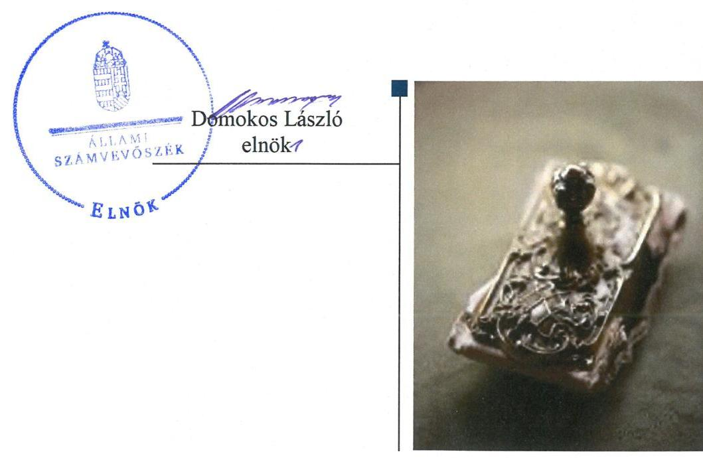
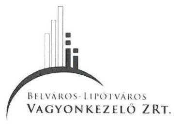
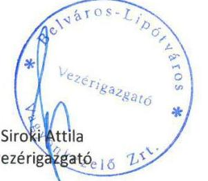

# Jelentés 

## Nemzeti tulajdonú gazdasági társaságok ellenőrzése

Belváros-Lipótváros Vagyonkezelő „zártkörűen működő" Részvénytársaság 2019.

---

# Jelenetés 

## Nemzeti tulajdonú gazdasági társaságok ellenőrzése

Belváros-Lipótváros Vagyonkezelő „zártkörűen működő" Részvénytársaság 2019. 04. hó 03. nap

---

# AZ ELLENŐRZÉST FELÜGYELTE: 

KLINGA LÁSZLÓ felügyeleti vezető

## AZ ELLENŐRZÉST VEZETTE ÉS A VÉGREHAJTÁSÁÉRT FELELŐS:

KISTÓTH KRISZTINA ellenőrzésvezető

## A PROGRAM ÖSSZEÁLLÍTÁSÁÉRT FELELŐS:

TÓTPÁL SZABOLCS osztályvezető

IKTATÓSZÁM: EL-1575-001/2019

TÉMASZÁM: 2478

## ELLENŐRZÉS-AZONOSÍTÓ SZÁM: V082216

Jelentéseink az Országgyúlés számítógépes hálózatán és az Interneten a www.asz.hu címen is olvashatóak.

---

# TARTALOMJEGYZÉK 

■ ÖSSZEGZÉS ..... 5
■ AZ ELLENŐRZÉS CÉLJA ..... 6
■ AZ ELLENŐRZÉS TERÜLETE ..... 7
■ AZ ELLENŐRZÉS HÁTTERE, INDOKOLTSÁGA ..... 8
■ A JELENTÉS LÉNYEGES KÉRDÉSKÖREI ..... 9
■ AZ ELLENŐRZÉS HATÓKÖRE ÉS MÓDSZEREI ..... 10
■ MEGÁLLAPÍTÁSOK ..... 12
■ JAVASLATOK ..... 14
■ MELLÉKLETEK ..... 15
I. sz. melléklet: Értelmező szótár ..... 15
■ FÜGGELÉK: ÉSZREVÉTELEK ..... 17
■ RÖVIDÍTÉSEK JEGYZÉKE ..... 19

---

.

---

# ÖSSZEGZÉS 

A Belváros-Lipótváros Budapest Főváros V. kerületi Önkormányzata a tulajdonosi joggyakorlás kereteit kialakította, tulajdonosi jogait szabályszerűen gyakorolta. A Belváros-Lipótváros Vagyonkezelő „zártkörüen müködő" Részvénytársaság 2015. évben nem alakította ki a szabályszerű gazdálkodás kereteit. 2016. és 2017. években a Társaság biztositotta a felelős és elszámoltatható vagyongazdálkodást, vagyona védelmét.

## Az ellenőrzés társadalmi indokoltsága

A nemzeti tulajdonú gazdasági társaságok ellenőrzése kiemelten fontos a nemzeti vagyon megőrzése érdekében. Gazdálkodásuk jellemzően a közérdeklődés és a média figyelmének középpontjában áll, amihez hozzájárul a gazdálkodásuk körébe tartozó - a nemzeti vagyon részét képező - vagyon nagysága. Az Állami Számvevőszék ellenőrzései feltárják, hogy a tulajdonosi felügyelet hozzájárult-e a szabályszerű gazdálkodáshoz és feladatellátáshoz, továbbá meghatározhatóvá válnak a szervezet vagyongazdálkodást érintő kockázatai.

A megállapítások alapján megfogalmazott számvevőszéki javaslatok hasznosítása elősegíti a meglévő hibák megszüntetését. A jó gyakorlatok bemutatásával az ÁSZ ${ }^{1}$ hozzájárul a követendő megoldások megismertetéséhez, terjesztéséhez.

## Főbb megállapítások, következtetések, javaslatok

Belváros-Lipótváros Budapest Főváros V. kerületi Önkormányzata a tulajdonosi joggyakorlás kereteit kialakította, a tulajdonosi jogait szabályszerűen gyakorolta.

A Belváros-Lipótváros Vagyonkezelő „zártkörűen működő" Részvénytársaság vagyongazdálkodása 2015. évről javult, 2016. és 2017. években szabályszerű volt. 2015. évben a Társaság nem rendelkezett az eszközök és források leltárkészítési és leltározási szabályzatával, ezzel a Társaság nem alakította ki a vagyonnal való elszámolás kereteit.

A 2016-2017. évi beszámolójában lévő eszközöket és forrásokat a Társaság a Számv. tv. ${ }^{2}$ és a Leltározási szabályzata ${ }^{3}$ szerint elkészített leltárral alátámasztotta és teljesítette a mennyiségi felvétellel történő - 3 évenkénti - leltározási kötelezettségét.

A vagyongazdálkodással kapcsolatos feladat- és hatásköröket, felelősségi viszonyokat a Társaság az Alapító okiratával összhangban belső szabályzataiban meghatározta. A Társaság számlarenddel nem rendelkezett, így ennek hiányában a könyvvezetés feltételei maradéktalanul nem voltak biztosítottak. .

Az Állami Számvevőszék a jelentésben foglalt megállapítások alapján a Belváros-Lipótváros Vagyonkezelő „zártkörűen működő" Részvénytársaság vezérigazgatójának egy javaslatot fogalmazott meg.

---

# AZ ELLENŐRZÉS CÉLJA 

Az ellenőrzés célja annak megállapítása, hogy a tulajdonosi joggyakorló a gazdasági társasága feletti tulajdonosi joggyakorlás kereteit kialakította-e, tulajdonosi jogait megfelelően gyakorolta-e és kötelezettségeit teljesítettee. Továbbá, hogy a gazdasági társaság biztosította-e a vagyon védelmét a nyilvántartások szabályszerű vezetése és a mérleg tételeinek leltárral történő alátámasztása útján, valamint szabályszerűen gondoskodott-e a társaság használatában, kezelésében lévő nemzeti vagyon értékének megőrzéséről, gyarapításáról, hasznosításáról.

---

# **AZ ELLENŐRZÉS TERÜLETE**

## **Belváros-Lipótváros Vagyonkezelő "zártkörűen működő" Részvénytársaság**

A Belváros-Lipótváros Vagyonkezelő "zártkörűen működő" Részvénytársaság 1995. július 1-én alakult 200 000 E Ft jegyzett tőkével, majd törzstőkéje 2011. december 21-től 171 500 E Ft-ra csökkent.

Alapítása óta a Társaság4 kizárólagos tulajdonosa Belváros-Lipótváros Budapest Főváros V. kerületi Önkormányzata. Az Alapító okirat5 szerint a Társaságnál, mint egyszemélyes részvénytársaságnál közgyűlés nem működött, a Társaság legfőbb szervének jogait az Alapító6 gyakorolta.

A Társaság alaptevékenysége ingatlankezelés, továbbá társasházi közös képviselet, beruházások előkészítése és lebonyolítása, egyéb mérnöki tevékenység ellátása, nem lakáscélú ingatlanok elidegenítéséhez kapcsolódó előkészítési tevékenység. Az Önkormányzattal7 kötött Közszolgáltatási szerződés8 alapján feladatai közé tartozott az Önkormányzat tulajdonában álló nem lakáscélú ingatlanok elidegenítésének előkészítése, az V. kerület műszaki fejlesztési, tervezési feladatainak ellátása, társasházkezelés. A Társaság közfeladatot nem végzett.

A Társaság tevékenységét saját vagyonnal látta el, melyet bérbevett idegen eszköz egészített ki. Az Önkormányzattól bérelt nem lakás céljára szolgáló helyiségeket harmadik fél részére albérletbe adás keretében hasznosította.

A Társaságnál az az Alapító okirat előírásai szerint háromtagú Igazgatóság9 és háromtagú Felügyelő bizottság10 működött.

A vezérigazgató11 személye az ellenőrzött időszak alatt egy esetben változott, a vezérigazgató 2017. június 1. óta látja el feladatát.

A Társaság a Számv. tv. alapján könyvvizsgálatra volt kötelezett.

A Társaság az ellenőrzött időszakban nem minősült kormányzati szektorba sorolt gazdálkodó szervezetnek és nem végzett vagyonkezelést.

---

# AZ ELLENŐRZÉS HÁTTERE, INDOKOLTSÁGA 

Az ÁSZ az Alaptörvényben lefektetett elvek érvényesítése érdekében a közpénzekkel és a közvagyonnal való felelős és gondos gazdálkodást, az elszámoltathatóságot, az átláthatóságot, a lényeges hibáktól való mentességet, a vagyonvesztés megakadályozását helyezi előtérbe. Ellenőrzéseivel az ÁSZ-nak lehetősége nyílik arra, hogy erősítse hozzáadott értéket teremtőtevékenységét és tanácsadó szerepét.

Az Alaptörvény 38. cikke alapján az állam és a helyi önkormányzatok tulajdona nemzeti vagyon. A nemzeti vagyon megőrzése, megóvása érdekében kiemelten fontos ezen nemzeti tulajdonú gazdasági társaságok ellenőrzése.

Ellenőrzéseink feltárhatják, hogy a gazdasági társaság felelős vagyongazdálkodás mellett, a szolgáltatási szerződésben foglaltak betartásával biztosította-e feladatainak ellátását, valamint a szolgáltatás folyamatos fenntarthatóságának feltételeit, a tulajdonosi felügyelet hozzájárult-e a szabályszerű gazdálkodáshoz és feladatellátáshoz.

Az ellenőrzés eredményeként meghatározhatóvá válnak a szervezet vagyongazdálkodást érintő kockázatai, ezzel lehetővé téve a kockázatok csökkentését. A megállapítások alapján megfogalmazott számvevőszéki javaslatok hasznosítása elősegítheti a meglévő hibák megszüntetését.

Az ÁSZ stratégiába foglalt kiemelt célja, hogy az ellenőrzési tevékenységének hasznosulása tetten érhető legyen a társadalmi bizalom megerősítésében, az ellenőrzött szervezetek magatartásának megváltozásában.

---

# A JELENTÉS LÉNYEGES KÉRDÉSKÖREI 

1. A gazdasági társaság feletti tulajdonosi joggyakorlás megfelel-e a jogszabályi és belső előírásoknak?
2. A gazdasági társaság vagyongazdálkodási tevékenysége szabályszerű volt-e?

---

# AZ ELLENŐRZÉS HATÓKÖRE ÉS MÓDSZEREI 

## Az ellenőrzés típusa

Megfelelőségi ellenőrzés.

## Az ellenőrzött időszak

A gazdasági társaság feletti tulajdonosi joggyakorlás vonatkozásában az ellenőrzött időszak 2017. január 1-től az ellenőrzés megkezdésének napjáig terjed ki az éves beszámoló elfogadása kivételével, amelynél 2015. január 1-től az ellenőrzés megkezdésének napjáig, 2018. október 13-ig tart.

A gazdasági társaság vagyongazdálkodása vonatkozásában az ellenőrzött időszak 2015. - 2017. évek, a 2017. évi beszámoló jóváhagyása és közzététele tekintetében 2018. június elsejéig tartó időszak.

## Az ellenőrzés tárgya

Az önkormányzati tulajdonban lévő gazdasági társaság feletti tulajdonosi joggyakorlás kialakítása és múködtetése. Továbbá az önkormányzati tulajdonban lévő gazdasági társaság vagyongazdálkodása keretében a társaság használatában, kezelésében lévő nemzeti vagyon, illetve a saját vagyon tekintetébe a vagyonnyilvántartások vezetése, leltára. A társaság használatában, vagyonkezelésében lévő nemzeti vagyon tekintetében a vagyon értékének megőrzése, gyarapítása és hasznosítása.

## Az ellenőrzött szervezet

Belváros-Lipótváros Vagyonkezelő „zártkörűen működő" Részvénytársaság, valamint a tulajdonosi jogokat gyakorló BelvárosLipótváros Budapest Főváros V. kerületi Önkormányzata

## Az ellenőrzés jogalapja

Az ellenőrzés jogalapját az ÁSZ tv. ${ }^{12} 1$. § (3) bekezdése, továbbá az 5. § (3)(5) bekezdése képezi.

---

# Az ellenőrzés módszerei 

Az ellenőrzést az ellenőrzési program ellenőrzési kérdései, az ellenőrzött időszakban hatályos jogszabályok, az ellenőrzés szakmai szabályok és módszertanok alapján, a nemzetközi standardok figyelembe vételével végeztük.

Az ellenőrzés ideje alatt az ellenőrzött szervezettel történő kapcsolattartást az ÁSZ Szervezeti és Múködési Szabályzatának vonatkozó előírásai alapján biztosítottuk.

Az ellenőrzési kérdések megválaszolásához szükséges bizonyítékok megszerzése a következő ellenőrzési eljárások alkalmazásával történt: megfigyelés, információkérés, összehasonlítás, valamint elemző eljárás. Az ellenőrzési bizonyítékként felhasználható adatforrások közé tartoztak az ellenőrzési programban felsorolt adatforrások, továbbá minden - az ellenőrzés folyamán - feltárt, az ellenőrzés szempontjából információkat tartalmazó dokumentum. Az ellenőrzést a kérdésekre adott válaszok kiértékelésével, valamint a megjelölt adatforrások, a csatolt tanúsítványok felhasználásával, továbbá az adott időszakban hatályos jogszabályok figyelembe vételével kellett lefolytatni.

A 2017. január 1-től az ellenőrzés megkezdésének napjáig ellenőrizte az ÁSZ a tulajdonosi joggyakorlás kereteinek kialakítását, a tulajdonosi joggyakorló tevékenységét a felügyelő bizottság és a független könyvvizsgáló múködéséhez kapcsolódóan, valamint azt, hogy a tulajdonosi joggyakorló amennyiben a gazdasági társaság feladatellátásához és vagyonkezeléséhez kapcsolódóan határozott meg követelményeket, elvárásokat - a nemzeti vagyon értékének megőrzése érdekében monitorozta-e azok teljesülését. A 2015. január 1-től az ellenőrzés megkezdésének napjáig ellenőrizte az ÁSZ a tulajdonosi joggyakorló részvételét az éves beszámoló elfogadására vonatkozó döntéshozatalban.

Az ellenőrzés során az ellenőrzött gazdasági társaság vagyonhoz kapcsolódó nyilvántartásai vezetésének megfelelősége, a mérleg tételeinek leltárral való alátámasztottsága, valamint a nemzeti vagyon értéke megőrzésének, gyarapításának, hasznosításának szabályszerűsége 2015-2017. évek tekintetében került ellenőrzésre.

A nemzeti tulajdonú (résztulajdonú) gazdasági társaság vagyongazdálkodása az adott területen „szabályszerü", amennyiben az értékelt területen az „igen" válaszok százalékban kifejezett, egy tizedes számra kerekített aránya, meghaladta a 90,0 \%-ot. Amennyiben ez az arány nem haladta meg a 90,0 \%-ot az értékelés „nem szabályszerű".

A vagyonnyilvántartások és a leltár szabályszerűsége esetében az ellenőrzés azokra a legnagyobb értékű tételekre - a lényeges sokaságra - terjedt ki, melyek összértéke eléri a teljes sokaság összértékének 50\%-át. A 2015. és a 2017. évben a lényeges sokaságot tételesen ellenőriztük.

---

# 1. A gazdasági társaság feletti tulajdonosi joggyakorlás megfelel-e a jogszabályi és belső előírásoknak? 

Összegző megállapítás Az Önkormányzat tulajdonosi joggyakorlása szabályszerű volt.

A TULAJDONOSI JOGGYAKORLÁS KERETEIT az Önkormányzat az SZMSZ ${ }^{13}$-ben a Társaság Alapító okiratában és a Vagyonrendeletben ${ }^{14}$ a Mótv. ${ }^{15}$ és a Ptk. ${ }^{16}$ rendelkezéseivel összhangban kialakította.

Az Alapító határozatával ${ }^{17}$ a Taktv. ${ }^{18}$-ben foglaltak szerint megalkotta szabályzatát a Társaság vezető tisztségviselői, felügyelő bizottsági tagjai, valamint az Mt. ${ }^{19}$ 208. §-ának hatálya alá eső munkavállalói javadalmazása, valamint a jogviszony megszűnése esetére biztosított juttatások módjának, mértékének elveiről és annak rendszeréről.

A tulajdonosi jogok érvényesítése érdekében a Társaság tevékenységére vonatkozó elvárásokat és követelményeket a Közszolgáltatási szerződés ${ }_{1-2}$-ben rögzítették, melyben az Önkormányzat éves beszámolási kötelezettséget írt elő.

A TULAJDONOSI JOGGYAKORLÁS szabályszerű volt. Az Alapító okiratban foglaltak szerint a Társaság három főből álló Felügyelő bizottságának elnökét és tagjait, valamint a könyvvizsgálót a Taktv. és a Ptk. előírásai szerint megválasztották. Az Alapító a Társaság beszámolóit a Ptk. előírásai szerint, a Felügyelő bizottság és a könyvvizsgáló jelentése birtokában jóváhagyta, döntött a 2015-2017. évi eredmény eredménytartalékba helyezéséről.

A Társaság feladatellátásának ellenőrzése keretében a Felügyelő bizottság, ügyrendje szerint, megtárgyalta és elfogadta a társaság múködését bemutató éves üzleti terveket, valamint a tervek teljesítésről szóló beszámolókat és a Képviselő-testületnek ${ }^{20}$ elfogadásra javasolta. A Társaság éves beszámoltatási kötelezettségének eleget tett.

## 2. A gazdasági társaság vagyongazdálkodási tevékenysége szabályszerű volt-e?

Összegző megállapítás

A Társaság vagyongazdálkodása 2015. évtől javult, 2016 és 2017. években szabályszerű volt.

AZ ESZKÖZÖK ÉS A FORRÁSOK LELTÁRKÉSZÍTÉSI ÉS LELTÁROZÁSI szabályzatával 2015. évben a Társaság a Számv. tv. 14. § (5) bekezdés a) pontja ellenére nem rendelkezett, így a mérleg leltárral való alátámasztása nem volt értékelhető. Ezzel a Társaság

---

nem biztosította a vagyongazdálkodás elszámoltathatóságát és ellenőrizhetőségét. A Társaság a Számv. tv. előírásai szerint a számviteli politika részeként 2016. január 1-jén hatályba helyezte a Leltározási szabályzatot.

A Társaság 2016-2017. években az éves beszámoló elkészítéséhez, a mérleg tételeinek alátámasztásához Leltározási szabályzata és a Számv. tv. szerinti leltárt állított össze. A tárgyi eszközök és immateriális javak a leltárba bekerülő adatai valódiságáról - a leltár összeállítását megelőzően - a Számv. tv. előírásával összhangban 2016. évben mennyiségi felvétellel győződött meg.

A VAGYONGAZDÁLKODÁS szabályozása keretében a Társaság a vagyongazdálkodással kapcsolatos feladat- és hatásköröket, felelősségi viszonyokat az Alapító okirattal összhangban, belső szabályzataiban, az SZMSZ ${ }^{21}$-ében, a Pénzkezelési szabályzatában ${ }^{22}$, a Kötelezettségvállalásról szóló Vezérigazgatói utasításban ${ }^{23}$, Bizonylati rendjében ${ }^{24}$ meghatározta.

A Társaság a Számv. tv. 161. § (1) bekezdése ellenére nem rendelkezett számlarenddel. A Társaságnál alkalmazott számlatükör ${ }_{1-3}{ }^{25}$ tartalmazta Számv. tv. 161. § (2) bekezdés a) pontjában előírt minden alkalmazásra kijelölt számla számjelét és megnevezését.

A Társaság 2016-2017. években selejtezési feladatait a Selejtezési szabályzatban ${ }^{26}$ foglaltak szerint végezte, a selejtezett eszközöket nyilvántartásából kivezette.

---

# JAVASLATOK 

Az ÁSZ tv. 33. § (1) bekezdésében foglaltak értelmében az ellenőrzött szervezet vezetője köteles a jelentésben foglalt megállapításokhoz kapcsolódó intézkedési tervet összeállítani és azt a jelentés kézhezvételétől számított 30 napon belül az ÁSZ részére megküldeni. Amennyiben az ellenőrzött szervezet vezetője nem küldi meg határidőben az intézkedési tervet, vagy továbbra sem elfogadható intézkedési tervet küld, az Állami Számvevőszék elnöke az ÁSZ tv. 33. § (3) bekezdése a) és b) pontjaiban foglaltakat érvényesítheti.

## Belváros-Lipótváros Vagyonkezelő „zártkörűen működő" Részvénytársaság vezérigazgatójának

1. Intézkedjen a Számv. tv.-ben foglaltaknak megfelelően a számlarend elkészítéséről.
(2. sz. megállapítás 4. bekezdés 1. mondata alapján)

---

# MELLÉKLETEK 

- I. SZ. MELLÉKLET: ÉRTELMEZŐ SZÓTÁR
gazdasági társaság
közfeladat
nemzeti vagyon
tulajdonosi jogok gyakorlója
gazdasági társaság
nemzeti vagyon hasznáása
nemzeti vagyon használója

A gazdasági társaságok üzletszerű közös gazdasági tevékenység folytatására, a tagok vagyoni hozzájárulásával létrehozott, jogi személyiséggel rendelkező vállalkozások, amelyekben a tagok a nyereségből közösen részesednek, és a veszteséget közösen viselik. Forrás: Ptk. 3:88. § (1) bekezdése
Az Áht. ${ }^{27}$ 3/A. § (1) bekezdése alapján közfeladat a jogszabályban meghatározott állami vagy önkormányzati feladat.
Nvtv. 1. § (2) bekezdése szerint nemzeti vagyonba tartozik többek között:
„az állam vagy a helyi önkormányzat kizárólagos tulajdonában álló dolgok,
az a) pont hatálya alá nem tartozó, állam vagy a helyi önkormányzat tulajdonában lévő dolog,
az állam vagy a helyi önkormányzat tulajdonában lévő pénzügyi eszközök, továbbá az államot vagy a helyi önkormányzatot megillető társasági részesedések,
az államot vagy a helyi önkormányzatot megillető bármely vagyoni értékkel rendelkező jogosultság, amelyet jogszabály vagyoni értékű jogként nevesít."
Aki a nemzeti vagyon felett az államot vagy a helyi önkormányzatot megillető tulajdonosi jogok és kötelezettségek összességének gyakorlására jogosult. Forrás: Nvtv. 3. § (1) bekezdés 17. pontja
A gazdasági társaságok üzletszerű közös gazdasági tevékenység folytatására, a tagok vagyoni hozzájárulásával létrehozott, jogi személyiséggel rendelkező vállalkozások, amelyekben a tagok a nyereségből közösen részesednek, és a veszteséget közösen viselik. Forrás: Ptk. 3:88. § (1) bekezdése
A tulajdonosi joggyakorló vagy a nemzeti vagyon használója által a nemzeti vagyon birtoklásának, használatának, hasznok szedése jogának bármely - a tulajdonjog átruházását nem eredményező - jogcímen történő átengedése, ide nem értve a vagyonkezelésbe adást, valamint a haszonélvezeti jog alapítását.
Forrás: Nvtv. 3. § (1) bekezdés 4. pont
Azon természetes személy, jogi személy vagy jogi személyiséggel nem rendelkező szervezet, aki vagy amely állami vagyon tekintetében törvény vagy szerződés alapján, a helyi önkormányzat vagyona tekintetében törvény, a helyi önkormányzat rendelete vagy szerződés alapján bármely jogcímen nemzeti vagyont birtokol, használ, szedi annak hasznait, kivéve a tulajdonosi joggyakorló.
Forrás: Nvtv. 3. § (1) bekezdés 11. pont

---

.

---

# FÜGGELÉK: ÉSZREVÉTELEK 

A jelentéstervezetet a Számvevőszék 15 napos észrevételezésre megküldte az ellenőrzött szervezetek vezetőinek az ÁSZ tv. 29. §* (1) bekezdése előírásának megfelelően.

Belváros-Lipótváros Budapest Főváros V. kerületi Önkormányzata polgármestere az ÁSZ tv. 29. § (2) bekezdésében foglalt észrevételezési jogával nem élt, a jelentéstervezetre észrevételt nem tett. A Belváros-Lipótváros Vagyonkezelő „zártkörüen müködő" Részvénytársaság vezérigazgatója az ÁSZ tv. 29. § (2) bekezdésében foglalt észrevételezési jogával nem élt, írásban jelezte, hogy a jelentéstervezetre észrevételt nem tesz.

[^0]
[^0]:    * 29. § (1) Az Állami Számvevőszék az ellenőrzési megállapításait megküldi az ellenőrzött szervezet vezetőjének vagy az általa megbízott személynek, és annak, akinek személyes felelősségét állapította meg.
    (2) Az ellenőrzött szervezet vezetője és a felelősként megjelölt személy az ellenőrzés megállapításaira tizenöt napon belül írásban észrevételt tehet.
    (3) Az Állami Számvevőszék az észrevételre a beérkezésétől számított harminc napon belül írásban válaszol. A figyelembe nem vett észrevételeket köteles a jelentésben feltüntetni, és megindokolni, hogy azokat miért nem fogadta el.

---

T.
Domokos László
elnök
részére

Állami Számvevőszék
Budapest 4.
Pf. 54.
1364

Iktatószám:
Úgyintéző:
Hivatkozási szám:
Tárgy:

## 227 /2019

Kalocsai László
EL-0872-085/2019
jelentéstervezet elfogadása

## Tisztelt Elnök úr!

Hivatkozással 2019. május 10. napján kelt, EL-0872-085/2019 iktatószámmal megküldött, „Nemzeti tulajdonú gazdasági társaságok ellenőrzése - Belváros Lipótváros Vagyonkezelő „zártkörüen müködő" Részvénytársaság" címü jelentéstervezetre tájékoztatjuk, hogy Társaságunk nem kíván az ellenőrzés megállapításaira észrevételt tenni.

A számviteli törvény szerinti számlarend elkészítéséről intézkedtem, az Intézkedési Tervet jelen levelem mellékleteként küldöm.

Ezúton köszönjük az ellenőrzés során tapasztalt együttműködésüket, segítő hozzáállásukat.

Budapest, 2019. május 23.

Tisztelettel:

MELLÉKLET: Intézkedési terv a számviteli törvény szerinti számlarend elkészítéséről

---

# RÖVIDÍTÉSEK JEGYZÉKE 

${ }^{1}$ ÁSZ
${ }^{2}$ Számv. tv.
${ }^{3}$ Leltározási szabályzat
${ }^{4}$ Társaság
${ }^{5}$ Alapító okirat
${ }^{6}$ Alapító
${ }^{7}$ Önkormányzat
${ }^{8}$ Közszolgáltatási szerződés:

Közszolgáltatási szerződés:

${ }^{9}$ Igazgatóság
${ }^{10}$ Felügyelő bizottság
${ }^{11}$ Vezérigazgató
${ }^{12}$ ÁSZ tv.
${ }^{13}$ SZMSZ
${ }^{14}$ Vagyonrendelet
${ }^{15}$ Mötv.
${ }^{16}$ Ptk.
${ }^{17}$ képviselő-testületi határozat
${ }^{18}$ Taktv.
${ }^{19} \mathrm{Mt}$.
${ }^{20}$ Képviselő-testület
${ }^{21}$ SZMSZ
${ }^{22}$ Pénzkezelési szabályzat

Állami Számvevőszék
2000. évi C. törvény a számvitelről, hatályos 2001. január 1-től

Belváros-Lipótváros Vagyonkezelő Zrt. Számviteli politika külön okiratba foglalt mellékletét képező Leltározási szabályzata, hatályos 2016. január 1-től
Belváros-Lipótváros Vagyonkezelő „zártkörűen működő" Részvénytársaság
Belváros-Lipótváros Budapest V. kerület Önkormányzata 2015. május 14-én kiadott a 105/c/2015. és 105/d/2015. (V. 14.) B-L. Ö. alapítói határozatokkal módosított és egységes szerkezetbe foglalt 550/1995. B-L. Ö.h. számú határozata alapján, módosításokkal egységes szerkezetbe foglalt Alapító Okirat, hatályos 2015. május 14.-től

Belváros-Lipótváros Budapest Főváros V. kerületi Önkormányzata Képviselőtestülete, mint a Társaság legfőbb szerve
Belváros-Lipótváros Budapest Főváros V. kerületi Önkormányzata
Belváros-Lipótváros Budapest Főváros V. kerület Önkormányzata és BelvárosLipótváros Vagyonkezelő Zrt. között létrejött közszolgáltatási szerződés az Önkormányzat közszolgáltatási feladatai ellátására, jóváhagyta a 29/2004. (I.23.) B-L-Ö. határozat, hatályos 2014. február 04-től
Belváros-Lipótváros Budapest Főváros V. kerület Önkormányzata és BelvárosLipótváros Vagyonkezelő Zrt. között létrejött közszolgáltatási szerződés módosítása az Önkormányzat közszolgáltatási feladatai ellátására, jóváhagyta a 157/2017.(VI.22.) B-L-Ö. határozat, hatályos 2017. június 22-től

Belváros-Lipótváros Vagyonkezelő Zrt. Igazgatósága
Belváros-Lipótváros Vagyonkezelő Zrt. Felügyelő bizottsága
Belváros-Lipótváros Vagyonkezelő Zrt. Vezérigazgatója
2011. évi LXVI. törvény az Állami Számvevőszékről, hatályos 2011. július 1-től. Belváros-Lipótváros Budapest Főváros V. kerület Önkormányzata Képviselőtestületének Szervezeti és Müködési Szabályzatáról szóló többször módosított 30/2014. (XI. 20.) önkormányzati rendelete, hatályos 2014. november 20-tól Belváros-Lipótváros Budapest Főváros V. kerület Önkormányzatának az önkormányzat tulajdonában álló vagyonnal való rendelkezés egyes szabályairól szóló módosításokkal egységes szerkezetű 20/2009. (VI. 02.) rendelete, hatályos 2009. június 2-tól

Magyarország helyi önkormányzatairól szóló 2011. évi CLXXXIX. törvény a Polgári Törvénykönyvről szóló 2013. évi V. törvény
57/2013. (II.14.) B-L. Ö.h. számú határozat
2009. évi CXXII. törvény a köztulajdonban álló gazdasági társaságok takarékosabb müködéséről, hatályos 2009. december 4-től
2012. évi I. törvény - a munka törvénykönyvéről, hatályos 2012. július 1-től Belváros-Lipótváros Budapest Főváros V. kerületi Önkormányzata Képviselőtestülete

Belváros-Lipótváros Vagyonkezelő Zrt. Szervezeti és Müködési Szabályzata, hatályos 2013. március 1-től

Belváros-Lipótváros Vagyonkezelő Zrt. Pénzkezelési szabályzata, hatályos 2013. január 1.-től

---

${ }^{23}$ Vezérigazgatói utasítás
${ }^{24}$ Bizonylati rend
${ }^{25}$ számlatükör ${ }_{1-3}$
${ }^{26}$ Selejtezési szabályzat
${ }^{27}$ Áht.

Belváros-Lipótváros Vagyonkezelő Zrt., hatályos 2016. június 23-tól
Belváros-Lipótváros Vagyonkezelő Zrt. Bizonylati rend, hatályos 2001.-től
Belváros-Lipótváros Vagyonkezelő Zrt. Számlatükör, hatályos 2015.január 1-től 2015. december 31-ig

Belváros-Lipótváros Vagyonkezelő Zrt. Számlatükör, hatályos 2016.január 1-től 2016. december 31-ig

Belváros-Lipótváros Vagyonkezelő Zrt. Számlatükör, hatályos 2017.január 1-től 2017. december 31-ig

Belváros-Lipótváros Vagyonkezelő Zrt. Selejtezési szabályzat, hatályos 2009-től 2011. évi CXCV. törvény - az államháztartásról

---

# ÁLLAMI SZÁMVEVŐSZÉK 

1052 Budapest, Apáczai Csere János utca 10.
Levélcím: 1364 Budapest 4. Pf. 54
Telefon: +36 14849100 Telefax: +36 14849200
www.asz.hu