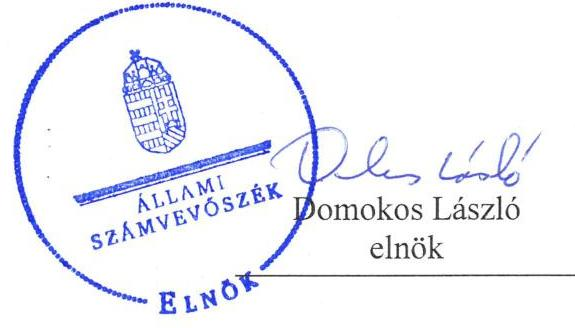
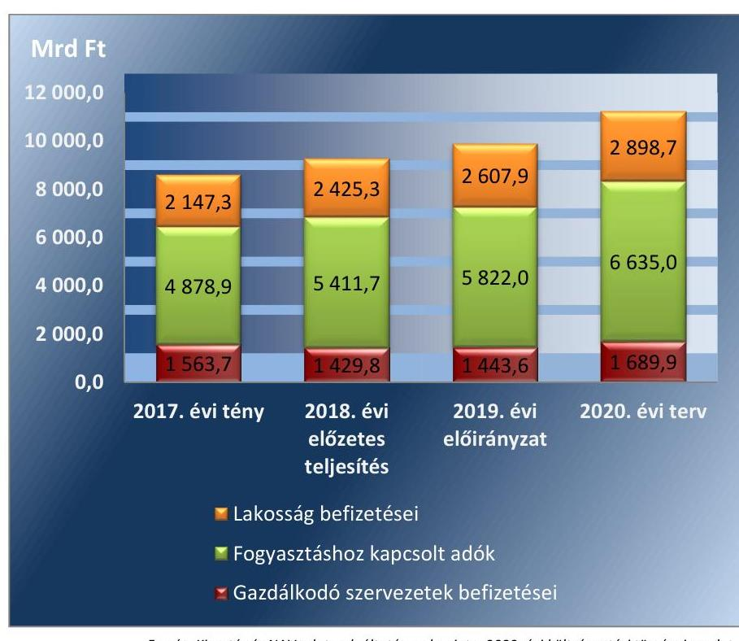

# Jelentés 

## Vélemény a 2020. évi költségvetésről

Vélemény Magyarország 2020. évi központi költségvetéséről szóló törvényjavaslatról
2019.

---

# Jelentés 

## Vélemény a 2020. évi költségvetésről

Vélemény Magyarország 2020. évi központi költségvetéséről szóló törvényjavaslatról
2019. 06. hó 14. nap

---

|   | AZ ELLENŐRZÉST FELÜGYELTE:  |
| --- | --- |
|   | HOLMAN MAGDOLNA JULIANNA felügyeleti vezető  |
|   | AZ ELLENŐRZÉST VEZETTE ÉS A VÉGREHAJTÁSÁÉRT FELELŐS:  |
|   | DR. SIMON JÓZSEF ellenőrzésvezető  |
|   | A PROGRAM ÖSSZEÁLLÍTÁSÁÉRT FELELŐS:  |
|   | TÓTPÁL SZABOLCS osztályvezető  |
|   | A TÉMÁHOZ KAPCSOLÓDÓ KORÁBBI SZÁMVEVŐSZÉKI JELENTÉSEK:  |
|   | - címe: Vélemény Magyarország 2019. évi központi költségvetéséről szóló törvényjavaslatról  |
|   | - sorszáma: 18177  |
|  Jelentéseink az Országgyúlés számítógépes hálózatán és az Interneten a www.asz.hu címen is olvashatóak. | - címe: Vélemény Magyarország 2018. évi központi költségvetéséről szóló törvényjavaslatról  |
|   | - sorszáma: 17085  |
|   | IKTATÓSZÁM: EL-1526-427/2019  |
|   | TÉMASZÁM: 2512  |
|   | ELLENŐRZÉS-AZONOSÍTÓ SZÁM: V0856  |

---

# TARTALOMJEGYZÉK 

■ ÖSSZEGZÉS ..... 5
■ A VÉLEMÉNYADÁS CÉLJA ..... 7
■ A VÉLEMÉNYADÁS TERÜLETE ..... 8
■ A VÉLEMÉNYADÁS HÁTTERE, INDOKOLTSÁGA ..... 9
■ A VÉLEMÉNYADÁS LÉNYEGES KÉRDÉSKÖREI ..... 10
■ A VÉLEMÉNYADÁS HATÓKÖRE ÉS MÓDSZEREI ..... 11
■ ÁSZ VÉLEMÉNYEK ..... 13
■ MELLÉKLETEK ..... 31
I. sz. melléklet: Értelmező szótár ..... 31
II. sz. melléklet: A 2020. évi központi költségvetésről szóló törvényjavaslat részben megalapozott, nem megalapozott és kockázatos bevételi, valamint kiadási előirányzatai. ..... 33
III. sz. melléklet: A 2020. évi központi költségvetésről szóló törvényjavaslat pozitív kockázatot hordozó kiadási előirányzatai ..... 35
■ RÖVIDÍTÉSEK JEGYZÉKE ..... 37

---

.

---

# ÖSSZEGZÉS 

A 2020. évi központi költségvetésről szóló törvényjavaslat tervezése a vonatkozó szabályok betartásával történt. A központi költségvetésről szóló törvényjavaslatban szereplő bevételek és kiadások megalapozottak. A kialakított előirányzatokkal a tervezett költségvetési hiány és államadósság pálya megvalósítható. Emellett a tartalékok képzése hozzájárul a jövőben felmerülő váratlan helyzetek, valamint költségvetési kockázatok kezeléséhez.

## A véleményadás társadalmi indokoltsága

A véleményadás keretében az Állami Számvevőszékről szóló 2011. évi LXVI. törvény 5. § (1) bekezdése alapján az Állami Számvevőszék támogatja az Országgyűlést a költségvetési törvényjavaslatról való megalapozott döntéshozatalban. Ezáltal hozzájárul ahhoz, hogy az Országgyűlés a jogszabályok által előírt követelményeket teljesítő költségvetési törvényt fogadhasson el.

A véleményadás keretében az Állami Számvevőszék rámutat a 2020. évi költségvetésről szóló törvényjavaslatban azonosított kockázatokra, amelyek kezelése hatékonyan és időben megtörténhet az Országgyűlés által. A véleményadás megállapításai támogatják a költségvetés tervezéséért felelős intézményeket és szervezeteket, illetve a költségvetési szerveket is a megalapozott jövőbeli költségvetési tervek elkészítésében.

## Főbb megállapítások, következtetések

A 2020. évi központi költségvetésről szóló törvényjavaslat elkészítése során a tervezést végző szervezetek a jogszabályi előírásokat betartották. A 2020. évi központi költségvetésről szóló törvényjavaslat szerkezete összhangban van a jogszabályi előírásokkal, ezáltal teljesül az átlátható költségvetési gazdálkodás követelménye.

A tervezett gazdasági növekedés elérése mellett a hiány és az államadósság alakulására vonatkozó előírások, egy kivétellel, teljesülnek. Az 1,1\%-os tervezett strukturális deficit meghaladja a Konvergencia Programban meghatározott középtávú költségvetési hiánycélt. Az államadósság-mutató 2020. év végére tervezett 65,5\%-os értéke alapján tovább folytatódik a GDP arányos adósság csökkenő tendenciája. Mindez elősegíti, hogy a jövőbeli gazdasági növekedést az államháztartás gazdálkodási folyamatai ne veszélyeztessék. Az államadósság-szabály teljesülése érdekében a 2020. évben is jelentős nagyságrendű implicit tartalék (a reál GDP növekedési ütemének 2,0-2,2\%-a) áll rendelkezésre.

A 2020. évi központi költségvetésről szóló törvényjavaslat bevételi és kiadási előirányzatai megalapozottak.
A véleményadás által feltárt kockázatok költségvetési intézkedésekkel kezelhetőek, továbbá az Országvédelmi Alapban rendelkezésre álló, a GDP közel 0,8\%-át kitevő előirányzat elegendő biztonsági tartalékot jelent a felmerülő költségvetési kockázatok, valamint a makrogazdasági paraméterek esetleges változásából adódó negatív hatások kivédése érdekében.

A felülről nyitott előirányzatok esetében is szükséges az előirányzatok dokumentumokkal való alátámasztása, mert ennek hiánya kockázatot jelent a költségvetés végrehajtása során. Emiatt szükséges a felelős költségvetési gazdálkodás erősítése.

Az államadósság-kezelés finanszírozási kockázatainak kezelése szempontjából alapvető fontosságú, hogy elegendő nagyságrendű likvid forrás álljon rendelkezésre az aktuális kötelezettségek teljesítéséhez. A likviditás mértékének meghatározása során indokolt figyelembe venni egy előre nem látható negatív pénzügyi sokk hatását. A likviditáskezelés keretében az állampapír típusú finanszírozás tovább bővíthető, elsősorban hazai forrásokra támaszkodva a devizakockázat kiküszöbölése érdekében.

---

A közvetlen bevételek teljesítése szempontjából meghatározó a gazdasági növekedés, valamint a gazdasági folyamatok fehérítése érdekében tervezett intézkedések. Ezen intézkedések hozzájárulnak az adózással kapcsolatos adminisztráció egyszerűsítéséhez, az adórendszer áttekinthetőségének javulásához, valamint a jogkövető magatartás erősítéséhez.

A 2020. évre tervezett uniós támogatások a korábbi évekhez képest kisebb finanszírozási terhet rónak a központi költségvetésre, amely a pénzforgalmi hiány alakulása szempontjából kedvező hatást hordoz. A korábbi években teljesített, a központi költségvetés által megelőlegezett uniós támogatások Európai Bizottság általi megtérítése javítani fogja a központi költségvetés likviditását.

A központi költségvetés a 2020. évben a hazai felhalmozási költségvetés keretében nagyságrendileg 2 ezer Mrd Ft összegben tartalmaz beruházásokat. A gazdaságfejlesztési, az infrastrukturális és a lakástámogatási beruházások közvetlenül, az egyéb területekhez kapcsolódó beruházási programok közvetetten támogatják a 2020. évi gazdasági növekedést.

---

# A VÉLEMÉNYADÁS CÉLJA 

A VÉLEMÉNYADÁS CÉLJA annak értékelése volt, hogy a központi költségvetésről szóló törvényjavaslat összeállítása megfelel-e a jogszabályi előírásoknak, a törvényjavaslat bevételi és kiadási előirányzatait a makrogazdasági előrejelzéseket is figyelembe véve tervezték-e meg; biztosították-e a tervezésnél alkalmazott módszerek, háttérszámítások, hatástanulmányok, valamint az állami szabályozó eszközök javasolt módosításai a törvényjavaslat megalapozottságát.

A véleményadás kiterjedt továbbá arra is, hogy teljesül-tek-e a Tervezési tájékoztatóban megfogalmazott követelmények, az Alaptörvényben és a Magyarország gazdasági stabilitásáról szóló törvényben foglaltak alapján érvé-nyesül-e az államadósság szabály, biztosított volt-e az összhang a törvényjavaslat és a kormányzati programnak részét képező tervek között; a tervezett előirányzatok tartalmazzák-e a közfeladatok ellátáshoz szükséges kiadásokat, illetve számításba vették-e az EU tagság pénzügyi, gazdasági hatásait.

---

# A VÉLEMÉNYADÁS TERÜLETE 

A VÉLEMÉNYADÁS során az Állami Számvevőszék azt értékelte, hogy a központi költségvetésről szóló törvényjavaslat összeállítása szabályszerűen történt-e; Magyarország 2020. évi központi költségvetéséről szóló törvényjavaslat bevételi és kiadási előirányzatainak megtervezése szabályszerű volt-e, a tervezett előirányzatok megalapozottak, illetve alátámasztottak-e.

Az Állami Számvevőszék azt is értékelte, hogy az Alaptörvényben és a Magyarország gazdasági stabilitásáról szóló törvényben foglaltak alapján érvényesült-e az államadósság-szabály, valamint betartották-e az uniós módszertan szerinti hiányra és a strukturális deficitre vonatkozó szabályokat.

---

# A VÉLEMÉNYADÁS HÁTTERE, INDOKOLTSÁGA 

Az Állami Számvevőszék törvényi kötelezettségének teljesítésével véleményezi a költségvetésről szóló törvényjavaslatot rámutatva annak kockázataira. Ezáltal támogatja az országgyűlési képviselőket a jogszabályi követelményeket teljesítő költségvetési törvény elfogadásában.

Az Állami Számvevőszék a 2020. évi központi költségvetés véleményezéséhez kapcsolódó elemzésekben véleményt nyilvánít a 2020. évi költségvetésről szóló törvényjavaslatról, az államadósság-mutató kidolgozására vonatkozó eljárásokról, a tervezett államadósság összegét megalapozó számításokról, azok alátámasztottságáról, valamint a 2020. évi költségvetésről szóló törvényjavaslat parlamenti zárószavazását megelőzően az Alaptörvényben és a Magyarország gazdasági stabilitásról szóló törvényben rögzített államadósság szabály érvényesüléséről, vagyis arról, hogy a törvényjavaslat elfogadásához szükséges feltételek teljesültek-e.

---

# A VÉLEMÉNYADÁS LÉNYEGES KÉRDÉSKÖREI 

1- A központi költségvetésről szóló törvényjavaslat összeállítása az irányadó szabályok szerint történt-e?
2. A Magyarország 2020. évi központi költségvetéséről szóló törvényjavaslatban foglalt bevételi és kiadási előirányzatok megalapozottak-e?

---

# A VÉLEMÉNYADÁS HATÓKÖRE ÉS MÓDSZEREI 

## A véleményadás típusa

Értékelés.

## A véleményadással érintett időszak

A 2020. év.

## A véleményadás tárgya

A 2020. évi központi költségvetésről szóló törvényjavaslat összeállításának szabályszerűsége, a tervezés megalapozottsága, az előirányzatok megalapozottsága, alátámasztottsága, a bevételi előirányzatok teljesíthetősége, illetve a kiadási előirányzatok elegendősége, az államadósság-szabály érvényesülése, valamint az uniós módszertan szerinti hiányra és a strukturális deficitre vonatkozó szabályok betartása.

## A véleményadásban érintett szervezetek

Agrárminisztérium, Államadósság Kezelő Központ Zrt., Belügyminisztérium, Emberi Erőforrások Minisztériuma, Honvédelmi Minisztérium, Innovációs és Technológiai Minisztérium, Külgazdasági és Külügyminisztérium, Magyar Államkincstár, Miniszterelnökség, Miniszterelnöki Kabinetiroda, Miniszterelnöki Kormányiroda, nemzeti vagyon kezeléséért felelős tárca nélküli miniszter, Nemzeti Adó- és Vámhivatal, Nemzeti Egészségbiztosítási Alapkezelő, Pénzügyminisztérium.

## A véleményadás jogalapja

Az ÁSZ tv. 1. § (3), 5. § (1) bekezdéseiben foglaltak.

## A véleményadás módszerei

A véleményadást a program kérdései, a véleményadással érintett időszakban hatályos jogszabályok és az irányadó ÁSZ módszertan (Módszertani útmutató a Magyarország központi költségvetéséről szóló törvényjavaslat véleményezését megalapozó ellenőrzéshez) figyelembevételével végeztük.

---

A véleményadási kérdések megválaszolásához szükséges bizonyítékok megszerzése az adatszolgáltatásra kötelezett szervezetek által rendelkezésre bocsátott dokumentumokra, adatokra alapozva megfigyelés, szemle (szemrevételezés), kérdésfeltevés (információkérés), valamint elemző eljárás útján történt. A bizonyítékként felhasználható adatforrások közé tartoztak egyrészt a szakmai program részletes szempontjainál felsorolt adatforrások, másrészt minden egyéb - a vélemény kialakítása folyamán feltárt, a véleményadás szempontjából információt tartalmazó - dokumentum.

A központi költségvetésről szóló törvényjavaslatban szereplő előirányzatok esetében a véleményadás a bevételi főösszeg 87,9\%-ra, illetve a kiadási főösszeg 80,5\%-ára terjedt ki.

A véleményadáshoz az adatszolgáltatásra kötelezett szervezetek a tanúsítványok és monitoring táblázatok kitöltésével, valamint az Állami Számvevőszék által kért dokumentumok megküldésével szolgáltattak adatokat.

A véleményadás lefolytatása során figyelembe vettük a T/6361 számú Magyarország 2020. évi központi költségvetésének megalapozásáról, a T/6351 számú az egyes adótörvények és más kapcsolódó törvények módosításáról szóló törvényjavaslatokat, valamint az Európai Bizottság részére a Kormány által benyújtott Magyarország 2019-2023. évekre vonatkozó Konvergencia Programot.

---

# 1. A központi költségvetésről szóló törvényjavaslat összeállítása az irányadó szabályok szerint történt-e? 

## Összegző vélemény

1.1. számú vélemény

1.2. számú vélemény

A központi költségvetésről szóló törvényjavaslat összeállítása az irányadó szabályok szerint történt.

A központi költségvetésről szóló törvényjavaslat tartalma összhangban van a jogszabályi előírásokkal.

A központi költségvetésről szóló törvényjavaslat szerkezeti felépítése az Áht. előírásai szerint került kialakításra.

Az Áht. rendelkezéseivel összhangban a fejezetet irányító szervekkel való egyeztetések és a kormányzati szektorba sorolt egyéb szervezetek, valamint a besorolás szempontjából statisztikai módszertani vizsgálat alá vett jogi személyek adatszolgáltatásai alapján került összeállításra a 2020. évi költségvetésről szóló törvényjavaslat.

A fejezetek tervezéséért felelős szervezetek a tervezési eljárás során az Áht., az Ávr., valamint egyes fejezetek esetében az ágazati jogszabályok vonatkozó rendelkezései, továbbá az államháztartásért felelős miniszter által közzétett tervezési szempontok figyelembevételével jártak el. A fejezeteket irányító szervek elkészítették a tervezési dokumentumokat.

A Kormány az Európai Bizottság részére 2019. április 30-ig benyújtotta Magyarország 2019-2023. évekre vonatkozó Konvergencia Programját. A költségvetésről szóló törvényjavaslatban szereplő makrogazdasági mutatószámok összhangban vannak a Konvergencia Programmal.

A költségvetésről szóló törvényjavaslatban meghatározott hiánycél teljesíti a jogszabályi előírást, azonban a tervezett strukturális hiány nincs összhangban a 2020. évre érvényes középtávú költségvetési hiánycéllal.

A központi költségvetésről szóló törvényjavaslat a központi alrendszer pénzforgalmi hiányát 367,0 Mrd Ft-ban - az idei évre tervezett értékhez képest 63,2\%-kal alacsonyabb szinten - határozza meg, amely a nullszaldósan tervezett múködési költségvetés mellett a felhalmozási költségvetés 168,8 Mrd Ft-os és az európai uniós fejlesztési költségvetés 198,2 Mrd Ftos tervezett hiányából tevődik össze.

A 2020. évben az államháztartás pénzforgalmi hiánya a központi költségvetésről szóló törvényjavaslat szerint a GDP 0,8\%-a lesz. Ennek értéke a központi költségvetés 0,7\%-os GDP arányos hiányából, valamint a helyi önkormányzatok 0,1\%-os GDP arányos hiányából tevődik össze. A TB Alapok, valamint az elkülönített állami pénzalapok esetén a központi költségvetésről szóló törvényjavaslat nullszaldós egyenleget határoz meg.

---

Az államháztartás pénzforgalmi hiányából kiindulva a központi költségvetésről szóló törvényjavaslat általános indokolása levezeti a kormányzati szektor uniós módszertan szerinti hiányát, összhangban a 479/2009/EK rendelet előírásaival. Eszerint a kormányzati szektor hiánya a bruttó hazai termék előre jelzett értékének 1,0\%-át jelenti, amely 0,8 százalékpontos javulást jelent a 2019. évre tervezett hiánymutatóhoz képest. A 2020. évre tervezett uniós módszertan szerinti hiány értéke kisebb, mint a Gst. 3/A § (2) bekezdés b) pontjában meghatározott 3,0\%-os érték. Ezáltal az uniós módszertan szerinti hiány tervezett értéke teljesíti a Gst.-ben szereplő előírást.

A Kormány az Áht. 22. § (3) bekezdés d) pontja előírását betartva a központi költségvetésről szóló törvényjavaslat indokolásában ismertette a kormányzati szektornak a Gst. 1. § e) pontja szerinti strukturális egyenlegét. A 2020. évre tervezett 1,1\%-os strukturális egyenleg a Gst. 3/A § (2) bekezdés a) pontjában előírtak ellenére 0,1 százalékponttal magasabb az 1,0\%-os középtávú költségvetési hiánycélnál, amelyet Magyarország 20192023. évekre szóló Konvergencia Programja határozott meg.

# 1.3. számú vélemény 

## A központi költségvetésről szóló törvényjavaslat alapján az államadósság alakulásával kapcsolatos jogszabályi előírások teljesülnek.

Az államadósság-mutató számításakor a Gst. 2. § (1) bekezdés a) pontja értelmében a konszolidált, korrigált államadósságot vették figyelembe, amelynek 2020. december 31-i várható értéke 31 974,1 Mrd Ft. A mutató nevezőjében a Gst. 2. § (1) bekezdés b) pontja szerinti bruttó hazai termék értékét rögzítették. Ez alapján a számított államadósság-mutató 2020. december 31-i várható értéke 65,5\%.

A mutató értéke az Alaptörvény 36. cikk (5) bekezdésében meghatározott legalább 0,1\%-os csökkenésre vonatkozó követelménynek eleget tesz. A mutató értékének csökkenése a 2019. év végi várható értékhez képest 3,1 százalékpontot jelent.

Mivel az infláció számított növekedési üteme nem haladja meg a 2020. évben a kormányzati prognózis szerint a 3,0\%-os értéket, ezért a Gst. 4. § (2a) bekezdése alapján az államadósság-mutatót úgy kell meghatározni, hogy az államadósság-mutatónak a 2019. évhez viszonyított csökkenése legalább 0,1 százalékpontot érjen el. Ezen előírást a központi költségvetésről szóló törvényjavaslatban szereplő államadósság-mutató teljesíti.

A kormányzati szektor adósságának a költségvetési év utolsó napjára vonatkozó tervezett értékének meghatározásához a Gst. 2. § (1) bekezdés a) pontja által érintett szervezetek adatot szolgáltattak az államháztartásért felelős miniszter számára.

A kormányzati szektor adósságán belül a 2020. év végére a központi alrendszer Gst. szerint korrigált adóssága várhatóan 30 939,0 Mrd Ft-ra növekszik.

A 2020. évi költségvetésről szóló törvényjavaslat szerint az önkormányzati alrendszer adósságának 2019. évi várható értéke 260,0 Mrd Ft, a 2020. évre vonatkozóan tervezett adóssága 270,0 Mrd Ft. A 2020. évre tervezett önkormányzati adósság a teljes konszolidált államadósság 0,8\%-a.

A Gst. 2. § (4) bekezdése szerint a kormányzati szektorba sorolt egyéb szervezetek adósságának 2020. évi tervezett értéke 1 370,5 Mrd Ft, amely 61,5 Mrd Ft-tal haladja meg a 2019. év végére várható értéket.

---

Az implicit tartalék nagyságát az általunk végzett érzékenység-vizsgálat alapján az 1. táblázat szemlélteti, amely bemutatja, hogy mekkora mozgásteret tartalmaz az államadósság-mutató összetevőire (a nominális GDP és a konszolidált, korrigált államadósság) a prognózis, az államadósság-szabály teljesülése mellett. Az érzékenység vizsgálat elvégzéséhez a központi költségvetésről szóló törvényjavaslatban meghatározott adatok kerültek felhasználásra.

1. táblázat

|  AZ ÁLLAMADÓSSÁG-KEZELÉS IMPLICIT TARTALÉKA A 2020. ÉVBEN (MRD FT) |  |  |  |  |   |
| --- | --- | --- | --- | --- | --- |
|   | 2019. év
várható | 2020. év
tervezett | 2020. év |  |   |
|   |  |  | Maximális
államadósság | Minimális
nominális GDP | Minimális nomi-
nális GDP
növekedés  |
|  Nominális GDP | 45449,0 | 48779,5 |  |  |   |
|  Államadósság | 31187,6 | 31974,1 | 33413,6 | 46677,5 | 2,7\%  |

Fornás: ÁSZ számítás Magyarország 2020. évi központi költségvetéséről szóló törvényjavaslat adatai alapján

A számítás alapján az államadósság-szabály akkor nem teljesülne, ha az államadósság - a tervezett GDP növekedés mellett - további 1439,5 Mrd Ft-ot meghaladó mértékben növekedne, vagy a nominális GDP növekedési üteme - a tervezett államadósság mellett - nem érné el a 2,7\%-ot. Ez alapján az államadósság-szabály teljesülése keretében a reál GDP növekedési üteme 2,0-2,2 százalékpont nagyságrendű implicit tartalékkal rendelkezik.

# 2. A Magyarország 2020. évi központi költségvetéséről szóló törvényjavaslatban foglalt bevételi és kiadási előirányzatok meg-alapozottak-e?

Összegző vélemény A Magyarország 2020. évi központi költségvetéséről szóló törvényjavaslat bevételi előirányzatainak 97,3\%-a teljes körűen, 2,7\%-a részben megalapozott. A kiadási előirányzatok 90,9\%a megalapozott, 8,7\%-a részben, a fennmaradó 0,4\%-a nem megalapozott.

### 2.1. számú vélemény

A tervezési folyamat során biztosították a központi költségvetés adatainak előző évekkel való összehasonlíthatóságát és előírták az elérendő célok meghatározását.

Az előirányzatok értéke hazai működési, felhalmozási és uniós fejlesztési kiadások és bevételek szerinti bontásban is rendelkezésre áll.

Az államháztartásért felelős miniszter gondoskodott a 2020. évi költségvetési törvényjavaslat összeállításához szükséges Tervezési tájékoztató összeállításáról és biztosította ennek nyilvános elérhetőségét. A Tervezési tájékoztató előírta a közpénzfelhasználással összefüggő célok bemutatásának kötelezettségét a fejezeti indoklásokban.

---

A központi költségvetésről szóló törvényjavaslat tervezése során a 2020. évi központi költségvetés összeállításához szükséges makrogazdasági paramétereket meghatározták és bemutatták.

A 2020. évi költségvetésről szóló törvényjavaslat tartalmazza a központi költségvetés uniós forrásokkal való kapcsolatát, az államháztartáson kívülre adott támogatásokat, valamint a hazai és uniós módszertan szerinti hiány és államadóssággal kapcsolatos mutatók alakulását.

### 2.2. számú vélemény

A központi költségvetésről szóló törvényjavaslat közvetlen bevételei – a társasági adót kivéve – megalapozottak.

A 2020. évre vonatkozóan a közvetlen bevételi előirányzatok tervezett értéke 1 366,4 Mrd Ft-tal (13,7 %-kal) nagyobb a 2019. évi előirányzathoz képest. Ezen belül a gazdálkodó szervezetek befizetései 17,1%-kal, a fogyasztáshoz kapcsolt adókból származó bevételek 14,0%-kal, valamint a lakosság befizetései 11,2%-kal növekednek.

A 2020. évi központi költségvetésről szóló törvényjavaslat keretében az adó- és adó jellegű bevételek tervezésénél a PM figyelembe vette a 2019. év végén várható és a 2018. évi bevételek előzetes teljesítési adatait.

A 2020. évi központi költségvetés közvetlen bevételi előirányzatainak tervezése során a PM figyelembe vette a költségvetésről szóló törvényjavaslatban szereplő makrogazdasági mutatókra vonatkozó gazdasági előrejelzéseket, a gazdasági növekedés, a fogyasztási és egyéb piaci tendenciák feltételezett hatásait, valamint az adózói létszám várható alakulását.

A 2017-2020. évek között az adószerkezet alakulását az 1. ábra szemlélteti.

*Förrás: Kincstár és NAV adatszolgáltatás, valamint a 2020. évi költségvetési törvényjavaslat alapján ÁSZ szerkesztés*

---

A közvetlen bevételek növekedésének fő indokai közé tartozik a gazdasági növekedés, valamint a gazdaság fehérítése érdekében tervezett intézkedések pozitív hatásai.

A T/6351 számú az egyes adótörvények és más kapcsolódó törvények módosításáról szóló törvényjavaslat további tervezett intézkedéseket tartalmaz a gazdasági folyamatok fehérítése érdekében. A T/6351-es számú törvényjavaslat tervezett intézkedései hozzájárulnak az adózással kapcsolatos adminisztráció egyszerűsítéséhez, az adórendszer áttekinthetőségének javulásához, valamint a jogkövető magatartás erősítéséhez. Az adórendszer átalakításával kapcsolatban tervezett főbb intézkedések közé tartozik:
— az egyszerűsített vállalkozói adó megszűntetése,
— a kisvállalati adó kulcsának 1,0 százalékponttal történő csökkentése,
— a reklámadó kulcsának 2022. december 31-ig 0,0\%-ra való csökkentése,
— a legalább 100,0 M Ft éves árbevétellel rendelkező vállalkozások adófeltöltési kötelezettségének megszűnése a társasági adó, az innovációs járulék és az energiaellátók jövedelemadója esetén,
— a nyugdíj-, egészségbiztosítási, pénzbeli egészségbiztosítási és mun-kaerő-piaci járulék egységes járulékként való megjelenése,
— a szociális hozzájárulási adó esetében a mezőgazdasági őstermelőknél negyedéves helyett éves adómegállapítási időszak meghatározása.
A 2020. évi központi költségvetésről szóló törvényjavaslat szerint a gazdaság fehérítését célzó intézkedések fő területei közé tartozik az elektronikus fizetési rendszerek kiterjesztése, valamint a Nemzeti Adó- és Vámhivatal szerepének erősítése az adózói morál további javítása érdekében. Ezen intézkedések részletes tartalmát azonban nem tartalmazza a törvényjavaslat.

A 2020. évi központi költségvetésről szóló törvényjavaslat közvetlen adóbevételeinek tervezése során számoltak a korábban hozott fehérítő intézkedések áthúzó hatásaival. Ezek közé tartozik az online pénztárgépek alkalmazása, az online számlázási rendszer bevezetése, valamint az uniós jogharmonizáció keretében az adóelkerülés elleni irányelv előírásainak átültetése.

A társasági adó 2020. évi előirányzata 501,1 Mrd Ft, amely 101,6 Mrd Ft-tal haladja meg a 2019. évi előirányzatot.

Az előirányzat tervezése során a PM pozitív hatásként a GDP növekedési üteme alapján levezethető adóalap növekedést, az adóelkerülés elleni uniós irányelv további intézkedéseinek bevezetését, valamint az egyszerűsített vállalkozói adó megszűntetése miatti átlépéseket vette figyelembe.

Az egyszerűsített vállalkozói adó megszűnése miatt az adóbevételek tervezése során azzal számoltak, hogy az adóalanyok több mint 90,0\%-a átlép a kisadózók tételes adója, illetve a kisvállalati adó hatálya alá. A további adóalanyok esetében pedig a társasági adó, illetve kisebb arányban a személyi jövedelemadó választásával számoltak.

A társasági adóbevétel csökkentését okozó tényezők között számoltak a 100,0 M Ft feletti árbevétellel rendelkező vállalkozások adófeltöltési kötelezettségének megszűntetésével és az igénybe vett adókedvezmények

---

értékének emelkedésével. Az igénybe vett adókedvezmények bővülését elsősorban a fejlesztési célú támogatások esetében tervezték.

A társasági adó 2019. évre várható - a gazdasági növekedés bővüléséből származó - 20,0-25,0 Mrd Ft nagyságrendű többletbevétele, valamint a tervezés során figyelembe vett tényezők alapján az előirányzat részben alátámasztott és teljesülése kockázatot hordoz. A tervezett teljesítési értéktől való elmaradás miatt a kockázat nagyságrendje 30,0-40,0 Mrd Ft.

A kisadózók tételes adójának 2020. évi előirányzata 192,6 Mrd Ft, amely 56,9 Mrd Ft-tal magasabb a 2019. évi előirányzatnál.

Az előirányzat növekedésének indoka elsősorban az adózói létszám várható növekedése. A számítások szerint a 2019. év végén várható 336 ezer adóalanyról éves átlagban 430 ezer adóalanyra növekszik az adónemet választók száma. A 2020. évben az egyszerűsített vállalkozói adó megszüntetése miatt jelentős nagyságrendű lesz az átlépők száma, valamint a gazdasági folyamatok fehéredése révén új adóalanyok megjelenése is várható.

Az előirányzat tervezése során biztosították a bevételek közgazdasági megalapozottságát, teljesítése nem hordoz kockázatot.

Az általános forgalmi adó 2020. évi előirányzata 4 967,8 Mrd Ft, amely 15,8\%-kal magasabb a 2019. évi előirányzatnál.

Az adónemből származó tervezett bevétel növekedését jellemzően az infláció tervezett értéke mellett a teljesülést meghatározó fontosabb öszszetevők növekedése magyarázza. E tényezők közé tartozik a lakossági fogyasztás, a lakossági beruházások és az államháztartás vásárlásának bővülése. A tervezés során az uniós forrásfelhasználáshoz kapcsolódó vásárlások értékét az idei évihez hasonló nagyságrendben vették figyelembe a korábban kifizetett előlegek tervezett felhasználási üteme alapján.

A 2020. évi átlagos adószint 21,3\%, amely 0,2 százalékponttal alacsonyabb az idei évi értékhez képest. Az előirányzat tervezése során továbbá figyelembe vették a tervezett áfakulcs csökkentő intézkedéseket, amelyek közé tartozik:
$\longrightarrow$ a kereskedelmi szálláshely szolgáltatás áfa kulcsának 18,0\%-ról 5,0\%-ra csökkentése,
és a behajthatatlan vevőkövetelések esetén az áfa visszaigénylési lehetőség bevezetése.
Mindez együttesen várhatóan 30,0-40,0 Mrd Ft összegű adóbevétel csökkentő hatást gyakorol a 2020. évben.

Az előirányzat tervezése során figyelembe vették a 2020. évi központi költségvetésről szóló törvényjavaslat által megnevezett területeken előkészítés alatt lévő gazdaságfehérítő intézkedéseket. Ezekre alapozva nagyságrendileg 30,0-40,0 Mrd Ft bevétel növekedéssel számoltak.

Az általános forgalmi adó előirányzat megalapozott, a teljesítése kockázatot nem hordoz.

A jövedéki adó 2020. évi előirányzata 1 226,4 Mrd Ft, amely 85,5 Mrd Ft-tal haladja meg az idei évre vonatkozó előirányzatot. Az előirányzat tervezésekor a gazdasági növekedés feltételezett ütemével, valamint a lakossági fogyasztás makrogazdasági paraméterekben meghatározott értékével számoltak.

Az üzemanyagok, valamint a dohány termékek esetén szintén a forgalom további élénkülésével számoltak. Az alkohol- és a dohánytermékek

---

esetében meghatározó folyamatot jelent az adókulcsok uniós jogharmonizáció miatti emelkedése, amely a jövedéki adóbevételek alakulása szempontjából pozitív hatást rejt magában.

Figyelembe véve a jövedéki adótermékek iránti kereslet eddigi és várható alakulását, valamint a rendelkezésre álló jövedelem változását az előirányzat teljesítése nem hordoz kockázatot, megalapozott.

A személyi jövedelemadó 2020. évi előirányzata 2 608,9 Mrd Ft, amely a 2019. évi előirányzatot 10,5\%-kal haladja meg.

Az adónemből származó bevételek növekedésének legfontosabb forrása a 2020. évben az összevontan adózó jövedelmek 9,2\%-os, valamint az elkülönülten adózó jövedelmek 17,4\%-os tervezett növekedése. Utóbbi fő indoka az osztalékjellegú jövedelem várt növekedése, valamint az egyszerűsített vállalkozói adó megszűntetése miatt a személyi jövedelemadó hatálya alá tartozó egyéni vállalkozók létszámának tervezett növekedése.

Az előirányzat kialakításánál számoltak az idei évben bevezetett négygyermekes nők személyi jövedelemadó mentességének, valamint a lakossági állampapírokból származó kamatjövedelem adómentességének hatásával. Ezek együttes hatásaként az adóalap várható csökkenése 23,028,0 Mrd Ft.

Az előirányzat tervezése során a makrogazdasági és jogszabályi feltételek változását figyelembe vették, ezek alapján az előirányzat alátámasztott és teljesítése nem hordoz kockázatot.

# 2.3. számú vélemény 

## Az uniós források tervezése a vonatkozó előírások szerint történt. Az uniós kiadási előirányzatok megalapozottak.

Az Európai Unió 2014 és 2020 közötti hétéves költségvetési keretéből 21,9 Mrd EUR (6 900 Mrd Ft) beruházási, 3,45 Mrd EUR (1 087 Mrd Ft) vidékfejlesztési és 39 millió EUR halászati támogatást hívhat le Magyarország. A rendelkezésre álló forrás felhasználása során elsődleges cél gazdaságfejlesztési célú támogatások nyújtása, valamint a vállalkozások versenyképességének javítása.

Az előző évekhez hasonlóan az uniós bevételek elkülönítetten, az Uniós fejlesztések fejezet helyett a Költségvetés közvetlen bevételei és kiadásai fejezetben jelennek meg. Mindez támogatja a költségvetési adatok előző évekkel való összehasonlíthatóságát.

A költségvetés által tervezett, megelőlegezendő összeg előző évhez viszonyított csökkenése azt mutatja, hogy a 2020. évben - a programozási ciklus záróévében - az uniós támogatások kapcsán a hangsúly a különböző programok kialakításáról és a szerződések megkötéséről fokozatosan áthelyeződik a már megkezdett fejlesztések megvalósítására.

A 2020. évi költségvetésről szóló törvényjavaslat új elemként tartalmazza az uniós bevételek esetében a Tárgyévet megelőző években teljesített kiadások uniós bevétele előirányzatot. Ezen előirányzat szolgál valamennyi a 2020. év előtt megelőlegezett és a 2020. évben az Európai Bizottság által megtérített uniós támogatás elszámolására.

A 2020. évi központi költségvetés tervezése során a felelős fejezetek a 2014-2020. évi költségvetési ciklus utolsó évében felhasználható uniós és a kapcsolódó hazai források bevételeit, illetve kiadásait megtervezték. Az uniós bevételek 2020. évi tervezett értéke 1 496,0 Mrd Ft, a kiadások ter-

---

#### **2.4. számú vélemény**

vezett értéke 1 694,3 Mrd Ft. Az utólagos megtérülés várható értéke alapján a tervezett szükséges költségvetési megelőlegezés 181,2 Mrd Ft, amely 295,2 Mrd Ft-tal kisebb az idei évre meghatározott előirányzott értékhez képest.

A fejezet irányító szervek a vállalt nemzeti társfinanszírozás összegét a Kormány és az Európai Unió Bizottsága által jóváhagyott éves, vagy több évre szóló szakmai programokban vállalt kötelezettségek figyelembevételével tervezték meg, továbbá a programok benyújtásakor megjelölt finanszírozási eszközt a költségvetés tervezésekor biztosították.

Az ITM az Uniós fejlesztések fejezet tervezése során, valamint azon fejezetek, amelyek egyéb, az európai uniós fejlesztési költségvetésbe tartozó előirányzatokkal rendelkeznek az államháztartásért felelős miniszter által kiadott Tervezési tájékoztató előírásai szerint jártak el. A tervezési folyamat egységes lefolytatása érdekében az ITM az Uniós fejlesztések fejezetre vonatkozóan saját tervezési tájékoztatót adott ki.

Az uniós fejlesztési költségvetéshez tartozó bevételi és kiadási előirányzatok – az egyéb uniós előirányzatok kivételével – alátámasztottak és nem hordoznak kockázatot.

Az **egyéb uniós előirányzatok** alcím magába foglalja az EGT, Norvég Alap támogatásból megvalósuló projektek 9,8 Mrd Ft, valamint a Svájci-Magyar Együttműködési Program II. 4,0 Mrd Ft összegű előirányzatát. Az alcím 2020. évi kiadási előirányzata részben alátámasztott, mivel az EGT, Norvég Alap támogatás, valamint a Svájci-Magyar Együttműködési Program II. támogatás igénybe vételéhez a kapcsolódó nemzetközi megállapodások előkészítése megtörtént, azonban aláírásukra a véleményadás időszakában nem került sor. Az alcím előirányzata azonban nem minősül kockázatosnak, mivel annak felhasználása nem haladhatja meg a tervezett összeget.

**A 2020. évi költségvetésről szóló törvényjavaslat tervezett kiadásai 122,2 Mrd Ft kockázatot hordoznak. A 2018. évben feltárt tervezési hibák továbbra is fennállnak.**

Az Agrárminisztérium fejezethez tartozó **Állat-, növény- és GMO kártalanítás** előirányzat felhasználásának célja az élelmiszerláncról és hatósági felügyeletről szóló 2008. évi XLVI. törvényben foglalt feladatok végrehajtásához szükséges források biztosítása.

A felülről nyitott előirányzat 2020. évi tervezett értéke – az idei évi értékkel megegyezően – 1,2 Mrd Ft. Az előző években az előirányzat minden évben túlteljesült. A 2017. évben 11,4 Mrd Ft, a 2018. évben 3,5 Mrd Ft volt a kiadások értéke. Az idei év eddigi és a korábbi évek teljesítési adatai alapján a 2019. évi várható teljesítés 3,0 Mrd Ft lesz.

Az előirányzat nem megalapozott, kockázatosnak minősül. A kockázat mértéke 1,8 Mrd Ft.

Az Innovációs és Technológiai Minisztérium fejezetben található **Autóbusszal végzett személyszállítási közszolgáltatások költségtérítése** kiadási előirányzat tervezett értéke a 2020. évre 90,0 Mrd Ft, amely 24,7 Mrd Ft-tal nagyobb az idei évi előirányzathoz képest.

Az ÁSZ által az elmúlt két évben a központi költségvetésről szóló törvényjavaslatról készített véleménye keretében feltárt tervezési hiba továbbra is fennáll, mivel a rendelkezésre álló forrás nincs összhangban a

---

személyszállítási szolgáltatásokról szóló 2012. évi XLI. törvény rendelkezésével, a rendelkezésre álló források nem biztosítanak teljes körű fedezetet a közfeladat ellátásához. A kiadási előirányzat részben megalapozott és kockázatot hordoz.

Az előirányzat a 2020. évre vonatkozóan 18,4 Mrd Ft kockázatot hordoz, mert az előirányzat keretszámának véglegesítése során nem számoltak a 2020. évben a közszolgáltatás során felmerülő, bevételekkel nem fedezett indokolt költségek növekedésével.

A Vasúti személyszállítási közszolgáltatások költségtérítése előirányzat keretében a 2020. évi költségvetési törvényjavaslat 173,0 Mrd Ft-ot határoz meg, amely a 2019. évi előirányzathoz képest a tervezett infláció szerinti növekedést tartalmazza.

A személyszállítási szolgáltatásokról szóló 2012. évi XLI. törvény szerint a lakosság helyközi vasúti személyszállítási közszolgáltatásokkal történő ellátása, a szolgáltatás feltételeinek biztosítása állami feladat, amelyet a MÁV-START Zrt.-vel, illetve a GYSEV Zrt.-vel, mint vasúti személyszállítási tevékenységet végző társaságokkal kötött közszolgáltatási szerződés alapján lát el. Az előirányzat a közszolgáltatással kapcsolatban felmerülő, bevételekkel nem fedezett, a szolgáltatók és az állam között létrejött közszolgáltatási szerződésben meghatározott indokolt költségekhez nyújtandó költségtérítést finanszírozza.

A rendelkezésre álló forrás nincs összhangban a 2012. évi XLI. törvény rendelkezésével, a rendelkezésre álló források nem biztosítanak teljes körű fedezetet a közfeladat ellátásához. A kiadási előirányzat részben megalapozott és 14,1 Mrd Ft kockázatot hordoz.

A szakképzési centrumok által ellátott felnőtt oktatási tevékenység finanszírozása előirányzat 2020. évre tervezett előirányzata 5,8 Mrd Ft, amely 6,2 Mrd Ft-tal kisebb az idei évi előirányzathoz képest.

Az előirányzat 6,0 Mrd Ft kockázatot hordoz, mert a 2020. évben a közfeladat ellátása várhatóan 12,0 Mrd Ft kiadást igényel. A 6,0 Mrd Ft feletti 0,2 Mrd Ft, mint kiadáscsökkenés alátámasztott a tranzakciós illeték eltörlése által.

A Külgazdasági és Külügyminisztérium fejezethez tartozó Beruházás ösztönzési célelőirányzaton a magyarországi székhellyel, fióktelephellyel rendelkező, kiemelt ágazatok beruházását preferáló támogatásokra 50,0 Mrd Ft összegű, a 2019. évi előirányzathoz képest 30,0 Mrd Ft-tal több forrás áll rendelkezésre a 2020. évi központi költségvetésről szóló törvényjavaslat szerint.

Az előirányzat aktuálisan összesen 127 támogatási szerződést finanszíroz. Az együttesen vállalt kötelezettségek értéke 167,0 Mrd Ft. Ebből a 2019. évre vonatkozó érték 128,7 Mrd Ft. Ez alapján a 2019. évi előirányzat várhatóan 78,9 Mrd Ft-tal teljesül nagyobb értékben a tervezetthez képest.

Az idei év során további 40-50 támogatási szerződés megkötése várható. Ez alapján az előirányzat tervezett értékével - az előző évi ÁSZ véleményadáshoz hasonlóan - kapcsolatban kockázatot jelent, hogy az előirányzat 2020. évi várható teljesülése 75,3 Mrd Ft-tal meghaladhatja a tervezett értéket.

A kötött segélyhitelezés előirányzat 2020. évre tervezett értéke 17,9 Mrd Ft, amely a 2019. évi előirányzathoz képest 2,9 Mrd Ft-os növekedést jelent.

---

Az előirányzat az Eximbank Zrt. által folyósítható kötött segélyhitelek feltételeiről és a segélyhitelnyújtás részletes szabályairól szóló 232/2003. (XII. 16.) Korm. rendelet 13. §-ában foglaltak szerint egyedi kormánydöntések alapján vállalt nemzetközi kötelezettségekhez kapcsolódó állami támogatás - kamat- és adományelem támogatás - finanszírozására szolgál.

Az előirányzat 2020. évi tervezett összege a közfeladat ellátásához várhatóan nem lesz elegendő. Az Eximbank Zrt. által készített kimutatás szerint az állami támogatás szükséges összértéke 21,9 Mrd Ft értékű lesz. Ez alapján az előirányzat 4,0 Mrd Ft kockázatot hordoz.

Az Eximbank Zrt. kamatkiegyenlítése előirányzat kiadásainak 2020. évre tervezett értéke 19,2 Mrd Ft, amely az idei évhez képest 1,3 Mrd Ft-tal kisebb összeget jelent.

A központi kezelésű előirányzat célja, hogy a magyar exportőrök számára hatékony finanszírozási és biztosítási konstrukciók álljanak rendelkezésre. A nyújtott hitelek kamatának, valamint az e célt szolgáló finanszírozási költségek különbözetének forrását az Eximbank Zrt. részére a központi költségvetés biztosítja.

Az előirányzathoz kapcsolódóan számításokat végeztek, azonban nem támasztják alá az előirányzatot, a közfeladat ellátásához nem elegendő. Az előirányzat nem megalapozott és 2,6 Mrd Ft kockázatot hordoz.

A filmszakmai közvetett támogatások mozgókép törvény szerinti kiegészítő finanszírozása előirányzat 2020. évre tervezett értéke 27,0 Mrd Ft, amely 4,5 Mrd Ft-tal kisebb összeget jelent az idei évhez képest.

Az előirányzat, mint felülről nyitott előirányzat nem megalapozott, mert számításokkal nem alátámasztott.

# 2.5. számú vélemény 

A központi tartalék előirányzatok tervezése szabályszerűen történt és a véleményadás keretében feltárt kockázatok fedezete rendelkezésre áll.

A 2020. évi központi költségvetésről szóló törvényjavaslatban a központi alrendszer tartalék előirányzatai a Pénzügyminisztérium fejezet helyett a Miniszterelnöki Kormányiroda fejezetben szerepelnek.

A központi tartalék jellegű előirányzatok összege együttesen 488,0 Mrd Ft. Ezen belül az Országvédelmi Alap az előre nem látható és figyelembe nem vett makrogazdasági tényezők változásából adódó negatív hatások ellen nyújt védelmet. A rendkívüli kormányzati intézkedések előirányzata az év közben meghozott kormányzati döntésekből következő feladatok finanszírozására és az előirányzott, de elháríthatatlan ok miatt elmaradó költségvetési bevételek pótlására szolgál.

Az Országvédelmi Alap kiadási előirányzata 378,0 Mrd Ft, amely a 2019. évi előirányzathoz képest 318,0 Mrd Ft-tal nagyobb összegű. Felhasználhatóságáról - az előző évekkel megegyező módon - a Kormány határozatban dönt az EDP jelentéshez kapcsolódó ütemezésben, az EDP hiány figyelembevételével, ami nem haladhatja meg a GDP 1,0\%-át, azaz az uniós módszertan szerinti költségvetési hiánycélt. Az első jelentést követően (2020. március 31.) legfeljebb 189,0 Mrd Ft használható fel, a fenti feltételek teljesülése esetén.

A rendkívüli kormányzati intézkedésekre a 2020. évi központi költségvetésről szóló törvényjavaslat 110,0 Mrd Ft előirányzatot tartalmaz, amely az

---

idei évhez képest 55,0 Mrd Ft-tal kisebb értéket jelent. Kialakítása szabályszerű, mert az előirányzat értéke nem kisebb, mint a 2020. évi költségvetés kiadási főösszegének 0,5\%-a.

A véleményadás által részben, vagy nem megalapozottnak minősített előirányzatokat részletesen a II. számú melléklet, a pozitív kockázatot hordozó kiadási előirányzatot a III. számú melléklet tartalmazza.

A központi költségvetésből finanszírozott beruházások esetében a 2020. évi központi költségvetésről szóló törvényjavaslat 10,0 Mrd Ft előirányzattal, az idei évhez hasonlóan, Beruházás Előkészítési Alapot képez. Ennek célja a központi költségvetési forrásokból finanszírozott beruházások megalapozottságának elősegítése az előkészítési folyamatok célzott, elszámoláshoz kötött finanszírozásával. Az előirányzat hozzájárul a költségvetési gazdálkodás rugalmasságának javításához.

A központi költségvetés által kijelölt célok és a likviditás menedzselése szempontjából fontos a Beruházási tartalék előirányzat, amelynek tervezett értéke a 2020. évben 100,0 Mrd Ft. Az állami magasépítési beruházások esetében - hasonlóan a 2018. év előtt alkalmazott Beruházási Alaphoz - lehetővé válik, hogy a beruházások előrehaladási ütemét figyelembe véve kerüljön sor a költségvetési források felhasználására a beruházási tartalék felhasználásával. E tartalék jellegű előirányzat szintén a költségvetési gazdálkodás rugalmasságát támogató eszköz.

# Az adósságszolgálattal kapcsolatos bevételek és kiadások - a forintelszámolásokat kivéve - megalapozottak. 

A 2020. évi központi költségvetésről szóló törvényjavaslatban az Adósságszolgálattal kapcsolatos bevételek és kiadások fejezet kiadási előirányzatainak összege 1 110,9 Mrd Ft, amely az idei évi előirányzatnál 81,1 Mrd Fttal nagyobb értékű.

Az adósságszolgálattal kapcsolatos bevételek 2020. évi központi költségvetésről szóló törvényjavaslatban előirányzott bevételi főösszege 32,4 Mrd Ft, amely 41,0 Mrd Ft-tal kisebb az idei évi bevételi előirányzathoz képest. A bevételi előirányzat számításokkal alátámasztott és teljesíthető.

Az adósság finanszírozásával kapcsolatos kiadások szempontjából meghatározó tényezőt jelent az adósságállomány folyamatos növekedése, amely alapvetően a kamatkiadások növekedésének irányába hat. A 2020. évre tervezett kiadások döntő részét, 97,2\%-át a kamatkiadások teszik ki.

A költségvetés adósságával kapcsolatos bruttó pénzforgalmi kamatkiadások előirányzata a 2020. évben 1067,7 Mrd Ft, amely a 2020. évre várt GDP 2,2\%-át jelenti. A tervezett előirányzat a 2019. évi előirányzathoz képest 78,4 Mrd Ft-os növekedést mutat. Az adósságszolgálattal kapcsolatos nettó kamatkiadások értéke 1035,3 Mrd Ft, amely az idei évi előirányzatnál nagyobb, azonban a GDP arányában csökkenő tendenciát mutat.

A devizában fennálló adósság és követelések kamatelszámolásainak előirányzata az adósságszolgálattal kapcsolatos bruttó pénzforgalmi kiadásokon belül 155,0 Mrd Ft a 2020. évre vonatkozóan, amely 30,6 Mrd Ft-os csökkenésnek felel meg az idei évi előirányzathoz képest. A devizában fennálló adósság - és ezáltal a devizában fizetendő kamatok - részarányának csökkenése a devizakitettségből fakadó kockázatokat mérsékli, összhangban a Kormány célkitűzésével. A címen szereplő kiadások elegendőek a közfeladat ellátásához, nem hordoznak kockázatot.

---

A forintban fennálló adósság és követelések kamatelszámolásainak előirányzata 922,8 Mrd Ft a 2020. évi központi költségvetésről szóló törvényjavaslatban. Összetételét tekintve az idei évhez képest a változást jellemzően a lakosság számára értékesített állampapírok tervezett növekedése jelenti. Ennek mértéke a - rövid lejáratú - lakossági kincstárjegyek esetén 27,8 Mrd Ft, a - hosszú lejáratú - lakossági kötvényeknél 84,1 Mrd Ft.

A forintban fennálló adósság és követelések kamatelszámolásai cím tervezett kiadásai részben alátámasztottak, mert a 2020. évi központi költségvetésről szóló törvényjavaslat a 2019. márciusban készített kamathozam előrejelzéseken alapul, továbbá a kiadásokat megalapozó, 2020. évi finanszírozási tervben szereplő Magyar Állampapír Plusz ötéves futamidejű államkötvény kondíciói a 2019. júniusi bevezetési időpontig módosultak.

A főbb állampapír típusok aukciós hozamainak alakulását a 2. táblázat mutatja be.
2. táblázat

# A FŐBB ÁLLAMPAPÍROK AUKCIÓS HOZAMAINAK ALAKULÁSA 

| Állampapír megnevezése | 2018   december | 2019   március | 2019   május |
| :-- | :--: | :--: | :--: |
| 3 hónapos diszkontkincstárjegy | 0,05 | 0,00 | 0,06 |
| 3 éves futamidejú államkötvény | 0,74 | 1,26 | 1,26 |
| 5 éves futamidejú államkötvény | 1,29 | 1,86 | 2,01 |
| 10 éves futamidejú államkötvény | 2,54 | 2,82 | 3,13 |

A 2. táblázat adatai alapján megállapítható, hogy az állampapírok aukciós hozamai folyamatosan emelkedtek az elmúlt féléves időszakban, mindez a hozamkörnyezet feltételeinek romlását mutatja.

Az adósság és követeléskezelés egyéb kiadásainak 2020. évi előirányzata 33,2 Mrd Ft, amely a 2019. évi előirányzatnál 2,9 Mrd Ft-tal nagyobb. A növekedés fő indoka, hogy a jutalékok és egyéb költségeken belül került tervezésre a Magyar Államkincstár függő ügynök elszámolások jogcímcsoport az állampapírok értékesítési hálózatával kapcsolatban. A címhez tartozó kiadások alátámasztottak, nem hordoznak kockázatot.

## A likviditás fenntartásának indokoltsága

Az adósságszolgálattal kapcsolatos kiadások és bevételek tervezése nemcsak önmagában a nettó adóssággal kapcsolatos kiadások nagyságrendje miatt, hanem a központi költségvetés likviditásának biztosítása szempontjából is fontos tényezőt jelent.

Várhatóan a kincstári kör teljes finanszírozási igényének, az adósságra fordított törlesztésnek és a kibocsátás, illetve hitelfelvétel egyenlege a 2020. évben az egyes hónapokban változó értékét mutat. A Kincstári Egységes Számla egyenlegének hónapról-hónapra történő változása miatt eltérő nagyságrendű a felmerülő kötelezettségek fedezettsége, amelynek értéke a finanszírozási stratégai adatai alapján a 2020. évben 0,9 és 7,1 között mozog.

A központi költségvetés folyamatos likviditásának biztosítása érdekében egy előre nem látható negatív pénzügyi sokk hatásának kezelésére is indokolt felkészülni. Ennek érdekében olyan likviditásmenedzsment folytatása indokolt, amely garantálja, hogy a 2020. évben a fedezettségi mutató folyamatosan legalább a háromszoros értéket elérje. Mindez azt jelenti,

---

hogy a felmerülő kötelezettségek fedezeteként legalább ennek háromszorosa állna rendelkezésre likvid eszközök formájában.
2.7. számú vélemény

A 2020. évi központi költségvetésről szóló törvényjavaslatban szereplő beruházási előirányzatok hozzájárulnak a következő évek gazdasági növekedésének erősítéséhez.

A 2020. évi központi költségvetésről szóló törvényjavaslat jelentős nagyságrendű fejlesztési programok megvalósítását tűzi ki célként. Az elmúlt évekhez hasonlóan a tervezett beruházások címrendi tagolásban, valamint a megvalósításuk forrása szerint kategorizált formában is megjelennek.

A 2020. évben a hazai felhalmozási költségvetés tervezett bevételi föösszege 1 902,0 Mrd Ft, a kiadási főösszeg 2 070,8 Mrd Ft.

A tervezett adatok három fontos változásra, illetve folyamatra mutatnak rá. Egyrészt a fejlesztési programok megvalósítása érdekében rendelkezésre álló források értéke nagyobb, mint az idei évben. Másrészt a felhalmozási költségvetés keretében a tervezett bevételek a fejlesztési kiadásokat nagyobb arányban finanszírozzák, ezáltal a hazai felhalmozási költségvetés hiánya az idei évhez képest 233,3 Mrd Ft-tal kisebb értékű a költségvetésről szóló törvényjavaslat szerint. Harmadrészt várhatóan a 2020. évben is meghaladja a központi költségvetés által finanszírozott fejlesztések értéke az uniós forrásokból megvalósuló beruházásokat. A 2020. évben a tervezett fejlesztések együttes értéke eléri a GDP 7,7\%-át, amelynek $54,5 \%$-a hazai forrásokból valósul meg.

A 2020. évi költségvetésről szóló törvényjavaslatban a hazai felhalmozási költségvetésben tervezett beruházások funkciók szerinti megoszlását a 3. táblázat mutatja be.
3. táblázat

# A HAZAI FELHALMOZÁSI KÖLTSÉGVETÉS FŐBB BERUHÁZÁSAI AZ EGYES FUNKCIÓK SZERINT A 2020. ÉVBEN* 

| Funkciók | Összeg   Mrd Ft |
| :-- | --: |
| Közösségi feladatok, szolgáltatások | 325,2 |
| Gazdaságfejlesztés | 285,1 |
| Közlekedési és távközlési tevékenységek, illetve szolgáltatások | 289,1 |
| Lakásügyek | 264,9 |
| Szórakoztató, oktatási, kulturális, vallási tevékenységek és szolgáltatások | 70,4 |
| Egészségügy | 45,4 |
| Egyéb** | 690,6 |
| Beruházási tartalék*** | 100,0 |
| Összesen**** | 2 070,8 |

A táblázat adatai alapján megállapítható, hogy a gazdaságfejlesztési és az ehhez kapcsolódó közlekedési és távközlési tevékenységek, illetve szolgáltatások, valamint a lakásügyek céljára szánt források minimum a fejlesztési kiadások 40,5\%-át jelentik. A beruházások összetételének megítélését nehezíti, hogy a költségvetési törvényjavaslat nem mutatja be a legnagyobb nagyságrendet képviselő 690,6 Mrd Ft összegű - a költségvetési

---

### 2.8. számú vélemény

2.9. számú vélemény

szerveket és a központi költségvetést érintő - egyéb felhalmozási kiadások részletes tartalmát.

A kormányzati programok értékelését nehezíti, hogy az egyes évek költségvetési törvényjavaslatában minden esetben - a 2020. évre vonatkozó törvényjavaslatban is - csak az adott évre vonatkozó kiadások jelennek meg.

A hazai forrásból megvalósítandó programok között a 2020. évben tovább folytatódik - az előző években már megkezdett - Paks II. Atomerőmú Zrt. tőkeemelése, a Modern Városok Program, a Kiemelt közúti beruházások, a Liget Budapest projekt, valamint a 2018. évben indult Magyar Falu Program.

A hazai felhalmozási költségvetésből finanszírozott programok közül a Kiemelt közúti beruházások és a Liget Budapest projekt részben alátámasztott. A Kiemelt közúti beruházások esetén a 2020. évre tervezett előirányzat értéke kisebb, mint a vonatkozó kormányhatározatok alapján biztosítandó összeg. A Liget Budapest projekt esetében a számításokkal alátámasztott kiadások összege meghaladja a tervezett előirányzat értékét.

A költségvetés közvetlen kiadásainak tervezése szabályszerűen történt, a véleményadással érintett kiadási előirányzatok megalapozottak és nem hordoznak kockázatot.

A költségvetés közvetlen kiadásainak 2020. évre tervezett értéke 1614,4 Mrd Ft, amely 338,7 Mrd Ft-tal több az idei évre vonatkozó kiadási főösszeghez képest. Jelentősebb növekedés a 2019. évi előirányzathoz képest az egyéb lakástámogatások ( $+54,3 \mathrm{Mrd}$ Ft) alcím, valamint az államháztartás alrendszereinek támogatása ( $+214,9 \mathrm{Mrd}$ Ft) esetén történt.

A lakástámogatások címen belül a legfontosabb támogatási formák közé tartozik a családi otthonteremtési kedvezmény (CSOK), az adó-visszatérítési támogatás, valamint a fiatal házasok gyermekvállalási támogatása. Az egyes támogatási formákat külön-külön megtervezték, számításokat, előrejelzéseket készítettek az igénylők, illetve az igénybe vevők számára és az igénylés jellemzőire vonatkozóan.

Az új támogatási konstrukciókból származó többletkiadási igény alapvető forrása az alcímen tervezett összeg növekedése. A 2018. évi teljesítés, valamint a 2019. évi várható teljesítés alapján a már meglévő lakástámogatási konstrukcióknál a tervezett 2020. évi előirányzat 10,0-15,0 Mrd Fttal alacsonyabb értékben teljesülhet.

Az állam által vállalt kezesség és viszontgarancia érvényesítése kiadási előirányzatának 2020. évi tervezett összege 24,8 Mrd Ft, amely 3,9 Mrd Fttal magasabb az idei évi előirányzathoz képest. A jogcímcsoport keretében tervezett forrás együttesen elegendő a közfeladatok ellátására, nem hordoz kockázatot.

A társadalombiztosítás pénzügyi alapjainál a bevételek és kiadások tervezése szabályszerűen történt, a bevételi és kiadási előirányzatok megalapozottak.

A TB Alapok 2020. évi tervezett bevételi és kiadási főösszege 6 269,5 Mrd Ft, amely az idei évi előirányzathoz képest 6,4\%-kal magasabb összegben került megtervezésre. Ezen belül az Ny. Alap 2020. évi tervezett

---

bevételi és kiadási előirányzata 3 587,9 Mrd Ft, míg az E. Alap esetében a főösszeg 2 681,6 Mrd Ft.

A TB Alapok bevételeinek tervezése során figyelembe vették a makrogazdasági paramétereken belül a bruttó bér- és keresettömeg 9,6\%-os tervezett növekedését, valamint a KATA és a KIVA adónemet választók létszámának növekedéséből származó bevételt csökkentő hatást. A szociális hozzájárulási adó esetében számoltak az adónem 2019. július 1-jétől, illetve 2020. október 1-jétől 2,0 százalékponttal történő csökkentésének hatásával. Ezek alapján a TB Alapok bevételi előirányzatai megalapozottak és nem hordoznak kockázatot.

Az Ny. Alapban szereplő nyugellátásokra fordított kiadások tervezése során figyelembe vették a tervezett 2,8\%-os infláció kiadásnövelő, valamint a bruttó bérnövekedésből származó cserélődési hatás 1,5\%-os kiadásnövelő hatását és - a nők 40 éves munkaviszonya alapján választható öregségi nyugdíjellátásban részesülők számának növekedése mellett - a nyugdíjasok létszámának 0,3\%-os csökkenéséből származó kiadáscsökkentő tényezőt. A fejezet tervezéséért felelős Kincstár a gazdasági növekedés tervezett értéke alapján a várható kifizetés nagyságrendje szerint határozta meg a nyugdíjprémium céltartalék tervezett értékét a 2020. évre vonatkozóan.

Az E. Alap kiadásai között a pénzbeli ellátásokra fordított kiadások 7,0\%kal, a természetbeni ellátásokra fordított kiadások 10,9\%-kal nagyobb értékben kerültek megtervezésre a 2020. évi központi költségvetésről szóló törvényjavaslatban.

Az egészségbiztosítás pénzbeli ellátásai alcím előirányzatának tervezése során figyelembe vették a bruttó átlagkereset növekedését és az előirányzatok értékét meghatározó naturális mutatók várható változásait. A természetbeni ellátások és ezen belül az összevont szakellátás tervezése során számításba vették a szociális hozzájárulási adó csökkentésének hatását a személyi juttatások esetében, a minimálbér emelkedésének hatását, a folyamatban lévő eszközbeszerzések kiadási igényét és a nagy értékű gyógyszerek kiadásainak várható emelkedését.
2.10. számú vélemény

## Az állami vagyonnal kapcsolatos bevételi és kiadási előirányzatok megalapozottak.   A Nemzeti Foglalkoztatási Alaphoz tartozó bevételi és kiadási előirányzatok megalapozottak.   A Nemzeti Földalap bevételi és kiadási előirányzatai megalapozottak.

Az állami vagyonnal kapcsolatos bevételek és kiadások fejezet esetében a 2020. évi tervezett előirányzatoknál szerkezeti változás történt, amely figyelembe veszi az állami vagyonnal kapcsolatos feladatkörök megosztását az MNV Zrt. és a nemzeti vagyonpolitikáért felelős tárca nélküli miniszter között. Az állami vagyonnal kapcsolatos bevételek és kiadások fejezet 2020. évi tervezett bevételi főösszege 68,2 Mrd Ft, illetve a tervezett kiadások összértéke 213,8 Mrd Ft.

Az állami vagyonnal kapcsolatos kiadási előirányzatok 2020. évi tervezett értékének kialakításánál figyelembe vették az állami vagyon fenntartásával, múködtetésével, illetve állagmegóvásával kapcsolatos kiadásokat.

---

Az állami vagyonnal kapcsolatos bevételi előirányzatok 2020. évi tervezése keretében felmérték az állami vagyon hasznosításával, a társaságok feletti tulajdonosi joggyakorlással kapcsolatos, valamint az egyéb bevételek értékét.

A 2020. évi központi költségvetésről szóló törvényjavaslat alapján a Nemzeti Foglalkoztatási Alap (NEFA) 2020. évi bevételi főösszege 423,1 Mrd Ft, a kiadási főösszege 430,7 Mrd Ft. A tervezett deficit 7,6 Mrd Ft, amely az idei évre tervezetthez képest 23,3 Mrd Ft-tal kisebb értéket jelent.

A NEFA tervezett kiadási előirányzata 54,1 Mrd Ft-tal alacsonyabb a 2020. évben az idei évhez képest. Ezen belül 20,7 Mrd Ft-ot tesz ki az aktív ellátások csökkenése.

A Start-munkaprogram cím keretében a 2020. évi központi költségvetésről szóló törvényjavaslat 140,0 Mrd Ft-ot irányoz elő, amely az idei évre tervezett előirányzathoz képest 40,0 Mrd Ft csökkenést jelent. Ennek fő indoka a munkanélküliségi ráta és a közfoglalkoztatottak létszámának az elmúlt években megfigyelhető folyamatos csökkenése.

A Nemzeti Földalap (NFA) 2020. évre tervezett kiadási előirányzata 18,9 Mrd Ft, amellyel szemben a bevételek tervezett összege 15,9 Mrd Ft. Ez alapján az NFA fejezet tervezett hiánya a 2020. évben 3,0 Mrd Ft, az idei évre vonatkozó 13,8 Mrd Ft-hoz képest.

A bevételi előirányzatok tervezése során figyelembe vették az ingatlanok értékesítésének, az előző évekről áthúzódó, pénzügyileg még rendezett szerződések, a hasznosított területek növekedésének, valamint a piaci hozamok emelkedésének bevételnövelő hatását.

A kiadási előirányzatok tervezése a megvételre javasolt területek nagyságával, valamint az életjáradék termőföldért alcím esetében a várható halandósági arány és a nyugdíjak emelkedésének tervezett mértékével összhangban történt.

# 2.11. számú vélemény 

## A helyi önkormányzatoknak nyújtott támogatási előirányzatok megalapozottak.

A 2020. évi központi költségvetésről szóló törvényjavaslat a helyi önkormányzatok támogatására 735,8 Mrd Ft kiadási előirányzatot tervez, amely a 2019. évi 728,9 Mrd Ft előirányzathoz képest 1,0\%-os növekedést mutat. Ezen belül 10,2\%-kal emelkedik a helyi önkormányzatok működésének általános támogatása, valamint 4,4\%-kal a gyermekétkeztetési feladatok támogatása értéke a 2020. évben.

Az alábbi támogatási címek esetében növekszik az előirányzat a 2020. évi központi költségvetésről szóló törvényjavaslat szerint:
az önkormányzati hivatal működésének támogatásának fajlagos öszszege ( $+19,0 \%$ ), emellett a 2019. évben a kiegyenlítő bérrendezési alap keretében biztosított támogatás beépült az alaptámogatásba,
a településüzemeltetéshez kapcsolódó feladatellátás alaptámogatását képező fajlagos összege ( $+13,0 \%$ ),
a megyei önkormányzatok támogatásának növelése a köztisztviselői illetményalap önkormányzati hatáskörben történő emelésének ellentételezése és a választott tisztségviselők illetményéhez történő hozzájárulás $(+12,2 \%)$,

---

$\longrightarrow$ az óvodában foglalkoztatott pedagógusok és a nevelőmunkát közvetlenül segítők átlagbéralapú támogatása, $(+2,6 \%)$,
$\longrightarrow$ a települési önkormányzatok szociális, gyermekjólléti és gyermekétkeztetési feladatainak támogatása (3-4. alcím) belül az egyes szociális és gyermekjóléti feladatok támogatása ( $+16,6 \%$ ).
A helyi önkormányzatok általános múködésének és ágazati feladatainak támogatása cím előirányzatait a költségvetési törvényjavaslatban meghatározott feladatmutatók és a hozzárendelt fajlagos támogatások alapján, a mögöttes ágazati jogszabályokban meghatározott számítási mód alkalmazásával állapították meg. Ezek alapján a kiadási előirányzatok alátámasztottak.

---

.

---

# MELLÉKLETEK 

- I. SZ. MELLÉKLET: ÉRTELMEZŐ SZÓTÁR
államadósság-mutató
államadósság-szabály
átlagos adószint
cserélődési hatás
előirányzatok alátámasztottsága
előirányzatok megalapozottsága
előirányzatok teljesíthetősége
felülről nyitott előirányzatok
infláció
kockázatos előirányzat
konszolidált adósság

Az államadósság-mutató olyan százalékban kifejezett, egy tizedesig kerekített hányados, amely számlálójában az államháztartás központi alrendszerének, az államháztartás önkormányzati alrendszerének, és a kormányzati szektorba sorolt egyéb szervezetek egymással szembeni kötelezettségek kiszűrésével számított (konszolidált) adósságának, nevezőjében a nemzeti és regionális számlák európai rendszeréről szóló tanácsi rendeletben meghatározottak szerint számított bruttó hazai terméknek a Gst. szerinti értéke szerepel.
Az Országgyűlés nem fogadhat el olyan központi költségvetésről szóló törvényt, amelynek eredményeképpen az államadósság meghaladná a teljes hazai össztermék felét. Mindaddig, amíg az államadósság a teljes hazai össztermék felét meghaladja, az Országgyűlés csak olyan központi költségvetésről szóló törvényt fogadhat el, amely az államadósság a teljes hazai össztermékhez viszonyított arányának csökkentését tartalmazza. (Forrás: Alaptörvény, Az állam fejezet 36. cikk (4) és (5) bekezdése)
Az általános forgalmi adó esetében, figyelembe véve minden általános forgalmi adóköteles terméket és szolgáltatást, az alkalmazott adókulcsok átlagos értékét fejezi ki. A bruttó bérnövekedés eredményeként az újonnan ellátotti körbe kerülők nyugellátására fordított kiadások meghaladják az ellátotti körből kikerülő állampolgárok nyugellátására felhasznált kiadások értékét.
Egy előirányzat alátámasztott, amennyiben az irányító szerv, vagy az előirányzatot kezelő szerv felmérte a várható teljesítéseket és előirányzat-maradványokat; az előirányzat kialakítását dokumentáló módszertan, modellek, számítások, hatástanulmányok, stratégia rendelkezésre állnak, a számítások alátámasztják a kialakított költségvetési előirányzatot; a jogszabályi háttere biztosított, valamint a szervezeti és szerkezeti változásokat figyelembe véve alakították ki az előirányzatot; megfelel a makrogazdasági előrejelzéseknek, a gazdaságpolitikai céloknak. (Forrás: Módszertani útmutató a Magyarország központi költségvetéséről szóló törvényjavaslat véleményezését megalapozó ellenőrzéshez.)
Egy kiadási előirányzat megalapozottsága azt jelenti, hogy a tervezett kiadás összege alátámasztott és elegendő a közfeladat ellátásához. A bevételi előirányzat akkor megalapozott, ha összege alátámasztott és teljesíthető. (Forrás: Módszertani útmutató a Magyarország központi költségvetéséről szóló törvényjavaslat véleményezését megalapozó ellenőrzéshez.)
A bevételi előirányzat teljesíthető, ha az előirányzat az előző évi tendenciákkal és a várható értékkel összhangban van, vagy túlteljesülés várható. (Forrás: Módszertani útmutató a Magyarország központi költségvetéséről szóló törvényjavaslat véleményezését megalapozó ellenőrzéshez.)
A központi alrendszer azon - a költségvetési törvény mellékletében felsorolt - előirányzatai, amelyek teljesülése módosítás nélkül eltérhet (felfelé) az előirányzattól. Az árszínvonal tartós emelkedése, a pénz vásárlóerejének romlása mellett.
Azon előirányzat, amelynek nincs szabályozási, illetve számítási háttere, stratégiája, hatástanulmánya és nem teljesíthető a tervezett értéke.
A Gst. 2. § (1) bekezdésének a) pontja értelmében az államháztartás központi alrendszerének, az államháztartás önkormányzati alrendszerének, és a kormányzati szektorba sorolt egyéb szervezetek egymással szembeni kötelezettségek kiszűrésével számított adóssága.

---

| Konvergencia Program | Az 1997. június 16-án és június 17-én elfogadott Stabilitási és Növekedési Paktum egyik fő célja a Gazdasági és Monetáris Unió megteremtésének további lépéseihez szükséges költségvetési fegyelem biztosítása. Az euró-övezeti tagállamok által készített stabilitási, illetve az egyéb tagállamok által beterjesztett konvergencia program a tagállamok középtávú költségvetési stratégiáját ismerteti, azaz azt, hogy az egyes tagállamok a Paktummal összhangban miként kívánnak középtávon rendezett költségvetési egyenleget elérni, vagy megőrizni. |
| :--: | :--: |
| kormányzati szektor | Az uniós statisztika szerinti „kormányzati szektor" magában foglalja a „központi kormányzatot", a „tartományi kormányzatot", a „helyi önkormányzatot" és a „társadalombiztosítási alapokat". A magyar terminológia szerinti költségvetési szerveken kívül egyéb, meghatározott feltételeknek eleget tevő szervezetek is a kormányzati szektorhoz, azon belül meghatározott alszektorokba tartoznak. |
| makrogazdasági előrejelzések | A Kormány által készített makrogazdasági előrejelzések. |
| meghatározó előirányzat | A költségvetési egyenlegcél betartására meghatározó hatást gyakorló, a központi alrendszer bevételi, illetve kiadási főösszegének 0,5\%-át elérő, vagy meghaladó összegű előirányzatok, amelyek körének kialakítását további szűrők támogatják. |
| részben megalapozott előirányzat | Azon előirányzat, amelye teljesíthető és részben alátámasztott minősítéssel rendelkezik. |
| strukturális egyenleg | A kormányzati szektornak a gazdaság ciklikus hatásaitól és egyedi tételektől megtisztított egyenlege. |
| teljesíthető előirányzat | Azon előirányzat, amelynek tervezett értéke az előző évi tendenciákkal és várható értékkel összhangban van. |
| Tervezési tájékoztató | Az államháztartásért felelős miniszter által kidolgozott, a központi költségvetési tervezés részletes ütemtervét, kereteit, tartalmi követelményeit, így különösen a tervezés során érvényesítendő számszerű és szabályozási követelményeket, a tervezéshez használt dokumentumokat, módszertani elveket, feltevéseket és paramétereket, továbbá az előírt adatszolgáltatások teljesítésének módját meghatározó dokumentum. (Forrás: Áht. 13. § (1) bekezdése) |

---

II. SZ. MELLÉKLET: A 2020. ÉVI KÖZPONTI KÖLTSÉGVETÉSRŐL SZÓLÓ TÖRVÉNYJAVASLAT RÉSZBEN MEGALAPOZOTT, NEM MEGALAPOZOTT ÉS KOCKÁZATOS BEVÉTELI, VALAMINT KIADÁSI ELŐIRÁNYZATAI
(Mrd Ft)

| Bevételi előirányzat |  |  |  |  |
| :--: | :--: | :--: | :--: | :--: |
| Megnevezés | 2020. évi előirányzat | Részben megalapozott | Nem megalapozott | Kockázat értéke |
| Társasági adó | 501,1 | 501,1 |  | 30,0-40,0 |
| Kiadási előirányzatok |  |  |  |  |
| Megnevezés | 2020. évi előirányzat | Részben megalapozott | Nem megalapozott | Kockázat értéke |
| XII. AGRÁRMINISZTÉRIUM |  |  |  |  |
| Állat, növény- és GMO-kártalanítás | 1,2 |  | 1,2 | 1,8 |
| XIV. BELÜGYMINISZTÉRIUM |  |  |  |  |
| Tömeges bevándorlás kezeléséhez kapcsolódó kiadások | 737,3 | 0,7 |  |  |
| A terrorellenes intézkedések megvalósításához kapcsolódó kiadások | 862,9 | 0,9 |  |  |
| XVII. INNOVÁCIÓS ÉS TECHNOLÓGIAI MINISZTÉRIUM |  |  |  |  |
| Kiemelt közúti projektek | 200,3 | 200,3 |  |  |
| Vasúti személyszállítási közszolgáltatások költségtérítése | 173,0 | 173,0 |  | 14,1 |
| Autóbusszal végzett személyszállítási közszolgáltatások költségtérítése | 90,0 | 90,0 |  | 18,4 |
| Szakképzési centrumok által ellátott felnőtt oktatási tevékenység finanszírozása | 5,8 | 5,8 |  | 6,0 |
| XVIII. KÜLGAZDASÁGI ÉS KÜLÜGYMINISZTÉRIUM |  |  |  |  |
| Beruházás ösztönzési célelőirányzat | 80,0 | 80,0 |  | 75,3 |
| Kötött segélyhitelezés | 17,9 |  | 17,9 | 4,0 |
| Eximbank Zrt. kamatkiegyenlítése | 19,2 |  | 19,2 | 2,6 |
| XIX. UNIÓS FEJLESZTÉSEK |  |  |  |  |
| Egyéb uniós előirányzatok | 13,8 | 13,8 |  |  |

---

| XX. EMBERI ERÓFORRÁSOK MINISZ-   TÉRIUMA |  |  |  |  |
| :-- | :--: | :--: | :--: | :--: |
| Liget Budapest projekt előkészítése   és megvalósítása | 29,9 | 29,9 |  |  |
| XLI. ADÓSSÁGSZOLGÁLATTAL KAP-   CSOLATOS BEVÉTELEK ÉS KIADÁSOK |  |  |  |  |
| A forintban fennálló adósság és kö-   vetelések kamatelszámolásai | 922,8 | 922,8 |  |  |
| XLII. A KÖLTSÉGVETÉS KÖZVETLEN   BEVÉTELEI ÉS KIADÁSAI |  |  |  |  |
| Filmszakmai közvetett támogatások   mozgókép törvény szerinti kiegészítő   finanszírozása | 27,0 |  | 27,0 |  |
| LXXII. EGÉSZSÉGBIZTOSÍTÁSI ALAP |  |  |  |  |
| Baleseti járadék | 8,0 | 8,0 |  |  |

A táblázat a meghatározó előirányzatok vonatkozásában készült.
Forrás: ÁSZ szerkesztés

---

III. SZ. MELLÉKLET: A 2020. ÉVI KÖZPONTI KÖLTSÉGVETÉSRŐL SZÓLÓ TÖRVÉNYJAVASLAT POZITÍV KOCKÁZATOT HORDOZÓ KIADÁSI ELŐIRÁNYZATAI
(Mrd Ft)

| Megnevezés | 2020. évi előirányzat | Kockázat értéke |
| :-- | :--: | :--: |
| Egyéb lakástámogatások | 296,7 | $10,0-15,0$ |

---

.

---

# RÖVIDÍTÉSEK JEGYZÉKE 

Alaptörvény
ÁFA
ÁKK
ÁSZ
Ávr.
E. Alap

EDP
EGT
EU
GDP
GMO
Gst.
ITM
Kincstár
KATA
KIVA
KESZ
költségvetésről szóló törvényjavaslat
NAV
NEAK
NEFA
NFA
Ny. Alap
PM
TB Alapok

Magyarország Alaptörvénye
Általános Forgalmi Adó
Államadósság Kezelő Központ Zártkörűen Múködő Részvénytársaság
Állami Számvevőszék
368/2011. (XII. 31.) Korm. rendelet az államháztartásról szóló törvény végrehajtásáról
Egészségbiztosítási Alap
Európai Unió Túlzott Hiány Eljárása (Excessive Deficit Procedure)
Európai Gazdasági Térség
Európai Unió
Bruttó Hazai Termék (Gross Domestic Product)
Genetikailag Módosított Organizmusok
2011. évi CXCIV. törvény Magyarország gazdasági stabilitásáról
Innovációs és Technológiai Minisztérium
Magyar Államkincstár
Kisadózók tételes adója
Kisvállalati adó
kincstári egységes számla
T/6322. számú törvényjavaslat Magyarország 2020. évi központi költségvetéséről
Nemzeti Adó- és Vámhivatal
Nemzeti Egészségbiztosítási Alapkezelő
Nemzeti Foglalkoztatási Alap
Nemzeti Földalap
Nyugdíjbiztosítási Alap
Pénzügyminisztérium
Társadalombiztosítási Alapok

---

# ÁLLAMI SZÁMVEVŐSZÉK 

1052 Budapest, Apáczai Csere János utca 10.
Levélcím: 1364 Budapest 4. Pf. 54
Telefon: +36 14849100 Telefax: +36 14849200
www.asz.hu