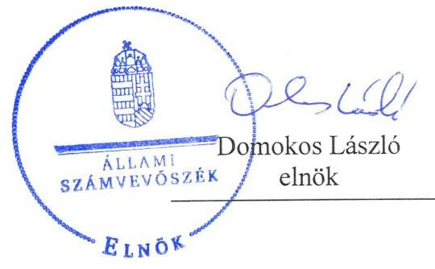
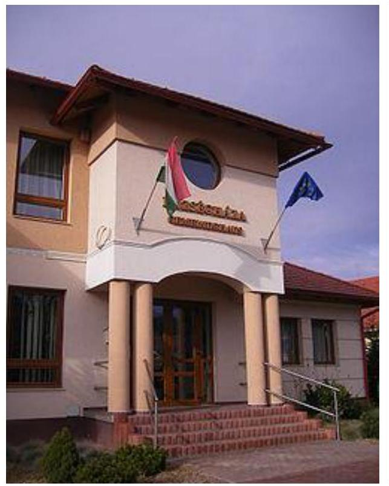

ÁLLAMI
SZÁMVEVŐSZÉK

# Jelentés 

## Önkormányzatok ellenőrzése

Integritás- és belső kontrollrendszer, Befektetési tevékenységek ellenőrzése - Baj Község Önkormányzata 2019.

---

# Jelenetés 

## Önkormányzatok ellenőrzése

Integritás- és belső kontrollrendszer, Befektetési tevékenységek ellenőrzése - Baj Község Önkormányzata 2019. 06 hó 25 nap

---

# AZ ELLENŐRZÉST FELÜGYELTE:

- VARGA EDIT felügyeleti vezető
- AZ ELLENŐRZÉST VEZETTE ÉS A VÉGREHAJTÁSÁÉRT FELELŐS:
  - TERLECZKYNÉ DR EISELE EDIT ellenőrzésvezető
- A PROGRAM ÖSSZEÁLLÍTÁSÁÉRT FELELŐS:
  - TÓTPÁL SZABOLCS osztályvezető

**IKTATÓSZÁM:** EL-0827-064/2019.

**TÉMASZÁM:** 2485

**ELLENŐRZÉS-AZONOSÍTÓ SZÁM:** V082902; V0829101

Jelentéseink az Országgyűlés számítógépes hálózatán és az Interneta a www.asz.hu címen is olvashatóak.

---

# TARTALOMJEGYZÉK 

■ ÖSSZEGZÉS ..... 5
■ AZ ELLENŐRZÉS CÉLJA ..... 6
■ AZ ELLENŐRZÉS TERÜLETE ..... 7
■ AZ ELLENŐRZÉS HÁTTERE, INDOKOLTSÁGA ..... 8
■ A JELENTÉS LÉNYEGES KÉRDÉSKÖREI ..... 10
■ AZ ELLENŐRZÉS HATÓKÖRE ÉS MÓDSZEREI ..... 11
■ MEGÁLLAPÍTÁSOK ..... 13
■ JAVASLATOK ..... 16
■ MELLÉKLETEK ..... 19
I. sz. melléklet: Értelmező szótár ..... 19
■ FÜGGELÉKEK ..... 21
I. sz. függelék a Jelentéshez ..... 21
II. sz. függelék: Észrevételek ..... 23
■ RÖVIDÍTÉSEK JEGYZÉKE ..... 25

---

.

---

# ÖSSZEGZÉS 

Baj Község Önkormányzata belső kontrollrendszerének kialakítása és müködtetése nem volt szabályszerű, így nem volt biztositott a közpénzekkel, a nemzeti vagyonnal való átlátható és felelős gazdálkodás, a befektetési tevékenység szabályszerű végzése. A kiépített integritás kontrollok nem képesek a szervezeti kockázatokat kezelni.

## Az ellenőrzés társadalmi indokoltsága

Az Állami Számvevőszék alapvető feladata a közpénzekkel, az állami és az önkormányzati vagyonnal való gazdálkodás ellenőrzése. Az Alaptörvény szerint az önkormányzatok kötelezettsége a kiegyensúlyozott, átlátható és fenntartható költségvetési gazdálkodás elvének érvényesítése, a nemzeti vagyonnal való rendeltetésszerű és felelős módon való gazdálkodás biztosítása. Az Állami Számvevőszék stratégiájában megfogalmazott célkitűzése az integritás alapú, átlátható és elszámoltatható közpénzfelhasználás elősegítése. Ennek megvalósítása érdekében az Állami Számvevőszék prioritásként kezeli a közpénzzel gazdálkodó szervezetek esetében a belső kontrollrendszer múködésének ellenőrzését.

Baj Község Önkormányzatnál az Állami Számvevőszék korábban nem végzett ellenőrzést.

## Főbb megállapítások, következtetések

Baj Község Önkormányzata belső kontrollrendszerének kialakítása és múködtetése nem volt szabályszerű, a kiépített kontrollrendszer nem biztosította a befektetési tevékenység szabályszerű végzését sem a 2013-2017 években.

Baj Község Önkormányzatánál a kontrollkörnyezet kialakítása nem volt szabályszerű, a vagyonnyilatkozat-tételi kötelezettséget a Hivatal szervezeti és múködési szabályzatában nem tüntették fel. A jegyző az integrált kockázatkezelési rendszert nem múködtette, mert nem végezte el a kockázatok értékelését és nem határozta meg a kockázatok kezeléséhez szükséges intézkedéseket. A kontrolltevékenységeket nem szabályszerűen gyakorolták, mivel bizonylat nélkül számoltak el kiadásokat. Az információs és kommunikációs rendszer múködtetése nem volt szabályszerű, a jegyző nem határozta meg a beszámolási rendszer múködtetéséhez a beszámolási szinteket, határidőket, valamint a beszámolás módját. A monitoring rendszer kialakítása és múködtetése, valamint a belső ellenőrzési tevékenység ellátása szabályszerű volt.

A befektetésekre vonatkozó döntéseket nem az arra jogosult Képviselő-testület hozta meg, a befektetésekről részletező nyilvántartást nem vezettek.

A jogszabályok által előírt integritás kontrollok kiépítésre során a szervezet kockázatait nem mérték fel, így a kontrollok kialakítása nem a kockázatoknak megfelelően történt. A jegyző a szervezeti teljesítmény mérés feltételeit nem alakította ki.

---

# AZ ELLENŐRZÉS CÉLJA 

AZ ELLENŐRZÉS CÉLJA annak megállapítása volt, hogy az önkormányzat belső kontrollrendszere biz-tosította-e a közpénzekkel és a nemzeti vagyonnal történő elszámoltatható, átlátható, szabályszerű, gazdaságos, hatékony és eredményes gazdálkodás feltét-eleit. Az ellenőrzés keretében az Állami Számvevőszék értékelte továbbá, hogy az önkormányzatnál kiépítették és erősítet-ték-e a korrupciós kockázatok kezelését szolgáló integritás kontrollokat és azt, hogy megteremtették-e a teljesítményellenőrzés feltételeit.

Az ellenőrzés további célja annak értékelése volt, hogy a jogszabályi előírásoknak megfelelően alakították-e ki a belső kontrollrendszert, a kontrollkörnyezet biztosította-e a befektetési tevékenységek szabályszerű végzését. Az Állami Számvevőszék értékelte továbbá, hogy az egyes befektetési tevékenységekkel kapcsolatos döntéshozatal és a döntések végrehajtása, valamint az egyes befektetések számviteli elszámolása, nyilvántartása szabályszerű volt-e, és a belső és külső ellenőrzések támogatták-e az egyes befektetési tevékenységek szabályszerű végzését.

---

# AZ ELLENŐRZÉS TERÜLETE 

## Baj Község Önkormányzata

BAJ község Komárom-Esztergom megyében fekszik, lakosainak száma a Központi Statisztikai Hivatal Magyarország közigazgatási helynévkönyve alapján 2017. január 1-én 2856 fő volt.

Az Önkormányzat ${ }^{1}$ hét fős képviselő-testületének munkáját négy állandó bizottság - a Kulturális- Oktatási- Sport- és Ifjúsági Bizottság, a Településfejlesztési és Környezetvédelmi Bizottság, a Pénzügyi Bizottság, valamint a Szociális és Egészségügyi Bizottság - segítette.

A gazdálkodási feladatokat a Hivatal ${ }^{2}$ látta el, amely szervezeti egységekre nem tagolódott, elkülönített gazdasági szervezettel nem rendelkezett. Az Önkormányzat a Hivatalon kívül egy intézményt tartott fenn. Az ellenőrzött időszakban a polgármester ${ }^{3}$ személye nem változott, a jegyző ${ }^{4}$ személyében 2017. október 1-vel történt változás.

Az Önkormányzat 2017. évben 298000 Ft tartós részesedéssel rendelkezett a Forrás Vagyonkezelési és Befektetési Rtben, amely vagyonkezelési tevékenységet folytat. A 2017. évi beszámoló mérlegében 150000000 Ft forgatási célú értékpapírt (kincstárjegyet) mutattak ki, amelyek beszerzése 2017. év során történt.

---

# AZ ELLENŐRZÉS HÁTTERE, INDOKOLTSÁGA 

Az ÁSZ ${ }^{5}$ az ÁSZ törvényben ${ }^{6}$ kapott felhatalmazással élve ellenőrzi az önkormányzatok gazdálkodását, múködését, hogy az ellenőrzések megállapításaival támogassa az ellenőrzött önkormányzatok szabályszerű gazdálkodását, javaslataival elősegítse az Alaptörvényben megfogalmazott alapvetések érvényesülését a mindennapi életben az önkormányzatok szintjén. Az önkormányzati rendszerben zajló folyamatok holisztikus elemzései, a kockázatok folyamatos figyelemmel kísérésének módszerével, az így kiválasztott önkormányzatok célzott, hatékony ellenőrzéseivel az ÁSZ betölti a legfőbb gazdasági ellenőrző szerv küldetését. Az egyes ellenőrzések megállapításaival és egy időszak ellenőrzési eredményeinek elemzésével az ÁSZ ráirányíthatja a jogalkotók figyelmét az önkormányzati alrendszerben esetlegesen felmerülő pénzügyi, szabályozási feszültségekre. Az elvégzett nagyszámú ellenőrzés során az ÁSZ „jó gyakorlatokat" is azonosíthat, melyeket tanácsadó funkciója keretében szélesebb körben is megismertethet az érintettekkel, ezáltal is hozzájárulva az önkormányzati alrendszer szabályozott, átlátható, kiegyensúlyozott és fenntartható múködéséhez.

A belső kontrollrendszer kialakítása és múködtetése nélkül nem valósítható meg a közpénzek, a közvagyon átlátható, szabályos, gazdaságos, hatékony és eredményes felhasználása. A belső kontrollrendszer azt a célt szolgálja, hogy a költségvetési szervek múködésük és gazdálkodásuk során a tevékenységeket szabályszerűen hajtsák végre, teljesítsék elszámolási kötelezettségeiket és megvédjék az erőforrásokat a veszteségektől, a károktól és a nem rendeltetésszerű használattól. A belső kontrollrendszer magában foglalja mindazon elveket, eljárásokat és belső szabályzatokat, melyek biztosítják, hogy a költségvetési szerv valamennyi tevékenysége és célja összhangban legyen a szabályszerűséggel, szabályozottsággal, valamint a gazdaságosság, hatékonyság és eredményesség követelményeivel, az eszközökkel és forrásokkal való gazdálkodásban ne kerüljön sor pazarlásra, visszaélésre, rendeltetésellenes felhasználásra. Megfelelő, pontos és naprakész információk álljanak rendelkezésre a költségvetési szerv múködésével kapcsolatosan, és a belső kontrollrendszer harmonizációjára, öszszehangolására vonatkozó jogszabályok végrehajtásra kerüljenek. Az integritás kontrollok kiépítése, erősítése a szervezet korrupciós kockázatainak kezelését szolgálja. A teljesítménykövetelmények meghatározása és múködtetése megalapozhatja az önkormányzatoknál a teljesítményellenőrzés lefolytatását.

Az önkormányzati vagyongazdálkodás keretében az önkormányzatok átmenetileg szabad pénzeszközeinek befektetését jogszabály nem tiltja, a befektetések jellege nem korlátozott, a pénzpiaci szolgáltatók közül az önkormányzatok a kínált szolgáltatás és annak költségei alapján, szabadon választhatnak, azonban a veszteséges gazdálkodás kockázatai és következményei az önkormányzatokat terhelik. A szabad pénzeszközök felhasználása során kiemelten fontos a felelős gazdálkodás érvényesülése, amely összhangban kell, hogy legyen, az önkormányzati gazdálkodás alapelveivel. Az ellenőrzéssel feltárásra kerülhetnek azok a kockázatok, amelyek az önkormányzatok gazdálkodásával, ezen belül befektetési tevékenységeivel,

---

kontrollkörnyezetével kapcsolatosak és a befektetési tevékenységek szabályszerű végrehajtását befolyásolják. Az ellenőrzéssel az önkormányzatok befektetési/vagyongazdálkodási döntései értékelhetővé válnak, és megalapozott megállapítás tehető arra vonatkozóan, hogy milyen hatást gyakoroltak az önkormányzat vagyonára a képviselő-testület döntései.

---

# A JELENTÉS LÉNYEGES KÉRDÉSKÖREI 

1. Az Önkormányzat belső kontrollrendszerének kialakítása és müködtetése szabályszerű volt-e a 2017. évben?
2.     - A befektetési tevékenységek szabályszerű végzését a kiépített kontrollrendszer biztositotta-e a 2013-2017. években, a befektetésekkel kapcsolatos döntéshozatal és a döntések végrehajtása, a befektetések számviteli elszámolása, nyilvántartása szabályszerű volt-e?
3.     - Az Önkormányzatnál alakítottak-e ki a szervezeti teljesítmény mérésére alkalmas követelményeket?

---

# AZ ELLENŐRZÉS HATÓKÖRE ÉS MÓDSZEREI 

## Az ellenőrzés típusa

Megfelelőségi ellenőrzés

## Az ellenőrzött időszak

Az integritás és belső kontrollrendszer ellenőrzött időszaka a 2017. év, illetve az éves költségvetési beszámoló Áht. ${ }^{7}$ által megállapított jóváhagyásáig, 2018. május 31-éig tartó időszak volt.

Az egyes befektetési tevékenységek ellenőrzése tekintetében az ellenőrzött időszak 2013. január 1. - 2017. december 31. közötti időszak, továbbá a 2013. január 1. előtti időszak is, amennyiben a 2017. december 31-én meg-lévő befektetésekkel kapcsolatos döntéshozatalra a 2013. január 1. előtti időszakban került sor.

## Az ellenőrzés tárgya

Az önkormányzat és a gazdálkodási feladatokat ellátó hivatala belső kontrollrendszerének kialakítása és múködtetése, az integritás kontrollok kiépítettsége, a teljesítményellenőrzés feltételei.

Az egyes befektetési tevékenységek esetében az önkormányzat 2017. december 31-én meglévő, a Számv. tv8. 3. § (6) bekezdés 2. és 3. pontja szerint az értékpapírokban megtestesülő befektetései, lekötött betétei. A 2017. december 31-én meglévő, az önkormányzat szabad pénzeszközei terhére, adásvételi szerződés keretében megszerzett, a kötelező feladatok ellátását nem szolgáló, az önkormányzat üzleti vagyonába tartozó, az ellenőrzött időszakban megszerzett ingatlanok. Az üzleti vagyon körébe tartozó, befektetési céllal megszerzett, de még használatba nem vett ingatlan beruházások, továbbá az - időkorlátozás nélkül megszerzett - kulturális javak (műtárgyak, műalkotások, stb.), illetve egyéb értéktárgyak (pl. ékszerek, befektetési nemesfém).

## Az ellenőrzött szervezet

Baj Község Önkormányzata

## Az ellenőrzés jogalapja

Az ellenőrzés jogszabályi alapját az ÁSZ tv. 1. § (3) bekezdés, 5. § (2) és (6) bekezdései, valamint az Áht. 61. § (2) bekezdésének előírásai képezik.

---

# Az ellenőrzés módszerei 

Az ÁSZ az ellenőrzést az ellenőrzési program szempontjai, az ellenőrzött időszakban hatályos jogszabályok, az ellenőrzés szakmai szabályai, a jelen ellenőrzésre irányadó ÁSZ módszertanok figyelembevételével hajtotta végre.

Az ellenőrzési kérdések megválaszolásához szükséges bizonyítékok megszerzése az ellenőrzött által rendelkezésre bocsátott dokumentumokra, adatokra alapozva megfigyelés, mintavételezés, valamint elemző eljárás útján történt. Az ellenőrzési bizonyítékként felhasználható adatforrások közé tartoztak az ellenőrzési program részletes szempontjainál felsorolt adatforrások, valamint minden egyéb - az ellenőrzés folyamán feltárt, az ellenőrzés szempontjából információt tartalmazó - dokumentum. Az ellenőrzés lefolytatásához az ellenőrzött szervezet tanúsítványok kitöltésével, valamint az ÁSZ által kért dokumentumok megküldésével szolgáltatott adatokat, amelyek valódiságát és teljes körűségét az ellenőrzött szervezet vezetője által tett teljességi és hitelességi nyilatkozat igazolta. A rendelkezésre bocsátott adatok, információk kontrollja az ellenőrzés keretében történt.

Az önkormányzat belső kontrollrendszere egyes pilléreinek kialakítására és működtetésére vonatkozó értékelés:
$\longrightarrow$ „szabályszerü", amennyiben az értékelt területen az elért „igen" válaszok százalékban kifejezett, egész számra kerekített aránya legalább $85 \%$,
$\longrightarrow$ „nem szabályszerű", ha nem éri el a $85 \%$-ot.
Az önkormányzat belső kontrollrendszerének összesített értékelése az egyes részterületek esetében kapott megfelelőségi arányok számtani átlaga alapján történt és megegyezik a pillérenként (kontrollterületenként) alkalmazott százalékos értékelésekkel, a következő eltérésekkel: a kontrollrendszer egésze esetében a „szabályszerű" értékelésnek a százalékos értéken felül további feltétele volt, hogy egyik kontrollterület sem kaphatott „nem szabályszerű" értékelést.

A 2017. évi kiadások teljesítéséhez kapcsolódó pénzgazdálkodási belső kontrollok működésének szabályszerűsége esetében az ellenőrzés azokra a legnagyobb értékű tételekre - a lényeges sokaságra - terjedt ki, melyek összértéke eléri a teljes sokaság összértékének 50\%-át. A 2017. évi kiadások esetében a lényeges sokaságot tételesen ellenőrizte az ÁSZ.

Az önkormányzatok befektetési tevékenységét a szerződéskötés (és a kapcsolódó döntés-előkészítés, döntéshozatal) kivételével a 2013. január 1. és 2017. december 31. közötti időszak vonatkozásában értékelte az ÁSZ. A szerződéskötést az önkormányzat 2017. december 31-én meglévő értékpapírjai és egyéb befektetései vonatkozásában kellett értékelni a befektetési döntés előkészítése és döntéshozatala tekintetében, abban az esetben is, ha az 2013. január 1. előtt történt. Amennyiben a szerződéskötés, illetve a döntések előkészítése a 2013. évet megelőzően történt, akkor értelemszerűen a mindenkor hatályos jogszabályok előírásai alapján kellett az értékelést elvégezni.

Az ellenőrzés ideje alatt az ellenőrzött szervezettel történő kapcsolattartást az ÁSZ SZMSZ ${ }^{\text {® }}$-ének vonatkozó előírásai alapján biztosítottuk.

---

# 1. Az Önkormányzat belső kontrollrendszerének kialakítása és múködtetése szabályszerű volt-e a 2017. évben? 

Összegző megállapítás

Az Önkormányzat belső kontrollrendszerének kialakítása és múködtetése a 2017. évben nem volt szabályszerű.

A KONTROLLKÖRNYEZET kialakítása a 2017. évben nem volt szabályszerű. Az Önkormányzat nem tett eleget a Vnytv. ${ }^{10} 4$. § a) pontjában foglaltaknak, mert a jegyző́1,2 a Hivatal SZMSZ1,2,3 ${ }^{11}$-ében nem tüntette fel a vagyonnyilatkozat tételi kötelezettséggel járó munkaköröket.

A Képviselő-testület ${ }^{12}$ a Htv. ${ }^{13}$ előírásait betartva megalkotta az önkormányzati vagyonnal való gazdálkodásról a vagyonrendeletet ${ }^{14}$. Az Önkormányzat SZMSZ2 ${ }^{15}$-ében és a Hivatal SZMSZ1,2,3-ében meghatározásra kerültek a múködés szervezeti keretei a Mötv. ${ }^{16}$-nek és az Áht.-nak megfelelően. Az Önkormányzat rendelkezett az Áht.-ben és Ávr. ${ }^{17}$-ben foglaltak szerint a gazdálkodás részletes rendjét meghatározó szabályozással. A Számv.tv. és az Áhsz ${ }^{18}$ előírásait betartva az Önkormányzat rendelkezett számviteli politikával, és az annak keretében elkészítendő szabályzatokkal. A jegyző́1 az Info.tv. ${ }^{19}$ előírásai szerinti adatvédelmi és adatbiztonsági szabályzatot, valamint a Ltv. ${ }^{20}$-ben előírt iratkezelési szabályzatot megalkotta.

## AZ INTEGRÁLT KOCKÁZATKEZELÉSI RENDSZERT a jegyző́1 nem alakította ki, mert nem szabályozta az integrált kockázatkezelés eljárásrendjét a Bkr. 6. § (4) bekezdése ellenére, továbbá a jegyző́1,2 nem mérte fel a Bkr. 7. § (2) bekezdés előírása szerint az Önkormányzat tevékenységében rejlő és szervezeti célokkal összefüggő kockázatokat, nem határozta meg az egyes kockázatokkal kapcsolatban szükséges intézkedéseket, valamint azok teljesítésének nyomon követési módját. 2017. november 1-től a jegyző́z az integrált kockázatkezelés eljárásrendjét kialakította.

A KONTROLLTEVÉKENYSÉGEK GYAKORLÁSA a 2017. évben nem volt szabályszerű. Az Ávr. 60. § (3) bekezdésében foglaltak ellenére a jegyző́1,2 nem vezetett nyilvántartást a teljesítés igazolásra jogosultakról és aláírás-mintájukról. A Számv.tv. 165. § (1)-(2) bekezdései előírása ellenére, a gazdasági eseményt alátámasztó bizonylat nélkül számoltak el kiadásokat.

## AZ INFORMÁCIÓS ÉS KOMMUNIKÁCIÓS RENDSZER kialakítása szabályszerű volt. A jegyző́ az Info tv. előírásainak megfelelően a közérdekú adatok megismerésére irányuló igények teljesítésének rendjét ${ }^{21}$ 2017. január 5-től szabályzatban meghatározta. A rendszer múködtetése nem volt szabályszerű, mert a jegyző́1,2 a Bkr. 9. § (2) bekez-

---

désében foglaltak ellenére nem határozta meg a beszámolási rendszer múködtetéséhez a beszámolási szinteket, határidőket, valamint a beszámolás módját.

Az államháztartás információs rendszerébe az Áhsz2,-ben előírt adatszolgáltatási kötelezettségnek eleget tettek.

A MONITORING RENDSZER kialakítása és múködtetése szabályszerű volt. A belső ellenőrzési feladatok ellátása társulási megállapodás keretében a Bkr.-ben foglaltaknak megfelelően történt. A Hivatal SZMSZ-ében rögzítették a belső ellenőr feladatait. A Képviselő-testület elfogadta az éves ellenőrzési tervet. A külső és belső ellenőrzésekről a Bkrben előírt nyilvántartást vezették.

A Hivatal belső kontrollrendszerének minőségét a jegyző1, 2017. szeptember 30-ig, a jegyző2 a 2017. október 1- 2017 december 31-ig eltelt időszak vonatkozásában a Bkr. 1. melléklet szerinti nyilatkozatban értékelte.

AZ INTEGRITÁS kontrollok kiépítettségének szintje nem támogatta az Önkormányzat integritás elvű múködését. A jegyző1,2 a jogszabályok által kötelezően előírt integritás kontrollok kiépítése során nem vette figyelembe a szervezet múködésében rejlő kockázatokat, ezért azok nem a kockázatokkal arányosan kerültek kialakításra.

# 2. A befektetési tevékenységek szabályszerű végzését a kiépített kontrollrendszer biztosította-e a 2013-2017. években, a befektetésekkel kapcsolatos döntéshozatal és a döntések végrehajtása, a befektetések számviteli elszámolása, nyilvántartása szabályszerű volt-e? 

Összegző megállapítás

A befektetési tevékenységek szabályszerű végzését a kiépített kontrollrendszer a 2013-2017. években nem biztosította. A befektetésekkel kapcsolatos döntéshozatal és az egyes befektetések számviteli elszámolása, nyilvántartása nem volt szabályszerű.

A KONTROLLKÖRNYEZET a befektetések szabályszerű végzését támogatta. Az Önkormányzat SZMSZ1,2-ében és a Hivatal SZMSZ1,2,3ében a szervezeti kereteket kialakították, a befektetésekkel kapcsolatos jogköröket a Képviselő-testület saját hatáskörében megtartotta. A Számv.tv. és az Áhsz1,2 szabályai szerint rendelkezett az Önkormányzat és a Hivatal számviteli politikával és az annak keretében elkészítendő szabályzatokkal, amelyek a befektetések szabályszerű elszámolását támogatták.

A KOCKÁZATKEZELÉSI RENDSZER eljárásrendjét 2016. szeptember 30-ig, 2016 október 1-től az integrált kockázatkezelési rendszer eljárásrendjét a jegyző1 nem alakította ki. A Bkr. 8. § (2) bekezdés b) pontjában foglaltakat nem tartotta be a jegyző1,2, mert a befektetési döntések gazdaságossági, hatékonysági és eredményességi megalapozottsága érdekében nem építettek ki kontrollokat. A kockázatkezelési rendszert és

---

az integrált kockázatkezelési rendszert nem működtette a jegyző ${ }_{1,2}$, mert nem mérte fel a befektetésekkel összefüggő kockázatokat a Bkr. 7. § (2) bekezdése ellenére. Integrált kockázatkezelési rendszer eljárásrendjével 2017. november 1-től rendelkeztek.

A BEFEKTETÉSEKRŐL SZÓLÓ DÖNTÉSEKET a Kép-viselő-testület helyett a polgármester hozta meg megsértve ezzel a Mötv. 107. § -ában leírtakat. A Képviselő testület sem az SZMSZ ${ }_{1,2,3}$-ben sem egyéb rendeletben nem rendelkezett a befektetésekkel kapcsolatos döntési jogköre átruházásáról. A döntéseket nem előzte meg kockázatelemzés a Bkr 7. § (2) bekezdése és a 8. § (1) bekezdése ellenére.

A SZÁMVITELI ELSZÁMOLÁS nem volt szabályszerű. A jegyző ${ }_{1,2}$ a forgóeszközök között nyilvántartott értékpapírok esetében nem gondoskodott 2013. évben az Áhsz ${ }_{1}{ }^{22} 49$. § (1) bekezdésében hivatkozott 9. sz. melléklet (2) bekezdés d pontjában, a 2014- 2017. években az Áhsz ${ }_{2}$ 45. § (3) bekezdésében hivatkozott 14. számú melléklet VIII.1. rész a)-j) pontjaiban foglaltaknak megfelelő részletező nyilvántartás vezetéséről. A jegyző ${ }_{1,2}$ a tartós részesedésről 2013. évben az Áhsz ${ }_{1}$ 9. sz. melléklet (1) bekezdés h) pontjában, 2014-2017. években a 14. számú melléklet VIII.2. rész a)-i) pontjai szerinti analitikus nyilvántartást nem vezetett.

# 3. Az Önkormányzatnál alakítottak-e ki a szervezeti teljesítmény mérésére alkalmas követelményeket? 

## Összegző megállapítás

Az Önkormányzatnál a szervezeti teljesítmény mérésére alkalmas követelményeket nem alakítottak ki.

A szervezeti célok elérését szolgáló feladatok, folyamatok, tevékenységek mérését szolgáló indikátorokat, mérőszámokat, feladat- és teljesítménymutatókat a jegyző ${ }_{1,2}$ nem alakított ki, ezért az Önkormányzatnál a teljesítmény mérésének lehetősége nem volt biztosított.

---

# JAVASLATOK 

Az ÁSZ tv. 33. § (1) bekezdésében foglaltak értelmében az ellenőrzött szervezet vezetője köteles a jelentésben foglalt megállapításokhoz kapcsolódó intézkedési tervet összeállítani és azt a jelentés kézhezvételétől számított 30 napon belül az ÁSZ részére megküldeni. Amennyiben az ellenőrzött szervezet vezetője nem küldi meg határidőben az intézkedési tervet, vagy továbbra sem elfogadható intézkedési tervet küld, az Állami Számvevőszék elnöke az ÁSZ tv. 33. § (3) bekezdése a) és b) pontjaiban foglaltakat érvényesítheti.

## Baji Polgármesteri Hivatal Jegyzőjének

1. A szabályszerű kontrollkörnyezet kialakítása érdekében gondoskodjon a Hivatal Szervezeti és Müködési Szabályzatában a vagyonnyilatkozat tételi kötelezettséggel járó munkakörök feltüntetéséről.
(1. sz. megállapítás 1. bekezdés 2. mondata alapján)
2. A szabályszerű integrált kockázatkezelési rendszer kialakítása és müködtetése érdekében gondoskodjon:
a) az integrált kockázatkezelés eljárásrendjének szabályozásáról;
(1. sz. megállapítás 3. bekezdés 1. mondat 2. tagmondata alapján)
b) a szervezet tevékenységében rejlő és szervezeti célokkal összefüggő kockázatok felméréséről és az egyes kockázatokkal kapcsolatban szükséges intézkedések, valamint azok teljesítésének nyomon követési módjának megállapításáról.
(1. sz. megállapítás 3. bekezdés 1. mondat 3-5. tagmondatai és a 2. sz. megállapítás 2. bekezdés 3. mondata alapján)
3. A kontrolltevékenységek szabályszerű gyakorlása érdekében:
a) gondoskodjon nyilvántartás vezetéséről a teljesítés igazolásra jogosult személyekről és aláírás-mintájukról;
(1. sz. megállapítás 4. bekezdés 2. mondata alapján)
b) intézkedjen a számviteli nyilvántartások szabályszerű vezetéséről.
(1. sz. megállapítás 4. bekezdés 3. mondata alapján)
4. Az információs és kommunikációs rendszer szabályszerű müködtetése érdekében határozza meg a beszámolási rendszer szabályszerű müködtetésének kereteit.
(1. sz. megállapítás 5. bekezdés 3. mondata alapján)

---

5. Az Önkormányzat befektetési döntéseinek gazdaságossági, hatékonysági és eredményességi megalapozottsága vonatkozásában gondoskodjon a szervezeti célok elérését veszélyeztető kockázatok csökkentésére irányuló kontrollok kiépítéséről.
(2. sz. megállapítás 2. bekezdés 2. mondata alapján)
6. Az Önkormányzat befektetéseinek szabályszerű számviteli elszámolása érdekében gondoskodjon a forgóeszközök között nyilvántartott értékpapírokkal és a tartós részesedésekkel kapcsolatos részletező nyilvántartások vezetéséről.
(2. sz. megállapítás 4. bekezdése alapján)

# Baj Község Önkormányzata Polgármesterének 

1. Gondoskodjon a Hivatal jogszabályi előírások szerint kialakított Szervezeti és Müködési Szabályzatának a Képviselő-testület elé terjesztéséről.
(1. sz. megállapítás 1. bekezdése alapján)
2. A befektetési tevékenységekhez kapcsolódó szabályszerű döntéshozatal biztosítása érdekében gondoskodjon a tulajdonost megilletető jogok szabályszerű gyakorlásáról.
(2. sz. megállapítás 3. bekezdés 1. mondta alapján)

---

.

---

# MELLÉKLETEK 

- I. SZ. MELLÉKLET: ÉRTELMEZŐ SZÓTÁR
belső ellenőrzés
belső kontrollrendszer
belső kontrollrendszer területei
információs és kommunikációs rendszer
integrált kockázatkezelési rendszer
integritás
kockázat
kontrollkörnyezet
kontrolltevékenységek
kommunikáció

Független, tárgyilagos bizonyosságot adó és tanácsadó tevékenység, amelynek célja, hogy az ellenőrzött szervezet működését fejlessze és eredményességét növelje, az ellenőrzött szervezet céljai elérése érdekében rendszerszemléletű megközelítéssel és módszeresen értékeli, illetve fejleszti az ellenőrzött szervezet irányítási és belső kontrollrendszerének hatékonyságát. (Forrás: Bkr. 2. § b) pontja)
A belső kontrollrendszer a kockázatok kezelése és tárgyilagos bizonyosság megszerzése érdekében kialakított folyamatrendszer, amely azt a célt szolgálja, hogy a müködés és gazdálkodás során a tevékenységeket szabályszerűen, gazdaságosan, hatékonyan, eredményesen hajtsák végre, az elszámolási kötelezettségeket teljesítsék, megvédjék az erőforrásokat a veszteségektől, károktól és nem rendeltetésszerű használattól. (Forrás: Áht. 69. § (1) bekezdése)
A kontrollkörnyezet, az integrált kockázatkezelési rendszer, a kontrolltevékenységek, az információs és kommunikációs rendszer, valamint a nyomon követési (monitoring) rendszer. (Forrás: Bkr. 3. §-a)
A költségvetési szerv vezetője által kialakított és müködtetett olyan rendszer, mely biztosítja, hogy a megfelelő információk a megfelelő időben eljutnak az illetékes szervezethez, szervezeti egységhez, illetve személyhez. (Forrás: Bkr. 9. § (1) bekezdés)
Olyan folyamatalapú kockázatkezelési rendszer, amely a szervezet minden tevékenységére kiterjed, egységes módszertan és eljárások alkalmazásával, a szervezet célkitűzéseinek és értékeinek figyelembevételével biztosítja a szervezet kockázatainak teljes körű azonosítását, azok meghatározott kritériumok szerinti értékelését, valamint a kockázatok kezelésére vonatkozó intézkedési terv elkészítését és az abban foglaltak nyomon követését. (Forrás: Bkr. 2. § m) pontja, 2016. október 1-jétől)
Az integritás az elvek, értékek, cselekvések, módszerek, intézkedések konzisztenciáját jelenti, vagyis olyan magatartásmódot, amely meghatározott értékeknek megfelel. (Forrás: Nemzetgazdasági Minisztérium: Magyarországi államháztartási belső kontroll standardok Útmutató 1.6.1. pontja, 2012. december)
A kockázat annak a valószínűségét jelenti, hogy egy vagy több esemény vagy intézkedés nem kívánt módon befolyásolja a rendszer müködését, céljainak megvalósulását. (Forrás: Javaslatok a korrupciós kockázatok kezelésére - Kockázatkezelési és ellenőrzési módszertan 35. oldal, ÁSZ)
A költségvetési szerv vezetője által kialakított olyan elvek, eljárások, belső szabályzatok összessége, amelyben világos a szervezeti struktúra, a folyamatok átláthatók, egyértelműek a felelősségi, hatásköri viszonyok és feladatok, meghatározottak, ismertek és elfogadottak az etikai elvárások a szervezet minden szintjén, átlátható a humán-erőforrás-kezelés, biztosított a szervezeti célok és értékek irányában való elkötelezettség fejlesztése és elősegítése. (Forrás: Bkr. 6. § (1) bekezdés)
A költségvetési szerv vezetője által a szervezeten belül kialakított (kontroll) tevékenységek, melyek biztosítják a kockázatok kezelését, hozzájárulnak a szervezet céljainak eléréséhez és erősítik a szervezet integritását. (Forrás: Bkr. 8. § (1) bekezdés)
Az a tevékenység, melynek során információ továbbítása valósul meg. A kommunikációs folyamat résztvevői között tájékoztatás történik, mely során tényeket, ezek magyarázatát közlik.

---

monitoring

A monitoring általánosságban a különböző szintű szervezeti célok megvalósításának folyamatát kíséri figyelemmel, melynek során a releváns eseményekről és tevékenységekről (együtt: folyamatokról) rendszeres jelleggel, strukturált, döntéstámogató információkhoz jutnak a szervezet vezetői. (Forrás: NGM Útmutató a költségvetési szervek monitoring rendszeréhez 2011. november)
monitoring-rendszer

A költségvetési szerv vezetője köteles kialakítani a szervezet tevékenységének a célok megvalósításának nyomon követését biztosító rendszert, amely az operatív tevékenységek keretében megvalósuló folyamatos és eseti nyomon követésből, valamint az operatív tevékenységektől függetlenül múködő belső ellenőrzésből állhat. (Forrás: Bkr. 10. §)
önkormányzati hivatal

A polgármesteri hivatal, a főpolgármesteri hivatal, a megyei önkormányzati hivatal és a közös önkormányzati hivatal. (Forrás: Áht. 1. § 18. pont)
társulás

A helyi önkormányzatok képviselő-testületei megállapodhatnak abban, hogy egy vagy több önkormányzati feladat- és hatáskör, valamint a polgármester és a jegyző államigazgatási feladat- és hatáskörének hatékonyabb, célszerűbb ellátására jogi személyiséggel rendelkező társulást hoznak létre. (Forrás: Mötv. 87. §)

---

# FÜGGELÉKEK 

- I. SZ. FÜGGELÉK A JELENTÉSHEZ

Az Állami Számvevőszék az ellenőrzések során feltárt tényekhez kapcsolódó további körülmények tisztázására eszközrendszerrel nem rendelkezik. Amennyiben az ellenőrzésen túlmutatóan indokoltnak látszik az ellenőrzés során feltárt körülmények további vizsgálata, az Állami Számvevőszék törvényi felhatalmazás alapján az ellenőrzés által feltárt körülményeket továbbítja a hatáskörrel rendelkező szervnek a szükséges intézkedések megtétele, eljárások lefolytatása érdekében.
I.

1. Baj Község Önkormányzatnál ,,egyéb dologi kiadás teljesítéseként" elszámolásra került a 2017. év végén a foglalkoztatottaknak adott előlegek fókönyvi számlán kimutatott, analitikával alá nem támasztott 5826844 Ft összegü egyenleg. Az ellenőrzés feltárta, hogy a számvitelről szóló 2000. évi C. törvény (továbbiakban Számv.tv.) 165. § (1)-(2) bekezdései előirása ellenére, a gazdasági eseményt alátámasztó bizonylatok nélkül történt a költségek elszámolása.
2. Feltárásra került továbbá, hogy az Önkormányzatnál szabályos teljesítésigazolás nélkül kerültek számlák elszámolásra 16305002 Ft összegben.
Az 1. és 2. pontban rögzítettek miatt az Önkormányzatnál nem igazolt az 22131846 Ft összegü kiadás esetében a kifizetés jogossága, összegszerüsége, valamint, hogy az valós teljesitéshez kapcsolódott és az Önkormányzat érdekében és feladatellátásával összefüggésben merült fel. Felvetődik, hogy szabálytalan kifizetések történtek, amik vagyoni hátrányt okozhattak az Önkormányzatnak.
3. Az ellenőrzés feltárta, hogy Baj Község Önkormányzata pénzügyi eszközei terhére értékpapír vásárlásra vonatkozó döntéseket a 2013-2017. években a Képviselő-testület helyett a döntéshozatalra jogosultsággal nem rendelkező polgármester hozott. A Magyarország helyi önkormányzatairól szóló 2011. évi CLXXXIX. törvény (továbbiakban Mötv.) 107. §-ában foglaltak szerint a tulajdonost megillető jogok gyakorlásáról a Kép-viselő-testület rendelkezik. A Képviselő-testület nem rendelkezett a hatáskör átruházásáról.
Az Önkormányzat vagyonára vonatkozó jogkör nélküli döntéshozatal felveti annak lehetőségét, hogy ezen döntések következtében az Önkormányzatot vagyoni hátrány érte.
A I/1-3. pontban megjelölt esetek konkrét körülményeinek felderítésére az ügyészség rendelkezik hatáskörrel.

---

II.

Az I/1. pontban kifejtett szabálytalan költségelszámolás miatt a 2017. évi éves beszámolóban szereplő adatok tekintetében sérült a Számv.tv. 15. § (3) bekezdésében rögzített valódiság elve, ezért nem biztositott, hogy a beszámoló az Önkormányzat vagyoni és pénzügyi helyzetéről megbizható és valós képet mutat.
Az eset konkrét körülményeinek felderitésére a Magyar Államkincstár rendelkezik hatáskörrel.
III.

1. Az ellenőrzés feltárta, hogy Baj Község Önkormányzat Polgármesteri Hivatalánál (a továbbiakban: Hivatal) az egyes vagyonnyilatkozattételi kötelezettségekről szóló 2007. évi CLII. törvény (továbbiakban: Vnytv.) 4. § a.) pontjában foglaltak ellenére a Hivatal szervezeti és müködési szabályzatában a jegyző nem tüntette fel a vagyonnyilatkozat tételi kötelezettséget a Vnytv. 3. § (1) bekezdésében meghatározott közszolgálatban álló személyek esetében. Így nem teremtették meg a közélet tisztaságának, a korrupció megelőzésének biztositásához szükséges szabályozást.
2. Az I/3. pontban kifejtett, az Önkormányzat vagyonára vonatkozó jogkör nélküli döntéshozatal felveti annak lehetőségét, hogy az Önkormányzatnál a tulajdonosi jogok gyakorlása nem szabályszerüen történik.
A III/1-2. pontban megjelölt esetek konkrét körülményeinek felderitésére a kormányhivatal rendelkezik hatáskörrel.

---

A jelentéstervezetet a Számvevőszék 15 napos észrevételezésre megküldte az ellenőrzött szervezetek vezetőinek az ÁSZ tv. 29. §* (1) bekezdése előírásának megfelelően.

Az ÁSZ a jelentéstervezetet észrevételezésre megküldte Baj Község Önkormányzatának polgármestere részére.
Baj Község Önkormányzatának polgármestere az ÁSZ tv. 29. § (2) bekezdésében foglalt észrevételezési jogával nem élt, a jelentéstervezet megállapításaira a törvényes határidőn belül észrevételt nem tett.

[^0]
[^0]:    * 29. § (1) Az Állami Számvevőszék az ellenőrzési megállapításait megküldi az ellenőrzött szervezet vezetőjének vagy az általa megbízott személynek, és annak, akinek személyes felelősségét állapította meg.
    (2) Az ellenőrzött szervezet vezetője és a felelősként megjelölt személy az ellenőrzés megállapításaira tizenöt napon belül írásban észrevételt tehet.
    (3) Az Állami Számvevőszék az észrevételre a beérkezésétől számított harminc napon belül írásban válaszol. A figyelembe nem vett észrevételeket köteles a jelentésben feltüntetni, és megindokolni, hogy azokat miért nem fogadta el.

---

.

---

# RÖVIDÍTÉSEK JEGYZÉKE 

${ }^{1}$ Önkormányzat
${ }^{2}$ Hivatal
${ }^{3}$ polgármester
${ }^{4}$ jegyző
${ }^{5}$ ÁSZ
${ }^{6}$ ÁSZ törvény
${ }^{7}$ Áht.
${ }^{8}$ Számv.tv.
${ }^{9}$ ÁSZ SZMSZ
${ }^{10}$ Vnytv.
${ }^{11}$ Hivatal SZMSZ ${ }_{1,2,3}$

## ${ }^{12}$ Képviselő-testület

${ }^{13} \mathrm{Htv}$.
${ }^{14}$ vagyonrendelet
${ }^{15}$ Önkormányzat SZMSZ ${ }_{1,2}$

## ${ }^{16}$ Mötv.

${ }^{17}$ Ávr
${ }^{18}$ Áhszz
${ }^{19}$ Info.tv.
${ }^{20}$ Ltv
${ }^{21}$ közérdekú adatkérések szabályzata

Baj Község Önkormányzata
Baji Polgármesteri Hivatal
Baj Község Önkormányzata polgármestere
jegyző:: Baji Polgármesteri Hivatal jegyzője 2017.09.30-ig
jegyző:: Baji Polgármesteri Hivatal jegyzője 2017.10.01-től
Állami Számvevőszék
2011. évi LXVI törvény az Állami Számvevőszékről
2011. évi CXCV. törvény - az államháztartásról
2000. évi C. törvény a számvitelről

Az Állami Számvevőszék elnökének 4/2017. (XII.29.) ÁSZ utasítása az Állami Számvevőszék Szervezeti és Müködési Szabályzatáról
2007. évi CLII. törvény egyes vagyonnyilatkozat-tételi kötelezettségekről
Baj Község Önkormányzat Képviselő-testületének 118/2012. (X.30) számú határozatával jóváhagyott a Polgármesteri hivatal szervezeti és müködési szabályzata (hatályos: 2014.02.24-ig)
Baj Község Önkormányzat Képviselő-testületének 21/2014. (II.25.) számú határozatával jóváhagyott a Polgármesteri hivatal szervezeti és müködési szabályzata (hatályos: 2014.02.25 - 2017.06.26-ig)
Baj Község Önkormányzat Képviselő-testületének 90/2017. (VI. 27.) számú határozatával jóváhagyott a Polgármesteri hivatal szervezeti és müködési szabályzata (hatályos: 2017.06.27-től)
Baj Község Önkormányzata Képviselő-testülete
1991. évi XX. törvény a helyi önkormányzatok és szerveik, a köztársasági megbízottak, valamint egyes centrális alárendeltségú szervek feladat és hatásköreiről
14/2012. (IV. 26.) számú önkormányzati rendelet az Önkormányzat vagyonáról, a vagyonnal való rendelkezésről
Baj Község Önkormányzat Képviselő testületének 1/2011. (I.27.) számú önkormányzati rendelete Baj Község Önkormányzat szervezeti és müködési szabályzatáról (hatályos: 2014.10.21-ig)
Baj Község Önkormányzat Képviselő testületének 16/2014. (X. 22.) számú önkormányzati rendelete Baj Község Önkormányzat szervezeti és müködési szabályzatáról (hatályos: 2014.10.22-től)
2011. évi CLXXXIX. törvény Magyarország helyi önkormányzatairól 368/2011. (XII. 31.) Kormányrendelet az államháztartásról szóló törvény végrehajtásáról
4/2013. (I. 11.) Korm. rendelet az államháztartás számviteléről (hatályos: 2014.01.01-től)
2011. évi CXII. törvény az információs önrendelkezési jogról és az információszabadságról
1995. évi LXVI. törvény a közokiratokról, közlevéltárakról és a magánlevéltári anyag védelméről
Közérdekú adatkérések rendjét rögzítő szabályzat (hatályos: 2017.01.05-től)

---

${ }^{22}$ Áhsz: $\square$

249/2000. (XII. 24.) Korm. rendelet az államháztartás szervezetei beszámolási és könyvvezetési kötelezettségének sajátosságairól (hatályos: 2001.01.01-től 2014.12.31-ig)

---

ÁLLAMI SZÁMVEVŐSZÉK
1052 Budapest, Apáczai Csere János utca 10.
Levélcím: 1364 Budapest 4. Pf. 54
Telefon: +36 14849100 Telefax: +36 14849200
www.asz.hu