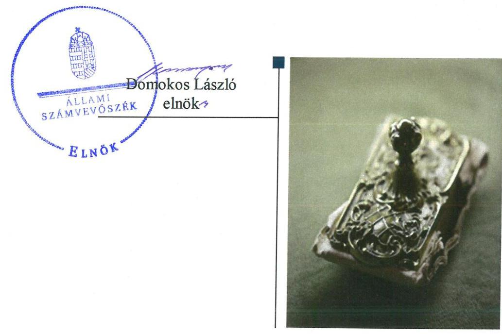
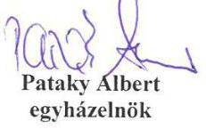
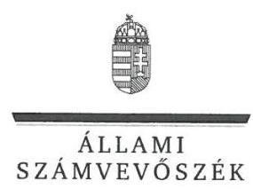
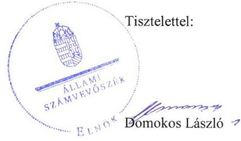
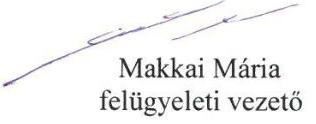

ÁLLAMI
SZÁMVEVŐSZÉK

# Jelentés 

## Nem állami humánszolgáltatók ellenőrzése

A humánszolgáltatást nyújtó államháztartáson kívüli köznevelési és szociális intézmények, szolgáltatók fenntartói központi költségvetésből kapott támogatásai felhasználásának ellenőrzése - Magyar Pünkösdi Egyház
2019.

---

# Jelentés 

## Nem állami humánszolgáltatók ellenőrzése

A humánszolgáltatást nyújtó államháztartáson kívüli köznevelési és szociális intézmények, szolgáltatók fenntartói központi költségvetésből kapott támogatásai felhasználásának ellenőrzése - Magyar Pünkösdi Egyház
2019. 04. hó 04. nap

---

# AZ ELLENŐRZÉST FELÜGYELTE:

## MAKKAI MÁRIA felügyeleti vezető

## AZ ELLENŐRZÉST VEZETTE ÉS A VÉGREHAJTÁSÁÉRT FELELŐS:

### DR. PELLEI TAMÁS ellenőrzésvezető

## A PROGRAM ÖSSZEÁLLÍTÁSÁÉRT FELELŐS:

### TÓTPÁL SZABOLCS osztályvezető

IKTATÓSZÁM: EL-1577-001/2019.

TÉMASZÁM: 2448

ELLENŐRZÉS-AZONOSÍTÓ SZÁM: V079433

Jelentéseink az Országgyűlés számítógépes hálózatán és az Interneten a www.asz.hu címen is olvashatóak.

---

# TARTALOMJEGYZÉK 

- ÖSSZEGZÉS ..... 5
- AZ ELLENŐRZÉS CÉLJA ..... 6
- AZ ELLENŐRZÉS TERÜLETE ..... 7
- AZ ELLENŐRZÉS HÁTTERE, INDOKOLTSÁGA ..... 8
- A JELENTÉS LÉNYEGES KÉRDÉSKÖREI ..... 9
- AZ ELLENŐRZÉS HATÓKÖRE ÉS MÓDSZEREI ..... 10
- MEGÁLLAPÍTÁSOK ..... 12
- JAVASLATOK ..... 15
- MELLÉKLETEK ..... 17
I. sz. melléklet: Értelmező szótár ..... 17
- FÜGGELÉK: ÉSZREVÉTELEK ..... 19
- RÖVIDÍTÉSEK JEGYZÉKE ..... 25

---

.

---

# ÖSSZEGZÉS 

A Magyar Pünkösdi Egyház a köznevelési és a szociális humánszolgáltatási közfeladat ellátásához kialakította a központi költségvetési támogatások átlátható és elszámoltatható szabályozásának feltételeit. A központi költségvetési támogatásokat a jogszabályi előírásokat betartva szabályszerűen továbbadta intézményei részére.

## Az ellenőrzés társadalmi indokoltsága

Az Állami Számvevőszék stratégiájában hangsúlyos szerepet szán annak, hogy szilárd szakmai alapon álló, értékteremtő ellenőrzéseivel előmozdítsa a közpénzügyek átláthatóságát, rendezettségét és javaslataival a közpénzek és a közvagyon szabályos, gazdaságos, hatékony és eredményes felhasználását segítse. Az államháztartáson kívülre nyújtott költségvetési támogatások ellenőrzésével az Állami Számvevőszék hozzájárul ahhoz, hogy a közpénzeket a nem állami humán fenntartók átlátható módon használják fel a közfeladatok ellátására kötött szerződésekben vállalt kötelezettségek teljesítése érdekében.

## Főbb megállapítások, következtetések

A Magyar Pünkösdi Egyház megteremtette a köznevelési és a szociális humánszolgáltatási közfeladat ellátás szervezeti feltételeit, a szakmai feladatellátás és a gazdálkodási kereteit kialakította. Biztosította köznevelési és szociális humánszolgáltató intézményei működési feltételeit.

A költségvetési támogatásokat a jogszabályi előírásoknak megfelelően használta fel és intézményei működtetésére fordította.

A Magyar Pünkösdi Egyház ellenőrzési, értékelési és külső ellenőrzésekkel kapcsolatos intézkedési kötelezettségeinek szabályszerűen eleget tett.

Az Állami Számvevőszék a jelentésben foglalt megállapítások alapján a Magyar Pünkösdi Egyház elnöke részére három javaslatot fogalmazott meg.

---

# AZ ELLENŐRZÉS CÉLJA

**AZ ELLENŐRZÉS CÉLJA** annak értékelése volt, hogy a Magyar Pünkösdi Egyház, mint köznevelési és szociális intézmények egyházi fenntartója központi költségvetésből kapott támogatásainak felhasználása szabályszerű volt-e, a támogatások igénylése, évközi módosítása és év végi elszámolása megfelelte-e a jogszabályi előírásoknak.

---

# **AZ ELLENŐRZÉS TERÜLETE**

## **Magyar Pünkösdi Egyház**

A világméretekben ma már több mint 600 millió tagot számláló pünkösdi mozgalomhoz tartozó egyház 1928-ban alakult felekezetté, a század elején hazánkban létrejött pünkösdi gyülekezetek összefogásával. A második világháború viszontagságai és a kommunista rezsim tevékenysége következtében a felekezet egysége megszűnt. Az így kialakult Evangéliumi Pünkösdi Egyház és az Evangéliumi Keresztények nevű pünkösdi felekezetek egyesüléséből 1962-ben jött létre az Evangéliumi Pünkösdi Közösség. A legfőbb döntéshozó szerveként funkcionáló Közgyűlés 2011. évben a felekezet nevének Magyar Pünkösdi Egyházra módosításáról határozott.

A Fenntartó1 az Országgyűlés által elismert bevett egyház, amely szerepel az egyházi jogi személyek nyilvántartásában. A Fenntartót a KIM2 2012. április 12-én vette nyilvántartásba.

A Fenntartó hat köznevelési intézmény és négy szociális humánszolgáltató intézmény fenntartásával és működtetésével vett részt az önkormányzati és állami közfeladat-ellátásban.

A Fenntartó által a köznevelési feladatokhoz igényelt és a Kincstár3 által elszámolásként elfogadott költségvetési támogatás összege a 2014. évben 632,8 millió Ft, a 2015. évben 1.126,2 millió Ft, a 2016. évben 1.621,4 millió Ft, valamint a 2017. évben 1.135,2 millió Ft volt. A szociális humánszolgáltatási feladatok ellátásához a 2014. évben 105,5 millió Ft, a 2015. évben 104,6 millió Ft, a 2016. évben 129,4 millió Ft, a 2017. évben 322,9 millió Ft költségvetési támogatást folyósított a Kincstár a Fenntartó részére.

A közfeladat ellátásával kapcsolatos szakmai irányítószervi feladatokat az ellenőrzött időszakban az EMMI4 látta el, a törvényességi ellenőrzési feladatokat pedig a területileg illetékes kormányhivatalok végezték.

---

# AZ ELLENŐRZÉS HÁTTERE, INDOKOLTSÁGA 

A köznevelési és szociális feladatokat ellátó nem állami intézményfenntartók részére közfeladataik ellátására évente jelentős összegű pénzügyi támogatást biztosítottak a mindenkori költségvetési törvények a bennük megfogalmazott feltételek mellett.

A köznevelési és szociális feladatokra felhasználható állami támogatások előirányzata 2014 - 2017. években 1049 Mrd Ft volt. A 2013. évben jelentős változások következtek be a normatív finanszírozás rendszerében. Az Országgyűlés elfogadta a nemzeti köznevelésről szóló 2011. évi CXC. törvényt, amely jelentősen átalakította a korábbi finanszírozási rendszert 2013 szeptemberétől. Módosították a szociális igazgatásról és szociális ellátásokról szóló 1993. évi III. törvényt is, amely - többek között - 2012. január 1-jei hatállyal megfogalmazta a finanszírozási rendszerbe történő befogadással összefüggő szabályokat. Mindkét területen új feladatfinanszírozási forma (átlagbéralapú támogatás) jelent meg, amely az államháztartáson kívüli intézményfenntartókra is vonatkozik. Az ellenőrzés a finanszírozási rendszerben bekövetkezett változásokra, azok közfeladat ellátásra gyakorolt hatására fókuszált a költségvetési támogatásokat felhasználó államháztartáson kívüli szervezetek körében. Az ellenőrzés indokoltságát az is alátámasztotta, hogy az ÁSZ ${ }^{5}$ még nem ellenőrizte átfogóan e területet.

Az ÁSZ stratégiájában foglaltak alapján is indokolt az ellenőrzés, amely a társadalom számára jelzi, hogy a közpénz államháztartáson kívüli felhasználása sem maradhat ellenőrizetlenül. Az államháztartáson kívülre nyújtott költségvetési támogatások ellenőrzésével az ÁSZ hozzájárul ahhoz, hogy a közpénzeket a nem állami fenntartók átlátható módon használják fel a közfeladatok ellátására kötött szerződésekben vállalt kötelezettségek teljesítése érdekében. Az ÁSZ az ellenőrzés javaslataival hozzájárulhat az említett rendszerek szabályszerű támogatás-felhasználásához, javíthatja a társadalmi-gazdasági döntések megalapozottságát, amely a „jól irányított állam" feltétele.

---

# A JELENTÉS LÉNYEGES KÉRDÉSKÖREI 

1. A köznevelési és szociális humánszolgáltatási közfeladatot ellátó Fenntartó szabályszerű működési- és gazdálkodási környezet kialakításával megteremtette-e a költségvetési támogatások átlátható, elszámoltatható igénybevételének, felhasználásának feltételeit?
2. A Fenntartó az átvállalt köznevelési és szociális humánszolgáltatási közfeladathoz biztosított költségvetési támogatásokat szabályszerűen fordította-e humánszolgáltató intézményei működtetésére?
3. A Fenntartó a köznevelési és szociális humánszolgáltató intézményei működtetéséhez felhasznált közpénzekre vonatkozó gazdálkodásával a nyilvánosság előtt elszámolt-e, ennek megalapozása érdekében ellenőrzési, értékelési és külső ellenőrzésekkel kapcsolatos intézkedési feladatait szabályszerűen látta-e el?

---

# AZ ELLENŐRZÉS HATÓKÖRE ÉS MÓDSZEREI 

## Az ellenőrzés típusa

Megfelelőségi ellenőrzés.

## Az ellenőrzött időszak

2014. január 1-je és 2017. december 31-e közötti időszak.

## Az ellenőrzés tárgya

Az ellenőrzés a köznevelési és szociális humánszolgáltatási közfeladatokat ellátó államháztartáson kívüli fenntartók, humánszolgáltatási közfeladatai ellátásához a költségvetési törvényekben biztosított központi költségvetési támogatások igénylése, évközi módosítása és év végi elszámolása fenntartói feladatainak ellátása, illetve e központi költségvetésből kapott támogatásaik humánszolgáltatási közfeladatokra való fenntartó általi felhasználása szabályszerűségének értékelésére terjed ki.

Az ellenőrzés kiterjed minden olyan körülményre és adatra, amely az ÁSZ jogszabályban meghatározott feladatainak teljesítéséhez, valamint a program végrehajtása folyamán felmerült újabb összefüggések feltárásához szükséges.

## Az ellenőrzött szervezet

Magyar Pünkösdi Egyház

## Az ellenőrzés jogalapja

Az ellenőrzés jogszabályi alapját az ÁSZ tv. 1. § (3) bekezdése, 5. § (3) bekezdés, valamint az 5. § (11) c) pontjában foglalt előírások adták.

## Az ellenőrzés módszerei

Az ellenőrzést az ellenőrzési program kérdései, az adott időszakban hatályos jogszabályok, az ellenőrzés szakmai szabályok és módszertanok, valamint a nemzetközi standardok figyelembevételével végezte az ÁSZ.

Az ellenőrzés ideje alatt az ÁSZ a Fenntartóval történő kapcsolattartást az ÁSZ SZMSZ ${ }^{6}$-ének vonatkozó előírásai alapján biztosította.

---

Az ellenőrzési kérdések megválaszolásához szükséges bizonyítékok megszerzése az ellenőrzött által rendelkezésre bocsátott dokumentumokra, adatokra alapozva történt.

Az ellenőrzési bizonyítékként felhasznált adatforrások közé tartoztak egyrészt a szakmai program részletes szempontjainál felsorolt adatforrások, másrészt minden - az ellenőrzés folyamán feltárt, az ellenőrzés szempontjából információt tartalmazó - dokumentum.

Az ellenőrzés lefolytatásához a Fenntartó a kitöltött tanúsítványok, valamint az ÁSZ által kért dokumentumok átadásával szolgáltatott adatokat, információkat. Az így rendelkezésre bocsátott adatok, információk és a tanúsítványok adatai valódiságának kontrollja az ellenőrzés keretében történt.

A köznevelési és a szociális humánszolgáltatások központi költségvetési támogatásai igénylésével, módosításával, elszámolásával kapcsolatos, államháztartáson kívüli fenntartó jogszabályokban előírt feladatai betartását, továbbá a központi költségvetési támogatások szabályszerű kezelését, nyilvántartását ellenőrizte az ÁSZ a Fenntartónál, az ott rendelkezésre álló határozatok, nyilvántartások, beszámolók és egyéb dokumentumok alapján.

Az ellenőrzés nem terjedt ki a köznevelési feladatok és a szociális humánszolgáltatások ellátásához kapcsolódó központi költségvetési támogatás igénylése, módosítása, elszámolása valódiságának, megalapozottságának, helyességének - sem a fenntartónál, sem a székhely intézményeinél való - értékelésére. Továbbá nem terjedt ki az ellenőrzés e források, intézmények általi szabályszerű felhasználásának értékelésére.

---

# MEGÁLLAPÍTÁSOK 

## 1. A köznevelési és szociális humánszolgáltatási közfeladatot ellátó Fenntartó szabályszerű működési- és gazdálkodási környezet kialakításával megteremtette-e a költségvetési támogatások átlátható, elszámoltatható igénybevételének, felhasználásának feltételeit?

Összegző megállapítás

A Fenntartó megteremtette a költségvetési támogatások átlátható, elszámoltatható igénybevételének, felhasználásának feltételeit.

A Fenntartó az Ehtv. ${ }^{7}$ előírásai alapján rendelkezett alapszabállyal, amelynek tartalma megfelelt a $\mathrm{Ptk}_{2}{ }^{8}$ és az Ehtv. előírásainak. A Fenntartó az Ehtv. előírása alapján elkészítette a szervezeti és működési szabályzatát, amely tartalmazta a szervezeti felépítését, működési rendjét, az ellátott alaptevékenysége gyakorlásának módját, a hatásköri- és felelősségi viszonyok meghatározását és a helyettesítés rendjét.

A Fenntartó a Számv. tv. ${ }^{9}$ előírásának megfelelően rendelkezett Számviteli politikával ${ }_{1,2}{ }^{10}$ és a Számv tv. előírásai szerint kialakította a gazdálkodásához kapcsolódó belső szabályzatokat, továbbá belső szabályozásában rögzítette a felelősségi körök meghatározásával az engedélyezési és a jóváhagyási eljárásokat. A kontrolleljárásra vonatkozó szabályokat az alapszabály rögzítette, a költségvetési támogatások elkülönített nyilvántartásra vonatkozó rendelkezéseket a belső szabályzatok tartalmazták.

A Számv. tv. 161. § (1) bekezdés előírása ellenére a Fenntartó a 2017. évben nem rendelkezett számlarenddel.

## 2. A Fenntartó az átvállalt köznevelési és szociális humánszolgáltatási közfeladathoz biztosított költségvetési támogatásokat szabályszerűen fordította-e humánszolgáltató intézményei működtetésére?

Összegző megállapítás

A Fenntartó biztosította köznevelési és szociális humánszolgáltató intézményei működési feltételeit. A költségvetési támogatásokat intézményei működtetésére fordította.

A Fenntartó az Ehtv. és az Nkt. ${ }^{11}$ előírásai alapján a köznevelési intézményei alapítói okiratait kiadta. A Fenntartó kérelmére köznevelési intézményeit az intézmények székhelye szerint illetékes kormányhivatalok szabályszerűen nyilvántartásba vették, a működési engedélyeket kiadták. Az intézmények az Nkt. vhr. ${ }^{12}$-ben meghatározott OM azonosítóval ${ }^{13}$ rendelkeztek. A

---

Fenntartó az Ehtv. és az NKt. előírásai alapján gondoskodott a szervezeti és működési keretek kialakításáról.

A Fenntartó az ellenőrzött időszakban a Nkt. 83. § (2) bekezdés c) pontjában foglaltak ellenére - egy köznevelési intézmény 2014/2015-ös tanéve kivételével - nem határozta meg a kérhető térítési díj és tandíj megállapításának szabályait, a szociális alapon adható kedvezmények feltételeit.

A Fenntartó a Szoc. tv. ${ }^{14}$ előírásainak megfelelően biztosította az intézményei működésének tárgyi feltételeit, meghatározta az intézményi alapfeladatokat, kialakította az intézmények szervezeti feltételeit. Gondoskodott intézményei szervezeti és működési szabályzatainak elkészítéséről, az intézmények nyilvántartásba vételéről, a térítési díjak meghatározásáról és rendelkezett intézményei alapfeladat ellátáshoz szükséges személyi és tárgyi feltételek meglétét igazoló működési
 engedélyekkel.

A Fenntartó a köznevelési és szociális humánszolgáltató feladatot ellátó intézmények beszámoló-készítési kötelezettségét a Számv. tv. előírásai szerint megállapította.

A Fenntartó a költségvetési támogatások teljes összegét, a támogatások beérkezését követően, a költségvetési törvények előírásainak megfelelően az intézmények rendelkezésére bocsátotta, ezáltal biztosította működésük pénzügyi feltételeit.

A Fenntartó a támogatásokat az analitikák, a naplófőkönyvek, illetve a főkönyvi számlák alábontásával naprakészen tartotta nyilván, amelyekből a támogatások célszerű felhasználása megállapítható volt. A nyilvántartás azonban nem felelt meg a jogszabályi előírásoknak, mivel a Fenntartó a köznevelési közfeladathoz rendelt költségvetési támogatásokat az Nkt. vhr. 37/G. § (1) bekezdésében előírtak ellenére nem alapfeladatonkénti bontásban, elkülönítetten tartotta nyilván, továbbá a szociális humánszolgáltatásokra kapott támogatásokat az Atr. ${ }^{15}$ 16. § (1) bekezdésében előírtak ellenére nem feladatonkénti bontásban, elkülönítetten kezelte számviteli rendjében. A költségvetési támogatásokat a Fenntartó az intézményei működtetésére használta fel.

A Fenntartó a 2014-2016. években az Atr. 16. § (1) bekezdésében előírtak ellenére az egyházi kiegészítő támogatást a számviteli rendjében a szociális humánszolgáltatásokra kapott többi támogatástól nem kezelte elkülönítetten. A 2017. évben az egyházi kiegészítő támogatás nyilvántartása megfelelt az Atr. előírásának.

---

# 3. A Fenntartó a köznevelési és szociális humánszolgáltató intézményei működtetéséhez felhasznált közpénzekre vonatkozó gazdálkodásával a nyilvánosság előtt elszámolt-e, ennek megalapozása érdekében ellenőrzési, értékelési és külső ellenőrzésekkel kapcsolatos intézkedési feladatait szabályszerűen látta-e el? 

## Összegző megállapítás

A Fenntartó ellenőrzési, értékelési és a külső ellenőrzésekkel kapcsolatos intézkedési feladatait szabályszerűen ellátta.

A Fenntartó az Nkt.-ban foglaltaknak megfelelően a 2015-2017. években vonatkozóan ellenőrizte a köznevelési intézményei gazdálkodását, működésének törvényességét, értékelte a nevelési-oktatási intézmények pedagógiai-szakmai munkájának eredményességét. A Szoc. tv-ben előírtak szerint a Fenntartó az évente végzett ellenőrzésekkel biztosította az intézmények gazdálkodásának és működésének törvényességét.

A Fenntartó a Kincstár és az intézmények székhelye szerint illetékes kormányhivatalok által lefolytatott ellenőrzésekhez kapcsolódó intézkedési kötelezettségének eleget tett.

A Fenntartó az Info. ${ }^{16}$ tv. 7. § (2) bekezdésében foglalt előírások ellenére az adatok biztonságának, védelmének érvényre juttatásához szükséges eljárási szabályokat nem alakította ki.

A közérdekű adatok közzétételére vonatkozó kötelezettség teljesítésének részletes szabályait az Info. tv. 35. § (3) bekezdésében előírtak ellenére szabályzatban nem határozta meg.

---

# JAVASLATOK 

Az ÁSZ tv. 33. § (1) bekezdésében foglaltak értelmében az ellenőrzött szervezet vezetője köteles a jelentésben foglalt megállapításokhoz kapcsolódó intézkedési tervet összeállítani és azt a jelentés kézhezvételétől számított 30 napon belül az ÁSZ részére megküldeni. Amennyiben az ellenőrzött szervezet vezetője nem küldi meg határidőben az intézkedési tervet, vagy továbbra sem elfogadható intézkedési tervet küld, az Állami Számvevőszék elnöke az ÁSZ tv. 33. § (3) bekezdése a) és b) pontjaiban foglaltakat érvényesítheti.

## Magyar Pünkösdi Egyház elnökének

1. Intézkedjen a Számv. tv. előírásainak megfelelően a számlarend elkészítéséről.
(1. sz. megállapítás 3. bekezdése alapján)
2. Intézkedjen a kérhető térítési díj és tandíj megállapításának szabályai, a szociális alapon adható kedvezmények feltételei jogszabályban előírtak alapján történő meghatározásáról.
(2. sz. megállapítás 2. bekezdése alapján)
3. Intézkedjen, hogy a kapott köznevelési támogatások felhasználásának nyilvántartása, valamint a szociális humánszolgáltatásokra kapott támogatások számviteli rendjében történő kezelése feleljen meg a jogszabályi előírásoknak.
(2. sz. megállapítás 6. bekezdése alapján)

---

.

---

# MELLÉKLETEK 

- I. SZ. MELLÉKLET: ÉRTELMEZŐ SZÓTÁR
költségvetési támogatás
köznevelési közfeladat
köznevelési intézmény
nem állami, nem önkormányzati (államháztartáson kívüli) intézmény fenntartó
a társadalombiztosítás pénzügyi alapjai kivételével az államháztartás központi alrendszeréből ellenérték nélkül, pénzben nyújtott támogatások (Áht. 1. § 14. pont)
A költségvetési törvényben (2016. évi XC. törvény 40. §) megállapított támogatás többek között: Átlagbéralapú támogatást állapít meg a nevelési-oktatási, valamint pedagógiai szakszolgálati intézményt fenntartó nemzetiségi önkormányzat, az egyházi és magán köznevelési intézmény fenntartója részére az általuk fenntartott nevelési-oktatási intézményben, továbbá pedagógiai szakszolgálati intézményben pedagógus és - a (3) bekezdés kivételével - a nevelő-oktató munkát közvetlenül segítő munkakörben foglalkoztatottak után a 7. melléklet I. pontjában meghatározott jogosultak után, az őket ott megillető mértékek szerint. Működési támogatást állapít meg a nemzetiségi önkormányzat vagy az egyházi jogi személy által fenntartott nevelési-oktatási intézményekben ellátott, továbbá a pedagógiai szakszolgálati intézményekben gyógypedagógiai tanácsadásban, korai fejlesztésben, oktatásban és gondozásban, valamint a fejlesztő nevelésben részt vevő gyermekekre, tanulókra tekintettel a nemzetiségi önkormányzat és a bevett egyház részére a 7. melléklet II. pontja szerint.
A köznevelési intézmény alapító okiratában foglalt feladat: óvodai nevelés, nemzetiséghez tartozók óvodai nevelése, általános iskolai nevelés-oktatás, nemzetiséghez tartozók általános iskolai nevelése-oktatása, kollégiumi ellátás, nemzetiségi kollégiumi ellátás, gimnáziumi nevelés-oktatás, szakközépiskolai nevelés-oktatás, szakiskolai nevelés-oktatás, nemzetiség gimnáziumi nevelés-oktatása, nemzetiség szakközépiskolai nevelés-oktatása, nemzetiség szakiskolai nevelés-oktatása, Köznevelési Hídprogramok keretében folyó nevelés-oktatás, felnőttoktatás, alapfokú művészetoktatás, fejlesztő nevelés, fejlesztő nevelés-oktatás, pedagógiai szakszolgálati feladat, a többi gyermekkel, tanulóval együtt nevelhető, oktatható sajátos nevelési igényű gyermekek, tanulók óvodai nevelése és iskolai nevelése-oktatása, azoknak a sajátos nevelési igényű gyermekeknek, tanulóknak az óvodai, iskolai, kollégiumi ellátása, akik a többi gyermekkel, tanulóval nem foglalkoztathatók együtt, a gyermekgyógyüdülőkben, egészségügyi intézményekben, rehabilitációs intézményekben tartós gyógykezelés alatt álló gyermekek tankötelezettségének teljesítéséhez szükséges oktatás, pedagógiai-szakmai szolgáltatás.
A nevelési- oktatási intézmény, pedagógiai szakszolgálati intézmény, pedagógiai-szakmai szolgáltatást nyújtó intézmény.
A köznevelési közfeladatokat/humánszolgáltatásokat ellátó intézményt fenntartó egyházi jogi személy, társadalmi szervezet, alapítvány, közalapítvány, civil szervezet, országos nemzetiségi önkormányzat, nonprofit gazdasági társaság, gazdasági társaság és a humánszolgáltatást alaptevékenységként végző, Szja tv. hatálya alá tartozó egyéni vállalkozó. (2017. évi Kvtv. 40. § bekezdés).

---

.

---

# FÜGGELÉK: ÉSZREVÉTELEK 

A jelentéstervezetet a Számvevőszék 15 napos észrevételezésre megküldte az ellenőrzött szervezet vezetőjének az ÁSZ tv. 29. §* (1) bekezdése előírásának megfelelően.

Az ÁSZ a jelentéstervezetet észrevételezésre megküldte a Magyar Pünkösdi Egyház elnökének.

A Magyar Pünkösdi Egyház elnökének észrevételeit és az azokra adott választ a függelék alább tartalmazza.

[^0]
[^0]:    * 29. § (1) Az Állami Számvevőszék az ellenőrzési megállapításait megküldi az ellenőrzött szervezet vezetőjének vagy az általa megbízott személynek, és annak, akinek személyes felelősségét állapította meg.
    (2) Az ellenőrzött szervezet vezetője és a felelősként megjelölt személy az ellenőrzés megállapításaira tizenöt napon belül írásban észrevételt tehet.
    (3) Az Állami Számvevőszék az észrevételre a beérkezésétől számított harminc napon belül írásban válaszol. A figyelembe nem vett észrevételeket köteles a jelentésben feltüntetni, és megindokolni, hogy azokat miért nem fogadta el.

---

# Tisztelt Elnök Úr! 

Köszönettel vettük a Magyar Pünkösdi Egyház, mint nem állami fenntartó ellenőrzéséről készült jelentés tervezetét.

A tervezettel kapcsolatban az alábbi észrevételeket kívánjuk tenni:

1. A 7. oldalon található, az Ellenőrzés területe fejezet alatt a Magyar Pünkösdi Egyház történetéről szóló bevezető szakaszhoz a teljesebb kép kialakításához az alábbi információkkal kívánunk segíteni:
A világméretekben ma már több mint 600 millió tagot számláló pünkösdi mozgalomhoz tartozó egyház 1928-ban alakult felekezetté, a század elején hazánkban létrejött pünkösdi gyülekezetek összefogásával. A második világháború viszontagságai és a kommunista rezsim tevékenysége következtében a felekezet egysége megszűnt. Az így kialakult Evangéliumi Pünkösdi Egyház és az Evangéliumi Keresztyének nevű pünkösdi felekezetek egyesüléséből 1962-ben jött létre az Evangéliumi Pünkösdi Közösség. A legfőbb döntéshozó szerveként funkcionáló Közgyűlés 2011. évben a felekezet nevének Magyar Pünkösdi Egyházra módosításáról határozott.

Kérjük, hogy amennyiben lehetőség van erre, a tervezet érintett szövegrészének véglegesítésénél ezeket az információkat használják fel, illetve vegyék figyelembe.
2. A 12. oldalon kezdődő MEGÁLLAPÍTÁSOK fejezet 2. pontjának 13. oldalra áthúzódó részének 1. bekezdésével kapcsolatban jelezzük, hogy a kérhető térítési díj és tandíj megállapításának szabályaira vonatkozóan az alábbi dokumentumokat töltöttük fel:
forrás_tér_díj_2014_- Forrás Keresztény Óvoda, Általános Iskola, Szakiskola és Alapfokú Művészeti
Iskola
Térítési díj rendelet, hatályos 2014. szeptember 1-jétől
forrás_tér_díj_2016 - Forrás Keresztény Óvoda, Általános Iskola és Alapfokú Művészeti Iskola
Tandíj és térítési díj szabályzat, hatályos 2016. szeptember 1-jétől

---

isaszeg_tér_díj_2014 - Gábor Dénes Óvoda, Általános Iskola, Gimnázium és Szakközépiskola
Köznevelési Intézményfenntartó Térítési díj, tandíj megállapításának szabályai, a szociális alapon
adható kedvezmények feltételei, hatályos 2014. szeptember 1-jétől
isaszeg_tér_díj_2015 - Gábor Dénes Óvoda, Általános Iskola, Gimnázium és Szakközépiskola
Köznevelési Intézményfenntartó Térítési díj, tandíj megállapításának szabályai, a szociális alapon
adható kedvezmények feltételei, hatályos 2015. szeptember 1-jétől
müller_tér_díj_2014-2016 - Müller György Óvoda és Általános Iskola
Nyilatkozat
müller_tér_díj_nyil - Müller György Óvoda és Általános Iskola
Nyilatkozat
örömhír_bp_tér_díj_2016 - Örömhír Általános Iskola és Alapfokú Művészeti Iskola (Budapest)
Térítési díj fizetési szabályzata, hatályos 2016. szeptember 1-jétől
örömhír_győr_tér_díj_2014-2016 - Örömhír Óvoda, Általános Iskola, Gimnázium és Alapfokú
Művészeti Iskola (Győr)
Térítési díj fizetési szabályzata, hatályos 2014. szeptember 1-jétől ill. 2015. szeptember 1-jétől
örömhír_győr_tér_díj_2017 - Örömhír Óvoda, Általános Iskola és Alapfokú Művészeti Iskola (Győr)
Térítési díj fizetési szabályzata, hatályos 2016. szeptember 1-jétől ill. 2017. szeptember 1-jétől
premier_térdíj_2014-2015 - Premier Művészeti Szakközépiskola és Szakiskola
A tandíj mértékének meghatározása, hatályos 2014. szeptember 1-jétől, ill. Szabályzat a „térítésidíjak és a tandíj fizetéséről", hatályos 2015. szeptember 1-jétől
premier_térdíj_2015 - Premier Művészeti Szakközépiskola és Szakiskola
Szabályzat a „térítésidíjak és a tandíj fizetéséről", hatályos 2015. szeptember 1-jétől
Premier_térdíj_2017 - Premier Művészeti Szakgimnázium és Alapfokú Művészeti Iskola
A tandíj térítési díj mértékének meghatározása, hatályos 2017. szeptember 1-jétől
A feltöltött dokumentumokból látható, hogy a kérdéses terület szabályozása az intézményekben megtörtént, ahol pedig ez nem volt releváns, ott nyilatkozatban rögzítettük, hogy térítési-, illetve tandíj ellenében nyújtott szolgáltatása az intézménynek nincs. Kérjük, hogy a fentiek figyelembe vételével módosítsák a jelentés szövegét.

A jelentés egyéb megállapításait és javaslatait egyébként elfogadjuk, a szükséges intézkedéseket meghozzuk, és természetesen a jövőben is törekszünk arra, hogy működésünk törvényes és átlátható legyen.

Budapest, 2019. május 09.
Munkájukra Isten áldását kívánva tisztelettel:

---

ELNÖK

Ikt.szám: EL-0865-157/2019.

# Pataky Albert úr 

elnök

Magyar Pünkösdi Egyház

## Budapest

## Tisztelt Elnök Úr!

A „Nem állami humánszolgáltatók ellenőrzése - A humánszolgáltatást nyújtó államháztartáson kívüli köznevelési és szociális intézmények, szolgáltatók fenntartói központi költségvetésből kapott támogatásai felhasználásának ellenőrzése - Magyar Pünkösdi Egyház" címmel készített számvevőszéki jelentéstervezetre tett észrevételét köszönettel megkaptam.

Az Állami Számvevőszék észrevételre vonatkozó álláspontjáról a felügyeleti vezető által készített részletes tájékoztatást mellékelten megküldöm.

Tájékoztatom Elnök urat, hogy a számvevőszéki jelentésben - az Állami Számvevőszékről szóló 2011. évi LXVI. törvény 29. § (3) bekezdése alapján - a figyelembe nem vett észrevételt szerepeltetjük, annak indoklásával, hogy azt az Állami Számvevőszék miért nem fogadta el.

Budapest, 2019. 06 hó 05 nap

Melléklet: Tájékoztatás az észrevétel kezeléséről

---

# Tájékoztatás   az észrevétel kezeléséről 

„Nem állami humánszolgáltatók ellenőrzése - A humánszolgáltatást nyújtó államháztartáson kívüli köznevelési és szociális intézmények, szolgáltatók fenntartói központi költségvetésből kapott támogatásai felhasználásának ellenőrzése - Magyar Pünkösdi Egyház" címû jelentéstervezetre 2019. május 13 -án érkezett észrevételt áttekintettük, annak kezelésével kapcsolatban a következő tájékoztatást adom.

## 1. Az „Ellenőrzés területe" fejezettel kapcsolatban megfogalmazott észrevételre adott válasz

Az észrevételben foglalt, az „Ellenőrzés területe" fejezetre vonatkozó kiegészítést köszönjük. Az észrevétel a jelentéstervezet megállapításait nem érinti, a kiegészítést elfogadjuk. A jelentéstervezet „Ellenőrzés területe" fejezetének első bekezdését a megküldött szövegjavaslatra módosítjuk.

## 2. A 2. számú megállapítás 2. bekezdésével kapcsolatban megfogalmazott észrevételre adott válasz

Az észrevétel felsorolja a térítési díj és tandíj megállapításának szabályaira vonatkozóan az Állami Számvevőszék (továbbiakban: ÁSZ) rendelkezésére bocsátott dokumentumokat és ez alapján kéri

 a vonatkozó ÁSZ megállapítás módosítását.
Tájékoztatom Elnök urat, hogy az ÁSZ minden esetben az ellenőrzés rendelkezésére bocsátott, releváns dokumentumokra figyelemmel teszi meg megállapításait. Az ÁSZ észrevétellel érintett megállapítása az észrevételben felsorolt dokumentumokon alapul.
Az észrevétel szerint „A feltöltött dokumentumokból látható, hogy a kérdéses terület szabályozása az intézményekben megtörtént". Ez megerősíti az ÁSZ megállapítását, amely azt rögzíti, hogy ,,A Fenntartó az ellenőrzött időszakban a Nkt. 83. § (2) bekezdés c) pontjában foglaltak ellenére - egy köznevelési intézmény 2014/2015-ös tanéve kivételével - nem határozta meg a kérhető térítési díj és tandíj megállapításának szabályait, a szociális alapon adható kedvezmények feltételeit". A megállapításban hivatkozott jogszabályhely egyértelműen tartalmazza, hogy a fenntartónak kell meghatároznia a kérhető térítési díj és tandíj megállapításának szabályait, a szociális alapon adható kedvezmények feltételeit. Ezzel szemben a rendelkezésre bocsátott dokumentumokban az intézményvezetők határozták meg a szabályokat, illetve feltételeket, azokat ők kiadmányozták. Mindezekre tekintettel az észrevételt nem fogadjuk el, a jelentéstervezet módosítása nem indokolt.

Budapest, 2019. 06. hó 05. nap

---

.

---

# RÖVIDÍTÉSEK JEGYZÉKE 

${ }^{1}$ Fenntartó
${ }^{2}$ KIM
${ }^{3}$ Kincstár
${ }^{4}$ EMMI
${ }^{5}$ ÁSZ
${ }^{6}$ ÁSZ SZMSZ
${ }^{7}$ Ehtv.
${ }^{8}$ Ptk. 2
${ }^{9}$ Számv. tv.
${ }^{10}$ Számviteli politika $2-2$
${ }^{11}$ Nkt.
${ }^{12}$ Nkt.vhr.
${ }^{13}$ OM azonosító
${ }^{14}$ Szoc tv.
${ }^{15}$ Atr.
${ }^{16}$ Info. tv.

Magyar Pünkösdi Egyház
Közigazgatási és Igazságügyi Minisztérium
Magyar Államkincstár
Emberi Erőforrások Minisztériuma
Állami Számvevőszék
Az Állami Számvevőszék szervezeti és működési szabályzata
A lelkiismereti és vallásszabadság jogáról, valamint az egyházak, vallásfelekezetek és vallási közösségek jogállásáról szóló 2011. évi CCVI. törvény (hatályos: 2012. január 1-jétől)
A Polgári Törvénykönyvről szóló 2013. évi V. törvény (hatályos: 2014. március 15-től)
A számvitelről szóló 2000. évi C. törvény (hatályos: 2001. január 1-jétől)
Számviteli politika 1: Evangéliumi Pünkösdi Közösség számviteli politikája (hatályos: 2001. január 1-jétől 2014. december 31-éig)
Számviteli politika 2: Magyar Pünkösdi Egyház számviteli politika (hatályos: 2015. január 1-jétől)
A nemzeti köznevelésről szóló 2011. évi CXC. törvény (hatályos: 2012. szeptember 1-jétől)
A nemzeti köznevelésről szóló törvény végrehajtásáról szóló 229/2012. (VIII. 28.) Korm. rendelet (hatályos: 2012. szeptember 1-jétől)
oktatási azonosító szám
A szociális igazgatásról és szociális ellátásokról szóló 1993. évi III. törvény (hatályos: 1993. február 26-ától)
Az egyházi és nem állami fenntartású szociális, gyermekjóléti és gyermekvédelmi szolgáltatók, intézmények és hálózatok állami támogatásáról szóló 489/2013. (XII.18.) Korm. rendelet (hatályos: 2014. január 1-jétől)

Az információs és önrendelkezési jogról és az információ szabadságról szóló 2011. évi CXII. törvény (hatályos: 2011. július 27-étől)

---

ÁLLAMI SZÁMVEVŐSZÉK
1052 Budapest, Apáczai Csere János utca 10.
Levélcím: 1364 Budapest 4. Pf. 54
Telefon: +36 14849100 Telefax: +36 14849200
www.asz.hu
