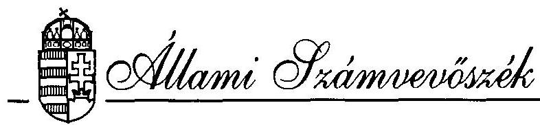
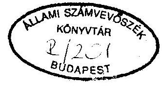
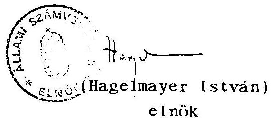

# JELENTÉS 

az Alba Volán Vállalatnál
az országos menetrend szerinti személyszállitásra rendelt állami vagyonnal való gazdálkodásról

---

A vizsgálatot vezette:
dr. Kovácsné dr. Pósfay Zsuzsanna
osztályvezető főtanácsos

A vizsgálatot végezték:
Podonyi László számvevő
Rideg Margit számvevő tanácsos
Tóth Pál számvevő

---

# TARTALOMJEGYZÉK 

Oldal
I. BEVEZETÉS ..... $1-3$.
II. ÖSSZEFOGLALÓ MEGÁLLAPÍTÁSOK, AJÁNLÁSOK

1. Összefoglaló megállapítások ..... $4-9$.
2. Ajánlások ..... $10-12$.
III. RÉSZLETES MEGÁLLAPÍTÁSOK ..... $12-44$.
3. Jogi szabályozás ..... $12-18$.
1.1. Részvénytársaság alapítása ..... $12-14$.
1.2. Állami vagyon védelme ..... $14-16$.
1.3. A működés szabályossága ..... $16-18$.
4. Gazdálkodás a vagyonnal ..... $18-23$.
2.1. Az Alba Volán Vállalat vagyonának változása ..... $18-19$.
2.2. Gazdálkodás a befektetett eszközökkel ..... $19-22$.
2.3. Az átalakulási vagyonmérleg ..... $22-23$.
5. Gazdálkodás és jövedelmezőség ..... $23-27$.
3.1. Gazdálkodás és jövedelmezőség alakulása ..... $23-26$.
3.2. Költségvetési kapcsolatok ..... 26 .
3.3. Autóbuszállomány megújítási lehetősége ..... 27.
6. A Vállalat személyszállítási közszolgáltató tevékenysége ..... $27-28$.
4.1. Az indokolt utazási igények menny iségi kielégítése ..... $28-32$.
4.2. Az utazási igények kielégítésének minősége ..... $33-34$.
4.3. A személyszállítással kapcsolatos lakossági bejelentések, javaslatok, panaszok és ügyintézésük ..... $34-36$.
4.4. A lakossági észrevételek mennyisége, tartalma ..... $36-38$.

---

5. Belsó ellenőrzés ..... $38-44$.
5.1. Belsó utasítások kezelése ..... 38 .
5.2. Belsó érdekeltségi rendszer ..... 39.
5.3. A Vállalat információs rendszere és számitástechnikai háttere ..... 39.
5.4. Az Igazgatótanács ..... 40.
5.5. A Felügyelő Bizottság ..... $40-41$.
6. Környezetvédelem ..... $42-44$.
6.1. A Vállalat környezetvédelmi tevékenységének vizsgálata ..... $42-43$.
6.2. Átalakulási terv környezetvédelmi helyzet- ismertetése ..... 43.
6.3. A Volán vállalatok környezetvédelmi együttmüködése ..... 44.

---

# J E L E N T É S 

az Alba Volán Vállalatnál
az országos menetrend szerinti személyszálításra
rendelt állami vagyonnal való gazdálkodás ellenörzéséröl

## I.

## B E VE ZETÉS

Az Állami Számvevőszék az 1989. évi XXXVIII. tv. 6. § (2) bekezdése alapján ellenörizte 1991-92. évekre kiterjedően, hogy az Alba Volán Vállalat miként gazdálkodott az állami vagyonnal Időszerü témákban az 1993. évi folyamatokat is figyelemmel kisérte a vizsgálat. Ezen adatok tájékoztató jellegüek, mert a mérleget később, 1994. május 31-ig kell audítáltatni.

Az Alba Volán Autóbuszközlekedési Részvénytársaságot (továbbiakban: Részvénytársaság; Rt.) 1992. december 31-én alapította zárt, egyszemélyes részvénytársaságként, határozatlan időre a közlekedési, hírközlési és vízügyi miniszter. Az alapító a cég valamennyi részvényét lejegyezte.

A társaság alapításkori jegyzett tőkéje 700 millió Ft, amelyből - pénzbeli betét 48,4 millió Ft,

- nem pénzbeli betét (apport) 651,6 millió Ft.

A jegyzett tőke feletti saját vagyona - tőketartaléka - az alapítás időpontjában 570,7 millió Ft volt.

---

Az átalakuláskor a teljes munkaidőben foglalkoztatott dolgozók létszáma 1819 fő volt, a szolgáltatói tevékenység lebonyolításához 342 db autóbusz állt rendelkezésére. E kapacitással a Részvénytársaság 1993-ban 1222 km vonalhosszon 100 település bekapcsolásával végez menetrend szerinti távolsági, 162 km vonalhosszon 9 település bekapcsolásával pedig menetrend szerinti helyi személyszállítást.

A Részvénytársaság fő tevékenysége az alapító okirat szerint: - menetrend szerinti, közúti, távolsági személyszállítás, - nem menetrend szerinti, közúti, távolsági személyszállítás, - menetrend szerinti, közúti, helyi személyszállítás.

A fő tevékenységen túl kiegészítő tevékenységként 24 féle tevékenységet sorol fel az alapító okirat.

A Részvénytársaság az államigazgatási felügyelet alatt álló állami vállalat - az Alba Volán Vállalat - általános jogutódja. Az Alba Volán Vállalat (a továbbiakban: Vállalat) elsődleges feladata a menetrend alapján autóhusszal végzett közforgalmú személyszállítás volt.

Elsődleges feladatának ellátása mellett 1990. év közepéig széleskörü, jelentős mértékủ egyéb üzleti tevékenységet is végzett a Vállalat. Foglalkozott pl. nemzetközi és belföldi közúti áruszállítással, idegenforgalmi és taxi szolgáltatással, jármújavitással, jármübérbeadással és egyéb járulékos szolgáltatásokkal.

1989-90-ben kiegészítő tevékenységeinek döntő hányadát - részben vagy egészben a hozzájuk tartozó tárgyi, pénzügyi eszközökkel, dolgozói létszámmal együtt - vegyestulajdonú kft.-kbe vitte a Vállalat.

---

Ez a - Vállalatnak jelentős kárt okozó - privatizációs folyamat a döntések időszerűségét, vállalati hasznát erőteljesen vitató, megosztott vállalati vezetés mellett zajlott le, lényegesen megelözve a Közlekedési, Hírközlési és Vízügyi Minisztérium (a továbbiakban: KHVM) profiltisztitást is célul kitűzỏ privatizációs stratégiájának megvalósitását.

A vizsgálati program az ezt követő időszak - 1991-1992. évek gazdálkodására terjedt ki, de ahol szükséges, ott utalás történik a korábbi évek gazdasági eseményeire is.

A vállalati gazdálkodás föbb bevételi, illetve eredményességi adatai az alábbiak voltak:

|  |  |  |  | mi11ió | Ft-ban |
| :--: | :--: | :--: | :--: | :--: | :--: |
|  | 1990. | 1991. | 1992. |  | 1993.* |
| Összes üzleti bevéte1 | 1.848,9 | 2.021,0 | 2.203,8 |  | 2.394,1 |
| Autóbusz-közlekedés nettó árbevétele | 802,0 | 1.134,2 | 1.424,8 |  | 1.661,7 |
| Az elöbbiböl: fogyasztói árkiegészités | 166,0 | 296,2 | 457,1 |  | 562,5 |
| Adózás elötti eredmény | $-146,9$ | 34,3 | 13,1 |  | 20,0 |

Az Alba Volán Autóbuszközlekedési Részvénytársaságnál tartott vizsgálat célja annak megállapítása volt, hogy a részvénytársasággá alakulást közvetlenül megelözö két évben a Vállalat a kezelésében lévő állami vagyonnal hogyan gazdálkodott; befektetései a különféle gazdasági társaságokba, valamint részvénytársasággá történő átalakulása a vonatkozó jogszabályok elöírásainak megfeleltek-e; közszolgáltatási tevékenységét hogyan látta el; az autóbusz-közlekedéssel kapcsolatos környezetvédelmi jogszabályokat betartotta-e.

A vizsgálat 1993. szeptember 15-től december 20-ig - ezen belül a helyszíni vizsgálat szeptember 16-tól november 20-ig - tartott.

[^0]
[^0]:    *Nem auditált adatok

---

# II. 

## ÖSSZEFOGLALÓ MEGÁLLAPÍTÁSOK, AJÁNLÁSOK

## Összefoglaló megállapítások

## Jogi szabályozás

A 100 \%-ban állami tulajdonú Részvénytársaság alapítása a törvėnyi elöírásoknak megfelel1, azonban az átalakítás gazdasági megalapozottsága nem volt mindenben megnyugtató. Igy a társasággá alakuláshoz szükséges profiltisztitást a Vállalat csak jogilag tudta végrehajtani, a gyakorlatban csak később alakult ki a tiszta személyszállitási profil. A jelentős volumenü (veszteséges) nemzetközi árufuvarozási tevékenység kivitele kft.-be a személyszállítást továbbra is terhelte, s csak egy évvel később a kamionok értékesítésével vált a gyakorlatban is profiltisztává az Rt.

A részvénytársasággá alakulás önmagában még nem jelentett érdemi változást a gazdálkodásban, valamint a piaci viszonyokhoz való alka Imazkodásban.

Az állam vállalatokra bízott vagyonának védelméröl szóló 1990. évi VIII. törvény a nem nevesített egyéb szerzödések esetén (pl. jelzálog) nem biztosította az állam vagyonának megfelelö védelmét. A Vállalatnál két esetben előfordult, hogy a jelzáloggal terhel1 vagyonrészeket az ÁVÜ engedélyétől függetlenül is értékesiteni kellett volna, mert a hitelező, a számlavezető Magyar Hitel Bank kényszerértékesítést írt elő az óvadéki szerződésben a rövidlejáratú hitelek ki nem fizetés esetére. Az óvadéki szerződésre pedig a vagyonvédelmi törvény nem vonatkozik, mert azok az értékhatárt nem érték el. (E probléma, mint lehetöség ma is fennáll).

---

A Vállalatnak 13 társaságban van tulajdoni hányada 51,3 millió Ft vagyoni betéttel. Érdekeinek képviselete nem minden társaságban megfelelő, mert nem határozták meg pontosan a felelősséget és nincs egy kézben a felügyeletük.

# Gazdálkodás a vagyonnal 

Az 1990 novemberében kinevezett új igazgató vezetésével a Vállalat az előző vezetéstől átvett saját vagyonát megőrizte, sőt kismértékben gyarapította is.

A gazdálkodást a különféle vagyonelemekkel alapvetően a csődhelyzet elkerüléséért folytatott küzdelem határozta meg. A tárgyi és a befektetett pénzügyi eszközök értékesítése a könyvszerinti érték felett történt, tchát a saját vagyont nem csökkentette. A Vállalat saját vagyonát közvetlenül növelö állami támogatásban a vizsgált években nem részesült.

## Gazdálkodás, jövedelmezöség

A Vállalatnál 1990. évre súlyos morális és gazdasági válság alakult ki. Az év végén megválasztott új vezetés intézkedési tervei dolgozott ki a müködés fenntartására és a teljes csődhelyzet elkerülésére. A célkitüzésben foglaltak teljesitése a Vállalat vezetése részéről nagy munkaráfordítással és szakértelemmel megvalósult. Ehhez vissza kellett fogni szinte minden beruházást, eszközöket kellett értékesíteni, átszervezéseket hajtottak végre és takarékos költséggazdálkodást alkalmaztak.

A Vállalat teljesítményei csökkentek a vizsgált időszak alatt, elsősorban a teherfuvarozás területén, de a személyszállításnál is föleg a szerződéses és különjáratok esetében. A bevétel növekedése a tarifák emelkedésének következménye. A Vállalat 1990. évi jelentős vesztesége ( 146,9 millió Ft) után 1991. évben ( 32,2 millió Ft) és 1992. évben ( 10,5 millió Ft) is, szerény mérleg

---

szerinti nyereséget tudott elérni. Az 1990. évről elhatárolt ( 30 millió Ft) és áthozott veszteséget kigazdálkodta. A költségek az árbevételnél kisebb mértékben nöttek.

A személyszállítás területén érdemi jövedelem csak a helyközi tevékenységböl származik, a helyi személyszállítás az egyes városokban eltérően veszteséges vagy minimális jövedelmet biztosít, a teherfuvarozás veszteséges volt.

A Vállalat likviditási helyzete szerény mértékben javult.

A Vállalat adófizetési és társadalombiztosítási kötelezettségének eleget tett. Jelentős támogatásban részesült minden évben, amely a vállalati összes bevétel 1/5-ét is elérte, ez elsősorban a személyszállítási kedvezmények miatti (jogszabályban előirt) árkiegészítés. A társaság jövedelemhelyzetét a szabályozó módosítások egy része kedvezőtlenül érintette (társasági adókedvezmény megszünése, kétkulcsos ÁFA bevezetése).

A társasági adóról szóló törvény 1994. évre vonatkozó módosítása sem tartalmaz a menetrend szerinti autóbusz személyszállítási tevékenységre a minimumadó fizetési kötelezettség alóli felmentésen kívül kedvezményt.

Az autóbuszpark megfelelö - korszerü - szinten tartására nincs reális lehetöség. A társaság a közvetlen, a gazdálkodás lehetetlenülése felé tartó válságából kilábalt, de jármüveinek avultsága kritikus szintet közelít, fokozottan veszélyezteti a közszolgáltatási tevékenység ellátását. (Az autóbuszok 63 \%-a már "0"-ra amortizált volt 1992. év végén.) A cég a nehéz likviditási helyzete miatt hiteltörlesztésre használta az eszközök értékesítéséből származó árbevételt is, amit a KHVM előírása szerint a számviteli elszámolások után autóbusz beszerzésre kellett volna fordítani. Az utóbbi években érdemi fejlesztés nem történt, a tárgyi eszközök megújítását az elért jövedelem nem biztosít-

---

ja. Jelenleg a hiteltörlesztés csökkenése és a kis nyereség mellett a társaságnak csupán arra van lehetősége, hogy a jármüpark romlásának gyorsaságát csökkentse.

A Vállalat személyszállítási közszolgáltató tevékenysége

A szolgáltatás mennyiségét és minöségét tekintve a vizsgált időszakban fö szempont lett a gazdaságosságra való törekvés. E szemponttal szoros összefüggésben a személyszállításon belül is törekedtek keresztfinanszírozás elkerülésére. Az önkormányzati támogatás igénylése motiválta nemcsak jogosan a helyi közlekedés, hanem vitatható jogossággal a helyközi közlekedés alakítását is. A járatok átmeneti vagy végleges megszüntetését, illetve új járatok indítását egyaránt.

A szolgáltatással kapcsolatos lakossági észrevételek közül a közérdekủ bejelentések, javaslatok többségében a menetrendi változásokra, a panaszok a dolgozói magatartásra vonatkoznak. A panaszok többségét a Vállalat is indokoltnak ismerte el, és az érintett dolgozóit figyelmeztetésben részesítette. Számos esetben - gazdasági és műszaki okokra hivatkozva - elhárították a közérdekủ kérést. A vállalat fogadóképessége a lakossági, önkormányzati igények iránt 1992-ben érzékelhetően javult.

# Belső ellenőrzés 

Az 1990-92. években a Vállalat belső ellenőrzési rendszere, a szabályozás általános felépítése megfelel a jogszabályi követelményeknek. A szervezet az évenként jóváhagyott ellenőrzési terv alapján dolgozott, megfelelő képzettségủ szakemberekkel.

Az Rt. megalakítása után, az új Szervezeti és Müködési Szabályzat elfogadásával a régi ellenőrzési osztály három részre bomlott. Egy része a felügyelő bizottság irányítása alá tartozó, független belsö ellenőrzésnél dolgozik. Ez megfelel a gazdasági

---

társaságokról szóló törvėny elöírásainak. A több1 ellenör az Rt.-n belül különböző felügyeletek alatt látja el a vagyonkezelési, szakellenörzési és közúti ellenörzési feladatokat, a vállalati menedzsmentnek dolgozva. Együttes munkájuk alkalmas a jelentősebb hibák feltárására. A belsö utasítások kezelése a Vállalat belsö szabályzata alapján, jól müködött.

A vizsgálat kiterjedt a Vállalat információs rendszerének és számítástechnikai hátterének feltérképezésére. A Vállalat, lehetséges keretein belül, egyre jobban törekedett arra, hogy a vállalati szintü, operativ információkat a vállalati folyamatokban jól müködtesse.

Az Igazgatótanács - a vizsgált időszakot közvetlen megelöző igazgató-váltás után - müködésének korábbi szabálytalanságát okozó adminisztratív hibát megszüntette. Ezt követően új igazgatótanács alakult, amely a továbbiakban szabályszerűen müködött.

A Felügyelö Bizottság a minisztériumi szabályzat alapján, önálló müködési szabályzattal rendelkezett. A tulajdonosi érdekeket képviselö KHVM, a vizsgált időszakban - különösen 1991-ben - a felügyelö bizottság üléseit, a vizsgálandó témák meghatározása mellett sürítette, ezáltal segitve a nehéz helyzetben lévő Vállalat stabilizálódását.

Környezetvédelem

Környezetvédelmi szempontból a Vállalat müködése csak környezetterhelést okozott a közúti közlekedésben és a telephelyen belül, mert a kibocsájtott (és mért) szennyezőanyagok nem haladták meg az elöírt határértéket.

---

Az autóbuszok környezetvédelmi felülvizsgálatai az érvényben lévó rendeletek szerint megtörténtek. A Vállalat - lehetséges keretein belül - teljesítette a környezetvédelemmel kapcsolatos elvárásokat, ezért környezetszennyezési bírságot nem fizetett.

Az átalakulási terv VI. Környezetvédelem címü fejezete teljesítette a környezetvédelmi helyzet ismertetés kívánalmát.

A vizsgált Vállalatnak - de a többi Volán vállalatnak is - állandó problémát jelent a felhalmozódott veszélyes és nem veszélyes hulladékok elhelyezése megfelelő kapacitású megsemmisítő, illetve tárolótelep hiányában. Példaként lehet említeni, hogy az Alba Volánnál évenként 120-140 tonna gumiköpeny és gumitömlő hulladék keletkezik.

A Vállalat tehergépkocsi parkja a profiltisztítás következtében nagymértékben csökkent. Ez a vállalati telephelyek szempontjából, a fajlagos szennyezési érték vonatkozásában kedvezőbb helyzetet teremtett. Az állami vállalattól a tehergépkocsik magánvállalkozásba kerültek és ezzel a rendszeres müszaki és környezetvédelmi ellenőrzés alól is kikerültek. Emiatt telephelyen kívüli környezetterhelő vagy környezetkárosító hatásukat már nem lehet nyomon követni a közúti közlekedésben. Az előirt "zöld kártya" alapján a hatóság csupán a motor égéstermék kibocsájtását méri, az egyéb szennyező anyagok elhelyezése ellenőrizetlen és ellenőrizhetetlen a magánvállalkozásokban.

Az autóbuszok környezetvédelmi felülvizsgálata és a telephelyek rendszeres belsó környezetvédelmi felügyelete a Vállalatnál föleg arra irányult, hogy ne történhessen környezetszennyezés ezáltal ne legyen bírságfizetés. Ezt meghaladó mértékben a Vállalat már csak a járműpark korszerűbbre cserélésével tudná csökkenteni a szennyezési értéket.

---

Az Állami Számvevőszék ajánlásai

Felhívja az Országgyülés figyelmét arra, hogy

- a tartósan állami tulajdonban maradó vállalkozói vagyon kezeléséről és hasznosításáról szóló törvényben meghatározott, a vagyon megterhelése esetén elöirt engedélyezési kötelezettség $50 \%$-os mértéke magas, az állami vagyon védelme érdekében indokolt a mérték csökkentése.
Az időlegesen állami tulajdonban lévő vagyon értékesítéséről, hasznosításáról és védelméről szóló törvényben leírt, a vállalat rendszeresen folytatott rendeltetésszerũ gazdasági tevékenysége körében kötött szerzödések meghatározása - amelyekre nem vonatkoznak a vagyonvédelmi elöírások - nem egyértelmü. A módosítást és az egyértelmübb meghatározást a privatizáció nagyobb kontrollja érdekében célszerű végrehajtani.
- Célszerú a szabadpiaci környezetben megfelelő osztalékot biztosítani nem tudó, meghatározott közszolgálati feladatokat ellátó társaságokra, olyan törvényl preferenciákat biztosítani, amelyek a müködés biztonságának fenntartását és fokozását szolgálják és a közszolgáltatás ellátását távlatilag is garantálják.
A közhasználatú menetrend szerinti autóbusz személyszállítás jármüállománya további romlásának megakadályozása, illetve hosszabb távon az autóbuszállomány minőségi cseréje érdekében törvényl feltételekkel is biztosítani szükséges kielégítő mértékü beruházási forrásképzést.
- Az ellenőrzésekre vonatkozóan a szükségtelen párhuzamosságok megszüntetése, a jobb megalapozás és a realizálások követhetősége érdekében, indokolt a különböző állami ellenőrzések nyilvántartási rendszerének meghatározása.
Az ellenőrzések nyilvántartására 1990. május 1-jétől nincs közvetlen jogszabály.

---

Felkéri a Közlekedési, Hírközlési és Vízügyi Minisztert arra, hogy
= tegyen lépéseket a menetrend szerinti közúti személyszál1itás müködöképességének javítása érdekében a közszolgáltatást érintő, de a gyakorlatban nem funkcionáló jogszabályi elöírások, fogal mak megszüntetésére vagy korszerűsítésére;
= vizsgálja felül és a szükséges esetekben határozza meg egyértelműen a közszolgáltatást érintő jogszabályokban használt fogal mak, kifejezések tartalmát.

Javasolja a Részvénytársaság vezetése részére, hogy

- vizsgálja felül a befektetések, üzletrészek védelmében a még meglévő társaságaiban a vagyonhasznosítás megfigyelési rendszerét és az érdekét megfelelőbben érvényesítse, s a befektetéseket - megfelelően képzett szakember személyében. - egy kézbe összpontosítsa.
- vizsgálja felül az Alba Volán információs rendszerének javítása érdekében és alakítsa át a dokumentációs rendszerét olymódon, hogy az azonos témakörbe tartozó eredeti dokumentumok egyetlen helyen teljeskörűen hozzáférhetőek legyenek; a gazdasági folyamatokat érintő információk időrendben és hiánytalanul áttekinthetővé váljanak.
= következetesen törekedjen a közszolgáltatás színvonalának további javítása érdekében arra, hogy a lakossági észrevételekre adott válaszok minden körülmények között elfogulatlan és érdemi válaszok legyenek. Magyarázkodó válaszok helyett a valós megoldásra tartalmazzanak ígérvényt, vagy útbaigazít informaciónt;

---

= helyezzen nagy súlyt a kultúrált utaskiszolgálás társasági követelményrendszerének megfogalmazására és oktatására, betartásának elfogulatlan érvényesitésére;
= fontolja meg a szakellenőri és kőzúti ellenőri feladatok egy kézben történő irányitását a független belsö ellenőrzés mellett figyelemmel arra, hogy az a vállalati menedzsmentet hatékonyabban segítené a folyamatos ellenőrző-koordináló tevékenységében, mint ahogy az az érvényben lévő Szervezeti és Müködési Szabályzat szerinti felépités szerint funkcionál.

- vezessen ellenőrzési naplót a környezetvédelmi ellenőrzések röl. A telephelyek környezetvédelmi ellenőrzésének megfelelö dokumentálása ellenőrzési napló vagy űrlapszerű feldolgozásban az ellenőrzés rendszerességét, a hibákat, a felelősöket ismertté és áttekinthetővé teszi, ezáltal a környezetvédelemmel kapcsolatos problémák rendezését szolgálja.

# 111 . 

## RÉSZLETES MEGÁLLAPÍTÁSOK

## 1. Jogi szabályozás

### 1.1. Részvénytársaság alapítása

A társaság alapítása a törvényi elöírásoknak megfelelöen zajlott le, ennek ellenére az Részvénytársasággá átalakítás gazdasági megalapozottsága nem megnyugtató. Ennek okai az alábbiak:

- Az állami vállalatok gazdasági társasággá való átalakulásánál nem áll fenn az a rendelkezés, hogy az alaptöke

---

30 \%-ánál nem lehet kevesebb a pénzbeni hozzájárulás. A hatályos jogszabályok egy általános Rt. alapítás* feltételénél a müködés pénzügyi biztonsága miatt írják elő ezt a limitet, amelyet egyébként a jelenlegi kamatterhek indokoltak volna. Bár nem utasítható közvetlenül egy müködö nagyvállalat arra, hogy társasággá alakulásnál milyen arányú készpénzzel rendelkezzen, de az adott, lényegében készpénz nélküli átalakulás hozzájárult a későbbi likviditási zavarokhoz.

Az átalakulási terv gazdasági alapon ugyan alkalmasnak tartotta a Vállalatot az Rt.-vé történt átalakításra, de megjegyezte, hogy az eszközparkban bekövetkező további romlás a közszolgálati feladat ellátását veszélyeztetheti. Miután a külső körülményekben lényeges javulás nem várható, s a Részvénytársaság adottságai az örökölt nehézségek miatt rosszak, ennek bekövetkezése nem zárható ki.

Egy részvénytársaságtól általában a piaci viszonyoknak is megfelelő nagyságú osztalékot vár el a részvényes. Ez az osztalék az Alba Volán Rt.-töl hosszabb távon sem várható. A részvénytársasági forma - új likvid tőke nélkül - ma még nem jelent érdemi változást a gazdálkodásban és a piaci környezethez való alkalmazkodásban.

A részvénytársasággá alakítást megelőzően - a teherfuvarozás jelentős nagyságrendje és az idő rövidsége miatt - a társasággá alakuláshoz szükséges profiltisztítást a Vállalat csak jogilag tudta végrehajtani, a gyakorlatban csak később alakult ki a tiszta személyszállitási profil.

[^0]
[^0]:    * A gazdasag társaságokról szóló 1988. évi VI. törvény 251. § (2) bekezdés

---

Ennek fó oka az, hogy a Vállalat életében korábban igen jelentős nemzetközi teherfuvarozási tevékenységhez kapcsolódó több száz milliós értékủ eszközparkot nem tudták 1992. december 31-ig értékesiteni, illetve társaságba vinni az érdemi fizetőképes kereslet hiánya, valamint a lízingelésböl adódó terheltség miatt. Az 1993. január 1-jétől müködő Rt. tevékenységi körében már nem szerepelt a teherfuvarozás, ezért a fuvarozási tevékenységet ez idóponttól kezdve egy 1 milliós kft.-be vitték ALBA VOLCA Kft néven, s az eszközök továbbra is az Rt.-nél maradtak, csak az elszámolás változott meg. A nemzetközi teherszállítási eszközök helyzete a helyszíni vizsgálat lezárása után értékesítéssel rendeződött.

# 1.2. Állami vagyon védelme 

A Vállalat az állam vállalatokra bízott vagyonának védelméről szóló 1990. évi VIII. tv. előírásainak eleget tett. A törvény hatálya alá tartozó szerződéseket bejelentette az ÁvÜ-nek, illetve később a KHVM-nek. A Vállalat által rendelkezésre bocsájtott - a törvény által 5 kategóriába sorolt - szerződések és vagyonváltozások vizsgálata alapján megállapítható, hogy az állami vagyon védelme nem mindig volt biztosítható a vonatkozó más jogszabályok összehangolatlansága következtében.

Így például 1991. évben a Vállalat vagyoni értékủ jogának és gazdasági társaságban fennálló tulajdonosi érdekeltségének elidegenítésénél (1990. évi VIII. tv. 1. §/1/ bek.) a vagyon védelme nem érvényesülhetett. A Vállalat a Volán Klastrom Rt.-ben és az OKHB Rt.-ben lévő részesedésének elidegenítését ( 9 , ill. 10 millió Ft értékben) bejelentette az ÁvÜ-nek. Ez a bejelentés azonban csupán formálisnak tekinthető, hiszen az ÁvÜ nemleges válasza esetén is a részvények értékesítésre kerültek volna, hiszen a számlavezető bank, az MHB kényszerértékesítést írt elő. A kényszerérté-

---

kesítés oka az, hogy a Vállalat a rövidlejáratú hiteleit nem tudta idöben kifizetni, s ezért az MHB nem bizva a hitele megtérülésében, az óvadéki szerzödésnek megfelelően amely megkötése nem tartozott a vagyonvédelmi törvény hatálya alá - elöirta az eladást.

A Vállalatnál a vagyonvédelmi törvény életbe lépése óta csupán ebben a két esetben volt ellentmondásos a törvény érvényesülése, de ennek veszélye szinte 1990. évtöl folyamatosan fennállt a vizsgálat lezárásáig.

Az Alba Volán jelzáloggal terhelt vagyontárgyainak nagyságrendje több száz millió. Esetenként megközelítette a vállalat eszközértékének $50 \%$-át. A Vállalat 1990. évtől állandóan nehéz pénzügyi helyzetben volt, csak az utóbbi idöben javult érdemben a pénzügyi helyzet.

A hivatkozott vagyonvédelemröl szóló törvény 1. §-a (1) bekezdésének a)-d) pontjai (ahol a kisebb nagyságrendet is be kell jelenteni) nem nevesítik a zálogjogi szerzödéseket. Ezeket a szerzödéseket a törvény e) pontjába lehet besorolni, amely olyan magas határt jelöl meg (eszközérték 50 $\%-a$ ), amely elérésénél az állami vagyon védelme már nem biztosítható.

Az említett törvény 1. § (3) a) pontja is ronthatja az állami vagyon védelmét, hiszen a nem egyértelmú fogalmazás miatt megengedi, hogy a rendeltetésszerú gazdasági tevékenység körében kötött szerzödést nem kell bejelenteni. Az Alba Volánnál éppen ilyen szerzödésnek is felfogható rövíc lejáratú hitel meg nem fizetése miatt nem érvényesülhetett a törvény.

---

A megállapítás jelenleg is érvényes, mert a kifogásolt elöírások változatlan tartalommal hatályban vannak az 1992. évi LIII. törvény 11. § (4) bekezdésében és az 1992. évi LIV. törvény 21. § a) pontjában.

Az állami vállalatokról szóló 1977. évi VI. tv. és a végrehajtásról a 33/1984. (X.31.) MT rendelet elöirja, hogy a vállalatok a szervezeti és müködési szabályzatukban rögzitsék a "jelentös" mérték nagyságát, ame1y nagyságrend után nem a Vállalat vezetője, hanem az Igazgatótanács dőnt a befektetésekről, illetve elidegenítésekről. A Vállalat ezt a kötelezettséget csak 1991. évben teljesítette 1 millió Ft-os értékhatár megállapításával, ame1y egybeesik a felügyelő minisztérium által meghatározott 1 millió Ft-os üzletkötések álta1a való jóváhagyásának kötelezettségével is.

# 1.3. A müködés szabályossága 

A Vállalatnál 1990. évtől 1991. év közepéig súlyos morális és gazdasági válság volt. Az új (jelenlegi) vezetés 1990. november 1-jétől kapta meg a lehetőséget a Vállalat megromlott egyensúlyának a helyreállítására. A kezdeti időszakban napi teendő volt a fizetőképesség megőrzése és a müködés biztosítása. A fizetőképességi gondok csak jó féléves müködés után enyhültek. E jelentős megterhelés mellett kisebb szabálytalanságok előfordultak, így pl. néhány hónapig az Igazgatótanács müködése adminisztratív hiba miatt nem volt törvényes.

Az 1991. előtt alapított kft-k esetében többször előfordult, hogy a Vállalat szavazati joga kisebb volt a vagyoni részesedésénél. A bevitt vagyon $50 \%$ feletti volt, a Vállalat a szerződésben azonban $50 \%$ - 1 szavazattal is beérte.

---

Ezt a megállapodást ugyan törvény nem tiltotta, a későbbiekben azonban bebizonyosodott, hogy a Vállalat számára elônytelen szerzödések módosítása nehézkes és elhúzódó volt.

A Vállalat által 1991 elött alapított társaságokban a jo-g1-gazdaság1 érdekek képviselete nem megfelelö. A társaságok megalakulása után nem sokkal megszakadt a jó viszony a társaságok és az anyavállalat között. A befektetések megfigyelésére, ellenőrzésére megfelelő felelősség1 rendszerek nem alakultak ki. A befektetések kezelése nélkülözte a rendszerszemléletet, azok a vizsgált időszak alatt nem voltak egy kézben tartva, minden befektetést más személy felügyelt igen eltérő hatásfokkal.

Az Alba Volánnál a belsó szabályozás összességében megfelelő. A szükséges szabályzatokat és utasításokat elkészítették. Az iratanyagok tárolása rendszerezése nem minden területen megoldott. A társaságnak p1. nem áll rendelkezésére az átalakulási vagyonmérleg véleményézését tartalmazó felügyelő bizottsági jelentés. A befektetések iratanyagának kezelése nem megfelelő. A társaságnál a külső ellenőrző szervek a vizsgált időszakra vonatkozóan nem találtak súlyosabb szabálytalanságot. A Részvénytársaságnál a külsó szervek ellenőrzéseit nehéz számbavenni, mivel ellenőrzési naplót nem rendszeresítettek.

A Felügyelő Bizottság egyes tagjai már 1990 elött is részt vettek a Vállalat ellenőrzésében. A Felügyelő Bizottság 1990. év végéig elsősorban összekötő szerepet látott el a Vállalat és a minisztérium között. Érdemi ellenőrzési feladatokat a Felügyelő Bizottság 1991-tól látott el, majd 1993. évtől a döntések véleményezésében is aktiv szerepet játszik.

---

A Vállalatnál 1990. évben bekövetkezett "gazdasági válság" elött az Felügyelő Bizottság részéről nem található irásos anyag a válság előrejelzésére, javaslat annak elkerülésére. A Felügyelő Bizottság 1991. év elején pontos tényfeltárását adta a Vállalat helyzetének. A Vállalat új vezetésével 1991. második felétől alakult ki jó kapcsolat.

# 2. Gazdálkodás a vagyonnal 

### 2.1. Az Alba Volán vagyonának változása

A Vállalat saját vagyona/tökéje
1990. december 31-én 68,7 millió Ft-tal több,
1991. december 31-én 54,1 millió Ft-tal kevesebb,
1992. december 31-én 43,2 millió Ft-tal kevesebb
volt a 638,9 millió Ft-os alapítói vagyonánál /jegyzett tökéjénél/.

Az 1991. évben kimutatott 122,8 millió Ft-os vagyonvesztés azonban nem az 1991. évi gazdálkodás miatt következett be.

Az 1990. évi gazdálkodás során nemcsak az addig önerőből felhalmozott vagyonát - 68,7 millió Ft értéket - veszítette el a Vállalat, hanem az alapítással kapott vagyon egy részét is.

Az előreláthatóan jelentős veszteséget okozó gazdálkodás miatt a korábbi igazgató munkaviszonyát - saját kezdeményezésére - a közlekedési, hírközlési és vízügyi miniszter közös megegyezéssel, munkáját megköszönve, 279 ezer Ft végkielégítéssel 1990. augusztus 31-ével megszüntette.

Az Alba Volán 1990 novemberében kinevezett új igazgatója (jelenleg a Részvénytársaság ügyvezető igazgatója) súlyos, "vagyoncsökkentő" örökséggel vette át a Vállalat vezetését:

---

az 1990. évi gazdálkodás 146,9 millió Ft veszteséggel zárult. E veszteséget - az érvényes könyvviteli elöirásoknak megfelelően - 1991-ben lehetett (illetve kellett) elszámolnia a Vállalatnak a saját vagyona terhére.

A Vállalat 1991-ben 32,2 millió Ft, 1992-ben 10,5 millió Ft, 1993-ban 15,8 millió Ft mérleg szerinti eredménnyel növelte saját vagyonát /tökéjét/.

A vizsgált években a saját vagyont/tökét/ közvetlenül - tehát nem a mérleg szerinti eredményen keresztül - és számottevöen növelö vagy csökkentö Vállalati döntésekre nem került sor.

Az Alba Volán vagyonát közvetlenül növelö állami támogatásban sem részesült.
2.2. Gazdálkodás a befektetett eszközökkel

A saját vagyona /tökéje/ mellett a Vállalat jelentösen csökkenö összegü
(1991. január 1-jén 593,6 millió Ft,
1991. december 31-én 480,2 millió Ft,
1992. december 31-én 322,2 millió Ft)
1993. december 31-én 326,3 millió Ft
idegen forrást használt fel tevékenységének, eszközeinek finanszirozásához.

Az igénybe vett idegen forrás csökkenésével egyidejúleg a Vállalat mérleg szerinti összes eszközállománya is csökkent.

---

(1991. január 1-jén
1991. december 31-én
1992. december 31-én
De *1993. december 31-én már

1151,3 millió Ft,
1075,2 millió Ft,
964,3 millió Ft.)
1653,7 millió Ft-ra nőtt.

A vállalat fennmaradása, pénzügyi stabilitásának megteremtése érdekében elkerülhetetlen volt az idegen forrás (kötelezettségek) állományának csökkentése. Ezek a kötelezettségek a korábbi vezetés döntései nyomán - de nem az elsődleges tevékenységgel összefüggésben - keletkeztek, és súlyos terheket jelentettek a menetrend szerinti személyszállításra fokozatosan leszükülö gazdálkodás számára.

A kötelezettségek törlesztését szolgálta az alaptevékenységhez nem szükséges befektetett tárgyi és pénzügyi eszközök értékesítése.

Befektetett eszközökböl számottevö értékesítés 1991-ben volt a vállalatnál. Az értékesített tárgyi eszközök (állóeszközök) könyvszerinti értéke 40,5 millió Ft volt, amely az 1991. január 1-jei mérleg szerinti összes állóeszközértéknek ( 656,2 millió Ft-nak) $10 \%$-át sem érte el. (1992-ben mindössze 3,8 millió Ft, 1993-ban 64,7 millió Ft értékủ eszközt értékesítettek.)

Az 1991-ben értékesített befektetett pénzügyi eszközök (vagyoni betétek gazdasági társaságokban, részvények, értékpapírok) könyvszerinti értéke 20,8 millió Ft volt. (1992-ben mindössze 0,1 millió Ft.) Ez az érték az 1991. január 1-jei mérleg szerinti állománynak ( 90,6 millió Ft-nak) $23 \%$-a volt. 1993-ban további 20,2 millió Ft összegủ értékesítés volt. 1993. december 31-én a pénzügyi befektetések (részesedések) állománya $59,7^{*}$ millió Ft volt.

A befektetett eszközök értékesítése összességében könyvszerinti érték feletti áron történt, így a nyereségen keresztül a saját vagyon/töke/ növekedéséhez is hozzájárult.

[^0]
[^0]:    *Nem auditált adat.

---

A befektetett pénzügyi eszközök közül a vagyoni betétek gazdasági társaságokban, részvények, értékpapírok állományának alakulása képezte részletes vizsgálat tárgyát. 1990 végére ilyen formákban a saját vagyon ( 707,6 millió Ft) 12,8 \%-át kitevő eszköz ( 90,6 millió Ft) került ki a Vállalati vezetés közvetlen döntési hatóköréböl. Ennek az értéknek valamivel több mint a fele - 51,3 millió Ft - vagyoni betét volt 13 gazdasági társaságban. A vagyoni betétek értéke 20 ezer Ft és 15,3 millió Ft között szóródott.

Az Alba Volán 1991-92-ben egyetlen kisösszegü ( 100 ezer Ft) vagyoni betéten kívül nem vett részt újabb gazdasági társaságok alapításában, részvényeket, értékpapírokat nem vásárolt. Nehéz pénzügyi helyzetében arra törekedett, hogy a már meglévő érdekeltségeit is értékesitse.

A vállalat pénzügyi befektetései nem teljesítették a velük szemben támasztható jövedelmi követelményeket.

Az 1990. december 31-én
1991. december 31-én
1992. december 31-én
*1993. december 31-én

90,6 millió Ft,
69,8 millió Ft,
68,1 millió Ft
59,1 millió Ft értékủ pénzügyi
befektetéssel
1990. gazdasági év után 9,7 millió Ft,
1991. gazdasági év után 4,3 millió Ft,
1992. gazdasági év után 2,4 millió Ft osztalékhoz jutott a Vállalat.
(1993. gazdasági évi adat még nincs).

Nem feleltek meg azoknak a várakozásoknak sem, hogy rendeléseikkel számottevően lekötik a Vállalat 1989 óta növekvó szabad szolgáltatási kapacitásait. 1991-ben az 50,5 millió

[^0]
[^0]:    *Nem auditált adat

---

Ft-os bérleti és lizingdijon felül, ÁFA-val együtt 146,0 millió Ft egyéb bevételhez (üzemanyag-értékesités, gépkocsi javítás, irodai szolgáltatás címén) jutott kft.-i révén a Vállalat, 1992-ben az 50,6 millió Ft bérleti és lizingdijon felül csak 56,2 millió Ft-hoz. A fentiek alapján elfogadható a befektetések értékesítésére irányuló döntések helyessége.

Az egyes befektetések például az ALBA REGIA /ARTOUR/ IDEGENFORGALMI ÉS TAXI Kft. dokumentációja azonban a Vállalatnál szétszórtan és hiányosan állt rendelkezésre. Íly módon nem volt alkalmas annak elbírálására, hogy a Vállalat maximálisan kihasználta-e döntési, befolyásolási lehetőségeit annak érdekében, hogy vagyonának ezt a részét se érje veszteség elmaradó haszon formájában.

# 2.3. Az átalakulási vagyonmérleg 

Az 1993. január 1-jei átalakuláshoz végrehajtott vagyonbecslés a Vállalat 595,7 millió Ft-os könyvszerinti saját tőkéjét 2,1-szeresére - 1.270,7 millió Ft-ra - értékelte. A 675 millió Ft-os vagyonérték-különbözet kialakulásában növelö tényezőként döntö szerepet a tárgyi eszközök felértékelése játszott ( $+728,8$ millió Ft).

Ezen belül a telkek értéknövekedése 205 millió Ft, az épü-letek-építményeké 405 millió Ft, a jármüveké 105 millió Ft. A jármüveken belül az autóbuszok könyvszerinti értéke 89,7 millió Ft-ról 173,4 millió Ft-ra növekedett. Csökkenö tényezőként a részesedések ( $-20,4$ millió Ft) és a követelések ( $-27,9$ millió Ft) leértékelése számottevö. A vagyonvesztések a vizsgált időszakot megelöző évek gazdálkodásához kapcsolódnak.

---

A Részvénytársaság ezzel együtt alkalmas a megyei személyszálítási igények kielégítésére. Mint általános jogutód jelenleg egyedül rendelkezik a szükséges autóbuszokkal, jármüteleppel, javítóbázissal és utaskiszolgáló infrastruktúrával, valamint képzett személyi állománnyal.

# 3. Gazdálkodás és jövedelmezöség 

### 3.1. Gazdálkodás és jövedelmezöség alakulása

A vállalat gazdasági, jövedelmezöségi eredményeinek megitélésénél figyelembe kell venni, hogy 1990. évben rendkivül kedvezőtlen helyzetböl indultak. A későbbi években e veszteségeket "ki kellett gazdálkodniuk". A Vállalat 1990. év végén kinevezett vezetői nagy erőfeszítésekkel és szakértelemmel elkerülték a teljes csődhelyzet kialakulását. Az 1990. év végére kialakult súlyos helyzet okai a következők voltak.

- Átgondolatlan volt a gazdasági társaságok alapítása, s az alapítás után a rezsi a vállalatnál maradt.
- Több esetben a vállalat a megalakított társaságaival számára elönytelen szerződéseket kötött.
- A nemzetközi tehergépjármú állomány fejlesztésére akkor került sor, amikor a fuvarpiaci pozíciók gyengültek. Túlzott volt a beruházás ( 50 db Mercedes kamion).
- Árszinvonal problémák jelentkeztek több esetben.
- Gazdasági társaságok alapítása során az alapító Vállalat érdekeit, saját pozícióit feladta.
- Túlméretezetté vált az infrastruktúra az átalakulások következtében.
- A vállalat vezetői érdekellentétek miatt a gazdasági folyamatok rendezése helyett a konfliktusok megoldásával foglalkoztak.

---

1991. év elején intézkedési terv készült a válsághelyzetböl való kilábalásra. A tervben foglaltakat a Vállalat vezetése teljesítette a beruházások jelentös visszafogásával, takarékos költséggazdálkodással, átszervezéssel és eszközök értékesítésével.

A vállalat naturális teljesítményei 1990. évtöl folyamatosan csökkentek, s a folyamat jelenleg is tart. Az egykor több mint $50 \%$-ot kitevő teherfuvarozás a feladatcsökkenés és a társaságokba való kivite1 miatt 1992. évben csupán 25 \%-ot tett ki. Az autóbusz-közlekedés részaránya ugyan növekedett, a teljesítmények azonban itt is csökkentek. A legjelentősebb csökkenés a szerződéses és a különjáratoknál következett be.

A bevétel vállalati szinten 1990. évben kisebb mértékben, de növekedett. A növekedés összetevöi változatosak. A helyi és helyközi menetrendszerinti autóbusz-közlekedés árbévétele a teljesítménycsökkenéstöl nagyobb mértékü áremelkedés miatt növekedett, a többi tevékenység bevételei jelentösen csökkentek.
1991. évtöl a költségek az árbevételhez viszonyítva kisebb mértékben emelkedtek a menetrend szerinti személyszál1itásnál, s jelentős részarányuk miatt a vállalati összesenben is.

A Vállalatnál a lizing- és hitelterhek olyan magasak voltak, hogy a teherfuvarozás kisebb mértékü piac beszükülés mellett is veszteséges lett volna. A speciális vállalati terhek mellett a teherfuvarozásban a nagy vállalatok többségét hátrányosan érintette, hogy az eltérő olajár adta visszaélési lehetőségekkel szemben - amelyekkel elsősorban a kisebb vállalkozások éltek - későn történt állami intézkedés, s ezáltal a fuvarpiac egyes területein hátrányba kerültek a hivatalos áron vásárló nagyvállalatok.

---

A szállítási tevékenységen belül csupán a helyközi autó-busz-közlekedésnél képződik érdemi jövedelem (1992-ben 152 millió Ft volt). A helyi közlekedés jövedelmezősége az egyes városokban nullszaldó körül alakult, összességében veszteséges.

A különjárati és szerződéses autóbusz-közlekedés, valamint a belföldi és nemzetközi teherfuvarozás egyaránt veszteséges.

A vállalat az 1990. évi 146,9 millió Ft-os vesztesége után 1991. évben 32,2 millió Ft, 1992. évben pedig 10,5 millió Ft mérlegszerinti eredményt ért el, az elhatárolt 30 millió Ft veszteséget kigazdálkodta.

A vállalat 1989. évtöl folyamatosan a szakmai átlaghoz képest is nehezebb pénzügyi helyzetben volt. Egyidejüleg volt eladósodási és likviditási válságban. A legkritikusabb állapot 1991. év elején alakult ki. A vagyonra jutó kötelezettségek igen magas szintet értek el. A likviditási mutatók jelentős eladósodást mutattak. Ezek a mutatók 1992-1993 években kismértékben javultak.

A vállalat létszáma 1990-ig nagyobb mértékben (teherfuvarozás csökkenése, társaságok alapítása miatt), később évente csupán néhány százalékkal csökkent. A bérgazdálkodás területén a nehezebb vállalati helyzet ellenére is biztosított a szakmai átlagnak megfelelö javadalmazás. (Megjegyezzük, hogy ennek ellenére feszült volt a bérhelyzet, sztrájkveszély is volt 1993. év végén, a helyszíni ellenőrzés lezárását követően.)

Az 1990. évben létrejött igen súlyos gazdasági helyzet kialakulásához a már említett, az Alba Volán helyzetét hosszabb időre meghatározó tényezőkön túl döntési hibák is hozzájárultak. Így előnytelennek bizonyúlt a Vállalat által

---

alapított társaságnál - megegyezés hiányában - a szállítmányozási tevékenységi megbizás visszavétele. A Vállalat ezt a tevékenységét szakemberek hiányában nem tudta megfelelően ellátni, és így olyan kedvezőtlen körülmények közötti fuvart is elvállaltak, amelyeket gyakorlott szállítmányozási cégek jóval nagyobb térítés esetén sem vállaltak volna. Ez a veszteséget tovább növelte.

Kedvezőtlen következményei voltak továbbá annak is, hogy a felügyelö minisztérium hosszú ideig magánál tartotta a döntési jogot a kamionpark értékesítésére vonatkozóan, miközben nem döntött. A minisztérium 1993. év közepén adta vissza a döntési jogot a társaságnak. A kamionok értékesítésére 1993. év végén került sor, addig a fenntartásuk a vállalat terheit növelte.

# 3.2. Költségvetési kapcsolatok 

A vállalat költségvetési kapcsolata kiegyensúlyozottá vált. Az 1990-ben kialakult társadalombiztosítási járulékfizetés hátralékát részletfizetéssel teljesítette. A társaság jelentös árkiegészítésben részesült, amely már meghaladja a bevétel $20 \%$-át is. Az árkiegészités folyósításának idejét pontosabban szükséges rögzíteni, hiszen ilyen kiélezet: likviditási helyzetben a Részvénytársaságnak az APEH késedelmes utalása súlyos nehézséget okozhat, s a tervezhetőséget is kedvezôtlenül befolyásolja.

A társaság jövedelemhelyzetét a gazdasági törvénymódosítások egy része kedvezôtlenül érintette. Nevezetesen a társasági adótörvényben 1993. évben megszűnt a menetrend szerinti, közúti, helyi személyszállitási tevékenység után biztosított és már 1992. évben $40 \%$-ra csökkentett adókedvezmény. A kétkulcsos ÁFA bevezetése és évközi emelése szintén kedvezôtlenül hatott az autóbusz közlekedésre.

---

# 3.3. Az autóbuszállomány megújítási lehetösége. 

Az Alba Volán az autóbuszpark megújítása területén - a 63 \%-ában tel jesen elhasználódott állomány miatt - a Volán átlagtól nehezebb helyzetben van. A társaság ugyan a közvetlen csödhelyzetböl kikerült, azonban a jármüvek avultsága fokozottan veszélyezteti a közszolgálati feladatok ellátását. A cég kritikus likviditási helyzete miatt hiteltörlesztésre is felhasználta az eszközértékesítésböl származó árbevételt, amit a KHVM elöírásai szerint a számviteli elszámolások után, autóbusz beszerzésre kellett volna fordítania. (Tény, hogy ezzel magas hitelkamatot kerültek el.) Az utóbbi néhány évben érdemi fejlesztést nem tudtak végrehajtani, még a nagyon alacsony amortizáció mértékéig sem. Az autóbusz-közlekedés müködési költségeit a jelentős árkiegészitéssel megnövelt árbevétel ugyan fedezi, de a megújításra, fejlesztésre érdemi beruházási összeg nem marad.

Jelenleg az Alba Volán Rt.-nek - a hiteltörlesztési kötelezettség csökkenése, valamint kisebb nyeresége ellenére nincs reális lehetősége arra, hogy autóbusz-parkját megfelelö színvonalon tartsa. A további romlás gyorsaságának csökkentésére van csupán lehetősége, amely a szolgáltatás összeomlásához vezethet. Az ALBA VOLÁN jelentősebb külső segítség nélkül nem tudja megoldani az e területen jelentkező problémáját. Befektetőre a jelen viszonyok mellett nem számíthat, ezért csak költségvetési támogatás lehet a megoldás.
4. A Vállalat személyszállitási közszolgáltató tevékenysége

Az 1992. évi gazdálkodásról készült vállalati "Üzleti jelentés" szerint: "A Vállalat - növekvő költségráfordítás mellett - a menetrendszerinti személyszállításban fennálló ellátási kötelezettségének 1992. évben is eleget tett, az indokolt

---

utazási igényeket mennyiségileg kielégítette, a minőségi igénykielégités mértéke pedig alapvetően a müszaki-gazdasági feltételekhez és lehetöségekhez igazodott".

A fentiek alapján a vizsgálat elsősorban arra irányult, hogy választ adjon arra, hogy mit tekintett a Vállalat indokolt utazási igényeknek, és az igénykielégités minősége javult vagy romlott.

# 4.1. Az indokolt utazási igények mennyiségi kielégítése 

A koncesszióról szóló 1991. évi XVI. törvény a menetrend alapján végzett közúti személyszállítást is a nemzetgazdasági szempontból stratégiai jelentőségủ közszolgáltatások közé sorolja, ami indokolttá teszi kizárólagos állami tevékenységként való fenntartását. A törvény 1991. május 30-án lépett hatályba.

A tevékenység jelentőségét tekintve kifogásolható, hogy még a vizsgálat idején - 1993 öszén - is a vonatkozó hatályos ágazati jogszabályokban több olyan megfogalmazás található, amelyeknek tartalma egzakt módon nincs meghatározva. Ennélfogva ezek a jogszabályok kevésbé alkalmasak arra, hogy normaként szolgálva akár a fogyasztók, akár a szolgáltatók, akár az ellátásért felelős szervek rájuk hivatkozva számonkérhessék jogalk teljesülését.

Ilyen fogal mak például:

- a tömegközlekedés müködtetésének biztosítása (1988. évi I. tv. a közúti közlekedésről, 8. § (1) bek. d) pont); A tömegközlekedés mikor tekinthető biztosítottnak?
- ha a tömegközlekedés fejlesztése és ezen belül a szolgáltatás javítása indokolt (1988. évi I. tv. 9/A. § (3) bekezdés); Ki állapítja meg és milyen kritériumok alapján az indokoltságot?

---

- a menetrend készitésénél figyelembe kell venni az utazási igényeket (20/1981.[VI.19.] MT rendelet a közúti személyszállítási szerződésekröl 4. § (2) bek.); Az utazási igények figyelembevételének mi a mértéke?
- a személyszállítási és menetrendi irányelveket a Közlekedési, Hírközlési és Vizügyi Minisztérium adja ki (7/1985.[VII.11.] KM rendelet a személyszállítási menetrendekröl 2. § (1) bek.);
Hol lelhetök fel ezek az irányelvek az 1990-es években?
- az eredményes vállalati gazdálkodás, valamint az alapellátás biztosítása mellett (7/1985.[VII.11.] KM rendelet a személyszállítási menetrendekröl 2. § (3) bek. b) pont);
Milyen mértékben eredményes vállalati gazdálkodásról lehet szó? Mikor tekinthető biztosítottnak az alapellátás?
- a helyközi tömegközlekedés menetrendjét a közlekedési, hírközlési és vízügyi miniszter, illetve felhatalmazás alapján a Közlekedési Felügyelet hagyja jóvá (1988. évi I. tv. a közúti közlekedésröl 9/A. § (11) bek.);

Ugyanakkor a menetrend-jóváhagyási eljárást a KHVM Közlekedési Koordinációs Főosztályának vezetője szabályozta és közölte a Vállalattal egy 1992. december 19-i leiratban (260.230/1992.).
Nem tisztázott, hogy a Vállalaton kívüli érintettek (pl. önkormányzatok) vajon hogyan szereznek erről tudomást. Továbbá, ha rájuk nézve nem kötelező erejű a leirat, akkor a Vállalat miként tudja betartani a leiratban szereplő́ terminusokat.

A fentieket előrebocsátva és mérlegelve megállapítható, hogy az Alba Volán Vállalatnak igen tág lehetőségel voltak arra, hogy maga állapítsa meg mit tart indokolt utazási igényeknek. Az igények indokoltságát a vizsgált években maga bírált a el az általa eredményesnek tekintett vállalati gazdálkodás nézőpont jából.

Az Alba Volán járatleállításokkal, új járatok indításával, menetrendi módosításokkal a fizetőképes utazási igények változását követte. E tekintetben 1991-93-ban egyértelmüen elötérbe került a gazdaságossági indok.

---

Ilyenformán általában indokoltnak bizonyult az a lakossági igény, amelynek kielégítése önmagában - tehát külön önkormányzati támogatás nélkül - is gazdaságos volt, vagy külön önkormányzati támogatással azzá vált.

Általában nem bizonyult indokoltnak az a lakossági igény, amelynek kielégítése önmagában nem volt gazdaságos és azt az önkormányzat - tekintet nélkül arra, hogy az helyi vagy helyközi közlekedésre irányult - külön nem támogatta.

Az önkormányzatoktól kapott támogatás összesen a vizsgált években az alábbiak szerint alakult:

|  |  | ezer Ft-ban |
| :-- | --: | --: |
|  | 1991. év | 1992. év |
| Helyi közlekedéshez | $10264^{*}$ | 1936 |
| Helyközi közlekedéshez | 170 | 415 |
| Összesen | 10434 | 2351 |

*Ebből 10126 ezer Ft a Dunaújvárostól kapott tȧmogatás

A helyközi közlekedésben a támogatást 1991-ben 4, 1992-ben 5 kistelepüléstől kapta a Vállalat.

Nagyságrendileg a fenti összegek szót sem érdemelnének, ha a kistelepüléseknek a kisösszegek is nagy terhet nem jelentenének, illetve, ha a fenti támogatások nem megoldatlan elvi problémákat takarnának.

A helyi közlekedés esetében, - ha az önkormányzat által megállapított viteldijak mellett, a szolgáltatás bizonyíthatóan veszteséges, illetve gazdaságtalan - az önkormányzattól külön támogatást kérni, arról hosszabb távra megegyezni jogos és célszerú törekvése a Vállalatnak. Ezt az igényét az Alba Volán Vállalat 1991-92-ben korrekt módon, folyamatosan napirenden tartotta az önkormányzatokkal folytatott ártárgyalások során.

---

Az önkormányzatok valamennyi kimutatott veszteséget nem térítették meg a Vállalatnak, ennek ellenére a Vállalat folytatta a helyi közlekedés ellátását, természetesen keresztülanszírozással.

Nem fogadható el azonban a helyközi közlekedésben járatok fenntartását attól tenni függövé, hogy azokat - még ha a közlekedési, hírközlési és vízügyi miniszter által megállapított viteldijak mellett bizonyíthatóan gazdaságtalanok is - az érintett önkormányzatok támogatják-e vagy sem.

A helyközi tömegközlekedés biztosítása ugyanis nem önkormányzati feladat. A kistelepülések lakossága számára azonban nehezen nélkülözhető a közlekedési összeköttetés.
Sajnálatos, hogy 1991-92-ben mindössze egy olyan önkormányzat akadt, amely - saját és a minisztérium ellátási kötelezettségének ismeretében - lakóinak ( 27 család) indokolt érdekeit képviselve a KHVM-hez fordult a helyközi tömegközlekedés biztosítása ügyében. (675/91-92. számon iktatott ügyiratok)

A helyközi tömegközlekedés autobuszvonalankénti jövedelmezösége összetett kérdés. Megitélésünk szerint nem abszolutizálható, amíg vannak más, jelentős veszteségek.

Megjegyezzük, hogy a Vállalat 1991-92-ben összesen 6,5 millió Ft be nem hajtható követelést írt le az eredménye terhére. A leírt követelések között több olyan is található, amelyeknek behajthatatlanságában szerepe volt a vonatkozó dokumentáció hiányainak, az idöben történő fizetési felszólítások elmulasztásának. Közülük 1-2 tétel bőven fedezte volna a kistelepülések hozzájárulását a helyközi közlekedéshez.

Fejér megye a menetrend szerinti közúti közlekedés tekintetében az ország egyik legjobban ellátott területe. Települései közül mindössze Vérteskozma nincs bekapcsolva a hely-

---

közi tömegközlekedésbe. Munkanapokon minden település legalább 2 járatpárral van összekapcsolva a legközelebbi várossal. Helyi közlekedtetést 1991-ben 10, 1992-ben 9 településen végzett a Vállalat.

A Vállalatnál 1992-ben - a gazdasági környezetváltozáshoz való tudatos vállalati alkalmazkodás következtében - folytatódott az átlagos autóbuszállomány naturális teljesítményeinek csökkenése.

Az átlagos autóbuszállomány csökkenését ( $96,6 \%$ ) meghaladó mértékben csökkent
a szállitott utasok száma ( $90,0 \%$ ),
az utaskilométer ( $88,5 \%$ ),
a férőhelykilométer ( $94,3 \%$ ),
a teljesített járatok száma ( $94,7 \%$ ),
a férőhelykihasználás \%-a (35,3-ról 33,1 \%-ra).

A helyi közlekedésben lekötött autóbuszok esetében - a férőhelykilométer kivételével - a mutatószámok csökkenése nagyobb mértékủ volt, mint a helyközi (távolsági) közlekedésben.

A Vállalat arra törekedett, hogy a fizetöképes utazási igények változását követve a kevésbé kihasznált járatokat átmenetileg vagy véglegesen leállítsa, illetve helyettük jövedelmezőbb új járatokat indítson.

Az indított járatok száma, a férőhelykibocsátás azonban kisebb mértékben csökkent, mint a fizetöképes utazási igény (szállított utasszám, teljesített utaskilométer), mivel a lakosság nem fogadja el a megszokott közlekedési lehetőségek nagymérvü csökkentését, megszüntetését.

---

# 4.2. Az utazási igények kielégítésének minősége 

A menetrend szerinti közúti közlekedés szinvona1a, minösége rendkivül összetett fogalom. Beletartozik p1. az elözö részben már említett alapellátás járatszáma, a menetrendiség, az utastájékoztatás, az autóbuszok müszaki - esztétikai állapota, az utas és a szolgáltató személyzet kapcsolata, a célállomásra történő eljutás időtartama stb. A Vállalat éves gazdasági beszámolóiban, üzleti jelentésében, átalakulási tervében kevés szó esik a szolgáltatás szinvonaláról.

A szinvonal változásának je11emzésére mindössze a kimaradt járatok számának alakulását, a szinvonal alakulását befolyásoló tényezők közül pedig csak a rendelkezésre álló autóbuszállomány mennyiségét, müszaki állapotát említik.

A kimaradt járatok száma alapján javulást mutat a szolgáltatás szinvona1a. Az összes teljesített járathoz viszonyítva. 1991-ben 1,7, 1992-ben 0,5, 1993. I-III. negyedévber 0,3 ezrelék volt a kimaradt járatok száma.

A rendelkezésre álló autóbuszállomány alakulása, kora, ki-lométer-teljesítménye a pótlása afejlesztésre eddig biztosított pénzeszközök alapján viszont a személyszállitás szinvonalának jövöbeni romlására lehet számítani.

Három év alatt (1991. január 1. és 1993. szeptember 30. között) az autóbuszállomány darabszáma 371-röl 329-re csökkent; átlagos életkora 6 év 5 hónapról 8 év 1 hónapra nőtt; az 500 ezer km-t meghaladó futásteljesítménnye 1 rendelkező autóbuszok aránya $44,1 \%$-ról $62,8 \%$-ra változott.

---

A pénzügyi stabilitás megteremtése érdekében 1991-92-ben az állomány után még az egyre csökkenö összegben képződö amortizációt sem használták fel a szolgáltatás színvonalát döntően befolyásoló, elöregedő, korszerütlen autóbuszállomány pótlására, fejlesztésére.

1991-92-ben a személyszállító jármúállomány után összesen 86,1 millió Ft amortizációs forrás képződött a Vállalatnál. Beruházási célú kifizetésként viszont csak 61,3 millió Ft-ot számolt el a Vállalat ebben a jármücsoportban. Már 1990-ben is ez a terület vallotta kárát az előző vezetés másirányú fejlesztési stratégiájának. 1990-ben pl. a képződö 60,2 millió Ft amortizációs jövedelemmel szemben mindössze 10,3 millió Ft-ot költöttek a személyszállító jármüállomány pótlására.

A vállalati belsö ellenörzés a személyszállítás színvonalát nem vizsgálta, ilyen vizsgálatokra nem is volt vizsgálati programja.
4.3. A személyszállítással kapcsolatos lakossági bejelentések, javaslatok, panaszok (továbbiakban: lakossági észrevételek) és ügyintézésük

A Vállalatnál a lakossági észrevételekkel kapcsolatos ügyintézés a közérdekủ bejelentésekről, javaslatokról és panaszokról szóló 1977. évi I. törvény és a végrehajtásáról rendelkezõ 11/1977. (III. 30.) MT rendelet alapján történt.

Az ügyintézés formailag részben alapos, részben hiányos. Példás alaposság jellemezte a Vállalat igazgatójához közvetlenül beérkező lakossági észrevételek adminisztrációját, ügyintézésük menetét, róluk a KHVM részére készített statisztika összeállítását, ugyanakkor a vállalati központba

---

sok olyan észrevétel is érkezett, amelynek címzettje nem a Vállalat igazgatója. Ezek az észrevételek sem a központi nyilvántartásba, sem a KHVM részére összeállított statisztikai kimutatásba nem kerültek be.

A közlekedési, hírközlési és vízügyi miniszter által 75.059/91. sz. alatt elrendelt "Beszámoló a közérdekü bejelentésekröl, javaslatokról és panaszokról" címü statisztikai kimutatás tehát teljeskörüen nem tartalmazza a lakossági észrevételeket. Ennélfogva arra sem alkalmas, hogy ennek alapján a közérdekü bejelentések, javaslatok, panaszok alakulásáról a miniszter valós képet kapjon.

Ügyiratok között 1991-92-ben - egyetlen kivételtöl eltekintve - nem található olyan dokumentum, amely pl. indokolt esetben alkalmazott felelösségrevonás megtörténtét tanúsitaná. Sok esetben még az érintettek által aláirt "meghallgatási feljegyzés" is hiányzik az ügyiratok közül.

A közérdekü bejelentések, javaslatok, panaszok Intézési rendjének és tartalmának - az 1977. évi I. törvény végrehajtási rendelete 12. §-ában foglalt elöírásoknak megfelelö - ellenörzésére, átfogó értékelésére az elmúlt öt évben nem került sor a Vállalatnál. A felettes szerv magát az ügyintézést nem vizsgálta és nem elemezte a Vállalatnál.

A lakossági észrevételek ügyintézésének tartalmi oldalát - az ügyek "érdemi" elintézését - tekintve megállapítható, hogy 1991-ben a közérdekü bejelentésekre adott válaszokat a felvetett probléma megnyugtató megoldása helyett általában a megoldás elhárítása, elhalasztása, a valós ok meg nem nevezése jellemezte. A panaszosokkal szemben pedig többnyire tetten érhető volt a saját dolgozók iránti elfogultság. 1992-ben mindkét vonatkozásban kedvező volt a változás, ami abban nyilvánult meg, hogy megoldották az ügyeket.

---

Meg kell említeni azt is, hogy a lakossági érdekek képviseletében az önkormányzatok sem minden esetben a tölük elvárható módon jártak el. Gyakran csak a passziv közvetitő szerepét vállalták. De akadt arra is példa, hogy a problémák mélyebb összefüggéseinek feltárásától eltekintő, a lakosság hosszútávú, valódi érdekeire nem figyelő hangulatkeltést választották.
4.4. A lakossági észrevételek mennyisége, tartalma.

A már említett statisztika

| 1991. évben | 1992. évben |  |
| :--: | :--: | :-- |
| 12 | 7 | közérdekü be jelentést, |
| 2 | 5 | javaslatot, |
| 37 | 34 | panaszt regisztrált. |

A statisztikában szereplő közérdekú bejelentések döntően a menetrenddel kapcsolatos közérdekú kérések, ame lyek valamilyen hátrányos helyzet megszüntetése érdekében fogalmazódtak meg, a javaslatok hasonlóképpen. A panaszok 78-62 \%-át a Vállalat is indokoltnak ismerte el. Az okok sokfélék: dolgozói magatartás, jármúvek zsúfoltsága, jármúvek állapota, járatkimaradás, késés, menetrend, menetdij, egyéb. Közülük mindkét évben legnagyobb súllyal a dolgozói magatartás szerepe1t (51-44 \%). Indokolt esetben a dolgozók (autóbuszvezetők, ellenőrök) figyelmeztetésben részesültek.

# 5. Belsö ellenörzés 

A Vállalat belsö ellenörzési rendszerét hoszabban az éves SZMSZ-ek mellékleteként kiadott szabályzatok rögzítik. A szabályozás általános felépítése megfelel az általános és a sajátos követelményeknek (vezetői ellenőrzés, munkafolyamatba épített ellenőrzés, függetlenített belsö ellenőrzés).

---

A függetlenített belsö ellenörzés 1993-ig az SZMSZ-ek szerint az igazgató közvetlen felügyelete és irányítása alatt müködött, egyezöen a vállalati felügyeleti és belsö ellenörzésröl szóló 39/1978. (VII. 18.) MT rendeletben foglaltakkal.

A belsö ellenöri szervezet évenként jóváhagyott ellenörzési terv alapján dolgozott. Az éves tervekhez képest egyes vizsgálatokat nem végeztek el, mert azok aktualitásukat elvesztették, viszont új feladatokat is elvégeztek.

A vizsgálatokat az azt megelöző, jóváhagyott "Vizsgálati szempontok" szerint végezte a szervezet. A vizsgálati megállapítások alapján hozott határozatokat személyre szólóan jegyzőkönyvileg megkapták végrehajtásra az illetékes vezetők.

A realizálásról utóvizsgálaton győződtek meg. A vizsgálatok idöráfordításáról készült kimutatás is utal a vizsgálatok megalapozottságára.

A vizsgált időszakban az utóvizsgálatok során feltárt mulasztás miatt egy fő kapott figyelmeztetést. Közvetlen károkozást a belsö ellenöri vizsgálatok nem tártak fel. 1993-ban, az Rt megalakítása után a felügyelö bizottság irányítása alá tartozik a belsö ellenörzés 2 fővel a gazdasági társaságokról szóló 1988. évi VI. tv. 295. § 2) pontja és az új SZMSZ szerint.

Ugyancsak az új SZMSZ rendelkezik arról, hogy az eddig pozitivan meghatározó, erős belsö és közúti ellenöri osztály további két részre oszlik: - az igazgató közvetlen felügyelete alá tartozó vagyonkezelési és szakellenörzési feladatokat ellátó "Vagyonkezelési Osztály"-ra és a szemé lyszállitási igazgatóhelyettes felügyelete alá tartozó "Forgalomszervezési és Fejlesztési Osztály"-ra.

---

Véleményünk szerint ezeknek az ellenôri tevékenységeknek a menetrendszerkesztés, forgalomszervezés és fejlesztési munkaköröktöl függetlenül, közvetlen az igazgató felügyelet alá tartozó, egy továbbra is domináns ellenőrzési szervezetben (osztály) lenne a helye.

# 5.1. Belsö utasítások kezelése 

Az ellenőrzési feladatok sokasága sem tudta felölelni a müködés egész területét, ezért megvizsgáltuk a belsö utasítások kezelését, a belsö érdekeltségi rendszert, a Vállalat informatikai rendszerét és annak számítástechnikai hátterét, valamint az Igazgatótanács müködését.

A belsö utasítások kezelése megfelel a Vállalat által készített 26/1989./Ig. sz. "Vállalati szabályzatok, utasítások, tervek és információk kiadásának szabályzatában foglaltaknak.

A müködés jól ellenőrizhető. Az átalakulás után készített, új SZMSZ-ben a belsö utasítások kezelése, ugyanúgy mint elözöleg, a vállalatvezető - most már vezér(ügyvezető)igazgató - közvetlen felügyelete alá tartozó Igazgatási Osztály feladata.

A Vállalati vezetés folyamatosan arra törekszik, hogy csökkenjen a belsö utasítások száma. Ennek megvalósítása során a meglévöket felülvizsgálják, aktualizálják; pl. a Tüzvédelmi Utasítást, a Munkavédelmi Szabályzatot, stb.

### 5.2. Belsö érdekeltségi rendszer

A belsö érdekeltségi rendszerben az 1992. évi prémium- és célfeladatok teljesítését az 1992. július 20-án tartott ve-zetöl értekezleten rögzítették, a végrehajtást erre alapoz-

---

va, valamint a prémiumkitüzések és igazolások alapján megvizsgálta az ÁSZ. A prémium- és célfeladatokat az érdekvédelmi szervezetek véleményezték, véleményük beépült a végleges feladatkiírásba.

# 5.3. Az információs rendszer és számítástechnikai háttere 

A helyszíni adatgyűjtésböl a következő megállapítások tehetők:

- a szoftverek vételével, bérlésével a Vállalat egyre jobban elszakadt a Volán Elektronikától, mint a volt központi adatfeldolgozótól. Jelenleg, már csak az állóeszköz és anyagelszámolást végezteti idegen céggel - a Volán Elektronikával - az Rt. Az elszakadás, a korábbi egységes Volán információs rendszer további gyengülését jelenti,
- a társaság vezetése arra törekszik, hogy az Rt szintü információkat, azok kezelését a folyamatokban jól müködtesse,
- a számítógépes hálózat a központi telepen részben kiépített. Komplex kiépítés biztosítaná a központi adatmentést, virustalanítást,
- az Rt. szintü, operatív információk gyors beszerzése a vidéki üzemigazgatóságoktól még nem megoldott.

Összefoglalva, a Részvénytársaság - lehetőségéhez képest törekszik a társasági és a vezetői információs, önálló rendszerének kialakítására, melynek személyi és technikai háttere további fejlesztésre vár.

A rendszergazda - 1993-ban már a számítástechnikai osztályvezető - feladatkörének és szerepének a fejlesztéssel összhangban a jövőben növekednie kell.

---

# 5.4. Az Igazgatótanács 

A vizsgált Vállalat általános vezetését 1991-1992-ben az Igazgató látta el, az Igazgatótanács (továbbiakban: IT) irányítása alatt. Az lgazgatótanács létszáma 1991-92-ben 13 fö, me1y egy fövel több volt a létesítő határozatban (száma 978.564/1990., dátuma 1990. április 28.) rögzítetteknél. A vállalat a taglétszámra vonatkozó szabályellenes rossz értelmezés miatt a miniszterhez fordult és előterjesztése után 1991. június 18 -án megszerezte a 13 tagú tanács - benne 4 fö dolgozói képviselő - további müködési engedélyét. Az IT titkáránál lévő iratokból - amelyek kezelése, tárolása az SZMSZ szerint is az Igazgatási Osztály vezetőjénél találhatók -, ellenőrizhető volt a müködési szabályzat szerinti ülésekre vonatkozó meghívók, jegyzőkönyvek megfelelő kezelése.

1993-tól - az Rt. müködése óta - az SZMSZ-ben rögzítettek alapján az Igazgatóság az Rt ügyvezető szerve. Összetétele az SZMSZ alapján, valamint a Gt-ről szóló 1988. évi VI. törvény 285-290 §. szerint megfelelő. A müködési szabályzat és ügyrend a vizsgálat idejéig kétszer módosult.

### 5.5. A Felügyelő Bizottság

A vizsgált Vállalat - mint államigazgatási felügyelet alatt álló vállalat - felett, az állam alapító jogainak következetes érvényesítése és az állami vagyon védelme érdekében Felügyelő Bizottság (továbbiakban: FB) müködött. A felügye1ö bizottság a 24/1990. (VIII. 13.) Kormányrendelet szerint tevékenykedett. A dolgozói képviseletet egy fö látta el.

Az Alba Volán Felügyelő Bizottsága rendelkezett saját müködési szabályzattal. A vizsgált időszakra vonatkozó, az Alba Volán-nál összegyüjtött Felügyelő Bizottság-i emlékeztetőket a Vállalat, jegyzék alapján szolgáltatta. Teljes emlé-

---

keztetői jegyzékké azt a FB volt elnöke egészitette ki, igy már elmondható, hogy a Felügyelő Bizottság a minisztérium mindenkori elvárásainak megfelelő gyakorisággal összeült és müködött.

A kapott emlékeztetök több helyen nem tartalmaztak - a saját müködési szabályzat szerint is megkivánt - aláirást, valamint dátumot. A KHVM, a felügyelő bizottságok müködésének irányitását 1991. március 1-jétől a Közgazdasági Főosztálytól a közigazgatási államtitkár felügyelete alatt müködö Ellenőrzési Osztály feladatkörébe épitette be.

Az Ellenőrzési Osztály évenként értékelte - többek között a Volán Vállalatoknál - a felügyelő bizottságok müködését és javaslatot készitett a kitüzött célok eredményes végrehajtása érdekében a vállalatok felügyelő bizottságai felé. 1990-ben az Rt. új felügyelő bizottságot hozott létre.

A Felügyelő Bizottság öt főből állt. A dolgozói képviseletet - két főt - választással, választási bizottság közremüködésével választották meg.

Az új Felügyelő Bizottság eddig egy alkalommal kérte fel a könyvvizsgálót az Rt. és egyik egyszemélyes társaságként müködtetett ALBA VOLCA Kft. közötti kapcsolat vizsgálatára. A vizsgálat egy országgyülési képviselö észrevétele miatt indult. A vizsgálat tárgya az Alba Volán és az említett Kft. közötti szerződéses, pénzügyi, illetve elszámolási kapcsolatok szabályszerűsége volt. A könyvvizsgáló a két társaság közötti kapcsolatot szabályszerűnek minösitette.

---

6. Környezetvédelem
6.1. A Vállalat környezetvédelmi tevékenységének vizsgálata

Az Alba Volán Rt. központja Székesfehérvár, Börgöndi u. 14. sz. alatt van. Székesfehérváron ezen kívül egy helyközi autóbusz pályaudvar és három helyi autóbusz decentrum található.
Vidéken Dunaújvárosban és Móron forgalmi-müszaki telephely, valamint autóbusz pályaudvar, Martonvásáron, Sárbogárdon, Enyingen forgalmi-müszaki telephely üzemel.

Az Alba Volán Rt. környezetvédelmi szempontból a vizsgált időszakban mind a közúti közlekedésben, mind a telephelyi tevékenységében, müködéséböl adódóan, csak környezetterhelést okozott. Az üzemelő, elhasznált autóbuszok müszaki és konstrukciós állapota miatt a környezetvédelmi elöírások normáinak betartása igen komoly üzemeltetési feladatot jelent a társaságnak.

A veszélyes hulladékok keletkezéséről, nyílvántartásáról az OKTH engedélye alapján, a területi szakhatóság jóváhagyásával az Alba Volán-nál számítógépes feldolgozásban havi tábla készült. Az ártalmatlanításra, megsemmisítésre kerülö veszélyes hulladékokat szerződés alapján, jogosultsággal rendelkező vállalatok vették át térítés ellenében. A vállalat részére állandó problémát jelent a hulladékok elhelyezésére és megsemmisítésére jogosult vállalkozások felkutatása, azok véges kapacitása miatt.

Az autóbuszok környezetvédelmi vizsgálatát az Alba Volánnál a 18/1991. KHVM rendelet hatályba lépése elött is végezték. Ezen vizsgálatokat a Közlekedési Felügyelet felhatalmazása alapján a Vállalat jelenleg is végzi az elöírásoknak megfelelően.

---

A telephelyek környezetvédelmi szempontok szerinti beisö ellenörzése rendszeres, de nem idöponthoz kötött.
Az Alba Volán Rt. 1978 óta környezetvédelmi bírságot nem fizetett. Az Alba Volán-nál - Vállalatnál és Rt.-nél egyaránt - a szervezeti és müködési szabályzat által meghatározott munkamegosztásnak megfelelően az illetékes gazdasági vezető a felelőse a környezetvédelmi feladatok ellátásának. A Vállalat Controlling és Müszaki Osztályán egy fö környezetvédelmi előadó dolgozott.

A használt gumiköpeny és gumitömlö hulladék évenként 120-140 tonnát tett ki. Elhelyezését a Vállalat, müködési engedéllyel rendelkező vállalkozóval oldotta meg. Egyébként hazánkban ezt a hulladékot föként tárolják, mert nem semmisíthető meg (kevés az égető), a gumi utófe1dolgozása nem megoldott.

A Vállalat már 1990-ben, a 627 db tehergépkocsi készletéböl 475 db-ot, további években 42 , illetve 3 db -ot eladott, apportált, lizingbe, vagy bérbe adott. A tehergépkocsik egy része saját alapítású Kft.-be került. Így biztosított volt a környezetvédelmi szempontból is problematikus tehergépjármüvek rendszeres - környezetvédelmi - ellenőrzése, a telephelyi tárolás követelményeinek betartása. Magánszemélyek, az eladott tehergépjármüvek kb. $10 \%$-át vették meg. Ezen megvett és az ellenőrzés alól kikerült jármüvek környezetkárosító, vagy környezetterhelö hatását csak becsülni lehet, de a hatás nagysága miatt az mértékadó lehet a közúti közlekedésben.
6.2. Átalakulási terv környezetvédelmi helyzetismertetése

Az átalakulási terv "VI. Környezetvédelmi fejezete" teljesítette az 1992. évi LIV. törvény IV. fejezetének 35. § (2) bekezdésében jelzett környezetvédelmi helyzet ismertetését.

---

A Vállalat, müködése során környezeti kárt nem okozott, ezért nem volt elvárható külön környezeti károk rendezését szo1gáló terv és tervdokumentáció készitése és annak az illetékes miniszterrel - a környezetvédelmi miniszterrel való közlése és véleményének kikérése, a fent jelzett törvény 32. § (2) bekezdése alapján.
6.3. A Volán vállalatok környezetvédelmi együttmüködése

A vizsgálat megállapítása az, hogy a Volán vállalatok környezetvédelmi problémakörét, az önkéntességi alapon bent lévö tagvállalatok közös és egyedi problémáit már hosszú távon ismerö VOLÁN EGYESÜLÉS környezetvédelmi koordináló szerepe hasznos volt és mindmáig hasznos, mind a közúti tömegközlekedési szolgáltatást adó, mind - közvetve - a szolgáltatást igénybevevö számára.

Budapest, 1994. április " $\boldsymbol{t}, "$.

