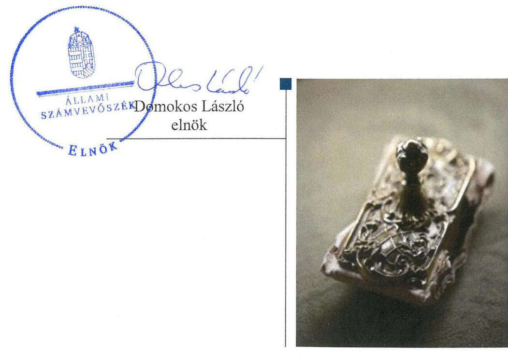

# Jelentés 

## Önkormányzatok ellenőrzése

Integritás- és belső kontrollrendszer, Befektetési tevékenységek ellenőrzése Fehérvárcsurgó Községi Önkormányzat 2019. 06. hó 25. nap

---

# AZ ELLENŐRZÉST FELÜGYELTE:

DR. BENEDEK MÁRIA felügyeleti vezető

## AZ ELLENŐRZÉST VEZETTE ÉS A VÉGREHAJTÁSÁÉRT FELELŐS:

PETRÓ KATALIN ellenőrzésvezető

A PROGRAM ÖSSZEÁLLÍTÁSÁÉRT FELELŐS:

TÓTPÁL SZABOLCS osztályvezető

IKTATÓSZÁM: EL-0809-041/2019.

TÉMASZÁM: 2485

ELLENŐRZÉS-AZONOSÍTÓ SZÁM: V082911

Jelentéseink az Országgyűlés számítógépes hálózatán és az Interneten a www.asz.hu címen is olvashatóak.

---

# TARTALOMJEGYZÉK 

■ ÖSSZEGZÉS ..... 5
■ AZ ELLENŐRZÉS CÉLJA ..... 6
■ AZ ELLENŐRZÉS TERÜLETE ..... 7
■ AZ ELLENŐRZÉS HÁTTERE, INDOKOLTSÁGA ..... 8
■ A JELENTÉS LÉNYEGES KÉRDÉSKÖREI ..... 9
■ AZ ELLENŐRZÉS HATÓKÖRE ÉS MÓDSZEREI ..... 10
■ MEGÁLLAPÍTÁSOK ..... 13
■ JAVASLATOK ..... 18
■ MELLÉKLETEK ..... 23
I. sz. melléklet: Értelmező szótár ..... 23
■ FÜGGELÉKEK ..... 25
I. sz. függelék a jelentéshez ..... 25
II. sz. függelék: Észrevételek ..... 26
■ RÖVIDÍTÉSEK JEGYZÉKE ..... 27

---

.

---

# ÖSSZEGZÉS 

Fehérvárcsurgó Községi Önkormányzat belső kontrollrendszere nem biztosította a közpénzekkel történő elszámoltatható, átlátható és szabályszerű gazdálkodást és a befektetési tevékenység szabályszerű végzését. Beszámolói a befektetett vagyonáról nem nyújtottak megbízható és valós képet. Az integritás kontrollrendszerét nem építette ki, az integritás alapú működést nem biztosította.

## Az ellenőrzés társadalmi indokoltsága

Az ÁSZ az ÁSZ törvényben kapott felhatalmazással élve ellenőrzi az önkormányzatok gazdálkodását, működését, hogy az ellenőrzések megállapításaival támogassa az ellenőrzött önkormányzatok szabályszerű gazdálkodását, javaslataival elősegítse az Alaptörvényben megfogalmazott alapvetések érvényesülését a mindennapi életben az önkormányzatok szintjén. Az önkormányzati rendszerben zajló folyamatok holisztikus elemzései, a kockázatok folyamatos figyelemmel kísérésének módszerével, az így kiválasztott önkormányzatok célzott, hatékony ellenőrzéseivel az ÁSZ betölti a legfőbb gazdasági ellenőrző szerv küldetését. Az egyes ellenőrzések megállapításaival és egy időszak ellenőrzési eredményeinek elemzésével az ÁSZ ráirányíthatja a jogalkotók figyelmét az önkormányzati alrendszerben esetlegesen felmerülő pénzügyi, szabályozási feszültségekre. Az elvégzett nagyszámú ellenőrzés során az ÁSZ „jó gyakorlatokat" is azonosíthat, melyeket tanácsadó funkciója keretében szélesebb körben is megismertethet az érintettekkel, ezáltal is hozzájárulva az önkormányzati alrendszer szabályozott, átlátható, kiegyensúlyozott és fenntartható működéséhez.

## Főbb megállapítások, következtetések, javaslatok

Fehérvárcsurgó Községi Önkormányzat belső kontrollrendszerének nem szabályszerű kialakítása és működtetése a közpénzekkel való felelős, rendeltetésszerű gazdálkodást nem biztosította.

A jegyző nem alakított ki integrált kockázatkezelési rendszert, az információs és kommunikációs rendszer, valamint a belső ellenőrzés működtetése nem volt szabályszerű, így azok nem biztosították a közpénzfelhasználás szabályosságát és átláthatóságát.

A 2013-2017. években a kiépített kontrollrendszer nem biztosította a befektetési tevékenység szabályszerű végzését. A jegyző nem készítette el Fehérvárcsurgó Községi Önkormányzat Közös Hivatala számlarendjét 2015. január 31-ig, valamint a számviteli politikát és a számviteli politika keretében elkészítendő eszközök és források leltárkészítési és leltározási szabályzatát, a pénzkezelési szabályzatot és a források értékelési szabályzatot 2016. december 31-ig. Az egyes befektetések részletező nyilvántartásának nem a jogszabályi előírások szerinti vezetése, valamint a befektetett pénzügyi eszközök és értékpapírok mérlegsorok leltári alátámasztottsága hiányában Fehérvárcsurgó Községi Önkormányzat beszámolója az önkormányzat vagyonáról nem nyújtott megbízható és valós összképet.

Fehérvárcsurgó Községi Önkormányzatnál az integritás kontrollrendszer kiépítésének, továbbá a kockázatelemzésnek a hiánya miatt a működés során az integritás szemlélet nem érvényesült.

Az ÁSZ az ellenőrzés megállapításai alapján Fehérvárcsurgó Községi Önkormányzat polgármesterének négy javaslatot, jegyzőjének 15 javaslatot fogalmazott meg.

---

# AZ ELLENŐRZÉS CÉLJA 

Az ellenőrzés célja annak megállapítása volt, hogy az önkormányzat belső kontrollrendszere biztosította-e a közpénzekkel és a nemzeti vagyonnal történő elszámoltatható, átlátható, szabályszerű, gazdaságos, hatékony és eredményes gazdálkodás feltételeit. Az ellenőrzés keretében az Állami Számvevőszék értékelte továbbá, hogy az önkormányzatnál kiépítették és erősítették-e a korrupciós kockázatok kezelését szolgáló integritás kontrollokat és azt, hogy megteremtették-e a teljesítményellenőrzés feltételeit.

Az ellenőrzés további célja annak értékelése volt, hogy a jogszabályi előírásoknak megfelelően alakították-e ki a belső kontrollrendszert, a kontrollkörnyezet biztosította-e a befektetési tevékenységek szabályszerű végzését. Az Állami Számvevőszék értékelte továbbá, hogy az egyes befektetési tevékenységekkel kapcsolatos döntéshozatal és a döntések végrehajtása, valamint az egyes befektetések számviteli elszámolása, nyilvántartása szabályszerű volt-e, és a belső és külső ellenőrzések támogatták-e az egyes befektetési tevékenységek szabályszerű végzését.

---

# **AZ ELLENŐRZÉS TERÜLETE**

## **Fehérvárcsurgó Községi Önkormányzat**

Fehérvárcsurgó község Fejér megyében, a Móri járásban található. A lakónépesség száma a KSH1 Magyarország közigazgatási helynévkönyve alapján 2017. január 1-jén 1948 fő volt.

Fehérvárcsurgó Községi Önkormányzat hét tagú Képviselő-testületének2 munkáját két állandó bizottság támogatta. A polgármester3 a 2010. évi önkormányzati választások óta tölti be tisztségét. A 2017. évben a jegyző személye változott. A jegyző4 2017. október 31-ig, a jegyző5 2017. november 1-től látta el feladatait.

Fehérvárcsurgó Községi Önkormányzat képviselő-testülete Magyarország Községi Önkormányzat képviselő-testületével 2015. január 1-től létrehozta a Fehérvárcsurgói Közös Önkormányzati Hivatalt, melynek székhelye Fehérvárcsurgó. A Közös Hivatal6 teljes jogkörrel rendelkező, önállóan gazdálkodó költségvetési szerv.

Fehérvárcsurgó Községi Önkormányzat a 2017. évi költségvetésének végrehajtásáról szóló rendelete7 szerint 480,2 M Ft költségvetési bevételt ért el és 306,2 M Ft költségvetési kiadást teljesített. A 2017. december 31-én mérlegfőösszege 1502,1 millió forint Ft, a követelések állománya 27,3 millió forint, a kötelezettségek állománya 29,1 millió forint volt.

Fehérvárcsurgó Községi Önkormányzat a 2017. évi költségvetésének végrehajtásáról szóló rendelete szerint 2017. december 31-én értékpapírral 8833 ezer Ft összértékben, forgatási célú hitelviszonyt megtestesítő értékpapírral 2700 ezer Ft összértékben rendelkezett.

---

# AZ ELLENŐRZÉS HÁTTERE, INDOKOLTSÁGA 

A belső kontrollrendszer kialakítása és működtetése nélkül nem valósítható meg a közpénzek, a közvagyon átlátható, szabályos, gazdaságos, hatékony és eredményes felhasználása. A belső kontrollrendszer azt a célt szolgálja, hogy a költségvetési szervek működésük és gazdálkodásuk során a tevékenységeket szabályszerűen hajtsák végre, teljesítsék elszámolási kötelezettségeiket és megvédjék az erőforrásokat a veszteségektől, a károktól és a nem rendeltetésszerű használattól. A belső kontrollrendszer magában foglalja mindazon elveket, eljárásokat és belső szabályzatokat, melyek biztosítják, hogy a költségvetési szerv valamennyi tevékenysége és célja összhangban legyen a szabályszerűséggel, szabályozottsággal, valamint a gazdaságosság, hatékonyság és eredményesség követelményeivel, az eszközökkel és forrásokkal való gazdálkodásban ne kerüljön sor pazarlásra, visszaélésre, rendeltetésellenes felhasználásra. Megfelelő, pontos és naprakész információk álljanak rendelkezésre a költségvetési szerv működésével kapcsolatosan, és a belső kontrollrendszer harmonizációjára, összehangolására vonatkozó jogszabályok végrehajtásra kerüljenek. Az integritás kontrollok kiépítése, erősítése a szervezet korrupciós kockázatainak kezelését szolgálja. A teljesítménykövetelmények meghatározása és működtetése megalapozhatja az önkormányzatoknál a teljesítményellenőrzés lefolytatását.

Az önkormányzati vagyongazdálkodás keretében az önkormányzatok átmenetileg szabad pénzeszközeinek befektetését jogszabály nem tiltja, a befektetések jellege nem korlátozott, a pénzpiaci szolgáltatók közül az önkormányzatok a kínált szolgáltatás és annak költségei alapján, szabadon választhatnak, azonban a veszteséges gazdálkodás kockázatai és következményei az önkormányzatokat terhelik. A szabad pénzeszközök felhasználása során kiemelten fontos a felelős gazdálkodás érvényesülése, amely összhangban kell, hogy legyen, az önkormányzati gazdálkodás alapelveivel. Az ellenőrzéssel feltárásra kerülhetnek azok a kockázatok, amelyek az önkormányzatok gazdálkodásával, ezen belül befektetési tevékenységeivel, kontrollkörnyezetével kapcsolatosak és a befektetési tevékenységek szabályszerű végrehajtását befolyásolják. Az ellenőrzéssel az önkormányzatok befektetési/vagyongazdálkodási döntései értékelhetővé válnak, és megalapozott megállapítás tehető arra vonatkozóan, hogy milyen hatást gyakoroltak az önkormányzat vagyonára a képviselő-testület döntései.

---

# A JELENTÉS LÉNYEGES KÉRDÉSKÖREI 

1. Az önkormányzat belső kontrollrendszerének kialakítása és működtetése szabályszerű volt-e a 2017. évben?
2. Az önkormányzatnál a befektetési tevékenységek szabályszerű végzését a kiépített kontrollrendszer biztosította-e a 2013-2017. években?
3. Az önkormányzatnál alakítottak-e ki a teljesítmény mérésére alkalmas követelményeket?
4. Az önkormányzat egyes befektetéseivel kapcsolatos döntéshozatala és az egyes befektetések számviteli elszámolása, nyilvántartása szabályszerű volt-e a 2013-2017. években?

---

# AZ ELLENŐRZÉS HATÓKÖRE ÉS MÓDSZEREI 

## Az ellenőrzés típusa

Megfelelőségi és szabályszerűségi ellenőrzés.

## Az ellenőrzött időszak

Az integritás és belső kontrollrendszer ellenőrzött időszaka a 2017. év, illetve az éves költségvetési beszámoló Áht. ${ }^{8}$ által megállapított jóváhagyásáig, 2018. május 31-éig tartó időszak volt.

Az egyes befektetési tevékenységek ellenőrzése tekintetében az ellenőrzött időszak 2013. január 1. - 2017. december 31. közötti időszak, továbbá a 2013. január 1. előtti időszak is, amennyiben a 2017. december 31-én meglévő befektetésekkel kapcsolatos döntéshozatalra a 2013. január 1. előtti időszakban került sor.

## Az ellenőrzés tárgya

Az önkormányzat és a gazdálkodási feladatokat ellátó hivatala belső kontrollrendszerének kialakítása és működtetése, valamint az integritás kontrollok kiépítettsége, a teljesítményellenőrzés feltételei voltak.

Az egyes befektetési tevékenységek ellenőrzésének tárgya az önkormányzat 2017. december 31-én meglévő, a Számv. tv . 3. § (6) bekezdés 2. és 3. pontja szerint az értékpapírokban megtestesülő befektetései, lekötött betétei. Továbbá a 2017. december 31-én meglévő, az önkormányzat szabad pénzeszközei terhére, adásvételi szerződés keretében megszerzett, a kötelező feladatok ellátását nem szolgáló, az önkormányzat üzleti vagyonába tartozó, az ellenőrzött időszakban (2013-2017.) megszerzett ingatlanok; az üzleti vagyon körébe tartozó, befektetési céllal megszerzett, de még használatba nem vett ingatlan beruházások, továbbá az - időkorlátozás nélkül megszerzett - kulturális javak (műtárgyak, műalkotások, stb.), illetve egyéb értéktárgyak (pl. ékszerek, befektetési nemesfém).

## Az ellenőrzött szervezet

Fehérvárcsurgó Községi Önkormányzat

## Az ellenőrzés jogalapja

Az ellenőrzés jogszabályi alapját az ÁSZ tv . 1. § (3) bekezdés, 5. § (2) és (6) bekezdései, valamint az Áht . 61. § (2) bekezdésének előírásai képezik.

---

# Az ellenőrzés módszerei 

Az ÁSZ az ellenőrzést az ellenőrzési program szempontjai, az ellenőrzött időszakban hatályos jogszabályok, az ellenőrzés szakmai szabályai, a jelen ellenőrzésre irányadó ÁSZ módszertanok figyelembevételével végezte.

Az ellenőrzés ideje alatt az ÁSZ az önkormányzattal a kapcsolattartást az ÁSZ SZMSZ ${ }^{6}$-ének vonatkozó előírásai alapján biztosította.

Az ellenőrzési kérdések megválaszolásához szükséges bizonyítékok megszerzése az ellenőrzött által rendelkezésre bocsátott dokumentumokra, adatokra alapozva megfigyelés, szemle (szemrevételezés), kérdésfeltevés (információkérés), mintavételezés, valamint elemző eljárás útján történt.

Az ellenőrzési bizonyítékként felhasználható adatforrások közé tartoztak az ellenőrzési program részletes szempontjainál felsorolt adatforrások, valamint minden egyéb - az ellenőrzés folyamán feltárt, az ellenőrzés szempontjából információt tartalmazó - dokumentum.

Az ellenőrzés lefolytatásához az ellenőrzött szervezet tanúsítványok kitöltésével, valamint az ÁSZ által kért dokumentumok megküldésével szolgáltatott adatokat, amelyek valódiságát és teljes körűségét az ellenőrzött szervezet vezetője által tett teljességi és hitelességi nyilatkozat igazolta. A rendelkezésre bocsátott adatok, információk kontrollja az ellenőrzés keretében történt.
Az önkormányzat belső kontrollrendszere egyes pilléreinek kialakítására és működtetésére vonatkozó értékelés:
$\longrightarrow$ „szabályszerű", amennyiben az értékelt területen az elért „igen" válaszok százalékban kifejezett, egész számra kerekített aránya legalább $85 \%$,
$\longrightarrow$ „nem szabályszerű", ha nem éri el a $85 \%$-ot.
Az önkormányzat belső kontrollrendszerének összesített értékelése az egyes részterületek esetében kapott megfelelőségi arányok számtani átlaga alapján történt és megegyezett a pillérenként (kontrollterületenként) alkalmazott százalékos értékelésekkel, a következő eltérésekkel: a kontrollrendszer egésze esetében a „szabályszerű" értékelésnek a százalékos értéken felül további feltétele volt, hogy egyik kontrollterület sem kaphatott „nem szabályszerű" értékelést.

A 2017. évi kiadások teljesítéséhez kapcsolódó pénzgazdálkodási belső kontrollok működésének szabályszerűsége esetében az ellenőrzés azokra a legnagyobb értékű tételekre - a lényeges sokaságra - terjedt ki, melyek összértéke eléri a teljes sokaság összértékének 50\%-át. A 2017. évi kiadások esetében a lényeges sokaságot tételesen

 ellenőrizte az ÁSZ.

Az önkormányzatok befektetési tevékenységét a szerződéskötés (és a kapcsolódó döntés-előkészítés, döntéshozatal) kivételével a 2013. január 1. és 2017. december 31. közötti időszak vonatkozásában értékelte az ÁSZ. A szerződéskötést az önkormányzat 2017. december 31-én meglévő értékpapírjai és egyéb befektetései vonatkozásában kellett értékelni a befektetési döntés előkészítése és döntéshozatala tekintetében, abban az esetben is, ha az 2013. január 1. előtt történt. Amennyiben a szerződéskötés, illetve

---

a döntések előkészítése a 2013. évet megelőzően történt, akkor értelemszerűen a mindenkor hatályos jogszabályok előírásai alapján kellett az értékelést elvégezni.

---

# 1. Az önkormányzat belső kontrollrendszerének kialakítása és működtetése szabályszerű volt-e a 2017. évben? 

Összegző megállapítás

Az Önkormányzat ${ }^{10}$ belső kontrollrendszerének kialakítása és működtetése nem volt szabályszerű a 2017. évben.

A KONTROLLKÖRNYEZET kialakítása nem volt szabályszerű.
A kontrollkörnyezet kialakításával kapcsolatosan feltárt szabálytalanságokat az 1. táblázat mutatja be.

1. táblázat

## A KONTROLLKÖRNYEZET KIALAKÍTÁSÁVAL KAPCSOLATOSAN FELTÁRT SZABÁLYTALANSÁGOK

Sorszám
Részmegállapítás
Megjegyzés

1. A jegyző a Számv. tv. ${ }^{11} 14$ § (4) bekezdésben foglaltak ellenére a 2017. január 1-jétől hatályos számviteli politikában ${ }^{12}$ nem rögzítette, hogy mit tekint a számviteli elszámolás, az értékelés szempontjából lényegesnek, jelentősnek, nem lényegesnek, nem jelentősnek, kivételes nagyságú vagy előfordulású bevételnek, költségnek, ráfordításnak, továbbá nem határozta meg azt, hogy a törvényben biztosított választási, minősítési lehetőségek közül melyeket, milyen feltételek fennállása esetén alkalmaz, az alkalmazott gyakorlatot milyen okok miatt kell megváltoztatni.
2. A jegyző az Áhsz ${ }^{13}$. 50. § (2) bekezdés b) pontjában foglalt előírások ellenére a 2017. január 1-jétől hatályos eszközök és források értékelési szabályzatában ${ }^{14}$ nem rögzítette követeléstípusonként a kis összegű követelések év végi meghatározásának elveit, dokumentálásának szabályait.
3. A jegyző az Ávr. ${ }^{15}$ 13. § (2) bekezdés b) pontban foglaltak ellenére 2017. december 31-ig belső szabályzatban nem rendezte a beszerzések lebonyolításával kapcsolatos eljárásrendet.
4. A jegyző a Bkr. ${ }^{16}$ 6. § (3) bekezdésben előírtak ellenére 2017. december 31-ig nem készítette el a Közös Hivatal ellenőrzési nyomvonalát.
5. A jegyző a Bkr. 3. § b) pontjában foglaltak ellenére 2017. december 31-ig nem alakított ki - a szervezet minden szintjén érvényesülő - integrált kockázatkezelési rendszert.
6. A jegyző a Bkr. 6. § (4) bekezdésében előírtak ellenére 2017. december 31-ig a szervezeti integritást sértő események kezelésének eljárásrendjét nem szabályozta.

A KONTROLLTEVÉKENYSÉGEK gyakorlása szabályszerű volt. A kötelezettségvállalás és a teljesítésigazolás szabályszerűen történt.

## AZ INFORMÁCIÓS ÉS KOMMUNIKÁCIÓS RENDSZER működtetése nem volt szabályszerű.

Az információs és kommunikációs rendszer működtetése során feltárt szabálytalanságokat a 2. táblázat tartalmazza.

---

2. táblázat

# AZ INFORMÁCIÓS ÉS KOMMUNIKÁCIÓS RENDSZER MŰKÖDTETÉSE SORÁN FELTÁRT SZABÁLYTALANSÁGOK 

| Sorszám | Részmegállapítás | Megjegyzés |
| :--: | :--: | :--: |
| 1. | A jegyző a Ltv. ${ }^{17}$ 10. § (1) bekezdés c) pontjában foglaltak ellenére 2017. december 31-ig a Közös Hivatal számára egyedi iratkezelési szabályzatot - a Magyar Nemzeti Levéltárral és az illetékes kormányhivatallal egyetértésben - nem adott ki. |  |
| 2. | A jegyző az Ávr. 13 § (2) bekezdés h) pontjában foglaltak ellenére 2017. december 31-ig belső szabályzatban nem rendezte a kötelezően közzéteendő adatok nyilvánosságra hozatalának rendjét. |  |
| 3. | A jegyző az az Info. tv. ${ }^{18}$ 30. § (6) bekezdésében foglalt előírások ellenére 2017. december 31-ig nem készített közérdekű adatok megismerésére irányuló igények teljesítésének rendjét rögzítő szabályzatot. |  |

Forrás: ÁSZ

## A MONITORING RENDSZERT AZ ÖNKORMÁNYZAT

A BELSŐ ELLENŐRZÉS útján valósította meg. A belső ellenőrzés működtetése nem volt szabályszerű.

A belső ellenőrzés működtetésével kapcsolatban feltárt szabálytalanságokat az 3. táblázat szemlélteti.
3. táblázat

## A BELSŐ ELLENŐRZÉSSEL KAPCSOLATBAN FELTÁRT SZABÁLYTALANSÁGOK

| Sorszám | Részmegállapítás | Megjegyzés |
| :--: | :--: | :--: |
| 1. | A polgármester a Bkr. 11. § (2a) bekezdésben előírtak ellenére a 2016. évről szóló vezetői nyilatkozatot a 2017. évi zárszámadási rendelet tervezetével együtt nem terjesztette a Képviselő-testület elé. |  |
| 2. | A Képviselő-testület a Bkr. 32. § (4) bekezdésben foglaltak ellenére a Közös Hivatal 2017. évi éves ellenőrzési tervét 2016. december 31-ig nem hagyta jóvá. |  |
| 3. | A jegyző a Bkr. 45. § (4) bekezdésben foglaltak ellenére a 2017. évben az intézkedési terv jóváhagyásáról a belső ellenőrzési vezető véleményének kikérése nélkül döntött. | A belső ellenőrzési vezető az intézkedési tervet nem véleményezte. |
| 4. | A belső ellenőrzési vezető 2017-ben a Bkr. 47. § (1) bekezdésében előírtak ellenére a 2017. évben éves bontásban nem vezetett nyilvántartást, amellyel a belső ellenőrzési jelentésekben tett megállapításokat, javaslatokat, vonatkozó intézkedési terveket, és azok végrehajtását nyomon követi. |  |

Forrás: ÁSZ

A jegyző a Bkr. 1. melléklete szerinti nyilatkozatban értékelte az Önkormányzat belső kontrollrendszerének minőségét. A jegyző az egyes pilléreket szabályszerűnek értékelte, azonban az ÁSZ ellenőrzés megállapításai a kontrolltevékenységek pillér kivételével - nem támasztották alá a nyilatkozatban foglaltakat.

Az Önkormányzat nem építette ki az integritás kontrollrendszerét. A működés során az integritás szemlélet nem érvényesült. A jogszabályok által kötelezően előírt és elő nem írt kontrollokat nem alakította ki. A kontrollok nem támogatták az integritás alapú működést.

---

# 2. Az önkormányzatnál a befektetési tevékenységek szabályszerű végzését a kiépített kontrollrendszer biztosította-e a 2013-2017. években? 

Összegző megállapítás

A befektetési tevékenységek szabályszerű végzését a kiépített kontrollrendszer nem biztosította a 2013-2017. években.

A KIÉPÍTETT KONTROLLRENDSZER a befektetési tevékenységek vonatkozásában nem volt szabályszerű.

A befektetési tevékenységek vonatkozásában a kiépített kontrollrendszerrel kapcsolatosan feltárt szabálytalanságokat az 4. táblázat mutatja be.
4. táblázat

## A BEFEKTETÉSI TEVÉKENYSÉGEK VONATKOZÁSÁBAN A KIÉPÍTETT KONTROLLRENDSZERREL KAPCSOLATOSAN FELTÁRT SZABÁLYTALANSÁGOK

| Sorszám | Részmegállapítás | Megjegyzés |
| :--: | :--: | :--: |
| 1. | A Képviselő-testület a Mótv. ${ }^{19}$ 53. § (1) bekezdésében foglaltak ellenére 2013. január 01. - 2014. február 13. közötti időszakban működésének részletes szabályait szervezeti és működési szabályzatról szóló rendeletben nem határozta meg. | A Képviselő-testület 2014. február 14-től rendelkezett szervezeti és működési szabályzattal ${ }^{20}$. |
| 2. | A jegyző a 2013. január 01. - 2016. december 31. közötti időszakra nem készítette el a Számv. tv. 14. § (3) bekezdéseiben foglaltak ellenére a Közös Hivatal számviteli politikáját. | A Közös Hivatal 2017. január 01-től rendelkezett Számviteli politikával. |
| 3. | A jegyző a 2013. január 01. - 2016. december 31. közötti időszakra nem készítette el a Közös Hivatal számviteli politikája keretében a Számv. tv. 14. § (5) bekezdés a) pontjában foglaltak ellenére az eszközök és a források leltárkészítési és leltározási szabályzatát, a Számv. tv. 14. § (5) bekezdés b) pontjában foglaltak ellenére az eszközök és források értékelési szabályzatát, a Számv. tv. 14. § (5) bekezdés d) pontjában foglaltak ellenére a pénzkezelési szabályzatot. | A Közös Hivatal 2017. január 1-jétől rendelkezett eszközök és a források leltárkészítési és leltározási szabályzattal ${ }^{21}$, eszközök és források értékelési szabályzattal és pénzkezelési szabályzattal ${ }^{22}$. |
| 4. | A jegyző a 2013. január 01. - 2015. január 31. közötti időszakra Számv. tv. 161. § (4) bekezdésben foglaltak ellenére nem gondoskodott a Közös Hivatal számlarendjének összeállításáról. | A Közös Hivatal 2015. február 1-jétől rendelkezett számlarenddel ${ }^{23}$. |
| 5. | A jegyző az Ávr. 13. § (2) bekezdés a) pontjának előírása ellenére 2013. január 01. - 2016. december 31-ig belső szabályzatban nem rendezte a kötelezettségvállalás, ellenjegyzés, teljesítés igazolása, érvényesítés, utalványozás gyakorlásának módjával, eljárási és dokumentációs részletszabályaival, valamint az ezeket végző személyek kijelölésének rendjével -, az ellenőrzési, adatszolgáltatási és beszámolási feladatok teljesítésével kapcsolatos belső előírásokat, feltételeket. | A Közös Hivatal 2017. január 1-jétől rendelkezett az Ávr. 13. § (2) bekezdés a) pontjának előírásait tartalmazó gazdálkodási szabályzattal ${ }^{24}$. |
| 6. | Az Önkormányzat Képviselő-testülete a Mótv. 116. § (5) bekezdésében foglaltak ellenére a 2015-2017 évekre nem rendelkezett gazdasági programmal, fejlesztési tervvel. |  |
| 7. | A jegyző a Bkr. 3. § d) pontjában foglaltak ellenére nem alakította ki a belső kontrollrendszer keretében - a szervezet minden szintjén érvényesülő - információs és kommunikációs rendszert a 2013-2017 években. |  |

A belső ellenőrzés nem támogatta az egyes befektetési tevékenységek szabályszerű végzését. Mivel az Önkormányzatnál 2013. január 1. - 2017. december 31. közötti időszakban a befektetésekkel kapcsolatos tevékenységet a belső ellenőrzés nem ellenőrizte, nem végzett kockázatelemzést, ezáltal befektetési tevékenységet érintő intézkedések nem fogalmazódtak meg.

---

# 3. Az önkormányzatnál alakítottak-e ki a teljesítmény mérésére alkalmas követelményeket? 

## Összegző megállapítás

Az Önkormányzatnál nem alakítottak ki a teljesítmény mérésére alkalmas követelményeket.

A szervezeti célok elérését szolgáló feladatok, folyamatok, tevékenységek mérését szolgáló indikátorokat, mérőszámokat, feladat- és teljesítménymutatókat az Önkormányzat nem képzett, így nem biztosította a teljesítménymérés lehetőségét.

## 4. Az önkormányzat egyes befektetéseivel kapcsolatos döntéshozatala és az egyes befektetések számviteli elszámolása, nyilvántartása szabályszerű volt-e a 2013-2017. években?

## Összegző megállapítás

Az Önkormányzat egyes befektetéseivel kapcsolatos döntéshozatala és a befektetett pénzügyi eszközeinek számviteli elszámolása, nyilvántartása nem volt szabályszerű a 2013-2017. években.

AZ EGYES BEFEKTETÉSEKKEL KAPCSOLATOS DÖNTÉSHOZATAL nem volt szabályszerű a 2013-2017. években.

Az egyes befektetésekkel kapcsolatos döntéshozatal tekintetében feltárt szabálytalanságokat az 5. táblázat mutatja be.
5. táblázat

AZ EGYES BEFEKTETÉSEKKEL KAPCSOLATOS DÖNTÉSHOZATALLAL KAPCSOLATBAN FELTÁRT SZABÁLYTALANSÁGOK

| Sorszám | Részmegállapítás | Megjegyzés |
| :--: | :--: | :--: |
| 1. | A polgármester a Mötv. 68. § (4) bekezdése, valamint az Önkormányzat Képviselőtestületének 2013-2017. évi költségvetéséről szóló rendeleteiben ${ }^{25}$ foglaltak ellenére az értékpapír vásárlásokról, illetve a pénzintézeti pénzlekötésekről szóló döntésekről a képviselő-testületet nem tájékoztatta. | A vonatkozó költségvetési rendeletek értékhatár nélkül utalták a polgármester hatáskörébe a lehetőséget az értékpapír vásárlásokról, illetve pénzlekötésekről. |
| 2. | A jegyző a Bkr. 8. § (2) bekezdés b) pontjában foglaltak ellenére a 2013-2017 években nem biztosította a kontrolltevékenység részeként az egyes befektetésekre vonatkozó szervezeti célok elérését veszélyeztető kockázatok csökkentésére irányuló kontrollok kiépítését, a döntések célszerűségi, gazdaságossági, hatékonysági és eredményességi szempontú megalapozottsága vonatkozásában. |  |

Forrás: ÁSZ

AZ EGYES BEFEKTETÉSEK SZÁMVITELI ELSZÁMOLÁSA, NYILVÁNTARTÁSA nem volt szabályszerű a 2013-2017 években.

Az Önkormányzat befektetett pénzügyi eszközeinek és az értékpapírok számviteli elszámolása, nyilvántartása során feltárt hiányosságokat a 6. táblázat mutatja be.

---

# AZ EGYES BEFEKTETÉSEK SZÁMVITELI ELSZÁMOLÁSÁVAL, NYILVÁNTARTÁSÁVAL KAPCSOLATBAN FELTÁRT SZABÁLYTALANSÁGOK 

| Sorszám | Részmegállapítás | Megjegyzés |
| :--: | :--: | :--: |
| 1. | A jegyző az Áhsz. 1 49. § (1) és az Áhsz. $2^{26}$ 45. § (3) bekezdésekben foglaltak ellenére a 2013-2017. években a tartós hitelviszonyt megtestesítő értékpapírokra és a forgatási célú hitelviszonyt megtestesítő értékpapírokra a beszámoló adatai valóságnak megfelelő, áttekinthető alátámasztásához, illetve a vonatkozó adatszolgáltatási kötelezettségének alátámasztásához a könyvviteli számlák alábontásával vagy a
 könyvviteli számlákhoz kapcsolódó részletező nyilvántartások vezetésével nem gondoskodott. |  |
| 2. | A jegyző a Számv. tv. 69.§ (1) bekezdések előírása ellenére a 2013-2017. években a befektetett pénzügyi eszközökről és értékpapírokról a mérleg tételeinek alátámasztásához nem állított össze olyan leltárt, amely tételesen, ellenőrizhető módon tartalmazza a mérleg fordulónapján meglévő eszközöket és forrásokat mennyiségben és értékben. Így az Önkormányzat beszámolóiban a Számv. tv. 15. § (3) bekezdésében foglalt előírás ellenére nem érvényesült a valódiság elve. |  |

Forrás: ÁSZ

---

# JAVASLATOK 

Az ÁSZ tv. 33. § (1) bekezdésében foglaltak értelmében az ellenőrzött szervezet vezetője köteles a jelentésben foglalt megállapításokhoz kapcsolódó intézkedési tervet összeállítani és azt a jelentés kézhezvételétől számított 30 napon belül az ÁSZ részére megküldeni. Amennyiben az ellenőrzött szervezet vezetője nem küldi meg határidőben az intézkedési tervet, vagy továbbra sem elfogadható intézkedési tervet küld, az Állami Számvevőszék elnöke az ÁSZ tv. 33. § (3) bekezdése a) és b) pontjaiban foglaltakat érvényesítheti.

## a polgármesternek:

1. Intézkedjen az Állami Számvevőszék ellenőrzése során feltárt hiányosságok és/vagy szabálytalanságok tekintetében a munkajogi felelősség tisztázására irányuló eljárás megindításáról, és ennek eredménye ismeretében tegye meg a szükséges intézkedéseket.
(1. táblázat 1-6. sz., 2. táblázat 1-3. sz., 3. táblázat 3. sz., 4. táblázat 7. sz., 5. táblázat 2. sz., 6. táblázat 1-2. sz. megállapításai alapján)
2. Terjessze a Bkr. előírásai szerint a vezetői nyilatkozatot a zárszámadási rendelet tervezetével együtt a Képviselő-testület elé.
(3. táblázat 1. sz. megállapítás alapján)
3. Gondoskodjon a Bkr. előírásának megfelelően, hogy a Közös Hivatal éves ellenőrzési tervét a Képviselő-testület a tárgyévet megelőző év december 31-ig hagyja jóvá.
(3. táblázat 2. sz. megállapítás alapján)
4. Az Mötv-ben, valamint az önkormányzati rendeletben előírtaknak megfelelően az értékpapír vásárlásokról, illetve a pénzintézeti pénzlekötésekről hozott döntéseiről, a megtett intézkedésekről tájékoztassa a képviselő-testületet.
(5. táblázat 1. sz. megállapítás alapján)

---

# a jegyzőnek: 

1. Intézkedjen a számviteli politikában a Számv. tv. előírásának megfelelően annak írásban történő rögzítéséről, hogy mit tekint a számviteli elszámolás, az értékelés szempontjából lényegesnek, jelentősnek, nem lényegesnek, nem jelentősnek, kivételes nagyságú vagy előfordulású bevételnek, költségnek, ráfordításnak, továbbá határozza meg azt, hogy a törvényben biztosított választási, minősítési lehetőségek közül melyeket, milyen feltételek fennállása esetén alkalmaz, valamint hogy az alkalmazott gyakorlatot milyen okok miatt kell megváltoztatni.
(1. táblázat 1. sz. megállapítás alapján)
2. Intézkedjen az Áhsz. előírásának megfelelően az Eszközök és források értékelési szabályzatában követeléstípusonként a kis összegű követelések év végi meghatározásának elvei, dokumentálásának szabályai rögzítéséről.
(1. táblázat 2. sz. megállapítás alapján)
3. Intézkedjen az Ávr. előírásának megfelelően a beszerzések lebonyolításával kapcsolatos eljárásrend belső szabályzatban történő rendezéséről.
(1. táblázat 3. sz. megállapítás alapján)
4. Intézkedjen a Bkr előírásának megfelelően a Közös Hivatal ellenőrzési nyomvonalának elkészítéséről.
(1. táblázat 4. sz. megállapítás alapján)
5. Alakítsa ki a Bkr. előírásainak megfelelően a belső kontrollrendszer keretében a szervezet minden szintjén érvényesülő integrált kockázatkezelési rendszert.
(1. táblázat 5. sz. megállapítás alapján)
6. Intézkedjen a Bkr előírásának megfelelően a szervezeti integritást sértő események kezelésének eljárásrendje szabályzatban történő rendezéséről.
(1. táblázat 6. sz. megállapítás alapján)
7. Intézkedjen a Közös Hivatal számára egyedi iratkezelési szabályzat Ltv. előírásának megfelelő – a Magyar Nemzeti Levéltárral és a megyei kormányhivatallal egyetértésben történő – kiadásáról.
(2. táblázat 1. sz. megállapítás alapján)

---

8. Rendezze az Ávr. előírásának megfelelően belső szabályzatban a kötelezően közzéteendő adatok nyilvánosságra hozatalának rendjét.
(2. táblázat 2. sz. megállapítás alapján)
9. Intézkedjen az Info tv. előírásának megfelelően a közérdekű adatok megismerésére irányuló igények teljesítésének rendjét rögzítő szabályzat elkészítéséről.
(2. táblázat 3. sz. megállapítás alapján)
10. A Bkr. előírásának megfelelően az intézkedési terv jóváhagyásáról a belső ellenőrzési vezető véleményének kikérésével döntsön.
(3. táblázat 3. sz. megállapítás alapján)
11. Gondoskodjon arról, hogy a Bkr. előírásának megfelelően a belső ellenőrzési vezető éves bontásban nyilvántartást vezessen, amellyel a belső ellenőrzési jelentésekben tett megállapításokat, javaslatokat, a vonatkozó intézkedési terveket és azok végrehajtását nyomon követi.
(3. táblázat 4. sz. megállapítás alapján)
12. Alakítsa ki a Bkr. előírásainak megfelelően a belső kontrollrendszer keretében a szervezet minden szintjén érvényesülő információs és kommunikációs rendszert.
(4. táblázat 7. sz. megállapítás alapján)
13. Biztosítsa a Bkr. előírásának megfelelően a kontrolltevékenység részeként az egyes befektetésekre vonatkozó szervezeti célok elérését veszélyeztető kockázatok csökkentésére irányuló kontrollok kiépítését, a döntések célszerűségi, gazdaságossági, hatékonysági és eredményességi szempontú megalapozottsága vonatkozásában.
(5. táblázat 2. sz. megállapítás alapján)
14. Intézkedjen az Áhsz. előírásának megfelelően a tartós, továbbá a forgatási célú hitelviszonyt megtestesítő értékpapírok vonatkozásában az adatszolgáltatási kötelezettségek alátámasztásáról a könyvviteli számlák alábontásával vagy a könyvviteli számlákhoz kapcsolódó részletező nyilvántartások vezetésével.
(6. táblázat 1. sz. megállapítás alapján)

---

15. Intézkedjen a Számv. tv. előírásának megfelelően a befektetett pénzügyi eszközök és értékpapírok mérleg tételeinek alátámasztásához olyan leltár összeállításáról, amely tételesen, ellenőrizhető módon tartalmazza a mérleg fordulónapján meglévő eszközöket és forrásokat mennyiségben és értékben.
(6. táblázat 2. sz. megállapítás alapján)

---

.

---

# MELLÉKLETEK 

- I. SZ. MELLÉKLET: ÉRTELMEZŐ SZÓTÁR
belső ellenőrzés
belső kontrollrendszer
belső kontrollrendszer területei
betét
betétszerződés
értékpapírszámla
folyószámla-szerződés
forgatási célú értékpapír
hitelviszonyt megtestesítő értékpapír
információs és kommunikációs rendszer

Független, tárgyilagos bizonyosságot adó és tanácsadó tevékenység, amelynek célja, hogy az ellenőrzött szervezet működését fejlessze és eredményességét növelje, az ellenőrzött szervezet céljai elérése érdekében rendszerszemléletű megközelítéssel és módszeresen értékeli, illetve fejleszti az ellenőrzött szervezet irányítási és belső kontrollrendszerének hatékonyságát. (Forrás: Bkr. 2. § b) pontja)
A belső kontrollrendszer a kockázatok kezelése és tárgyilagos bizonyosság megszerzése érdekében kialakított folyamatrendszer, amely azt a célt szolgálja, hogy a működés és gazdálkodás során a tevékenységeket szabályszerűen, gazdaságosan, hatékonyan, eredményesen hajtsák végre, az elszámolási kötelezettségeket teljesítsék, megvédjék az erőforrásokat a veszteségektől, károktól és nem rendeltetésszerű használattól. (Forrás: Áht. 69. § (1) bekezdése)
A kontrollkörnyezet, az integrált kockázatkezelési rendszer, a kontrolltevékenységek, az információs és kommunikációs rendszer, valamint a nyomon követési (monitoring) rendszer. (Forrás: Bkr. 3. §-a)
a Ptk. szerinti betétszerződés vagy a takarékbetétről szóló 1989. évi 2. törvényerejű rendelet szerinti takarékbetét-szerződés alapján fennálló tartozás, ideértve a hitelintézetnél a fizetésiszámla-szerződés alapján fennálló pozitív számlaegyenleget is (Hpt. 6. § (1) bekezdés 8. pont)
betétszerződés alapján a betétes jogosult a bank számára meghatározott pénzösszeget fizetni, a bank köteles a betétes által felajánlott pénzösszeget elfogadni, ugyanakkora pénzösszeget későbbi időpontban visszafizetni, valamint kamatot fizetni (Ptk. 6:390. § (1) bekezdés)
a dematerializált értékpapírról és a hozzá kapcsolódó jogokról az értékpapír-tulajdonos javára vezetett nyilvántartás (Tpt. 5. § (1) bekezdés 46. pont)
olyan szerződés, amely alapján a felek meghatározott jogviszonyból származó, beszámítható követeléseiknek egységes számlán való nyilvántartására és elszámolására kötelesek (Ptk. 6:391. § (1) bekezdés)
azok az értékpapírok, amelyeket forgatási célból, kamatbevétel, illetve árfolyamnyereség elérése érdekében szereztek be, továbbá azokat, amelyek a tárgyévet követő üzleti évben lejárnak (Számv. tv. 30. § (5) bekezdés)
minden olyan értékpapír, illetve törvény által értékpapírnak minősített, jogot megtestesítő okirat, amelyben a kibocsátó (adós) meghatározott pénzösszeg rendelkezésére bocsátását elismerve arra kötelezi magát, hogy a pénz (kölcsön) összegét, valamint annak meghatározott módon számított kamatát vagy egyéb hozamát, és az általa esetleg vállalt egyéb szolgáltatásokat az értékpapír birtokosának (a hitelezőnek) a megjelölt időben és módon megfizeti, illetve teljesíti. Ide tartozik különösen: a kötvény, a kincstárjegy, a letéti jegy, a pénztárjegy, a célrész-jegy, a takaréklevél, a jelzáloglevél, a hajóraklevél, a közraktár-jegy, az árujegy, a zálogjegy, a kárpótlási jegy, a határozott idejű befektetési alap által kibocsátott befektetési jegy (Számv. tv. (6) bekezdés 2. pont)
A költségvetési szerv vezetője által kialakított és működtetett olyan rendszer, mely biztosítja, hogy a megfelelő információk a megfelelő időben eljutnak az illetékes szervezethez, szervezeti egységhez, illetve személyhez. (Forrás: Bkr. 9. § (1) bekezdés)

---

integrált kockázatkezelési rendszer
integritás
kamat
kockázat
kontrollkörnyezet
kontrolltevékenységek
kommunikáció
monitoring
monitoring-rendszer
önkormányzati hivatal
tartós hitelviszonyt megtestesítő értékpapír
ügyfélszámla

Olyan folyamatalapú kockázatkezelési rendszer, amely a szervezet minden tevékenységére kiterjed, egységes módszertan és eljárások alkalmazásával, a szervezet célkitűzéseinek és értékeinek figyelembevételével biztosítja a szervezet kockázatainak teljes körű azonosítását, azok meghatározott kritériumok szerinti értékelését, valamint a kockázatok kezelésére vonatkozó intézkedési terv elkészítését és az abban foglaltak nyomon követését. (Forrás: Bkr. 2. § m) pontja, 2016. október 1-jétől)
Az integritás az elvek, értékek, cselekvések, módszerek, intézkedések konzisztenciáját jelenti, vagyis olyan magatartásmódot, amely meghatározott értékeknek megfelel. (Forrás: Nemzetgazdasági Minisztérium: Magyarországi államháztartási belső kontroll standardok Útmutató 1.6.1. pontja, 2012. december)
az adós által a kölcsönnyújtónak (betételhelyezőnek) az elfogadott betét vagy az igénybe vett kölcsön használatáért, kockázatáért fizetendő, a betét- vagy kölcsönösszeg százalékában meghatározott, időarányosan térítendő (elszámolandó) pénzösszeg vagy egyéb hozadék (Hpt. 6. § (1) bekezdés 52. pont)
A kockázat annak a valószínűségét jelenti, hogy egy vagy több esemény vagy intézkedés nem kívánt módon befolyásolja a rendszer működését, céljainak megvalósulását. (Forrás: Javaslatok a korrupciós kockázatok kezelésére - Kockázatkezelési és ellenőrzési módszertan 35. oldal, ÁSZ)
A költségvetési szerv vezetője által kialakított olyan elvek, eljárások, belső szabályzatok összessége, amelyben világos a szervezeti struktúra, a folyamatok átláthatók, egyértelműek a felelősségi, hatásköri viszonyok és feladatok, meghatározottak, ismertek és elfogadottak az etikai elvárások a szervezet minden szintjén, átlátható a humánerőforrás-kezelés, biztosított a szervezeti célok és értékek irányában való elkötelezettség fejlesztése és elősegítése. (Forrás: Bkr. 6. § (1) bekezdés)
A költségvetési szerv vezetője által a szervezeten belül kialakított (kontroll) tevékenységek, melyek biztosítják a kockázatok kezelését, hozzájárulnak a szervezet céljainak eléréséhez és erősítik a szervezet integritását. (Forrás: Bkr. 8. § (1) bekezdés)
Az a tevékenység, melynek során információ továbbítása valósul meg. A kommunikációs folyamat résztvevői között tájékoztatás történik, mely során tényeket, ezek magyarázatát közlik.
A monitoring általánosságban a különböző szintű szervezeti célok megvalósításának folyamatát kíséri figyelemmel, melynek során a releváns eseményekről és tevékenységekről (együtt: folyamatokról) rendszeres jelleggel, strukturált, döntéstámogató információkhoz jutnak a szervezet vezetői. (Forrás: NGM Útmutató a költségvetési szervek monitoring rendszeréhez 2011. november)
A költségvetési szerv vezetője köteles kialakítani a szervezet tevékenységének a célok megvalósításának nyomon követését biztosító rendszert, amely az operatív tevékenységek keretében megvalósuló folyamatos és eseti nyomon követésből, valamint az operatív tevékenységektől függetlenül működő belső ellenőrzésből állhat. (Forrás: Bkr. 10. §)
A polgármesteri hivatal, a főpolgármesteri hivatal, a megyei önkormányzati hivatal és a közös önkormányzati hivatal. (Forrás: Áht. 1. § 18. pont)
tartós hitelviszonyt megtestesítő értékpapírként azokat a befektetési céllal beszerzett értékpapírokat kell kimutatni, amelyek lejárata, beváltása a tárgyévet követő üzleti évben még nem esedékes, és a vállalkozó azokat a tárgyévet követő üzleti évben nem szándékozik értékesíteni (Számv. tv. 27. § (7) bekezdés)
az ügyfél pénzeszközeinek nyilvántartására szolgáló, befektetési vállalkozás, hitelintézet, árutőzsdei szolgáltató, befektetési alapkezelő által vezetett számla (Tpt. 5. § (1) bekezdés 130. pont)

---

# FÜGGELÉKEK 

- I. SZ. FÜGGELÉK A JELENTÉSHEZ

Az Állami Számvevőszék az ellenőrzések során feltárt tényekhez kapcsolódó további körülmények tisztázására eszközrendszerrel nem rendelkezik. Amennyiben az ellenőrzésen túlmutatóan indokoltnak látszik az ellenőrzés során feltárt körülmények további vizsgálata, az Állami Számvevőszék törvényi felhatalmazás alapján az ellenőrzés által feltárt körülményeket továbbítja a hatáskörrel rendelkező szervnek
 a szükséges intézkedések megtétele, eljárások lefolytatása érdekében.
Az Önkormányzat tartós hitelviszonyt megtestesítő értékpapírokat tartott nyilván 2013-ban 24 millió forint, 2014-ben 25 millió forint, 2015-ben 22 millió forint, 2016-ban 52 millió forint, 2017-ben 9 millió forint értékben. Forgatási célú hitelviszonyt megtestesítő értékpapírral 2700 ezer Ft összértékben rendelkezett 2017. december 31-én.
I. A jegyző a Számv. tv. 69.§ (1) bekezdések előírásai ellenére a 2013-2017. években a tartós hitelviszonyt megtestesítő értékpapírok és a 2017. évben a forgatási célú, hitelviszonyt megtestesítő értékpapírok mérlegsor tételeinek alátámasztásához nem állított össze olyan leltárt, mely az eszközöket tételesen, ellenőrizhető módon tartalmazza.
II. A jegyző az Áhsz. ${ }_{1}$ 49. § (1) és az Áhsz. ${ }_{2}$ 45. § (3) bekezdésekben foglaltak ellenére a 2013-2017. években a tartós hitelviszonyt megtestesítő értékpapírokra és a forgatási célú hitelviszonyt megtestesítő értékpapírokra vonatkozó adatszolgáltatási kötelezettségének alátámasztásáról a könyvviteli számlák alábontásával vagy a könyvviteli számlákhoz kapcsolódó részletező nyilvántartások vezetésével nem gondoskodott.
A leltári alátámasztottság és a nyilvántartások vezetése hiányában az Önkormányzat beszámolóiban a Számv. tv. 15. § (3) bekezdésében foglalt előírás ellenére nem érvényesült a valódiság elve és nem igazolt, hogy az Önkormányzat beszámolói megbízható és valós összképet mutatnak az önkormányzat vagyonáról.
Az eset konkrét körülményeinek felderítésére a Magyar Államkincstár rendelkezik hatáskörrel.

---

A jelentéstervezetet a Számvevőszék 15 napos észrevételezésre megküldte az ellenőrzött szervezet vezetőjének az ÁSZ tv. 29. § (1) bekezdése előírásának megfelelően.

Fehérvárcsurgó Községi Önkormányzat polgármestere a jelentéstervezet megállapításaira nem tett észrevételt.

[^0]
[^0]:    * 29. § (1) Az Állami Számvevőszék az ellenőrzési megállapításait megküldi az ellenőrzött szervezet vezetőjének vagy az általa megbízott személynek, és annak, akinek személyes felelősségét állapította meg.
    (2) Az ellenőrzött szervezet vezetője és a felelősként megjelölt személy az ellenőrzés megállapításaira tizenöt napon belül írásban észrevételt tehet.
    (3) Az Állami Számvevőszék az észrevételre a beérkezésétől számított harminc napon belül írásban válaszol. A figyelembe nem vett észrevételeket köteles a jelentésben feltüntetni, és megindokolni, hogy azokat miért nem fogadta el.

---

# RÖVIDÍTÉSEK JEGYZÉKE 

${ }^{1}$ KSH
${ }^{2}$ Képviselő-testület
${ }^{3}$ polgármester
${ }^{4}$ jegyző ${ }_{1}$
${ }^{5}$ jegyző ${ }_{2}$
${ }^{6}$ Közös Hivatal
${ }^{7}$ 2017. évi költségvetésének végrehajtásáról szóló rendelet
${ }^{8}$ Áht.
${ }^{9}$ ÁSZ SZMSZ
${ }^{10}$ Önkormányzat
${ }^{11}$ Számv. tv.
${ }^{12}$ Számviteli politika
${ }^{13}$ Áhsz.
${ }^{14}$ eszközök és források értékelési szabályzata
${ }^{15}$ Ávr.
${ }^{16}$ Bkr.
${ }^{17}$ Ltv.
${ }^{18}$ Info tv.
${ }^{19}$ Mötv.
${ }^{20}$ szervezeti és működési szabályzat
${ }^{21}$ eszközök és a források leltárkészítési és leltározási szabályzata
${ }^{22}$ pénzkezelési szabályzat
${ }^{23}$ számlarend
${ }^{24}$ gazdálkodási szabályzat

Központi Statisztikai Hivatal
Fehérvárcsurgó Községi Önkormányzat Képviselő-testülete
Fehérvárcsurgó Községi Önkormányzat polgármestere
Fehérvárcsurgó Községi Önkormányzat jegyzője (2017. október 31-ig)
Fehérvárcsurgó Községi Önkormányzat jegyzője (2017. november 1-től)
Fehérvárcsurgó Községi Önkormányzat képviselő-testülete és Magyaralmás
Községi Önkormányzat képviselő-testülete által létrehozott közös önkormányzati
hivatalként működő polgármesteri hivatal
Fehérvárcsurgó Község Önkormányzat Képviselő-testülete 6/2018 (V. 30.) önkormányzati rendelete az Önkormányzat 2017. évi költségvetésének végrehajtásáról
2011. évi CXCV. törvény - az államháztartásról (hatályos 2012. január 1-jétől)

Állami Számvevőszék Szervezeti és Működési Szabályzata
Fehérvárcsurgó Községi Önkormányzat
2000. évi C. törvény a számvitelről

Fehérvárcsurgó Közös Önkormányzati Hivatal Számviteli politikája (hatályos 2017. január 01-től)
4/2013. (I. 11.) Korm. rendelet az államháztartás számviteléről
Fehérvárcsurgó Közös Önkormányzati Hivatal eszközök és források értékelési szabályzata (hatályos 2017. január 01-től)
368/2011. (XII. 31.) Korm. rendelet az államháztartásról szóló törvény végrehajtásáról
a költségvetési szervek belső kontrollrendszeréről és belső ellenőrzéséről szóló 370/2011. (XII. 31.) Korm. rendelet
1995. évi LXVI. törvény a közokiratokról, a közlevéltárakról és a magánlevéltári anyag védelméről (hatályos 1996. január 1-jétől)
2011. évi CXII. törvény az információs önrendelkezési jogról és az információszabadságról
2011. évi CLXXXIX. törvény Magyarország helyi önkormányzatairól (hatályos 2012. január 1-jétől)
Fehérvárcsurgó Községi Önkormányzat Képviselő-testülete Az Önkormányzat Szervezeti és Működési Szabályzatáról szóló 2/2014. (II.13.) önkormányzati rendelete a képviselő-testület szervezeti és működési szabályzatáról

Fehérvárcsurgó Közös Önkormányzati Hivatal eszközök és a források leltárkészítési és leltározási szabályzata (hatályos 2017. január 01-től) Fehérvárcsurgó Közös Önkormányzati Hivatal pénzkezelési szabályzata (hatályos 2017. január 01-től)
Fehérvárcsurgó Közös Önkormányzati Hivatal Számlarend (hatályos 2015. február 1-től)
Fehérvárcsurgó Közös Önkormányzati Hivatal gazdálkodási szabályzata (hatályos 2017. január 1-től)

---

${ }^{25}$ költségvetéséről szóló rendeletek
${ }^{26}$ Áhsz. 1,2

Fehérvárcsurgó Községi Önkormányzat Képviselő-testülete 3/A/2013.(III.1.), 3/2014.(II.13.), 3/2015.(III.13.), 3/2016.(III.11.), 3/2017.(II.14.) önkormányzati rendelete a vonatkozó éves költségvetésről
249/2000. (XII. 24.) Korm. rendelet - az államháztartás szervezetei beszámolási és könyvvezetési kötelezettségének sajátosságairól (hatályos 2013. december 31-ig), 4/2013. (I. 11.) Korm. rendelet az államháztartás számviteléről (hatályos 2014. január 1-jétől)

---

ÁLLAMI SZÁMVEVŐSZÉK
1052 Budapest, Apáczai Csere János utca 10.
Levélcím: 1364 Budapest 4. Pf. 54
Telefon: +36 14849100 Telefax: +36 14849200
www.asz.hu
