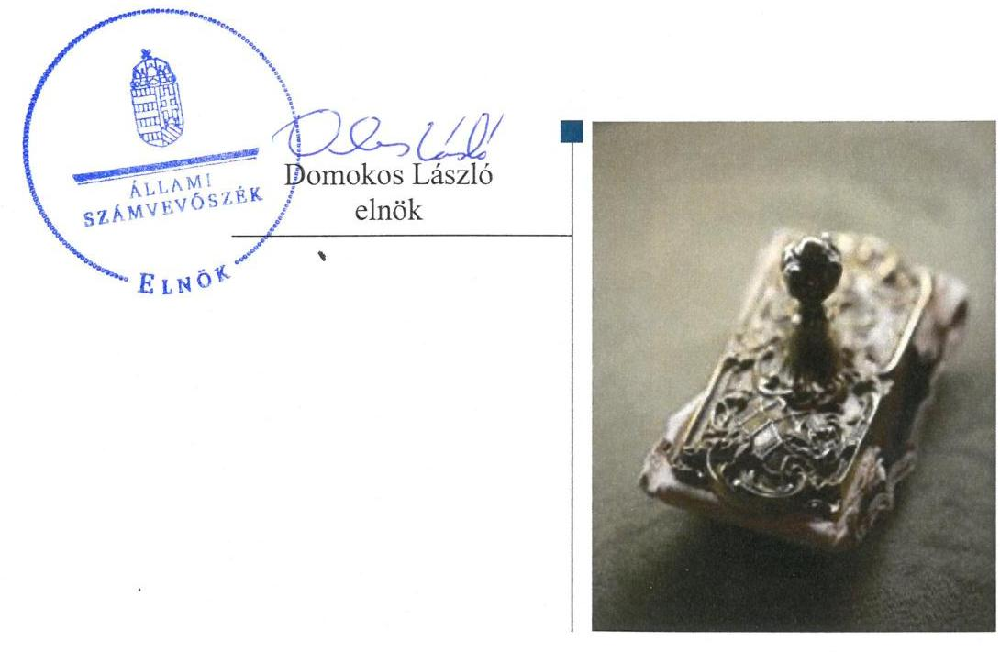

# Jelentés 

## Nemzeti tulajdonú gazdasági társaságok ellenőrzése

Szentes Városellátó Nonprofit Korlátolt Felelősségű Társaság
2019.

---

# Jelenctés 

## Nemzeti tulajdonú gazdasági társaságok ellenőrzése

Szentes Városellátó Nonprofit Korlátolt Felelősségű Társaság
2019. 06. hó 20. nap

---

# AZ ELLENŐRZÉST FELÜGYELTE:

- KAKAS SÁNDOR felügyeleti vezető
- AZ ELLENŐRZÉST VEZETTE ÉS A VÉGREHAJTÁSÁÉRT FELELŐS:
  - JOÓ ERIKA ellenőrzésvezető
  - A PROGRAM ÖSSZEÁLLÍTÁSÁÉRT FELELŐS:
    - TÓTPÁL SZABOLCS osztályvezető

**IKTATÓSZÁM:** EL-1579-001/2019

**TÉMASZÁM:** 2478

**ELLENŐRZÉS-AZONOSÍTÓ SZÁM:** V082208

Jelentéseink az Országgyűlés számítógépes hálózatán és az Interneta a www.asz.hu címen is olvashatóak.

---

# TARTALOMJEGYZÉK 

■ ÖSSZEGZÉS ..... 5
■ AZ ELLENŐRZÉS CÉLJA ..... 6
■ AZ ELLENŐRZÉS TERÜLETE ..... 7
■ AZ ELLENŐRZÉS HÁTTERE, INDOKOLTSÁGA ..... 8
■ A JELENTÉS LÉNYEGES KÉRDÉSKÖREI ..... 9
■ AZ ELLENŐRZÉS HATÓKÖRE ÉS MÓDSZEREI ..... 10
■ MEGÁLLAPÍTÁSOK ..... 12
■ JAVASLATOK ..... 14
■ MELLÉKLETEK ..... 17
I. sz. melléklet: Értelmező szótár ..... 17
■ FÜGGELÉKEK ..... 19
I. sz. függelék a jelentéshez ..... 19
II. sz. függelék: Észrevételek ..... 20
■ RÖVIDÍTÉSEK JEGYZÉKE ..... 21

---

.

---

# ÖSSZEGZÉS 

A Szentes Városellátó Nonprofit Korlátolt Felelősségű Társaság felett tulajdonosi jogokat gyakorló Szentes Város Önkormányzata tulajdonosi joggyakorlása nem volt szabályszerű. A Társaságnál nem volt biztositott a vagyonnal való felelős gazdálkodás, a nemzeti vagyon védelme, az átláthatóság és elszámoltathatóság.

## Az ellenőrzés társadalmi indokoltsága

Az Állami Számvevőszék kiemelt célja, hogy a helyi önkormányzatok gazdálkodásában rejlő pénzügyi kockázatok feltárásával, az államháztartáson kívülre nyújtott költségvetési támogatások és ingyenes vagyonjuttatások, valamint az államháztartáson kívül múködő feladat-ellátó rendszerek ellenőrzéseivel hozzájáruljon ahhoz, hogy a közpénzeket az államháztartáson kívül múködő szervezetek is átlátható, rendezett módon használják fel.

Magyarországon az önkormányzatok kötelező és önként vállalt feladataik vonatkozásában is egyre szélesebb körben alkalmazzák a költségvetésen kívüli feladatellátást, ezáltal - a nonprofit szervezetek mellett - az önkormányzati tulajdonú gazdasági társaságok is kiemelt fontosságú szerephez jutottak.

## Főbb megállapítások, következtetések, javaslatok

Szentes Város Önkormányzata tulajdonosi joggyakorlása nem volt szabályszerű, mert a Felügyelőbizottság tagjait nem számoltatta be évente. Az Önkormányzat a jogszabályi és a belső előírások ellenére nem ellenőrizte a Társaságnál a vagyonkezelésbe adott nemzeti vagyonnal való gazdálkodást.

A Szentes Városellátó Nonprofit Korlátolt Felelősségű Társaság a jogszabályi előírások ellenére az éves beszámolók mérlegtételeit leltárral nem támasztotta alá, nem tartotta nyilván a vagyonkezelésbe vett nemzeti vagyont, ennek következtében nem volt biztosított a nemzeti vagyon értékének és állagának védelme, rendeltetésének megfelelő, átlátható, hatékony és költségtakarékos múködtetése, értéknövelő használata, hasznosítása, gyarapítása.

Az Állami Számvevőszék a jelentésben foglalt megállapítások alapján Szentes Város Önkormányzata polgármesterének 4 javaslatot, a Szentes Városellátó Nonprofit Korlátolt Felelősségű Társaság ügyvezetőjének pedig 3 javaslatot fogalmazott meg. A javaslatokat megalapozó megállapításokra az érintetteknek 30 napon belül intézkedési tervet kell készíteniük.

---

# AZ ELLENŐRZÉS CÉLJA 

AZ ELLENŐRZÉS CÉLJA annak megállapítása, hogy a tulajdonosi joggyakorló a gazdasági társaságai feletti tulajdonosi joggyakorlás kereteit kialakította-e, tulajdonosi jogait megfelelően gyakorolta-e és kötelezettségeit teljesítette-e; továbbá annak megállapítása, hogy a gazdasági társaság biztosította-e a vagyon védelmét a nyilvántartások szabályszerű vezetése és a mérleg tételeinek leltárral történő alátámasztása útján, valamint szabályszerűen gondoskodott-e a társaság használatában, kezelésében lévő nemzeti vagyon értékének megőrzéséről, gyarapításáról, hasznosításáról.

---

# **AZ ELLENŐRZÉS TERÜLETE**

## **Szentes Város Önkormányzata; Szentes Városellátó Nonprofit Korlátolt Felelősségű Társaság**

A Társaság 100% önkormányzati tulajdonban álló gazdasági társaság, tulajdonosa Szentes Város Önkormányzata. A Társaságot1 Szentes Város Önkormányzata alapította 3,0 M Ft törzstőkével 2013. május 28-án.

A Társaság fő tevékenysége a hulladékgazdálkodás volt, melyet a Társaság 2017. március 31-ig közszolgáltatóként végzett. A Társaság a hulladékgazdálkodás mellett ellátta a temetők, parkolók, piac, gyepmesteri telep, a csapadékvíz elvezető rendszer, a zöldterületek, az utak, hidak, járdák, valamint egyéb ingatlanok üzemeltetési feladatait. Az Önkormányzat 2014. május 16-án vagyonkezelési szerződést kötött a Társasággal, a vagyonkezelési szerződésben rögzítette az átruházott közfeladatokat, melyek ellátásához a szerződésben felsorolt vagyontárgyakat az Önkormányzat ingyenesen biztosította a Társaság számára.

A Társaság az ellenőrzött időszakban nem tartozott a kormányzati szektorba sorolt gazdasági társaságok közé és nem rendelkezett más gazdasági társaságban tulajdoni részesedéssel. Az Önkormányzat az ellenőrzött időszakban további öt gazdasági társaságban rendelkezett többségi tulajdoni részesedéssel.

Az ügyvezető2 személye az ellenőrzött időszakban 2018. július 1-től változott, a polgármester3 és a jegyző4 személyében nem történt változás.

Az ellenőrzött időszakban a Társaság könyvvizsgálatra kötelezett volt. A könyvvizsgáló személye az ellenőrzött időszakban nem változott.

---

# AZ ELLENŐRZÉS HÁTTERE, INDOKOLTSÁGA 

Az Alaptörvény 38. cikke alapján az állam és a helyi önkormányzatok tulajdona nemzeti vagyon. A nemzeti vagyon megőrzése, megóvása érdekében kiemelten fontos ezen nemzeti tulajdonú gazdasági társaságok ellenőrzése. Gazdálkodásuk jellemzően a közérdeklődés és a média figyelmének középpontjában áll, amihez hozzájárul a gazdálkodásuk körébe tartozó - a nemzeti vagyon részét képező - vagyon nagysága, illetve az általuk ellátott közszolgáltatások minősége és hatékonysága. Ellenőrzéseink feltárhatják, hogy a tulajdonosi felügyelet hozzájárult-e a szabályszerű gazdálkodáshoz és feladatellátáshoz.

Az ellenőrzés eredményeként meghatározhatóvá válnak a szervezet vagyongazdálkodást érintő kockázatai, ezzel lehetővé téve a kockázatok csökkentését. A megállapítások alapján megfogalmazott számvevőszéki javaslatok hasznosítása elősegítheti a meglévő hibák megszüntetését. A jó gyakorlatok bemutatásával az ÁSZ hozzájárulhat a követendő megoldások megismertetéséhez, terjesztéséhez.

---

# A JELENTÉS LÉNYEGES KÉRDÉSKÖREI 

1. A gazdasági társaság feletti tulajdonosi joggyakorlás megfelel-t-e a jogszabályi és belső előírásoknak?
2. A Társaság vagyongazdálkodási tevékenysége szabályszerüvol-e?

---

# AZ ELLENŐRZÉS HATÓKÖRE ÉS MÓDSZEREI 

## Az ellenőrzés típusa

Megfelelőségi ellenőrzés.

## Az ellenőrzött időszak

A tulajdonosi joggyakorlás vonatkozásában az ellenőrzött időszak 2017. január 1-től az ellenőrzés megkezdésének napjáig terjedt ki az éves beszámolók elfogadása és a vagyonkezelésbe adott vagyonnal való gazdálkodás tulajdonosi ellenőrzése kivételével, amelyeknél az ellenőrzött időszak 2015. január 1-től az ellenőrzés megkezdésének napjáig - 2018. szeptember 21-ig - tartott.

A Társaság vagyongazdálkodása vonatkozásában az ellenőrzött időszak 2015. - 2017. évek, a 2017. évi beszámoló jóváhagyása tekintetében 2018. június elsejéig tartó időszak.

## Az ellenőrzés tárgya

Az önkormányzati tulajdonban lévő gazdasági társaság feletti tulajdonosi joggyakorlás kialakítása és működtetése.

Önkormányzati tulajdonban lévő gazdasági társaság vagyongazdálkodása keretében a társaság használatában, kezelésében lévő nemzeti vagyon, illetve a saját vagyon tekintetébe a vagyonnyilvántartások vezetése, leltára. A társaság használatában, vagyonkezelésében lévő nemzeti vagyon tekintetében a vagyon értékének megőrzése, gyarapítása, hasznosítása.

## Az ellenőrzött szervezet

- Szentes Város Önkormányzata;
- Szentes Városellátó Nonprofit Korlátolt Felelősségű Társaság

## Az ellenőrzés jogalapja

Az ellenőrzés jogalapját az ÁSZ tv. ${ }^{5} 1$. § (3) bekezdése és 5. § (3)-(5) bekezdései képezték.

---

# Az ellenőrzés módszerei 

Az ellenőrzést az ellenőrzési program ellenőrzési kérdései, az ellenőrzött időszakban hatályos jogszabályok, az ellenőrzés szakmai szabályok és módszertanok alapján, a nemzetközi standardok figyelembe vételével végeztük.

Az ellenőrzés ideje alatt az ellenőrzött szervezettel történő kapcsolattartást az ÁSZ Szervezeti és Múködési Szabályzatának vonatkozó előírásai alapján biztosítottuk.

Az ellenőrzést a kérdésekre adott válaszok kiértékelésével, valamint a megjelölt adatforrások, a csatolt tanúsítványok felhasználásával, továbbá az adott időszakban hatályos jogszabályok figyelembe vételével folytattuk le.
2017. január 1-től az ellenőrzés megkezdésének napjáig ellenőriztük a tulajdonosi joggyakorlás kereteinek kialakítását, a tulajdonosi joggyakorló tevékenységét a felügyelőbizottság és a független könyvvizsgáló múködéséhez kapcsolódóan, valamint azt, hogy a tulajdonosi joggyakorló - amenynyiben a gazdasági társaság feladatellátásához és vagyonkezeléséhez kapcsolódóan határozott meg követelményeket, elvárásokat - a nemzeti vagyon értékének megőrzése érdekében monitorozta-e azok teljesülését. 2015. január 1-től az ellenőrzés megkezdésének napjáig ellenőriztük a tulajdonosi joggyakorló részvételét az éves beszámoló elfogadására vonatkozó döntéshozatalban, valamint amennyiben adott a társaságainak vagyonkezelésbe nemzeti vagyont, akkor azt, hogy az azzal történő gazdálkodást a tulajdonosi joggyakorló ellenőrizte-e.

A gazdasági társaság vagyongazdálkodása vonatkozásában az ellenőrzött időszak 2015. - 2017. évek, a 2017. évi beszámoló jóváhagyása és közzététele tekintetében 2018. június elsejéig tartó időszak.

A vagyonnyilvántartások és a leltár szabályszerűsége esetében az ellenőrzés azokra a legnagyobb értékű tételekre - a lényeges sokaságra - terjedt ki, melyek összértéke eléri a teljes sokaság összértékének 50\%-át. A 2015. és a 2017. évben a lényeges sokaságot tételesen ellenőriztük.

Az ellenőrzési kérdések megválaszolásához szükséges bizonyítékok megszerzése a Társaság vagyongazdálkodása vonatkozásában a következő ellenőrzési eljárások alkalmazásával történt: megfigyelés, információkérés, összehasonlítás, elemző eljárás. Az ellenőrzési bizonyítékként felhasználható adat-források közé tartoznak az ellenőrzési programban felsorolt adatforrások, továbbá minden - az ellenőrzés folyamán - feltárt, az ellenőrzés szempontjából információkat tartalmazó dokumentum.

---

# 1. A gazdasági társaság feletti tulajdonosi joggyakorlás megfelel-e a jogszabályi és belső előírásoknak? 

## Összegző megállapítás

### 1.1. számú megállapítás

Az Önkormányzat tulajdonosi joggyakorlása nem volt szabályszerű.

A gazdasági társaság feletti tulajdonosi joggyakorlás rendjét az előírásoknak megfelelően kialakították.

Az Önkormányzat a Mötv. ${ }^{6}$ előírásainak megfelelően elkészítette gazdasági programját ${ }^{7}$, amely tartalmazta a Társaság által ellátott feladatokra vonatkozó elképzeléseket. Az önkormányzati vagyon kezelésével kapcsolatos szabályokról a Vagyonrendelet ${ }^{8}$ rendelkezett.

A Társaság legfőbb szerveként a Képviselő-testület a Taktv. ${ }^{9}$ előírásának megfelelően megalkotta a vezető tisztségviselők, a felügyelőbizottsági tagok, az Mt. ${ }^{10}$ 208. §-ának hatálya alá eső munkavállalók javadalmazásáról, valamint a jogviszony megszűnése esetére biztosított juttatások módjának, mértékének elveiről, annak rendszeréről szóló Javadalmazási szabályzatot ${ }^{11}$.

A tulajdonosi joggyakorló a tulajdonosi jogai érvényesítése érdekében a Bkr. ${ }^{12}$ előírásai szerint kialakította a szervezet tevékenységének, a célok megvalósításának nyomon követését biztosító rendszerét.

### 1.2. számú megállapítás

A Társaság feletti tulajdonosi joggyakorlás nem volt szabályszerű.
A Felügyelőbizottság 2015. március 1-jén elkészített Ügyrend ${ }^{13}$-jét a Ptk. ${ }^{14}$ 3:122. § (3) bekezdés előírása ellenére a Társaság legfőbb szerve - a Képviselő-testület - nem hagyta jóvá.

A Felügyelőbizottság a Társaság ügyvezetését, múködését a Ptk. 3:26 § (1) bekezdésében és az Ügyrend 2.7. pontjában előírtak ellenére nem ellenőrizte. A Vagyonrendelet 25. § (2) bekezdés c) pontjában előírtak ellenére a felügyelőbizottsági tagok a Társaságban végzett munkájukról nem számoltak be a Képviselő-testületnek.

Az Önkormányzat a belső szabályozásban előírtak ellenére nem ellenőrizte a vagyonkezelésbe adott nemzeti vagyonnal való gazdálkodást. Az Önkormányzat belső ellenőre a 2017. és a 2018. évben végzett tulajdonosi ellenőrzést a Társaságnál, de a Vagyonrendelet 22. § (1) bekezdésében előírtak ellenére az Önkormányzat a Vagyonkezelési szerződésben meghatározott jogok és kötelezettségek teljesítésének ellenőrzését évente nem végezte el.

---

# 2. A Társaság vagyongazdálkodási tevékenysége szabályszerű volt-e? 

## Összegző megállapítás

A Társaság vagyongazdálkodási tevékenysége nem volt szabályszerű.

A Társaság a 2015., 2016. és 2017. években a vagyonkezelt vagyonhoz kapcsolódó nyilvántartásait a Számv. tv. ${ }^{15}$ 159. §-ában előírtak ellenére nem vezette, a vagyonkezelésbe vett vagyont az éves beszámolók mérlegeiben a Számv. tv. 23. § (2) bekezdés előírása ellenére az eszközök között és a Számv. tv. 42. § (5) bekezdés előírásai ellenére a források között nem mutatta ki. A nyilvántartás hiányában a Társaság nem biztosította a kezelésében lévő nemzeti vagyonnal való elszámoltathatóságának feltételeit.

A leltározási szabályzat ${ }^{16}$ a tárgyi eszközök vonatkozásában a Számv. tv. 69. § (3) bekezdése előírásai ellenére négy éves gyakorisággal írta elő a mennyiségi leltárfelvételt, ebből következően a Társaság nem rendelkezett a Számv. tv. 69. § (3) bekezdés előírásainak megfelelő leltárkészítési és leltározási szabályzattal. A Számv. tv. 69. § (1) bekezdés előírásai ellenére a Társaság nem támasztotta alá leltárral a 2015., 2016. és 2017. évi beszámolók mérlegtételeit, így nem érvényesült a Számv. tv. 15. § (3) bekezdésében foglalt valódiság elve.

---

# JAVASLATOK 

Az ÁSZ tv. 33. § (1) bekezdésében foglaltak értelmében az ellenőrzött szervezet vezetője köteles a jelentésben foglalt megállapításokhoz kapcsolódó intézkedési tervet összeállítani és azt a jelentés kézhezvételétől számított 30 napon belül az ÁSZ részére megküldeni. Amennyiben az ellenőrzött szervezet vezetője nem küldi meg határidőben az intézkedési tervet, vagy továbbra sem elfogadható intézkedési tervet küld, az Állami Számvevőszék elnöke az ÁSZ tv. 33. § (3) bekezdése a) és b) pontjaiban foglaltakat érvényesítheti.

## Szentes Városellátó Nonprofit Korlátolt Felelősségű Társaság ügyvezetőjének

1. Intézkedjen arra, hogy a vagyonkezelésbe vett eszközök az éves beszámoló mérlegében kimutatásra kerüljenek a Számv. tv. előírásai szerint.
(2. összegző megállapítás 1. bekezdése alapján)
2. Gondoskodjon a leltárkészítési és leltározási szabályzat elkészítéséről a jogszabályi előírás szerint.
(2. összegző megállapítás 2. bekezdésének 1. mondata alapján)
3. Gondoskodjon a mérlegben kimutatott eszközök és források szabályszerű leltárral történő alátámasztásáról a jogszabályban előírtak szerint.
(2. összegző megállapítás 2. bekezdésének 2. mondata alapján)

## Szentes Város Önkormányzat polgármesterének

1. Kezdeményezze a Képviselő-testületnél a Felügyelőbizottság ügyrendjének jóváhagyását a jogszabályi előírásnak megfelelően.
(1.2. sz. megállapítás 1. bekezdése alapján)
2. Kezdeményezze a Felügyelőbizottságnál a Társaság ügyvezetésének jogszabályi előírás szerinti ellenőrzését.
(1.2. sz. megállapítás 2. bekezdésének 1. mondata alapján)

---

3. Kezdeményezze, hogy a Felügyelőbizottság tagjai évente számoljanak be a Képviselő-testületnek a Társaságban végzett munkájukról a Vagyonrendelet előirása szerint.
(1.2. sz. megállapítás 2. bekezdésének 2. mondata alapján)
4. Gondoskodjon a Társaságnál a vagyonkezelési szerződésben meghatározott jogok és kötelezettségek teljesitésének évenkénti ellenőrzéséről a Vagyonrendelet elöirása szerint.
(1.2. sz. megállapítás 3. bekezdésének 2. mondata alapján)

---

.

---

# MELLÉKLETEK 

- I. SZ. MELLÉKLET: ÉRTELMEZŐ SZÓTÁR
gazdasági társaság
közszolgáltatás
közfeladat
nemzeti vagyon
nemzeti vagyon hasznosítása
nemzeti vagyon használója
vagyonkezelő

Ptk. 3:88. § (1) bekezdése szerint „a gazdasági társaságok üzletszerű közös gazdasági tevékenység folytatására, a tagok vagyoni hozzájárulásával létrehozott, jogi személyiséggel rendelkező vállalkozások, amelyekben a tagok a nyereségből közösen részesednek, és a veszteséget közösen viselik".
Az Ebktv. ${ }^{17}$ 3. § d) pontja a következőképpen határozza meg a közszolgáltatást: „szerződéskötési kötelezettség alapján a lakosság alapvető szükségleteinek ellátására irányuló szolgáltatás, így különösen a villamos energia-, gáz-, hő-, víz-, szenny-víz- és hulladékkezelési, köztisztasági, postai és táv-közlési szolgáltatás, továbbá a menetrend alapján közlekedő járművekkel végzett közforgalmú személyszállítás".
Az Áht. 3/A. § (1) bekezdése alapján közfeladat a jogszabályban meghatározott állami vagy önkormányzati feladat
Nvtv. 1. § (2) bekezdése szerint nemzeti vagyonba tartozik többek között: „az állam vagy a helyi önkormányzat kizárólagos tulajdonában álló dolgok, az a) pont hatálya alá nem tartozó, állam vagy a helyi önkormányzat tulajdonában lévő dolog,
az állam vagy a helyi önkormányzat tulajdonában lévő pénzügyi eszközök, továbbá az államot vagy a helyi önkormányzatot megillető társasági részesedések, az államot vagy a helyi önkormányzatot megillető bármely vagyoni érték-kel rendelkező jogosultság, amelyet jogszabály vagyoni értékű jogként nevesít
A tulajdonosi joggyakorló vagy a nemzeti vagyon használója által a nemzeti vagyon birtoklásának, használatának, hasznok szedése jogának bármely - a tulajdonjog átruházását nem eredményező - jogcímen történő átengedése, ide nem értve a vagyonkezelésbe adást, valamint a haszonélvezeti jog alapítását.
Forrás: Nvtv. 3. § (1) bekezdés 4. pont
Azon természetes személy, jogi személy vagy jogi személyiséggel nem rendelkező szervezet, aki vagy amely állami vagyon tekintetében törvény vagy szerződés alapján, a helyi önkormányzat vagyona tekintetében törvény, a helyi önkormányzat rendelete vagy szerződés alapján bármely jogcímen nemzeti vagyont birtokol, használ, szedi annak használt, kivéve a tulajdonosi joggyakorló.
Forrás: Nvtv. 3. § (1) bekezdés 11. pont
Aki a nemzeti vagyon felett az államot vagy a helyi önkormányzatot megillető tulajdonosi jogok és kötelezettségek összességének gyakorlására jogosult. (Forrás: Nvtv. 3. § (1) bekezdés 17. pontja)
az állam tulajdonában álló nemzeti vagyon tekintetében:
aa) költségvetési szerv,
ab) helyi önkormányzat, nemzetiségi önkormányzat, valamint ezek társulásai,
ac) az ab) alpontban felsoroltak fenntartása vagy irányítása alá tartozó intézmény, ad) köztestület,
ae) az állam, az aa)-ac) alpontban meghatározott személyek együtt vagy külön-külön 100\%-os tulajdonában álló gazdálkodó szervezet,
af) az ae) alpont szerinti gazdálkodó szervezet 100\%-os tulajdonában álló gazdálkodó szervezet,
ag) a törvény által kijelölt egyedileg meghatározott jogi személy.
b) a helyi önkormányzat tulajdonában álló nemzeti vagyon tekintetében:

---

ba) nemzetiségi önkormányzat, helyi vagy nemzetiségi önkormányzati társulás, valamint ezek fenntartása vagy irányítása alá tartozó intézmény,
bb) költségvetési szerv,
bc) köztestület,
bd) az állam, a helyi önkormányzat, a ba) alpontban meghatározott személyek együtt vagy külön-külön 100\%-os tulajdonában álló gazdálkodó szervezet,
be) a bd) alpont szerinti gazdálkodó szervezet 100\%-os tulajdonában álló gazdálkodó szervezet.
Forrás: Nvtv. 3. § (1) bekezdés 19. pont
vagyonkezelői jog
vagyongazdálkodás

A vagyonkezelő köteles a vagyontárgy állagának megóvásáról, jó karban-tartásáról, működtetéséről gondoskodni, jogszabályban és szerződésben előírt más kötelezettségét teljesíteni, valamint a vagyontárgyat jogszabályban vagy szerződésben meghatározott célnak megfelelően használni. A vagyonkezelő - a központi költségvetési szervek és a kizárólag közfeladatot ellátó nem központi költségvetési szerv vagyonkezelők kivételével - köteles díjat fizetni, jogszabályban és szerződésben előírt más kötelezettségét teljesíteni, valamint a vagyontárgyat jogszabályban vagy szerződésben meghatározott célnak megfelelően használni. Amennyiben a vagyonkezelő ezen kötelezettségeinek nem tesz eleget, a tulajdonosi joggyakorló jogosult a szerződést azonnali hatállyal felmondani.
Forrás: Vtv. 27. § (2), (2a
A nemzeti vagyongazdálkodás feladata a nemzeti vagyon rendeltetésének megfelelő, az állam, az önkormányzat mindenkori teherbíró képességéhez igazodó, elsődlegesen a közfeladatok ellátásához és a mindenkori társadalmi szükségletek kielégítéséhez szükséges, egységes elveken alapuló, átlátható, hatékony és költségtakarékos működtetése, értékének megőrzése, állagának védelme, értéknövelő használata, hasznosítása, gyarapítása, továbbá az állam vagy a helyi önkormányzat feladatának ellátása szempontjából feleslegessé váló vagyontárgyak elidegenítése. (Forrás: Nvtv. 7. § (2) bekezdése).

---

# FÜGGELÉKEK 

- I. SZ. FÜGGELÉK A JELENTÉSHEZ

Az Állami Számvevőszék az ellenőrzések során feltárt tényekhez kapcsolódó további körülmények tisztázására eszközrendszerrel nem rendelkezik. Amennyiben az ellenőrzésen túlmutatóan indokoltnak látszik az ellenőrzés során feltárt körülmények további vizsgálata, az Állami Számvevőszék törvényi felhatalmazás alapján az ellenőrzés által feltárt körülményeket továbbítja a hatáskörrel rendelkező szervnek a szükséges intézkedések megtétele, eljárások lefolytatása érdekében.
Szentes Város Önkormányzata és Szentes Városellátó Nonprofit Kft. között 2014. május 16án hatályba lépett Vagyonkezelési szerződés szerint az Önkormányzat a Társaság részére vagyonkezelésbe adta a vagyonkezelési szerződés mellékletében felsorolt eszközállományt (585 darab eszköz).
A vagyonkezelési szerződés mellékletében szereplő adatok szerint a vagyonkezelt vagyonelemek nettó értéke 2013. december 31-én 585,3 M Ft volt.
A Társaság a vagyonkezelt eszközállományt a Számv. tv. 23. § (2) bekezdés előírásaival ellentétben a 2015., 2016. és a 2017. évi beszámolók mérlegében nem mutatta ki, és az éves beszámolók kiegészítő mellékletében nem mutatta be azt legalább mérlegtételek szerinti megbontásban.
A Társaság a Számv. tv. 42.§ (5) bekezdésében foglaltak ellenére nem mutatta ki egyéb hosszúlejáratú kötelezettségként az önkormányzati vagyon részét képező eszközállomány kezelésbe-vételéhez kapcsolódó kötelezettséget.
Felvetődik annak a lehetősége, hogy a Társaság a könyvvezetési kötelezettség megszegésével a valós képet lényegesen befolyásoló hibát idézett elő, illetve nem zárható ki, hogy a feltárt hiányosságok következtében vagyoni hátrány keletkezett.
Az eset konkrét körülményeinek felderítésére a NAV rendelkezik hatáskörrel.

---

A jelentéstervezetet a Számvevőszék 15 napos észrevételezésre megküldte az ellenőrzött szervezetek vezetőinek az ÁSZ tv. 29. §̊ (1) bekezdése előirásának megfelelően.

Szentes Város Önkormányzat polgármestere és a Szentes Városellátó Nonprofit Kft. ügyvezetője által tett észrevételeket a Számvevőszék elfogadta, azokat a jelentéstervezeten átvezette.

[^0]
[^0]:    * 29. § (1) Az Állami Számvevőszék az ellenőrzési megállapításait megküldi az ellenőrzött szervezet vezetőjének vagy az általa megbízott személynek, és annak, akinek személyes felelősségét állapította meg.
    (2) Az ellenőrzött szervezet vezetője és a felelősként megjelölt személy az ellenőrzés megállapításaira tizenöt napon belül írásban észrevételt tehet.
    (3) Az Állami Számvevőszék az észrevételre a beérkezésétől számított harminc napon belül írásban válaszol. A figyelembe nem vett észrevételeket köteles a jelentésben feltüntetni, és megindokolni, hogy azokat miért nem fogadta el.

---

# RÖVIDÍTÉSEK JEGYZÉKE 

${ }^{1}$ Társaság
${ }^{2}$ ügyvezető
${ }^{3}$ polgármester
${ }^{4}$ jegyző
${ }^{5}$ ÁSZ tv.
${ }^{6}$ Mótv.
${ }^{7}$ gazdasági program
${ }^{8}$ Vagyonrendelet
${ }^{9}$ Taktv.
${ }^{10} \mathrm{Mt}$.
${ }^{11}$ Javadalmazási Szabályzat
${ }^{12}$ Bkr.
${ }^{13}$ Ügyrend
${ }^{14}$ Ptk.
${ }^{15}$ Számv. tv.
${ }^{16}$ leltározási szabályzat
${ }^{17}$ Ebktv.

Szentes Városellátó Nonprofit Korlátolt Felelősségű Társaság
Szentes Városellátó Nonprofit Kft. ügyvezetője
Szentes Város Önkormányzata polgármestere
Szentes Város Önkormányzata jegyzője
Állami Számvevőszékről szóló 2011. évi LXVI. törvény
2011. évi CLXXXIX. törvény Magyarország helyi önkormányzatairól

Szentes Város 2014-2019-es önkormányzati ciklusra vonatkozó gazdasági programja (képviselő-testület 175/2015. (IX. 25.) számú határozatával elfogadva)
Szentes Város Önkormányzata Képviselő-testületének 15/2013. (VII. 17) önkormányzati rendelete az Önkormányzat vagyonáról, a vagyona feletti tulajdonjog gyakorlásának, hasznosításának és vagyonkezelésbe adásának szabályairól (hatályos: 2013. július 18-tól, módosítva: 21/2013. (X. 14.), 7/2014. (IV. 04.) 18/2014. (VIII. 09.), 16/2015. (V. 04.) 25/2015. (XI. 13.), 8/2016. (V. 13.), 12/2017. (V. 12.), 4/2018. (V. 10.) önkormányzati rendeletekkel)
2009. évi CXXII. törvény a köztulajdonban álló gazdasági társaságok takarékosabb müködéséről
2012. évi I. törvény a munka törvénykönyvéről

Szentes Város Önkormányzata többségi tulajdonában álló társaságok vezető tisztségviselői, kinevezett helyetteseik és felügyelőbizottságaik javadalmazása módjáról, mértékéről (hatályos: 2013. július 3-tól)
370/2011. (XII. 31.) Korm. rendelet a költségvetési szervek belső kontrollrendszeréről és belső ellenőrzéséről
Szentes Városellátó Nonprofit Kft. Felügyelőbizottságának Ügyrendje (hatályos: 2015. március 1-jétől)
a polgári törvénykönyvről szóló 2013. évi V. törvény
számvitelről szóló 2000. évi C. törvény
Szentes Városellátó Nonprofit Korlátolt Felelősségű Társaság Leltározási szabályzata (hatályos: 2013. július 1-jétől)
egyenlő bánásmódról és az esélyegyenlőség előmozdításáról szóló 2003. évi CXXV. törvény

---

ÁLLAMI SZÁMVEVŐSZÉK
1052 Budapest, Apáczai Csere János utca 10.
Levélcím: 1364 Budapest 4. Pf. 54
Telefon: +36 14849100 Telefax: +36 14849200
www.asz.hu