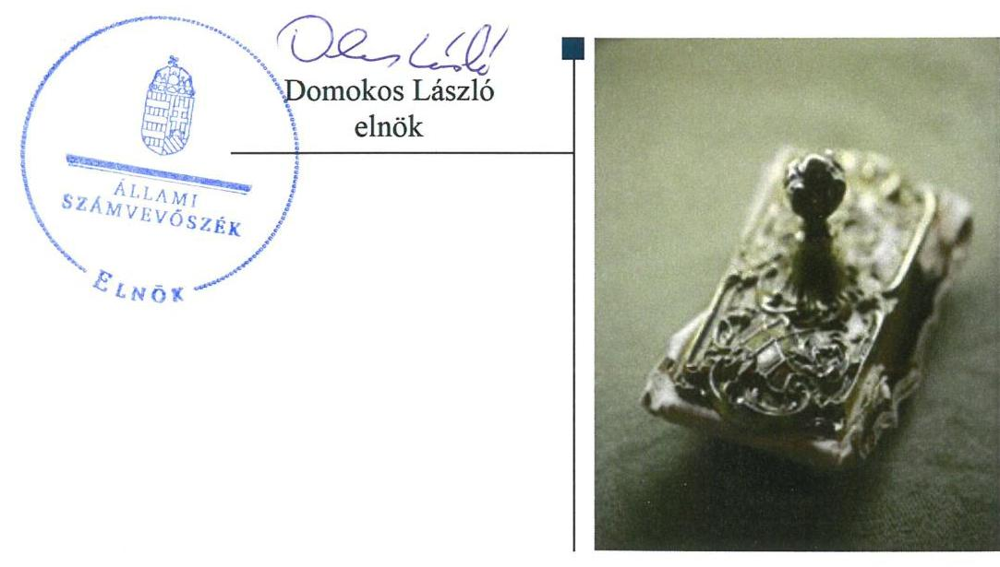
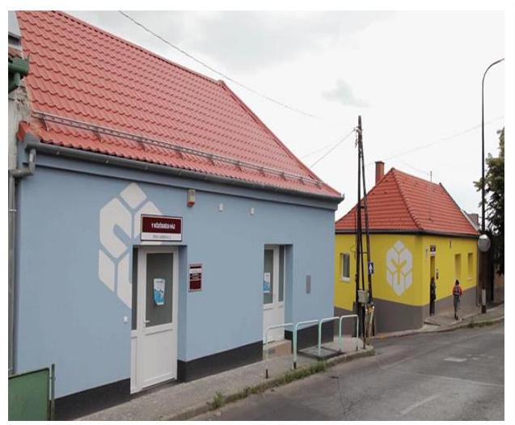

# Jelentés 

## Nem állami humánszolgáltatók ellenőrzése

A humánszolgáltatást nyújtó államháztartáson kívüli szociális intézmények, szolgáltatók fenntartói központi költségvetésből kapott támogatásai felhasználásának ellenőrzése TÁMASZ Alapítvány Pécs
2019.

---

# Jelentés 

## Nem állami humánszolgáltatók ellenőrzése

A humánszolgáltatást nyújtó államháztartáson kívüli szociális intézmények, szolgáltatók fenntartói központi költségvetésből kapott támogatásai felhasználásának ellenőrzése TÁMASZ Alapítvány Pécs
2019.  hó 25. nap

---

# AZ ELLENŐRZÉST FELÜGYELTE: 

PETŐ KRISZTINA felügyeleti vezető
MAROZSÁN LÁSZLÓNÉ felügyeleti vezető

## AZ ELLENŐRZÉST VEZETTE ÉS A VÉGREHAJTÁSÁÉRT FELELŐS:

DR. KOVÁCS DIÁNA ellenőrzésvezető

## A PROGRAM ÖSSZEÁLLÍTÁSÁÉRT FELELŐS:

TÓTPÁL SZABOLCS osztályvezető

IKTATÓSZÁM: EL-1582-001/2019.
TÉMASZÁM: 2448.
ELLENŐRZÉS-AZONOSÍTÓ SZÁM: V083507

---

# TARTALOMJEGYZÉK 

■ ÖSSZEGZÉS ..... 5
■ AZ ELLENŐRZÉS CÉLJA ..... 6
■ AZ ELLENŐRZÉS TERÜLETE ..... 7
■ AZ ELLENŐRZÉS HÁTTERE, INDOKOLTSÁGA ..... 8
■ A JELENTÉS LÉNYEGES KÉRDÉSKÖREI ..... 9
■ AZ ELLENŐRZÉS HATÓKÖRE ÉS MÓDSZEREI ..... 10
■ MEGÁLLAPÍTÁSOK ..... 12
■ MELLÉKLETEK ..... 15
I. sz. melléklet: Értelmező szótár ..... 15
■ FÜGGELÉK: ÉSZREVÉTELEK ..... 17
■ RÖVIDÍTÉSEK JEGYZÉKE ..... 19

---

.

---

# ÖSSZEGZÉS 

A TÁMASZ Alapítvány Pécs intézményfenntartóként kialakította a szabályszerű működési környezetet, a költségvetési támogatások átlátható, elszámoltatható igénybevételének, felhasználásának feltételeit. A szociális közfeladathoz rendelt költségvetési támogatásokat szabályszerűen igényelte és fordította intézménye működtetésére. A szociális intézménye működtetéséhez felhasznált közpénzekre vonatkozóan a nyilvánosság előtt beszámolt.

## Az ellenőrzés társadalmi indokoltsága

Az Állami Számvevőszék stratégiájában hangsúlyos szerepet szán annak, hogy szilárd szakmai alapon álló, értékteremtő ellenőrzéseivel előmozdítsa a közpénzügyek átláthatóságát, rendezettségét és javaslataival a közpénzek és a közvagyon szabályos, gazdaságos, hatékony és eredményes felhasználását segítse. Az Állami Számvevőszék a stratégiájában célul tűzte ki, hogy az államháztartáson kívülre nyújtott költségvetési támogatások ellenőrzésével hozzájáruljon ahhoz, hogy a közpénzeket az államháztartáson kívüli szervezetek is átlátható módon használják fel a közfeladatok szerződésben vállalt ellátása érdekében. Az Állami Számvevőszék e stratégiai céljaival összhangban - az Állami Számvevőszékről szóló 2011. évi LXVI. törvény felhatalmazása alapján - végzi a központi költségvetésből származó források, nyújtott támogatások - kedvezményezett szervezetek közfeladat ellátásához való - felhasználásának az ellenőrzését. Az Állami Számvevőszék hozzájárul ezzel ahhoz is, hogy a nyilvánosság és az igénybevevők megfelelő tájékoztatást kapjanak az államháztartáson kívüli közfeladatot ellátók működéséről.

## Főbb megállapítások, következtetések, javaslatok

A TÁMASZ Alapítvány Pécs a jogszabályi előírások szerint kialakította a szociális humánszolgáltatási közfeladat ellátásának szervezeti és szabályozási kereteit. Beszámolási formája és könyvvezetése a jogszabályi előírások szerint történt. A költségvetési támogatások igénylési, módosítási és elszámolási feladatainak ellátása során szabályszerűen járt el. A költségvetési támogatásokat a szociális intézménye működtetésére fordította.

A TÁMASZ Alapítvány Pécs az integrált intézménye működésének feltételeit szabályszerűen alakította ki. A központi költségvetési támogatások feladatok szerinti bontásban történő, elkülönített nyilvántartásáról szabályszerűen gondoskodott.

A TÁMASZ Alapítvány Pécs az integrált intézménye működtetéséhez felhasznált közpénzekre vonatkozóan a nyilvánosság előtti beszámolási kötelezettségének eleget tett.

---

# AZ ELLENŐRZÉS CÉLJA 

AZ ELLENŐRZÉS CÉLJA annak értékelése volt, hogy a TÁMASZ Alapítvány Pécs mint Fenntartó ${ }^{1}$ központi költségvetésből kapott támogatásainak felhasználása szabályszerű volt-e, a támogatások igénylése, évközi módosítása és év végi elszámolása megfelelt-e a jogszabályi előírásoknak.

---

# AZ ELLENŐRZÉS TERÜLETE 

## TÁMASZ Alapítvány Pécs

A Fenntartót 1990. november 26-án Pécs Megyei Jogú Város Önkormányzata, Pécs Egyházmegyei Katolikus Caritas Alapítvány és nonprofit egyesületek alapították azzal a céllal, hogy a szegények gondozásának regionális központjaként biztosítsák a hajléktalanná vált személyek ellátását és rehabilitációját, valamint a hajléktalanná válás megakadályozását.

A Fenntartó közhasznú jogállású, nyílt alapítvány volt. Az ellenőrzött időszakban vállalkozási tevékenységet is folytatott, amely gépkocsi bérbeadásból, rendezvényszervezésből és hajléktalanok ellátásához kapcsolódó szolgáltatások teljesítéséből állt.

Úgyvezető szerve a hét főből álló kuratórium volt, tagjainak személye az ellenőrzött időszakban nem változott. A Fenntartó képviseletére a kuratórium elnöke volt jogosult.

A szociálisan rászorultak részére nyújtott személyes gondoskodást a Fenntartó szervezeti egységeként működő, önálló jogi személyiséggel nem rendelkező Támasz Alapítvány Integrált Intézménye látta el. Az intézmény² hajléktalan személyek nappali ellátása, éjjeli menedékhely és utcai szociális munka alapszolgáltatásokat és a szakosított ellátásokat végezte. Az intézmény pécsi székhelyén túl 2015-2017. években további öt pécsi telephelyen látta el a feladatait.

A Fenntartó összes bevétele a 2015. évi 516,2 M Ft-ról 2017. évre 28,7 %-kal 664,2 M Ft-ra nőtt, amelyből 2015-ben 230,7 M Ft, 2016-ban 250 M Ft, míg 2017-ben 261,3 M Ft volt a szociális feladathoz kapott központi költségvetési támogatás.

A Fenntartó - jogszabályi kötelezettség nélkül - saját döntése alapján a 2015-2017. évi egyszerűsített éves beszámolóit könyvvizsgálóval ellenőriztette, amelyekhez a könyvvizsgáló korlátozás nélküli hitelesítő záradékot adott ki.

---

# AZ ELLENŐRZÉS HÁTTERE, INDOKOLTSÁGA 

A szociális feladatokat ellátó nem állami intézményfenntartók részére közfeladataik ellátására évente jelentős összegű pénzügyi támogatást biztosítottak a mindenkori költségvetési törvények a bennük megfogalmazott feltételek mellett. A felhasználható állami támogatások a Kvtv.-ben ${ }^{3}$ a 2015-2017. években a szociális ágazatra vonatkozóan 273 Mrd Ft előirányzatot határoztak meg. Módosították a szociális igazgatásról és szociális ellátásokról szóló 1993. évi III. törvényt, amely - többek között - 2012. január 1-jei hatállyal megfogalmazta a finanszírozási rendszerbe történő befogadással összefüggő szabályokat.

Az ÁSZ ${ }^{4}$ a stratégiájában célul tűzte ki, hogy az államháztartáson kívülre nyújtott költségvetési támogatások ellenőrzésével hozzájárul ahhoz, hogy a közpénzeket az államháztartáson kívüli szervezetek is átlátható módon használják fel a közfeladatok ellátására kötött szerződésekben vállalt ellátása érdekében. Az ÁSZ stratégiájában foglaltak alapján is indokolt az ellenőrzés, amely a társadalom számára jelzi, hogy a közpénzek államháztartáson kívüli felhasználása sem maradhat ellenőrizhetetlenül. Az államháztartáson kívülre nyújtott költségvetési támogatások ellenőrzésével az ÁSZ hozzájárul ahhoz, hogy a közpénzeket a nem állami humán fenntartók átlátható módon használják fel a közfeladatok ellátására kötött szerződésben vállalt kötelezettségek teljesítése érdekében. Az ellenőrzés javaslataival hozzájárul az említett rendszerek szabályszerű támogatás felhasználásához, javítja a társadalmi-gazdasági döntések megalapozottságát, ami a „jól irányított állam" feltétele.

---

# A JELENTÉS LÉNYEGES KÉRDÉSKÖREI 

1. A Fenntartó szabályszerű működési- és gazdálkodási környezet kialakításával megteremtette-e a költségvetési támogatások átlátható, elszámoltatható igénybevételének, felhasználásának feltételeit?
2. A Fenntartó az átvállalt szociális humánszolgáltatási közfeladathoz biztosított költségvetési támogatásokat szabályszerűen fordította-e a humánszolgáltató intézménye működtetésére?
3. A Fenntartó a szociális humánszolgáltató intézménye működtetéséhez felhasznált közpénzekre vonatkozó gazdálkodásával a nyilvánosság előtt elszámolt-e, ennek megalapozása érdekében ellenőrzési, értékelési és a külső ellenőrzésekkel kapcsolatos intézkedési feladatait szabályszerűen látta-e el?

---

# AZ ELLENŐRZÉS HATÓKÖRE ÉS MÓDSZEREI 

## Az ellenőrzés típusa

Megfelelőségi ellenőrzés.

## Az ellenőrzött időszak

A 2015. január 1. és 2017. december 31. közötti időszak. A helyszíni szemle tekintetében 2018. január 1-jétől az utolsó helyszíni szemle időpontjáig, 2019. január 30-ig tartó időszak.

## Az ellenőrzés tárgya

Az ellenőrzés a szociális humánszolgáltatási közfeladatokat ellátó Fenntartó humánszolgáltatási közfeladatai ellátásához a költségvetési törvényekben biztosított központi költségvetési támogatások igénylése, évközi módosítása és év végi elszámolása fenntartói feladatellátása, illetve e központi költségvetésből kapott támogatásaik humánszolgáltatási közfeladatokra való fenntartó általi felhasználása szabályszerűségének értékelésére terjedt ki.

## Az ellenőrzött szervezet

TÁMASZ Alapítvány Pécs mint intézményfenntartó.

## Az ellenőrzés jogalapja

Az ellenőrzés jogszabályi alapját az ÁSZ tv. ${ }^{5} 1. \S$ (3) bekezdése, 5. § (3) bekezdésében foglalt előírások adták.

## Az ellenőrzés módszerei

Az ellenőrzést az ellenőrzési program szempontjai, kérdései, az ellenőrzött időszakban hatályos jogszabályok, a nemzetközi standardokat irányadónak tekintve, az ellenőrzés szakmai szabályok és módszertanok figyelembevételével végezte az ÁSZ.

Az ellenőrzés ideje alatt az ellenőrzött szervezettel történő kapcsolattartást az ÁSZ SZMSZ ${ }^{6}$-ének vonatkozó előírásai alapján biztosította az ÁSZ.

---

Az ellenőrzési kérdések megválaszolásához szükséges bizonyítékok megszerzése az ellenőrzött által rendelkezésre bocsátott dokumentumokra, adatokra alapozva elemző eljárással történt.

Az ellenőrzési bizonyítékként felhasználható adatforrások közé tartoztak egyrészt a szakmai program részletes szempontjainál felsorolt adatforrások, másrészt minden - az ellenőrzés folyamán feltárt, az ellenőrzés szempontjából információt tartalmazó - dokumentum.

Az ellenőrzés lefolytatásához az ellenőrzött szervezet a kitöltött tanúsítványok, valamint az ÁSZ által kért dokumentumok elektronikus úton való megküldésével szolgáltatott adatokat, információkat. Az így rendelkezésre bocsátott adatok, információk és a tanúsítványok adatai valódiságának kontrollja az ellenőrzés keretében történt.

A fenntartott szociális intézménynél helyszíni szemle keretében győződött meg az ÁSZ a tényleges feladatellátásról (verifikáció).

A szociális humánszolgáltatások központi költségvetési támogatásai igénylésével, módosításával, elszámolásával kapcsolatos, államháztartáson kívüli fenntartó jogszabályokban előírt feladatai betartását, továbbá a központi költségvetési támogatások szabályszerű kezelését, nyilvántartását ellenőrizte az ÁSZ a Fenntartónál határozatok, nyilvántartások, beszámolók és egyéb dokumentumok alapján. Az ellenőrzés nem terjedt ki a szociális humánszolgáltatások központi költségvetési támogatásai igénylése, módosítása, elszámolása valódiságának, megalapozottságának, helyességének - sem a Fenntartónál, sem a székhely intézménynél való - értékelésére. Továbbá nem terjedt ki az ellenőrzés e források szociális intézmény általi szabályszerű felhasználásának értékelésére.

A szabályosság megítélésének alapját képezte, hogy a központi költségvetési támogatások Fenntartó általi igénylése, módosítása és elszámolása a Kincstár ${ }^{7}$ felé megtörtént.

---

# MEGÁLLAPÍTÁSOK 

## 1. A Fenntartó szabályszerű működési- és gazdálkodási környezet kialakításával megteremtette-e a költségvetési támogatások átlátható, elszámoltatható igénybevételének, felhasználásának feltételeit?

Összegző megállapítás A Fenntartó kialakította a szabályszerű működési környezetet, a költségvetési támogatások átlátható, elszámoltatható igénybevételének, felhasználásának feltételeit.

A Fenntartó a Ptk. ${ }^{8}$ előírásaival összhangban rendelkezett alapító okirattal ${ }^{9}$.
A szociális humánszolgáltatást a Fenntartó a Szoc.tv. ${ }^{10}$ rendelkezései szerint az Önkormányzattal ${ }^{11}$ kötött ellátási szerződés ${ }^{12}$ alapján nyújtotta.

A Fenntartó a Ptk. rendelkezéseivel összhangban a szervezeti és működési szabályait az SZMSZ ${ }^{13}$-ben állapította meg, amelyben a felelősségi körök meghatározásával szabályozta az engedélyezési, jóváhagyási és kontrollelárásokat.

A Fenntartó a Civilszr. ${ }^{14}$ szerinti kettős könyvvitellel alátámasztott egyszerűsített éves beszámolót, valamint közhasznúsági mellékletet készített. A számviteli beszámolók mérlegének és eredménykimutatásának tagolása szabályszerű volt.

A Fenntartó rendelkezett a Számv.tv. ${ }^{15}$ előírása szerint számviteli politikával ${ }^{16}$, az annak keretében elkészítendő eszközök és a források leltárkészítési és leltározási szabályzatával, az eszközök és a források értékelési szabályzatával és pénzkezelési szabályzattal.

A költségvetési támogatások igénylése, módosítása és elszámolása az Atr. ${ }^{17}$ alapján szabályszerűen történt. A Fenntartó rendelkezett a költségvetési támogatásokat megállapító és elfogadó kincstári határozatokkal.

## 2. A Fenntartó az átvállalt szociális humánszolgáltatási közfeladathoz biztosított költségvetési támogatásokat szabályszerűen fordította-e a humánszolgáltató intézménye működtetésére?

Összegző megállapítás A Fenntartó az átvállalt szociális humánszolgáltatási közfeladathoz biztosított költségvetési támogatásokat szabályszerűen fordította a humánszolgáltató intézménye működtetésére.

A Fenntartó biztosította intézménye működtetésének szervezeti, személyi és tárgyi feltételeit. A Fenntartó a Szoc.tv. előírásaival összhangban az

---

SZMSZ-ben határozta meg az integrált szervezeti formában működő humánszolgáltatást végző intézménye alapfeladatait és működése kereteit. Az intézményt a Kormányhivatal ${ }^{18}$ nyilvántartásba vette, a Fenntartó az Sznyvhr. ${ }^{19}$-ben meghatározott tanúsítvánnyal rendelkezett.

A Fenntartó biztosította a nem önállóan gazdálkodó humánszolgáltatást végző intézmény működésének pénzügyi feltételeit, az Atr. előírásaival összhangban a költségvetési támogatásokat a számviteli rendjében feladatonkénti bontásban, elkülönítetten kezelte.

# 3. A Fenntartó a szociális humánszolgáltató intézménye működtetéséhez felhasznált közpénzekre vonatkozó gazdálkodásával a nyilvánosság előtt elszámolt-e, ennek megalapozása érdekében ellenőrzési, értékelési és a külső ellenőrzésekkel kapcsolatos intézkedési feladatait szabályszerűen látta-e el? 

Összegző megállapítás

A Fenntartó a szociális humánszolgáltató intézménye működtetéséhez felhasznált közpénzekre vonatkozó gazdálkodásáról a
 nyilvánosság előtt beszámolt. Ellenőrzési és a külső ellenőrzésekkel kapcsolatos intézkedési feladatait szabályszerűen látta el.

A Fenntartó gazdálkodását, illetve a költségvetési támogatások felhasználását ellenőrizte a kuratórium ${ }^{20}$.

A Civil tv. ${ }^{21}$ előírásai szerint a Fenntartó a 2015-2017. évek egyszerűsített éves beszámolóit, közhasznúsági jelentéseit és a könyvvizsgálói jelentéseket letétbe helyezte és honlapján közzétette.

Hatósági ellenőrzésre 2015-2016. években sor került az intézménynél a Kormányhivatal részéről. A Kincstár ellenőrizte a Fenntartónál a 2015. és 2016. évben igénybevett támogatás elszámolásának szabályszerűségét. Az ellenőrzésekhez kötődő intézkedési kötelezettségének a Fenntartó eleget tett.

---

.

---

# MELLÉKLETEK 

- I. SZ. MELLÉKLET: ÉRTELMEZŐ SZÓTÁR
civil szervezet
feladatfinanszírozás
humánszolgáltatás
integrált intézmény
költségvetési támogatás
nem állami, nem önkormányzati (államháztartáson kívüli) intézmény fenntartó
székhely intézmény
telephely

A Civil tv. 2. § 6. pontja szerint civil szervezet a civil társaság, a Magyarországon nyilvántartásba vett egyesület (a párt, a szakszervezet és a kölcsönös biztosító egyesület kivételével), a közalapítvány és a pártalapítvány kivételével az alapítvány.
A közfeladat államháztartáson kívüli szervezet által történő ellátásához közvetlenül kapcsolódó, arányos működési költségeket finanszírozó költségvetési támogatás.
Külön törvényben meghatározott szociális, gyermekjóléti, gyermekvédelmi közfeladatok (2015. évi Kvtv. 43. § (1), (4) bekezdés, 2016. évi Kvtv. 41. § (1), (4) bekezdés, 2017. évi Kvtv. 41. § (1), (4) bekezdés).
Több intézménytípus különálló szervezeti egységekben történő megszervezése.
a társadalombiztosítás pénzügyi alapjai kivételével az államháztartás központi alrendszeréből ellenérték nélkül, pénzben nyújtott támogatások (Áht. ${ }^{22}$ 1. § 14. pont)
A költségvetési törvényekben (2013. évi CCXXX. törvény 33-34. §, 2014. évi C. törvény 42-43. §, 2015. évi C. törvény 40-41. §) megállapított támogatás. A 2015. évi C. törvény 40-41. § szerint többek között: Az Országgyűlés a szociális, gyermekjóléti, gyermekvédelmi közfeladatot ellátó intézményt, szolgáltatást fenntartó egyházi jogi személy, civil szervezet, közalapítvány, országos nemzetiségi önkormányzat, települési vagy területi nemzetiségi önkormányzat, gazdasági társaság, és a humánszolgáltatást alaptevékenységként végző, az Szja tv. hatálya alá tartozó egyéni vállalkozó (a továbbiakban együtt: nem állami szociális fenntartó) részére támogatást állapít meg a következők szerint: a támogatás a nem állami szociális fenntartót a települési önkormányzatok 2. melléklet III. pont 3. alpont c)-k) pontjában és III. pont 5. alpont a) pontjában meghatározott támogatásaival azonos jogcímeken, összegben és feltételek mellett illeti meg.
A szociális közfeladatokat/humánszolgáltatásokat ellátó intézményt fenntartó egyházi jogi személy, társadalmi szervezet, alapítvány, közalapítvány, civil szervezet, országos nemzetiségi önkormányzat, nonprofit gazdasági társaság, gazdasági társaság és a humánszolgáltatást alaptevékenységként végző, Szja tv. hatálya alá tartozó egyéni vállalkozó. (2013. évi Kvtv. 35. § (1), (3) bekezdés, 2014. évi Kvtv. 33. §, 34. § (1), (4) bekezdés, 2015. évi Kvtv. 42. §, 43. § (1), (4) bekezdés, 2016. évi Kvtv. 40. §, 41. § (1), (4) bekezdés) a szolgáltató székhelye, azaz a szolgáltató központi ügyintézésének helye, függetlenül attól, hogy használják-e szolgáltatás nyújtására (Sznyvhr. 1.§ k) pont) (hatályos: 2013. december 1-től)
a szolgáltató székhelyétől különböző, szolgáltató/intézmény használatában álló hely, a szociális humánszolgáltatáshoz használt, bejegyzett hely. (Sznyvhr. 1.§ l) pont) (hatályos: 2015. január 1-től)

---

.

---

# FÜGGELÉK: ÉSZREVÉTELEK 

A jelentéstervezetet a Számvevőszék 15 napos észrevételezésre megküldte az ellenőrzött szervezet vezetőjének az ÁSZ tv. 29. §* (1) bekezdése előírásának megfelelően.

A TÁMASZ Alapítvány Pécs kuratóriumi elnöke az ÁSZ tv. 29. § (2) bekezdésében foglalt határidőn belül nem tett észrevételt a jelentéstervezet megállapításaira.

[^0]
[^0]:    * 29. § (1) Az Állami Számvevőszék az ellenőrzési megállapításait megküldi az ellenőrzött szervezet vezetőjének vagy az általa megbízott személynek, és annak, akinek személyes felelősségét állapította meg.
    (2) Az ellenőrzött szervezet vezetője és a felelősként megjelölt személy az ellenőrzés megállapításaira tizenöt napon belül írásban észrevételt tehet.
    (3) Az Állami Számvevőszék az észrevételre a beérkezésétől számított harminc napon belül írásban válaszol. A figyelembe nem vett észrevételeket köteles a jelentésben feltüntetni, és megindokolni, hogy azokat miért nem fogadta el.

---

.

---

# RÖVIDÍTÉSEK JEGYZÉKE 

${ }^{1}$ Fenntartó
${ }^{2}$ intézmény
${ }^{3}$ Kvtv. 1

Kvtv. 2

Kvtv. 3
${ }^{4}$ ÁSZ
${ }^{5}$ ÁSZ tv.
${ }^{6}$ ÁSZ SZMSZ
${ }^{7}$ Kincstár
${ }^{8}$ Ptk.
${ }^{9}$ alapító okirat
${ }^{10}$ Szoc.tv.
${ }^{11}$ Önkormányzat
${ }^{12}$ ellátási szerződés
${ }^{13}$ SZMSZ1
SZMSZ2
${ }^{14}$ Civilszr. 1

Civilszr. 2
${ }^{15}$ Számv.tv.
${ }^{16}$ Számviteli politika 1

Számviteli politika 2
${ }^{17}$ Atr.
${ }^{18}$ Kormányhivatal
${ }^{19}$ Sznyvhr.

TÁMASZ Alapítvány Pécs
TÁMASZ Alapítvány Integrált Intézmény (7626 Pécs, Dugonics u. 26.)
Magyarország 2015. évi központi költségvetéséről szóló 2014. évi C. törvény (hatályos: 2015. január 1. és 2018. december 31. között)
Magyarország 2016. évi központi költségvetéséről szóló 2015. évi C. törvény (hatályos: 2016. január 1. és 2019. december 31. között)
Magyarország 2017. évi központi költségvetéséről szóló 2016. évi XC. törvény (hatályos: 2016. november 1. és 2020. december 31. között)
Állami Számvevőszék
az Állami Számvevőszékről szóló 2011. évi LXVI. törvény (hatályos: 2011. július 1-től)
az Állami Számvevőszék Szervezeti és Működési Szabályzata
Magyar Államkincstár
a Polgári Törvénykönyvről szóló 2013. évi V. törvény (hatályos: 2014. március 15-től)
TÁMASZ Alapítvány Pécs 1990. november 26. napján kelt alapító okirat valamennyi változását tartalmazó, egységes szerkezetbe foglalt alapító okirata (hatályos 2014. július 31-től)
a szociális igazgatásról és szociális ellátásokról szóló 1993. évi III. törvény (hatályos: 1993. február 26-tól)
Pécs Megyei Jogú Város Önkormányzatával
2004. március 29-én a Pécs Megyei Jogú Önkormányzata és a Támasz Alapítvány Pécs között létrejött 7-101/2004/11. számú ellátási szerződés
Támasz Alapítvány Szervezeti és Működési Szabályzata (hatályos: 2012. január 15-től 2015. december 20-ig)
Támasz Alapítvány Pécs Szervezeti és Működési Szabályzata (hatályos: 2015. december 21-től)
a számviteli törvény szerinti egyes egyéb szervezetek beszámoló készítési és könyvvezetési kötelezettségének sajátosságairól szóló 224/2000. (XII. 19.) Korm. rendelet (hatályos: 2001. január 1. és 2016. december 31. között)
a számviteli törvény szerinti egyes egyéb szervezetek beszámoló készítési és könyvvezetési kötelezettségének sajátosságairól szóló 479/2016. (XII. 28.) Korm. rendelet (hatályos: 2017. január 1-től)
2000. évi C. törvény - a számvitelről

TÁMASZ Alapítvány Számviteli politikája (hatályos 2015. január 1-től 2015. december 31-ig)
TÁMASZ Alapítvány Számviteli politikája (hatályos 2016. január 1-től)
az egyházi és nem állami fenntartású szociális, gyermekjóléti és gyermekvédelmi szolgáltatók, intézmények és hálózatok állami támogatásáról szóló 489/2013. (XII. 18.) Korm. rendelet (hatályos: 2014. január 1-jétől)

Baranya Megyei Kormányhivatal
a szociális, gyermekjóléti és gyermekvédelmi szolgáltatók, intézmények és hálózatok hatósági nyilvántartásáról és ellenőrzéséről szóló 369/2013. (X. 24.) Korm. rendelet (hatályos: 2013. december 1-jétől)

---

${ }^{20}$ kuratórium
${ }^{21}$ Civil tv.
${ }^{22}$ Áht.

TÁMASZ Alapítvány Pécs kuratóriuma
az egyesülési jogról, a közhasznú jogállásról, valamint a civil szervezetek működéséről és támogatásáról szóló 2011. évi CLXXV. törvény (hatályos: 2011. december 22-től)
az államháztartásról szóló 2011. évi CXCV. törvény (hatályos: 2012. január 1-jétől)

---

ÁLLAMI SZÁMVEVŐSZÉK
1052 Budapest, Apáczai Csere János utca 10.
Levélcím: 1364 Budapest 4. Pf. 54
Telefon: +36 14849100 Telefax: +36 14849200
www.asz.hu
