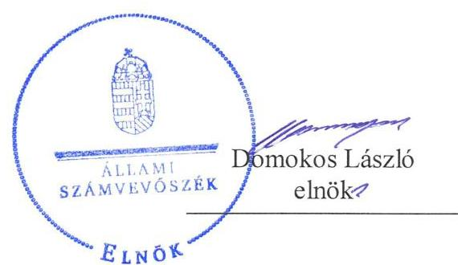
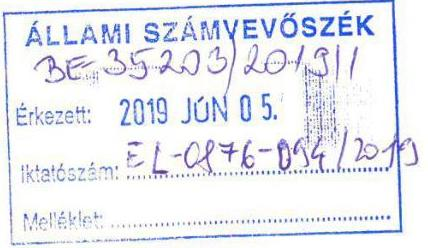
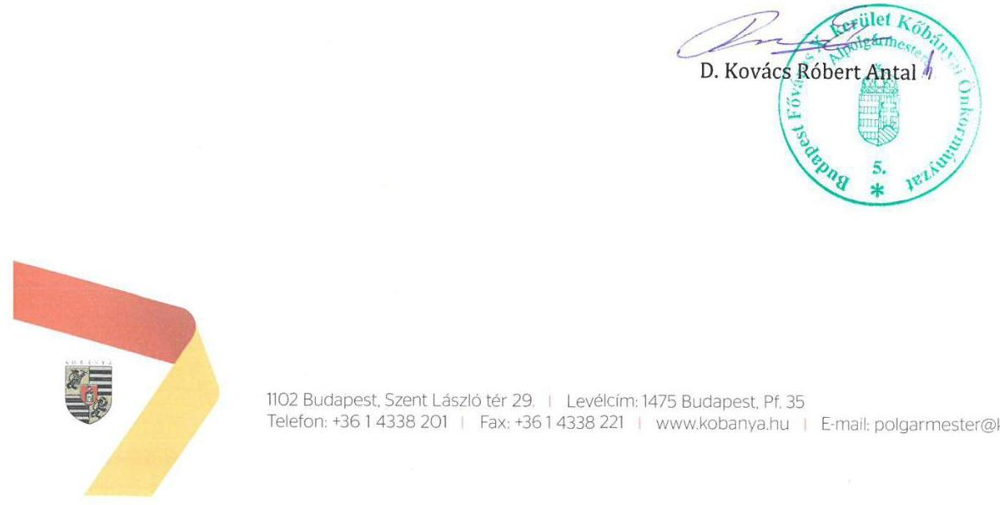
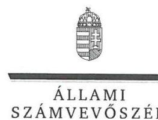
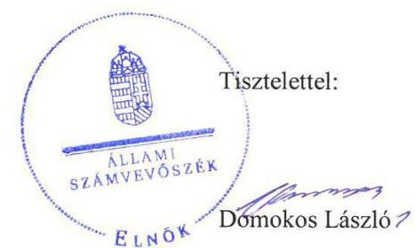
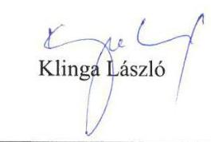

# Jelenetés 

## Nemzeti tulajdonú gazdasági társaságok ellenőrzése

Kőbányai Szivárvány Szociális Gondoskodást Nyújtó Közhasznú Nonprofit Korlátolt Felelősségű Társaság
2019.

---

# Jelentés 

## Nemzeti tulajdonú gazdasági társaságok ellenőrzése

Kőbányai Szivárvány Szociális Gondoskodást Nyújtó Közhasznú Nonprofit Korlátolt Felelősségű Társaság
2019. 07. hó 03. nap

---

# AZ ELLENŐRZÉST FELÜGYELTE: 

KLINGA LÁSZLÓ felügyeleti vezető

## AZ ELLENŐRZÉST VEZETTE ÉS A VÉGREHAJTÁSÁÉRT FELELŐS:

KISTÓTH KRISZTINA ellenőrzésvezető

## A PROGRAM ÖSSZEÁLLÍTÁSÁÉRT FELELŐS:

TÓTPÁL SZABOLCS osztályvezető

IKTATÓSZÁM: EL-1584-001/2019

TÉMASZÁM: 2478

## ELLENŐRZÉS-AZONOSÍTÓ SZÁM: V082220

Jelentéseink az Országgyűlés számítógépes hálózatán és az Interneten a www.asz.hu címen is olvashatóak.

---

# TARTALOMJEGYZÉK 

■ ÖSSZEGZÉS ..... 5
■ AZ ELLENŐRZÉS CÉLJA ..... 6
■ AZ ELLENŐRZÉS TERÜLETE ..... 7
■ AZ ELLENŐRZÉS HÁTTERE, INDOKOLTSÁGA ..... 8
■ A JELENTÉS LÉNYEGES KÉRDÉSKÖREI ..... 9
■ AZ ELLENŐRZÉS HATÓKÖRE ÉS MÓDSZEREI ..... 10
■ MEGÁLLAPÍTÁSOK ..... 12
■ JAVASLATOK ..... 14
■ MELLÉKLETEK ..... 15
I. sz. melléklet: Értelmező szótár ..... 15
■ FÜGGELÉKEK ..... 17
I. sz. függelék a jelentéshez ..... 17
II. sz. függelék: Észrevételek ..... 18
■ RÖVIDÍTÉSEK JEGYZÉKE ..... 23

---

.

---

# ÖSSZEGZÉS 

A Kőbányai Szivárvány Szociális Gondoskodást Nyújtó Közhasznú Nonprofit Korlátolt Felelősségű Társaság vagyongazdálkodási tevékenysége nem volt szabályszerű, a mérleg tételeit leltárral nem támasztotta alá, így beszámolója nem nyújtott valós képet. A Társaság nem biztosította a felelős, elszámoltatható vagyongazdálkodást és vagyona védelmét.

## Az ellenőrzés társadalmi indokoltsága

A nemzeti tulajdonú gazdasági társaságok ellenőrzése kiemelten fontos a nemzeti vagyon megőrzése érdekében. Gazdálkodásuk jellemzően a közérdeklődés és a média figyelmének középpontjában áll, amihez hozzájárul a gazdálkodásuk körébe tartozó - a nemzeti vagyon részét képező - vagyon nagysága. Az Állami Számvevőszék ellenőrzései feltárják, hogy a tulajdonosi felügyelet hozzájárult-e a szabályszerű gazdálkodáshoz és feladatellátáshoz, továbbá meghatározhatóvá válnak a szervezet vagyongazdálkodást érintő kockázatai.

A megállapítások alapján megfogalmazott számvevőszéki javaslatok hasznosítása elősegíti a meglévő hibák megszüntetését. A jó gyakorlatok bemutatásával az ÁSZ ${ }^{1}$ hozzájárul a követendő megoldások megismertetéséhez, terjesztéséhez.

## Főbb megállapítások, következtetések, javaslatok

Budapest Főváros X. kerület Kőbányai Önkormányzat tulajdonosi joggyakorlásának kereteit kialakította, tulajdonosi jogait szabályszerűen gyakorolta.

A Kőbányai Szivárvány Szociális Gondoskodást Nyújtó Közhasznú Nonprofit Korlátolt Felelősségű Társaság vagyongazdálkodása nem volt szabályszerű. A Társaság úgy tett eleget a tulajdonosnak történő előterjesztési kötelezettségének, hogy a 2015-2017. évi beszámoló a mérleg tételei leltári alátámasztásának hiánya miatt nem felelt meg a Számv. tv. ${ }^{2}$ előírásainak, így a gazdálkodásának, vagyongazdálkodásának az elszámoltathatóságát, átláthatóságát nem biztosította.

A Társaság a vagyongazdálkodással kapcsolatos feladat- és hatásköröket, felelősségi viszonyokat az Alapító okirattal összhangban, belső szabályzataiban rögzítette a vagyonhoz kapcsolódó nyilvántartását szabályszerűen vezette.

Az Állami Számvevőszék a jelentésben foglalt megállapítások alapján a Kőbányai Szivárvány Szociális Gondoskodást Nyújtó Közhasznú Nonprofit Korlátolt Felelősségű Társaság ügyvezetőjének egy javaslatot fogalmazott meg.

---

# AZ ELLENŐRZÉS CÉLJA 

Az ellenőrzés célja annak megállapítása, hogy a tulajdonosi joggyakorló a gazdasági társasága feletti tulajdonosi joggyakorlás kereteit kialakította-e, tulajdonosi jogait megfelelően gyakorolta-e és kötelezettségeit teljesítette-e. Továbbá, hogy a gazdasági társaság biztosította-e a vagyon védelmét a nyilvántartások szabályszerű vezetése és a mérleg tételeinek leltárral történő alátámasztása útján, valamint szabályszerűen gondoskodott-e a társaság használatában, kezelésében lévő nemzeti vagyon értékének megőrzéséről, gyarapításáról, hasznosításáról.

---

# AZ ELLENŐRZÉS TERÜLETE 

## Kőbányai Szivárvány Szociális Gondoskodást Nyújtó Közhasznú Nonprofit Korlátolt Felelősségű Társaság

A Kőbányai Szivárvány Szociális Gondoskodást Nyújtó Közhasznú Nonprofit Korlátolt Felelősségű Társaság Budapest Főváros X. kerület Kőbányai Önkormányzat alapította 2003-ban, a korábban működő Szivárvány Szociális Gondoskodást Nyújtó Közhasznú Társaság jogutódjaként. A Társaságban ${ }^{3}$ az Önkormányzat ${ }^{4}$ az alapítástól kezdve 100%-os tulajdoni hányaddal rendelkezett.

Az Alapító okirat ${ }^{5}$-ban foglaltak szerint a Társaság legfőbb szervének hatáskörét az Alapító ${ }^{6}$ gyakorolja.

A Társaság főtevékenysége az idősek, fogyatékosok bentlakásos ellátása, de mellette étkeztetést, idősek nappali ellátását, illetve időskorúak átmeneti gondozását is biztosította. Tevékenységei a Mötv. ${ }^{7}$ alapján közfeladatnak, a Társaság a Civil tv. ${ }^{8}$ alapján közhasznú jogállásúnak minősült.

A Társaság jegyzett tőkéje 10 millió Ft volt, az ellenőrzött időszakban nyereségesen működött. A Civil tv. előírása szerint a Társaság a tevékenységéből származó nyereségét köteles volt a létesítő okiratában meghatározott közhasznú tevékenységére fordítani.

A Társaságnál az Alapító okirat előírásai szerint háromtagú Felügyelő bizottság ${ }^{9}$ működött. A Társaság 2015-2017. években egyszerűsített éves beszámolót készített, a Számv. tv. alapján könyvvizsgálatra volt kötelezett.

A Társaság ügyvezetőjének a személye az ellenőrzött időszakban nem változott. Az Ügyvezető 2003. óta látja el feladatát.

A Társaság vagyonkezelésbe vett vagyonnal nem rendelkezett, feladatait az ingyenesen használatba kapott önkormányzati vagyonnal és a saját vagyonával látta el.

Az Önkormányzat és a Társaság Ellátási szerződést ${ }_{1-2}{ }^{10}$ kötött egymással szociális feladatok ellátására, melyhez az Önkormányzat a szerződésben meghatározott ingatlanokat a szociális feladatellátás, üzemeltetés időtartamára térítésmentes használatba engedi a Társaság részére. A Képviselőtestület évente Térítési díjhatározat ${ }_{1-3}{ }^{11}$-ban állapította meg a személyes gondoskodást nyújtó ellátások önköltségét és térítési díját.

---

# AZ ELLENŐRZÉS HÁTTERE, INDOKOLTSÁGA 

Az ÁSZ az Alaptörvényben lefektetett elvek érvényesítése érdekében a közpénzekkel és a közvagyonnal való felelős és gondos gazdálkodást, az elszámoltathatóságot, az átláthatóságot, a lényeges hibáktól való mentességet, a vagyonvesztés megakadályozását helyezi előtérbe. Ellenőrzéseivel az ÁSZ-nak lehetősége nyílik arra, hogy erősítse hozzáadott értéket teremtő tevékenységét és tanácsadó szerepét.

Az Alaptörvény 38. cikke alapján az állam és a helyi önkormányzatok tulajdona nemzeti vagyon. A nemzeti vagyon megőrzése, megóvása érdekében kiemelten fontos ezen nemzeti tulajdonú gazdasági társaságok ellenőrzése.

Az ÁSZ ellenőrzései feltárhatják, hogy a gazdasági társaság felelős vagyongazdálkodás mellett, a szolgáltatási szerződésben foglaltak betartásával biztosította-e feladatainak ellátását, valamint a szolgáltatás folyamatos fenntarthatóságának feltételeit, a tulajdonosi felügyelet hozzájárult-e a szabályszerű gazdálkodáshoz és feladatellátáshoz.

Az ellenőrzés eredményeként meghatározhatóvá válnak a szervezet vagyongazdálkodást érintő kockázatai, ezzel lehetővé téve a kockázatok csökkentését. A megállapítások alapján megfogalmazott számvevőszéki javaslatok hasznosítása elősegítheti a meglévő hibák megszüntetését.

Az ÁSZ stratégiába foglalt kiemelt célja, hogy az ellenőrzési tevékenységének hasznosulása tetten érhető legyen a társadalmi bizalom megerősítésében, az ellenőrzött szervezetek magatartásának megváltozásában.

---

# A JELENTÉS LÉNYEGES KÉRDÉSKÖREI 

1. A gazdasági társaság feletti tulajdonosi joggyakorlás megfelel-e a jogszabályi és belső előírásoknak?
2. A gazdasági társaság vagyongazdálkodási tevékenysége szabályszerű volt-e?

---

# AZ ELLENŐRZÉS HATÓKÖRE ÉS MÓDSZEREI 

## Az ellenőrzés típusa

Megfelelőségi ellenőrzés.

## Az ellenőrzött időszak

A gazdasági társaság feletti tulajdonosi joggyakorlás tekintetében az ellenőrzött időszak 2017. január 1-től az ellenőrzés megkezdésének napjáig terjed ki az éves beszámoló elfogadása kivételével, amelynél 2015. január 1-től az ellenőrzés megkezdésének napjáig, 2018. október 13-ig tart.

A gazdasági társaság vagyongazdálkodása ellenőrzése tekintetében az ellenőrzött időszak 2015. - 2017. évek, a 2017. évi beszámoló jóváhagyása és közzététele tekintetében 2018. június elsejéig tartó időszak.

## Az ellenőrzés tárgya

Az önkormányzati tulajdonban lévő gazdasági társaság feletti tulajdonosi joggyakorlás kialakítása és működtetése. Továbbá az önkormányzati tulajdonban lévő gazdasági társaság vagyongazdálkodása keretében a társaság használatában, kezelésében lévő nemzeti vagyon, illetve a saját vagyon tekintetében a vagyonnyilvántartások vezetése, leltára. A társaság használatában, vagyonkezelésében lévő nemzeti vagyon tekintetében a vagyon értékének megőrzése, gyarapítása és hasznosítása.

## Az ellenőrzött szervezet

Kőbányai Szivárvány Szociális Gondoskodást Nyújtó Közhasznú Nonprofit Kft., valamint a tulajdonosi jogokat gyakorló Budapest Főváros X. kerület Kőbányai Önkormányzat

## Az ellenőrzés jogalapja

Az ellenőrzés jogalapját az ÁSZ tv. ${ }^{12}$ 1. § (3) bekezdése, továbbá az 5. § (3), (4) és (5) bekezdése képezi.

---

# Az ellenőrzés módszerei 

Az ellenőrzést az ellenőrzési program ellenőrzési kérdései, az ellenőrzött időszakban hatályos jogszabályok, az ellenőrzés szakmai szabályok és módszertanok alapján, a nemzetközi standardok figyelembe vételével végeztük.

Az ellenőrzés ideje alatt az ellenőrzött szervezettel történő kapcsolattartást az ÁSZ Szervezeti és Működési Szabályzatának vonatkozó előírásai alapján biztosítottuk.

Az ellenőrzési kérdések megválaszolásához szükséges bizonyítékok megszerzése a következő ellenőrzési eljárások alkalmazásával történt: megfigyelés, információkérés, összehasonlítás, valamint elemző eljárás. Az ellenőrzési bizonyítékként felhasználható adatforrások közé tartoztak az ellenőrzési programban felsorolt adatforrások, továbbá minden - az ellenőrzés folyamán - feltárt, az ellenőrzés szempontjából információkat tartalmazó dokumentum. Az ellenőrzést a kérdésekre adott válaszok kiértékelésével, valamint a megjelölt adatforrások, a csatolt tanúsítványok felhasználásával, továbbá az adott időszakban hatályos jogszabályok figyelembe vételével kellett lefolytatni.

A 2017. január 1-től az ellenőrzés megkezdésének napjáig ellenőrizte az ÁSZ a tulajdonosi joggyakorlás kereteinek kialakítását, a tulajdonosi joggyakorló tevékenységét a felügyelő bizottság és a független könyvvizsgáló működéséhez kapcsolódóan, valamint azt, hogy a tulajdonosi joggyakorló amennyiben a gazdasági társaság feladatellátásához és vagyonkezeléséhez kapcsolódóan határozott meg követelményeket, elvárásokat - a nemzeti vagyon értékének megőrzése érdekében monitorozta-e azok teljesülését. A 2015. január 1-től az ellenőrzés megkezdésének napjáig ellenőrizte az ÁSZ a tulajdonosi joggyakorló részvételét az éves beszámoló elfogadására vonatkozó döntéshozatalban.

Az ellenőrzés során az ellenőrzött gazdasági társaság vagyonhoz kapcsolódó nyilvántartásai vezetésének megfelelősége, a mérleg tételeinek leltárral való alátámasztottsága, valamint a nemzeti vagyon értéke megőrzésének, gyarapításának, hasznosításának szabályszerűsége 2015. és 2017. évek tekintetében került ellenőrzésre. A teljes ellenőrzött időszakot, 2015-2017. éveket érintően történt meg a lényeges dokumentumok értékelése.

A nemzeti tulajdonú (résztulajdonú) gazdasági társaság vagyongazdálkodása az adott területen „szabályszerű", amennyiben az értékelt területen az „igen" válaszok százalékban kifejezett, egy tizedes számra kerekített aránya, meghaladta a 90,0%-ot. Amennyiben ez az arány nem haladta meg a 90,0%-ot az értékelés „nem szabályszerű".

A vagyonnyilvántartások és a leltár szabályszerűsége esetében az ellenőrzés azokra a legnagyobb értékű tételekre - a lényeges sokaságra - terjedt ki, melyek összértéke eléri a teljes sokaság összértékének 50%-át. A 2015. és a 2017. évben a lényeges sokaságot tételesen ellenőriztük.

---

# 1. A gazdasági társaság feletti tulajdonosi joggyakorlás megfelel-e a jogszabályi és belső előírásoknak? 

Összegző megállapítás: Az Önkormányzat tulajdonosi joggyakorlása szabályszerű volt.

A TULAJDONOSI JOGGYAKORLÁS KERETEIT az Önkormányzat az SZMSZ ${ }^{13}$-ében, a Társaság Alapító okiratában és a Vagyonrendeletben ${ }^{14}$ a Mötv. és a Ptk. ${ }^{15}$ rendelkezéseivel összhangban kialakította. A Társaság SZMSZ ${ }^{16}$-ében rögzítették az ügyvezető éves beszámoló készítési kötelezettségét.

A Taktv. ${ }^{17}$ szerint az Alapító határozatával ${ }^{18}$ megalkotta szabályzatát a Társaság vezető tisztségviselői, felügyelőbizottsági tagjai, valamint az Mt. ${ }^{19}$ 208. §-ának hatálya alá eső munkavállalói javadalmazása, valamint a jogviszony megszűnése esetére biztosított juttatások módjának, mértékének elveiről és annak rendszeréről.

A tulajdonosi jogai érvényesítése érdekében az Önkormányzat az Ellátási szerződés ${ }_{1-2}$ keretében rögzítette a Társaság éves pénzügyi és szakmai beszámolási feladatait.

A TULAJDONOSI JOGAIT az Önkormányzat a Ptk., a Számv. tv. és a Taktv. vonatkozó előírásainak, és az SZMSZ-e, a Vagyonrendelet, valamint az Alapító okirat rendelkezéseinek eleget téve, szabályszerűen gyakorolta. Az Alapító okiratban foglaltak szerint a Képviselő-testület a Társaság három főből álló Felügyelőbizottságának elnökét és tagjait, valamint a könyvvizsgálót a Taktv. és a Ptk. előírásai szerint megválasztotta.

Az Alapító a Társaság közhasznúsági jelentését is tartalmazó beszámolóit a Ptk. előírásai szerint, a Felügyelőbizottság és a könyvvizsgáló jelentése birtokában jóváhagyta.

A Társaság feladatellátásának ellenőrzése keretében a Felügyelő bizottság működéséről évente írásban beszámolt a Képviselő-testület részére. A Hivatal ${ }^{20}$ belső
 ellenőrzési osztálya 2016. évben ellenőrzést végzett a Társaságnál a szervezet szabályozottsága, a beszerzések bonyolítása és a közérdekű adatok közzététele témákban. A Társaság éves tervezési, pénzügyi és szakmai beszámolási kötelezettségét teljesítette.

---

# 2. A gazdasági társaság vagyongazdálkodási tevékenysége szabályszerű volt-e? 

Összegző megállapítás

A Társaság vagyongazdálkodása a mérleg leltári alátámasztásának hiánya miatt nem volt szabályszerű.

## LELTÁRKÉSZÍTÉSI ÉS LELTÁROZÁSI SZABÁLY-

ZATÁT ${ }^{21}$ a Társaság a Számv.tv. szerint elkészítette.

2015-2017. években a Társaság az éves beszámoló mérlegtételeit a Számv. tv. 69. § (1) bekezdés előírásai ellenére nem támasztotta alá olyan leltárral, amely tételesen, ellenőrizhető módon tartalmazta a mérleg fordulónapján meglévő eszközeit és forrásait mennyiségben és értékben.

A Társaság úgy tett eleget a tulajdonosnak történő beszámoló előterjesztési kötelezettségének, hogy a 2015-2017. évi beszámoló nem felelt meg a Számv. tv. 20. § (1), valamint a 69. § (1) bekezdés előírásainak. A leltár hiánya ellenére a könyvvizsgáló a 2015-2017. években hitelesítő záradékkal látta el az éves beszámolót.

A VAGYONGAZDÁLKODÁSSAL kapcsolatos feladat- és hatásköröket, felelősségi viszonyokat a Társaság az Alapító okirattal összhangban, az SZMSZ-ében és a Pénzkezelési szabályzat ${ }_{1-3}{ }^{22}$ ban rögzítette.

A Társaság a közfeladat ellátásához az Önkormányzat által térítésmentesen átengedett ingatlanokat ${ }^{23}$ az Ellátási szerződésben foglalt kötelezettségei ellátásához használta, a rendeltetésszerű használathoz szükséges karbantartási és felújítási tevékenységéről a Képviselő-testületnek évente beszámolt.

A Társaság a vagyonhoz kapcsolódó nyilvántartását a jogszabályi előírások, továbbá a Számviteli Politika ${ }^{24}{ }_{1-3}$, az Értékelési szabályzat ${ }_{1-3}{ }^{25}$ és a Számlarend ${ }_{1-3}{ }^{26}$ előírásai szerint vezette.

2015-2017. években a Társaság selejtezési feladatait a Selejtezési szabályzatban ${ }_{1-3}{ }^{27}$ foglaltak szerint végezte, a selejtezett eszközöket nyilvántartásából kivezette.

---

# JAVASLATOK 

Az ÁSZ tv. 33. § (1) bekezdésében foglaltak értelmében az ellenőrzött szervezet vezetője köteles a jelentésben foglalt megállapításokhoz kapcsolódó intézkedési tervet összeállítani és azt a jelentés kézhezvételétől számított 30 napon belül az ÁSZ részére megküldeni. Amennyiben az ellenőrzött szervezet vezetője nem küldi meg határidőben az intézkedési tervet, vagy továbbra sem elfogadható intézkedési tervet küld, az Állami Számvevőszék elnöke az ÁSZ tv. 33. § (3) bekezdése a) és b) pontjaiban foglaltakat érvényesítheti.

## Kőbányai Szivárvány Szociális Gondoskodást Nyújtó Közhasznú Nonprofit Korlátolt Felelősségű Társaság ügyvezetőjének

1. Gondoskodjon az éves beszámoló mérlegtételeinek Számv. tv. előírásainak megfelelő leltárral történő alátámasztásáról.
(2. sz. megállapítás 2. bekezdése alapján)

---

# MELLÉKLETEK 

- I. SZ. MELLÉKLET: ÉRTELMEZŐ SZÓTÁR
gazdasági társaság
közfeladat
nemzeti vagyon
tulajdonosi jogok gyakorlója
gazdasági társaság
nemzeti vagyon hasznosítása
nemzeti vagyon használója

A gazdasági társaságok üzletszerű közös gazdasági tevékenység folytatására, a tagok vagyoni hozzájárulásával létrehozott, jogi személyiséggel rendelkező vállalkozások, amelyekben a tagok a nyereségből közösen részesednek, és a veszteséget közösen viselik. Forrás: Ptk. 3:88. § (1) bekezdése
Az Áht. ${ }^{28}$ 3/A. § (1) bekezdése alapján közfeladat a jogszabályban meghatározott állami vagy önkormányzati feladat.
Nvtv. ${ }^{29}$ 1. § (2) bekezdése szerint nemzeti vagyonba tartozik többek között:
„az állam vagy a helyi önkormányzat kizárólagos tulajdonában álló dolgok,
az a) pont hatálya alá nem tartozó, állam vagy a helyi önkormányzat tulajdonában lévő dolog,
az állam vagy a helyi önkormányzat tulajdonában lévő pénzügyi eszközök, továbbá az államot vagy a helyi önkormányzatot megillető társasági részesedések,
az államot vagy a helyi önkormányzatot megillető bármely vagyoni értékkel rendelkező jogosultság, amelyet jogszabály vagyoni értékű jogként nevesít."
Aki a nemzeti vagyon felett az államot vagy a helyi önkormányzatot megillető tulajdonosi jogok és kötelezettségek összességének gyakorlására jogosult. Forrás: Nvtv. 3. § (1) 17. pontja

A gazdasági társaságok üzletszerű közös gazdasági tevékenység folytatására, a tagok vagyoni hozzájárulásával létrehozott, jogi személyiséggel rendelkező vállalkozások, amelyekben a tagok a nyereségből közösen részesednek, és a veszteséget közösen viselik. Forrás: Ptk. 3:88. § (1) bekezdése
A tulajdonosi joggyakorló vagy a nemzeti vagyon használója által a nemzeti vagyon birtoklásának, használatának, hasznok szedése jogának bármely - a tulajdonjog átruházását nem eredményező - jogcímen történő átengedése, ide nem értve a vagyonkezelésbe adást, valamint a haszonélvezeti jog alapítását.
Forrás: Nvtv. 3. § (1) bekezdés 4. pont
Azon természetes személy, jogi személy vagy jogi személyiséggel nem rendelkező szervezet, aki vagy amely állami vagyon tekintetében törvény vagy szerződés alapján, a helyi önkormányzat vagyona tekintetében törvény, a helyi önkormányzat rendelete vagy szerződés alapján bármely jogcímen nemzeti vagyont birtokol, használ, szedi annak hasznait, kivéve a tulajdonosi joggyakorló.
Forrás: Nvtv. 3. § (1) bekezdés 11. pont

---

.

---

# FÜGGELÉKEK 

- I. SZ. FÜGGELÉK A JELENTÉSHEZ

Az Állami Számvevőszék az ellenőrzések során feltárt tényekhez kapcsolódó további körülmények tisztázására eszközrendszerrel nem rendelkezik. Amennyiben az ellenőrzésen túlmutatóan indokoltnak látszik az ellenőrzés során feltárt körülmények további vizsgálata, az Állami Számvevőszék törvényi felhatalmazás alapján az ellenőrzés által feltárt körülményeket továbbítja a hatáskörrel rendelkező szervnek a szükséges intézkedések megtétele, eljárások lefolytatása érdekében.
A Kőbányai Szivárvány Szociális Gondoskodást Nyújtó Közhasznú Nonprofit Korlátolt Felelősségű Társaság a mérleg fordulónapján meglévő eszközeit és forrásait a Számv. tv. 69. § (1) bekezdésében foglaltak ellenére a 2015-2017. évi beszámolókhoz nem támasztotta alá olyan leltárral, amely tételesen, ellenőrizhető módon tartalmazza az eszközöket és forrásokat mennyiségben és értékben. A Társaság mérlegfőösszege 2015. december 31-én 226 millió Ft, 2016. december 31-én 286 millió Ft és 2017. december 31-én 268 millió Ft volt.

A leltári alátámasztottság hiányában a Társaság 2015-2017. évi beszámolóiban a Számv. tv. 15. § (3) bekezdésben foglalt előírások ellenére nem érvényesült a valódiság elve és nem igazolt, hogy a Társaság beszámolói megbízható és valós összképet mutatnak.
Az eset konkrét körülményeinek feltárására a Nemzeti Adó- és Vámhivatal rendelkezik hatáskörrel.

---

A jelentéstervezetet a Számvevőszék 15 napos észrevételezésre megküldte az ellenőrzött szervezetek vezetőinek az ÁSZ tv. 29. § (1) bekezdése előírásának megfelelően.

A Kőbányai Szivárvány Szociális Gondoskodást Nyújtó Közhasznú Nonprofit Korlátolt Felelősségű Társaság ügyvezetője az ÁSZ tv. 29. § (2) bekezdésében foglalt észrevételezési jogával nem élt, írásban jelezte, hogy a jelentéstervezetre észrevételt nem tesz. A Budapest Főváros X. kerület Kőbányai Önkormányzat polgármestere észrevételét és az arra adott választ a függelék tartalmazza.

[^0]
[^0]:    * 29. § (1) Az Állami Számvevőszék az ellenőrzési megállapításait megküldi az ellenőrzött szervezet vezetőjének vagy az általa megbízott személynek, és annak, akinek személyes felelősségét állapította meg.
    (2) Az ellenőrzött szervezet vezetője és a felelősként megjelölt személy az ellenőrzés megállapításaira tizenöt napon belül írásban észrevételt tehet.
    (3) Az Állami Számvevőszék az észrevételre a beérkezésétől számított harminc napon belül írásban válaszol. A figyelembe nem vett észrevételeket köteles a jelentésben feltüntetni, és megindokolni, hogy azokat miért nem fogadta el.

---

# 758 

## Domokos László

## Elnök Úr

részére

## Állami Számvevőszék

Budapest
Apáczai Csere János u. 10.
1052

Tisztelt Elnök Úr!
Budapest Főváros X. kerület Kőbányai Önkormányzat Polgármestere

Tárgy: EL-0876-091/2019. iktatószámú jelentéstervezet
Iktatószám: AT/20/2/2019.
Úgyintéző: Hegedűs Károly
Telefon: 0614338226
E-mail: HegedusKaroly@kobanya.hu

A „Nemzeti tulajdonú gazdasági társaságok ellenőrzése - Kőbányai Szivárvány Szociális Gondoskodást Nyújtó Közhasznú Nonprofit Korlátolt Felelősségű Társaság" címmel készített számvevőszéki jelentéstervezetre az alábbi tájékoztatást adom.

A Kőbányai Szivárvány Szociális Gondoskodást Nyújtó Közhasznú Nonprofit Kft. a tulajdonos felé a beszámoló előterjesztésére vonatkozó kötelezettségének a 2015-2017. évi beszámoló és zárszámadás benyújtásakor úgy tett eleget, hogy a vonatkozó időszab jogszabályi feltételeknek megfelelően elkészített leltárát a képviselő-testületi előterjesztéshez becsatolta. A Kőbányai Önkormányzat Képviselő-testülete a társaság vagyongazdálkodásával kapcsolatban ennek megfelelően hozott döntéseket. Erre tekintettel az Állami Számvevőszék jelentéstervezetének a leltár hiányára vonatkozó megállapításával nem értek egyet.

Kérem a tájékoztatásom szíves elfogadását.

Budapest, 2019. május „SJ"

---

ELNÖK

Ikt.szám: EL-0876-095/2019

# D. Kovács Róbert Antal úr 

polgármester
Budapest Főváros X. kerület Kőbányai Önkormányzat

## Budapest

## Tisztelt Polgármester Úr!

A „Nemzeti tulajdonú gazdasági társaságok ellenőrzése - Kőbányai Szivárvány Szociális Gondoskodást Nyújtó Közhasznú Nonprofit Korlátolt Felelősségű Társaság" címmel készített számvevőszéki jelentéstervezetre tett, AT/20/2/2019. iktatószámú észrevételét köszönettel megkaptam.
Az Állami Számvevőszék észrevételekre vonatkozó álláspontjáról a felügyeleti vezető által készített részletes tájékoztatást csatoltan megküldöm.
Tájékoztatom Polgármester urat, hogy a számvevőszéki jelentésben - az Állami Számvevőszékről szóló 2011. évi LXVI. törvény 29. § (3) bekezdése alapján - a figyelembe nem vett észrevételeket szerepeltetjük annak indoklásával, hogy azokat az Állami Számvevőszék miért nem fogadta el.

Budapest, 2019. 06 hó 2 r nap

Melléklet: Tájékoztatás az észrevételek kezeléséről

---

# Tájékoztatás az észrevételek kezeléséről 

A „Nemzeti tulajdonú gazdasági társaságok ellenőrzése - Kőbányai Szivárvány Szociális Gondoskodást Nyújtó Közhasznú Nonprofit Korlátolt Felelősségű Társaság" címü jelentéstervezetre 2019. május 31-én kelt, AT/20/2/2019. iktatószámú levelében tett észrevételét áttekintettük, annak kezelésével kapcsolatban a következő tájékoztatást adom:

## Az észrevétel a jelentéstervezet 2. számú megállapítás 3. bekezdésére vonatkozott:

Polgármester úr észrevételében arról adott tájékoztatást, hogy a Kőbányai Szivárvány Szociális Gondoskodást Nyújtó Közhasznú Nonprofit Korlátolt Felelősségű Társaság (továbbiakban: Társaság) a beszámoló előterjesztésére vonatkozó kötelezettségének úgy tett eleget a 2015-2017. évi beszámoló és zárszámadás benyújtásakor, hogy a jogszabályi feltételeknek megfelelően elkészített leltárt a képviselő-testületi előterjesztéshez csatolta.
Az Állami Számvevőszék az EL-0876-011/2018. iktatószámmal a Társaság részére kiküldött levélben bekérte a 2015-2017. évi leltározáshoz kapcsolódó dokumentumokat. A Társaság nem küldte meg teljes körűen a mérlegsorok alátámasztásához összeállított leltárt, amely tételesen, ellenőrizhető módon tartalmazta a mérleg fordulónapján meglévő eszközöket és forrásokat mennyiségben és értékben.
Az Állami Számvevőszék ellenőrzését a megküldött ellenőrzési programnak megfelelően, a rendelkezésére bocsátott dokumentumok alapján végzi, ezért észrevételét nem fogadom el, a jelentéstervezet módosítása nem indokolt.

Budapest, 2019. 86.26.

Tisztelettel:

---

.

---

# RÖVIDÍTÉSEK JEGYZÉKE 

${ }^{1}$ ÁSZ
${ }^{2}$ Számv. tv.
${ }^{3}$ Társaság
${ }^{4}$ Önkormányzat
${ }^{5}$ Alapító okirat
${ }^{6}$ Alapító
${ }^{7}$ Mótv.
${ }^{8}$ Civil tv.
${ }^{9}$ Felügyelő bizottság
${ }^{10}$ Ellátási szerződés:

Ellátási szerződés:

${ }^{11}$ Térítési díjhatározat:

Térítési díjhatározat:

Térítési díjhatározat:

## ${ }^{12}$ ÁSZ tv.

${ }^{13}$ önkormányzati SZMSZ

Állami Számvevőszék
2000. évi C. törvény a számvitelről, hatályos 2001. január 1-től

Kőbányai Szivárvány Szociális Gondoskodást Nyújtó Közhasznú Nonprofit Korlátolt Felelősségű Társaság
Budapest Főváros X. kerület Kőbányai Önkormányzat
Az 1590/2003. (X.16.)Bp. Kőb. Önk. sz. önkormányzati határozattal elfogadott Kőbányai Szivárvány Szociális Gondoskodást Nyújtó Közhasznú Nonprofit Kft. Alapító okirata, hatályos: 2003. október 16-ától,
módosítva a 288/2014. (V.22.) KÖKT határozattal (Hatályos: 2014. május 29-étől),
módosítva a 338/2015. (IX.24.) KÖKT határozattal (Hatályos: 2015. október 21-étől)
módosítva a 88/2016. (III.24.) KÖKT határozattal (Hatályos: 2016. március 24-étől)
Budapest Főváros X. kerület Kőbányai Önkormányzat Képviselő-testület Magyarország helyi önkormányzatairól szóló 2011. évi CLXXXIX. tv. Az egyesülési jogról, a közhasznú jogállásról, valamint a civil szervezetek működéséről és támogatásáról szóló 2011. évi CLXXV. törvény
Kőbányai Szivárvány Szociális Gondoskodást Nyújtó Közhasznú Nonprofit Kft. Felügyelő bizottsága
Budapest Főváros X. kerület Kőbányai Önkormányzata és a Kőbányai Szivárvány Szociális Gondoskodást Nyújtó Közhasznú Nonprofit Kft. között 2013. február 14-én létrejött, többször módosított ellátási szerződés.(Hatályos: 2013. február 14-étől)

Budapest Főváros X. kerület Kőbányai Önkormányzata és a Kőbányai Szivárvány Szociális Gondoskodást Nyújtó Közhasznú Nonprofit Kft. között 2017. július 7-én létrejött, módosító ellátási szerződés.(Hatályos: 2017. július 7-étől)

A Kőbányai Szivárvány NKft. által nyújtott személyes gondoskodást nyújtó ellátások intézményi térítési díjának meghatározásáról szóló 80/2015. (III.19.) KÖKT számú határozat (Hatályos: 2015.április 1-jétől).
A Kőbányai Szivárvány NKft. által nyújtott személyes

 gondoskodást nyújtó ellátások intézményi térítési díjának meghatározásáról szóló 75/2016. (III. 24.) KÖKT számú határozat (Hatályos: 2016. április 1-jétől).
A Kőbányai Szivárvány NKft. által nyújtott személyes gondoskodást nyújtó ellátások intézményi térítési díjának meghatározásáról szóló 53/2017. (III. 23.) KÖKT számú határozat (Hatályos: 2017. április 1-jétől)
2011. évi LXVI. törvény az Állami Számvevőszékről (Hatályos 2011. július 1-jétől) Budapest Főváros X. kerület Kőbányai Önkormányzat Képviselő-testületének Szervezeti és Működési Szabályzatáról szóló többször módosított 31/2011. (IX. 23.) önkormányzati rendelete (Hatályos: 2011. szeptember 23-ától) módosítva a 29/2015. (XI. 20.) önkormányzati rendelettel (Hatályos 2015. november 20-tól)
módosítva a 20/2017. (IX. 22.) önkormányzati rendelettel (Hatályos: 2017. szeptember 22-től)

---

${ }^{14}$ Vagyonrendelet
módosítva a 19/2016. (XI. 18.) önkormányzati rendelettel (Hatályos: 2016. november 18-tól)
módosítva a 12/2016. (V. 27.) önkormányzati rendelettel (Hatályos: 2016. május 27-től)
módosítva a 9/2017. (III. 24.) önkormányzati rendelettel (Hatályos: 2017. március 24-től)
Budapest Főváros X. kerület Kőbányai Önkormányzat vagyonáról szóló 23/2013. (V. 30.) önkormányzati rendelet (Hatályos: 2013. május 30-tól)
módosítva a 1/2015. (I. 23.) önkormányzati rendelettel (Hatályos: 2015. január 23-tól)
módosítva a 12/2016. (V. 27.) önkormányzati rendelettel (Hatályos: 2016. május 27-től)
módosítva a 19/2016. (XI. 18.) önkormányzati rendelettel (Hatályos 2016. november 18-tól)
módosítva a 9/2017. (III. 24.) önkormányzati rendelettel (Hatályos: 2017. március 24-től)
módosítva a 20/2017. (IX. 22.) önkormányzati rendelettel (Hatályos 2017. szeptember 22-től)
a Polgári Törvénykönyvről szóló 2013. évi V. törvény
Szervezeti és Működési Szabályzat (Hatályos 2014. 02. 01-től)
2009. évi CXXII. törvény a köztulajdonban álló gazdasági társaságok takarékosabb működéséről (Hatályos: 2009. december 4-től)
209/2015. (V. 21.) KÖKT határozat, módosítva a 126/2016. (IV. 21.) KÖKT határozattal
2012. évi I. törvény - a munka törvénykönyvéről (Hatályos 2012. július 1-től)

Budapest Főváros X. kerület Kőbányai Önkormányzat Polgármesteri Hivatala
Eszközök és források leltárkészítési és leltározási szabályzata (Hatályos: 2015. 01. 01-től)

Eszközök és források leltárkészítési és leltározási szabályzata (Hatályos: 2016. 01. 01-től)

Eszközök és források leltárkészítési és leltározási szabályzata (Hatályos: 2017. 01. 01-től)

Pénzkezelési Szabályzat (Hatályos: 2015. 01. 01-től)
Pénzkezelési szabályzat (Hatályos: 2016. 04. 01-től)
Pénzkezelési szabályzat (Hatályos: 2017. 01. 01-től)
1108 Budapest, Újhegyi sétány 1-3. alatti Idősek Otthona és Időskorúak Gondozóháza
Kőbányai Szivárvány Nonprofit Kft. Számviteli Politika (Hatályos: 2015. január 01-től)
Kőbányai Szivárvány Nonprofit Kft. Számviteli Politika (Hatályos: 2016. április 01-től)
Kőbányai Szivárvány Nonprofit Kft. Számviteli Politika (Hatályos: 2017. január 01-től)
Eszközök és források értékelési szabályzata (Hatályos: 2015. január 01-től)
Eszközök és források értékelési szabályzata (Hatályos: 2016. január 01-től)
Eszközök és források értékelési szabályzata (Hatályos: 2017. január 01-től)
Kőbányai Szivárvány Nonprofit Kft. Számlarend (Hatályos 2015. január 1-től)
Kőbányai Szivárvány Nonprofit Kft. Számlarend (Hatályos 2016. január 1-től)
Kőbányai Szivárvány Nonprofit Kft. Számlarend (Hatályos 2017. január 1-től)

---

${ }^{27}$ Selejtezési szabályzat ${ }_{1-3}$
Felesleges vagyontárgyak hasznosításának és selejtezésének szabályzata (Hatályos: 2015. 01. 01-től)
Felesleges vagyontárgyak hasznosításának és selejtezésének szabályzata (Hatályos: 2016. 01. 01-től)
Felesleges vagyontárgyak hasznosításának és selejtezésének szabályzata (Hatályos: 2017. 01. 01-től)
2011. évi CXCV. törvény - az államháztartásról
2011. évi CXCVI. törvény - a nemzeti vagyonról

---

ÁLLAMI SZÁMVEVŐSZÉK
1052 Budapest, Apáczai Csere János utca 10.
Levélcím: 1364 Budapest 4. Pf. 54
Telefon: +36 1 4849100 Telefax: +36 1 4849200
www.asz.hu
