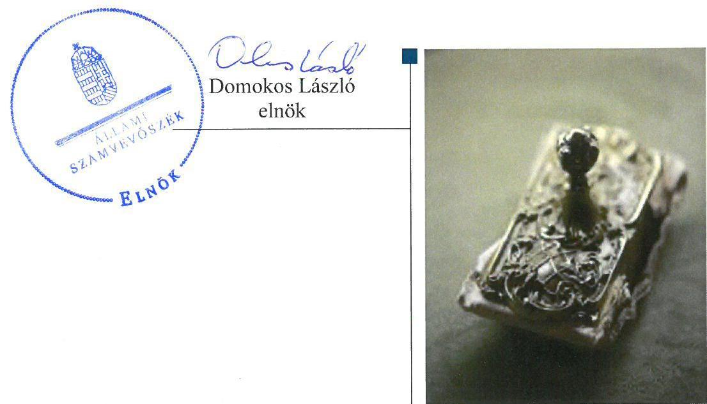
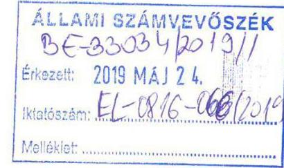
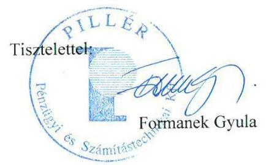
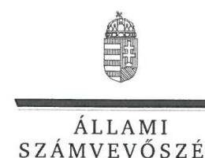
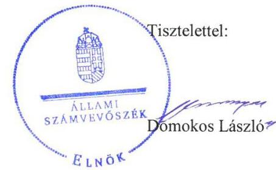
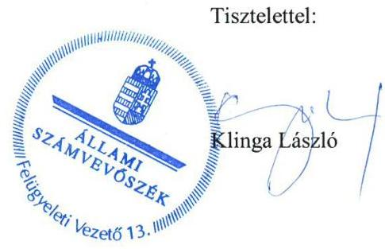

# Jelentés 

## Az állami tulajdonú gazdasági társaságok ellenőrzése

Pillér Pénzügyi és Számítástechnikai Korlátolt Felelősségű Társaság 2019.

19104
www.asz.hu

---

# Jelentés 

## Az állami tulajdonú gazdasági társaságok ellenőrzése

Pillér Pénzügyi és Számítástechnikai Korlátolt Felelősségű Társaság
2019. 07. hó 30. nap

---

# AZ ELLENŐRZÉST FELÜGYELTE:

- **KLINGA LÁSZLÓ** felügyeleti vezető
- **AZ ELLENŐRZÉST VEZETTE ÉS A VÉGREHAJTÁSÁÉRT FELELŐS:**
  - **KISTÓTH KRISZTINA** ellenőrzésvezető
  - **A PROGRAM ÖSSZEÁLLÍTÁSÁÉRT FELELŐS:**
    - **TÓTPÁL SZABOLCS** osztályvezető

**IKTATÓSZÁM:** EL-1585-001/2019

**TÉMASZÁM:** 2480

**ELLENŐRZÉS-AZONOSÍTÓ SZÁM:** V082402

Jelentéseink az Országgyűlés számítógépes hálózatán és az Interneten a www.asz.hu címen is olvashatóak.

---

# TARTALOMJEGYZÉK 

■ ÖSSZEGZÉS ..... 5
■ AZ ELLENŐRZÉS CÉLJA ..... 6
■ AZ ELLENŐRZÉS TERÜLETE ..... 7
■ AZ ELLENŐRZÉS HÁTTERE, INDOKOLTSÁGA ..... 8
■ A JELENTÉS LÉNYEGES KÉRDÉSKÖREI ..... 9
■ AZ ELLENŐRZÉS HATÓKÖRE ÉS MÓDSZEREI ..... 10
■ MEGÁLLAPÍTÁSOK ..... 12
■ JAVASLATOK ..... 14
■ MELLÉKLETEK ..... 15
I. sz. melléklet: Értelmező szótár ..... 15
■ FÜGGELÉKEK ..... 17
I. sz. függelék a jelentéshez ..... 17
II. sz. függelék: Észrevételek ..... 18
■ RÖVIDÍTÉSEK JEGYZÉKE ..... 25

---

.

---

# ÖSSZEGZÉS 

A Pillér Pénzügyi és Számítástechnikai Korlátolt Felelősségű Társaság szabályozottsága, a pénzügyi-számviteli feladatok ellátása, valamint vagyongazdálkodási tevékenysége nem volt szabályszerű, nem biztosította a vagyonnal való felelős és elszámoltatható gazdálkodást. A Társaság beszámolója nem nyújtott valós képet, nem biztosította a gazdálkodás, vagyongazdálkodás átláthatóságát.

## Az ellenőrzés társadalmi indokoltsága

Az Alaptörvény 38. cikke alapján az állam tulajdona a nemzeti vagyon része. A nemzeti vagyon megőrzésének, védelmének és a nemzeti vagyonnal való felelős gazdálkodásnak a követelményeit sarkalatos törvény határozza meg.

Az állami tulajdonú gazdasági társaságok ellenőrzése kiemelten fontos a nemzeti vagyon megőrzése, megóvása érdekében.

Az ellenőrzés rámutat az állami tulajdonú közszolgáltatást végző gazdasági társaságok gazdálkodási tevékenységével, valamint az államháztartásból származó források felhasználásával kapcsolatos jó gyakorlatokra és szabálytalanságokra. Felhívja a figyelmet a jogszabályi követelmények teljesítéséhez szükséges feltételek hiányosságaira, hozzájárul az államháztartáson kívüli, de (közvetlenül vagy közvetve) állami vagyont használó gazdálkodó szervezetek tevékenységének átláthatóságához. Az Állami Számvevőszék ellenőrzése eredményeképpen javaslataival, megállapításaival hozzájárul a közvagyonnal való gazdálkodás átláthatóságának, elszámoltathatóságának javításához.

## Főbb megállapítások, következtetések, javaslatok

A Pillér Pénzügyi és Számítástechnikai Korlátolt Felelősségű Társaság szabályozottsága nem felelt meg a jogszabályi előírásoknak. A Társaság nem határozta meg az értékcsökkenés elszámolásának módszerét, 2015. évben nem rendelkezett számlarenddel. A Társaság ügyvezetője belső adatvédelmi felelőst nem nevezett ki, adatvédelmi és adatbiztonsági szabályzatot nem készített, az adatok védelmének feltételeit nem alakította ki. A Társaság ezzel nem támogatta tevékenysége szabályszerű végzését.

A Társaság pénzügyi és számviteli elszámolása nem volt szabályszerű, mert a ráfordítások elszámolása szabályszerű volt, de a bevételek elszámolása nem volt szabályszerű.

A Társaság a 2015-2017. évi beszámolót leltárral nem támasztotta alá, leltározást nem végzett. A közzétett beszámolók nem feleltek meg a Számv. tv. ${ }^{1}$ előírásainak, ezért a Társaság gazdálkodásának, vagyongazdálkodásának az elszámoltathatóságát és átláthatóságát nem biztosította.
2017. évben egy esetben a Társaságnál a vagyon változását eredményező döntés nem felelt meg az előírásoknak, mert az ügyvezető az Alapító Okirat ellenére a meghatározott értékhatárt meghaladó értékű szerződés megkötéséhez nem kérte meg az Alapító hozzájárulását. Ezzel az ügyvezető nem biztosította a felelős vagyongazdálkodást.

Az Állami Számvevőszék a jelentésben foglalt megállapítások alapján a Pillér Pénzügyi és Számítástechnikai Korlátolt Felelősségű Társaság ügyvezetőjének öt javaslatot fogalmazott meg.

---

# AZ ELLENŐRZÉS CÉLJA 

Az ellenőrzés célja annak értékelése, hogy a gazdasági társaság szabályozottsága, gazdálkodása és vagyongazdálkodási tevékenysége megfelelt-e a jogszabályi és a tulajdonosi előírásoknak; biztosítva volt-e a közfeladatok átláthatósága és elszámoltathatósága érdekében a közszolgáltatás díjának megalapozottsága szabályszerű önköltségszámítással. A vagyonváltozást eredményező döntések esetében a gazdasági társaság szabályszerűen járt-e el.

---

# AZ ELLENŐRZÉS TERÜLETE 

## Pillér Pénzügyi és Számítástechnikai Korlátolt Felelősségű Társaság

A Pillér Pénzügyi és Számítástechnikai Korlátolt felelősségű Társaságot az APEH² hozta létre 1991. december 30-án, tevékenységének informatikai támogatására. A kizárólagos állami tulajdonban lévő Társaság ${ }^{3}$ feletti tulajdonosi jogok és kötelezettségek összességét 2012. december 28-tól a NAV ${ }^{4}$ jogosult gyakorolni.

A Társaságnál a legfőbb szerv hatáskörét az Alapító ${ }^{5}$ gyakorolta. Az Alapítói döntés meghozatalára a NAV elnöke, majd a 152/2014. (VI.6.) Kormányrendelet ${ }^{6}$ alapján 2016. március 1-től a parlamenti és adóügyekért felelős államtitkár volt jogosult. A Társaságnál három fős Felügyelő Bizottság ${ }^{7}$ működött.

A Társaság fő tevékenysége számítógépes programozás, egyéb tevékenysége számítógép üzemeltetés, saját tulajdonú, bérelt ingatlan bérbeadása, üzemeltetése, üzletviteli, egyéb vezetési tanácsadás, egyéb oktatás volt. 2016. évtől a Társaság tevékenységének és működésének átalakítására került sor. Együttműködési megállapodás alapján a Társaság 2016. augusztus 1-jével átvette a NAV-tól a központi informatikai üzemeltetési feladatokat és 105 fő munkavállalót. A Társaság értékesítés nettó árbevétele a 2015. évi 1 922,7 Mft-ról, 2016. évben 2 853,5 Mft-ra, majd 2017. évben 4 350,1 Mft-ra nőtt.

Mint állami feladatot ellátó, a Társaság a NAV által kezelt adóhatósági és vámhatósági adatok, illetve ezen adatnyilvántartások alá nem tartozó adatok nyilvántartása vonatkozásában - a NAV, mint adatkezelő döntésétől függően - az adatfeldolgozóként kijelölt szervezet volt. A 38/2011. (III. 22.) Kormányrendelet ${ }^{8}$ a Társaságot a nemzeti adatvagyon körébe tartozó állami nyilvántartások fokozottabb védelméről szóló törvény ${ }^{9}$ szerint a nemzeti adatvagyon körébe tartozó állami nyilvántartások adatfeldolgozójának jelölte ki.

A Társaság ügyvezetőjének ${ }^{10}$ személye az ellenőrzött időszakban egy alkalommal, majd azt követően további egy alkalommal változott. Az ügyvezető 2019. január 2-től tölti be tisztségét.

A Társaság a Számv. tv. alapján könyvvizsgálatra volt kötelezett.
A Társaság az ellenőrzött időszakban nem látott el közfeladatot, nem minősült kormányzati szektorba sorolt gazdálkodó szervezetnek, nem végzett vagyonkezelést, továbbá tulajdonosi részesedéssel más gazdasági társaságban nem rendelkezett.

---

# AZ ELLENŐRZÉS HÁTTERE, INDOKOLTSÁGA 

Az állami tulajdonú gazdasági társaságokra vonatkozó előírások betartásának ellenőrzése kiemelten fontos a vagyon megőrzése, megóvása érdekében. Az állami tulajdonú gazdasági társaságokkal szemben alapvető követelmény, hogy gazdálkodásuk, működésük szabályszerű, az általuk szolgáltatott adatok minél megbízhatóbbak legyenek. Gazdálkodásuk jellemzően a közérdeklődés és a média figyelmének középpontjában áll, amihez hozzájárul a gazdálkodásuk körébe tartozó - közvetlen vagy közvetett állami tulajdonú, tehát végső soron a nemzeti vagyon részét képező - vagyon nagysága, illetve az általuk ellátott közszolgáltatások/közfeladatok minősége és hatékonysága. A rendszeres elszámoltatás feltételeinek kialakítása az ellenőrzése során nagy hangsúlyt kap.

---

# A JELENTÉS LÉNYEGES KÉRDÉSKÖREI 

1. A társaság működésének szabályozottsága megfelelt-e az előírásoknak?
2. A társaságnál a pénzügyi-számviteli, adatszolgáltatási és vagyongazdálkodási feladatok ellátása szabályszerű volt-e?

---

# AZ ELLENŐRZÉS HATÓKÖRE ÉS MÓDSZEREI 

## Az ellenőrzés típusa

Megfelelőségi ellenőrzés

## Az ellenőrzött időszak

Az ellenőrzött időszak 2015-2017. évek, valamint a 2017. évi beszámoló jóváhagyása és közzététele tekintetében a 2018. június elsejéig tartó időszak.

## Az ellenőrzés tárgya

Állami tulajdonban lévő gazdasági társaság gazdálkodása, kiemelten vagyongazdálkodási tevékenysége.

## Az ellenőrzött szervezet

Pillér Pénzügyi és Számítástechnikai Korlátolt Felelősségű Társaság

## Az ellenőrzés jogalapja

Az ellenőrzés jogalapját az ÁSZ tv. ${ }^{11}$ 1. § (3) bekezdése és 5. § (3)-(5) bekezdése képezte.

## Az ellenőrzés módszerei

Az ellenőrzést a nemzetközi standardokat irányadónak tekintve az ellenőrzési program ellenőrzési kérdései, az ellenőrzött időszakban hatályos jogszabályok, az ellenőrzés szakmai szabályok és módszertanok figyelembe vételével végezte az ÁSZ ${ }^{12}$.

Az ellenőrzés ideje alatt az ellenőrzött szervezettel történő kapcsolattartást az ÁSZ Szervezeti és Működési Szabályzatának vonatkozó előírásai alapján biztosította az ÁSZ.

Az ellenőrzési kérdések megválaszolásához szükséges bizonyítékok megszerzése a következő ellenőrzési eljárások alkalmazásával történt: megfigyelés, kérdésfeltevés (információkérés), összehasonlítás, valamint elemző eljárás. Az ellenőrzési bizonyítékként felhasználható adatforrások közé tartoztak egyrészt az ellenőrzési programban felsorolt adatforrások,

---

másrészt adatforrás lehetett még minden - az ellenőrzés folyamán - feltárt, az ellenőrzés szempontjából információkat tartalmazó dokumentum.

Az ellenőrzést a kérdésekre adott válaszok kiértékelésével, valamint a megjelölt adatforrások, a csatolt tanúsítványok felhasználásával, továbbá az adott időszakban hatályos jogszabályok figyelembe vételével kellett lefolytatni.

Az állami tulajdonú gazdasági társaság feladatellátása az adott területen „szabályszerű"/"jogszabályi előírásoknak megfelelő", amennyiben az értékelt területen az „igen" válaszok százalékban kifejezett, egy tizedes számra kerekített aránya, meghaladta a 90%-ot. Amennyiben ez az arány nem haladta meg a 90%-ot az értékelés „nem szabályszerű"/"jogszabályi előírásoknak nem megfelelő".

A bevételek és a ráfordítások elszámolásának szabályszerűsége, valamint az értékcsökkenési leírás és a vagyonnyilvántartás szabályszerűsége esetében az ellenőrzés azokra a legnagyobb értékű tételekre - a lényeges sokaságra - terjedt ki, melyek összértéke eléri a teljes sokaság összértékének 50%-át. A lényeges sokaságot tételesen ellenőriztük 2015 és 2017 vonatkozásában.

A személyi jellegű kifizetések esetében a vezető tisztségviselők részére teljesített kifizetések tételes ellenőrzésére került sor.

---

# 1. A társaság működésének szabályozottsága megfelelt-e az előírásoknak? 

Összegző megállapítás

## A Társaság működésének szabályozottsága nem volt szabályszerű.

ALAPÍTÓ OKIRAT ${ }_{1-4}{ }^{13}$ tal és SZMSZ ${ }_{1-4}{ }^{14}$-el rendelkezett a Társaság.
A SZÁMVITELI POLITIKÁT ${ }_{1-2}{ }^{15}$ kialakította a Társaság. Továbbá a Számv. tv. előírásai szerint a számviteli politika keretében elkészítette a Leltárkészítési és leltározási szabályzatot ${ }^{16}$, az Eszközök és források értékelésének szabályzatát ${ }^{17}$, a Pénzkezelési szabályzatot ${ }_{1-2}{ }^{18}$ és az Önköltségszámítási szabályzatot ${ }_{1-2}{ }^{19}$-ot. A Társaság kiadta a Bizonylati szabályzatát ${ }_{1-2}{ }^{20}$ és Selejtezési szabályzatát ${ }^{21}$.

A Számviteli politika ${ }_{1-3}$ keretében a Számv. tv. 14. § (4) bekezdés előírásai ellenére a Társaság nem határozta meg az évenként elszámolandó értékcsökkenés elszámolásának módszerét, a Számv. tv. 52. § (2) bekezdésben biztosított választási lehetőségek közötti választását nem rögzítette.

A Társaság 2015. évben a Számv. tv. 161. § (1) bekezdés ellenére nem rendelkezett számlarenddel, Számlarendje ${ }^{22}$ 2016. január 1-től hatályos.

AZ ADATVÉDELEM feltételeit a Társaság nem alakította ki. Az ügyvezető a Társaság szervezetén belül az Info tv. ${ }^{23}$ 24. § (1) bekezdés a) pont előírásai ellenére belső adatvédelmi felelőst nem nevezett ki. Az ügyvezető nem gondoskodott az Info tv. 24. § (3) bekezdés előírásai ellenére az adatvédelmi és adatbiztonsági szabályzat elkészítéséről.

## A BESZERZÉSI ÉS KÖZBESZERZÉSI SZABÁLY-

ZATTAL ${ }_{1-4}{ }^{24}$ a Társaság rendelkezett. A szabályzat 2017. január 16-ig történő, az alapítói jóváhagyást igénylő szerződések értékhatárát jelentősen csökkentő módosítását írta elő az Alapító a Társaság részére. A Társaság ügyvezetője a módosított Beszerzési és közbeszerzési szabályzatot ${ }^{25}$, az előírt határidőn túl - 2017. május 1-ével - léptette hatályba.

A JAVADALMAZÁSI SZABÁLYZATOT ${ }^{26}$ a Taktv. ${ }^{27}$ szerinti tartalommal az Alapító megalkotta.

---

# 2. A társaságnál a pénzügyi-számviteli, adatszolgáltatási és vagyongazdálkodási feladatok ellátása szabályszerű volt-e? 

Összegző megállapítás

A Társaságnál a pénzügyi-számviteli, adatszolgáltatási és vagyongazdálkodási feladatok ellátása nem volt szabályszerű.

A BEVÉTELEK elszámolása nem volt szabályszerű, mert a könyvviteli elszámolást közvetlenül alátámasztó bizonylatok a Számv. tv. 167. § (1) bekezdés h) pontban előírtak ellenére nem tartalmazták a könyvelés módjára, az érintett könyvviteli számlákra történő hivatkozást.

A RÁFORDÍTÁSOK elszámolása 2015. és 2017. évben szabályszerű volt.

LELTÁRT a 2015-2017. évre vonatkozóan a Társaság a Számv. tv. 69. § (1) bekezdés előírásai ellenére a beszámoló mérleg tételeinek
 alátámasztásához nem állított össze, továbbá a Számv. tv. 69. § (3) bekezdés ellenére leltározást nem végzett.

## ADATSZOLGÁLTATÁSI ÉS KÖZZÉTÉTELI KÖTELE-

ZETTSÉGÉNEK a Társaság úgy tett eleget a 2015-2017. évi beszámoló vonatkozásában, hogy a beszámoló nem felelt meg a Számv. tv. 20. § (1), valamint a 69. § (1) bekezdés előírásainak. A leltár hiánya ellenére a könyvvizsgáló 2015-2017. években hitelesítő záradékkal látta el az éves beszámolót.

A TERVEZÉSI kötelezettségét a Társaság szabályszerűen teljesítette. A Társaság az SZMSZ ${ }_{1-2}$ előírásai szerint 2015-2017. évekre üzleti tervet ${ }^{28}$ készített, amelyeket a Felügyelő Bizottság előzetesen véleményezett. Az üzleti tervek tartalmazták az azt megalapozó stratégiai és fejlesztési tervek összefoglalását. A Társaság 2015-2016. évi üzleti terveit az Alapító határozattal jóváhagyta, de a 2017. évi üzleti terv az Alapító által nem került jóváhagyásra. A Felügyelő Bizottság megállapította, hogy a 2017. évi üzleti terv nem tartalmazta az átszervezési folyamat előkészítés alatt lévő további döntéseinek hatásait.

A kötelezően közzéteendő közérdekű adatokat a Társaság a Taktv. előírásai szerint közzétette.

A VAGYONGAZDÁLKODÁSSAL kapcsolatos feladat- és hatásköröket, felelősségi viszonyokat az Alapító okirattal összhangban a társasági SZMSZ ${ }_{1-4}$-ben meghatározták.

A Társaságnál a saját vagyon változását eredményező döntés 2017. évben egy esetben nem felelt meg az előírásoknak. 2017. évben az Integrált Vállalatirányítási Rendszer beszerzésénél a Társaság ügyvezetője nem az Alapító Okirat ${ }_{2} 10$. pontjában és a Társasági SZMSZ ${ }_{1}$ 6. h) pontjában rögzített előírások szerint járt el, a 10 millió forintot meghaladó értékű szerződés megkötéséhez nem kérte meg az Alapító hozzájárulását.

---

# JAVASLATOK 

Az ÁSZ tv. 33. § (1) bekezdésében foglaltak értelmében az ellenőrzött szervezet vezetője köteles a jelentésben foglalt megállapításokhoz kapcsolódó intézkedési tervet összeállítani és azt a jelentés kézhezvételétől számított 30 napon belül az ÁSZ részére megküldeni. Amennyiben az ellenőrzött szervezet vezetője nem küldi meg határidőben az intézkedési tervet, vagy továbbra sem elfogadható intézkedési tervet küld, az Állami Számvevőszék elnöke az ÁSZ tv. 33. § (3) bekezdése a) és b) pontjaiban foglaltakat érvényesítheti.

## Pillér Pénzügyi és Számítástechnikai Korlátolt Felelősségű Társaság ügyvezetőjének

1. Intézkedjen a Számv. tv. előírásainak megfelelően az értékcsökkenés elszámolás módszerének számviteli politika keretében történő meghatározásáról.
(1. sz. megállapítás 3. bekezdés 1. tagmondata alapján)
2. Intézkedjen az Info tv. hatályos előírásának megfelelően adatvédelmi tisztviselő alkalmazásáról.
(1. sz. megállapítás 5. bekezdés 2. mondata alapján)
3. Intézkedjen, hogy a bevételek könyvviteli elszámolását közvetlenül alátámasztó bizonylatok a Számv. tv.-ben előírtaknak megfelelően tartalmazzák a könyvelés módjára, az érintett könyvviteli számlákra történő hivatkozást.
(1. sz. megállapítás 1. bekezdés 2. tagmondata alapján)
4. Gondoskodjon a Számv. tv. előírásai szerint a beszámoló mérlegtételeinek leltárral való alátámasztásáról.
(2. sz. megállapítás 3. bekezdés 1. tagmondata alapján)
5. Gondoskodjon arról, hogy az értékhatárt meghaladó szerződéseket az Alapító hozzájárulásával kösse meg.
(2. sz. megállapítás 8. bekezdés 2. mondata alapján)

---

# MELLÉKLETEK 

- I. SZ. MELLÉKLET: ÉRTELMEZŐ SZÓTÁR
állami vagyon
gazdasági társaság
kormányzati szektorba sorolt egyéb szervezet
a) Az állam tulajdonában lévő dolog, valamint a dolog módjára hasznosítható természeti erő,
b) az a) pont hatálya alá nem tartozó mindazon vagyon, amely vonatkozásában törvény az állam kizárólagos tulajdonjogát nevesíti,
c) az állam tulajdonában lévő tagsági jogviszonyt megtestesítő értékpapír, illetve az államot megillető egyéb társasági részesedés,
d) az államot megillető olyan immateriális, vagyoni értékkel rendelkező jogosultság, amelyet jogszabály vagyoni értékű jogként nevesít.
e) az állam tulajdonában lévő pénzügyi eszközök
Forrás: Vtv. ${ }^{29}$ 1. § (2) bekezdése
A gazdasági társaságok üzletszerű közös gazdasági tevékenység folytatására, a tagok vagyoni hozzájárulásával létrehozott, jogi személyiséggel rendelkező vállalkozások, amelyekben a tagok a nyereségből közösen részesednek, és a veszteséget közösen viselik.
Forrás: Ptk. ${ }^{30}$ 3:88. § (1) bekezdése
Az a szervezet, amely az Áht. ${ }^{31}$ alapján nem része az államháztartásnak, azonban az Európai Közösséget létrehozó szerződéshez csatolt, a túlzott hiány esetén követendő eljárásról szóló jegyzőkönyv alkalmazásáról szóló 2009. május 25-i 479/2009/EK rendelet szerint a kormányzati szektorba tartozik.

---

.

---

# FÜGGELÉKEK 

- I. SZ. FÜGGELÉK A JELENTÉSHEZ

Az Állami Számvevőszék az ellenőrzések során feltárt tényekhez kapcsolódó további körülmények tisztázására eszközrendszerrel nem rendelkezik. Amennyiben az ellenőrzésen túlmutatóan indokoltnak látszik az ellenőrzés során feltárt körülmények további vizsgálata, az Állami Számvevőszék törvényi felhatalmazás alapján az ellenőrzés által feltárt körülményeket továbbítja a hatáskörrel rendelkező szervnek a szükséges intézkedések megtétele, eljárások lefolytatása érdekében.
A Pillér Pénzügyi és Számítástechnikai Korlátolt Felelősségű Társaság a mérleg fordulónapján meglévő eszközeit és forrásait a Számv. tv. 69. § (1) bekezdésében foglaltak ellenére a 2015-2017. évi beszámolókhoz nem támasztotta alá leltárral, amely tételesen, ellenőrizhető módon tartalmazza az eszközöket és forrásokat mennyiségben és értékben. A Társaság továbbá a Számv. tv. 69. § (3) bekezdés előírása ellenére mennyiségi felvétellel leltározást nem végzett. A Társaság mérlegfőösszege 2015. december 31-én 2214 millió forint, 2016. december 31-én 2835 millió forint és 2017. december 31-én 3394 millió forint volt.

A leltári alátámasztottság hiányában a Társaság 2015-2017. évi beszámolóiban a Számv. tv. 15. § (3) bekezdésben foglalt előírások ellenére nem érvényesült a valódiság elve és nem igazolt, hogy a Társaság beszámolói valós összképet mutatnak. Az eset konkrét körülményeinek felderítésére a Nemzeti Adó- és Vámhivatal rendelkezik hatáskörrel.

---

A jelentéstervezetet a Számvevőszék 15 napos észrevételezésre megküldte az ellenőrzött szervezet vezetőjének az ÁSZ tv. 29. §* (1) bekezdése előírásának megfelelően.

A Pillér Pénzügyi és Számítástechnikai Korlátolt Felelősségű Társaság ügyvezetőjének észrevételeit és az azokra adott válaszokat a függelék tartalmazza.

[^0]
[^0]:    * 29. § (1) Az Állami Számvevőszék az ellenőrzési megállapításait megküldi az ellenőrzött szervezet vezetőjének vagy az általa megbízott személynek, és annak, akinek személyes felelősségét állapította meg.
    (2) Az ellenőrzött szervezet vezetője és a felelősként megjelölt személy az ellenőrzés megállapításaira tizenöt napon belül írásban észrevételt tehet.
    (3) Az Állami Számvevőszék az észrevételre a beérkezésétől számított harminc napon belül írásban válaszol. A figyelembe nem vett észrevételeket köteles a jelentésben feltüntetni, és megindokolni, hogy azokat miért nem fogadta el.

---

# Domokos László 

elnök

## Állami Számvevőszék

1052 Budapest,
Apáczai Csere János utca 10.

Tárgy: EL-0816-062/2019. iktatószámú jelentéstervezet

Ikt.sz: $1 / 0775 / 2 / 2019$

## Tisztelt Elnök Úr!

Köszönettel megkaptam a 2019.05.10-én kelt EL-0816-062/2019. iktatószámú levelét, amellyel kapcsolatosan a megállapításokban foglaltak szerint az alábbi észrevételeket teszem.

1. A Társaság működésének szabályozottsága megfelelt-e az előírásoknak?

- A Megállapításban rögzítettekkel ellentétben, miszerint: „A szabályzat 2017. január 16-ig történő, az Alapítói jóváhagyást igénylő szerződések értékhatárát jelentősen csökkentő módosítását írta elő" helyett a 2017. január 5-én kelt Alapítói Határozatban Beszerzési és Közbeszerzési szabályzat alapítói jóváhagyást igénylő szerződések értékhatárának csökkentését tartalmazó módosításának Alapítói elfogadásra történő előterjesztésének a határidejére 2017. január 16-át jelölte ki a tulajdonosi joggyakorló. Az egyeztetéseket követően a módosított szabályzat a jelentéstervezetben szereplő 2017. május 1. helyett, a 4/2017. sz. Ügyvezetői Utasítással 2017. március 10-én került kiadásra.

2. A Társaságnál a pénzügyi-számviteli, adatszolgáltatási és vagyongazdálkodási feladatok ellátása szabályszerű volt-e?

- A bevételek elszámolása a Társaságnál szabályszerű volt, a bevételek könyvviteli elszámolását alátámasztó bizonylatok a Számv. tv.-ben előírtaknak megfelelően tartalmazzák a könyvelés módjára, az érintett könyvviteli számlákra történő hivatkozást. Mivel az ÁSZ számára feltöltött Pillér Kft. által kiállított számlák 4/4 példányát tartalmazta, ezek a példányok kerültek a szerződések analitikus nyilvántartásának alátámasztására lefűzésre az aláírt teljesítési igazolással és a kapcsolódó dokumentumokkal együtt. A könyvelés példányát képező 3/4 példányszámú számlák tartalmazzák a főkönyvi számokat és a rögzítéskor a program által adott könyvelési bizonylat számot is. Tekintettel, hogy az ÁSZ adatbekérés során a számlázás alapját képező háttérdokumentációk meglétének alátámasztására helyeztük a hangsúlyt, a könyvelés példányát nem szkenneltük be és nem töltöttük fel.

---

- A leltár előállítása minden évben megtörtént. A leltározási utasításokat és a kiértékelő dokumentumot szkenneltük és a vizsgálat adatbekérése során feltöltöttük. A tárgyi eszközök leltározásán túl a mérlegtételek egyezőségét alátámasztó egyeztetett analitika minden évben minden mérlegsorhoz rendelkezésre áll, és alapját képezi a mérlegnek és a könyvvizsgálói jelentésnek is.
- A közzétett beszámoló megfelelt a Számviteli törvény 20. § (1) bekezdésben foglalt, illetve a 69. § (1) bekezdésben foglalt előírásainak, tekintettel arra, hogy a mérleg és az eredménykimutatás sorai a hivatkozott törvényi előírás szerint készültek, és a sorokat alátámasztó leltár, illetve egyeztetett analitika minden beszámolóhoz rendelkezésre áll. A könyvvizsgáló a vonatkozó standardok alapján végzi a tevékenységét. Vizsgálatának alapja a mérleg sorainak alátámasztását igazoló egyeztetett analitika megléte.
- A jelentésben kifogásolt esetben is a vagyongazdálkodással kapcsolatosan a vagyon változást eredményező döntés meghozatala megalapozott volt, tekintettel arra, hogy a 2017-ben elindított Integrált Vállalatirányítási Rendszer beszerzését a tulajdonosi joggyakorló 2016. december 6-án Alapítói jóváhagyás keretén belül engedélyezte.

A jelentéstervezetre tett jelen észrevételben foglaltak alátámasztó dokumentumai a Pillér Kft-nél kigyűjtve rendelkezésre állnak. Tekintettel a nyilvánosságra nem képezik mellékletét jelen levelemnek, de bármikor megtekinthetők, illetve - hozzáférés biztosítása esetén - feltölthetők az Elektronikus Adatszolgáltatási Rendszerbe.

Fentiekben leírtak értelmében nem értek egyet az összegző megállapításban foglaltakkal, és az ön által megfogalmazott javaslatok közül az értékcsökkenés elszámolási módjának szabályzatban történő rögzítéséről szóló 1. javaslatot és az adatvédelmi tisztviselő alkalmazásáról szóló 2. javaslatot tartom elfogadhatónak.

Budapest, 2019. május 22.

---

ELNÖK

Ikt.szám: EL-0816-067/2019

# Formanek Gyula úr 

ügyvezető
Pillér Pénzügyi és Számítástechnikai Korlátolt Felelősségű Társaság

## Budapest

## Tisztelt Ügyvezető Úr!

„Az állami tulajdonú gazdasági társaságok ellenőrzése - Pillér Pénzügyi és Számítástechnikai Korlátolt Felelősségű Társaság" címmel készített számvevőszéki jelentéstervezetre tett észrevételeit tartalmazó, P/0775/2/2019. számú levelét köszönettel megkaptam.
Az Állami Számvevőszék észrevételekre vonatkozó álláspontjáról a felügyeleti vezető által készített részletes tájékoztatást csatoltan megküldöm.
Tájékoztatom Ügyvezető urat, hogy a számvevőszéki jelentésben - az Állami Számvevőszékről szóló 2011. évi LXVI. törvény 29. § (3) bekezdése alapján - a figyelembe nem vett észrevételeket szerepeltetjük annak indoklásával, hogy azokat az Állami Számvevőszék miért nem fogadta el.

Budapest, 2019. 06 hó 12 nap

Melléklet: Tájékoztatás az észrevételek kezeléséről

---

# Tájékoztatás az észrevételek kezeléséről 

„Az állami tulajdonú gazdasági társaságok ellenőrzése - Pillér Pénzügyi és Számítástechnikai Korlátolt Felelősségű Társaság " című jelentéstervezetre 2019. május 22-én kelt, P/0775/2/2019. iktatószámú levelében tett észrevételeit áttekintettük, annak kezelésével kapcsolatban a következő tájékoztatást adom:

## 1. A jelentéstervezet 1. számú megállapítás 6. bekezdésére vonatkozó észrevétel: (A Társaság működésének szabályozottsága megfelelt-e az előírásoknak?)

Ügyvezető úr észrevételében arról adott tájékoztatást, hogy a módosított Beszerzési és Közbeszerzési szabályzat 2017. május 1. helyett, a 4/2017. sz. Ügyvezetői Utasítással 2017. március 10-én került kiadásra. Ugyanakkor az adatszolgáltatás során Ügyvezető Úr a hivatkozott 4/2017. sz. Ügyvezetői Utasítást az ÁSZ adatbekérési felületére nem töltötte fel és papír alapon sem küldte meg. Megállapításunk a megküldött 5/2017. (IV.28.) számú Ügyvezetői Utasításon alapul, mely alapján a Pillér Kft. Beszerzési és Közbeszerzési szabályzatának hatályba lépése 2017. május 1. Az ellenőrzés

 a rendelkezésre bocsátott dokumentumok alapján teszi meg megállapításait, ezért észrevételét nem fogadom el, a jelentéstervezet módosítása nem indokolt.
2. A jelentéstervezet 2. számú megállapítás 1. bekezdésére vonatkozó észrevétel: ( $A$ Társaságnál a pénzügyi-számviteli, adatszolgáltatási és vagyongazdálkodási feladatok ellátása szabályszerű volt-e?)
Ügyvezető úr észrevételében jelezte, hogy a bevételek elszámolása a Társaságnál szabályszerű volt, a bevételek könyvviteli elszámolását alátámasztó bizonylatok a Számv. tv.-ben előírtaknak megfelelően tartalmazzák a könyvelés módjára, az érintett könyvviteli számlákra történő hivatkozást. Ugyanakkor elismeri, hogy az adatszolgáltatás során az Állami Számvevőszék részére a könyvviteli elszámolást közvetlenül alátámasztó bizonylatokat a megállapításban szereplő hiányosságokkal küldték meg. Az ÁSZ az ellenőrzését a megküldött ellenőrzési programnak megfelelően, a rendelkezésére bocsátott adatok, dokumentumok alapján végzi, ezért észrevételét nem fogadom el, a jelentéstervezet módosítása nem indokolt.

---

# 3. A jelentéstervezet 2. számú megállapítás 3. és a 4. bekezdésére vonatkozó észrevétel: 

Ügyvezető úr észrevételében jelezte, hogy „A leltár előállítása minden évben megtörtént.", ugyanakkor az ezt alátámasztó dokumentumokat nem szolgáltatta az Állami Számvevőszék részére. Az EL-0816-009/2018. iktatószámú adatbekérő levelünk 2. számú melléklet 22/2. pontjában kértük az éves beszámolót alátámasztó leltárak, mérlegsorokat alátámasztó leltárösszesítőket, azonban a kért dokumentumokat sem az ÁSZ adatbekérési felületére nem töltötte fel sem papír alapon nem küldte meg, a hiányzó dokumentumokat a bekért adatokra vonatkozó teljességi és hitelességi nyilatkozat nem tartalmazta. Fentiekre tekintettel az észrevételét nem fogadom el, a jelentéstervezet módosítása nem indokolt.

## 4. A jelentéstervezet 2. számú megállapítás 8. bekezdésére vonatkozó észrevétel:

Ügyvezető úr a vagyongazdálkodással kapcsolatos észrevételében jelezte, hogy a vagyon változást eredményező döntés meghozatala megalapozott volt, tekintettel arra, hogy a 2017-ben elindított Integrált Vállalatirányítási Rendszer beszerzését a tulajdonosi joggyakorló 2016. december 6-án Alapítói jóváhagyás keretén belül engedélyezte. Ügyvezető úr azonban az Alapítói jóváhagyást nem bocsátotta az ÁSZ rendelkezésére, az ÁSZ adatbekérési felületére nem töltötte fel és papír alapon sem küldte meg, így a jelentéstervezet módosítása nem indokolt.

A fentiekre tekintettel a jelentéstervezet javaslatainak módosítása sem indokolt.

Budapest, 2019. OG. 12 .

---

.

---

# RÖVIDÍTÉSEK JEGYZÉKE 

${ }^{1}$ Számv. tv.
${ }^{2}$ APEH
${ }^{3}$ Társaság
${ }^{4}$ NAV
${ }^{5}$ Alapító
${ }^{6}$ 152/2014. (VI. 6.) Kormányrendelet
${ }^{7}$ Felügyelő Bizottság
${ }^{8}$ 38/2011. (III. 22.) Kormányrendelet
${ }^{9}$ a nemzeti adatvagyon körébe tartozó állami nyilvántartások fokozottabb védelméről szóló törvény
${ }^{10}$ ügyvezető
${ }^{11}$ ÁSZ tv.
${ }^{12}$ ÁSZ
${ }^{13}$ Alapító okirat ${ }_{1-4}$
${ }^{14}$ társasági SZMSZ ${ }_{1-4}$
${ }^{15}$ Számviteli Politika ${ }_{1-2}$
${ }^{16}$ Leltárkészítési és leltározási szabályzat
${ }^{17}$ Eszközök és források értékelésének szabályzata
2000. évi C. törvény a számvitelről, hatályos 2001. január 1-től

Adó- és Pénzügyi Ellenőrzési Hivatal, 2011. január 1-től Nemzeti Adó- és Vámhivatal
Pillér Pénzügyi és Számítástechnikai Korlátolt Felelősségű Társaság
Nemzeti Adó- és Vámhivatal
Nemzeti Adó- és Vámhivatal
152/2014. (VI. 6.) Korm. rendelet a Kormány tagjainak feladat- és hatásköréről
Pillér Pénzügyi és Számítástechnikai Korlátolt Felelősségű Társaság Felügyelő Bizottsága
38/2011. (III. 22.) Korm. rendelet - a nemzeti adatvagyon körébe tartozó állami nyilvántartások adatfeldolgozásának biztosításáról
2010. évi CLVII. törvény - a nemzeti adatvagyon körébe tartozó állami nyilvántartások fokozottabb védelméről
Pillér Pénzügyi és Számítástechnikai Korlátolt Felelősségű Társaság ügyvezetője 2011. évi LXVI. törvény az Állami Számvevőszékről, hatályos 2011. július 1-étől Állami Számvevőszék
Pillér Pénzügyi és Számítástechnikai Korlátolt Felelősségű Társaság Alapító Okirat, hatályos 2014. március 1-től,
Pillér Pénzügyi és Számítástechnikai Korlátolt Felelősségű Társaság Alapító Okirata, hatályos 2016. március 1-től,
Pillér Pénzügyi és Számítástechnikai Korlátolt Felelősségű Társaság Alapító Okirata, hatályos 2017. október 31-től,
Pillér Pénzügyi és Számítástechnikai Korlátolt Felelősségű Társaság Alapító Okirata, hatályos 2017. december 18-tól
1/2014. (02.01.) sz. Ügyvezetői Utasítás a Pillér Kft. Szervezeti és Működési Szabályzatáról, hatályos 2014. február 1-től,
6/2017. (04.14.) sz. Ügyvezetői Utasítás a Pillér Kft. Szervezeti és Működési Szabályzatáról, hatályos 2017. április 14-től,
9/2017. (09.28.) sz. Ügyvezetői Utasítás a Pillér Kft. Szervezeti és Működési Szabályzatáról, hatályos 2017. szeptember 28-tól,
11/2017. (10.26) sz. Ügyvezetői Utasítás a Pillér Kft. Szervezeti és Működési Szabályzatáról, hatályos 2017. október 26-tól
Pillér Kft. Számviteli Politika A számvitel rendjének általános szabályzata, hatályos 2013. január 1-től; módosítva 2013. április 2.
Pillér Pénzügyi és Számítástechnikai Kft. Számviteli Politika, hatályos 2016. január 1-től
Pillér Kft. Számviteli Politika Eszközök és források leltárkészítési és leltározási szabályzata, hatályos 2013. szeptember 01-től

Pillér Pénzügyi és Számítástechnikai Kft. Az eszközök és források értékelésének szabályzata, hatályos 2001. január 1-től

---

${ }^{18}$ Pénzkezelési szabályzat ${ }_{1-2}$
${ }^{19}$ Önköltségszámítási szabályzat ${ }_{1-2}$
${ }^{20}$ Bizonylati Szabályzat ${ }_{1-2}$
${ }^{21}$ Selejtezési szabályzat
${ }^{22}$ Számlarend
${ }^{23}$ Info tv.
${ }^{24}$ Beszerzési és közbeszerzési szabályzat ${ }_{1-4}$
${ }^{25}$ Beszerzési és közbeszerzési szabályzat ${ }_{5}$
${ }^{25}$ Beszerzési és közbeszerzési szabályzat ${ }_{5}$
${ }^{26}$ Javadalmazási szabályzat
${ }^{27}$ Taktv.
${ }^{28}$ üzleti terv
${ }^{29}$ Vtv.
${ }^{30}$ Ptk.
${ }^{31}$ Áht.

Pillér Kft. Számviteli Politika Pénzkezelési szabályzat, hatályos 2013. augusztus 31-től,
8/2017. (VIII.21.) sz. Ügyvezetői Utasítás a Pillér Kft. Számviteli Politika Pénzkezelési szabályzatáról, hatályos 2017. augusztus 21-től
A Pillér Kft. Önköltségszámítási szabályzata, hatályos 2014. január 1-től, módosítva 3/2014. (IX.5.) sz. Ügyvezetői Utasítás a Pillér Kft. Önköltségszámítási szabályzatáról, 1/2015. (I.6.) sz. Ügyvezetői Utasítás a Pillér Kft. Önköltségszámítási szabályzatáról, 9/2015. (XI.11.) sz. Ügyvezetői Utasítás a Pillér Kft. Önköltségszámítási szabályzatáról 2015. november 11.
12/2017. (XI.21.) sz. Ügyvezetői Utasítás a Pillér Kft. Önköltségszámítási szabályzatáról, hatályos 2017. november 21-től
Pillér Pénzügyi és Számítástechnikai Kft. Bizonylati Szabályzat, hatályos 2001. január 1-től;
3/2016. (II.29.) sz. Ügyvezetői Utasítás a Pillér Kft. Bizonylati szabályzatáról, hatályos 2016. január 1-től
Pillér Kft. Selejtezési szabályzat, hatályos 2010. január 1-től
11/2015. (XII.21) sz. Ügyvezetői utasítás a Pillér Kft. számlarendjéről, hatályos 2016. január 1-től
2011. évi CXII. törvény - az információs önrendelkezési jogról és az információszabadságról
7/2014. (V.05.) sz. Ügyvezetői Utasítás a Pillér Kft. módosított Beszerzési és Közbeszerzési szabályzatáról, hatályos 2014. május 5-től
7/2015. (VII.07.) sz. Ügyvezetői Utasítás a Pillér Kft. módosított Beszerzési és Közbeszerzési szabályzatáról, hatályos 2015. július 7-től
8/2015. (X.22.) sz. Ügyvezetői Utasítás a Pillér Kft. módosított Beszerzési és Közbeszerzési szabályzatáról, hatályos 2015. október 22-től
4/2016. (III.08.) sz. Ügyvezetői Utasítás a Pillér Kft. módosított Beszerzési és közbeszerzési szabályzatáról, hatályos 2016. március 8 -tól
5/2017. (IV.28.) sz. Ügyvezetői Utasítás a Pillér Kft. módosított Beszerzési és közbeszerzési szabályzatáról, hatályos 2017. május 1-től
89/2010. (I. 27.) számú Alapítói Határozat Javadalmazási szabályzat a Pillér Pénzügyi és Számítástechnikai Kft. MT. 188. § (1) bekezdése és 188/A. § (1) bekezdés hatálya alá tartozó munkavállalóira, tisztségviselőire és könyvvizsgálóira vonatkozó javadalmazási rendszerről, hatályos 2010. január 27-től
2009. évi CXXII. törvény a köztulajdonban álló gazdasági társaságok takarékosabb működéséről
Pillér Pénzügyi és Számítástechnikai Kft. 2015. évi Üzleti terv, 2016. évi Üzleti terv, 2017. évi Üzleti terv (Mérleg és eredménykimutatás adatok)
2007. évi CVI. törvény az állami vagyonról
2013. évi V. törvény - a Polgári Törvénykönyvről, hatályos 2014. III. 15-től
2011. CXCV. évi törvény az államháztartásról

---

ÁLLAMI SZÁMVEVŐSZÉK
1052 Budapest, Apáczai Csere János utca 10.
Levélcím: 1364 Budapest 4. Pf. 54
Telefon: +36 14849100 Telefax: +36 14849200
www.asz.hu
